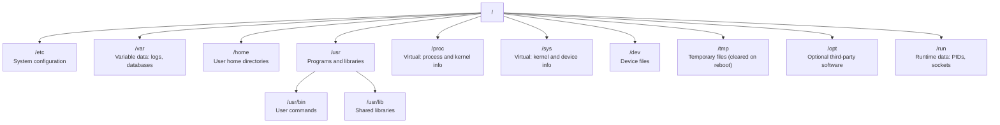
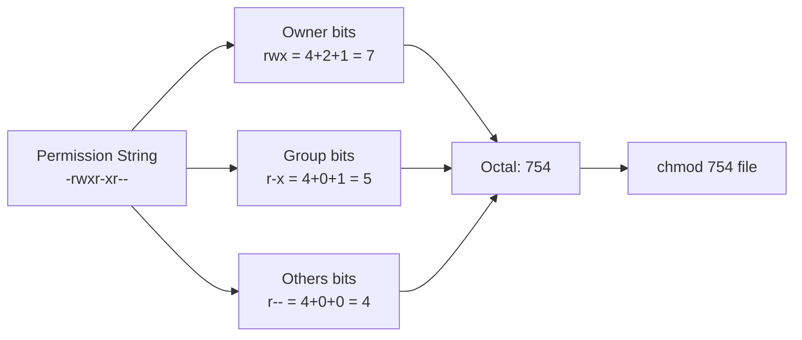
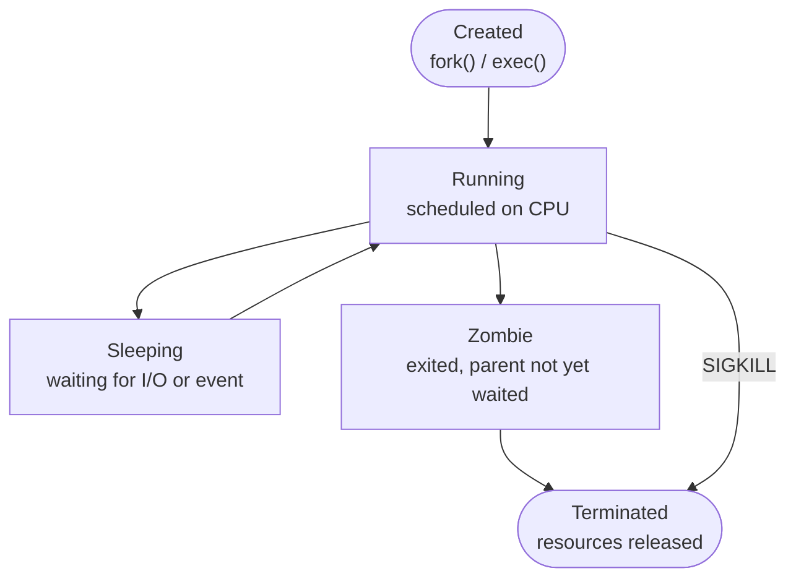
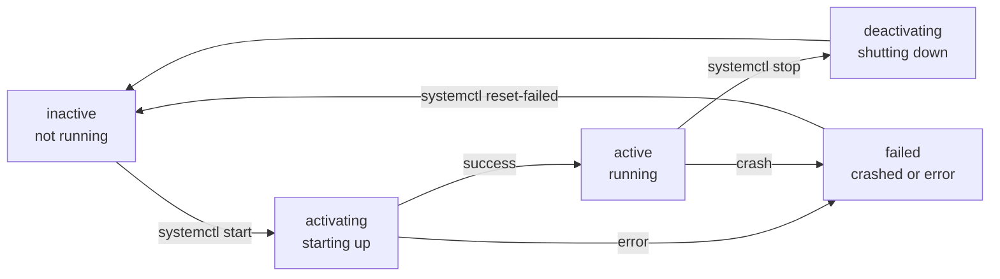
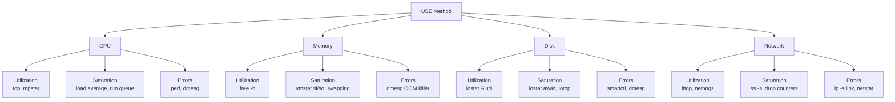

# Module 01: Linux Fundamentals

> Part of the [DevOps Career Course](./README.md) by UncleJS

[](https://creativecommons.org/licenses/by-nc-sa/4.0/)     

---

## Table of Contents

- [Overview](#overview)
- [Learning Objectives](#learning-objectives)
- [Beginner: Navigation & File Management](#beginner-navigation--file-management)
- [Beginner: File Operations](#beginner-file-operations)
- [Beginner: File Permissions](#beginner-file-permissions)
- [Beginner: Text Editors](#beginner-text-editors)
- [Beginner: Piping & Redirection](#beginner-piping--redirection)
- [Beginner: System & Process Management](#beginner-system--process-management)
- [Beginner: SSH & Remote Access](#beginner-ssh--remote-access)
- [Beginner: Command History & Shortcuts](#beginner-command-history--shortcuts)
- [Beginner: Root Access & User Management](#beginner-root-access--user-management)
- [Beginner: Network Commands](#beginner-network-commands)
- [Beginner: System Information](#beginner-system-information)
- [Intermediate: Chaining Commands](#intermediate-chaining-commands)
- [Intermediate: Package Management](#intermediate-package-management)
- [Intermediate: Systemd & Services](#intermediate-systemd--services)
- [Intermediate: Environment Variables & Shell Configuration](#intermediate-environment-variables--shell-configuration)
- [Advanced: Linux Performance & Diagnostics](#advanced-linux-performance--diagnostics)
- [Advanced: Storage & Filesystems](#advanced-storage--filesystems)
- [Advanced: Kernel & Security Hardening](#advanced-kernel--security-hardening)
- [Tools & Commands Reference](#tools--commands-reference)
- [Hands-On Labs](#hands-on-labs)
- [Further Reading](#further-reading)

---

## Overview

Linux is the operating system that runs the internet. Over 90% of cloud servers, containers, and production systems run on Linux. Before you can work with Docker, Kubernetes, Terraform, or any DevOps tool, you need to be comfortable on the command line.

This module covers everything you need to navigate, manage, and administer a Linux system from the terminal — the foundational skill for every topic in this course.



[↑ Back to TOC](#table-of-contents)

---

## Learning Objectives

By the end of this module you will be able to:

- Navigate a Linux filesystem and manage files and directories confidently
- Read, search, and manipulate file contents from the command line
- Understand and configure file permissions and ownership
- Edit files using `vi`/`vim` and `nano`
- Pipe commands together and redirect input/output
- Monitor and manage running processes
- Connect to remote servers securely using SSH
- Use `sudo`, `su`, and manage user accounts
- Chain multiple commands to solve real-world tasks
- Configure environment variables and customize your shell environment
- Diagnose performance bottlenecks using CPU, memory, and I/O tools
- Manage disk partitions, filesystems, and mounts
- Apply basic kernel tuning and Linux security hardening

[↑ Back to TOC](#table-of-contents)

---

## Beginner: Navigation & File Management

The Linux filesystem is a tree structure that starts at `/` (the root). Everything — files, devices, processes — is a file in Linux.

One of the most important concepts to internalize is that Linux treats everything as a file. Network sockets, hardware devices, kernel parameters, and running processes are all exposed as files in the virtual filesystems (`/proc`, `/sys`, `/dev`). This unifying abstraction means that the same tools you use to read a text file — `cat`, `grep`, `awk` — also work against kernel state. Understanding this is what separates engineers who fight the system from those who use it fluently.

The layout of the Linux filesystem is standardized by the Filesystem Hierarchy Standard (FHS). Knowing what lives where means you always know where to look: configuration in `/etc`, logs in `/var/log`, runtime data in `/run`, installed software in `/usr`. This predictability holds across RHEL, Ubuntu, Debian, and Alpine. When you land on an unfamiliar server for the first time, the directory tree is a map you already know how to read.

Navigating effectively from the command line is a force multiplier. Engineers who can move through directories, inspect files, and locate content quickly are dramatically more productive than those who reach for a GUI. The commands in this section — `ls`, `cd`, `find`, `grep`, `stat` — will be muscle memory within a few weeks of daily use. Build that muscle memory now, because every tool in this course assumes it.

### Key Directories

| Path | Description |
|---|---|
| `/` | Root of the filesystem |
| `/home` | User home directories |
| `/etc` | System configuration files |
| `/var` | Variable data (logs, databases, mail) |
| `/tmp` | Temporary files (cleared on reboot) |
| `/usr` | User programs and libraries |
| `/bin` | Essential binaries |
| `/sbin` | System administration binaries |
| `/lib` | Shared libraries for `/bin` and `/sbin` |
| `/opt` | Optional/third-party software |
| `/proc` | Virtual filesystem for process/system info |
| `/sys` | Virtual filesystem for kernel/device info |
| `/dev` | Device files (disks, terminals, etc.) |
| `/run` | Runtime data (PIDs, sockets) — cleared at boot |
| `/mnt` / `/media` | Mount points for external storage |

### Navigation Commands

```bash
pwd                     # Print working directory (where am I right now?)
ls                      # List files in current directory
ls -la                  # List all files (including hidden) with details
ls -lh                  # Human-readable file sizes
ls -lt                  # Sort by modification time (newest first)
ls -lS                  # Sort by size (largest first)
cd /var/log             # Change to /var/log
cd ..                   # Go up one directory
cd ~                    # Go to your home directory
cd -                    # Go back to previous directory
tree /etc -L 2          # Display directory tree 2 levels deep
```

### File & Directory Management

```bash
mkdir projects          # Create a directory
mkdir -p a/b/c          # Create nested directories in one command
rm file.txt             # Delete a file
rm -r folder/           # Delete a directory and all its contents
rm -rf folder/          # Force delete without prompts (use with caution!)
cp source.txt dest.txt  # Copy a file
cp -r src/ dst/         # Copy a directory recursively
cp -p file.txt backup/  # Copy preserving permissions and timestamps
mv old.txt new.txt      # Rename a file
mv file.txt /tmp/       # Move a file to /tmp
ln -s /path/to/file symlink   # Create a symbolic link
ln file.txt hardlink.txt      # Create a hard link
touch newfile.txt             # Create empty file / update timestamp
```

### Finding Files

```bash
find /var -name "*.log"             # Find all .log files under /var
find . -type f -mtime -1            # Files modified in the last 1 day
find . -type f -size +10M           # Files larger than 10 MB
find /etc -name "*.conf" -type f    # Config files only
find . -perm 777                    # Find files with 777 permissions
find . -user alice                  # Files owned by alice
find . -name "*.sh" -exec chmod +x {} \;  # Find and make executable
locate nginx.conf                   # Fast file search using index (updatedb first)
which python3                       # Show full path of a command
whereis nginx                       # Locate binary, source, and man page
```

[↑ Back to TOC](#table-of-contents)

---

## Beginner: File Operations

```bash
cat file.txt            # Print entire file to screen
less file.txt           # Page through a file (q to quit, / to search)
head -n 20 file.txt     # Show first 20 lines
tail -n 20 file.txt     # Show last 20 lines
tail -f /var/log/syslog # Follow a file in real time (great for logs)
tail -F /var/log/syslog # Follow — keeps working even if file is rotated

# Searching
grep "error" file.txt           # Find lines containing "error"
grep -i "error" file.txt        # Case-insensitive search
grep -r "TODO" ./src/           # Recursive search through directory
grep -n "error" file.txt        # Show line numbers
grep -v "debug" file.txt        # Invert match — lines NOT containing "debug"
grep -c "error" file.txt        # Count matching lines
grep -l "error" /var/log/*.log  # Show only filenames that contain the pattern
grep -A 3 "ERROR" file.txt      # Show 3 lines after each match (context)
grep -B 2 "ERROR" file.txt      # Show 2 lines before each match
grep -E "error|warning" file.txt # Extended regex — match either pattern

# Comparison and counting
diff file1.txt file2.txt        # Show differences between two files
diff -u file1.txt file2.txt     # Unified diff format (used in patches)
wc -l file.txt                  # Count lines in a file
wc -w file.txt                  # Count words
wc -c file.txt                  # Count bytes

# Sorting and deduplication
sort file.txt                   # Sort alphabetically
sort -n numbers.txt             # Sort numerically
sort -rn numbers.txt            # Sort numerically, reverse
sort -k2 file.txt               # Sort by second column
uniq file.txt                   # Remove consecutive duplicate lines
sort file.txt | uniq -c         # Count occurrences of each unique line
```

[↑ Back to TOC](#table-of-contents)

---

## Beginner: File Permissions

Every file in Linux has three permission sets: **owner**, **group**, and **others**. Each set has three bits: **read (r)**, **write (w)**, **execute (x)**.

The Unix permission model dates back to the early 1970s and is still the primary access control mechanism on every Linux system today. When the kernel evaluates whether a process can read, write, or execute a file, it checks the process's effective UID against the file's owner, then the effective GID against the file's group, then falls back to the "others" set. This evaluation is sequential and stops at the first match — if you are the file owner, the group and others permissions are irrelevant regardless of what they say.

Understanding why there are three separate sets requires understanding the multi-user origins of Unix. A file might be owned by a specific engineer (`alice`), shared with a team (`devops`), and should be readable but not writable by everyone else on the system. The three-set model expresses that cleanly without needing per-user entries for every possible subject. For cases where that model is too coarse, Access Control Lists (ACLs) layer on top without replacing the core mechanism.

The special permission bits — setuid, setgid, and sticky — are often misunderstood. Setuid on an executable means the process runs with the file owner's identity, not the caller's. This is how `sudo` and `/usr/bin/passwd` can write to files owned by root even when invoked by unprivileged users. Setgid on a directory means new files created inside inherit the directory's group rather than the creator's primary group — essential for shared project directories. The sticky bit on a directory (classically `/tmp`) means only the file's owner can delete it, preventing one user from removing another's files in a world-writable location.



### Reading Permissions

```
-rwxr-xr--  1  alice  devops  1234  Jan 1 12:00  script.sh
 |||||||||||
 |rwx        = owner (alice) can read, write, execute
    r-x      = group (devops) can read, execute
       r--   = others can only read

First character:
  -  = regular file
  d  = directory
  l  = symbolic link
  b  = block device (disk)
  c  = character device (terminal)
```

### Octal Notation

| Octal | Permissions | Meaning |
|---|---|---|
| `7` | `rwx` | Read + Write + Execute |
| `6` | `rw-` | Read + Write |
| `5` | `r-x` | Read + Execute |
| `4` | `r--` | Read only |
| `0` | `---` | No permissions |

### chmod & chown

```bash
chmod 755 script.sh     # rwxr-xr-x — owner all, group/others read+execute
chmod 644 config.txt    # rw-r--r-- — owner read/write, others read
chmod 600 ~/.ssh/id_ed25519   # Private key: owner read/write only
chmod 700 ~/.ssh/             # SSH dir: owner access only
chmod +x deploy.sh      # Add execute permission for everyone
chmod u+x deploy.sh     # Add execute for owner only
chmod g-w file.txt      # Remove write from group
chmod o= file.txt       # Remove all permissions from others
chmod -R 755 /var/www/  # Recursively set permissions

chown alice file.txt          # Change owner to alice
chown alice:devops file.txt   # Change owner and group
chown -R alice:devops /app/   # Recursively change ownership
chgrp devops file.txt         # Change group only
```

### Special Permissions

```bash
# Setuid (s) — run as file owner regardless of who executes
chmod u+s /usr/bin/passwd

# Setgid (s) — files in directory inherit the group
chmod g+s /var/shared/

# Sticky bit (t) — only file owner can delete in a directory
chmod +t /tmp

# Numeric equivalents (4 digits)
chmod 4755 file    # setuid + rwxr-xr-x
chmod 2755 dir     # setgid + rwxr-xr-x
chmod 1777 /tmp    # sticky + rwxrwxrwx

# View with ls
ls -la /tmp   # drwxrwxrwt — 't' shows sticky bit
```

### Access Control Lists (ACLs)

When standard `rwx` isn't enough — ACLs allow per-user, per-group permissions.

```bash
# View ACL on a file
getfacl file.txt

# Grant bob read access without changing standard perms
setfacl -m u:bob:r file.txt

# Grant the ops group write access
setfacl -m g:ops:rw file.txt

# Set a default ACL on a directory (inherited by new files)
setfacl -d -m u:bob:rw /var/shared/

# Remove an ACL entry
setfacl -x u:bob file.txt

# Remove all ACLs
setfacl -b file.txt
```

[↑ Back to TOC](#table-of-contents)

---

## Beginner: Text Editors

### vim / vi

`vim` is the most powerful terminal editor — essential for editing configs on remote servers.

```bash
vim file.txt        # Open file in vim

# MODES:
# Normal mode   — default, navigate and run commands
# Insert mode   — press 'i' to enter, type text, Esc to exit
# Visual mode   — press 'v' to select text
# Command mode  — press ':' in normal mode

# Essential commands (in normal mode):
i           # Enter insert mode (before cursor)
a           # Enter insert mode (after cursor)
o           # Open new line below and enter insert mode
Esc         # Return to normal mode
:w          # Save (write)
:q          # Quit
:wq         # Save and quit
:q!         # Quit without saving (force)
:wqa        # Save and quit all open files
dd          # Delete current line
yy          # Copy (yank) current line
p           # Paste below current line
P           # Paste above current line
x           # Delete character under cursor
u           # Undo
Ctrl+r      # Redo
gg          # Go to first line
G           # Go to last line
:42         # Go to line 42
/word       # Search forward for "word"
?word       # Search backward for "word"
n           # Jump to next search result
N           # Jump to previous search result
:%s/old/new/g   # Replace all occurrences in file
:set number     # Show line numbers
:set paste      # Paste mode (no auto-indent)
Ctrl+v then I   # Visual block insert (multi-line edit)
```

### nano

`nano` is beginner-friendly — all shortcuts are shown at the bottom of the screen.

```bash
nano file.txt       # Open file in nano

Ctrl+O              # Save (Write Out)
Ctrl+X              # Exit
Ctrl+W              # Search
Ctrl+\              # Search and replace
Ctrl+K              # Cut current line
Ctrl+U              # Paste (Uncut)
Ctrl+G              # Help
Alt+U               # Undo
Ctrl+_              # Go to line number
```

[↑ Back to TOC](#table-of-contents)

---

## Beginner: Piping & Redirection

Piping and redirection are how you chain Linux commands together — a fundamental DevOps skill.

### Redirection

```bash
command > file.txt      # Write stdout to file (overwrites)
command >> file.txt     # Append stdout to file
command < file.txt      # Read stdin from file
command 2> error.log    # Write stderr to error.log
command 2>&1            # Redirect stderr to same place as stdout
command &> all.log      # Write both stdout and stderr to all.log
command 2>/dev/null     # Discard error output
command > /dev/null 2>&1  # Discard all output

# Here-document — write multi-line input to a command
cat << EOF > config.yaml
host: localhost
port: 5432
EOF

# Process substitution — treat command output as a file
diff <(sort file1.txt) <(sort file2.txt)
```

### Pipes

The `|` operator sends the **output** of one command as the **input** to the next.

```bash
ls -la | grep ".log"             # List files, filter for .log
ps aux | grep nginx              # Find nginx processes
cat access.log | sort | uniq    # Sort and deduplicate
cat access.log | wc -l          # Count log entries
ls -la | awk '{print $5, $9}'   # Show only size and filename
df -h | grep -v tmpfs           # Disk usage without tmpfs entries

# tee — write to file AND stdout simultaneously
command | tee output.log         # Write to both screen and file
command | tee -a output.log      # Append to file
make build 2>&1 | tee build.log  # Capture build output with errors

# xargs — turn stdin lines into command arguments
find . -name "*.log" | xargs rm        # Delete all found log files
cat hosts.txt | xargs -I{} ping -c1 {} # Ping each host in file
ls *.txt | xargs -P4 gzip              # Compress 4 files in parallel
```

[↑ Back to TOC](#table-of-contents)

---

## Beginner: System & Process Management



```bash
# Process inspection
ps aux              # Show all running processes
ps aux | grep nginx # Find specific process
ps -eo pid,ppid,cmd,%cpu,%mem --sort=-%cpu  # Sort by CPU usage
top                 # Interactive process viewer (q to quit)
htop                # Enhanced process viewer (install separately)
pgrep nginx         # Find PIDs for processes named nginx
pstree              # Show process tree

# Sending signals
kill 1234           # Send SIGTERM to process with PID 1234
kill -9 1234        # Send SIGKILL (force terminate) to PID 1234
kill -HUP 1234      # Send SIGHUP (reload config — useful for nginx)
killall nginx       # Kill all processes named nginx
pkill -f "python app.py"  # Kill by full command pattern

# Background & foreground jobs
sleep 300 &         # Run in background
jobs                # List background jobs
fg %1               # Bring job 1 to foreground
bg %1               # Send stopped job to background
Ctrl+Z              # Pause (stop) current foreground process
nohup command &     # Run immune to hangup (survives logout)
disown %1           # Detach job from shell

# Disk and memory
df -h               # Show disk usage (human-readable)
df -hT              # Show disk usage with filesystem type
du -sh /var/log/    # Show size of /var/log directory
du -ah /var | sort -rh | head -10  # Top 10 largest items
free -h             # Show RAM and swap usage
uptime              # How long the system has been running + load average
vmstat 1 5          # Virtual memory stats, 5 samples every 1 second
```

[↑ Back to TOC](#table-of-contents)

---

## Beginner: SSH & Remote Access

SSH (Secure Shell) is how you connect to remote servers — you will use this constantly as a DevOps engineer.

SSH is arguably the single most important tool in a DevOps engineer's daily workflow. Every interaction with a remote server, every CI/CD runner that deploys code, every Ansible playbook that configures infrastructure — all of it flows over SSH. Understanding it deeply, not just as a command to type, is what allows you to debug connection failures, lock down access, and build automation that is both secure and reliable.

Public-key authentication works through asymmetric cryptography. You generate a key pair: a private key that never leaves your machine, and a public key you copy to every server you need access to. When you connect, the server issues a cryptographic challenge that only the holder of the private key can answer correctly. No password is ever transmitted over the network. This means SSH keys are simultaneously more secure and more convenient than passwords — once you have them set up, authentication is instant and unforgeable.

The SSH agent solves a practical problem: your private key should be encrypted with a passphrase, but you do not want to type that passphrase for every connection. `ssh-agent` runs as a background process in your session, holds your decrypted private key in memory, and answers authentication challenges on your behalf. `ssh-add` loads keys into the agent. When working across multiple servers or using agent forwarding (`ssh -A`), the agent allows you to authenticate to hosts you cannot reach directly without copying your private key to intermediate servers — a critical security practice.

```bash
ssh user@hostname           # Connect to remote host
ssh user@192.168.1.10       # Connect using IP address
ssh -p 2222 user@host       # Connect on a non-standard port
ssh -i ~/.ssh/my_key user@host  # Connect using a specific key
ssh -v user@host            # Verbose mode (debug connection issues)

# Generate an SSH key pair
ssh-keygen -t ed25519 -C "your_email@example.com"
# Creates: ~/.ssh/id_ed25519 (private) and ~/.ssh/id_ed25519.pub (public)

# Key types and when to use them
# ed25519  — modern, fast, secure (recommended)
# rsa      — widely compatible, use -b 4096 for strength
# ecdsa    — elliptic curve, good for older systems

# Copy your public key to a remote server
ssh-copy-id user@hostname
ssh-copy-id -i ~/.ssh/id_ed25519.pub user@hostname  # Specify key

# Securely copy files
scp file.txt user@host:/remote/path/     # Local → Remote
scp user@host:/remote/file.txt ./        # Remote → Local
scp -r folder/ user@host:/remote/path/  # Copy directory

# rsync — efficient sync (only transfers changes)
rsync -avz ./local/ user@host:/remote/  # Sync directory to remote
rsync -avz --delete ./local/ user@host:/remote/  # Sync + delete extras
rsync -avz -e "ssh -p 2222" ./local/ user@host:/remote/  # Custom port
```

### SSH Config File

The `~/.ssh/config` file lets you define shortcuts and per-host settings:

```
# ~/.ssh/config

Host prod
    HostName 192.168.1.10
    User alice
    IdentityFile ~/.ssh/prod_key
    Port 22

Host bastion
    HostName bastion.example.com
    User ec2-user
    IdentityFile ~/.ssh/aws_key

Host internal
    HostName 10.0.0.50
    User ubuntu
    ProxyJump bastion           # Tunnel through bastion host
    IdentityFile ~/.ssh/aws_key

Host *
    ServerAliveInterval 60      # Send keepalive every 60 seconds
    AddKeysToAgent yes          # Add key to ssh-agent automatically
```

```bash
# With the config above:
ssh prod            # Connects to 192.168.1.10 as alice
ssh internal        # Connects via bastion (SSH jump host)

# SSH agent — cache passphrase in memory
eval $(ssh-agent)
ssh-add ~/.ssh/id_ed25519

# SSH tunneling
ssh -L 5432:db-host:5432 user@bastion  # Forward local port 5432 to remote DB
ssh -L 8080:localhost:80 user@server   # Browse remote web server locally
ssh -R 8080:localhost:3000 user@server # Expose local app on remote port
```

[↑ Back to TOC](#table-of-contents)

---

## Beginner: Command History & Shortcuts

```bash
history             # Show command history
history | grep ssh  # Search history for ssh commands
history -c          # Clear history
!!                  # Re-run the last command
!git                # Re-run the last command starting with "git"
!123                # Re-run command number 123 from history
!$                  # Last argument of the previous command
!^                  # First argument of the previous command
^old^new            # Replace "old" with "new" in last command and run
sudo !!             # Re-run last command with sudo

# Keyboard shortcuts
Ctrl+R              # Reverse search through history (type to search)
Ctrl+C              # Cancel the current command
Ctrl+D              # Exit current shell (EOF)
Ctrl+L              # Clear the terminal screen
Ctrl+A              # Jump to beginning of line
Ctrl+E              # Jump to end of line
Ctrl+U              # Delete from cursor to beginning of line
Ctrl+K              # Delete from cursor to end of line
Ctrl+W              # Delete the word before the cursor
Alt+F               # Move forward one word
Alt+B               # Move backward one word
Tab                 # Auto-complete commands and file paths
Tab Tab             # Show all completions when ambiguous

# HISTCONTROL — suppress duplicates and leading-space commands
export HISTCONTROL=ignoreboth
export HISTSIZE=10000
export HISTFILESIZE=20000
```

[↑ Back to TOC](#table-of-contents)

---

## Beginner: Root Access & User Management

```bash
sudo command            # Run command as root (superuser)
sudo -i                 # Open a root shell session
sudo -u bob command     # Run command as another user
su username             # Switch to another user
su -                    # Switch to root user (with root's environment)
passwd                  # Change your own password
sudo passwd username    # Change another user's password

# User management
sudo useradd -m alice           # Create user alice with home directory
sudo useradd -m -s /bin/bash -G sudo alice  # Create with shell and sudo group
sudo usermod -aG sudo alice     # Add alice to sudo group
sudo usermod -aG docker alice   # Add alice to docker group
sudo usermod -s /bin/bash alice # Change login shell
sudo userdel alice              # Delete user alice
sudo userdel -r alice           # Delete user AND home directory
id                              # Show current user's UID, GID, groups
id alice                        # Show alice's UID, GID, groups
whoami                          # Print current username
groups                          # List all groups current user belongs to

# Group management
sudo groupadd devops            # Create a group
sudo groupdel devops            # Delete a group
cat /etc/passwd                 # List all users
cat /etc/group                  # List all groups
getent passwd alice             # Look up user info

# sudoers — fine-grained sudo control
sudo visudo                     # Edit /etc/sudoers safely
# Allow alice to run only specific commands:
# alice ALL=(ALL) /usr/bin/systemctl, /usr/bin/apt
```

[↑ Back to TOC](#table-of-contents)

---

## Beginner: Network Commands

```bash
ping google.com             # Test network connectivity
ping -c 4 192.168.1.1       # Send exactly 4 pings
curl https://example.com    # Fetch a URL
curl -I https://example.com # Fetch HTTP headers only
curl -o file.txt https://example.com/file  # Download and save
curl -L https://example.com  # Follow redirects
nc -zv hostname 80          # Test if port 80 is open (netcat)
nc -l 8080                  # Listen on port 8080
netstat -tulnp              # Show listening ports and services
ss -tulnp                   # Modern replacement for netstat
ss -s                       # Socket statistics summary
wget https://example.com/file.tar.gz   # Download a file
ip addr show                # Show IP addresses and interfaces
ip route show               # Show routing table
ip link show                # Show interface status
```

[↑ Back to TOC](#table-of-contents)

---

## Beginner: System Information

```bash
uname -a            # Full kernel and system information
uname -r            # Kernel version only
hostname            # Show system hostname
hostname -I         # Show all IP addresses
hostnamectl         # Show and set hostname (systemd systems)
who                 # Show who is logged in
w                   # Show who is logged in and what they're doing
last                # Show login history
lastlog             # Show last login for all users
lsb_release -a      # Show Linux distribution info
cat /etc/os-release # Distribution info (works everywhere)
lscpu               # CPU information (cores, sockets, architecture)
lsmem               # Memory information
lsblk               # List block devices (disks and partitions)
lsblk -f            # Show with filesystem types
lspci               # List PCI devices
lsusb               # List USB devices
dmidecode -t system # Hardware info from BIOS/UEFI
```

[↑ Back to TOC](#table-of-contents)

---

## Intermediate: Chaining Commands

Combine commands to solve real-world DevOps tasks in one line.

```bash
# Find all text files
find . -name "*.txt"

# Find and read all text files
find . -name "*.txt" -exec cat {} \;

# Find lines containing "ERROR" in all log files
find /var/log -name "*.log" -exec grep -l "ERROR" {} \;

# Extract, sort, and deduplicate error messages
grep -r "ERROR" /var/log/ | awk '{print $NF}' | sort | uniq -c | sort -rn

# Save error results to a file
grep -r "ERROR" /var/log/ > /tmp/errors.txt

# Copy all log files to a backup folder preserving directory structure
find /var/log -name "*.log" | while read f; do
  cp --parents "$f" /backup/
done

# Archive logs older than 7 days
find /var/log -name "*.log" -mtime +7 -exec gzip {} \;

# Monitor a log file and alert on errors
tail -f /var/log/app.log | grep --line-buffered "ERROR"

# Count HTTP status codes in access log
awk '{print $9}' /var/log/nginx/access.log | sort | uniq -c | sort -rn

# Show top 10 largest files in a directory
du -ah /var | sort -rh | head -10

# Run a command on multiple servers
for server in web01 web02 web03; do
  echo "=== $server ==="; ssh $server uptime
done

# Check disk usage across servers and alert if over 80%
for server in web01 web02 web03; do
  usage=$(ssh $server "df / | tail -1 | awk '{print \$5}'" | tr -d '%')
  [ "$usage" -gt 80 ] && echo "ALERT: $server disk at ${usage}%"
done
```

[↑ Back to TOC](#table-of-contents)

---

## Intermediate: Package Management

```bash
# Debian/Ubuntu (apt)
sudo apt update                 # Update package index
sudo apt upgrade                # Upgrade all packages
sudo apt full-upgrade           # Upgrade + remove obsolete packages
sudo apt install nginx          # Install a package
sudo apt install -y nginx       # Install without prompting
sudo apt remove nginx           # Remove a package (keep config)
sudo apt purge nginx            # Remove package and config files
sudo apt autoremove             # Remove unused dependencies
apt search nginx                # Search for a package
apt show nginx                  # Show package details
dpkg -l | grep nginx            # List installed packages matching nginx
dpkg -L nginx                   # List files installed by a package
apt-cache depends nginx         # Show package dependencies

# Hold a package at its current version
sudo apt-mark hold nginx
sudo apt-mark unhold nginx

# RHEL/Rocky Linux/CentOS (dnf/yum)
sudo dnf update                 # Update all packages
sudo dnf install nginx          # Install a package
sudo dnf remove nginx           # Remove a package
sudo dnf search nginx           # Search for a package
sudo dnf info nginx             # Show package details
sudo dnf list installed         # List all installed packages
sudo dnf history                # Show transaction history
sudo dnf history undo last      # Undo the last transaction
rpm -qa | grep nginx            # List installed RPMs matching nginx
rpm -ql nginx                   # List files installed by nginx RPM
rpm -qf /usr/bin/nginx          # Which package owns this file?

# Snap (cross-distro)
sudo snap install code --classic   # Install VS Code
snap list                          # List installed snaps
sudo snap refresh                  # Update all snaps
```

[↑ Back to TOC](#table-of-contents)

---

## Intermediate: Systemd & Services

Most Linux servers use `systemd` to manage services. You will need this for running web servers, databases, and container runtimes.

Systemd replaced SysV init as the standard init system on most Linux distributions between 2012 and 2015. The core complaint about SysV was that its shell-script-based service definitions ran sequentially — each service started completely before the next began. Systemd introduced declarative unit files and a dependency graph, allowing services to start in parallel when their dependencies are satisfied. On a modern server, this cuts boot time from minutes to seconds.

A unit file is a structured INI-format file that tells systemd everything about a service: what binary to run, what user to run as, what other units must be running first, when to restart on failure, and what environment to provide. The `[Unit]` section handles ordering and dependencies, `[Service]` handles runtime behavior, and `[Install]` controls how `systemctl enable` wires the unit into boot targets. Writing correct unit files — particularly getting `After=`, `Wants=`, and `Requires=` right — is a critical production skill.

The journald logging subsystem is bundled with systemd and replaces plain text log files with a structured binary journal. Every line of output from every service is captured with metadata: timestamp, unit name, PID, severity level. `journalctl` queries this journal with filtering that would require complex log aggregation in a pre-systemd world. For production systems, you will typically ship journal logs to a central collector (Loki, Elasticsearch), but `journalctl` remains your first-line diagnostic tool.



```bash
sudo systemctl start nginx      # Start a service
sudo systemctl stop nginx       # Stop a service
sudo systemctl restart nginx    # Restart a service
sudo systemctl reload nginx     # Reload config without restart
sudo systemctl enable nginx     # Start on boot
sudo systemctl disable nginx    # Do not start on boot
sudo systemctl status nginx     # Show status and recent logs
sudo systemctl is-active nginx  # Check if running (returns "active" or "inactive")
sudo systemctl is-enabled nginx # Check if enabled for boot

# View service list
systemctl list-units --type=service         # All active services
systemctl list-units --type=service --all   # Including inactive
systemctl list-unit-files --type=service    # All installed service files

# View logs for a service
journalctl -u nginx             # All logs for nginx
journalctl -u nginx -f          # Follow logs in real time
journalctl -u nginx --since "1 hour ago"
journalctl -u nginx --since "2026-01-01" --until "2026-01-02"
journalctl -p err               # Show only error-level entries
journalctl -p err -xe           # Error + context + extra info (use when debugging)
journalctl --disk-usage         # How much space logs are using
journalctl --vacuum-size=500M   # Trim logs to 500 MB
journalctl --vacuum-time=7d     # Delete logs older than 7 days

# System targets (like runlevels)
systemctl get-default               # Show current target (e.g. multi-user.target)
sudo systemctl set-default graphical.target
sudo systemctl isolate rescue.target  # Switch to rescue mode

# Writing a custom service unit
sudo tee /etc/systemd/system/myapp.service << 'EOF'
[Unit]
Description=My Application
After=network-online.target
Wants=network-online.target

[Service]
Type=simple
User=myapp
WorkingDirectory=/opt/myapp
ExecStart=/opt/myapp/bin/server
Restart=on-failure
RestartSec=5s
Environment=PORT=3000
EnvironmentFile=/etc/myapp/env

[Install]
WantedBy=multi-user.target
EOF

sudo systemctl daemon-reload
sudo systemctl enable --now myapp
```

[↑ Back to TOC](#table-of-contents)

---

## Intermediate: Environment Variables & Shell Configuration

Environment variables are key-value pairs available to all processes in a shell session. They control behavior across tools, languages, runtimes, and scripts.

### Working with Environment Variables

```bash
# View variables
env                         # All environment variables
printenv                    # Same — all env vars
printenv HOME               # One specific variable
echo $PATH                  # Print PATH
echo $USER                  # Current username
echo $HOME                  # Home directory
echo $SHELL                 # Current shell
echo $PWD                   # Current directory (same as pwd)

# Set a variable
MY_VAR="hello"              # Shell variable (not exported to child processes)
export MY_VAR="hello"       # Environment variable (available to child processes)
export PORT=3000

# Unset a variable
unset MY_VAR

# Temporary override for one command
PORT=8080 node server.js    # Run with PORT=8080 without permanently exporting

# Check if a variable is set
[ -z "$MY_VAR" ] && echo "not set" || echo "set to: $MY_VAR"
```

### Important System Variables

| Variable | Purpose |
|---|---|
| `PATH` | Directories searched for executables |
| `HOME` | Current user's home directory |
| `USER` / `LOGNAME` | Current username |
| `SHELL` | Path to current shell |
| `TERM` | Terminal type |
| `EDITOR` | Default text editor |
| `LANG` / `LC_ALL` | Locale and character encoding |
| `TZ` | Timezone (e.g. `America/New_York`) |
| `TMPDIR` | Temporary files directory |
| `PS1` | Shell prompt string |
| `LD_LIBRARY_PATH` | Additional shared library search paths |

```bash
# Modify PATH to include a custom bin directory
export PATH="$HOME/.local/bin:$PATH"

# Set default editor
export EDITOR=vim

# Set timezone
export TZ="UTC"
date   # Now shows UTC time

# View the complete PATH entries one per line
echo $PATH | tr ':' '\n'
```

### Shell Configuration Files

Bash reads configuration files in a specific order depending on how the shell is invoked:

```
Login shell:
  /etc/profile        ← system-wide, runs first
  /etc/profile.d/*.sh ← modular system-wide scripts
  ~/.bash_profile     ← user personal (runs if exists)
  ~/.bash_login       ← fallback if .bash_profile missing
  ~/.profile          ← fallback if both above missing

Interactive non-login shell (e.g. opening a new terminal tab):
  /etc/bash.bashrc    ← system-wide
  ~/.bashrc           ← user personal (most commonly edited)

Logout:
  ~/.bash_logout
```

```bash
# ~/.bashrc — the file you'll edit most often

# Custom aliases
alias ll='ls -la --color=auto'
alias grep='grep --color=auto'
alias k='kubectl'
alias tf='terraform'
alias dc='docker compose'

# Useful functions
mkcd() { mkdir -p "$1" && cd "$1"; }
extract() {
  case "$1" in
    *.tar.gz)  tar xzf "$1" ;;
    *.tar.bz2) tar xjf "$1" ;;
    *.zip)     unzip "$1" ;;
    *.gz)      gunzip "$1" ;;
    *)         echo "Don't know how to extract $1" ;;
  esac
}

# Custom prompt (PS1) showing user, host, directory, git branch
parse_git_branch() {
  git branch 2>/dev/null | grep '^*' | colrm 1 2
}
export PS1='\[\e[32m\]\u@\h\[\e[0m\]:\[\e[34m\]\w\[\e[33m\]$(git_branch)\[\e[0m\]\$ '

# PATH additions
export PATH="$HOME/.local/bin:$HOME/bin:$PATH"

# History settings
export HISTCONTROL=ignoreboth
export HISTSIZE=10000
export HISTFILESIZE=20000
shopt -s histappend    # Append to history instead of overwriting

# Apply changes without logging out
source ~/.bashrc
# or shorthand:
. ~/.bashrc
```

### .env Files

`.env` files store environment variables for an application, keeping secrets out of code:

```bash
# .env
DATABASE_HOST=localhost
DATABASE_PORT=5432
DATABASE_NAME=myapp
DATABASE_PASSWORD=secret123
API_KEY=abc123def456
NODE_ENV=development
```

```bash
# Load a .env file in a script
export $(grep -v '^#' .env | xargs)

# Or using a dedicated tool (dotenv)
# Python: from dotenv import load_dotenv
# Node.js: require('dotenv').config()

# Never commit .env to Git — add to .gitignore:
echo ".env" >> .gitignore
echo ".env.local" >> .gitignore
```

[↑ Back to TOC](#table-of-contents)

---

## Advanced: Linux Performance & Diagnostics

### CPU Performance

The USE method — Utilization, Saturation, Errors — is the most systematic framework for diagnosing performance problems on Linux systems. Developed by Brendan Gregg, it provides a checklist you apply to every resource: CPU, memory, disk, and network. For each resource, ask three questions: how busy is it (utilization), is work queuing up waiting for it (saturation), and are errors occurring? A resource that is 100% utilized but shows no saturation is at capacity but not overloaded. A resource at 60% utilization with a saturating queue is already causing latency. Always check saturation before concluding a resource is fine.

Load average is one of the most commonly misread metrics in Linux. The three numbers shown by `uptime` represent the average number of processes in a runnable or uninterruptible sleep state over 1, 5, and 15 minutes. The important comparison is against your number of CPU cores (from `nproc`). A load average of 4.0 on a single-core system means the system is overloaded; the same number on a 16-core system means it is mostly idle. Uninterruptible sleep (disk wait) is included in load average, so a high load with low CPU usage usually indicates I/O saturation rather than a compute bottleneck.

Identifying the actual bottleneck requires correlating multiple data sources. Start with `top` to see if CPU is the constraint. If CPU is low but load is high, check `iostat -xz 1` for disk wait. If memory usage is high, check `vmstat 1 5` for swap activity (the `si`/`so` columns). For network issues, `ss -s` shows connection counts and errors. The goal is to exhaust hypotheses methodically — never guess at the root cause when the data is available.



```bash
# Load average
uptime          # 1, 5, 15 minute load averages
# Load > number of CPU cores = system is overloaded

nproc           # Number of CPU cores available
lscpu           # Detailed CPU info

# Real-time CPU monitoring
top             # press 1 to show per-core stats
htop            # Interactive, color-coded
mpstat -P ALL 1 # Per-CPU stats every 1 second (sysstat package)
sar -u 1 5      # CPU utilization, 5 samples every 1 second

# CPU-intensive process profiling
pidstat -u 1    # Per-process CPU usage
perf top        # Real-time perf analysis (requires kernel headers)
strace -p 1234  # Trace system calls for PID 1234
```

### Memory Performance

```bash
free -h                         # RAM and swap overview
cat /proc/meminfo               # Detailed kernel memory stats
vmstat 1 5                      # Virtual memory stats
# Key columns: si/so (swap in/out), bi/bo (block I/O)

# Identify memory hogs
ps aux --sort=-%mem | head -10  # Top 10 by memory
pmap -x 1234                    # Memory map for PID 1234

# Cache and buffers
sync && echo 3 > /proc/sys/vm/drop_caches  # Flush page cache (root only, careful!)
cat /proc/sys/vm/swappiness     # Swap aggressiveness (0–100, default 60)
sudo sysctl vm.swappiness=10    # Reduce swap tendency
```

### Disk I/O Performance

```bash
# Disk I/O stats
iostat -xz 1        # Extended I/O stats every 1 second
# Key columns: %util (busy %), await (avg wait ms), r/s, w/s
iotop               # Interactive I/O monitor by process
iotop -o            # Only show processes doing I/O

# Disk speed testing
dd if=/dev/zero of=/tmp/test bs=1M count=1024 oflag=dsync  # Write test
dd if=/tmp/test of=/dev/null bs=1M                         # Read test

# Find I/O-heavy processes
pidstat -d 1        # Per-process disk I/O

# Check for disk errors
sudo dmesg | grep -i "error\|fail"
sudo journalctl -k | grep -i "error\|fail"   # Kernel messages only
sudo smartctl -a /dev/sda                    # S.M.A.R.T. disk health
```

### Network Performance

```bash
# Bandwidth monitoring
iftop                           # Real-time bandwidth by connection
nethogs                         # Per-process bandwidth usage
nload                           # Interface bandwidth graph

# Connection stats
ss -s                           # Summary of socket stats
ss -tulnp                       # All listening sockets
ss -tp                          # All TCP connections with process info
ss -o state established '( dport = :443 )'   # Established HTTPS connections

# Packet stats
ip -s link show eth0            # Interface packet counters
netstat -s                      # Protocol-level stats (TCP retransmits, etc.)

# Latency testing
ping -c 100 8.8.8.8 | tail -5  # 100-ping latency stats
hping3 -S -p 443 -c 100 example.com  # TCP latency (SYN packets)
```

### System-Wide Performance Snapshot

```bash
# The USE method — Utilization, Saturation, Errors per resource
# CPU: utilization (mpstat), saturation (load avg), errors (dmesg)
# Memory: utilization (free), saturation (vmstat si/so), errors (dmesg)
# Disk: utilization (iostat %util), saturation (await), errors (dmesg)
# Network: utilization (iftop), saturation (ss), errors (ip -s link)

# Quick snapshot tools
sar -A 1 5          # All stats via sysstat
dstat               # Combined CPU/disk/net/mem stats

# Performance investigation workflow
uptime              # 1. Check load average
dmesg | tail -10    # 2. Check recent kernel messages
vmstat 1 5          # 3. Check CPU/memory/I/O overall
pidstat 1           # 4. Find high-CPU/memory processes
iostat -xz 1        # 5. Check disk I/O
iftop               # 6. Check network usage
```

[↑ Back to TOC](#table-of-contents)

---

## Advanced: Storage & Filesystems

### Disk Partitioning

```bash
# View block devices and partitions
lsblk                       # Tree view of disks and partitions
lsblk -f                    # Include filesystem types and UUIDs
fdisk -l                    # List all disks and partition tables
parted -l                   # Modern alternative to fdisk

# Create and manage partitions
sudo fdisk /dev/sdb         # Interactive partition editor for /dev/sdb
sudo gdisk /dev/sdb         # GPT partition tool (use for disks > 2TB or UEFI)

# Partition with parted (scriptable)
sudo parted /dev/sdb mklabel gpt
sudo parted /dev/sdb mkpart primary ext4 0% 100%
```

### Filesystems

```bash
# Create filesystems
sudo mkfs.ext4 /dev/sdb1            # Create ext4 filesystem
sudo mkfs.xfs /dev/sdb1             # Create XFS filesystem (common on RHEL)
sudo mkfs.btrfs /dev/sdb1           # Create Btrfs filesystem

# Mount and unmount
sudo mount /dev/sdb1 /mnt/data              # Mount a partition
sudo umount /mnt/data                       # Unmount

# Check filesystem type
file -s /dev/sdb1
blkid /dev/sdb1

# Persistent mounts via /etc/fstab
# Format: <device> <mountpoint> <type> <options> <dump> <pass>
# UUID=abc-123 /mnt/data ext4 defaults 0 2
sudo blkid /dev/sdb1   # Get UUID
sudo vim /etc/fstab
sudo mount -a           # Apply all fstab entries without rebooting

# Filesystem health
sudo e2fsck -n /dev/sdb1    # Check ext4 (dry-run, read-only)
sudo xfs_check /dev/sdb1    # Check XFS
df -iH                       # Show inode usage (can run out before disk space!)
```

### Logical Volume Manager (LVM)

LVM adds a flexible abstraction layer between physical disks and filesystems — resizable volumes without repartitioning.

```bash
# LVM hierarchy: Physical Volumes (PV) → Volume Group (VG) → Logical Volume (LV)

# Create a Physical Volume
sudo pvcreate /dev/sdb1
pvs                         # List Physical Volumes

# Create a Volume Group
sudo vgcreate datavg /dev/sdb1
vgs                         # List Volume Groups

# Create a Logical Volume
sudo lvcreate -L 50G -n datalv datavg   # Fixed size
sudo lvcreate -l 100%FREE -n datalv datavg  # Use all space
lvs                                     # List Logical Volumes

# Use the LV like a regular partition
sudo mkfs.ext4 /dev/datavg/datalv
sudo mount /dev/datavg/datalv /mnt/data

# Extend a volume online (no downtime!)
sudo lvextend -L +20G /dev/datavg/datalv         # Add 20 GB
sudo resize2fs /dev/datavg/datalv                # Resize ext4 to match
sudo xfs_growfs /mnt/data                        # Resize XFS (mounted)
```

[↑ Back to TOC](#table-of-contents)

---

## Advanced: Kernel & Security Hardening

### sysctl — Kernel Parameters

`sysctl` lets you read and write kernel parameters at runtime, or persistently via `/etc/sysctl.conf`.

```bash
# View all parameters
sysctl -a

# Read a specific parameter
sysctl net.ipv4.ip_forward
sysctl vm.swappiness

# Set a parameter at runtime (not persistent across reboots)
sudo sysctl -w net.ipv4.ip_forward=1
sudo sysctl -w vm.swappiness=10

# Persist parameters in /etc/sysctl.d/
sudo tee /etc/sysctl.d/99-custom.conf << 'EOF'
# Enable IP forwarding (required for routing/NAT, containers)
net.ipv4.ip_forward = 1
net.ipv6.conf.all.forwarding = 1

# Reduce swappiness for better application performance
vm.swappiness = 10

# Increase max open files
fs.file-max = 2097152

# Harden the network stack
net.ipv4.tcp_syncookies = 1         # SYN flood protection
net.ipv4.conf.all.rp_filter = 1     # Reverse path filtering
net.ipv4.conf.all.accept_redirects = 0
net.ipv4.conf.all.send_redirects = 0
net.ipv4.icmp_echo_ignore_broadcasts = 1
EOF

sudo sysctl --system    # Apply all /etc/sysctl.d/ files
```

### ulimit — Resource Limits

```bash
ulimit -a               # Show all limits for current shell
ulimit -n               # Max open file descriptors
ulimit -n 65536         # Set max open files (current session)

# Persistent limits via /etc/security/limits.conf
sudo tee -a /etc/security/limits.conf << 'EOF'
# Format: <domain> <type> <item> <value>
*       soft    nofile    65536
*       hard    nofile    131072
nginx   soft    nofile    65536
nginx   hard    nofile    65536
EOF
```

### SSH Hardening

```bash
# /etc/ssh/sshd_config — key settings to harden
sudo vim /etc/ssh/sshd_config

# Recommended settings:
Port 2222                       # Non-standard port (obscurity, not security)
PermitRootLogin no              # Never allow direct root login
PasswordAuthentication no       # Keys only, no passwords
PubkeyAuthentication yes
AuthorizedKeysFile .ssh/authorized_keys
MaxAuthTries 3                  # Limit brute force attempts
ClientAliveInterval 300         # Disconnect idle sessions after 5 min
ClientAliveCountMax 2
AllowUsers alice bob            # Whitelist specific users
AllowGroups sshusers            # Or whitelist a group
X11Forwarding no                # Disable unless needed
Banner /etc/ssh/banner.txt      # Show legal notice before login

sudo systemctl restart sshd     # Apply changes
sudo sshd -t                    # Test config before restarting
```

### Fail2ban — Intrusion Prevention

```bash
# Install
sudo apt install fail2ban   # Ubuntu
sudo dnf install fail2ban   # RHEL/Fedora

# Configure
sudo cp /etc/fail2ban/jail.conf /etc/fail2ban/jail.local
sudo vim /etc/fail2ban/jail.local

# Example jail config:
# [sshd]
# enabled = true
# port = 2222
# maxretry = 3
# bantime = 3600
# findtime = 600

sudo systemctl enable --now fail2ban

# Check status
sudo fail2ban-client status sshd
sudo fail2ban-client status          # All jails
sudo fail2ban-client set sshd unbanip 1.2.3.4   # Unban an IP
```

### Audit & Compliance

```bash
# auditd — kernel-level audit logging
sudo apt install auditd
sudo systemctl enable --now auditd

# Define rules — what to audit
sudo auditctl -w /etc/passwd -p wa -k passwd_changes   # Watch passwd writes
sudo auditctl -w /etc/sudoers -p wa -k sudoers_changes
sudo auditctl -a always,exit -F arch=b64 -S execve -k commands  # Log all commands

# Persist rules
sudo vim /etc/audit/rules.d/custom.rules

# View audit log
sudo ausearch -k passwd_changes
sudo aureport --summary          # Summary report
sudo aureport -a                 # All events
```

[↑ Back to TOC](#table-of-contents)

---

## Tools & Commands Reference

| Command | Purpose |
|---|---|
| `pwd` | Print working directory |
| `ls -la` | List all files with details |
| `cd`, `mkdir`, `rm`, `cp`, `mv` | Filesystem navigation & management |
| `find`, `locate` | Find files by name, type, age |
| `cat`, `less`, `head`, `tail -f` | View file contents |
| `grep`, `grep -r` | Search text with patterns |
| `diff`, `wc`, `sort`, `uniq` | Compare files, count, sort |
| `chmod`, `chown`, `setfacl` | Change permissions, ownership, ACLs |
| `vim`, `nano` | Edit files in the terminal |
| `ps aux`, `top`, `htop`, `pgrep` | Process inspection |
| `kill`, `killall`, `pkill` | Send signals to processes |
| `nohup`, `jobs`, `fg`, `bg` | Job control |
| `df`, `du`, `free`, `vmstat` | Disk and memory usage |
| `iostat`, `iotop` | Disk I/O performance |
| `mpstat`, `sar` | CPU performance statistics |
| `ssh`, `scp`, `rsync` | Secure remote access and file sync |
| `ssh-keygen`, `ssh-copy-id` | SSH key management |
| `sudo`, `su`, `passwd`, `useradd` | Privilege and user management |
| `ping`, `curl`, `nc`, `ss` | Network diagnostics |
| `ip addr`, `ip route` | Interface and routing management |
| `uname`, `hostname`, `lscpu`, `lsblk` | System information |
| `history`, `!!`, `Ctrl+R` | Command history |
| `systemctl`, `journalctl` | Service and log management |
| `apt` / `dnf` | Package management |
| `export`, `env`, `printenv` | Environment variables |
| `source` / `.` | Apply shell config changes |
| `sysctl` | Read/write kernel parameters |
| `ulimit` | Shell resource limits |
| `lsblk`, `fdisk`, `parted` | Disk partitioning |
| `mkfs`, `mount`, `umount` | Filesystem creation and mounting |
| `lvcreate`, `vgcreate`, `pvcreate` | LVM volume management |
| `fail2ban-client` | Intrusion prevention status |
| `auditctl`, `ausearch` | Kernel audit management |

[↑ Back to TOC](#table-of-contents)

---

## Hands-On Labs

### Lab 1.1 — Filesystem Exploration

1. Open a terminal and run `pwd` — note your location
2. Navigate to `/etc` and list all files with `ls -la`
3. Find all files in `/etc` that end in `.conf`: `find /etc -name "*.conf"`
4. View the first 20 lines of `/etc/hosts`: `head -20 /etc/hosts`
5. Search for your own username in `/etc/passwd`: `grep "$USER" /etc/passwd`
6. Count how many `.conf` files are in `/etc`: `find /etc -name "*.conf" | wc -l`

### Lab 1.2 — File Permissions

1. Create a test script: `echo '#!/bin/bash\necho "Hello DevOps!"' > test.sh`
2. Try running it: `./test.sh` — it will fail (no execute permission)
3. Add execute permission: `chmod +x test.sh`
4. Run it again: `./test.sh` — it works
5. Check permissions: `ls -la test.sh`
6. Remove execute permission: `chmod -x test.sh`
7. Grant a specific user (bob) read access using ACL: `setfacl -m u:bob:r test.sh`

### Lab 1.3 — Process & System Management

1. Run `ps aux` and find the process with PID 1
2. Check disk usage: `df -h`
3. Check memory: `free -h`
4. Start a background process: `sleep 300 &`
5. Find its PID: `ps aux | grep sleep`
6. Kill it: `kill <PID>`
7. Check CPU and memory stats: `vmstat 1 5`

### Lab 1.4 — SSH Key Setup

1. Generate an SSH key pair: `ssh-keygen -t ed25519 -C "devops-lab"`
2. View your public key: `cat ~/.ssh/id_ed25519.pub`
3. If you have a second machine or VM, copy the key: `ssh-copy-id user@remote-host`
4. Test passwordless login: `ssh user@remote-host`
5. Create an SSH config entry for the host in `~/.ssh/config`

### Lab 1.5 — Command Chaining Challenge

1. Find all `.log` files in `/var/log`: `find /var/log -name "*.log" 2>/dev/null`
2. Count how many exist: `find /var/log -name "*.log" 2>/dev/null | wc -l`
3. Show the 5 largest log files: `find /var/log -name "*.log" 2>/dev/null -exec du -sh {} \; | sort -rh | head -5`
4. Search all logs for the word "failed" and count occurrences: `grep -ri "failed" /var/log/ 2>/dev/null | wc -l`

### Lab 1.6 — Shell Configuration

1. Add a custom alias to `~/.bashrc`: `alias ports='ss -tulnp'`
2. Add a `PATH` entry: `export PATH="$HOME/.local/bin:$PATH"`
3. Write a shell function `mkcd` that creates and changes into a directory
4. Apply the changes: `source ~/.bashrc`
5. Test: `mkcd /tmp/testdir && pwd`

### Lab 1.7 — Performance Investigation

1. Run `uptime` and check the load average against `nproc` (number of CPUs)
2. Run `vmstat 1 10` and identify which column shows swapping activity
3. Find the top 5 memory-consuming processes: `ps aux --sort=-%mem | head -6`
4. Run `iostat -xz 1 5` and identify the `%util` column for each disk
5. Use `journalctl -p err -n 50` to find the 50 most recent error messages

[↑ Back to TOC](#table-of-contents)

---

## Further Reading

- [The Linux Command Line (free book)](https://linuxcommand.org/tlcl.php) — William Shotts
- [Linux Journey](https://linuxjourney.com/) — Interactive Linux learning
- [Explainshell](https://explainshell.com/) — Paste any command to see what each part does
- [man pages](https://man7.org/linux/man-pages/) — Official Linux manual pages
- [Brendan Gregg's Linux Performance](https://www.brendangregg.com/linuxperf.html) — Deep performance analysis
- [Linux Hardening Guide](https://www.cisecurity.org/cis-benchmarks/) — CIS Benchmarks
- [LVM Administration Guide](https://access.redhat.com/documentation/en-us/red_hat_enterprise_linux/9/html/configuring_and_managing_logical_volumes/)
- [Glossary: Bash](./glossary.md#b), [Daemon](./glossary.md#d), [SSH](./glossary.md#s)
- **Certification**: Linux Foundation Certified Sysadmin (LFCS)

[↑ Back to TOC](#table-of-contents)

---

## Linux Namespaces & the Container Foundation

Linux namespaces are the kernel feature that makes containers possible. A namespace wraps a global system resource in an abstraction layer so that processes inside the namespace see their own isolated instance of that resource. From the perspective of a containerised process, it owns the entire filesystem, has PID 1, has its own network interfaces, and has its own hostname — even though the host kernel is running hundreds of such isolated environments simultaneously.

There are seven namespace types in the Linux kernel:

| Namespace | Flag | Isolates |
|---|---|---|
| PID | `CLONE_NEWPID` | Process IDs — processes see only their own PID tree |
| Network | `CLONE_NEWNET` | Network interfaces, routes, iptables rules, ports |
| Mount | `CLONE_NEWNS` | Filesystem mount points |
| UTS | `CLONE_NEWUTS` | Hostname and domain name |
| IPC | `CLONE_NEWIPC` | System V IPC, POSIX message queues |
| User | `CLONE_NEWUSER` | User and group IDs (UID/GID mapping) |
| Time | `CLONE_NEWTIME` | System clock offsets (Linux 5.6+) |

### Exploring Namespaces with lsns

```bash
# List all namespaces on the host
lsns

# List namespaces for the current process
lsns -p $$

# Sample output:
#         NS TYPE   NPROCS   PID USER    COMMAND
# 4026531835 cgroup    200     1 root    /sbin/init
# 4026531836 ipc       200     1 root    /sbin/init
# 4026531837 mnt       196     1 root    /sbin/init
# 4026531838 net       200     1 root    /sbin/init
# 4026531839 pid       196     1 root    /sbin/init
# 4026531840 user      200     1 root    /sbin/init
# 4026531841 uts       196     1 root    /sbin/init
```

### Creating an Isolated Environment with unshare

`unshare` creates new namespaces and runs a command inside them. You can use it to explore what containers experience without needing Docker or Podman.

```bash
# Create a new PID namespace — your shell is PID 1
sudo unshare --pid --fork --mount-proc /bin/bash
echo $$            # prints: 1
ps aux             # shows only processes in this namespace
exit

# Create a new UTS namespace — change hostname without affecting host
sudo unshare --uts /bin/bash
hostname container-test
hostname          # shows: container-test
exit
hostname          # back to original hostname on host

# Create a full container-like environment
sudo unshare --pid --fork --mount-proc --uts --net --ipc /bin/bash

# See the new process's namespaces
ls -la /proc/self/ns/
# lrwxrwxrwx 1 root root 0 ... ipc -> ipc:[4026532456]
# lrwxrwxrwx 1 root root 0 ... net -> net:[4026532459]
# lrwxrwxrwx 1 root root 0 ... pid -> pid:[4026532457]
```

### How Containers Use Namespaces

When you run `podman run ubuntu bash`, the container runtime (runc/crun):

1. Calls `clone()` with namespace flags to create a new process in new namespaces
2. Sets up a mount namespace with the container image's filesystem layers
3. Configures the network namespace with a virtual ethernet pair
4. Applies cgroup limits for CPU and memory
5. Drops capabilities and applies seccomp filters
6. Executes the container's entrypoint as PID 1 of the new PID namespace

The container is not magic — it is a process with restricted visibility. The host kernel is shared. That is why container security matters: a kernel vulnerability can potentially allow a container breakout.

```bash
# Find the host PID of a running container's PID 1
podman inspect --format '{{.State.Pid}}' <container_id>

# See the container's namespaces from the host
ls -la /proc/<host_pid>/ns/

# Enter the container's network namespace from the host
sudo nsenter -t <host_pid> --net ip addr
```

[↑ Back to TOC](#table-of-contents)

---

## cgroups v2 Deep Dive

Control groups (cgroups) are the kernel mechanism that limits, accounts for, and isolates resource usage of process groups. Where namespaces control what a process can see, cgroups control what a process can use — CPU, memory, I/O, and network bandwidth.

### cgroups v1 vs v2

cgroups v1 had a fragmented design: each resource controller (memory, cpu, blkio) had its own independent hierarchy, making it complex to manage consistently. cgroups v2 introduced a unified hierarchy at `/sys/fs/cgroup/` where all controllers live together under one tree. All modern Linux distributions (RHEL 9, Ubuntu 22.04+, Debian 11+) default to cgroups v2.

```bash
# Check which version your system uses
mount | grep cgroup
# cgroup2 on /sys/fs/cgroup type cgroup2 (rw,nosuid,nodev,noexec,relatime)

# Explore the cgroup hierarchy
ls /sys/fs/cgroup/
# cgroup.controllers  cgroup.max.depth  cgroup.procs  ...
# memory.current      memory.max        cpu.stat      io.stat

# See which cgroup your shell is in
cat /proc/self/cgroup
# 0::/user.slice/user-1000.slice/session-1.scope
```

### Key Resource Controllers

```bash
# Memory controller
cat /sys/fs/cgroup/system.slice/memory.max      # limit
cat /sys/fs/cgroup/system.slice/memory.current  # current usage

# CPU controller — format: $MAX $PERIOD (microseconds)
# "100000 100000" means 100ms per 100ms period = 1 full CPU
cat /sys/fs/cgroup/system.slice/cpu.max

# I/O controller
cat /sys/fs/cgroup/system.slice/io.stat
```

### Manually Limiting a Process

```bash
# Create a new cgroup
sudo mkdir /sys/fs/cgroup/demo

# Enable memory and cpu controllers
echo "+memory +cpu" | sudo tee /sys/fs/cgroup/cgroup.subtree_control

# Set a 100MB memory limit
echo "104857600" | sudo tee /sys/fs/cgroup/demo/memory.max

# Set CPU limit: 50% of one core (50000 out of 100000 microseconds)
echo "50000 100000" | sudo tee /sys/fs/cgroup/demo/cpu.max

# Move a process into the cgroup
echo $$ | sudo tee /sys/fs/cgroup/demo/cgroup.procs

# Now run a memory-hungry process — it will be killed at 100MB
```

### How Containers Use cgroups

When you run `podman run --memory=512m --cpus=1.5 myapp`, the container runtime:

1. Creates a new cgroup directory under `/sys/fs/cgroup/`
2. Writes `536870912` (512 * 1024 * 1024) to `memory.max`
3. Writes `150000 100000` to `cpu.max` (1.5 CPUs)
4. Moves the container's PID into `cgroup.procs`

```bash
# See a container's cgroup
podman inspect --format '{{.CgroupsMode}}' <container>

# Find the cgroup path
cat /proc/$(podman inspect --format '{{.State.Pid}}' <container>)/cgroup

# Read memory usage of a running container via cgroups directly
CGPATH="/sys/fs/cgroup/machine.slice/libpod-$(podman inspect --format '{{.Id}}' <container>).scope"
cat "$CGPATH/memory.current"
```

[↑ Back to TOC](#table-of-contents)

---

## strace Debugging Walkthrough

`strace` traces the system calls made by a process — the kernel-level operations that every program relies on (opening files, reading sockets, allocating memory, spawning processes). When you cannot tell why a program is behaving strangely and the application logs give you nothing, `strace` lets you see exactly what it is asking the kernel to do.

### Basic Usage

```bash
# Trace all syscalls of a command
strace ls /tmp

# Follow child processes (-f) — essential for multi-process apps
strace -f nginx -g "daemon off;"

# Count syscall frequency and time (-c) — find what's slow
strace -c find /etc -name "*.conf"

# Filter to specific syscalls (-e trace=)
strace -e trace=openat,read,write cat /etc/hostname

# Attach to a running process by PID
strace -p $(pgrep nginx) -e trace=accept,recv

# Save output to a file (strace output goes to stderr)
strace -o /tmp/trace.log ls /tmp

# Trace with timestamps (-t) and duration (-T)
strace -T -tt ls /tmp
```

### Scenario 1 — Finding "Permission Denied" Root Cause

A script is failing with "permission denied" but you cannot find which file.

```bash
strace -e trace=openat ./myscript.sh 2>&1 | grep "EACCES\|EPERM"
# openat(AT_FDCWD, "/etc/app/config.yaml", O_RDONLY) = -1 EACCES (Permission denied)
```

You immediately see it is trying to open `/etc/app/config.yaml` and failing. Check: `ls -la /etc/app/config.yaml` and `id` to understand the permission mismatch.

### Scenario 2 — Diagnosing a Slow Application

An API endpoint takes 2 seconds to respond but should take 20ms. `strace -c` reveals the problem:

```bash
strace -c -p $(pgrep -n myapp)
# % time     seconds  usecs/call     calls    errors syscall
# 94.23       1.8834         188      9999           stat
#  3.21       0.0642           6      9999           lseek
#  2.56       0.0512           5      9999           read
```

The app is calling `stat()` 10,000 times per request. Looking at the full trace with `-e trace=stat`, you find it is calling `os.path.exists()` inside a loop for every item in a list — a classic Python antipattern. Fix: call `stat()` once and cache the result.

### Scenario 3 — Debugging a Daemon That Won't Start

```bash
# Trace the daemon and follow child processes
strace -f -e trace=execve,openat,connect,bind systemctl start myservice 2>&1 | tail -50

# Look for connection refused
# connect(3, {sa_family=AF_INET, sin_port=htons(5432), ...}, 16) = -1 ECONNREFUSED
# The service is trying to connect to PostgreSQL on port 5432 — which is not running
```

[↑ Back to TOC](#table-of-contents)

---

## /proc Filesystem Anatomy

`/proc` is a virtual filesystem that the kernel populates dynamically. It is not stored on disk — every read triggers the kernel to compute and return the current state. It is the primary interface between userspace tools and kernel internals.

```bash
# Your current process
ls /proc/self/
# attr  cgroup  cmdline  comm  cwd  environ  exe  fd  maps  mem  net  ...

# Command line of a process
cat /proc/$$/cmdline | tr '\0' ' '   # null-separated args, convert to spaces

# Environment variables of a process (if readable)
cat /proc/$$/environ | tr '\0' '\n'

# Open file descriptors
ls -la /proc/$$/fd
# lrwx------ 1 user user 64 ... 0 -> /dev/pts/0    (stdin)
# lrwx------ 1 user user 64 ... 1 -> /dev/pts/0    (stdout)
# lrwx------ 1 user user 64 ... 2 -> /dev/pts/0    (stderr)
# lr-x------ 1 user user 64 ... 3 -> /etc/passwd   (open file)
```

### Key /proc Files for DevOps

```bash
# System memory
cat /proc/meminfo
# MemTotal:       16384000 kB
# MemFree:         2048000 kB
# MemAvailable:    8192000 kB   # What matters for allocations
# Buffers:          512000 kB
# Cached:          4096000 kB
# SwapTotal:             0 kB   # No swap — common in cloud VMs

# CPU information
cat /proc/cpuinfo | grep "model name" | head -1
cat /proc/cpuinfo | grep "^processor" | wc -l    # CPU count

# Load average (1m, 5m, 15m averages, running/total threads, last PID)
cat /proc/loadavg
# 2.15 1.87 1.43 4/1203 28471

# Network interface statistics
cat /proc/net/dev
# Inter-|   Receive                                                |  Transmit
#  face |bytes    packets errs drop fifo frame compressed multicast|bytes    packets ...
#    lo: 1234567    12345    0    0    0     0          0         0  1234567    12345 ...
#  eth0: 987654321  98765    0   12    0     0          0         0  123456789  12345 ...
```

### Practical One-Liners

```bash
# Find which process has a file open
ls -la /proc/*/fd 2>/dev/null | grep "/var/log/app.log"

# Find a process's working directory
ls -la /proc/<pid>/cwd

# Check OOM score of a process (higher = more likely to be killed)
cat /proc/<pid>/oom_score
cat /proc/<pid>/oom_score_adj     # adjustable: -1000 (never kill) to 1000 (always kill first)

# See memory mapping of a process
cat /proc/<pid>/maps
# 7f8a1b2c3000-7f8a1b2c4000 r--p 00000000 08:01 123456  /usr/lib/libc.so.6

# Count open file descriptors for a process
ls /proc/<pid>/fd | wc -l

# System uptime and idle time
cat /proc/uptime
# 86400.23 172799.45    (uptime seconds, idle-time seconds across all CPUs)
```

[↑ Back to TOC](#table-of-contents)

---

## Linux Capabilities

Traditional Unix security is binary: a process is either root (UID 0, can do anything) or not root (limited). Capabilities break the root privilege set into granular units so a process can be granted only the specific elevated permissions it needs, without full root access.

### Key Capabilities

| Capability | What It Allows |
|---|---|
| `CAP_NET_BIND_SERVICE` | Bind to ports < 1024 (HTTP on port 80) |
| `CAP_NET_RAW` | Use raw sockets (ping, packet capture) |
| `CAP_SYS_ADMIN` | Broad admin operations (mount, namespace creation) |
| `CAP_SYS_PTRACE` | Trace processes (`strace`, `gdb`) |
| `CAP_SYS_TIME` | Set system clock |
| `CAP_KILL` | Send signals to any process |
| `CAP_CHOWN` | Change file ownership arbitrarily |
| `CAP_DAC_OVERRIDE` | Bypass file read/write/execute permission checks |

### Working with Capabilities

```bash
# Check capabilities of running processes
cat /proc/<pid>/status | grep Cap
# CapInh: 0000000000000000
# CapPrm: 0000000000003000
# CapEff: 0000000000003000
# CapBnd: 000000ffffffffff

# Decode capability bitmask (requires libcap)
capsh --decode=0000000000003000
# 0x0000000000003000=cap_net_bind_service,cap_net_raw

# Check capabilities on a file
getcap /usr/bin/ping
# /usr/bin/ping cap_net_raw=ep

# Grant a capability to a binary (allows nginx to bind port 80 as non-root)
sudo setcap cap_net_bind_service=ep /usr/local/bin/nginx

# Show current shell's capabilities
capsh --print
```

### Capabilities in Containers

By default, Docker/Podman grant a restricted set of capabilities to containers. A container running as root still has a reduced capability set — it cannot, for example, load kernel modules or mount filesystems.

```bash
# See what capabilities a container has by default
podman run --rm alpine capsh --print

# Drop ALL capabilities, add back only what's needed (most secure)
podman run --cap-drop ALL --cap-add NET_BIND_SERVICE myapp

# Kubernetes: drop all capabilities in Pod spec
# spec:
#   containers:
#   - securityContext:
#       capabilities:
#         drop: ["ALL"]
#         add: ["NET_BIND_SERVICE"]

# Running a container as root without capability drops is dangerous
# Even as root, dropped caps prevent the worst privilege escalation paths
```

[↑ Back to TOC](#table-of-contents)

---

## SELinux Practical Configuration

SELinux (Security-Enhanced Linux) is a mandatory access control (MAC) system that enforces security policy at the kernel level. Where standard Linux permissions (DAC — Discretionary Access Control) let the file owner decide who can access it, SELinux enforces rules that not even root can override: a process can only access resources that its security policy explicitly permits.

### Modes and Basics

```bash
# Check current mode
getenforce
# Enforcing   (policy enforced — violations denied and logged)
# Permissive  (violations logged but NOT denied — for debugging)
# Disabled    (no SELinux)

# Temporarily switch to permissive for debugging
sudo setenforce 0
sudo setenforce 1   # back to enforcing

# Permanent mode change (requires reboot)
sudo sed -i 's/^SELINUX=.*/SELINUX=enforcing/' /etc/selinux/config
```

### Understanding Contexts

Every file, process, and port has a SELinux context: `user:role:type:level`. The type is most important for day-to-day operations.

```bash
# Show context of files
ls -Z /etc/nginx/nginx.conf
# system_u:object_r:httpd_config_t:s0 /etc/nginx/nginx.conf

# Show context of processes
ps auxZ | grep nginx
# system_u:system_r:httpd_t:s0  ... nginx: master process

# Show context of network ports
sudo semanage port -l | grep http
# http_port_t   tcp    80, 443, 8008, 8009, 8080, 8443
```

### The audit2allow Workflow

When SELinux blocks something, it logs to `/var/log/audit/audit.log`. The `audit2allow` tool converts these denials into policy modules you can install.

```bash
# See recent SELinux denials
sudo ausearch -m avc -ts recent

# Generate a policy module from denials
sudo ausearch -m avc -ts recent | audit2allow -M myapp-policy

# Install the generated module
sudo semodule -i myapp-policy.pp

# Or for a quick test — generate the allow rule as text
sudo ausearch -m avc -ts recent | audit2allow
```

### Practical Example — Nginx Custom Document Root

You moved your web content to `/data/www` but nginx cannot read it.

```bash
# SELinux denial in audit log
sudo ausearch -m avc | grep nginx | tail -5
# type=AVC msg=audit: avc:  denied  { read } for  pid=1234 comm="nginx"
#   name="index.html" dev="sda1" ino=98765
#   scontext=system_u:system_r:httpd_t:s0
#   tcontext=system_u:object_r:default_t:s0 tclass=file

# The file has 'default_t' context but nginx expects 'httpd_sys_content_t'
# Set the correct context permanently
sudo semanage fcontext -a -t httpd_sys_content_t "/data/www(/.*)?"

# Apply the context to existing files
sudo restorecon -Rv /data/www

# Verify
ls -Z /data/www/index.html
# system_u:object_r:httpd_sys_content_t:s0 /data/www/index.html
```

[↑ Back to TOC](#table-of-contents)

---

## PAM — Pluggable Authentication Modules

PAM (Pluggable Authentication Modules) is the authentication framework that sits between Linux applications and the actual authentication mechanisms. When you run `su`, `sudo`, `login`, or `sshd`, those programs call the PAM library, which reads the configuration in `/etc/pam.d/` and executes the configured modules in order.

### The Four Module Types

| Type | Purpose |
|---|---|
| `auth` | Verify who the user is (password check, MFA) |
| `account` | Check if the account is allowed to log in (expired, locked, time restrictions) |
| `password` | Handle password changes and quality requirements |
| `session` | Set up and tear down the session (mount home dir, audit logging) |

### Control Flags

```
required   — failure is noted but all modules still run; final result fails
requisite  — failure immediately stops processing and returns failure
sufficient — success immediately returns success (if no prior required failure)
optional   — result only matters if it is the only module for that type
```

### Configuring Account Lockout with pam_faillock

```bash
# /etc/pam.d/sshd (RHEL 9 / Rocky 9 style)
auth        required      pam_env.so
auth        required      pam_faillock.so preauth silent deny=5 unlock_time=900
auth        sufficient    pam_unix.so nullok
auth        [default=die] pam_faillock.so authfail deny=5 unlock_time=900
auth        required      pam_deny.so

account     required      pam_unix.so
account     required      pam_faillock.so

# /etc/security/faillock.conf
deny = 5                # lock after 5 failures
unlock_time = 900       # unlock after 15 minutes (0 = never auto-unlock)
fail_interval = 900     # count failures within this window
```

```bash
# Check lockout status for a user
sudo faillock --user alice
# alice:
# When                Type  Source                                           Valid
# 2026-01-15 09:23:10 RHOST 192.168.1.100                                       V
# 2026-01-15 09:23:15 RHOST 192.168.1.100                                       V
# 2026-01-15 09:23:20 RHOST 192.168.1.100                                       V

# Manually unlock a user
sudo faillock --user alice --reset
```

### Restricting su with pam_wheel

```bash
# /etc/pam.d/su
auth    required    pam_wheel.so use_uid group=wheel
# Only members of the 'wheel' group can su to root

# Add a user to wheel
sudo usermod -aG wheel alice
```

[↑ Back to TOC](#table-of-contents)

---

## inotify & File Watching

inotify is a Linux kernel subsystem that lets applications subscribe to filesystem events — file creation, modification, deletion, permission changes — without polling. The `inotifywait` tool from the `inotify-tools` package exposes these events from the command line.

```bash
# Install inotify-tools
sudo apt install inotify-tools      # Debian/Ubuntu
sudo dnf install inotify-tools      # RHEL/Rocky

# Watch a file for changes (blocks until event)
inotifywait -e modify /etc/nginx/nginx.conf

# Watch a directory recursively, print events as they happen
inotifywait -m -r /etc/nginx/ --format '%T %w %f %e' --timefmt '%H:%M:%S'

# Watch for specific events
inotifywait -m /var/log/app/ \
  -e create \
  -e modify \
  -e delete \
  --format '%w%f %e'
```

### Automation Script — Reload on Config Change

This pattern is common for development environments and sidecars that need to respond to config map changes in Kubernetes.

```bash
#!/bin/bash
# reload-on-change.sh — watch config file and reload nginx on change
set -euo pipefail

CONFIG_FILE="/etc/nginx/nginx.conf"
EVENTS="modify,close_write,moved_to,create"

echo "Watching ${CONFIG_FILE} for changes..."

inotifywait -m -e "$EVENTS" --format '%e' "$CONFIG_FILE" | while read -r event; do
  echo "$(date '+%Y-%m-%d %H:%M:%S') Detected event: $event — validating config..."
  if nginx -t 2>&1; then
    echo "Config valid — reloading nginx"
    nginx -s reload
    echo "Reload successful"
  else
    echo "Config validation FAILED — not reloading" >&2
  fi
done
```

```bash
# Watch a directory and sync changes to a remote server
inotifywait -m -r -e modify,create,delete /var/www/html \
  --format '%w%f' | while read -r file; do
    rsync -az "$file" user@remote:/var/www/html/"${file#/var/www/html/}"
done
```

[↑ Back to TOC](#table-of-contents)

---

## logrotate Deep Dive

Log files grow indefinitely unless managed. Without rotation, a service can fill an entire disk within days on a busy system. `logrotate` is the standard tool for managing log files: rotating them on a schedule, compressing old files, deleting files older than a retention period, and notifying applications to reopen their log files.

### Configuration

```bash
# Global config
/etc/logrotate.conf

# Per-application configs (included by logrotate.conf)
/etc/logrotate.d/nginx
/etc/logrotate.d/myapp

# Run manually to test (dry run)
logrotate -d /etc/logrotate.d/myapp

# Force rotation now (ignoring schedule)
sudo logrotate -f /etc/logrotate.d/myapp

# View rotation state (last rotation time)
cat /var/lib/logrotate/status | grep myapp
```

### Full Config for a Node.js App

```
/var/log/myapp/*.log {
    daily                    # rotate daily
    rotate 30                # keep 30 files (30 days)
    compress                 # gzip rotated files
    delaycompress            # compress the previous rotation, not the current
    missingok                # don't error if log file is missing
    notifempty               # don't rotate if file is empty
    create 0640 nodeuser nodeuser  # create new log file with these perms/owner
    dateext                  # use date suffix instead of numbers (app.log.2026-01-15)
    dateformat -%Y-%m-%d     # format for dateext

    postrotate
        # Send HUP signal to make the app reopen log files
        # (only works if app handles SIGHUP correctly)
        [ -f /var/run/myapp.pid ] && kill -HUP $(cat /var/run/myapp.pid) || true
    endscript
}
```

### copytruncate vs Default Behaviour

The default behaviour is to rename `app.log` to `app.log.1`, then create a new empty `app.log`. This works only if the application reopens its log file (via SIGHUP or restart). Some applications — Node.js, Python with a file handler opened at startup — hold a reference to the old file descriptor and keep writing to the renamed file.

`copytruncate` copies the content to the rotated file, then truncates the original to zero bytes. The application keeps writing to the same file descriptor without interruption. The tradeoff is a brief window where writes during the copy-then-truncate sequence are lost.

```
/var/log/myapp/app.log {
    daily
    rotate 7
    compress
    copytruncate     # truncate instead of rename — use when app can't reopen
    missingok
    notifempty
}
```

[↑ Back to TOC](#table-of-contents)

---

## firewalld (RHEL/Rocky/CentOS)

`firewalld` is the default firewall management tool on Red Hat-based distributions. It replaced direct `iptables` management by providing a dynamic, zone-based interface that can apply rule changes without dropping existing connections.

### Core Concepts

Zones define the trust level for network interfaces. Traffic arriving on an interface is processed by its assigned zone's rules. The default zone is `public`.

```bash
# Check current status and active zones
sudo firewall-cmd --state
sudo firewall-cmd --get-active-zones
# public
#   interfaces: eth0

# List all rules in the active zone
sudo firewall-cmd --list-all
# public (active)
#   target: default
#   interfaces: eth0
#   services: dhcpv6-client ssh
#   ports:
#   masquerade: no
#   rich rules:
```

### Common Operations

```bash
# Allow HTTP and HTTPS
sudo firewall-cmd --permanent --add-service=http
sudo firewall-cmd --permanent --add-service=https

# Allow a specific port
sudo firewall-cmd --permanent --add-port=8080/tcp

# Remove a service
sudo firewall-cmd --permanent --remove-service=dhcpv6-client

# Apply changes (required after --permanent changes)
sudo firewall-cmd --reload

# List allowed services and ports
sudo firewall-cmd --list-services
sudo firewall-cmd --list-ports
```

### Restricting SSH to a Specific Source IP

```bash
# Remove SSH from default (allows from anywhere)
sudo firewall-cmd --permanent --remove-service=ssh

# Add a rich rule: allow SSH only from your IP
sudo firewall-cmd --permanent --add-rich-rule='rule family="ipv4" source address="203.0.113.10/32" service name="ssh" accept'

sudo firewall-cmd --reload

# Verify
sudo firewall-cmd --list-rich-rules
```

### Enable Masquerading (NAT for outbound traffic)

```bash
# Enable IP masquerading (for a gateway/NAT server)
sudo firewall-cmd --permanent --add-masquerade
sudo firewall-cmd --reload

# Runtime vs permanent: without --permanent, rules disappear after reboot
# Always pair --permanent with --reload to apply immediately
```

[↑ Back to TOC](#table-of-contents)

---

## bpftrace One-Liners

`bpftrace` is a high-level tracing language for Linux eBPF (extended Berkeley Packet Filter). Where `strace` attaches to a specific process with significant overhead, `bpftrace` runs programs in the kernel with near-zero overhead, making it safe to use on production systems. It can trace any function in the kernel or userspace, count events, measure latency, and build histograms — all live.

```bash
# Install
sudo apt install bpftrace          # Ubuntu 22.04+
sudo dnf install bpftrace          # RHEL 9 / Rocky 9

# Run a one-liner
sudo bpftrace -e 'program'
```

### Production One-Liners

```bash
# 1. Trace all file opens by process name and filename
sudo bpftrace -e 'tracepoint:syscalls:sys_enter_openat { printf("%s %s\n", comm, str(args->filename)); }'

# 2. Count syscalls by process (top-style, updated every 5 seconds)
sudo bpftrace -e 'tracepoint:raw_syscalls:sys_enter { @[comm] = count(); } interval:s:5 { print(@); clear(@); }'

# 3. Trace TCP connections (source → destination with process)
sudo bpftrace -e 'kprobe:tcp_connect { printf("%s → %s\n", comm, ntop(((struct sock *)arg0)->__sk_common.skc_daddr)); }'

# 4. Measure read() latency histogram per process
sudo bpftrace -e 'tracepoint:syscalls:sys_enter_read { @start[tid] = nsecs; }
  tracepoint:syscalls:sys_exit_read /@start[tid]/ {
    @latency_us[comm] = hist((nsecs - @start[tid]) / 1000);
    delete(@start[tid]);
  }'

# 5. Watch for OOM kill events
sudo bpftrace -e 'kprobe:oom_kill_process { printf("OOM kill: %s (pid %d)\n", comm, pid); }'

# 6. Count disk I/O by process
sudo bpftrace -e 'tracepoint:block:block_rq_issue { @[comm] = count(); }'

# 7. Trace slow disk I/O (> 10ms)
sudo bpftrace -e 'tracepoint:block:block_rq_issue { @start[args->sector] = nsecs; }
  tracepoint:block:block_rq_complete /@start[args->sector]/ {
    $lat = (nsecs - @start[args->sector]) / 1000000;
    if ($lat > 10) { printf("slow I/O: %d ms sector %lld\n", $lat, args->sector); }
    delete(@start[args->sector]);
  }'

# 8. List all processes opening /etc/passwd
sudo bpftrace -e 'tracepoint:syscalls:sys_enter_openat /str(args->filename) == "/etc/passwd"/ { printf("pid %d (%s) opened /etc/passwd\n", pid, comm); }'
```

[↑ Back to TOC](#table-of-contents)

---

## Common Mistakes & Pitfalls

- **Running containers as root without dropping capabilities.** Even with namespace isolation, an unconstrained root process inside a container has dangerous capabilities. Always set `USER nonroot` in your Dockerfile and drop capabilities in your security context.

- **Ignoring `ulimit` settings.** Default open file limits (1024) cause "too many open files" errors under load. Always check `ulimit -n` and set `LimitNOFILE=65536` (or higher) in your systemd unit file for services that handle many connections.

- **Forgetting `systemctl daemon-reload` after editing unit files.** If you modify `/etc/systemd/system/myapp.service` and then run `systemctl restart myapp`, systemd uses the cached version of the unit file. Always run `systemctl daemon-reload` first.

- **Using `kill -9` (SIGKILL) as first resort.** SIGKILL cannot be caught, blocked, or ignored — the kernel terminates the process immediately without cleanup. This leaves temp files, partial writes, locked mutexes, and missing database commits. Always try `kill -15` (SIGTERM) first and give the process a few seconds.

- **Not understanding `umask`.** Files created by a process inherit permissions from the umask. A umask of 022 creates files as 644 and directories as 755. A script running with umask 077 creates private files — which might break other users or services trying to read them.

- **Relying on `cron` without logging.** Cron jobs that fail silently are a common source of mystery. Redirect output: `* * * * * /path/to/script >> /var/log/myscript.log 2>&1` or use a proper monitoring approach.

- **Not understanding the difference between soft and hard limits.** `ulimit -n` shows the soft limit. Processes can raise their own soft limit up to the hard limit. Container resource limits set in Kubernetes map to cgroup hard limits — the process cannot exceed them regardless of what it asks for.

- **`rm -rf` with an incorrect variable.** `rm -rf "$DIR/"` where `$DIR` is empty or unset becomes `rm -rf /`. Always use `set -u` to fail on undefined variables, and quote variables in paths.

- **Editing files in `/proc` or `/sys` without understanding persistence.** Changes to `/proc/sys/` (via `sysctl`) are not persistent across reboots unless written to `/etc/sysctl.d/`. Changes to cgroup files are runtime-only.

- **Using `iptables` directly on RHEL 9+.** RHEL 9 uses `nftables` as the backend and `firewalld` as the management interface. Mixing direct `iptables` commands with `firewalld` causes unpredictable rule ordering.

- **Not rotating logs for custom application services.** A service installed outside of the distribution's package manager will not have a logrotate config. Forgetting this has filled disks on many production servers.

- **Ignoring systemd journal disk usage.** The systemd journal can grow to fill `/var` if not configured. Set `SystemMaxUse=500M` in `/etc/systemd/journald.conf` and `systemctl restart systemd-journald`.

- **Not understanding sticky bit on `/tmp`.** The sticky bit on a directory (like `/tmp`) means only the file owner (or root) can delete files in it, even if the directory is world-writable. This is correct behaviour — not a bug.

- **Using `ps aux | grep myapp` to check if a service is running.** This returns true if `grep myapp` itself matches (which it does, because the grep command contains "myapp"). Use `pgrep myapp` or `systemctl is-active myapp` instead.

- **Not setting `TimeoutStopSec` in systemd units.** The default stop timeout is 90 seconds. If your service takes longer to shut down gracefully, systemd sends SIGKILL after 90s. Set an appropriate timeout or handle SIGTERM properly in your application.

- **SELinux in permissive "just this once."** Teams that set SELinux to permissive to fix an issue and forget to re-enable it have lost their mandatory access control. Use `audit2allow` to generate and install the correct policy, then re-enable enforcing mode.

- **Assuming `/dev/shm` is always available.** Some container environments mount `/dev/shm` as very small (64MB default in Docker) or not at all. Applications using shared memory (like some databases and ML workloads) fail unexpectedly. Set `--shm-size` explicitly.

[↑ Back to TOC](#table-of-contents)

---

## Interview Prep

**Q: What is the difference between a process and a thread, and how does the Linux kernel treat them?**

**A:** A process is an independent execution unit with its own address space, file descriptors, and resources. A thread is a unit of execution that shares its address space and file descriptors with other threads in the same process. In the Linux kernel, both are represented as `task_struct` structures — the difference is which namespaces and resources they share. `clone()` with different flags creates either a thread (sharing memory, fd) or a process (with new namespaces). The `ps` and `top` commands show threads with `H` flag or in `/proc/<pid>/task/`.

**Q: Explain the Linux boot process from power-on to a running shell.**

**A:** The firmware (UEFI/BIOS) runs POST and loads the bootloader (GRUB). GRUB loads the kernel image and initial RAM disk (initrd/initramfs) into memory and hands off execution to the kernel. The kernel initializes hardware, mounts the initramfs as a temporary root filesystem, and starts `/sbin/init` (or `systemd`). Systemd reads its unit files, activates targets (multi-user.target, network.target), starts services in dependency order, and eventually presents a login prompt or starts a display manager.

**Q: What happens when you run `chmod 777 /etc/passwd`?**

**A:** Setting `/etc/passwd` to world-writable is a serious security vulnerability. Any local user could modify the file to add a root account with no password, or corrupt it to prevent all logins. In practice, SELinux or AppArmor may block writes even with permissive DAC permissions, but you should never rely on that. The correct permissions are `644` (root:root) — world-readable (needed for user lookups) but only root-writable.

**Q: How do you find which process is using a specific port?**

**A:** Use `ss -tlnp | grep :8080` (modern, preferred) or `netstat -tlnp | grep :8080` (legacy). The `-p` flag shows the process name and PID. You can also use `lsof -i :8080` which shows more detail including the file descriptor. For a specific PID, `ss -tlnp | grep pid=1234` works on recent kernels.

**Q: What is the difference between a hard link and a soft (symbolic) link?**

**A:** A hard link is another directory entry pointing to the same inode (the actual file data on disk). Deleting the original file does not delete the data as long as another hard link exists. Hard links cannot cross filesystem boundaries and cannot link directories (except by root with `ln -d`, rarely used). A soft link (symlink) is a special file that contains a path pointing to another file. If the target is deleted, the symlink becomes dangling. Symlinks can cross filesystems and can point to directories.

**Q: How does `systemd` manage service dependencies?**

**A:** Systemd uses `Requires=` (hard dependency — if the dependency fails, this unit fails), `Wants=` (soft dependency — attempt to start, but proceed regardless), `After=` / `Before=` (ordering constraints — does not imply dependency), and `PartOf=` / `BindsTo=` (for tighter lifecycle coupling). A unit with `Requires=network-online.target After=network-online.target` will only start after the network is fully up. Systemd builds a dependency graph and starts units in parallel where possible.

**Q: What does `OOMKilled` mean in a container context, and how do you investigate it?**

**A:** `OOMKilled` (exit code 137) means the Linux OOM killer terminated the container's main process because the container exceeded its memory limit (or the node ran out of memory). To investigate: check `kubectl describe pod <pod>` for `OOMKilled` in the container status and the last state's `OOMKilled: true`. Check the memory limit vs actual usage with `kubectl top pod`. Review the application for memory leaks with profiling tools. Short-term fix: increase the memory limit. Long-term fix: profile and fix the leak.

**Q: Explain the difference between SIGTERM and SIGKILL. When would you use each?**

**A:** SIGTERM (signal 15) is a polite termination request. The process receives it and can catch it, run cleanup code (flush buffers, close connections, remove PID files), and exit gracefully. SIGKILL (signal 9) is an unconditional kill sent directly by the kernel — the process cannot catch, block, or ignore it. Always try SIGTERM first (`kill <pid>` or `kill -15 <pid>`), wait a few seconds, and only use SIGKILL if the process does not respond. This prevents data corruption and resource leaks.

**Q: How do Linux file permissions work, and what do the setuid, setgid, and sticky bits do?**

**A:** Linux file permissions use three sets of read/write/execute bits for owner, group, and others. The setuid bit on an executable means it runs as the file's owner (not the calling user) — used by `sudo`, `passwd`. The setgid bit on an executable runs as the file's group; on a directory, new files inherit the directory's group (useful for shared project directories). The sticky bit on a directory means only the file owner can delete their files, even if others have write permission to the directory — this is why `/tmp` is world-writable but users can't delete each other's files.

**Q: What is the purpose of `/etc/fstab` and how would you add a persistent mount?**

**A:** `/etc/fstab` defines filesystems to mount at boot. Each line has: device (UUID or path), mount point, filesystem type, options, dump flag, fsck order. To add a persistent mount: find the UUID with `blkid /dev/sdb1`, add a line like `UUID=abc123 /data ext4 defaults,nofail 0 2`, then test with `sudo mount -a` (mounts all fstab entries without rebooting). The `nofail` option is important on cloud VMs — without it, a missing device causes the boot to hang waiting.

**Q: How do namespaces enable container isolation, and what is shared between containers and the host?**

**A:** Namespaces isolate process IDs (PID namespace), network interfaces (net namespace), mount points (mnt namespace), hostname (uts namespace), IPC objects (ipc namespace), and user/group IDs (user namespace). What is shared: the kernel itself, kernel modules, `/sys` filesystem information, time (unless time namespace is used), and hardware resources managed by cgroups (not hidden, just limited). Because the kernel is shared, a kernel vulnerability can potentially be exploited from inside a container to affect the host.

**Q: What is cgroups v2 and how does it differ from v1?**

**A:** cgroups v2 introduced a unified hierarchy under `/sys/fs/cgroup/` replacing v1's per-controller hierarchies. In v2, all resource controllers (memory, cpu, io, pids) are in one tree, simplifying management. v2 adds the `memory.oom.group` feature to kill all processes in a cgroup together (not just the one that exceeded the limit), and provides more accurate accounting. Most modern tools (systemd, Docker, Kubernetes) prefer v2 when available. You can check which version is active by running `mount | grep cgroup`.

[↑ Back to TOC](#table-of-contents)

---

## A Day in the Life

It is 8:47 on a Tuesday morning and you have just opened your laptop when the first Slack message lands: "Hey, payments service is responding slowly — 95th percentile is over 4 seconds. Production. Can you take a look?"

You pull up the Grafana dashboard and confirm it: p50 is normal, but p95 and p99 have been climbing for about 20 minutes. Memory usage on the three application servers is steadily rising. CPU is fine. The pattern looks like a memory leak that is finally causing the JVM to spend significant time in garbage collection.

You SSH into the primary application server. The first thing you run is `free -h` — the system shows 14 GB used out of 16 GB, with almost nothing in the page cache. That is the signal: the OS is not reclaiming file cache, which means application memory is genuinely consuming it all. You run `top` and sort by memory (`Shift+M`). The payments service Java process is sitting at 11 GB RSS. That is too high.

You check the cgroup: `cat /sys/fs/cgroup/system.slice/payments.service/memory.current` reads 11.8 GB. You check `memory.max` — it is set to 12 GB. The service is within 200 MB of its cgroup limit. When it hits the limit, the OOM killer will terminate it with a SIGKILL. That would cause an instant outage instead of just slowness.

Time to look at what the process is actually doing. You attach `jstack` to get a thread dump — but before that, you check `/proc/$(pgrep java)/fd | wc -l` and get 8,192. That is the exact soft `ulimit` for open files. You check the thread dump and find hundreds of threads stuck in `WAITING` in a connection pool — they are waiting for database connections that never come back. Each thread holds a connection, but the connections are silently broken because the database went through a brief network blip 25 minutes ago and the stale connections were never cleaned up.

This is not actually a memory leak. It is a connection leak. The pool grew to its max size trying to replace broken connections, and that growth consumed the heap.

You run a quick check in `psql` from a bastion host: the payments database has 447 active connections, almost all of them idle. The pool is set to max 150 per application server, times three servers, equals 450 — almost at the database's `max_connections` of 500. You are minutes away from refusing all new connections.

The fix is immediate: restart the payments service on each host in a rolling fashion. You do the first one, watch the connection count in psql drop by 150, confirm p99 latency drops on that host, then roll the other two. Total recovery time: four minutes.

While the restart is happening, you write the incident summary in the team channel: what happened, what the blast radius was, what you did, and what needs to change. The root cause is that the JDBC connection pool's `testOnBorrow` validation is disabled, so stale connections are not detected before use. The fix is a two-line config change and a deploy. You open the Jira ticket, link it to the incident, and assign it to the next sprint.

By 9:25, everything is green. You close your laptop for the standup and make a mental note: always check connection pools first when memory climbs without obvious leaks.

[↑ Back to TOC](#table-of-contents)

---

## AppArmor Profiles

AppArmor is a mandatory access control (MAC) framework built into the Linux kernel. Where SELinux uses labels attached to every object, AppArmor uses path-based profiles that describe what a program is allowed to do. This makes AppArmor easier to reason about for most engineers, even if it is slightly less expressive than SELinux in edge cases.

### Profile Modes

Profiles operate in two modes:

- **Enforce mode** — violations are blocked and logged.
- **Complain mode** — violations are logged but allowed. Use this when building a new profile.

```bash
aa-status                        # show loaded profiles and their mode
aa-complain /usr/sbin/nginx      # put nginx profile into complain mode
aa-enforce  /usr/sbin/nginx      # put nginx profile into enforce mode
```

### Anatomy of a Profile

```
#include <tunables/global>

/usr/sbin/nginx {
  #include <abstractions/base>
  #include <abstractions/nameservice>

  capability net_bind_service,
  capability setuid,
  capability setgid,

  /etc/nginx/**         r,
  /var/log/nginx/**     w,
  /run/nginx.pid        rw,
  /var/www/html/**      r,

  network inet stream,
  network inet6 stream,

  deny /proc/sys/kernel/** rw,
}
```

Key operators:

| Operator | Meaning |
|----------|---------|
| `r` | read |
| `w` | write |
| `x` | execute |
| `m` | mmap with PROT_EXEC |
| `k` | file locking |
| `l` | hard link creation |

### Generating a Profile Automatically

Rather than writing a profile from scratch, use `aa-genprof` to run the application and capture all the accesses it makes:

```bash
aa-genprof /usr/sbin/myapp
# In another terminal, exercise the application thoroughly
# Then return and press S to scan the log, F to finish
```

`aa-logprof` does the same thing for an existing profile — it reads AppArmor events from `/var/log/audit/audit.log` or `/var/log/syslog` and proposes rule additions.

### AppArmor in Containers

Kubernetes and container runtimes apply AppArmor profiles to containers via annotations:

```yaml
# Kubernetes pod annotation (pre-1.30 approach)
metadata:
  annotations:
    container.apparmor.security.beta.kubernetes.io/mycontainer: localhost/my-profile

# Kubernetes 1.30+ securityContext approach
spec:
  containers:
  - name: mycontainer
    securityContext:
      appArmorProfile:
        type: Localhost
        localhostProfile: my-profile
```

The profile must be loaded on every node the pod could run on. A DaemonSet that loads profiles on node startup is the standard pattern.

Docker applies the `docker-default` profile automatically unless you override it:

```bash
docker run --security-opt apparmor=unconfined nginx   # disable AppArmor
docker run --security-opt apparmor=my-profile nginx   # custom profile
```

### Troubleshooting AppArmor Denials

```bash
dmesg | grep apparmor
journalctl -k | grep apparmor
grep "apparmor" /var/log/syslog | tail -50
```

A typical denial looks like:

```
apparmor="DENIED" operation="open" profile="/usr/sbin/nginx"
  name="/run/secrets/tls.key" pid=1234 comm="nginx"
  requested_mask="r" denied_mask="r" fsuid=101 ouid=0
```

The profile blocked nginx from reading `/run/secrets/tls.key`. The fix: add `/run/secrets/** r,` to the profile and reload it with `systemctl reload apparmor`.

[↑ Back to TOC](#table-of-contents)

---

## NFS and Shared Storage

Network File System (NFS) lets multiple servers share a filesystem over the network. It is still widely used in on-premises environments, HPC clusters, and as the backend for ReadWriteMany Kubernetes persistent volumes.

### NFS Server Setup

```bash
# Install the server
dnf install nfs-utils -y

# Create the export directory
mkdir -p /exports/shared
chown nobody:nobody /exports/shared
chmod 0777 /exports/shared

# Define exports in /etc/exports
echo '/exports/shared 10.0.0.0/24(rw,sync,no_subtree_check,no_root_squash)' \
  >> /etc/exports

# Apply and start
exportfs -arv
systemctl enable --now nfs-server

# Check what is exported
exportfs -v
showmount -e localhost
```

Export options explained:

| Option | Meaning |
|--------|---------|
| `rw` | Clients can read and write |
| `ro` | Read-only |
| `sync` | Write to disk before acknowledging (safer) |
| `async` | Acknowledge before writing to disk (faster, risky) |
| `no_root_squash` | Root on client = root on server (dangerous in multi-tenant) |
| `root_squash` | Root on client maps to `nobody` (default, safer) |
| `no_subtree_check` | Skip subtree checking for better reliability |
| `fsid=0` | Required for NFSv4 root export |

### NFS Client Mount

```bash
# One-time mount
mount -t nfs 10.0.1.5:/exports/shared /mnt/shared

# Persistent mount via /etc/fstab
echo '10.0.1.5:/exports/shared /mnt/shared nfs \
  defaults,_netdev,nfsvers=4,rsize=1048576,wsize=1048576,hard,timeo=600 0 0' \
  >> /etc/fstab

mount -a

# Verify
df -h /mnt/shared
mount | grep nfs
```

### NFS Performance Tuning

```bash
# Increase rsize/wsize to 1MB (default is often 128KB)
mount -t nfs -o rsize=1048576,wsize=1048576 10.0.1.5:/export /mnt/data

# Use hard mounts (not soft) to prevent silent data corruption
# soft mount will return errors after timeout; hard will retry forever
# For shared application data, always use hard

# Check NFS statistics
nfsstat -c      # client stats
nfsstat -s      # server stats
nfsiostat 2     # I/O stats per mount, refreshing every 2 seconds

# Monitor RPC retransmissions — high retransmit counts indicate network issues
nfsstat -c | grep retrans
```

### NFS in Kubernetes

The simplest ReadWriteMany solution in on-prem Kubernetes is an NFS-backed PersistentVolume:

```yaml
apiVersion: v1
kind: PersistentVolume
metadata:
  name: nfs-pv
spec:
  capacity:
    storage: 50Gi
  accessModes:
    - ReadWriteMany
  nfs:
    server: 10.0.1.5
    path: /exports/k8s-data
  mountOptions:
    - nfsvers=4.1
    - rsize=1048576
    - wsize=1048576
    - hard
    - timeo=600
```

For dynamic provisioning, use the **NFS Subdir External Provisioner** (formerly `nfs-client-provisioner`):

```bash
helm repo add nfs-subdir-external-provisioner \
  https://kubernetes-sigs.github.io/nfs-subdir-external-provisioner/

helm install nfs-provisioner \
  nfs-subdir-external-provisioner/nfs-subdir-external-provisioner \
  --set nfs.server=10.0.1.5 \
  --set nfs.path=/exports/k8s-data \
  --set storageClass.name=nfs-client \
  --set storageClass.defaultClass=false
```

### NFS Troubleshooting

```bash
# Test connectivity
showmount -e <server-ip>

# Check firewall on the server
firewall-cmd --list-all
firewall-cmd --add-service=nfs --permanent
firewall-cmd --add-service=mountd --permanent
firewall-cmd --add-service=rpc-bind --permanent
firewall-cmd --reload

# Stale file handle — file was deleted on server while client had it open
# Fix: remount the filesystem
umount -l /mnt/shared && mount /mnt/shared

# Performance: check if rsize/wsize are being negotiated down
dmesg | grep "rsize"

# RPC errors: portmapper or rpcbind not running
rpcinfo -p <server-ip>
systemctl status rpcbind
```

[↑ Back to TOC](#table-of-contents)

---

## LUKS Disk Encryption

Linux Unified Key Setup (LUKS) is the standard on-disk format for Linux disk encryption. It uses the `cryptsetup` utility and is backed by the `dm-crypt` kernel module. You will encounter it when building compliant systems (PCI-DSS, HIPAA, SOC 2 all require encryption at rest), hardening cloud VM data volumes, and managing encrypted portable storage.

### How LUKS Works

LUKS places a header at the beginning of the block device. The header stores:

- The cipher and mode (default: AES-256-XTS)
- A master key encrypted with up to 8 passphrase slots
- Anti-forensic key material

Because the master key is wrapped in a slot, you can have multiple passphrases (or key files) that all decrypt the same volume — useful for recovery scenarios.

### Creating and Opening a LUKS Volume

```bash
# Initialise a LUKS container on a raw device or image file
# WARNING: this destroys any existing data on the device
cryptsetup luksFormat /dev/sdb

# Using a key file instead of a passphrase (better for automation)
dd if=/dev/urandom bs=512 count=4 of=/etc/keys/data-volume.key
chmod 400 /etc/keys/data-volume.key
cryptsetup luksFormat /dev/sdb --key-file /etc/keys/data-volume.key

# Open (decrypt) the device — creates /dev/mapper/data
cryptsetup luksOpen /dev/sdb data --key-file /etc/keys/data-volume.key

# Create a filesystem on the decrypted device
mkfs.xfs /dev/mapper/data

# Mount it
mount /dev/mapper/data /mnt/data
```

### Persistent Encrypted Mount

```bash
# /etc/crypttab — one line per encrypted device
# Name      Device      Key file                  Options
data        /dev/sdb    /etc/keys/data-volume.key luks

# /etc/fstab — mount the mapped device as normal
/dev/mapper/data  /mnt/data  xfs  defaults,_netdev  0 2
```

On boot, `systemd-cryptsetup` reads `/etc/crypttab`, decrypts the device using the key file, and then `/etc/fstab` mounts the resulting `/dev/mapper/data` device.

### LUKS Key Management

```bash
# Show header information (slot usage, cipher)
cryptsetup luksDump /dev/sdb

# Add a second passphrase to slot 1
cryptsetup luksAddKey /dev/sdb --key-file /etc/keys/data-volume.key

# Remove a passphrase from slot 1
cryptsetup luksKillSlot /dev/sdb 1

# Backup the LUKS header (critical — losing the header = losing your data)
cryptsetup luksHeaderBackup /dev/sdb --header-backup-file /secure/sdb-luks-header.img

# Restore the header
cryptsetup luksHeaderRestore /dev/sdb --header-backup-file /secure/sdb-luks-header.img
```

### LUKS in Cloud Environments

AWS offers EBS encryption using KMS — it is managed, transparent, and almost always preferred over LUKS in AWS because you do not have to manage key files. However, on bare-metal servers or co-lo environments, LUKS is the standard tool.

For Kubernetes, you can use LUKS-encrypted data directories on each node, or use a storage solution like Rook/Ceph that handles encryption at the storage layer. The key management pattern that works in Kubernetes is to store the LUKS key in HashiCorp Vault or Kubernetes Secrets (sealed with Sealed Secrets or SOPS), inject it at pod startup via an init container, and never write it to disk unencrypted.

[↑ Back to TOC](#table-of-contents)

---

## systemd-nspawn: Lightweight Linux Containers

Before Docker existed, `systemd-nspawn` was the go-to tool for running isolated Linux environments. It is still extremely useful today for:

- Booting a full Linux OS tree in isolation (unlike Docker which runs a single process)
- Testing OS-level configuration without a VM
- Building and chrooting into different distro environments
- Running legacy applications that assume they own a full OS

Unlike Docker, nspawn gives you a proper init process, full systemd inside the container, and is deeply integrated with the host systemd for lifecycle management.

### Basic Usage

```bash
# Install machinectl (part of systemd-container)
dnf install systemd-container -y

# Download a minimal rootfs — Fedora example
dnf --releasever=39 --installroot=/var/lib/machines/fedora39 \
  --repo=fedora --repo=updates install -y systemd passwd dnf fedora-release

# Boot the container interactively
systemd-nspawn -M fedora39 -b

# Or just run a single command
systemd-nspawn -M fedora39 /bin/bash

# List running machines
machinectl list

# Start a container as a background service
machinectl start fedora39
machinectl status fedora39

# Shut down
machinectl stop fedora39
```

### Networking in nspawn

By default, nspawn shares the host network namespace. For isolation:

```bash
# Private networking with a virtual Ethernet pair
systemd-nspawn -M fedora39 -b \
  --network-veth \
  --network-bridge=virbr0

# After boot, configure the guest interface
# The host side will be named ve-fedora39
ip addr show ve-fedora39
```

For persistent network config, add to the machine's unit file:

```ini
# /etc/systemd/nspawn/fedora39.nspawn
[Network]
VirtualEthernet=yes
Bridge=virbr0
```

### nspawn vs Docker

| Feature | nspawn | Docker |
|---------|--------|--------|
| Init system | Full systemd | Single process |
| Boot time | ~1 second | Milliseconds |
| Network modes | Host, private veth, bridge | Bridge, host, none, overlay |
| Image format | Directory tree or raw image | OCI layers |
| Best for | Full OS, legacy apps, testing | Microservices, CI |
| Kubernetes integration | No | Yes (via containerd/CRI-O) |

### Running nspawn Containers at Boot

```bash
# Enable autostart
machinectl enable fedora39
# This creates a symlink in /etc/systemd/system/machines.target.wants/

# Or use a .nspawn unit file
# /etc/systemd/nspawn/fedora39.nspawn
[Exec]
Boot=yes

[Files]
Bind=/data/shared:/mnt/shared
```

[↑ Back to TOC](#table-of-contents)

---

## Linux Performance Analysis Workflow

When a system is slow or misbehaving, you need a systematic approach. The USE method (Utilization, Saturation, Errors) by Brendan Gregg gives you a repeatable framework.

### The USE Method

For every resource (CPU, memory, disk, network, storage controllers):

1. **Utilization** — what percentage of time is the resource busy?
2. **Saturation** — is there queuing/waiting behind the resource?
3. **Errors** — are there error counts increasing?

```bash
# CPU utilization + saturation
mpstat -P ALL 1 5          # per-CPU utilization
vmstat 1 10                # run queue saturation (r column > CPU count = saturated)
sar -u 1 10                # historical CPU stats

# Memory utilization + saturation
free -h
vmstat 1 10                # si/so columns: swap in/out (saturation)
sar -B 1 10                # page faults and page scanning rate

# Disk utilization + saturation
iostat -xz 1 10            # util%, await (saturation = await high while util < 100)
sar -d 1 10

# Network utilization
sar -n DEV 1 10            # bytes/s, packets/s per interface
sar -n EDEV 1 10           # network errors
```

### CPU Analysis

```bash
# Top processes by CPU
top -b -n 1 | head -30
ps aux --sort=-%cpu | head -20

# CPU frequency scaling
cpupower frequency-info
cat /sys/devices/system/cpu/cpu0/cpufreq/scaling_governor
# performance governor for latency-sensitive workloads:
echo performance | tee /sys/devices/system/cpu/cpu*/cpufreq/scaling_governor

# NUMA topology
numactl --hardware
lscpu | grep NUMA

# Scheduler statistics per CPU
mpstat -P ALL -I ALL 1 3   # interrupts per CPU — uneven = interrupt affinity issue
```

### Memory Analysis

```bash
# Detailed memory breakdown
cat /proc/meminfo
slabtop -s c               # kernel slab cache by size — finds kernel memory leaks

# Page cache efficiency
cat /proc/vmstat | grep pgpg    # pages paged in/out
cat /proc/vmstat | grep pswp    # swap activity

# OOM events
dmesg | grep -i "oom\|out of memory\|killed process"
grep -i oom /var/log/messages

# Memory per process (PSS = proportional set size, most accurate)
# Requires smem
smem -rs pss | head -20

# Or from /proc directly
awk '/^Pss:/{sum+=$2} END{print sum/1024 " MB"}' /proc/$(pgrep myapp)/smaps
```

### Disk I/O Analysis

```bash
# Which process is doing the most I/O right now?
iotop -o -b -n 5           # -o = only show active, -b = batch mode

# I/O latency histogram (requires bcc-tools)
biolatency-bpfcc 10 1      # 10 seconds, 1 report

# Disk error counters
smartctl -a /dev/sda | grep -A5 "SMART overall"
cat /proc/diskstats        # raw kernel counters

# LVM/RAID layers
dmsetup status
pvdisplay; vgdisplay; lvdisplay

# Filesystem specific
xfs_info /dev/sda1         # XFS geometry
tune2fs -l /dev/sda1       # ext4 metadata
```

### Network Performance Analysis

```bash
# Socket statistics — faster than netstat
ss -s                       # summary: total, established, time-wait, etc.
ss -tnp state established   # established TCP with process info
ss -tnp state time-wait | wc -l   # TIME_WAIT count

# Network interface errors
ip -s link show eth0
ethtool -S eth0 | grep -i err

# TCP retransmissions
sar -n TCP 1 10             # active/passive opens + retransmits
netstat -s | grep -i retransmit

# Bandwidth test between two hosts
# Server:
iperf3 -s
# Client:
iperf3 -c <server-ip> -t 30 -P 4   # 30 seconds, 4 parallel streams

# DNS resolution time
time dig @8.8.8.8 example.com
dig +stats example.com      # shows query time in answer
```

### Flame Graphs

Flame graphs visualize CPU profiling data as a stack of call frames. Width = time spent. They let you identify exactly which code path is consuming CPU.

```bash
# Using perf (Linux built-in)
perf record -F 99 -p <pid> -g -- sleep 30
perf script > out.perf

# Convert to flamegraph (FlameGraph repo from Brendan Gregg)
git clone https://github.com/brendangregg/FlameGraph
./FlameGraph/stackcollapse-perf.pl out.perf > out.folded
./FlameGraph/flamegraph.pl out.folded > flamegraph.svg

# Open flamegraph.svg in a browser — click to zoom into call stacks

# Using async-profiler for Java applications
./asprof -d 30 -f /tmp/flamegraph.html <pid>

# Using py-spy for Python applications
py-spy record -o profile.svg --pid <pid> --duration 30
```

[↑ Back to TOC](#table-of-contents)

---

## Kernel Parameters and sysctl Tuning

The Linux kernel exposes hundreds of tuneable parameters via the `/proc/sys/` virtual filesystem. The `sysctl` command is the standard interface for reading and writing these parameters. Understanding which parameters matter — and why — separates engineers who can debug production performance problems from those who cannot.

### How sysctl Works

```bash
# Read a parameter
sysctl net.core.somaxconn

# Write a parameter (takes effect immediately, lost on reboot)
sysctl -w net.core.somaxconn=65535

# Persist across reboots — drop a file in /etc/sysctl.d/
cat > /etc/sysctl.d/99-performance.conf << 'EOF'
# Increase the maximum listen backlog for accept()
net.core.somaxconn = 65535
net.ipv4.tcp_max_syn_backlog = 65535

# Allow more outbound connections before getting EADDRNOTAVAIL
net.ipv4.ip_local_port_range = 1024 65535

# Reduce TIME_WAIT sockets
net.ipv4.tcp_tw_reuse = 1

# BBR congestion control (requires kernel >= 4.9)
net.core.default_qdisc = fq
net.ipv4.tcp_congestion_control = bbr

# Increase socket buffer sizes for high-throughput networks
net.core.rmem_max = 134217728
net.core.wmem_max = 134217728
net.ipv4.tcp_rmem = 4096 87380 134217728
net.ipv4.tcp_wmem = 4096 65536 134217728
EOF

# Apply without rebooting
sysctl --system
```

### Networking Parameters

```bash
# Check current BBR status
sysctl net.ipv4.tcp_congestion_control
tc qdisc show dev eth0    # should show 'fq' after enabling BBR

# Connection tracking table (important for NAT/firewalls)
sysctl net.netfilter.nf_conntrack_max
# If you see "nf_conntrack: table full, dropping packet" in dmesg, increase this:
sysctl -w net.netfilter.nf_conntrack_max=2000000

# ARP table overflow on large VLANs
sysctl net.ipv4.neigh.default.gc_thresh1   # start GC at this many entries
sysctl net.ipv4.neigh.default.gc_thresh3   # hard limit — increase for /16 or larger
```

### Memory and VM Parameters

```bash
# Swappiness — how aggressively to swap. 10 is a common production value
sysctl vm.swappiness
sysctl -w vm.swappiness=10

# Dirty page writeback — how much dirty data to allow before forcing writeback
sysctl vm.dirty_ratio          # % of RAM that can be dirty
sysctl vm.dirty_background_ratio  # % at which background writeback starts
# For database servers: lower these to avoid long pauses
sysctl -w vm.dirty_ratio=5
sysctl -w vm.dirty_background_ratio=2

# Transparent Huge Pages — often disabled for databases (causes latency spikes)
cat /sys/kernel/mm/transparent_hugepage/enabled
echo never > /sys/kernel/mm/transparent_hugepage/enabled
echo never > /sys/kernel/mm/transparent_hugepage/defrag

# Overcommit policy
sysctl vm.overcommit_memory
# 0 = heuristic (default), 1 = always allow, 2 = never overcommit
# Redis requires overcommit=1 to avoid fork() failures:
sysctl -w vm.overcommit_memory=1

# OOM killer adjustments (per-process, not sysctl)
# Higher score = more likely to be killed
echo 500 > /proc/$(pgrep java)/oom_score_adj
echo -1000 > /proc/$(pgrep sshd)/oom_score_adj   # protect sshd
```

### File Descriptor Limits

```bash
# System-wide fd limit
sysctl fs.file-max
sysctl fs.file-nr        # open, free, max

# Per-process limits (set in systemd unit or /etc/security/limits.conf)
# /etc/security/limits.conf:
# myapp soft nofile 65536
# myapp hard nofile 65536

# systemd service unit:
# [Service]
# LimitNOFILE=65536

# Check current limits for a running process
cat /proc/$(pgrep java)/limits | grep "open files"

# Check how many FDs a process has open
ls /proc/$(pgrep java)/fd | wc -l
```

[↑ Back to TOC](#table-of-contents)

---

## Systemd Deep Dive

You already know systemd basics from earlier in this module. This section goes deeper into the features you need for production work: dependencies, timers, resource control, and debugging unit failures.

### Unit Dependency Graph

```bash
# Show all units a service depends on (what must start first)
systemctl list-dependencies nginx.service

# Show reverse dependencies (what depends on this unit)
systemctl list-dependencies --reverse nginx.service

# Show the full dependency tree
systemctl list-dependencies --all nginx.service

# Visualize the boot critical path
systemd-analyze critical-chain

# Which units are taking the longest on boot?
systemd-analyze blame | head -20

# Generate a boot timeline SVG
systemd-analyze plot > /tmp/boot.svg
```

### Systemd Timers (Replacing cron)

Systemd timers are the modern replacement for cron. They log to the journal, support monotonic and realtime schedules, and can activate any unit type (not just `ExecStart` commands).

```bash
# List all timers and their next/last trigger time
systemctl list-timers --all
```

A timer requires two files: a `.timer` unit and a corresponding `.service` unit with the same base name.

```ini
# /etc/systemd/system/backup.timer
[Unit]
Description=Daily database backup

[Timer]
# Run daily at 02:00
OnCalendar=*-*-* 02:00:00
# Run immediately if the last run was missed (e.g., server was off)
Persistent=true
# Randomise start time within a 15-minute window to spread load
RandomizedDelaySec=900

[Install]
WantedBy=timers.target
```

```ini
# /etc/systemd/system/backup.service
[Unit]
Description=Database backup job
After=network.target mariadb.service

[Service]
Type=oneshot
User=backup
ExecStart=/usr/local/bin/backup-db.sh
# Send output to syslog tag
SyslogIdentifier=backup-db
```

```bash
systemctl enable --now backup.timer
systemctl list-timers backup.timer
journalctl -u backup.service     # check the last run's logs
```

### Resource Control with cgroups v2 in Units

```ini
[Service]
# CPU
CPUQuota=200%          # limit to 2 CPU cores worth
CPUWeight=100          # relative weight (default 100)

# Memory
MemoryMax=2G           # hard limit — triggers OOM killer
MemoryHigh=1.5G        # soft limit — triggers memory pressure, slows allocations

# I/O
IOWeight=100           # relative I/O weight
IOReadBandwidthMax=/dev/sda 100M   # 100 MB/s read cap
IOWriteBandwidthMax=/dev/sda 50M   # 50 MB/s write cap

# Tasks (processes + threads)
TasksMax=512
```

Apply changes without restarting the service:

```bash
systemctl set-property myapp.service MemoryMax=4G
# This writes to /etc/systemd/system.control/myapp.service.d/50-MemoryMax.conf
```

### Debugging Failed Units

```bash
# See the failure reason
systemctl status myapp.service

# Full logs since last start
journalctl -u myapp.service -n 100 --no-pager

# Follow in real time
journalctl -u myapp.service -f

# Show systemd's internal exit status codes
systemctl show myapp.service --property=Result
# Possible values: success, exit-code, signal, core-dump, watchdog, start-limit-hit

# Temporarily override the unit to add debug options
systemctl edit myapp.service
# Adds a drop-in at /etc/systemd/system/myapp.service.d/override.conf

# Reset failure state so the unit can be restarted
systemctl reset-failed myapp.service

# Verify unit syntax before applying
systemd-analyze verify myapp.service
```

### Socket Activation

Socket activation lets systemd create a socket and pass it to the service only when a connection arrives. The service does not need to run 24/7:

```ini
# /etc/systemd/system/myapp.socket
[Unit]
Description=myapp socket

[Socket]
ListenStream=8080
Accept=no

[Install]
WantedBy=sockets.target
```

```ini
# /etc/systemd/system/myapp.service
[Unit]
Description=myapp service
Requires=myapp.socket

[Service]
ExecStart=/usr/local/bin/myapp --systemd
StandardInput=socket
```

The application calls `sd_listen_fds(0)` (or uses a library wrapper) to receive the pre-opened socket file descriptor.

[↑ Back to TOC](#table-of-contents)

---

## Linux Containers from Scratch

Understanding what containers actually are — at the kernel level — makes you significantly more effective when debugging container issues. This section builds a minimal container manually using only kernel primitives, no Docker or podman required.

### The Primitives

A Linux container is composed of:

1. **Namespaces** — what the process can see (PID, network, mount, UTS, IPC, user, cgroup, time)
2. **cgroups** — what resources it can use (CPU, memory, I/O)
3. **Seccomp** — which syscalls it can make
4. **Capabilities** — which privileged operations it can perform
5. **chroot / pivot_root** — what filesystem it sees

### Building a Container by Hand

```bash
# Step 1: Get a root filesystem (using the Alpine Linux minirootfs)
mkdir /tmp/mycontainer
# (download alpine-minirootfs-3.19-x86_64.tar.gz from alpinelinux.org)
tar xzf alpine-minirootfs-3.19-x86_64.tar.gz -C /tmp/mycontainer

# Step 2: Run a process in new namespaces using unshare
unshare --mount \           # new mount namespace
        --uts \             # new hostname namespace
        --ipc \             # new IPC namespace
        --pid \             # new PID namespace
        --fork \            # fork so PID 1 is inside the namespace
        --mount-proc \      # remount /proc for the new PID ns
        chroot /tmp/mycontainer /bin/sh

# Inside the container:
hostname mycontainer        # only affects this UTS namespace
ps aux                      # only sees processes in this PID namespace
id                          # still shows real UID unless user namespace used

# Step 3: Add a cgroup to limit memory
# (On the host, before running unshare)
mkdir /sys/fs/cgroup/mycontainer
echo "134217728" > /sys/fs/cgroup/mycontainer/memory.max   # 128MB
echo $$ > /sys/fs/cgroup/mycontainer/cgroup.procs
```

This is exactly what `runc` (the OCI runtime) does, just more robustly and with better error handling. When you understand this, you understand why containers are fast (no hypervisor) and why they are not as isolated as VMs (same kernel).

### User Namespaces and Rootless Containers

User namespaces let a non-root user on the host appear as root inside the container. This is what makes rootless Podman possible.

```bash
# Check your user's subuid/subgid allocation
cat /etc/subuid | grep $(whoami)
cat /etc/subgid | grep $(whoami)
# e.g.: myuser:100000:65536
# This means UID 0 inside the container maps to UID 100000 on the host

# Run a rootless container with full user namespace
unshare --user \
        --map-root-user \   # map UID 0 inside to your UID outside
        --pid \
        --fork \
        --mount-proc \
        chroot /tmp/mycontainer /bin/sh

# Inside: id shows root, but on the host you are still your user
# File ownership inside maps back to your UID on the host
```

[↑ Back to TOC](#table-of-contents)

---

## Linux Filesystem Internals

Understanding how the filesystem works at a deep level helps you diagnose corruption issues, optimize storage performance, and understand why certain operations are fast or slow.

### Inodes and Hard Links

Every file in a Linux filesystem has an inode — a data structure that stores the file's metadata (permissions, ownership, timestamps, block pointers) but not its name. The directory entry stores the name-to-inode mapping.

```bash
# Show inode number of a file
ls -i /etc/passwd           # e.g., 524291 /etc/passwd
stat /etc/passwd            # full inode details

# Find a file by inode number (useful when a filename has special characters)
find / -inum 524291 -print

# How many inodes are available?
df -i /                     # inode usage — can run out even when disk has space

# Hard links share the same inode
ln /etc/passwd /tmp/passwd-link
ls -i /etc/passwd /tmp/passwd-link    # same inode number
stat /etc/passwd | grep "Links:"      # link count = 2

# Deleting a file decrements the link count; data is freed when count reaches 0
# This is why "deleting a running binary" works: the process holds an fd
lsof | grep deleted         # see files deleted but still open by processes
```

### Filesystem Journal and fsck

```bash
# View ext4 journal status
tune2fs -l /dev/sda1 | grep -i journal

# Force fsck on next boot (safe — works with journaled fs)
touch /forcefsck
# Or:
tune2fs -C 100 /dev/sda1   # set mount count so fsck triggers

# Run fsck manually (unmount or read-only first)
umount /dev/sda1
fsck.ext4 -pv /dev/sda1    # -p = auto-fix safe issues, -v = verbose

# XFS repair
xfs_repair /dev/sda1       # will check; add -n for dry run

# Check filesystem errors in real-time
dmesg | grep -i "ext4\|xfs\|btrfs\|error\|corrupt"
```

### Extended Attributes and ACLs

Standard Unix permissions (owner/group/other rwx) are not granular enough for many production use cases. POSIX ACLs add per-user, per-group entries without changing the underlying owner.

```bash
# View ACLs
getfacl /var/www/html/config.php

# Add read+execute permission for the www-data group
setfacl -m g:www-data:rx /var/www/html/config.php

# Add a default ACL so all new files in a directory inherit it
setfacl -d -m g:www-data:rx /var/www/html/

# Remove an ACL entry
setfacl -x g:www-data /var/www/html/config.php

# Remove all ACLs
setfacl -b /var/www/html/config.php
```

Extended attributes store arbitrary metadata on files and directories:

```bash
# List extended attributes
getfattr -n user.comment /etc/myapp.conf
getfattr -d /etc/myapp.conf        # all user-namespace xattrs

# Set an extended attribute
setfattr -n user.last_reviewed -v "2026-01-15" /etc/myapp.conf

# Security namespace xattrs (used by SELinux)
getfattr -n security.selinux /etc/passwd
```

### /proc and /sys Virtual Filesystems

These two virtual filesystems are the kernel's main interface to userspace. Every DevOps engineer needs to be comfortable reading from them.

```bash
# /proc/<pid>/ — per-process information
ls /proc/$(pgrep nginx)/
# cmdline   — null-separated command line
# environ   — null-separated environment variables
# fd/       — symbolic links to open file descriptors
# maps      — memory map
# net/      — network info (if no network ns separation)
# status    — human-readable process status
# stat      — machine-readable stats (used by ps, top)

# Read the command line of a process (replace nulls with spaces)
tr '\0' ' ' < /proc/$(pgrep java)/cmdline; echo

# Read environment variables of a process
tr '\0' '\n' < /proc/$(pgrep java)/environ | grep JAVA_OPTS

# /sys/class/net/ — network interface attributes
cat /sys/class/net/eth0/speed          # link speed in Mbps
cat /sys/class/net/eth0/operstate      # up/down
cat /sys/class/net/eth0/statistics/rx_dropped   # dropped packets

# /sys/block/ — storage devices
cat /sys/block/sda/queue/scheduler      # I/O scheduler
echo mq-deadline > /sys/block/sda/queue/scheduler   # change scheduler
cat /sys/block/sda/queue/nr_requests    # I/O queue depth
```

[↑ Back to TOC](#table-of-contents)

---

## Shell Environment and Dotfile Management

A senior engineer's shell environment is a reflection of their depth. Understanding how the shell initializes — and how to manage dotfiles properly — pays dividends in productivity and consistency across machines.

### Shell Initialization Order

```
bash login shell:
  /etc/profile
  /etc/profile.d/*.sh
  ~/.bash_profile  (or ~/.profile if not found)
    └── usually sources ~/.bashrc

bash non-login interactive shell:
  /etc/bash.bashrc
  ~/.bashrc

bash non-interactive shell (scripts):
  $BASH_ENV (if set)
  No .bashrc / .bash_profile loaded
```

This matters when you wonder why your PATH changes work in terminal but not in cron — cron runs a non-interactive shell and does not source your dotfiles.

### Dotfile Repository Pattern

```bash
# Create a bare git repo to track your home directory
git init --bare $HOME/.dotfiles
alias config='git --git-dir=$HOME/.dotfiles/ --work-tree=$HOME'

# Tell git not to show untracked files (otherwise it shows your entire home dir)
config config --local status.showUntrackedFiles no

# Add your files
config add .bashrc .vimrc .gitconfig .config/starship.toml
config commit -m "Initial dotfiles"
config remote add origin git@github.com:yourname/dotfiles.git
config push -u origin main

# On a new machine, bootstrap:
git clone --bare git@github.com:yourname/dotfiles.git $HOME/.dotfiles
alias config='git --git-dir=$HOME/.dotfiles/ --work-tree=$HOME'
config checkout    # may fail if default files exist — back them up first
```

### Useful Shell Functions for DevOps

```bash
# Add to ~/.bashrc or ~/.bash_functions

# kubectl quick context switcher
kctx() {
  if [ -z "$1" ]; then
    kubectl config get-contexts
  else
    kubectl config use-context "$1"
  fi
}

# Quick port check
portcheck() {
  local host="${1:-localhost}" port="$2"
  timeout 2 bash -c ">/dev/tcp/$host/$port" 2>/dev/null \
    && echo "open" || echo "closed/filtered"
}

# Find which process owns a port
whosport() {
  ss -tlnp "sport = :$1"
}

# cd into a directory and list its contents
cl() { cd "$1" && ls -lh; }

# Create a directory and enter it
mkcd() { mkdir -p "$1" && cd "$1"; }

# Extract any archive format
extract() {
  case "$1" in
    *.tar.gz|*.tgz)  tar xzf "$1" ;;
    *.tar.bz2)       tar xjf "$1" ;;
    *.tar.xz)        tar xJf "$1" ;;
    *.zip)           unzip "$1" ;;
    *.gz)            gunzip "$1" ;;
    *.bz2)           bunzip2 "$1" ;;
    *.xz)            xz -d "$1" ;;
    *.7z)            7z x "$1" ;;
    *)               echo "Unknown archive format: $1" ;;
  esac
}
```

[↑ Back to TOC](#table-of-contents)

---

## Production Hardening Checklist

When you deploy a new Linux server into production, this is the minimum hardening you should apply. This is not a comprehensive security audit — that is covered in Module 13 — but it is the baseline every DevOps engineer should know.

### SSH Hardening

```bash
# /etc/ssh/sshd_config.d/99-hardening.conf
PermitRootLogin no
PasswordAuthentication no
PubkeyAuthentication yes
AuthorizedKeysFile .ssh/authorized_keys
X11Forwarding no
AllowTcpForwarding no
MaxAuthTries 3
LoginGraceTime 30
ClientAliveInterval 300
ClientAliveCountMax 2
# Restrict to specific users or groups
AllowGroups ssh-users
# Use modern key types only
PubkeyAcceptedAlgorithms sk-ssh-ed25519@openssh.com,ssh-ed25519,rsa-sha2-512,rsa-sha2-256

systemctl reload sshd
```

### Automatic Security Updates

```bash
# RHEL/CentOS/Fedora
dnf install dnf-automatic -y
cat > /etc/dnf/automatic.conf << 'EOF'
[commands]
upgrade_type = security
apply_updates = yes
EOF
systemctl enable --now dnf-automatic-install.timer

# Ubuntu/Debian
apt install unattended-upgrades -y
dpkg-reconfigure --priority=low unattended-upgrades
```

### Audit Framework

```bash
# Install and enable auditd
dnf install audit -y
systemctl enable --now auditd

# Key audit rules — /etc/audit/rules.d/99-hardening.rules
-w /etc/passwd -p wa -k identity
-w /etc/group -p wa -k identity
-w /etc/shadow -p wa -k identity
-w /etc/sudoers -p wa -k sudoers
-w /etc/ssh/sshd_config -p wa -k sshd_config
-a always,exit -F arch=b64 -S execve -F uid=0 -k root_commands
-a always,exit -F arch=b64 -S open -F exit=-EACCES -k access_denied

# Reload rules
augenrules --load
auditctl -l    # list active rules

# Search audit logs
ausearch -k identity -ts today
aureport --login --summary
```

### Minimal Package Surface

```bash
# List all installed packages
rpm -qa | wc -l          # RHEL
dpkg -l | wc -l          # Debian

# Remove packages you don't need
# Common candidates on a container host: postfix, avahi, cups, bluetooth
dnf remove postfix avahi cups -y

# Find world-writable files (should be empty outside of /tmp)
find / -xdev -type f -perm -o+w -ls 2>/dev/null | grep -v "^/proc\|^/sys\|^/tmp"

# Find SUID/SGID binaries — know what is on your systems
find / -xdev \( -perm -4000 -o -perm -2000 \) -type f -ls 2>/dev/null
```

[↑ Back to TOC](#table-of-contents)

---

## Linux Networking Stack Deep Dive

Understanding how packets flow through the Linux networking stack is essential for debugging connectivity issues, optimising throughput, and understanding what container and Kubernetes networking tools are actually doing.

### Packet Receive Path

When a packet arrives at the NIC:

1. **NIC** receives the frame, triggers a hardware interrupt
2. **NAPI polling** — kernel disables the interrupt and polls the ring buffer in a loop (reduces interrupt overhead at high packet rates)
3. **GRO** (Generic Receive Offload) — coalesces multiple packets into a single large one for protocol processing
4. **Netfilter pre-routing hook** — where iptables/nftables `PREROUTING` chain runs (DNAT, conntrack)
5. **Routing decision** — is this packet for us or to be forwarded?
6. **Netfilter input hook** — `INPUT` chain (firewall rules)
7. **Socket receive buffer** — packet queued for the application's `recv()` call

```bash
# Monitor interrupt distribution across CPUs
watch -d cat /proc/interrupts | grep eth0

# Check if NAPI polling is enabled
ethtool -g eth0            # ring buffer sizes
ethtool -k eth0 | grep gro # GRO offload status

# RX dropped packets — ring buffer too small under high load
ethtool -S eth0 | grep -i "rx.*drop\|missed"

# Increase ring buffer size
ethtool -G eth0 rx 4096 tx 4096
```

### Netfilter and iptables/nftables

```bash
# iptables — legacy but still widely deployed
iptables -L -n -v --line-numbers     # list all rules with packet counters
iptables -t nat -L -n -v             # NAT table
iptables -t mangle -L -n -v          # mangle table

# nftables — modern replacement
nft list ruleset
nft list table ip filter

# Convert iptables rules to nftables syntax
iptables-save | iptables-restore-translate

# Trace a packet through iptables (invaluable for debugging)
iptables -t raw -A PREROUTING -s 10.0.0.5 -j TRACE
iptables -t raw -A OUTPUT -d 10.0.0.5 -j TRACE
# Then watch the trace:
dmesg | grep TRACE | tail -50
# Clean up when done:
iptables -t raw -D PREROUTING -s 10.0.0.5 -j TRACE
```

### The conntrack Table

Connection tracking is the foundation of stateful firewalling and NAT in Linux. Every new connection creates an entry that tracks state (NEW, ESTABLISHED, RELATED, INVALID).

```bash
# View all tracked connections
conntrack -L
conntrack -L | wc -l                  # total tracked connections

# Statistics per CPU
conntrack -S

# Watch connections in real time
conntrack -E                          # events mode

# Delete stale entries (e.g., after fixing a routing loop)
conntrack -D -p tcp --dport 8080

# The table size is limited:
sysctl net.netfilter.nf_conntrack_max
sysctl net.netfilter.nf_conntrack_count   # current count

# When count approaches max, packets are dropped with:
# "nf_conntrack: table full, dropping packet"
# Fix: increase max and check for connection leaks
sysctl -w net.netfilter.nf_conntrack_max=2000000
echo 2000000 > /sys/module/nf_conntrack/parameters/hashsize
```

### tc — Traffic Control

The `tc` command controls the Linux queuing disciplines (qdiscs) that govern how packets are scheduled for transmission. This is used for:

- Traffic shaping (rate limiting outbound traffic)
- Priority queuing
- Network emulation in testing (adding delay, loss, reordering)

```bash
# View current qdisc on an interface
tc qdisc show dev eth0

# Add 100ms delay and 10% packet loss on a test interface (network emulation)
tc qdisc add dev eth0 root netem delay 100ms loss 10%
# Remove it
tc qdisc del dev eth0 root

# Rate-limit outbound traffic to 10 Mbps using Token Bucket Filter
tc qdisc add dev eth0 root tbf rate 10mbit burst 32kbit latency 400ms

# Priority queuing — 3 bands
tc qdisc add dev eth0 root handle 1: prio bands 3
# Route high-priority traffic (e.g., port 443) to band 0
tc filter add dev eth0 parent 1:0 protocol ip prio 1 \
  u32 match ip dport 443 0xffff flowid 1:1
```

[↑ Back to TOC](#table-of-contents)

---

## Advanced User and Group Management

### /etc/passwd, /etc/shadow, and /etc/group

```bash
# /etc/passwd format:
# username:x:UID:GID:GECOS:homedir:shell
# x means password is in /etc/shadow

# /etc/shadow format:
# username:$hash:lastchanged:min:max:warn:inactive:expire
# $6$ = SHA-512, $5$ = SHA-256, $y$ = yescrypt (modern default)

# Lock and unlock accounts
usermod -L username        # lock (prepends ! to shadow password)
usermod -U username        # unlock

# Set password expiry
chage -l username          # show current expiry info
chage -M 90 username       # password expires after 90 days
chage -E 2026-12-31 username   # account expires on this date
chage -d 0 username        # force password change on next login

# Add a system account (no home dir, no login shell)
useradd --system --no-create-home --shell /sbin/nologin myapp
```

### sudo Configuration

```bash
# /etc/sudoers — always edit with visudo to prevent syntax errors
visudo

# Allow a deployment user to restart a specific service only
# deploy ALL=(root) NOPASSWD: /bin/systemctl restart myapp.service

# Allow a group to run specific commands
# %developers ALL=(root) /usr/bin/journalctl, /bin/systemctl status *

# Drop-in files in /etc/sudoers.d/ (preferred for config management)
echo 'deploy ALL=(root) NOPASSWD: /bin/systemctl restart myapp' \
  > /etc/sudoers.d/deploy
chmod 440 /etc/sudoers.d/deploy

# Test sudo configuration
sudo -l -U username        # list what a user can do
sudo -l                    # list your own sudo privileges
```

### NSS and Centralised Authentication

In enterprise environments, Linux machines authenticate against LDAP, Active Directory, or FreeIPA. The two subsystems involved are NSS (Name Service Switch) for name resolution and PAM (Pluggable Authentication Modules) for authentication.

```bash
# Check NSS configuration
cat /etc/nsswitch.conf
# Common line: passwd: files sss ldap
# This means: check /etc/passwd first, then SSSD, then LDAP

# SSSD (System Security Services Daemon) — the standard middleware
sssctl user-show username    # show cached user info
sssctl cache-expire -u username   # clear cached credentials

# Test authentication
getent passwd testuser       # look up user via NSS stack

# FreeIPA enrollment
ipa-client-install --server=ipa.example.com --domain=example.com

# Active Directory enrollment (realmd + sssd)
realm discover ad.example.com
realm join ad.example.com -U Administrator
id 'DOMAIN\username'
```

[↑ Back to TOC](#table-of-contents)

---

## Boot Process and Kernel Parameters

### GRUB2 and Kernel Boot Parameters

```bash
# View current kernel command line
cat /proc/cmdline

# Edit GRUB default parameters
vim /etc/default/grub
# After editing, rebuild:
grub2-mkconfig -o /boot/grub2/grub.cfg         # RHEL/CentOS
update-grub                                     # Ubuntu/Debian

# Set a default kernel to boot
grubby --default-kernel
grubby --set-default /boot/vmlinuz-5.15.0-91-generic

# Kernel panic settings
sysctl kernel.panic          # reboot after N seconds on panic (0 = no reboot)
sysctl -w kernel.panic=30    # reboot 30 seconds after kernel panic
```

### initrd and dracut

The initial ramdisk (initramfs) is a minimal filesystem loaded into RAM during boot containing just enough to mount the real root filesystem (LVM, LUKS, iSCSI drivers).

```bash
# List contents of the initramfs
lsinitrd /boot/initramfs-$(uname -r).img

# Rebuild the initramfs (needed after kernel module changes)
dracut --force                          # RHEL/Fedora
update-initramfs -u -k $(uname -r)     # Ubuntu/Debian
```

### kdump and Kernel Crash Analysis

`kdump` captures a memory dump when the kernel panics. Essential on production systems because a kernel panic without a crash dump is nearly impossible to debug after the fact.

```bash
# Install and enable kdump
dnf install kexec-tools -y
systemctl enable --now kdump

# Configure crash directory
# /etc/kdump.conf
# path /var/crash
# core_collector makedumpfile -l --message-level 1 -d 31

# Analyse the crash dump with crash
# crash /var/crash/$(hostname)-*/vmcore /usr/lib/debug/lib/modules/$(uname -r)/vmlinux
# Inside crash: bt (backtrace), log (kernel log buffer), ps (processes at crash time)
```

[↑ Back to TOC](#table-of-contents)

---

## Advanced Process Management

### Process Scheduling and Priority

```bash
# View process priority
ps -eo pid,ni,pri,rtprio,comm | grep myapp
# ni = nice value (-20 to +19, lower = higher priority)

# Set nice value when launching
nice -n -5 myapp              # higher priority
nice -n 19 batchjob           # lowest priority

# Change nice value of running process
renice -n 5 -p $(pgrep myapp)

# Real-time scheduling (requires CAP_SYS_NICE or root)
chrt -f -p 50 $(pgrep critical-daemon)   # SCHED_FIFO, priority 50
chrt -p $(pgrep myapp)                    # show current scheduling policy

# CPU affinity — pin to specific CPUs
taskset -cp 0,1 $(pgrep myapp)
taskset -c 2,3 myapp
```

### Signal Reference

| Signal | Number | Default action | Common use |
|--------|--------|----------------|------------|
| SIGHUP | 1 | Terminate | Reload config (many daemons) |
| SIGINT | 2 | Terminate | Ctrl-C |
| SIGKILL | 9 | Terminate | Force kill (uncatchable) |
| SIGSEGV | 11 | Core dump | Segfault |
| SIGTERM | 15 | Terminate | Graceful shutdown request |
| SIGUSR1 | 10 | Terminate | App-specific (e.g., nginx log rotate) |
| SIGSTOP | 19 | Stop | Pause process (uncatchable) |
| SIGCONT | 18 | Continue | Resume a stopped process |

```bash
# Always try SIGTERM before SIGKILL
kill -15 <pid>    # polite shutdown
sleep 5
kill -0 <pid> && kill -9 <pid>   # still running? force kill

# Send SIGHUP to reload config without restarting
kill -HUP $(pgrep nginx)

# Catch signals in bash scripts
trap 'echo "Caught SIGTERM, cleaning up..."; cleanup; exit 0' SIGTERM
trap 'echo "Caught SIGINT"; exit 1' SIGINT
```

### nsenter — Enter Container Namespaces

```bash
# Find the container PID on the host
PID=$(podman inspect --format '{{.State.Pid}}' mycontainer)

# Enter the network namespace (run ip commands inside the container)
nsenter -t $PID --net ip addr show
nsenter -t $PID --net ss -tnp

# Enter all namespaces (works even when the container has no shell)
nsenter -t $PID --mount --uts --ipc --net --pid -- /bin/bash
```

[↑ Back to TOC](#table-of-contents)

---

## Shell Environment and Dotfile Management

### Shell Initialization Order

```
bash login shell:
  /etc/profile → /etc/profile.d/*.sh
  ~/.bash_profile → sources ~/.bashrc

bash non-login interactive shell:
  /etc/bash.bashrc → ~/.bashrc

bash non-interactive shell (scripts, cron):
  $BASH_ENV only — .bashrc is NOT sourced
```

This explains why PATH changes in `~/.bashrc` work in your terminal but not in cron — cron runs non-interactive shells.

### Dotfile Repository Pattern

```bash
# Bare git repo to track your home directory
git init --bare $HOME/.dotfiles
alias config='git --git-dir=$HOME/.dotfiles/ --work-tree=$HOME'
config config --local status.showUntrackedFiles no

config add .bashrc .vimrc .gitconfig
config commit -m "Initial dotfiles"
config remote add origin git@github.com:yourname/dotfiles.git
config push -u origin main

# Bootstrap on a new machine
git clone --bare git@github.com:yourname/dotfiles.git $HOME/.dotfiles
alias config='git --git-dir=$HOME/.dotfiles/ --work-tree=$HOME'
config checkout
```

### Useful Shell Functions for DevOps

```bash
# kubectl context switcher
kctx() {
  [ -z "$1" ] && kubectl config get-contexts || kubectl config use-context "$1"
}

# Quick port check
portcheck() {
  timeout 2 bash -c ">/dev/tcp/${1:-localhost}/$2" 2>/dev/null \
    && echo "open" || echo "closed"
}

# Find which process owns a port
whosport() { ss -tlnp "sport = :$1"; }

# cd and list
cl() { cd "$1" && ls -lh; }

# Create directory and enter it
mkcd() { mkdir -p "$1" && cd "$1"; }

# Extract any archive
extract() {
  case "$1" in
    *.tar.gz|*.tgz) tar xzf "$1" ;;
    *.tar.bz2)      tar xjf "$1" ;;
    *.tar.xz)       tar xJf "$1" ;;
    *.zip)          unzip "$1" ;;
    *.gz)           gunzip "$1" ;;
    *.xz)           xz -d "$1" ;;
    *)              echo "Unknown format: $1" ;;
  esac
}
```

[↑ Back to TOC](#table-of-contents)

---

## Filesystem Internals and Disk Tools

### df, du, and Finding Space Hogs

```bash
# Disk usage by filesystem — always use -h for human-readable
df -h
df -i              # inode usage — you can run out even with space remaining

# du — disk usage by directory
du -sh /var/*      # top-level sizes under /var
du -sh /* 2>/dev/null | sort -rh | head -20   # largest directories on the system

# ncdu — interactive curses-based disk usage analyser
ncdu /var          # navigate with arrow keys, delete with d

# Find large files modified in the last 7 days
find / -xdev -type f -size +100M -mtime -7 -ls 2>/dev/null

# Find files consuming inodes (many small files)
# High inode count with low size = many tiny files
find / -xdev -type d -exec sh -c 'echo "$(ls -A "$1" | wc -l) $1"' _ {} \; \
  2>/dev/null | sort -rn | head -20
```

### LVM Management

Logical Volume Manager adds a flexible abstraction layer between physical disks and filesystems. When disk space runs out on a production server, LVM often lets you add capacity without downtime.

```bash
# View current LVM layout
pvs    # physical volumes
vgs    # volume groups
lvs    # logical volumes
lvdisplay /dev/mapper/rhel-root   # detailed view

# Extend a logical volume and its filesystem online
# Step 1: Add a new disk to the volume group
pvcreate /dev/sdb
vgextend rhel /dev/sdb

# Step 2: Extend the logical volume (all free space)
lvextend -l +100%FREE /dev/rhel/root

# Step 3: Grow the filesystem (no unmount needed for XFS and ext4)
xfs_growfs /                       # XFS
resize2fs /dev/mapper/rhel-root    # ext4

# Create a snapshot for backup or testing
lvcreate -L10G -s -n root-snap /dev/rhel/root
mount -o ro /dev/rhel/root-snap /mnt/snap

# Remove the snapshot when done
umount /mnt/snap
lvremove /dev/rhel/root-snap
```

### Swap Management

```bash
# Check current swap usage
swapon --show
free -h

# Add a swap file (useful when you cannot add a swap partition)
fallocate -l 4G /swapfile        # or: dd if=/dev/zero of=/swapfile bs=1M count=4096
chmod 600 /swapfile
mkswap /swapfile
swapon /swapfile

# Persist in /etc/fstab
echo '/swapfile none swap defaults 0 0' >> /etc/fstab

# Set swappiness (how aggressively to use swap)
sysctl -w vm.swappiness=10
echo 'vm.swappiness=10' >> /etc/sysctl.d/99-swap.conf
```

[↑ Back to TOC](#table-of-contents)

---

## Cron vs systemd Timers: Choosing the Right Tool

| Feature | cron | systemd timer |
|---------|------|---------------|
| Logging | Depends on syslog config | Full journald integration |
| Missed runs | Silent — skipped | `Persistent=yes` re-runs after downtime |
| Output capture | Requires redirection or mail | Automatic via journal |
| Randomised start | Requires manual jitter | `RandomizedDelaySec=` built-in |
| Dependencies | None | Full systemd dep graph |
| Monitoring | Needs external tool | `systemctl list-timers` |
| Complexity | Simple | Requires two unit files |

Use cron for: simple, one-liner scripts where you want minimal setup.

Use systemd timers for: anything in production, anything that needs to be monitored, anything with dependencies on other services.

```bash
# Cron quick reference
crontab -e            # edit current user's crontab
crontab -l            # list current crontab
crontab -u deploy -l  # list another user's crontab (root only)

# Cron field order: minute hour dom month dow command
# 0 2 * * *    = every day at 02:00
# */15 * * * * = every 15 minutes
# 0 9 * * 1-5  = 09:00 Mon-Fri
# @reboot      = once at system startup
# @daily       = once per day (same as 0 0 * * *)

# System-wide cron locations
ls /etc/cron.d/        # drop-in cron files (preferred for packages)
ls /etc/cron.daily/    # scripts run once daily by run-parts
ls /etc/cron.hourly/   # scripts run once hourly
```

[↑ Back to TOC](#table-of-contents)

---

## Key Tools Summary Table

This is a quick-reference for the most commonly needed commands in production Linux work.

| Task | Command |
|------|---------|
| CPU top processes | `ps aux --sort=-%cpu | head -20` |
| Memory top processes | `ps aux --sort=-%mem | head -20` |
| I/O top processes | `iotop -o` |
| Open ports | `ss -tlnp` |
| Established connections | `ss -tnp state established` |
| Check disk space | `df -h` |
| Check inode usage | `df -i` |
| Large files | `find / -xdev -size +100M -ls` |
| Who is logged in | `w` |
| Recent logins | `last | head -20` |
| Failed logins | `lastb | head -20` |
| Kernel ring buffer | `dmesg -T | tail -50` |
| systemd failures | `systemctl --failed` |
| Journal last 100 lines | `journalctl -n 100 --no-pager` |
| Trace syscalls | `strace -p <pid>` |
| Trace file opens | `strace -e openat -p <pid>` |
| Network trace | `tcpdump -i eth0 -n port 443 -w /tmp/capture.pcap` |
| Process namespaces | `nsenter -t <pid> --net ip addr` |
| Kernel parameters | `sysctl -a | grep <keyword>` |
| SELinux denials | `ausearch -m avc -ts recent` |
| AppArmor denials | `dmesg | grep apparmor` |
| LVM space | `pvs && vgs && lvs` |
| Extend LV | `lvextend -l +100%FREE /dev/vg/lv && xfs_growfs /` |
| LUKS status | `cryptsetup status /dev/mapper/name` |
| Loaded kernel modules | `lsmod | grep <name>` |
| Hardware info | `lshw -short` |
| CPU info | `lscpu` |
| PCI devices | `lspci` |
| USB devices | `lsusb` |
| NUMA topology | `numactl --hardware` |

[↑ Back to TOC](#table-of-contents)

---

## Real-World War Story: The Inode Exhaustion Incident

You are on call when monitoring pages at 3am: the application health check is failing on one of five web servers. The other four are serving traffic fine. The load balancer has already taken the affected host out of rotation, so there is no customer impact yet, but you need to understand what happened.

SSH in. The application logs show: `Error: ENOSPC: no space left on device`. You check `df -h` — every filesystem is under 60% full. Plenty of space. Then you run `df -i`:

```
Filesystem       Inodes  IUsed    IFree  IUse% Mounted on
/dev/sda1       6553600 6553600       0  100% /var
```

Inode exhaustion. The filesystem has no more inodes to allocate, even though the disk has gigabytes free. New files cannot be created, hence the application error.

You drill down with `du --inodes -S /var | sort -rn | head -20`. The culprit appears immediately: `/var/log/myapp/sessions/` has 6.4 million files — tiny JSON session files that the application creates but never cleans up.

The fix is in three parts. First, clear the immediate blockage:

```bash
find /var/log/myapp/sessions -type f -mtime +7 -delete
```

This takes about four minutes to delete 2 million old files. After it finishes, `df -i` shows inodes free again. You restart the application and the health check turns green. You bring the host back into the load balancer rotation.

Second, find the root cause: the application's session cleanup job was failing silently because it had been misconfigured to look at `/tmp/sessions` instead of `/var/log/myapp/sessions`. A one-line config fix and a deploy.

Third, add an alert. The team's monitoring had CPU, memory, and disk space alerts, but not inode utilisation. You add an alert rule:

```yaml
- alert: InodeExhaustionImminent
  expr: node_filesystem_files_free{mountpoint="/var"} / node_filesystem_files{mountpoint="/var"} < 0.10
  for: 5m
  labels:
    severity: warning
  annotations:
    summary: "Inode usage above 90% on {{ $labels.instance }}"
```

The whole incident — from page to resolution — took 38 minutes. The lesson: always monitor inode utilisation alongside disk space. These are two separate resources and one can be exhausted while the other is plentiful.

[↑ Back to TOC](#table-of-contents)

---

## Kernel Module Management

Kernel modules extend the kernel without requiring a reboot. Device drivers, filesystem drivers, and network protocol handlers are all modules.

```bash
# List loaded modules
lsmod

# Get information about a module (dependencies, parameters, description)
modinfo nf_conntrack
modinfo xfs

# Load a module
modprobe nf_conntrack                  # respects dependencies
insmod /path/to/module.ko              # load manually (no dep resolution)

# Unload a module
modprobe -r nf_conntrack
rmmod nf_conntrack

# Load a module at boot
echo 'nf_conntrack' > /etc/modules-load.d/conntrack.conf

# Set module parameters at load time
modprobe nf_conntrack hashsize=2000000
# Or persist:
echo 'options nf_conntrack hashsize=2000000' > /etc/modprobe.d/conntrack.conf

# Find which module provides a kernel symbol or supports a hardware device
modprobe --resolve-alias pcspkr
ls /sys/bus/pci/devices/<id>/driver    # see which driver is bound to a PCI device
lspci -k                               # list PCI devices with kernel driver info
```

[↑ Back to TOC](#table-of-contents)

---

## Time Synchronisation

Clock accuracy matters more than most engineers realise until it bites them. TLS certificates are validated against the current time. Distributed systems use timestamps to order events. Kerberos authentication fails if clocks drift more than 5 minutes. Log correlation across hosts requires accurate timestamps.

### chrony (Modern NTP)

```bash
# Install and enable chrony (preferred over ntpd on modern systems)
dnf install chrony -y
systemctl enable --now chronyd

# Check synchronisation status
chronyc tracking        # offset, RMS offset, stratum
chronyc sources -v      # list NTP sources and their reach/offset
chronyc sourcestats     # statistics for each source

# Force an immediate time sync (useful after long VM suspension)
chronyc makestep

# Configure NTP servers — /etc/chrony.conf
# pool 2.fedora.pool.ntp.org iburst
# For AWS instances, use the local metadata service:
# server 169.254.169.123 prefer iburst

# Check offset in real time
watch -n 1 chronyc tracking | grep "System time"
```

### systemd-timesyncd (Lightweight Alternative)

```bash
# Simpler than chrony but good enough for most non-critical systems
systemctl status systemd-timesyncd
timedatectl show-timesync --all

# Set timezone
timedatectl set-timezone Europe/London
timedatectl set-timezone UTC          # always use UTC on servers
timedatectl status
```

### Clock Issues to Watch For

```bash
# After a cloud instance is suspended/resumed, the clock can be wildly off
# chrony corrects this gradually (slew) or immediately (step)
# A step correction jumps the clock; slew adjusts rate by up to 500ppm

# Check if ntpd and chronyd are both running (they conflict)
systemctl is-active ntpd chronyd

# Hardware clock vs system clock
hwclock --show          # hardware RTC clock
hwclock --systohc       # sync system clock to hardware clock
hwclock --hctosys       # sync hardware clock from system clock

# The hardware clock should be set to UTC on servers
hwclock --show --utc
```

[↑ Back to TOC](#table-of-contents)

---

## Practical Regex for DevOps

Regular expressions come up constantly in log parsing, sed/awk scripts, monitoring alert rules, and nginx/HAProxy configuration. You do not need to be a regex expert, but these patterns cover 90% of what you will encounter.

### Extended Regex (ERE) Essentials

```bash
# Basic anchors and quantifiers
^                   # start of line
$                   # end of line
.                   # any single character
*                   # zero or more of preceding
+                   # one or more of preceding
?                   # zero or one of preceding
{n,m}               # between n and m of preceding

# Character classes
[0-9]               # any digit
[a-zA-Z]            # any letter
[^abc]              # any character NOT a, b, or c
\d                  # digit (in Perl/PCRE; use [0-9] in ERE)
\w                  # word character [a-zA-Z0-9_]
\s                  # whitespace

# Groups and alternation
(foo|bar)           # foo or bar
(https?)://         # http:// or https://
([0-9]+\.[0-9]+\.[0-9]+\.[0-9]+)   # IPv4 address

# Practical examples
grep -E "^[0-9]{4}-[0-9]{2}-[0-9]{2}" logfile     # lines starting with a date
grep -E "ERROR|WARN|FATAL" app.log                  # any error level
grep -E "(5[0-9]{2}) " access.log                   # HTTP 5xx responses
grep -oP '"request":"[^"]*"' nginx.json | sort | uniq -c | sort -rn  # top URLs

# sed with capture groups (back-references)
sed -E 's/([0-9]{1,3}\.){3}[0-9]{1,3}/[REDACTED_IP]/g' logfile   # redact IPs
sed -n '/START/,/END/p' logfile     # print lines between START and END

# awk pattern matching
awk '/ERROR/ {print $0}' app.log
awk -F'"' '$2 == "GET /api/health" {count++} END {print count}' access.log
awk '{sum += $NF} END {print "avg:", sum/NR}' latencies.log
```

[↑ Back to TOC](#table-of-contents)

---

*© 2026 UncleJS — Licensed under [CC BY-NC-SA 4.0](https://creativecommons.org/licenses/by-nc-sa/4.0/). Non-commercial use only. Share alike with attribution. See [LICENSE.md](./LICENSE.md).*
