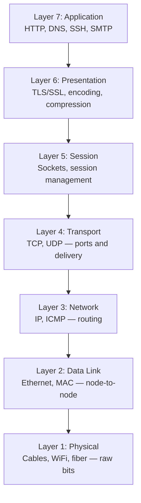
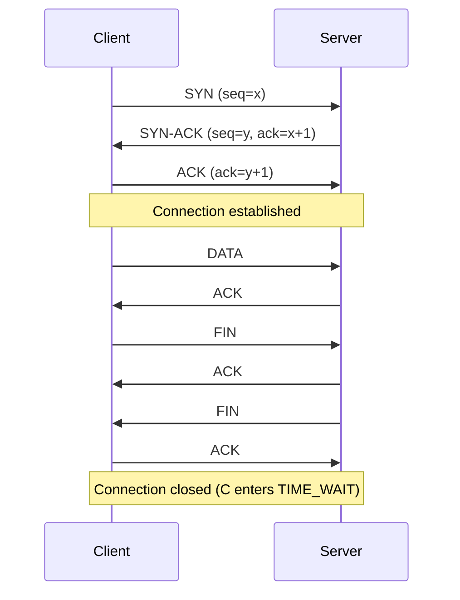
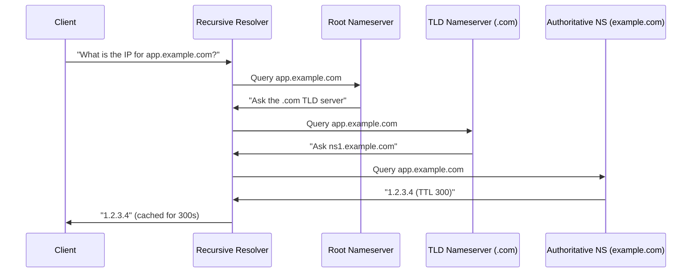
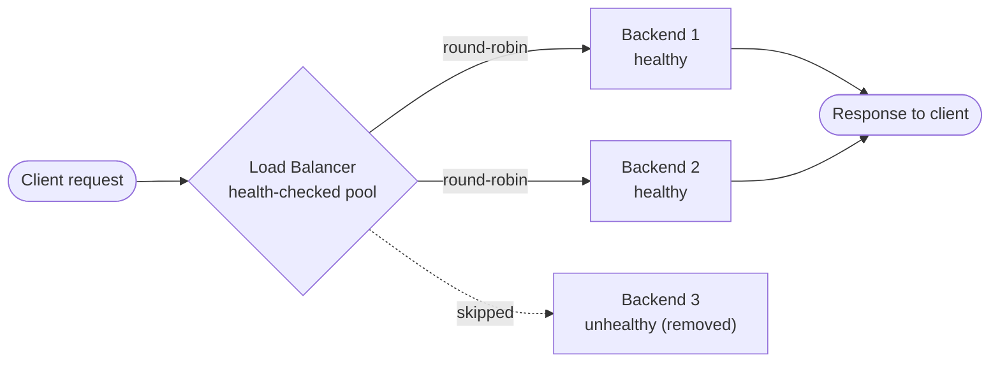
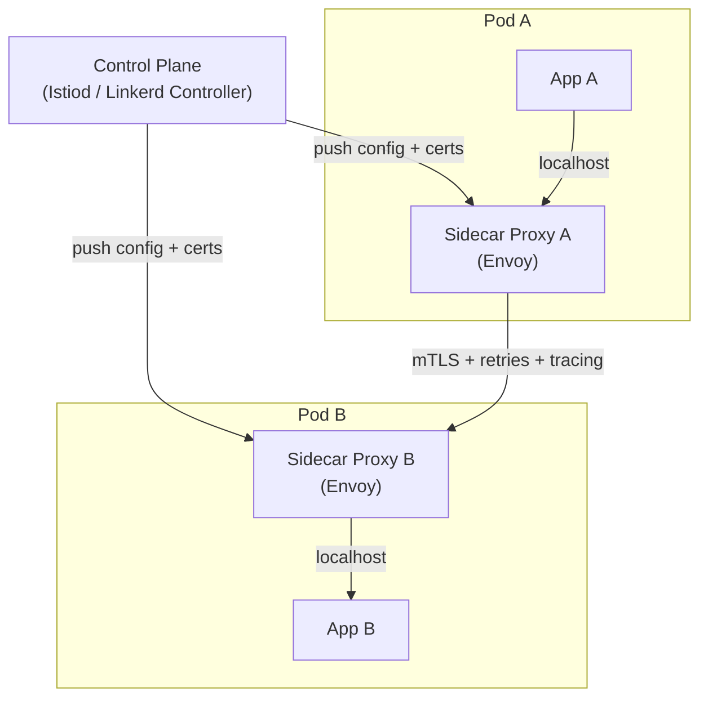

# Module 03: Networking Basics

> Part of the [DevOps Career Course](./README.md) by UncleJS

[](https://creativecommons.org/licenses/by-nc-sa/4.0/)      

---

## Table of Contents

- [Overview](#overview)
- [Learning Objectives](#learning-objectives)
- [Beginner: The OSI Model](#beginner-the-osi-model)
- [Beginner: TCP/IP Fundamentals](#beginner-tcpip-fundamentals)
- [Beginner: IP Addressing & Subnetting](#beginner-ip-addressing--subnetting)
- [Beginner: DNS](#beginner-dns)
- [Beginner: Common Ports & Protocols](#beginner-common-ports--protocols)
- [Beginner: HTTP & HTTPS](#beginner-http--https)
- [Intermediate: Firewalls & iptables](#intermediate-firewalls--iptables)
- [Intermediate: Load Balancing](#intermediate-load-balancing)
- [Intermediate: Reverse Proxies](#intermediate-reverse-proxies)
- [Intermediate: Network Troubleshooting](#intermediate-network-troubleshooting)
- [Intermediate: Network Namespaces & Virtual Networking](#intermediate-network-namespaces--virtual-networking)
- [Advanced: DNS at Scale](#advanced-dns-at-scale)
- [Advanced: Service Mesh Introduction](#advanced-service-mesh-introduction)
- [Tools & Commands Reference](#tools--commands-reference)
- [Hands-On Labs](#hands-on-labs)
- [Further Reading](#further-reading)

---

## Overview

Networks are the nervous system of modern infrastructure. Every container you run, every server you deploy, every API call your application makes — all of it depends on networking. DevOps engineers who understand networking can diagnose production issues faster, design better infrastructure, and communicate effectively with network teams.

This module covers the key networking concepts every DevOps engineer must know, from TCP/IP basics and DNS fundamentals through load balancing, reverse proxies, and the deep operational mechanics of modern tools like HAProxy and Traefik.

[↑ Back to TOC](#table-of-contents)

---

## Learning Objectives

By the end of this module you will be able to:

- Explain the TCP/IP model and how data travels across a network
- Understand IP addressing, subnets, and CIDR notation
- Explain DNS resolution and debug DNS problems
- Identify common ports and protocols by number
- Understand HTTP request/response cycles including status codes
- Configure basic firewall rules with `iptables` and `ufw`
- Explain load balancing strategies and configure HAProxy and Nginx as load balancers
- Configure Traefik as a reverse proxy using both Docker and Kubernetes providers
- Set up automatic TLS with Let's Encrypt via Traefik
- Diagnose network problems using command-line tools
- Understand DNS-based load balancing and split-horizon DNS at scale
- Explain what a service mesh is and when to reach for one

[↑ Back to TOC](#table-of-contents)

---

## Beginner: The OSI Model

The OSI (Open Systems Interconnection) model is a conceptual framework describing how data moves across a network in 7 layers.

The OSI model is primarily useful as a troubleshooting vocabulary, not as a literal description of how modern protocols are implemented. Real-world networking collapses several OSI layers — TCP/IP ignores layers 5 and 6 almost entirely. But the framework gives engineers a shared language for diagnosing failures: when a colleague says "this looks like a layer 3 problem," everyone immediately knows to look at routing and IP addressing rather than at application code or TLS certificates. That precision saves hours of unfocused debugging.

Troubleshooting networks systematically means working from the bottom up. Start by confirming the physical and IP layers are functioning: can you `ping` the target? If not, is the route correct? Are firewall rules blocking ICMP? Once layer 3 is confirmed, move to layer 4: can you `nc -zv` the target port? A TCP connection refused means the host is reachable but nothing is listening. A timeout means firewall or routing is blocking the packet before it reaches the host. Only once you have confirmed transport connectivity should you start examining application behavior.

Understanding which layer a protocol operates at predicts what can go wrong. HTTP/S, gRPC, and WebSocket are layer 7 — they depend on everything below them working correctly. TLS operates at the boundary of layers 6 and 7 — a certificate error is a TLS handshake failure that happens before any HTTP is exchanged. DNS is a layer 7 protocol that exists to support other layer 7 protocols. This layering explains why a valid HTTP request can fail due to a DNS misconfiguration, a routing loop, a dropped TCP SYN, a TLS version mismatch, or a misconfigured application — and why a methodical bottom-up approach is the only reliable diagnostic strategy.



| Layer | Name | Examples | What it Does |
|---|---|---|---|
| 7 | Application | HTTP, DNS, SSH, FTP | User-facing protocols |
| 6 | Presentation | TLS/SSL, encoding | Encryption, compression |
| 5 | Session | Sockets | Manages connections |
| 4 | Transport | TCP, UDP | End-to-end delivery, ports |
| 3 | Network | IP, ICMP | Routing between networks |
| 2 | Data Link | Ethernet, MAC | Node-to-node delivery |
| 1 | Physical | Cables, WiFi, fiber | Raw bit transmission |

> **DevOps tip**: You most commonly work at layers 3–7. When something fails, work from the bottom up — is the physical/IP layer working? Then transport? Then application?

**Why this matters in practice:**

- A `502 Bad Gateway` is a Layer 7 problem — your reverse proxy reached a backend that returned a bad response
- A connection timeout is often a Layer 3/4 problem — routing or firewall
- A `503 Service Unavailable` from a load balancer means all backends failed health checks (Layer 7)
- SSL certificate errors are Layer 6 — TLS handshake failed before any HTTP was exchanged

[↑ Back to TOC](#table-of-contents)

---

## Beginner: TCP/IP Fundamentals

The 3-way handshake — SYN, SYN-ACK, ACK — is not just a protocol detail; it is the foundation of reliable communication. Before TCP transmits a single byte of data, it verifies that both sides are reachable, both have available buffer space, and both agree on initial sequence numbers. The sequence numbers are what make TCP reliable: every byte is numbered, every received byte is acknowledged, and any gap triggers retransmission. This reliability comes at a cost — at minimum, one round trip is required before data transfer begins, which is why HTTP/2 and QUIC invest so much engineering effort in reducing connection establishment overhead.

`TIME_WAIT` is one of the most misunderstood TCP states. After a connection closes, the initiating side stays in `TIME_WAIT` for 2 × Maximum Segment Lifetime (typically 60–120 seconds). This is not a bug or a resource leak — it is a deliberate design that prevents a delayed packet from a previous connection being misinterpreted as belonging to a new connection on the same port. High-throughput servers that initiate many short-lived connections (HTTP health checks, database connections) accumulate thousands of `TIME_WAIT` sockets. This is normal. It becomes a problem only when you exhaust the local port range (`ip_local_port_range`), at which point new connections are refused.

Understanding TCP connection teardown is important for debugging half-open connections and stuck processes. A clean close uses four steps: FIN from the initiator, ACK from the peer, FIN from the peer, ACK from the initiator. If one side closes but the other does not, you get `CLOSE_WAIT` on the passive side — a common symptom of a bug where a process fails to close a socket when its upstream connection closes. `ss -s` gives you a count of connections in each state; `CLOSE_WAIT` counts that grow over time indicate an application bug that will eventually exhaust file descriptors.



### TCP vs UDP

| Feature | TCP | UDP |
|---|---|---|
| Connection | Connection-oriented (3-way handshake) | Connectionless |
| Reliability | Guaranteed delivery, ordered packets | No guarantee |
| Speed | Slower (overhead) | Faster |
| Use cases | HTTP/S, SSH, databases | DNS, video streaming, VoIP |

### The TCP 3-Way Handshake

```
Client          Server
  │── SYN ──────▶│    "Can we connect?"
  │◀── SYN-ACK ──│    "Yes, I'm ready"
  │── ACK ───────▶│    "Great, let's go"
  │═══ DATA ══════│    Connection established
```

**Connection teardown** uses a 4-step FIN/ACK exchange. When you see lots of `TIME_WAIT` sockets, connections are being closed and waiting for late packets — normal on busy servers.

```bash
# See TCP connection states
ss -s
# Output shows: established, time-wait, close-wait, etc.
```

### ICMP

ICMP (Internet Control Message Protocol) is used for diagnostics — `ping` uses ICMP echo requests and replies.

```bash
ping -c 4 8.8.8.8       # Send 4 ICMP packets to Google DNS
traceroute 8.8.8.8      # Trace the route packets take
mtr 8.8.8.8             # Combined ping + traceroute (real-time)
```

> **Firewall note**: Many cloud providers block ICMP by default. A failed `ping` doesn't necessarily mean the host is down — test with `nc` or `curl` on a known-open port first.

[↑ Back to TOC](#table-of-contents)

---

## Beginner: IP Addressing & Subnetting

### IPv4 Address Classes

IPv4 addresses are 32-bit numbers written as four octets (e.g., `192.168.1.100`).

| Range | Type | Common Use |
|---|---|---|
| `10.0.0.0/8` | Private | Large enterprise networks, cloud VPCs |
| `172.16.0.0/12` | Private | Mid-size networks, Docker default bridge |
| `192.168.0.0/16` | Private | Home/small office networks |
| `127.0.0.0/8` | Loopback | Localhost (your own machine) |
| `169.254.0.0/16` | Link-local | APIPA, cloud instance metadata |
| Everything else | Public | Internet-routable |

> **Cloud note**: The metadata endpoint `169.254.169.254` is how EC2/GCE/Azure instances retrieve instance metadata and IAM credentials. If you see traffic going to this IP, it's normal cloud behavior.

### CIDR Notation

CIDR (Classless Inter-Domain Routing) expresses IP addresses and their network masks together.

```
192.168.1.0/24
│             └── 24 bits are network bits → 256 addresses (254 usable)
└── Network address

Common CIDR blocks:
/32  = 1 IP address (single host)
/30  = 4 IPs (2 usable — point-to-point links)
/29  = 8 IPs (6 usable)
/28  = 16 IPs (14 usable)
/27  = 32 IPs (30 usable)
/24  = 256 IPs (254 usable) — typical LAN subnet
/16  = 65,536 IPs — VPC/large network
/8   = 16,777,216 IPs — full class A network
```

**Subnet calculation shortcut**: For `/N`, the number of hosts = `2^(32-N) - 2`.
So `/24` = `2^8 - 2` = 254 usable hosts.

### IPv6

IPv6 uses 128-bit addresses written in hexadecimal. Increasingly common in cloud networking.

```
2001:0db8:85a3:0000:0000:8a2e:0370:7334
# Can be compressed: 2001:db8:85a3::8a2e:370:7334
```

| IPv6 Range | Purpose |
|---|---|
| `::1/128` | Loopback (equivalent to 127.0.0.1) |
| `fe80::/10` | Link-local (auto-configured per interface) |
| `fd00::/8` | Unique local (private, like RFC1918) |
| `2000::/3` | Global unicast (public internet) |

[↑ Back to TOC](#table-of-contents)

---

## Beginner: DNS

DNS (Domain Name System) translates human-readable domain names into IP addresses.

TTL (Time To Live) is the most operationally significant field in a DNS record, and it is consistently underestimated until a bad deploy makes it painfully obvious. TTL is the number of seconds that resolvers and clients are allowed to cache an answer. A TTL of 3600 means changes to your DNS records will not propagate to all clients for up to an hour after you make them. Before any DNS-dependent migration — changing IP addresses, moving to a new provider, cutover to a new load balancer — lower your TTL to 60 or 300 seconds at least one TTL period in advance. After the cutover, raise it back. Failing to do this is how planned maintenances turn into hour-long incidents.

The distinction between authoritative and recursive resolvers is critical for debugging. An authoritative nameserver holds the actual DNS records for a domain and answers queries with `aa` (authoritative answer) set. A recursive resolver (like `8.8.8.8` or your ISP's resolver) does not hold records — it queries the DNS hierarchy on your behalf and caches the results. When `dig` returns stale data, you are seeing the recursive resolver's cache. To see the current authoritative answer, query the authoritative nameserver directly: `dig @ns1.example.com example.com`. A mismatch between what the authoritative nameserver says and what a recursive resolver returns indicates a caching or propagation delay.

Negative caching (NXDOMAIN TTL) is the detail that bites engineers who make typos. When a DNS query returns NXDOMAIN (domain does not exist), that negative answer is also cached — typically for the duration of the SOA record's minimum TTL. If you query for `app.example.com` (typo), get NXDOMAIN, fix the typo and deploy `app.example.com`, but your resolver has cached the negative answer for the old name, you will still get NXDOMAIN for `app.example.com` until that cache expires. The fix is to flush your local resolver cache or query the authoritative nameserver directly to confirm the record exists.



### How DNS Resolution Works

```
Browser asks: "What is the IP for app.example.com?"

1. Check local cache (fastest)
2. Check /etc/hosts file
3. Ask configured DNS resolver (e.g., 8.8.8.8)
4. Resolver queries Root DNS servers (13 root clusters)
5. Root servers point to .com TLD servers
6. TLD servers point to example.com nameservers
7. example.com nameservers return the IP
8. Answer cached per TTL and returned to browser
```

### DNS Record Types

| Record | Purpose | Example |
|---|---|---|
| **A** | Domain → IPv4 address | `app.example.com → 1.2.3.4` |
| **AAAA** | Domain → IPv6 address | `app.example.com → 2001:db8::1` |
| **CNAME** | Domain → another domain | `www → app.example.com` |
| **MX** | Mail server for domain | `example.com → mail.example.com` |
| **TXT** | Arbitrary text (SPF, DKIM, verification) | `v=spf1 include:...` |
| **NS** | Nameservers for domain | `example.com NS ns1.example.com` |
| **PTR** | IP → domain (reverse DNS) | `1.2.3.4 → app.example.com` |
| **SRV** | Service location (host + port) | Used by Kubernetes, SIP |
| **CAA** | Certificate Authority Authorization | Restricts which CAs can issue certs |

### DNS Commands

```bash
# Query DNS records
dig example.com                      # Default A record query
dig example.com MX                   # Query MX records
dig example.com NS                   # Query nameservers
dig example.com TXT                  # Query TXT records (SPF, DKIM)
dig @8.8.8.8 example.com            # Query using a specific resolver
dig +short example.com              # Just the IP address
dig +trace example.com              # Full delegation trace from root

nslookup example.com                # Interactive DNS query tool
host example.com                    # Simple DNS lookup

# Reverse DNS lookup
dig -x 1.2.3.4                      # PTR record for an IP

# Check /etc/hosts first
cat /etc/hosts                      # Local hostname overrides
cat /etc/resolv.conf               # Configured DNS resolvers
```

[↑ Back to TOC](#table-of-contents)

---

## Beginner: Common Ports & Protocols

| Port | Protocol | Service |
|---|---|---|
| 20, 21 | TCP | FTP (File Transfer Protocol) |
| 22 | TCP | SSH (Secure Shell) |
| 25 | TCP | SMTP (email sending) |
| 53 | TCP/UDP | DNS |
| 67, 68 | UDP | DHCP (server/client) |
| 80 | TCP | HTTP |
| 123 | UDP | NTP (time sync) |
| 443 | TCP | HTTPS |
| 3306 | TCP | MySQL / MariaDB |
| 5432 | TCP | PostgreSQL |
| 6379 | TCP | Redis |
| 8080 | TCP | HTTP (alternate/dev) |
| 8443 | TCP | HTTPS (alternate) |
| 9090 | TCP | Prometheus |
| 9100 | TCP | Node Exporter (Prometheus) |
| 27017 | TCP | MongoDB |

```bash
# Check what's listening on your system
ss -tulnp                           # Modern — show TCP/UDP listeners
netstat -tulnp                      # Classic equivalent
lsof -i :80                         # Show what's using port 80

# Test if a port is open
nc -zv hostname 443                 # netcat port test
telnet hostname 22                  # Test SSH port (legacy)
curl -v telnet://hostname:22        # Test via curl
```

[↑ Back to TOC](#table-of-contents)

---

## Beginner: HTTP & HTTPS

HTTP is the protocol that powers the web. As a DevOps engineer you will work with it constantly — debugging APIs, configuring load balancers, and setting up TLS.

### HTTP Request Structure

```
GET /api/users HTTP/1.1
Host: api.example.com
Authorization: Bearer eyJhbGc...
Content-Type: application/json
Accept: application/json

{"name": "Alice"}
```

### HTTP Status Codes

| Range | Category | Common Codes |
|---|---|---|
| `1xx` | Informational | `100 Continue` |
| `2xx` | Success | `200 OK`, `201 Created`, `204 No Content` |
| `3xx` | Redirection | `301 Moved Permanently`, `302 Found`, `304 Not Modified` |
| `4xx` | Client Error | `400 Bad Request`, `401 Unauthorized`, `403 Forbidden`, `404 Not Found`, `429 Too Many Requests` |
| `5xx` | Server Error | `500 Internal Server Error`, `502 Bad Gateway`, `503 Service Unavailable`, `504 Gateway Timeout` |

**DevOps-specific status codes to know well:**

| Code | Meaning | Common Cause |
|---|---|---|
| `502 Bad Gateway` | Proxy received an invalid response | Backend crashed, wrong port, app error |
| `503 Service Unavailable` | No healthy backend available | All backends failed health checks |
| `504 Gateway Timeout` | Backend too slow to respond | DB query hanging, app overloaded |
| `429 Too Many Requests` | Rate limit exceeded | Client sending too many requests |

### curl for HTTP Testing

```bash
curl https://example.com                          # GET request
curl -I https://example.com                       # HEAD — headers only
curl -X POST https://api.example.com/users \      # POST with JSON body
     -H "Content-Type: application/json" \
     -d '{"name": "Alice"}'
curl -u user:password https://api.example.com     # Basic auth
curl -H "Authorization: Bearer TOKEN" https://...  # Bearer token
curl -o output.html https://example.com           # Save to file
curl -w "%{http_code}" -o /dev/null https://...   # Print status code only
curl -k https://self-signed.example.com           # Skip TLS verification
curl -v https://example.com                       # Verbose — show full exchange
curl --resolve example.com:443:1.2.3.4 https://example.com  # Test specific IP
```

### TLS/SSL

HTTPS = HTTP + TLS. TLS encrypts data in transit and verifies server identity via certificates.

```bash
# Inspect a site's TLS certificate
openssl s_client -connect example.com:443 -showcerts
echo | openssl s_client -connect example.com:443 2>/dev/null | openssl x509 -noout -dates

# Check certificate expiry
curl -vI https://example.com 2>&1 | grep -i "expire\|subject\|issuer"

# Test TLS version support
openssl s_client -connect example.com:443 -tls1_2
openssl s_client -connect example.com:443 -tls1_3
```

[↑ Back to TOC](#table-of-contents)

---

## Intermediate: Firewalls & iptables

A firewall controls which network traffic is allowed to enter or leave a system.

### ufw — Uncomplicated Firewall (Ubuntu)

```bash
sudo ufw enable                     # Enable firewall
sudo ufw status verbose             # Show rules and status
sudo ufw allow 22/tcp               # Allow SSH
sudo ufw allow 80/tcp               # Allow HTTP
sudo ufw allow 443/tcp              # Allow HTTPS
sudo ufw deny 3306/tcp              # Block MySQL from outside
sudo ufw allow from 192.168.1.0/24  # Allow entire subnet
sudo ufw allow from 10.0.0.5 to any port 5432  # Allow specific host to PostgreSQL
sudo ufw delete allow 80/tcp        # Remove a rule
sudo ufw reset                      # Reset all rules

# Rate limiting (brute force protection)
sudo ufw limit 22/tcp               # Allow SSH but rate-limit connection attempts
```

### iptables — Low-Level Firewall

`iptables` operates on **chains** (`INPUT`, `OUTPUT`, `FORWARD`) within **tables** (`filter`, `nat`, `mangle`).

```bash
# List all rules with verbose detail
sudo iptables -L -v -n --line-numbers

# Allow established connections (essential — do this first!)
sudo iptables -A INPUT -m state --state ESTABLISHED,RELATED -j ACCEPT

# Allow loopback
sudo iptables -A INPUT -i lo -j ACCEPT

# Allow SSH
sudo iptables -A INPUT -p tcp --dport 22 -j ACCEPT

# Allow HTTP and HTTPS
sudo iptables -A INPUT -p tcp --dport 80 -j ACCEPT
sudo iptables -A INPUT -p tcp --dport 443 -j ACCEPT

# Rate limit SSH (6 connections per minute)
sudo iptables -A INPUT -p tcp --dport 22 -m limit --limit 6/min -j ACCEPT

# Drop everything else on INPUT
sudo iptables -P INPUT DROP

# NAT — masquerade traffic from a private network (basic router config)
sudo iptables -t nat -A POSTROUTING -s 10.0.0.0/8 -o eth0 -j MASQUERADE

# Save rules (Ubuntu / Debian)
sudo iptables-save > /etc/iptables/rules.v4

# Restore rules on boot (add to /etc/rc.local or use iptables-persistent)
sudo iptables-restore < /etc/iptables/rules.v4
```

### nftables — The Modern Replacement

`nftables` replaces `iptables` on modern Linux systems (RHEL 8+, Debian 10+).

```bash
# List all rules
sudo nft list ruleset

# A basic nftables config (/etc/nftables.conf)
table inet filter {
    chain input {
        type filter hook input priority 0; policy drop;

        ct state established,related accept
        iif lo accept
        tcp dport 22 accept
        tcp dport { 80, 443 } accept
    }
    chain forward {
        type filter hook forward priority 0; policy drop;
    }
    chain output {
        type filter hook output priority 0; policy accept;
    }
}
```

[↑ Back to TOC](#table-of-contents)

---

## Intermediate: Load Balancing

A load balancer distributes incoming traffic across multiple servers to improve availability and performance.

The practical difference between Layer 4 and Layer 7 load balancing matters for how you architect systems. A Layer 4 load balancer sees only IP addresses and port numbers — it forwards TCP streams without reading the content. This makes it extremely fast and capable of handling any TCP or UDP protocol without protocol-specific configuration. The tradeoff is inflexibility: you cannot route based on URL paths, HTTP headers, or cookies, and you cannot do SSL termination at the load balancer. Layer 7 load balancers parse HTTP, which enables path-based routing, header manipulation, cookie-based session affinity, and SSL termination. Nearly all modern web applications use Layer 7 load balancing.

Health checks are not optional in production load balancing — they are the mechanism that makes high availability work. Without health checks, a load balancer continues sending traffic to a backend that is crashed, overloaded, or returning errors. The health check frequency (every 5–10 seconds is typical) and failure threshold (2–3 consecutive failures before removal) determine how quickly the load balancer reacts to failures. A 10-second interval with a 3-failure threshold means up to 30 seconds of errors before a bad backend is removed. For high-availability systems, tune these parameters to your acceptable error window, and ensure your health check endpoint tests actual service health — not just "the process is running."

Graceful backend removal is a subtlety that many engineers miss. When a backend is removed from rotation — intentionally during a deployment or automatically due to a failed health check — in-flight requests on existing connections must be allowed to complete. Removing a backend by closing its connections immediately causes request errors for active users. The correct pattern is to stop sending new requests (remove from upstream pool), wait for a drain period (typically 30–60 seconds) for in-flight requests to complete, then terminate the backend. NGINX's `proxy_next_upstream` directive and AWS ALB's connection draining implement this; know how to configure it for your load balancer.



### Load Balancing Algorithms

| Algorithm | Description | Best For |
|---|---|---|
| **Round Robin** | Requests distributed in rotation | Stateless apps with equal capacity servers |
| **Least Connections** | Send to server with fewest active connections | Long-lived connections, varying request complexity |
| **IP Hash** | Same client IP always goes to same server | Session-sticky applications |
| **Weighted Round Robin** | Servers get traffic proportional to weight | Mixed-capacity server pools |
| **Random** | Random server selection | Simple, low-overhead distribution |
| **Health-Check Based** | Automatically remove unhealthy servers | Production high-availability |

### Layer 4 vs Layer 7 Load Balancing

| Type | Layer | Sees | Examples | Speed |
|---|---|---|---|---|
| **Layer 4** | Transport (TCP/UDP) | IP + port only | AWS NLB, HAProxy TCP mode | Fastest — no HTTP parsing |
| **Layer 7** | Application (HTTP) | Full request — URL, headers, cookies, body | AWS ALB, Nginx, HAProxy HTTP mode, Traefik | Flexible, feature-rich |

**When to use Layer 4**: ultra-low latency, non-HTTP protocols (MySQL, gRPC, Redis), TLS passthrough.  
**When to use Layer 7**: path-based routing, header manipulation, A/B testing, authentication, canary deployments.

### Nginx as Load Balancer

```nginx
upstream backend {
    least_conn;                        # Least connections algorithm
    server web01.example.com:8080 weight=3;  # Higher weight = more traffic
    server web02.example.com:8080 weight=1;
    server web03.example.com:8080 backup;    # Only used when others are down
    keepalive 32;                      # Reuse upstream connections
}

server {
    listen 80;
    server_name app.example.com;

    location / {
        proxy_pass http://backend;
        proxy_set_header Host              $host;
        proxy_set_header X-Real-IP         $remote_addr;
        proxy_set_header X-Forwarded-For   $proxy_add_x_forwarded_for;
        proxy_set_header X-Forwarded-Proto $scheme;

        # Timeouts
        proxy_connect_timeout 5s;
        proxy_send_timeout    60s;
        proxy_read_timeout    60s;
    }
}
```

### HAProxy as Load Balancer

HAProxy is the gold standard for high-performance Layer 4 and Layer 7 load balancing. It is battle-tested at enormous scale (GitHub, Reddit, Stack Overflow all use it).

**Basic HAProxy configuration (`/etc/haproxy/haproxy.cfg`):**

```haproxy
#--------------------------------------------------------------------
# Global settings
#--------------------------------------------------------------------
global
    log /dev/log local0 info
    maxconn 50000
    user haproxy
    group haproxy
    daemon
    stats socket /run/haproxy/admin.sock mode 660 level admin

#--------------------------------------------------------------------
# Default settings (inherited by all frontends/backends)
#--------------------------------------------------------------------
defaults
    log     global
    mode    http
    option  httplog
    option  dontlognull
    option  forwardfor
    option  http-server-close
    timeout connect 5s
    timeout client  30s
    timeout server  30s
    timeout http-request 10s

#--------------------------------------------------------------------
# Frontend — where HAProxy listens
#--------------------------------------------------------------------
frontend http_in
    bind *:80
    bind *:443 ssl crt /etc/haproxy/certs/example.com.pem

    # Redirect HTTP → HTTPS
    http-request redirect scheme https unless { ssl_fc }

    # Route based on Host header
    acl is_api   hdr(host) -i api.example.com
    acl is_admin hdr(host) -i admin.example.com

    use_backend api_servers   if is_api
    use_backend admin_servers if is_admin
    default_backend web_servers

#--------------------------------------------------------------------
# Backends — where traffic goes
#--------------------------------------------------------------------
backend web_servers
    balance leastconn
    option httpchk GET /health HTTP/1.1\r\nHost:\ example.com
    http-check expect status 200

    server web01 10.0.1.10:8080 check inter 5s fall 3 rise 2 weight 1
    server web02 10.0.1.11:8080 check inter 5s fall 3 rise 2 weight 1
    server web03 10.0.1.12:8080 check inter 5s fall 3 rise 2 weight 1 backup

backend api_servers
    balance roundrobin
    option httpchk GET /api/health HTTP/1.1\r\nHost:\ api.example.com
    server api01 10.0.2.10:3000 check
    server api02 10.0.2.11:3000 check

backend admin_servers
    balance source
    server admin01 10.0.3.10:4000 check

#--------------------------------------------------------------------
# Statistics dashboard
#--------------------------------------------------------------------
listen stats
    bind *:8404
    stats enable
    stats uri /stats
    stats refresh 10s
    stats auth admin:strongpassword
    stats show-legends
    stats show-node
```

### HAProxy Health Checks

```haproxy
backend web_servers
    # HTTP health check — checks a specific endpoint
    option httpchk GET /health HTTP/1.1\r\nHost:\ example.com
    http-check expect status 200

    # TCP health check (default) — just tests the connection opens
    # option tcp-check

    # Health check parameters per server:
    # check           = enable health checking
    # inter 5s        = check every 5 seconds
    # fall 3          = mark down after 3 consecutive failures
    # rise 2          = mark up after 2 consecutive successes
    server web01 10.0.1.10:8080 check inter 5s fall 3 rise 2

    # Slow start — ramp up traffic to a freshly recovered server
    server web02 10.0.1.11:8080 check inter 5s fall 3 rise 2 slowstart 60s
```

### Sticky Sessions (Session Persistence)

When users must always reach the same backend (e.g., server-side sessions), use sticky sessions:

```haproxy
backend web_servers
    balance roundrobin

    # Cookie-based stickiness — HAProxy sets a cookie
    cookie SERVERID insert indirect nocache

    server web01 10.0.1.10:8080 check cookie web01
    server web02 10.0.1.11:8080 check cookie web02
    server web03 10.0.1.12:8080 check cookie web03
```

> **Best practice**: Prefer stateless applications and external session stores (Redis) over sticky sessions. Sticky sessions make deployments and scaling harder. Reserve them for legacy apps that cannot be made stateless.

### Connection Draining (Graceful Server Removal)

When removing a server from the pool (deploy, maintenance), drain it first to avoid dropping active connections:

```bash
# Using the HAProxy runtime API (admin socket)
echo "set server web_servers/web01 state drain" | \
    sudo socat stdio /run/haproxy/admin.sock

# Check the current server state
echo "show servers state web_servers" | \
    sudo socat stdio /run/haproxy/admin.sock

# After sessions drain to zero, take it out of rotation
echo "set server web_servers/web01 state maint" | \
    sudo socat stdio /run/haproxy/admin.sock
```

The `drain` state means: accept no new sessions, but finish active ones. The `maint` state means: offline completely.

### Connection Limits

```haproxy
global
    maxconn 50000          # Total connections across all frontends

frontend http_in
    bind *:80
    maxconn 20000          # Max connections on this frontend

backend web_servers
    # Limit per-server concurrent connections
    server web01 10.0.1.10:8080 check maxconn 500
    server web02 10.0.1.11:8080 check maxconn 500
```

[↑ Back to TOC](#table-of-contents)

---

## Intermediate: Reverse Proxies

A **reverse proxy** sits in front of your application servers. Clients talk to the reverse proxy — they never connect directly to your backends.

**What a reverse proxy gives you:**
- TLS termination in one place
- Load balancing across multiple backends
- Centralized authentication and access control
- Caching, compression, response modification
- Path-based and host-based routing
- Observability (access logs, metrics)

### Nginx as Reverse Proxy

```nginx
server {
    listen 443 ssl;
    server_name app.example.com;

    ssl_certificate     /etc/letsencrypt/live/app.example.com/fullchain.pem;
    ssl_certificate_key /etc/letsencrypt/live/app.example.com/privkey.pem;

    # Security headers
    add_header Strict-Transport-Security "max-age=31536000; includeSubDomains" always;
    add_header X-Frame-Options DENY;
    add_header X-Content-Type-Options nosniff;

    location / {
        proxy_pass         http://localhost:3000;
        proxy_http_version 1.1;
        proxy_set_header   Upgrade $http_upgrade;
        proxy_set_header   Connection "upgrade";  # WebSocket support
        proxy_set_header   Host $host;
        proxy_set_header   X-Real-IP $remote_addr;
        proxy_cache_bypass $http_upgrade;
    }
}

# HTTP → HTTPS redirect
server {
    listen 80;
    server_name app.example.com;
    return 301 https://$host$request_uri;
}
```

---

### Traefik: The Cloud-Native Reverse Proxy

Traefik is a modern reverse proxy and load balancer built for dynamic cloud environments. Unlike Nginx (where you write static config files), Traefik **auto-discovers** services from Docker, Kubernetes, Consul, and more — your configuration is embedded in your containers and manifests.

**Traefik v3 is the current version.** All examples below use v3 syntax.

#### What is Traefik & How It Differs from Nginx

| Feature | Traefik | Nginx |
|---|---|---|
| Configuration | Dynamic — auto-discovers from Docker/K8s labels | Static files — requires reload on change |
| Let's Encrypt | Built-in ACME client, zero config | Requires certbot + cron |
| Dashboard | Built-in web UI showing all routes | Not included |
| Docker integration | Native — reads container labels | Manual config per container |
| Kubernetes | Native IngressRoute CRD | Requires ingress-nginx controller |
| Learning curve | Concepts are different (EntryPoints/Routers) | Config is familiar to sysadmins |
| Performance | Excellent | Fastest (C-based, battle-tested) |
| Middleware | Rich middleware chain built-in | Requires modules or Lua |
| WebSockets | Automatic | Manual `Upgrade` headers |
| Use case | Microservices, containers, K8s | High-traffic web serving, fine-grained config |

#### The Four Core Concepts

Every request through Traefik follows this path:

```
Client Request
      │
      ▼
┌─────────────┐
│ EntryPoint  │  ← Where Traefik listens (port 80, 443)
└──────┬──────┘
       │
       ▼
┌─────────────┐
│   Router    │  ← Rules: which requests go where? (Host, Path, Headers)
└──────┬──────┘
       │
       ▼
┌─────────────┐
│ Middleware  │  ← Transformations: auth, redirect, headers, rate-limit
└──────┬──────┘
       │
       ▼
┌─────────────┐
│   Service   │  ← The actual backend (load balancer + servers)
└─────────────┘
```

1. **EntryPoint** — A network port Traefik listens on (`web` = port 80, `websecure` = port 443)
2. **Router** — Rules that match incoming requests (by Host, Path, Method, Header) and route them to a service
3. **Middleware** — Request/response transformations applied to matching traffic (redirects, auth, headers)
4. **Service** — The actual backend servers, with load balancing configuration

#### Static vs Dynamic Configuration

Traefik has two config layers:

- **Static config** (`traefik.yml`): Entrypoints, providers, certificate resolvers, logging. Set once at startup.
- **Dynamic config**: Routes, middlewares, services. Updated at runtime from providers (Docker labels, K8s CRDs, file).

**Full `traefik.yml` example:**

```yaml
# /etc/traefik/traefik.yml  (or mounted at /etc/traefik/traefik.yml in container)

# --- Entrypoints ---
entryPoints:
  web:
    address: ":80"
    http:
      redirections:
        entryPoint:
          to: websecure
          scheme: https
          permanent: true
  websecure:
    address: ":443"
    http:
      tls:
        certResolver: letsencrypt

# --- Providers ---
providers:
  docker:
    exposedByDefault: false   # Opt-in: containers need label traefik.enable=true
    network: traefik-public   # Only route on this Docker network
  file:
    directory: /etc/traefik/dynamic/  # Load dynamic config from files too
    watch: true

# --- Certificate Resolvers (Let's Encrypt) ---
certificatesResolvers:
  letsencrypt:
    acme:
      email: admin@example.com
      storage: /acme/acme.json
      httpChallenge:
        entryPoint: web        # Use HTTP-01 challenge

# --- API & Dashboard ---
api:
  dashboard: true
  insecure: false              # Must be protected by a router + middleware

# --- Logging ---
log:
  level: INFO
  filePath: /var/log/traefik/traefik.log

accessLog:
  filePath: /var/log/traefik/access.log
  bufferingSize: 100

# --- Metrics ---
metrics:
  prometheus: {}
```

#### Traefik with Docker

The most common Traefik deployment: run Traefik as a container, configure your app containers with labels.

**`docker-compose.yml` — Traefik + two apps:**

```yaml
version: "3.8"

networks:
  traefik-public:
    external: true   # Create once: docker network create traefik-public

services:
  traefik:
    image: traefik:v3
    container_name: traefik
    restart: unless-stopped
    ports:
      - "80:80"
      - "443:443"
    volumes:
      - /var/run/docker.sock:/var/run/docker.sock:ro  # Reads Docker events
      - ./traefik.yml:/etc/traefik/traefik.yml:ro
      - ./acme:/acme                                  # Persists Let's Encrypt certs
      - ./logs:/var/log/traefik
    networks:
      - traefik-public
    labels:
      # Enable Traefik on itself (for the dashboard)
      - "traefik.enable=true"
      # Dashboard router — HTTPS only
      - "traefik.http.routers.dashboard.rule=Host(`traefik.example.com`)"
      - "traefik.http.routers.dashboard.entrypoints=websecure"
      - "traefik.http.routers.dashboard.service=api@internal"
      - "traefik.http.routers.dashboard.middlewares=dashboard-auth"
      # Basic auth middleware for dashboard
      - "traefik.http.middlewares.dashboard-auth.basicauth.users=admin:$$apr1$$..."
      # (generate password: htpasswd -nb admin password | sed 's/\$/\$\$/g')

  webapp:
    image: nginx:alpine
    restart: unless-stopped
    networks:
      - traefik-public
    labels:
      - "traefik.enable=true"
      # HTTPS router
      - "traefik.http.routers.webapp.rule=Host(`app.example.com`)"
      - "traefik.http.routers.webapp.entrypoints=websecure"
      - "traefik.http.routers.webapp.middlewares=security-headers"
      # Service (what port does the container expose?)
      - "traefik.http.services.webapp.loadbalancer.server.port=80"
      # Security headers middleware
      - "traefik.http.middlewares.security-headers.headers.stsSeconds=31536000"
      - "traefik.http.middlewares.security-headers.headers.stsIncludeSubdomains=true"
      - "traefik.http.middlewares.security-headers.headers.contentTypeNosniff=true"
      - "traefik.http.middlewares.security-headers.headers.frameDeny=true"

  api:
    image: myapp/api:latest
    restart: unless-stopped
    networks:
      - traefik-public
    labels:
      - "traefik.enable=true"
      - "traefik.http.routers.api.rule=Host(`api.example.com`)"
      - "traefik.http.routers.api.entrypoints=websecure"
      - "traefik.http.services.api.loadbalancer.server.port=3000"
      # Sticky sessions (if needed)
      - "traefik.http.services.api.loadbalancer.sticky.cookie=true"
      - "traefik.http.services.api.loadbalancer.sticky.cookie.name=lb_session"
```

**Create the external network first:**

```bash
docker network create traefik-public
```

**Generate a bcrypt password for the dashboard:**

```bash
# Install apache2-utils if needed
sudo apt install -y apache2-utils
htpasswd -nb admin mypassword | sed 's/\$/\$\$/g'
# Double-escaped $ is required in Docker labels
```

#### Traefik with Kubernetes

Traefik supports two approaches in Kubernetes:

**1. Standard `Ingress` resource** (compatible with any ingress controller):

```yaml
apiVersion: networking.k8s.io/v1
kind: Ingress
metadata:
  name: webapp-ingress
  annotations:
    traefik.ingress.kubernetes.io/router.middlewares: default-redirect-https@kubernetescrd
spec:
  ingressClassName: traefik
  rules:
    - host: app.example.com
      http:
        paths:
          - path: /
            pathType: Prefix
            backend:
              service:
                name: webapp
                port:
                  number: 80
```

**2. Native `IngressRoute` CRD** (Traefik-specific, more powerful):

```yaml
apiVersion: traefik.io/v1alpha1
kind: IngressRoute
metadata:
  name: webapp
  namespace: default
spec:
  entryPoints:
    - websecure
  routes:
    - match: Host(`app.example.com`)
      kind: Rule
      services:
        - name: webapp
          port: 80
      middlewares:
        - name: security-headers
  tls:
    certResolver: letsencrypt
---
apiVersion: traefik.io/v1alpha1
kind: Middleware
metadata:
  name: security-headers
  namespace: default
spec:
  headers:
    stsSeconds: 31536000
    stsIncludeSubdomains: true
    contentTypeNosniff: true
    frameDeny: true
    customResponseHeaders:
      X-Powered-By: ""         # Remove this header
---
# Path-based routing — API on /api, frontend on /
apiVersion: traefik.io/v1alpha1
kind: IngressRoute
metadata:
  name: split-route
spec:
  entryPoints:
    - websecure
  routes:
    - match: Host(`example.com`) && PathPrefix(`/api`)
      kind: Rule
      services:
        - name: api-service
          port: 3000
    - match: Host(`example.com`)
      kind: Rule
      services:
        - name: frontend-service
          port: 80
  tls:
    certResolver: letsencrypt
```

#### Automatic TLS with Let's Encrypt

Traefik has a built-in ACME client. Two challenge types:

| Challenge | How it Works | Requirement |
|---|---|---|
| **HTTP-01** | Let's Encrypt makes an HTTP request to `/.well-known/acme-challenge/TOKEN` | Port 80 must be reachable from internet |
| **DNS-01** | Let's Encrypt checks for a TXT record in your DNS | DNS provider API access; works for wildcard certs |

**HTTP-01 challenge config (already in `traefik.yml` above):**

```yaml
certificatesResolvers:
  letsencrypt:
    acme:
      email: admin@example.com
      storage: /acme/acme.json
      httpChallenge:
        entryPoint: web
```

**DNS-01 challenge (wildcard certs, Cloudflare example):**

```yaml
certificatesResolvers:
  letsencrypt:
    acme:
      email: admin@example.com
      storage: /acme/acme.json
      dnsChallenge:
        provider: cloudflare
        resolvers:
          - "1.1.1.1:53"
          - "8.8.8.8:53"
```

```bash
# Environment variable required for DNS provider
CF_DNS_API_TOKEN=your_cloudflare_api_token
```

**Staging vs production:**

```yaml
# Use staging first to avoid rate limits while testing!
certificatesResolvers:
  letsencrypt-staging:
    acme:
      email: admin@example.com
      storage: /acme/acme-staging.json
      caServer: "https://acme-staging-v02.api.letsencrypt.org/directory"
      httpChallenge:
        entryPoint: web
```

> ⚠️ **Rate limits**: Let's Encrypt production limits you to 5 duplicate certificates per week. Always test with staging first. Staging certificates are not browser-trusted but are structurally valid.

**`acme.json` — protect this file:**

```bash
touch /acme/acme.json
chmod 600 /acme/acme.json   # Must be 600 — Traefik will refuse to start otherwise
```

#### The Dashboard — Enabling It Securely

The Traefik dashboard shows all routers, services, middlewares, and providers in real time. Never expose it without authentication.

```yaml
# In traefik.yml
api:
  dashboard: true
  insecure: false   # Never true in production
```

```yaml
# Docker labels to protect the dashboard
labels:
  - "traefik.enable=true"
  - "traefik.http.routers.dashboard.rule=Host(`traefik.example.com`) && (PathPrefix(`/api`) || PathPrefix(`/dashboard`))"
  - "traefik.http.routers.dashboard.entrypoints=websecure"
  - "traefik.http.routers.dashboard.service=api@internal"
  - "traefik.http.routers.dashboard.middlewares=dashboard-auth@docker"
  - "traefik.http.middlewares.dashboard-auth.basicauth.users=admin:$$apr1$$ruca84Hq$$mbjdMZBAG.KWn7dvfz/8D0"
```

#### Middleware Deep-Dive: Security Headers

```yaml
# In a dynamic config file or as Docker labels
http:
  middlewares:
    security-headers:
      headers:
        stsSeconds: 31536000                # HSTS: 1 year
        stsIncludeSubdomains: true
        stsPreload: true
        contentTypeNosniff: true            # X-Content-Type-Options: nosniff
        frameDeny: true                     # X-Frame-Options: DENY
        browserXssFilter: true             # X-XSS-Protection
        referrerPolicy: "strict-origin-when-cross-origin"
        contentSecurityPolicy: "default-src 'self'; script-src 'self'"
        customResponseHeaders:
          X-Powered-By: ""                 # Remove server fingerprinting headers
          Server: ""
        customRequestHeaders:
          X-Real-IP: ""                    # Let Traefik set this (don't trust client)
```

#### ForwardAuth — Outsourcing Authentication

Traefik can delegate authentication to an external service. Every request is forwarded to an auth server first; if it returns 200, the request proceeds; otherwise, the client gets a 401/403.

```yaml
# Middleware definition
http:
  middlewares:
    forward-auth:
      forwardAuth:
        address: "http://auth-service:4181/verify"
        trustForwardHeader: true
        authResponseHeaders:
          - "X-Auth-User"      # Pass user info to backend
          - "X-Auth-Email"
```

This pattern is used with tools like [Authelia](https://www.authelia.com/), [Vouch Proxy](https://github.com/vouch/vouch-proxy), or a custom auth service.

#### TCP and UDP Routing

Traefik can route non-HTTP protocols using SNI (for TLS) or port-based rules.

```yaml
# Route MySQL (TLS) based on SNI
tcp:
  routers:
    mysql-router:
      entryPoints:
        - mysql-entrypoint
      rule: "HostSNI(`db.example.com`)"
      service: mysql-service
      tls:
        passthrough: true   # Don't terminate TLS — pass it to the backend

  services:
    mysql-service:
      loadBalancer:
        servers:
          - address: "10.0.1.10:3306"
          - address: "10.0.1.11:3306"
```

```yaml
# entryPoints in traefik.yml for non-standard ports
entryPoints:
  mysql-entrypoint:
    address: ":3306"
```

#### Traefik Observability

Traefik emits rich observability data out of the box:

**Access logs:**

```yaml
accessLog:
  filePath: "/var/log/traefik/access.log"
  format: json         # json or common
  bufferingSize: 100
  fields:
    defaultMode: keep
    headers:
      defaultMode: drop
      names:
        User-Agent: keep
        Authorization: redact   # Redact sensitive headers
```

**Prometheus metrics** (scraped at `/metrics`):

```yaml
metrics:
  prometheus:
    addEntryPointsLabels: true
    addRoutersLabels: true
    addServicesLabels: true
    buckets:
      - 0.1
      - 0.3
      - 1.2
      - 5.0
```

**OpenTelemetry tracing:**

```yaml
tracing:
  otlp:
    grpc:
      endpoint: "otel-collector:4317"
      insecure: true
```

#### Traefik vs Nginx: When to Use Which

| Decision Criterion | Use Traefik | Use Nginx |
|---|---|---|
| Dynamic container/microservice environment | ✅ Auto-discovery | ❌ Manual config |
| Simple static site or few services | ❌ Overkill | ✅ Simple and fast |
| Kubernetes as the platform | ✅ Native IngressRoute CRD | ✅ ingress-nginx works well too |
| Let's Encrypt auto-renewal | ✅ Built-in | ❌ Needs certbot + cron |
| Need Lua scripting or OpenResty | ❌ Not supported | ✅ Native |
| Very high traffic (100k+ RPS static) | ⚠️ Benchmark first | ✅ Consistently excellent |
| Per-request auth/middleware chains | ✅ Native middleware | ⚠️ Needs auth_request module |
| Team knows nginx config syntax | ⚠️ Different mental model | ✅ Familiar |
| Need TCP/UDP routing | ✅ Built-in | ❌ Limited |

> **Rule of thumb**: If you're running containers or Kubernetes and want zero-config TLS + routing, use Traefik. If you're running a few well-defined services on VMs and need maximum performance or fine-grained control, use Nginx.

[↑ Back to TOC](#table-of-contents)

---

## Intermediate: Network Troubleshooting

A systematic approach to diagnosing network problems:

```
Layer 1/2: Can the NIC send/receive? (ip link, ethtool)
Layer 3: Can we reach the gateway? (ping gateway IP)
Layer 3: Can we reach external IPs? (ping 8.8.8.8)
Layer 7/DNS: Can we resolve names? (dig example.com)
Layer 7/App: Can we reach the service? (curl, telnet, nc)
```

### Diagnostic Commands

```bash
# Interface status
ip addr show                        # Show IP addresses
ip link show                        # Show interface status (up/down)
ip route show                       # Show routing table
ip route get 8.8.8.8               # Show exact route to a destination
ethtool eth0                        # Show NIC details, speed, duplex

# Connectivity
ping -c 4 8.8.8.8                  # Test IP connectivity
traceroute 8.8.8.8                 # Trace route (UDP by default)
traceroute -T -p 443 example.com   # TCP traceroute on port 443
mtr --report 8.8.8.8              # Combined ping + traceroute

# DNS debugging
dig +trace example.com             # Full DNS resolution trace
dig example.com @1.1.1.1          # Query Cloudflare DNS directly
dig example.com @8.8.8.8          # Query Google DNS
resolvectl status                  # Show systemd-resolved status (modern distros)

# Port and service testing
nc -zv example.com 443             # Test TCP port (verbose)
nc -zv -w 3 example.com 443       # Test with 3s timeout
ss -tulnp                          # Show all listening services
ss -s                              # Socket statistics summary
ss -tp                             # Show established TCP connections

# Traffic capture
sudo tcpdump -i eth0 port 80       # Capture HTTP traffic
sudo tcpdump -i eth0 host 1.2.3.4  # Capture traffic to/from an IP
sudo tcpdump -i eth0 -w capture.pcap  # Save to file for Wireshark
sudo tcpdump -i eth0 'tcp[tcpflags] & (tcp-syn|tcp-fin) != 0'  # SYN/FIN only
```

### Interpreting Common Failures

| Symptom | Likely Cause | First Check |
|---|---|---|
| `Connection refused` | Service not running on that port | `ss -tulnp \| grep PORT` |
| `Connection timed out` | Firewall dropping packets | `iptables -L`, check security groups |
| `Name resolution failed` | DNS issue | `dig hostname`, check `/etc/resolv.conf` |
| `502 Bad Gateway` | Proxy can't reach backend | Backend running? Correct port? |
| `503 Service Unavailable` | All backends failed health checks | Check backend health endpoint directly |
| High latency to one server | Routing issue or overloaded hop | `mtr hostname` — look for packet loss |

[↑ Back to TOC](#table-of-contents)

---

## Intermediate: Network Namespaces & Virtual Networking

Linux network namespaces are the technology behind container networking. Each container gets its own isolated network stack.

```bash
# Create a network namespace
sudo ip netns add myns

# List namespaces
ip netns list

# Run a command inside a namespace
sudo ip netns exec myns bash
sudo ip netns exec myns ip addr show   # Run a single command in ns

# Create a veth pair (virtual ethernet — like a virtual cable)
sudo ip link add veth0 type veth peer name veth1

# Move one end into the namespace
sudo ip link set veth1 netns myns

# Assign IPs
sudo ip addr add 10.0.0.1/24 dev veth0
sudo ip netns exec myns ip addr add 10.0.0.2/24 dev veth1

# Bring interfaces up
sudo ip link set veth0 up
sudo ip netns exec myns ip link set veth1 up

# Test connectivity between host and namespace
ping 10.0.0.2

# Enable IP forwarding (for routing between namespaces)
sudo sysctl -w net.ipv4.ip_forward=1
```

> **DevOps tip**: This is exactly how Docker and Podman create network isolation between containers. Each container is a network namespace connected to a bridge (`docker0` or `podman0`) via a veth pair.

### Bridge Networking

```bash
# Create a Linux bridge (software switch)
sudo ip link add br0 type bridge
sudo ip link set br0 up

# Attach a veth to the bridge
sudo ip link set veth0 master br0

# Show bridge info
bridge link show
bridge fdb show            # Forwarding database (MAC table)
```

### Overlay Networks (VXLAN)

In multi-host container environments (Docker Swarm, Kubernetes), overlay networks encapsulate container traffic inside UDP tunnels.

```
Host A (10.0.1.1)                Host B (10.0.1.2)
┌──────────────┐                ┌──────────────┐
│ Container    │                │ Container    │
│ 10.200.0.2   │                │ 10.200.0.3   │
│     │        │                │     │        │
│  veth pair   │                │  veth pair   │
│     │        │                │     │        │
│   bridge     │                │   bridge     │
│     │        │                │     │        │
│   VXLAN      │ ─── UDP 4789 ─▶│   VXLAN      │
│  (vtep)      │                │  (vtep)      │
└──────────────┘                └──────────────┘
```

[↑ Back to TOC](#table-of-contents)

---

## Advanced: DNS at Scale

### Split-Horizon DNS

Split-horizon (also called split-brain) DNS returns **different answers** to the same query depending on who is asking. Internal clients get private IPs; external clients get public IPs.

**Use case**: You have `app.example.com`. Internally it should resolve to `10.0.1.50` (your private LAN). Externally it should resolve to `203.0.113.1` (your public IP).

```
Internal client → Internal nameserver → app.example.com → 10.0.1.50
External client → Public nameserver  → app.example.com → 203.0.113.1
```

**Implementation with BIND/named:**

```
# /etc/named.conf
acl "internal" { 10.0.0.0/8; 172.16.0.0/12; 192.168.0.0/16; };

view "internal" {
    match-clients { "internal"; };
    zone "example.com" {
        type master;
        file "/etc/named/zones/example.com.internal";
    };
};

view "external" {
    match-clients { any; };
    zone "example.com" {
        type master;
        file "/etc/named/zones/example.com.external";
    };
};
```

### DNS-Based Load Balancing

Return multiple A records for a hostname — clients pick one randomly. Simple and effective for basic distribution across CDN nodes or geographic clusters.

```
app.example.com.  60  IN  A  203.0.113.1
app.example.com.  60  IN  A  203.0.113.2
app.example.com.  60  IN  A  203.0.113.3
```

**Limitations**:
- No health checks — if one server dies, DNS still returns it
- TTL prevents instant failover
- Client DNS caching can break distribution

**Better alternative**: Use GeoDNS (Cloudflare, Route53 Latency Routing) to direct users to the nearest region, then use a proper load balancer within each region.

### TTL Strategy

| TTL Value | Use Case |
|---|---|
| `30–60s` | Frequently changing services, canary deployments, migrations |
| `300s (5 min)` | Normal production services |
| `3600s (1 hr)` | Stable services you rarely change |
| `86400s (24 hr)` | Static infrastructure (mail servers, NS records) |

> **Migration tip**: Before changing a DNS record, lower the TTL to 60 seconds several hours in advance. After the migration, raise it back. This minimizes the window where stale records are cached.

### Route 53 Routing Policies

AWS Route 53 supports advanced DNS routing patterns:

| Policy | What it Does | Use Case |
|---|---|---|
| **Simple** | Returns all records | Basic setups |
| **Failover** | Active/passive — switch on health check failure | DR failover |
| **Geolocation** | Route by user's country/continent | Compliance, content regionalization |
| **Latency-based** | Route to lowest-latency region | Global performance |
| **Weighted** | Split traffic by percentage | Canary releases at DNS level |
| **Multi-value** | Return multiple healthy records | Basic load distribution |

[↑ Back to TOC](#table-of-contents)

---

## Advanced: Service Mesh Introduction

### What is a Service Mesh?

A **service mesh** is an infrastructure layer that handles service-to-service communication within a cluster. Instead of every application implementing retries, timeouts, circuit breaking, and mTLS itself, the mesh handles all of it transparently via sidecar proxies.

The core problem a service mesh solves is that distributed systems fail in ways that monoliths do not. When service A calls service B, and service B is slow — not down, just slow — requests pile up in A's connection pool, A's latency increases, requests to A from service C begin to time out, and the slowness in one downstream service cascades into a system-wide failure. Circuit breaking, retry budgets, and timeout propagation are the reliability primitives that contain these failures. Implementing each one correctly in application code, across dozens of services written in different languages, is impractical. A service mesh puts these primitives into the sidecar proxy where they apply uniformly.

Mutual TLS (mTLS) is the security primitive that service meshes make practical at scale. In a zero-trust network model, traffic between services within a cluster must be authenticated and encrypted — the network cannot be trusted. mTLS requires both sides of a connection to present and verify certificates, establishing that service A is who it claims to be before service B responds. Managing per-service certificates, handling rotation, and distributing a trusted CA without a service mesh requires significant PKI infrastructure. A mesh like Istio or Linkerd handles certificate issuance, rotation, and verification automatically, making zero-trust networking an operational default rather than a manual effort.

The question of when a service mesh is premature versus necessary is important. A mesh adds real operational complexity: every service now has a sidecar that consumes memory (50–100 MB per pod), introduces latency on every call (0.5–5 ms typically), and requires operators to understand an additional control plane. For small deployments with a handful of services, application-level retries and TLS termination at the ingress are sufficient. Service meshes justify their cost when you have tens or hundreds of services, need observability across service boundaries, have strict security requirements for in-cluster traffic, or need fine-grained traffic control for canary releases and A/B testing.



```
Without service mesh:
  App A ──────────────────────────────▶ App B
  (each app manages retries, timeouts, TLS, tracing)

With service mesh:
  App A ──▶ [Sidecar Proxy] ──────────▶ [Sidecar Proxy] ──▶ App B
             (Envoy/Linkerd)              (Envoy/Linkerd)
             handles everything           handles everything
```

### What a Service Mesh Gives You

| Feature | Description |
|---|---|
| **mTLS everywhere** | All service-to-service traffic encrypted and mutually authenticated |
| **Traffic management** | Canary, A/B testing, circuit breaking, retries, timeouts via config |
| **Observability** | Automatic distributed tracing, metrics, and traffic topology maps |
| **Zero-trust security** | Policies define which services can talk to which |
| **Load balancing** | L7 load balancing with circuit breaking (not just round-robin) |

### Major Service Mesh Options

| Mesh | Proxy | Complexity | Best For |
|---|---|---|---|
| **Istio** | Envoy | High | Large orgs, full feature set, Kubernetes |
| **Linkerd** | Linkerd-proxy (Rust) | Low | Simplicity, CNCF graduated, K8s |
| **Consul Connect** | Envoy | Medium | Multi-platform (VMs + K8s), HashiCorp ecosystem |
| **Cilium (eBPF mesh)** | eBPF (no sidecar) | Medium | High performance, no sidecar overhead |

### When to Use a Service Mesh

**Use a service mesh when:**
- You have 10+ microservices communicating with each other
- You need end-to-end encryption (mTLS) without changing application code
- You need fine-grained traffic control for canary deployments
- Distributed tracing and topology maps are required

**Don't use a service mesh when:**
- You have a monolith or a small number of services
- Your team is small and the operational overhead isn't justified
- You're still figuring out basic Kubernetes operations

> **Rule of thumb**: A service mesh adds significant operational complexity. Get your basic Kubernetes workloads stable first. Reach for a mesh when you're solving concrete problems (mTLS enforcement, canary rollouts, circuit breaking), not pre-emptively.

### Istio Quick Concepts

```yaml
# Traffic splitting — send 90% to v1, 10% to v2 (canary)
apiVersion: networking.istio.io/v1alpha3
kind: VirtualService
metadata:
  name: reviews
spec:
  hosts:
    - reviews
  http:
    - route:
        - destination:
            host: reviews
            subset: v1
          weight: 90
        - destination:
            host: reviews
            subset: v2
          weight: 10
---
# Circuit breaker
apiVersion: networking.istio.io/v1alpha3
kind: DestinationRule
metadata:
  name: reviews
spec:
  host: reviews
  trafficPolicy:
    outlierDetection:
      consecutiveErrors: 5
      interval: 30s
      baseEjectionTime: 30s
```

[↑ Back to TOC](#table-of-contents)

---

## Tools & Commands Reference

| Command | Purpose |
|---|---|
| `ping` | Test ICMP connectivity |
| `traceroute` / `mtr` | Trace packet route |
| `dig` / `nslookup` / `host` | DNS lookups |
| `curl` | HTTP requests and testing |
| `nc` (netcat) | TCP/UDP port testing |
| `ss` / `netstat` | Show listening ports and connections |
| `ip addr` / `ip route` | Show interfaces and routing |
| `tcpdump` | Capture network traffic |
| `ufw` | Simple firewall management |
| `iptables` / `nftables` | Advanced firewall rules |
| `openssl s_client` | TLS certificate inspection |
| `haproxy` | High-performance Layer 4/7 load balancer |
| `traefik` | Cloud-native reverse proxy with auto-discovery |
| `socat` | HAProxy runtime API, advanced TCP piping |
| `resolvectl` | systemd-resolved DNS status and flush |

[↑ Back to TOC](#table-of-contents)

---

## Hands-On Labs

### Lab 3.1 — DNS Investigation

1. Use `dig example.com` to query A records
2. Use `dig example.com MX` to query mail records
3. Use `dig +trace example.com` to see the full resolution path from root servers
4. Compare results from `dig @8.8.8.8 example.com` vs `dig @1.1.1.1 example.com`
5. Edit `/etc/hosts` to override `example.com` to `127.0.0.1` and test with `curl`
6. Remove the override and confirm normal resolution resumes
7. Lower a test domain's TTL and observe how quickly changes propagate

### Lab 3.2 — Port Scanning & Services

1. Run `ss -tulnp` and identify every service listening on your machine
2. Use `nc -zv localhost 22` to confirm SSH is running
3. Start a simple HTTP server: `python3 -m http.server 8080 &`
4. Confirm it appears in `ss -tulnp`
5. Test it: `curl http://localhost:8080`
6. Capture the HTTP request with `sudo tcpdump -i lo port 8080 -A`
7. Stop the server with `kill $(lsof -ti:8080)`

### Lab 3.3 — Firewall Rules

1. Install and check `ufw` status
2. Set default policy to deny incoming: `sudo ufw default deny incoming`
3. Allow SSH: `sudo ufw allow 22/tcp`
4. Allow HTTP: `sudo ufw allow 80/tcp`
5. Enable the firewall and verify: `sudo ufw status verbose`
6. Attempt to connect on a blocked port and observe the behavior
7. Add a rate limit: `sudo ufw limit 22/tcp`

### Lab 3.4 — HTTP Deep Dive

1. Use `curl -v https://example.com` to see the full TLS handshake and HTTP headers
2. Check the TLS certificate expiry date with `openssl s_client -connect example.com:443 2>/dev/null | openssl x509 -noout -dates`
3. Make a POST request to `https://httpbin.org/post` with a JSON body
4. Use `curl -w "%{http_code} %{time_namelookup}s %{time_connect}s %{time_total}s\n" -o /dev/null https://example.com`

### Lab 3.5 — HAProxy Load Balancer

1. Install HAProxy: `sudo apt install -y haproxy`
2. Start three backend servers on different ports:
   ```bash
   python3 -m http.server 8081 &
   python3 -m http.server 8082 &
   python3 -m http.server 8083 &
   ```
3. Write a basic HAProxy config balancing across the three backends
4. Enable the stats page and observe request distribution
5. Kill one backend and observe HAProxy's health check remove it
6. Restore the backend and watch it re-enter rotation

### Lab 3.6 — Traefik with Docker

1. Create a Docker network: `docker network create traefik-public`
2. Write a `traefik.yml` with Docker provider and HTTP entrypoint
3. Launch Traefik: `docker compose up -d traefik`
4. Launch a test container (e.g., `traefik/whoami`) with Traefik labels
5. Access it via the hostname configured in the labels
6. Enable the dashboard and explore the route/service/middleware views
7. Add a second container and observe Traefik auto-discover it

[↑ Back to TOC](#table-of-contents)

---

## Further Reading

- [Computer Networking: A Top-Down Approach](https://gaia.cs.umass.edu/kurose_ross/) — Kurose & Ross
- [HAProxy Documentation](https://www.haproxy.org/download/2.8/doc/configuration.txt)
- [Traefik v3 Documentation](https://doc.traefik.io/traefik/)
- [Nginx Documentation](https://nginx.org/en/docs/)
- [iptables Tutorial](https://www.frozentux.net/iptables-tutorial/iptables-tutorial.html)
- [DNS in Detail (TryHackMe)](https://tryhackme.com/room/dnsindetail)
- [The Service Mesh — CNCF](https://www.cncf.io/blog/2017/04/26/service-mesh-critical-component-cloud-native-stack/)
- [Istio in Action](https://www.manning.com/books/istio-in-action) — Manning
- [Glossary: DNS](./glossary.md#d), [Firewall](./glossary.md#f), [Load Balancer](./glossary.md#l), [TCP/IP](./glossary.md#t)

[↑ Back to TOC](#table-of-contents)

---

## TLS Deep Dive

Transport Layer Security (TLS) is the cryptographic protocol that protects virtually all network communication in production systems. Understanding how it works at a deep level lets you diagnose certificate errors, configure secure endpoints correctly, and understand what tools like cert-manager are actually doing.

### TLS 1.3 Handshake

TLS 1.3 reduced the handshake from two round trips (TLS 1.2) to one, significantly reducing connection setup latency.

```
Client                                          Server
  |                                               |
  |-------- ClientHello (TLS version, ciphers) -->|
  |          + key_share (ephemeral key)           |
  |                                               |
  |<-- ServerHello + key_share -------------------|
  |<-- {Certificate, CertificateVerify} ----------|
  |<-- {Finished} --------------------------------|
  |                                               |
  |-------- {Finished} -------------------------->|
  |                                               |
  |<--- Application Data ------------------------>|
```

The `{}` braces indicate messages that are already encrypted. In TLS 1.3, the server's certificate is sent encrypted (unlike TLS 1.2 where it was plaintext), improving privacy.

### Using openssl s_client for Debugging

`openssl s_client` is the most useful tool for diagnosing TLS issues from the command line.

```bash
# Connect to a server and display the full TLS handshake + certificate chain
openssl s_client -connect api.example.com:443 -servername api.example.com

# Specify TLS version
openssl s_client -connect api.example.com:443 -tls1_3
openssl s_client -connect api.example.com:443 -tls1_2
# If tls1_2 works but tls1_3 fails, the server does not support TLS 1.3

# Display only certificate information
openssl s_client -connect api.example.com:443 -servername api.example.com \
  </dev/null 2>/dev/null | openssl x509 -noout -text

# Check certificate expiry date
openssl s_client -connect api.example.com:443 -servername api.example.com \
  </dev/null 2>/dev/null \
  | openssl x509 -noout -dates
# notBefore=Jan  1 00:00:00 2026 GMT
# notAfter=Jan  1 00:00:00 2027 GMT

# Verify the full certificate chain
openssl s_client -connect api.example.com:443 \
  -CAfile /etc/ssl/certs/ca-certificates.crt \
  -verify_return_error </dev/null

# Test mutual TLS (mTLS) — client presents a certificate
openssl s_client -connect api.example.com:443 \
  -cert /etc/myapp/client.crt \
  -key /etc/myapp/client.key

# Check OCSP stapling status
openssl s_client -connect api.example.com:443 -status </dev/null 2>/dev/null \
  | grep -A5 "OCSP Response"

# Test with a specific CA bundle (for internal CAs)
openssl s_client -connect internal.example.com:443 \
  -CAfile /etc/ssl/internal-ca.crt
```

### Common TLS Errors and Their Causes

```bash
# "certificate has expired or is not yet valid"
# Check the dates:
openssl x509 -noout -dates -in /etc/ssl/certs/myapp.crt
# Fix: renew the certificate (cert-manager, Let's Encrypt, or your CA)

# "unable to verify the first certificate"
# The server is not sending the intermediate CA in the chain
# Fix: configure the server to send fullchain.pem not just cert.pem

# "hostname mismatch"
# The certificate's CN/SAN does not match the hostname you connected to
openssl x509 -noout -text -in /etc/ssl/certs/myapp.crt | grep -A5 "Subject Alternative Name"
# Fix: reissue the certificate with the correct SAN

# "no cipher suite in common"
# Client and server cannot agree on a cipher
openssl ciphers -v 'HIGH:!aNULL:!MD5'   # list available ciphers
# Fix: update the server's cipher list to include something the client supports

# "certificate signature failure"
# The certificate was signed by a CA the client does not trust
# Fix: add the CA certificate to the client's trust store
# Linux: copy CA cert to /etc/pki/ca-trust/source/anchors/ && update-ca-trust
```

### TLS Certificate Formats

```bash
# PEM format — the most common; base64-encoded, human-readable markers
# -----BEGIN CERTIFICATE-----
# (base64 data)
# -----END CERTIFICATE-----
# Files: .crt, .pem, .cer

# DER format — binary encoding of the same ASN.1 structure
# Files: .der, .cer

# PKCS#12 — bundle containing certificate + private key (and optionally chain)
# Files: .p12, .pfx (Windows)

# Convert between formats:
# PEM to DER
openssl x509 -in cert.pem -outform DER -out cert.der

# DER to PEM
openssl x509 -in cert.der -inform DER -outform PEM -out cert.pem

# PEM cert + key to PKCS#12
openssl pkcs12 -export \
  -out bundle.p12 \
  -inkey private.key \
  -in cert.crt \
  -certfile ca-chain.crt

# Extract certificate from PKCS#12
openssl pkcs12 -in bundle.p12 -nokeys -out cert.pem
openssl pkcs12 -in bundle.p12 -nocerts -nodes -out private.key
```

[↑ Back to TOC](#table-of-contents)

---

## Certificate Management with cert-manager

cert-manager is the de facto standard for automated certificate management in Kubernetes. It integrates with Let's Encrypt, Vault, AWS ACM PCA, and your own internal CAs.

### Architecture Overview

cert-manager adds four CRDs to Kubernetes:

- **Issuer** / **ClusterIssuer** — defines where certificates come from (ACME, Vault, CA, SelfSigned)
- **Certificate** — declares what certificate you want (domains, duration, secret name)
- **CertificateRequest** — intermediate resource (usually not created manually)
- **Order** / **Challenge** — ACME-specific resources for domain validation

### Installing cert-manager

```bash
# Via Helm (recommended)
helm repo add jetstack https://charts.jetstack.io
helm repo update

helm install cert-manager jetstack/cert-manager \
  --namespace cert-manager \
  --create-namespace \
  --set installCRDs=true \
  --set prometheus.enabled=true

# Verify
kubectl get pods -n cert-manager
kubectl wait --for=condition=Ready pod -l app=cert-manager -n cert-manager --timeout=60s
```

### Let's Encrypt HTTP-01 Challenge

HTTP-01 challenge proves domain ownership by serving a token at `http://<domain>/.well-known/acme-challenge/<token>`.

```yaml
# ClusterIssuer — available cluster-wide
apiVersion: cert-manager.io/v1
kind: ClusterIssuer
metadata:
  name: letsencrypt-prod
spec:
  acme:
    server: https://acme-v02.api.letsencrypt.org/directory
    email: ops@example.com
    privateKeySecretRef:
      name: letsencrypt-prod-account-key
    solvers:
    - http01:
        ingress:
          class: nginx
```

```yaml
# Certificate resource
apiVersion: cert-manager.io/v1
kind: Certificate
metadata:
  name: api-tls
  namespace: production
spec:
  secretName: api-tls-secret      # cert-manager writes the cert here
  issuerRef:
    name: letsencrypt-prod
    kind: ClusterIssuer
  dnsNames:
  - api.example.com
  - www.api.example.com
  duration: 2160h                  # 90 days (Let's Encrypt maximum)
  renewBefore: 360h                # renew 15 days before expiry
```

```bash
# Watch the certificate being issued
kubectl describe certificate api-tls -n production

# Check the status
kubectl get certificate -n production
# READY column should be True after ~60 seconds

# Inspect the issued certificate
kubectl get secret api-tls-secret -n production -o jsonpath='{.data.tls\.crt}' \
  | base64 -d | openssl x509 -noout -dates -subject -issuer
```

### DNS-01 Challenge (for Wildcard Certificates)

HTTP-01 cannot issue wildcard certificates. DNS-01 proves domain ownership by creating a DNS TXT record.

```yaml
# ClusterIssuer with Route 53 DNS-01
apiVersion: cert-manager.io/v1
kind: ClusterIssuer
metadata:
  name: letsencrypt-prod-dns
spec:
  acme:
    server: https://acme-v02.api.letsencrypt.org/directory
    email: ops@example.com
    privateKeySecretRef:
      name: letsencrypt-prod-dns-account-key
    solvers:
    - dns01:
        route53:
          region: eu-west-1
          hostedZoneID: ZXXXXXXXXXXXXX
          # IAM role via IRSA (IAM Roles for Service Accounts)
          role: arn:aws:iam::123456789:role/cert-manager-route53
```

```yaml
# Wildcard certificate
apiVersion: cert-manager.io/v1
kind: Certificate
metadata:
  name: wildcard-example-com
  namespace: production
spec:
  secretName: wildcard-example-com-tls
  issuerRef:
    name: letsencrypt-prod-dns
    kind: ClusterIssuer
  dnsNames:
  - "*.example.com"        # wildcard
  - "example.com"          # root domain (separate entry needed)
```

### Cert-Manager with Ingress

You can annotate Ingress resources and cert-manager will automatically create and manage the Certificate:

```yaml
apiVersion: networking.k8s.io/v1
kind: Ingress
metadata:
  name: api-ingress
  annotations:
    cert-manager.io/cluster-issuer: letsencrypt-prod
spec:
  tls:
  - hosts:
    - api.example.com
    secretName: api-tls-secret   # cert-manager will create this
  rules:
  - host: api.example.com
    http:
      paths:
      - path: /
        pathType: Prefix
        backend:
          service:
            name: api-service
            port:
              number: 80
```

[↑ Back to TOC](#table-of-contents)

---

## DNS at Scale — Production Patterns

### Split-Horizon DNS

Split-horizon DNS (also called split-brain DNS) returns different answers for the same domain depending on where the query comes from — internal vs external.

```
External client → api.example.com → 203.0.113.100 (public load balancer IP)
Internal client → api.example.com → 10.0.0.50     (internal load balancer IP)
```

This is important for:
- Keeping internal traffic on the internal network (avoiding bandwidth costs)
- Preventing internal systems from being exposed to the internet unnecessarily
- Returning RFC 1918 addresses to internal clients

Implementation with Route 53:

```bash
# Create a private hosted zone for the same domain
aws route53 create-hosted-zone \
  --name example.com \
  --caller-reference "$(date +%s)" \
  --vpc VPCRegion=eu-west-1,VPCId=vpc-xxxxxxxx   # associate with your VPC

# The private zone is only visible from within the associated VPC
# Public zone: api.example.com → 203.0.113.100
# Private zone: api.example.com → 10.0.0.50

# Verify from inside the VPC
dig api.example.com    # should return 10.0.0.50
```

### Route 53 Health Checks and Failover

```bash
# Create a health check for the primary endpoint
aws route53 create-health-check --caller-reference "$(date +%s)" \
  --health-check-config '{
    "Type": "HTTPS",
    "FullyQualifiedDomainName": "api-primary.example.com",
    "Port": 443,
    "ResourcePath": "/health",
    "RequestInterval": 30,
    "FailureThreshold": 3
  }'

# Create failover records
# Primary record (FAILOVER primary type)
aws route53 change-resource-record-sets --hosted-zone-id ZXXXXX \
  --change-batch '{
    "Changes": [{
      "Action": "CREATE",
      "ResourceRecordSet": {
        "Name": "api.example.com",
        "Type": "A",
        "SetIdentifier": "primary",
        "Failover": "PRIMARY",
        "HealthCheckId": "<health-check-id>",
        "TTL": 60,
        "ResourceRecords": [{"Value": "203.0.113.100"}]
      }
    }]
  }'

# Secondary record — promoted automatically when primary health check fails
# "Failover": "SECONDARY"
```

### DNS TTL Strategy

TTL (Time to Live) controls how long resolvers cache your DNS records. This is a trade-off between propagation speed and resolver load.

| Record type | Recommended TTL | Reasoning |
|-------------|----------------|-----------|
| Root domain / apex | 300s | Low query volume, rarely changed |
| Service endpoints | 60-300s | Balance between cache hits and change speed |
| During planned failover | 60s | Lower TTL 24h before planned change |
| A records for scaling | 30-60s | Rapid IP pool changes during scaling events |
| MX records | 3600s | Email routing rarely changes |
| NS records | 86400s | Almost never changes |

Best practice: lower TTLs 24 hours before a planned change, perform the change, wait for the old TTL to expire, then raise TTLs again.

### CoreDNS in Kubernetes

CoreDNS is the default DNS server in Kubernetes. It handles service discovery, external DNS resolution, and custom forwarding rules.

```bash
# View CoreDNS configuration
kubectl get configmap coredns -n kube-system -o yaml

# Typical CoreDNS config:
# .:53 {
#   errors
#   health {lameduck 5s}
#   ready
#   kubernetes cluster.local in-addr.arpa ip6.arpa {
#     pods insecure
#     fallthrough in-addr.arpa ip6.arpa
#     ttl 30
#   }
#   prometheus :9153
#   forward . /etc/resolv.conf {max_concurrent 1000}
#   cache 30
#   loop
#   reload
#   loadbalance
# }

# Add a custom stub zone for an internal domain
# Add to CoreDNS ConfigMap:
# internal.corp {
#     forward . 10.0.0.53     # internal DNS server
# }

# Debug DNS queries in CoreDNS
kubectl edit configmap coredns -n kube-system
# Add 'log' to the Corefile to enable query logging (high volume — use temporarily)
kubectl rollout restart deployment/coredns -n kube-system

# Check CoreDNS metrics
kubectl port-forward -n kube-system svc/kube-dns 9153:9153 &
curl http://localhost:9153/metrics | grep coredns_dns
```

[↑ Back to TOC](#table-of-contents)

---

## tcpdump and Traffic Analysis

`tcpdump` captures raw network packets. Combined with Wireshark for analysis, it is the most powerful tool for diagnosing network-level issues.

### Basic tcpdump Usage

```bash
# Capture all traffic on an interface
tcpdump -i eth0

# Capture to a file for later analysis with Wireshark
tcpdump -i eth0 -w /tmp/capture.pcap

# Capture with timestamps and no DNS resolution
tcpdump -i eth0 -n -tttt

# Common filters
tcpdump -i eth0 host 10.0.0.5          # traffic to/from a specific host
tcpdump -i eth0 port 443               # traffic on port 443
tcpdump -i eth0 'tcp port 443 and host 10.0.0.5'
tcpdump -i eth0 'not port 22'          # exclude SSH traffic
tcpdump -i eth0 'net 10.0.0.0/24'      # traffic within a subnet

# Capture HTTP traffic and show payload
tcpdump -i eth0 -A -s0 'tcp port 80 and (((ip[2:2] - ((ip[0]&0xf)<<2)) - ((tcp[12]&0xf0)>>2)) != 0)'

# Capture and display only packet headers
tcpdump -i eth0 -n 'port 443' -v

# Capture with a ring buffer (for long-running captures without filling disk)
tcpdump -i eth0 -C 100 -W 10 -w /tmp/capture-%d.pcap
# -C 100 = rotate every 100 MB
# -W 10  = keep only 10 files (overwrites oldest)
```

### Analysing Common Network Issues

```bash
# Detect retransmissions (sign of packet loss or congestion)
tcpdump -i eth0 'tcp[tcpflags] & tcp-syn != 0 and tcp[tcpflags] & tcp-ack != 0'
# Or look for duplicate ACKs: same sequence number ACKed multiple times

# Detect TCP connection resets
tcpdump -i eth0 'tcp[tcpflags] & tcp-rst != 0'

# Detect port scan attempts (many SYNs with no established connections)
tcpdump -i eth0 'tcp[tcpflags] = tcp-syn'

# Slow HTTP responses — capture timing data
tcpdump -i eth0 -tttt 'port 80 or port 443' > /tmp/http.txt
# Then analyse the timestamps between SYN and SYN-ACK (connection time)
# and between first request byte and first response byte (server latency)

# Check if traffic is actually reaching a container
# On the host, capture traffic for a container's IP
CONTAINER_IP=$(docker inspect --format '{{.NetworkSettings.IPAddress}}' myapp)
tcpdump -i docker0 host "$CONTAINER_IP"
```

### Reading a TCP Capture: Key Flags

| Flag | Meaning |
|------|---------|
| S (SYN) | Connection initiation |
| . (ACK) | Acknowledgement |
| P (PUSH) | Push data to application immediately |
| F (FIN) | Graceful connection close |
| R (RST) | Connection reset (immediate close, no graceful handshake) |
| S. | SYN-ACK (server acknowledging a connection) |

A normal HTTP connection looks like:
```
SYN → SYN-ACK → ACK (TCP handshake established)
PSH-ACK → ACK → PSH-ACK → ACK (HTTP request + response)
FIN-ACK → FIN-ACK → ACK (graceful close)
```

A connection that gets reset looks like:
```
SYN → RST  (server refused the connection, likely firewall or no listener)
```

Or mid-connection:
```
[data] → RST  (server terminated unexpectedly — check application logs)
```

[↑ Back to TOC](#table-of-contents)

---

## HTTP/2 and HTTP/3

### HTTP/2 Key Features

HTTP/2 multiplexes multiple requests over a single TCP connection, solving HTTP/1.1's head-of-line blocking problem. Key features:

- **Multiplexing** — multiple streams (requests) share a single TCP connection
- **Header compression** — HPACK algorithm compresses headers (significant for many small requests)
- **Server push** — server can proactively send resources the client will need
- **Stream prioritisation** — clients can indicate which resources are more important
- **Binary framing** — replaces text-based HTTP/1.1 (more efficient parsing)

```bash
# Test HTTP/2 support
curl -I --http2 https://api.example.com
# Look for: HTTP/2 200

# Force HTTP/1.1 for comparison
curl -I --http1.1 https://api.example.com

# Verbose HTTP/2 connection details
curl -v --http2 https://api.example.com 2>&1 | grep -E "HTTP/|Alt-Svc|h2"

# Test with h2load (HTTP/2 load testing tool)
h2load -n 1000 -c 10 https://api.example.com
# -n 1000 = 1000 total requests
# -c 10   = 10 concurrent clients
```

### HTTP/3 and QUIC

HTTP/3 replaces TCP with QUIC (Quick UDP Internet Connections). QUIC solves TCP's head-of-line blocking at the transport layer — in TCP, a lost packet blocks all streams; in QUIC, only the affected stream waits.

```bash
# Check if a server supports HTTP/3
curl -I --http3 https://api.example.com 2>/dev/null || echo "HTTP/3 not supported by this curl"

# Check Alt-Svc header (server advertises HTTP/3 support)
curl -I https://api.example.com | grep -i alt-svc
# alt-svc: h3=":443"; ma=86400

# Enable HTTP/3 in nginx (requires nginx >= 1.25.0 + BoringSSL or quictls)
# listen 443 quic reuseport;
# listen 443 ssl;
# add_header Alt-Svc 'h3=":443"; ma=86400';

# Enable HTTP/3 in Caddy (built-in support)
# Caddy enables HTTP/3 automatically when HTTPS is configured
```

[↑ Back to TOC](#table-of-contents)

---

## CDN Architecture and Cache Invalidation

A Content Delivery Network (CDN) distributes your content to edge nodes close to users. Understanding CDN caching is critical for correctness (stale data) and performance.

### Cache-Control Headers

```bash
# Check what cache headers your origin is sending
curl -I https://api.example.com/static/app.js | grep -i cache

# Common Cache-Control directives
# public, max-age=31536000, immutable   → for versioned static assets (1 year, never invalidate)
# public, max-age=3600                   → for content that changes hourly
# private, no-store                      → for sensitive personalised data (never cache at CDN)
# no-cache                               → must revalidate with origin on every request
# stale-while-revalidate=60              → serve stale while fetching fresh (good for APIs)

# Test Cloudflare cache status
curl -I https://example.com/image.jpg | grep CF-Cache-Status
# HIT   = served from cache
# MISS  = fetched from origin
# BYPASS = cache bypassed (e.g., cookie present)
# EXPIRED = was cached but expired
```

### Cache Invalidation Strategies

```bash
# Cloudflare — purge a single URL
curl -X POST "https://api.cloudflare.com/client/v4/zones/${ZONE_ID}/purge_cache" \
  -H "Authorization: Bearer ${CF_TOKEN}" \
  -H "Content-Type: application/json" \
  --data '{"files":["https://example.com/static/app.js"]}'

# Cloudflare — purge by tag (requires cache-tag header on origin responses)
# Add header: Cache-Tag: product-123, category-electronics
curl -X POST "https://api.cloudflare.com/client/v4/zones/${ZONE_ID}/purge_cache" \
  -H "Authorization: Bearer ${CF_TOKEN}" \
  -H "Content-Type: application/json" \
  --data '{"tags":["product-123"]}'

# AWS CloudFront invalidation
aws cloudfront create-invalidation \
  --distribution-id EXXXXXXXXXXXXX \
  --paths "/static/*" "/api/v1/config"

# The best cache invalidation strategy: don't do it
# Version your assets with a content hash in the filename:
# app.js → app.a1b2c3d4.js
# Then set max-age=31536000, immutable
# When content changes, the filename changes → new URL → CDN fetches fresh automatically
```

[↑ Back to TOC](#table-of-contents)

---

## Network Performance Tuning

### Measuring Network Throughput

```bash
# iperf3 — the standard tool for bandwidth testing
# Server (on the destination):
iperf3 -s -p 5201

# Client (from the source):
iperf3 -c <server-ip> -p 5201 -t 30         # 30-second TCP test
iperf3 -c <server-ip> -p 5201 -t 30 -P 4    # 4 parallel streams
iperf3 -c <server-ip> -p 5201 -u -b 1G      # UDP test at 1 Gbps

# Check effective bandwidth between two Kubernetes pods
kubectl run iperf-server --image=networkstatic/iperf3 -- iperf3 -s
kubectl run iperf-client --image=networkstatic/iperf3 --rm -it -- \
  iperf3 -c iperf-server
```

### sysctl Tuning for High-Throughput Networks

```bash
# /etc/sysctl.d/99-network-performance.conf

# Increase socket buffer sizes for high-bandwidth connections
net.core.rmem_max = 134217728        # 128 MB receive buffer max
net.core.wmem_max = 134217728        # 128 MB send buffer max
net.ipv4.tcp_rmem = 4096 87380 134217728
net.ipv4.tcp_wmem = 4096 65536 134217728

# BBR congestion control (much better than CUBIC on lossy networks)
net.core.default_qdisc = fq
net.ipv4.tcp_congestion_control = bbr

# Reduce TIME_WAIT sockets
net.ipv4.tcp_tw_reuse = 1
net.ipv4.ip_local_port_range = 1024 65535

# Increase backlog for high-connection-rate servers
net.core.somaxconn = 65535
net.ipv4.tcp_max_syn_backlog = 65535

# Apply
sysctl --system
```

### Diagnosing Packet Loss

```bash
# Detect packet loss with ping
ping -c 1000 -i 0.01 <target-ip> | tail -5
# "5 packets transmitted, 3 received, 40% packet loss" → obvious loss

# More detailed: mtr (my traceroute) — combines traceroute + ping
mtr --report --report-cycles 100 <target-ip>
# Look for: any hop with Loss% > 0
# Note: ICMP rate-limiting on intermediate hops can show false loss
# True loss shows at the destination hop (last line)

# Detect packet loss at the interface level
ip -s link show eth0
# Look for: RX errors, TX dropped

# Check for retransmissions (sign of packet loss)
ss -ti | grep retrans
netstat -s | grep -i retransmit
```

[↑ Back to TOC](#table-of-contents)

---

## Zero Trust Networking

Zero trust is the security model that assumes no network is trusted — not even your internal network. Every connection is authenticated and encrypted, regardless of where it comes from.

### WireGuard

WireGuard is a modern VPN protocol built into the Linux kernel (since 5.6). It is simpler, faster, and more secure than OpenVPN or IPSec.

```bash
# Install WireGuard
dnf install wireguard-tools -y

# Generate key pair for this node
wg genkey | tee /etc/wireguard/private.key | wg pubkey > /etc/wireguard/public.key
chmod 600 /etc/wireguard/private.key

# /etc/wireguard/wg0.conf — server configuration
[Interface]
PrivateKey = <contents of private.key>
Address = 10.200.0.1/24     # VPN tunnel IP for this node
ListenPort = 51820
PostUp = iptables -A FORWARD -i wg0 -j ACCEPT; iptables -t nat -A POSTROUTING -o eth0 -j MASQUERADE
PostDown = iptables -D FORWARD -i wg0 -j ACCEPT; iptables -t nat -D POSTROUTING -o eth0 -j MASQUERADE

# Each client is a "peer"
[Peer]
PublicKey = <client's public key>
AllowedIPs = 10.200.0.2/32   # IP address assigned to this client

# Start the tunnel
systemctl enable --now wg-quick@wg0
wg show    # check status
```

### Tailscale

Tailscale is a managed mesh VPN built on WireGuard. It handles key exchange, NAT traversal, and routing automatically. It is the easiest way to achieve zero trust networking without managing your own WireGuard infrastructure.

```bash
# Install Tailscale
curl -fsSL https://tailscale.com/install.sh | sh    # or use package manager

# Join the network
tailscale up --auth-key=<your-auth-key>

# List all nodes in the network
tailscale status

# Connect to another Tailscale node by hostname
ssh user@machine-name    # Tailscale provides DNS: machine-name.tailnet.ts.net

# Use Tailscale as a subnet router (expose a private network)
tailscale up --advertise-routes=10.0.0.0/24 --accept-routes

# Tailscale funnel — expose a local service to the public internet
tailscale funnel 8080     # expose port 8080 at https://<node>.tailscale.io
```

### mTLS (Mutual TLS)

In zero trust, both sides authenticate. Standard TLS only authenticates the server; mTLS adds client certificate authentication.

```bash
# Generate a CA
openssl genrsa -out ca.key 4096
openssl req -new -x509 -key ca.key -out ca.crt -days 3650 \
  -subj "/CN=Internal CA/O=Example Corp"

# Generate a client certificate
openssl genrsa -out client.key 2048
openssl req -new -key client.key -out client.csr \
  -subj "/CN=my-service/O=Example Corp"
openssl x509 -req -in client.csr -CA ca.crt -CAkey ca.key \
  -CAcreateserial -out client.crt -days 365

# Configure nginx to require client certificates
# /etc/nginx/conf.d/mtls.conf:
# ssl_client_certificate /etc/nginx/certs/ca.crt;
# ssl_verify_client on;

# Test with curl
curl --cert client.crt --key client.key --cacert ca.crt https://api.example.com
```

[↑ Back to TOC](#table-of-contents)

---

## Kubernetes Networking Deep Dive

### CNI (Container Network Interface)

The CNI specification defines how container runtimes configure networking for pods. Every Kubernetes cluster uses a CNI plugin. The choice of CNI affects NetworkPolicy support, encryption, and performance.

| CNI Plugin | NetworkPolicy | Encryption | Notes |
|------------|--------------|------------|-------|
| Calico | Yes | Optional (WireGuard) | Most commonly deployed enterprise option |
| Cilium | Yes (eBPF-based) | Yes (WireGuard) | High performance, observability via Hubble |
| Flannel | No | No | Simple, low overhead, no NetworkPolicy |
| Weave Net | Yes | Optional | Easy to set up, mesh-based |
| Canal | Yes (Flannel + Calico policy) | No | Flannel networking + Calico policy enforcement |

```bash
# Check which CNI is deployed
kubectl get pods -n kube-system | grep -E "calico|cilium|flannel|weave"
ls /etc/cni/net.d/   # CNI configuration files on the node

# With Cilium, inspect the network policy enforcement
cilium monitor --related-to <pod-id>   # packet monitor
cilium status
hubble status    # Hubble is Cilium's observability layer
```

### kube-proxy Modes

`kube-proxy` implements Kubernetes Service VIPs (virtual IPs) by programming iptables or IPVS rules on every node.

```bash
# Check which mode kube-proxy is using
kubectl get configmap kube-proxy -n kube-system -o yaml | grep mode

# iptables mode (default in most clusters):
# - Creates DNAT rules for each Service
# - O(n) rule lookup — gets slow with thousands of Services
# For 10,000+ Services: switch to IPVS mode

# IPVS mode (recommended for large clusters):
# - Uses kernel IPVS (LVS) for O(1) lookup
# - More sophisticated load balancing algorithms
# kubectl edit configmap kube-proxy -n kube-system
# Set: mode: "ipvs"

# eBPF mode (Cilium only — replaces kube-proxy entirely):
# - Highest performance
# - Requires kernel >= 5.4
```

[↑ Back to TOC](#table-of-contents)

---

## Common Mistakes & Pitfalls

- **Ignoring MTU issues across network boundaries.** When traffic traverses a VPN, GRE tunnel, or VXLAN overlay, the effective MTU drops. If your application sends packets larger than the effective MTU, they get fragmented silently — causing performance issues or total connectivity failure. Always test with `ping -s 1400 <target>` after setting up tunnels.

- **Setting DNS TTL too high before a migration.** A 24-hour TTL means 24 hours of stale records in resolver caches after you change an IP address. Lower TTLs to 60 seconds at least one full TTL period before planned changes.

- **Assuming internal networks are safe.** Lateral movement after a breach depends on flat internal networks. Implement micro-segmentation with NetworkPolicy in Kubernetes and security groups in cloud environments. Zero trust from day one.

- **Using `latest` tag in DNS/certificate configurations.** Certificates must match the exact hostname used by clients. Wildcard certificates do not match the root domain or second-level wildcards (*.example.com matches api.example.com but not api.v2.example.com).

- **Ignoring TIME_WAIT.** A large number of TIME_WAIT sockets indicates rapid connection creation and teardown. Use connection pooling in your applications to reuse connections. If unavoidable, tune `net.ipv4.tcp_tw_reuse`.

- **Overlooking IPv6 dual-stack.** If your infrastructure is IPv4-only but a client is IPv6-only (increasingly common), they cannot connect. Enable dual-stack and test IPv6 connectivity.

- **Forgetting to set `SO_REUSEPORT` for multi-process listeners.** Without this socket option, only one process can listen on a port. Nginx, HAProxy, and other multi-worker servers need this to distribute load across workers efficiently.

- **Not monitoring DNS resolution failures separately from connection failures.** A service that cannot resolve `db.internal` will fail differently than one that connects but gets a TCP reset. Your application metrics should distinguish `dns_resolution_failures` from `connection_failures`.

- **Certificate expiry surprises.** Certificates renewed at 30 days often expire when the renewal process fails silently. Alert at 14 days remaining, page at 3 days. Monitor every certificate in production.

- **Using HTTP (not HTTPS) for internal service communication.** Internal traffic traverses the same infrastructure as external traffic — network taps, rogue containers, compromised nodes. mTLS for service-to-service communication is not paranoia; it is correct security posture.

- **Misconfiguring HAProxy or nginx as a Layer 4 TCP proxy when you need Layer 7.** Layer 4 proxies forward raw TCP without reading the content — no Host header routing, no HTTP health checks, no header injection. Know which mode your load balancer is in.

- **Not setting `keepalive_timeout` appropriately on nginx upstreams.** Without upstream keepalives, every proxied request creates a new TCP connection to the backend. For high-request-rate services, this creates significant overhead. Enable `keepalive` on the `upstream {}` block.

[↑ Back to TOC](#table-of-contents)

---

## Interview Prep

**Q: Explain the difference between TCP and UDP. When would you choose each?**

A: TCP provides a reliable, ordered, connection-oriented byte stream. It guarantees delivery through acknowledgements, retransmissions, and congestion control. UDP is connectionless — packets are sent without acknowledgement and may be lost, duplicated, or arrive out of order. Use TCP for anything where data integrity and order matter: HTTP, databases, file transfers, SSH. Use UDP for latency-sensitive workloads where some loss is acceptable: DNS queries (fast, can retry), VoIP, gaming, video streaming, and QUIC/HTTP/3 (which implements its own reliability on top of UDP).

**Q: What happens when you type a URL in a browser?**

A: First, DNS resolution: the browser checks its cache, then the OS resolver, then a recursive DNS server, which walks the hierarchy from root nameservers to TLD to authoritative nameserver and returns an IP address. Then, TCP connection: a three-way handshake (SYN, SYN-ACK, ACK) establishes the connection to port 443. Then TLS handshake: certificates are exchanged and verified, a shared session key is derived. Then HTTP request and response. Modern browsers use HTTP/2 or HTTP/3, which multiplex resources over a single connection. Finally, the browser parses HTML, fetches referenced resources (CSS, JavaScript, images), and renders the page.

**Q: What is a VLAN and why would you use one?**

A: A VLAN (Virtual LAN) segments a physical network into multiple logical networks at Layer 2. Traffic between VLANs requires routing (Layer 3). VLANs are used to isolate traffic between departments or environments (dev/staging/prod), improve security (broadcast domains are smaller), and reduce congestion. In cloud environments, the equivalent is the VPC subnet and security group model.

**Q: How does NAT work and what are its limitations?**

A: Network Address Translation rewrites packet headers as they pass through a device, mapping private IP addresses and ports to a public IP address. SNAT (Source NAT) translates outbound packets' source IPs — used for internet access from private networks. DNAT (Destination NAT) translates inbound packets' destination IPs — used for port forwarding and load balancing. Limitations: NAT breaks end-to-end connectivity (servers cannot initiate connections to clients behind NAT), makes IPsec difficult, and the connection tracking table can become a bottleneck at high connection rates.

**Q: Explain BGP and why it matters for DevOps engineers.**

A: BGP (Border Gateway Protocol) is the routing protocol that controls how traffic flows between autonomous systems on the internet. DevOps engineers encounter it in cloud environments when using BGP-based load balancers (AWS NLB, MetalLB in Kubernetes), when setting up SD-WAN or Direct Connect, and when using anycast routing (BGP announces the same IP from multiple locations — traffic goes to the nearest). Understanding BGP basics helps you understand why your cloud region failover works, why Direct Connect paths are preferred, and how anycast CDN edge nodes function.

**Q: What is connection draining and why is it important?**

A: Connection draining is the process of allowing in-flight requests to complete before removing a backend from a load balancer rotation. Without draining, removing a backend immediately causes active requests to fail. Modern load balancers (AWS ALB, nginx upstream, Kubernetes service endpoints) support draining periods of 30-300 seconds. During draining, the backend receives no new connections but existing connections are allowed to complete. This is critical for zero-downtime deployments.

**Q: How do you debug a service that is intermittently unreachable from Kubernetes pods?**

A: Systematic approach: (1) Check if the issue is DNS — `kubectl exec` a debug pod and run `nslookup <service>`. (2) Check if the target IP is reachable — `ping` and `curl`. (3) Check NetworkPolicy — is there a policy blocking the connection? `kubectl get networkpolicy -A`. (4) Check if the Service has healthy endpoints — `kubectl get endpoints <service>`. (5) Check kube-proxy — are iptables/IPVS rules correct? `iptables -t nat -L -n | grep <service-clusterip>`. (6) Capture packets — `tcpdump` on both the source pod's node and destination pod's node to see where packets are being dropped.

**Q: What is HTTPS certificate pinning and what are its trade-offs?**

A: Certificate pinning is a client-side technique where the application hardcodes the expected public key or certificate fingerprint of the server it connects to. Even if a man-in-the-middle presents a valid certificate from a trusted CA, the connection is rejected if the certificate does not match the pinned value. Trade-offs: Pro — much stronger protection against CA compromises and MITM attacks. Con — certificate rotation (renewals) must be coordinated with client updates, or the app breaks. Mobile apps are notorious for breaking when their pinned certificates expire. Prefer HSTS (HTTP Strict Transport Security) with preloading for web applications; pin only in high-security mobile applications where you control both sides.

**Q: Describe how service discovery works in Kubernetes.**

A: When a Service is created, kube-apiserver notifies CoreDNS, which creates a DNS record: `<service-name>.<namespace>.svc.cluster.local` pointing to the Service's ClusterIP. kube-proxy programs iptables/IPVS rules on every node to DNAT connections to the ClusterIP into connections to one of the healthy endpoints (pod IPs). When a pod wants to talk to a service, it resolves the DNS name to the ClusterIP, connects, and kube-proxy's rules transparently route the connection to a healthy pod. Headless Services (ClusterIP: None) skip the VIP — DNS returns pod IPs directly, useful for stateful applications that need stable DNS per pod (StatefulSets).

**Q: What is anycast and how does it affect latency?**

A: Anycast routes traffic to the nearest node announcing a specific IP address (using BGP). Multiple nodes in different geographic locations announce the same IP. A client in Europe connects to the European node; a client in Asia connects to the Asian node — all using the same destination IP. CDNs (Cloudflare, Fastly, Akamai) and DNS resolvers (8.8.8.8, 1.1.1.1) use anycast. The benefit is automatic geographic routing with no client configuration. The limitation is that connections are not sticky — a mid-connection route change could route subsequent packets to a different node, breaking TCP sessions. This is why anycast works well for UDP (DNS) but requires careful implementation for TCP.

**Q: How would you design the network architecture for a Kubernetes cluster in AWS?**

A: I would use a VPC with at least three availability zones. Public subnets host NAT gateways and internet-facing load balancers (ALBs). Private subnets host the EC2 nodes and pods — nodes never have public IPs. A transit gateway or VPC peering connects to other VPCs (staging, management). EKS nodes use a custom security group that allows inter-node communication (required for pod-to-pod traffic) but restricts inbound to only the control plane. I would use AWS VPC CNI for native VPC networking (pods get VPC IPs — no overlay, full AWS security group integration) or Cilium for advanced NetworkPolicy. Services are exposed via AWS Load Balancer Controller annotations on Ingress/Service resources. Private endpoint for EKS API server so kubectl traffic stays within the VPC.

**Q: What is the difference between a load balancer and a reverse proxy?**

A: The terms overlap but have distinct meanings. A load balancer distributes traffic across multiple backends to improve throughput and provide redundancy — it operates primarily at Layer 4 (TCP/UDP) or Layer 7 (HTTP). A reverse proxy sits in front of one or more servers and acts on their behalf — it can handle SSL termination, caching, compression, authentication, and request routing at Layer 7. Most modern tools (nginx, HAProxy, Traefik, Envoy) do both. An AWS ALB is a Layer 7 load balancer that also functions as a reverse proxy. An AWS NLB is a Layer 4 load balancer with no HTTP awareness. The distinction matters because Layer 4 load balancers cannot route based on URL path, HTTP headers, or perform SSL termination.

[↑ Back to TOC](#table-of-contents)

---

## A Day in the Life: Network Incident at Scale

You are on call on a Thursday afternoon when you get a Slack message from the on-call SRE: "Payment service is reporting elevated error rates to the card processor. About 8% of payment attempts are failing."

The payment service makes outbound HTTPS calls to a third-party card processing API. You start with the basics.

The service's Prometheus metrics show the failure started exactly 47 minutes ago. The error type is `context deadline exceeded` — connection timeout. Not DNS failure, not TLS error — the connection is timing out. The third-party API status page shows all green.

You SSH into one of the payment service pods and try manually:

```bash
curl -v --max-time 10 https://api.cardprocessor.com/v2/ping
```

It hangs for exactly 10 seconds, then times out. From the host node, the same command works immediately. The problem is inside the pod's network.

You check if other pods on the same node have the same issue — they do. But pods on other nodes are fine. It is a node-specific problem.

You look at `conntrack -S` on the problem node:

```
lookups                         = 15234827
found                           = 14987632
invalid                         = 0
ignore                          = 247195
insert                          = 0
insert_failed                   = 23847    # ← this is the smoking gun
drop                            = 23847
early_drop                      = 0
error                           = 0
```

`insert_failed` is high. The conntrack table is full — new connections cannot be tracked and are being dropped. You check:

```bash
sysctl net.netfilter.nf_conntrack_count
sysctl net.netfilter.nf_conntrack_max
```

The count equals the max: 131072. The node is running about 40% more pods than designed for because another node was cordoned earlier for maintenance, and the pods were redistributed unevenly.

Immediate fix: increase the conntrack max on the problem node:

```bash
sysctl -w net.netfilter.nf_conntrack_max=524288
```

Within 30 seconds, the error rate on that node drops to zero.

Root fix: restore the cordoned node, lower the maximum pods per node, and add a Prometheus alert for `nf_conntrack_count / nf_conntrack_max > 0.8`.

The post-mortem identifies three gaps: no conntrack monitoring, no pod density limits, and maintenance procedures that did not account for pod redistribution effects. All three are addressed in the week following the incident.

The total user-facing impact: 8% error rate for 52 minutes on payment attempts. The root cause was a 10-year-old kernel parameter that almost no one monitors. The lesson: instrument everything, even the things that seem boring.

[↑ Back to TOC](#table-of-contents)

---

## IPv6 in Production

IPv6 adoption is accelerating. AWS, GCP, and Azure all support dual-stack configurations. New mobile networks are IPv6-only. If your infrastructure is IPv4-only, you are accumulating technical debt.

### IPv6 Address Basics

```bash
# IPv6 address format: 8 groups of 4 hex digits, separated by colons
# 2001:0db8:85a3:0000:0000:8a2e:0370:7334
# Compressed: leading zeros in each group can be omitted
# 2001:db8:85a3::8a2e:370:7334
# :: replaces one contiguous group of zero groups (only once per address)

# Special addresses
# ::1/128          = loopback (IPv4 equivalent: 127.0.0.1)
# fe80::/10        = link-local (equivalent to 169.254.0.0/16 — not routable)
# fc00::/7         = unique local (equivalent to RFC 1918 — routable within org)
# 2001:db8::/32    = documentation/example range (never routable)
# 2000::/3         = global unicast (public internet addresses)
# ff00::/8         = multicast (replaces IPv4 broadcast)

# Show IPv6 addresses on the system
ip -6 addr show
ip -6 route show

# Test IPv6 connectivity
ping6 ::1                    # loopback
ping6 fe80::1%eth0           # link-local (interface must be specified with %)
ping6 2001:4860:4860::8888   # Google's IPv6 DNS resolver

# DNS lookup for AAAA (IPv6) records
dig AAAA google.com
nslookup -type=AAAA google.com
```

### Dual-Stack Configuration

```bash
# Check if your Linux system has IPv6 enabled
cat /proc/sys/net/ipv6/conf/all/disable_ipv6
# 0 = enabled, 1 = disabled

# Enable IPv6 if disabled
sysctl -w net.ipv6.conf.all.disable_ipv6=0
sysctl -w net.ipv6.conf.default.disable_ipv6=0

# Configure a static IPv6 address
ip -6 addr add 2001:db8:1::10/64 dev eth0
ip -6 route add default via 2001:db8:1::1

# Or via NetworkManager
nmcli con mod "Wired connection 1" \
  ipv6.method manual \
  ipv6.addresses "2001:db8:1::10/64" \
  ipv6.gateway "2001:db8:1::1"
```

### IPv6 on AWS

```bash
# Enable IPv6 on an existing VPC
aws ec2 associate-vpc-cidr-block \
  --vpc-id vpc-xxxxxxxx \
  --amazon-provided-ipv6-cidr-block

# Enable IPv6 on a subnet
aws ec2 associate-subnet-cidr-block \
  --subnet-id subnet-xxxxxxxx \
  --ipv6-cidr-block 2600:1f14:xxxx:xx00::/64

# Create a dual-stack EC2 instance
aws ec2 run-instances \
  --image-id ami-xxx \
  --instance-type t3.small \
  --network-interfaces '[{
    "DeviceIndex": 0,
    "SubnetId": "subnet-xxx",
    "AssociatePublicIpAddress": true,
    "Ipv6AddressCount": 1
  }]'

# EKS IPv6 mode (pods get IPv6 addresses from the VPC CIDR)
eksctl create cluster \
  --name my-cluster \
  --region eu-west-1 \
  --version 1.30 \
  --vpc-public-subnets subnet-xxx,subnet-yyy \
  --ip-family IPv6
```

[↑ Back to TOC](#table-of-contents)

---

## Load Balancer Algorithms

Understanding load balancing algorithms helps you choose the right one for your workload and diagnose uneven load distribution.

### Round Robin

Requests are distributed evenly in sequence: request 1 → backend A, request 2 → backend B, request 3 → backend C, request 4 → backend A, etc.

**Best for:** stateless services with uniform request processing time.

**Problem:** if requests have very different processing times (a mix of fast and slow requests), some backends may accumulate slow requests while others are idle.

### Least Connections

New requests go to the backend with the fewest active connections.

**Best for:** services with variable request processing times — ensures no single backend accumulates a queue of slow requests.

```nginx
upstream myapp {
    least_conn;
    server backend1:8080;
    server backend2:8080;
    server backend3:8080;
}
```

### Weighted Round Robin

Backends receive different proportions of traffic based on their weight. Use this when backends have different capacities.

```nginx
upstream myapp {
    server backend1:8080 weight=3;   # receives 3x the traffic
    server backend2:8080 weight=1;
}
```

### IP Hash (Session Persistence)

The same client IP always goes to the same backend. Useful for applications that store session state locally (though stateless design is better).

```nginx
upstream myapp {
    ip_hash;
    server backend1:8080;
    server backend2:8080;
}
```

### Consistent Hashing

A hash of the request key (URL, header, cookie) determines which backend handles it. Consistent hashing minimises the redistribution of requests when backends are added or removed.

```nginx
upstream myapp {
    hash $request_uri consistent;
    server backend1:8080;
    server backend2:8080;
    server backend3:8080;
}
```

Used in distributed caches: the same cache key always goes to the same backend, maximising cache hit rates.

### HAProxy Algorithm Reference

```
HAProxy balance algorithms:
roundrobin  — weighted round robin (default)
leastconn   — least connections
first       — fill servers in order; use for batch/background work
source      — hash of source IP (like nginx ip_hash)
uri         — hash of URI
url_param   — hash of a URL parameter value
hdr(name)   — hash of an HTTP header value
random      — random selection
```

[↑ Back to TOC](#table-of-contents)

---

## BGP Basics for DevOps Engineers

You do not need to be a network engineer, but understanding BGP basics helps you understand cloud networking, MetalLB in Kubernetes, and why the internet works the way it does.

### Core Concepts

**Autonomous System (AS):** An independently administered network with a unique AS number (ASN). AWS is AS16509. Google is AS15169. Your company's network would have its own ASN.

**BGP speaker:** A router that participates in BGP by establishing sessions with peers and exchanging routes.

**iBGP vs eBGP:** Internal BGP (between routers in the same AS) vs External BGP (between routers in different ASes).

**AS path:** The list of ASes a route has traversed. Used to prevent routing loops and for policy decisions. Shorter AS paths are preferred.

**Route advertisement:** When a BGP speaker tells its peers "I can reach this IP prefix."

### MetalLB: BGP for Kubernetes

MetalLB is a load balancer implementation for bare-metal Kubernetes. In BGP mode, MetalLB announces Service IPs to your network's routers over BGP — no external load balancer cloud provider needed.

```yaml
# MetalLB BGP peer configuration
apiVersion: metallb.io/v1beta2
kind: BGPPeer
metadata:
  name: tor-switch
  namespace: metallb-system
spec:
  myASN: 64512          # your cluster's private ASN
  peerASN: 64513        # your switch/router's ASN
  peerAddress: 10.0.0.1 # router IP
  routerID: 10.0.1.0    # this node's BGP router ID

---
# Advertise this IP pool to the router
apiVersion: metallb.io/v1beta1
kind: IPAddressPool
metadata:
  name: external-pool
  namespace: metallb-system
spec:
  addresses:
  - 203.0.113.0/28      # 14 usable public IPs
```

When you create a `LoadBalancer` Service, MetalLB allocates an IP from the pool and announces it via BGP. The router learns that traffic for that IP should go to the Kubernetes nodes.

### AWS BGP: Direct Connect

AWS Direct Connect uses BGP to advertise routes between your on-premises network and AWS. From a DevOps perspective, this means:

```bash
# View the routes being advertised from AWS via Direct Connect
aws directconnect describe-virtual-interfaces

# Verify that a specific route is being received
# (from your router CLI — varies by vendor)
# show bgp ipv4 unicast 10.0.0.0/16

# Common Direct Connect BGP issue: routes not being propagated to Route Tables
# Fix: ensure route propagation is enabled in the Route Table:
aws ec2 enable-vgw-route-propagation \
  --route-table-id rtb-xxxxxxxx \
  --gateway-id vgw-xxxxxxxx
```

[↑ Back to TOC](#table-of-contents)

---

## Nginx Deep Dive for DevOps Engineers

Nginx is the most deployed web server and reverse proxy in production environments. Going beyond the basics lets you configure it correctly for production workloads.

### Upstream Connection Pooling

Without upstream keepalives, every proxied request opens a new TCP connection to the backend — expensive at high request rates.

```nginx
upstream backend {
    server backend1:8080;
    server backend2:8080;
    # Keep up to 32 idle connections per worker
    keepalive 32;
    keepalive_requests 1000;   # max requests per keepalive connection
    keepalive_timeout 65s;     # idle timeout
}

server {
    location / {
        proxy_pass http://backend;
        # Required for keepalives to work with HTTP/1.0 backends:
        proxy_http_version 1.1;
        proxy_set_header Connection "";
    }
}
```

### Rate Limiting

```nginx
http {
    # Define a shared memory zone for rate limiting
    # 10m = 10 MB of shared memory (stores ~160,000 IP addresses)
    # Rate: 10 requests per second per IP
    limit_req_zone $binary_remote_addr zone=api_limit:10m rate=10r/s;
    limit_req_zone $http_x_forwarded_for zone=xff_limit:10m rate=100r/s;

    server {
        location /api/ {
            # burst=20: allow up to 20 queued requests above the rate
            # nodelay: process burst requests immediately, don't queue
            limit_req zone=api_limit burst=20 nodelay;
            limit_req_status 429;     # return 429 Too Many Requests (not 503)
            
            proxy_pass http://backend;
        }
    }
}
```

### Caching with nginx

```nginx
http {
    # Define cache storage
    proxy_cache_path /var/cache/nginx
        levels=1:2
        keys_zone=api_cache:10m
        max_size=1g
        inactive=60m
        use_temp_path=off;

    server {
        location /api/v1/products {
            proxy_cache api_cache;
            proxy_cache_valid 200 5m;      # cache 200 responses for 5 minutes
            proxy_cache_valid 404 1m;      # cache 404s for 1 minute
            proxy_cache_use_stale error timeout updating http_500;
            proxy_cache_lock on;           # only one upstream request per cache miss
            
            # Add cache status to response header (useful for debugging)
            add_header X-Cache-Status $upstream_cache_status;
            
            proxy_pass http://backend;
        }
        
        # Never cache authenticated requests
        location /api/v1/user {
            proxy_no_cache $http_authorization;
            proxy_cache_bypass $http_authorization;
            proxy_pass http://backend;
        }
    }
}
```

### SSL/TLS Configuration

```nginx
server {
    listen 443 ssl;
    server_name api.example.com;
    
    ssl_certificate     /etc/nginx/certs/fullchain.pem;
    ssl_certificate_key /etc/nginx/certs/private.key;
    
    # Modern TLS configuration (A+ on SSL Labs)
    ssl_protocols TLSv1.2 TLSv1.3;
    ssl_ciphers ECDHE-ECDSA-AES128-GCM-SHA256:ECDHE-RSA-AES128-GCM-SHA256:ECDHE-ECDSA-AES256-GCM-SHA384:ECDHE-RSA-AES256-GCM-SHA384:ECDHE-ECDSA-CHACHA20-POLY1305:ECDHE-RSA-CHACHA20-POLY1305;
    ssl_prefer_server_ciphers off;
    
    # Session caching (improves performance for TLS resumption)
    ssl_session_cache shared:SSL:10m;
    ssl_session_timeout 1d;
    ssl_session_tickets off;
    
    # OCSP stapling (server fetches and caches OCSP response)
    ssl_stapling on;
    ssl_stapling_verify on;
    ssl_trusted_certificate /etc/nginx/certs/chain.pem;
    resolver 8.8.8.8 8.8.4.4 valid=300s;
    
    # Security headers
    add_header Strict-Transport-Security "max-age=63072000; includeSubDomains; preload" always;
    add_header X-Content-Type-Options nosniff always;
    add_header X-Frame-Options DENY always;
    add_header Referrer-Policy no-referrer-when-downgrade always;
}
```

[↑ Back to TOC](#table-of-contents)

---

## Network Monitoring and Observability

### Key Metrics to Monitor

```bash
# TCP connection states — watch these over time
ss -s
# Established: number of active connections
# Time-wait: connections waiting to close (high = many short-lived connections)
# Close-wait: connections the application has not closed (potential leak)

# Per-interface metrics
ip -s link show eth0
# RX: bytes, packets, errors, dropped, overrun, mcast
# TX: bytes, packets, errors, dropped, carrier, collisions

# Socket receive buffer drops (kernel dropped packets because app was too slow)
netstat -s | grep -i "receive buffer\|overrun"
ss -tnp | awk '{print $2}' | sort | uniq -c | sort -rn   # connection state distribution

# Application-level: track these in Prometheus
# http_request_duration_seconds (p50, p95, p99)
# http_requests_total with status_code label
# upstream_response_time
# connection_pool_size and connection_pool_idle
```

### Prometheus Network Metrics (node_exporter)

```bash
# Key node_exporter metrics for network monitoring
node_network_receive_bytes_total          # bytes received per interface
node_network_transmit_bytes_total         # bytes sent per interface
node_network_receive_drop_total           # packets dropped on receive
node_network_transmit_drop_total          # packets dropped on transmit
node_network_receive_errs_total           # receive errors
node_sockstat_TCP_inuse                   # number of TCP sockets in use
node_sockstat_TCP_tw                      # TIME_WAIT sockets
node_netstat_Tcp_RetransSegs              # TCP retransmissions (sign of packet loss)
node_netstat_TcpExt_TCPSynRetrans         # SYN retransmissions (connection establishment loss)

# Useful Prometheus alert rules:
# - alert: HighNetworkRetransmitRate
#   expr: rate(node_netstat_Tcp_RetransSegs[5m]) / rate(node_netstat_Tcp_OutSegs[5m]) > 0.01
#   (>1% retransmit rate indicates packet loss)

# - alert: ConntrackTableAlmostFull
#   expr: node_nf_conntrack_entries / node_nf_conntrack_entries_limit > 0.8
```

### Distributed Tracing for Network Debugging

When a request traverses multiple services and is slow, distributed tracing lets you see exactly which service and which network hop is causing the delay.

```bash
# OpenTelemetry trace shows:
# Total duration: 450ms
# - client → API gateway: 2ms (network)
# - API gateway processing: 5ms
# - API gateway → user-service: 1ms (network)
# - user-service DB query: 380ms  ← bottleneck
# - user-service → product-service: 1ms (network)
# - product-service processing: 15ms
# - response back to client: 2ms (network)

# Without distributed tracing, you would see a 450ms response time
# and not know where the time was spent
```

[↑ Back to TOC](#table-of-contents)

---

## Network Security Patterns

### DDoS Mitigation at the Infrastructure Level

```bash
# Rate limiting with iptables (before traffic reaches the application)
# Allow up to 100 new connections per second from any single IP
iptables -A INPUT -p tcp --dport 443 -m state --state NEW \
  -m recent --update --seconds 1 --hitcount 100 -j DROP
iptables -A INPUT -p tcp --dport 443 -m state --state NEW \
  -m recent --set

# SYN flood protection
sysctl -w net.ipv4.tcp_syncookies=1        # enable SYN cookies
sysctl -w net.ipv4.tcp_max_syn_backlog=65535
sysctl -w net.ipv4.tcp_synack_retries=2   # reduce SYN-ACK retransmits (shorten half-open lifetime)

# Limit ICMP (ping flood protection)
iptables -A INPUT -p icmp -m limit --limit 1/s --limit-burst 5 -j ACCEPT
iptables -A INPUT -p icmp -j DROP
```

### Port Scanning Detection and Response

```bash
# Detect and block port scanners with iptables
# Track IPs that hit a "port scanner detector" port
iptables -A INPUT -p tcp --dport 10000 -m recent --set --name SCANNER
iptables -A INPUT -p tcp --dport 10000 -j DROP

# Block IPs that have been flagged as scanners
iptables -A INPUT -m recent --name SCANNER --rcheck --seconds 60 -j DROP

# Or use fail2ban for automated banning based on log patterns
# /etc/fail2ban/jail.local:
# [sshd]
# enabled = true
# port = ssh
# filter = sshd
# logpath = /var/log/auth.log
# maxretry = 5
# bantime = 3600

fail2ban-client status sshd          # check ban status
fail2ban-client set sshd unbanip 10.0.0.5   # unban an IP
```

### Network Segmentation Best Practices

```
Production network design:
┌─────────────────────────────────────────────────────┐
│ Public Subnet (DMZ)                                 │
│  - Load balancers only                              │
│  - Allows: :443 from internet                       │
│  - Allows: :22 from management IP only             │
├─────────────────────────────────────────────────────┤
│ Application Subnet                                  │
│  - Application servers                              │
│  - Allows: :8080 from DMZ subnet only              │
│  - No direct internet access                        │
├─────────────────────────────────────────────────────┤
│ Data Subnet                                         │
│  - Databases, caches                               │
│  - Allows: :5432/:3306/:6379 from app subnet only  │
│  - No internet access, ever                         │
└─────────────────────────────────────────────────────┘
```

[↑ Back to TOC](#table-of-contents)

---

## Network Troubleshooting Playbook

When a network issue is reported, follow this systematic playbook.

### Step 1: Identify the Scope

```bash
# Is it one client, one service, or all services?
# Is it specific to one network (internal/external)?
# Is it affecting specific destinations only?

# Quick checks
ping -c 5 <target>                    # basic reachability
traceroute <target>                   # routing path
curl -v --max-time 10 https://<target>  # HTTP-level test
dig <hostname>                        # DNS resolution
```

### Step 2: Layer by Layer

```bash
# Layer 1/2: Physical and Data Link
ip link show eth0               # interface up/down
ethtool eth0                    # link speed, duplex
ip -s link show eth0            # error counters

# Layer 3: Network
ip addr show                    # addresses
ip route show                   # routing table
ip route get <target-ip>        # which route would be used?

# Layer 4: Transport
ss -tnp | grep <port>           # is anything listening?
netstat -s | grep -i error      # transport-layer errors

# Layer 7: Application
curl -v <url>                   # full HTTP trace
openssl s_client -connect <host>:443   # TLS handshake
dig @<nameserver> <hostname>    # DNS from specific nameserver
```

### Step 3: Capture and Analyse

```bash
# Narrow the capture to the relevant traffic
tcpdump -i eth0 -w /tmp/capture.pcap \
  'host <target-ip> and port <port>' &
TCPDUMP_PID=$!

# Reproduce the issue
curl -v --max-time 10 https://<target>

kill $TCPDUMP_PID

# Analyse offline
tcpdump -r /tmp/capture.pcap -n -v | head -100
# Transfer to Wireshark for deeper analysis if needed
```

### Step 4: Document and Fix

```bash
# Document the issue with timestamps
# Format: [HH:MM:SS] observation
# [14:23:01] Connection timeout to 203.0.113.100:443 from pod api-xxx
# [14:23:15] tcpdump shows SYN packets leaving node but no SYN-ACK received
# [14:23:30] Same test from node host works — issue is specific to pod network
# [14:23:45] iptables -L shows DROP rule for pod subnet to external traffic
# [14:24:00] Rule was added by automated security scanner at 14:20 — removed
# [14:24:05] Connectivity restored

# Write a postmortem template entry
cat > /tmp/incident-notes.md << 'EOF'
## Incident: Payment Service Connectivity
Date: 2026-01-15 14:20-14:24
Impact: 8% payment failures
Root cause: iptables rule added by security scanner blocked pod → internet traffic
Fix: Remove rule, add scanner exception for pod subnets
Prevention: Add monitoring for conntrack drops; alert on iptables rule changes
EOF
```

[↑ Back to TOC](#table-of-contents)

---

## Service Mesh Networking Deep Dive

A service mesh moves networking logic — retries, circuit-breaking, mutual TLS, observability — out of application code and into a sidecar proxy (Envoy in most implementations). Understanding the data plane and control plane split is essential for senior DevOps roles.

### Istio Architecture

The Istio control plane (istiod) handles three concerns:

- **Pilot**: converts Istio CRDs (VirtualService, DestinationRule) into Envoy xDS configuration pushed to every sidecar
- **Citadel** (now merged into istiod): issues and rotates mTLS certificates automatically using SPIFFE/SPIRE identities
- **Galley** (now merged): validates and distributes configuration

Every pod in the mesh has an `istio-proxy` sidecar injected. Traffic flows: `inbound → iptables → Envoy → app → Envoy → iptables → outbound`. The iptables rules (managed by `istio-init` init container) redirect all traffic through Envoy on ports 15001 (outbound) and 15006 (inbound).

```bash
# Check sidecar injection status
kubectl get namespace -L istio-injection

# Enable injection for a namespace
kubectl label namespace production istio-injection=enabled

# Verify Envoy sidecar is running
kubectl get pod my-pod -o jsonpath='{.spec.containers[*].name}'

# Check Envoy config dump for a pod
istioctl proxy-config clusters my-pod.production
istioctl proxy-config listeners my-pod.production
istioctl proxy-config routes my-pod.production

# Check mTLS status
istioctl authn tls-check my-pod.production

# View Envoy access logs (per-pod)
kubectl logs my-pod -c istio-proxy | tail -50
```

### Istio Traffic Management

VirtualService and DestinationRule are the two core CRDs for traffic shaping:

```yaml
# DestinationRule — defines subsets and connection pool settings
apiVersion: networking.istio.io/v1beta1
kind: DestinationRule
metadata:
  name: payment-service
  namespace: production
spec:
  host: payment-service
  trafficPolicy:
    connectionPool:
      tcp:
        maxConnections: 100
      http:
        h2UpgradePolicy: UPGRADE
        http1MaxPendingRequests: 100
        http2MaxRequests: 1000
    outlierDetection:
      consecutive5xxErrors: 5
      interval: 30s
      baseEjectionTime: 30s
      maxEjectionPercent: 50
  subsets:
  - name: v1
    labels:
      version: v1
  - name: v2
    labels:
      version: v2
---
# VirtualService — traffic routing rules
apiVersion: networking.istio.io/v1beta1
kind: VirtualService
metadata:
  name: payment-service
  namespace: production
spec:
  hosts:
  - payment-service
  http:
  - match:
    - headers:
        x-canary:
          exact: "true"
    route:
    - destination:
        host: payment-service
        subset: v2
  - route:
    - destination:
        host: payment-service
        subset: v1
      weight: 90
    - destination:
        host: payment-service
        subset: v2
      weight: 10
    timeout: 10s
    retries:
      attempts: 3
      perTryTimeout: 3s
      retryOn: gateway-error,connect-failure,retriable-4xx
```

### Linkerd vs Istio

Linkerd is a simpler, lighter mesh written in Rust (the proxy). Comparing the two:

| Feature | Linkerd | Istio |
|---------|---------|-------|
| Proxy language | Rust (linkerd2-proxy) | C++ (Envoy) |
| Memory per proxy | ~10 MB | ~50-100 MB |
| Control plane complexity | Low | High |
| mTLS | Automatic, zero-config | Requires PeerAuthentication CRDs |
| Traffic management | Basic (weight-based) | Advanced (header match, fault injection) |
| Multi-cluster | Yes (with Gateway API) | Yes (with Istio Federation) |
| Learning curve | Low | High |

For most teams, Linkerd is the better starting point. Move to Istio if you need fine-grained fault injection, advanced WASM extensions, or multi-cluster federation.

### eBPF-Based Networking (Cilium)

Cilium replaces both kube-proxy (iptables) and the traditional service mesh sidecar model with eBPF programs loaded directly into the Linux kernel. This eliminates the per-hop latency of sidecar proxies.

```bash
# Install Cilium CLI
CILIUM_CLI_VERSION=$(curl -s https://raw.githubusercontent.com/cilium/cilium-cli/main/stable.txt)
# (use ctx_fetch_and_index in practice)

# Check Cilium status
cilium status --wait

# Test connectivity
cilium connectivity test

# View Hubble (network observability) flows
hubble observe --namespace production --last 100

# Filter flows to a specific pod
hubble observe --pod production/payment-pod --last 50

# View dropped flows
hubble observe --verdict DROPPED --last 50

# Enable Hubble UI
cilium hubble enable --ui
cilium hubble ui
```

Cilium NetworkPolicy extends standard Kubernetes NetworkPolicy with L7 rules:

```yaml
apiVersion: "cilium.io/v2"
kind: CiliumNetworkPolicy
metadata:
  name: payment-api-policy
  namespace: production
spec:
  endpointSelector:
    matchLabels:
      app: payment-api
  ingress:
  - fromEndpoints:
    - matchLabels:
        app: checkout
    toPorts:
    - ports:
      - port: "8080"
        protocol: TCP
      rules:
        http:
        - method: "POST"
          path: "/api/v1/charge"
  egress:
  - toEndpoints:
    - matchLabels:
        k8s:io.kubernetes.pod.namespace: kube-system
        k8s-app: kube-dns
    toPorts:
    - ports:
      - port: "53"
        protocol: UDP
```

[↑ Back to TOC](#table-of-contents)

---

## Network Performance Tuning

Production systems often hit networking bottlenecks before CPU or memory limits. Understanding kernel tuning parameters is a differentiator in senior interviews.

### TCP Stack Tuning

```bash
# View current TCP settings
sysctl net.core.somaxconn
sysctl net.ipv4.tcp_max_syn_backlog
sysctl net.core.netdev_max_backlog
sysctl net.ipv4.tcp_fin_timeout
sysctl net.ipv4.tcp_keepalive_time

# Common production tuning (add to /etc/sysctl.d/99-network.conf)
cat > /etc/sysctl.d/99-network-perf.conf << 'EOF'
# Increase socket backlog for high-connection-rate services
net.core.somaxconn = 65535
net.ipv4.tcp_max_syn_backlog = 65535
net.core.netdev_max_backlog = 65535

# Reduce FIN_WAIT2 and TIME_WAIT duration
net.ipv4.tcp_fin_timeout = 15
net.ipv4.tcp_keepalive_time = 300
net.ipv4.tcp_keepalive_probes = 5
net.ipv4.tcp_keepalive_intvl = 15

# Enable TCP fast open
net.ipv4.tcp_fastopen = 3

# Increase local port range (important for high-outbound services)
net.ipv4.ip_local_port_range = 1024 65535

# Enable BBR congestion control (better for high-latency links)
net.core.default_qdisc = fq
net.ipv4.tcp_congestion_control = bbr

# Increase receive/send buffer sizes
net.core.rmem_max = 134217728
net.core.wmem_max = 134217728
net.ipv4.tcp_rmem = 4096 87380 67108864
net.ipv4.tcp_wmem = 4096 65536 67108864

# Conntrack table size (increase for high-connection environments)
net.netfilter.nf_conntrack_max = 1048576
net.netfilter.nf_conntrack_tcp_timeout_established = 86400
EOF

sysctl -p /etc/sysctl.d/99-network-perf.conf
```

### Network Interface and Driver Tuning

```bash
# Check NIC ring buffer sizes
ethtool -g eth0

# Increase ring buffer to reduce dropped packets at high throughput
ethtool -G eth0 rx 4096 tx 4096

# Check current offload settings
ethtool -k eth0 | grep -E "(rx-checksumming|tx-checksumming|generic-segmentation|large-receive)"

# Check NIC statistics for drops
ethtool -S eth0 | grep -i drop

# Enable interrupt coalescing (reduce CPU usage at cost of latency)
ethtool -C eth0 rx-usecs 50 tx-usecs 50

# Check CPU IRQ affinity for NIC (important for NUMA systems)
cat /proc/interrupts | grep eth0
# Set IRQ affinity to keep NIC interrupts on same NUMA node as app
echo "f" > /proc/irq/<irq_number>/smp_affinity
```

### Bandwidth Testing and Baselining

```bash
# iperf3 server (on target)
iperf3 -s -p 5201

# iperf3 client — TCP throughput
iperf3 -c 10.0.1.5 -p 5201 -t 30 -P 4  # 4 parallel streams, 30 seconds

# iperf3 — UDP (check for packet loss)
iperf3 -c 10.0.1.5 -u -b 1G -t 30

# Check MTU and test for fragmentation
ping -M do -s 1472 10.0.1.5   # Tests 1500 byte MTU (1472 + 28 headers)
ping -M do -s 8972 10.0.1.5   # Tests jumbo frames (9000 MTU)

# Enable jumbo frames (MTU 9000) for high-throughput internal links
ip link set eth0 mtu 9000

# Verify no fragmentation is occurring
netstat -s | grep "fragments"
```

### TIME_WAIT Exhaustion

This is one of the most common production networking issues for high-throughput services. When a service makes thousands of short-lived outbound connections (e.g., microservices calling each other, database queries over new connections), the local port range can exhaust.

```bash
# Count TIME_WAIT connections
ss -tan state time-wait | wc -l

# See port range
sysctl net.ipv4.ip_local_port_range

# Quick fix: enable TCP connection reuse
sysctl -w net.ipv4.tcp_tw_reuse=1

# Permanent fix (add to sysctl.d)
echo "net.ipv4.tcp_tw_reuse = 1" >> /etc/sysctl.d/99-network-perf.conf

# Better long-term fix: use connection pooling in your application
# (pgbouncer for Postgres, HikariCP for Java, etc.)
```

[↑ Back to TOC](#table-of-contents)

---

## Practical Packet Capture Scenarios

### Diagnosing Intermittent Connection Resets

When a service reports occasional `connection reset by peer` errors, the cause is usually:

1. Load balancer idle timeout shorter than application keep-alive
2. NAT gateway timeout (AWS NLB default 350s, ALB 60s)
3. Security group rule change mid-connection
4. Pod eviction during connection

```bash
# Capture RST packets to/from a specific service IP
tcpdump -i any 'tcp[tcpflags] & tcp-rst != 0 and host 10.0.1.50' -w /tmp/rst-capture.pcap

# Analyze: count RSTs per src/dst pair
tcpdump -r /tmp/rst-capture.pcap -nn 'tcp[tcpflags] & tcp-rst != 0' | \
  awk '{print $3, $5}' | sort | uniq -c | sort -rn | head -20

# Check if RSTs come from the server or client
# Server-sent RST: server actively rejecting connection (backlog full, port closed)
# Client-sent RST: client timed out and gave up

# On AWS: check NLB idle timeout vs app keep-alive
aws elbv2 describe-load-balancer-attributes \
  --load-balancer-arn arn:aws:elasticloadbalancing:... \
  --query 'Attributes[?Key==`idle_timeout.timeout_seconds`]'
```

### Diagnosing High Latency with ss and netstat

```bash
# Show TCP connections with retransmit counts (high RTT or loss indicator)
ss -tiO | grep -A1 "retrans"

# Show TCP connection states summary
ss -tan | awk '{print $1}' | sort | uniq -c | sort -rn

# Find connections with large send queues (app writing faster than network draining)
ss -tn | awk '$2 > 0 {print $0}' | head -20   # Send-Q > 0

# Find connections with large receive queues (app not reading fast enough)
ss -tn | awk '$3 > 0 {print $0}' | head -20   # Recv-Q > 0

# Check TCP retransmission rate (should be < 0.1%)
netstat -s | grep -i retransmit
# Calculate: retransmitted_segments / segments_sent * 100

# Per-interface statistics
ip -s link show eth0
```

### Capturing Application-Layer Traffic (HTTP/gRPC)

```bash
# Capture HTTP/1.1 traffic and show request/response
tcpdump -i any -A 'tcp port 8080 and (tcp[((tcp[12:1] & 0xf0) >> 2):4] = 0x47455420 or tcp[((tcp[12:1] & 0xf0) >> 2):4] = 0x504f5354)'

# Better: use tshark for HTTP dissection
tshark -i any -f "tcp port 8080" -Y "http.request" -T fields \
  -e http.request.method -e http.request.uri -e http.host

# Capture and decode gRPC (HTTP/2)
tshark -i any -f "tcp port 50051" -Y "grpc" -T fields \
  -e grpc.method_name -e grpc.status_code

# Full conversation reconstruction (useful for auth debugging)
tshark -i any -f "tcp port 8080" -q -z follow,tcp,ascii,0
```

[↑ Back to TOC](#table-of-contents)

---

## Multicast and Anycast Patterns

### Anycast for Global Load Distribution

Anycast assigns the same IP prefix to servers in multiple locations. BGP routing automatically directs clients to the nearest (lowest-cost) server. This is how Cloudflare (1.1.1.1), Google (8.8.8.8), and most CDNs work.

For DevOps, you interact with anycast when:
- Designing multi-region deployments on AWS Global Accelerator (uses anycast IPs)
- Understanding why a DNS query to 8.8.8.8 in Tokyo hits a different server than in London
- Debugging routing asymmetry issues (packets go out one path, return on another)

```bash
# Check which Cloudflare PoP serves your traffic
curl -s https://cloudflare-quic.com/cdn-cgi/trace | grep colo

# AWS Global Accelerator assigns anycast IPs in the 75.2.0.0/16 range
# Check with
dig +short my-app.awsglobalaccelerator.com
```

### Multicast in Practice

Multicast (RFC 1112) allows a single packet to reach multiple receivers. It is rarely used in cloud environments (most cloud providers do not support IP multicast) but appears in:

- On-premises cluster heartbeats (Corosync/Pacemaker uses 239.x.x.x)
- Service discovery (mDNS uses 224.0.0.251)
- Video streaming infrastructure

```bash
# Check if multicast is enabled on an interface
ip maddr show dev eth0

# Join a multicast group (testing)
ip maddr add 239.1.1.1 dev eth0

# Capture multicast traffic
tcpdump -i any 'ip multicast'

# Test mDNS (useful for diagnosing Avahi/service discovery)
avahi-browse -a -t    # list all mDNS services
avahi-resolve -n myhost.local
```

[↑ Back to TOC](#table-of-contents)

---

## Networking War Stories

### The Mysterious 1% Error Rate

A payments platform was seeing exactly 1% of HTTP requests fail with `connection refused`. The error was non-deterministic — rerunning the same request from the same client would succeed 99 times in a row. The service had 100 pods behind an ALB.

Investigation path:
1. The ALB access logs showed all 200 OK — the error was not at the ALB.
2. `kubectl top pods` showed one pod consuming 10x more CPU than others.
3. `ss -tan state listen` on that pod showed `Recv-Q: 128` (the backlog was full).
4. The pod's application had a slow startup dependency: it held the listener open but could not accept connections until a downstream DB migration finished — this took ~60 seconds.
5. The ALB health check was passing (port 8080 was open), but the application was not actually accepting connections.

Fix: separate the liveness probe (is the process alive?) from the readiness probe (is the application ready to serve traffic?). Set the readiness probe to check a `/health/ready` endpoint that only returns 200 after the migration completes.

Lesson: `port is open != application is ready`. Always implement deep readiness checks.

### The Conntrack Cascade

An e-commerce platform ran a promotional campaign. Traffic spiked 20x. Within minutes, the checkout service started throwing `no route to host`. CPU and memory were fine. The cause: `nf_conntrack` table exhaustion.

```bash
# How to detect during an incident
dmesg | grep "nf_conntrack: table full"
sysctl net.netfilter.nf_conntrack_count
sysctl net.netfilter.nf_conntrack_max   # default is often 65536

# How many connections exist right now?
conntrack -L | wc -l

# Which state has the most entries?
conntrack -L | awk '{print $4}' | sort | uniq -c | sort -rn

# Emergency fix (will be lost on reboot)
sysctl -w net.netfilter.nf_conntrack_max=1048576

# Permanent fix
echo "net.netfilter.nf_conntrack_max = 1048576" >> /etc/sysctl.d/99-conntrack.conf
```

The longer-term fix was switching internal service-to-service traffic from NAT-traversed paths to direct pod-to-pod routing (Cilium with eBPF), eliminating conntrack entries entirely for internal traffic.

### The Split DNS Nightmare

A SaaS company had a perfectly working application in staging but could not reach internal APIs in production. The symptoms: DNS resolution for `api.internal.company.com` returned the wrong IP in production pods.

Root cause: two separate DNS zones named `internal.company.com` existed — one in Route 53 (for AWS resources, returning private IPs) and one in an old on-premises BIND server (returning legacy IPs). The VPC was configured to forward `internal.company.com` to the on-prem resolver, but a misconfigured security group blocked UDP/53 from the pods' subnet to the on-prem resolver. CoreDNS fell back to the upstream resolver (Route 53), which returned the wrong (public) IP.

Debug path:

```bash
# From a debug pod in the affected namespace
kubectl run -it --rm debug --image=nicolaka/netshoot --restart=Never -- bash

# Check which resolver the pod uses
cat /etc/resolv.conf

# Test DNS resolution step by step
dig @169.254.169.254 api.internal.company.com     # direct to VPC resolver
dig @10.0.0.2 api.internal.company.com            # direct to Route 53 VPC resolver
nslookup api.internal.company.com                  # uses /etc/resolv.conf chain

# Check CoreDNS configuration
kubectl get configmap coredns -n kube-system -o yaml

# Check if UDP/53 is blocked
nc -uvz 192.168.1.10 53   # test UDP connectivity to on-prem resolver
```

Fix: added a security group rule allowing UDP/53 from pod CIDRs to the on-prem resolver, and added a specific CoreDNS forward block for `internal.company.com` to guarantee it always went to the right server.

[↑ Back to TOC](#table-of-contents)

---

## Further Reading

- *Computer Networks* by Andrew Tanenbaum — still the definitive textbook
- Cloudflare Blog — consistently the best publicly available deep-dives on real-world networking problems (BGP, DNS, DDoS, QUIC)
- Julia Evans' networking zines — approachable explanations of `tcpdump`, DNS, and TCP
- *High Performance Browser Networking* by Ilya Grigorik (free online) — HTTP/2, QUIC, WebSockets from a performance angle
- RFC 793 (TCP), RFC 1034/1035 (DNS), RFC 2616 (HTTP/1.1), RFC 7540 (HTTP/2), RFC 9114 (HTTP/3)
- Brendan Gregg's Linux networking performance blog posts — BPF, perf, flamegraphs for network stacks
- Istio documentation — particularly the traffic management and security sections
- Cilium documentation — especially the eBPF and NetworkPolicy sections

[↑ Back to TOC](#table-of-contents)

---

## Common Mistakes & Pitfalls

- **Forgetting to increase `nf_conntrack_max`** before a traffic spike. The default (often 65,536) exhausts quickly on NAT-heavy Kubernetes nodes.
- **Using FQDN in application config without a trailing dot**, causing the resolver to append search domains and producing incorrect lookups (e.g., `db.prod` resolving to `db.prod.svc.cluster.local` instead of the intended external hostname).
- **Setting DNS TTL too high** on records that need to change quickly. A 24-hour TTL means an incident requires waiting 24 hours for clients to pick up the new record — or emergency cache-busting.
- **Setting DNS TTL too low** (e.g., 0 or 10 seconds) on stable records. This floods your resolver with queries and increases latency on every request.
- **Relying on `ping` to test application reachability**. Firewalls often block ICMP but allow TCP. Always test with `nc -zv host port` or a real application request.
- **Ignoring TIME_WAIT exhaustion** on services making high volumes of short-lived outbound connections (microservices, DB clients without pooling).
- **Not testing with realistic packet sizes** when baselining network performance. MTU issues only appear with large packets; a ping with default 56-byte payload will never reveal them.
- **Assuming pod-to-pod traffic is always free of NAT**. On some Kubernetes CNI configurations and cloud providers, traffic between nodes crosses a NAT boundary, which consumes conntrack entries and adds latency.
- **Forgetting `net.core.somaxconn`** when tuning high-connection-rate services. The kernel listen backlog defaults to 128 on many distributions; burst traffic fills it instantly.
- **Using plain `netstat` instead of `ss`** for modern Linux. `netstat` reads `/proc/net/tcp` line by line and is slow on systems with 100k+ connections; `ss` uses netlink and is orders of magnitude faster.
- **Not accounting for ALB/NLB idle timeouts** in keep-alive settings. If your app's HTTP keep-alive timeout (e.g., 65 seconds in Node.js) is longer than the load balancer's idle timeout (e.g., 60 seconds default on ALB), the LB closes the connection first, causing `ECONNRESET` in your application.
- **Treating NetworkPolicy as an afterthought**. Adding deny-all ingress/egress after the fact almost always causes immediate production breakage because teams forgot to enumerate all traffic flows.
- **Not planning for IPv4 exhaustion** in VPC design. Starting with a /24 subnet seems fine but becomes a blocker when the cluster scales past 250 pods per node.
- **Ignoring certificate expiry monitoring**. TLS certificate expiry causes hard outages with zero graceful degradation. Always set an alert at 30 days remaining.
- **Using `iptables -F` to debug firewall rules in production**. This flushes ALL rules including Kubernetes service routing rules, causing immediate cluster-wide networking failure.
- **Assuming network partitions are binary** (either connected or not). Real-world partitions are often partial: some packets get through, some are dropped, producing intermittent errors that are much harder to diagnose than a complete outage.
- **Not testing NTP sync** on distributed systems. Clock skew over 500ms can cause TLS handshake failures, JWT validation errors, and distributed lock issues. Always verify `chronyc tracking` or `timedatectl show-timesync`.

[↑ Back to TOC](#table-of-contents)

---

## Interview Prep

**Q: Explain the full sequence of events when you type `https://example.com` in a browser.**

A: DNS resolution (recursive lookup through resolver chain, returning A/AAAA record), TCP three-way handshake to port 443, TLS handshake (ClientHello, ServerHello, certificate exchange, key derivation with ECDHE, Finished messages), HTTP/2 or HTTP/1.1 request, server processes and responds, TCP teardown (FIN/FIN-ACK or keep-alive). Each step has potential failure modes: DNS NXDOMAIN, TCP RST from firewall, TLS certificate errors, HTTP 5xx.

**Q: What is the difference between NAT and a reverse proxy?**

A: NAT operates at Layer 3/4, rewriting IP addresses and ports in packet headers without understanding application-layer content. A reverse proxy operates at Layer 7, terminates the TCP/TLS connection, reads the full HTTP request, and establishes a new connection to the backend. Reverse proxies can do SSL termination, request routing by path/host, authentication, caching, and rate limiting. NAT cannot. In Kubernetes, Services use NAT (iptables/eBPF DNAT); Ingress controllers are reverse proxies.

**Q: What causes `connection refused` vs `connection timed out`?**

A: `Connection refused` means the target host sent a TCP RST — it received the SYN, and either nothing is listening on that port, or the application backlog is full. `Connection timed out` means the SYN was sent and no response came back — typically a firewall or security group dropped the packet silently, or the host is unreachable. This distinction immediately narrows the diagnostic: refused = host is reachable but port is closed/full; timed out = routing/firewall problem.

**Q: How does Kubernetes DNS work?**

A: CoreDNS runs as a Deployment in `kube-system`. Every pod's `/etc/resolv.conf` points to the CoreDNS ClusterIP as the nameserver, with `ndots:5` and search domains including `<namespace>.svc.cluster.local` and `svc.cluster.local`. When a pod queries `my-service`, CoreDNS appends the search domains and checks the internal cluster DNS records. Services get A records at `<service>.<namespace>.svc.cluster.local`, and headless services get A records for each pod IP. CoreDNS forwards external queries to the upstream resolver (the VPC resolver by default).

**Q: What is a subnet mask and how does CIDR notation work?**

A: A subnet mask defines which portion of an IP address is the network address versus the host address. CIDR notation expresses this as a prefix length (e.g., `/24`). `10.0.1.0/24` means the first 24 bits are the network (`10.0.1`), leaving 8 bits for hosts — 256 addresses, 254 usable. `/16` gives 65,536 addresses; `/28` gives 16 addresses (14 usable). Subnetting decisions at VPC design time are irreversible without re-architecting, so always start larger than you think you need.

**Q: How does TLS mutual authentication (mTLS) work and when would you use it?**

A: In standard TLS, only the server presents a certificate; the client verifies the server's identity. In mTLS, both parties present certificates. The server verifies the client certificate against its trusted CA. This is used in service mesh environments (Istio, Linkerd) to guarantee that traffic between services comes from a known, authorized service — preventing lateral movement if an attacker gains network access. It also forms the basis of zero-trust networking: no implicit trust based on network location alone.

**Q: What is BGP and why should a DevOps engineer know about it?**

A: BGP (Border Gateway Protocol) is the routing protocol of the internet. It exchanges reachability information between autonomous systems (AS). DevOps engineers encounter BGP in: cloud provider peering (AWS Direct Connect, Azure ExpressRoute), on-premises data center interconnects, Cilium's use of BGP for load balancer IP advertisement, and MetalLB in bare-metal Kubernetes clusters. Understanding BGP path selection (AS path length, local preference, MED) helps diagnose asymmetric routing and suboptimal traffic paths.

**Q: Explain the difference between a Layer 4 and Layer 7 load balancer.**

A: A Layer 4 LB (TCP load balancer) distributes connections based on IP/port without reading application content. It's fast and transparent but cannot route based on URL paths, headers, or cookies. A Layer 7 LB (application load balancer) terminates the TCP connection, reads the HTTP request, and routes based on content. L7 LBs support sticky sessions, SSL termination, path-based routing, and health checks that test the application's actual response. In AWS: NLB is L4, ALB is L7. In Kubernetes: Services are L4, Ingress controllers are L7.

**Q: What is conntrack and why does it matter in Kubernetes?**

A: Connection tracking (`nf_conntrack`) is a kernel module that maintains a table of all active TCP/UDP connections passing through the host's network stack. It enables stateful firewall rules and NAT. In Kubernetes, every node maintains a conntrack table for all pod-to-pod and pod-to-external traffic that passes through iptables. Under high load, this table can exhaust (default max is often 65,536 entries), causing `nf_conntrack: table full, dropping packet` in `dmesg` and mysterious network failures. The fix is increasing `net.netfilter.nf_conntrack_max`.

**Q: How would you debug a service that is intermittently slow (high p99 latency but normal p50)?**

A: High p99 with normal p50 points to tail latency — a small percentage of requests hitting a slow path. Diagnose with: (1) check for TCP retransmissions (`ss -tiO | grep retrans`) — packet loss causes retransmit timeout pauses; (2) check for connection reuse issues — if the slow requests always take ~200ms, it may be new TCP connections (three-way handshake + TLS handshake) vs. reused keep-alive connections; (3) check load balancer access logs for correlation with specific backend instances; (4) check for GC pauses in the application (in JVM or Go apps, GC stop-the-world events cause request handler delays).

**Q: What is ECMP and how does it affect stateful connections?**

A: Equal-Cost Multi-Path routing distributes traffic across multiple next-hop routers when multiple equal-cost paths exist. For stateless protocols this works fine, but for stateful TCP connections it causes problems if a flow is redistributed to a different path mid-connection (the new router has no conntrack state for the existing connection and may drop it). Cloud load balancers use consistent hashing on the 5-tuple (src IP, src port, dst IP, dst port, protocol) to avoid reshuffling existing flows. When backends are added or removed, only affected flows are redistributed.

**Q: How does the Linux routing table work and how would you add a static route?**

A: The kernel routing table maps destination prefixes to next-hop addresses and outgoing interfaces. Lookup is longest-prefix-match: a packet to `10.0.1.5` matches both `10.0.0.0/8` and `10.0.1.0/24`; the more specific `/24` wins. The default route (`0.0.0.0/0`) matches everything with the lowest priority. Add a static route: `ip route add 192.168.10.0/24 via 10.0.0.1 dev eth0`. Make it persistent by adding it to `/etc/sysconfig/network-scripts/route-eth0` (RHEL) or a `systemd-networkd` configuration. Always verify with `ip route get <destination>` to see which route a specific packet would use.

[↑ Back to TOC](#table-of-contents)

---

## A Day in the Life

You arrive at 08:45 to a Slack message from on-call: the payment gateway has been throwing intermittent errors since 08:30. Fifteen minutes of 4% error rate on `/api/checkout`. PagerDuty is active, the incident channel is open, and the on-call engineer has already confirmed the application pods are running and CPU/memory look normal.

You pull up the Grafana dashboard. Request rate is steady. Error rate spiked at 08:31 and is holding at 4%. The errors are all HTTP 502 from the ALB — `502 Bad Gateway` means the ALB established a connection to the backend but the backend closed or reset it.

You check the pod logs first. Nothing obvious — no stack traces, no OOM kills. You check `kubectl get events -n production --sort-by='.lastTimestamp'` and spot it immediately: two pods were evicted at 08:30 due to a node hitting `DiskPressure`. The evictions caused a brief reduction in the total pod count from 50 to 48, and during the drain window, the ALB was still sending traffic to the draining pods.

That explains the spike. But why is the error rate still elevated at 4%?

You look more carefully at the ALB target group health check status. All 48 remaining pods show healthy. You check the ALB access logs in S3 with Athena:

```sql
SELECT target_ip, count(*) as errors
FROM alb_logs
WHERE time > '2026-01-15T08:30:00Z'
  AND elb_status_code = '502'
GROUP BY target_ip
ORDER BY errors DESC
LIMIT 10;
```

One IP is responsible for 96% of the 502s. You cross-reference with `kubectl get pods -o wide -n production` and find the pod. You `kubectl exec` into it and run `ss -tan`. You see 312 connections in `CLOSE_WAIT` state. `CLOSE_WAIT` means the remote end (the ALB) has closed the connection but the application has not called `close()` on its end — a classic keep-alive connection leak in the application.

The pod has a memory leak caused by unclosed connections accumulating. The pod is not OOM-killed yet, but it is degraded. You drain it immediately (`kubectl drain node-7 --ignore-daemonsets --pod-selector app=payment-gateway`... wait, wrong approach — you want to delete the specific pod, not drain the node). You `kubectl delete pod payment-gateway-7b9f4d -n production`.

The error rate drops to zero within 30 seconds as the ALB drains the pod and redistributes connections.

You write up the postmortem: root cause is an application-level connection leak triggered by error conditions during the eviction event. The fix is adding a `CLOSE_WAIT` connection count metric to the pod's Prometheus endpoint, alerting when it exceeds 50, and assigning a ticket to the development team to fix the underlying `close()` omission in the error handling path.

By 09:45 you close the incident. Total impact: 15 minutes at 4% error rate. You add a runbook entry: "If ALB 502s concentrate on a single target IP, check `ss -tan | grep CLOSE_WAIT` count on that pod."

[↑ Back to TOC](#table-of-contents)

---

## Networking Checklist for New Environments

When you join a new team or take over a new environment, run through this checklist to understand the networking posture before any incident forces you to learn it the hard way.

### Topology Discovery

```bash
# What subnets exist and what are they used for?
# (AWS)
aws ec2 describe-subnets --query 'Subnets[*].{ID:SubnetId,CIDR:CidrBlock,AZ:AvailabilityZone,Name:Tags[?Key==`Name`].Value|[0]}' --output table

# What VPCs and peering connections exist?
aws ec2 describe-vpc-peering-connections --query 'VpcPeeringConnections[*].{ID:VpcPeeringConnectionId,Requester:RequesterVpcInfo.CidrBlock,Accepter:AccepterVpcInfo.CidrBlock,Status:Status.Code}' --output table

# What transit gateways are in use?
aws ec2 describe-transit-gateways --output table

# What are the routing tables for each subnet?
aws ec2 describe-route-tables --output table
```

### Security Group Audit

```bash
# Find overly permissive security groups (0.0.0.0/0 ingress on non-80/443)
aws ec2 describe-security-groups \
  --query 'SecurityGroups[?IpPermissions[?IpRanges[?CidrIp==`0.0.0.0/0`] && FromPort!=`80` && FromPort!=`443`]].{ID:GroupId,Name:GroupName}' \
  --output table

# Find security groups with 0.0.0.0/0 SSH (port 22)
aws ec2 describe-security-groups \
  --query 'SecurityGroups[?IpPermissions[?IpRanges[?CidrIp==`0.0.0.0/0`] && (FromPort==`22` || ToPort==`22`)]].{ID:GroupId,Name:GroupName}' \
  --output table

# Find unused security groups (not attached to any resource)
# (requires scripting — iterate describe-security-groups, compare against describe-instances network interfaces)
```

### DNS Configuration Audit

```bash
# What nameservers are configured?
cat /etc/resolv.conf

# What search domains are set?
resolvectl status   # systemd-resolved
# or
cat /etc/resolv.conf | grep search

# Are there any custom CoreDNS forwarding rules?
kubectl get configmap coredns -n kube-system -o yaml

# What internal DNS zones exist?
# (AWS)
aws route53 list-hosted-zones --output table

# Check for split-horizon zones
aws route53 list-hosted-zones --query 'HostedZones[?Config.PrivateZone==`true`].{Name:Name,ID:Id}' --output table
```

### Load Balancer Inventory

```bash
# List all load balancers
aws elbv2 describe-load-balancers \
  --query 'LoadBalancers[*].{Name:LoadBalancerName,Type:Type,Scheme:Scheme,DNS:DNSName}' \
  --output table

# Check ALB idle timeout (critical for keep-alive config)
aws elbv2 describe-load-balancer-attributes \
  --load-balancer-arn <arn> \
  --query 'Attributes[?Key==`idle_timeout.timeout_seconds`]'

# Check access logging (is it enabled?)
aws elbv2 describe-load-balancer-attributes \
  --load-balancer-arn <arn> \
  --query 'Attributes[?Key==`access_logs.s3.enabled`]'
```

### Firewall and NetworkPolicy Review

```bash
# Kubernetes: Are NetworkPolicies enforced?
kubectl get networkpolicies -A

# Is there a default deny policy in production?
kubectl get networkpolicies -n production -o yaml | grep policyTypes -A5

# Linux: What iptables rules are active?
iptables -L -n -v --line-numbers | head -100
iptables -t nat -L -n -v --line-numbers | head -50

# Check if ufw or firewalld is active
systemctl status ufw 2>/dev/null || systemctl status firewalld 2>/dev/null
```

### Key Metrics to Baseline

Before any changes, record baseline values for:

- **Conntrack table usage**: `sysctl net.netfilter.nf_conntrack_count` vs `nf_conntrack_max`
- **TCP connection state distribution**: `ss -tan | awk '{print $1}' | sort | uniq -c`
- **Interface drop counts**: `ip -s link show eth0` — capture `RX dropped` and `TX dropped`
- **DNS query latency**: `time dig @<resolver> example.com` from several pods/nodes
- **Inter-node latency**: `ping -c 100 <node-ip>` — average and standard deviation
- **ALB healthy target count**: monitor for unexpected drops

Recording these baselines takes 20 minutes but saves hours during incidents.

[↑ Back to TOC](#table-of-contents)

---

## Tool Quick Reference

| Goal | Tool | Key Command |
|------|------|-------------|
| Capture packets | tcpdump | `tcpdump -i any -nn 'port 443' -w /tmp/cap.pcap` |
| Analyze captures | Wireshark / tshark | `tshark -r cap.pcap -Y "http.response.code==500"` |
| Test TCP connectivity | nc | `nc -zv host port` |
| DNS lookup | dig | `dig +short @8.8.8.8 example.com` |
| Trace DNS chain | dig +trace | `dig +trace example.com` |
| List connections | ss | `ss -tan` |
| Network stats | ip | `ip -s link show eth0` |
| Bandwidth test | iperf3 | `iperf3 -c host -t 30 -P 4` |
| Port scan | nmap | `nmap -p 1-65535 -T4 host` |
| HTTP debugging | curl | `curl -v --resolve example.com:443:1.2.3.4 https://example.com` |
| TLS inspection | openssl | `openssl s_client -connect host:443 -servername host` |
| Route lookup | ip route | `ip route get 8.8.8.8` |
| Firewall rules | iptables | `iptables -L -n -v --line-numbers` |
| Network namespaces | ip netns | `ip netns exec <ns> ip addr` |
| Kubernetes debug | kubectl / istioctl | `istioctl proxy-config clusters pod.ns` |
| Conntrack | conntrack | `conntrack -L \| wc -l` |
| Interface stats | ethtool | `ethtool -S eth0 \| grep -i drop` |
| Latency | mtr | `mtr --report --report-cycles 100 8.8.8.8` |
| SSL cert check | openssl / cfssl | `openssl x509 -in cert.pem -noout -dates` |
| HTTP/2 test | curl | `curl --http2 -I https://example.com` |

[↑ Back to TOC](#table-of-contents)

---

## Hands-On Labs

These exercises are designed to build muscle memory. Run them in a local VM or a cloud instance — preferably on a two-node setup so you can observe real network traffic between nodes.

### Lab 1: TCP State Machine Walk-Through

Set up a simple server and observe every TCP state transition.

```bash
# Terminal 1: start a listener
nc -l -p 9000

# Terminal 2: watch connection states
watch -n 0.5 'ss -tan | grep 9000'

# Terminal 3: connect and observe
nc localhost 9000
# Type some text, then Ctrl+C to close
# Observe: SYN_SENT → ESTABLISHED → FIN_WAIT1 → FIN_WAIT2 → TIME_WAIT
```

### Lab 2: DNS Resolution Chain

Understand exactly which server resolves each query.

```bash
# See the full delegation chain
dig +trace www.example.com

# Query each level manually
dig @a.root-servers.net com NS
dig @a.gtld-servers.net example.com NS
dig @ns1.example.com www.example.com A

# Compare iterative vs recursive resolution
dig +norecurse @8.8.8.8 www.example.com  # iterative (should get referral)
dig +recurse @8.8.8.8 www.example.com    # recursive (gets answer)

# Observe TTL decrement over multiple queries
for i in $(seq 1 5); do dig +noall +answer www.example.com | grep -E 'IN.*A'; sleep 5; done
```

### Lab 3: Firewall Rules and Their Effects

```bash
# Block ICMP inbound and observe ping failure vs TCP success
iptables -A INPUT -p icmp --icmp-type echo-request -j DROP
ping -c3 localhost  # fails
nc -zv localhost 22  # succeeds

# Restore
iptables -D INPUT -p icmp --icmp-type echo-request -j DROP

# Rate-limit connections (simulates DDoS defence)
iptables -A INPUT -p tcp --dport 9000 -m connlimit --connlimit-above 5 -j REJECT

# Test: open 6 connections simultaneously in parallel
for i in $(seq 1 6); do nc localhost 9000 & done
# 6th connection should be rejected

# Clean up
iptables -D INPUT -p tcp --dport 9000 -m connlimit --connlimit-above 5 -j REJECT
```

### Lab 4: Packet Capture and Analysis

```bash
# Start background traffic
while true; do curl -s http://httpbin.org/get > /dev/null; sleep 1; done &
BG_PID=$!

# Capture 30 seconds of traffic
tcpdump -i any -nn 'host httpbin.org' -w /tmp/httpbin.pcap &
TCPDUMP_PID=$!
sleep 30
kill $TCPDUMP_PID $BG_PID

# Analyse: how many unique connections?
tcpdump -r /tmp/httpbin.pcap -nn | awk '{print $3, $5}' | sed 's/\.[0-9]*$//' | sort -u

# Analyse: what is the average packet size?
tcpdump -r /tmp/httpbin.pcap -nn -q | awk '{print $NF}' | sed 's/bytes//' | awk '{s+=$1; c++} END {print "avg:", s/c}'

# Look for retransmissions
tcpdump -r /tmp/httpbin.pcap -nn | grep -i "retransmit\|dup ack"
```

### Lab 5: Kubernetes NetworkPolicy Enforcement

```bash
# Create two namespaces
kubectl create namespace lab-frontend
kubectl create namespace lab-backend

# Deploy test pods
kubectl run frontend --image=nginx --labels=app=frontend -n lab-frontend
kubectl run backend --image=nginx --labels=app=backend -n lab-backend

# Verify open connectivity (should succeed)
kubectl exec -n lab-frontend frontend -- curl -s http://backend.lab-backend.svc.cluster.local

# Apply default-deny in backend namespace
kubectl apply -f - <<'EOF'
apiVersion: networking.k8s.io/v1
kind: NetworkPolicy
metadata:
  name: default-deny-ingress
  namespace: lab-backend
spec:
  podSelector: {}
  policyTypes:
  - Ingress
EOF

# Test: now frontend cannot reach backend
kubectl exec -n lab-frontend frontend -- curl --max-time 5 http://backend.lab-backend.svc.cluster.local
# Should time out

# Allow only frontend namespace
kubectl apply -f - <<'EOF'
apiVersion: networking.k8s.io/v1
kind: NetworkPolicy
metadata:
  name: allow-frontend
  namespace: lab-backend
spec:
  podSelector:
    matchLabels:
      app: backend
  ingress:
  - from:
    - namespaceSelector:
        matchLabels:
          kubernetes.io/metadata.name: lab-frontend
    ports:
    - port: 80
EOF

# Verify access is restored from frontend
kubectl exec -n lab-frontend frontend -- curl -s http://backend.lab-backend.svc.cluster.local

# Cleanup
kubectl delete namespace lab-frontend lab-backend
```

[↑ Back to TOC](#table-of-contents)

---

## Networking Concepts Summary

### The OSI Model — What Each Layer Means Operationally

| Layer | Name | What You See | Tools |
|-------|------|-------------|-------|
| 7 | Application | HTTP, gRPC, DNS, SMTP | curl, dig, openssl |
| 6 | Presentation | TLS/SSL, encoding | openssl s_client |
| 5 | Session | Keep-alive, sessions | ss (state tracking) |
| 4 | Transport | TCP, UDP, ports | ss, tcpdump port filter |
| 3 | Network | IP, routing, ICMP | ip route, ping, traceroute |
| 2 | Data Link | Ethernet frames, MAC, VLANs | ip link, arp, bridge |
| 1 | Physical | Cables, optics, signals | ethtool (phy stats) |

When diagnosing problems, work from Layer 1 up: is the link up? Can you ping? Can you TCP connect? Can you get a TLS handshake? Can the application speak its protocol?

### Key Port Numbers to Memorise

| Port | Protocol | Notes |
|------|----------|-------|
| 22 | SSH | Restrict with security groups |
| 25 | SMTP | Block outbound by default; spam prevention |
| 53 | DNS | TCP and UDP; allow from pods to kube-dns |
| 80 | HTTP | Usually redirect to 443 |
| 443 | HTTPS | Allow from everywhere |
| 2379-2380 | etcd | Restrict to control plane nodes only |
| 3306 | MySQL/MariaDB | Never expose to internet |
| 5432 | PostgreSQL | Never expose to internet |
| 6443 | Kubernetes API | Restrict to ops CIDRs |
| 8080 | HTTP alt | Common for internal app servers |
| 9090 | Prometheus | Internal only |
| 9200 | Elasticsearch | Internal only; never expose |
| 10250 | kubelet | Restrict to control plane |
| 27017 | MongoDB | Never expose to internet |

### CIDR Reference Card

| CIDR | Addresses | Usable Hosts | Typical Use |
|------|-----------|-------------|-------------|
| /32 | 1 | 1 (host route) | Single host, security group rule |
| /30 | 4 | 2 | Point-to-point links |
| /28 | 16 | 14 | Small subnet |
| /27 | 32 | 30 | Small subnet |
| /26 | 64 | 62 | Small subnet |
| /25 | 128 | 126 | Medium subnet |
| /24 | 256 | 254 | Standard subnet |
| /23 | 512 | 510 | Combined subnet |
| /22 | 1,024 | 1,022 | Kubernetes pod CIDR per node |
| /20 | 4,096 | 4,094 | AZ subnet |
| /16 | 65,536 | 65,534 | VPC |
| /10 | 4,194,304 | — | Large VPC |
| /8 | 16,777,216 | — | Private address space |

Private address ranges (RFC 1918): `10.0.0.0/8`, `172.16.0.0/12`, `192.168.0.0/16`.

[↑ Back to TOC](#table-of-contents)

---

*© 2026 UncleJS — Licensed under [CC BY-NC-SA 4.0](https://creativecommons.org/licenses/by-nc-sa/4.0/). Non-commercial use only. Share alike with attribution. See [LICENSE.md](./LICENSE.md).*
