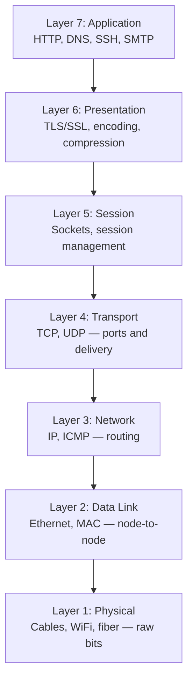
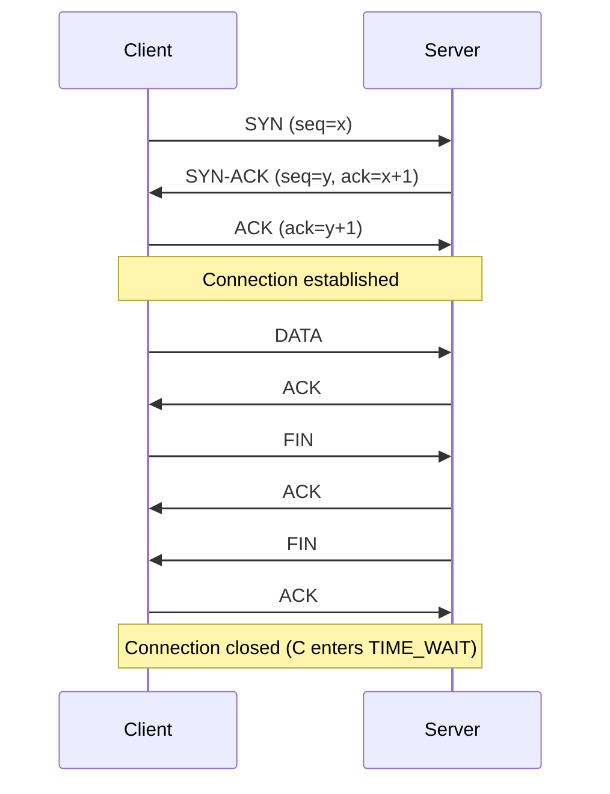
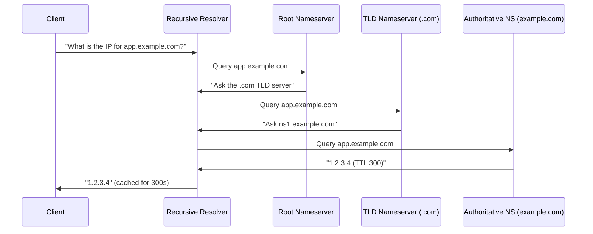
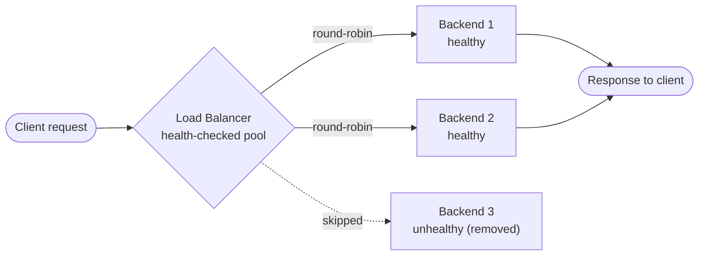
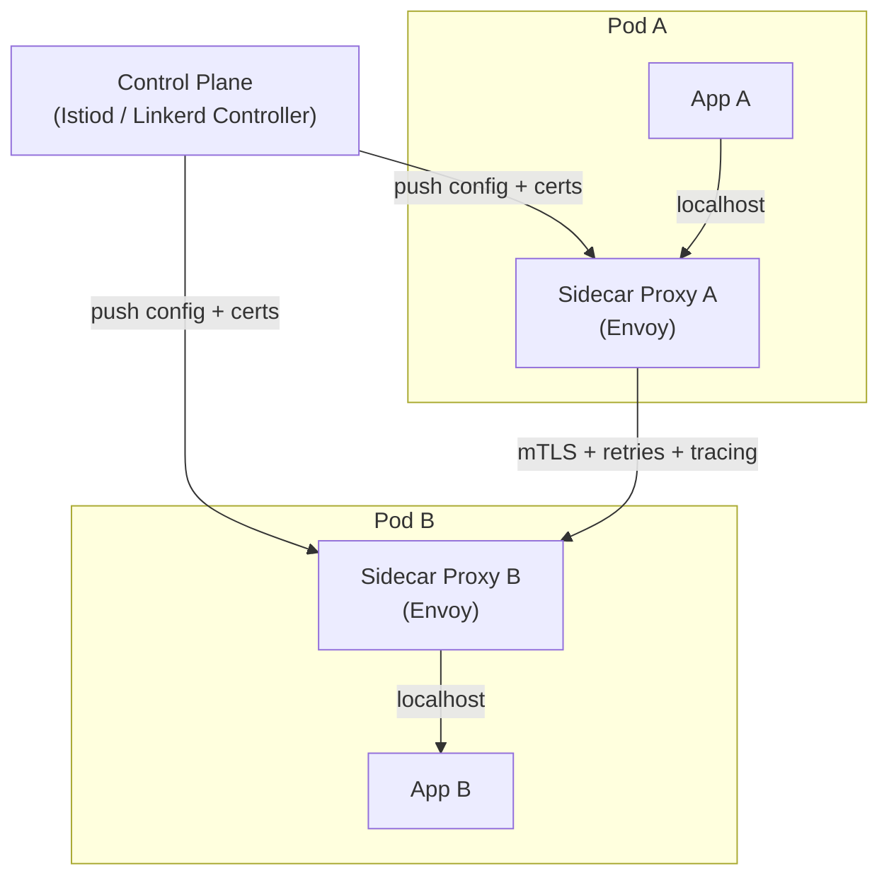

# Module 03: Networking Basics

> Part of the [DevOps Career Course](./README.md) by UncleJS

[](https://creativecommons.org/licenses/by-nc-sa/4.0/)      

**Prerequisites:** Modules 01 and 02. A Ubuntu 24.04 VM with a network connection.

**Time:** About 8 hours, including the labs.

**Lab:** Ubuntu 24.04. Install `dnsutils`, `iproute2`, `netcat-openbsd`, and `tcpdump` before the labs. Docker examples in the Traefik section are read-only until module 05.

---

## Table of Contents

- [Overview](#overview)
- [Learning Objectives](#learning-objectives)
- [Beginner: The OSI Model](#beginner-the-osi-model)
- [Beginner: TCP/IP Fundamentals](#beginner-tcpip-fundamentals)
- [Beginner: DNS](#beginner-dns)
- [Intermediate: Load Balancing](#intermediate-load-balancing)
- [Intermediate: Reverse Proxies](#intermediate-reverse-proxies)
- [Intermediate: Network Troubleshooting](#intermediate-network-troubleshooting)
- [Advanced: DNS at Scale](#advanced-dns-at-scale)
- [Advanced: Service Mesh Introduction](#advanced-service-mesh-introduction)
- [Hands-On Labs](#hands-on-labs)
- [Further Reading](#further-reading)

---

## Overview

Networks are the nervous system of modern infrastructure. Every container you run, every server you deploy, every API call your application makes — all of it depends on networking. DevOps engineers who understand networking can diagnose production issues faster, design better infrastructure, and communicate effectively with network teams.

This module covers the key networking concepts every DevOps engineer must know, from TCP/IP basics and DNS fundamentals through load balancing, reverse proxies, and the deep operational mechanics of modern tools like HAProxy and Traefik.

[↑ Back to TOC](#table-of-contents)

---

## Learning Objectives

By the end of this module you will be able to:

- Understand IP addressing, subnets, and CIDR notation
- Explain DNS resolution and debug DNS problems
- Test whether a TCP port is open with `nc` and `ss`
- Understand HTTP request/response cycles including status codes
- Configure firewall rules with `ufw`
- Configure HAProxy to balance three local HTTP servers
- Diagnose DNS and HTTP with `dig` and `curl`

[↑ Back to TOC](#table-of-contents)

---

## Beginner: The OSI Model

The OSI (Open Systems Interconnection) model is a conceptual framework describing how data moves across a network in 7 layers.

The OSI model is primarily useful as a troubleshooting vocabulary, not as a literal description of how modern protocols are implemented. Real-world networking collapses several OSI layers — TCP/IP ignores layers 5 and 6 almost entirely. But the framework gives engineers a shared language for diagnosing failures: when a colleague says "this looks like a layer 3 problem," everyone immediately knows to look at routing and IP addressing rather than at application code or TLS certificates. That precision saves hours of unfocused debugging.

Troubleshooting networks systematically means working from the bottom up. Start by confirming the physical and IP layers are functioning: can you `ping` the target? If not, is the route correct? Are firewall rules blocking ICMP? Once layer 3 is confirmed, move to layer 4: can you `nc -zv` the target port? A TCP connection refused means the host is reachable but nothing is listening. A timeout means firewall or routing is blocking the packet before it reaches the host. Only once you have confirmed transport connectivity should you start examining application behavior.

Understanding which layer a protocol operates at predicts what can go wrong. HTTP/S, gRPC, and WebSocket are layer 7 — they depend on everything below them working correctly. TLS is usually classified at layer 6 (Presentation) — a certificate error is a TLS handshake failure that happens before any HTTP is exchanged. DNS is a layer 7 protocol that exists to support other layer 7 protocols. This layering explains why a valid HTTP request can fail due to a DNS misconfiguration, a routing loop, a dropped TCP SYN, a TLS version mismatch, or a misconfigured application — and why a methodical bottom-up approach is the only reliable diagnostic strategy.


```mermaid
flowchart TD
    L7["Layer 7: Application<br/>HTTP, DNS, SSH, SMTP"]
    L6["Layer 6: Presentation<br/>TLS/SSL, encoding, compression"]
    L5["Layer 5: Session<br/>Sockets, session management"]
    L4["Layer 4: Transport<br/>TCP, UDP — ports and delivery"]
    L3["Layer 3: Network<br/>IP, ICMP — routing"]
    L2["Layer 2: Data Link<br/>Ethernet, MAC — node-to-node"]
    L1["Layer 1: Physical<br/>Cables, WiFi, fiber — raw bits"]

    L7 --> L6
    L6 --> L5
    L5 --> L4
    L4 --> L3
    L3 --> L2
    L2 --> L1
```

| Layer | Name | Examples | What it Does |
|---|---|---|---|
| 7 | Application | HTTP, DNS, SSH, FTP | User-facing protocols |
| 6 | Presentation | TLS/SSL, encoding | Encryption, compression |
| 5 | Session | Sockets | Manages connections |
| 4 | Transport | TCP, UDP | End-to-end delivery, ports |
| 3 | Network | IP, ICMP | Routing between networks |
| 2 | Data Link | Ethernet, MAC | Node-to-node delivery |
| 1 | Physical | Cables, WiFi, fiber | Raw bit transmission |

> **DevOps tip**: You most commonly work at layers 3–7. When something fails, work from the bottom up — is the physical/IP layer working? Then transport? Then application?

**Why this matters in practice:**

- A `502 Bad Gateway` means the reverse proxy could not complete a valid response from the upstream. That includes a bad HTTP response and a failed or reset TCP connection.
- A connection timeout is often a Layer 3/4 problem — routing or firewall
- A `503 Service Unavailable` from a load balancer means all backends failed health checks (Layer 7)
- SSL certificate errors are Layer 6 — TLS handshake failed before any HTTP was exchanged

[↑ Back to TOC](#table-of-contents)

---

## Beginner: TCP/IP Fundamentals

The 3-way handshake — SYN, SYN-ACK, ACK — is not just a protocol detail; it is the foundation of reliable communication. Before TCP transmits a single byte of data, it verifies that both sides are reachable, both have available buffer space, and both agree on initial sequence numbers. The sequence numbers are what make TCP reliable: every byte is numbered, every received byte is acknowledged, and any gap triggers retransmission. This reliability comes at a cost — at minimum, one round trip is required before data transfer begins, which is why HTTP/2 and QUIC invest so much engineering effort in reducing connection establishment overhead.

`TIME_WAIT` is one of the most misunderstood TCP states. The side that sends the first FIN (the active closer) stays in `TIME_WAIT` for 60 seconds on Linux (`TCP_TIMEWAIT_LEN`). That side is often the server, not the client that opened the connection. `tcp_fin_timeout` applies to `FIN_WAIT_2`, not to `TIME_WAIT`. The wait stops a delayed packet from an old connection being accepted by a new one on the same ports. Thousands of `TIME_WAIT` sockets are normal. They become a problem only when the local port range (`ip_local_port_range`) is exhausted.

Understanding TCP connection teardown is important for debugging half-open connections and stuck processes. A clean close uses four steps: FIN from the initiator, ACK from the peer, FIN from the peer, ACK from the initiator. If one side closes but the other does not, you get `CLOSE_WAIT` on the passive side — a common symptom of a bug where a process fails to close a socket when its upstream connection closes. `ss -s` gives you a count of connections in each state; `CLOSE_WAIT` counts that grow over time indicate an application bug that will eventually exhaust file descriptors.


```mermaid
sequenceDiagram
    participant C as Client
    participant S as Server
    C->>S: SYN (seq=x)
    S->>C: SYN-ACK (seq=y, ack=x+1)
    C->>S: ACK (ack=y+1)
    Note over C,S: Connection established
    C->>S: DATA
    S->>C: ACK
    C->>S: FIN
    S->>C: ACK
    S->>C: FIN
    C->>S: ACK
    Note over C,S: Connection closed (C enters TIME_WAIT)
```

### TCP vs UDP

| Feature | TCP | UDP |
|---|---|---|
| Connection | Connection-oriented (3-way handshake) | Connectionless |
| Reliability | Guaranteed delivery, ordered packets | No guarantee |
| Speed | Slower (overhead) | Faster |
| Use cases | HTTP/S, SSH, databases | DNS, video streaming, VoIP |

### The TCP 3-Way Handshake

```
Client          Server
  │── SYN ──────▶│    "Can we connect?"
  │◀── SYN-ACK ──│    "Yes, I'm ready"
  │── ACK ───────▶│    "Great, let's go"
  │═══ DATA ══════│    Connection established
```

**Connection teardown** uses a 4-step FIN/ACK exchange. When you see lots of `TIME_WAIT` sockets, connections are being closed and waiting for late packets — normal on busy servers.

```bash
# See TCP connection states
ss -s
# Output shows: established, time-wait, close-wait, etc.
```

### ICMP

ICMP (Internet Control Message Protocol) is used for diagnostics — `ping` uses ICMP echo requests and replies.

```bash
sudo apt install -y traceroute mtr-tiny
ping -c 4 8.8.8.8
traceroute 8.8.8.8
mtr --report --report-cycles 1 8.8.8.8
```

> **Firewall note**: Many cloud providers block ICMP by default. A failed `ping` doesn't necessarily mean the host is down — test with `nc` or `curl` on a known-open port first.

[↑ Back to TOC](#table-of-contents)

---

## Beginner: IP Addressing & Subnetting

### IPv4 Address Classes

IPv4 addresses are 32-bit numbers written as four octets (e.g., `192.168.1.100`).

| Range | Type | Common Use |
|---|---|---|
| `10.0.0.0/8` | Private | Large enterprise networks, cloud VPCs |
| `172.16.0.0/12` | Private | Mid-size networks, Docker default bridge |
| `192.168.0.0/16` | Private | Home/small office networks |
| `127.0.0.0/8` | Loopback | Localhost (your own machine) |
| `169.254.0.0/16` | Link-local | APIPA, cloud instance metadata |
| Everything else | Public | Internet-routable |

> **Cloud note**: The metadata endpoint `169.254.169.254` is how EC2/GCE/Azure instances retrieve instance metadata and IAM credentials. If you see traffic going to this IP, it's normal cloud behavior.

### CIDR Notation

CIDR (Classless Inter-Domain Routing) expresses IP addresses and their network masks together.

```
192.168.1.0/24
│             └── 24 bits are network bits → 256 addresses (254 usable)
└── Network address

Common CIDR blocks:
/32  = 1 IP address (single host)
/30  = 4 IPs (2 usable — point-to-point links)
/29  = 8 IPs (6 usable)
/28  = 16 IPs (14 usable)
/27  = 32 IPs (30 usable)
/24  = 256 IPs (254 usable) — typical LAN subnet
/16  = 65,536 IPs — VPC/large network
/8   = 16,777,216 addresses. Classful "class A" addressing is obsolete; this is only the size of a /8.
```

**Address count**: For a normal subnet, usable hosts = `2^(32-N) - 2` (network and broadcast). `/24` = 254 usable hosts. That formula does not apply at the ends: `/32` is one host, and `/31` has two usable addresses (RFC 3021, point-to-point).

### IPv6

IPv6 uses 128-bit addresses written in hexadecimal. Increasingly common in cloud networking.

```
2001:0db8:85a3:0000:0000:8a2e:0370:7334
# Can be compressed: 2001:db8:85a3::8a2e:370:7334
```

| IPv6 Range | Purpose |
|---|---|
| `::1/128` | Loopback (equivalent to 127.0.0.1) |
| `fe80::/10` | Link-local (auto-configured per interface) |
| `fc00::/7` | Unique local addresses. `fd00::/8` is the locally assigned half of that block. |
| `2000::/3` | Global unicast (public internet) |

[↑ Back to TOC](#table-of-contents)

---

## Beginner: DNS

DNS (Domain Name System) translates human-readable domain names into IP addresses.

TTL (Time To Live) is the most operationally significant field in a DNS record, and it is consistently underestimated until a bad deploy makes it painfully obvious. TTL is the number of seconds that resolvers and clients are allowed to cache an answer. A TTL of 3600 means changes to your DNS records will not propagate to all clients for up to an hour after you make them. Before any DNS-dependent migration — changing IP addresses, moving to a new provider, cutover to a new load balancer — lower your TTL to 60 or 300 seconds at least one TTL period in advance. After the cutover, raise it back. Failing to do this is how planned maintenances turn into hour-long incidents.

The distinction between authoritative and recursive resolvers is critical for debugging. An authoritative nameserver holds the actual DNS records for a domain and answers queries with `aa` (authoritative answer) set. A recursive resolver (like `8.8.8.8` or your ISP's resolver) does not hold records — it queries the DNS hierarchy on your behalf and caches the results. When `dig` returns stale data, you are seeing the recursive resolver's cache. To see the current authoritative answer, query the authoritative nameserver directly: `dig @ns1.example.com example.com`. A mismatch between what the authoritative nameserver says and what a recursive resolver returns indicates a caching or propagation delay.

Negative caching is the detail that bites a name you just created. When a query returns NXDOMAIN, resolvers cache that answer for the SOA minimum TTL, and the cache key is the name that was queried. If clients asked for `app.example.com` before the record existed, they keep getting NXDOMAIN for that same name until the negative cache expires. Creating the record does not flush resolvers. Confirm with `dig @ns1.example.com app.example.com` against the authoritative server, then wait out or flush the recursive cache.


```mermaid
sequenceDiagram
    participant C as Client
    participant R as Recursive Resolver
    participant ROOT as Root Nameserver
    participant TLD as TLD Nameserver (.com)
    participant AUTH as Authoritative NS (example.com)

    C->>R: "What is the IP for app.example.com?"
    R->>ROOT: Query app.example.com
    ROOT->>R: "Ask the .com TLD server"
    R->>TLD: Query app.example.com
    TLD->>R: "Ask ns1.example.com"
    R->>AUTH: Query app.example.com
    AUTH->>R: "1.2.3.4 (TTL 300)"
    R->>C: "1.2.3.4" (cached for 300s)
```

### How DNS Resolution Works

```
Browser asks: "What is the IP for app.example.com?"

1. Check local cache (fastest)
2. Check /etc/hosts file
3. Ask configured DNS resolver (e.g., 8.8.8.8)
4. Resolver queries the root DNS system (13 root server identities, delivered globally via many anycast instances)
5. Root servers point to .com TLD servers
6. TLD servers point to example.com nameservers
7. example.com nameservers return the IP
8. Answer cached per TTL and returned to browser
```

### DNS Record Types

| Record | Purpose | Example |
|---|---|---|
| **A** | Domain → IPv4 address | `app.example.com → 1.2.3.4` |
| **AAAA** | Domain → IPv6 address | `app.example.com → 2001:db8::1` |
| **CNAME** | Domain → another domain | `www → app.example.com` |
| **MX** | Mail server for domain | `example.com → mail.example.com` |
| **TXT** | Arbitrary text (SPF, DKIM, verification) | `v=spf1 include:...` |
| **NS** | Nameservers for domain | `example.com NS ns1.example.com` |
| **PTR** | IP → domain (reverse DNS) | `1.2.3.4 → app.example.com` |
| **SRV** | Service location (host + port) | Used by Kubernetes, SIP |
| **CAA** | Certificate Authority Authorization | Restricts which CAs can issue certs |

### DNS Commands

```bash
# Query DNS records
dig example.com                      # Default A record query
dig example.com MX                   # Query MX records
dig example.com NS                   # Query nameservers
dig example.com TXT                  # Query TXT records (SPF, DKIM)
dig @8.8.8.8 example.com            # Query using a specific resolver
dig +short example.com              # Just the IP address
dig +trace example.com              # Full delegation trace from root

nslookup example.com                # Interactive DNS query tool
host example.com                    # Simple DNS lookup

# Reverse DNS lookup
dig -x 1.2.3.4                      # PTR record for an IP

# Check /etc/hosts first
cat /etc/hosts                      # Local hostname overrides
cat /etc/resolv.conf               # Ubuntu 24.04: stub resolver at 127.0.0.53
resolvectl status                  # Upstream resolvers systemd-resolved actually uses
```

[↑ Back to TOC](#table-of-contents)

---

## Beginner: Common Ports & Protocols

| Port | Protocol | Service |
|---|---|---|
| 20, 21 | TCP | FTP (File Transfer Protocol) |
| 22 | TCP | SSH (Secure Shell) |
| 25 | TCP | SMTP (email sending) |
| 53 | TCP/UDP | DNS |
| 67, 68 | UDP | DHCP (server/client) |
| 80 | TCP | HTTP |
| 123 | UDP | NTP (time sync) |
| 443 | TCP | HTTPS |
| 3306 | TCP | MySQL / MariaDB |
| 5432 | TCP | PostgreSQL |
| 6379 | TCP | Redis |
| 8080 | TCP | HTTP (alternate/dev) |
| 8443 | TCP | HTTPS (alternate) |
| 9090 | TCP | Prometheus |
| 9100 | TCP | Node Exporter (Prometheus) |
| 27017 | TCP | MongoDB |

```bash
# Check what's listening on your system
ss -tulnp                           # Modern — show TCP/UDP listeners
lsof -i :80                         # Show what's using port 80

# Test if a port is open
nc -zv hostname 443                 # netcat port test
telnet hostname 22                  # Test SSH port (legacy)
curl -v telnet://hostname:22        # Test via curl
```

[↑ Back to TOC](#table-of-contents)

---

## Beginner: HTTP & HTTPS

HTTP is the protocol that powers the web. As a DevOps engineer you will work with it constantly — debugging APIs, configuring load balancers, and setting up TLS.

### HTTP Request Structure

```
GET /api/users HTTP/1.1
Host: api.example.com
Authorization: Bearer eyJhbGc...
Content-Type: application/json
Accept: application/json

{"name": "Alice"}
```

### HTTP Status Codes

| Range | Category | Common Codes |
|---|---|---|
| `1xx` | Informational | `100 Continue` |
| `2xx` | Success | `200 OK`, `201 Created`, `204 No Content` |
| `3xx` | Redirection | `301 Moved Permanently`, `302 Found`, `304 Not Modified` |
| `4xx` | Client Error | `400 Bad Request`, `401 Unauthorized`, `403 Forbidden`, `404 Not Found`, `429 Too Many Requests` |
| `5xx` | Server Error | `500 Internal Server Error`, `502 Bad Gateway`, `503 Service Unavailable`, `504 Gateway Timeout` |

**DevOps-specific status codes to know well:**

| Code | Meaning | Common Cause |
|---|---|---|
| `502 Bad Gateway` | Proxy received an invalid response | Backend crashed, wrong port, app error |
| `503 Service Unavailable` | No healthy backend available | All backends failed health checks |
| `504 Gateway Timeout` | Backend too slow to respond | DB query hanging, app overloaded |
| `429 Too Many Requests` | Rate limit exceeded | Client sending too many requests |

### curl for HTTP Testing

```bash
curl https://example.com                          # GET request
curl -I https://example.com                       # HEAD — headers only
curl -X POST https://api.example.com/users \      # POST with JSON body
     -H "Content-Type: application/json" \
     -d '{"name": "Alice"}'
curl -u user:password https://api.example.com     # Basic auth
curl -H "Authorization: Bearer TOKEN" https://...  # Bearer token
curl -o output.html https://example.com           # Save to file
curl -w "%{http_code}" -o /dev/null https://...   # Print status code only
curl -k https://self-signed.example.com           # Skip TLS verification
curl -v https://example.com                       # Verbose — show full exchange
curl --resolve example.com:443:1.2.3.4 https://example.com  # Test specific IP
```

### TLS/SSL

HTTPS = HTTP + TLS. TLS encrypts data in transit and verifies server identity via certificates.

```bash
# Inspect a site's TLS certificate
openssl s_client -connect example.com:443 -showcerts
echo | openssl s_client -connect example.com:443 2>/dev/null | openssl x509 -noout -dates

# Check certificate expiry
curl -vI https://example.com 2>&1 | grep -i "expire\|subject\|issuer"

# Test TLS version support
openssl s_client -connect example.com:443 -tls1_2
openssl s_client -connect example.com:443 -tls1_3
```

[↑ Back to TOC](#table-of-contents)

---

## Intermediate: Firewalls & iptables

A firewall controls which network traffic is allowed to enter or leave a system.

### ufw — Uncomplicated Firewall (Ubuntu)

```bash
sudo ufw allow 22/tcp               # Allow SSH before enabling, or a remote VM locks you out
sudo ufw --force enable
sudo ufw status verbose             # Show rules and status
sudo ufw allow 80/tcp               # Allow HTTP
sudo ufw allow 443/tcp              # Allow HTTPS
sudo ufw deny 3306/tcp              # Block MySQL from outside
sudo ufw allow from 192.168.1.0/24  # Allow entire subnet
sudo ufw allow from 10.0.0.5 to any port 5432  # Allow specific host to PostgreSQL
sudo ufw delete allow 80/tcp        # Remove a rule
sudo ufw reset                      # Reset all rules

# Rate limiting (brute force protection)
sudo ufw limit 22/tcp               # Allow SSH but rate-limit connection attempts
```

### iptables — Low-Level Firewall

`iptables` operates on **chains** (`INPUT`, `OUTPUT`, `FORWARD`) within **tables** (`filter`, `nat`, `mangle`).

```bash
# List all rules with verbose detail
sudo iptables -L -v -n --line-numbers

# Allow established connections (essential — do this first!)
sudo iptables -A INPUT -m state --state ESTABLISHED,RELATED -j ACCEPT

# Allow loopback
sudo iptables -A INPUT -i lo -j ACCEPT

# Allow HTTP and HTTPS
sudo iptables -A INPUT -p tcp --dport 80 -j ACCEPT
sudo iptables -A INPUT -p tcp --dport 443 -j ACCEPT

# Rate limit SSH. This must be the SSH rule. An earlier unconditional ACCEPT would make it dead code.
sudo iptables -A INPUT -p tcp --dport 22 -m limit --limit 6/min -j ACCEPT

# Drop everything else on INPUT
sudo iptables -P INPUT DROP

# NAT — masquerade traffic from a private network (basic router config)
IFACE=$(ip -o -4 route show to default | awk '{print $5; exit}')
sudo iptables -t nat -A POSTROUTING -s 10.0.0.0/8 -o "$IFACE" -j MASQUERADE

# Persist rules. The redirect must run as root, and the directory comes from iptables-persistent.
sudo apt install -y iptables-persistent
sudo sh -c 'iptables-save > /etc/iptables/rules.v4'
sudo sh -c 'iptables-restore < /etc/iptables/rules.v4'
```

### nftables — The Modern Replacement

`nftables` replaces `iptables` on modern Linux systems (RHEL 8+, Debian 10+).

```nft
# A basic nftables config (/etc/nftables.conf)
table inet filter {
    chain input {
        type filter hook input priority 0; policy drop;

        ct state established,related accept
        iif lo accept
        tcp dport 22 accept
        tcp dport { 80, 443 } accept
    }
    chain forward {
        type filter hook forward priority 0; policy drop;
    }
    chain output {
        type filter hook output priority 0; policy accept;
    }
}
```

[↑ Back to TOC](#table-of-contents)

---

## Intermediate: Load Balancing

A load balancer distributes incoming traffic across multiple servers to improve availability and performance.

The practical difference between Layer 4 and Layer 7 load balancing matters for how you architect systems. A Layer 4 load balancer sees only IP addresses and port numbers — it forwards TCP streams without reading the content. This makes it extremely fast and capable of handling any TCP or UDP protocol without protocol-specific configuration. The tradeoff is inflexibility: you cannot route based on URL paths, HTTP headers, or cookies, and you cannot do SSL termination at the load balancer. Layer 7 load balancers parse HTTP, which enables path-based routing, header manipulation, cookie-based session affinity, and SSL termination. Nearly all modern web applications use Layer 7 load balancing.

Health checks are not optional in production load balancing — they are the mechanism that makes high availability work. Without health checks, a load balancer continues sending traffic to a backend that is crashed, overloaded, or returning errors. The health check frequency (every 5–10 seconds is typical) and failure threshold (2–3 consecutive failures before removal) determine how quickly the load balancer reacts to failures. A 10-second interval with a 3-failure threshold means up to 30 seconds of errors before a bad backend is removed. For high-availability systems, tune these parameters to your acceptable error window, and ensure your health check endpoint tests actual service health — not just "the process is running."

Graceful backend removal is a subtlety that many engineers miss. When a backend is removed from rotation — intentionally during a deployment or automatically due to a failed health check — in-flight requests on existing connections must be allowed to complete. Removing a backend by closing its connections immediately causes request errors for active users. The correct pattern is to stop sending new requests (remove from upstream pool), wait for a drain period (typically 30–60 seconds) for in-flight requests to complete, then terminate the backend. NGINX's `proxy_next_upstream` directive and AWS ALB's connection draining implement this; know how to configure it for your load balancer.


```mermaid
flowchart LR
    CLIENT(["Client request"])
    LB{"Load Balancer<br/>health-checked pool"}
    B1["Backend 1<br/>healthy"]
    B2["Backend 2<br/>healthy"]
    B3["Backend 3<br/>unhealthy (removed)"]
    RESP(["Response to client"])

    CLIENT --> LB
    LB -->|"round-robin"| B1
    LB -->|"round-robin"| B2
    LB -.->|"skipped"| B3
    B1 --> RESP
    B2 --> RESP
```

### Load Balancing Algorithms

| Algorithm | Description | Best For |
|---|---|---|
| **Round Robin** | Requests distributed in rotation | Stateless apps with equal capacity servers |
| **Least Connections** | Send to server with fewest active connections | Long-lived connections, varying request complexity |
| **IP Hash** | Same client IP always goes to same server | Session-sticky applications |
| **Weighted Round Robin** | Servers get traffic proportional to weight | Mixed-capacity server pools |
| **Random** | Random server selection | Simple, low-overhead distribution |
| **Health-Check Based** | Automatically remove unhealthy servers | Production high-availability |

### Layer 4 vs Layer 7 Load Balancing

| Type | Layer | Sees | Examples | Speed |
|---|---|---|---|---|
| **Layer 4** | Transport (TCP/UDP) | IP + port only | AWS NLB, HAProxy TCP mode | Fastest — no HTTP parsing |
| **Layer 7** | Application (HTTP) | Full request — URL, headers, cookies, body | AWS ALB, Nginx, HAProxy HTTP mode, Traefik | Flexible, feature-rich |

**When to use Layer 4**: ultra-low latency, non-HTTP protocols (MySQL, Redis), and TLS passthrough. gRPC is HTTP/2, so a Layer 7 proxy can route it.  
**When to use Layer 7**: path-based routing, header manipulation, A/B testing, authentication, canary deployments.

### Nginx as Load Balancer

```nginx
upstream backend {
    least_conn;                        # Least connections algorithm
    server web01.example.com:8080 weight=3;  # Higher weight = more traffic
    server web02.example.com:8080 weight=1;
    server web03.example.com:8080 backup;    # Only used when others are down
    keepalive 32;                      # Reuse upstream connections
}

server {
    listen 80;
    server_name app.example.com;

    location / {
        proxy_pass http://backend;
        proxy_http_version 1.1;
        proxy_set_header Connection "";
        proxy_set_header Host              $host;
        proxy_set_header X-Real-IP         $remote_addr;
        proxy_set_header X-Forwarded-For   $proxy_add_x_forwarded_for;
        proxy_set_header X-Forwarded-Proto $scheme;

        # Timeouts
        proxy_connect_timeout 5s;
        proxy_send_timeout    60s;
        proxy_read_timeout    60s;
    }
}
```

### HAProxy as Load Balancer

HAProxy is the gold standard for high-performance Layer 4 and Layer 7 load balancing. It is battle-tested at enormous scale (GitHub, Reddit, Stack Overflow all use it).

**Basic HAProxy configuration (`/etc/haproxy/haproxy.cfg`):**

```haproxy
#--------------------------------------------------------------------
# Global settings
#--------------------------------------------------------------------
global
    log /dev/log local0 info
    maxconn 50000
    user haproxy
    group haproxy
    daemon
    stats socket /run/haproxy/admin.sock mode 660 level admin

#--------------------------------------------------------------------
# Default settings (inherited by all frontends/backends)
#--------------------------------------------------------------------
defaults
    log     global
    mode    http
    option  httplog
    option  dontlognull
    option  forwardfor
    option  http-server-close
    timeout connect 5s
    timeout client  30s
    timeout server  30s
    timeout http-request 10s

#--------------------------------------------------------------------
# Frontend — where HAProxy listens
#--------------------------------------------------------------------
frontend http_in
    bind *:80
    bind *:443 ssl crt /etc/haproxy/certs/example.com.pem

    # Redirect HTTP → HTTPS
    http-request redirect scheme https unless { ssl_fc }

    # Route based on Host header
    acl is_api   hdr(host) -i api.example.com
    acl is_admin hdr(host) -i admin.example.com

    use_backend api_servers   if is_api
    use_backend admin_servers if is_admin
    default_backend web_servers

#--------------------------------------------------------------------
# Backends — where traffic goes
#--------------------------------------------------------------------
backend web_servers
    balance leastconn
    option httpchk GET /health HTTP/1.1\r\nHost:\ example.com
    http-check expect status 200

    server web01 10.0.1.10:8080 check inter 5s fall 3 rise 2 weight 1
    server web02 10.0.1.11:8080 check inter 5s fall 3 rise 2 weight 1
    server web03 10.0.1.12:8080 check inter 5s fall 3 rise 2 weight 1 backup

backend api_servers
    balance roundrobin
    option httpchk GET /api/health HTTP/1.1\r\nHost:\ api.example.com
    server api01 10.0.2.10:3000 check
    server api02 10.0.2.11:3000 check

backend admin_servers
    balance source
    server admin01 10.0.3.10:4000 check

#--------------------------------------------------------------------
# Statistics dashboard
#--------------------------------------------------------------------
listen stats
    bind *:8404
    stats enable
    stats uri /stats
    stats refresh 10s
    stats auth admin:strongpassword
    stats show-legends
    stats show-node
```

### HAProxy Health Checks

```haproxy
backend web_servers
    # HTTP health check — checks a specific endpoint
    option httpchk GET /health HTTP/1.1\r\nHost:\ example.com
    http-check expect status 200

    # TCP health check (default) — just tests the connection opens
    # option tcp-check

    # Health check parameters per server:
    # check           = enable health checking
    # inter 5s        = check every 5 seconds
    # fall 3          = mark down after 3 consecutive failures
    # rise 2          = mark up after 2 consecutive successes
    server web01 10.0.1.10:8080 check inter 5s fall 3 rise 2

    # Slow start — ramp up traffic to a freshly recovered server
    server web02 10.0.1.11:8080 check inter 5s fall 3 rise 2 slowstart 60s
```

### Sticky Sessions (Session Persistence)

When users must always reach the same backend (e.g., server-side sessions), use sticky sessions:

```haproxy
backend web_servers
    balance roundrobin

    # Cookie-based stickiness — HAProxy sets a cookie
    cookie SERVERID insert indirect nocache

    server web01 10.0.1.10:8080 check cookie web01
    server web02 10.0.1.11:8080 check cookie web02
    server web03 10.0.1.12:8080 check cookie web03
```

> **Best practice**: Prefer stateless applications and external session stores (Redis) over sticky sessions. Sticky sessions make deployments and scaling harder. Reserve them for legacy apps that cannot be made stateless.

### Connection Draining (Graceful Server Removal)

When removing a server from the pool (deploy, maintenance), drain it first to avoid dropping active connections:

```bash
# Using the HAProxy runtime API (admin socket)
echo "set server web_servers/web01 state drain" | \
    sudo socat stdio /run/haproxy/admin.sock

# Check the current server state
echo "show servers state web_servers" | \
    sudo socat stdio /run/haproxy/admin.sock

# After sessions drain to zero, take it out of rotation
echo "set server web_servers/web01 state maint" | \
    sudo socat stdio /run/haproxy/admin.sock
```

The `drain` state means: accept no new sessions, but finish active ones. The `maint` state means: offline completely.

### Connection Limits

```haproxy
global
    maxconn 50000          # Total connections across all frontends

frontend http_in
    bind *:80
    maxconn 20000          # Max connections on this frontend

backend web_servers
    # Limit per-server concurrent connections
    server web01 10.0.1.10:8080 check maxconn 500
    server web02 10.0.1.11:8080 check maxconn 500
```

[↑ Back to TOC](#table-of-contents)

---

## Intermediate: Reverse Proxies

A **reverse proxy** sits in front of your application servers. Clients talk to the reverse proxy — they never connect directly to your backends.

**What a reverse proxy gives you:**
- TLS termination in one place
- Load balancing across multiple backends
- Centralized authentication and access control
- Caching, compression, response modification
- Path-based and host-based routing
- Observability (access logs, metrics)

### Nginx as Reverse Proxy

```nginx
server {
    listen 443 ssl;
    server_name app.example.com;

    ssl_certificate     /etc/letsencrypt/live/app.example.com/fullchain.pem;
    ssl_certificate_key /etc/letsencrypt/live/app.example.com/privkey.pem;

    # Security headers
    add_header Strict-Transport-Security "max-age=31536000; includeSubDomains" always;
    add_header X-Frame-Options DENY;
    add_header X-Content-Type-Options nosniff;

    location / {
        proxy_pass         http://localhost:3000;
        proxy_http_version 1.1;
        proxy_set_header   Upgrade $http_upgrade;
        proxy_set_header   Connection "upgrade";  # WebSocket support
        proxy_set_header   Host $host;
        proxy_set_header   X-Real-IP $remote_addr;
        proxy_cache_bypass $http_upgrade;
    }
}

# HTTP → HTTPS redirect
server {
    listen 80;
    server_name app.example.com;
    return 301 https://$host$request_uri;
}
```

---

### Traefik: The Cloud-Native Reverse Proxy

Traefik is a modern reverse proxy and load balancer built for dynamic cloud environments. Unlike Nginx (where you write static config files), Traefik **auto-discovers** services from Docker, Kubernetes, Consul, and more — your configuration is embedded in your containers and manifests.

**Traefik v3 is the current version.** All examples below use v3 syntax.

#### What is Traefik & How It Differs from Nginx

| Feature | Traefik | Nginx |
|---|---|---|
| Configuration | Dynamic — auto-discovers from Docker/K8s labels | Static files — requires reload on change |
| Let's Encrypt | Built-in ACME client, zero config | Requires certbot + cron |
| Dashboard | Built-in web UI showing all routes | Not included |
| Docker integration | Native — reads container labels | Manual config per container |
| Kubernetes | Native IngressRoute CRD | Requires ingress-nginx controller |
| Learning curve | Concepts are different (EntryPoints/Routers) | Config is familiar to sysadmins |
| Performance | Excellent | Fastest (C-based, battle-tested) |
| Middleware | Rich middleware chain built-in | Requires modules or Lua |
| WebSockets | Automatic | Manual `Upgrade` headers |
| Use case | Microservices, containers, K8s | High-traffic web serving, fine-grained config |

#### The Four Core Concepts

Every request through Traefik follows this path:

```
Client Request
      │
      ▼
┌─────────────┐
│ EntryPoint  │  ← Where Traefik listens (port 80, 443)
└──────┬──────┘
       │
       ▼
┌─────────────┐
│   Router    │  ← Rules: which requests go where? (Host, Path, Headers)
└──────┬──────┘
       │
       ▼
┌─────────────┐
│ Middleware  │  ← Transformations: auth, redirect, headers, rate-limit
└──────┬──────┘
       │
       ▼
┌─────────────┐
│   Service   │  ← The actual backend (load balancer + servers)
└─────────────┘
```

1. **EntryPoint** — A network port Traefik listens on (`web` = port 80, `websecure` = port 443)
2. **Router** — Rules that match incoming requests (by Host, Path, Method, Header) and route them to a service
3. **Middleware** — Request/response transformations applied to matching traffic (redirects, auth, headers)
4. **Service** — The actual backend servers, with load balancing configuration

#### Static vs Dynamic Configuration

Traefik has two config layers:

- **Static config** (`traefik.yml`): Entrypoints, providers, certificate resolvers, logging. Set once at startup.
- **Dynamic config**: Routes, middlewares, services. Updated at runtime from providers (Docker labels, K8s CRDs, file).

**Full `traefik.yml` example:**

```yaml
# /etc/traefik/traefik.yml  (or mounted at /etc/traefik/traefik.yml in container)

# --- Entrypoints ---
entryPoints:
  web:
    address: ":80"
    http:
      redirections:
        entryPoint:
          to: websecure
          scheme: https
          permanent: true
  websecure:
    address: ":443"
    http:
      tls:
        certResolver: letsencrypt

# --- Providers ---
providers:
  docker:
    exposedByDefault: false   # Opt-in: containers need label traefik.enable=true
    network: traefik-public   # Only route on this Docker network
  file:
    directory: /etc/traefik/dynamic/  # Load dynamic config from files too
    watch: true

# --- Certificate Resolvers (Let's Encrypt) ---
certificatesResolvers:
  letsencrypt:
    acme:
      email: admin@example.com
      storage: /acme/acme.json
      httpChallenge:
        entryPoint: web        # Use HTTP-01 challenge

# --- API & Dashboard ---
api:
  dashboard: true
  insecure: false              # Must be protected by a router + middleware

# --- Logging ---
log:
  level: INFO
  filePath: /var/log/traefik/traefik.log

accessLog:
  filePath: /var/log/traefik/access.log
  bufferingSize: 100

# --- Metrics ---
metrics:
  prometheus: {}
```

#### Traefik with Docker

Read this section now. Run it after module 05. The lab for this module does not use Docker.

**`docker-compose.yml` — Traefik + two apps:**

```yaml
networks:
  traefik-public:
    external: true   # Create once: docker network create traefik-public

services:
  traefik:
    image: traefik:v3
    container_name: traefik
    restart: unless-stopped
    ports:
      - "80:80"
      - "443:443"
    volumes:
      - /var/run/docker.sock:/var/run/docker.sock:ro  # Reads Docker events
      - ./traefik.yml:/etc/traefik/traefik.yml:ro
      - ./acme:/acme                                  # Persists Let's Encrypt certs
      - ./logs:/var/log/traefik
    networks:
      - traefik-public
    labels:
      # Enable Traefik on itself (for the dashboard)
      - "traefik.enable=true"
      # Dashboard router — HTTPS only
      - "traefik.http.routers.dashboard.rule=Host(`traefik.example.com`)"
      - "traefik.http.routers.dashboard.entrypoints=websecure"
      - "traefik.http.routers.dashboard.service=api@internal"
      - "traefik.http.routers.dashboard.middlewares=dashboard-auth"
      # Basic auth middleware for dashboard
      - "traefik.http.middlewares.dashboard-auth.basicauth.users=admin:$$apr1$$..."
      # (generate password: htpasswd -nb admin password | sed 's/\$/\$\$/g')

  webapp:
    image: nginx:alpine
    restart: unless-stopped
    networks:
      - traefik-public
    labels:
      - "traefik.enable=true"
      # HTTPS router
      - "traefik.http.routers.webapp.rule=Host(`app.example.com`)"
      - "traefik.http.routers.webapp.entrypoints=websecure"
      - "traefik.http.routers.webapp.middlewares=security-headers"
      # Service (what port does the container expose?)
      - "traefik.http.services.webapp.loadbalancer.server.port=80"
      # Security headers middleware
      - "traefik.http.middlewares.security-headers.headers.stsSeconds=31536000"
      - "traefik.http.middlewares.security-headers.headers.stsIncludeSubdomains=true"
      - "traefik.http.middlewares.security-headers.headers.contentTypeNosniff=true"
      - "traefik.http.middlewares.security-headers.headers.frameDeny=true"

  api:
    image: myapp/api:latest
    restart: unless-stopped
    networks:
      - traefik-public
    labels:
      - "traefik.enable=true"
      - "traefik.http.routers.api.rule=Host(`api.example.com`)"
      - "traefik.http.routers.api.entrypoints=websecure"
      - "traefik.http.services.api.loadbalancer.server.port=3000"
      # Sticky sessions (if needed)
      - "traefik.http.services.api.loadbalancer.sticky.cookie=true"
      - "traefik.http.services.api.loadbalancer.sticky.cookie.name=lb_session"
```

**Create the external network first:**

```bash
docker network create traefik-public
```

**Generate a bcrypt password for the dashboard:**

```bash
# Install apache2-utils if needed
sudo apt install -y apache2-utils
htpasswd -nb admin mypassword | sed 's/\$/\$\$/g'
# Double-escaped $ is required in Docker labels
```

#### Traefik with Kubernetes

Traefik supports two approaches in Kubernetes:

**1. Standard `Ingress` resource** (compatible with any ingress controller):

```yaml
apiVersion: networking.k8s.io/v1
kind: Ingress
metadata:
  name: webapp-ingress
  annotations:
    traefik.ingress.kubernetes.io/router.middlewares: default-redirect-https@kubernetescrd
spec:
  ingressClassName: traefik
  rules:
    - host: app.example.com
      http:
        paths:
          - path: /
            pathType: Prefix
            backend:
              service:
                name: webapp
                port:
                  number: 80
```

**2. Native `IngressRoute` CRD** (Traefik-specific, more powerful):

```yaml
apiVersion: traefik.io/v1alpha1
kind: IngressRoute
metadata:
  name: webapp
  namespace: default
spec:
  entryPoints:
    - websecure
  routes:
    - match: Host(`app.example.com`)
      kind: Rule
      services:
        - name: webapp
          port: 80
      middlewares:
        - name: security-headers
  tls:
    certResolver: letsencrypt
---
apiVersion: traefik.io/v1alpha1
kind: Middleware
metadata:
  name: security-headers
  namespace: default
spec:
  headers:
    stsSeconds: 31536000
    stsIncludeSubdomains: true
    contentTypeNosniff: true
    frameDeny: true
    customResponseHeaders:
      X-Powered-By: ""         # Remove this header
---
# Path-based routing — API on /api, frontend on /
apiVersion: traefik.io/v1alpha1
kind: IngressRoute
metadata:
  name: split-route
spec:
  entryPoints:
    - websecure
  routes:
    - match: Host(`example.com`) && PathPrefix(`/api`)
      kind: Rule
      services:
        - name: api-service
          port: 3000
    - match: Host(`example.com`)
      kind: Rule
      services:
        - name: frontend-service
          port: 80
  tls:
    certResolver: letsencrypt
```

#### Automatic TLS with Let's Encrypt

Traefik has a built-in ACME client. Two challenge types:

| Challenge | How it Works | Requirement |
|---|---|---|
| **HTTP-01** | Let's Encrypt makes an HTTP request to `/.well-known/acme-challenge/TOKEN` | Port 80 must be reachable from internet |
| **DNS-01** | Let's Encrypt checks for a TXT record in your DNS | DNS provider API access; works for wildcard certs |

**HTTP-01 challenge config (already in `traefik.yml` above):**

```yaml
certificatesResolvers:
  letsencrypt:
    acme:
      email: admin@example.com
      storage: /acme/acme.json
      httpChallenge:
        entryPoint: web
```

**DNS-01 challenge (wildcard certs, Cloudflare example):**

```yaml
certificatesResolvers:
  letsencrypt:
    acme:
      email: admin@example.com
      storage: /acme/acme.json
      dnsChallenge:
        provider: cloudflare
        resolvers:
          - "1.1.1.1:53"
          - "8.8.8.8:53"
```

```bash
# Environment variable required for DNS provider
CF_DNS_API_TOKEN=your_cloudflare_api_token
```

**Staging vs production:**

```yaml
# Use staging first to avoid rate limits while testing!
certificatesResolvers:
  letsencrypt-staging:
    acme:
      email: admin@example.com
      storage: /acme/acme-staging.json
      caServer: "https://acme-staging-v02.api.letsencrypt.org/directory"
      httpChallenge:
        entryPoint: web
```

> ⚠️ **Rate limits**: Let's Encrypt production limits you to 5 duplicate certificates per week. Always test with staging first. Staging certificates are not browser-trusted but are structurally valid.

**`acme.json` — protect this file:**

```bash
touch /acme/acme.json
chmod 600 /acme/acme.json   # Must be 600 — Traefik will refuse to start otherwise
```

#### The Dashboard — Enabling It Securely

The Traefik dashboard shows all routers, services, middlewares, and providers in real time. Never expose it without authentication.

```yaml
# In traefik.yml
api:
  dashboard: true
  insecure: false   # Never true in production
```

```yaml
# Docker labels to protect the dashboard
labels:
  - "traefik.enable=true"
  - "traefik.http.routers.dashboard.rule=Host(`traefik.example.com`) && (PathPrefix(`/api`) || PathPrefix(`/dashboard`))"
  - "traefik.http.routers.dashboard.entrypoints=websecure"
  - "traefik.http.routers.dashboard.service=api@internal"
  - "traefik.http.routers.dashboard.middlewares=dashboard-auth@docker"
  - "traefik.http.middlewares.dashboard-auth.basicauth.users=admin:$$apr1$$ruca84Hq$$mbjdMZBAG.KWn7dvfz/8D0"
```

#### Middleware Deep-Dive: Security Headers

```yaml
# In a dynamic config file or as Docker labels
http:
  middlewares:
    security-headers:
      headers:
        stsSeconds: 31536000                # HSTS: 1 year
        stsIncludeSubdomains: true
        stsPreload: true
        contentTypeNosniff: true            # X-Content-Type-Options: nosniff
        frameDeny: true                     # X-Frame-Options: DENY
        browserXssFilter: true             # X-XSS-Protection
        referrerPolicy: "strict-origin-when-cross-origin"
        contentSecurityPolicy: "default-src 'self'; script-src 'self'"
        customResponseHeaders:
          X-Powered-By: ""                 # Remove server fingerprinting headers
          Server: ""
        customRequestHeaders:
          X-Real-IP: ""                    # Let Traefik set this (don't trust client)
```

#### ForwardAuth — Outsourcing Authentication

Traefik can delegate authentication to an external service. Every request is forwarded to an auth server first; if it returns 200, the request proceeds; otherwise, the client gets a 401/403.

```yaml
# Middleware definition
http:
  middlewares:
    forward-auth:
      forwardAuth:
        address: "http://auth-service:4181/verify"
        trustForwardHeader: true
        authResponseHeaders:
          - "X-Auth-User"      # Pass user info to backend
          - "X-Auth-Email"
```

This pattern is used with tools like [Authelia](https://www.authelia.com/), [Vouch Proxy](https://github.com/vouch/vouch-proxy), or a custom auth service.

#### TCP and UDP Routing

Traefik can route non-HTTP protocols using SNI (for TLS) or port-based rules.

```yaml
# Route MySQL (TLS) based on SNI
tcp:
  routers:
    mysql-router:
      entryPoints:
        - mysql-entrypoint
      rule: "HostSNI(`db.example.com`)"
      service: mysql-service
      tls:
        passthrough: true   # Don't terminate TLS — pass it to the backend

  services:
    mysql-service:
      loadBalancer:
        servers:
          - address: "10.0.1.10:3306"
          - address: "10.0.1.11:3306"
```

```yaml
# entryPoints in traefik.yml for non-standard ports
entryPoints:
  mysql-entrypoint:
    address: ":3306"
```

#### Traefik Observability

Traefik emits rich observability data out of the box:

**Access logs:**

```yaml
accessLog:
  filePath: "/var/log/traefik/access.log"
  format: json         # json or common
  bufferingSize: 100
  fields:
    defaultMode: keep
    headers:
      defaultMode: drop
      names:
        User-Agent: keep
        Authorization: redact   # Redact sensitive headers
```

**Prometheus metrics** (scraped at `/metrics`):

```yaml
metrics:
  prometheus:
    addEntryPointsLabels: true
    addRoutersLabels: true
    addServicesLabels: true
    buckets:
      - 0.1
      - 0.3
      - 1.2
      - 5.0
```

**OpenTelemetry tracing:**

```yaml
tracing:
  otlp:
    grpc:
      endpoint: "otel-collector:4317"
      insecure: true
```

#### Traefik vs Nginx: When to Use Which

| Decision Criterion | Use Traefik | Use Nginx |
|---|---|---|
| Dynamic container/microservice environment | ✅ Auto-discovery | ❌ Manual config |
| Simple static site or few services | ❌ Overkill | ✅ Simple and fast |
| Kubernetes as the platform | ✅ Native IngressRoute CRD | ✅ ingress-nginx works well too |
| Let's Encrypt auto-renewal | ✅ Built-in | ❌ Needs certbot + cron |
| Need Lua scripting or OpenResty | ❌ Not supported | ✅ Native |
| Very high traffic (100k+ RPS static) | ⚠️ Benchmark first | ✅ Consistently excellent |
| Per-request auth/middleware chains | ✅ Native middleware | ⚠️ Needs auth_request module |
| Team knows nginx config syntax | ⚠️ Different mental model | ✅ Familiar |
| Need TCP/UDP routing | ✅ Built-in | ❌ Limited |

> **Rule of thumb**: If you're running containers or Kubernetes and want zero-config TLS + routing, use Traefik. If you're running a few well-defined services on VMs and need maximum performance or fine-grained control, use Nginx.

[↑ Back to TOC](#table-of-contents)

---

## Intermediate: Network Troubleshooting

A systematic approach to diagnosing network problems:

```
Layer 1/2: Can the NIC send/receive? (ip link, ethtool)
Layer 3: Can we reach the gateway? (ping gateway IP)
Layer 3: Can we reach external IPs? (ping 8.8.8.8)
Layer 7/DNS: Can we resolve names? (dig example.com)
Layer 7/App: Can we reach the service? (curl, telnet, nc)
```

### Diagnostic Commands

```bash
sudo apt install -y ethtool traceroute mtr-tiny netcat-openbsd tcpdump
IFACE=$(ip -o -4 route show to default | awk '{print $5; exit}')

# Interface status
ip addr show
ip link show
ip route show
ip route get 8.8.8.8
ethtool "$IFACE"

# Connectivity
ping -c 4 8.8.8.8
traceroute 8.8.8.8
traceroute -T -p 443 example.com
mtr --report --report-cycles 1 8.8.8.8

# DNS debugging
dig +trace example.com
dig example.com @1.1.1.1
dig example.com @8.8.8.8
resolvectl status

# Port and service testing
nc -zv example.com 443
nc -zv -w 3 example.com 443
ss -tulnp
ss -s
ss -tp

# Traffic capture
sudo tcpdump -i "$IFACE" port 80 -c 1
sudo tcpdump -i "$IFACE" host 1.2.3.4 -c 1
sudo tcpdump -i "$IFACE" -w capture.pcap -c 1
sudo tcpdump -i "$IFACE" 'tcp[tcpflags] & (tcp-syn|tcp-fin) != 0' -c 1
```

### Interpreting Common Failures

| Symptom | Likely Cause | First Check |
|---|---|---|
| `Connection refused` | Service not running on that port | `ss -tulnp \| grep PORT` |
| `Connection timed out` | Firewall dropping packets | `iptables -L`, check security groups |
| `Name resolution failed` | DNS issue | `dig hostname`, check `/etc/resolv.conf` |
| `502 Bad Gateway` | Proxy can't reach backend | Backend running? Correct port? |
| `503 Service Unavailable` | All backends failed health checks | Check backend health endpoint directly |
| High latency to one server | Routing issue or overloaded hop | `mtr hostname` — look for packet loss |

[↑ Back to TOC](#table-of-contents)

---

## Intermediate: Network Namespaces & Virtual Networking

Linux network namespaces are the technology behind container networking. Each container gets its own isolated network stack.

```bash
# Create a network namespace
sudo ip netns add myns

# List namespaces
ip netns list

# Run one command in the namespace. An interactive bash would swallow the rest of this paste.
sudo ip netns exec myns ip addr show

# Create a veth pair (virtual ethernet — like a virtual cable)
sudo ip link add veth0 type veth peer name veth1

# Move one end into the namespace
sudo ip link set veth1 netns myns

# Assign IPs
sudo ip addr add 10.0.0.1/24 dev veth0
sudo ip netns exec myns ip addr add 10.0.0.2/24 dev veth1

# Bring interfaces up
sudo ip link set veth0 up
sudo ip netns exec myns ip link set veth1 up

# Test connectivity between host and namespace
ping -c 4 10.0.0.2

# Enable IP forwarding (for routing between namespaces)
sudo sysctl -w net.ipv4.ip_forward=1
```

> **DevOps tip**: This is exactly how Docker and Podman create network isolation between containers. Each container is a network namespace connected to a bridge (`docker0` or `podman0`) via a veth pair.

### Bridge Networking

```bash
# Create a Linux bridge (software switch)
sudo ip link add br0 type bridge
sudo ip link set br0 up

# Attach a veth to the bridge
sudo ip link set veth0 master br0

# Show bridge info
bridge link show
bridge fdb show            # Forwarding database (MAC table)
```

### Overlay Networks (VXLAN)

In multi-host container environments (Docker Swarm, Kubernetes), overlay networks encapsulate container traffic inside UDP tunnels.

```
Host A (10.0.1.1)                Host B (10.0.1.2)
┌──────────────┐                ┌──────────────┐
│ Container    │                │ Container    │
│ 10.200.0.2   │                │ 10.200.0.3   │
│     │        │                │     │        │
│  veth pair   │                │  veth pair   │
│     │        │                │     │        │
│   bridge     │                │   bridge     │
│     │        │                │     │        │
│   VXLAN      │ ─── UDP 4789 ─▶│   VXLAN      │
│  (vtep)      │                │  (vtep)      │
└──────────────┘                └──────────────┘
```

[↑ Back to TOC](#table-of-contents)

---

## Advanced: DNS at Scale

### Split-Horizon DNS

Split-horizon (also called split-brain) DNS returns **different answers** to the same query depending on who is asking. Internal clients get private IPs; external clients get public IPs.

**Use case**: You have `app.example.com`. Internally it should resolve to `10.0.1.50` (your private LAN). Externally it should resolve to `203.0.113.1` (your public IP).

```
Internal client → Internal nameserver → app.example.com → 10.0.1.50
External client → Public nameserver  → app.example.com → 203.0.113.1
```

**Implementation with BIND/named:**

```
# Ubuntu 24.04: /etc/bind/named.conf.local
acl "internal" { 10.0.0.0/8; 172.16.0.0/12; 192.168.0.0/16; };

view "internal" {
    match-clients { "internal"; };
    zone "example.com" {
        type master;
        file "/etc/bind/example.com.internal";
    };
};

view "external" {
    match-clients { any; };
    zone "example.com" {
        type master;
        file "/etc/bind/example.com.external";
    };
};
```

### DNS-Based Load Balancing

Return multiple A records for a hostname — clients pick one randomly. Simple and effective for basic distribution across CDN nodes or geographic clusters.

```
app.example.com.  60  IN  A  203.0.113.1
app.example.com.  60  IN  A  203.0.113.2
app.example.com.  60  IN  A  203.0.113.3
```

**Limitations**:
- No health checks — if one server dies, DNS still returns it
- TTL prevents instant failover
- Client DNS caching can break distribution

**Better alternative**: Use GeoDNS (Cloudflare, Route53 Latency Routing) to direct users to the nearest region, then use a proper load balancer within each region.

### TTL Strategy

| TTL Value | Use Case |
|---|---|
| `30–60s` | Frequently changing services, canary deployments, migrations |
| `300s (5 min)` | Normal production services |
| `3600s (1 hr)` | Stable services you rarely change |
| `86400s (24 hr)` | Static infrastructure (mail servers, NS records) |

> **Migration tip**: Lower the TTL, then wait out the previous TTL before you change the record. If the old TTL is one day, "several hours" is not enough. Raise the TTL after the cutover.

### Route 53 Routing Policies

AWS Route 53 supports advanced DNS routing patterns:

| Policy | What it Does | Use Case |
|---|---|---|
| **Simple** | Returns all records | Basic setups |
| **Failover** | Active/passive — switch on health check failure | DR failover |
| **Geolocation** | Route by user's country/continent | Compliance, content regionalization |
| **Latency-based** | Route to lowest-latency region | Global performance |
| **Weighted** | Split traffic by percentage | Canary releases at DNS level |
| **Multi-value** | Return multiple healthy records | Basic load distribution |

[↑ Back to TOC](#table-of-contents)

---

## Advanced: Service Mesh Introduction

### What is a Service Mesh?

A **service mesh** is an infrastructure layer that handles service-to-service communication within a cluster. Instead of every application implementing retries, timeouts, circuit breaking, and mTLS itself, the mesh handles all of it transparently via sidecar proxies.

The core problem a service mesh solves is that distributed systems fail in ways that monoliths do not. When service A calls service B, and service B is slow — not down, just slow — requests pile up in A's connection pool, A's latency increases, requests to A from service C begin to time out, and the slowness in one downstream service cascades into a system-wide failure. Circuit breaking, retry budgets, and timeout propagation are the reliability primitives that contain these failures. Implementing each one correctly in application code, across dozens of services written in different languages, is impractical. A service mesh puts these primitives into the sidecar proxy where they apply uniformly.

Mutual TLS (mTLS) is the security primitive that service meshes make practical at scale. In a zero-trust network model, traffic between services within a cluster must be authenticated and encrypted — the network cannot be trusted. mTLS requires both sides of a connection to present and verify certificates, establishing that service A is who it claims to be before service B responds. Managing per-service certificates, handling rotation, and distributing a trusted CA without a service mesh requires significant PKI infrastructure. A mesh like Istio or Linkerd handles certificate issuance, rotation, and verification automatically, making zero-trust networking an operational default rather than a manual effort.

The question of when a service mesh is premature versus necessary is important. A mesh adds real operational complexity: every service now has a sidecar that consumes memory (50–100 MB per pod), introduces latency on every call (0.5–5 ms typically), and requires operators to understand an additional control plane. For small deployments with a handful of services, application-level retries and TLS termination at the ingress are sufficient. Service meshes justify their cost when you have tens or hundreds of services, need observability across service boundaries, have strict security requirements for in-cluster traffic, or need fine-grained traffic control for canary releases and A/B testing.


```mermaid
flowchart TD
    CP["Control Plane<br/>(Istiod / Linkerd Controller)"]
    CP -->|"push config + certs"| PA["Sidecar Proxy A<br/>(Envoy)"]
    CP -->|"push config + certs"| PB["Sidecar Proxy B<br/>(Envoy)"]

    subgraph "Pod A"
        APPA["App A"]
        PA
    end

    subgraph "Pod B"
        APPB["App B"]
        PB
    end

    APPA -->|"localhost"| PA
    PA -->|"mTLS + retries + tracing"| PB
    PB -->|"localhost"| APPB
```

```
Without service mesh:
  App A ──────────────────────────────▶ App B
  (each app manages retries, timeouts, TLS, tracing)

With service mesh:
  App A ──▶ [Sidecar Proxy] ──────────▶ [Sidecar Proxy] ──▶ App B
             (Envoy/Linkerd)              (Envoy/Linkerd)
             handles everything           handles everything
```

### What a Service Mesh Gives You

| Feature | Description |
|---|---|
| **mTLS everywhere** | All service-to-service traffic encrypted and mutually authenticated |
| **Traffic management** | Canary, A/B testing, circuit breaking, retries, timeouts via config |
| **Observability** | Automatic distributed tracing, metrics, and traffic topology maps |
| **Zero-trust security** | Policies define which services can talk to which |
| **Load balancing** | L7 load balancing with circuit breaking (not just round-robin) |

### Major Service Mesh Options

| Mesh | Proxy | Complexity | Best For |
|---|---|---|---|
| **Istio** | Envoy | High | Large orgs, full feature set, Kubernetes |
| **Linkerd** | Linkerd-proxy (Rust) | Low | Simplicity, CNCF graduated, K8s |
| **Consul Connect** | Envoy | Medium | Multi-platform (VMs + K8s), HashiCorp ecosystem |
| **Cilium (eBPF mesh)** | eBPF (no sidecar) | Medium | High performance, no sidecar overhead |

### When to Use a Service Mesh

**Use a service mesh when:**
- You have 10+ microservices communicating with each other
- You need end-to-end encryption (mTLS) without changing application code
- You need fine-grained traffic control for canary deployments
- Distributed tracing and topology maps are required

**Don't use a service mesh when:**
- You have a monolith or a small number of services
- Your team is small and the operational overhead isn't justified
- You're still figuring out basic Kubernetes operations

> **Rule of thumb**: A service mesh adds significant operational complexity. Get your basic Kubernetes workloads stable first. Reach for a mesh when you're solving concrete problems (mTLS enforcement, canary rollouts, circuit breaking), not pre-emptively.

### Istio Quick Concepts

```yaml
# Traffic splitting — send 90% to v1, 10% to v2 (canary)
apiVersion: networking.istio.io/v1alpha3
kind: VirtualService
metadata:
  name: reviews
spec:
  hosts:
    - reviews
  http:
    - route:
        - destination:
            host: reviews
            subset: v1
          weight: 90
        - destination:
            host: reviews
            subset: v2
          weight: 10
---
# Circuit breaker
apiVersion: networking.istio.io/v1alpha3
kind: DestinationRule
metadata:
  name: reviews
spec:
  host: reviews
  trafficPolicy:
    outlierDetection:
      consecutiveErrors: 5
      interval: 30s
      baseEjectionTime: 30s
```

[↑ Back to TOC](#table-of-contents)

---

## Tools & Commands Reference

| Command | Purpose |
|---|---|
| `ping` | Test ICMP connectivity |
| `traceroute` / `mtr` | Trace packet route |
| `dig` / `nslookup` / `host` | DNS lookups |
| `curl` | HTTP requests and testing |
| `nc` (netcat) | TCP/UDP port testing |
| `ss` / `netstat` | Show listening ports and connections |
| `ip addr` / `ip route` | Show interfaces and routing |
| `tcpdump` | Capture network traffic |
| `ufw` | Simple firewall management |
| `iptables` / `nftables` | Advanced firewall rules |
| `openssl s_client` | TLS certificate inspection |
| `haproxy` | High-performance Layer 4/7 load balancer |
| `traefik` | Cloud-native reverse proxy with auto-discovery |
| `socat` | HAProxy runtime API, advanced TCP piping |
| `resolvectl` | systemd-resolved DNS status and flush |

[↑ Back to TOC](#table-of-contents)

---

## Hands-On Labs

**Prerequisites:** `sudo apt install -y dnsutils iproute2 netcat-openbsd tcpdump haproxy lsof`. Do these labs on the Ubuntu VM, not inside a container. Allow SSH before you enable ufw.

### Lab 3.1 — DNS Investigation

1. `dig example.com A` and `dig example.com MX`
2. `dig +trace example.com`
3. Compare `dig @8.8.8.8 example.com` and `dig @1.1.1.1 example.com`
4. Add a hosts override and query it. Do not point `example.com` at localhost; HTTPS to that name will fail certificate checks.

```bash
echo '127.0.0.1 lab.local' | sudo tee -a /etc/hosts
python3 -m http.server 8080 >/tmp/lab3-http.log 2>&1 &
curl -s -o /dev/null -w '%{http_code}\n' http://lab.local:8080/
getent hosts lab.local
```

5. Remove the override: `sudo sed -i '/lab.local/d' /etc/hosts`
6. Negative cache is per name. You cannot demonstrate a TTL change without a domain you control. Read the NXDOMAIN section instead of changing a public zone.

**Expected:** `dig` prints an ANSWER section. `curl` prints `200`. `getent hosts lab.local` prints `127.0.0.1`.

**Cleanup:** `sudo sed -i '/lab.local/d' /etc/hosts; kill "$(lsof -ti:8080)" || true`

### Lab 3.2 — Port Scanning and Services

```bash
sudo apt install -y netcat-openbsd
ss -tulnp | head
nc -zv localhost 22
python3 -m http.server 8080 >/tmp/lab3-http.log 2>&1 &
ss -tulnp | grep 8080
curl -s -o /dev/null -w '%{http_code}\n' http://127.0.0.1:8080/
sudo timeout 3 tcpdump -i lo port 8080 -c 4 -A &
sleep 1
curl -s -o /dev/null http://127.0.0.1:8080/
kill "$(lsof -ti:8080)" || true
```

**Expected:** `nc` reports port 22 open if SSH is installed. `curl` prints `200`. `ss` shows python listening on 8080. After cleanup, port 8080 is closed.

**Cleanup:** included in the last `kill`.

### Lab 3.3 — Firewall Rules

Run this on a VM you can reach from the console. Allow SSH before `ufw enable`.

```bash
sudo apt install -y ufw
sudo ufw default deny incoming
sudo ufw allow 80/tcp
sudo ufw limit 22/tcp
sudo ufw --force enable
sudo apt install -y netcat-openbsd
sudo ufw status verbose
ip -4 -br addr
VM_IP=$(ip -4 -br addr show scope global | awk '{print $3}' | cut -d/ -f1 | head -1)
nc -zv -w 3 "$VM_IP" 8080 || true
nc -zv -w 3 localhost 8080 || true
```

`ufw limit` must be the SSH rule. An earlier `ufw allow 22/tcp` would match first and the limit would never run. `ufw` allows the loopback interface, so `nc` to `localhost` does not test the firewall.

**Expected:** Status is `active`. Rules include `22/tcp LIMIT` and `80/tcp ALLOW`. `nc -zv -w 3 "$VM_IP" 8080` times out. `nc -zv -w 3 localhost 8080` is connection refused if nothing is listening, which is not a firewall drop.

**Cleanup:** `sudo ufw disable`

### Lab 3.4 — HTTP Deep Dive

```bash
curl -sv https://example.com -o /dev/null
echo | openssl s_client -connect example.com:443 2>/dev/null | openssl x509 -noout -dates
curl -s -X POST https://httpbin.org/post -H 'content-type: application/json' -d '{"lab":"3.4"}'
curl -s -o /dev/null -w '%{http_code} dns=%{time_namelookup}s connect=%{time_connect}s total=%{time_total}s\n' https://example.com
```

**Expected:** The first command prints `HTTP/1.1 200` or `HTTP/2 200`. `openssl` prints `notBefore` and `notAfter`. The POST response echoes the JSON body. The timing line starts with `200`.

**Cleanup:** none.

### Lab 3.5 — HAProxy Load Balancer

```bash
mkdir -p ~/labs/haproxy/{8081,8082,8083}
echo one > ~/labs/haproxy/8081/index.html
echo two > ~/labs/haproxy/8082/index.html
echo three > ~/labs/haproxy/8083/index.html
python3 -m http.server 8081 --directory ~/labs/haproxy/8081 >/tmp/b1.log 2>&1 &
python3 -m http.server 8082 --directory ~/labs/haproxy/8082 >/tmp/b2.log 2>&1 &
python3 -m http.server 8083 --directory ~/labs/haproxy/8083 >/tmp/b3.log 2>&1 &
```

Write `~/labs/haproxy/haproxy.cfg`:

```haproxy
global
    maxconn 256
defaults
    mode http
    timeout connect 2s
    timeout client 10s
    timeout server 10s
frontend http_in
    bind *:8080
    default_backend webs
backend webs
    option httpchk GET /
    server s1 127.0.0.1:8081 check
    server s2 127.0.0.1:8082 check
    server s3 127.0.0.1:8083 check
listen stats
    bind *:8404
    stats enable
    stats uri /stats
```

```bash
sudo haproxy -c -f ~/labs/haproxy/haproxy.cfg
```

Leave this running. The next paragraph uses a second terminal.

```bash
sudo haproxy -f ~/labs/haproxy/haproxy.cfg -db
```

Open a second terminal. `for i in 1 2 3 4 5 6; do curl -s http://127.0.0.1:8080/; done` should print `one`, `two`, and `three`. Open `http://127.0.0.1:8404/stats`. Stop one Python process and refresh stats; that server goes down. Start it again and it returns.

**Expected:** `haproxy -c` prints `Configuration file is valid`. Curl rotates through the three files.

**Cleanup:** `sudo pkill haproxy; pkill -f 'http.server 808'; rm -rf ~/labs/haproxy`

### Lab 3.6 — Subnet arithmetic

Docker and Traefik are module 05. This lab stays on the VM.

For `10.1.2.0/24`, write down the network address, the broadcast address, the first usable host, and the last usable host. Then check:

```bash
python3 - << 'PY'
import ipaddress
net = ipaddress.ip_network("10.1.2.0/24")
print(net.network_address, net.broadcast_address, list(net.hosts())[0], list(net.hosts())[-1])
p31 = ipaddress.ip_network("10.1.2.0/31")
print("/31 usable", list(p31.hosts()))
PY
```

**Expected:** `10.1.2.0 10.1.2.255 10.1.2.1 10.1.2.254`. The `/31` line prints two addresses, `10.1.2.0` and `10.1.2.1`, with no broadcast reservation.

**Cleanup:** none.

[↑ Back to TOC](#table-of-contents)

---

## Further Reading

- [Computer Networking: A Top-Down Approach](https://gaia.cs.umass.edu/kurose_ross/) — Kurose & Ross
- [HAProxy Documentation](https://docs.haproxy.org/)
- [Traefik v3 Documentation](https://doc.traefik.io/traefik/)
- [Nginx Documentation](https://nginx.org/en/docs/)
- [iptables Tutorial](https://www.frozentux.net/iptables-tutorial/iptables-tutorial.html)
- [DNS in Detail (TryHackMe)](https://tryhackme.com/room/dnsindetail)
- [The Service Mesh — CNCF](https://www.cncf.io/blog/2017/04/26/service-mesh-critical-component-cloud-native-stack/)
- [Istio in Action](https://www.manning.com/books/istio-in-action) — Manning
- [Glossary: DNS](./glossary.md#d), [Firewall](./glossary.md#f), [Load Balancer](./glossary.md#l), [TCP/IP](./glossary.md#t)

[↑ Back to TOC](#table-of-contents)
