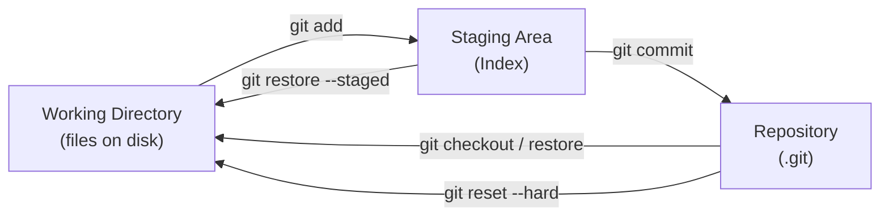
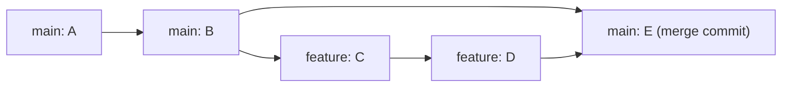
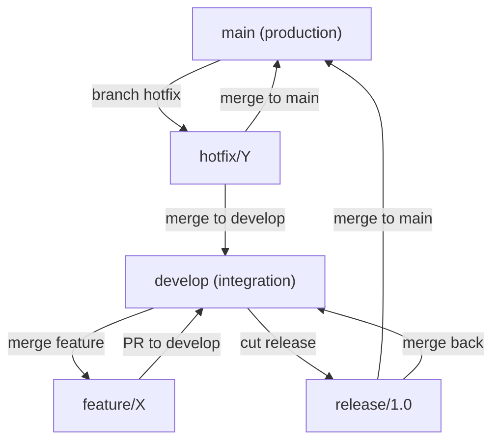
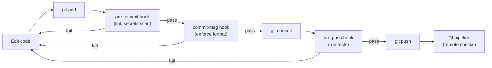

# Module 04: Git & Version Control

> Part of the [DevOps Career Course](./README.md) by UncleJS

[](https://creativecommons.org/licenses/by-nc-sa/4.0/)    

---

## Table of Contents

- [Overview](#overview)
- [Learning Objectives](#learning-objectives)
- [Beginner: What is Git & Why It Matters](#beginner-what-is-git--why-it-matters)
- [Beginner: Core Git Commands](#beginner-core-git-commands)
- [Beginner: Branching & Merging](#beginner-branching--merging)
- [Beginner: Working with Remote Repositories](#beginner-working-with-remote-repositories)
- [Intermediate: Resolving Conflicts](#intermediate-resolving-conflicts)
- [Intermediate: Git Workflows](#intermediate-git-workflows)
- [Intermediate: Advanced Git Techniques](#intermediate-advanced-git-techniques)
- [Intermediate: Git Hooks](#intermediate-git-hooks)
- [Intermediate: Git for Infrastructure Code](#intermediate-git-for-infrastructure-code)
- [Advanced: Signing, Security & Auditing](#advanced-signing-security--auditing)
- [Advanced: GitOps](#advanced-gitops)
- [Tools & Commands Reference](#tools--commands-reference)
- [Hands-On Labs](#hands-on-labs)
- [Further Reading](#further-reading)

---

## Overview

Version control is the foundation of everything in DevOps. Git tracks every change to every file in your codebase — who made it, when, and why. It enables teams to work in parallel without stepping on each other, safely experiment with new features, and roll back to any previous state in seconds.

Infrastructure code, CI/CD pipelines, Kubernetes manifests, Terraform configs — all of it lives in Git. If it's not in Git, it doesn't exist.

GitOps takes this further: Git is not just where code lives, but the single source of truth that **drives** your infrastructure. Automated systems continuously reconcile the live cluster state with what is declared in Git.

[↑ Back to TOC](#table-of-contents)

---

## Learning Objectives

By the end of this module you will be able to:

- Initialize repositories and make commits with meaningful messages
- Use branches to develop features in isolation
- Merge branches and resolve conflicts confidently
- Push and pull code from remote repositories (GitHub, GitLab)
- Use pull requests / merge requests for code review
- Apply Git workflows used by professional engineering teams
- Use `rebase`, `cherry-pick`, `stash`, and `bisect` for advanced tasks
- Write Git hooks to automate pre-commit and pre-push checks
- Apply Git best practices to infrastructure-as-code repositories
- Sign commits with GPG for integrity and audit trails
- Explain the four principles of GitOps
- Deploy applications using ArgoCD with the App-of-Apps pattern
- Deploy applications using Flux with GitRepository and Kustomization CRDs
- Choose between ArgoCD and Flux for a given team and use case

[↑ Back to TOC](#table-of-contents)

---

## Beginner: What is Git & Why It Matters

Git is a **distributed** version control system — every developer has a full copy of the entire history locally. Changes are tracked as a series of **commits**, each with a unique SHA-1 (or SHA-256 in newer Git) hash.

Git's storage model is a directed acyclic graph (DAG) of content-addressed objects. Every commit is a snapshot, not a diff, and its SHA-1 hash is derived from its content — including the hash of its parent commit. This means Git history is tamper-evident: you cannot change any commit in history without changing the hash of every commit that follows it. Engineers who understand this model are immune to the confusion that plagues those who think of Git as "tracking changes" — Git tracks states, and the differences you see from `git diff` are computed on the fly by comparing two snapshot objects.

Commits are immutable. When you `git commit --amend`, you are not editing the last commit — you are creating a new commit with a new hash and moving the branch pointer to it. When you `git rebase`, each commit on your branch is replayed onto the new base, producing new commits with new hashes even if the content is identical. Operations that appear to "change history" are actually creating new history and pointing branches at the new commits. This is why force-pushing rebased commits to shared branches is destructive: anyone who has the old commits will have their history diverge from the new one.

A branch is just a pointer — a 41-byte file in `.git/refs/heads/` containing a commit hash. Creating a branch does not copy files. Deleting a branch does not delete commits (until garbage collection). `HEAD` is a pointer to either a branch (attached state) or a specific commit (detached HEAD state). Understanding that branches are cheap pointers is what makes feature-branch workflows intuitive: you are not creating a parallel copy of your codebase, you are just giving a commit a name.



### Key Concepts

| Term | Definition |
|---|---|
| **Repository (repo)** | A directory tracked by Git, containing files and full change history |
| **Commit** | A snapshot of changes at a point in time, with a message and unique hash |
| **Branch** | An independent line of development (just a pointer to a commit) |
| **Remote** | A copy of the repository hosted elsewhere (e.g., GitHub, GitLab) |
| **Clone** | A full local copy of a remote repository |
| **Stage / Index** | The area where changes are prepared before committing |
| **Working directory** | Your actual files on disk |
| **HEAD** | A pointer to the currently checked-out commit or branch |

### The Three Areas of Git

```
Working Directory → Staging Area (Index) → Repository (.git)
       │                    │                      │
   (edit files)         (git add)             (git commit)
       │                                           │
   (git restore)                           (git reset --hard)
```

### How Git Stores Data

Git stores data as a **directed acyclic graph (DAG)** of objects:

```
Commit ──▶ Tree ──▶ Blob (file content)
  │                  └── Blob
  │
  └── Parent Commit ──▶ Tree ──▶ Blob
```

- **Blob**: file content (no filename — just content, hashed)
- **Tree**: a directory (maps filenames to blobs/sub-trees)
- **Commit**: points to a tree + parent commits + author + message

This is why `git diff` is fast and why Git doesn't duplicate unchanged files.

[↑ Back to TOC](#table-of-contents)

---

## Beginner: Core Git Commands

### Initial Setup

```bash
# Configure your identity (do this once, globally)
git config --global user.name "Your Name"
git config --global user.email "you@example.com"
git config --global core.editor "vim"
git config --global init.defaultBranch main
git config --global pull.rebase true         # Prefer rebase on pull
git config --global rebase.autoStash true    # Auto-stash before rebase

# View config
git config --list
git config --list --show-origin             # Show which file each setting comes from
```

### Starting a Repository

```bash
git init                    # Initialize a new repo in current directory
git init myproject          # Initialize in a new directory
git clone https://github.com/user/repo.git   # Clone a remote repo
git clone https://... mydir  # Clone into a specific directory
git clone --depth 1 https://... # Shallow clone — only latest commit (faster for CI)
```

### The Daily Workflow

```bash
git status                  # See what's changed
git diff                    # See unstaged changes
git diff --staged           # See staged changes
git diff HEAD               # See all changes vs last commit

git add file.txt            # Stage a specific file
git add .                   # Stage all changes
git add -p                  # Interactively stage chunks (powerful! review before staging)
git add -i                  # Interactive staging menu

git commit -m "feat(auth): add JWT token refresh"   # Commit with message
git commit                  # Opens editor for multi-line message
git commit --amend          # Amend the last commit (ONLY before pushing!)

git log                     # Full commit history
git log --oneline           # Compact one-line history
git log --oneline --graph --all   # Visual branch graph
git log --author="Alice"    # Filter by author
git log --since="2 weeks ago"     # Filter by date
git log --follow -- path/to/file  # History of a specific file (follows renames)
git show abc1234            # Show details of a specific commit
git show HEAD:path/to/file  # Show a file as it was in HEAD
```

### Undoing Changes

```bash
git restore file.txt            # Discard unstaged changes to a file
git restore --staged file.txt   # Unstage a file (keep changes)
git revert abc1234              # Create a new commit that undoes a previous commit (safe)
git revert abc1234..def5678     # Revert a range of commits

git reset --soft HEAD~1         # Undo last commit, keep changes staged
git reset --mixed HEAD~1        # Undo last commit, keep changes unstaged (default)
git reset --hard HEAD~1         # Undo last commit and discard ALL changes (dangerous)
git reset --hard origin/main    # Reset local branch to match remote exactly
```

> ⚠️ **Warning**: `git reset --hard` permanently discards uncommitted changes. Never use `--hard` on commits that have already been pushed to a shared remote — use `git revert` instead.

[↑ Back to TOC](#table-of-contents)

---

## Beginner: Branching & Merging

Branches let you develop features in isolation without affecting the main codebase. A branch is just a lightweight pointer — creating one is nearly free.

The ease of branching in Git is a genuine competitive advantage over older version control systems. In Subversion or CVS, branching created a physical copy of the codebase tree on the server — an operation that took seconds or minutes and consumed disk space. In Git, creating a branch writes a 41-byte file. This difference in cost changes how engineers work: cheap branches encourage experimentation, frequent integration, and workflow patterns (feature branches, release branches, hotfix branches) that are impractical when branching is expensive.

The choice between merge commit and rebase determines the shape of your project's history. A merge commit (`git merge --no-ff`) preserves the fact that work happened in parallel — you can see exactly which commits came from which branch and when they were integrated. Rebase produces a linear history that is easier to read with `git log --oneline` but hides the parallel development that actually occurred. Neither is universally correct. The critical rule is: never rebase commits that have been pushed to a shared branch. Once other engineers have based work on a commit, changing that commit's hash forces them to reconcile diverged histories.

Squash merging is a pragmatic compromise for teams with noisy WIP commit hygiene. It takes all the commits on a feature branch and collapses them into a single commit on the target branch. The main branch history stays clean and bisectable, while engineers are free to commit as messily as they like during development. The tradeoff is that the individual steps of the work are lost — you cannot `git bisect` into the feature's development history to find where a bug was introduced within those commits.



```bash
git branch                          # List local branches
git branch -a                       # List all branches (including remote-tracking)
git branch -v                       # List branches with last commit message
git branch feature/add-login        # Create a new branch (doesn't switch)
git switch feature/add-login        # Switch to a branch
git switch -c feature/add-login     # Create AND switch in one command
git switch -                        # Switch back to previous branch

git merge feature/add-login         # Merge feature branch into current branch
git merge --no-ff feature/add-login # Merge with a merge commit (preserves branch history)
git merge --squash feature/add-login # Squash all branch commits into one staged change

git branch -d feature/add-login     # Delete a branch (after merging)
git branch -D feature/add-login     # Force delete (even if not merged)
git push origin --delete feature/add-login  # Delete remote branch
```

### Merge Strategies

| Strategy | Command | Result | When to Use |
|---|---|---|---|
| **Fast-forward** | `git merge` | Linear history, no merge commit | Simple feature branch, no divergence |
| **Merge commit** | `git merge --no-ff` | Explicit merge commit preserves context | Default for most teams |
| **Squash** | `git merge --squash` | All branch commits → single staged change | Clean up messy WIP commits |
| **Rebase** | `git rebase main` | Replay branch commits on top of main | Linear history without merge commits |

```
# Fast-forward (default when possible)
main: A - B
feat:     └── C - D
result: A - B - C - D

# Merge commit
main: A - B - E (merge commit)
feat:     └── C - D ─┘

# Squash
main: A - B - E (squash of C+D)
# (no merge commit, no WIP history)

# Rebase
feat: A - B - C' - D' (replayed on top)
```

[↑ Back to TOC](#table-of-contents)

---

## Beginner: Working with Remote Repositories

```bash
git remote -v                       # List remotes with URLs
git remote add origin https://github.com/user/repo.git   # Add a remote
git remote add upstream https://github.com/original/repo.git  # Add upstream (forks)
git remote set-url origin git@github.com:user/repo.git   # Change URL (e.g., HTTPS → SSH)

git push origin main                # Push local main to remote
git push origin feature/my-feature # Push a feature branch
git push -u origin main             # Set upstream tracking and push
git push --tags                     # Push tags
git push --force-with-lease         # Safer force push — fails if remote has new commits

git pull                            # Fetch + merge from remote
git pull --rebase                   # Fetch + rebase (cleaner history, preferred)
git fetch origin                    # Download remote changes without merging
git fetch --all --prune             # Fetch from all remotes, remove stale tracking branches

# Pull Request / Merge Request workflow
# 1. Create a branch: git switch -c feature/my-feature
# 2. Make commits
# 3. Push: git push -u origin feature/my-feature
# 4. Open PR on GitHub/GitLab
# 5. Request code review
# 6. Address feedback → push more commits
# 7. Merge via the web UI
# 8. Clean up: git fetch --prune && git branch -d feature/my-feature
```

### SSH vs HTTPS Authentication

```bash
# Generate an SSH key for GitHub/GitLab
ssh-keygen -t ed25519 -C "you@example.com" -f ~/.ssh/id_ed25519_github

# Add to SSH agent
ssh-add ~/.ssh/id_ed25519_github

# Test connection
ssh -T git@github.com

# ~/.ssh/config — multiple GitHub accounts
Host github-personal
    HostName github.com
    User git
    IdentityFile ~/.ssh/id_ed25519_personal

Host github-work
    HostName github.com
    User git
    IdentityFile ~/.ssh/id_ed25519_work

# Use: git clone git@github-work:company/repo.git
```

[↑ Back to TOC](#table-of-contents)

---

## Intermediate: Resolving Conflicts

Conflicts happen when two branches modify the same lines of the same file. They are normal — not a sign something went wrong.

```bash
git merge feature/login
# AUTO-MERGING FAILED
# CONFLICT (content): Merge conflict in app/config.py

# Open the conflicted file — it looks like this:
<<<<<<< HEAD
DATABASE_HOST = "production-db.example.com"
=======
DATABASE_HOST = "dev-db.example.com"
>>>>>>> feature/login

# 1. Edit the file to the correct final state (remove ALL conflict markers)
# 2. Stage the resolved file
git add app/config.py
# 3. Complete the merge
git commit -m "Merge feature/login — resolved config conflict"

# Abort a merge if things go wrong
git merge --abort

# Use a visual merge tool
git mergetool     # Opens configured tool (vimdiff, meld, VS Code, etc.)
git config --global merge.tool vimdiff
```

### Rebase Conflicts

During a rebase, conflicts are resolved commit-by-commit:

```bash
git rebase main
# CONFLICT (content): Merge conflict in app/config.py

# Fix the conflict, then:
git add app/config.py
git rebase --continue   # Apply the next commit in the replay

# If a conflict is too complex:
git rebase --abort      # Cancel the entire rebase, go back to original state

# Skip a commit that becomes empty after conflict resolution:
git rebase --skip
```

### `git rerere` — Remember Resolutions

```bash
# Enable rerere (reuse recorded resolution)
git config --global rerere.enabled true

# Now when you resolve the same conflict twice (e.g., during long-lived branches),
# Git automatically applies your previous resolution
git rerere diff     # Show what rerere has remembered
git rerere forget   # Forget a recorded resolution
```

[↑ Back to TOC](#table-of-contents)

---

## Intermediate: Git Workflows

The workflow you choose determines how quickly your team can safely deploy. GitHub Flow (branch → PR → merge to main → deploy) works because it keeps `main` always in a deployable state and eliminates the coordination overhead of managing multiple long-lived branches. Every change goes through a pull request, which provides a natural gate for code review, automated testing, and deployment preview. The constraint is that `main` must always be safe to deploy — which requires good test coverage and the discipline to keep changes small.

GitFlow introduces additional branch types — `develop`, `release/*`, `hotfix/*` — to support teams that cannot continuously deploy. If your product ships on a fixed release schedule, or if QA cycles require a stable integration branch separate from active development, GitFlow provides the structure to manage that. The cost is significant coordination overhead: every release requires merging into both `main` and `develop`, hotfixes must be cherry-picked to both branches, and `develop` frequently diverges enough from `main` to create painful integration conflicts. Many teams adopt GitFlow thinking they need it and then discover the coordination overhead exceeds the benefit.

Trunk-based development — where all engineers commit directly to `main` (or through very short-lived branches that live for hours, not days) — is the approach that enables high-velocity continuous delivery. Google, Meta, and most elite engineering organizations practice trunk-based development. The key enablers are: feature flags (to ship code without activating features), strong automated testing (so a failing build never lands on main), and the discipline to keep each commit small and focused. If your CI pipeline catches regressions before merge and you have feature flags for incomplete work, the risks that GitFlow addresses with branch isolation are already handled.



```
main (always deployable)
  ├── feature/add-login     ← branch, PR, review, merge, delete
  ├── fix/crash-on-logout   ← branch, PR, review, merge, delete
  └── feature/new-dashboard ← branch, PR, review, merge, delete
```

**Rules:**
1. `main` is always deployable to production
2. Create a feature branch from `main` with a descriptive name
3. Commit small, focused changes — push often
4. Open a Pull Request as soon as you have something to discuss
5. Get at least one code review approval
6. Merge via the web UI → delete the branch

**Works well for**: startups, small–medium teams, SaaS products with continuous delivery.

### Git Flow (Enterprise — complex projects)

```
main         ← production releases only (tagged)
develop      ← integration branch
  ├── feature/*   ← new features (branch from develop, merge to develop)
  ├── release/*   ← pre-release stabilization (branch from develop, merge to main + develop)
  └── hotfix/*    ← emergency production fixes (branch from main, merge to main + develop)
```

**Works well for**: scheduled releases, products with multiple supported versions, mobile apps.

**Drawback**: high process overhead. Most teams move away from this as they mature.

### Trunk-Based Development (CI/CD optimized)

```
main (trunk) ← all developers commit here directly, or via very short branches (< 1 day)
  feature flags ← hide incomplete features behind flags
  CI runs on every commit → fast feedback
```

**Requirements**:
- Strong test coverage (the safety net for committing to trunk)
- Feature flags to hide incomplete work
- Fast CI pipeline (< 10 min)
- Team discipline around small, working commits

**Works well for**: mature engineering teams, high-deployment-frequency products, Google/Facebook/Netflix scale.

### Comparing Workflows

| Factor | GitHub Flow | Git Flow | Trunk-Based |
|---|---|---|---|
| Release cadence | Continuous | Scheduled | Continuous |
| Branch lifetime | Hours–days | Days–weeks | Hours |
| Complexity | Low | High | Medium |
| Requires feature flags | No | No | Yes |
| Best for | Most teams | Legacy/regulated | Advanced teams |

[↑ Back to TOC](#table-of-contents)

---

## Intermediate: Advanced Git Techniques

### Stash — Save Work Temporarily

```bash
git stash                           # Stash current changes
git stash push -m "WIP: login feature"  # Stash with a name
git stash push -u -m "with untracked"   # Include untracked files
git stash list                      # List all stashes
git stash show stash@{0}            # Show what's in a stash
git stash show -p stash@{0}         # Show the full diff
git stash pop                       # Apply and remove top stash
git stash apply stash@{1}           # Apply a specific stash without removing
git stash drop stash@{1}            # Delete a specific stash
git stash clear                     # Delete all stashes
git stash branch feature/wip stash@{0}  # Create a branch from a stash
```

### Rebase — Rewrite History

```bash
# Update your branch with the latest main (cleaner than merge)
git switch feature/my-feature
git rebase main

# Interactive rebase — squash, reorder, edit commits
git rebase -i HEAD~5        # Rebase last 5 commits interactively
# Commands in interactive rebase:
# pick   = keep commit as-is
# reword = keep but edit message
# edit   = pause to amend the commit
# squash = combine with previous commit (keep messages)
# fixup  = combine and discard message (clean squash)
# drop   = remove commit entirely
# exec   = run a shell command after this commit

# Autosquash: mark commits with "fixup!" prefix and Git squashes automatically
git commit -m "fixup! feat(auth): add JWT token refresh"
git rebase -i --autosquash main
```

> ⚠️ **Golden rule**: Never rebase commits that have been pushed to a shared remote branch. Rebase is for local history cleanup before pushing.

### Cherry-Pick — Apply a Specific Commit

```bash
git cherry-pick abc1234     # Apply commit abc1234 to current branch
git cherry-pick abc1234 def5678  # Apply multiple commits (in order)
git cherry-pick abc1234..def5678  # Apply a range (exclusive start)
git cherry-pick --no-commit abc1234  # Apply changes without auto-committing
git cherry-pick --signoff abc1234    # Add Signed-off-by to message
```

**Use case**: A bug fix was committed to a feature branch. You need it on `main` before the feature is complete.

### Bisect — Find a Bug by Binary Search

```bash
git bisect start
git bisect bad                  # Current commit is broken
git bisect good v1.0.0          # v1.0.0 was working
# Git checks out a commit halfway between — test it
git bisect good                 # This commit is good
git bisect bad                  # This commit is bad
# Git narrows down — repeat until the exact bad commit is found
git bisect reset                # Exit bisect mode

# Automate with a script
git bisect run ./test.sh        # Good = exits 0, Bad = exits non-zero
```

### Tags — Mark Releases

```bash
git tag v1.0.0                              # Lightweight tag (just a pointer)
git tag -a v1.0.0 -m "Release v1.0.0"      # Annotated tag (recommended — stores tagger, date)
git tag                                     # List all tags
git tag -l "v1.*"                           # List tags matching pattern
git show v1.0.0                             # Show tag details
git push origin v1.0.0                      # Push a specific tag
git push origin --tags                      # Push all tags
git checkout v1.0.0                         # Checkout a tag (detached HEAD)
git tag -d v1.0.0                           # Delete tag locally
git push origin --delete v1.0.0            # Delete remote tag
```

### Worktrees — Multiple Working Directories

Work on two branches simultaneously without stashing:

```bash
git worktree add ../hotfix-branch hotfix/issue-123
# Now you have two working directories:
# /myproject         → main branch
# /hotfix-branch     → hotfix/issue-123

git worktree list
git worktree remove ../hotfix-branch
```

[↑ Back to TOC](#table-of-contents)

---

## Intermediate: Git Hooks

Git hooks are scripts that run automatically at specific points in the Git workflow. They live in `.git/hooks/` and must be executable.



### Hook Execution Points

| Hook | When It Runs | Common Use |
|---|---|---|
| `pre-commit` | Before commit is created | Lint, format, secrets scan |
| `prepare-commit-msg` | Before commit message editor opens | Auto-populate message |
| `commit-msg` | After message is entered | Enforce message format |
| `post-commit` | After commit is created | Notifications |
| `pre-push` | Before pushing to remote | Run tests |
| `post-merge` | After a merge | `npm install` if package.json changed |
| `pre-rebase` | Before rebasing | Safety checks |

### Useful Hook Examples

```bash
# .git/hooks/pre-commit — runs before every commit
#!/bin/bash
set -e

echo "Running pre-commit checks..."

# Run shellcheck on shell scripts
if command -v shellcheck &>/dev/null; then
    while IFS= read -r file; do
        shellcheck "$file"
    done < <(git diff --cached --name-only --diff-filter=ACM | grep '\.sh$')
fi

# Prevent committing .env files
if git diff --cached --name-only | grep -qE '^\.env$|\.env\.|secrets'; then
    echo "ERROR: Attempting to commit a secrets file!"
    echo "Remove it from staging: git restore --staged <file>"
    exit 1
fi

# Prevent committing to main directly
BRANCH=$(git symbolic-ref HEAD 2>/dev/null | cut -d/ -f3)
if [ "$BRANCH" = "main" ] || [ "$BRANCH" = "master" ]; then
    echo "ERROR: Direct commits to $BRANCH are not allowed!"
    echo "Create a feature branch: git switch -c feature/your-feature"
    exit 1
fi

echo "Pre-commit checks passed."
```

```bash
# .git/hooks/commit-msg — enforce Conventional Commits format
#!/bin/bash
COMMIT_MSG=$(cat "$1")
PATTERN="^(feat|fix|docs|style|refactor|perf|test|chore|ci|revert)(\(.+\))?: .{1,100}"

if ! echo "$COMMIT_MSG" | grep -qE "$PATTERN"; then
    echo ""
    echo "ERROR: Commit message must follow Conventional Commits format:"
    echo "  <type>(<scope>): <description>"
    echo ""
    echo "Types: feat, fix, docs, style, refactor, perf, test, chore, ci, revert"
    echo "Example: feat(auth): add JWT token refresh"
    echo ""
    exit 1
fi
```

```bash
# .git/hooks/pre-push — run tests before pushing
#!/bin/bash
echo "Running tests before push..."
if ! bun test; then
    echo "Tests failed — push rejected. Fix the tests and try again."
    exit 1
fi
echo "Tests passed."
```

```bash
# Make hooks executable
chmod +x .git/hooks/pre-commit
chmod +x .git/hooks/commit-msg
chmod +x .git/hooks/pre-push
```

### Share Hooks with Your Team

`.git/hooks/` is not tracked by Git. Three approaches:

**1. `pre-commit` framework** (recommended — language-agnostic):

```yaml
# .pre-commit-config.yaml (tracked in git, shared with team)
repos:
  - repo: https://github.com/pre-commit/pre-commit-hooks
    rev: v4.5.0
    hooks:
      - id: trailing-whitespace
      - id: end-of-file-fixer
      - id: check-yaml
      - id: detect-private-key
      - id: check-added-large-files

  - repo: https://github.com/koalaman/shellcheck-precommit
    rev: v0.9.0
    hooks:
      - id: shellcheck
```

```bash
pip install pre-commit
pre-commit install   # Install hooks from .pre-commit-config.yaml
pre-commit run --all-files  # Run manually against all files
```

**2. Husky** (Node.js projects):

```json
// package.json
{
  "husky": {
    "hooks": {
      "pre-commit": "lint-staged",
      "commit-msg": "commitlint --edit $1"
    }
  }
}
```

**3. Symlink hooks to a tracked directory:**

```bash
# hooks/ directory is tracked in git
# .git/hooks/ symlinks point to it
ln -sf ../../hooks/pre-commit .git/hooks/pre-commit
```

[↑ Back to TOC](#table-of-contents)

---

## Intermediate: Git for Infrastructure Code

### .gitignore for DevOps Repos

```gitignore
# Terraform / OpenTofu
.terraform/
*.tfstate
*.tfstate.backup
*.tfplan
.terraform.lock.hcl
override.tf
override.tf.json
*_override.tf
*_override.tf.json

# Ansible
*.retry
vault_password.txt
group_vars/all/vault.yml   # Encrypted OK to commit, but be explicit
.vault_pass

# Kubernetes
kubeconfig
*.kubeconfig

# Helm
charts/*.tgz

# General secrets — NEVER commit these
.env
.env.local
.env.production
*.pem
*.key
*_rsa
*_ed25519
id_*
secrets/
credentials.json
service-account*.json
*.p12
*.pfx

# Editor
.vscode/
.idea/
*.swp
*.swo
.DS_Store
```

### Conventional Commits for Infrastructure

Apply type prefixes consistently to infrastructure commits:

```
feat(terraform): add RDS module for production database
fix(k8s): increase memory limits for API deployment
chore(ansible): update nginx role to 1.25
ci: add terraform validate step to pipeline
docs(runbook): add database failover procedure
refactor(helm): extract common labels to helper template
perf(nginx): enable gzip compression for static assets
```

### Repository Structure for Infrastructure

```
infra/
├── kubernetes/
│   ├── base/                  # Shared manifests (Kustomize base)
│   │   ├── deployments/
│   │   ├── services/
│   │   └── kustomization.yaml
│   ├── overlays/
│   │   ├── production/        # Production-specific patches
│   │   └── staging/           # Staging-specific patches
│   └── apps/                  # ArgoCD Application manifests (GitOps)
├── terraform/
│   ├── modules/               # Reusable modules
│   │   ├── rds/
│   │   └── vpc/
│   └── environments/
│       ├── production/
│       └── staging/
└── ansible/
    ├── playbooks/
    ├── roles/
    └── inventory/
```

### Branch Protection Rules (GitHub/GitLab)

Configure these for your `main` branch:

- ✅ Require pull request reviews (minimum 1 approval)
- ✅ Dismiss stale reviews on new commits
- ✅ Require status checks to pass (CI)
- ✅ Require branches to be up to date before merging
- ✅ Restrict who can push directly to `main`
- ✅ Require signed commits (for regulated environments)

[↑ Back to TOC](#table-of-contents)

---

## Advanced: Signing, Security & Auditing

### Signing Commits with GPG

Signed commits prove that a commit was made by who it claims. GitHub/GitLab show a "Verified" badge on signed commits.

```bash
# Generate a GPG key
gpg --full-generate-key
# Choose: RSA and RSA, 4096 bits, doesn't expire (or set expiry)

# List your keys
gpg --list-secret-keys --keyid-format=long

# Configure Git to use your key
# (replace KEY_ID with the long key ID from above)
git config --global user.signingkey KEY_ID
git config --global commit.gpgsign true     # Sign all commits automatically
git config --global tag.gpgsign true        # Sign all tags automatically

# Sign a single commit manually
git commit -S -m "feat: signed commit"

# Verify a commit's signature
git log --show-signature -1

# Export public key to add to GitHub/GitLab
gpg --armor --export KEY_ID
```

### Signing Commits with SSH Keys (modern approach)

GitHub/GitLab support using SSH keys for commit signing (simpler than GPG):

```bash
# Tell Git to use SSH for signing
git config --global gpg.format ssh
git config --global user.signingkey ~/.ssh/id_ed25519.pub
git config --global commit.gpgsign true

# Add the key to GitHub: Settings → SSH and GPG keys → New signing key
```

### Detecting Secrets in History

```bash
# Scan entire repo history for secrets
docker run --rm -v "$(pwd):/pwd" trufflesecurity/trufflehog:latest \
    git file:///pwd --since-commit HEAD~50

# Or use gitleaks
gitleaks detect --source .
gitleaks detect --source . --log-opts="HEAD~50..HEAD"
```

### Removing Secrets from Git History

If you accidentally committed a secret:

```bash
# 1. IMMEDIATELY revoke the leaked credential (before anything else)
# 2. Remove from history using git-filter-repo (preferred over filter-branch)
pip install git-filter-repo
git filter-repo --path secrets.txt --invert-paths
git filter-repo --replace-text <(echo "mypassword==>REMOVED")

# 3. Force push all branches (requires coordination with team)
git push origin --force --all
git push origin --force --tags

# 4. All collaborators must re-clone — their copies still have the secret
```

[↑ Back to TOC](#table-of-contents)

---

## Advanced: GitOps

### What is GitOps?

GitOps is an operational model where Git is the **single source of truth** for the desired state of your infrastructure and applications. Changes to the system are made exclusively through Git commits and pull requests — never through `kubectl apply` or console clicks.

The four GitOps principles defined by OpenGitOps are not just a philosophy — they are the properties that make GitOps operationally safer than push-based deployment. Declarative state means the system can be fully reconstructed from Git at any time. Versioned and immutable state means every change is auditable with full context (who, what, when, why via commit message). Pull-based application means the cluster reaches out to Git rather than an external system pushing changes in — this eliminates the need to grant deployment systems write access to clusters, significantly reducing blast radius if a CI/CD system is compromised. Continuous reconciliation means configuration drift is detected and corrected automatically rather than accumulating silently until a deployment reveals inconsistency.

The pull-based vs push-based distinction has real security implications. In a push-based model (a CI pipeline that runs `kubectl apply`), the CI system must have credentials with write access to your production cluster. If your CI system is compromised, an attacker has a direct path to production. In a pull-based model (ArgoCD or Flux running in the cluster), the cluster credentials never leave the cluster. An attacker who compromises your CI system can modify the Git repository, but the GitOps operator will only apply changes that exist in Git and have passed branch protection rules and required reviews.

ArgoCD and Flux represent different architectural opinions on GitOps. ArgoCD provides a rich UI, multi-cluster management, and an application-centric model where each deployed application is represented as an ArgoCD `Application` resource. Flux is more Kubernetes-native and GitOps-pure — it reconciles YAML files directly and can be managed entirely through Git without a separate UI. ArgoCD is typically preferred when teams want visibility and self-service deployment UI; Flux when teams want a minimal footprint and deep Kubernetes integration.


**GitOps vs Traditional CI/CD push:**

| Aspect | GitOps (Pull) | Traditional CI/CD (Push) |
|---|---|---|
| Who deploys | In-cluster operator | CI runner (external) |
| Credentials location | Cluster has Git access | CI has cluster credentials |
| Drift detection | Continuous — alerts on manual changes | None |
| Rollback | `git revert` | Re-run old pipeline |
| Audit trail | Full Git history | CI logs (often ephemeral) |
| Multi-cluster | Operator can watch multiple repos | Pipeline must target each cluster |

---

### ArgoCD

ArgoCD is a declarative GitOps operator for Kubernetes. It watches a Git repository and continuously syncs the cluster to match the desired state declared there.

#### Architecture

```
┌─────────────────────────────────────────────────────┐
│                    ArgoCD                            │
│                                                      │
│  ┌─────────────┐  ┌──────────────┐  ┌────────────┐ │
│  │  API Server │  │  Repo Server │  │ Application│ │
│  │  (UI + CLI) │  │  (cache Git) │  │ Controller │ │
│  └─────────────┘  └──────────────┘  └────────────┘ │
│                                           │          │
│                                    watches & syncs   │
└───────────────────────────────────────────┼──────────┘
                                            │
                         ┌──────────────────┼──────────────────┐
                         │                  │                  │
                    Git Repo         Kubernetes API      Notifications
                  (source of          (target cluster)
                    truth)
```

#### Installing ArgoCD

```bash
kubectl create namespace argocd
kubectl apply -n argocd -f \
    https://raw.githubusercontent.com/argoproj/argo-cd/stable/manifests/install.yaml

# Access the UI (port-forward)
kubectl port-forward svc/argocd-server -n argocd 8080:443

# Get initial admin password
kubectl -n argocd get secret argocd-initial-admin-secret \
    -o jsonpath="{.data.password}" | base64 -d

# Login with CLI
argocd login localhost:8080 --username admin --insecure
```

#### The Application CRD

An `Application` is the core ArgoCD resource — it maps a Git source to a Kubernetes destination.

```yaml
apiVersion: argoproj.io/v1alpha1
kind: Application
metadata:
  name: webapp
  namespace: argocd
spec:
  project: default

  # Where to get the desired state from
  source:
    repoURL: https://github.com/myorg/infra.git
    targetRevision: HEAD          # Branch, tag, or commit SHA
    path: kubernetes/overlays/production/webapp

  # Where to deploy it
  destination:
    server: https://kubernetes.default.svc  # In-cluster
    namespace: webapp-production

  # Sync policy
  syncPolicy:
    automated:
      prune: true          # Delete resources removed from Git
      selfHeal: true       # Correct manual changes (drift)
    syncOptions:
      - CreateNamespace=true     # Create namespace if missing
      - PrunePropagationPolicy=foreground
      - ApplyOutOfSyncOnly=true  # Only apply changed resources

  # Health checks and ignoreDifferences
  ignoreDifferences:
    - group: apps
      kind: Deployment
      jsonPointers:
        - /spec/replicas    # Ignore replica count (managed by HPA)
```

#### Sync Policies

| Policy | Description | Use When |
|---|---|---|
| **Manual** | Operator must click "Sync" or run `argocd app sync` | Controlled environments, production |
| **Automated** | Auto-sync on Git push | Dev/staging, or mature production |
| **prune: true** | Delete resources removed from Git | Always enable in GitOps setups |
| **selfHeal: true** | Revert manual kubectl changes | Production — enforces Git as source of truth |

#### App-of-Apps Pattern

Rather than one Application per service, define a "root" application that deploys all other Application manifests from Git. This bootstraps an entire cluster from a single ArgoCD resource.

```
infra/
└── kubernetes/
    └── apps/
        ├── root-app.yaml          ← This is what you apply manually once
        ├── webapp.yaml
        ├── api.yaml
        ├── monitoring.yaml
        └── ingress.yaml
```

```yaml
# root-app.yaml — the only manifest you apply manually
apiVersion: argoproj.io/v1alpha1
kind: Application
metadata:
  name: root-app
  namespace: argocd
  finalizers:
    - resources-finalizer.argocd.argoproj.io
spec:
  project: default
  source:
    repoURL: https://github.com/myorg/infra.git
    targetRevision: HEAD
    path: kubernetes/apps       # This directory contains more Application manifests
  destination:
    server: https://kubernetes.default.svc
    namespace: argocd
  syncPolicy:
    automated:
      prune: true
      selfHeal: true
```

```yaml
# kubernetes/apps/webapp.yaml — a child application
apiVersion: argoproj.io/v1alpha1
kind: Application
metadata:
  name: webapp
  namespace: argocd
  finalizers:
    - resources-finalizer.argocd.argoproj.io
spec:
  project: default
  source:
    repoURL: https://github.com/myorg/infra.git
    targetRevision: HEAD
    path: kubernetes/overlays/production/webapp
  destination:
    server: https://kubernetes.default.svc
    namespace: webapp
  syncPolicy:
    automated:
      prune: true
      selfHeal: true
    syncOptions:
      - CreateNamespace=true
```

#### ArgoCD Projects — RBAC and Boundaries

Projects restrict which repos, clusters, and namespaces an Application can use:

```yaml
apiVersion: argoproj.io/v1alpha1
kind: AppProject
metadata:
  name: production
  namespace: argocd
spec:
  description: "Production workloads"

  # Only allow syncing from these repos
  sourceRepos:
    - "https://github.com/myorg/infra.git"

  # Only allow deploying to production namespace
  destinations:
    - namespace: "production-*"
      server: https://kubernetes.default.svc

  # Deny dangerous cluster-scoped resources
  clusterResourceBlacklist:
    - group: ""
      kind: Namespace
    - group: "rbac.authorization.k8s.io"
      kind: ClusterRoleBinding

  roles:
    - name: developer
      policies:
        - p, proj:production:developer, applications, sync, production/*, allow
        - p, proj:production:developer, applications, get, production/*, allow
```

#### ArgoCD CLI Essentials

```bash
# List all applications
argocd app list

# Get application details and sync status
argocd app get webapp

# Manually sync an application
argocd app sync webapp

# Rollback to a previous version
argocd app rollback webapp 3     # Roll back to history entry #3

# Wait for sync to complete
argocd app wait webapp --sync --health

# Diff between live state and Git
argocd app diff webapp

# Delete an application (and its resources if not pruned)
argocd app delete webapp --cascade
```

---

### Flux

Flux is the CNCF-graduated GitOps toolkit. Where ArgoCD is a monolithic app with a rich UI, Flux is a set of composable controllers. Each controller has a focused responsibility.

#### Architecture

```
┌──────────────────────────────────────────────────────────────┐
│                     Flux Controllers                          │
│                                                               │
│  ┌────────────────┐   ┌───────────────┐   ┌───────────────┐ │
│  │  Source        │   │ Kustomize     │   │  Helm         │ │
│  │  Controller    │   │ Controller    │   │  Controller   │ │
│  │                │   │               │   │               │ │
│  │ GitRepository  │──▶│ Kustomization │   │ HelmRelease   │ │
│  │ HelmRepository │   │               │   │               │ │
│  │ OCIRepository  │   └───────────────┘   └───────────────┘ │
│  └────────────────┘                                          │
│  ┌────────────────┐   ┌───────────────┐                      │
│  │  Image         │   │ Notification  │                      │
│  │  Automation    │   │ Controller    │                      │
│  │  Controller    │   │               │                      │
│  └────────────────┘   └───────────────┘                      │
└──────────────────────────────────────────────────────────────┘
```

#### Installing Flux

```bash
# Install the Flux CLI
curl -s https://fluxcd.io/install.sh | sudo bash

# Bootstrap Flux onto a cluster (creates a Git repo with Flux manifests)
flux bootstrap github \
    --owner=myorg \
    --repository=fleet-infra \
    --branch=main \
    --path=clusters/production \
    --personal \
    --token-auth   # Uses GITHUB_TOKEN env var
```

This command:
1. Creates the `flux-system` namespace
2. Installs all Flux controllers
3. Creates a `flux-system` Git repository (if it doesn't exist)
4. Commits the Flux manifests to it
5. Applies them — Flux now manages itself from Git

#### GitRepository — Defining the Source

```yaml
apiVersion: source.toolkit.fluxcd.io/v1
kind: GitRepository
metadata:
  name: infra
  namespace: flux-system
spec:
  interval: 1m             # Poll Git every 1 minute
  url: https://github.com/myorg/infra
  ref:
    branch: main
  secretRef:
    name: infra-repo-credentials   # Secret with username/password or SSH key
```

#### Kustomization — Applying Manifests

```yaml
apiVersion: kustomize.toolkit.fluxcd.io/v1
kind: Kustomization
metadata:
  name: webapp
  namespace: flux-system
spec:
  interval: 5m               # Reconcile every 5 minutes
  path: "./kubernetes/overlays/production/webapp"
  prune: true                # Delete resources removed from Git
  sourceRef:
    kind: GitRepository
    name: infra
  targetNamespace: webapp
  healthChecks:
    - apiVersion: apps/v1
      kind: Deployment
      name: webapp
      namespace: webapp
  postBuild:
    substitute:
      APP_VERSION: "1.5.0"   # Variable substitution in manifests
```

#### HelmRelease — Managing Helm Charts

```yaml
apiVersion: source.toolkit.fluxcd.io/v1
kind: HelmRepository
metadata:
  name: ingress-nginx
  namespace: flux-system
spec:
  interval: 1h
  url: https://kubernetes.github.io/ingress-nginx
---
apiVersion: helm.toolkit.fluxcd.io/v2
kind: HelmRelease
metadata:
  name: ingress-nginx
  namespace: ingress-nginx
spec:
  interval: 30m
  chart:
    spec:
      chart: ingress-nginx
      version: ">=4.0.0 <5.0.0"  # SemVer range
      sourceRef:
        kind: HelmRepository
        name: ingress-nginx
        namespace: flux-system
  values:
    controller:
      replicaCount: 2
      service:
        type: LoadBalancer
  upgrade:
    remediation:
      retries: 3    # Retry upgrade on failure
  rollback:
    timeout: 5m
```

#### Image Automation — Auto-Update Container Images

Flux can watch a container registry and automatically update image tags in Git:

```yaml
# Watch for new image tags
apiVersion: image.toolkit.fluxcd.io/v1beta2
kind: ImageRepository
metadata:
  name: webapp
  namespace: flux-system
spec:
  image: ghcr.io/myorg/webapp
  interval: 1m

---
# Policy: use the latest semver patch on 1.x.x
apiVersion: image.toolkit.fluxcd.io/v1beta2
kind: ImagePolicy
metadata:
  name: webapp
  namespace: flux-system
spec:
  imageRepositoryRef:
    name: webapp
  policy:
    semver:
      range: ">=1.0.0 <2.0.0"

---
# Update the image tag in the Git file
apiVersion: image.toolkit.fluxcd.io/v1beta1
kind: ImageUpdateAutomation
metadata:
  name: flux-system
  namespace: flux-system
spec:
  interval: 30m
  sourceRef:
    kind: GitRepository
    name: infra
  git:
    checkout:
      ref:
        branch: main
    commit:
      author:
        email: fluxbot@myorg.com
        name: Flux Bot
      messageTemplate: "chore: update {{range .Updated.Images}}{{.}}{{end}}"
    push:
      branch: main
  update:
    path: ./kubernetes/overlays/production
    strategy: Setters
```

In your manifest, mark the image field with a comment:

```yaml
# In your deployment.yaml
containers:
  - name: webapp
    image: ghcr.io/myorg/webapp:1.5.0 # {"$imagepolicy": "flux-system:webapp"}
```

Flux will update this automatically when a new image is published.

#### Flux CLI Essentials

```bash
# Check overall Flux health
flux check

# List all sources
flux get sources git
flux get sources helm

# List all kustomizations
flux get kustomizations

# Force reconciliation now (don't wait for interval)
flux reconcile source git infra
flux reconcile kustomization webapp

# Suspend reconciliation (e.g., during incident)
flux suspend kustomization webapp
flux resume kustomization webapp

# Get events (troubleshoot)
flux events --for=Kustomization/webapp

# Trace an image
flux get image repository webapp
flux get image policy webapp
```

---

### ArgoCD vs Flux: Choosing the Right Tool

| Factor | ArgoCD | Flux |
|---|---|---|
| **UI** | Rich web UI with diff view, history, tree | CLI-first; third-party UI (Weave GitOps) optional |
| **Architecture** | Monolithic app | Composable controllers |
| **Learning curve** | Lower (UI guides you) | Higher (must understand each controller) |
| **RBAC** | Projects + built-in RBAC | Kubernetes RBAC natively |
| **Multi-tenancy** | Projects provide boundaries | Tenancy via namespaces + service accounts |
| **Image automation** | External: Argo CD Image Updater | Built-in image automation controller |
| **Helm support** | Native chart rendering | HelmRelease CRD |
| **Notifications** | Notifications controller | Notifications controller |
| **CNCF status** | Graduated | Graduated |
| **Best for** | Teams wanting UI, single cluster or small fleet | Teams comfortable with CLI, large fleet, GitOps-native |

> **Rule of thumb**: If your team is new to GitOps and wants a visual interface to understand what's happening, start with **ArgoCD**. If you want maximum flexibility, composability, and native Kubernetes patterns, choose **Flux**.

---

### GitOps Repository Structure Best Practices

```
fleet-infra/                       # GitOps repository
├── clusters/
│   ├── production/
│   │   ├── flux-system/           # Flux's own manifests (bootstrapped)
│   │   │   ├── gotk-components.yaml
│   │   │   └── kustomization.yaml
│   │   └── apps.yaml              # Kustomization pointing to apps/production
│   └── staging/
│       └── apps.yaml              # Kustomization pointing to apps/staging
│
├── apps/
│   ├── base/                      # App definitions (Kustomize base)
│   │   ├── webapp/
│   │   │   ├── deployment.yaml
│   │   │   ├── service.yaml
│   │   │   └── kustomization.yaml
│   │   └── api/
│   ├── production/                # Production overlays
│   │   ├── webapp/
│   │   │   ├── kustomization.yaml # Patches: replicas=3, resources=large
│   │   │   └── patches.yaml
│   │   └── api/
│   └── staging/                   # Staging overlays
│       └── webapp/
│           └── kustomization.yaml # Patches: replicas=1, resources=small
│
└── infrastructure/                # Platform components
    ├── controllers/
    │   ├── ingress-nginx/         # HelmRelease for ingress-nginx
    │   └── cert-manager/         # HelmRelease for cert-manager
    └── configs/
        ├── cluster-issuers.yaml   # cert-manager ClusterIssuer
        └── namespaces.yaml
```

**Key principles:**
- Separate `apps/` from `infrastructure/` — platform ops vs app teams have different change cadences
- Use Kustomize `base/` + `overlays/` to avoid duplicating YAML across environments
- The `clusters/` directory bootstraps each cluster — it's the entry point for Flux/ArgoCD
- Never commit secrets — use Sealed Secrets, External Secrets Operator, or SOPS

[↑ Back to TOC](#table-of-contents)

---

## Tools & Commands Reference

| Command | Purpose |
|---|---|
| `git init` / `git clone` | Start a repository |
| `git add` / `git commit` | Stage and commit changes |
| `git status` / `git diff` | Inspect working state |
| `git log --oneline --graph` | View branch history visually |
| `git branch` / `git switch` | Manage and navigate branches |
| `git merge` / `git rebase` | Integrate branch changes |
| `git push` / `git pull` | Sync with remote |
| `git push --force-with-lease` | Safer force push |
| `git stash` | Temporarily save work |
| `git cherry-pick` | Apply a specific commit |
| `git bisect` | Binary-search for a bug |
| `git tag` | Mark release points |
| `git revert` | Safely undo a commit |
| `git commit -S` | Sign a commit with GPG/SSH |
| `git filter-repo` | Rewrite history (remove secrets) |
| `git worktree` | Multiple working dirs from one repo |
| `argocd app sync` | Manually sync an ArgoCD application |
| `flux reconcile` | Force Flux to re-sync immediately |
| `flux get` | List Flux resources and their status |

[↑ Back to TOC](#table-of-contents)

---

## Hands-On Labs

### Lab 4.1 — First Repository

1. Create a new directory and initialize a Git repository
2. Create a `README.md` file and commit it with a Conventional Commits message
3. View the commit with `git log` and `git show`
4. Make a change, view it with `git diff`, stage and commit
5. Run `git log --oneline --graph --all` to see the history visually

### Lab 4.2 — Branching & Merging

1. Create a branch: `git switch -c feature/add-config`
2. Create a file `config.yaml` and commit it
3. Switch back to `main`
4. Make a different change on `main` and commit it
5. Merge the feature branch: `git merge --no-ff feature/add-config`
6. View the merge history: `git log --oneline --graph`
7. Delete the branch: `git branch -d feature/add-config`

### Lab 4.3 — Conflict Resolution

1. Create two branches from the same base commit
2. Edit the same line of the same file in both branches
3. Attempt to merge — observe the conflict markers
4. Resolve the conflict manually, removing all `<<<<`, `====`, `>>>>` markers
5. Complete the merge with a descriptive commit message
6. Enable `rerere` and resolve the same conflict a second time — observe that Git remembers

### Lab 4.4 — GitHub Workflow

1. Create a repo on GitHub with branch protection rules:
   - Require PR review
   - Require status checks
2. Push your local repo to it
3. Create a feature branch, make changes, push the branch
4. Open a Pull Request with a clear description
5. Review and merge via the GitHub UI
6. Pull the changes locally and delete the remote branch

### Lab 4.5 — Git Hook

1. Write a `pre-commit` hook that:
   - Prevents committing `.env` files
   - Prevents direct commits to `main`
2. Write a `commit-msg` hook that enforces Conventional Commits format
3. Test both hooks with valid and invalid cases
4. Install the `pre-commit` framework and run it with the `detect-private-key` hook

### Lab 4.6 — GitOps with ArgoCD

1. Install ArgoCD into a local cluster (kind/k3s)
2. Create a Git repository with a simple nginx Deployment and Service
3. Create an ArgoCD `Application` manifest pointing to your repo
4. Apply the Application and watch ArgoCD sync it
5. Manually edit the Deployment directly with `kubectl edit` — observe ArgoCD detect the drift
6. Enable `selfHeal: true` and watch ArgoCD revert your manual change
7. Update the image tag in Git and push — watch ArgoCD auto-deploy

[↑ Back to TOC](#table-of-contents)

---

## Further Reading

- [Pro Git (free book)](https://git-scm.com/book/en/v2) — Scott Chacon
- [Oh Shit, Git!](https://ohshitgit.com/) — Plain English solutions to common mistakes
- [Conventional Commits](https://www.conventionalcommits.org/) — Commit message standard
- [GitHub Flow Guide](https://docs.github.com/en/get-started/quickstart/github-flow)
- [Trunk-Based Development](https://trunkbaseddevelopment.com/) — Full guide
- [ArgoCD Documentation](https://argo-cd.readthedocs.io/en/stable/)
- [Flux Documentation](https://fluxcd.io/flux/)
- [OpenGitOps — The 4 GitOps Principles](https://opengitops.dev/)
- [GitOps Cookbook](https://www.oreilly.com/library/view/gitops-cookbook/9781492097464/) — O'Reilly
- [Atlassian Git Tutorials](https://www.atlassian.com/git/tutorials)
- [Glossary: Branch](./glossary.md#b), [Fork](./glossary.md#f), [Pull Request](./glossary.md#p), [Repository](./glossary.md#r)

[↑ Back to TOC](#table-of-contents)

---

*© 2026 UncleJS — Licensed under [CC BY-NC-SA 4.0](https://creativecommons.org/licenses/by-nc-sa/4.0/). Non-commercial use only. Share alike with attribution. See [LICENSE.md](./LICENSE.md).*
