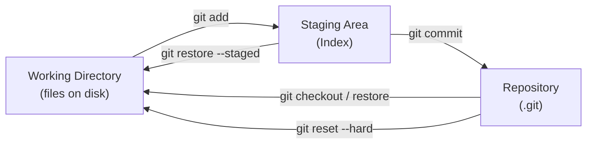
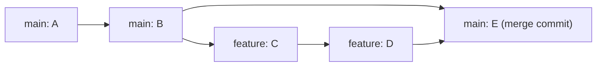
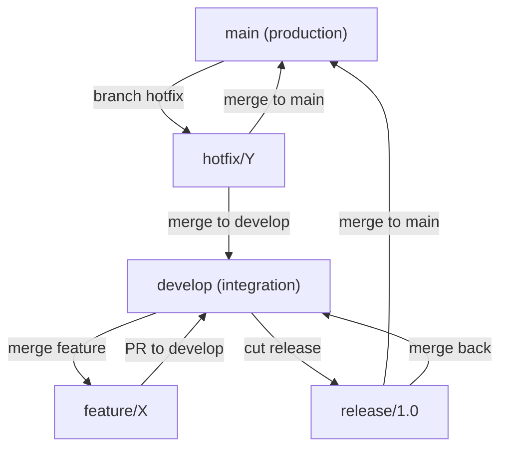
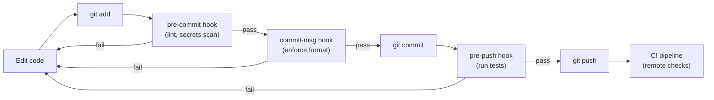
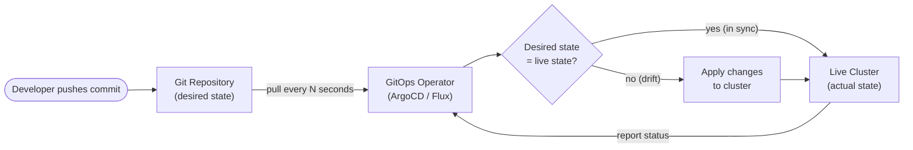

# Module 04: Git & Version Control

> Part of the [DevOps Career Course](./README.md) by UncleJS

[](https://creativecommons.org/licenses/by-nc-sa/4.0/)    

---

## Table of Contents

- [Overview](#overview)
- [Learning Objectives](#learning-objectives)
- [Beginner: What is Git & Why It Matters](#beginner-what-is-git--why-it-matters)
- [Beginner: Core Git Commands](#beginner-core-git-commands)
- [Beginner: Branching & Merging](#beginner-branching--merging)
- [Beginner: Working with Remote Repositories](#beginner-working-with-remote-repositories)
- [Intermediate: Resolving Conflicts](#intermediate-resolving-conflicts)
- [Intermediate: Git Workflows](#intermediate-git-workflows)
- [Intermediate: Advanced Git Techniques](#intermediate-advanced-git-techniques)
- [Intermediate: Git Hooks](#intermediate-git-hooks)
- [Intermediate: Git for Infrastructure Code](#intermediate-git-for-infrastructure-code)
- [Advanced: Signing, Security & Auditing](#advanced-signing-security--auditing)
- [Advanced: GitOps](#advanced-gitops)
- [Tools & Commands Reference](#tools--commands-reference)
- [Hands-On Labs](#hands-on-labs)
- [Further Reading](#further-reading)

---

## Overview

Version control is the foundation of everything in DevOps. Git tracks every change to every file in your codebase — who made it, when, and why. It enables teams to work in parallel without stepping on each other, safely experiment with new features, and roll back to any previous state in seconds.

Infrastructure code, CI/CD pipelines, Kubernetes manifests, Terraform configs — all of it lives in Git. If it's not in Git, it doesn't exist.

GitOps takes this further: Git is not just where code lives, but the single source of truth that **drives** your infrastructure. Automated systems continuously reconcile the live cluster state with what is declared in Git.

[↑ Back to TOC](#table-of-contents)

---

## Learning Objectives

By the end of this module you will be able to:

- Initialize repositories and make commits with meaningful messages
- Use branches to develop features in isolation
- Merge branches and resolve conflicts confidently
- Push and pull code from remote repositories (GitHub, GitLab)
- Use pull requests / merge requests for code review
- Apply Git workflows used by professional engineering teams
- Use `rebase`, `cherry-pick`, `stash`, and `bisect` for advanced tasks
- Write Git hooks to automate pre-commit and pre-push checks
- Apply Git best practices to infrastructure-as-code repositories
- Sign commits with GPG for integrity and audit trails
- Explain the four principles of GitOps
- Deploy applications using ArgoCD with the App-of-Apps pattern
- Deploy applications using Flux with GitRepository and Kustomization CRDs
- Choose between ArgoCD and Flux for a given team and use case

[↑ Back to TOC](#table-of-contents)

---

## Beginner: What is Git & Why It Matters

Git is a **distributed** version control system — every developer has a full copy of the entire history locally. Changes are tracked as a series of **commits**, each with a unique SHA-1 (or SHA-256 in newer Git) hash.

Git's storage model is a directed acyclic graph (DAG) of content-addressed objects. Every commit is a snapshot, not a diff, and its SHA-1 hash is derived from its content — including the hash of its parent commit. This means Git history is tamper-evident: you cannot change any commit in history without changing the hash of every commit that follows it. Engineers who understand this model are immune to the confusion that plagues those who think of Git as "tracking changes" — Git tracks states, and the differences you see from `git diff` are computed on the fly by comparing two snapshot objects.

Commits are immutable. When you `git commit --amend`, you are not editing the last commit — you are creating a new commit with a new hash and moving the branch pointer to it. When you `git rebase`, each commit on your branch is replayed onto the new base, producing new commits with new hashes even if the content is identical. Operations that appear to "change history" are actually creating new history and pointing branches at the new commits. This is why force-pushing rebased commits to shared branches is destructive: anyone who has the old commits will have their history diverge from the new one.

A branch is just a pointer — a 41-byte file in `.git/refs/heads/` containing a commit hash. Creating a branch does not copy files. Deleting a branch does not delete commits (until garbage collection). `HEAD` is a pointer to either a branch (attached state) or a specific commit (detached HEAD state). Understanding that branches are cheap pointers is what makes feature-branch workflows intuitive: you are not creating a parallel copy of your codebase, you are just giving a commit a name.



### Key Concepts

| Term | Definition |
|---|---|
| **Repository (repo)** | A directory tracked by Git, containing files and full change history |
| **Commit** | A snapshot of changes at a point in time, with a message and unique hash |
| **Branch** | An independent line of development (just a pointer to a commit) |
| **Remote** | A copy of the repository hosted elsewhere (e.g., GitHub, GitLab) |
| **Clone** | A full local copy of a remote repository |
| **Stage / Index** | The area where changes are prepared before committing |
| **Working directory** | Your actual files on disk |
| **HEAD** | A pointer to the currently checked-out commit or branch |

### The Three Areas of Git

```
Working Directory → Staging Area (Index) → Repository (.git)
       │                    │                      │
   (edit files)         (git add)             (git commit)
       │                                           │
   (git restore)                           (git reset --hard)
```

### How Git Stores Data

Git stores data as a **directed acyclic graph (DAG)** of objects:

```
Commit ──▶ Tree ──▶ Blob (file content)
  │                  └── Blob
  │
  └── Parent Commit ──▶ Tree ──▶ Blob
```

- **Blob**: file content (no filename — just content, hashed)
- **Tree**: a directory (maps filenames to blobs/sub-trees)
- **Commit**: points to a tree + parent commits + author + message

This is why `git diff` is fast and why Git doesn't duplicate unchanged files.

[↑ Back to TOC](#table-of-contents)

---

## Beginner: Core Git Commands

### Initial Setup

```bash
# Configure your identity (do this once, globally)
git config --global user.name "Your Name"
git config --global user.email "you@example.com"
git config --global core.editor "vim"
git config --global init.defaultBranch main
git config --global pull.rebase true         # Prefer rebase on pull
git config --global rebase.autoStash true    # Auto-stash before rebase

# View config
git config --list
git config --list --show-origin             # Show which file each setting comes from
```

### Starting a Repository

```bash
git init                    # Initialize a new repo in current directory
git init myproject          # Initialize in a new directory
git clone https://github.com/user/repo.git   # Clone a remote repo
git clone https://... mydir  # Clone into a specific directory
git clone --depth 1 https://... # Shallow clone — only latest commit (faster for CI)
```

### The Daily Workflow

```bash
git status                  # See what's changed
git diff                    # See unstaged changes
git diff --staged           # See staged changes
git diff HEAD               # See all changes vs last commit

git add file.txt            # Stage a specific file
git add .                   # Stage all changes
git add -p                  # Interactively stage chunks (powerful! review before staging)
git add -i                  # Interactive staging menu

git commit -m "feat(auth): add JWT token refresh"   # Commit with message
git commit                  # Opens editor for multi-line message
git commit --amend          # Amend the last commit (ONLY before pushing!)

git log                     # Full commit history
git log --oneline           # Compact one-line history
git log --oneline --graph --all   # Visual branch graph
git log --author="Alice"    # Filter by author
git log --since="2 weeks ago"     # Filter by date
git log --follow -- path/to/file  # History of a specific file (follows renames)
git show abc1234            # Show details of a specific commit
git show HEAD:path/to/file  # Show a file as it was in HEAD
```

### Undoing Changes

```bash
git restore file.txt            # Discard unstaged changes to a file
git restore --staged file.txt   # Unstage a file (keep changes)
git revert abc1234              # Create a new commit that undoes a previous commit (safe)
git revert abc1234..def5678     # Revert a range of commits

git reset --soft HEAD~1         # Undo last commit, keep changes staged
git reset --mixed HEAD~1        # Undo last commit, keep changes unstaged (default)
git reset --hard HEAD~1         # Undo last commit and discard ALL changes (dangerous)
git reset --hard origin/main    # Reset local branch to match remote exactly
```

> ⚠️ **Warning**: `git reset --hard` permanently discards uncommitted changes. Never use `--hard` on commits that have already been pushed to a shared remote — use `git revert` instead.

[↑ Back to TOC](#table-of-contents)

---

## Beginner: Branching & Merging

Branches let you develop features in isolation without affecting the main codebase. A branch is just a lightweight pointer — creating one is nearly free.

The ease of branching in Git is a genuine competitive advantage over older version control systems. In Subversion or CVS, branching created a physical copy of the codebase tree on the server — an operation that took seconds or minutes and consumed disk space. In Git, creating a branch writes a 41-byte file. This difference in cost changes how engineers work: cheap branches encourage experimentation, frequent integration, and workflow patterns (feature branches, release branches, hotfix branches) that are impractical when branching is expensive.

The choice between merge commit and rebase determines the shape of your project's history. A merge commit (`git merge --no-ff`) preserves the fact that work happened in parallel — you can see exactly which commits came from which branch and when they were integrated. Rebase produces a linear history that is easier to read with `git log --oneline` but hides the parallel development that actually occurred. Neither is universally correct. The critical rule is: never rebase commits that have been pushed to a shared branch. Once other engineers have based work on a commit, changing that commit's hash forces them to reconcile diverged histories.

Squash merging is a pragmatic compromise for teams with noisy WIP commit hygiene. It takes all the commits on a feature branch and collapses them into a single commit on the target branch. The main branch history stays clean and bisectable, while engineers are free to commit as messily as they like during development. The tradeoff is that the individual steps of the work are lost — you cannot `git bisect` into the feature's development history to find where a bug was introduced within those commits.



```bash
git branch                          # List local branches
git branch -a                       # List all branches (including remote-tracking)
git branch -v                       # List branches with last commit message
git branch feature/add-login        # Create a new branch (doesn't switch)
git switch feature/add-login        # Switch to a branch
git switch -c feature/add-login     # Create AND switch in one command
git switch -                        # Switch back to previous branch

git merge feature/add-login         # Merge feature branch into current branch
git merge --no-ff feature/add-login # Merge with a merge commit (preserves branch history)
git merge --squash feature/add-login # Squash all branch commits into one staged change

git branch -d feature/add-login     # Delete a branch (after merging)
git branch -D feature/add-login     # Force delete (even if not merged)
git push origin --delete feature/add-login  # Delete remote branch
```

### Merge Strategies

| Strategy | Command | Result | When to Use |
|---|---|---|---|
| **Fast-forward** | `git merge` | Linear history, no merge commit | Simple feature branch, no divergence |
| **Merge commit** | `git merge --no-ff` | Explicit merge commit preserves context | Default for most teams |
| **Squash** | `git merge --squash` | All branch commits → single staged change | Clean up messy WIP commits |
| **Rebase** | `git rebase main` | Replay branch commits on top of main | Linear history without merge commits |

```
# Fast-forward (default when possible)
main: A - B
feat:     └── C - D
result: A - B - C - D

# Merge commit
main: A - B - E (merge commit)
feat:     └── C - D ─┘

# Squash
main: A - B - E (squash of C+D)
# (no merge commit, no WIP history)

# Rebase
feat: A - B - C' - D' (replayed on top)
```

[↑ Back to TOC](#table-of-contents)

---

## Beginner: Working with Remote Repositories

```bash
git remote -v                       # List remotes with URLs
git remote add origin https://github.com/user/repo.git   # Add a remote
git remote add upstream https://github.com/original/repo.git  # Add upstream (forks)
git remote set-url origin git@github.com:user/repo.git   # Change URL (e.g., HTTPS → SSH)

git push origin main                # Push local main to remote
git push origin feature/my-feature # Push a feature branch
git push -u origin main             # Set upstream tracking and push
git push --tags                     # Push tags
git push --force-with-lease         # Safer force push — fails if remote has new commits

git pull                            # Fetch + merge from remote
git pull --rebase                   # Fetch + rebase (cleaner history, preferred)
git fetch origin                    # Download remote changes without merging
git fetch --all --prune             # Fetch from all remotes, remove stale tracking branches

# Pull Request / Merge Request workflow
# 1. Create a branch: git switch -c feature/my-feature
# 2. Make commits
# 3. Push: git push -u origin feature/my-feature
# 4. Open PR on GitHub/GitLab
# 5. Request code review
# 6. Address feedback → push more commits
# 7. Merge via the web UI
# 8. Clean up: git fetch --prune && git branch -d feature/my-feature
```

### SSH vs HTTPS Authentication

```bash
# Generate an SSH key for GitHub/GitLab
ssh-keygen -t ed25519 -C "you@example.com" -f ~/.ssh/id_ed25519_github

# Add to SSH agent
ssh-add ~/.ssh/id_ed25519_github

# Test connection
ssh -T git@github.com

# ~/.ssh/config — multiple GitHub accounts
Host github-personal
    HostName github.com
    User git
    IdentityFile ~/.ssh/id_ed25519_personal

Host github-work
    HostName github.com
    User git
    IdentityFile ~/.ssh/id_ed25519_work

# Use: git clone git@github-work:company/repo.git
```

[↑ Back to TOC](#table-of-contents)

---

## Intermediate: Resolving Conflicts

Conflicts happen when two branches modify the same lines of the same file. They are normal — not a sign something went wrong.

```bash
git merge feature/login
# AUTO-MERGING FAILED
# CONFLICT (content): Merge conflict in app/config.py

# Open the conflicted file — it looks like this:
<<<<<<< HEAD
DATABASE_HOST = "production-db.example.com"
=======
DATABASE_HOST = "dev-db.example.com"
>>>>>>> feature/login

# 1. Edit the file to the correct final state (remove ALL conflict markers)
# 2. Stage the resolved file
git add app/config.py
# 3. Complete the merge
git commit -m "Merge feature/login — resolved config conflict"

# Abort a merge if things go wrong
git merge --abort

# Use a visual merge tool
git mergetool     # Opens configured tool (vimdiff, meld, VS Code, etc.)
git config --global merge.tool vimdiff
```

### Rebase Conflicts

During a rebase, conflicts are resolved commit-by-commit:

```bash
git rebase main
# CONFLICT (content): Merge conflict in app/config.py

# Fix the conflict, then:
git add app/config.py
git rebase --continue   # Apply the next commit in the replay

# If a conflict is too complex:
git rebase --abort      # Cancel the entire rebase, go back to original state

# Skip a commit that becomes empty after conflict resolution:
git rebase --skip
```

### `git rerere` — Remember Resolutions

```bash
# Enable rerere (reuse recorded resolution)
git config --global rerere.enabled true

# Now when you resolve the same conflict twice (e.g., during long-lived branches),
# Git automatically applies your previous resolution
git rerere diff     # Show what rerere has remembered
git rerere forget   # Forget a recorded resolution
```

[↑ Back to TOC](#table-of-contents)

---

## Intermediate: Git Workflows

The workflow you choose determines how quickly your team can safely deploy. GitHub Flow (branch → PR → merge to main → deploy) works because it keeps `main` always in a deployable state and eliminates the coordination overhead of managing multiple long-lived branches. Every change goes through a pull request, which provides a natural gate for code review, automated testing, and deployment preview. The constraint is that `main` must always be safe to deploy — which requires good test coverage and the discipline to keep changes small.

GitFlow introduces additional branch types — `develop`, `release/*`, `hotfix/*` — to support teams that cannot continuously deploy. If your product ships on a fixed release schedule, or if QA cycles require a stable integration branch separate from active development, GitFlow provides the structure to manage that. The cost is significant coordination overhead: every release requires merging into both `main` and `develop`, hotfixes must be cherry-picked to both branches, and `develop` frequently diverges enough from `main` to create painful integration conflicts. Many teams adopt GitFlow thinking they need it and then discover the coordination overhead exceeds the benefit.

Trunk-based development — where all engineers commit directly to `main` (or through very short-lived branches that live for hours, not days) — is the approach that enables high-velocity continuous delivery. Google, Meta, and most elite engineering organizations practice trunk-based development. The key enablers are: feature flags (to ship code without activating features), strong automated testing (so a failing build never lands on main), and the discipline to keep each commit small and focused. If your CI pipeline catches regressions before merge and you have feature flags for incomplete work, the risks that GitFlow addresses with branch isolation are already handled.



```
main (always deployable)
  ├── feature/add-login     ← branch, PR, review, merge, delete
  ├── fix/crash-on-logout   ← branch, PR, review, merge, delete
  └── feature/new-dashboard ← branch, PR, review, merge, delete
```

**Rules:**
1. `main` is always deployable to production
2. Create a feature branch from `main` with a descriptive name
3. Commit small, focused changes — push often
4. Open a Pull Request as soon as you have something to discuss
5. Get at least one code review approval
6. Merge via the web UI → delete the branch

**Works well for**: startups, small–medium teams, SaaS products with continuous delivery.

### Git Flow (Enterprise — complex projects)

```
main         ← production releases only (tagged)
develop      ← integration branch
  ├── feature/*   ← new features (branch from develop, merge to develop)
  ├── release/*   ← pre-release stabilization (branch from develop, merge to main + develop)
  └── hotfix/*    ← emergency production fixes (branch from main, merge to main + develop)
```

**Works well for**: scheduled releases, products with multiple supported versions, mobile apps.

**Drawback**: high process overhead. Most teams move away from this as they mature.

### Trunk-Based Development (CI/CD optimized)

```
main (trunk) ← all developers commit here directly, or via very short branches (< 1 day)
  feature flags ← hide incomplete features behind flags
  CI runs on every commit → fast feedback
```

**Requirements**:
- Strong test coverage (the safety net for committing to trunk)
- Feature flags to hide incomplete work
- Fast CI pipeline (< 10 min)
- Team discipline around small, working commits

**Works well for**: mature engineering teams, high-deployment-frequency products, Google/Facebook/Netflix scale.

### Comparing Workflows

| Factor | GitHub Flow | Git Flow | Trunk-Based |
|---|---|---|---|
| Release cadence | Continuous | Scheduled | Continuous |
| Branch lifetime | Hours–days | Days–weeks | Hours |
| Complexity | Low | High | Medium |
| Requires feature flags | No | No | Yes |
| Best for | Most teams | Legacy/regulated | Advanced teams |

[↑ Back to TOC](#table-of-contents)

---

## Intermediate: Advanced Git Techniques

### Stash — Save Work Temporarily

```bash
git stash                           # Stash current changes
git stash push -m "WIP: login feature"  # Stash with a name
git stash push -u -m "with untracked"   # Include untracked files
git stash list                      # List all stashes
git stash show stash@{0}            # Show what's in a stash
git stash show -p stash@{0}         # Show the full diff
git stash pop                       # Apply and remove top stash
git stash apply stash@{1}           # Apply a specific stash without removing
git stash drop stash@{1}            # Delete a specific stash
git stash clear                     # Delete all stashes
git stash branch feature/wip stash@{0}  # Create a branch from a stash
```

### Rebase — Rewrite History

```bash
# Update your branch with the latest main (cleaner than merge)
git switch feature/my-feature
git rebase main

# Interactive rebase — squash, reorder, edit commits
git rebase -i HEAD~5        # Rebase last 5 commits interactively
# Commands in interactive rebase:
# pick   = keep commit as-is
# reword = keep but edit message
# edit   = pause to amend the commit
# squash = combine with previous commit (keep messages)
# fixup  = combine and discard message (clean squash)
# drop   = remove commit entirely
# exec   = run a shell command after this commit

# Autosquash: mark commits with "fixup!" prefix and Git squashes automatically
git commit -m "fixup! feat(auth): add JWT token refresh"
git rebase -i --autosquash main
```

> ⚠️ **Golden rule**: Never rebase commits that have been pushed to a shared remote branch. Rebase is for local history cleanup before pushing.

### Cherry-Pick — Apply a Specific Commit

```bash
git cherry-pick abc1234     # Apply commit abc1234 to current branch
git cherry-pick abc1234 def5678  # Apply multiple commits (in order)
git cherry-pick abc1234..def5678  # Apply a range (exclusive start)
git cherry-pick --no-commit abc1234  # Apply changes without auto-committing
git cherry-pick --signoff abc1234    # Add Signed-off-by to message
```

**Use case**: A bug fix was committed to a feature branch. You need it on `main` before the feature is complete.

### Bisect — Find a Bug by Binary Search

```bash
git bisect start
git bisect bad                  # Current commit is broken
git bisect good v1.0.0          # v1.0.0 was working
# Git checks out a commit halfway between — test it
git bisect good                 # This commit is good
git bisect bad                  # This commit is bad
# Git narrows down — repeat until the exact bad commit is found
git bisect reset                # Exit bisect mode

# Automate with a script
git bisect run ./test.sh        # Good = exits 0, Bad = exits non-zero
```

### Tags — Mark Releases

```bash
git tag v1.0.0                              # Lightweight tag (just a pointer)
git tag -a v1.0.0 -m "Release v1.0.0"      # Annotated tag (recommended — stores tagger, date)
git tag                                     # List all tags
git tag -l "v1.*"                           # List tags matching pattern
git show v1.0.0                             # Show tag details
git push origin v1.0.0                      # Push a specific tag
git push origin --tags                      # Push all tags
git checkout v1.0.0                         # Checkout a tag (detached HEAD)
git tag -d v1.0.0                           # Delete tag locally
git push origin --delete v1.0.0            # Delete remote tag
```

### Worktrees — Multiple Working Directories

Work on two branches simultaneously without stashing:

```bash
git worktree add ../hotfix-branch hotfix/issue-123
# Now you have two working directories:
# /myproject         → main branch
# /hotfix-branch     → hotfix/issue-123

git worktree list
git worktree remove ../hotfix-branch
```

[↑ Back to TOC](#table-of-contents)

---

## Intermediate: Git Hooks

Git hooks are scripts that run automatically at specific points in the Git workflow. They live in `.git/hooks/` and must be executable.



### Hook Execution Points

| Hook | When It Runs | Common Use |
|---|---|---|
| `pre-commit` | Before commit is created | Lint, format, secrets scan |
| `prepare-commit-msg` | Before commit message editor opens | Auto-populate message |
| `commit-msg` | After message is entered | Enforce message format |
| `post-commit` | After commit is created | Notifications |
| `pre-push` | Before pushing to remote | Run tests |
| `post-merge` | After a merge | `npm install` if package.json changed |
| `pre-rebase` | Before rebasing | Safety checks |

### Useful Hook Examples

```bash
# .git/hooks/pre-commit — runs before every commit
#!/bin/bash
set -e

echo "Running pre-commit checks..."

# Run shellcheck on shell scripts
if command -v shellcheck &>/dev/null; then
    while IFS= read -r file; do
        shellcheck "$file"
    done < <(git diff --cached --name-only --diff-filter=ACM | grep '\.sh$')
fi

# Prevent committing .env files
if git diff --cached --name-only | grep -qE '^\.env$|\.env\.|secrets'; then
    echo "ERROR: Attempting to commit a secrets file!"
    echo "Remove it from staging: git restore --staged <file>"
    exit 1
fi

# Prevent committing to main directly
BRANCH=$(git symbolic-ref HEAD 2>/dev/null | cut -d/ -f3)
if [ "$BRANCH" = "main" ] || [ "$BRANCH" = "master" ]; then
    echo "ERROR: Direct commits to $BRANCH are not allowed!"
    echo "Create a feature branch: git switch -c feature/your-feature"
    exit 1
fi

echo "Pre-commit checks passed."
```

```bash
# .git/hooks/commit-msg — enforce Conventional Commits format
#!/bin/bash
COMMIT_MSG=$(cat "$1")
PATTERN="^(feat|fix|docs|style|refactor|perf|test|chore|ci|revert)(\(.+\))?: .{1,100}"

if ! echo "$COMMIT_MSG" | grep -qE "$PATTERN"; then
    echo ""
    echo "ERROR: Commit message must follow Conventional Commits format:"
    echo "  <type>(<scope>): <description>"
    echo ""
    echo "Types: feat, fix, docs, style, refactor, perf, test, chore, ci, revert"
    echo "Example: feat(auth): add JWT token refresh"
    echo ""
    exit 1
fi
```

```bash
# .git/hooks/pre-push — run tests before pushing
#!/bin/bash
echo "Running tests before push..."
if ! bun test; then
    echo "Tests failed — push rejected. Fix the tests and try again."
    exit 1
fi
echo "Tests passed."
```

```bash
# Make hooks executable
chmod +x .git/hooks/pre-commit
chmod +x .git/hooks/commit-msg
chmod +x .git/hooks/pre-push
```

### Share Hooks with Your Team

`.git/hooks/` is not tracked by Git. Three approaches:

**1. `pre-commit` framework** (recommended — language-agnostic):

```yaml
# .pre-commit-config.yaml (tracked in git, shared with team)
repos:
  - repo: https://github.com/pre-commit/pre-commit-hooks
    rev: v4.5.0
    hooks:
      - id: trailing-whitespace
      - id: end-of-file-fixer
      - id: check-yaml
      - id: detect-private-key
      - id: check-added-large-files

  - repo: https://github.com/koalaman/shellcheck-precommit
    rev: v0.9.0
    hooks:
      - id: shellcheck
```

```bash
pip install pre-commit
pre-commit install   # Install hooks from .pre-commit-config.yaml
pre-commit run --all-files  # Run manually against all files
```

**2. Husky** (Node.js projects):

```json
// package.json
{
  "husky": {
    "hooks": {
      "pre-commit": "lint-staged",
      "commit-msg": "commitlint --edit $1"
    }
  }
}
```

**3. Symlink hooks to a tracked directory:**

```bash
# hooks/ directory is tracked in git
# .git/hooks/ symlinks point to it
ln -sf ../../hooks/pre-commit .git/hooks/pre-commit
```

[↑ Back to TOC](#table-of-contents)

---

## Intermediate: Git for Infrastructure Code

### .gitignore for DevOps Repos

```gitignore
# Terraform / OpenTofu
.terraform/
*.tfstate
*.tfstate.backup
*.tfplan
.terraform.lock.hcl
override.tf
override.tf.json
*_override.tf
*_override.tf.json

# Ansible
*.retry
vault_password.txt
group_vars/all/vault.yml   # Encrypted OK to commit, but be explicit
.vault_pass

# Kubernetes
kubeconfig
*.kubeconfig

# Helm
charts/*.tgz

# General secrets — NEVER commit these
.env
.env.local
.env.production
*.pem
*.key
*_rsa
*_ed25519
id_*
secrets/
credentials.json
service-account*.json
*.p12
*.pfx

# Editor
.vscode/
.idea/
*.swp
*.swo
.DS_Store
```

### Conventional Commits for Infrastructure

Apply type prefixes consistently to infrastructure commits:

```
feat(terraform): add RDS module for production database
fix(k8s): increase memory limits for API deployment
chore(ansible): update nginx role to 1.25
ci: add terraform validate step to pipeline
docs(runbook): add database failover procedure
refactor(helm): extract common labels to helper template
perf(nginx): enable gzip compression for static assets
```

### Repository Structure for Infrastructure

```
infra/
├── kubernetes/
│   ├── base/                  # Shared manifests (Kustomize base)
│   │   ├── deployments/
│   │   ├── services/
│   │   └── kustomization.yaml
│   ├── overlays/
│   │   ├── production/        # Production-specific patches
│   │   └── staging/           # Staging-specific patches
│   └── apps/                  # ArgoCD Application manifests (GitOps)
├── terraform/
│   ├── modules/               # Reusable modules
│   │   ├── rds/
│   │   └── vpc/
│   └── environments/
│       ├── production/
│       └── staging/
└── ansible/
    ├── playbooks/
    ├── roles/
    └── inventory/
```

### Branch Protection Rules (GitHub/GitLab)

Configure these for your `main` branch:

- ✅ Require pull request reviews (minimum 1 approval)
- ✅ Dismiss stale reviews on new commits
- ✅ Require status checks to pass (CI)
- ✅ Require branches to be up to date before merging
- ✅ Restrict who can push directly to `main`
- ✅ Require signed commits (for regulated environments)

[↑ Back to TOC](#table-of-contents)

---

## Advanced: Signing, Security & Auditing

### Signing Commits with GPG

Signed commits prove that a commit was made by who it claims. GitHub/GitLab show a "Verified" badge on signed commits.

```bash
# Generate a GPG key
gpg --full-generate-key
# Choose: RSA and RSA, 4096 bits, doesn't expire (or set expiry)

# List your keys
gpg --list-secret-keys --keyid-format=long

# Configure Git to use your key
# (replace KEY_ID with the long key ID from above)
git config --global user.signingkey KEY_ID
git config --global commit.gpgsign true     # Sign all commits automatically
git config --global tag.gpgsign true        # Sign all tags automatically

# Sign a single commit manually
git commit -S -m "feat: signed commit"

# Verify a commit's signature
git log --show-signature -1

# Export public key to add to GitHub/GitLab
gpg --armor --export KEY_ID
```

### Signing Commits with SSH Keys (modern approach)

GitHub/GitLab support using SSH keys for commit signing (simpler than GPG):

```bash
# Tell Git to use SSH for signing
git config --global gpg.format ssh
git config --global user.signingkey ~/.ssh/id_ed25519.pub
git config --global commit.gpgsign true

# Add the key to GitHub: Settings → SSH and GPG keys → New signing key
```

### Detecting Secrets in History

```bash
# Scan entire repo history for secrets
docker run --rm -v "$(pwd):/pwd" trufflesecurity/trufflehog:latest \
    git file:///pwd --since-commit HEAD~50

# Or use gitleaks
gitleaks detect --source .
gitleaks detect --source . --log-opts="HEAD~50..HEAD"
```

### Removing Secrets from Git History

If you accidentally committed a secret:

```bash
# 1. IMMEDIATELY revoke the leaked credential (before anything else)
# 2. Remove from history using git-filter-repo (preferred over filter-branch)
pip install git-filter-repo
git filter-repo --path secrets.txt --invert-paths
git filter-repo --replace-text <(echo "mypassword==>REMOVED")

# 3. Force push all branches (requires coordination with team)
git push origin --force --all
git push origin --force --tags

# 4. All collaborators must re-clone — their copies still have the secret
```

[↑ Back to TOC](#table-of-contents)

---

## Advanced: GitOps

### What is GitOps?

GitOps is an operational model where Git is the **single source of truth** for the desired state of your infrastructure and applications. Changes to the system are made exclusively through Git commits and pull requests — never through `kubectl apply` or console clicks.

The four GitOps principles defined by OpenGitOps are not just a philosophy — they are the properties that make GitOps operationally safer than push-based deployment. Declarative state means the system can be fully reconstructed from Git at any time. Versioned and immutable state means every change is auditable with full context (who, what, when, why via commit message). Pull-based application means the cluster reaches out to Git rather than an external system pushing changes in — this eliminates the need to grant deployment systems write access to clusters, significantly reducing blast radius if a CI/CD system is compromised. Continuous reconciliation means configuration drift is detected and corrected automatically rather than accumulating silently until a deployment reveals inconsistency.

The pull-based vs push-based distinction has real security implications. In a push-based model (a CI pipeline that runs `kubectl apply`), the CI system must have credentials with write access to your production cluster. If your CI system is compromised, an attacker has a direct path to production. In a pull-based model (ArgoCD or Flux running in the cluster), the cluster credentials never leave the cluster. An attacker who compromises your CI system can modify the Git repository, but the GitOps operator will only apply changes that exist in Git and have passed branch protection rules and required reviews.

ArgoCD and Flux represent different architectural opinions on GitOps. ArgoCD provides a rich UI, multi-cluster management, and an application-centric model where each deployed application is represented as an ArgoCD `Application` resource. Flux is more Kubernetes-native and GitOps-pure — it reconciles YAML files directly and can be managed entirely through Git without a separate UI. ArgoCD is typically preferred when teams want visibility and self-service deployment UI; Flux when teams want a minimal footprint and deep Kubernetes integration.



**GitOps vs Traditional CI/CD push:**

| Aspect | GitOps (Pull) | Traditional CI/CD (Push) |
|---|---|---|
| Who deploys | In-cluster operator | CI runner (external) |
| Credentials location | Cluster has Git access | CI has cluster credentials |
| Drift detection | Continuous — alerts on manual changes | None |
| Rollback | `git revert` | Re-run old pipeline |
| Audit trail | Full Git history | CI logs (often ephemeral) |
| Multi-cluster | Operator can watch multiple repos | Pipeline must target each cluster |

---

### ArgoCD

ArgoCD is a declarative GitOps operator for Kubernetes. It watches a Git repository and continuously syncs the cluster to match the desired state declared there.

#### Architecture

```
┌─────────────────────────────────────────────────────┐
│                    ArgoCD                            │
│                                                      │
│  ┌─────────────┐  ┌──────────────┐  ┌────────────┐ │
│  │  API Server │  │  Repo Server │  │ Application│ │
│  │  (UI + CLI) │  │  (cache Git) │  │ Controller │ │
│  └─────────────┘  └──────────────┘  └────────────┘ │
│                                           │          │
│                                    watches & syncs   │
└───────────────────────────────────────────┼──────────┘
                                            │
                         ┌──────────────────┼──────────────────┐
                         │                  │                  │
                    Git Repo         Kubernetes API      Notifications
                  (source of          (target cluster)
                    truth)
```

#### Installing ArgoCD

```bash
kubectl create namespace argocd
kubectl apply -n argocd -f \
    https://raw.githubusercontent.com/argoproj/argo-cd/stable/manifests/install.yaml

# Access the UI (port-forward)
kubectl port-forward svc/argocd-server -n argocd 8080:443

# Get initial admin password
kubectl -n argocd get secret argocd-initial-admin-secret \
    -o jsonpath="{.data.password}" | base64 -d

# Login with CLI
argocd login localhost:8080 --username admin --insecure
```

#### The Application CRD

An `Application` is the core ArgoCD resource — it maps a Git source to a Kubernetes destination.

```yaml
apiVersion: argoproj.io/v1alpha1
kind: Application
metadata:
  name: webapp
  namespace: argocd
spec:
  project: default

  # Where to get the desired state from
  source:
    repoURL: https://github.com/myorg/infra.git
    targetRevision: HEAD          # Branch, tag, or commit SHA
    path: kubernetes/overlays/production/webapp

  # Where to deploy it
  destination:
    server: https://kubernetes.default.svc  # In-cluster
    namespace: webapp-production

  # Sync policy
  syncPolicy:
    automated:
      prune: true          # Delete resources removed from Git
      selfHeal: true       # Correct manual changes (drift)
    syncOptions:
      - CreateNamespace=true     # Create namespace if missing
      - PrunePropagationPolicy=foreground
      - ApplyOutOfSyncOnly=true  # Only apply changed resources

  # Health checks and ignoreDifferences
  ignoreDifferences:
    - group: apps
      kind: Deployment
      jsonPointers:
        - /spec/replicas    # Ignore replica count (managed by HPA)
```

#### Sync Policies

| Policy | Description | Use When |
|---|---|---|
| **Manual** | Operator must click "Sync" or run `argocd app sync` | Controlled environments, production |
| **Automated** | Auto-sync on Git push | Dev/staging, or mature production |
| **prune: true** | Delete resources removed from Git | Always enable in GitOps setups |
| **selfHeal: true** | Revert manual kubectl changes | Production — enforces Git as source of truth |

#### App-of-Apps Pattern

Rather than one Application per service, define a "root" application that deploys all other Application manifests from Git. This bootstraps an entire cluster from a single ArgoCD resource.

```
infra/
└── kubernetes/
    └── apps/
        ├── root-app.yaml          ← This is what you apply manually once
        ├── webapp.yaml
        ├── api.yaml
        ├── monitoring.yaml
        └── ingress.yaml
```

```yaml
# root-app.yaml — the only manifest you apply manually
apiVersion: argoproj.io/v1alpha1
kind: Application
metadata:
  name: root-app
  namespace: argocd
  finalizers:
    - resources-finalizer.argocd.argoproj.io
spec:
  project: default
  source:
    repoURL: https://github.com/myorg/infra.git
    targetRevision: HEAD
    path: kubernetes/apps       # This directory contains more Application manifests
  destination:
    server: https://kubernetes.default.svc
    namespace: argocd
  syncPolicy:
    automated:
      prune: true
      selfHeal: true
```

```yaml
# kubernetes/apps/webapp.yaml — a child application
apiVersion: argoproj.io/v1alpha1
kind: Application
metadata:
  name: webapp
  namespace: argocd
  finalizers:
    - resources-finalizer.argocd.argoproj.io
spec:
  project: default
  source:
    repoURL: https://github.com/myorg/infra.git
    targetRevision: HEAD
    path: kubernetes/overlays/production/webapp
  destination:
    server: https://kubernetes.default.svc
    namespace: webapp
  syncPolicy:
    automated:
      prune: true
      selfHeal: true
    syncOptions:
      - CreateNamespace=true
```

#### ArgoCD Projects — RBAC and Boundaries

Projects restrict which repos, clusters, and namespaces an Application can use:

```yaml
apiVersion: argoproj.io/v1alpha1
kind: AppProject
metadata:
  name: production
  namespace: argocd
spec:
  description: "Production workloads"

  # Only allow syncing from these repos
  sourceRepos:
    - "https://github.com/myorg/infra.git"

  # Only allow deploying to production namespace
  destinations:
    - namespace: "production-*"
      server: https://kubernetes.default.svc

  # Deny dangerous cluster-scoped resources
  clusterResourceBlacklist:
    - group: ""
      kind: Namespace
    - group: "rbac.authorization.k8s.io"
      kind: ClusterRoleBinding

  roles:
    - name: developer
      policies:
        - p, proj:production:developer, applications, sync, production/*, allow
        - p, proj:production:developer, applications, get, production/*, allow
```

#### ArgoCD CLI Essentials

```bash
# List all applications
argocd app list

# Get application details and sync status
argocd app get webapp

# Manually sync an application
argocd app sync webapp

# Rollback to a previous version
argocd app rollback webapp 3     # Roll back to history entry #3

# Wait for sync to complete
argocd app wait webapp --sync --health

# Diff between live state and Git
argocd app diff webapp

# Delete an application (and its resources if not pruned)
argocd app delete webapp --cascade
```

---

### Flux

Flux is the CNCF-graduated GitOps toolkit. Where ArgoCD is a monolithic app with a rich UI, Flux is a set of composable controllers. Each controller has a focused responsibility.

#### Architecture

```
┌──────────────────────────────────────────────────────────────┐
│                     Flux Controllers                          │
│                                                               │
│  ┌────────────────┐   ┌───────────────┐   ┌───────────────┐ │
│  │  Source        │   │ Kustomize     │   │  Helm         │ │
│  │  Controller    │   │ Controller    │   │  Controller   │ │
│  │                │   │               │   │               │ │
│  │ GitRepository  │──▶│ Kustomization │   │ HelmRelease   │ │
│  │ HelmRepository │   │               │   │               │ │
│  │ OCIRepository  │   └───────────────┘   └───────────────┘ │
│  └────────────────┘                                          │
│  ┌────────────────┐   ┌───────────────┐                      │
│  │  Image         │   │ Notification  │                      │
│  │  Automation    │   │ Controller    │                      │
│  │  Controller    │   │               │                      │
│  └────────────────┘   └───────────────┘                      │
└──────────────────────────────────────────────────────────────┘
```

#### Installing Flux

```bash
# Install the Flux CLI
curl -s https://fluxcd.io/install.sh | sudo bash

# Bootstrap Flux onto a cluster (creates a Git repo with Flux manifests)
flux bootstrap github \
    --owner=myorg \
    --repository=fleet-infra \
    --branch=main \
    --path=clusters/production \
    --personal \
    --token-auth   # Uses GITHUB_TOKEN env var
```

This command:
1. Creates the `flux-system` namespace
2. Installs all Flux controllers
3. Creates a `flux-system` Git repository (if it doesn't exist)
4. Commits the Flux manifests to it
5. Applies them — Flux now manages itself from Git

#### GitRepository — Defining the Source

```yaml
apiVersion: source.toolkit.fluxcd.io/v1
kind: GitRepository
metadata:
  name: infra
  namespace: flux-system
spec:
  interval: 1m             # Poll Git every 1 minute
  url: https://github.com/myorg/infra
  ref:
    branch: main
  secretRef:
    name: infra-repo-credentials   # Secret with username/password or SSH key
```

#### Kustomization — Applying Manifests

```yaml
apiVersion: kustomize.toolkit.fluxcd.io/v1
kind: Kustomization
metadata:
  name: webapp
  namespace: flux-system
spec:
  interval: 5m               # Reconcile every 5 minutes
  path: "./kubernetes/overlays/production/webapp"
  prune: true                # Delete resources removed from Git
  sourceRef:
    kind: GitRepository
    name: infra
  targetNamespace: webapp
  healthChecks:
    - apiVersion: apps/v1
      kind: Deployment
      name: webapp
      namespace: webapp
  postBuild:
    substitute:
      APP_VERSION: "1.5.0"   # Variable substitution in manifests
```

#### HelmRelease — Managing Helm Charts

```yaml
apiVersion: source.toolkit.fluxcd.io/v1
kind: HelmRepository
metadata:
  name: ingress-nginx
  namespace: flux-system
spec:
  interval: 1h
  url: https://kubernetes.github.io/ingress-nginx
---
apiVersion: helm.toolkit.fluxcd.io/v2
kind: HelmRelease
metadata:
  name: ingress-nginx
  namespace: ingress-nginx
spec:
  interval: 30m
  chart:
    spec:
      chart: ingress-nginx
      version: ">=4.0.0 <5.0.0"  # SemVer range
      sourceRef:
        kind: HelmRepository
        name: ingress-nginx
        namespace: flux-system
  values:
    controller:
      replicaCount: 2
      service:
        type: LoadBalancer
  upgrade:
    remediation:
      retries: 3    # Retry upgrade on failure
  rollback:
    timeout: 5m
```

#### Image Automation — Auto-Update Container Images

Flux can watch a container registry and automatically update image tags in Git:

```yaml
# Watch for new image tags
apiVersion: image.toolkit.fluxcd.io/v1beta2
kind: ImageRepository
metadata:
  name: webapp
  namespace: flux-system
spec:
  image: ghcr.io/myorg/webapp
  interval: 1m

---
# Policy: use the latest semver patch on 1.x.x
apiVersion: image.toolkit.fluxcd.io/v1beta2
kind: ImagePolicy
metadata:
  name: webapp
  namespace: flux-system
spec:
  imageRepositoryRef:
    name: webapp
  policy:
    semver:
      range: ">=1.0.0 <2.0.0"

---
# Update the image tag in the Git file
apiVersion: image.toolkit.fluxcd.io/v1beta1
kind: ImageUpdateAutomation
metadata:
  name: flux-system
  namespace: flux-system
spec:
  interval: 30m
  sourceRef:
    kind: GitRepository
    name: infra
  git:
    checkout:
      ref:
        branch: main
    commit:
      author:
        email: fluxbot@myorg.com
        name: Flux Bot
      messageTemplate: "chore: update {{range .Updated.Images}}{{.}}{{end}}"
    push:
      branch: main
  update:
    path: ./kubernetes/overlays/production
    strategy: Setters
```

In your manifest, mark the image field with a comment:

```yaml
# In your deployment.yaml
containers:
  - name: webapp
    image: ghcr.io/myorg/webapp:1.5.0 # {"$imagepolicy": "flux-system:webapp"}
```

Flux will update this automatically when a new image is published.

#### Flux CLI Essentials

```bash
# Check overall Flux health
flux check

# List all sources
flux get sources git
flux get sources helm

# List all kustomizations
flux get kustomizations

# Force reconciliation now (don't wait for interval)
flux reconcile source git infra
flux reconcile kustomization webapp

# Suspend reconciliation (e.g., during incident)
flux suspend kustomization webapp
flux resume kustomization webapp

# Get events (troubleshoot)
flux events --for=Kustomization/webapp

# Trace an image
flux get image repository webapp
flux get image policy webapp
```

---

### ArgoCD vs Flux: Choosing the Right Tool

| Factor | ArgoCD | Flux |
|---|---|---|
| **UI** | Rich web UI with diff view, history, tree | CLI-first; third-party UI (Weave GitOps) optional |
| **Architecture** | Monolithic app | Composable controllers |
| **Learning curve** | Lower (UI guides you) | Higher (must understand each controller) |
| **RBAC** | Projects + built-in RBAC | Kubernetes RBAC natively |
| **Multi-tenancy** | Projects provide boundaries | Tenancy via namespaces + service accounts |
| **Image automation** | External: Argo CD Image Updater | Built-in image automation controller |
| **Helm support** | Native chart rendering | HelmRelease CRD |
| **Notifications** | Notifications controller | Notifications controller |
| **CNCF status** | Graduated | Graduated |
| **Best for** | Teams wanting UI, single cluster or small fleet | Teams comfortable with CLI, large fleet, GitOps-native |

> **Rule of thumb**: If your team is new to GitOps and wants a visual interface to understand what's happening, start with **ArgoCD**. If you want maximum flexibility, composability, and native Kubernetes patterns, choose **Flux**.

---

### GitOps Repository Structure Best Practices

```
fleet-infra/                       # GitOps repository
├── clusters/
│   ├── production/
│   │   ├── flux-system/           # Flux's own manifests (bootstrapped)
│   │   │   ├── gotk-components.yaml
│   │   │   └── kustomization.yaml
│   │   └── apps.yaml              # Kustomization pointing to apps/production
│   └── staging/
│       └── apps.yaml              # Kustomization pointing to apps/staging
│
├── apps/
│   ├── base/                      # App definitions (Kustomize base)
│   │   ├── webapp/
│   │   │   ├── deployment.yaml
│   │   │   ├── service.yaml
│   │   │   └── kustomization.yaml
│   │   └── api/
│   ├── production/                # Production overlays
│   │   ├── webapp/
│   │   │   ├── kustomization.yaml # Patches: replicas=3, resources=large
│   │   │   └── patches.yaml
│   │   └── api/
│   └── staging/                   # Staging overlays
│       └── webapp/
│           └── kustomization.yaml # Patches: replicas=1, resources=small
│
└── infrastructure/                # Platform components
    ├── controllers/
    │   ├── ingress-nginx/         # HelmRelease for ingress-nginx
    │   └── cert-manager/         # HelmRelease for cert-manager
    └── configs/
        ├── cluster-issuers.yaml   # cert-manager ClusterIssuer
        └── namespaces.yaml
```

**Key principles:**
- Separate `apps/` from `infrastructure/` — platform ops vs app teams have different change cadences
- Use Kustomize `base/` + `overlays/` to avoid duplicating YAML across environments
- The `clusters/` directory bootstraps each cluster — it's the entry point for Flux/ArgoCD
- Never commit secrets — use Sealed Secrets, External Secrets Operator, or SOPS

[↑ Back to TOC](#table-of-contents)

---

## Tools & Commands Reference

| Command | Purpose |
|---|---|
| `git init` / `git clone` | Start a repository |
| `git add` / `git commit` | Stage and commit changes |
| `git status` / `git diff` | Inspect working state |
| `git log --oneline --graph` | View branch history visually |
| `git branch` / `git switch` | Manage and navigate branches |
| `git merge` / `git rebase` | Integrate branch changes |
| `git push` / `git pull` | Sync with remote |
| `git push --force-with-lease` | Safer force push |
| `git stash` | Temporarily save work |
| `git cherry-pick` | Apply a specific commit |
| `git bisect` | Binary-search for a bug |
| `git tag` | Mark release points |
| `git revert` | Safely undo a commit |
| `git commit -S` | Sign a commit with GPG/SSH |
| `git filter-repo` | Rewrite history (remove secrets) |
| `git worktree` | Multiple working dirs from one repo |
| `argocd app sync` | Manually sync an ArgoCD application |
| `flux reconcile` | Force Flux to re-sync immediately |
| `flux get` | List Flux resources and their status |

[↑ Back to TOC](#table-of-contents)

---

## Hands-On Labs

### Lab 4.1 — First Repository

1. Create a new directory and initialize a Git repository
2. Create a `README.md` file and commit it with a Conventional Commits message
3. View the commit with `git log` and `git show`
4. Make a change, view it with `git diff`, stage and commit
5. Run `git log --oneline --graph --all` to see the history visually

### Lab 4.2 — Branching & Merging

1. Create a branch: `git switch -c feature/add-config`
2. Create a file `config.yaml` and commit it
3. Switch back to `main`
4. Make a different change on `main` and commit it
5. Merge the feature branch: `git merge --no-ff feature/add-config`
6. View the merge history: `git log --oneline --graph`
7. Delete the branch: `git branch -d feature/add-config`

### Lab 4.3 — Conflict Resolution

1. Create two branches from the same base commit
2. Edit the same line of the same file in both branches
3. Attempt to merge — observe the conflict markers
4. Resolve the conflict manually, removing all `<<<<`, `====`, `>>>>` markers
5. Complete the merge with a descriptive commit message
6. Enable `rerere` and resolve the same conflict a second time — observe that Git remembers

### Lab 4.4 — GitHub Workflow

1. Create a repo on GitHub with branch protection rules:
   - Require PR review
   - Require status checks
2. Push your local repo to it
3. Create a feature branch, make changes, push the branch
4. Open a Pull Request with a clear description
5. Review and merge via the GitHub UI
6. Pull the changes locally and delete the remote branch

### Lab 4.5 — Git Hook

1. Write a `pre-commit` hook that:
   - Prevents committing `.env` files
   - Prevents direct commits to `main`
2. Write a `commit-msg` hook that enforces Conventional Commits format
3. Test both hooks with valid and invalid cases
4. Install the `pre-commit` framework and run it with the `detect-private-key` hook

### Lab 4.6 — GitOps with ArgoCD

1. Install ArgoCD into a local cluster (kind/k3s)
2. Create a Git repository with a simple nginx Deployment and Service
3. Create an ArgoCD `Application` manifest pointing to your repo
4. Apply the Application and watch ArgoCD sync it
5. Manually edit the Deployment directly with `kubectl edit` — observe ArgoCD detect the drift
6. Enable `selfHeal: true` and watch ArgoCD revert your manual change
7. Update the image tag in Git and push — watch ArgoCD auto-deploy

[↑ Back to TOC](#table-of-contents)

---

## Further Reading

- [Pro Git (free book)](https://git-scm.com/book/en/v2) — Scott Chacon
- [Oh Shit, Git!](https://ohshitgit.com/) — Plain English solutions to common mistakes
- [Conventional Commits](https://www.conventionalcommits.org/) — Commit message standard
- [GitHub Flow Guide](https://docs.github.com/en/get-started/quickstart/github-flow)
- [Trunk-Based Development](https://trunkbaseddevelopment.com/) — Full guide
- [ArgoCD Documentation](https://argo-cd.readthedocs.io/en/stable/)
- [Flux Documentation](https://fluxcd.io/flux/)
- [OpenGitOps — The 4 GitOps Principles](https://opengitops.dev/)
- [GitOps Cookbook](https://www.oreilly.com/library/view/gitops-cookbook/9781492097464/) — O'Reilly
- [Atlassian Git Tutorials](https://www.atlassian.com/git/tutorials)
- [Glossary: Branch](./glossary.md#b), [Fork](./glossary.md#f), [Pull Request](./glossary.md#p), [Repository](./glossary.md#r)

[↑ Back to TOC](#table-of-contents)

---

## Git Internals — Objects and the .git Directory

Understanding what Git actually stores on disk transforms how you reason about every command. Rather than thinking of Git as a tool that "tracks changes," you will see it for what it really is: a content-addressable key-value store layered with a DAG of immutable snapshot objects.

### The Four Object Types

Git has exactly four types of objects, all stored in `.git/objects/`. Every object is identified by the SHA-1 (or SHA-256) hash of its content. Because the hash is derived from the content itself, two identical contents always produce the same hash and are stored only once — this is how Git deduplicates unchanged files across commits without wasting space.

**Blob** — a blob stores raw file content. No filename, no permissions — just bytes. If two files in your repository have identical content, Git stores exactly one blob for both of them. The filename lives in the tree, not the blob.

**Tree** — a tree is analogous to a directory. It contains a list of entries, where each entry is: a mode (file permissions), a type (`blob` or `tree`), a SHA-1 hash, and a name. A tree maps names to content. Subdirectories become nested tree objects.

**Commit** — a commit object contains: a pointer to a root tree (representing the entire snapshot of your project), one or more parent commit hashes, the author name/email/timestamp, the committer name/email/timestamp, and the commit message. The hash of a commit is computed from all of this content — including the parent hash — which is why changing any ancestor commit changes all descendant commit hashes.

**Tag** — an annotated tag is a full object with a name, tagger identity, timestamp, message, and a pointer to the tagged object (usually a commit). Lightweight tags (created with `git tag name` without `-a`) are not objects at all — they are just a ref file pointing directly to a commit hash.

### Exploring Objects with `git cat-file`

```bash
# Show the type of any object
git cat-file -t HEAD
# commit

# Pretty-print a commit object
git cat-file -p HEAD
# tree 4b825dc642cb6eb9a060e54bf8d69288fbee4904
# parent 3a4b5c6d7e8f...
# author Alice <alice@example.com> 1700000000 +0000
# committer Alice <alice@example.com> 1700000000 +0000
#
# feat(auth): add JWT token refresh

# Pretty-print the tree that commit points to
git cat-file -p HEAD^{tree}
# 100644 blob a1b2c3d4... .gitignore
# 100644 blob b2c3d4e5... README.md
# 040000 tree c3d4e5f6... src

# Pretty-print a specific blob (file content)
git cat-file -p a1b2c3d4

# Count all objects in the repository
git count-objects -v
```

### Writing Objects Manually

You can speak directly to Git's object database without creating commits, which illuminates exactly what each command does:

```bash
# Hash arbitrary content and write it as a blob object
echo "Hello, Git internals" | git hash-object -w --stdin
# Returns: 8ab686eafeb1f44702738c8b0f24f2567c36da6d

# Create a tree from the current staging area
git write-tree
# Returns a tree SHA — this is what git commit uses internally

# Create a commit object manually
git commit-tree <tree-sha> -p <parent-sha> -m "manual commit"
# Returns a commit SHA

# Update a branch ref to point at that commit
git update-ref refs/heads/manual-branch <commit-sha>
```

These three commands — `hash-object`, `write-tree`, `commit-tree` — are what `git commit` does under the hood. Understanding this makes it obvious why rebasing creates new commits (new SHA because parent changes) while merging does not change existing commits (they keep their original SHA; only a new merge commit is added).

### The .git Directory Structure

```
.git/
├── HEAD                  # Points to current branch: "ref: refs/heads/main"
├── config                # Repo-level git config
├── description           # Used by GitWeb (mostly irrelevant)
├── hooks/                # Hook scripts (pre-commit, commit-msg, etc.)
├── info/
│   └── exclude           # Like .gitignore but not tracked
├── index                 # Binary staging area (the Index)
├── COMMIT_EDITMSG        # Last commit message (used by --amend)
├── MERGE_HEAD            # Set during an in-progress merge
├── REBASE_HEAD           # Set during an in-progress rebase
├── objects/
│   ├── pack/             # Packfiles (efficient storage of many objects)
│   │   ├── pack-abc.pack
│   │   └── pack-abc.idx
│   ├── ab/               # Loose objects (first 2 chars of SHA = dir name)
│   │   └── cdef1234...   # Remaining 38 chars = filename
│   └── info/
└── refs/
    ├── heads/            # Local branches (files containing commit SHAs)
    │   ├── main
    │   └── feature/add-login
    ├── remotes/          # Remote-tracking branches
    │   └── origin/
    │       └── main
    └── tags/             # Tag refs
        └── v1.0.0
```

A branch like `main` is literally a file at `.git/refs/heads/main` containing a 40-character commit SHA followed by a newline. That is the entire data structure for a branch. Creating a branch writes one small file. Deleting a branch removes one file. The commits themselves are untouched — they remain in the object store until garbage collection.

`HEAD` is a file containing either `ref: refs/heads/main` (attached HEAD — you are on a branch) or a bare commit SHA (detached HEAD — you checked out a tag or commit directly).

### Packfiles and Loose Objects

When you first create objects (via commits), Git stores them as **loose objects** — individual compressed files in `.git/objects/`. Over time, especially during a `git push` or `git gc`, Git packs many loose objects into a single **packfile** (`.pack`), accompanied by an index file (`.idx`) for fast lookups.

Packfiles use delta compression: rather than storing each version of a file independently, they store a base object plus delta instructions ("change these bytes"). This is why a repository with thousands of commits to the same large file can still be compact. Git is smart about which objects to delta against each other based on similarity, not just history.

```bash
# Trigger garbage collection and packing manually
git gc

# See packfile contents
git verify-pack -v .git/objects/pack/pack-*.idx | sort -k 3 -n | tail -20

# Force repacking with maximum compression
git repack -a -d --depth=250 --window=250
```

### Why Rebasing Creates New Commits

When you run `git rebase main` on a feature branch, Git replays each of your commits onto the new base. Even if the actual code changes are identical, the parent commit hash has changed. Because the commit hash is computed from content including the parent hash, the replayed commit has a new hash. Your branch pointer moves to these new commits; the old commits become unreachable (and eventually garbage-collected).

When you run `git merge main`, Git creates one new merge commit with two parents (your branch tip and the main tip). All your original commits retain their original hashes. This is why merge preserves history and rebase rewrites it — not as a metaphor, but as a literal description of what happens to SHA-1 hashes in the object store.

```bash
# Demonstrate: check commit hashes before and after rebase
git log --oneline feature/my-branch
# abc1234 feat: add login
# def5678 feat: setup auth module

git rebase main

git log --oneline feature/my-branch
# 9f8e7d6 feat: add login       ← new SHA
# 5c4b3a2 feat: setup auth module ← new SHA
```

[↑ Back to TOC](#table-of-contents)

---

## Monorepo vs Polyrepo

The question of how to organize source code into repositories is one of the most consequential architectural decisions an engineering organization makes. It affects how teams collaborate, how CI/CD pipelines are structured, how dependencies are managed, and how fast engineers can move.

### The Fundamental Tradeoff

A **monorepo** stores all services, libraries, and tooling in a single Git repository. A **polyrepo** gives each service or library its own independent repository.

Neither is universally correct. The right answer depends on your team size, deployment model, and how tightly coupled your services actually are.

### Monorepo Benefits

**Atomic cross-service changes** — when a shared library changes its API, you can update all consumers in a single commit and a single pull request. In a polyrepo, a library change requires coordinating PRs across multiple repositories, managing version bumps, and hoping that all consumers upgrade before the old API is removed.

**Single CI/CD configuration** — one `.github/workflows/` or one `.gitlab-ci.yml` governs all services. Shared CI patterns are written once and apply everywhere. No drift between pipeline configurations across repos.

**Shared tooling and consistent versions** — a single `package.json` (or equivalent) ensures every service uses the same version of linting tools, test frameworks, and build utilities. You can never have "team A is on ESLint 8 and team B is on ESLint 9" drift.

**Simplified code sharing** — internal libraries are imported with relative paths or workspace references, not published to a registry. Refactoring across package boundaries is a single IDE operation rather than a publish-and-update cycle.

**Unified code review** — reviewers can see the full context of a change — not just one service, but its consumers and dependencies — in a single PR.

### Polyrepo Benefits

**Team autonomy** — each team owns their repository outright. They choose their own release cadence, their own tooling versions, their own CI configuration. No coordination with other teams for routine changes.

**Independent deployments** — a broken CI pipeline in one service does not affect other services' ability to deploy.

**Smaller blast radius** — a bad commit or a force push to main in one repo cannot disrupt other repos.

**Access control granularity** — you can give contractors access to one service without exposing all code. In a monorepo, this requires more sophisticated tooling.

**Faster clones for new contributors** — cloning one 10MB service repo is faster than cloning a 2GB monorepo.

### When Each Makes Sense

Use a monorepo when:
- Services are tightly coupled and frequently change together
- You have a small-to-medium team (< 100 engineers) that regularly cross service boundaries
- You want to enforce consistent tooling and dependency versions
- You are building a SaaS product where the backend, frontend, and shared libraries evolve together

Use a polyrepo when:
- Teams are large and organizationally independent (separate P&L, separate roadmaps)
- Services have very different technology stacks that share nothing
- You need fine-grained access control across teams
- Services are truly independent and rarely change together

### How Google, Meta, and Microsoft Do Monorepos at Scale

Google operates a single monorepo (nicknamed "g3") containing billions of lines of code spanning almost all of Google's products. Meta uses a monorepo for all server-side code. Microsoft uses a monorepo for Windows and for the Office suite.

The key insight is that these monorepos are not managed with standard `git clone` — they use specialized virtual filesystem tooling (Google's Piper is proprietary; Microsoft uses VFS for Git / GVFS) that presents the repository as a full directory tree while only downloading the files you actually touch. Without this tooling, a naive clone of a Google-scale repo would take hours and require hundreds of gigabytes.

For most engineering teams, Nx and Turborepo solve the practical problems of JavaScript/TypeScript monorepos without requiring custom filesystem tooling.

### Nx for JavaScript/TypeScript Monorepos

Nx provides a task runner with dependency graph awareness. It can determine which projects are affected by a given change and run tasks only for those projects.

```bash
# Create a new Nx workspace
npx create-nx-workspace@latest myorg --preset=ts

# Run tests only for affected projects (based on git diff vs main)
npx nx affected --target=test --base=main

# Build all projects
npx nx run-many --target=build --all

# Visualize the dependency graph
npx nx graph
```

### Turborepo for JavaScript/TypeScript Monorepos

Turborepo is a high-performance build system that caches task outputs and runs tasks in parallel based on a dependency graph you define.

```json
// turbo.json — defines pipeline dependencies and caching
{
  "$schema": "https://turbo.build/schema.json",
  "pipeline": {
    "build": {
      "dependsOn": ["^build"],
      "outputs": ["dist/**", ".next/**"]
    },
    "test": {
      "dependsOn": ["build"],
      "outputs": []
    },
    "lint": {
      "outputs": []
    },
    "dev": {
      "cache": false,
      "persistent": true
    }
  }
}
```

```bash
# Run build for all packages (in dependency order, cached)
npx turbo run build

# Run tests for only changed packages
npx turbo run test --filter=[HEAD^1]

# Run build for a specific package and its dependencies
npx turbo run build --filter=@myorg/api...
```

The `^build` syntax in `dependsOn` means "all upstream packages must build first." Turborepo reads your `package.json` workspace references to construct the dependency graph automatically.

### Sparse Checkout for Large Monorepos

If you work in a large monorepo but only need a subset of directories, sparse checkout lets you check out only the files you need:

```bash
# Clone without checking out any files
git clone --filter=blob:none --no-checkout https://github.com/myorg/monorepo.git
cd monorepo

# Enable sparse checkout
git sparse-checkout init --cone

# Add only the directories you need
git sparse-checkout set services/api shared/utils

# Now checkout
git checkout main

# Add more directories later
git sparse-checkout add services/worker

# See what is currently sparse-checked out
git sparse-checkout list
```

The `--cone` mode uses a simple prefix-based matching that is significantly faster than the full pattern mode for large repos.

### Git Subtree for Gradual Monorepo Migration

If you want to consolidate multiple polyrepos into a monorepo while preserving history, `git subtree` is the right tool:

```bash
# Add an external repo as a subdirectory, preserving its history
git subtree add --prefix=services/payments \
    https://github.com/myorg/payments-service.git main --squash

# Pull updates from the original repo
git subtree pull --prefix=services/payments \
    https://github.com/myorg/payments-service.git main --squash

# Push changes back to the original repo (if you still maintain it)
git subtree push --prefix=services/payments \
    https://github.com/myorg/payments-service.git main
```

The `--squash` flag condenses the imported history into a single commit so the monorepo's log is not flooded with the entire history of every imported service. Omit `--squash` if preserving full per-service history matters to you.

[↑ Back to TOC](#table-of-contents)

---

## Conventional Commits & Semantic Versioning

Commit messages are documentation. They are the first thing a new engineer reads when debugging a regression, and the raw material from which changelogs and release notes are generated. Conventional Commits is a specification that gives commit messages a consistent machine-readable structure — enabling tools to automate versioning and changelog generation.

### The Conventional Commits Specification

Every commit message follows this format:

```
<type>(<scope>): <description>

[optional body]

[optional footer(s)]
```

The `type` must be one of:

| Type | Purpose | SemVer Impact |
|---|---|---|
| `feat` | New feature for the user | Minor version bump |
| `fix` | Bug fix for the user | Patch version bump |
| `perf` | Performance improvement | Patch version bump |
| `refactor` | Refactoring (no user-facing change) | No bump |
| `docs` | Documentation changes only | No bump |
| `style` | Formatting, missing semicolons (no logic change) | No bump |
| `test` | Adding or fixing tests | No bump |
| `chore` | Maintenance, dependency updates | No bump |
| `ci` | Changes to CI configuration | No bump |
| `build` | Changes to build system or external dependencies | No bump |
| `revert` | Reverts a previous commit | Depends on reverted type |

A `BREAKING CHANGE` footer or an exclamation mark after the type (`feat!:`) triggers a major version bump regardless of the type:

```
feat!: remove support for Node.js 16

BREAKING CHANGE: The minimum required Node.js version is now 18.
Applications running Node 16 must upgrade before installing this version.
```

### Real Commit Message Examples

```
feat(payments): add Stripe webhook signature verification

Validates the Stripe-Signature header on all incoming webhook events.
Returns 400 on invalid signatures to prevent replay attacks.

Closes #247
```

```
fix(api): handle null user ID in session middleware

Prevents a crash when unauthenticated requests reach protected routes.
The middleware now returns 401 instead of throwing a TypeError.

Fixes #312
```

```
chore(deps): update express from 4.18.2 to 4.19.2

Security patch addressing CVE-2024-29041.
```

### Commitizen — Interactive Commit Creation

Commitizen provides a CLI prompt that guides you through writing a valid Conventional Commit:

```bash
# Install globally
npm install -g commitizen cz-conventional-changelog

# Initialize a project to use conventional-changelog adapter
echo '{ "path": "cz-conventional-changelog" }' > ~/.czrc

# Use cz instead of git commit
git cz
# ? Select the type of change: feat
# ? What is the scope: payments
# ? Short description: add Stripe webhook verification
# ? Longer description: (optional)
# ? Breaking changes? No
# ? Issues closed: #247
```

In a team project, add commitizen to the project:

```bash
npm install --save-dev commitizen cz-conventional-changelog
npx commitizen init cz-conventional-changelog --save-dev --save-exact
```

```json
// package.json
{
  "scripts": {
    "commit": "cz"
  },
  "config": {
    "commitizen": {
      "path": "./node_modules/cz-conventional-changelog"
    }
  }
}
```

### semantic-release — Fully Automated Releases

`semantic-release` reads your commit history since the last release, determines the correct next semantic version, generates a changelog, publishes to npm (or GitHub Releases), and creates a Git tag — all automatically on merge to `main`.

```bash
npm install --save-dev semantic-release \
    @semantic-release/git \
    @semantic-release/github \
    @semantic-release/changelog \
    @semantic-release/npm
```

```json
// release.config.js (or .releaserc)
{
  "branches": ["main"],
  "plugins": [
    "@semantic-release/commit-analyzer",
    "@semantic-release/release-notes-generator",
    ["@semantic-release/changelog", {
      "changelogFile": "CHANGELOG.md"
    }],
    ["@semantic-release/npm", {
      "npmPublish": true
    }],
    ["@semantic-release/git", {
      "assets": ["CHANGELOG.md", "package.json"],
      "message": "chore(release): ${nextRelease.version} [skip ci]\n\n${nextRelease.notes}"
    }],
    "@semantic-release/github"
  ]
}
```

### GitHub Actions Workflow for semantic-release

```yaml
# .github/workflows/release.yml
name: Release

on:
  push:
    branches:
      - main

permissions:
  contents: write
  issues: write
  pull-requests: write
  id-token: write

jobs:
  release:
    name: Release
    runs-on: ubuntu-latest
    steps:
      - name: Checkout
        uses: actions/checkout@v4
        with:
          fetch-depth: 0        # semantic-release needs full history
          persist-credentials: false

      - name: Setup Node.js
        uses: actions/setup-node@v4
        with:
          node-version: 20
          cache: npm

      - name: Install dependencies
        run: npm ci

      - name: Run tests
        run: npm test

      - name: Release
        env:
          GITHUB_TOKEN: ${{ secrets.GITHUB_TOKEN }}
          NPM_TOKEN: ${{ secrets.NPM_TOKEN }}
        run: npx semantic-release
```

Every merge to `main` that contains at least one `feat` or `fix` commit will produce a new release. The `[skip ci]` in the release commit message prevents an infinite loop.

### standard-version as an Alternative

For teams that want to run releases manually (rather than fully automated), `standard-version` is a simpler alternative:

```bash
npm install --save-dev standard-version

# Add to package.json scripts
# "release": "standard-version"
# "release:minor": "standard-version --release-as minor"
# "release:major": "standard-version --release-as major"

# Run a release
npm run release
# Bumps version in package.json
# Updates CHANGELOG.md
# Creates a Git tag
# You still push manually: git push --follow-tags origin main
```

[↑ Back to TOC](#table-of-contents)

---

## CODEOWNERS & Code Review Process

Code review is one of the highest-leverage activities in software engineering. A CODEOWNERS file makes ownership explicit and automatable — ensuring that no code lands in a critical area without the right people reviewing it.

### The CODEOWNERS File

CODEOWNERS lives at `.github/CODEOWNERS` (GitHub), `.gitlab/CODEOWNERS` (GitLab), or the repository root. It uses glob patterns to map file paths to owners. Rules are evaluated from top to bottom; the last matching rule wins.

```gitignore
# .github/CODEOWNERS

# Default owners for everything not matched below
*                               @myorg/platform-team

# Backend services owned by the backend team
/services/api/                  @myorg/backend-team
/services/worker/               @myorg/backend-team

# Frontend owned by the frontend team
/apps/web/                      @myorg/frontend-team
/apps/mobile/                   @myorg/mobile-team

# Infrastructure and CI owned by DevOps
/.github/                       @myorg/devops-team
/infra/                         @myorg/devops-team
/Dockerfile                     @myorg/devops-team
/docker-compose*.yml            @myorg/devops-team

# Security-sensitive files require the security team
/services/api/src/auth/         @myorg/security-team @myorg/backend-team
/services/api/src/payments/     @myorg/security-team @alice @bob

# Shared libraries require a senior engineer sign-off
/packages/shared-utils/         @myorg/backend-team @senior-alice
/packages/design-system/        @myorg/frontend-team @senior-bob

# Documentation can be reviewed by anyone on the team
/docs/                          @myorg/all-engineers
```

GitHub enforces CODEOWNERS automatically when you configure branch protection to require CODEOWNER review. GitLab calls this "Code Owners" and behaves similarly.

### Branch Protection Rules

Branch protection rules prevent force pushes, require reviews, and enforce CI status checks before merging. Configure these for your `main` branch at minimum:

```
GitHub: Settings → Branches → Add branch protection rule → main

Required settings for production repos:
- [x] Require a pull request before merging
  - [x] Require approvals: 1 (small team) or 2 (larger team)
  - [x] Dismiss stale pull request approvals when new commits are pushed
  - [x] Require review from Code Owners
  - [x] Restrict who can dismiss pull request reviews
- [x] Require status checks to pass before merging
  - [x] Require branches to be up to date before merging
  - [x] Add your CI check names (e.g., "test", "lint", "build")
- [x] Require conversation resolution before merging
- [x] Do not allow bypassing the above settings
- [x] Restrict who can push to matching branches (only DevOps or senior leads)
- [x] Allow force pushes: NEVER enable for main
```

For regulated environments (fintech, healthcare), also enable:
- Require signed commits
- Require linear history (enforce squash or rebase merges)

### Pull Request Template

A PR template prompts contributors to provide the information reviewers need, reducing review round-trips.

```markdown
<!-- .github/pull_request_template.md -->

## Summary

<!-- What does this PR do? 2-3 sentences. Link the issue it closes. -->
Closes #

## Type of Change

- [ ] Bug fix (non-breaking change that fixes an issue)
- [ ] New feature (non-breaking change that adds functionality)
- [ ] Breaking change (fix or feature that would cause existing functionality to change)
- [ ] Refactor (code change that neither fixes a bug nor adds a feature)
- [ ] Documentation update
- [ ] Infrastructure / CI change

## How Has This Been Tested?

<!-- Describe the tests you ran. What commands? What were the results? -->

- [ ] Unit tests pass (`npm test`)
- [ ] Integration tests pass (`npm run test:integration`)
- [ ] Tested manually in staging

## Checklist

- [ ] My code follows the project's style guidelines
- [ ] I have performed a self-review of my own code
- [ ] I have added tests that prove my fix is effective or that my feature works
- [ ] New and existing unit tests pass locally
- [ ] I have updated documentation if needed
- [ ] No secrets, credentials, or environment-specific values are hardcoded

## Screenshots (if applicable)

<!-- Delete this section if not relevant -->

## Notes for Reviewer

<!-- Anything that needs special attention? A specific area you are unsure about? -->
```

### Review Culture Patterns

The culture around code review matters as much as the tooling. A few patterns that work:

**Distinguish blocking from non-blocking comments** — many teams use prefixes:
- `nit:` — nitpick, take it or leave it, does not block approval
- `suggestion:` — you think it could be better but defer to the author
- `question:` — you want to understand, not block
- `blocker:` — must be addressed before merge
- `required:` — same as blocker, more emphatic

**Keep PRs small** — a PR that changes 10 files gets a thorough review in 15 minutes. A PR that changes 80 files gets a rubber-stamp in 5 minutes. If you want quality reviews, keep PRs focused and small.

**Review promptly** — a PR that sits for 3 days kills momentum. Agree as a team on a maximum review response time (commonly 1 business day). Use GitHub's "review requested" notification or set up Slack integration.

**Enforce style automatically** — no review comment should ever be about code style. Use Prettier, ESLint, Black, gofmt, or equivalent formatters enforced in CI and in pre-commit hooks. Reviewers should focus on correctness, design, and maintainability.

### Handling Review Bottlenecks

Review bottlenecks are a common pain point in engineering organizations. Common causes and fixes:

| Cause | Fix |
|---|---|
| Too few reviewers for a module | Expand CODEOWNERS for that path; cross-train more engineers |
| PRs are too large | Enforce a PR size guideline (e.g., < 400 line changes) |
| Senior engineer is the only approver | Distribute review authority; use tiered approval (junior can approve, senior required for certain paths) |
| Review is not part of anyone's job definition | Make review a first-class expectation in team agreements and performance reviews |
| No SLA on reviews | Set a team agreement: all PRs get a first response within 4 business hours |

[↑ Back to TOC](#table-of-contents)

---

## GitHub/GitLab API Automation

The `gh` CLI (GitHub) and `glab` CLI (GitLab) bring the full platform API to your terminal and scripts. You can automate PR creation, issue management, release publishing, and workflow triggering without leaving the command line.

### The `gh` CLI Essentials

```bash
# Authenticate
gh auth login

# Create a pull request from the current branch
gh pr create --title "feat(auth): add OAuth2 support" \
    --body "Adds Google and GitHub OAuth2 providers. Closes #145." \
    --reviewer alice,bob \
    --label "feature,needs-review" \
    --draft

# List open PRs
gh pr list

# View a specific PR
gh pr view 42

# Check out a PR locally to review it
gh pr checkout 42

# Merge a PR
gh pr merge 42 --squash --delete-branch

# Review a PR
gh pr review 42 --approve
gh pr review 42 --request-changes --body "Please add tests for the error path."

# Watch CI status for the current branch
gh pr checks

# List recent workflow runs
gh run list

# View a specific workflow run's logs
gh run view 12345 --log

# Re-run failed jobs
gh run rerun 12345 --failed

# Create a release
gh release create v1.2.0 --title "v1.2.0" --notes "Bug fixes and performance improvements"

# Create a release with assets
gh release create v1.2.0 ./dist/app-linux-amd64 ./dist/app-darwin-arm64
```

### Querying the GitHub REST API with `gh api`

```bash
# Get repository information
gh api repos/myorg/myrepo

# List all open issues with a specific label
gh api "repos/myorg/myrepo/issues?state=open&labels=bug" | jq '.[].title'

# Trigger a workflow dispatch event
gh api repos/myorg/myrepo/actions/workflows/deploy.yml/dispatches \
    -f ref=main \
    -f inputs[environment]=staging

# Set a commit status
gh api repos/myorg/myrepo/statuses/abc1234 \
    -f state=success \
    -f context="custom-check" \
    -f description="All checks passed" \
    -f target_url="https://ci.example.com/builds/456"

# Paginate through all commits
gh api --paginate repos/myorg/myrepo/commits | jq '.[].commit.message'
```

### Auto-Merging Dependabot PRs

A common automation is to automatically approve and merge Dependabot PRs for patch and minor updates once CI passes:

```yaml
# .github/workflows/dependabot-auto-merge.yml
name: Dependabot Auto-Merge

on: pull_request

permissions:
  contents: write
  pull-requests: write

jobs:
  auto-merge:
    runs-on: ubuntu-latest
    if: github.actor == 'dependabot[bot]'
    steps:
      - name: Fetch Dependabot metadata
        id: metadata
        uses: dependabot/fetch-metadata@v2
        with:
          github-token: ${{ secrets.GITHUB_TOKEN }}

      - name: Approve patch and minor updates
        if: |
          steps.metadata.outputs.update-type == 'version-update:semver-patch' ||
          steps.metadata.outputs.update-type == 'version-update:semver-minor'
        run: gh pr review --approve "$PR_URL"
        env:
          PR_URL: ${{ github.event.pull_request.html_url }}
          GH_TOKEN: ${{ secrets.GITHUB_TOKEN }}

      - name: Enable auto-merge for patch and minor updates
        if: |
          steps.metadata.outputs.update-type == 'version-update:semver-patch' ||
          steps.metadata.outputs.update-type == 'version-update:semver-minor'
        run: gh pr merge --auto --squash "$PR_URL"
        env:
          PR_URL: ${{ github.event.pull_request.html_url }}
          GH_TOKEN: ${{ secrets.GITHUB_TOKEN }}
```

### Automating Issue Triage

```bash
#!/bin/bash
# triage.sh — label and assign issues based on title keywords

REPO="myorg/myrepo"

gh api --paginate "repos/$REPO/issues?state=open&labels=" | \
  jq -r '.[] | "\(.number) \(.title)"' | \
while read -r number title; do
  if echo "$title" | grep -qi "crash\|panic\|error\|fail"; then
    gh api "repos/$REPO/issues/$number/labels" -f labels[]="bug" > /dev/null
    echo "Labeled #$number as bug"
  fi
  if echo "$title" | grep -qi "slow\|performance\|timeout\|latency"; then
    gh api "repos/$REPO/issues/$number/labels" -f labels[]="performance" > /dev/null
    echo "Labeled #$number as performance"
  fi
done
```

### GitLab CLI (`glab`) Equivalents

```bash
# Authenticate
glab auth login

# Create a merge request
glab mr create --title "feat(auth): add OAuth2 support" \
    --description "Adds Google and GitHub providers." \
    --assignee alice \
    --label "feature"

# List open MRs
glab mr list

# Approve an MR
glab mr approve 42

# Merge an MR
glab mr merge 42 --squash --remove-source-branch

# List CI pipeline status
glab ci status

# View pipeline job logs
glab ci trace
```

### Webhooks for Event-Driven Automation

GitHub and GitLab can POST JSON payloads to a URL of your choice when events occur: PRs opened, commits pushed, releases published, CI completed, etc.

A common pattern: when a PR is opened against `main`, GitHub sends a webhook to your CI/CD system, which provisions a temporary review environment (also called a preview deployment or ephemeral environment):

```bash
# Example webhook payload handler (Node.js / Bun)
# This would run as a small HTTP server in your infrastructure

# GitHub webhook event: pull_request
# Action: opened or synchronize
# You extract: PR number, branch name, commit SHA
# Then: deploy the branch to review-env-<PR number>.staging.example.com

# Teardown webhook: on pull_request closed
# Destroy the review environment
```

Webhooks require your server to be reachable from GitHub's IP ranges. For local development, use `gh webhook forward` to forward webhook events to your localhost:

```bash
gh webhook forward --events=pull_request --url=http://localhost:3000/webhook
```

[↑ Back to TOC](#table-of-contents)

---

## Large File Handling — Git LFS

Git was designed for text files — source code, configuration, documentation. It handles binary files poorly because it cannot delta-compress them effectively, and because every version of a binary file is stored in full in the object database. A repository that accumulates large binaries over time becomes slow to clone, slow to push, and expensive to host.

### Why Large Files in Git Are a Problem

When you commit a 50MB video asset to Git, that 50MB is stored permanently in the repository's history. Even if you delete the file in a later commit, the 50MB object remains in the object database and is cloned by every new contributor. A repository with 100 versions of a 50MB asset contains 5GB of binary data that every engineer must download.

Git's delta compression is excellent for text because similar text files produce small deltas. A binary file (image, video, compiled artifact, dataset) changes in ways that make delta compression largely ineffective — the "delta" between two JPEG files is nearly as large as the files themselves.

### Git LFS — How It Works

Git LFS (Large File Storage) replaces large files in your repository with small **pointer files**. The actual file content is stored on a separate LFS server (GitHub, GitLab, or a self-hosted server). When you clone a repository using LFS, Git downloads the pointer files normally, then fetches the actual file content from the LFS server on demand.

```
# Without LFS: large file content stored in Git object database
.git/objects/pack/pack-abc123.pack  ← contains all 50MB video files

# With LFS: small pointer files in Git, real content on LFS server
video/demo.mp4  ← 130-byte pointer file in Git
                ← actual 50MB file on lfs.github.com
```

### Setting Up Git LFS

```bash
# Install Git LFS (one-time, per machine)
git lfs install

# Track file patterns — this modifies .gitattributes
git lfs track "*.psd"
git lfs track "*.png"
git lfs track "*.jpg"
git lfs track "*.mp4"
git lfs track "*.pdf"
git lfs track "*.zip"
git lfs track "datasets/**"

# Commit the .gitattributes file (this is what tells LFS what to track)
git add .gitattributes
git commit -m "chore: configure Git LFS tracking for binary assets"

# From here, any tracked file you add will go through LFS
git add assets/logo.png
git commit -m "feat: add product logo"
git push origin main   # Uploads to LFS server as part of push
```

### The .gitattributes File

```gitignore
# .gitattributes
*.psd filter=lfs diff=lfs merge=lfs -text
*.png filter=lfs diff=lfs merge=lfs -text
*.jpg filter=lfs diff=lfs merge=lfs -text
*.jpeg filter=lfs diff=lfs merge=lfs -text
*.gif filter=lfs diff=lfs merge=lfs -text
*.mp4 filter=lfs diff=lfs merge=lfs -text
*.mov filter=lfs diff=lfs merge=lfs -text
*.pdf filter=lfs diff=lfs merge=lfs -text
*.zip filter=lfs diff=lfs merge=lfs -text
*.tar.gz filter=lfs diff=lfs merge=lfs -text
datasets/**/* filter=lfs diff=lfs merge=lfs -text
```

### Managing LFS Files

```bash
# List files tracked by LFS
git lfs ls-files

# See LFS status
git lfs status

# Fetch LFS files that were not downloaded during clone
git lfs fetch --all
git lfs checkout

# Clone and immediately download all LFS files
git clone --recurse-submodules https://github.com/myorg/repo.git
# LFS files are fetched automatically on clone if LFS is installed
```

### Migrating Existing Large Files to LFS

If your repository already has a history of large files and you want to retroactively move them to LFS:

```bash
# Install git-filter-repo and bfg, or use the built-in LFS migration
# This rewrites history — coordinate with your team first

# Migrate files matching a pattern from history to LFS
git lfs migrate import --include="*.psd" --everything

# This rewrites all commits — force push is required
git push origin --force --all
git push origin --force --tags

# All collaborators must re-clone after this operation
echo "Team: please re-clone the repository after this LFS migration."
```

### LFS Storage Limits and Alternatives

GitHub provides 1GB of free LFS storage and 1GB/month bandwidth. Additional storage costs approximately $0.07/GB/month. GitLab's free tier includes 5GB. These limits are per account, shared across all repositories.

For large datasets, compiled binaries, or release artifacts, consider whether Git LFS is the right tool at all. Alternatives:

- **Artifact registries** — store compiled binaries and Docker images in a registry (GitHub Packages, AWS ECR, JFrog Artifactory). Version by semantic version, not by Git commit.
- **Object storage** — store datasets and large assets in S3-compatible storage (AWS S3, Cloudflare R2, MinIO). Reference them by URL or checksum in your Git repository.
- **Container images** — if your "artifact" is a running environment, build it into a container image and store that in a registry. The source code lives in Git; the build output lives in the registry.

The rule of thumb: if it is source code or configuration that humans write and read, it belongs in Git. If it is a build artifact or data file that a computer generates or processes, it belongs in a registry or object store.

[↑ Back to TOC](#table-of-contents)

---

## Git Performance for Large Repos

Standard `git clone` downloads the complete history of every branch and every file version that has ever existed. For a mature repository this can be gigabytes and take minutes. In CI/CD environments where you clone on every job, this is a significant cost.

### Shallow Clones

A shallow clone fetches only the most recent N commits, skipping all older history.

```bash
# Fetch only the latest commit — fastest possible clone
git clone --depth=1 https://github.com/myorg/repo.git

# Fetch the last 10 commits (gives you some history for git log and git blame)
git clone --depth=10 https://github.com/myorg/repo.git

# Shallow clone a single branch (even faster)
git clone --depth=1 --single-branch --branch main https://github.com/myorg/repo.git
```

The tradeoff: `git bisect`, `git blame` on old files, and `git describe` (tag-based version strings) require history that a shallow clone does not have. In GitHub Actions, use `fetch-depth: 0` when you need full history and `fetch-depth: 1` otherwise.

### Partial Clones

Partial clones go further than shallow clones by allowing you to omit specific object types from the initial download, fetching them on demand when you actually need them:

```bash
# Blobless clone: fetch all commits and trees, but not file content
# File content is fetched on demand when you checkout a specific file
git clone --filter=blob:none https://github.com/myorg/repo.git

# Treeless clone: fetch only commits, no trees or blobs
# Trees and blobs fetched on demand — fastest clone, highest on-access cost
git clone --filter=tree:0 https://github.com/myorg/repo.git

# Combine with single-branch for maximum initial speed
git clone --filter=blob:none --single-branch --branch main \
    https://github.com/myorg/repo.git
```

The blobless clone is the best general-purpose choice for CI: it downloads quickly because it skips large binary blobs, but it can still compute diffs and access the full tree structure without additional fetches.

### Before and After: CI Checkout Optimization

```yaml
# BEFORE: Full clone (slow — downloads all history and all file versions)
- uses: actions/checkout@v4
# Default: full clone, all branches, all history
# Time on a repo with 5 years of history: ~4 minutes

# AFTER OPTION 1: Shallow clone (fastest — no history needed)
- uses: actions/checkout@v4
  with:
    fetch-depth: 1
# Time: ~8 seconds

# AFTER OPTION 2: Shallow clone with enough history for git describe
- uses: actions/checkout@v4
  with:
    fetch-depth: 0     # Full history needed for semantic-release or git describe
    filter: blob:none  # But skip blob content for speed
# Time: ~25 seconds (vs 4 minutes)
```

### `git maintenance` — Scheduled Repository Health

For repositories that engineers clone and use locally over months, Git provides a maintenance mechanism that keeps the repository performant:

```bash
# Enable scheduled maintenance for the current repository
git maintenance start
# This registers a cron job (or Windows Task Scheduler task) that runs
# git maintenance run --auto periodically

# Run maintenance tasks manually
git maintenance run

# Run specific tasks
git maintenance run --task=commit-graph   # Build/update commit-graph file
git maintenance run --task=prefetch       # Pre-fetch from remotes
git maintenance run --task=loose-objects  # Pack loose objects
git maintenance run --task=incremental-repack  # Incrementally repack

# Disable maintenance
git maintenance stop
```

The **commit-graph** is a binary file that caches the commit graph structure, making `git log --oneline --graph`, `git merge-base`, and reachability queries significantly faster on repos with many commits.

### `git bundle` for Offline Transfers

When you need to transfer a repository or its updates to a machine without internet access (air-gapped environments, slow network transfers):

```bash
# Bundle the entire repository into a single file
git bundle create repo.bundle --all

# Bundle only the changes since a specific tag
git bundle create updates.bundle v1.0.0..HEAD

# Verify a bundle
git bundle verify updates.bundle

# Clone from a bundle
git clone repo.bundle my-repo

# Fetch updates from a bundle (on the offline machine)
git fetch /path/to/updates.bundle main:main
```

### CI/CD Clone Optimization Summary

```bash
# GitHub Actions: optimal checkout for most CI workflows
- uses: actions/checkout@v4
  with:
    fetch-depth: 1          # Only latest commit
    # For monorepo with affected-detection: use fetch-depth: 0

# GitLab CI: optimal clone strategy
variables:
  GIT_DEPTH: 1              # Shallow clone
  GIT_CLONE_PATH: $CI_BUILDS_DIR/$CI_CONCURRENT_ID/$CI_PROJECT_NAME

# Self-hosted runners: cache the Git repository between runs
# Use actions/cache to persist .git across workflow runs
- uses: actions/cache@v4
  with:
    path: .git
    key: git-${{ github.sha }}
    restore-keys: git-
```

Going from a 4-minute `git clone` to a 15-second shallow clone is one of the cheapest performance wins in CI/CD. On a team that runs 50 CI jobs per day, this saves roughly 3 hours of compute time daily — or real money if you are paying per CI minute.

[↑ Back to TOC](#table-of-contents)

---

## Dependency Management — Dependabot & Renovate

Staying current with dependencies is a security and reliability practice, not just housekeeping. A library with an unpatched CVE that sits in your `package.json` for 6 months is a liability. Automated dependency update tools remove the manual effort of tracking upstream releases and opening update PRs.

### Why Automated Dependency Updates Matter

Most security vulnerabilities in production applications come not from custom application code but from outdated third-party dependencies. In 2021, the Log4Shell vulnerability (CVE-2021-44228) affected Java applications that used an older version of log4j. Organizations using automated dependency tools had the patch deployed within hours of its release; those relying on manual updates were still exposed days or weeks later.

Beyond security, staying current with minor and patch updates is significantly easier than attempting a major-version migration after falling years behind. Automated tools make continuous small updates the default.

### Dependabot vs Renovate

| Feature | Dependabot | Renovate |
|---|---|---|
| **Hosted by** | GitHub (built-in) | Mend (free self-hosted or cloud) |
| **Configuration** | `dependabot.yml` (limited options) | `renovate.json` (highly configurable) |
| **Grouping** | Limited (by ecosystem) | Fully configurable group rules |
| **Automerge** | Basic (requires Actions workflow) | Built-in with conditions |
| **Schedule** | Limited options | Fully configurable (cron syntax) |
| **Monorepo support** | Basic | Excellent |
| **Lockfile-only updates** | Yes | Yes |
| **PR title format** | Fixed | Configurable |
| **Semantic versioning awareness** | Yes | Yes |
| **Custom regex versioning** | No | Yes |
| **Recommendation** | Simple projects, already on GitHub | Any project needing fine control |

### Configuring Dependabot

```yaml
# .github/dependabot.yml
version: 2
updates:
  # npm dependencies
  - package-ecosystem: npm
    directory: /
    schedule:
      interval: weekly
      day: monday
      time: "09:00"
      timezone: "America/New_York"
    open-pull-requests-limit: 10
    reviewers:
      - myorg/platform-team
    labels:
      - dependencies
      - automated
    groups:
      # Group all AWS SDK updates into one PR
      aws-sdk:
        patterns:
          - "@aws-sdk/*"
      # Group all testing library updates
      testing:
        patterns:
          - "jest*"
          - "@testing-library/*"
          - "vitest*"
    ignore:
      # Ignore major updates for React (manual upgrade needed)
      - dependency-name: react
        update-types: ["version-update:semver-major"]
      - dependency-name: react-dom
        update-types: ["version-update:semver-major"]

  # GitHub Actions
  - package-ecosystem: github-actions
    directory: /
    schedule:
      interval: weekly
    groups:
      actions:
        patterns:
          - "actions/*"
          - "github/*"

  # Python dependencies
  - package-ecosystem: pip
    directory: /services/worker
    schedule:
      interval: weekly
    labels:
      - dependencies
      - python
```

### Configuring Renovate

Renovate's `renovate.json` file is significantly more powerful. You can configure grouping, automerge conditions, schedules, and semantic versioning policies all in one place:

```json
{
  "$schema": "https://docs.renovatebot.com/renovate-schema.json",
  "extends": [
    "config:recommended",
    ":dependencyDashboard",
    ":semanticCommits"
  ],
  "timezone": "America/New_York",
  "schedule": ["after 9am and before 5pm on monday"],
  "labels": ["dependencies"],
  "prConcurrentLimit": 5,
  "prHourlyLimit": 2,
  "automerge": false,
  "packageRules": [
    {
      "description": "Auto-merge patch updates after CI passes",
      "matchUpdateTypes": ["patch"],
      "matchCurrentVersion": "!/^0/",
      "automerge": true,
      "automergeType": "pr",
      "platformAutomerge": true
    },
    {
      "description": "Auto-merge minor updates for non-critical dependencies",
      "matchUpdateTypes": ["minor"],
      "matchDepTypes": ["devDependencies"],
      "automerge": true,
      "automergeType": "pr",
      "platformAutomerge": true
    },
    {
      "description": "Group all AWS SDK updates",
      "matchPackagePrefixes": ["@aws-sdk/"],
      "groupName": "AWS SDK",
      "groupSlug": "aws-sdk"
    },
    {
      "description": "Group all Storybook packages",
      "matchPackagePrefixes": ["@storybook/", "storybook"],
      "groupName": "Storybook",
      "groupSlug": "storybook"
    },
    {
      "description": "Require manual review for major updates",
      "matchUpdateTypes": ["major"],
      "automerge": false,
      "labels": ["dependencies", "major-update", "needs-review"]
    },
    {
      "description": "Pin GitHub Actions to exact versions",
      "matchManagers": ["github-actions"],
      "pinDigests": true
    }
  ],
  "vulnerabilityAlerts": {
    "labels": ["security"],
    "automerge": true,
    "schedule": ["at any time"]
  }
}
```

### Managing Update Noise

The biggest complaint about automated dependency tools is the flood of PRs. Mitigate it with:

1. **Grouping** — combine related packages (all AWS SDK, all testing libraries, all eslint plugins) into a single PR
2. **Scheduling** — open PRs only on Monday morning so engineers review them in batch, not throughout the week
3. **Automerge for patch updates** — patch updates for stable packages rarely break anything; let CI be the gate
4. **Dependency Dashboard** (Renovate) — a single issue that lists all pending updates; engineers click to open specific PRs rather than being flooded with unopened ones
5. **`prConcurrentLimit`** (Renovate) — cap the number of open dependency PRs at any given time

[↑ Back to TOC](#table-of-contents)

---

## Disaster Recovery with Git

Every engineer eventually faces a Git emergency. The key insight that makes these situations recoverable is that Git's object store is append-only during normal operations: commits are added, but they are never deleted immediately. Even after a force push or branch deletion, the commit objects remain in the local `.git/objects/` directory for at least 30 days before garbage collection claims them.

### The Reflog — Your Safety Net

The reflog is a per-branch append-only log of every position that `HEAD` and each branch ref has pointed to. It is purely local — the reflog is not pushed or shared. It is your most powerful recovery tool.

```bash
# Show the reflog for HEAD (all recent branch switches and commits)
git reflog

# Example output:
# abc1234 (HEAD -> main) HEAD@{0}: reset: moving to HEAD~3
# def5678 HEAD@{1}: commit: feat: add payment processor
# ghi9012 HEAD@{2}: commit: fix: handle empty cart
# jkl3456 HEAD@{3}: commit: feat: add cart UI
# mno7890 HEAD@{4}: checkout: moving from feature/cart to main

# Show reflog for a specific branch
git reflog show feature/my-feature

# Reflog entries expire after 30 days by default (90 days for unreachable objects)
git config --global gc.reflogExpire "90 days"
git config --global gc.reflogExpireUnreachable "90 days"
```

### Scenario 1: Recovering from Accidental `git push --force` to Main

This is the scenario that causes the most panic. Someone ran `git push --force` to `main` (or `master`) and wiped out the commits that other engineers had merged.

```bash
# On the machine that ran the force push:
# The old main tip is still in reflog
git reflog show origin/main

# Find the commit SHA that main pointed to before the force push
# It will be labeled: "update by push"
# Example: HEAD@{1}: update by push — this was the state before force push

# Reset main back to that commit
git checkout main
git reset --hard <old-sha>

# Force push the correct history back (with coordination)
git push --force-with-lease origin main

# If anyone else has already pulled the bad history:
# They need to: git fetch origin && git reset --hard origin/main
```

On the recovery machine (if you do not have the reflog):
```bash
# Find the SHA from any machine that still has the old commits
git log --oneline  # Before they did git fetch

# Or find it in GitHub/GitLab's web UI (the force push may still show in PR history)

# Or ask the engineer who made the last legitimate commit:
git log --oneline -1  # On their machine — shows the commit you need to restore to
```

### Scenario 2: Recovering a Deleted Branch

```bash
# If you deleted a local branch accidentally:
git branch -d feature/important-work
# Deleted branch feature/important-work (was abc1234).
# Git even told you the SHA! But if you missed it:

git reflog | grep "feature/important-work"
# Or just look for the last commit on that branch:
git reflog --all | head -30

# Recreate the branch at the last known commit
git branch feature/important-work abc1234

# If the branch was deleted on the remote but someone still has it locally:
# On their machine:
git push origin feature/important-work
# Branch is restored on remote
```

### Scenario 3: Undoing a Reverted Commit That Needs Un-Reverting

```bash
# You reverted a commit (created a revert commit)
# Now you need the original change back

# Find the revert commit
git log --oneline | grep "Revert"
# abc1234 Revert "feat: add payment processor"

# Revert the revert (this re-applies the original change)
git revert abc1234
# Creates a new commit that undoes the revert, restoring the original change

# Or cherry-pick the original commit directly
git cherry-pick def5678  # SHA of the original "feat: add payment processor"
```

### Scenario 4: Finding Lost Commits and Blobs

```bash
# List all dangling (unreachable) objects — commits, trees, blobs not referenced by any branch or tag
git fsck --lost-found

# Objects are written to .git/lost-found/commit/ and .git/lost-found/other/
ls .git/lost-found/commit/

# View each dangling commit
git show .git/lost-found/commit/<sha>

# If you find the commit you need, create a branch from it
git branch recovered-work <sha>
```

### Scenario 5: Rewriting History Safely with `git filter-repo`

`git filter-repo` is the modern replacement for the deprecated `git filter-branch`. It is dramatically faster (100x on large repos) and safer.

```bash
pip install git-filter-repo

# Remove a file from all of history (after accidentally committing secrets)
git filter-repo --path config/secrets.yml --invert-paths

# Remove a file by its exact content (replace a password wherever it appears)
printf 'supersecretpassword==>REMOVED\n' > replacements.txt
git filter-repo --replace-text replacements.txt

# Remove a directory from all history
git filter-repo --path logs/ --invert-paths

# Keep only a subdirectory (extract a sub-project from a monorepo)
git filter-repo --path services/api/ --path-rename services/api/:

# After filter-repo, force push all branches and tags
# All collaborators MUST re-clone — their local copies still have the old history
git push origin --force --all
git push origin --force --tags
```

### Disaster Recovery Runbook

Keep this checklist as a team reference document:

```
GIT DISASTER RECOVERY RUNBOOK
------------------------------

BEFORE ANYTHING ELSE:
  1. Do NOT run git gc or git prune — this destroys unreachable objects
  2. Make a backup copy of .git/: cp -r .git/ .git-backup/
  3. Identify the last known good commit SHA (from reflog, from a teammate, from GitHub)

SCENARIO: Force push wiped main
  1. git reflog show origin/main — find the pre-force-push SHA
  2. git reset --hard <sha> — restore locally
  3. Coordinate with team: all must stop work momentarily
  4. git push --force-with-lease origin main — restore remote
  5. Team: git fetch origin && git reset --hard origin/main

SCENARIO: Deleted branch
  1. git reflog --all | grep <branch-name>
  2. git branch <branch-name> <sha>
  3. If remote deleted: git push origin <branch-name>

SCENARIO: Committed and pushed secrets
  1. IMMEDIATELY revoke the credential (rotate the key, invalidate the token)
  2. git filter-repo --replace-text replacements.txt
  3. Coordinate force push with team
  4. File a security incident report

SCENARIO: Corrupt repository
  1. git fsck --full — identify corruption
  2. Attempt git clone of the remote to get a clean copy
  3. If no remote: attempt git bundle on another machine that has the repo
  4. Last resort: manually reconstruct from .git/objects/ using git cat-file

AFTER RECOVERY:
  - Write a postmortem (timeline, cause, impact, fix, prevention)
  - Add branch protection rules if not already present
  - Consider adding a pre-push hook that prevents force pushes to main
```

[↑ Back to TOC](#table-of-contents)

---

## Git in CI/CD

CI/CD systems interact with Git in specific ways that differ from everyday developer usage. Understanding these patterns lets you write faster, more reliable pipelines.

### Shallow Clones in CI

```yaml
# GitHub Actions — minimal checkout for build/test jobs
- uses: actions/checkout@v4
  with:
    fetch-depth: 1      # Only latest commit — sufficient for build and test

# Full history when needed (semantic-release, git describe, git log analysis)
- uses: actions/checkout@v4
  with:
    fetch-depth: 0      # Full history

# Blobless partial clone — good balance for large repos
- uses: actions/checkout@v4
  with:
    fetch-depth: 0
    filter: blob:none   # Skip file content blobs, fetch on demand
```

### `git describe` for Version Strings

`git describe` generates a human-readable version string based on the nearest tag in the commit history. It is the most common way to generate version strings in CI without a separate version file.

```bash
# Outputs: v1.2.3 (if HEAD is exactly at the tag)
# Outputs: v1.2.3-14-gabc1234 (14 commits after the tag, at commit abc1234)
git describe --tags --always

# Only match annotated tags (not lightweight)
git describe --tags --always --abbrev=7

# Use in a build to embed version in a binary
APP_VERSION=$(git describe --tags --always --dirty)
echo "Building version: $APP_VERSION"
go build -ldflags="-X main.version=$APP_VERSION" .
```

In GitHub Actions, `fetch-depth: 0` is required for `git describe` to find the nearest tag.

### Signing Commits in CI

Signed commits from CI pipelines (release bots, changelog updates, automated dependency bumps) provide an audit trail and satisfy branch protection rules that require signed commits.

```yaml
# Using SSH signing in GitHub Actions
- name: Configure Git for signing
  run: |
    git config --global user.email "bot@myorg.com"
    git config --global user.name "Release Bot"
    git config --global gpg.format ssh
    git config --global user.signingkey ~/.ssh/signing_key.pub
    git config --global commit.gpgsign true

- name: Write the SSH signing key
  run: |
    mkdir -p ~/.ssh
    echo "${{ secrets.BOT_SSH_SIGNING_KEY }}" > ~/.ssh/signing_key
    chmod 600 ~/.ssh/signing_key
    echo "${{ secrets.BOT_SSH_SIGNING_KEY_PUB }}" > ~/.ssh/signing_key.pub
```

### Merge Strategies in CI

Your CI pipeline should enforce the merge strategy your team has agreed on. GitHub's "squash and merge" button and GitLab's "squash commits when merge request is accepted" checkbox both handle this at the platform level. If you need to enforce it programmatically:

| Strategy | Best for | CI behavior |
|---|---|---|
| Squash merge | Teams with noisy WIP commits | One commit per PR on main — easy `git bisect` |
| Merge commit | Teams that want full feature branch history | Merge commits preserved — cleaner audit trail |
| Rebase merge | Teams that want fully linear history | Each PR commit replayed on main — no merge commits |

For fintech or regulated industries, merge commits with full branch history provide the best audit trail. For SaaS teams with rapid iteration, squash merges keep `git log --oneline` readable.

### Protected Branches and CI Status Checks

CI status checks are the technical enforcement mechanism for branch protection. A status check is a named result (`pass` or `fail`) posted to the GitHub/GitLab commit status API.

```bash
# Post a custom status check from a script
gh api repos/myorg/myrepo/statuses/"$(git rev-parse HEAD)" \
    --method POST \
    -f state=success \
    -f context="security-scan" \
    -f description="No vulnerabilities found" \
    -f target_url="https://security.example.com/reports/abc"
```

In your branch protection rules, add `security-scan` as a required status check. PRs cannot merge until this check posts a `success` result.

### Monorepo CI Optimization with `git diff`

In a monorepo, you do not want to run all service tests every time any file changes. Use `git diff` to detect which services changed and run only their tests:

```yaml
# .github/workflows/ci.yml
name: CI

on:
  pull_request:
    branches: [main]

jobs:
  detect-changes:
    runs-on: ubuntu-latest
    outputs:
      api: ${{ steps.changes.outputs.api }}
      worker: ${{ steps.changes.outputs.worker }}
      web: ${{ steps.changes.outputs.web }}
    steps:
      - uses: actions/checkout@v4
        with:
          fetch-depth: 0

      - name: Detect changed services
        id: changes
        run: |
          BASE=${{ github.event.pull_request.base.sha }}
          HEAD=${{ github.event.pull_request.head.sha }}

          api_changed=$(git diff --name-only "$BASE" "$HEAD" | grep '^services/api/' | wc -l)
          worker_changed=$(git diff --name-only "$BASE" "$HEAD" | grep '^services/worker/' | wc -l)
          web_changed=$(git diff --name-only "$BASE" "$HEAD" | grep '^apps/web/' | wc -l)

          echo "api=$([[ $api_changed -gt 0 ]] && echo true || echo false)" >> "$GITHUB_OUTPUT"
          echo "worker=$([[ $worker_changed -gt 0 ]] && echo true || echo false)" >> "$GITHUB_OUTPUT"
          echo "web=$([[ $web_changed -gt 0 ]] && echo true || echo false)" >> "$GITHUB_OUTPUT"

  test-api:
    needs: detect-changes
    if: needs.detect-changes.outputs.api == 'true'
    runs-on: ubuntu-latest
    steps:
      - uses: actions/checkout@v4
      - run: npm test
        working-directory: services/api

  test-web:
    needs: detect-changes
    if: needs.detect-changes.outputs.web == 'true'
    runs-on: ubuntu-latest
    steps:
      - uses: actions/checkout@v4
      - run: npm test
        working-directory: apps/web
```

This pattern can reduce CI time by 70-90% on large monorepos where most PRs touch only one service.

[↑ Back to TOC](#table-of-contents)

---

## Common Mistakes & Pitfalls

These are the mistakes that cost teams hours and sometimes days. Most happen to engineers at every level.

- **Force pushing to main without a safety net** — running `git push --force` instead of `git push --force-with-lease` on a shared branch. Force-with-lease fails if the remote has commits you have not fetched, giving you a chance to stop before destroying teammates' work. Enable branch protection to make force pushing to main impossible.

- **Not configuring `.gitignore` before the first commit** — once a file is tracked, removing it from tracking requires `git rm --cached` and a history cleanup. Add your `.gitignore` file in the very first commit, before any other files.

- **Committing secrets and credentials** — API keys, database passwords, and private keys committed to a repository are compromised, full stop. Even if you delete the file in the next commit, the secret is still in the Git history. Tools like `gitleaks` and `trufflehog` catch secrets before they are committed. Once committed and pushed, the only correct response is to revoke and rotate the credential immediately — not hope nobody noticed.

- **Merge vs rebase confusion leading to history nightmares** — rebasing a branch that other engineers have checked out, then force pushing. Anyone who based work on the old commits now has a diverged history. The golden rule: only rebase commits that exist exclusively in your local repository, never commits on shared branches.

- **Giant commits that are impossible to review** — a single commit that changes 3,000 lines across 40 files is not reviewable. Reviewers approve it without reading it because reviewing it would take hours. Break large changes into sequential focused commits or PRs.

- **Meaningful history destroyed by default squash merges** — blindly squash-merging every PR means you lose the "why" behind individual decisions. The original commits (with their messages explaining each step) are gone. Reserve squash for branches with genuinely noisy WIP commits.

- **Not using branches** — engineers who commit directly to `main` without a PR or review process remove the team's ability to catch bugs before they reach production.

- **Stale branches cluttering the repository** — hundreds of merged feature branches with names like `fix-thing` and `test-new-feature` from 2 years ago. Clean up merged branches automatically with GitHub's "auto-delete head branches" setting or periodically with `git fetch --prune`.

- **Not understanding detached HEAD state** — checking out a tag or a commit SHA directly puts you in detached HEAD. Commits made in this state are not on any branch and will be garbage-collected. Always create a branch before committing in detached HEAD: `git switch -c my-work`.

- **Using `git add .` when you only intend to stage specific files** — accidentally staging configuration files, debug logs, or build artifacts. Use `git add -p` to review exactly what you are staging before committing.

- **Merging without pulling first** — pushing a merge commit that diverges from the remote because you did not `git pull --rebase` first. This creates unnecessary merge commits in the history and sometimes requires force-pushing to clean up.

- **Not setting `pull.rebase true`** — the default `git pull` behavior creates a merge commit when your local branch has diverged from the remote. This fills the history with noise merge commits. `git config --global pull.rebase true` switches to the rebase behavior, keeping history linear.

- **Ignoring `git push --force-with-lease` vs `git push --force`** — `--force-with-lease` is always the correct choice when you need to force push. It verifies that nobody else has pushed since you last fetched. Plain `--force` does not check and will silently overwrite remote commits.

- **Not running `git bisect` for bug hunting** — spending hours manually reading code to find which commit introduced a regression when `git bisect run ./test.sh` would find it in minutes by binary searching the commit history.

- **Storing build artifacts in the repository** — `dist/`, `build/`, `node_modules/`, `target/`, and compiled binaries do not belong in Git. They belong in artifact registries. Storing them inflates repository size, slows clones, and creates meaningless diffs in code review.

- **Neglecting to sign commits in security-sensitive environments** — unsigned commits cannot be verified as coming from the person they claim. For any repository that triggers production deployments, require signed commits and verify the signature in CI.

- **Not writing commit messages that explain why** — `fix bug` and `update code` are not commit messages. A useful commit message explains what changed and, critically, why. Future-you at 2am debugging a production incident will be grateful to past-you who wrote `fix(api): retry database connections on ECONNRESET to handle transient cloud network failures`.

[↑ Back to TOC](#table-of-contents)

---

## Interview Prep

These questions appear frequently in DevOps and senior software engineering interviews. Master them with conceptual depth, not just surface-level recall.

**Q: What is the difference between `git merge` and `git rebase`? When would you use each?**

**A:** Both integrate changes from one branch into another, but they produce different history. Merge creates a new merge commit with two parents, preserving the exact history of both branches — you can see when branches diverged and when they were integrated. Rebase replays the commits from your branch one-by-one onto the target branch, producing a linear history as if the work happened sequentially. Use merge when you want to preserve the full development history and when working on shared branches. Use rebase to clean up your local branch history before opening a PR, keeping the main branch history readable. The golden rule: never rebase commits that have been pushed to a shared remote branch.

**Q: What does `git squash` do, and when is it appropriate?**

**A:** Squash is not a standalone Git command — it is an option in interactive rebase (`git rebase -i`) and in merge strategies (`git merge --squash`). It combines multiple commits into one, discarding the individual commit messages (or combining them). It is appropriate when a feature branch contains many noisy work-in-progress commits ("WIP", "fix typo", "try this") that do not represent meaningful units of change. The resulting single commit on main is bisectable and reviewable. It is inappropriate when the individual commits on the branch represent genuinely distinct logical steps that future engineers should be able to understand separately.

**Q: Explain `git cherry-pick`. When would you use it in a real scenario?**

**A:** Cherry-pick applies the diff introduced by a specific commit to the current branch, creating a new commit with the same changes but a new SHA. A common real-world scenario: a critical bug fix was committed to a feature branch that is not yet ready to merge to main. The fix needs to go to production immediately. You cherry-pick that specific commit onto main (or a hotfix branch), deploy it, and later when the feature branch merges, the fix is already in both places. Cherry-pick is also used when a change was accidentally committed to the wrong branch and needs to be moved.

**Q: How does Git store data internally? What are the four object types?**

**A:** Git is a content-addressable key-value store. Every piece of data is stored as an object identified by the SHA-1 (or SHA-256) hash of its content. The four object types are: blobs (raw file content, no filename), trees (directory structures mapping names to blobs or other trees), commits (a pointer to a root tree plus parent commit hashes, author, committer, and message), and annotated tags (a pointer to a tagged object with tagger metadata and message). Because a commit's hash includes the parent hash, you cannot alter any commit in history without changing the hash of every subsequent commit — making Git history tamper-evident.

**Q: How do you resolve a merge conflict? Walk through the process.**

**A:** When a merge conflict occurs, Git pauses and marks the conflicting sections in the affected file with `<<<<<<<`, `=======`, and `>>>>>>>` markers. The section between `<<<<<<<` and `=======` shows the current branch's version; between `=======` and `>>>>>>>` shows the incoming branch's version. You open the file, decide what the correct final state should be (which could be either version, a combination, or something entirely new), and delete all conflict markers. Then you `git add` the resolved file to mark it as resolved, and complete the merge with `git commit`. For complex conflicts, `git mergetool` opens a three-way visual merge tool. Enabling `git rerere` (reuse recorded resolutions) is useful on long-lived branches where the same conflict appears repeatedly.

**Q: What is a Git branch, really? What happens to commits when you delete a branch?**

**A:** A branch is literally a file in `.git/refs/heads/` containing a 40-character commit SHA. Creating a branch writes one file. Deleting a branch removes that file. The commits that the branch pointed to are not deleted — they remain in the object store and are still accessible by their SHA. They become "unreachable" (no branch or tag points to them), and Git's garbage collector will eventually delete them — but not for at least 30 days by default, and only after running `git gc`. This is why you can recover a deleted branch by finding its last commit SHA in the reflog and running `git branch branchname <sha>`.

**Q: What is `git bisect` and how does it work?**

**A:** `git bisect` finds the commit that introduced a bug using binary search. You tell Git a "bad" commit (where the bug is present) and a "good" commit (where it was not). Git checks out the commit halfway between the two, you test and report good or bad, and Git halves the search space again. After O(log N) iterations, Git identifies the exact commit that introduced the regression. You can automate the entire process with `git bisect run ./test.sh`, where the test script exits 0 for good and non-zero for bad. On a repository with 1,000 commits between good and bad, this finds the culprit in about 10 iterations.

**Q: Explain trunk-based development and why it enables high-velocity delivery.**

**A:** Trunk-based development means all engineers commit to a single branch (`main` or `trunk`), either directly or through very short-lived branches (hours, not days). The key enablers are: feature flags (to ship code for incomplete features without activating them), strong automated testing (so a broken commit is caught before it lands), and small focused commits. It enables high-velocity delivery because there is no integration overhead — there is no `develop` branch, no long-lived feature branches that accumulate conflicts, no release branches that need merging back. Every commit is always production-ready in principle. Google and Meta practice trunk-based development at massive scale.

**Q: What is a monorepo, and what are the tradeoffs compared to polyrepo?**

**A:** A monorepo stores all services, libraries, and tooling in a single Git repository. A polyrepo gives each service its own repository. Monorepo benefits: atomic cross-service changes in one commit, shared tooling and consistent versions, simpler code sharing without publishing packages. Polyrepo benefits: team autonomy, independent deployment cadences, smaller blast radius for mistakes, fine-grained access control. The right choice depends on coupling: tightly coupled services that change together benefit from monorepo; independently deployed services owned by separate teams benefit from polyrepo. Most engineering organizations with fewer than 100 engineers do well in a monorepo; large organizations with distinct product areas often prefer polyrepo or use monorepo with specialized tooling like Nx or Turborepo.

**Q: What is Git LFS and when should you use it?**

**A:** Git LFS (Large File Storage) replaces large binary files in the repository with small pointer files, storing the actual content on a separate LFS server. You should use it when your repository needs to track binary files that change over time: design assets, video files, data files, or compiled binaries that you want versioned alongside source code. You should not use it as a default for all binaries — for build artifacts, Docker images, and release binaries, dedicated registries (npm, GitHub Packages, ECR, Artifactory) are the correct tool. LFS has per-account storage and bandwidth quotas on GitHub and GitLab, so use it judiciously.

**Q: How would you recover from an accidental `git push --force` to main that overwrote other engineers' commits?**

**A:** First, do not panic — the commits are almost certainly still recoverable. On the machine that ran the force push, run `git reflog show origin/main` to find the commit SHA that main pointed to before the force push. Reset to that SHA locally with `git reset --hard <sha>`, then restore the remote with `git push --force-with-lease origin main`. If the force-pushing machine is not available, find any engineer whose local repo still has the old commits (before they ran `git fetch`) — their `git log --oneline` will show the commits you need. After recovery, add branch protection rules to prevent force pushing to main entirely, and run a team postmortem to understand how it happened.

**Q: What is GitOps, and how does it differ from traditional CI/CD push-based deployments?**

**A:** GitOps is an operational model where Git is the single source of truth for infrastructure and application state. All changes go through Git commits and pull requests; an in-cluster operator (ArgoCD or Flux) continuously reconciles the live cluster state with the desired state declared in Git. The key difference from traditional CI/CD is the direction of the deployment: traditional CI/CD pushes changes from a CI runner into the cluster (the CI system has cluster credentials); GitOps operators pull changes from Git into the cluster (the cluster has Git read access, not the other way around). This reduces blast radius if CI is compromised, provides continuous drift detection, and makes rollback as simple as reverting a Git commit.

[↑ Back to TOC](#table-of-contents)

---

## A Day in the Life

It is 7:43am on a Tuesday. You are a senior engineer at Celerity, a B2B SaaS company with about 60 engineers. You have been on the team for three years. You pick up your phone before you are fully awake and see a Slack message from Marcus, your team lead, at 7:31am: "main is broken. @here — someone force pushed. Builds are failing, deploys are down. All hands."

The adrenaline hits before the coffee does.

You open your laptop and join the incident channel. A dozen engineers are already there, and the first thing you notice is that everyone is asking questions in parallel. You type: "Stop. One person on recovery. Everyone else: stop pushing anything to main until we confirm the state of the branch." You know from experience that well-meaning engineers running their own recovery attempts in parallel is how a bad situation becomes a catastrophic one.

You take the lead. First thing: establish the blast radius. You run `git log --oneline origin/main` from your local machine, which still has the fetch from last night. You see three commits from Marcus from 7:15am that are not in the main branch visible in the GitHub UI. The force push overwrote them. They were the results of a 4-hour session yesterday to complete the quarterly billing module — a critical feature for a customer launch on Thursday.

Now you need to find what main pointed to before the force push. You check your reflog: `git reflog show origin/main`. There it is — `HEAD@{1}: update by push` at 7:28am, pointing to a SHA starting with `3f9a`. The commit before the force push was `3f9a8c2`. You also see the three legitimate commits from Marcus are still in your local reflog because you had fetched them last night.

```bash
git checkout main
git reset --hard 3f9a8c2
git push --force-with-lease origin main
```

The force-with-lease fails. Someone has already pushed again in the last 10 minutes trying to "fix" things. You post in the incident channel: "Please stop all pushes to main right now. Not a request." You fetch the current state of origin/main to see what landed on top of the force push — it is a panic commit from Daniel that partially restored some files by copying from his local branch, but it is incomplete and introduces a different bug.

You take a breath. You have Marcus's three original commits in your local reflog. You reset to `3f9a8c2` (the state before the force push), cherry-pick Marcus's three commits back on top, verify the build passes locally, then force push with `--force-with-lease`. This time it succeeds.

The build goes green 4 minutes later. Deployments resume. The incident lasted 31 minutes.

Now comes the part that matters more than the recovery: understanding what happened so it never happens again.

In the post-incident review, you reconstruct the chain of events. Someone ran `git rebase -i` to clean up their local feature branch, which happened to be based on an older commit of main. When they pushed the rebased branch, their Git client was configured to push to the branch matching the local branch name — and their local branch was named `main` (they had been working directly on main, an old habit). Combined with `push.default = current` and no branch protection, the push succeeded.

The postmortem is short and honest. You write it yourself:

- **What happened**: engineer force-pushed a rebased main branch, overwriting 3 commits.
- **Root cause**: no branch protection rules on `main`; no pre-push hook preventing force pushes to protected branches; engineer had a bad local Git config.
- **Impact**: 31 minutes of broken builds and failed deployments during business hours.
- **Fix applied**: recovered branch from reflog in 8 minutes.
- **Prevention**:
  1. Enable branch protection on `main`: require PRs, disallow force pushes, require CI to pass.
  2. Add a pre-push hook to all engineers' machines via the repo's shared hooks that warns on any push to `main`.
  3. Team Git config audit: identify and fix non-standard `push.default` settings.

That afternoon you spend 20 minutes in the team standup not to assign blame, but to walk through what `git reflog` is, how it saved the day, and what every engineer should know about their own local safety net. You show the commands on your screen. You watch six engineers immediately open their terminals and run `git reflog` on their own repos — just to see what it shows.

Marcus sends a message afterward: "Didn't know reflog existed. This should be in onboarding."

You open a PR to add it to the engineering handbook.

[↑ Back to TOC](#table-of-contents)

---

## Advanced Labs — Extended Practice

These labs build on the foundations in the earlier hands-on section. They are designed for engineers who have completed Labs 4.1–4.6 and want to practice the more advanced patterns covered in this module.

### Lab 4.7 — Exploring Git Internals

In this lab you will inspect the raw Git object database to understand what Git actually stores.

**Setup:**

```bash
mkdir git-internals-lab && cd git-internals-lab
git init
```

**Steps:**

1. Create a file and commit it:

```bash
echo "Hello, Git internals" > hello.txt
git add hello.txt
git commit -m "feat: initial file"
```

2. Find the commit SHA and inspect the commit object:

```bash
git log --oneline -1
# Copy the SHA, e.g. abc1234
git cat-file -t abc1234        # Should print: commit
git cat-file -p abc1234        # Inspect the commit
```

3. Follow the tree pointer from the commit:

```bash
# Copy the tree SHA from the commit output above
git cat-file -t <tree-sha>     # Should print: tree
git cat-file -p <tree-sha>     # Lists files/blobs in the tree
```

4. Follow the blob pointer from the tree:

```bash
# Copy the blob SHA from the tree output above
git cat-file -t <blob-sha>     # Should print: blob
git cat-file -p <blob-sha>     # Prints the raw file content
```

5. Find the loose object files on disk:

```bash
# The first two characters of the SHA are the directory name
ls .git/objects/
ls .git/objects/<first-2-chars>/
# The remaining 38 characters are the filename
```

6. Create a second commit that changes the file. Notice that a new blob is created for the changed content, but the old blob still exists in the object store:

```bash
echo "Updated content" > hello.txt
git add hello.txt
git commit -m "feat: update content"
git cat-file -p HEAD^{tree}    # New tree object
git cat-file -p HEAD~1^{tree}  # Old tree — still references the old blob
git count-objects -v           # Total number of objects in the store
```

7. Create an annotated tag and inspect the tag object:

```bash
git tag -a v1.0.0 -m "First release"
git cat-file -t v1.0.0
git cat-file -p v1.0.0         # Tag object: points to commit, has tagger info
```

**Expected outcome:** you can trace the full object chain from a branch name through the commit, tree, and blob layers. You understand that a branch is a ref file, and that every piece of data is an addressable object.

---

### Lab 4.8 — Interactive Rebase and History Cleanup

In this lab you will practice cleaning up a messy commit history before opening a pull request.

**Setup:**

```bash
git switch -c feature/messy-history
```

**Create a series of messy commits:**

```bash
echo "feat A" > feature-a.txt && git add . && git commit -m "WIP"
echo "feat A v2" > feature-a.txt && git add . && git commit -m "fix typo"
echo "feat B" > feature-b.txt && git add . && git commit -m "add feature B maybe"
echo "feat B final" > feature-b.txt && git add . && git commit -m "oops forgot to save"
echo "# docs" > README.md && git add . && git commit -m "docs stuff"
```

**Steps:**

1. View the current history:

```bash
git log --oneline
```

2. Start an interactive rebase to clean up the last 5 commits:

```bash
git rebase -i HEAD~5
```

3. In the editor, restructure the commits:
   - Squash the "WIP" + "fix typo" commits for feature A into one clean commit
   - Squash the "add feature B maybe" + "oops forgot to save" commits for feature B into one clean commit
   - Keep the docs commit but reword it to follow Conventional Commits

4. After the rebase, verify the history looks clean:

```bash
git log --oneline
# Should show 3 clean commits instead of 5 messy ones
```

5. Notice the commit SHAs have all changed — even for commits whose content did not change — because the parent hash changed.

---

### Lab 4.9 — git bisect Automation

In this lab you will use automated `git bisect` to find a regression.

**Setup:** create a repository with a series of commits where one introduces a bug.

```bash
mkdir bisect-lab && cd bisect-lab
git init

# Create a series of commits
for i in {1..15}; do
    echo "value=$i" > config.txt
    git add config.txt
    git commit -m "chore: update to step $i"
done

# Introduce a "bug" at commit 8 by embedding a specific value
git rebase -i HEAD~8
# In the editor, mark commit 8 as "edit"
# When paused, run:
# echo "BROKEN=true" >> config.txt
# git add config.txt
# git rebase --continue
```

**Write a test script:**

```bash
cat > test.sh << 'EOF'
#!/bin/bash
# Exits 0 (good) if BROKEN is not in config.txt
# Exits 1 (bad) if BROKEN is present
if grep -q "BROKEN=true" config.txt; then
    exit 1
fi
exit 0
EOF
chmod +x test.sh
```

**Run automated bisect:**

```bash
git bisect start
git bisect bad HEAD          # Current state is broken
git bisect good HEAD~15      # 15 commits ago was good

# Let Git do the binary search automatically
git bisect run ./test.sh

# Git will identify the exact commit that introduced the bug
git bisect reset             # Return to HEAD
```

**Expected outcome:** `git bisect` identifies the commit in approximately 4 iterations (log2 of 15).

---

### Lab 4.10 — Setting Up a Complete Release Pipeline

In this lab you will configure semantic-release for a Node.js project and see an automated release in action.

**Prerequisites:** a GitHub repository with Actions enabled.

**Setup:**

```bash
mkdir release-pipeline-lab && cd release-pipeline-lab
git init
npm init -y
```

**Install dependencies:**

```bash
npm install --save-dev \
    semantic-release \
    @semantic-release/changelog \
    @semantic-release/git \
    @semantic-release/github \
    commitizen \
    cz-conventional-changelog
```

**Create the release configuration:**

```json
// .releaserc
{
  "branches": ["main"],
  "plugins": [
    "@semantic-release/commit-analyzer",
    "@semantic-release/release-notes-generator",
    ["@semantic-release/changelog", {
      "changelogFile": "CHANGELOG.md"
    }],
    ["@semantic-release/git", {
      "assets": ["CHANGELOG.md", "package.json"],
      "message": "chore(release): ${nextRelease.version} [skip ci]"
    }],
    "@semantic-release/github"
  ]
}
```

**Create the GitHub Actions workflow:**

```yaml
# .github/workflows/release.yml
name: Release
on:
  push:
    branches: [main]
permissions:
  contents: write
  issues: write
  pull-requests: write
jobs:
  release:
    runs-on: ubuntu-latest
    steps:
      - uses: actions/checkout@v4
        with:
          fetch-depth: 0
          persist-credentials: false
      - uses: actions/setup-node@v4
        with:
          node-version: 20
      - run: npm ci
      - run: npx semantic-release
        env:
          GITHUB_TOKEN: ${{ secrets.GITHUB_TOKEN }}
```

**Test the pipeline:**

```bash
# Make a fix commit
echo "console.log('hello')" > index.js
git add index.js
git commit -m "fix(core): handle edge case in startup"
git push origin main
# Observe semantic-release create a v0.0.1 release automatically
```

---

### Lab 4.11 — CODEOWNERS and Branch Protection Setup

In this lab you will configure CODEOWNERS and test that it enforces review requirements.

**Steps:**

1. Create the directory structure:

```bash
mkdir -p .github services/api services/worker apps/web
```

2. Create the CODEOWNERS file:

```bash
cat > .github/CODEOWNERS << 'EOF'
# Default: platform team owns everything
*                               @your-org/platform-team

# Service-specific ownership
/services/api/                  @your-org/backend-team
/services/worker/               @your-org/backend-team
/apps/web/                      @your-org/frontend-team

# Infrastructure changes require DevOps approval
/.github/                       @your-org/devops-team
EOF
```

3. Create the PR template:

```bash
cat > .github/pull_request_template.md << 'EOF'
## Summary

Closes #

## Type of Change
- [ ] Bug fix
- [ ] New feature
- [ ] Breaking change
- [ ] Infrastructure change

## Testing
- [ ] Unit tests pass
- [ ] Manually tested in staging

## Checklist
- [ ] Self-reviewed my code
- [ ] No hardcoded secrets
- [ ] Documentation updated if needed
EOF
```

4. Push to GitHub, then configure branch protection:
   - Go to Settings → Branches → Add rule for `main`
   - Enable "Require pull request reviews before merging"
   - Enable "Require review from Code Owners"
   - Enable "Require status checks to pass"
   - Disable "Allow force pushes"

5. Create a test PR that modifies a file in `/services/api/` and verify that the backend team is automatically requested as a reviewer.

---

### Lab 4.12 — Disaster Recovery Simulation

In this lab you will intentionally create a disaster and then recover from it, building muscle memory for real emergencies.

**Setup:**

```bash
mkdir disaster-lab && cd disaster-lab
git init
for i in {1..5}; do
    echo "content $i" > file$i.txt
    git add file$i.txt
    git commit -m "feat: add file $i"
done
```

**Simulate Disaster 1: Accidental `git reset --hard`**

```bash
# Note the current HEAD SHA
git log --oneline -1

# Simulate an accidental reset that destroys 3 commits
git reset --hard HEAD~3

# Now recover using reflog
git reflog
# Find the SHA you noted above
git reset --hard <original-sha>

# Verify all 5 files are back
ls
```

**Simulate Disaster 2: Delete a branch with uncommitted work history**

```bash
git switch -c important-feature
echo "critical work" > critical.txt
git add critical.txt
git commit -m "feat: critical business feature"

# Go back to main and delete the branch
git switch main
git branch -D important-feature
# "Deleted branch important-feature (was abc1234)" — note the SHA!

# Recover: create the branch at the SHA git told you about
git branch important-feature <sha-from-deletion-message>
git switch important-feature
cat critical.txt  # Your work is back
```

**Simulate Disaster 3: Find a blob from a file that was committed then deleted**

```bash
git switch main
echo "secret config" > temp-config.txt
git add temp-config.txt
git commit -m "chore: add temp config"

# Delete the file and commit
git rm temp-config.txt
git commit -m "chore: remove temp config"

# Can you still recover the file content?
# Find the blob SHA from the old commit
git show HEAD~1:temp-config.txt

# Or restore the entire file from the commit before deletion
git checkout HEAD~1 -- temp-config.txt
cat temp-config.txt  # Content is back
git restore temp-config.txt  # Clean up
```

**Expected outcome:** you complete each recovery scenario in under 5 minutes, building confidence that Git disasters are survivable.

[↑ Back to TOC](#table-of-contents)

---

## Quick Reference — Git Config Best Practices

The following `~/.gitconfig` settings represent sensible defaults for a professional DevOps engineer. Copy, review, and customize for your environment.

```ini
[user]
    name = Your Name
    email = you@example.com
    signingkey = ~/.ssh/id_ed25519.pub

[core]
    editor = vim
    autocrlf = input          # On Linux/macOS: normalize line endings on commit
    whitespace = fix           # Warn about trailing whitespace
    excludesfile = ~/.gitignore_global

[init]
    defaultBranch = main

[pull]
    rebase = true              # Always rebase on pull, never create merge commits

[rebase]
    autoStash = true           # Auto-stash before rebase, restore after
    autosquash = true          # Respect fixup!/squash! commit prefixes

[merge]
    tool = vimdiff
    conflictstyle = diff3      # Show original content in conflict markers (3-way view)
    ff = false                 # Always create a merge commit (never fast-forward)

[push]
    default = current          # Push to same-name branch on remote
    followTags = true          # Push tags along with commits

[fetch]
    prune = true               # Remove stale remote-tracking branches on fetch
    pruneTags = false          # Don't auto-delete local tags on prune

[diff]
    algorithm = histogram      # Better diff algorithm for most code
    colorMoved = default       # Color moved code differently from added/removed

[log]
    date = relative            # Show "2 hours ago" instead of absolute timestamps

[status]
    short = true               # Compact status output
    branch = true              # Show branch info in short status

[rerere]
    enabled = true             # Remember and replay conflict resolutions

[gpg]
    format = ssh               # Use SSH keys for signing (simpler than GPG)

[commit]
    gpgsign = true             # Sign all commits

[tag]
    gpgsign = true             # Sign all annotated tags

[alias]
    # Short aliases for common operations
    st = status
    co = checkout
    br = branch
    ci = commit
    lg = log --oneline --graph --all --decorate
    last = log -1 HEAD --stat
    unstage = restore --staged
    undo = reset --soft HEAD~1
    aliases = config --get-regexp alias

    # Show all branches with last commit info
    branches = branch -vva

    # Show contributors
    contributors = shortlog -sn --no-merges

    # Find which commit introduced a string
    find = log -S

    # Show changed files between branches
    changed = diff --name-only

    # Stash including untracked files
    save = stash push -u -m

    # Amend without editing the message
    amend = commit --amend --no-edit

    # Delete all branches that have been merged to main
    cleanup = !git branch --merged main | grep -v '^[ *]*main$' | xargs git branch -d

[color]
    ui = auto

[credential]
    helper = cache --timeout=3600
```

### Global .gitignore

```gitignore
# ~/.gitignore_global — applies to all repositories

# macOS
.DS_Store
.AppleDouble
.LSOverride
._*

# Linux
*~

# Windows
Thumbs.db
Desktop.ini

# Editors
.vscode/settings.json
.idea/
*.swp
*.swo
*.vim.bak
.nvimrc.local

# Environment files — NEVER commit these
.env
.env.local
.env.*.local

# Node.js
node_modules/
npm-debug.log*

# Python
__pycache__/
*.pyc
*.pyo
.venv/
venv/

# Build outputs
dist/
build/
target/
out/
*.class
*.o
*.a

# Logs
*.log
logs/

# Testing
coverage/
.coverage
*.cover
htmlcov/
.pytest_cache/
```

[↑ Back to TOC](#table-of-contents)

---

## Appendix — Workflow Decision Tree

Use this decision tree when you are unsure which Git operation to use for a given situation.

```
I need to...
│
├── Save my current work temporarily while I switch context
│   └── git stash push -u -m "description"
│       └── When returning: git stash pop
│
├── Combine my feature branch changes with the latest main
│   ├── My branch is LOCAL only (not pushed yet)
│   │   └── git rebase main  (cleaner — linear history)
│   └── My branch is SHARED (others have pulled it)
│       └── git merge main  (safer — preserves existing commits)
│
├── Undo a commit
│   ├── Commit has NOT been pushed yet
│   │   ├── Keep the changes staged:    git reset --soft HEAD~1
│   │   ├── Keep the changes unstaged:  git reset --mixed HEAD~1
│   │   └── Discard the changes:        git reset --hard HEAD~1
│   └── Commit HAS been pushed (shared)
│       └── git revert <sha>  (creates a new undo commit — safe for shared history)
│
├── Apply one specific commit from another branch to my current branch
│   └── git cherry-pick <sha>
│
├── Find which commit introduced a bug
│   └── git bisect start
│       git bisect bad HEAD
│       git bisect good <known-good-sha>
│       git bisect run ./test.sh
│
├── Clean up my local commit history before pushing a PR
│   └── git rebase -i HEAD~N  (squash, reword, drop, reorder)
│
├── Discard uncommitted changes to a file
│   └── git restore <file>
│
├── Remove a file from staging without losing changes
│   └── git restore --staged <file>
│
├── Move a file that was committed to the wrong branch
│   └── On correct branch: git cherry-pick <sha>
│       On wrong branch:   git revert <sha>
│
├── Work on two branches simultaneously without switching
│   └── git worktree add ../other-branch other-branch
│
├── See what changed in a specific commit
│   └── git show <sha>
│       git show <sha>:<file>  (file as it was in that commit)
│
├── Compare two branches
│   └── git diff main..feature/my-branch
│       git log main..feature/my-branch --oneline  (commits only in feature)
│
├── Find all commits by a specific author in the last month
│   └── git log --author="Alice" --since="1 month ago" --oneline
│
├── Recover a deleted branch
│   └── git reflog | grep <branch-name>
│       git branch <branch-name> <sha>
│
└── Recover from an accidental git reset --hard
    └── git reflog
        git reset --hard HEAD@{N}  (N = the reflog entry before the bad reset)
```

[↑ Back to TOC](#table-of-contents)

---

## Appendix — Infrastructure as Code Git Patterns

Infrastructure-as-code repositories have specific concerns that application code repositories do not. This appendix covers patterns specific to Terraform, Ansible, Kubernetes, and Helm repositories.

### Terraform State and Git

Never store Terraform state (`.tfstate` files) in Git. State files contain sensitive values (database passwords, IP addresses, secret outputs) in plaintext and change on every `terraform apply`. Instead, use a remote state backend:

```hcl
# backend.tf — store state in S3 with DynamoDB locking
terraform {
  backend "s3" {
    bucket         = "mycompany-terraform-state"
    key            = "production/network/terraform.tfstate"
    region         = "us-east-1"
    encrypt        = true
    dynamodb_table = "terraform-state-lock"
  }
}
```

Always commit `.terraform.lock.hcl` to Git. This file locks provider versions and ensures all engineers and CI pipelines use identical provider binaries — similar to `package-lock.json` in Node.js.

### Terraform Module Versioning with Git Tags

When referencing internal Terraform modules in a monorepo or between repos, use Git tags to pin module versions:

```hcl
# Reference a module at a specific tag
module "vpc" {
  source = "git::https://github.com/myorg/terraform-modules.git//modules/vpc?ref=v2.1.0"
  # ...
}

# Or use a specific commit SHA for maximum immutability
module "vpc" {
  source = "git::https://github.com/myorg/terraform-modules.git//modules/vpc?ref=abc1234def5678"
  # ...
}
```

Tag your module releases with semantic versions and write a CHANGELOG for each module. Engineers consuming your modules need to know what changed between versions.

### Ansible Vault and Git

Ansible Vault allows you to encrypt sensitive files before committing them to Git. The encrypted file is safe to commit; only engineers with the vault password can decrypt it.

```bash
# Encrypt a file
ansible-vault encrypt group_vars/production/vault.yml

# Edit an encrypted file (decrypts, opens editor, re-encrypts on save)
ansible-vault edit group_vars/production/vault.yml

# Encrypt a string and embed it in a YAML file
ansible-vault encrypt_string 'my-database-password' --name 'db_password'

# Run a playbook with vault (prompts for password)
ansible-playbook site.yml --ask-vault-pass

# Run a playbook with vault (reads password from file — for CI)
ansible-playbook site.yml --vault-password-file ~/.vault_pass
```

The vault password file should never be committed to Git. In CI, store it as a secret environment variable:

```yaml
# GitHub Actions
- name: Write vault password
  run: echo "${{ secrets.ANSIBLE_VAULT_PASS }}" > ~/.vault_pass && chmod 600 ~/.vault_pass
```

### Kubernetes Manifest Versioning

Track Kubernetes manifests in Git with environment-specific overlays. The key discipline is that every change to a production environment must go through a pull request, not a direct `kubectl apply`:

```bash
# BAD — direct kubectl apply bypasses Git history and review
kubectl apply -f deployment.yaml

# GOOD — update the manifest in Git, let ArgoCD/Flux apply it
git switch -c fix/increase-api-memory-limits
# Edit kubernetes/overlays/production/api/patches.yaml
git add -p
git commit -m "fix(k8s): increase api memory limits to 512Mi (OOMKilled in prod)"
git push origin fix/increase-api-memory-limits
# Open PR → Review → Merge → ArgoCD/Flux applies automatically
```

### Helm Chart Versioning

Helm charts have two version numbers in `Chart.yaml`:
- `version` — the chart's own version (bump when the chart template changes)
- `appVersion` — the version of the application the chart deploys (bump when the app version changes)

```yaml
# Chart.yaml
apiVersion: v2
name: webapp
type: application
version: 1.3.0         # Chart template version — follows SemVer
appVersion: "2.8.1"    # Application version being deployed
```

In a GitOps workflow, a CI pipeline that builds and publishes a new container image should also open a PR to update the `appVersion` in the Helm chart (or the image tag in the Kustomize overlay). This creates an auditable record of every deployment.

### Environment Promotion Workflow

A common pattern for promoting infrastructure changes from staging to production:

```
1. Engineer opens PR to merge feature → staging overlay
2. PR review + CI passes → merge to staging branch
3. ArgoCD/Flux deploys to staging cluster automatically
4. QA/automated tests run against staging
5. Engineer opens PR to merge staging changes → production overlay
6. Second review (often by a different team member)
7. Merge → ArgoCD/Flux deploys to production
8. Post-deployment health checks run automatically
```

In Git terms, this is often implemented with long-lived `staging` and `production` branches that track their respective overlays, and PRs that promote changes from one environment to the next.

[↑ Back to TOC](#table-of-contents)

---

## Appendix — Signing and Verification Reference

Commit signing adds cryptographic proof that a commit was authored by the holder of a specific private key. This is particularly important in regulated industries, open source projects, and any environment where supply chain security matters.

### GPG Signing Setup (Full Reference)

```bash
# Generate a new GPG key
gpg --full-generate-key
# Choose: (1) RSA and RSA
# Keysize: 4096
# Validity: 0 (does not expire) or 1y (1 year, requires renewal)
# Enter your name, email, and a strong passphrase

# List your secret keys with long format
gpg --list-secret-keys --keyid-format=long
# Output example:
# sec   rsa4096/ABCDEF1234567890 2024-01-01 [SC]
#       FINGERPRINT
# uid   [ultimate] Your Name <you@example.com>
# ssb   rsa4096/1234567890ABCDEF 2024-01-01 [E]

# The key ID is: ABCDEF1234567890

# Tell Git to use this key
git config --global user.signingkey ABCDEF1234567890
git config --global commit.gpgsign true
git config --global tag.gpgsign true

# Export the public key to add to GitHub
gpg --armor --export ABCDEF1234567890
# Copy the output → GitHub → Settings → SSH and GPG Keys → New GPG Key

# Sign a commit manually (if gpgsign = true, all commits are signed automatically)
git commit -S -m "feat: add signed commit"

# Verify a commit's signature
git log --show-signature -1
git verify-commit HEAD

# Verify a tag
git verify-tag v1.0.0
```

### SSH Signing Setup (Simpler — Recommended for New Setups)

```bash
# Use your existing SSH key for signing (or generate a dedicated one)
ssh-keygen -t ed25519 -C "signing@example.com" -f ~/.ssh/id_ed25519_signing

# Configure Git to use SSH signing
git config --global gpg.format ssh
git config --global user.signingkey ~/.ssh/id_ed25519_signing.pub
git config --global commit.gpgsign true

# Add the public key to GitHub: Settings → SSH Keys → New signing key
# (Different from an authentication key — choose "signing key" type)

# Create an allowed signers file (for local verification)
echo "you@example.com namespaces=\"git\" $(cat ~/.ssh/id_ed25519_signing.pub)" \
    >> ~/.config/git/allowed_signers
git config --global gpg.ssh.allowedSignersFile ~/.config/git/allowed_signers

# Verify a commit
git log --show-signature -1
```

### Enforcing Signed Commits in CI

Even if individual commits are signed, you need CI to verify signatures to close the loop:

```yaml
# .github/workflows/verify-signatures.yml
name: Verify Commit Signatures

on:
  pull_request:
    branches: [main]

jobs:
  verify:
    runs-on: ubuntu-latest
    steps:
      - uses: actions/checkout@v4
        with:
          fetch-depth: 0

      - name: Verify all commits in PR are signed
        run: |
          BASE_SHA="${{ github.event.pull_request.base.sha }}"
          HEAD_SHA="${{ github.event.pull_request.head.sha }}"

          git log --format="%H" "$BASE_SHA".."$HEAD_SHA" | while read -r sha; do
            if ! git verify-commit "$sha" 2>/dev/null; then
              echo "UNSIGNED COMMIT: $sha"
              echo "All commits must be signed. See team documentation."
              exit 1
            fi
          done
          echo "All commits verified."
```

### Gitleaks Pre-commit Configuration

```toml
# .gitleaks.toml — custom rules for your organization
title = "Gitleaks Configuration"

[extend]
useDefault = true

[[rules]]
id = "myorg-api-key"
description = "Detects MyOrg API keys"
regex = '''myorg_[a-zA-Z0-9]{32}'''
tags = ["api-key", "myorg"]

[[rules]]
id = "internal-db-url"
description = "Detects internal database connection strings"
regex = '''postgres://[^:]+:[^@]+@internal-db\.myorg\.internal'''
tags = ["database", "credentials"]

[allowlist]
description = "Global allowlist"
commits = [
    "abc1234",  # Legacy commit — secrets already rotated
]
paths = [
    '''tests/fixtures/fake-credentials\.txt'''  # Test data, not real secrets
]
```

```bash
# Run gitleaks as a pre-commit hook
# Install gitleaks: https://github.com/gitleaks/gitleaks

# Add to .pre-commit-config.yaml
# - repo: https://github.com/gitleaks/gitleaks
#   rev: v8.18.0
#   hooks:
#     - id: gitleaks

# Or run manually against recent commits
gitleaks detect --source . --log-opts="HEAD~10..HEAD"

# Run in CI
gitleaks detect --source . --exit-code 1
```

[↑ Back to TOC](#table-of-contents)

---

## Appendix — Team Onboarding Git Checklist

When a new engineer joins your team, this checklist ensures their Git environment is configured consistently from day one. Inconsistent local configurations — wrong pull behavior, missing signing keys, wrong default editor — cause subtle bugs and friction that are hard to diagnose weeks later.

### Day 1 Git Setup Checklist

```markdown
## New Engineer Git Setup Checklist

### Identity and Core Config
- [ ] Set user.name and user.email globally
      git config --global user.name "First Last"
      git config --global user.email "you@company.com"
- [ ] Set default branch name to main
      git config --global init.defaultBranch main
- [ ] Configure pull to rebase by default
      git config --global pull.rebase true
- [ ] Enable auto-stash on rebase
      git config --global rebase.autoStash true
- [ ] Set preferred editor (vim, nvim, code --wait, nano)
      git config --global core.editor "vim"

### Authentication
- [ ] Generate an SSH key for GitHub/GitLab
      ssh-keygen -t ed25519 -C "you@company.com" -f ~/.ssh/id_ed25519_github
- [ ] Add SSH key to GitHub/GitLab account
- [ ] Test SSH connection
      ssh -T git@github.com
- [ ] Clone at least one company repository via SSH to verify

### Commit Signing (if required by company policy)
- [ ] Configure SSH signing key
      git config --global gpg.format ssh
      git config --global user.signingkey ~/.ssh/id_ed25519_github.pub
      git config --global commit.gpgsign true
- [ ] Add signing key to GitHub/GitLab (separate from auth key)
- [ ] Verify first signed commit shows "Verified" badge on GitHub

### Productivity Setup
- [ ] Add ~/.gitignore_global with OS/editor ignores
      git config --global core.excludesfile ~/.gitignore_global
- [ ] Enable rerere
      git config --global rerere.enabled true
- [ ] Set conflict style to diff3 (shows common ancestor)
      git config --global merge.conflictstyle diff3
- [ ] Configure fetch to prune stale branches
      git config --global fetch.prune true

### Pre-commit Hooks
- [ ] Install the pre-commit framework (or Husky if Node.js project)
      pip install pre-commit
- [ ] Run pre-commit install in each repository
      cd ~/code/my-repo && pre-commit install
- [ ] Verify hooks run on a test commit
      git commit --allow-empty -m "test: verify hooks run"

### Company-Specific
- [ ] Review the team's branching strategy (GitHub Flow / Trunk-Based)
- [ ] Review the CODEOWNERS file for your team's paths
- [ ] Read the PR template so you know what reviewers expect
- [ ] Complete Lab 4.1 through 4.3 to refresh core Git muscle memory
- [ ] Review the disaster recovery runbook so you know what to do if things go wrong
```

### Common New Engineer Mistakes to Prevent

Brief the new engineer on these the first week — not as warnings but as shared knowledge:

1. **Clone with HTTPS instead of SSH** — will prompt for credentials on every push. Fix: `git remote set-url origin git@github.com:org/repo.git`

2. **Commit directly to main** — the branch protection rules will block the push, but explain why first so it does not feel arbitrary

3. **Pull without `--rebase`** — will create noisy merge commits. Fix is `git config pull.rebase true` (already in checklist, but worth reinforcing)

4. **Stage everything with `git add .`** — introduce `git add -p` (interactive patch staging) in the first week so it becomes a habit

5. **Write unhelpful commit messages** — share examples of good and bad messages from the team's own history. Show them `git log --oneline` on main so they can see the standard they are writing to

6. **Not know about `git stash`** — engineers who do not know about stash tend to commit partial work with messages like "WIP don't merge" and then forget to clean it up

[↑ Back to TOC](#table-of-contents)

---

## Appendix — Recommended Tools

These tools complement Git and are widely used in professional DevOps environments. They are not required for the module but are worth having in your toolbox.

### CLI Tools

| Tool | Purpose | Install |
|---|---|---|
| `gh` | GitHub CLI — PRs, issues, Actions from the terminal | `brew install gh` / `apt install gh` |
| `glab` | GitLab CLI — MRs, CI, pipelines from the terminal | `brew install glab` |
| `git-filter-repo` | Safe history rewriting (replaces filter-branch) | `pip install git-filter-repo` |
| `gitleaks` | Detect secrets in Git history and staged files | `brew install gitleaks` |
| `delta` | Syntax-highlighted, side-by-side git diff pager | `brew install git-delta` |
| `lazygit` | Terminal UI for Git — visualize branches, stage hunks interactively | `brew install lazygit` |
| `tig` | Text-mode interface for Git — browse history, diffs, blame | `brew install tig` |
| `gitui` | Fast, keyboard-driven terminal UI for Git | `brew install gitui` |

### Configuring `delta` as Your Diff Pager

`delta` improves `git diff` and `git log` output significantly with syntax highlighting, line numbers, and side-by-side views:

```ini
# ~/.gitconfig additions for delta
[core]
    pager = delta

[interactive]
    diffFilter = delta --color-only

[delta]
    navigate = true        # n/N to jump between diff sections
    light = false          # Set to true for light terminal backgrounds
    side-by-side = true    # Show diffs side by side
    line-numbers = true
    syntax-theme = Dracula

[merge]
    conflictstyle = diff3
```

```bash
# Install delta
# macOS: brew install git-delta
# Linux: download from https://github.com/dandavison/delta/releases
# Or with cargo: cargo install git-delta
```

### Visual Git Tools

For engineers who prefer a graphical interface for complex operations like interactive rebase or resolving conflicts:

| Tool | Best For | Platform |
|---|---|---|
| **VS Code GitLens** | In-editor blame, history, PR review | Cross-platform |
| **Sourcetree** | Visual branching, interactive rebase with drag-and-drop | macOS, Windows |
| **Fork** | Fast, polished Git client | macOS, Windows |
| **GitKraken** | Team visualization, merge conflict editor | Cross-platform |
| **IntelliJ/CLion VCS** | Deep IDE integration | Cross-platform |

For conflict resolution specifically, the three-way merge views in VS Code, IntelliJ, and Sourcetree are significantly less error-prone than editing conflict markers in a text editor.

### Secrets Scanning Tools Comparison

| Tool | Strength | CI Integration |
|---|---|---|
| **gitleaks** | Fast, configurable, pre-commit and CI | Native GitHub Action available |
| **trufflehog** | Deep entropy analysis, finds old secrets in history | Docker image for CI |
| **detect-secrets** | Yelp's tool, pluginable, pre-commit hooks | Good Python ecosystem integration |
| **semgrep** | Broader SAST, includes secret patterns | semgrep.dev CI integration |

For most teams, `gitleaks` as a pre-commit hook plus `trufflehog` in CI provides good coverage with minimal false positives.

[↑ Back to TOC](#table-of-contents)

---

*© 2026 UncleJS — Licensed under [CC BY-NC-SA 4.0](https://creativecommons.org/licenses/by-nc-sa/4.0/). Non-commercial use only. Share alike with attribution. See [LICENSE.md](./LICENSE.md).*
