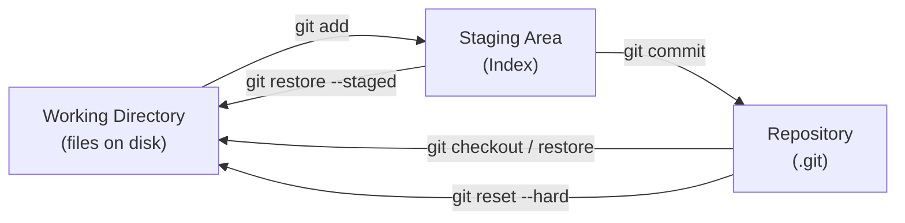
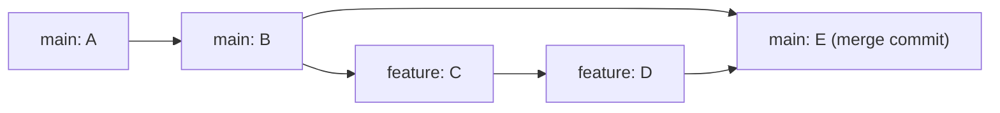
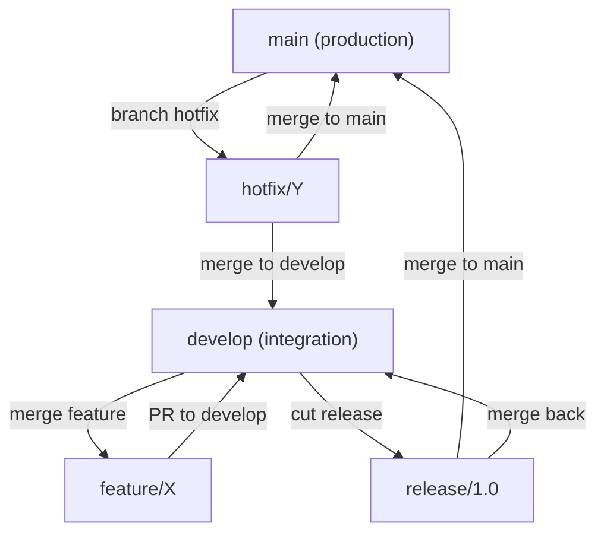
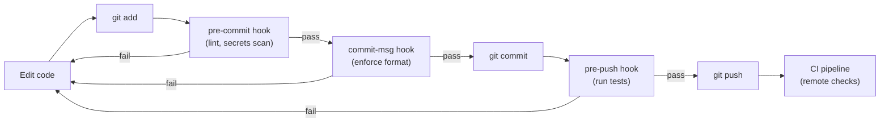

# Module 04: Git & Version Control

> Part of the [DevOps Career Course](./README.md) by UncleJS

[](https://creativecommons.org/licenses/by-nc-sa/4.0/)    

**Prerequisites:** Modules 01–03. Git installed (`sudo apt install git`).

**Time:** About 6 hours, including the labs.

**Lab:** Ubuntu 24.04. Labs 4.1–4.3 and 4.6 are local. Lab 4.4 needs a GitHub account. Argo CD is module 15.

---

## Table of Contents

- [Overview](#overview)
- [Learning Objectives](#learning-objectives)
- [Beginner: Core Git Commands](#beginner-core-git-commands)
- [Beginner: Working with Remote Repositories](#beginner-working-with-remote-repositories)
- [Intermediate: Resolving Conflicts](#intermediate-resolving-conflicts)
- [Intermediate: Git Workflows](#intermediate-git-workflows)
- [Intermediate: Advanced Git Techniques](#intermediate-advanced-git-techniques)
- [Intermediate: Git Hooks](#intermediate-git-hooks)
- [Intermediate: Git for Infrastructure Code](#intermediate-git-for-infrastructure-code)
- [Advanced: GitOps](#advanced-gitops)
- [Hands-On Labs](#hands-on-labs)
- [Further Reading](#further-reading)

---

## Overview

Version control is the foundation of everything in DevOps. Git tracks every change to every file in your codebase — who made it, when, and why. It enables teams to work in parallel without stepping on each other, safely experiment with new features, and roll back to any previous state in seconds.

Infrastructure code, CI/CD pipelines, Kubernetes manifests, Terraform configs — all of it lives in Git. If it's not in Git, it doesn't exist.

GitOps takes this further: Git is not just where code lives, but the single source of truth that **drives** your infrastructure. Automated systems continuously reconcile the live cluster state with what is declared in Git.

[↑ Back to TOC](#table-of-contents)

---

## Learning Objectives

By the end of this module you will be able to:

- Initialize repositories and make commits with meaningful messages
- Use branches to develop features in isolation
- Merge branches and resolve conflicts confidently
- Push and pull code from a remote repository on GitHub
- Use a pull request for code review
- Write a pre-commit hook and a commit-msg hook
- Recover a commit with `git reflog`

[↑ Back to TOC](#table-of-contents)

---

## Beginner: What is Git & Why It Matters

Git is a **distributed** version control system — every developer has a full copy of the entire history locally. Changes are tracked as a series of **commits**, each with a unique SHA-1 hash. SHA-256 repositories exist (`git init --object-format=sha256`) but they are opt-in and do not interoperate with SHA-1 remotes. Current Git still defaults to SHA-1.

Git's storage model is a directed acyclic graph (DAG) of content-addressed objects. Every commit is a snapshot, not a diff, and its SHA-1 hash is derived from its content — including the hash of its parent commit. This means Git history is tamper-evident: you cannot change any commit in history without changing the hash of every commit that follows it. Engineers who understand this model are immune to the confusion that plagues those who think of Git as "tracking changes" — Git tracks states, and the differences you see from `git diff` are computed on the fly by comparing two snapshot objects.

Commits are immutable. When you `git commit --amend`, you are not editing the last commit — you are creating a new commit with a new hash and moving the branch pointer to it. When you `git rebase`, each commit on your branch is replayed onto the new base, producing new commits with new hashes even if the content is identical. Operations that appear to "change history" are actually creating new history and pointing branches at the new commits. This is why force-pushing rebased commits to shared branches is destructive: anyone who has the old commits will have their history diverge from the new one.

A branch is just a pointer — a 41-byte file in `.git/refs/heads/` containing a commit hash. Creating a branch does not copy files. Deleting a branch does not delete commits (until garbage collection). `HEAD` is a pointer to either a branch (attached state) or a specific commit (detached HEAD state). Understanding that branches are cheap pointers is what makes feature-branch workflows intuitive: you are not creating a parallel copy of your codebase, you are just giving a commit a name.


```mermaid
flowchart LR
    WD["Working Directory<br/>(files on disk)"]
    IDX["Staging Area<br/>(Index)"]
    REPO["Repository<br/>(.git)"]

    WD -->|"git add"| IDX
    IDX -->|"git commit"| REPO
    REPO -->|"git checkout / restore"| WD
    IDX -->|"git restore --staged"| WD
    REPO -->|"git reset --hard"| WD
```

### Key Concepts

| Term | Definition |
|---|---|
| **Repository (repo)** | A directory tracked by Git, containing files and full change history |
| **Commit** | A snapshot of changes at a point in time, with a message and unique hash |
| **Branch** | An independent line of development (just a pointer to a commit) |
| **Remote** | A copy of the repository hosted elsewhere (e.g., GitHub, GitLab) |
| **Clone** | A full local copy of a remote repository |
| **Stage / Index** | The area where changes are prepared before committing |
| **Working directory** | Your actual files on disk |
| **HEAD** | A pointer to the currently checked-out commit or branch |

### The Three Areas of Git

```
Working Directory → Staging Area (Index) → Repository (.git)
       │                    │                      │
   (edit files)         (git add)             (git commit)
       │                                           │
   (git restore)                           (git reset --hard)
```

### How Git Stores Data

Git stores data as a **directed acyclic graph (DAG)** of objects:

```
Commit ──▶ Tree ──▶ Blob (file content)
  │                  └── Blob
  │
  └── Parent Commit ──▶ Tree ──▶ Blob
```

- **Blob**: file content (no filename — just content, hashed)
- **Tree**: a directory (maps filenames to blobs/sub-trees)
- **Commit**: points to a tree + parent commits + author + message

This is why `git diff` is fast and why Git doesn't duplicate unchanged files.

[↑ Back to TOC](#table-of-contents)

---

## Beginner: Core Git Commands

### Initial Setup

```bash
# Configure your identity (do this once, globally)
git config --global user.name "Your Name"
git config --global user.email "you@example.com"
git config --global core.editor "vim"
git config --global init.defaultBranch main
git config --global pull.rebase true         # Prefer rebase on pull
git config --global rebase.autoStash true    # Auto-stash before rebase

# View config
git config --list
git config --list --show-origin             # Show which file each setting comes from
```

### Starting a Repository

```bash
git init                    # Initialize a new repo in current directory
git init myproject          # Initialize in a new directory
git clone https://github.com/user/repo.git   # Clone a remote repo
git clone https://... mydir  # Clone into a specific directory
git clone --depth 1 https://... # Shallow clone — only latest commit (faster for CI)
```

### The Daily Workflow

```bash
git status                  # See what's changed
git --no-pager diff                    # See unstaged changes
git --no-pager diff --staged           # See staged changes
git --no-pager diff HEAD               # See all changes vs last commit

git add file.txt            # Stage a specific file
git add .                   # Stage all changes
# git add -p and git add -i open a prompt, so they stay commented.
# git add -p
# git add -i

git commit -m "feat(auth): add JWT token refresh"   # Commit with message
# git commit and git commit --amend open an editor, so they stay commented.
# git commit
# git commit --amend

git --no-pager log                     # Full commit history
git --no-pager log --oneline           # Compact one-line history
git --no-pager log --oneline --graph --all   # Visual branch graph
git --no-pager log --author="Alice"    # Filter by author
git --no-pager log --since="2 weeks ago"     # Filter by date
git --no-pager log --follow -- path/to/file  # History of a specific file (follows renames)
git --no-pager show abc1234            # Show details of a specific commit
git --no-pager show HEAD:path/to/file  # Show a file as it was in HEAD
```

### Undoing Changes

```bash
git restore file.txt            # Discard unstaged changes to a file
git restore --staged file.txt   # Unstage a file (keep changes)
git revert abc1234              # Create a new commit that undoes a previous commit (safe)
git revert abc1234..def5678     # Revert a range of commits

git reset --soft HEAD~1         # Undo last commit, keep changes staged
git reset --mixed HEAD~1        # Undo last commit, keep changes unstaged (default)
git reset --hard HEAD~1         # Undo last commit and discard ALL changes (dangerous)
git reset --hard origin/main    # Reset local branch to match remote exactly
```

> ⚠️ **Warning**: `git reset --hard` permanently discards uncommitted changes. Never use `--hard` on commits that have already been pushed to a shared remote — use `git revert` instead.

[↑ Back to TOC](#table-of-contents)

---

## Beginner: Branching & Merging

Branches let you develop features in isolation without affecting the main codebase. A branch is just a lightweight pointer — creating one is nearly free.

The ease of branching in Git is a genuine competitive advantage over older version control systems. In CVS and other older centralized workflows, branching was operationally heavy and often discouraged. Subversion improved this with cheap server-side copies, but branching and especially merging still tended to feel heavier than in Git. In Git, creating a branch is just moving a lightweight reference. This difference in cost changes how engineers work: cheap branches encourage experimentation, frequent integration, and workflow patterns (feature branches, release branches, hotfix branches) that are much easier to sustain when branching is inexpensive.

The choice between merge commit and rebase determines the shape of your project's history. A merge commit (`git merge --no-ff`) preserves the fact that work happened in parallel — you can see exactly which commits came from which branch and when they were integrated. Rebase produces a linear history that is easier to read with `git log --oneline` but hides the parallel development that actually occurred. Neither is universally correct. The critical rule is: never rebase commits that have been pushed to a shared branch. Once other engineers have based work on a commit, changing that commit's hash forces them to reconcile diverged histories.

Squash merging is a pragmatic compromise for teams with noisy WIP commit hygiene. It takes all the commits on a feature branch and collapses them into a single commit on the target branch. The main branch history stays clean and bisectable, while engineers are free to commit as messily as they like during development. The tradeoff is that the individual steps of the work are lost — you cannot `git bisect` into the feature's development history to find where a bug was introduced within those commits.


```mermaid
flowchart LR
    MAIN1["main: A"]
    MAIN2["main: B"]
    FEAT1["feature: C"]
    FEAT2["feature: D"]
    MERGE["main: E (merge commit)"]

    MAIN1 --> MAIN2
    MAIN2 --> FEAT1
    FEAT1 --> FEAT2
    MAIN2 --> MERGE
    FEAT2 --> MERGE
```

```bash
git branch                          # List local branches
git branch -a                       # List all branches (including remote-tracking)
git branch -v                       # List branches with last commit message
git branch feature/add-login        # Create a new branch (doesn't switch)
git switch feature/add-login        # Switch to a branch
git switch -c feature/add-login     # Create AND switch in one command
git switch -                        # Switch back to previous branch

git merge feature/add-login         # Merge feature branch into current branch
git merge --no-ff feature/add-login # Merge with a merge commit (preserves branch history)
git merge --squash feature/add-login # Squash all branch commits into one staged change

git branch -d feature/add-login     # Delete a branch (after merging)
git branch -D feature/add-login     # Force delete (even if not merged)
git push origin --delete feature/add-login  # Delete remote branch
```

### Merge Strategies

| Strategy | Command | Result | When to Use |
|---|---|---|---|
| **Fast-forward** | `git merge` | Linear history, no merge commit | Simple feature branch, no divergence |
| **Merge commit** | `git merge --no-ff` | Explicit merge commit preserves context | Default for most teams |
| **Squash** | `git merge --squash` | All branch commits → single staged change | Clean up messy WIP commits |
| **Rebase** | `git rebase main` | Replay branch commits on top of main | Linear history without merge commits |

```
# Fast-forward (default when possible)
main: A - B
feat:     └── C - D
result: A - B - C - D

# Merge commit
main: A - B - E (merge commit)
feat:     └── C - D ─┘

# Squash — stages one combined diff. Commit E does not exist until you commit.
main: A - B            (index holds the squashed change, branch is not moved yet)

# Rebase
feat: A - B - C' - D' (replayed on top)
```

[↑ Back to TOC](#table-of-contents)

---

## Beginner: Working with Remote Repositories

```bash
git remote -v                       # List remotes with URLs
git remote add origin https://github.com/user/repo.git   # Add a remote
git remote add upstream https://github.com/original/repo.git  # Add upstream (forks)
git remote set-url origin git@github.com:user/repo.git   # Change URL (e.g., HTTPS → SSH)

git push origin main                # Push local main to remote
git push origin feature/my-feature # Push a feature branch
git push -u origin main             # Set upstream tracking and push
git push --tags                     # Push tags
git push --force-with-lease         # Safer force push — fails if remote has new commits

git pull                            # Fetch + merge from remote
git pull --rebase                   # Fetch + rebase (cleaner history, preferred)
git fetch origin                    # Download remote changes without merging
git fetch --all --prune             # Fetch from all remotes, remove stale tracking branches

# Pull Request / Merge Request workflow
# 1. Create a branch: git switch -c feature/my-feature
# 2. Make commits
# 3. Push: git push -u origin feature/my-feature
# 4. Open PR on GitHub/GitLab
# 5. Request code review
# 6. Address feedback → push more commits
# 7. Merge via the web UI
# 8. Clean up: git fetch --prune && git branch -d feature/my-feature
```

### SSH vs HTTPS Authentication

```bash
# Generate an SSH key for GitHub. -N "" skips the passphrase prompt.
ssh-keygen -t ed25519 -C "you@example.com" -f ~/.ssh/id_ed25519_github -N ""

# Add to SSH agent. ssh-add prompts if the key has a passphrase.
# ssh-add ~/.ssh/id_ed25519_github

# Test connection. This waits on GitHub.
# ssh -T git@github.com
```

```
# ~/.ssh/config — multiple GitHub accounts
Host github-personal
    HostName github.com
    User git
    IdentityFile ~/.ssh/id_ed25519_personal

Host github-work
    HostName github.com
    User git
    IdentityFile ~/.ssh/id_ed25519_work

# Use: git clone git@github-work:company/repo.git
```

[↑ Back to TOC](#table-of-contents)

---

## Intermediate: Resolving Conflicts

Conflicts happen when two branches modify the same lines of the same file. They are normal — not a sign something went wrong.

```bash
git merge feature/login
# AUTO-MERGING FAILED
# CONFLICT (content): Merge conflict in app/config.py

# Open the conflicted file — it looks like this:
<<<<<<< HEAD
DATABASE_HOST = "production-db.example.com"
=======
DATABASE_HOST = "dev-db.example.com"
>>>>>>> feature/login

# 1. Edit the file to the correct final state (remove ALL conflict markers)
# 2. Stage the resolved file
git add app/config.py
# 3. Complete the merge
git commit -m "Merge feature/login — resolved config conflict"

# Abort a merge if things go wrong
git merge --abort

# Use a visual merge tool
git mergetool     # Opens configured tool (vimdiff, meld, VS Code, etc.)
git config --global merge.tool vimdiff
```

### Rebase Conflicts

During a rebase, conflicts are resolved commit-by-commit:

```bash
git rebase main
# CONFLICT (content): Merge conflict in app/config.py

# Fix the conflict, then:
git add app/config.py
git rebase --continue   # Apply the next commit in the replay

# If a conflict is too complex:
git rebase --abort      # Cancel the entire rebase, go back to original state

# Skip a commit that becomes empty after conflict resolution:
git rebase --skip
```

### `git rerere` — Remember Resolutions

```bash
# Enable rerere (reuse recorded resolution)
git config --global rerere.enabled true

# Now when you resolve the same conflict twice (e.g., during long-lived branches),
# Git automatically applies your previous resolution
git rerere diff     # Show what rerere has remembered
git rerere forget   # Forget a recorded resolution
```

[↑ Back to TOC](#table-of-contents)

---

## Intermediate: Git Workflows

The workflow you choose determines how quickly your team can safely deploy. GitHub Flow (branch → PR → merge to main → deploy) works because it keeps `main` always in a deployable state and eliminates the coordination overhead of managing multiple long-lived branches. Every change goes through a pull request, which provides a natural gate for code review, automated testing, and deployment preview. The constraint is that `main` must always be safe to deploy — which requires good test coverage and the discipline to keep changes small.

GitFlow introduces additional branch types — `develop`, `release/*`, `hotfix/*` — to support teams that cannot continuously deploy. If your product ships on a fixed release schedule, or if QA cycles require a stable integration branch separate from active development, GitFlow provides the structure to manage that. The cost is significant coordination overhead: every release requires merging into both `main` and `develop`, hotfixes must be cherry-picked to both branches, and `develop` frequently diverges enough from `main` to create painful integration conflicts. Many teams adopt GitFlow thinking they need it and then discover the coordination overhead exceeds the benefit.

Trunk-based development — where all engineers commit directly to `main` (or through very short-lived branches that live for hours, not days) — is the approach that enables high-velocity continuous delivery. Google, Meta, and most elite engineering organizations practice trunk-based development. The key enablers are: feature flags (to ship code without activating features), strong automated testing (so a failing build never lands on main), and the discipline to keep each commit small and focused. If your CI pipeline catches regressions before merge and you have feature flags for incomplete work, the risks that GitFlow addresses with branch isolation are already handled.


```mermaid
flowchart TD
    MAIN["main (production)"]
    DEV["develop (integration)"]
    FEAT["feature/X"]
    REL["release/1.0"]
    HOT["hotfix/Y"]

    DEV -->|"merge feature"| FEAT
    FEAT -->|"PR to develop"| DEV
    DEV -->|"cut release"| REL
    REL -->|"merge to main"| MAIN
    REL -->|"merge back"| DEV
    MAIN -->|"branch hotfix"| HOT
    HOT -->|"merge to main"| MAIN
    HOT -->|"merge to develop"| DEV
```

```
main (always deployable)
  ├── feature/add-login     ← branch, PR, review, merge, delete
  ├── fix/crash-on-logout   ← branch, PR, review, merge, delete
  └── feature/new-dashboard ← branch, PR, review, merge, delete
```

**Rules:**
1. `main` is always deployable to production
2. Create a feature branch from `main` with a descriptive name
3. Commit small, focused changes — push often
4. Open a Pull Request as soon as you have something to discuss
5. Get at least one code review approval
6. Merge via the web UI → delete the branch

**Works well for**: startups, small–medium teams, SaaS products with continuous delivery.

### Git Flow (Enterprise — complex projects)

```
main         ← production releases only (tagged)
develop      ← integration branch
  ├── feature/*   ← new features (branch from develop, merge to develop)
  ├── release/*   ← pre-release stabilization (branch from develop, merge to main + develop)
  └── hotfix/*    ← emergency production fixes (branch from main, merge to main + develop)
```

**Works well for**: scheduled releases, products with multiple supported versions, mobile apps.

**Drawback**: high process overhead. Most teams move away from this as they mature.

### Trunk-Based Development (CI/CD optimized)

```
main (trunk) ← all developers commit here directly, or via very short branches (< 1 day)
  feature flags ← hide incomplete features behind flags
  CI runs on every commit → fast feedback
```

**Requirements**:
- Strong test coverage (the safety net for committing to trunk)
- Feature flags to hide incomplete work
- Fast CI pipeline (< 10 min)
- Team discipline around small, working commits

**Works well for**: mature engineering teams, high-deployment-frequency products, Google/Facebook/Netflix scale.

### Comparing Workflows

| Factor | GitHub Flow | Git Flow | Trunk-Based |
|---|---|---|---|
| Release cadence | Continuous | Scheduled | Continuous |
| Branch lifetime | Hours–days | Days–weeks | Hours |
| Complexity | Low | High | Medium |
| Requires feature flags | No | No | Yes |
| Best for | Most teams | Legacy/regulated | Advanced teams |

[↑ Back to TOC](#table-of-contents)

---

## Intermediate: Advanced Git Techniques

### Stash — Save Work Temporarily

```bash
git stash                           # Stash current changes
git stash push -m "WIP: login feature"  # Stash with a name
git stash push -u -m "with untracked"   # Include untracked files
git --no-pager stash list           # List all stashes
git --no-pager stash show stash@{0} # Show what's in a stash
git --no-pager stash show -p stash@{0}  # Show the full diff
git stash pop                       # Apply and remove top stash
git stash apply stash@{1}           # Apply a specific stash without removing
git stash drop stash@{1}            # Delete a specific stash
git stash clear                     # Delete all stashes
git stash branch feature/wip stash@{0}  # Create a branch from a stash
```

### Rebase — Rewrite History

```bash
# Update your branch with the latest main (cleaner than merge)
git switch feature/my-feature
git rebase main

# Interactive rebase opens an editor, so it stays commented.
# git rebase -i HEAD~5
# Commands in interactive rebase:
# pick   = keep commit as-is
# reword = keep but edit message
# edit   = pause to amend the commit
# squash = combine with previous commit (keep messages)
# fixup  = combine and discard message (clean squash)
# drop   = remove commit entirely
# exec   = run a shell command after this commit

# Autosquash: mark commits with "fixup!" prefix and Git squashes automatically
git commit -m "fixup! feat(auth): add JWT token refresh"
# git rebase -i --autosquash main
```

> ⚠️ **Golden rule**: Never rebase commits that have been pushed to a shared remote branch. Rebase is for local history cleanup before pushing.

### Cherry-Pick — Apply a Specific Commit

```bash
git cherry-pick abc1234     # Apply commit abc1234 to current branch
git cherry-pick abc1234 def5678  # Apply multiple commits (in order)
git cherry-pick abc1234..def5678  # Apply a range (exclusive start)
git cherry-pick --no-commit abc1234  # Apply changes without auto-committing
git cherry-pick --signoff abc1234    # Add Signed-off-by to message
```

**Use case**: A bug fix was committed to a feature branch. You need it on `main` before the feature is complete.

### Bisect — Find a Bug by Binary Search

```bash
git bisect start
git bisect bad                  # Current commit is broken
git bisect good v1.0.0          # v1.0.0 was working
# Git checks out a commit halfway between — test it
git bisect good                 # This commit is good
git bisect bad                  # This commit is bad
# Git narrows down — repeat until the exact bad commit is found
git bisect reset                # Exit bisect mode

# Automate with a script
git bisect run ./test.sh        # Good = exits 0, Bad = exits non-zero
```

### Tags — Mark Releases

```bash
git tag v1.0.0                              # Lightweight tag (just a pointer)
git tag -a v1.0.0 -m "Release v1.0.0"      # Annotated tag (recommended — stores tagger, date)
git tag                                     # List all tags
git tag -l "v1.*"                           # List tags matching pattern
git --no-pager show v1.0.0                  # Show tag details
git push origin v1.0.0                      # Push a specific tag
git push origin --tags                      # Push all tags
git checkout v1.0.0                         # Checkout a tag (detached HEAD)
git tag -d v1.0.0                           # Delete tag locally
git push origin --delete v1.0.0            # Delete remote tag
```

### Worktrees — Multiple Working Directories

Work on two branches simultaneously without stashing:

```bash
git worktree add ../hotfix-branch hotfix/issue-123
# Now you have two working directories:
# /myproject         → main branch
# /hotfix-branch     → hotfix/issue-123

git worktree list
git worktree remove ../hotfix-branch
```

[↑ Back to TOC](#table-of-contents)

---

## Intermediate: Git Hooks

Git hooks are scripts that run automatically at specific points in the Git workflow. They live in `.git/hooks/` and must be executable.


```mermaid
flowchart LR
    EDIT["Edit code"]
    ADD["git add"]
    PRECOMMIT["pre-commit hook<br/>(lint, secrets scan)"]
    COMMITMSG["commit-msg hook<br/>(enforce format)"]
    COMMIT["git commit"]
    PREPUSH["pre-push hook<br/>(run tests)"]
    PUSH["git push"]
    CI["CI pipeline<br/>(remote checks)"]

    EDIT --> ADD
    ADD --> PRECOMMIT
    PRECOMMIT -->|"pass"| COMMITMSG
    COMMITMSG -->|"pass"| COMMIT
    COMMIT --> PREPUSH
    PREPUSH -->|"pass"| PUSH
    PUSH --> CI
    PRECOMMIT -->|"fail"| EDIT
    COMMITMSG -->|"fail"| EDIT
    PREPUSH -->|"fail"| EDIT
```

### Hook Execution Points

| Hook | When It Runs | Common Use |
|---|---|---|
| `pre-commit` | Before commit is created | Lint, format, secrets scan |
| `prepare-commit-msg` | Before commit message editor opens | Auto-populate message |
| `commit-msg` | After message is entered | Enforce message format |
| `post-commit` | After commit is created | Notifications |
| `pre-push` | Before pushing to remote | Run tests |
| `post-merge` | After a merge | `npm install` if package.json changed |
| `pre-rebase` | Before rebasing | Safety checks |

### Useful Hook Examples

```bash
# .git/hooks/pre-commit — runs before every commit
#!/bin/bash
set -e

echo "Running pre-commit checks..."

# Run shellcheck on shell scripts
if command -v shellcheck &>/dev/null; then
    while IFS= read -r file; do
        shellcheck "$file"
    done < <(git diff --cached --name-only --diff-filter=ACM | grep '\.sh$')
fi

# Prevent committing .env files
if git diff --cached --name-only | grep -qE '^\.env$|\.env\.|secrets'; then
    echo "ERROR: Attempting to commit a secrets file!"
    echo "Remove it from staging: git restore --staged <file>"
    exit 1
fi

# Prevent committing to main directly
BRANCH=$(git symbolic-ref --short HEAD 2>/dev/null || echo DETACHED)
if [ "$BRANCH" = "main" ] || [ "$BRANCH" = "master" ]; then
    echo "ERROR: Direct commits to $BRANCH are not allowed!"
    echo "Create a feature branch: git switch -c feature/your-feature"
    exit 1
fi

echo "Pre-commit checks passed."
```

```bash
# .git/hooks/commit-msg — enforce Conventional Commits format
#!/bin/bash
COMMIT_MSG=$(cat "$1")
PATTERN="^(feat|fix|docs|style|refactor|perf|test|chore|ci|revert)(\(.+\))?: .{1,100}"

if ! echo "$COMMIT_MSG" | grep -qE "$PATTERN"; then
    echo ""
    echo "ERROR: Commit message must follow Conventional Commits format:"
    echo "  <type>(<scope>): <description>"
    echo ""
    echo "Types: feat, fix, docs, style, refactor, perf, test, chore, ci, revert"
    echo "Example: feat(auth): add JWT token refresh"
    echo ""
    exit 1
fi
```

```bash
# .git/hooks/pre-push — run tests before pushing
#!/bin/bash
echo "Running tests before push..."
if ! bash -n myscript.sh; then
    echo "Syntax check failed — push rejected. Fix the script and try again."
    exit 1
fi
echo "Tests passed."
```

```bash
# Make hooks executable
chmod +x .git/hooks/pre-commit
chmod +x .git/hooks/commit-msg
chmod +x .git/hooks/pre-push
```

### Share Hooks with Your Team

`.git/hooks/` is not tracked by Git. Three approaches:

**1. `pre-commit` framework** (recommended — language-agnostic):

```yaml
# .pre-commit-config.yaml (tracked in git, shared with team)
repos:
  - repo: https://github.com/pre-commit/pre-commit-hooks
    rev: v4.5.0
    hooks:
      - id: trailing-whitespace
      - id: end-of-file-fixer
      - id: check-yaml
      - id: detect-private-key
      - id: check-added-large-files

  - repo: https://github.com/koalaman/shellcheck-precommit
    rev: v0.9.0
    hooks:
      - id: shellcheck
```

```bash
sudo apt install -y pre-commit
pre-commit install   # Install hooks from .pre-commit-config.yaml
pre-commit run --all-files  # Run manually against all files
```

**2. Husky** (Node.js projects). Current Husky ignores a `husky` key in `package.json`.

```bash
npx husky init
# .husky/pre-commit
npx lint-staged
```

**3. Symlink hooks to a tracked directory:**

```bash
# hooks/ directory is tracked in git
# .git/hooks/ symlinks point to it
ln -sf ../../hooks/pre-commit .git/hooks/pre-commit
```

[↑ Back to TOC](#table-of-contents)

---

## Intermediate: Git for Infrastructure Code

### .gitignore for DevOps Repos

```gitignore
# Terraform / OpenTofu
.terraform/
*.tfstate
*.tfstate.backup
*.tfplan
# Commit .terraform.lock.hcl so every apply uses the same provider versions.
override.tf
override.tf.json
*_override.tf
*_override.tf.json

# Ansible
*.retry
vault_password.txt
group_vars/all/vault.yml   # Encrypted OK to commit, but be explicit
.vault_pass

# Kubernetes
kubeconfig
*.kubeconfig

# Helm
charts/*.tgz

# General secrets — NEVER commit these
.env
.env.local
.env.production
*.pem
*.key
*_rsa
*_ed25519
id_*
secrets/
credentials.json
service-account*.json
*.p12
*.pfx

# Editor
.vscode/
.idea/
*.swp
*.swo
.DS_Store
```

### Conventional Commits for Infrastructure

Apply type prefixes consistently to infrastructure commits:

```
feat(terraform): add RDS module for production database
fix(k8s): increase memory limits for API deployment
chore(ansible): update nginx role to 1.25
ci: add terraform validate step to pipeline
docs(runbook): add database failover procedure
refactor(helm): extract common labels to helper template
perf(nginx): enable gzip compression for static assets
```

### Repository Structure for Infrastructure

```
infra/
├── kubernetes/
│   ├── base/                  # Shared manifests (Kustomize base)
│   │   ├── deployments/
│   │   ├── services/
│   │   └── kustomization.yaml
│   ├── overlays/
│   │   ├── production/        # Production-specific patches
│   │   └── staging/           # Staging-specific patches
│   └── apps/                  # ArgoCD Application manifests (GitOps)
├── terraform/
│   ├── modules/               # Reusable modules
│   │   ├── rds/
│   │   └── vpc/
│   └── environments/
│       ├── production/
│       └── staging/
└── ansible/
    ├── playbooks/
    ├── roles/
    └── inventory/
```

### Branch Protection Rules (GitHub/GitLab)

Configure these for your `main` branch:

- ✅ Require pull request reviews (minimum 1 approval)
- ✅ Dismiss stale reviews on new commits
- ✅ Require status checks to pass (CI)
- ✅ Require branches to be up to date before merging
- ✅ Restrict who can push directly to `main`
- ✅ Require signed commits (for regulated environments)

[↑ Back to TOC](#table-of-contents)

---

## Advanced: Signing, Security & Auditing

### Signing Commits with GPG

Signed commits prove that a commit was made by who it claims. GitHub/GitLab show a "Verified" badge on signed commits.

```bash
# Generate a GPG key
# gpg --full-generate-key   # Interactive. It stops a paste.
# Choose: RSA and RSA, 4096 bits, doesn't expire (or set expiry)

# List your keys
gpg --list-secret-keys --keyid-format=long

# Configure Git to use your key
# (replace KEY_ID with the long key ID from above)
git config --global user.signingkey KEY_ID
git config --global commit.gpgsign true     # Sign all commits automatically
git config --global tag.gpgsign true        # Sign all tags automatically

# Sign a single commit manually
git commit -S -m "feat: signed commit"

# Verify a commit's signature
git --no-pager log --show-signature -1

# Export public key to add to GitHub/GitLab
gpg --armor --export KEY_ID
```

### Signing Commits with SSH Keys (modern approach)

GitHub/GitLab support using SSH keys for commit signing (simpler than GPG):

```bash
# Tell Git to use SSH for signing
git config --global gpg.format ssh
git config --global user.signingkey ~/.ssh/id_ed25519.pub
git config --global commit.gpgsign true
# Local verification needs an allowed signers file. GitHub can show Verified without it.
mkdir -p ~/.config/git
echo "$(git config --global user.email) $(cat ~/.ssh/id_ed25519.pub)" >> ~/.config/git/allowed_signers
git config --global gpg.ssh.allowedSignersFile ~/.config/git/allowed_signers

# Add the public key to GitHub: Settings → SSH and GPG keys → New signing key
```

### Detecting Secrets in History

```bash
# gitleaks is not an Ubuntu 24.04 apt package. Skip these until you install a release binary.
# gitleaks detect --source .
# gitleaks detect --source . --log-opts="HEAD~50..HEAD"
```

### Removing Secrets from Git History

If you accidentally committed a secret:

```bash
# 1. IMMEDIATELY revoke the leaked credential (before anything else)
# 2. Remove from history. Ubuntu 24.04: apt, not system pip (PEP 668).
sudo apt install -y git-filter-repo
# filter-repo deletes the origin remote so a rewritten history is not pushed by accident.
git filter-repo --path secrets.txt --invert-paths
git remote add origin git@github.com:user/repo.git
git push origin --force-with-lease --all
git push origin --force-with-lease --tags

# 4. All collaborators must re-clone — their copies still have the secret
```

[↑ Back to TOC](#table-of-contents)

---

## Advanced: GitOps

GitOps means the desired state of a system lives in Git, and a controller inside the cluster pulls that state. Push-based deploy (`kubectl apply` from CI) puts cluster credentials in the pipeline. Pull-based deploy keeps those credentials in the cluster.

The install, Application manifests, and Flux comparison are in module 15, after Kubernetes. Do not install Argo CD in this module.

[↑ Back to TOC](#table-of-contents)

---

## Tools & Commands Reference

| Command | Purpose |
|---|---|
| `git init` / `git clone` | Start a repository |
| `git add` / `git commit` | Stage and commit changes |
| `git status` / `git diff` | Inspect working state |
| `git log --oneline --graph` | View branch history visually |
| `git branch` / `git switch` | Manage and navigate branches |
| `git merge` / `git rebase` | Integrate branch changes |
| `git push` / `git pull` | Sync with remote |
| `git push --force-with-lease` | Safer force push |
| `git stash` | Temporarily save work |
| `git cherry-pick` | Apply a specific commit |
| `git bisect` | Binary-search for a bug |
| `git tag` | Mark release points |
| `git revert` | Safely undo a commit |
| `git commit -S` | Sign a commit with GPG/SSH |
| `git filter-repo` | Rewrite history (remove secrets) |
| `git worktree` | Multiple working dirs from one repo |
| `argocd`, `flux` | GitOps commands are module 15, after Kubernetes |

[↑ Back to TOC](#table-of-contents)

---

## Hands-On Labs

### Lab 4.1 — First Repository

```bash
mkdir -p ~/labs/module-04-init && cd ~/labs/module-04-init
git init -b main
git config user.email "lab@example.com"
git config user.name "Lab User"
echo '# lab' > README.md
git add README.md && git commit -m "docs: initial readme"
echo 'more' >> README.md
git --no-pager diff
git add README.md && git commit -m "docs: second line"
git --no-pager log --oneline --graph --all
git status
```

**Expected:** `git log --oneline` shows two commits. `git status` prints `nothing to commit, working tree clean`.

**Cleanup:** `rm -rf ~/labs/module-04-init`

### Lab 4.2 — Branching & Merging

```bash
mkdir -p ~/labs/module-04-merge && cd ~/labs/module-04-merge
git init -b main
git config user.email "lab@example.com"
git config user.name "Lab User"
echo base > README.md && git add README.md && git commit -m "docs: base"
git switch -c feature/add-config
echo 'port: 8080' > config.yaml && git add config.yaml && git commit -m "feat: add config"
git switch main
echo 'lab' >> README.md && git add README.md && git commit -m "docs: note"
git merge --no-ff feature/add-config -m "merge: add config"
git --no-pager log --oneline --graph
git branch -d feature/add-config
git branch
```

**Expected:** `git log --oneline --graph` shows a merge commit with two parents. `git branch` no longer lists `feature/add-config`.

**Cleanup:** `rm -rf ~/labs/module-04-merge`

### Lab 4.3 — Conflict Resolution

```bash
mkdir -p ~/labs/module-04-conflict && cd ~/labs/module-04-conflict
git init -b main
git config user.email "lab@example.com"
git config user.name "Lab User"
git config rerere.enabled true
echo 'color: blue' > app.txt && git add app.txt && git commit -m "feat: base"
git switch -c left
echo 'color: red' > app.txt && git commit -am "feat: red"
git switch main
echo 'color: green' > app.txt && git commit -am "feat: green"
git merge left || true
# Markers are seven characters: <<<<<<< ======= >>>>>>>
printf 'color: green\n' > app.txt
git add app.txt && git commit -m "merge: keep green"
git reset --hard HEAD^
git merge left || true
git add app.txt && git commit -m "merge: rerere"
git status
git --no-pager log --oneline --graph
```

**Expected:** `git status` is clean after the merge commit. `git log --oneline --graph` shows both parents.

**Cleanup:** `rm -rf ~/labs/module-04-conflict`

### Lab 4.4 — GitHub Workflow

Create a new local repo. Earlier labs delete their directories, so do not reuse one.

```bash
mkdir -p ~/labs/module-04-github && cd ~/labs/module-04-github
git init -b main
git config user.email "lab@example.com"
git config user.name "Lab"
echo "lab" > README.md
git add README.md
git commit -m "initial"
```

1. Create a repo on GitHub with branch protection rules:
   - Require PR review
   - Require status checks
2. Add that repo as `origin` and push `main`
3. Create a feature branch, make changes, push the branch
4. Open a Pull Request with a clear description
5. Review and merge via the GitHub UI
6. Pull the changes locally and delete the remote branch

**Expected:** The pull request page shows the branch commits. After merge, `git pull` on `main` contains the feature commit. Branch protection on a free private repository may not include required status checks; require a pull request instead, and skip status checks if the UI does not offer them.

**Cleanup:** `rm -rf ~/labs/module-04-github`. Delete the practice repository on GitHub when you are done with it.

### Lab 4.5 — Git Hook

```bash
mkdir -p ~/labs/module-04-hooks && cd ~/labs/module-04-hooks
git init -b main
git config user.email "lab@example.com"
git config user.name "Lab User"
echo 'ok' > README.md && git add README.md && git commit -m "docs: base"
cat > .git/hooks/pre-commit << 'EOF'
#!/bin/bash
if git diff --cached --name-only | grep -qx '.env'; then
  echo "refusing .env" >&2
  exit 1
fi
EOF
cat > .git/hooks/commit-msg << 'EOF'
#!/bin/bash
grep -qE '^(feat|fix|docs|style|refactor|perf|test|chore|ci|revert)(\(.+\))?: .{1,100}' "$1" || {
  echo "use Conventional Commits" >&2
  exit 1
}
EOF
chmod +x .git/hooks/pre-commit .git/hooks/commit-msg
echo secret > .env && git add .env && git commit -m "docs: leak" || true
git reset
echo note >> README.md && git add README.md
git commit -m "wip" || true
git commit -m "docs: lab note"
```

**Expected:** Committing a file named `.env` is rejected. A message `wip` is rejected. A message `docs: lab note` is accepted.

**Cleanup:** `rm -rf ~/labs/module-04-hooks`

### Lab 4.6 — Recover a commit with reflog

Argo CD is module 15. This lab stays in Git.

```bash
mkdir -p ~/labs/module-04-reflog && cd ~/labs/module-04-reflog
git init -b main
git config user.email "lab@example.com"
git config user.name "Lab User"
echo one > file.txt && git add file.txt && git commit -m "first"
echo two >> file.txt && git commit -am "second"
git reset --hard HEAD~1
echo 'after reset:' && cat file.txt
git --no-pager reflog
git reset --hard 'HEAD@{1}'
echo 'after restore:' && cat file.txt
git --no-pager log --oneline
```

**Expected:** After the hard reset, `file.txt` contains only `one`. After restoring `HEAD@{1}`, it contains `one` and `two`. `git log --oneline` shows both commits.

**Cleanup:** `rm -rf ~/labs/module-04-reflog`

[↑ Back to TOC](#table-of-contents)

---

## Further Reading

- [Pro Git (free book)](https://git-scm.com/book/en/v2) — Scott Chacon
- [Oh Shit, Git!](https://ohshitgit.com/) — Plain English solutions to common mistakes
- [Conventional Commits](https://www.conventionalcommits.org/) — Commit message standard
- [GitHub Flow Guide](https://docs.github.com/en/get-started/quickstart/github-flow)
- [Trunk-Based Development](https://trunkbaseddevelopment.com/) — Full guide
- [ArgoCD Documentation](https://argo-cd.readthedocs.io/en/stable/)
- [Flux Documentation](https://fluxcd.io/flux/)
- [OpenGitOps — The 4 GitOps Principles](https://opengitops.dev/)
- [GitOps Cookbook](https://www.oreilly.com/library/view/gitops-cookbook/9781492097464/) — O'Reilly
- [Atlassian Git Tutorials](https://www.atlassian.com/git/tutorials)
- [Glossary: Branch](./glossary.md#b), [Fork](./glossary.md#f), [Pull Request](./glossary.md#p), [Repository](./glossary.md#r)

[↑ Back to TOC](#table-of-contents)
