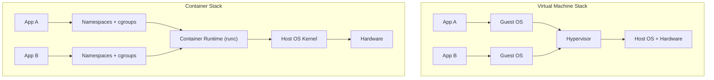
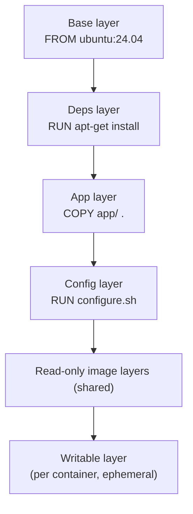
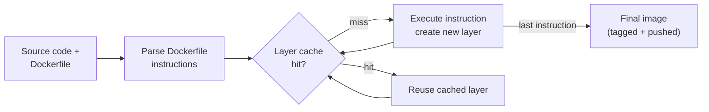
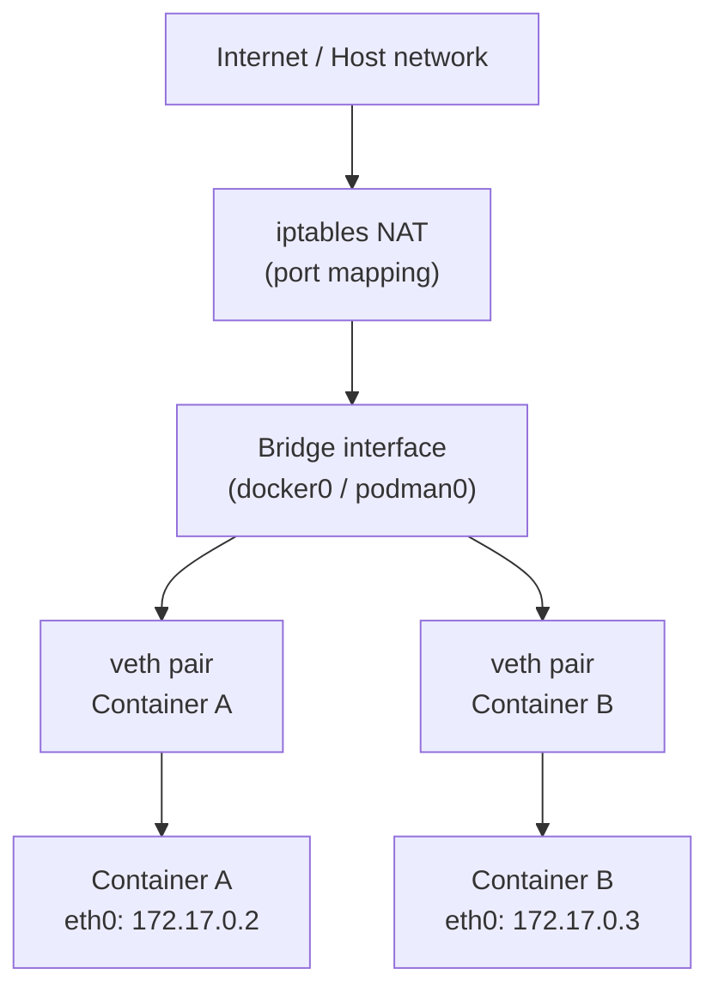
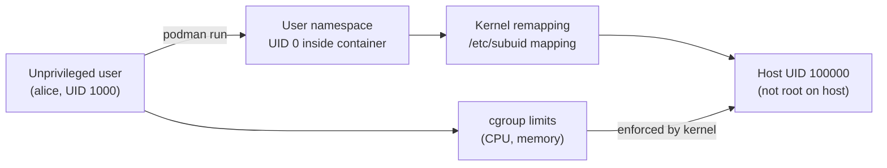

# Module 05: Containers — Docker & Podman

> Part of the [DevOps Career Course](./README.md) by UncleJS

[](https://creativecommons.org/licenses/by-nc-sa/4.0/)     

---

## Table of Contents

- [Overview](#overview)
- [Learning Objectives](#learning-objectives)
- [Beginner: What Are Containers?](#beginner-what-are-containers)
- [Beginner: Docker vs Podman — Side-by-Side](#beginner-docker-vs-podman--side-by-side)
- [Beginner: Installing Docker & Podman](#beginner-installing-docker--podman)
- [Beginner: Images & Containers](#beginner-images--containers)
- [Beginner: Running Containers](#beginner-running-containers)
- [Beginner: Writing Dockerfiles & Containerfiles](#beginner-writing-dockerfiles--containerfiles)
- [Beginner: Container Networking](#beginner-container-networking)
- [Beginner: Volumes & Persistent Storage](#beginner-volumes--persistent-storage)
- [Intermediate: Docker Compose & Podman Compose](#intermediate-docker-compose--podman-compose)
- [Intermediate: Scaling Containers & Load Balancing](#intermediate-scaling-containers--load-balancing)
- [Intermediate: Container Registries](#intermediate-container-registries)
- [Intermediate: Podman Rootless & systemd Integration](#intermediate-podman-rootless--systemd-integration)
- [Intermediate: Container Security](#intermediate-container-security)
- [Intermediate: Image Optimization Best Practices](#intermediate-image-optimization-best-practices)
- [Advanced: Podman in Production](#advanced-podman-in-production)
- [Tools & Commands Reference](#tools--commands-reference)
- [Hands-On Labs](#hands-on-labs)
- [Further Reading](#further-reading)

---

## Overview

Containers have transformed how software is built and deployed. They solve the "works on my machine" problem by packaging an application and all its dependencies into a single portable unit that runs identically everywhere — from a developer's laptop to a production cloud server.

This module covers both **Docker** and **Podman** with equal depth. Docker is the industry standard and most widely known. Podman is a daemonless, rootless alternative that integrates natively with Linux systemd and is increasingly preferred in security-conscious and enterprise environments.

[↑ Back to TOC](#table-of-contents)

---

## Learning Objectives

By the end of this module you will be able to:

- Explain what containers are and how they differ from VMs
- Pull, run, stop, and remove containers with both Docker and Podman
- Write Dockerfiles and Containerfiles to build custom images
- Configure container networking and persistent storage
- Use Docker Compose and Podman Compose for multi-container applications
- Push and pull images to/from container registries
- Explain Podman's rootless security model and user namespace remapping
- Run Podman in rootless mode and manage containers as unprivileged services
- Integrate Podman containers with systemd using both `podman generate systemd` and Quadlet unit files
- Write `.container`, `.network`, and `.pod` Quadlet unit files for production deployments
- Use `skopeo` to copy and inspect images across registries without pulling
- Use `buildah` for low-level OCI image construction
- Apply container security best practices including capability dropping and image scanning
- Optimize images for size and build speed

[↑ Back to TOC](#table-of-contents)

---

## Beginner: What Are Containers?

### Containers vs Virtual Machines

| Feature | Virtual Machine | Container |
|---|---|---|
| Isolation | Full OS kernel | Linux namespaces + cgroups |
| Size | GBs | MBs |
| Startup time | Minutes | Seconds (or milliseconds) |
| Resource overhead | High (full OS) | Low (shares host kernel) |
| Portability | OS-dependent | Runs anywhere with a container runtime |
| Use case | Full OS isolation | Application packaging and delivery |

### How Containers Work

Containers use two core Linux kernel features to provide isolation without a full virtual machine:

- **Namespaces** — isolate: PID, network, filesystem, users, hostname
- **cgroups (Control Groups)** — limit: CPU, memory, disk I/O

Namespaces are the kernel mechanism that makes containers feel like isolated systems. There are seven namespace types: PID (a container has its own process tree starting at PID 1), network (its own network interfaces and routing table), mount (its own filesystem view), UTS (its own hostname), IPC (its own inter-process communication), user (its own UID/GID mappings, enabling rootless containers), and cgroup (its own cgroup hierarchy). Each namespace type is independent — a container gets all of them simultaneously, which is what produces the illusion of an isolated operating environment while sharing the host kernel.

cgroups (control groups) provide the resource accounting and enforcement that namespaces do not. Namespaces provide isolation — processes in one container cannot see processes in another. cgroups provide limits — a container consuming 100% of available CPU or memory can be constrained or killed. cgroup v2 (the current version) provides a unified hierarchy where memory limits, CPU shares, I/O throttling, and process counts are all managed through the same tree at `/sys/fs/cgroup/`. Container runtimes like runc (which Docker and Podman both use) write cgroup configuration files before starting the container process. Without cgroups, a single misbehaving container could starve all others on the host.

The important conceptual distinction between containers and VMs is where isolation occurs. A VM includes a full operating system kernel, hardware emulation, and device drivers — it is a complete independent OS running on top of a hypervisor. A container is a set of isolated processes on the host OS; the host kernel is shared. This means containers start in milliseconds (no kernel boot), occupy megabytes (no OS image overhead), and can be packed more densely on a host. It also means a kernel vulnerability can affect all containers on a host simultaneously — defense-in-depth (seccomp profiles, AppArmor, rootless execution) is essential.



```
Host OS Kernel
├── Container A (its own PID namespace, network namespace, /proc)
├── Container B (isolated from A)
└── Container C (isolated from A and B)
```

All containers share the **same host kernel** — this is why they're lightweight.

[↑ Back to TOC](#table-of-contents)

---

## Beginner: Docker vs Podman — Side-by-Side

| Feature | Docker | Podman |
|---|---|---|
| Architecture | Client + daemon (`dockerd`) | Daemonless (fork/exec model) |
| Root required | Yes (daemon runs as root) | No (rootless by default) |
| systemd integration | Limited | Native (Quadlet unit files) |
| CLI compatibility | `docker` | `podman` (drop-in replacement) |
| Compose support | `docker compose` | `podman-compose` / `podman compose` |
| Image format | OCI-compatible | OCI-compatible |
| Pod support | No | Yes (like Kubernetes pods) |
| Quadlet support | No | Yes (`.container` / `.network` / `.pod` units) |
| Security posture | Root daemon = attack surface | Rootless = smaller attack surface |
| Prevalence | Industry standard | Growing, default in RHEL/Fedora |

> **Key Insight**: Podman's CLI is intentionally compatible with Docker. In most cases, you can replace `docker` with `podman` in a command and it works identically.

```bash
# These are equivalent:
docker run -it ubuntu:24.04 bash
podman run -it ubuntu:24.04 bash
```

[↑ Back to TOC](#table-of-contents)

---

## Beginner: Installing Docker & Podman

### Docker (Ubuntu)

```bash
# Remove old versions
sudo apt remove docker docker-engine docker.io containerd runc

# Install via official script (quickest)
curl -fsSL https://get.docker.com | sh

# Add your user to the docker group (avoid using sudo)
sudo usermod -aG docker $USER
newgrp docker

# Verify
docker version
docker run hello-world
```

### Podman (Ubuntu)

```bash
sudo apt update
sudo apt install -y podman

# Verify
podman version
podman run hello-world

# Rootless setup (usually automatic on modern systems)
podman info | grep -A2 "rootless"
```

### Podman (RHEL/Rocky/Fedora)

```bash
sudo dnf install -y podman podman-compose
```

[↑ Back to TOC](#table-of-contents)

---

## Beginner: Images & Containers

A container image is a stack of read-only layers, each representing the filesystem changes introduced by one Dockerfile instruction. When you run a container, a thin writable layer is added on top of these read-only layers. The container reads from all layers beneath it but writes only to the top layer. When the container is removed, the writable layer is discarded; the underlying image layers are unchanged and shared across all containers running from the same image.

The layer model is what makes image distribution efficient. When you push or pull an image, only the layers that do not already exist at the destination are transferred. If you have ten containers running from the same base image, that base image's layers are stored exactly once on disk and in memory, regardless of how many containers reference them. This is also why the order of instructions in a Dockerfile matters for build performance: layers are cached and reused from previous builds as long as the instruction and its inputs have not changed. A single changed instruction invalidates all cache layers below it.

Content addressing is the mechanism that makes image digests reliable. Every layer is identified by the SHA-256 hash of its compressed tar archive. The image manifest is identified by the SHA-256 hash of its JSON descriptor. This means an image pulled by digest (`nginx@sha256:abc123...`) is cryptographically guaranteed to be bit-for-bit identical to what was pushed. Images pulled by tag (`nginx:1.25`) can change if someone pushes a new image to the same tag — pinning by digest in production is the only way to ensure reproducibility.



### The Container Lifecycle

```
Image (blueprint) → Container (running instance)
       │                    │
  docker build          docker run
  podman build          podman run
```

- An **image** is a read-only layered filesystem (built from a Dockerfile)
- A **container** is a running instance of an image with a writable layer on top
- Multiple containers can run from the same image simultaneously

### Working with Images

```bash
# Docker
docker pull nginx:1.25              # Pull image from Docker Hub
docker images                       # List local images
docker image ls                     # Same as above
docker image rm nginx:1.25          # Remove an image
docker image prune                  # Remove dangerously unused images
docker image inspect nginx:1.25     # Full image metadata

# Podman (identical commands)
podman pull nginx:1.25
podman images
podman image ls
podman image rm nginx:1.25
podman image prune
podman image inspect nginx:1.25
```

[↑ Back to TOC](#table-of-contents)

---

## Beginner: Running Containers

### Core Run Flags

```bash
# Run a container — Docker and Podman share the same flags
docker run nginx                     # Run in foreground (blocking)
docker run -d nginx                  # Run detached (background)
docker run -it ubuntu:24.04 bash     # Interactive with terminal
docker run --name webserver nginx    # Give it a name
docker run -p 8080:80 nginx          # Map host port 8080 → container port 80
docker run -p 127.0.0.1:8080:80 nginx  # Bind to localhost only
docker run -e ENV_VAR=value nginx    # Set environment variable
docker run -v /host/path:/container/path nginx  # Mount a volume
docker run --rm nginx                # Auto-remove container when stopped
docker run -d --restart always nginx # Always restart if it crashes

# Same with Podman:
podman run -d -p 8080:80 --name webserver nginx
```

### Managing Running Containers

```bash
# Docker
docker ps                           # List running containers
docker ps -a                        # List all containers (including stopped)
docker stop webserver               # Gracefully stop
docker start webserver              # Start a stopped container
docker restart webserver            # Stop + start
docker rm webserver                 # Remove a stopped container
docker rm -f webserver              # Force remove (even if running)
docker logs webserver               # View container logs
docker logs -f webserver            # Follow logs in real time
docker exec -it webserver bash      # Open shell in running container
docker inspect webserver            # Full container metadata

# Podman (identical):
podman ps
podman ps -a
podman stop webserver
podman logs -f webserver
podman exec -it webserver bash
podman inspect webserver
```

[↑ Back to TOC](#table-of-contents)

---

## Beginner: Writing Dockerfiles & Containerfiles

Podman uses the identical `Containerfile` format (can also use `Dockerfile` — same thing).

Layer caching is the most important performance concept for Dockerfile authors. Every instruction in a Dockerfile creates a new layer. Docker and Podman cache these layers and reuse them on subsequent builds if the instruction has not changed. Cache invalidation is sequential: once any instruction's cache is invalidated (because the instruction changed, or because a file it `COPY`s changed), all subsequent instructions are also invalidated and must be rebuilt. This is the reasoning behind "copy dependency manifests first, then install, then copy application code." The `package.json` and `requirements.txt` files change far less frequently than application source code, so placing them in earlier layers preserves the cache for the slow dependency installation step even when application code changes.

The instruction ordering rule is: put things that change least frequently at the top of the Dockerfile, and things that change most frequently at the bottom. Base image selection rarely changes; system package installation changes occasionally; dependency manifests change sometimes; application source code changes constantly. A Dockerfile that `COPY . .` before `RUN npm install` busts the dependency installation cache on every code change, rebuilding node_modules from scratch on every build. A Dockerfile that copies `package.json` first, runs `npm install`, then copies the source code preserves the npm install cache across code changes, reducing build time from minutes to seconds.

Multi-stage builds are the standard pattern for keeping final images small. The build stage uses a full SDK image with compilers, build tools, and development dependencies. The final stage starts from a minimal base image (distroless, Alpine, or `scratch`) and copies only the compiled artifacts from the build stage. The build tools, package managers, and intermediate files never appear in the final image. This matters for security as well as size: every extra package in a production image is an additional attack surface.



### Anatomy of a Dockerfile

```dockerfile
# Base image — always start with an official image
FROM ubuntu:24.04

# Set the maintainer label
LABEL maintainer="your@email.com"

# Set environment variables
ENV APP_PORT=8080
ENV APP_ENV=production

# Run commands to install dependencies
RUN apt-get update && apt-get install -y \
    python3 \
    python3-pip \
    && rm -rf /var/lib/apt/lists/*

# Set the working directory
WORKDIR /app

# Copy dependency files first (layer caching optimization)
COPY requirements.txt .
RUN pip3 install -r requirements.txt

# Copy application code
COPY . .

# Create a non-root user for security
RUN useradd -r -s /bin/false appuser
USER appuser

# Document which port the app listens on
EXPOSE 8080

# Default command to run
CMD ["python3", "app.py"]
```

### Building Images

```bash
# Docker
docker build -t myapp:1.0 .                   # Build from Dockerfile in current dir
docker build -t myapp:1.0 -f Dockerfile.prod .  # Specify a Dockerfile
docker build --no-cache -t myapp:1.0 .         # Build without cache
docker build --build-arg VERSION=1.5 -t myapp . # Pass build arguments

# Podman
podman build -t myapp:1.0 .
podman build -t myapp:1.0 -f Containerfile .
```

### Multi-Stage Builds (Advanced)

Multi-stage builds produce tiny final images by building in one stage and copying only artifacts to the final image.

```dockerfile
# Stage 1: Build
FROM golang:1.22 AS builder
WORKDIR /build
COPY . .
RUN go build -o server .

# Stage 2: Final image (much smaller)
FROM alpine:3.19
WORKDIR /app
COPY --from=builder /build/server .
EXPOSE 8080
CMD ["./server"]
```

[↑ Back to TOC](#table-of-contents)

---

## Beginner: Container Networking

Container networking is built on Linux virtual network devices. When you create a Docker or Podman bridge network, the runtime creates a Linux bridge interface on the host (typically named `docker0` or `podman0`). Each container connected to that network gets a pair of virtual Ethernet interfaces (veth pair): one end lives inside the container's network namespace (visible as `eth0`), and the other end is attached to the bridge on the host. The bridge forwards traffic between all attached veth pairs, and a host-side iptables/nftables rule provides NAT for outbound internet access.

Two containers on the same custom network can communicate using container names as hostnames because Docker and Podman embed a DNS resolver that maps container names to their internal IP addresses. This DNS resolution only works within the same network — containers on different networks are isolated by default and cannot communicate without explicit network configuration or port mapping. The default bridge network (`bridge`/`docker0`) does not provide DNS-based name resolution; this is why the documentation consistently recommends creating custom user-defined networks for multi-container applications.

Port mapping (`-p 8080:80`) works through iptables DNAT rules written by the container runtime. When a packet arrives on the host's port 8080, the kernel's netfilter rewrites the destination to the container's internal IP and port 80, forwarding it into the container's network namespace. The container sees the connection as arriving on its own port 80 and has no awareness of the host's port 8080 or the NAT that occurred. This is transparent to the application, which is the point — the same container image can be published on any host port without modification.



### Docker Network Types

| Network | Description | Use Case |
|---|---|---|
| **bridge** | Default; containers can communicate via container name | Single-host development |
| **host** | Container shares host network stack | Performance-critical apps |
| **none** | No networking | Fully isolated workloads |
| **overlay** | Multi-host networking (Docker Swarm) | Distributed production |

```bash
# Docker
docker network ls                               # List networks
docker network create mynetwork                 # Create a custom network
docker network inspect mynetwork               # Inspect network
docker run -d --network mynetwork --name app nginx   # Connect to network

# Containers on the same custom network can reach each other by name
docker exec app curl http://database:5432      # "database" = container name

# Podman
podman network ls
podman network create mynetwork
podman run -d --network mynetwork --name app nginx
```

### Exposing Ports

```bash
# Map container port 80 to host port 8080
docker run -d -p 8080:80 nginx
podman run -d -p 8080:80 nginx

# Access: http://localhost:8080 → container port 80
```

[↑ Back to TOC](#table-of-contents)

---

## Beginner: Volumes & Persistent Storage

Containers are ephemeral — data written inside a container is lost when the container is removed. Volumes provide persistent storage.

### Volume Types

| Type | Syntax | Managed By |
|---|---|---|
| **Named volume** | `-v mydata:/app/data` | Docker/Podman |
| **Bind mount** | `-v /host/path:/container/path` | You (host filesystem) |
| **tmpfs** | `--tmpfs /tmp` | RAM (temporary, in-memory) |

```bash
# Docker — named volumes
docker volume create mydata                         # Create a volume
docker volume ls                                    # List volumes
docker volume inspect mydata                        # Inspect volume
docker run -d -v mydata:/var/lib/mysql mysql:8.0   # Use volume
docker volume rm mydata                             # Remove volume

# Bind mount — map a host directory
docker run -d -v /home/user/html:/usr/share/nginx/html nginx
podman run -d -v /home/user/html:/usr/share/nginx/html:Z nginx
# Note: Podman uses :Z or :z suffix on SELinux systems to relabel

# Podman volumes
podman volume create mydata
podman volume ls
podman run -d -v mydata:/var/lib/mysql docker.io/library/mysql:8.0
```

[↑ Back to TOC](#table-of-contents)

---

## Intermediate: Docker Compose & Podman Compose

Compose files define and run multi-container applications with a single command.

### docker-compose.yml / compose.yaml

```yaml
version: "3.9"

services:
  # Web application
  web:
    build: .
    ports:
      - "8080:8080"
    environment:
      - DATABASE_URL=postgresql://postgres:password@db:5432/appdb
      - REDIS_URL=redis://cache:6379
    depends_on:
      db:
        condition: service_healthy
      cache:
        condition: service_started
    networks:
      - appnet
    restart: unless-stopped

  # PostgreSQL database
  db:
    image: postgres:16
    environment:
      POSTGRES_DB: appdb
      POSTGRES_USER: postgres
      POSTGRES_PASSWORD: password
    volumes:
      - pgdata:/var/lib/postgresql/data
    networks:
      - appnet
    healthcheck:
      test: ["CMD-SHELL", "pg_isready -U postgres"]
      interval: 10s
      timeout: 5s
      retries: 5

  # Redis cache
  cache:
    image: redis:7-alpine
    networks:
      - appnet

volumes:
  pgdata:

networks:
  appnet:
    driver: bridge
```

### Compose Commands

```bash
# Docker Compose (v2 — built into docker CLI)
docker compose up -d                # Start all services in background
docker compose down                 # Stop and remove containers
docker compose down -v              # Also remove volumes
docker compose ps                   # Show status of services
docker compose logs -f              # Follow all service logs
docker compose logs -f web          # Follow logs of one service
docker compose exec web bash        # Open shell in running service
docker compose build                # Rebuild images
docker compose pull                 # Pull latest images
docker compose restart web          # Restart one service

# Podman Compose
podman-compose up -d
podman-compose down
podman-compose ps
podman-compose logs -f
```

[↑ Back to TOC](#table-of-contents)

---

## Intermediate: Scaling Containers & Load Balancing

Running a single container is fine for development. In production, you need multiple instances for availability and throughput — and a load balancer in front of them.

### Scaling with Docker Compose

Docker Compose can run multiple replicas of a service using `--scale`. Traffic distribution requires removing fixed host port mappings and placing a load balancer in front.

**Scalable `compose.yaml` (no fixed host port on the app):**

```yaml
version: "3.8"

services:
  web:
    image: nginx:alpine
    # No "ports:" here — the LB handles external traffic
    networks:
      - app-net

  lb:
    image: nginx:alpine
    ports:
      - "80:80"
    volumes:
      - ./nginx-lb.conf:/etc/nginx/nginx.conf:ro
    networks:
      - app-net
    depends_on:
      - web

networks:
  app-net:
```

**`nginx-lb.conf` — Nginx as the load balancer:**

```nginx
events { worker_connections 1024; }

http {
    upstream web_backends {
        least_conn;
        server web_1:80;    # Docker Compose names: <service>_<replica-number>
        server web_2:80;
        server web_3:80;
    }

    server {
        listen 80;
        location / {
            proxy_pass http://web_backends;
            proxy_set_header Host              $host;
            proxy_set_header X-Real-IP         $remote_addr;
            proxy_set_header X-Forwarded-For   $proxy_add_x_forwarded_for;
        }
    }
}
```

**Scale up and down:**

```bash
# Start with 3 replicas of the web service
docker compose up -d --scale web=3

# Scale up to 5 (live — no downtime)
docker compose up -d --scale web=5

# Scale down to 2
docker compose up -d --scale web=2

# Check how many replicas are running
docker compose ps
```

> **Note on naming**: Docker Compose names scaled containers `<project>-<service>-<n>` (e.g., `myapp-web-1`, `myapp-web-2`). Containers can reach each other using the service name — Docker's internal DNS resolves `web` to all containers in the service via round-robin.

### Traefik as a Compose-Native Load Balancer

Traefik is the cleanest way to load-balance Docker Compose services. It reads container labels — no manual upstream config needed. When you scale a service, Traefik **automatically detects the new replicas** and adds them to the pool.

**`compose.yaml` with Traefik auto-discovery:**

```yaml
version: "3.8"

networks:
  traefik-net:

services:
  traefik:
    image: traefik:v3
    command:
      - "--providers.docker=true"
      - "--providers.docker.exposedbydefault=false"
      - "--entrypoints.web.address=:80"
      - "--api.dashboard=true"
      - "--api.insecure=true"   # Dashboard on :8080 (dev only — protect in prod)
    ports:
      - "80:80"
      - "8080:8080"             # Dashboard
    volumes:
      - /var/run/docker.sock:/var/run/docker.sock:ro
    networks:
      - traefik-net

  web:
    image: traefik/whoami   # Simple test image — prints container info
    networks:
      - traefik-net
    labels:
      - "traefik.enable=true"
      - "traefik.http.routers.web.rule=Host(`app.localhost`)"
      - "traefik.http.routers.web.entrypoints=web"
      - "traefik.http.services.web.loadbalancer.server.port=80"
      # Round-robin across all replicas (default)
      - "traefik.http.services.web.loadbalancer.sticky.cookie=false"
```

```bash
# Start Traefik + 1 web instance
docker compose up -d

# Scale to 5 replicas — Traefik auto-discovers all of them
docker compose up -d --scale web=5

# Verify round-robin: each request should show a different container hostname
for i in $(seq 1 10); do
    curl -s -H "Host: app.localhost" http://localhost/ | grep Hostname
done

# Open Traefik dashboard to see the service with 5 backends
open http://localhost:8080/dashboard/
```

**Load balancing behavior**: By default Traefik uses round-robin across all healthy replicas. When you scale down, Traefik immediately stops routing to removed containers. When a new replica starts, it joins the pool after passing Traefik's health checks.

### Health Checks for Scaled Services

When scaling, health checks prevent traffic from reaching containers that haven't finished starting:

```yaml
services:
  web:
    image: myapp:latest
    healthcheck:
      test: ["CMD", "curl", "-f", "http://localhost:3000/health"]
      interval: 10s
      timeout: 5s
      retries: 3
      start_period: 20s    # Grace period — no checks during app startup
    labels:
      - "traefik.enable=true"
      # Traefik respects Docker health status — only routes to healthy containers
      - "traefik.http.services.web.loadbalancer.healthcheck.path=/health"
      - "traefik.http.services.web.loadbalancer.healthcheck.interval=10s"
```

### Scaling in Production: Podman + Systemd

For rootless Podman in production (without Kubernetes), use systemd template units to run multiple instances:

```ini
# /etc/systemd/user/webapp@.service  (note the @ — this is a template unit)
[Unit]
Description=Web App Instance %i
After=network-online.target

[Service]
ExecStart=podman run --rm \
    --name webapp-%i \
    --network=webapp-net \
    --env-file=/etc/webapp/webapp.env \
    -p 0:3000 \
    ghcr.io/myorg/webapp:latest
ExecStop=podman stop webapp-%i
Restart=on-failure
RestartSec=5s

[Install]
WantedBy=default.target
```

```bash
# Enable and start 3 instances
systemctl --user enable webapp@1 webapp@2 webapp@3
systemctl --user start webapp@1 webapp@2 webapp@3

# Check all instances
systemctl --user status 'webapp@*'

# Scale up: add a 4th
systemctl --user enable --now webapp@4
```

### Choosing Your Container LB Strategy

| Approach | Use When |
|---|---|
| **Nginx upstream block** | Simple, predictable — great when you know replica count ahead of time |
| **Traefik with Docker labels** | Dynamic scaling — Traefik auto-discovers new replicas without config changes |
| **HAProxy** | Maximum control, statistics, session persistence, connection draining |
| **Kubernetes Services** | You've outgrown Compose and need orchestration |

[↑ Back to TOC](#table-of-contents)

---

## Intermediate: Container Registries

A registry stores and distributes container images.

| Registry | URL | Notes |
|---|---|---|
| Docker Hub | `docker.io` | Default public registry |
| GitHub Container Registry | `ghcr.io` | Integrated with GitHub |
| AWS ECR | `<account>.dkr.ecr.<region>.amazonaws.com` | AWS-managed |
| Azure ACR | `<name>.azurecr.io` | Azure-managed |
| Google Artifact Registry | `<region>-docker.pkg.dev` | GCP-managed |
| Quay.io | `quay.io` | Red Hat managed |

```bash
# Login to registries
docker login                                    # Docker Hub
docker login ghcr.io -u USERNAME               # GitHub Container Registry
docker login 123456789.dkr.ecr.us-east-1.amazonaws.com  # AWS ECR

# Podman login
podman login docker.io
podman login ghcr.io -u USERNAME

# Tag and push an image
docker tag myapp:1.0 ghcr.io/uncleJS/myapp:1.0
docker push ghcr.io/uncleJS/myapp:1.0

podman tag myapp:1.0 ghcr.io/uncleJS/myapp:1.0
podman push ghcr.io/uncleJS/myapp:1.0

# Pull from a specific registry
docker pull ghcr.io/uncleJS/myapp:1.0
podman pull ghcr.io/uncleJS/myapp:1.0
```

[↑ Back to TOC](#table-of-contents)

---

## Intermediate: Podman Rootless & systemd Integration

### The Rootless Security Model

Rootless Podman runs entirely as a regular user — no root, no daemon, dramatically smaller attack surface. Understanding *why* this is secure requires a look at Linux user namespaces.

User namespace remapping is the kernel mechanism that makes rootless containers possible. When Podman creates a container as an unprivileged user, it requests a user namespace from the kernel. Inside that namespace, UIDs are remapped: UID 0 inside the container maps to your actual unprivileged UID on the host (typically 1000+). The kernel enforces this remapping at the syscall boundary — when the container process calls `setuid(0)` or attempts a privileged operation, the kernel checks the effective UID outside the namespace, not inside it. The container process has no more privilege on the host than the user who started it.

The `/etc/subuid` and `/etc/subgid` files define the UID/GID range that each user is allowed to use inside user namespaces. A typical entry `alice:100000:65536` means alice can map UIDs 100000–165535 into container user namespaces. Files created inside the container by UID 0 appear on the host as owned by UID 100000 (alice's first mapped UID), not by root. This is visible in `ls -la` on any named volume used by a rootless container — you will see high UIDs rather than 0. Understanding this mapping is essential when debugging permission errors in rootless containers.

Rootless containers cannot acquire Linux capabilities that require real root privileges. A rootless container cannot bind to ports below 1024 on the host (though it can inside its own network namespace), cannot load kernel modules, cannot create raw sockets, and cannot modify host network configuration. For most application workloads, none of these restrictions matter. For workloads that genuinely need these capabilities — network monitoring tools, custom VPN implementations — a rootful container or a specific capability grant is required, and the security tradeoff should be documented and deliberate.



#### User Namespace Remapping

When you run `podman run` as a non-root user, Podman creates a **user namespace** for the container. Inside that namespace, the process sees itself as UID 0 (root). On the host, it maps to your unprivileged UID.

```
Host                         Container (user namespace)
─────────────────────────    ──────────────────────────
UID 1000 (alice)      ──►    UID 0 (root inside container)
UID 1001              ──►    UID 1
UID 1002              ──►    UID 2
...                          ...
```

The mapping is stored in `/proc/self/uid_map`. The kernel enforces that even if a container process calls `setuid(0)`, it has no privileges outside its namespace.

```bash
# Confirm rootless is active
podman info | grep -i rootless     # rootless: true

# See the UID map for a running container
podman inspect <container> --format '{{.HostConfig.UsernsMode}}'

# View the actual mapping at the kernel level
cat /proc/self/uid_map
# Output: 0  1000  1   (container UID 0 = host UID 1000, 1 mapping)
```

#### Rootless vs Root-daemon Comparison

| Aspect | Docker (root daemon) | Podman (rootless) |
|---|---|---|
| Daemon | `dockerd` runs as root | No daemon at all |
| Socket | `/var/run/docker.sock` (world-writable risk) | Per-user: `$XDG_RUNTIME_DIR/podman/podman.sock` |
| Privilege escalation risk | Compromised socket = root on host | No socket, no daemon to compromise |
| Networking | Full bridge networking | `slirp4netns` or `pasta` (userspace networking) |
| Port < 1024 | Can bind directly | Requires port forwarding workaround |
| Storage | `/var/lib/docker` | `~/.local/share/containers` |

#### Rootless Networking

Rootless containers use userspace network stacks because creating real network interfaces requires `CAP_NET_ADMIN`.

- **`slirp4netns`** — legacy userspace TCP/IP stack; slower but widely supported
- **`pasta`** — modern replacement (Podman 4.4+); faster, better IPv6 support

```bash
# Check which network backend is in use
podman info | grep networkBackend

# Rootless containers can expose ports >= 1024 natively
podman run -d -p 8080:80 --name webserver nginx

# To bind port 80 (privileged) as rootless — use sysctl or a higher port
# Option 1: Map host 80 → container 80 via firewall redirect (recommended)
sudo sysctl net.ipv4.ip_unprivileged_port_start=80

# Option 2: Use a host port >= 1024 and put a reverse proxy in front
podman run -d -p 8080:80 nginx
# Then configure Nginx/Traefik on port 80 to forward to localhost:8080
```

---

### Podman Desktop

**Podman Desktop** is the official GUI for managing rootless containers locally — available for Linux, macOS, and Windows. It's particularly useful for developers who want Docker Desktop parity without the licensing concerns.

**Key capabilities:**
- Start/stop/inspect containers, pods, images, and volumes
- View real-time logs and resource usage
- Port-forward into running containers
- Manage Compose stacks (using `podman compose`)
- Connect to remote Podman sockets (including WSL2 or SSH remotes)
- Kubernetes integration — deploy to local `kind`/`minikube` clusters

```bash
# Install on Linux (Flatpak)
flatpak install flathub io.podman_desktop.PodmanDesktop

# Or download AppImage from podman-desktop.io
```

> **DevOps tip**: Podman Desktop's "Extensions" system lets you add Kubernetes, Red Hat OpenShift, and Compose plugins. It's a compelling replacement for Docker Desktop on developer workstations in RHEL/Fedora shops.

---

### Running Podman Rootless

```bash
# Run as regular user (no sudo needed)
podman run -d -p 8080:80 --name webserver nginx

# Check that no root is involved
podman info | grep -i rootless     # Should say "rootless: true"
id                                  # You are NOT root

# Rootless networking
podman network ls

# User-scoped storage location
ls ~/.local/share/containers/storage/
```

---

### Podman Pods

Podman supports the concept of **pods** (like Kubernetes pods) — multiple containers sharing the same network namespace. This is unique to Podman and has no Docker equivalent.

```
Pod: myapp
├── infra container (pause)   ← holds the shared network namespace
├── web (nginx)               ← shares pod's IP and ports
└── app (your service)        ← shares pod's IP and ports
```

The **infra container** (`k8s.gcr.io/pause` or `localhost/podman-pause`) holds the network namespace open. Other containers in the pod join it. If a container restarts, the network namespace persists — just like Kubernetes.

```bash
# Create a pod with a published port
podman pod create --name myapp -p 8080:80

# Add containers to the pod (they share the pod's network)
podman run -d --pod myapp --name web nginx
podman run -d --pod myapp --name app myapp:1.0

# List pods and their containers
podman pod ls
podman pod ps

# Resource stats for the whole pod
podman pod stats myapp

# Stop/start/remove entire pod
podman pod stop myapp
podman pod start myapp
podman pod rm -f myapp   # removes pod and all its containers

# Generate Kubernetes YAML from a running pod (bridge to Module 06!)
podman kube generate myapp -f myapp-pod.yaml
```

**Sidecar pattern example** — app container + log shipper sharing the same network:

```bash
podman pod create --name logsidecar
podman run -d --pod logsidecar --name app myapp:1.0
podman run -d --pod logsidecar --name fluentbit \
  -v /var/log/app:/var/log/app:ro \
  fluent/fluent-bit:latest
# Both containers reach each other via localhost inside the pod
```

---

### systemd Integration — Two Approaches

Podman offers two ways to run containers as systemd services:

| Approach | Status | Best for |
|---|---|---|
| `podman generate systemd` | Deprecated (Podman v4.4+) | Legacy systems, quick one-offs |
| **Quadlet** (`.container` unit files) | **Recommended** | Production, declarative, RHEL 9+ |

---

#### Approach A: `podman generate systemd` (Legacy)

This approach generates a `.service` file from a *running* container. Still useful for older systems or quick setups.

```bash
# 1. Run your container first
podman run -d --name webserver --restart always nginx

# 2. Generate the systemd unit file
#    --new: creates a fresh container on start (rather than managing the existing one)
#    --files: write to disk rather than stdout
podman generate systemd --name webserver --files --new

# 3. Install the generated unit
mkdir -p ~/.config/systemd/user/
cp container-webserver.service ~/.config/systemd/user/

# 4. Enable and start
systemctl --user daemon-reload
systemctl --user enable --now container-webserver.service
systemctl --user status container-webserver.service

# 5. Enable linger so the service starts at boot without logging in
loginctl enable-linger $USER

# 6. View logs via the systemd journal
journalctl --user -u container-webserver.service -f
```

> ⚠️ `podman generate systemd` is deprecated as of Podman 4.4. Use Quadlet for new deployments.

---

#### Approach B: Quadlet (Modern — Recommended)

**Quadlet** is the production-grade, declarative way to run Podman containers as systemd services. You write a `.container` unit file and systemd's generator automatically creates the corresponding `.service` unit at `daemon-reload` time.

**File locations:**

| Scope | Directory |
|---|---|
| User (rootless) | `~/.config/containers/systemd/` |
| System (root) | `/etc/containers/systemd/` |

**Unit file types:**

| Extension | Purpose |
|---|---|
| `.container` | Define a single container as a service |
| `.network` | Define a Podman network (CNI/Netavark) |
| `.pod` | Define a Podman pod |
| `.volume` | Define a named Podman volume |
| `.image` | Pre-pull an image as a systemd dependency |

##### Example: Simple web server

```ini
# ~/.config/containers/systemd/webserver.container

[Unit]
Description=Nginx Web Server
After=network-online.target

[Container]
Image=docker.io/library/nginx:alpine
PublishPort=8080:80
Volume=%h/www:/usr/share/nginx/html:ro,z
Environment=NGINX_HOST=localhost
AutoUpdate=registry

[Service]
Restart=always
TimeoutStartSec=30

[Install]
WantedBy=default.target
```

```bash
# Reload systemd — Quadlet generator creates the .service unit automatically
systemctl --user daemon-reload

# The service name is derived from the filename (without .container)
systemctl --user start webserver
systemctl --user enable webserver
systemctl --user status webserver

# Logs
journalctl --user -u webserver -f
```

##### Example: Network + two containers

```ini
# ~/.config/containers/systemd/appnet.network
[Network]
Driver=bridge
Subnet=10.88.1.0/24
```

```ini
# ~/.config/containers/systemd/redis.container
[Unit]
Description=Redis Cache
After=network-online.target

[Container]
Image=docker.io/library/redis:7-alpine
Network=appnet.network
Volume=redis-data:/data:Z

[Service]
Restart=always
```

```ini
# ~/.config/containers/systemd/myapp.container
[Unit]
Description=My Application
After=redis.service

[Container]
Image=ghcr.io/uncleJS/myapp:1.0
Network=appnet.network
PublishPort=3000:3000
Environment=REDIS_URL=redis://redis:6379
HealthCmd=curl -f http://localhost:3000/health || exit 1
HealthInterval=30s
HealthRetries=3

[Service]
Restart=on-failure

[Install]
WantedBy=default.target
```

```bash
# Apply all three units at once
systemctl --user daemon-reload

# Start in dependency order
systemctl --user start myapp   # starts redis first (After=redis.service)

# Validate unit files before applying
systemd-analyze --user verify ~/.config/containers/systemd/myapp.container
```

##### Key Quadlet directives reference

| Directive | Description |
|---|---|
| `Image=` | Container image to use |
| `PublishPort=` | `hostPort:containerPort` |
| `Volume=` | Mount: `hostPath:containerPath:options` |
| `Network=` | Attach to a `.network` unit or existing network |
| `Environment=` | Set env var (`KEY=value`) |
| `EnvironmentFile=` | Load env vars from a file |
| `Secret=` | Mount a Podman secret by name |
| `HealthCmd=` | Health check command |
| `HealthInterval=` | Interval between health checks |
| `AutoUpdate=` | `registry` = auto-pull new image tags |
| `Pod=` | Attach to a `.pod` unit |
| `Label=` | Add container label |
| `Exec=` | Override container entrypoint command |

```bash
# Enable linger for rootless services to start at boot
loginctl enable-linger $USER
loginctl show-user $USER | grep Linger
```

[↑ Back to TOC](#table-of-contents)

---

## Intermediate: Container Security

The principle of least privilege applied to containers means the container process should have exactly the permissions it needs to perform its function — no more. Running as root inside a container is the most common violation. Even though root inside a rootful container is slightly constrained (namespace boundaries, seccomp filters), it is not isolated enough. A container escape vulnerability in the runtime can escalate container root to host root. A non-root container process requires an additional step to exploit — the attacker must also escalate from the container UID to root inside the container before attempting the escape.

Linux capabilities are the granular mechanism for granting specific privileged operations without full root access. The kernel divides root's privileges into approximately 40 distinct capabilities: `CAP_NET_BIND_SERVICE` (bind to ports below 1024), `CAP_SYS_PTRACE` (trace processes), `CAP_NET_ADMIN` (configure network interfaces), and so on. The security best practice is `--cap-drop ALL --cap-add <specific_cap>`: drop every capability explicitly, then add back only those your application actually requires. Most web applications and services need zero capabilities. Those that do typically need one or two specific ones — pinning them explicitly makes security review tractable.

A privileged container (`--privileged`) is equivalent to root on the host with no meaningful isolation. It has access to all devices, all capabilities, and can modify host networking and filesystem mounts. There are legitimate uses — container-based CI runners that need to build and run containers, certain security scanning tools — but privileged containers should be treated as an exception requiring documented justification, not a default for "it didn't work without it." When someone says "just add `--privileged`," the correct response is to identify which specific capability or device access is actually needed and grant only that.

### Key Security Principles

1. **Never run as root inside a container** — use a non-root USER in your Dockerfile
2. **Use minimal base images** — Alpine, Distroless, or scratch
3. **Scan images for vulnerabilities** before deploying
4. **Don't store secrets in images** — use environment variables, secrets managers
5. **Read-only filesystems** where possible
6. **Drop Linux capabilities** to only what's needed

```dockerfile
# Security-hardened Dockerfile
FROM python:3.12-slim

# Don't run as root
RUN useradd -r -u 1001 -s /bin/false appuser

WORKDIR /app
COPY --chown=appuser:appuser . .
RUN pip install --no-cache-dir -r requirements.txt

USER appuser
EXPOSE 8080
CMD ["python", "app.py"]
```

```bash
# Run with security options
docker run -d \
  --read-only \                          # Read-only filesystem
  --tmpfs /tmp \                         # Allow writes only to /tmp
  --cap-drop ALL \                       # Drop all capabilities
  --cap-add NET_BIND_SERVICE \           # Add back only what's needed
  --security-opt no-new-privileges \     # Prevent privilege escalation
  myapp:1.0

podman run -d \
  --read-only \
  --cap-drop ALL \
  --security-opt no-new-privileges \
  myapp:1.0
```

### Image Scanning with Trivy

```bash
# Install Trivy
curl -sfL https://raw.githubusercontent.com/aquasecurity/trivy/main/contrib/install.sh | sh

# Scan an image
trivy image nginx:1.25
trivy image --severity HIGH,CRITICAL myapp:1.0
trivy image --exit-code 1 --severity CRITICAL myapp:1.0  # Fail on critical CVEs
```

[↑ Back to TOC](#table-of-contents)

---

## Intermediate: Image Optimization Best Practices

```dockerfile
# BAD: Each RUN creates a new layer
RUN apt-get update
RUN apt-get install -y curl
RUN apt-get install -y nginx

# GOOD: Combine into one layer
RUN apt-get update && apt-get install -y \
    curl \
    nginx \
    && rm -rf /var/lib/apt/lists/*

# GOOD: Copy dependency files BEFORE source code (caching)
COPY package.json package-lock.json ./
RUN npm install
COPY . .    # Source code changes don't bust the npm install cache

# Use .dockerignore to exclude files from build context
# .dockerignore:
# .git
# node_modules
# *.log
# .env
```

### Choosing the Right Base Image

| Base Image | Size | Use Case |
|---|---|---|
| `ubuntu:24.04` | ~78 MB | General purpose, lots of tools available |
| `debian:bookworm-slim` | ~75 MB | Smaller Debian |
| `alpine:3.19` | ~5 MB | Minimal, for compiled apps |
| `python:3.12-slim` | ~45 MB | Python apps (slim variant) |
| `python:3.12-alpine` | ~20 MB | Python apps (smallest) |
| `gcr.io/distroless/python3` | ~15 MB | No shell, minimal attack surface |

[↑ Back to TOC](#table-of-contents)

---

## Advanced: Podman in Production

This section covers production-grade Podman patterns: OCI builds without Docker, CI/CD integration, image registry management with `skopeo`, secrets management, and a complete multi-container Quadlet stack.

---

### OCI Image Building Without Docker

Podman can build OCI-compliant images without the Docker daemon, making it ideal for rootless CI pipelines.

#### Containerfile vs Dockerfile

`Containerfile` is the OCI-standard name for what Docker calls a `Dockerfile`. The syntax is identical — Podman accepts both names automatically.

```bash
# Both work — Podman checks for Containerfile first, then Dockerfile
podman build -t myapp:1.0 .

# Explicitly specify the file
podman build -f Containerfile -t myapp:1.0 .
podman build -f Dockerfile -t myapp:1.0 .
```

#### Multi-Platform Builds

```bash
# Build for multiple CPU architectures
podman build \
  --platform linux/amd64,linux/arm64 \
  --manifest myapp:1.0 \
  .

# Push the multi-arch manifest to a registry
podman manifest push myapp:1.0 ghcr.io/uncleJs/myapp:1.0
```

#### buildah — Low-Level OCI Builder

`buildah` is the underlying OCI image build tool that Podman uses internally. It's useful when you need fine-grained control over image layers.

```bash
# Install
sudo dnf install -y buildah    # RHEL/Fedora
sudo apt install -y buildah    # Ubuntu

# Build from a Containerfile (same as podman build)
buildah bud -t myapp:1.0 .

# Script-based build (no Containerfile at all)
container=$(buildah from ubi9-minimal)
buildah run $container -- dnf install -y python3
buildah copy $container app.py /opt/app.py
buildah config --cmd "python3 /opt/app.py" $container
buildah commit $container myapp:1.0

# Push to registry
buildah push myapp:1.0 ghcr.io/uncleJs/myapp:1.0
```

> **buildah vs podman build**: Use `podman build` for everyday image builds. Use `buildah` when you need scripted, layer-by-layer control — for example, in pipeline stages that add security patches to a base image without a full rebuild.

---

### Podman in CI/CD

#### GitHub Actions — Rootless Podman

GitHub-hosted runners include Podman. Replace `docker` with `podman` — no additional setup needed.

```yaml
# .github/workflows/build.yml
name: Build & Push Image

on:
  push:
    branches: [main]

jobs:
  build:
    runs-on: ubuntu-latest
    steps:
      - uses: actions/checkout@v4

      - name: Log in to GHCR
        run: echo "${{ secrets.GITHUB_TOKEN }}" | podman login ghcr.io -u ${{ github.actor }} --password-stdin

      - name: Build image
        run: podman build -t ghcr.io/${{ github.repository }}:${{ github.sha }} .

      - name: Push image
        run: podman push ghcr.io/${{ github.repository }}:${{ github.sha }}

      - name: Scan for vulnerabilities
        run: |
          curl -sfL https://raw.githubusercontent.com/aquasecurity/trivy/main/contrib/install.sh | sh
          trivy image --exit-code 1 --severity CRITICAL \
            ghcr.io/${{ github.repository }}:${{ github.sha }}
```

#### GitLab CI — Rootless Podman (No `--privileged`)

Traditional Docker-in-Docker requires `--privileged`. Podman avoids this entirely via its rootless model.

```yaml
# .gitlab-ci.yml
variables:
  IMAGE_TAG: $CI_REGISTRY_IMAGE:$CI_COMMIT_SHA

build:
  image: quay.io/podman/stable:latest
  script:
    - podman login -u $CI_REGISTRY_USER -p $CI_REGISTRY_PASSWORD $CI_REGISTRY
    - podman build -t $IMAGE_TAG .
    - podman push $IMAGE_TAG
  # No 'privileged: true' needed!
```

#### Podman Socket — Docker API Drop-In

If your CI tools only speak the Docker API (e.g., older Compose tools, Testcontainers), expose Podman's socket as a Docker API replacement:

```bash
# Enable and start the Podman socket (user scope)
systemctl --user enable --now podman.socket

# The socket path
echo $XDG_RUNTIME_DIR/podman/podman.sock
# e.g. /run/user/1000/podman/podman.sock

# Point Docker CLI (or any Docker-compatible tool) at the Podman socket
export DOCKER_HOST=unix://$XDG_RUNTIME_DIR/podman/podman.sock
docker ps    # ← actually talking to Podman
docker compose up -d    # ← Compose running against Podman
```

---

### Image Registry Workflow with skopeo

`skopeo` is a command-line tool for working with remote container image registries — copying, inspecting, signing, and syncing — **without pulling images to local storage first**.

```bash
# Install
sudo dnf install -y skopeo    # RHEL/Fedora
sudo apt install -y skopeo    # Ubuntu

# Inspect a remote image without pulling it
skopeo inspect docker://docker.io/library/nginx:alpine
skopeo inspect docker://ghcr.io/uncleJs/myapp:1.0

# Copy image between registries (no local pull needed)
skopeo copy \
  docker://docker.io/library/nginx:alpine \
  docker://ghcr.io/uncleJs/nginx:alpine

# Copy to/from local OCI directory
skopeo copy docker://nginx:alpine oci:/tmp/nginx-oci

# Sync an entire repository (all tags)
skopeo sync \
  --src docker --dest docker \
  docker.io/library/nginx ghcr.io/uncleJs/mirror/

# Delete a remote tag
skopeo delete docker://ghcr.io/uncleJs/myapp:old-tag

# List available tags
skopeo list-tags docker://docker.io/library/nginx
```

#### Registry Configuration (`registries.conf`)

On RHEL/Fedora systems, Podman and `skopeo` use `/etc/containers/registries.conf` to configure search order, mirrors, and blocked registries:

```toml
# /etc/containers/registries.conf

# Default search registries (checked in order when image has no prefix)
unqualified-search-registries = ["registry.access.redhat.com", "docker.io"]

# Mirror a registry for air-gapped/pull-through caching
[[registry]]
prefix = "docker.io"
location = "docker.io"

  [[registry.mirror]]
  location = "mirror.internal.corp/docker-cache"

# Block a registry entirely
[[registry]]
prefix = "untrusted-registry.example.com"
blocked = true
```

```bash
# Per-user override (takes precedence over /etc)
mkdir -p ~/.config/containers/
# Edit ~/.config/containers/registries.conf

# Test which registry would be used
podman image search --list-tags nginx
```

---

### Secrets Management

Podman has a built-in secrets manager that stores sensitive data and mounts it into containers at runtime — keeping secrets out of image layers and environment variables.

```bash
# Create a secret from a literal value
echo "supersecretpassword" | podman secret create db-password -

# Create a secret from a file
podman secret create tls-cert /path/to/cert.pem

# List secrets (values are never shown)
podman secret ls

# Inspect a secret (metadata only, not the value)
podman secret inspect db-password

# Use a secret in a container (mounted as a file under /run/secrets/)
podman run -d \
  --secret db-password \
  --name myapp \
  myapp:1.0
# Secret is accessible at /run/secrets/db-password inside the container

# Custom mount path
podman run -d \
  --secret db-password,target=/etc/myapp/db.password \
  myapp:1.0

# Use in a Quadlet unit
# ~/.config/containers/systemd/myapp.container
# [Container]
# Secret=db-password,target=/run/secrets/db-password

# Remove a secret
podman secret rm db-password
```

---

### Full Production Quadlet Stack

A complete three-tier application deployed entirely with Quadlet unit files: Nginx frontend → Node.js API → Redis cache.

```
~/
└── .config/containers/systemd/
    ├── prod.network        ← shared bridge network
    ├── redis.container     ← Redis cache
    ├── api.container       ← Node.js API (depends on Redis)
    └── frontend.container  ← Nginx reverse proxy (depends on API)
```

#### Step 1 — Create the network unit

```ini
# ~/.config/containers/systemd/prod.network
[Network]
Driver=bridge
Subnet=10.89.0.0/24
Label=app=myapp
Label=env=production
```

#### Step 2 — Redis container unit

```ini
# ~/.config/containers/systemd/redis.container
[Unit]
Description=Redis Cache (myapp)
After=network-online.target

[Container]
Image=docker.io/library/redis:7-alpine
Network=prod.network
Volume=redis-data:/data:Z
Exec=redis-server --appendonly yes --requirepass ${REDIS_PASSWORD}
EnvironmentFile=%h/.config/containers/systemd/myapp.env
HealthCmd=redis-cli -a ${REDIS_PASSWORD} ping
HealthInterval=15s
HealthRetries=3
Label=app=myapp
Label=tier=cache

[Service]
Restart=always
RestartSec=5s
```

#### Step 3 — API container unit

```ini
# ~/.config/containers/systemd/api.container
[Unit]
Description=Node.js API (myapp)
After=redis.service
Requires=redis.service

[Container]
Image=ghcr.io/uncleJs/myapp-api:1.0
Network=prod.network
PublishPort=127.0.0.1:3000:3000
EnvironmentFile=%h/.config/containers/systemd/myapp.env
Secret=db-password,target=/run/secrets/db-password
HealthCmd=curl -sf http://localhost:3000/health || exit 1
HealthInterval=20s
HealthRetries=3
AutoUpdate=registry
Label=app=myapp
Label=tier=api

[Service]
Restart=on-failure
RestartSec=10s

[Install]
WantedBy=default.target
```

#### Step 4 — Frontend container unit

```ini
# ~/.config/containers/systemd/frontend.container
[Unit]
Description=Nginx Frontend (myapp)
After=api.service
Requires=api.service

[Container]
Image=ghcr.io/uncleJs/myapp-frontend:1.0
Network=prod.network
PublishPort=8080:80
Volume=%h/conf/nginx.conf:/etc/nginx/nginx.conf:ro,Z
HealthCmd=curl -sf http://localhost/ || exit 1
HealthInterval=30s
AutoUpdate=registry
Label=app=myapp
Label=tier=frontend

[Service]
Restart=always

[Install]
WantedBy=default.target
```

#### Step 5 — Environment file

```bash
# ~/.config/containers/systemd/myapp.env
REDIS_PASSWORD=changeme_in_production
REDIS_URL=redis://:changeme_in_production@redis:6379
NODE_ENV=production
API_BASE=http://api:3000
```

```bash
# Secure the env file
chmod 600 ~/.config/containers/systemd/myapp.env
```

#### Step 6 — Deploy

```bash
# Validate all unit files
systemd-analyze --user verify \
  ~/.config/containers/systemd/redis.container \
  ~/.config/containers/systemd/api.container \
  ~/.config/containers/systemd/frontend.container

# Apply
systemctl --user daemon-reload

# Start (systemd resolves dependency order automatically)
systemctl --user start frontend

# Verify
systemctl --user status frontend api redis
podman ps
podman pod ps

# Enable for auto-start at boot
systemctl --user enable frontend
loginctl enable-linger $USER

# View aggregated logs
journalctl --user -u frontend -u api -u redis -f

# Check health status
podman healthcheck run api
```

#### Auto-update with `podman-auto-update`

When `AutoUpdate=registry` is set in a `.container` unit, Podman can automatically pull new image versions:

```bash
# Enable the auto-update timer (checks daily by default)
systemctl --user enable --now podman-auto-update.timer

# Manual update check
podman auto-update

# Dry run (shows what would be updated)
podman auto-update --dry-run
```

[↑ Back to TOC](#table-of-contents)

---

## Tools & Commands Reference

| Command | Docker | Podman |
|---|---|---|
| Run container | `docker run` | `podman run` |
| List running | `docker ps` | `podman ps` |
| List images | `docker images` | `podman images` |
| Build image | `docker build` | `podman build` |
| Push image | `docker push` | `podman push` |
| Logs | `docker logs -f` | `podman logs -f` |
| Shell access | `docker exec -it` | `podman exec -it` |
| Inspect | `docker inspect` | `podman inspect` |
| Remove container | `docker rm -f` | `podman rm -f` |
| Remove image | `docker rmi` | `podman rmi` |
| Network create | `docker network create` | `podman network create` |
| Volume create | `docker volume create` | `podman volume create` |
| Compose up | `docker compose up -d` | `podman compose up -d` / `podman-compose up -d` |
| Login to registry | `docker login` | `podman login` |
| Generate systemd (legacy) | N/A | `podman generate systemd --name <c> --files --new` |
| Quadlet unit dir (user) | N/A | `~/.config/containers/systemd/` |
| Create pod | N/A | `podman pod create` |
| Pod list | N/A | `podman pod ls` |
| Pod stats | N/A | `podman pod stats` |
| Generate K8s YAML | N/A | `podman kube generate` |
| Run K8s YAML | N/A | `podman kube play` |
| Secret create | N/A | `podman secret create <name> -` |
| Secret list | N/A | `podman secret ls` |
| Auto-update check | N/A | `podman auto-update` |
| Image inspect (remote) | N/A | `skopeo inspect docker://<image>` |
| Image copy (registry→registry) | N/A | `skopeo copy docker://<src> docker://<dst>` |
| Image sync (repo mirror) | N/A | `skopeo sync --src docker --dest docker <repo> <dst>` |
| List remote tags | N/A | `skopeo list-tags docker://<image>` |
| Low-level OCI build | N/A | `buildah bud -t <tag> .` |
| Enable linger | N/A | `loginctl enable-linger $USER` |

[↑ Back to TOC](#table-of-contents)

---

## Hands-On Labs

### Lab 5.1 — Your First Container (Both Runtimes)

1. Pull and run `nginx` with Docker: `docker run -d -p 8080:80 --name nginx-docker nginx`
2. Do the same with Podman: `podman run -d -p 8081:80 --name nginx-podman nginx`
3. Test both: `curl http://localhost:8080` and `curl http://localhost:8081`
4. Inspect the running containers with both `docker ps` and `podman ps`
5. Stop and remove both containers

### Lab 5.2 — Build a Custom Image

1. Create a simple `index.html` file
2. Write a `Dockerfile` that uses `nginx:alpine` and copies your `index.html` into `/usr/share/nginx/html/`
3. Build the image: `docker build -t my-nginx:1.0 .`
4. Run it: `docker run -d -p 8080:80 my-nginx:1.0`
5. Test it: `curl http://localhost:8080`
6. Repeat steps 3–5 with Podman using `podman build` and `podman run`

### Lab 5.3 — Multi-Container App with Compose

1. Create a `docker-compose.yml` with a web service (nginx) and a Redis service
2. Start the stack: `docker compose up -d`
3. Verify both services are running: `docker compose ps`
4. View logs: `docker compose logs -f`
5. Run the same with `podman-compose`

### Lab 5.4 — Volumes & Persistence

1. Create a named volume: `docker volume create appdata`
2. Run a container with the volume: `docker run -it -v appdata:/data ubuntu:24.04 bash`
3. Create a file inside: `echo "persistent" > /data/test.txt`
4. Exit and remove the container
5. Run a new container with the same volume and confirm the file still exists

### Lab 5.5 — Podman systemd Service (Both Approaches)

Practice both the legacy and modern methods for running Podman containers as systemd services.

**Path A — Legacy: `podman generate systemd`**

1. Run an nginx container: `podman run -d --name nginx-legacy nginx:alpine`
2. Generate the unit file: `podman generate systemd --name nginx-legacy --files --new`
3. Install it: `mkdir -p ~/.config/systemd/user/ && cp container-nginx-legacy.service ~/.config/systemd/user/`
4. Enable and start: `systemctl --user daemon-reload && systemctl --user enable --now container-nginx-legacy.service`
5. Verify: `systemctl --user status container-nginx-legacy.service`
6. View logs: `journalctl --user -u container-nginx-legacy.service -n 20`
7. Stop and disable the service, then remove the unit file

**Path B — Modern: Quadlet**

1. Create the Quadlet unit file:
   ```bash
   mkdir -p ~/.config/containers/systemd/
   ```
   Write `~/.config/containers/systemd/nginx-quadlet.container`:
   ```ini
   [Unit]
   Description=Nginx via Quadlet

   [Container]
   Image=docker.io/library/nginx:alpine
   PublishPort=8081:80

   [Service]
   Restart=always

   [Install]
   WantedBy=default.target
   ```
2. Validate the unit: `systemd-analyze --user verify ~/.config/containers/systemd/nginx-quadlet.container`
3. Apply: `systemctl --user daemon-reload`
4. Start: `systemctl --user start nginx-quadlet`
5. Test: `curl http://localhost:8081`
6. View logs: `journalctl --user -u nginx-quadlet -f`
7. Enable for boot: `systemctl --user enable nginx-quadlet && loginctl enable-linger $USER`
8. Confirm linger is active: `loginctl show-user $USER | grep Linger`

### Lab 5.6 — Image Security Scan

1. Install Trivy
2. Scan `nginx:latest`: `trivy image nginx:latest`
3. Note the CVE counts by severity
4. Compare against `nginx:alpine`
5. Scan one of your custom-built images

[↑ Back to TOC](#table-of-contents)

---

## Further Reading

- [Docker Official Documentation](https://docs.docker.com/)
- [Podman Official Documentation](https://podman.io/docs)
- [Podman Desktop](https://podman-desktop.io/)
- [Quadlet — Podman systemd integration](https://docs.podman.io/en/latest/markdown/podman-systemd.unit.5.html)
- [skopeo — Image Registry Tool](https://github.com/containers/skopeo)
- [buildah — OCI Image Builder](https://buildah.io/)
- [OCI Image Specification](https://github.com/opencontainers/image-spec)
- [Trivy — Container Vulnerability Scanner](https://trivy.dev/)
- [Best Practices for Writing Dockerfiles](https://docs.docker.com/develop/develop-images/dockerfile_best-practices/)
- [Rootless Containers](https://rootlesscontaine.rs/)
- [pasta — Fast Rootless Networking](https://passt.top/)
- [Glossary: Container](./glossary.md#c), [Image](./glossary.md#i), [Podman](./glossary.md#p), [Volume](./glossary.md#v)
- **Certification**: CKAD (Certified Kubernetes Application Developer) — containers are a prerequisite

[↑ Back to TOC](#table-of-contents)

---

## OCI Specification Explained

The Open Container Initiative (OCI) is a Linux Foundation project that standardises the format for container images and the interface for container runtimes. Before OCI, Docker's proprietary image format and runtime were the only option. OCI decoupled the image format from the runtime, allowing any OCI-compliant runtime to run any OCI-compliant image — which is why you can build an image with Docker and run it with Podman, containerd, or CRI-O without conversion.

### OCI Image Spec

An OCI image consists of:
- **Image manifest** — a JSON document listing the image's config and layers
- **Image config** — metadata: environment variables, entrypoint, labels, architecture
- **Layers** — tarballs of filesystem changes (each `RUN`, `COPY`, `ADD` instruction creates a layer)

```bash
# Inspect an image's OCI manifest
docker manifest inspect nginx:1.27
# Or for local images:
docker image inspect nginx:1.27 --format '{{json .RootFS.Layers}}'

# Pull and inspect manifest from a registry
crane manifest nginx:1.27 | jq .   # crane from google/go-containerregistry

# Image digest vs tag:
# Tag (mutable): nginx:1.27         — can be overwritten at any time
# Digest (immutable): nginx@sha256:abc123... — content-addressed, never changes

# Always use digests in production:
docker pull nginx@sha256:a4e0f85e1e6e4ff5e8d517b90c7c67a36c7e26e6e6e6e6e6e6e6e6e6e6e6e6e6

# Find the digest of a tag
docker inspect nginx:1.27 --format '{{index .RepoDigests 0}}'
# nginx@sha256:abc123def456...
```

### Multi-Architecture Images

```bash
# Inspect a manifest list (multi-arch image)
docker buildx imagetools inspect nginx:1.27
# Name:      docker.io/library/nginx:1.27
# MediaType: application/vnd.oci.image.index.v1+json
# Digest:    sha256:...
#
# Manifests:
#   Name:      docker.io/library/nginx:1.27@sha256:...
#   MediaType: application/vnd.oci.image.manifest.v1+json
#   Platform:  linux/amd64
#
#   Name:      docker.io/library/nginx:1.27@sha256:...
#   Platform:  linux/arm64

# Build and push a multi-arch image
docker buildx create --name multiarch --use
docker buildx build --platform linux/amd64,linux/arm64 \
  --tag myregistry/myapp:v1.2.3 \
  --push .
```

[↑ Back to TOC](#table-of-contents)

---

## Container Runtime Comparison

The container runtime stack has two layers: high-level runtimes that manage images, snapshots, and the container lifecycle, and low-level runtimes (OCI runtimes) that actually create the container — configuring namespaces, cgroups, and executing the process.

```
High-level:  Docker daemon  │  containerd  │  CRI-O
                ↓                  ↓             ↓
Low-level:            runc / crun / gVisor / Kata
```

| Runtime | Level | Notes |
|---|---|---|
| **Docker** | High | The original; daemon-based; not used in Kubernetes directly |
| **containerd** | High | Extracted from Docker; default in most K8s distributions |
| **CRI-O** | High | Kubernetes-only (implements CRI); lighter than containerd |
| **Podman** | High | Daemonless, rootless; Docker-compatible CLI |
| **runc** | Low | Reference OCI runtime; written in Go; default everywhere |
| **crun** | Low | Faster than runc; written in C; lower memory overhead |
| **gVisor (runsc)** | Low | User-space kernel sandbox; strong isolation; some perf cost |
| **Kata Containers** | Low | Full VM per container; strongest isolation; more overhead |

```bash
# Check what runtime your Kubernetes nodes use
kubectl get nodes -o wide   # shows container runtime in the last column
# NAME         STATUS   ...  CONTAINER-RUNTIME
# node-1       Ready    ...  containerd://1.7.0

# Use crictl to interact with the container runtime directly on a node
sudo crictl ps           # list running containers
sudo crictl images       # list images
sudo crictl logs <id>    # view container logs
sudo crictl inspect <id> # detailed container info

# Check which OCI runtime containerd uses
sudo cat /etc/containerd/config.toml | grep runtime_type
# runtime_type = "io.containerd.runc.v2"  (runc by default)

# Switch to crun (faster) in containerd
# [plugins."io.containerd.grpc.v1.cri".containerd.runtimes.crun]
#   runtime_type = "io.containerd.runc.v2"
# [plugins."io.containerd.grpc.v1.cri".containerd.runtimes.crun.options]
#   BinaryName = "/usr/bin/crun"
```

[↑ Back to TOC](#table-of-contents)

---

## BuildKit Deep Dive

BuildKit is the next-generation build engine for Docker, enabled by default since Docker 23.0. It brings parallel stage execution, better caching, and powerful new Dockerfile features that are essential for efficient CI/CD pipelines.

### Cache Mounts

Cache mounts persist a directory across builds so package managers don't re-download dependencies every time.

```dockerfile
# syntax=docker/dockerfile:1
FROM node:22-alpine AS builder

WORKDIR /app

# Mount npm cache — survives between builds on the same builder
RUN --mount=type=cache,target=/root/.npm \
    --mount=type=bind,source=package.json,target=package.json \
    --mount=type=bind,source=package-lock.json,target=package-lock.json \
    npm ci

COPY . .
RUN npm run build
```

```dockerfile
# Python with pip cache
FROM python:3.12-slim AS builder

WORKDIR /app

RUN --mount=type=cache,target=/root/.cache/pip \
    --mount=type=bind,source=requirements.txt,target=requirements.txt \
    pip install --user -r requirements.txt
```

### Secret Mounts

Secret mounts inject sensitive data (tokens, private keys) at build time without writing them to any image layer.

```dockerfile
# syntax=docker/dockerfile:1
FROM alpine AS builder

# Mount a secret (never appears in image layers or history)
RUN --mount=type=secret,id=gh_token \
    GH_TOKEN=$(cat /run/secrets/gh_token) \
    gh release download v1.0.0 --repo myorg/private-tool

# Build:
docker buildx build \
  --secret id=gh_token,src=$HOME/.config/gh/token \
  .
```

### SSH Mounts

SSH mounts forward your SSH agent into the build, allowing git clone from private repos without copying keys into the image.

```dockerfile
# syntax=docker/dockerfile:1
FROM python:3.12-slim

RUN --mount=type=ssh \
    pip install git+ssh://git@github.com/myorg/private-package.git

# Build (requires SSH agent with the key loaded):
eval $(ssh-agent) && ssh-add ~/.ssh/id_rsa
docker buildx build --ssh default=$SSH_AUTH_SOCK .
```

### Registry Cache for CI

```bash
# Push cache to registry (works across CI runners — no shared daemon needed)
docker buildx build \
  --cache-from type=registry,ref=myregistry/myapp:buildcache \
  --cache-to type=registry,ref=myregistry/myapp:buildcache,mode=max \
  --tag myregistry/myapp:latest \
  --push .
```

[↑ Back to TOC](#table-of-contents)

---

## SBOM Generation and Image Signing

Software supply chain attacks (SolarWinds, XZ Utils, Log4Shell) have made software provenance a first-class concern. The toolchain around SBOMs and image signing is now mature enough for production use.

### Generating SBOMs with syft

```bash
# Install syft
curl -sSfL https://raw.githubusercontent.com/anchore/syft/main/install.sh | sh -s -- -b /usr/local/bin

# Generate SBOM for an image in SPDX format
syft myapp:v1.2.3 -o spdx-json > sbom.spdx.json

# Generate in CycloneDX format (common for compliance)
syft myapp:v1.2.3 -o cyclonedx-json > sbom.cyclonedx.json

# Scan filesystem (useful for scanning code before building)
syft dir:./myapp -o syft-json > sbom.json

# Quick summary
syft myapp:v1.2.3 -o table
# NAME              VERSION     TYPE
# Alpine Linux      3.18.4      os
# libssl            3.1.3-r0    apk
# python3           3.11.6-r0   apk
# ...
```

### Vulnerability Scanning with grype

```bash
# Install grype
curl -sSfL https://raw.githubusercontent.com/anchore/grype/main/install.sh | sh -s -- -b /usr/local/bin

# Scan an image
grype myapp:v1.2.3

# Scan only for CRITICAL and HIGH
grype myapp:v1.2.3 --fail-on critical

# Scan from a pre-generated SBOM (faster, offline)
grype sbom:sbom.spdx.json

# Output as JSON for CI processing
grype myapp:v1.2.3 -o json | jq '.matches[] | select(.vulnerability.severity == "Critical")'
```

### Image Signing with cosign

```bash
# Install cosign
curl -sSfL https://github.com/sigstore/cosign/releases/latest/download/cosign-linux-amd64 \
  -o /usr/local/bin/cosign && chmod +x /usr/local/bin/cosign

# Keyless signing (uses Sigstore/Fulcio — identity from OIDC token in CI)
cosign sign --yes myregistry/myapp@sha256:abc123...

# Verify a signed image
cosign verify \
  --certificate-identity "https://github.com/myorg/myapp/.github/workflows/build.yml@refs/heads/main" \
  --certificate-oidc-issuer "https://token.actions.githubusercontent.com" \
  myregistry/myapp@sha256:abc123...

# GitHub Actions workflow: build, sign, push
```

```yaml
# .github/workflows/build.yml
name: Build and Sign
on:
  push:
    branches: [main]

permissions:
  contents: read
  packages: write
  id-token: write    # Required for keyless signing

jobs:
  build:
    runs-on: ubuntu-latest
    steps:
    - uses: actions/checkout@v4
    - uses: docker/setup-buildx-action@v3
    - uses: docker/login-action@v3
      with:
        registry: ghcr.io
        username: ${{ github.actor }}
        password: ${{ secrets.GITHUB_TOKEN }}
    - name: Build and push
      id: build
      uses: docker/build-push-action@v5
      with:
        push: true
        tags: ghcr.io/${{ github.repository }}:${{ github.sha }}
    - name: Install cosign
      uses: sigstore/cosign-installer@v3
    - name: Sign image
      run: |
        cosign sign --yes \
          ghcr.io/${{ github.repository }}@${{ steps.build.outputs.digest }}
    - name: Generate and attach SBOM
      run: |
        syft ghcr.io/${{ github.repository }}@${{ steps.build.outputs.digest }} \
          -o cyclonedx-json > sbom.json
        cosign attach sbom --sbom sbom.json \
          ghcr.io/${{ github.repository }}@${{ steps.build.outputs.digest }}
```

[↑ Back to TOC](#table-of-contents)

---

## Distroless and Minimal Images

The attack surface of a container image is directly proportional to the software installed in it. A full Ubuntu image with a shell, package manager, curl, and hundreds of system utilities provides many tools an attacker can use if the application is compromised. Distroless images contain only the application and its runtime dependencies — no shell, no package manager, no coreutils.

```dockerfile
# Multi-stage build: build in a full image, run in distroless
FROM node:22-alpine AS builder
WORKDIR /app
COPY package*.json ./
RUN npm ci --only=production
COPY . .
RUN npm run build

# Distroless Node.js final image
FROM gcr.io/distroless/nodejs22-debian12
WORKDIR /app
COPY --from=builder /app/dist ./dist
COPY --from=builder /app/node_modules ./node_modules
USER nonroot
EXPOSE 3000
CMD ["dist/server.js"]
```

```dockerfile
# Go binary in distroless static (no libc needed for statically compiled Go)
FROM golang:1.22-alpine AS builder
WORKDIR /app
COPY . .
RUN CGO_ENABLED=0 GOOS=linux go build -o myapp .

FROM gcr.io/distroless/static-debian12
COPY --from=builder /app/myapp /myapp
USER nonroot
ENTRYPOINT ["/myapp"]
```

### Debugging Distroless Containers

```bash
# The :debug variant has busybox shell for troubleshooting
docker run --rm gcr.io/distroless/nodejs22-debian12:debug sh

# In Kubernetes: use ephemeral debug containers (kubectl debug)
kubectl debug -it <pod> --image=busybox --target=<container> -- sh
# This attaches a debug container sharing the target's namespaces
```

### Chainguard / Wolfi Images

Chainguard produces minimal, security-focused images based on Wolfi (a musl-based Linux distribution). They are updated daily and typically have zero known CVEs.

```bash
# Use Chainguard Python image instead of python:3.12-slim
FROM cgr.dev/chainguard/python:latest-dev AS builder
WORKDIR /app
RUN pip install -r requirements.txt

FROM cgr.dev/chainguard/python:latest
COPY --from=builder /home/nonroot/.local /home/nonroot/.local
COPY app.py .
CMD ["app.py"]
```

[↑ Back to TOC](#table-of-contents)

---

## Container Security Deep Dive

```yaml
# Fully hardened Kubernetes Pod security context
apiVersion: v1
kind: Pod
metadata:
  name: hardened-app
spec:
  securityContext:
    runAsNonRoot: true
    runAsUser: 10001
    runAsGroup: 10001
    fsGroup: 10001
    seccompProfile:
      type: RuntimeDefault    # Apply the container runtime's default seccomp profile
  containers:
  - name: app
    image: myapp:v1.2.3@sha256:abc123...    # Always use digest in production
    securityContext:
      allowPrivilegeEscalation: false    # Prevents setuid/sudo escalation
      readOnlyRootFilesystem: true       # Container cannot write to its own filesystem
      capabilities:
        drop: ["ALL"]                    # Drop every capability
        add: []                          # Add back nothing (or only what's needed)
    resources:
      requests:
        memory: "128Mi"
        cpu: "100m"
      limits:
        memory: "256Mi"
        cpu: "500m"
    volumeMounts:
    - name: tmp-dir
      mountPath: /tmp              # If app needs to write temp files
    - name: cache-dir
      mountPath: /app/cache
  volumes:
  - name: tmp-dir
    emptyDir: {}
  - name: cache-dir
    emptyDir: {}
```

### seccomp Profiles

seccomp (secure computing mode) restricts which system calls a container can make. The `RuntimeDefault` profile blocks ~300 dangerous syscalls while allowing the ~100 syscalls that most applications actually use.

```bash
# Generate a custom seccomp profile for your application
# Run with log mode first to see what syscalls your app actually uses:
docker run --security-opt seccomp=unconfined \
           --security-opt apparmor=unconfined \
           myapp:v1.2.3

# Then trace syscalls with strace to build a minimal profile
strace -c myapp-process 2>&1 | awk 'NR>3 && NF>4 {print $NF}' | sort
```

### Container Security Checklist

```bash
# Check if a running container is running as root
docker inspect <container> --format '{{.Config.User}}'
# Empty string = root (BAD)
# "nonroot" or "1000" = non-root (GOOD)

# Check capabilities
docker inspect <container> --format '{{.HostConfig.CapAdd}} {{.HostConfig.CapDrop}}'

# Check if read-only filesystem is set
docker inspect <container> --format '{{.HostConfig.ReadonlyRootfs}}'

# Scan image for misconfigurations (Trivy)
trivy image --scanners misconfig myapp:v1.2.3
```

[↑ Back to TOC](#table-of-contents)

---

## Container Image Vulnerability Scanning

```bash
# Install Trivy
curl -sfL https://raw.githubusercontent.com/aquasecurity/trivy/main/contrib/install.sh | sh -s -- -b /usr/local/bin

# Scan a local image
trivy image myapp:v1.2.3

# Scan and fail CI if CRITICAL vulnerabilities found
trivy image --exit-code 1 --severity CRITICAL myapp:v1.2.3

# Scan with output as JSON (for processing)
trivy image -f json -o results.json myapp:v1.2.3

# Scan a remote image
trivy image nginx:1.27

# Scan only OS packages (skip language packages)
trivy image --vuln-type os myapp:v1.2.3

# Scan only language packages (npm, pip, gems)
trivy image --vuln-type library myapp:v1.2.3

# Generate SBOM in CycloneDX format
trivy image --format cyclonedx myapp:v1.2.3 > sbom.json

# Suppress known false positives with .trivyignore
cat .trivyignore
# CVE-2023-12345   # False positive — not reachable code path in our usage
# CVE-2023-67890   # Vendored dependency, upgrade blocked by API incompatibility

# Scan filesystem (for Dockerfiles and IaC misconfigs)
trivy fs --scanners misconfig,secret .
```

```yaml
# GitHub Actions: scan on every push, fail on CRITICAL
name: Security Scan
on: [push]
jobs:
  trivy:
    runs-on: ubuntu-latest
    steps:
    - uses: actions/checkout@v4
    - name: Build image
      run: docker build -t myapp:${{ github.sha }} .
    - name: Trivy scan
      uses: aquasecurity/trivy-action@master
      with:
        image-ref: myapp:${{ github.sha }}
        format: sarif
        output: trivy-results.sarif
        exit-code: 1
        severity: CRITICAL,HIGH
    - name: Upload SARIF to GitHub Security tab
      uses: github/codeql-action/upload-sarif@v3
      if: always()
      with:
        sarif_file: trivy-results.sarif
```

[↑ Back to TOC](#table-of-contents)

---

## Multi-Container Patterns

### Sidecar Pattern

A sidecar container runs alongside the main application container, sharing its network namespace and (optionally) volumes. Common uses: log shipping, metrics collection, proxy injection, credential refreshing.

```yaml
apiVersion: v1
kind: Pod
metadata:
  name: app-with-log-sidecar
spec:
  containers:
  - name: app
    image: myapp:v1.2.3
    volumeMounts:
    - name: log-volume
      mountPath: /var/log/app
  - name: log-shipper
    image: fluent/fluent-bit:3.0
    volumeMounts:
    - name: log-volume
      mountPath: /var/log/app
      readOnly: true
    - name: fluent-bit-config
      mountPath: /fluent-bit/etc/
  volumes:
  - name: log-volume
    emptyDir: {}
  - name: fluent-bit-config
    configMap:
      name: fluent-bit-config
```

### Init Container Pattern

Init containers run to completion before the main containers start. Use them for: waiting for dependencies, running database migrations, fetching secrets, setting up configuration.

```yaml
apiVersion: v1
kind: Pod
metadata:
  name: app-with-init
spec:
  initContainers:
  - name: wait-for-db
    image: busybox:1.36
    command: ['sh', '-c', 'until nc -z postgres-svc 5432; do echo waiting; sleep 2; done']
  - name: run-migrations
    image: myapp:v1.2.3
    command: ['python', 'manage.py', 'migrate', '--noinput']
    env:
    - name: DATABASE_URL
      valueFrom:
        secretKeyRef:
          name: app-secrets
          key: database-url
  containers:
  - name: app
    image: myapp:v1.2.3
```

### Ambassador Pattern

An ambassador container proxies network traffic for the main container. The main container connects to `localhost` and the ambassador handles service discovery, retries, TLS, and circuit breaking.

```yaml
# App connects to localhost:5432; ambassador forwards to the right database
spec:
  containers:
  - name: app
    image: myapp:v1.2.3
    env:
    - name: DB_HOST
      value: "localhost"
    - name: DB_PORT
      value: "5432"
  - name: db-ambassador
    image: envoyproxy/envoy:v1.29
    # Envoy configured to forward localhost:5432 to the right RDS endpoint
    # with connection pooling, retries, and TLS
```

[↑ Back to TOC](#table-of-contents)

---

## Container Networking Deep Dive

When Docker creates a container, it sets up a dedicated network namespace, creates a virtual ethernet pair (veth), and connects one end to the container and the other to the `docker0` bridge on the host. This is how containers on the same host communicate through the bridge, and how port publishing works via iptables DNAT rules.

```bash
# See the docker0 bridge
ip link show docker0
ip addr show docker0
# docker0: <BROADCAST,MULTICAST,UP,LOWER_UP> mtu 1500 ...
# inet 172.17.0.1/16 brd 172.17.255.255 scope global docker0

# See all network interfaces (including veth pairs for containers)
ip link show type veth

# Find which veth on the host corresponds to a container's eth0
# Inside container:
docker exec mycontainer cat /sys/class/net/eth0/iflink
# 23

# On host: find interface with index 23
ip link | grep "^23:"
# 23: veth3a4b5c6@if2: <BROADCAST,MULTICAST,UP,LOWER_UP> ...

# See iptables rules Docker created for port publishing
sudo iptables -t nat -L DOCKER -n --line-numbers
# Chain DOCKER (2 references)
# num  target     prot opt source    destination
# 1    DNAT       tcp  --  0.0.0.0/0 0.0.0.0/0   tcp dpt:8080 to:172.17.0.2:80

# Show bridge members
sudo brctl show docker0
# bridge name  bridge id         STP enabled  interfaces
# docker0      8000.024200000001 no           veth3a4b5c6  veth7d8e9f0
```

[↑ Back to TOC](#table-of-contents)

---

## Compose in Production Patterns

```yaml
# docker-compose.yml — production-grade web app
name: myapp

services:
  db:
    image: postgres:16-alpine
    environment:
      POSTGRES_DB: myapp
      POSTGRES_USER: myapp
      POSTGRES_PASSWORD_FILE: /run/secrets/db_password
    secrets:
      - db_password
    volumes:
      - db-data:/var/lib/postgresql/data
    healthcheck:
      test: ["CMD-SHELL", "pg_isready -U myapp"]
      interval: 10s
      timeout: 5s
      retries: 5
      start_period: 30s

  migrate:
    image: myapp:${IMAGE_TAG:-latest}
    command: python manage.py migrate --noinput
    environment:
      DATABASE_URL: postgresql://myapp@db/myapp
    depends_on:
      db:
        condition: service_healthy
    restart: "no"    # Run once and exit

  app:
    image: myapp:${IMAGE_TAG:-latest}
    ports:
      - "8000:8000"
    environment:
      DATABASE_URL: postgresql://myapp@db/myapp
    depends_on:
      db:
        condition: service_healthy
      migrate:
        condition: service_completed_successfully
    healthcheck:
      test: ["CMD-SHELL", "curl -sf http://localhost:8000/health || exit 1"]
      interval: 30s
      timeout: 10s
      retries: 3
    deploy:
      replicas: 3
      restart_policy:
        condition: on-failure
        delay: 5s
        max_attempts: 3

  redis:
    image: redis:7-alpine
    profiles: ["cache"]    # Only start when --profile cache is passed
    healthcheck:
      test: ["CMD", "redis-cli", "ping"]

secrets:
  db_password:
    file: ./secrets/db_password.txt

volumes:
  db-data:
```

```bash
# Start with cache profile
docker compose --profile cache up -d

# Use a different env file
docker compose --env-file .env.production up -d

# Development: watch for file changes and sync (docker compose watch)
# Add to service in compose.yaml:
# develop:
#   watch:
#   - action: sync
#     path: ./src
#     target: /app/src
#   - action: rebuild
#     path: requirements.txt
docker compose watch
```

[↑ Back to TOC](#table-of-contents)

---

## Common Mistakes & Pitfalls

- **Running containers as root.** The most common container security mistake. Even with namespace isolation, a root process inside a container can escape through kernel vulnerabilities. Always set `USER nonroot` (or a specific UID) in your Dockerfile and `runAsNonRoot: true` in your Kubernetes Pod spec.

- **Using `latest` tag in production.** The `latest` tag is mutable — it points to whatever was last pushed. A dependency upgrade that breaks your app will deploy automatically on your next restart. Always pin to an explicit version tag or, better, an immutable digest (`image@sha256:...`).

- **Including build tools in the final image.** Every development dependency (gcc, make, build-essential, dev packages) left in the production image increases the attack surface. Use multi-stage builds: compile in a builder stage, copy only the binary/artifact to the final minimal image.

- **Storing secrets in environment variables.** Environment variables are visible in `docker inspect`, in crash reports, in logs (if you accidentally print `os.environ`), and accessible to any process in the container. Use Docker/Kubernetes secrets with volume mounts instead, or use a secret manager (Vault, AWS Secrets Manager) with short-lived dynamic credentials.

- **Not setting resource limits.** A container without CPU and memory limits can consume all resources on the node, starving other containers. In Kubernetes, pods without limits get `BestEffort` QoS and are the first to be OOM-killed.

- **Ignoring image vulnerability scanning.** New vulnerabilities are discovered daily in base OS packages and language dependencies. Integrate Trivy or similar into every CI pipeline and fail builds on CRITICAL findings. Rescan images periodically even without code changes.

- **Not using `.dockerignore`.** Without `.dockerignore`, the Docker build context includes everything in your directory — `.git`, `node_modules`, test data, development configs. This inflates the context size, slows builds, and risks accidentally including secrets in image layers.

- **Mounting the Docker socket into a container.** `--volume /var/run/docker.sock:/var/run/docker.sock` gives the container full root access to the host — it can start privileged containers, read all other containers' filesystems, and escape the container entirely. Never do this in production.

- **Not handling SIGTERM in your application.** When Kubernetes stops a pod, it sends SIGTERM and waits `terminationGracePeriodSeconds` (default 30s) before sending SIGKILL. If your application ignores SIGTERM, it will be hard-killed — dropping in-flight requests and possibly corrupting state. Handle SIGTERM by stopping accepting new requests, finishing in-flight ones, and exiting cleanly.

- **Copying the entire source tree with `COPY . .` before installing dependencies.** This invalidates the dependency installation cache every time any source file changes. Always copy dependency manifests first, install dependencies, then copy source:
  ```dockerfile
  COPY package*.json ./
  RUN npm ci
  COPY . .
  ```

- **Using `ADD` instead of `COPY`.** `ADD` has magic behavior: it automatically extracts tarballs and fetches URLs. This is almost never what you want, and the URL fetching bypasses layer caching unpredictably. Use `COPY` for copying files; use `RUN curl/wget` explicitly if you need to download.

- **Not using `HEALTHCHECK` in Docker images.** Without a healthcheck, Docker and Compose consider a container healthy as soon as the process starts — even if the application hasn't finished initializing and isn't ready to serve traffic. Define a `HEALTHCHECK` instruction so orchestrators know when the container is actually ready.

- **Leaving default credentials in images.** Databases, admin UIs, and some base images come with default credentials. Always change them, remove them, or ensure they're not reachable from outside the container network.

- **Not using multi-stage builds for interpreted languages.** Python, Node.js, and Ruby apps don't need their package manager or build tools in the final image. Install dependencies into a virtual environment or user directory in a builder stage, then copy only that directory to a minimal final image.

[↑ Back to TOC](#table-of-contents)

---

## Interview Prep

**Q: How do Linux namespaces and cgroups work together to create a container?**

**A:** Namespaces provide isolation by restricting what a process can see. A container gets its own PID namespace (so it sees only its own processes), network namespace (its own network interfaces and routing table), mount namespace (its own filesystem view), UTS namespace (its own hostname), and IPC namespace. cgroups provide resource limits — they control what a process can use: maximum memory, CPU shares, I/O bandwidth, and process count. Together: namespaces make the container think it's alone on the machine; cgroups ensure it can't consume more than its allocated resources. The container runtime (runc/crun) calls `clone()` with namespace flags and writes to `/sys/fs/cgroup/` to set limits.

**Q: What is the difference between a Docker image and a container?**

**A:** An image is a read-only template — a layered set of filesystems stored in a registry. It is the blueprint. A container is a running instance of an image — an image plus a writable layer on top, plus a running process in isolated namespaces with cgroup limits applied. You can run many containers from the same image simultaneously; each gets its own writable layer and its own namespace isolation. The image layers are shared read-only between all containers that use that image, saving disk space.

**Q: Explain multi-stage Docker builds and when you would use them.**

**A:** Multi-stage builds use multiple `FROM` instructions in a single Dockerfile. Each stage is an independent build environment, and you use `COPY --from=<stage>` to copy specific artifacts between stages. The final image contains only what you explicitly copy into it — the build tools, intermediate files, and development dependencies from earlier stages are discarded. Use multi-stage builds whenever your build environment differs from your runtime environment: compiling Go binaries (build needs the Go toolchain; runtime needs only the binary), Node.js apps (build needs npm and devDependencies; runtime needs only the dist/ folder and production node_modules), Python apps (build needs pip and build tools; runtime needs only the installed packages).

**Q: What is BuildKit and what advantages do cache mounts provide?**

**A:** BuildKit is Docker's next-generation build backend, enabled by default in Docker 23.0. Compared to the classic builder, it supports parallel stage execution, better layer caching, and new Dockerfile mount types. Cache mounts (`RUN --mount=type=cache,target=/root/.npm`) persist a directory between builds outside the image layer cache. This means `npm ci` or `pip install` reuse previously downloaded packages even when `package.json` changes — only new or changed packages are downloaded. On a cold builder cache, a Node.js install might take 3 minutes. With a cache mount, it takes 10 seconds for minor changes. This dramatically speeds up CI pipelines.

**Q: How would you scan a container image for vulnerabilities in a CI/CD pipeline?**

**A:** Use Trivy in the CI pipeline after building the image and before pushing to the registry. Configure it to exit with a non-zero code on CRITICAL findings (`--exit-code 1 --severity CRITICAL`) so the pipeline fails. Output SARIF format and upload to GitHub's Security tab for developer visibility. Maintain a `.trivyignore` file for accepted false positives with documented justification. Additionally: scan the Dockerfile itself for misconfigurations (`trivy fs --scanners misconfig`), rescan images periodically (not just at build time — new CVEs are discovered daily), and integrate with a registry that performs continuous scanning (ECR, ACR, Artifact Registry all offer this).

**Q: What is the difference between a Docker volume and a bind mount?**

**A:** A bind mount (`-v /host/path:/container/path`) maps a specific host filesystem path into the container. The container sees and can modify the host's files directly. Useful for development (live code reloading) but problematic in production (host path must exist, permissions may differ, not portable). A Docker volume (`-v myvolume:/container/path` or `--mount type=volume,...`) is managed by Docker — it creates a directory in Docker's storage area (`/var/lib/docker/volumes/`) and manages permissions. Volumes are portable (can be backed by different drivers), can be shared between containers, survive container removal, and work on all platforms including Windows. Always use volumes in production; use bind mounts only for development.

**Q: What happens to a container when it hits its memory limit?**

**A:** When a container's memory usage reaches its cgroup `memory.max` limit, the Linux OOM (Out of Memory) killer is invoked. It terminates the process with SIGKILL (signal 9, not catchable), resulting in exit code 137. In Kubernetes, this appears as `OOMKilled: true` in the container's last state, and the pod is restarted according to its `restartPolicy`. Unlike SIGTERM, SIGKILL does not allow graceful shutdown — in-flight requests are dropped, open files may be incompletely written, and any in-memory state is lost. To investigate: check `kubectl describe pod` for OOMKilled status, check `kubectl top pod` for memory usage trends, and use an APM tool or heap profiler to find the source of high memory usage.

**Q: What is the OCI specification and why does it matter?**

**A:** The OCI (Open Container Initiative) specification standardises two things: the image format (how layers, manifests, and configs are structured) and the runtime interface (what a container runtime must do given an OCI bundle). Before OCI, Docker's format was proprietary. OCI standardisation means you can build an image with Docker's build tools and run it with containerd, CRI-O, Podman, or any other OCI-compliant runtime without conversion. It also means image registries are interoperable — an image pushed to ECR can be pulled by any OCI-compatible client. The immutable image digest (SHA-256 of the manifest) is a critical security feature: pinning `image@sha256:...` in production guarantees you run exactly the image you tested.

**Q: What is a distroless image and what are the tradeoffs?**

**A:** Distroless images (pioneered by Google, now also offered by Chainguard/Wolfi) contain only the application and its runtime — no shell, no package manager, no coreutils, no OS utilities. The tradeoff is security vs debuggability. With no shell, an attacker who exploits a vulnerability in the application cannot run arbitrary shell commands. The image is smaller and has fewer CVEs. The downside: you cannot `exec` into the container to debug — `kubectl exec -it pod -- bash` fails because bash doesn't exist. Mitigate this with: using the `:debug` variant of the image (includes busybox) in non-production, using `kubectl debug` with ephemeral containers in production, ensuring proper structured logging so you don't need to shell in for diagnosis.

**Q: How does container image layer caching work, and how do you optimise for it?**

**A:** Each instruction in a Dockerfile creates a layer. BuildKit caches layers and reuses them if the instruction and all its inputs (including the content of copied files and the preceding layer's hash) are unchanged. If any layer is invalidated, all subsequent layers must be rebuilt. Optimise by ordering instructions from least-frequently-changed to most-frequently-changed: install OS packages first (changes rarely), then copy and install dependencies (changes when dependency files change), then copy application source (changes on every commit). Never `COPY . .` before installing dependencies — a one-line change in `src/utils.js` would invalidate the npm install layer.

**Q: What is Podman and how does it differ from Docker?**

**A:** Podman is a daemonless, rootless container engine that is API-compatible with Docker. Key differences: Docker requires a daemon running as root (`dockerd`); Podman runs containers directly as the current user using `newuidmap`/`newgidmap` for UID mapping in user namespaces — no root daemon. This makes Podman significantly more secure by default. Podman also supports pods natively (grouping containers that share namespaces, similar to Kubernetes pods), generates Kubernetes YAML from running pods (`podman generate kube`), and can generate systemd unit files for containers (`podman generate systemd`). The CLI is a drop-in replacement for Docker in most cases.

**Q: How do you make a container image as small as possible?**

**A:** Use a minimal base image (Alpine, distroless, or scratch for static binaries). Use multi-stage builds — only copy the final artifact. Combine `RUN` instructions to reduce layer count: `RUN apt-get update && apt-get install -y pkg && rm -rf /var/lib/apt/lists/*` in one instruction (deletes the apt cache in the same layer, so it is never in the image). Don't install unnecessary tools (no curl, wget, vim in production images). Use `.dockerignore` to exclude test files, docs, and development configs from the build context. For interpreted languages: install only production dependencies (npm `--omit=dev`, pip without dev extras). Use `docker image inspect` and `dive` (a layer analysis tool) to identify what's taking up space.

[↑ Back to TOC](#table-of-contents)

---

## A Day in the Life

The security alert arrives at 10:23am on a Thursday. The subject line is four words that every platform engineer dreads: "Critical CVE in production." The automated scanner has detected CVE-2021-44228 — Log4Shell — in the base image used by the payment processing service. Severity: Critical. CVSS: 10.0.

You open the Trivy scan report that was attached to the alert. Six services are affected — all of them use the same `openjdk:11` base image that was tagged three months ago and never updated. You confirm the severity: the Log4j library is present in each image, and the version is in the vulnerable range.

First, you check if the vulnerability is actually exploitable in your environment. Log4Shell requires that the vulnerable Log4j code processes attacker-controlled input. Three of the six services are internal-only, talking only to other services within the cluster. Still vulnerable in principle — a compromised internal service could pivot — but the blast radius is lower. The other three face external traffic directly. Those are your priority.

You pull the current base image: `docker pull openjdk:11`. You check the updated digest: it changed last week. You build a test image using the new base, run Trivy, and confirm Log4j has been updated to a non-vulnerable version.

Now comes the coordination. You post in the `#security-incident` channel with a clear status: six services affected, three high-priority, fix is a base image rebuild, estimated time to fix high-priority services is 90 minutes. You ping the on-call engineers for those services.

You create a script that updates the base image digest in each service's Dockerfile, commits the change, and creates a pull request with the CVE number in the title. For the three high-priority services, you set the PRs to auto-merge when CI passes — you need speed, not ceremony. You also add a GitHub Actions step to each repo that fails the build if Trivy detects any CRITICAL CVEs: this won't help today, but it prevents this happening again.

CI runs take 8 minutes each. You watch the three high-priority PRs merge, trigger the deployment pipelines, and observe the rolling restarts in Kubernetes. `kubectl rollout status deployment/payment-processor -n production` reports success at 11:47am. You verify: `trivy image $(kubectl get deployment payment-processor -o jsonpath='{.spec.template.spec.containers[0].image}')` — no critical vulnerabilities.

The other three services are patched by 1pm. You post the all-clear in `#security-incident` and start writing the post-incident review. The root cause: no process for regularly updating base images. The fix beyond today's patches: a weekly automated PR to bump base image digests, with Trivy scanning on every build, and registry-level continuous scanning for images already in production. You also add a Renovate config that tracks base image updates across all repos.

The whole incident was contained within three hours. The detective work took longer than the fix — which is usually how it goes.

[↑ Back to TOC](#table-of-contents)

---

## Container Resource Management

Getting resource requests and limits right is one of the most impactful — and most commonly botched — parts of running containers in production. Undersized limits cause OOMKills and throttling. Oversized requests waste money and prevent efficient scheduling.

### Requests vs Limits: The Mental Model

- **Request** — what the scheduler uses to decide which node to place the container on. The container is guaranteed at least this much.
- **Limit** — the hard ceiling. If CPU usage exceeds the limit, the container is throttled. If memory exceeds the limit, the container is OOMKilled.

```yaml
resources:
  requests:
    cpu: "250m"      # 0.25 CPU cores — the scheduler reserves this
    memory: "256Mi"  # 256 MiB — guaranteed
  limits:
    cpu: "1000m"     # 1 CPU core — hard cap, gets throttled above this
    memory: "512Mi"  # 512 MiB — OOMKilled if exceeded
```

### CPU Throttling vs OOMKill

These are fundamentally different behaviours with different symptoms:

**CPU throttling:** The container is still running but slower. Your p99 latency spikes. Application seems sluggish. No crash, no restart, no alert from Kubernetes — just degraded performance that is hard to diagnose without the right metrics.

```bash
# Check CPU throttling in Kubernetes
kubectl exec -it <pod> -- cat /sys/fs/cgroup/cpu/cpu.stat
# Or via container_cpu_cfs_throttled_seconds_total metric in Prometheus

# Detect throttled containers
kubectl top pod --containers -A | awk '$4 > 80 {print $0}'
```

**OOMKill:** The container is killed. Kubernetes restarts it. You see `OOMKilled` in `kubectl describe pod`. The container's restart count increments.

```bash
# Find OOMKilled containers
kubectl get pods -A | grep OOMKilled
kubectl describe pod <pod-name> | grep -A5 "Last State"
# Look for: Reason: OOMKilled

# Check the system OOM killer log
dmesg | grep -i "killed process\|oom"
```

### Sizing Resources Correctly

The only reliable way to set resource requests is to measure the application under realistic load:

```bash
# Install Vertical Pod Autoscaler (VPA) in recommendation-only mode
# VPA will suggest correct resource values based on observed usage

# Or use kubectl top to observe current usage
kubectl top pod myapp-xxx --containers

# For a new application with no production data, start with:
# CPU request = 100m, CPU limit = 500m
# Memory request = 128Mi, Memory limit = 256Mi
# Then adjust based on actual usage metrics after a few days

# Prometheus query for memory working set (most accurate memory metric)
# container_memory_working_set_bytes{pod=~"myapp-.*", container="myapp"}
```

### LimitRange and ResourceQuota

In a multi-tenant cluster, use LimitRange to enforce defaults and ResourceQuota to cap namespaces.

```yaml
# LimitRange — ensures every container gets defaults if not specified
apiVersion: v1
kind: LimitRange
metadata:
  name: default-limits
  namespace: team-alpha
spec:
  limits:
  - type: Container
    defaultRequest:
      cpu: 100m
      memory: 128Mi
    default:
      cpu: 500m
      memory: 256Mi
    max:
      cpu: "4"
      memory: 4Gi
    min:
      cpu: 50m
      memory: 64Mi
```

```yaml
# ResourceQuota — caps total resource usage for the whole namespace
apiVersion: v1
kind: ResourceQuota
metadata:
  name: namespace-quota
  namespace: team-alpha
spec:
  hard:
    requests.cpu: "20"
    requests.memory: 40Gi
    limits.cpu: "40"
    limits.memory: 80Gi
    pods: "100"
    persistentvolumeclaims: "20"
```

[↑ Back to TOC](#table-of-contents)

---

## Container Storage Patterns

Containers are ephemeral by default — data written inside a container is lost when the container exits. Understanding the storage options and when to use each is essential for stateful applications.

### Volume Types in Kubernetes

```yaml
# emptyDir — ephemeral scratch space, shared between containers in a pod
# Deleted when the pod is removed from the node
spec:
  volumes:
  - name: cache
    emptyDir:
      sizeLimit: 1Gi   # optional size limit (requires feature gate)
  containers:
  - name: app
    volumeMounts:
    - mountPath: /tmp/cache
      name: cache
```

```yaml
# hostPath — mounts a directory from the host node
# Use only when necessary — ties pods to specific nodes
spec:
  volumes:
  - name: host-logs
    hostPath:
      path: /var/log/myapp
      type: DirectoryOrCreate
```

```yaml
# PersistentVolumeClaim — the standard pattern for durable storage
spec:
  volumes:
  - name: data
    persistentVolumeClaim:
      claimName: myapp-data
  containers:
  - name: app
    volumeMounts:
    - mountPath: /data
      name: data
```

### StorageClass and Dynamic Provisioning

```yaml
# StorageClass — defines how PVCs are fulfilled
apiVersion: storage.k8s.io/v1
kind: StorageClass
metadata:
  name: fast-ssd
provisioner: ebs.csi.aws.com   # CSI driver
parameters:
  type: gp3
  iops: "3000"
  throughput: "125"
  encrypted: "true"
reclaimPolicy: Delete          # Delete PV when PVC is deleted
volumeBindingMode: WaitForFirstConsumer   # bind when pod is scheduled (not before)
allowVolumeExpansion: true     # allow PVC to be expanded after creation
```

```yaml
# PVC that uses the StorageClass
apiVersion: v1
kind: PersistentVolumeClaim
metadata:
  name: myapp-data
spec:
  accessModes:
  - ReadWriteOnce       # RWO: single node, RWX: multiple nodes
  storageClassName: fast-ssd
  resources:
    requests:
      storage: 50Gi
```

### Access Modes Explained

| Mode | Short | Description |
|------|-------|-------------|
| ReadWriteOnce | RWO | One node reads and writes |
| ReadOnlyMany | ROX | Many nodes read, none write |
| ReadWriteMany | RWX | Many nodes read and write (requires NFS, Ceph, etc.) |
| ReadWriteOncePod | RWOP | One pod reads and writes (K8s 1.22+) |

### Expanding a PVC

When a PVC is almost full and you need more space (without downtime):

```bash
# Check current PVC usage
kubectl exec -it myapp-pod -- df -h /data

# Edit the PVC to request more storage (StorageClass must allow expansion)
kubectl patch pvc myapp-data -p '{"spec":{"resources":{"requests":{"storage":"100Gi"}}}}'

# Watch the resize happen
kubectl get pvc myapp-data -w
# PVC transitions from Bound to FileSystemResizePending, then back to Bound

# For some CSI drivers, the filesystem resize happens automatically
# For others, you may need to restart the pod:
kubectl rollout restart deployment/myapp
```

[↑ Back to TOC](#table-of-contents)

---

## Container Tool Comparison: Docker vs Podman vs nerdctl

The container tooling landscape has evolved significantly. Here is where things stand and how to choose.

### The Three Main Tools

**Docker** (with Docker Desktop or dockerd daemon):
- The original; widespread adoption and documentation
- Requires a daemon (`dockerd`) running as root (security concern in CI)
- Docker Desktop changed licensing in 2022 (commercial use requires paid license)
- Still the default on most developer machines

**Podman** (Red Hat, daemonless):
- No daemon — each `podman` command runs directly
- Rootless by default — containers run as your user
- OCI-compatible — builds and runs the same images as Docker
- The standard on RHEL/Fedora; drop-in replacement for most Docker commands
- Supports Kubernetes YAML generation (`podman generate kube`)

**nerdctl** (containerd):
- Docker-compatible CLI for containerd (the runtime Kubernetes uses)
- Useful when you are already using containerd and want a familiar CLI
- Less common outside of Kubernetes environments

### Command Equivalents

| Task | Docker | Podman | nerdctl |
|------|--------|--------|---------|
| Run a container | `docker run` | `podman run` | `nerdctl run` |
| Build an image | `docker build` | `podman build` | `nerdctl build` |
| List images | `docker images` | `podman images` | `nerdctl images` |
| Push an image | `docker push` | `podman push` | `nerdctl push` |
| Run compose | `docker compose up` | `podman compose up` | `nerdctl compose up` |
| Inspect | `docker inspect` | `podman inspect` | `nerdctl inspect` |

### When to Use Each

**Use Podman when:**
- You are on RHEL/Fedora or deploying to a RHEL environment
- You need rootless containers (shared hosting, security-conscious environments)
- You are generating Kubernetes manifests from existing containers
- You are running containers as systemd services (Podman has excellent systemd integration)

**Use Docker when:**
- Your team is standardised on Docker and has significant existing Docker tooling
- You are using Docker Swarm (not Kubernetes)
- You need BuildKit features (multi-stage, BuildKit cache mounts)

**In CI/CD:**
- Most modern CI platforms (GitHub Actions, GitLab CI, Buildkite) provide `docker` as a service
- For rootless builds without a privileged Docker daemon, use Buildah, Kaniko, or `podman build`

```bash
# Rootless image build in CI with Buildah (no daemon, no root)
buildah bud --format=oci --tag myapp:${VERSION} .
buildah push myapp:${VERSION} docker://registry.example.com/myapp:${VERSION}

# Or with Kaniko in a Kubernetes pod
kubectl run kaniko-build \
  --image=gcr.io/kaniko-project/executor:latest \
  --restart=Never \
  --overrides='{"spec":{"containers":[{"name":"kaniko","args":["--dockerfile=/workspace/Dockerfile","--context=/workspace","--destination=registry.example.com/myapp:latest"]}]}}'
```

[↑ Back to TOC](#table-of-contents)

---

## Container Image Best Practices

### Layer Caching Strategy

```dockerfile
# BAD: invalidates cache on every code change (npm install runs every build)
FROM node:20-alpine
WORKDIR /app
COPY . .
RUN npm ci
RUN npm run build

# GOOD: dependencies layer is cached until package.json changes
FROM node:20-alpine
WORKDIR /app
# Copy only dependency manifests first
COPY package.json package-lock.json ./
RUN npm ci --only=production
# Then copy source code
COPY . .
RUN npm run build
```

### Multi-Stage Build Reference

```dockerfile
# Stage 1: Build
FROM golang:1.22-alpine AS builder
WORKDIR /src
COPY go.mod go.sum ./
RUN go mod download
COPY . .
RUN CGO_ENABLED=0 GOOS=linux go build -trimpath -o /bin/myapp ./cmd/myapp

# Stage 2: Run (minimal)
FROM gcr.io/distroless/static-debian12:nonroot
COPY --from=builder /bin/myapp /myapp
USER nonroot:nonroot
ENTRYPOINT ["/myapp"]
# Final image has no shell, no package manager, no OS utilities
# Only the binary and the CA certificates needed for TLS
```

### .dockerignore Patterns

```dockerignore
# .dockerignore — always include this file
.git
.gitignore
.dockerignore
README.md
docs/
tests/
*.test.go
**/*_test.go
coverage.out
.env
.env.*
node_modules/
dist/
build/
.DS_Store
Thumbs.db
*.log
```

A missing `.dockerignore` is one of the most common causes of bloated images — the entire `.git` directory (often 200MB+) gets sent to the build context.

### Image Tagging Strategy

```bash
# Never tag with just 'latest' in production — you lose traceability
docker tag myapp:latest registry.example.com/myapp:2.3.1   # OK for production
docker tag myapp:latest registry.example.com/myapp:latest   # additional alias, OK

# Immutable tags — use commit SHA for immutability
VERSION=$(git describe --tags --exact-match 2>/dev/null || git rev-parse --short HEAD)
IMAGE="registry.example.com/myapp:${VERSION}"

# Multi-tag pattern in CI
podman tag myapp:latest registry.example.com/myapp:${VERSION}
podman tag myapp:latest registry.example.com/myapp:${BRANCH_NAME}
podman push registry.example.com/myapp:${VERSION}
podman push registry.example.com/myapp:${BRANCH_NAME}
# Never push :latest in a CI pipeline — it makes it impossible to know which commit is deployed
```

[↑ Back to TOC](#table-of-contents)

---

## Container Networking Deep Dive

### How Container Networking Works

Each container gets a network namespace with its own network interfaces. The container runtime creates a `veth` (virtual ethernet) pair: one end goes into the container namespace, the other stays in the host namespace and is connected to a bridge.

```bash
# On the host, list all network namespaces (including container namespaces)
ip netns list    # May not show container namespaces if Docker created them

# Find the network namespace for a container
PID=$(podman inspect --format '{{.State.Pid}}' mycontainer)
ls -la /proc/$PID/ns/net    # e.g., net:[4026532567]

# Enter the container's network namespace
nsenter -t $PID --net ip addr show
nsenter -t $PID --net ss -tnp

# List veth pairs on the host
ip link show type veth
bridge link                 # show bridge connections
```

### DNS Inside Containers

```bash
# Check what DNS resolver a container is using
docker exec mycontainer cat /etc/resolv.conf

# In Kubernetes, the resolv.conf inside each pod points to CoreDNS:
# nameserver 10.96.0.10   (cluster IP of kube-dns service)
# search default.svc.cluster.local svc.cluster.local cluster.local

# Troubleshoot DNS from inside a container
kubectl exec -it myapp-pod -- nslookup kubernetes.default.svc.cluster.local
kubectl exec -it myapp-pod -- dig +short other-service.other-namespace.svc.cluster.local

# For debugging without dig/nslookup in distroless images:
kubectl run -it --rm dns-debug --image=busybox --restart=Never -- nslookup myservice

# Common issue: 5-second DNS delays with conntrack + UDP
# Caused by race condition in iptables DNAT + conntrack
# Fix: use TCP for DNS (resolv.conf: options use-vc) or run local DNS cache (NodeLocal DNSCache)
```

### Kubernetes NetworkPolicy

```yaml
# Deny all ingress by default (whitelist model)
apiVersion: networking.k8s.io/v1
kind: NetworkPolicy
metadata:
  name: deny-all-ingress
  namespace: production
spec:
  podSelector: {}         # applies to all pods in the namespace
  policyTypes:
  - Ingress               # only restricts ingress (inbound)
```

```yaml
# Allow only specific pods to reach the database
apiVersion: networking.k8s.io/v1
kind: NetworkPolicy
metadata:
  name: allow-app-to-db
  namespace: production
spec:
  podSelector:
    matchLabels:
      app: postgres
  policyTypes:
  - Ingress
  ingress:
  - from:
    - podSelector:
        matchLabels:
          app: myapp         # only pods with app=myapp label can reach postgres
    ports:
    - protocol: TCP
      port: 5432
```

NetworkPolicy requires a CNI plugin that supports it (Calico, Cilium, Weave, etc.). The default `kubenet`/flannel does not enforce NetworkPolicy.

[↑ Back to TOC](#table-of-contents)

---

## Podman and systemd Integration

One of Podman's major advantages over Docker is native systemd integration. You can run containers as systemd services, get proper restart behaviour, and manage them with `systemctl`.

### Generating a systemd Unit from a Running Container

```bash
# Start a container manually first
podman run -d --name myapp \
  --restart always \
  -p 8080:8080 \
  -e DB_HOST=db.internal \
  registry.example.com/myapp:2.3.1

# Generate a systemd unit file
mkdir -p ~/.config/systemd/user/
podman generate systemd --new --name myapp \
  > ~/.config/systemd/user/container-myapp.service

# Enable and start it
systemctl --user daemon-reload
systemctl --user enable --now container-myapp.service

# Now it is managed like any other service
systemctl --user status container-myapp.service
journalctl --user -u container-myapp.service -f
```

### Quadlet: The Modern Approach

Quadlet replaces `podman generate systemd` and is the recommended approach for Podman 4.4+. Write a `.container` file; systemd generates the unit automatically.

```ini
# ~/.config/containers/systemd/myapp.container
[Unit]
Description=My Application Container
After=network-online.target

[Container]
Image=registry.example.com/myapp:2.3.1
PublishPort=8080:8080
Environment=DB_HOST=db.internal
Volume=/data/myapp:/data:Z
AutoUpdate=registry      # automatically update when a new image is pushed

[Service]
Restart=always
TimeoutStartSec=120

[Install]
WantedBy=default.target
```

```bash
# Apply the Quadlet file
systemctl --user daemon-reload
systemctl --user start myapp.service
systemctl --user enable myapp.service

# Automatic updates (when AutoUpdate=registry is set)
systemctl --user start podman-auto-update.timer
```

[↑ Back to TOC](#table-of-contents)

---

## Container Security Checklist

Before deploying any container to production, run through this checklist:

**Image**
- Base image is pinned to a specific digest (`@sha256:...`), not a mutable tag
- Image has been scanned with Trivy or Grype; no critical or high vulnerabilities
- Image uses a minimal base (distroless, UBI micro, Alpine) — no unnecessary tools
- Image does not run as root (`USER nonroot` in the Dockerfile)
- Sensitive data (API keys, passwords) is not in any image layer

**Runtime**
- `securityContext.runAsNonRoot: true` is set
- `securityContext.readOnlyRootFilesystem: true` is set where feasible
- `securityContext.allowPrivilegeEscalation: false` is set
- Capabilities are dropped: `securityContext.capabilities.drop: ["ALL"]`
- Only required capabilities are added back: `securityContext.capabilities.add: ["NET_BIND_SERVICE"]`

**Network**
- Container does not expose unnecessary ports
- NetworkPolicy restricts which pods can connect to it
- Internal services are not exposed via LoadBalancer or NodePort

**Secrets**
- Secrets are mounted as files, not environment variables where possible (env vars appear in `ps`, logs, and crash dumps)
- Secrets are injected from a secrets manager (Vault, AWS Secrets Manager) not stored in Kubernetes Secrets unencrypted

**Supply Chain**
- Images are signed with cosign and signatures are verified at admission time
- SBOM is generated and stored alongside the image
- Base image updates are automated (Renovate, Dependabot)

[↑ Back to TOC](#table-of-contents)

---

## Container Debugging Techniques

### Debugging a Running Container

```bash
# Interactive shell (works if the image has a shell)
docker exec -it mycontainer /bin/bash
podman exec -it mycontainer /bin/sh

# If the container has no shell (distroless), use a debug sidecar
# Kubernetes 1.23+ has ephemeral debug containers:
kubectl debug -it <pod-name> --image=busybox --target=<container-name>

# For older clusters, run a debug pod in the same namespace
kubectl run debug --image=busybox --restart=Never -it --rm -- /bin/sh

# Inspect container filesystem without entering it
docker diff mycontainer    # show files added/changed/deleted vs base image
docker export mycontainer | tar -tv | head -50   # list all files

# Copy files out of a container
docker cp mycontainer:/app/logs/error.log /tmp/container-error.log

# Copy files into a container
docker cp /tmp/fix.conf mycontainer:/etc/myapp/config.conf
```

### Reading Container Logs Effectively

```bash
# Follow logs in real time
docker logs -f mycontainer
kubectl logs -f myapp-pod -c mycontainer

# Show last N lines
docker logs --tail 100 mycontainer

# Filter by time
docker logs --since 30m mycontainer
docker logs --since "2026-01-15T10:00:00" --until "2026-01-15T10:30:00" mycontainer

# Previous container instance (e.g., after a crash)
kubectl logs myapp-pod -c mycontainer --previous

# All containers in a pod
kubectl logs myapp-pod --all-containers=true

# Stream logs from all pods matching a label
kubectl logs -l app=myapp --all-containers=true -f --prefix=true

# Stern — multi-pod log tail tool
stern myapp --container myapp --since 1h
stern . --namespace production --tail 50   # all pods in namespace
```

### Diagnosing Container Crashes

```bash
# Get exit code and reason for the last container exit
docker inspect mycontainer --format '{{.State.ExitCode}} {{.State.Error}}'

# In Kubernetes
kubectl describe pod myapp-xxx | grep -A10 "Last State"
# Look for:
#   Last State: Terminated
#     Reason: OOMKilled (or Error, Completed)
#     Exit Code: 137 (OOMKilled), 1 (generic error), 2 (misuse of shell builtins)

# Common exit codes
# 0   = success
# 1   = generic error
# 2   = misuse of shell builtins (usually bad script/command)
# 125 = container runtime failure
# 126 = command cannot be invoked
# 127 = command not found
# 128 = invalid exit argument
# 130 = terminated by Ctrl+C (SIGINT, signal 2)
# 137 = killed by OOM killer (SIGKILL, signal 9 = 128+9)
# 143 = graceful shutdown (SIGTERM, signal 15 = 128+15)

# Get the core dump if the process crashed with a signal
# (requires the host's core pattern to be set up)
kubectl exec -it <debug-pod> -- ls /proc/$(cat /proc/1/task/1/status | grep Pid | head -1 | awk '{print $2}')/coredump
```

### Inspecting Container Internals

```bash
# See all environment variables (sensitive! be careful with access)
docker exec mycontainer env | sort

# See open file descriptors
docker exec mycontainer ls -la /proc/1/fd | wc -l

# See network connections from inside the container
docker exec mycontainer ss -tnp

# Check memory usage breakdown
docker exec mycontainer cat /proc/1/status | grep -i vm
docker exec mycontainer cat /sys/fs/cgroup/memory/memory.usage_in_bytes

# Check CPU throttling from inside the container
docker exec mycontainer cat /sys/fs/cgroup/cpu/cpu.stat
# throttled_time > 0 means the container is being CPU-throttled
```

[↑ Back to TOC](#table-of-contents)

---

## Container Registry Operations

### Working with Private Registries

```bash
# Login to a registry
docker login registry.example.com
podman login registry.example.com

# For CI: use credentials from environment
echo "$REGISTRY_PASSWORD" | docker login registry.example.com \
  --username "$REGISTRY_USER" --password-stdin

# AWS ECR login (token expires after 12 hours)
aws ecr get-login-password --region eu-west-1 | \
  docker login --username AWS --password-stdin \
  123456789.dkr.ecr.eu-west-1.amazonaws.com

# GCP Artifact Registry
gcloud auth configure-docker europe-west1-docker.pkg.dev

# Google Container Registry (legacy)
gcloud auth configure-docker
```

### Image Promotion Between Registries

```bash
# Copy an image between registries using skopeo (no Docker daemon needed)
# skopeo is significantly faster than docker pull + docker tag + docker push

# Promote from staging to production registry
skopeo copy \
  docker://staging.registry.example.com/myapp:2.3.1 \
  docker://prod.registry.example.com/myapp:2.3.1

# Copy preserving all manifests (multi-arch images)
skopeo copy --all \
  docker://registry.example.com/myapp:2.3.1 \
  docker://backup-registry.example.com/myapp:2.3.1

# Inspect an image without pulling it
skopeo inspect docker://registry.example.com/myapp:2.3.1

# List tags in a registry
skopeo list-tags docker://registry.example.com/myapp

# Delete an old image (tag) from a registry
skopeo delete docker://registry.example.com/myapp:1.0.0
```

### Registry Garbage Collection

Container registries accumulate unreferenced layers over time. Without garbage collection, storage costs grow unboundedly.

```bash
# Docker Registry v2 garbage collection
# Step 1: Put the registry in read-only mode
# Step 2: Run garbage collection
docker exec registry bin/registry garbage-collect \
  /etc/docker/registry/config.yml

# AWS ECR — lifecycle policies (automated deletion of old images)
aws ecr put-lifecycle-policy \
  --repository-name myapp \
  --lifecycle-policy-text '{
    "rules": [{
      "rulePriority": 1,
      "description": "Keep last 30 images",
      "selection": {
        "tagStatus": "any",
        "countType": "imageCountMoreThan",
        "countNumber": 30
      },
      "action": {"type": "expire"}
    }]
  }'

# Harbor — built-in garbage collection schedule in the UI
# Quay.io — automatic garbage collection

# Find dangling images (untagged, unreferenced)
docker images -f dangling=true
docker image prune          # remove all dangling images
docker system prune -a      # remove all unused images (careful in production!)
```

[↑ Back to TOC](#table-of-contents)

---

## Advanced Dockerfile Patterns

### BuildKit Cache Mounts

BuildKit cache mounts preserve downloaded packages between builds, dramatically speeding up builds that download dependencies.

```dockerfile
# syntax=docker/dockerfile:1

FROM node:20-alpine AS deps
WORKDIR /app
COPY package.json package-lock.json ./
# Mount the npm cache directory — persists between builds
RUN --mount=type=cache,target=/root/.npm \
    npm ci --only=production


FROM python:3.12-slim AS python-deps
WORKDIR /app
COPY requirements.txt ./
# Mount the pip cache
RUN --mount=type=cache,target=/root/.cache/pip \
    pip install --no-cache-dir -r requirements.txt


FROM golang:1.22 AS go-builder
WORKDIR /src
COPY go.mod go.sum ./
# Mount the Go module cache
RUN --mount=type=cache,target=/go/pkg/mod \
    go mod download
COPY . .
RUN --mount=type=cache,target=/go/pkg/mod \
    --mount=type=cache,target=/root/.cache/go-build \
    CGO_ENABLED=0 go build -o /bin/myapp ./cmd/myapp
```

### Build Secrets (Not Baked Into Image)

```dockerfile
# syntax=docker/dockerfile:1

FROM alpine:3.19

# Mount a secret — it is available during the RUN command but NOT baked into the layer
RUN --mount=type=secret,id=npm_token \
    NPM_TOKEN=$(cat /run/secrets/npm_token) \
    npm install --registry https://registry.npmjs.org/
# The secret is NOT present in the final image or any layer
```

```bash
# Pass the secret at build time
docker buildx build \
  --secret id=npm_token,src=$HOME/.npmrc \
  --tag myapp:latest .

# Or from an environment variable
MYSECRET=myvalue docker buildx build \
  --secret id=mytoken,env=MYSECRET \
  .
```

### ARG vs ENV in Dockerfiles

```dockerfile
# ARG — available only during the build; NOT present in the running container
# ENV — available both during build AND in the running container

# Use ARG for build-time configuration (versions, registries)
ARG NODE_VERSION=20
FROM node:${NODE_VERSION}-alpine

ARG APP_VERSION
RUN echo "Building version ${APP_VERSION}"

# Use ENV for runtime configuration
ENV NODE_ENV=production
ENV PORT=3000

# Passing ARG to ENV (bridges build-time and runtime)
ARG BUILD_SHA
ENV APP_BUILD_SHA=${BUILD_SHA}
```

[↑ Back to TOC](#table-of-contents)

---

## Real-World War Story: The Image That Would Not Stop Growing

You are the platform engineer at a B2B SaaS company. The company's monorepo has grown to include 15 microservices, all with their own Dockerfiles. Your CI pipeline was set up two years ago and has not been revisited since.

The billing alert arrives: your AWS ECR storage costs have gone from $12/month to $340/month over six months. Someone asks you to investigate.

You start by pulling image size metrics from ECR:

```bash
aws ecr describe-images --repository-name core-api \
  --query 'sort_by(imageDetails, &imagePushedAt)[-10:].{tag:imageTags[0],size:imageSizeInBytes}' \
  --output table
```

The `core-api` image was 180MB six months ago. It is now 2.1GB. You run `docker history registry.../core-api:latest` and spot the problem immediately: one layer is 1.8GB. The git history shows the commit that introduced it: a developer added the company's internal test dataset to the repository (accidentally including a 1.8GB SQL dump), which then got baked into every image via a `COPY . .` instruction.

The SQL dump has been removed from git, but removing files from git history with `git filter-repo` does not help if the large layer is already baked into the image. The fix is a full rebuild with a corrected Dockerfile and a new `.dockerignore`.

You add to `.dockerignore`:

```
# Data files — should never be in images
*.sql
*.sql.gz
*.dump
data/
testdata/*.json
```

You also run the audit across all 15 service images:

```bash
for repo in $(aws ecr describe-repositories --query 'repositories[].repositoryName' --output text); do
  latest=$(aws ecr describe-images --repository-name "$repo" \
    --query 'sort_by(imageDetails, &imagePushedAt)[-1].imageSizeInBytes' \
    --output text 2>/dev/null)
  echo "$repo: $(numfmt --to=iec-i --suffix=B ${latest:-0})"
done | sort -t: -k2 -rh
```

Three more services have images over 500MB when they should be under 50MB. Each turns out to have a similar problem: the `.dockerignore` was either missing or insufficient.

After fixing the Dockerfiles and `.dockerignore` files across all services, the monthly ECR bill drops to $18. The fix took four hours. The audit took one hour. The previous year of paying ten times too much for storage was entirely preventable.

The lesson: add image size as a CI quality gate. A check like `docker inspect --format='{{.Size}}' myimage | awk '{if ($1 > 500000000) exit 1}'` will catch size regressions before they hit production.

[↑ Back to TOC](#table-of-contents)

---

## Docker Compose in Production-Adjacent Environments

Docker Compose is not for production Kubernetes, but it has a valid place in development environments, integration testing, and small deployments that do not need Kubernetes complexity.

### Compose V2 Features

```yaml
# docker-compose.yml
services:
  app:
    build:
      context: .
      dockerfile: Dockerfile
      args:
        APP_VERSION: ${APP_VERSION:-dev}
      # BuildKit cache — much faster rebuilds
      cache_from:
        - registry.example.com/myapp:latest
    image: registry.example.com/myapp:${APP_VERSION:-dev}
    depends_on:
      db:
        condition: service_healthy    # wait for healthcheck, not just started
      redis:
        condition: service_healthy
    environment:
      - DB_HOST=db
      - REDIS_HOST=redis
    ports:
      - "8080:8080"
    volumes:
      - app-data:/data
    deploy:
      resources:
        limits:
          cpus: "1.0"
          memory: 512M
        reservations:
          cpus: "0.25"
          memory: 128M
    restart: unless-stopped
    healthcheck:
      test: ["CMD", "curl", "-f", "http://localhost:8080/health"]
      interval: 10s
      timeout: 5s
      retries: 5
      start_period: 30s

  db:
    image: postgres:16-alpine
    environment:
      POSTGRES_DB: myapp
      POSTGRES_USER: myapp
      POSTGRES_PASSWORD_FILE: /run/secrets/db_password
    volumes:
      - db-data:/var/lib/postgresql/data
    secrets:
      - db_password
    healthcheck:
      test: ["CMD-SHELL", "pg_isready -U myapp"]
      interval: 5s
      timeout: 3s
      retries: 10

  redis:
    image: redis:7-alpine
    command: redis-server --maxmemory 128mb --maxmemory-policy allkeys-lru
    healthcheck:
      test: ["CMD", "redis-cli", "ping"]
      interval: 5s
      timeout: 3s
      retries: 5

volumes:
  app-data:
  db-data:

secrets:
  db_password:
    file: ./secrets/db_password.txt    # file on host containing the secret
```

```bash
# Start the stack
docker compose up -d

# Watch logs from all services
docker compose logs -f

# Scale a service
docker compose up -d --scale app=3

# Run one-off commands (migrations, seeds)
docker compose run --rm app python manage.py migrate
docker compose run --rm app python manage.py createsuperuser

# Rebuild only changed services
docker compose up -d --build app

# Stop and remove everything
docker compose down -v    # -v removes volumes (careful: deletes data)
```

### Compose for Integration Testing in CI

```yaml
# docker-compose.test.yml — override for CI testing
services:
  app:
    build:
      context: .
      target: test    # build the test stage of a multi-stage Dockerfile
    environment:
      - DB_HOST=db
      - NODE_ENV=test
    command: npm test
    depends_on:
      db:
        condition: service_healthy
```

```bash
# CI pipeline command
docker compose -f docker-compose.yml \
               -f docker-compose.test.yml \
               run --rm app

# Exit code from the app service determines CI pass/fail
```

[↑ Back to TOC](#table-of-contents)

---

## Container Performance Optimisation

### Image Pull Latency

Image pull time is often a significant contributor to pod startup latency. Strategies to reduce it:

```bash
# Use a registry in the same region as your cluster
# AWS ECR in the same region: typically < 1 second for cached images
# Public Docker Hub: can be 30-60 seconds for large images

# Pre-pull images onto nodes using a DaemonSet
# (common pattern before batch jobs or deployments)
kubectl create -f - <<EOF
apiVersion: apps/v1
kind: DaemonSet
metadata:
  name: image-prepull
  namespace: kube-system
spec:
  selector:
    matchLabels:
      app: image-prepull
  template:
    metadata:
      labels:
        app: image-prepull
    spec:
      initContainers:
      - name: pull-myapp
        image: registry.example.com/myapp:2.3.1
        command: ["/bin/true"]
      containers:
      - name: pause
        image: gcr.io/google_containers/pause:3.2
EOF

# Use a pull-through cache / mirror in your cluster
# Configure containerd to use a mirror in /etc/containerd/config.toml:
# [plugins."io.containerd.grpc.v1.cri".registry.mirrors."docker.io"]
#   endpoint = ["https://mirror.gcr.io"]

# Measure image pull time
kubectl describe pod myapp-xxx | grep -E "Pulling|Pulled"
# Events:
#   Normal  Pulling  2s  kubelet  Pulling image "registry.example.com/myapp:2.3.1"
#   Normal  Pulled   8s  kubelet  Successfully pulled image in 6.234s
```

### Container Startup Time

```bash
# Measure container startup time
time docker run --rm registry.example.com/myapp:2.3.1 /myapp --version

# Profile slow startup — what is the application doing at startup?
# Add startup profiling to your application; common causes:
# - Reading all files in a large directory on startup
# - Synchronous DNS lookups before the network is ready
# - Waiting for a connection that is not yet available (no retry)
# - Decompressing or decrypting large files

# Kubernetes startup probe — tells Kubernetes the container is still starting up
# Prevents Kubernetes from killing the container during a slow init
startupProbe:
  httpGet:
    path: /health
    port: 8080
  failureThreshold: 30    # try for up to 30 * 10s = 5 minutes
  periodSeconds: 10
```

[↑ Back to TOC](#table-of-contents)

---

## Key Container Commands Reference

| Task | Docker | Podman |
|------|--------|--------|
| List running containers | `docker ps` | `podman ps` |
| List all containers | `docker ps -a` | `podman ps -a` |
| Container resource usage | `docker stats` | `podman stats` |
| Inspect container | `docker inspect <name>` | `podman inspect <name>` |
| Container logs | `docker logs -f <name>` | `podman logs -f <name>` |
| Enter container | `docker exec -it <name> sh` | `podman exec -it <name> sh` |
| Copy file to/from | `docker cp` | `podman cp` |
| Build image | `docker build -t name .` | `podman build -t name .` |
| Scan for vulnerabilities | `docker scout cves ` | `trivy image ` |
| Generate SBOMs | `syft <image>` | `syft <image>` |
| Sign image | `docker trust sign ` | `cosign sign ` |
| Multi-arch build | `docker buildx build --platform` | `podman build --platform` |
| Network list | `docker network ls` | `podman network ls` |
| Volume list | `docker volume ls` | `podman volume ls` |
| Prune system | `docker system prune` | `podman system prune` |
| Image layers | `docker history ` | `podman history ` |
| Diff container | `docker diff <name>` | `podman diff <name>` |
| Generate systemd unit | N/A | `podman generate systemd --new` |
| Generate k8s YAML | N/A | `podman generate kube` |

[↑ Back to TOC](#table-of-contents)

---

## OCI Image Specification and What It Means in Practice

The Open Container Initiative (OCI) image specification defines the standard format that all container runtimes understand. Knowing the spec helps you understand why certain operations work across tools (Docker images work with Podman, containerd, and Kubernetes) and diagnose compatibility issues.

### Image Manifest and Layers

An OCI image is composed of:

1. **Image manifest** — JSON file listing the layers and configuration
2. **Image configuration** — JSON with the entrypoint, env vars, labels, history
3. **Layers** — compressed tar archives of filesystem changes, stored as content-addressable blobs

```bash
# Inspect the manifest of an image in a registry
skopeo inspect docker://nginx:1.25-alpine

# See the full image manifest with raw JSON
docker manifest inspect nginx:1.25-alpine

# Multi-architecture manifests (manifest list)
docker manifest inspect --verbose nginx:latest | jq '.manifests[].platform'
# Output shows linux/amd64, linux/arm64, linux/arm/v7, etc.
```

### Building Multi-Architecture Images

Modern cloud environments mix x86 and ARM instances (AWS Graviton, Apple Silicon developers). Multi-arch images let you ship a single tag that works on all architectures.

```bash
# Set up a multi-arch builder with Docker BuildKit
docker buildx create --name multiarch --driver docker-container --bootstrap
docker buildx use multiarch

# Build and push for multiple platforms in one command
docker buildx build \
  --platform linux/amd64,linux/arm64 \
  --tag registry.example.com/myapp:2.3.1 \
  --push \
  .

# With Podman
podman build \
  --platform linux/amd64 \
  --manifest myapp:2.3.1 .
podman build \
  --platform linux/arm64 \
  --manifest myapp:2.3.1 .
podman manifest push myapp:2.3.1 registry.example.com/myapp:2.3.1
```

### Content Addressable Storage

Every layer in an OCI image is identified by its SHA256 digest. This means:

- If two images share identical layers, the layers are stored only once
- You can verify layer integrity by recomputing the digest
- Pulling by digest (not tag) is immutable: `image@sha256:abc123...`

```bash
# Pull by digest — completely immutable
docker pull nginx@sha256:4c0fdaa8b6341bfdeca5f18f7837462c80cff90527ee35ef185571e1c327beac

# Get the digest of a local image
docker inspect --format='{{.Id}}' nginx:latest
# Also: docker images --digests

# Pin in a Dockerfile (most secure approach)
FROM nginx@sha256:4c0fdaa8b6341bfdeca5f18f7837462c80cff90527ee35ef185571e1c327beac
```

[↑ Back to TOC](#table-of-contents)

---

## Containers in CI/CD Pipelines

Containers have fundamentally changed how CI/CD works. Every build step can run in an isolated, reproducible environment with exactly the right tools.

### GitHub Actions Container Jobs

```yaml
# .github/workflows/build.yml
jobs:
  test:
    runs-on: ubuntu-latest
    # Run the entire job inside a container
    container:
      image: node:20-alpine
      options: --user root
    steps:
      - uses: actions/checkout@v4
      - run: npm ci
      - run: npm test

  integration-test:
    runs-on: ubuntu-latest
    # Service containers — available to the job at their hostname
    services:
      postgres:
        image: postgres:16
        env:
          POSTGRES_PASSWORD: testpass
          POSTGRES_DB: testdb
        options: >-
          --health-cmd pg_isready
          --health-interval 5s
          --health-timeout 5s
          --health-retries 10
      redis:
        image: redis:7-alpine
        options: >-
          --health-cmd "redis-cli ping"
          --health-interval 5s
    steps:
      - uses: actions/checkout@v4
      - run: |
          # Services are reachable at their service name as hostname
          DB_HOST=postgres DB_PORT=5432 REDIS_HOST=redis npm run test:integration
```

### GitLab CI Container Usage

```yaml
# .gitlab-ci.yml
stages:
  - build
  - test
  - push

variables:
  IMAGE: ${CI_REGISTRY_IMAGE}:${CI_COMMIT_SHORT_SHA}

build:
  stage: build
  image: docker:24
  services:
    - docker:24-dind
  script:
    - docker build -t $IMAGE .
    - docker login -u $CI_REGISTRY_USER -p $CI_REGISTRY_PASSWORD $CI_REGISTRY
    - docker push $IMAGE

test:
  stage: test
  image: $IMAGE
  services:
    - name: postgres:16
      alias: db
  variables:
    DB_HOST: db
    DB_NAME: testdb
    POSTGRES_DB: testdb
    POSTGRES_PASSWORD: testpass
  script:
    - python -m pytest tests/ -v

push-latest:
  stage: push
  image: docker:24
  services:
    - docker:24-dind
  only:
    - main
  script:
    - docker pull $IMAGE
    - docker tag $IMAGE ${CI_REGISTRY_IMAGE}:latest
    - docker login -u $CI_REGISTRY_USER -p $CI_REGISTRY_PASSWORD $CI_REGISTRY
    - docker push ${CI_REGISTRY_IMAGE}:latest
```

### Rootless Builds in CI

Many CI environments do not provide privileged mode (no Docker daemon). Use Kaniko or Buildah for rootless builds:

```yaml
# GitHub Actions with Kaniko (no privileged mode needed)
- name: Build and push with Kaniko
  uses: docker://gcr.io/kaniko-project/executor:v1.22.0
  with:
    args: >-
      --dockerfile=Dockerfile
      --context=.
      --destination=registry.example.com/myapp:${{ github.sha }}
      --cache=true
      --cache-repo=registry.example.com/myapp/cache
```

[↑ Back to TOC](#table-of-contents)

---

*© 2026 UncleJS — Licensed under [CC BY-NC-SA 4.0](https://creativecommons.org/licenses/by-nc-sa/4.0/). Non-commercial use only. Share alike with attribution. See [LICENSE.md](./LICENSE.md).*
