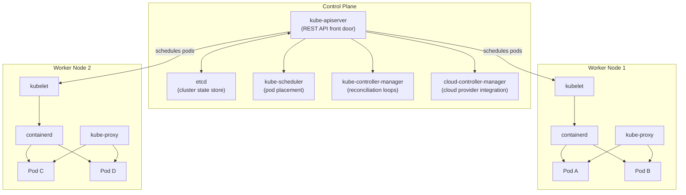
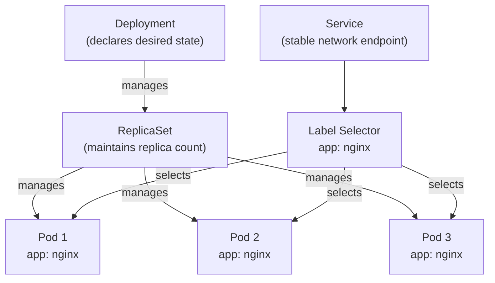
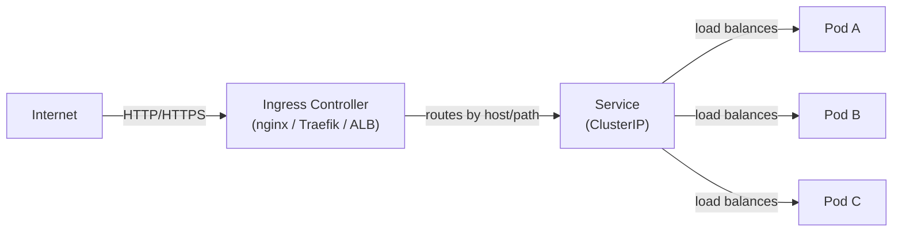
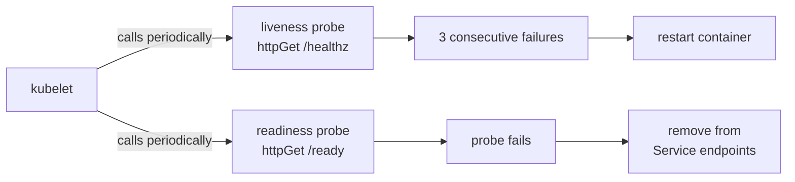
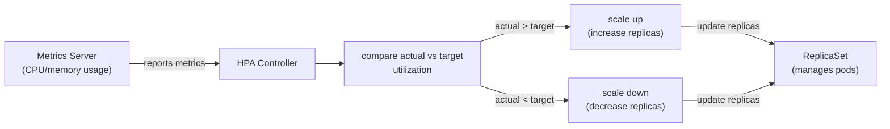

# Module 06: Kubernetes

> Part of the [DevOps Career Course](./README.md) by UncleJS

[](https://creativecommons.org/licenses/by-nc-sa/4.0/)      

---

## Table of Contents

- [Overview](#overview)
- [Learning Objectives](#learning-objectives)
- [Beginner: Kubernetes Architecture](#beginner-kubernetes-architecture)
- [Beginner: Core Objects — Pods, Deployments, Services](#beginner-core-objects--pods-deployments-services)
- [Beginner: kubectl Essentials](#beginner-kubectl-essentials)
- [Beginner: Configuration — ConfigMaps & Secrets](#beginner-configuration--configmaps--secrets)
- [Intermediate: Ingress & Load Balancing](#intermediate-ingress--load-balancing)
- [Intermediate: Persistent Storage](#intermediate-persistent-storage)
- [Intermediate: Health Checks & Self-Healing](#intermediate-health-checks--self-healing)
- [Intermediate: Resource Management & Scaling](#intermediate-resource-management--scaling)
- [Intermediate: StatefulSets & DaemonSets](#intermediate-statefulsets--daemonsets)
- [Intermediate: Helm — Kubernetes Package Manager](#intermediate-helm--kubernetes-package-manager)
- [Intermediate: RBAC & Security](#intermediate-rbac--security)
- [Advanced: Network Policies](#advanced-network-policies)
- [Advanced: Pod Security Standards](#advanced-pod-security-standards)
- [Advanced: Kustomize — Environment Overlays](#advanced-kustomize--environment-overlays)
- [Tools & Commands Reference](#tools--commands-reference)
- [Hands-On Labs](#hands-on-labs)
- [Further Reading](#further-reading)

---

## Overview

Kubernetes (K8s) is the industry-standard platform for running containerized applications at scale. It automates deployment, scaling, load balancing, self-healing, and rolling updates across a cluster of machines.

After learning containers in Module 05, Kubernetes is the natural next step — it answers the question: "How do I run hundreds of containers reliably in production?"



[↑ Back to TOC](#table-of-contents)

---

## Learning Objectives

By the end of this module you will be able to:

- Explain the Kubernetes control plane and worker node architecture
- Create and manage Pods, Deployments, and Services using YAML manifests
- Use `kubectl` fluently for cluster management
- Store configuration in ConfigMaps and sensitive data in Secrets
- Explain the four Service types and when to use each one
- Explain how kube-proxy implements Service routing (iptables vs IPVS modes)
- Configure Ingress to route external HTTP/HTTPS traffic
- Compare ingress-nginx, Traefik, and HAProxy Ingress controllers
- Use the Gateway API (HTTPRoute, GatewayClass, Gateway) for next-generation routing
- Set up persistent storage with PersistentVolumes and PersistentVolumeClaims
- Configure liveness and readiness probes for self-healing
- Set resource requests/limits and configure Horizontal Pod Autoscaler
- Use Helm to install and manage applications
- Apply RBAC to control access to cluster resources
- Write NetworkPolicy manifests to restrict pod-to-pod traffic
- Apply Pod Security Standards (Baseline / Restricted) to namespaces
- Use Kustomize to manage environment-specific overlays (staging vs production)

[↑ Back to TOC](#table-of-contents)

---

## Beginner: Kubernetes Architecture

The control plane is the brain of the cluster. Every operational action — scheduling a pod, watching for failed nodes, reconciling desired state — flows through the control plane components. Understanding it demystifies what Kubernetes is actually doing when you run `kubectl apply`.

The **API server** (`kube-apiserver`) is the only component that other components talk to directly. `etcd`, the scheduler, controller manager, kubelet on each worker node — they all communicate exclusively through the API server's REST interface. This single-gateway model makes it possible to add authentication, authorization, and admission control centrally, and it makes the system easier to audit. Nothing in the cluster changes state without going through the API server.

**etcd** is not just a component — it IS the cluster. Every Kubernetes object (pods, deployments, services, secrets, configmaps) is stored as a key-value entry in etcd. If etcd becomes corrupt or unrecoverable, the cluster has no source of truth and cannot be restored without a backup. That is why etcd backup is non-negotiable in production: take consistent snapshots to an external store, and test restoration before you need it in an outage.

### Control Plane (Master)

The control plane manages the cluster state. It runs on master node(s).

| Component | Role |
|---|---|
| **kube-apiserver** | The front door — all commands go through it (REST API) |
| **etcd** | Distributed key-value store — holds all cluster state |
| **kube-scheduler** | Decides which node to place each pod on |
| **kube-controller-manager** | Runs controllers that reconcile desired vs actual state |
| **cloud-controller-manager** | Integrates with cloud provider APIs (AWS, Azure, GCP) |

### Worker Nodes

Worker nodes run your application containers.

| Component | Role |
|---|---|
| **kubelet** | Agent on each node — ensures containers are running |
| **kube-proxy** | Network rules — routes traffic to pods |
| **Container runtime** | Runs containers (containerd, CRI-O) |

```
┌─────────────────────────────────────────────────────────────┐
│                     Kubernetes Cluster                       │
│                                                             │
│  ┌──────────────────┐    ┌──────────┐   ┌──────────┐       │
│  │   Control Plane  │    │  Node 1  │   │  Node 2  │       │
│  │ ┌──────────────┐ │    │ ┌──────┐ │   │ ┌──────┐ │       │
│  │ │ kube-apiserver│ │    │ │ Pod  │ │   │ │ Pod  │ │       │
│  │ │ etcd         │ │    │ │ Pod  │ │   │ │ Pod  │ │       │
│  │ │ scheduler    │ │    │ └──────┘ │   │ └──────┘ │       │
│  │ │ controllers  │ │    │ kubelet  │   │ kubelet  │       │
│  │ └──────────────┘ │    └──────────┘   └──────────┘       │
│  └──────────────────┘                                       │
└─────────────────────────────────────────────────────────────┘
```

### Local Development Clusters

| Tool | Description |
|---|---|
| **minikube** | Single-node cluster in a VM or container |
| **kind** (Kubernetes in Docker) | Multi-node cluster using Docker containers as nodes |
| **k3s** | Lightweight Kubernetes — great for edge/IoT and local dev |
| **k3d** | k3s inside Docker |

```bash
# Install and start minikube
minikube start
minikube status
minikube dashboard          # Open web UI
minikube stop
```

[↑ Back to TOC](#table-of-contents)

---

## Beginner: Core Objects — Pods, Deployments, Services

Almost every beginner asks the same question after creating their first Pod: "Why did it not restart when it crashed?" The answer is that a bare Pod has no self-healing controller watching over it. If the Pod is deleted, it is gone. If the node crashes, it is gone. Kubernetes can only self-heal objects that have a higher-level controller managing them.

That is why you almost never create Pods directly in production. A **Deployment** wraps a **ReplicaSet** which manages the actual Pods. When a Pod dies, the ReplicaSet controller sees that the actual count is below the desired count and creates a replacement. When you do a rolling update, the Deployment creates a new ReplicaSet alongside the old one, scales it up, then scales the old one down. This layered design gives you updates, rollbacks, and self-healing with a single resource type.

**Label selectors** are the glue that connects everything. A Deployment selects Pods by label, a Service selects Pods by label, a NetworkPolicy selects Pods by label. Labels are arbitrary key-value metadata on any Kubernetes object, and selectors are queries over those labels. The power of this system is that relationships are dynamic — a Service will start or stop routing to a Pod the moment its labels change to match or no longer match the selector, with no other configuration needed.



### Pod

The smallest deployable unit — one or more containers sharing network and storage.

```yaml
# pod.yaml
apiVersion: v1
kind: Pod
metadata:
  name: nginx-pod
  labels:
    app: nginx
spec:
  containers:
  - name: nginx
    image: nginx:1.25
    ports:
    - containerPort: 80
```

```bash
kubectl apply -f pod.yaml
kubectl get pods
kubectl describe pod nginx-pod
kubectl delete pod nginx-pod
```

### Deployment

Manages a set of identical pod replicas. Handles rolling updates and rollbacks.

```yaml
# deployment.yaml
apiVersion: apps/v1
kind: Deployment
metadata:
  name: nginx-deployment
  labels:
    app: nginx
spec:
  replicas: 3                       # Run 3 pods
  selector:
    matchLabels:
      app: nginx
  template:
    metadata:
      labels:
        app: nginx
    spec:
      containers:
      - name: nginx
        image: nginx:1.25
        ports:
        - containerPort: 80
        resources:
          requests:
            memory: "64Mi"
            cpu: "250m"
          limits:
            memory: "128Mi"
            cpu: "500m"
  strategy:
    type: RollingUpdate
    rollingUpdate:
      maxSurge: 1
      maxUnavailable: 0
```

```bash
kubectl apply -f deployment.yaml
kubectl get deployments
kubectl get pods
kubectl rollout status deployment/nginx-deployment

# Update the image (triggers rolling update)
kubectl set image deployment/nginx-deployment nginx=nginx:1.26

# Roll back to previous version
kubectl rollout undo deployment/nginx-deployment

# View rollout history
kubectl rollout history deployment/nginx-deployment
```

### Service

Exposes pods as a stable network endpoint. Pods come and go; Services stay.

```yaml
# service.yaml
apiVersion: v1
kind: Service
metadata:
  name: nginx-service
spec:
  selector:
    app: nginx                  # Routes to pods with this label
  ports:
  - protocol: TCP
    port: 80                    # Service port
    targetPort: 80              # Pod port
  type: ClusterIP               # Internal only (default)
```

### Service Types

| Type | Accessible From | Use Case |
|---|---|---|
| **ClusterIP** | Inside cluster only | Internal microservice communication |
| **NodePort** | Outside cluster via `NodeIP:NodePort` | Development, testing |
| **LoadBalancer** | Outside via cloud load balancer | Production on cloud providers |
| **ExternalName** | Maps to a DNS name | Accessing external services |

[↑ Back to TOC](#table-of-contents)

---

## Beginner: kubectl Essentials

```bash
# Context management
kubectl config get-contexts                # List clusters
kubectl config use-context my-cluster      # Switch cluster

# Get resources
kubectl get pods                           # Pods in default namespace
kubectl get pods -n kube-system            # Pods in specific namespace
kubectl get pods --all-namespaces          # All namespaces
kubectl get pods -o wide                   # With IP and node info
kubectl get all                            # Pods, deployments, services

# Describe (detailed info + events)
kubectl describe pod <pod-name>
kubectl describe deployment <name>
kubectl describe node <node-name>

# Apply / Delete
kubectl apply -f manifest.yaml             # Create or update
kubectl delete -f manifest.yaml            # Delete from file
kubectl delete pod <pod-name>              # Delete by name
kubectl delete pods --all                  # Delete all pods

# Logs
kubectl logs <pod-name>                    # Pod logs
kubectl logs -f <pod-name>                 # Follow logs
kubectl logs <pod-name> -c <container>     # Specific container in pod

# Exec into a pod
kubectl exec -it <pod-name> -- bash
kubectl exec -it <pod-name> -- sh          # If no bash available

# Port forwarding (development/debugging)
kubectl port-forward pod/<pod-name> 8080:80
kubectl port-forward service/<svc-name> 8080:80

# Namespace management
kubectl create namespace staging
kubectl get namespaces
kubectl config set-context --current --namespace=staging

# Quick dry-run (validate without applying)
kubectl apply -f manifest.yaml --dry-run=client
```

[↑ Back to TOC](#table-of-contents)

---

## Beginner: Configuration — ConfigMaps & Secrets

### ConfigMap — Non-Sensitive Config

```yaml
# configmap.yaml
apiVersion: v1
kind: ConfigMap
metadata:
  name: app-config
data:
  DATABASE_HOST: "postgres-service"
  DATABASE_PORT: "5432"
  APP_ENV: "production"
  nginx.conf: |
    server {
        listen 80;
        location / {
            proxy_pass http://app:8080;
        }
    }
```

```yaml
# Use ConfigMap in a Deployment
spec:
  containers:
  - name: app
    envFrom:
    - configMapRef:
        name: app-config          # All keys become env vars
    volumeMounts:
    - name: config-volume
        mountPath: /etc/nginx
  volumes:
  - name: config-volume
    configMap:
      name: app-config
```

### Secret — Sensitive Data

```bash
# Create from command line
kubectl create secret generic db-credentials \
  --from-literal=username=admin \
  --from-literal=password=supersecret

# Create from file
kubectl create secret generic tls-cert \
  --from-file=tls.crt=./cert.pem \
  --from-file=tls.key=./key.pem
```

```yaml
# Secret manifest (values are base64 encoded, NOT encrypted)
apiVersion: v1
kind: Secret
metadata:
  name: db-credentials
type: Opaque
data:
  username: YWRtaW4=          # echo -n "admin" | base64
  password: c3VwZXJzZWNyZXQ=  # echo -n "supersecret" | base64
```

> ⚠️ **Important**: Kubernetes Secrets are base64-encoded but NOT encrypted by default. Use Sealed Secrets, HashiCorp Vault, or cloud-native secret managers in production.

[↑ Back to TOC](#table-of-contents)

---

## Intermediate: Ingress & Load Balancing

Kubernetes has a layered approach to routing external traffic into the cluster. Understanding all the layers — kube-proxy, Services, Ingress controllers, and the emerging Gateway API — lets you design the right solution for each situation.

A **Service** provides a stable IP and DNS name for a set of Pods inside the cluster. But a Service of type `ClusterIP` is invisible from outside the cluster, and a `LoadBalancer` Service creates one cloud load balancer per service — which becomes expensive when you have twenty microservices. **Ingress** solves this by adding an HTTP routing layer: one load balancer at the edge routes to many services based on hostname and path rules.

The distinction to internalize is that the **Ingress resource** is just a declarative description of routing rules. It does nothing by itself. An **Ingress Controller** (a separate deployment you install) reads those rules and implements them in a real proxy — nginx, Traefik, HAProxy, or a cloud-native ALB. Changing your Ingress controller does not require rewriting your Ingress resources, which is the point of the abstraction. The **Gateway API** takes this further by making the role separation explicit: cluster admins manage `GatewayClass` and `Gateway`, while application teams manage `HTTPRoute`. It also natively supports non-HTTP protocols and traffic weighting, which Ingress can only approximate through controller-specific annotations.



### kube-proxy — How Services Work Under the Hood

Every Kubernetes node runs `kube-proxy`, which programs the node's network rules to implement Service routing. When you create a Service, kube-proxy watches the API server and translates Service IPs + endpoints into actual packet forwarding rules.

**Two kube-proxy modes:**

| Feature | iptables mode | IPVS mode |
|---|---|---|
| Implementation | Linux iptables chains | Linux IPVS (kernel-level LB) |
| Algorithm | Pseudo-random (not true round-robin) | Real round-robin, least-conn, etc. |
| Scale | Degrades >1000 Services (linear rule scan) | Scales to 10,000+ Services (hash table) |
| Performance | Lower overhead for small clusters | Higher throughput, lower latency at scale |
| Debugging | `iptables -L -t nat` | `ipvsadm -L -n` |
| Default | Yes (most clusters) | Opt-in (recommended for large clusters) |

```bash
# Check which mode kube-proxy is using
kubectl -n kube-system get configmap kube-proxy -o yaml | grep mode

# Enable IPVS mode (in kube-proxy ConfigMap)
# mode: "ipvs"
# ipvs:
#   scheduler: "rr"   # round-robin, lc (least-conn), sh (src-hash), etc.

# Inspect IPVS rules on a node
ipvsadm -L -n
ipvsadm -L -n --stats      # With connection statistics
```

### Services Deep-Dive

A **Service** gives a stable IP and DNS name to a set of Pods (selected by label selector). There are four Service types, each with different reach and use case:

| Type | Accessible From | How It Works |
|---|---|---|
| `ClusterIP` | Inside the cluster only | Virtual IP on cluster network; kube-proxy routes to pod IPs |
| `NodePort` | Outside via any node IP + port | Opens a port (30000–32767) on every node |
| `LoadBalancer` | Outside via cloud LB | Provisions a cloud load balancer (AWS ELB, GCP LB, etc.) |
| `ExternalName` | Inside the cluster | CNAME alias to an external DNS name (no proxying) |

```yaml
# ClusterIP (default) — internal only
apiVersion: v1
kind: Service
metadata:
  name: api-service
spec:
  type: ClusterIP
  selector:
    app: api
  ports:
    - port: 80           # Service port (what clients use)
      targetPort: 3000   # Pod port (what the container listens on)
---
# NodePort — external via node IP
apiVersion: v1
kind: Service
metadata:
  name: api-nodeport
spec:
  type: NodePort
  selector:
    app: api
  ports:
    - port: 80
      targetPort: 3000
      nodePort: 30080    # Optional: specify the port (default: random in 30000-32767)
---
# LoadBalancer — cloud load balancer
apiVersion: v1
kind: Service
metadata:
  name: api-lb
  annotations:
    service.beta.kubernetes.io/aws-load-balancer-type: "nlb"  # AWS: use NLB
spec:
  type: LoadBalancer
  selector:
    app: api
  ports:
    - port: 443
      targetPort: 3000
```

**Service DNS** — every Service gets a DNS name inside the cluster:

```
<service-name>.<namespace>.svc.cluster.local
# Example: api-service.production.svc.cluster.local

# Pods in the same namespace can use just the service name:
curl http://api-service/
# Cross-namespace:
curl http://api-service.production/
```

**Headless Services** — set `clusterIP: None` to get DNS that returns all pod IPs directly (used by StatefulSets):

```yaml
spec:
  clusterIP: None     # Headless — DNS returns individual pod IPs
  selector:
    app: db
```

### The Ingress Resource

The `Ingress` resource is a Kubernetes-native way to declare HTTP/HTTPS routing rules. It's just configuration — an **Ingress Controller** reads these rules and implements them.

```yaml
# ingress.yaml — requires an Ingress Controller
apiVersion: networking.k8s.io/v1
kind: Ingress
metadata:
  name: app-ingress
  annotations:
    nginx.ingress.kubernetes.io/rewrite-target: /
    nginx.ingress.kubernetes.io/ssl-redirect: "true"
    cert-manager.io/cluster-issuer: "letsencrypt-prod"
spec:
  ingressClassName: nginx     # Which controller handles this
  tls:
    - hosts:
        - app.example.com
        - api.example.com
      secretName: app-tls
  rules:
    - host: app.example.com
      http:
        paths:
          - path: /
            pathType: Prefix
            backend:
              service:
                name: frontend-service
                port:
                  number: 80
    - host: api.example.com
      http:
        paths:
          - path: /v1
            pathType: Prefix
            backend:
              service:
                name: api-service
                port:
                  number: 8080
```

```bash
# Check ingress status (EXTERNAL-IP shows the LB IP)
kubectl get ingress
kubectl describe ingress app-ingress

# Get events (useful for debugging TLS issues)
kubectl describe ingress app-ingress | grep -A5 Events
```

### Ingress Controllers Compared

The Ingress resource is an abstraction — the controller does the actual work. You must install one.

| Controller | Proxy | Best For | CNCF Status |
|---|---|---|---|
| **ingress-nginx** | Nginx | Default choice, massive ecosystem, battle-tested | Community |
| **Traefik** | Traefik | Dynamic discovery, Docker-native teams, built-in Let's Encrypt | CNCF |
| **HAProxy Ingress** | HAProxy | High-throughput, fine-grained LB, advanced ACLs | Community |
| **AWS Load Balancer Controller** | AWS ALB/NLB | EKS native, integrates with AWS services | AWS |
| **GKE Ingress** | Google Cloud LB | GKE native, global LB | Google |
| **Kong** | Nginx + plugins | API gateway features, auth, rate limiting | CNCF |

**ingress-nginx** — the most common choice:

```bash
# Install via Helm (recommended)
helm repo add ingress-nginx https://kubernetes.github.io/ingress-nginx
helm repo update

helm install ingress-nginx ingress-nginx/ingress-nginx \
    --namespace ingress-nginx \
    --create-namespace \
    --set controller.replicaCount=2 \
    --set controller.metrics.enabled=true \
    --set controller.podAnnotations."prometheus\.io/scrape"=true

# Get the external IP
kubectl -n ingress-nginx get svc ingress-nginx-controller
```

**Traefik as Ingress Controller** (see Module 03 for full Traefik reference):

```bash
# Install via Helm
helm repo add traefik https://traefik.github.io/charts
helm install traefik traefik/traefik \
    --namespace traefik \
    --create-namespace \
    --set deployment.replicas=2 \
    --set ports.websecure.tls.enabled=true
```

**Key annotation differences between controllers:**

```yaml
# ingress-nginx annotations
nginx.ingress.kubernetes.io/proxy-body-size: "50m"
nginx.ingress.kubernetes.io/rate-limit: "100"
nginx.ingress.kubernetes.io/auth-url: "http://auth-service/verify"

# Traefik annotations (when using standard Ingress resource)
traefik.ingress.kubernetes.io/router.middlewares: default-redirect-https@kubernetescrd
traefik.ingress.kubernetes.io/router.tls: "true"
```

### Gateway API — The Future of Kubernetes Ingress

The **Gateway API** is the next-generation Kubernetes networking standard (beta in Kubernetes 1.28+). It addresses Ingress limitations by being more expressive, role-oriented, and portable across providers.

**Why Ingress has limitations:**
- Only handles HTTP/HTTPS (no TCP/UDP natively)
- Annotations are controller-specific (breaks portability)
- No role separation (cluster admin config mixed with app config)

**Gateway API core resources:**

| Resource | Who manages it | What it does |
|---|---|---|
| `GatewayClass` | Cluster admin | Defines the type of gateway (which controller) |
| `Gateway` | Platform team | Defines listeners (ports, protocols, TLS) |
| `HTTPRoute` | App team | Defines HTTP routing rules for a Gateway |
| `TCPRoute` | App team | Defines TCP routing rules |
| `GRPCRoute` | App team | Defines gRPC routing rules |

```yaml
# GatewayClass — cluster admin creates once
apiVersion: gateway.networking.k8s.io/v1
kind: GatewayClass
metadata:
  name: nginx
spec:
  controllerName: k8s.io/ingress-nginx
---
# Gateway — platform team configures listeners
apiVersion: gateway.networking.k8s.io/v1
kind: Gateway
metadata:
  name: prod-gateway
  namespace: gateway-infra
spec:
  gatewayClassName: nginx
  listeners:
    - name: http
      port: 80
      protocol: HTTP
      allowedRoutes:
        namespaces:
          from: All     # Routes from any namespace can attach
    - name: https
      port: 443
      protocol: HTTPS
      tls:
        mode: Terminate
        certificateRefs:
          - name: wildcard-tls
            namespace: gateway-infra
      allowedRoutes:
        namespaces:
          from: All
---
# HTTPRoute — app team configures routing (in app namespace)
apiVersion: gateway.networking.k8s.io/v1
kind: HTTPRoute
metadata:
  name: webapp-route
  namespace: production
spec:
  parentRefs:
    - name: prod-gateway
      namespace: gateway-infra
      sectionName: https
  hostnames:
    - "app.example.com"
  rules:
    - matches:
        - path:
            type: PathPrefix
            value: /api
      backendRefs:
        - name: api-service
          port: 8080
          weight: 100
    - matches:
        - path:
            type: PathPrefix
            value: /
      backendRefs:
        - name: frontend-service
          port: 80
---
# Traffic splitting for canary deployments
apiVersion: gateway.networking.k8s.io/v1
kind: HTTPRoute
metadata:
  name: canary-route
  namespace: production
spec:
  parentRefs:
    - name: prod-gateway
      namespace: gateway-infra
  hostnames:
    - "app.example.com"
  rules:
    - backendRefs:
        - name: webapp-stable
          port: 80
          weight: 90    # 90% to stable
        - name: webapp-canary
          port: 80
          weight: 10    # 10% to canary
```

**Gateway API vs Ingress:**

| Aspect | Ingress | Gateway API |
|---|---|---|
| Protocols | HTTP/HTTPS only | HTTP, HTTPS, TCP, UDP, gRPC |
| Portability | Low (annotations are controller-specific) | High (standard spec across controllers) |
| Role separation | None | GatewayClass (admin) / Gateway (platform) / Route (app) |
| Traffic splitting | Via annotations | Native weights on backendRefs |
| Header matching | Via annotations | Native match rules |
| Status | Stable | Beta (v1 in Kubernetes 1.28+) |

```bash
# Install Gateway API CRDs
kubectl apply -f https://github.com/kubernetes-sigs/gateway-api/releases/download/v1.1.0/standard-install.yaml

# Check Gateway status
kubectl get gateway -A
kubectl describe gateway prod-gateway -n gateway-infra

# Check HTTPRoute status (shows which gateway it's attached to)
kubectl get httproute -A
```

[↑ Back to TOC](#table-of-contents)

---

## Intermediate: Persistent Storage

```yaml
# PersistentVolume (PV) — the actual storage resource
apiVersion: v1
kind: PersistentVolume
metadata:
  name: postgres-pv
spec:
  capacity:
    storage: 10Gi
  accessModes:
    - ReadWriteOnce
  persistentVolumeReclaimPolicy: Retain
  storageClassName: standard
  hostPath:
    path: /data/postgres      # For local dev only

---
# PersistentVolumeClaim (PVC) — a request for storage
apiVersion: v1
kind: PersistentVolumeClaim
metadata:
  name: postgres-pvc
spec:
  accessModes:
    - ReadWriteOnce
  resources:
    requests:
      storage: 10Gi
  storageClassName: standard
```

```yaml
# Use PVC in a Deployment
spec:
  containers:
  - name: postgres
    image: postgres:16
    volumeMounts:
    - name: postgres-storage
      mountPath: /var/lib/postgresql/data
  volumes:
  - name: postgres-storage
    persistentVolumeClaim:
      claimName: postgres-pvc
```

[↑ Back to TOC](#table-of-contents)

---

## Intermediate: Health Checks & Self-Healing

Kubernetes provides three probe types, and confusing them is one of the most common causes of production incidents. Each probe answers a different question and triggers a different action.

A **liveness probe** asks: "Is this container alive?" If it fails repeatedly, kubelet restarts the container. This is your last resort for a stuck or deadlocked process. The critical mistake is using a liveness probe that also fails during startup. A slow-starting application will get its container killed and restarted before it ever finishes initializing, creating a restart loop that looks like the application is working intermittently when in reality it never gets a chance to start.

A **readiness probe** asks: "Is this container ready to serve traffic?" If it fails, the Pod is removed from the Service endpoints. Traffic stops flowing to it, but the container is not restarted. This is the most important probe for avoiding user-visible errors during deployments or when a dependency (like a database connection) is temporarily unavailable. If you do not set a readiness probe, Kubernetes adds the Pod to the Service endpoint list as soon as it starts, even if the application has not finished initializing. The **startup probe** exists to bridge the gap: it disables the liveness check entirely until the startup probe passes, giving slow-starting containers (JVMs, legacy applications) the time they need.



```yaml
spec:
  containers:
  - name: app
    image: myapp:1.0
    ports:
    - containerPort: 8080

    # Liveness probe — restart container if it fails
    livenessProbe:
      httpGet:
        path: /healthz
        port: 8080
      initialDelaySeconds: 30     # Wait 30s before first check
      periodSeconds: 10           # Check every 10s
      failureThreshold: 3         # Restart after 3 failures

    # Readiness probe — remove from Service endpoints if fails
    readinessProbe:
      httpGet:
        path: /ready
        port: 8080
      initialDelaySeconds: 10
      periodSeconds: 5
      failureThreshold: 3

    # Startup probe — for slow-starting apps (disables liveness during startup)
    startupProbe:
      httpGet:
        path: /healthz
        port: 8080
      failureThreshold: 30
      periodSeconds: 10
```

[↑ Back to TOC](#table-of-contents)

---

## Intermediate: Resource Management & Scaling

Resource requests and limits are two distinct mechanisms that operate at different points in the pod lifecycle, and conflating them is a common source of mysterious performance problems.

**Requests** are what the scheduler looks at. When the scheduler places a Pod onto a node, it asks: "Does this node have enough unallocated resources to satisfy the requested amount?" The actual current utilization of the node does not matter — only the sum of all Pods' requests. This means you can have a lightly loaded node that the scheduler refuses to place new Pods on because the sum of requests already equals the node's capacity. Requests should reflect the typical steady-state resource consumption of your application.

**Limits** are enforced at runtime by the container runtime and the Linux kernel. If a container uses more memory than its limit, the kernel OOM-kills the process. If it uses more CPU than its limit, the kernel throttles it. Setting memory limits too low causes unpredictable OOMKill events even for briefly spiky workloads. Setting CPU limits too low causes hidden throttling that shows up as latency — the container appears healthy in terms of restarts but requests are slow because the kernel is rationing CPU time. For CPU-sensitive services, it is often safer to set CPU requests without setting CPU limits, so the container can burst to unused node capacity while still being scheduled correctly.



### Resource Requests & Limits

```yaml
resources:
  requests:              # Minimum guaranteed resources
    memory: "128Mi"
    cpu: "250m"          # 250 millicores = 0.25 CPU cores
  limits:                # Maximum allowed resources
    memory: "256Mi"
    cpu: "500m"
```

### Horizontal Pod Autoscaler (HPA)

```bash
# Scale based on CPU usage
kubectl autoscale deployment nginx-deployment \
  --cpu-percent=50 \
  --min=2 \
  --max=10

kubectl get hpa
```

```yaml
# HPA manifest with custom metrics
apiVersion: autoscaling/v2
kind: HorizontalPodAutoscaler
metadata:
  name: nginx-hpa
spec:
  scaleTargetRef:
    apiVersion: apps/v1
    kind: Deployment
    name: nginx-deployment
  minReplicas: 2
  maxReplicas: 10
  metrics:
  - type: Resource
    resource:
      name: cpu
      target:
        type: Utilization
        averageUtilization: 50
```

### Manual Scaling

```bash
kubectl scale deployment nginx-deployment --replicas=5
```

[↑ Back to TOC](#table-of-contents)

---

## Intermediate: StatefulSets & DaemonSets

### StatefulSet — For Stateful Applications

Use for databases and anything needing stable network identity or ordered deployment.

```yaml
apiVersion: apps/v1
kind: StatefulSet
metadata:
  name: postgres
spec:
  serviceName: postgres
  replicas: 3
  selector:
    matchLabels:
      app: postgres
  template:
    metadata:
      labels:
        app: postgres
    spec:
      containers:
      - name: postgres
        image: postgres:16
        volumeMounts:
        - name: data
          mountPath: /var/lib/postgresql/data
  volumeClaimTemplates:                # Each pod gets its own PVC
  - metadata:
      name: data
    spec:
      accessModes: ["ReadWriteOnce"]
      resources:
        requests:
          storage: 10Gi
```

### DaemonSet — Run on Every Node

```yaml
# Run a log collector on every node
apiVersion: apps/v1
kind: DaemonSet
metadata:
  name: fluentd
spec:
  selector:
    matchLabels:
      name: fluentd
  template:
    metadata:
      labels:
        name: fluentd
    spec:
      containers:
      - name: fluentd
        image: fluentd:v1.16
```

[↑ Back to TOC](#table-of-contents)

---

## Intermediate: Helm — Kubernetes Package Manager

Helm packages Kubernetes manifests into reusable **charts**.

```bash
# Install Helm
curl https://raw.githubusercontent.com/helm/helm/main/scripts/get-helm-3 | bash

# Add a chart repository
helm repo add bitnami https://charts.bitnami.com/bitnami
helm repo add ingress-nginx https://kubernetes.github.io/ingress-nginx
helm repo update

# Search for charts
helm search repo nginx
helm search hub wordpress

# Install a chart
helm install my-nginx bitnami/nginx
helm install my-nginx bitnami/nginx --set replicaCount=3
helm install my-nginx bitnami/nginx -f values.yaml      # Custom values

# List releases
helm list
helm list -A                           # All namespaces

# Upgrade a release
helm upgrade my-nginx bitnami/nginx --set replicaCount=5

# View chart values
helm show values bitnami/nginx > default-values.yaml

# Uninstall
helm uninstall my-nginx

# Create your own chart
helm create mychart
# Edit templates/ and values.yaml
helm install myapp ./mychart
helm lint ./mychart                    # Validate chart
helm template ./mychart                # Preview rendered YAML
```

[↑ Back to TOC](#table-of-contents)

---

## Intermediate: RBAC & Security

```yaml
# ServiceAccount
apiVersion: v1
kind: ServiceAccount
metadata:
  name: app-service-account
  namespace: production

---
# Role — permissions within a namespace
apiVersion: rbac.authorization.k8s.io/v1
kind: Role
metadata:
  name: pod-reader
  namespace: production
rules:
- apiGroups: [""]
  resources: ["pods", "pods/log"]
  verbs: ["get", "list", "watch"]

---
# RoleBinding — bind Role to ServiceAccount
apiVersion: rbac.authorization.k8s.io/v1
kind: RoleBinding
metadata:
  name: read-pods
  namespace: production
subjects:
- kind: ServiceAccount
  name: app-service-account
  namespace: production
roleRef:
  kind: Role
  name: pod-reader
  apiGroup: rbac.authorization.k8s.io
```

```bash
# Check what a user/service account can do
kubectl auth can-i get pods --as=system:serviceaccount:production:app-service-account
kubectl auth can-i create deployments
```

[↑ Back to TOC](#table-of-contents)

---

## Advanced: Network Policies

By default, every pod in Kubernetes can talk to every other pod — across namespaces. **NetworkPolicy** resources let you restrict traffic at the pod level, acting as a firewall inside the cluster.

> **Note:** NetworkPolicy requires a CNI plugin that supports it (Calico, Cilium, WeaveNet). The default `kubenet` in minikube does not enforce policies unless you enable Calico: `minikube start --cni=calico`.

### Default-deny all ingress

The safest starting point: deny all inbound traffic to a namespace, then explicitly allow what is needed.

```yaml
# default-deny-ingress.yaml
apiVersion: networking.k8s.io/v1
kind: NetworkPolicy
metadata:
  name: default-deny-ingress
  namespace: production
spec:
  podSelector: {}          # Matches ALL pods in the namespace
  policyTypes:
    - Ingress
```

### Allow frontend → API only

```yaml
# allow-frontend-to-api.yaml
apiVersion: networking.k8s.io/v1
kind: NetworkPolicy
metadata:
  name: allow-frontend-to-api
  namespace: production
spec:
  podSelector:
    matchLabels:
      app: api             # Policy applies to pods labelled app=api
  policyTypes:
    - Ingress
  ingress:
    - from:
        - podSelector:
            matchLabels:
              app: frontend   # Only allow pods labelled app=frontend
      ports:
        - protocol: TCP
          port: 3000
```

### Allow API → database; block frontend → database

```yaml
# allow-api-to-db.yaml
apiVersion: networking.k8s.io/v1
kind: NetworkPolicy
metadata:
  name: allow-api-to-db
  namespace: production
spec:
  podSelector:
    matchLabels:
      app: database
  policyTypes:
    - Ingress
  ingress:
    - from:
        - podSelector:
            matchLabels:
              app: api       # Only the API tier can reach the database
      ports:
        - protocol: TCP
          port: 5432
```

### Allow cross-namespace (monitoring → app)

```yaml
# allow-monitoring.yaml
apiVersion: networking.k8s.io/v1
kind: NetworkPolicy
metadata:
  name: allow-prometheus-scrape
  namespace: production
spec:
  podSelector:
    matchLabels:
      app: api
  policyTypes:
    - Ingress
  ingress:
    - from:
        - namespaceSelector:
            matchLabels:
              kubernetes.io/metadata.name: monitoring
          podSelector:
            matchLabels:
              app: prometheus
      ports:
        - protocol: TCP
          port: 9090
```

### Test your policies

```bash
# Verify policy is applied
kubectl get networkpolicy -n production

# Test connectivity from a debug pod
kubectl run test --image=curlimages/curl -n production --rm -it -- \
  curl http://api-svc:3000/health          # Should succeed

kubectl run test --image=curlimages/curl -n production --rm -it -- \
  curl http://database-svc:5432            # Should time out (blocked)

# Check Cilium policy (if using Cilium CNI)
kubectl exec -n kube-system cilium-xxxxx -- cilium policy get
```

[↑ Back to TOC](#table-of-contents)

---

## Advanced: Pod Security Standards

Pod Security Policies (PSP) were **removed in Kubernetes 1.25**. Their replacement is **Pod Security Admission (PSA)** with three built-in standards:

| Standard | Description | Typical Use |
|---|---|---|
| **Privileged** | No restrictions | System/infrastructure namespaces |
| **Baseline** | Prevents known privilege escalations | General workloads |
| **Restricted** | Hardened; follows security best practices | Security-sensitive workloads |

### Enable via namespace labels

```bash
# Label a namespace to enforce the Restricted standard
kubectl label namespace production \
  pod-security.kubernetes.io/enforce=restricted \
  pod-security.kubernetes.io/enforce-version=latest \
  pod-security.kubernetes.io/warn=restricted \
  pod-security.kubernetes.io/audit=restricted
```

| Label suffix | Effect |
|---|---|
| `enforce` | Pods violating the policy are **rejected** |
| `warn` | Violations trigger a **warning** but pod is admitted |
| `audit` | Violations are **logged** but pod is admitted |

### What the Restricted standard requires

```yaml
# A pod that passes Restricted standard
apiVersion: v1
kind: Pod
metadata:
  name: secure-pod
  namespace: production
spec:
  securityContext:
    runAsNonRoot: true          # Must not run as root
    seccompProfile:
      type: RuntimeDefault      # Must have seccomp profile
  containers:
    - name: app
      image: myapp:1.0
      securityContext:
        allowPrivilegeEscalation: false   # Required
        readOnlyRootFilesystem: true      # Recommended
        capabilities:
          drop:
            - ALL                         # Drop all Linux capabilities
      resources:
        requests:
          memory: "64Mi"
          cpu: "250m"
        limits:
          memory: "128Mi"
          cpu: "500m"
```

### Audit existing workloads before enforcing

```bash
# Dry-run: what would break if you enforced Restricted today?
kubectl label namespace production \
  pod-security.kubernetes.io/warn=restricted --overwrite

# Check warnings in the output of your next apply
kubectl apply -f k8s/

# Or use the policy simulator
kubectl -n production get pods -o json | \
  kubectl-convert -f - --local -o json | \
  kubectl apply --dry-run=server -f -
```

[↑ Back to TOC](#table-of-contents)

---

## Advanced: Kustomize — Environment Overlays

**Kustomize** is a built-in Kubernetes tool (`kubectl apply -k`) for customizing manifests without templating. You write a base configuration once and layer environment-specific patches on top.

### Project structure

```
k8s/
├── base/
│   ├── kustomization.yaml
│   ├── deployment.yaml
│   └── service.yaml
└── overlays/
    ├── staging/
    │   └── kustomization.yaml   ← 1 replica, staging namespace
    └── production/
        └── kustomization.yaml   ← 3 replicas, resource limits
```

### Base kustomization

```yaml
# k8s/base/kustomization.yaml
apiVersion: kustomize.config.k8s.io/v1beta1
kind: Kustomization

resources:
  - deployment.yaml
  - service.yaml
```

```yaml
# k8s/base/deployment.yaml
apiVersion: apps/v1
kind: Deployment
metadata:
  name: api
spec:
  replicas: 1
  selector:
    matchLabels:
      app: api
  template:
    metadata:
      labels:
        app: api
    spec:
      containers:
        - name: api
          image: ghcr.io/myorg/api:latest
          ports:
            - containerPort: 3000
```

### Staging overlay

```yaml
# k8s/overlays/staging/kustomization.yaml
apiVersion: kustomize.config.k8s.io/v1beta1
kind: Kustomization

namespace: staging

resources:
  - ../../base

patches:
  - patch: |-
      - op: replace
        path: /spec/replicas
        value: 1
    target:
      kind: Deployment
      name: api

images:
  - name: ghcr.io/myorg/api
    newTag: staging-latest
```

### Production overlay

```yaml
# k8s/overlays/production/kustomization.yaml
apiVersion: kustomize.config.k8s.io/v1beta1
kind: Kustomization

namespace: production

resources:
  - ../../base

patches:
  - patch: |-
      - op: replace
        path: /spec/replicas
        value: 3
      - op: add
        path: /spec/template/spec/containers/0/resources
        value:
          requests:
            cpu: "250m"
            memory: "128Mi"
          limits:
            cpu: "500m"
            memory: "256Mi"
    target:
      kind: Deployment
      name: api

images:
  - name: ghcr.io/myorg/api
    newTag: "1.4.2"
```

### Apply with kubectl

```bash
# Preview what will be applied (renders YAML without applying)
kubectl kustomize k8s/overlays/staging

# Apply staging environment
kubectl apply -k k8s/overlays/staging

# Apply production environment
kubectl apply -k k8s/overlays/production

# Diff current cluster state vs kustomize output
kubectl diff -k k8s/overlays/production
```

[↑ Back to TOC](#table-of-contents)

---

## Tools & Commands Reference

| Command | Purpose |
|---|---|
| `kubectl get pods/deployments/services` | List resources |
| `kubectl apply -f file.yaml` | Create or update from manifest |
| `kubectl describe <resource>` | Detailed info and events |
| `kubectl logs -f <pod>` | Follow pod logs |
| `kubectl exec -it <pod> -- bash` | Shell into pod |
| `kubectl port-forward` | Forward port for local access |
| `kubectl rollout undo` | Rollback a deployment |
| `kubectl scale deployment` | Manual scaling |
| `kubectl get hpa` | View autoscaler status |
| `helm install` / `helm upgrade` | Install/upgrade charts |
| `helm list` | List Helm releases |
| `kubectl config use-context` | Switch clusters |
| `kubectl get networkpolicy -n <ns>` | List NetworkPolicies in namespace |
| `kubectl label namespace <ns> pod-security.kubernetes.io/enforce=restricted` | Apply Pod Security Standard |
| `kubectl apply -k <overlay-path>` | Apply Kustomize overlay |
| `kubectl kustomize <path>` | Preview rendered Kustomize output |
| `kubectl diff -k <path>` | Diff cluster state vs Kustomize |

[↑ Back to TOC](#table-of-contents)

---

## Hands-On Labs

### Lab 6.1 — Local Cluster Setup

1. Install `minikube` and start a cluster: `minikube start`
2. Verify: `kubectl cluster-info` and `kubectl get nodes`
3. Enable the dashboard: `minikube dashboard`

### Lab 6.2 — Deploy an Application

1. Create a Deployment manifest for `nginx:1.25` with 3 replicas
2. Apply it: `kubectl apply -f deployment.yaml`
3. Create a Service of type `NodePort`
4. Access the application via `minikube service nginx-service`
5. Update the image to `nginx:1.26` and watch the rolling update

### Lab 6.3 — ConfigMap & Secret

1. Create a ConfigMap with `APP_ENV=production`
2. Create a Secret with a fake database password
3. Create a pod that uses both as environment variables
4. Exec into the pod and verify the values are set: `env | grep APP`

### Lab 6.4 — Autoscaling

1. Deploy a resource-limited application
2. Create an HPA targeting 50% CPU
3. Use a load generator to trigger scaling:
   ```bash
   kubectl run load --image=curlimages/curl -n default --rm -it -- \
     /bin/sh -c "while true; do curl -s http://app-service.default.svc.cluster.local; sleep 0.1; done"
   ```
4. Watch the HPA scale up: `kubectl get hpa -w`
5. Stop the load and watch scale down

### Lab 6.5 — Helm Chart

1. Install the Nginx Ingress Controller via Helm
2. Install a sample application chart from Bitnami
3. Customize values with a custom `values.yaml`
4. Upgrade the release with a changed replica count

### Lab 6.6 — Network Policies

1. Start Minikube with Calico CNI to enable NetworkPolicy enforcement:
   ```bash
   minikube start --cni=calico
   ```
2. Deploy two pods: `frontend` (label `app=frontend`) and `api` (label `app=api`)
3. Verify they can talk to each other: `kubectl exec frontend -- curl http://api-svc:3000`
4. Apply a default-deny NetworkPolicy to the namespace
5. Verify `frontend` can no longer reach `api`
6. Apply an allow policy permitting `frontend → api` on port 3000
7. Verify connectivity is restored — and that a third pod without the `frontend` label is still blocked

### Lab 6.7 — Kustomize Overlays

1. Create the base + overlays directory structure from this module
2. Write a base Deployment and Service for nginx
3. Create a `staging` overlay with 1 replica and a `production` overlay with 3 replicas
4. Preview both: `kubectl kustomize k8s/overlays/staging`
5. Apply staging: `kubectl apply -k k8s/overlays/staging`
6. Apply production: `kubectl apply -k k8s/overlays/production`
7. Verify the replica count differs between namespaces: `kubectl get deployments -A`

[↑ Back to TOC](#table-of-contents)

---

## Further Reading

- [Kubernetes Official Docs](https://kubernetes.io/docs/)
- [Kubernetes The Hard Way](https://github.com/kelseyhightower/kubernetes-the-hard-way)
- [Helm Documentation](https://helm.sh/docs/)
- [Kustomize Documentation](https://kubectl.docs.kubernetes.io/references/kustomize/)
- [NetworkPolicy Editor (visual)](https://editor.networkpolicy.io/)
- [Pod Security Standards](https://kubernetes.io/docs/concepts/security/pod-security-standards/)
- [CKA Exam Curriculum](https://github.com/cncf/curriculum)
- [kubectl Cheat Sheet](https://kubernetes.io/docs/reference/kubectl/cheatsheet/)
- [Glossary: Cluster](./glossary.md#c), [Namespace](./glossary.md#n), [Pod](./glossary.md#p), [Helm](./glossary.md#h), [RBAC](./glossary.md#r)
- **Certifications**: CKA, CKAD

[↑ Back to TOC](#table-of-contents)

---

*© 2026 UncleJS — Licensed under [CC BY-NC-SA 4.0](https://creativecommons.org/licenses/by-nc-sa/4.0/). Non-commercial use only. Share alike with attribution. See [LICENSE.md](./LICENSE.md).*
