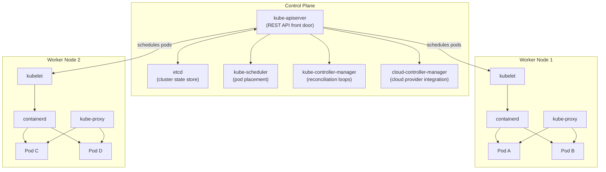
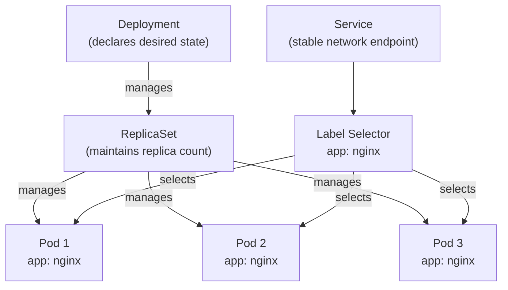
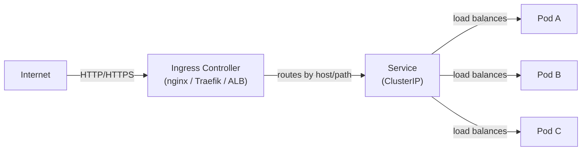
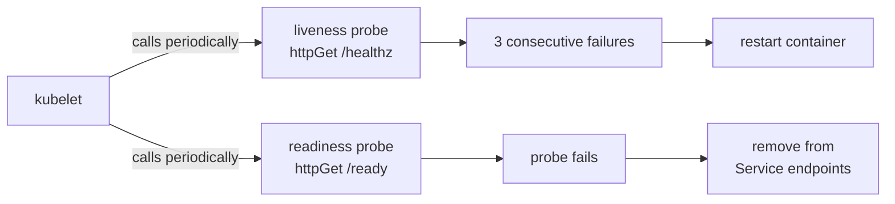
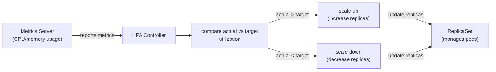

# Module 06: Kubernetes

> Part of the [DevOps Career Course](./README.md) by UncleJS

[](https://creativecommons.org/licenses/by-nc-sa/4.0/)      

---

## Table of Contents

- [Overview](#overview)
- [Learning Objectives](#learning-objectives)
- [Beginner: Kubernetes Architecture](#beginner-kubernetes-architecture)
- [Beginner: Core Objects — Pods, Deployments, Services](#beginner-core-objects--pods-deployments-services)
- [Beginner: kubectl Essentials](#beginner-kubectl-essentials)
- [Beginner: Configuration — ConfigMaps & Secrets](#beginner-configuration--configmaps--secrets)
- [Intermediate: Ingress & Load Balancing](#intermediate-ingress--load-balancing)
- [Intermediate: Persistent Storage](#intermediate-persistent-storage)
- [Intermediate: Health Checks & Self-Healing](#intermediate-health-checks--self-healing)
- [Intermediate: Resource Management & Scaling](#intermediate-resource-management--scaling)
- [Intermediate: StatefulSets & DaemonSets](#intermediate-statefulsets--daemonsets)
- [Intermediate: Helm — Kubernetes Package Manager](#intermediate-helm--kubernetes-package-manager)
- [Intermediate: RBAC & Security](#intermediate-rbac--security)
- [Advanced: Network Policies](#advanced-network-policies)
- [Advanced: Pod Security Standards](#advanced-pod-security-standards)
- [Advanced: Kustomize — Environment Overlays](#advanced-kustomize--environment-overlays)
- [Tools & Commands Reference](#tools--commands-reference)
- [Hands-On Labs](#hands-on-labs)
- [Further Reading](#further-reading)

---

## Overview

Kubernetes (K8s) is the industry-standard platform for running containerized applications at scale. It automates deployment, scaling, load balancing, self-healing, and rolling updates across a cluster of machines.

After learning containers in Module 05, Kubernetes is the natural next step — it answers the question: "How do I run hundreds of containers reliably in production?"



[↑ Back to TOC](#table-of-contents)

---

## Learning Objectives

By the end of this module you will be able to:

- Explain the Kubernetes control plane and worker node architecture
- Create and manage Pods, Deployments, and Services using YAML manifests
- Use `kubectl` fluently for cluster management
- Store configuration in ConfigMaps and sensitive data in Secrets
- Explain the four Service types and when to use each one
- Explain how kube-proxy implements Service routing (iptables vs IPVS modes)
- Configure Ingress to route external HTTP/HTTPS traffic
- Compare ingress-nginx, Traefik, and HAProxy Ingress controllers
- Use the Gateway API (HTTPRoute, GatewayClass, Gateway) for next-generation routing
- Set up persistent storage with PersistentVolumes and PersistentVolumeClaims
- Configure liveness and readiness probes for self-healing
- Set resource requests/limits and configure Horizontal Pod Autoscaler
- Use Helm to install and manage applications
- Apply RBAC to control access to cluster resources
- Write NetworkPolicy manifests to restrict pod-to-pod traffic
- Apply Pod Security Standards (Baseline / Restricted) to namespaces
- Use Kustomize to manage environment-specific overlays (staging vs production)

[↑ Back to TOC](#table-of-contents)

---

## Beginner: Kubernetes Architecture

The control plane is the brain of the cluster. Every operational action — scheduling a pod, watching for failed nodes, reconciling desired state — flows through the control plane components. Understanding it demystifies what Kubernetes is actually doing when you run `kubectl apply`.

The **API server** (`kube-apiserver`) is the only component that other components talk to directly. `etcd`, the scheduler, controller manager, kubelet on each worker node — they all communicate exclusively through the API server's REST interface. This single-gateway model makes it possible to add authentication, authorization, and admission control centrally, and it makes the system easier to audit. Nothing in the cluster changes state without going through the API server.

**etcd** is not just a component — it IS the cluster. Every Kubernetes object (pods, deployments, services, secrets, configmaps) is stored as a key-value entry in etcd. If etcd becomes corrupt or unrecoverable, the cluster has no source of truth and cannot be restored without a backup. That is why etcd backup is non-negotiable in production: take consistent snapshots to an external store, and test restoration before you need it in an outage.

### Control Plane (Master)

The control plane manages the cluster state. It runs on master node(s).

| Component | Role |
|---|---|
| **kube-apiserver** | The front door — all commands go through it (REST API) |
| **etcd** | Distributed key-value store — holds all cluster state |
| **kube-scheduler** | Decides which node to place each pod on |
| **kube-controller-manager** | Runs controllers that reconcile desired vs actual state |
| **cloud-controller-manager** | Integrates with cloud provider APIs (AWS, Azure, GCP) |

### Worker Nodes

Worker nodes run your application containers.

| Component | Role |
|---|---|
| **kubelet** | Agent on each node — ensures containers are running |
| **kube-proxy** | Network rules — routes traffic to pods |
| **Container runtime** | Runs containers (containerd, CRI-O) |

```
┌─────────────────────────────────────────────────────────────┐
│                     Kubernetes Cluster                       │
│                                                             │
│  ┌──────────────────┐    ┌──────────┐   ┌──────────┐       │
│  │   Control Plane  │    │  Node 1  │   │  Node 2  │       │
│  │ ┌──────────────┐ │    │ ┌──────┐ │   │ ┌──────┐ │       │
│  │ │ kube-apiserver│ │    │ │ Pod  │ │   │ │ Pod  │ │       │
│  │ │ etcd         │ │    │ │ Pod  │ │   │ │ Pod  │ │       │
│  │ │ scheduler    │ │    │ └──────┘ │   │ └──────┘ │       │
│  │ │ controllers  │ │    │ kubelet  │   │ kubelet  │       │
│  │ └──────────────┘ │    └──────────┘   └──────────┘       │
│  └──────────────────┘                                       │
└─────────────────────────────────────────────────────────────┘
```

### Local Development Clusters

| Tool | Description |
|---|---|
| **minikube** | Single-node cluster in a VM or container |
| **kind** (Kubernetes in Docker) | Multi-node cluster using Docker containers as nodes |
| **k3s** | Lightweight Kubernetes — great for edge/IoT and local dev |
| **k3d** | k3s inside Docker |

```bash
# Install and start minikube
minikube start
minikube status
minikube dashboard          # Open web UI
minikube stop
```

[↑ Back to TOC](#table-of-contents)

---

## Beginner: Core Objects — Pods, Deployments, Services

Almost every beginner asks the same question after creating their first Pod: "Why did it not restart when it crashed?" The answer is that a bare Pod has no self-healing controller watching over it. If the Pod is deleted, it is gone. If the node crashes, it is gone. Kubernetes can only self-heal objects that have a higher-level controller managing them.

That is why you almost never create Pods directly in production. A **Deployment** wraps a **ReplicaSet** which manages the actual Pods. When a Pod dies, the ReplicaSet controller sees that the actual count is below the desired count and creates a replacement. When you do a rolling update, the Deployment creates a new ReplicaSet alongside the old one, scales it up, then scales the old one down. This layered design gives you updates, rollbacks, and self-healing with a single resource type.

**Label selectors** are the glue that connects everything. A Deployment selects Pods by label, a Service selects Pods by label, a NetworkPolicy selects Pods by label. Labels are arbitrary key-value metadata on any Kubernetes object, and selectors are queries over those labels. The power of this system is that relationships are dynamic — a Service will start or stop routing to a Pod the moment its labels change to match or no longer match the selector, with no other configuration needed.



### Pod

The smallest deployable unit — one or more containers sharing network and storage.

```yaml
# pod.yaml
apiVersion: v1
kind: Pod
metadata:
  name: nginx-pod
  labels:
    app: nginx
spec:
  containers:
  - name: nginx
    image: nginx:1.25
    ports:
    - containerPort: 80
```

```bash
kubectl apply -f pod.yaml
kubectl get pods
kubectl describe pod nginx-pod
kubectl delete pod nginx-pod
```

### Deployment

Manages a set of identical pod replicas. Handles rolling updates and rollbacks.

```yaml
# deployment.yaml
apiVersion: apps/v1
kind: Deployment
metadata:
  name: nginx-deployment
  labels:
    app: nginx
spec:
  replicas: 3                       # Run 3 pods
  selector:
    matchLabels:
      app: nginx
  template:
    metadata:
      labels:
        app: nginx
    spec:
      containers:
      - name: nginx
        image: nginx:1.25
        ports:
        - containerPort: 80
        resources:
          requests:
            memory: "64Mi"
            cpu: "250m"
          limits:
            memory: "128Mi"
            cpu: "500m"
  strategy:
    type: RollingUpdate
    rollingUpdate:
      maxSurge: 1
      maxUnavailable: 0
```

```bash
kubectl apply -f deployment.yaml
kubectl get deployments
kubectl get pods
kubectl rollout status deployment/nginx-deployment

# Update the image (triggers rolling update)
kubectl set image deployment/nginx-deployment nginx=nginx:1.26

# Roll back to previous version
kubectl rollout undo deployment/nginx-deployment

# View rollout history
kubectl rollout history deployment/nginx-deployment
```

### Service

Exposes pods as a stable network endpoint. Pods come and go; Services stay.

```yaml
# service.yaml
apiVersion: v1
kind: Service
metadata:
  name: nginx-service
spec:
  selector:
    app: nginx                  # Routes to pods with this label
  ports:
  - protocol: TCP
    port: 80                    # Service port
    targetPort: 80              # Pod port
  type: ClusterIP               # Internal only (default)
```

### Service Types

| Type | Accessible From | Use Case |
|---|---|---|
| **ClusterIP** | Inside cluster only | Internal microservice communication |
| **NodePort** | Outside cluster via `NodeIP:NodePort` | Development, testing |
| **LoadBalancer** | Outside via cloud load balancer | Production on cloud providers |
| **ExternalName** | Maps to a DNS name | Accessing external services |

[↑ Back to TOC](#table-of-contents)

---

## Beginner: kubectl Essentials

```bash
# Context management
kubectl config get-contexts                # List clusters
kubectl config use-context my-cluster      # Switch cluster

# Get resources
kubectl get pods                           # Pods in default namespace
kubectl get pods -n kube-system            # Pods in specific namespace
kubectl get pods --all-namespaces          # All namespaces
kubectl get pods -o wide                   # With IP and node info
kubectl get all                            # Pods, deployments, services

# Describe (detailed info + events)
kubectl describe pod <pod-name>
kubectl describe deployment <name>
kubectl describe node <node-name>

# Apply / Delete
kubectl apply -f manifest.yaml             # Create or update
kubectl delete -f manifest.yaml            # Delete from file
kubectl delete pod <pod-name>              # Delete by name
kubectl delete pods --all                  # Delete all pods

# Logs
kubectl logs <pod-name>                    # Pod logs
kubectl logs -f <pod-name>                 # Follow logs
kubectl logs <pod-name> -c <container>     # Specific container in pod

# Exec into a pod
kubectl exec -it <pod-name> -- bash
kubectl exec -it <pod-name> -- sh          # If no bash available

# Port forwarding (development/debugging)
kubectl port-forward pod/<pod-name> 8080:80
kubectl port-forward service/<svc-name> 8080:80

# Namespace management
kubectl create namespace staging
kubectl get namespaces
kubectl config set-context --current --namespace=staging

# Quick dry-run (validate without applying)
kubectl apply -f manifest.yaml --dry-run=client
```

[↑ Back to TOC](#table-of-contents)

---

## Beginner: Configuration — ConfigMaps & Secrets

### ConfigMap — Non-Sensitive Config

```yaml
# configmap.yaml
apiVersion: v1
kind: ConfigMap
metadata:
  name: app-config
data:
  DATABASE_HOST: "postgres-service"
  DATABASE_PORT: "5432"
  APP_ENV: "production"
  nginx.conf: |
    server {
        listen 80;
        location / {
            proxy_pass http://app:8080;
        }
    }
```

```yaml
# Use ConfigMap in a Deployment
spec:
  containers:
  - name: app
    envFrom:
    - configMapRef:
        name: app-config          # All keys become env vars
    volumeMounts:
    - name: config-volume
        mountPath: /etc/nginx
  volumes:
  - name: config-volume
    configMap:
      name: app-config
```

### Secret — Sensitive Data

```bash
# Create from command line
kubectl create secret generic db-credentials \
  --from-literal=username=admin \
  --from-literal=password=supersecret

# Create from file
kubectl create secret generic tls-cert \
  --from-file=tls.crt=./cert.pem \
  --from-file=tls.key=./key.pem
```

```yaml
# Secret manifest (values are base64 encoded, NOT encrypted)
apiVersion: v1
kind: Secret
metadata:
  name: db-credentials
type: Opaque
data:
  username: YWRtaW4=          # echo -n "admin" | base64
  password: c3VwZXJzZWNyZXQ=  # echo -n "supersecret" | base64
```

> ⚠️ **Important**: Kubernetes Secrets are base64-encoded but NOT encrypted by default. Use Sealed Secrets, HashiCorp Vault, or cloud-native secret managers in production.

[↑ Back to TOC](#table-of-contents)

---

## Intermediate: Ingress & Load Balancing

Kubernetes has a layered approach to routing external traffic into the cluster. Understanding all the layers — kube-proxy, Services, Ingress controllers, and the emerging Gateway API — lets you design the right solution for each situation.

A **Service** provides a stable IP and DNS name for a set of Pods inside the cluster. But a Service of type `ClusterIP` is invisible from outside the cluster, and a `LoadBalancer` Service creates one cloud load balancer per service — which becomes expensive when you have twenty microservices. **Ingress** solves this by adding an HTTP routing layer: one load balancer at the edge routes to many services based on hostname and path rules.

The distinction to internalize is that the **Ingress resource** is just a declarative description of routing rules. It does nothing by itself. An **Ingress Controller** (a separate deployment you install) reads those rules and implements them in a real proxy — nginx, Traefik, HAProxy, or a cloud-native ALB. Changing your Ingress controller does not require rewriting your Ingress resources, which is the point of the abstraction. The **Gateway API** takes this further by making the role separation explicit: cluster admins manage `GatewayClass` and `Gateway`, while application teams manage `HTTPRoute`. It also natively supports non-HTTP protocols and traffic weighting, which Ingress can only approximate through controller-specific annotations.



### kube-proxy — How Services Work Under the Hood

Every Kubernetes node runs `kube-proxy`, which programs the node's network rules to implement Service routing. When you create a Service, kube-proxy watches the API server and translates Service IPs + endpoints into actual packet forwarding rules.

**Two kube-proxy modes:**

| Feature | iptables mode | IPVS mode |
|---|---|---|
| Implementation | Linux iptables chains | Linux IPVS (kernel-level LB) |
| Algorithm | Pseudo-random (not true round-robin) | Real round-robin, least-conn, etc. |
| Scale | Degrades >1000 Services (linear rule scan) | Scales to 10,000+ Services (hash table) |
| Performance | Lower overhead for small clusters | Higher throughput, lower latency at scale |
| Debugging | `iptables -L -t nat` | `ipvsadm -L -n` |
| Default | Yes (most clusters) | Opt-in (recommended for large clusters) |

```bash
# Check which mode kube-proxy is using
kubectl -n kube-system get configmap kube-proxy -o yaml | grep mode

# Enable IPVS mode (in kube-proxy ConfigMap)
# mode: "ipvs"
# ipvs:
#   scheduler: "rr"   # round-robin, lc (least-conn), sh (src-hash), etc.

# Inspect IPVS rules on a node
ipvsadm -L -n
ipvsadm -L -n --stats      # With connection statistics
```

### Services Deep-Dive

A **Service** gives a stable IP and DNS name to a set of Pods (selected by label selector). There are four Service types, each with different reach and use case:

| Type | Accessible From | How It Works |
|---|---|---|
| `ClusterIP` | Inside the cluster only | Virtual IP on cluster network; kube-proxy routes to pod IPs |
| `NodePort` | Outside via any node IP + port | Opens a port (30000–32767) on every node |
| `LoadBalancer` | Outside via cloud LB | Provisions a cloud load balancer (AWS ELB, GCP LB, etc.) |
| `ExternalName` | Inside the cluster | CNAME alias to an external DNS name (no proxying) |

```yaml
# ClusterIP (default) — internal only
apiVersion: v1
kind: Service
metadata:
  name: api-service
spec:
  type: ClusterIP
  selector:
    app: api
  ports:
    - port: 80           # Service port (what clients use)
      targetPort: 3000   # Pod port (what the container listens on)
---
# NodePort — external via node IP
apiVersion: v1
kind: Service
metadata:
  name: api-nodeport
spec:
  type: NodePort
  selector:
    app: api
  ports:
    - port: 80
      targetPort: 3000
      nodePort: 30080    # Optional: specify the port (default: random in 30000-32767)
---
# LoadBalancer — cloud load balancer
apiVersion: v1
kind: Service
metadata:
  name: api-lb
  annotations:
    service.beta.kubernetes.io/aws-load-balancer-type: "nlb"  # AWS: use NLB
spec:
  type: LoadBalancer
  selector:
    app: api
  ports:
    - port: 443
      targetPort: 3000
```

**Service DNS** — every Service gets a DNS name inside the cluster:

```
<service-name>.<namespace>.svc.cluster.local
# Example: api-service.production.svc.cluster.local

# Pods in the same namespace can use just the service name:
curl http://api-service/
# Cross-namespace:
curl http://api-service.production/
```

**Headless Services** — set `clusterIP: None` to get DNS that returns all pod IPs directly (used by StatefulSets):

```yaml
spec:
  clusterIP: None     # Headless — DNS returns individual pod IPs
  selector:
    app: db
```

### The Ingress Resource

The `Ingress` resource is a Kubernetes-native way to declare HTTP/HTTPS routing rules. It's just configuration — an **Ingress Controller** reads these rules and implements them.

```yaml
# ingress.yaml — requires an Ingress Controller
apiVersion: networking.k8s.io/v1
kind: Ingress
metadata:
  name: app-ingress
  annotations:
    nginx.ingress.kubernetes.io/rewrite-target: /
    nginx.ingress.kubernetes.io/ssl-redirect: "true"
    cert-manager.io/cluster-issuer: "letsencrypt-prod"
spec:
  ingressClassName: nginx     # Which controller handles this
  tls:
    - hosts:
        - app.example.com
        - api.example.com
      secretName: app-tls
  rules:
    - host: app.example.com
      http:
        paths:
          - path: /
            pathType: Prefix
            backend:
              service:
                name: frontend-service
                port:
                  number: 80
    - host: api.example.com
      http:
        paths:
          - path: /v1
            pathType: Prefix
            backend:
              service:
                name: api-service
                port:
                  number: 8080
```

```bash
# Check ingress status (EXTERNAL-IP shows the LB IP)
kubectl get ingress
kubectl describe ingress app-ingress

# Get events (useful for debugging TLS issues)
kubectl describe ingress app-ingress | grep -A5 Events
```

### Ingress Controllers Compared

The Ingress resource is an abstraction — the controller does the actual work. You must install one.

| Controller | Proxy | Best For | CNCF Status |
|---|---|---|---|
| **ingress-nginx** | Nginx | Default choice, massive ecosystem, battle-tested | Community |
| **Traefik** | Traefik | Dynamic discovery, Docker-native teams, built-in Let's Encrypt | CNCF |
| **HAProxy Ingress** | HAProxy | High-throughput, fine-grained LB, advanced ACLs | Community |
| **AWS Load Balancer Controller** | AWS ALB/NLB | EKS native, integrates with AWS services | AWS |
| **GKE Ingress** | Google Cloud LB | GKE native, global LB | Google |
| **Kong** | Nginx + plugins | API gateway features, auth, rate limiting | CNCF |

**ingress-nginx** — the most common choice:

```bash
# Install via Helm (recommended)
helm repo add ingress-nginx https://kubernetes.github.io/ingress-nginx
helm repo update

helm install ingress-nginx ingress-nginx/ingress-nginx \
    --namespace ingress-nginx \
    --create-namespace \
    --set controller.replicaCount=2 \
    --set controller.metrics.enabled=true \
    --set controller.podAnnotations."prometheus\.io/scrape"=true

# Get the external IP
kubectl -n ingress-nginx get svc ingress-nginx-controller
```

**Traefik as Ingress Controller** (see Module 03 for full Traefik reference):

```bash
# Install via Helm
helm repo add traefik https://traefik.github.io/charts
helm install traefik traefik/traefik \
    --namespace traefik \
    --create-namespace \
    --set deployment.replicas=2 \
    --set ports.websecure.tls.enabled=true
```

**Key annotation differences between controllers:**

```yaml
# ingress-nginx annotations
nginx.ingress.kubernetes.io/proxy-body-size: "50m"
nginx.ingress.kubernetes.io/rate-limit: "100"
nginx.ingress.kubernetes.io/auth-url: "http://auth-service/verify"

# Traefik annotations (when using standard Ingress resource)
traefik.ingress.kubernetes.io/router.middlewares: default-redirect-https@kubernetescrd
traefik.ingress.kubernetes.io/router.tls: "true"
```

### Gateway API — The Future of Kubernetes Ingress

The **Gateway API** is the next-generation Kubernetes networking standard (beta in Kubernetes 1.28+). It addresses Ingress limitations by being more expressive, role-oriented, and portable across providers.

**Why Ingress has limitations:**
- Only handles HTTP/HTTPS (no TCP/UDP natively)
- Annotations are controller-specific (breaks portability)
- No role separation (cluster admin config mixed with app config)

**Gateway API core resources:**

| Resource | Who manages it | What it does |
|---|---|---|
| `GatewayClass` | Cluster admin | Defines the type of gateway (which controller) |
| `Gateway` | Platform team | Defines listeners (ports, protocols, TLS) |
| `HTTPRoute` | App team | Defines HTTP routing rules for a Gateway |
| `TCPRoute` | App team | Defines TCP routing rules |
| `GRPCRoute` | App team | Defines gRPC routing rules |

```yaml
# GatewayClass — cluster admin creates once
apiVersion: gateway.networking.k8s.io/v1
kind: GatewayClass
metadata:
  name: nginx
spec:
  controllerName: k8s.io/ingress-nginx
---
# Gateway — platform team configures listeners
apiVersion: gateway.networking.k8s.io/v1
kind: Gateway
metadata:
  name: prod-gateway
  namespace: gateway-infra
spec:
  gatewayClassName: nginx
  listeners:
    - name: http
      port: 80
      protocol: HTTP
      allowedRoutes:
        namespaces:
          from: All     # Routes from any namespace can attach
    - name: https
      port: 443
      protocol: HTTPS
      tls:
        mode: Terminate
        certificateRefs:
          - name: wildcard-tls
            namespace: gateway-infra
      allowedRoutes:
        namespaces:
          from: All
---
# HTTPRoute — app team configures routing (in app namespace)
apiVersion: gateway.networking.k8s.io/v1
kind: HTTPRoute
metadata:
  name: webapp-route
  namespace: production
spec:
  parentRefs:
    - name: prod-gateway
      namespace: gateway-infra
      sectionName: https
  hostnames:
    - "app.example.com"
  rules:
    - matches:
        - path:
            type: PathPrefix
            value: /api
      backendRefs:
        - name: api-service
          port: 8080
          weight: 100
    - matches:
        - path:
            type: PathPrefix
            value: /
      backendRefs:
        - name: frontend-service
          port: 80
---
# Traffic splitting for canary deployments
apiVersion: gateway.networking.k8s.io/v1
kind: HTTPRoute
metadata:
  name: canary-route
  namespace: production
spec:
  parentRefs:
    - name: prod-gateway
      namespace: gateway-infra
  hostnames:
    - "app.example.com"
  rules:
    - backendRefs:
        - name: webapp-stable
          port: 80
          weight: 90    # 90% to stable
        - name: webapp-canary
          port: 80
          weight: 10    # 10% to canary
```

**Gateway API vs Ingress:**

| Aspect | Ingress | Gateway API |
|---|---|---|
| Protocols | HTTP/HTTPS only | HTTP, HTTPS, TCP, UDP, gRPC |
| Portability | Low (annotations are controller-specific) | High (standard spec across controllers) |
| Role separation | None | GatewayClass (admin) / Gateway (platform) / Route (app) |
| Traffic splitting | Via annotations | Native weights on backendRefs |
| Header matching | Via annotations | Native match rules |
| Status | Stable | Beta (v1 in Kubernetes 1.28+) |

```bash
# Install Gateway API CRDs
kubectl apply -f https://github.com/kubernetes-sigs/gateway-api/releases/download/v1.1.0/standard-install.yaml

# Check Gateway status
kubectl get gateway -A
kubectl describe gateway prod-gateway -n gateway-infra

# Check HTTPRoute status (shows which gateway it's attached to)
kubectl get httproute -A
```

[↑ Back to TOC](#table-of-contents)

---

## Intermediate: Persistent Storage

```yaml
# PersistentVolume (PV) — the actual storage resource
apiVersion: v1
kind: PersistentVolume
metadata:
  name: postgres-pv
spec:
  capacity:
    storage: 10Gi
  accessModes:
    - ReadWriteOnce
  persistentVolumeReclaimPolicy: Retain
  storageClassName: standard
  hostPath:
    path: /data/postgres      # For local dev only

---
# PersistentVolumeClaim (PVC) — a request for storage
apiVersion: v1
kind: PersistentVolumeClaim
metadata:
  name: postgres-pvc
spec:
  accessModes:
    - ReadWriteOnce
  resources:
    requests:
      storage: 10Gi
  storageClassName: standard
```

```yaml
# Use PVC in a Deployment
spec:
  containers:
  - name: postgres
    image: postgres:16
    volumeMounts:
    - name: postgres-storage
      mountPath: /var/lib/postgresql/data
  volumes:
  - name: postgres-storage
    persistentVolumeClaim:
      claimName: postgres-pvc
```

[↑ Back to TOC](#table-of-contents)

---

## Intermediate: Health Checks & Self-Healing

Kubernetes provides three probe types, and confusing them is one of the most common causes of production incidents. Each probe answers a different question and triggers a different action.

A **liveness probe** asks: "Is this container alive?" If it fails repeatedly, kubelet restarts the container. This is your last resort for a stuck or deadlocked process. The critical mistake is using a liveness probe that also fails during startup. A slow-starting application will get its container killed and restarted before it ever finishes initializing, creating a restart loop that looks like the application is working intermittently when in reality it never gets a chance to start.

A **readiness probe** asks: "Is this container ready to serve traffic?" If it fails, the Pod is removed from the Service endpoints. Traffic stops flowing to it, but the container is not restarted. This is the most important probe for avoiding user-visible errors during deployments or when a dependency (like a database connection) is temporarily unavailable. If you do not set a readiness probe, Kubernetes adds the Pod to the Service endpoint list as soon as it starts, even if the application has not finished initializing. The **startup probe** exists to bridge the gap: it disables the liveness check entirely until the startup probe passes, giving slow-starting containers (JVMs, legacy applications) the time they need.



```yaml
spec:
  containers:
  - name: app
    image: myapp:1.0
    ports:
    - containerPort: 8080

    # Liveness probe — restart container if it fails
    livenessProbe:
      httpGet:
        path: /healthz
        port: 8080
      initialDelaySeconds: 30     # Wait 30s before first check
      periodSeconds: 10           # Check every 10s
      failureThreshold: 3         # Restart after 3 failures

    # Readiness probe — remove from Service endpoints if fails
    readinessProbe:
      httpGet:
        path: /ready
        port: 8080
      initialDelaySeconds: 10
      periodSeconds: 5
      failureThreshold: 3

    # Startup probe — for slow-starting apps (disables liveness during startup)
    startupProbe:
      httpGet:
        path: /healthz
        port: 8080
      failureThreshold: 30
      periodSeconds: 10
```

[↑ Back to TOC](#table-of-contents)

---

## Intermediate: Resource Management & Scaling

Resource requests and limits are two distinct mechanisms that operate at different points in the pod lifecycle, and conflating them is a common source of mysterious performance problems.

**Requests** are what the scheduler looks at. When the scheduler places a Pod onto a node, it asks: "Does this node have enough unallocated resources to satisfy the requested amount?" The actual current utilization of the node does not matter — only the sum of all Pods' requests. This means you can have a lightly loaded node that the scheduler refuses to place new Pods on because the sum of requests already equals the node's capacity. Requests should reflect the typical steady-state resource consumption of your application.

**Limits** are enforced at runtime by the container runtime and the Linux kernel. If a container uses more memory than its limit, the kernel OOM-kills the process. If it uses more CPU than its limit, the kernel throttles it. Setting memory limits too low causes unpredictable OOMKill events even for briefly spiky workloads. Setting CPU limits too low causes hidden throttling that shows up as latency — the container appears healthy in terms of restarts but requests are slow because the kernel is rationing CPU time. For CPU-sensitive services, it is often safer to set CPU requests without setting CPU limits, so the container can burst to unused node capacity while still being scheduled correctly.



### Resource Requests & Limits

```yaml
resources:
  requests:              # Minimum guaranteed resources
    memory: "128Mi"
    cpu: "250m"          # 250 millicores = 0.25 CPU cores
  limits:                # Maximum allowed resources
    memory: "256Mi"
    cpu: "500m"
```

### Horizontal Pod Autoscaler (HPA)

```bash
# Scale based on CPU usage
kubectl autoscale deployment nginx-deployment \
  --cpu-percent=50 \
  --min=2 \
  --max=10

kubectl get hpa
```

```yaml
# HPA manifest with custom metrics
apiVersion: autoscaling/v2
kind: HorizontalPodAutoscaler
metadata:
  name: nginx-hpa
spec:
  scaleTargetRef:
    apiVersion: apps/v1
    kind: Deployment
    name: nginx-deployment
  minReplicas: 2
  maxReplicas: 10
  metrics:
  - type: Resource
    resource:
      name: cpu
      target:
        type: Utilization
        averageUtilization: 50
```

### Manual Scaling

```bash
kubectl scale deployment nginx-deployment --replicas=5
```

[↑ Back to TOC](#table-of-contents)

---

## Intermediate: StatefulSets & DaemonSets

### StatefulSet — For Stateful Applications

Use for databases and anything needing stable network identity or ordered deployment.

```yaml
apiVersion: apps/v1
kind: StatefulSet
metadata:
  name: postgres
spec:
  serviceName: postgres
  replicas: 3
  selector:
    matchLabels:
      app: postgres
  template:
    metadata:
      labels:
        app: postgres
    spec:
      containers:
      - name: postgres
        image: postgres:16
        volumeMounts:
        - name: data
          mountPath: /var/lib/postgresql/data
  volumeClaimTemplates:                # Each pod gets its own PVC
  - metadata:
      name: data
    spec:
      accessModes: ["ReadWriteOnce"]
      resources:
        requests:
          storage: 10Gi
```

### DaemonSet — Run on Every Node

```yaml
# Run a log collector on every node
apiVersion: apps/v1
kind: DaemonSet
metadata:
  name: fluentd
spec:
  selector:
    matchLabels:
      name: fluentd
  template:
    metadata:
      labels:
        name: fluentd
    spec:
      containers:
      - name: fluentd
        image: fluentd:v1.16
```

[↑ Back to TOC](#table-of-contents)

---

## Intermediate: Helm — Kubernetes Package Manager

Helm packages Kubernetes manifests into reusable **charts**.

```bash
# Install Helm
curl https://raw.githubusercontent.com/helm/helm/main/scripts/get-helm-3 | bash

# Add a chart repository
helm repo add bitnami https://charts.bitnami.com/bitnami
helm repo add ingress-nginx https://kubernetes.github.io/ingress-nginx
helm repo update

# Search for charts
helm search repo nginx
helm search hub wordpress

# Install a chart
helm install my-nginx bitnami/nginx
helm install my-nginx bitnami/nginx --set replicaCount=3
helm install my-nginx bitnami/nginx -f values.yaml      # Custom values

# List releases
helm list
helm list -A                           # All namespaces

# Upgrade a release
helm upgrade my-nginx bitnami/nginx --set replicaCount=5

# View chart values
helm show values bitnami/nginx > default-values.yaml

# Uninstall
helm uninstall my-nginx

# Create your own chart
helm create mychart
# Edit templates/ and values.yaml
helm install myapp ./mychart
helm lint ./mychart                    # Validate chart
helm template ./mychart                # Preview rendered YAML
```

[↑ Back to TOC](#table-of-contents)

---

## Intermediate: RBAC & Security

```yaml
# ServiceAccount
apiVersion: v1
kind: ServiceAccount
metadata:
  name: app-service-account
  namespace: production

---
# Role — permissions within a namespace
apiVersion: rbac.authorization.k8s.io/v1
kind: Role
metadata:
  name: pod-reader
  namespace: production
rules:
- apiGroups: [""]
  resources: ["pods", "pods/log"]
  verbs: ["get", "list", "watch"]

---
# RoleBinding — bind Role to ServiceAccount
apiVersion: rbac.authorization.k8s.io/v1
kind: RoleBinding
metadata:
  name: read-pods
  namespace: production
subjects:
- kind: ServiceAccount
  name: app-service-account
  namespace: production
roleRef:
  kind: Role
  name: pod-reader
  apiGroup: rbac.authorization.k8s.io
```

```bash
# Check what a user/service account can do
kubectl auth can-i get pods --as=system:serviceaccount:production:app-service-account
kubectl auth can-i create deployments
```

[↑ Back to TOC](#table-of-contents)

---

## Advanced: Network Policies

By default, every pod in Kubernetes can talk to every other pod — across namespaces. **NetworkPolicy** resources let you restrict traffic at the pod level, acting as a firewall inside the cluster.

> **Note:** NetworkPolicy requires a CNI plugin that supports it (Calico, Cilium, WeaveNet). The default `kubenet` in minikube does not enforce policies unless you enable Calico: `minikube start --cni=calico`.

### Default-deny all ingress

The safest starting point: deny all inbound traffic to a namespace, then explicitly allow what is needed.

```yaml
# default-deny-ingress.yaml
apiVersion: networking.k8s.io/v1
kind: NetworkPolicy
metadata:
  name: default-deny-ingress
  namespace: production
spec:
  podSelector: {}          # Matches ALL pods in the namespace
  policyTypes:
    - Ingress
```

### Allow frontend → API only

```yaml
# allow-frontend-to-api.yaml
apiVersion: networking.k8s.io/v1
kind: NetworkPolicy
metadata:
  name: allow-frontend-to-api
  namespace: production
spec:
  podSelector:
    matchLabels:
      app: api             # Policy applies to pods labelled app=api
  policyTypes:
    - Ingress
  ingress:
    - from:
        - podSelector:
            matchLabels:
              app: frontend   # Only allow pods labelled app=frontend
      ports:
        - protocol: TCP
          port: 3000
```

### Allow API → database; block frontend → database

```yaml
# allow-api-to-db.yaml
apiVersion: networking.k8s.io/v1
kind: NetworkPolicy
metadata:
  name: allow-api-to-db
  namespace: production
spec:
  podSelector:
    matchLabels:
      app: database
  policyTypes:
    - Ingress
  ingress:
    - from:
        - podSelector:
            matchLabels:
              app: api       # Only the API tier can reach the database
      ports:
        - protocol: TCP
          port: 5432
```

### Allow cross-namespace (monitoring → app)

```yaml
# allow-monitoring.yaml
apiVersion: networking.k8s.io/v1
kind: NetworkPolicy
metadata:
  name: allow-prometheus-scrape
  namespace: production
spec:
  podSelector:
    matchLabels:
      app: api
  policyTypes:
    - Ingress
  ingress:
    - from:
        - namespaceSelector:
            matchLabels:
              kubernetes.io/metadata.name: monitoring
          podSelector:
            matchLabels:
              app: prometheus
      ports:
        - protocol: TCP
          port: 9090
```

### Test your policies

```bash
# Verify policy is applied
kubectl get networkpolicy -n production

# Test connectivity from a debug pod
kubectl run test --image=curlimages/curl -n production --rm -it -- \
  curl http://api-svc:3000/health          # Should succeed

kubectl run test --image=curlimages/curl -n production --rm -it -- \
  curl http://database-svc:5432            # Should time out (blocked)

# Check Cilium policy (if using Cilium CNI)
kubectl exec -n kube-system cilium-xxxxx -- cilium policy get
```

[↑ Back to TOC](#table-of-contents)

---

## Advanced: Pod Security Standards

Pod Security Policies (PSP) were **removed in Kubernetes 1.25**. Their replacement is **Pod Security Admission (PSA)** with three built-in standards:

| Standard | Description | Typical Use |
|---|---|---|
| **Privileged** | No restrictions | System/infrastructure namespaces |
| **Baseline** | Prevents known privilege escalations | General workloads |
| **Restricted** | Hardened; follows security best practices | Security-sensitive workloads |

### Enable via namespace labels

```bash
# Label a namespace to enforce the Restricted standard
kubectl label namespace production \
  pod-security.kubernetes.io/enforce=restricted \
  pod-security.kubernetes.io/enforce-version=latest \
  pod-security.kubernetes.io/warn=restricted \
  pod-security.kubernetes.io/audit=restricted
```

| Label suffix | Effect |
|---|---|
| `enforce` | Pods violating the policy are **rejected** |
| `warn` | Violations trigger a **warning** but pod is admitted |
| `audit` | Violations are **logged** but pod is admitted |

### What the Restricted standard requires

```yaml
# A pod that passes Restricted standard
apiVersion: v1
kind: Pod
metadata:
  name: secure-pod
  namespace: production
spec:
  securityContext:
    runAsNonRoot: true          # Must not run as root
    seccompProfile:
      type: RuntimeDefault      # Must have seccomp profile
  containers:
    - name: app
      image: myapp:1.0
      securityContext:
        allowPrivilegeEscalation: false   # Required
        readOnlyRootFilesystem: true      # Recommended
        capabilities:
          drop:
            - ALL                         # Drop all Linux capabilities
      resources:
        requests:
          memory: "64Mi"
          cpu: "250m"
        limits:
          memory: "128Mi"
          cpu: "500m"
```

### Audit existing workloads before enforcing

```bash
# Dry-run: what would break if you enforced Restricted today?
kubectl label namespace production \
  pod-security.kubernetes.io/warn=restricted --overwrite

# Check warnings in the output of your next apply
kubectl apply -f k8s/

# Or use the policy simulator
kubectl -n production get pods -o json | \
  kubectl-convert -f - --local -o json | \
  kubectl apply --dry-run=server -f -
```

[↑ Back to TOC](#table-of-contents)

---

## Advanced: Kustomize — Environment Overlays

**Kustomize** is a built-in Kubernetes tool (`kubectl apply -k`) for customizing manifests without templating. You write a base configuration once and layer environment-specific patches on top.

### Project structure

```
k8s/
├── base/
│   ├── kustomization.yaml
│   ├── deployment.yaml
│   └── service.yaml
└── overlays/
    ├── staging/
    │   └── kustomization.yaml   ← 1 replica, staging namespace
    └── production/
        └── kustomization.yaml   ← 3 replicas, resource limits
```

### Base kustomization

```yaml
# k8s/base/kustomization.yaml
apiVersion: kustomize.config.k8s.io/v1beta1
kind: Kustomization

resources:
  - deployment.yaml
  - service.yaml
```

```yaml
# k8s/base/deployment.yaml
apiVersion: apps/v1
kind: Deployment
metadata:
  name: api
spec:
  replicas: 1
  selector:
    matchLabels:
      app: api
  template:
    metadata:
      labels:
        app: api
    spec:
      containers:
        - name: api
          image: ghcr.io/myorg/api:latest
          ports:
            - containerPort: 3000
```

### Staging overlay

```yaml
# k8s/overlays/staging/kustomization.yaml
apiVersion: kustomize.config.k8s.io/v1beta1
kind: Kustomization

namespace: staging

resources:
  - ../../base

patches:
  - patch: |-
      - op: replace
        path: /spec/replicas
        value: 1
    target:
      kind: Deployment
      name: api

images:
  - name: ghcr.io/myorg/api
    newTag: staging-latest
```

### Production overlay

```yaml
# k8s/overlays/production/kustomization.yaml
apiVersion: kustomize.config.k8s.io/v1beta1
kind: Kustomization

namespace: production

resources:
  - ../../base

patches:
  - patch: |-
      - op: replace
        path: /spec/replicas
        value: 3
      - op: add
        path: /spec/template/spec/containers/0/resources
        value:
          requests:
            cpu: "250m"
            memory: "128Mi"
          limits:
            cpu: "500m"
            memory: "256Mi"
    target:
      kind: Deployment
      name: api

images:
  - name: ghcr.io/myorg/api
    newTag: "1.4.2"
```

### Apply with kubectl

```bash
# Preview what will be applied (renders YAML without applying)
kubectl kustomize k8s/overlays/staging

# Apply staging environment
kubectl apply -k k8s/overlays/staging

# Apply production environment
kubectl apply -k k8s/overlays/production

# Diff current cluster state vs kustomize output
kubectl diff -k k8s/overlays/production
```

[↑ Back to TOC](#table-of-contents)

---

## Tools & Commands Reference

| Command | Purpose |
|---|---|
| `kubectl get pods/deployments/services` | List resources |
| `kubectl apply -f file.yaml` | Create or update from manifest |
| `kubectl describe <resource>` | Detailed info and events |
| `kubectl logs -f <pod>` | Follow pod logs |
| `kubectl exec -it <pod> -- bash` | Shell into pod |
| `kubectl port-forward` | Forward port for local access |
| `kubectl rollout undo` | Rollback a deployment |
| `kubectl scale deployment` | Manual scaling |
| `kubectl get hpa` | View autoscaler status |
| `helm install` / `helm upgrade` | Install/upgrade charts |
| `helm list` | List Helm releases |
| `kubectl config use-context` | Switch clusters |
| `kubectl get networkpolicy -n <ns>` | List NetworkPolicies in namespace |
| `kubectl label namespace <ns> pod-security.kubernetes.io/enforce=restricted` | Apply Pod Security Standard |
| `kubectl apply -k <overlay-path>` | Apply Kustomize overlay |
| `kubectl kustomize <path>` | Preview rendered Kustomize output |
| `kubectl diff -k <path>` | Diff cluster state vs Kustomize |

[↑ Back to TOC](#table-of-contents)

---

## Hands-On Labs

### Lab 6.1 — Local Cluster Setup

1. Install `minikube` and start a cluster: `minikube start`
2. Verify: `kubectl cluster-info` and `kubectl get nodes`
3. Enable the dashboard: `minikube dashboard`

### Lab 6.2 — Deploy an Application

1. Create a Deployment manifest for `nginx:1.25` with 3 replicas
2. Apply it: `kubectl apply -f deployment.yaml`
3. Create a Service of type `NodePort`
4. Access the application via `minikube service nginx-service`
5. Update the image to `nginx:1.26` and watch the rolling update

### Lab 6.3 — ConfigMap & Secret

1. Create a ConfigMap with `APP_ENV=production`
2. Create a Secret with a fake database password
3. Create a pod that uses both as environment variables
4. Exec into the pod and verify the values are set: `env | grep APP`

### Lab 6.4 — Autoscaling

1. Deploy a resource-limited application
2. Create an HPA targeting 50% CPU
3. Use a load generator to trigger scaling:
   ```bash
   kubectl run load --image=curlimages/curl -n default --rm -it -- \
     /bin/sh -c "while true; do curl -s http://app-service.default.svc.cluster.local; sleep 0.1; done"
   ```
4. Watch the HPA scale up: `kubectl get hpa -w`
5. Stop the load and watch scale down

### Lab 6.5 — Helm Chart

1. Install the Nginx Ingress Controller via Helm
2. Install a sample application chart from Bitnami
3. Customize values with a custom `values.yaml`
4. Upgrade the release with a changed replica count

### Lab 6.6 — Network Policies

1. Start Minikube with Calico CNI to enable NetworkPolicy enforcement:
   ```bash
   minikube start --cni=calico
   ```
2. Deploy two pods: `frontend` (label `app=frontend`) and `api` (label `app=api`)
3. Verify they can talk to each other: `kubectl exec frontend -- curl http://api-svc:3000`
4. Apply a default-deny NetworkPolicy to the namespace
5. Verify `frontend` can no longer reach `api`
6. Apply an allow policy permitting `frontend → api` on port 3000
7. Verify connectivity is restored — and that a third pod without the `frontend` label is still blocked

### Lab 6.7 — Kustomize Overlays

1. Create the base + overlays directory structure from this module
2. Write a base Deployment and Service for nginx
3. Create a `staging` overlay with 1 replica and a `production` overlay with 3 replicas
4. Preview both: `kubectl kustomize k8s/overlays/staging`
5. Apply staging: `kubectl apply -k k8s/overlays/staging`
6. Apply production: `kubectl apply -k k8s/overlays/production`
7. Verify the replica count differs between namespaces: `kubectl get deployments -A`

[↑ Back to TOC](#table-of-contents)

---

## Further Reading

- [Kubernetes Official Docs](https://kubernetes.io/docs/)
- [Kubernetes The Hard Way](https://github.com/kelseyhightower/kubernetes-the-hard-way)
- [Helm Documentation](https://helm.sh/docs/)
- [Kustomize Documentation](https://kubectl.docs.kubernetes.io/references/kustomize/)
- [NetworkPolicy Editor (visual)](https://editor.networkpolicy.io/)
- [Pod Security Standards](https://kubernetes.io/docs/concepts/security/pod-security-standards/)
- [CKA Exam Curriculum](https://github.com/cncf/curriculum)
- [kubectl Cheat Sheet](https://kubernetes.io/docs/reference/kubectl/cheatsheet/)
- [Glossary: Cluster](./glossary.md#c), [Namespace](./glossary.md#n), [Pod](./glossary.md#p), [Helm](./glossary.md#h), [RBAC](./glossary.md#r)
- **Certifications**: CKA, CKAD

[↑ Back to TOC](#table-of-contents)

---

## Debugging Kubernetes Systematically

When something breaks in Kubernetes, the failure mode tells you where to start. Here is the complete diagnostic playbook.

### CrashLoopBackOff

A pod entering `CrashLoopBackOff` is exiting repeatedly. Kubernetes increases the back-off delay (10s, 20s, 40s, up to 5 minutes) between restarts.

```bash
# Get the exit reason
kubectl describe pod <pod> -n <ns> | grep -A5 "Last State:"
# Look for: Exit Code, Reason (OOMKilled, Error, Completed)

# Read logs from the crashed container (previous instance)
kubectl logs <pod> -n <ns> --previous

# If the container exits before you can exec, add a sleep override
kubectl debug -it <pod> -n <ns> --copy-to=debug-pod -- sleep 3600
# Then exec into the debug pod and run the app binary manually

# Check resource limits — OOMKilled means the container exceeded memory
kubectl describe pod <pod> -n <ns> | grep -A3 "Limits:"
kubectl describe pod <pod> -n <ns> | grep -A3 "Requests:"

# Check liveness probe configuration
kubectl describe pod <pod> -n <ns> | grep -A10 "Liveness:"
# A mis-configured liveness probe that fires before the app is ready causes restart loops
```

Common causes:
- Application configuration error (wrong env var, missing secret reference)
- OOMKilled — increase memory limit or find the leak
- Liveness probe too aggressive — increase `initialDelaySeconds`
- Init container failing — check `kubectl logs <pod> -c <init-container-name>`

### ImagePullBackOff

```bash
# Describe the pod — the event will show the exact error
kubectl describe pod <pod> -n <ns> | grep -A10 "Events:"
# Common messages:
# "unauthorized: authentication required" → missing imagePullSecret
# "not found" → image tag does not exist
# "connection refused" → private registry unreachable from the node

# Check imagePullSecret exists in the same namespace
kubectl get secret -n <ns> | grep registry

# Verify the secret has the correct content
kubectl get secret my-registry-secret -n <ns> -o jsonpath='{.data.\.dockerconfigjson}' | base64 -d | python3 -m json.tool

# Check the registry URL in the pod spec
kubectl get pod <pod> -n <ns> -o jsonpath='{.spec.containers[*].image}'

# Test pulling from the node directly
# (ssh to the node, or use a privileged debug pod)
crictl pull <image>
```

### OOMKilled

```bash
# Confirm OOMKilled
kubectl describe pod <pod> -n <ns> | grep OOMKilled
# or
kubectl get pod <pod> -n <ns> -o jsonpath='{.status.containerStatuses[0].lastState.terminated.reason}'

# See how much memory was being used at time of kill
kubectl top pod <pod> -n <ns> --containers

# Check Prometheus if available
# PromQL: container_memory_working_set_bytes{pod="<pod>", namespace="<ns>"}

# Temporary fix: increase memory limit
kubectl set resources deployment <deploy> -n <ns> --limits=memory=512Mi

# Long-term: profile the application
# Use heap dump, pprof (Go), jmap (JVM), or memory profiler for the language
```

### Pending Pod (Cannot Schedule)

```bash
# Describe to see scheduling failure reason
kubectl describe pod <pod> -n <ns> | grep -A20 "Events:"
# Key messages:
# "Insufficient cpu" / "Insufficient memory" → no node has enough headroom
# "node(s) didn't match node affinity" → affinity rules too strict
# "node(s) had taint {key:value} that the pod didn't tolerate" → missing toleration
# "0/3 nodes are available" → combine above + check PodDisruptionBudget

# Check cluster capacity
kubectl describe nodes | grep -A5 "Allocated resources:"

# Check if Cluster Autoscaler is working
kubectl logs -n kube-system -l app=cluster-autoscaler --tail=50

# Check taints on nodes
kubectl get nodes -o custom-columns=NAME:.metadata.name,TAINTS:.spec.taints

# Check node selectors and affinity on the pod
kubectl get pod <pod> -n <ns> -o yaml | grep -A20 affinity
kubectl get pod <pod> -n <ns> -o yaml | grep nodeSelector
```

### Debugging with `kubectl debug`

`kubectl debug` (introduced in Kubernetes 1.18) is the modern replacement for hacking into a running container or adding a sleep override.

```bash
# Attach an ephemeral debug container to a running pod (non-disruptive)
kubectl debug -it <pod> -n <ns> --image=nicolaka/netshoot --target=<container-name>
# Shares PID/network namespace with the target container

# Copy a pod with an overridden command (creates a new pod)
kubectl debug -it <pod> -n <ns> --copy-to=debug-pod --image=busybox -- sh

# Debug a node directly (runs privileged pod on node)
kubectl debug node/<node-name> -it --image=ubuntu
# Mounts host filesystem at /host

# Useful images for debug containers:
# nicolaka/netshoot — networking tools (tcpdump, dig, curl, iperf3)
# busybox — minimal shell
# bitnami/kubectl — kubectl access from within the cluster
# gcr.io/distroless/static — validate distroless container behavior
```

[↑ Back to TOC](#table-of-contents)

---

## Kubernetes Admission Controllers

Admission controllers intercept API server requests after authentication and authorization but before persistence. They are the primary enforcement point for security policies, resource quotas, and configuration standards.

### Mutating vs Validating

- **Mutating admission webhooks**: modify the object (add default values, inject sidecars, set labels). Run before validating webhooks.
- **Validating admission webhooks**: inspect the (potentially mutated) object and accept or reject it.
- **Built-in controllers**: `ResourceQuota`, `LimitRanger`, `PodSecurity`, `NamespaceLifecycle`.

```bash
# List active admission webhooks
kubectl get mutatingwebhookconfigurations
kubectl get validatingwebhookconfigurations

# Common built-in controllers (check API server flags)
kubectl describe pod kube-apiserver-<node> -n kube-system | grep admission-plugins
```

### OPA Gatekeeper

Gatekeeper implements a validating webhook backed by Open Policy Agent. You define `ConstraintTemplate` (the Rego policy logic) and `Constraint` (the instances with parameters).

```yaml
# ConstraintTemplate: require specific labels
apiVersion: templates.gatekeeper.sh/v1
kind: ConstraintTemplate
metadata:
  name: requirelabels
spec:
  crd:
    spec:
      names:
        kind: RequireLabels
      validation:
        openAPIV3Schema:
          type: object
          properties:
            labels:
              type: array
              items:
                type: string
  targets:
  - target: admission.k8s.gatekeeper.sh
    rego: |
      package requirelabels

      violation[{"msg": msg}] {
        provided := {label | input.review.object.metadata.labels[label]}
        required := {label | label := input.parameters.labels[_]}
        missing := required - provided
        count(missing) > 0
        msg := sprintf("Missing required labels: %v", [missing])
      }
---
# Constraint: enforce in production namespace
apiVersion: constraints.gatekeeper.sh/v1beta1
kind: RequireLabels
metadata:
  name: require-team-label
spec:
  match:
    kinds:
    - apiGroups: [""]
      kinds: ["Pod"]
    namespaces: ["production"]
  parameters:
    labels: ["team", "app", "version"]
```

```bash
# Check constraint violations (audit mode — does not block, just reports)
kubectl get constraints -A
kubectl describe requirelabels require-team-label

# Run in audit mode first, then switch to deny
kubectl patch requirelabels require-team-label --type='merge' -p '{"spec":{"enforcementAction":"deny"}}'
# Values: warn, deny, dryrun
```

### Kyverno

Kyverno uses Kubernetes-native YAML policies (no Rego required), making it more accessible than OPA Gatekeeper.

```yaml
apiVersion: kyverno.io/v1
kind: ClusterPolicy
metadata:
  name: require-requests-limits
spec:
  validationFailureAction: enforce
  rules:
  - name: check-resources
    match:
      any:
      - resources:
          kinds:
          - Pod
          namespaces:
          - production
    validate:
      message: "CPU and memory requests and limits are required."
      pattern:
        spec:
          containers:
          - (name): "?*"
            resources:
              requests:
                memory: "?*"
                cpu: "?*"
              limits:
                memory: "?*"
---
# Mutating policy: add a label to all pods
apiVersion: kyverno.io/v1
kind: ClusterPolicy
metadata:
  name: add-default-labels
spec:
  rules:
  - name: add-env-label
    match:
      any:
      - resources:
          kinds: [Pod]
    mutate:
      patchStrategicMerge:
        metadata:
          labels:
            managed-by: kyverno
```

```bash
# Check policy reports
kubectl get policyreport -A
kubectl get clusterpolicyreport

# Test a policy without enforcing
kubectl apply -f policy.yaml
kyverno apply policy.yaml --resource pod.yaml  # dry-run test
```

[↑ Back to TOC](#table-of-contents)

---

## Cluster Autoscaler vs Karpenter

Both tools add and remove nodes based on pending pod demand, but their architecture and philosophy differ significantly.

### Cluster Autoscaler (CA)

CA predicts whether pending pods would schedule if a new node of a specific type (from a pre-configured node group) were added. It scales node groups up when pods are unschedulable, and down when nodes have been underutilized for `scale-down-delay-after-add` (default 10 minutes).

Limitations:
- Tied to pre-configured node groups (Auto Scaling Groups on AWS)
- Cannot provision a node type that is not in an existing node group
- Scale-down is conservative — takes 10 minutes minimum
- Does not bin-pack well — a node with low utilization but a non-evictable pod will never scale down

```bash
# CA logs (AWS EKS standard)
kubectl logs -n kube-system -l app=cluster-autoscaler --tail=100

# Common log lines to watch
# "Scale up triggered" — CA is adding nodes
# "scale-down: node <name> is not removable" — check why
# "Cluster is not ready for autoscaling" — check pending pods

# Check CA status ConfigMap
kubectl get configmap cluster-autoscaler-status -n kube-system -o yaml
```

### Karpenter

Karpenter (CNCF project, initially from AWS) watches for unschedulable pods and provisions exactly the right node type directly via cloud provider APIs (no pre-defined node groups). It evaluates pod requirements (CPU, memory, GPU, architecture, spot/on-demand preference) and selects the optimal instance type.

```yaml
# NodePool (Karpenter v0.33+)
apiVersion: karpenter.sh/v1beta1
kind: NodePool
metadata:
  name: default
spec:
  template:
    metadata:
      labels:
        billing-team: platform
    spec:
      nodeClassRef:
        name: default
      requirements:
      - key: karpenter.sh/capacity-type
        operator: In
        values: ["spot", "on-demand"]
      - key: kubernetes.io/arch
        operator: In
        values: ["amd64", "arm64"]
      - key: karpenter.k8s.aws/instance-category
        operator: In
        values: ["c", "m", "r"]
      - key: karpenter.k8s.aws/instance-generation
        operator: Gt
        values: ["3"]
  limits:
    cpu: 1000        # max vCPUs in this NodePool
    memory: 1000Gi
  disruption:
    consolidationPolicy: WhenUnderutilized
    consolidateAfter: 30s   # much faster than CA's 10 minutes
    expireAfter: 720h       # recycle nodes every 30 days (security best practice)
```

Key Karpenter advantages over CA:
- Provisions nodes in ~60 seconds vs CA's 3-5 minutes
- Consolidation is active and fast (merges underutilized nodes)
- No pre-defined node groups — picks optimal instance type per workload
- Spot fallback is built-in with `capacity-type: In [spot, on-demand]`
- Drift detection automatically replaces nodes when NodePool requirements change

[↑ Back to TOC](#table-of-contents)

---

## Kubernetes Operators

The Operator pattern extends Kubernetes with domain-specific automation. An operator is a controller that watches custom resources and reconciles the actual state to match the desired state.

### The Reconciliation Loop

Every operator follows the same pattern:

1. **Watch**: the controller manager registers informers for relevant resources
2. **Detect drift**: compare actual state vs desired state
3. **Act**: make API calls (create/update/delete Kubernetes resources, call external APIs)
4. **Re-queue**: if the action failed or state is still not converged, re-queue for another reconcile

```go
// Simplified reconcile function structure (controller-runtime)
func (r *MyAppReconciler) Reconcile(ctx context.Context, req ctrl.Request) (ctrl.Result, error) {
    // 1. Fetch the custom resource
    myApp := &myv1.MyApp{}
    if err := r.Get(ctx, req.NamespacedName, myApp); err != nil {
        return ctrl.Result{}, client.IgnoreNotFound(err)
    }

    // 2. Check desired state vs actual
    deployment := &appsv1.Deployment{}
    err := r.Get(ctx, req.NamespacedName, deployment)
    if errors.IsNotFound(err) {
        // 3. Create the deployment
        return ctrl.Result{}, r.createDeployment(ctx, myApp)
    }

    // 4. Update if spec drifted
    if needsUpdate(deployment, myApp) {
        return ctrl.Result{}, r.updateDeployment(ctx, deployment, myApp)
    }

    // 5. Update status subresource
    myApp.Status.Ready = true
    return ctrl.Result{}, r.Status().Update(ctx, myApp)
}
```

### Building with Operator SDK / Kubebuilder

```bash
# Scaffold a new operator project
operator-sdk init --domain example.com --repo github.com/example/my-operator
operator-sdk create api --group apps --version v1 --kind MyApp --resource --controller

# Or with kubebuilder
kubebuilder init --domain example.com
kubebuilder create api --group apps --version v1 --kind MyApp

# Generate CRD manifests from Go struct annotations
make manifests

# Run locally (against current kubeconfig cluster)
make run

# Build and push to registry
make docker-build docker-push IMG=registry.example.com/my-operator:v0.1.0

# Deploy to cluster
make deploy IMG=registry.example.com/my-operator:v0.1.0
```

### Well-Known Operators

| Operator | Purpose |
|----------|---------|
| cert-manager | TLS certificate lifecycle |
| External Secrets Operator | Sync secrets from Vault/AWS SSM/etc. |
| Prometheus Operator | Prometheus, Alertmanager, ServiceMonitor CRDs |
| CloudNativePG | PostgreSQL cluster management |
| Strimzi | Apache Kafka on Kubernetes |
| ArgoCD | GitOps continuous delivery |
| Istio | Service mesh |
| Karpenter | Node autoscaling |
| Velero | Backup and restore |

[↑ Back to TOC](#table-of-contents)

---

## etcd Deep Dive

etcd is the distributed key-value store that backs all Kubernetes state. Every resource object — pods, secrets, configmaps, services — lives in etcd. Understanding etcd is critical for cluster recovery scenarios.

### etcd Architecture

etcd uses the Raft consensus protocol. A three-node cluster tolerates one failure; a five-node cluster tolerates two failures. You always want an odd number of nodes. Write quorum requires a majority: 2/3 for three nodes, 3/5 for five nodes.

Key terms:
- **Leader**: the single node that processes all writes
- **Followers**: replicate from the leader
- **Term**: monotonically increasing election epoch
- **WAL (Write-Ahead Log)**: persisted log of all changes before they are applied to the state machine

### Backup and Restore

```bash
# Take a snapshot (run on a control plane node or with etcdctl access)
ETCDCTL_API=3 etcdctl snapshot save /backup/etcd-snapshot-$(date +%Y%m%d-%H%M%S).db \
  --endpoints=https://127.0.0.1:2379 \
  --cacert=/etc/kubernetes/pki/etcd/ca.crt \
  --cert=/etc/kubernetes/pki/etcd/server.crt \
  --key=/etc/kubernetes/pki/etcd/server.key

# Verify snapshot integrity
ETCDCTL_API=3 etcdctl snapshot status /backup/etcd-snapshot-20260115-143000.db \
  --write-out=table

# Restore to a new data directory
ETCDCTL_API=3 etcdctl snapshot restore /backup/etcd-snapshot-20260115-143000.db \
  --name=master-1 \
  --initial-cluster=master-1=https://10.0.1.10:2380 \
  --initial-cluster-token=etcd-cluster-1 \
  --initial-advertise-peer-urls=https://10.0.1.10:2380 \
  --data-dir=/var/lib/etcd-restore

# Then update etcd manifest to point to the new data directory
# /etc/kubernetes/manifests/etcd.yaml — change --data-dir
```

### Automate Backups

```yaml
# CronJob to back up etcd to S3 every hour
apiVersion: batch/v1
kind: CronJob
metadata:
  name: etcd-backup
  namespace: kube-system
spec:
  schedule: "0 * * * *"
  jobTemplate:
    spec:
      template:
        spec:
          hostNetwork: true
          containers:
          - name: etcd-backup
            image: bitnami/etcd:3.5
            command:
            - /bin/sh
            - -c
            - |
              SNAPSHOT=/tmp/etcd-$(date +%Y%m%d-%H%M%S).db
              ETCDCTL_API=3 etcdctl snapshot save $SNAPSHOT \
                --endpoints=https://127.0.0.1:2379 \
                --cacert=/etc/etcd/pki/ca.crt \
                --cert=/etc/etcd/pki/server.crt \
                --key=/etc/etcd/pki/server.key
              aws s3 cp $SNAPSHOT s3://my-cluster-backups/etcd/
            volumeMounts:
            - name: etcd-pki
              mountPath: /etc/etcd/pki
              readOnly: true
          volumes:
          - name: etcd-pki
            hostPath:
              path: /etc/kubernetes/pki/etcd
          restartPolicy: OnFailure
          nodeSelector:
            node-role.kubernetes.io/control-plane: ""
          tolerations:
          - key: node-role.kubernetes.io/control-plane
            effect: NoSchedule
```

### etcd Performance Tuning

etcd is sensitive to disk latency. Symptoms of slow etcd: slow API server responses, `etcd leader changed` log entries, request timeout errors.

```bash
# Check etcd latency metrics
ETCDCTL_API=3 etcdctl endpoint status \
  --endpoints=https://127.0.0.1:2379 \
  --cacert=/etc/kubernetes/pki/etcd/ca.crt \
  --cert=/etc/kubernetes/pki/etcd/server.crt \
  --key=/etc/kubernetes/pki/etcd/server.key \
  --write-out=table
# Look at: DB SIZE, RAFT TERM, RAFT INDEX

# Check disk latency using fio (etcd recommends <10ms p99 for WAL writes)
fio --rw=write --ioengine=sync --fdatasync=1 --directory=/var/lib/etcd \
  --size=22m --bs=2300 --name=etcd-test

# Compact and defragment etcd (reduces DB size)
# Get current revision
ETCDCTL_API=3 etcdctl endpoint status --write-out=json | python3 -c "import sys,json; [print(e['Status']['header']['revision']) for e in json.load(sys.stdin)]"

# Compact to current revision
ETCDCTL_API=3 etcdctl compact <revision>

# Defragment all members (do one at a time to avoid quorum loss)
ETCDCTL_API=3 etcdctl defrag --endpoints=https://10.0.1.10:2379,...

# Check DB size before and after
ETCDCTL_API=3 etcdctl endpoint status --write-out=table
```

[↑ Back to TOC](#table-of-contents)

---

## Resource Management Advanced

### Vertical Pod Autoscaler (VPA)

VPA automatically adjusts `requests` and `limits` based on actual usage history. It runs in three modes:

- **Off**: VPA calculates recommendations but does not apply them
- **Initial**: VPA sets requests/limits only at pod creation
- **Auto**: VPA evicts and recreates pods to apply new recommendations (disrupts running pods)

```yaml
apiVersion: autoscaling.k8s.io/v1
kind: VerticalPodAutoscaler
metadata:
  name: payment-service-vpa
  namespace: production
spec:
  targetRef:
    apiVersion: apps/v1
    kind: Deployment
    name: payment-service
  updatePolicy:
    updateMode: "Off"   # start in Off mode to observe recommendations
  resourcePolicy:
    containerPolicies:
    - containerName: payment-service
      minAllowed:
        cpu: 100m
        memory: 128Mi
      maxAllowed:
        cpu: 4
        memory: 4Gi
      controlledResources: [cpu, memory]
```

```bash
# Check VPA recommendations
kubectl get vpa payment-service-vpa -n production -o yaml | grep -A20 recommendation
```

### KEDA — Event-Driven Autoscaling

KEDA extends the HPA to scale based on external metrics — queue depth, Kafka lag, Prometheus metrics, cron schedules.

```yaml
apiVersion: keda.sh/v1alpha1
kind: ScaledObject
metadata:
  name: order-processor-scaler
  namespace: production
spec:
  scaleTargetRef:
    name: order-processor
  minReplicaCount: 1
  maxReplicaCount: 50
  triggers:
  - type: aws-sqs-queue
    metadata:
      queueURL: https://sqs.eu-west-1.amazonaws.com/123456/orders
      queueLength: "10"       # scale up when > 10 messages per replica
      awsRegion: eu-west-1
  - type: prometheus
    metadata:
      serverAddress: http://prometheus.monitoring:9090
      metricName: order_queue_depth
      threshold: "100"
      query: sum(order_queue_depth{env="production"})
```

### LimitRange and ResourceQuota

LimitRange sets default/min/max per container in a namespace. ResourceQuota sets total limits across the namespace.

```yaml
# LimitRange: ensure all containers have sane defaults
apiVersion: v1
kind: LimitRange
metadata:
  name: default-limits
  namespace: production
spec:
  limits:
  - type: Container
    default:
      cpu: 500m
      memory: 256Mi
    defaultRequest:
      cpu: 100m
      memory: 128Mi
    max:
      cpu: 4
      memory: 4Gi
    min:
      cpu: 50m
      memory: 64Mi
---
# ResourceQuota: cap total resource usage per team namespace
apiVersion: v1
kind: ResourceQuota
metadata:
  name: team-quota
  namespace: team-checkout
spec:
  hard:
    requests.cpu: "20"
    requests.memory: 40Gi
    limits.cpu: "40"
    limits.memory: 80Gi
    pods: "100"
    services: "20"
    persistentvolumeclaims: "10"
    secrets: "50"
    configmaps: "50"
```

[↑ Back to TOC](#table-of-contents)

---

## Kubernetes Security Hardening

### Pod Security Standards

Pod Security Standards (PSS) replaced the deprecated PodSecurityPolicy in Kubernetes 1.25. Three built-in levels:

- **Privileged**: no restrictions — for system components only
- **Baseline**: prevents known privilege escalations (no hostNetwork, no privileged containers)
- **Restricted**: follows security best practices (non-root, read-only root FS, dropped capabilities)

```bash
# Apply Restricted policy to a namespace
kubectl label namespace production \
  pod-security.kubernetes.io/enforce=restricted \
  pod-security.kubernetes.io/enforce-version=latest \
  pod-security.kubernetes.io/audit=restricted \
  pod-security.kubernetes.io/warn=restricted

# Check policy status
kubectl get namespace production -o yaml | grep pod-security
```

A pod that violates the namespace policy will be rejected at admission:

```yaml
# This pod will be rejected in a "restricted" namespace:
spec:
  containers:
  - name: app
    securityContext:
      privileged: true    # violates baseline+restricted

# This pod complies with "restricted":
spec:
  securityContext:
    runAsNonRoot: true
    runAsUser: 1000
    seccompProfile:
      type: RuntimeDefault
  containers:
  - name: app
    securityContext:
      allowPrivilegeEscalation: false
      readOnlyRootFilesystem: true
      capabilities:
        drop: [ALL]
```

### RBAC Hardening

```bash
# Audit who can do what
kubectl auth can-i --list --as=system:serviceaccount:production:my-sa

# Find overly permissive ClusterRoleBindings
kubectl get clusterrolebindings -o json | \
  python3 -c "
import sys, json
data = json.load(sys.stdin)
for item in data['items']:
    if any(s.get('kind') == 'ServiceAccount' for s in item.get('subjects', [])):
        if item['roleRef']['name'] in ['cluster-admin', 'admin']:
            print(item['metadata']['name'], item['roleRef']['name'])
"

# Find all service accounts with cluster-admin
kubectl get clusterrolebindings -o yaml | grep -B5 "cluster-admin" | grep serviceaccount

# Audit tool: kubectl-who-can
kubectl who-can create pods -n production
kubectl who-can delete secrets -n production
```

### Network Policy Baseline

Every production namespace should have a default-deny policy plus explicit allow rules:

```yaml
# Default deny all ingress and egress
apiVersion: networking.k8s.io/v1
kind: NetworkPolicy
metadata:
  name: default-deny-all
  namespace: production
spec:
  podSelector: {}
  policyTypes: [Ingress, Egress]
---
# Allow DNS (required for all pods)
apiVersion: networking.k8s.io/v1
kind: NetworkPolicy
metadata:
  name: allow-dns
  namespace: production
spec:
  podSelector: {}
  egress:
  - to:
    - namespaceSelector:
        matchLabels:
          kubernetes.io/metadata.name: kube-system
    ports:
    - port: 53
      protocol: UDP
    - port: 53
      protocol: TCP
  policyTypes: [Egress]
```

[↑ Back to TOC](#table-of-contents)

---

## Kubernetes Upgrades

Cluster upgrades are one of the highest-risk operational tasks. The safe path requires careful sequencing.

### Upgrade Sequence (Managed Clusters — EKS/GKE/AKS)

1. Read the release notes for the target version — identify deprecated APIs, behavioral changes
2. Test in a non-production cluster first
3. Upgrade the control plane (managed clusters handle this via console/CLI)
4. Update `kubectl` to match the new version
5. Upgrade node groups one at a time using rolling node replacement
6. Update workloads that use deprecated API versions

```bash
# EKS upgrade (eksctl)
eksctl upgrade cluster --name my-cluster --version 1.29 --approve

# Check deprecated API usage before upgrading
# Tool: pluto
pluto detect-all-in-cluster --target-versions k8s=v1.29.0

# Tool: kubent (kube-no-trouble)
kubent

# Manual check for deprecated apiVersions in use
kubectl get deployments -A -o yaml | grep apiVersion | sort | uniq -c
```

### Upgrade Sequence (Self-Managed — kubeadm)

```bash
# 1. Check available versions
apt-cache madison kubeadm | head -10

# 2. Plan the upgrade (shows what will change)
kubeadm upgrade plan

# 3. Apply the upgrade (control plane only)
kubeadm upgrade apply v1.29.0

# 4. Upgrade kubelet and kubectl on the control plane node
apt-get update && apt-get install -y kubelet=1.29.0-* kubectl=1.29.0-*
systemctl daemon-reload && systemctl restart kubelet

# 5. For each worker node:
# a. Drain the node
kubectl drain node-1 --ignore-daemonsets --delete-emptydir-data

# b. SSH to the node, upgrade kubeadm + apply + upgrade kubelet
apt-get install -y kubeadm=1.29.0-*
kubeadm upgrade node
apt-get install -y kubelet=1.29.0-* kubectl=1.29.0-*
systemctl daemon-reload && systemctl restart kubelet

# c. Uncordon the node
kubectl uncordon node-1

# 6. Verify
kubectl get nodes
```

Key rules:
- Upgrade one minor version at a time (1.27 → 1.28 → 1.29, never skip)
- Kubernetes API server must be at most one minor version ahead of kubelets
- Always upgrade the control plane before worker nodes

[↑ Back to TOC](#table-of-contents)

---

## Common Mistakes & Pitfalls

- **Not setting resource requests**, causing the scheduler to pack too many pods onto a single node. When the node runs out of memory, the kubelet starts OOMKilling pods indiscriminately.
- **Setting limits far above requests** (e.g., `requests: 100m cpu` / `limits: 16 cpu`). Under load, every pod can burst to its limit simultaneously, causing CPU starvation on the node.
- **Ignoring `terminationGracePeriodSeconds`**. Default is 30 seconds. If your app takes 60 seconds to flush queues and shut down cleanly, it will be SIGKILL'd partway through, causing data loss.
- **Not implementing proper SIGTERM handling** in applications. Kubernetes sends SIGTERM to give the app time to drain; if the app exits immediately on SIGTERM, in-flight requests are dropped.
- **Using `kubectl apply -f -` with untested manifests in production**. Always test in staging first; use `--dry-run=server` to validate without applying.
- **Storing secrets in ConfigMaps** instead of Secrets. ConfigMaps are not encrypted at rest (by default) and are not masked in logs/events.
- **Forgetting preStop hooks** on pods behind a Service. Without a preStop sleep, the pod begins shutting down before iptables rules are updated, causing a brief window of `connection refused`.
- **Not setting `PodDisruptionBudgets`**. Without PDBs, a `kubectl drain` can evict all replicas of a Deployment simultaneously during a node upgrade, causing a complete service outage.
- **Using `latest` image tag in production**. It makes rollbacks impossible and deployments non-deterministic.
- **Running as root inside containers**. Any container escape vulnerability becomes immediately critical if the process runs as UID 0.
- **Not setting `readOnlyRootFilesystem: true`**. Writable root filesystems allow attackers to drop and execute binaries after a container escape.
- **Namespace proliferation without RBAC discipline**. Dozens of namespaces without clear ownership and quota policies lead to resource sprawl and security blind spots.
- **Not backing up etcd**. The entire cluster state is in etcd. Without backups, a control plane failure means rebuilding from scratch.
- **Skipping minor versions on cluster upgrades**. The Kubernetes API and kubelet version skew policy is strict. Skipping a version is unsupported and can leave the cluster in an inconsistent state.
- **Underestimating the cost of DaemonSets**. A DaemonSet that requests 500m CPU × 100 nodes = 50 vCPUs reserved just for that daemon, before any workloads run.
- **Forgetting to set `imagePullPolicy: Always`** for mutable tags (like `main` or `latest`). Without it, nodes cache the old image and never pull the new one.

[↑ Back to TOC](#table-of-contents)

---

## Interview Prep

**Q: What happens when you run `kubectl apply -f deployment.yaml`?**

A: `kubectl` serializes the manifest and sends a PATCH (or POST if the resource does not exist) to the API server. The API server authenticates and authorizes the request, then passes it through admission controllers (mutating, then validating). Validated resources are written to etcd. The Deployment controller detects the new/changed Deployment and creates or updates a ReplicaSet. The ReplicaSet controller creates Pods. The scheduler assigns Pods to nodes. The kubelet on the assigned node pulls the image and starts the container via the container runtime.

**Q: Explain the difference between a Deployment, StatefulSet, and DaemonSet.**

A: A Deployment manages stateless workloads — pods are interchangeable, rolling updates create new pods and delete old ones in arbitrary order, pods get random names. A StatefulSet manages stateful workloads — pods have stable network identities (pod-0, pod-1), stable persistent volumes (one PVC per pod that survives restarts), and ordered deployment/scaling/rolling updates. A DaemonSet ensures exactly one pod runs on every (or selected) node — used for log collectors, monitoring agents, CNI plugins, and node-level utilities.

**Q: How does Kubernetes handle rolling updates and how would you roll back?**

A: The Deployment controller creates a new ReplicaSet with the updated template. It incrementally scales up the new ReplicaSet and scales down the old one, governed by `maxSurge` (extra pods above desired) and `maxUnavailable` (pods that can be down). The update succeeds when all pods in the new RS are Ready. Roll back with `kubectl rollout undo deployment <name>` which restores the previous ReplicaSet. Check rollout history with `kubectl rollout history deployment <name>`.

**Q: What is a PodDisruptionBudget and when would you use it?**

A: A PDB specifies the minimum number (or percentage) of pods that must remain available during voluntary disruptions (node drains, cluster upgrades, manual evictions). Without a PDB, draining a node can evict all replicas simultaneously if they happen to be on the same node. Set `minAvailable: 1` or `maxUnavailable: 1` to ensure at least some capacity is always present. PDBs are critical for any service with an SLA.

**Q: How would you debug a pod stuck in Pending state?**

A: Run `kubectl describe pod <name>` and read the Events section. The scheduler emits specific messages: `Insufficient cpu/memory` means no node has enough headroom — check `kubectl describe nodes` for allocated vs capacity; `node(s) had taint X that the pod didn't tolerate` means add the right toleration; `pod didn't match node affinity` means the affinity rules are too restrictive. If Cluster Autoscaler is enabled, check its logs — it may be trying to add nodes but hitting quota or instance availability limits.

**Q: What is RBAC and how would you grant a service account read-only access to pods in a namespace?**

A: RBAC (Role-Based Access Control) controls what Kubernetes API operations subjects (users, groups, service accounts) can perform on which resources. Create a Role (namespace-scoped) with `verbs: [get, list, watch]` on `resources: [pods]`, then bind it to the service account with a RoleBinding. Never use ClusterRole/ClusterRoleBinding unless cross-namespace or cluster-scoped access is genuinely needed.

**Q: Explain how Kubernetes Services work under the hood.**

A: A Service gets a stable ClusterIP from the cluster's service CIDR. kube-proxy (or eBPF in Cilium) watches the Endpoints (or EndpointSlices) object, which lists the IP:port of all matching Ready pods. It programs iptables DNAT rules (or eBPF maps) so that traffic to `ClusterIP:port` is DNAT'd to one of the pod IPs, chosen by random selection with `statistic --probability` rules. NodePort Services additionally add rules on every node's port. LoadBalancer Services provision a cloud load balancer and program it with node IPs.

**Q: What is a Horizontal Pod Autoscaler and what metrics can it scale on?**

A: HPA watches a target workload (Deployment, StatefulSet, etc.) and adjusts the replica count based on observed metrics vs target thresholds. Built-in metrics: CPU utilization, memory utilization (via Metrics Server). Custom metrics: any metric exposed via the custom.metrics.k8s.io API (e.g., requests-per-second from Prometheus via the Prometheus Adapter). External metrics: metrics from outside the cluster (queue depth, etc.) — KEDA is the standard tool for this.

**Q: How do you perform a zero-downtime deployment?**

A: Several elements are required together: (1) readiness probes that accurately gate traffic to only Ready pods; (2) a PDB ensuring at least one pod is always available; (3) a preStop hook with a brief sleep to allow iptables update propagation before the pod stops accepting connections; (4) `maxUnavailable: 0` in the rolling update strategy so no pods are removed before new ones are Ready; (5) SIGTERM handling in the application to drain in-flight connections gracefully.

**Q: What is the difference between liveness and readiness probes?**

A: A liveness probe checks whether the container should be restarted — if it fails, kubelet kills and restarts the container. A readiness probe checks whether the pod should receive traffic — if it fails, the pod is removed from Service Endpoints but not restarted. Startup probes (the third type) gate the other probes until the container has started, preventing premature liveness kills on slow-starting apps. Never configure liveness probes to check external dependencies — if a downstream database goes down, all pods would be killed simultaneously.

**Q: What is GitOps and how does it differ from traditional CI/CD?**

A: In traditional CI/CD, a pipeline directly applies changes to the cluster (push model). In GitOps, the cluster state is declared in Git, and a controller (ArgoCD, Flux) continuously reconciles the cluster to match the Git state (pull model). This provides: automatic drift detection and correction, full audit trail via Git history, easy rollback via `git revert`, and separation between CI (build + push image) and CD (update manifest in Git). The cluster never receives direct `kubectl apply` from humans in production.

**Q: How would you approach running a stateful database in Kubernetes?**

A: Use a StatefulSet with one PVC per pod (via `volumeClaimTemplates`), a Headless Service (ClusterIP: None) for stable pod DNS names, and a database-specific operator (CloudNativePG for Postgres, Percona Operator for MySQL) for backup, failover, and cluster management. Consider whether running stateful workloads in Kubernetes is the right choice — managed cloud databases (RDS, Cloud SQL) eliminate the operational burden of managing replication, failover, and upgrades. If you do run databases in Kubernetes, ensure node affinity pins primaries to dedicated nodes, PDBs prevent simultaneous eviction of the primary, and automated backups run hourly.

[↑ Back to TOC](#table-of-contents)

---

## A Day in the Life

Monday morning. You are the Kubernetes platform engineer for a B2B SaaS company. The development team shipped a new version of the order service over the weekend using an automated GitOps pipeline. Overnight, PagerDuty fired: the checkout flow is returning 500s at a 12% rate.

You open the ArgoCD UI. The order-service deployment shows `Degraded`. You check the sync status — it synced successfully at 02:14. You look at the pod status in Lens.

Six of twelve pods are in `CrashLoopBackOff`.

You run:

```bash
kubectl logs order-service-7c9f4d-xkq2p -n production --previous
```

The logs show a stack trace: `Error: Cannot connect to database host 'order-db.production.svc.cluster.local:5432'. Connection refused.`

You check the database pod:

```bash
kubectl get pods -n production -l app=order-db
```

The CloudNativePG primary pod is running. But the service name changed. You check the git diff that was deployed:

```bash
git log --oneline -5
git show abc1234:k8s/production/order-service/deployment.yaml | grep DB_HOST
```

The developer changed `DB_HOST` from `order-db-rw.production.svc.cluster.local` (the CloudNativePG read-write service, which always points to the current primary) to `order-db.production.svc.cluster.local` (a non-existent service). Six pods started after the deployment and got the wrong DB_HOST; the other six were running before the deployment and still have the old env var cached in memory.

You create a quick patch in Git, push it, and ArgoCD auto-syncs within two minutes. You watch the rolling restart bring up all twelve pods with the correct hostname. Error rate drops to zero.

The real fix takes longer: you add a pre-deployment check in the CI pipeline that validates all referenced Service names actually exist in the target namespace before the PR can be merged. You also add a smoke test job that runs a database connectivity check in the staging environment as a required merge gate.

By 09:30 you close the incident with a three-line postmortem: env var pointing to wrong service name, fix was a corrected value in Git, prevention is service reference validation in CI.

The afternoon is quieter. You spend two hours running the quarterly RBAC audit — checking for service accounts with `cluster-admin` binding, reviewing namespace isolation, and updating the team's runbook for the upcoming 1.29 → 1.30 cluster upgrade scheduled for next week.

[↑ Back to TOC](#table-of-contents)

---

## Multi-Cluster Management

As organizations scale, a single Kubernetes cluster becomes a bottleneck — blast radius, regulatory isolation, latency, and team autonomy all push toward multiple clusters. Managing many clusters introduces new challenges.

### Cluster Fleet Patterns

**Hub-and-spoke**: one management cluster runs tooling (ArgoCD, observability, policy enforcement); spoke clusters run workloads. The hub has RBAC access to all spokes but spokes do not communicate directly.

**Federated clusters**: Kubernetes Cluster Federation (KubeFed) or newer alternatives like Open Cluster Management (OCM) allow deploying workloads across clusters with a unified API. In practice, most teams find GitOps tools (ArgoCD ApplicationSets, Flux with multi-cluster support) simpler than full federation.

**Cell-based architecture**: each cell is an independent cluster serving a geographic region or customer segment. No cross-cell traffic. Failure of one cell does not affect others.

### ArgoCD ApplicationSets for Multi-Cluster

ApplicationSets generate ArgoCD Applications dynamically based on a generator:

```yaml
apiVersion: argoproj.io/v1alpha1
kind: ApplicationSet
metadata:
  name: guestbook
  namespace: argocd
spec:
  generators:
  - clusters:
      selector:
        matchLabels:
          environment: production
  template:
    metadata:
      name: '{{name}}-guestbook'
    spec:
      project: default
      source:
        repoURL: https://github.com/argoproj/argocd-example-apps
        targetRevision: HEAD
        path: guestbook
      destination:
        server: '{{server}}'
        namespace: guestbook
      syncPolicy:
        automated:
          prune: true
          selfHeal: true
```

This generates one ArgoCD Application per cluster matching the label selector, automatically deploying guestbook to every production cluster.

### Cluster API (CAPI)

Cluster API manages the lifecycle of Kubernetes clusters using Kubernetes-native primitives. You declare `Cluster`, `MachineDeployment`, and infrastructure-provider-specific resources (e.g., `AWSMachine`, `AWSVPCPeering`), and CAPI controllers provision and manage the underlying VMs and control planes.

```bash
# Install clusterctl
curl -L https://github.com/kubernetes-sigs/cluster-api/releases/download/v1.6.0/clusterctl-linux-amd64 -o clusterctl

# Initialize management cluster with AWS provider
clusterctl init --infrastructure aws

# Generate cluster manifest
clusterctl generate cluster my-cluster \
  --kubernetes-version v1.29.0 \
  --control-plane-machine-count 3 \
  --worker-machine-count 5 \
  > my-cluster.yaml

# Apply
kubectl apply -f my-cluster.yaml

# Get kubeconfig for new cluster
clusterctl get kubeconfig my-cluster > my-cluster.kubeconfig
```

[↑ Back to TOC](#table-of-contents)

---

## kubectl Plugins with krew

`krew` is the kubectl plugin manager. It installs plugins into `~/.krew/bin` and manages updates.

```bash
# Install krew
(
  set -x; cd "$(mktemp -d)" &&
  OS="$(uname | tr '[:upper:]' '[:lower:]')" &&
  ARCH="$(uname -m | sed -e 's/x86_64/amd64/' -e 's/aarch64/arm64/')" &&
  KREW="krew-${OS}_${ARCH}" &&
  curl -fsSLO "https://github.com/kubernetes-sigs/krew/releases/latest/download/${KREW}.tar.gz" &&
  tar zxvf "${KREW}.tar.gz" &&
  ./"${KREW}" install krew
)
export PATH="${KREW_ROOT:-$HOME/.krew}/bin:$PATH"

# Search for plugins
kubectl krew search

# Essential plugins
kubectl krew install ctx          # kubectx — fast context switching
kubectl krew install ns           # kubens — fast namespace switching
kubectl krew install neat         # removes noise from kubectl output
kubectl krew install who-can      # RBAC audit: who can do X?
kubectl krew install images       # list all container images in a namespace
kubectl krew install resource-capacity   # node capacity and usage
kubectl krew install stern        # multi-pod log tailing
kubectl krew install tree         # show owner references as a tree
kubectl krew install konfig       # merge kubeconfigs
kubectl krew install node-shell   # drop into a node shell

# Usage examples
kubectl ctx                       # list contexts
kubectl ctx my-cluster            # switch context
kubectl ns production             # switch namespace
kubectl who-can delete pods -n production
kubectl resource-capacity --pods --sort cpu.util
kubectl stern order-service -n production --since 10m   # tail all order-service pods
kubectl tree deployment order-service -n production     # show RS and pods owned by deployment
```

[↑ Back to TOC](#table-of-contents)

---

## Kubernetes Cost Optimisation

Kubernetes clusters are easy to over-provision. CPU and memory reserved by `requests` is billed even if unused. At scale, a 20% over-provisioning across 100 nodes is equivalent to 20 wasted nodes.

### Finding Waste

```bash
# Nodes with low utilization
kubectl resource-capacity --sort cpu.util

# Pods with no resource requests set (unschedulable without them on quotas)
kubectl get pods -A -o json | \
  python3 -c "
import sys, json
data = json.load(sys.stdin)
for item in data['items']:
    for c in item['spec'].get('containers', []):
        if not c.get('resources', {}).get('requests'):
            print(item['metadata']['namespace'], item['metadata']['name'], c['name'])
"

# Namespaces with low resource utilization vs quota
kubectl describe resourcequota -A | grep -A5 "used"

# VPA recommendations for right-sizing
kubectl get vpa -A -o json | \
  python3 -c "
import sys, json
data = json.load(sys.stdin)
for item in data['items']:
    recs = item.get('status', {}).get('recommendation', {}).get('containerRecommendations', [])
    for r in recs:
        print(item['metadata']['namespace'], item['metadata']['name'],
              r['containerName'],
              'cpu target:', r.get('target', {}).get('cpu'),
              'mem target:', r.get('target', {}).get('memory'))
"
```

### Spot/Preemptible Node Strategies

```bash
# Annotate a Deployment to prefer spot nodes with on-demand fallback
# (using Karpenter NodePool with spot preference)
spec:
  template:
    spec:
      nodeSelector:
        karpenter.sh/capacity-type: spot   # hard requirement (risky for stateful)

# Better: use pod affinity weight for soft preference
spec:
  template:
    spec:
      affinity:
        nodeAffinity:
          preferredDuringSchedulingIgnoredDuringExecution:
          - weight: 80
            preference:
              matchExpressions:
              - key: karpenter.sh/capacity-type
                operator: In
                values: [spot]
          - weight: 20
            preference:
              matchExpressions:
              - key: karpenter.sh/capacity-type
                operator: In
                values: [on-demand]
```

### Tooling for Cost Visibility

- **Kubecost**: open-source (with a paid tier) cost allocation tool. Breaks down costs by namespace, deployment, label. Integrates with Prometheus and cloud billing APIs.
- **OpenCost**: CNCF sandbox project, the open standard for Kubernetes cost metrics. Kubecost is built on OpenCost.
- **Infracost**: CI integration for Terraform cost estimation — shows cost delta before applying infrastructure changes.

```bash
# Install Kubecost (Helm)
helm repo add kubecost https://kubecost.github.io/cost-analyzer/
helm install kubecost kubecost/cost-analyzer \
  --namespace kubecost --create-namespace \
  --set prometheus.enabled=true

# Port-forward to access UI
kubectl port-forward -n kubecost svc/kubecost-cost-analyzer 9090

# Query cost allocation via API
curl http://localhost:9090/model/allocation?window=7d&aggregate=namespace
```

[↑ Back to TOC](#table-of-contents)

---

## Kubernetes API Deep Dive

Understanding the Kubernetes API machinery helps you build tooling, debug controllers, and write operators.

### API Groups and Versioning

Kubernetes resources are organized into API groups with versioning:

| Group | Path | Examples |
|-------|------|----------|
| Core (legacy) | `/api/v1` | Pod, Service, ConfigMap, Secret, Namespace |
| apps | `/apis/apps/v1` | Deployment, StatefulSet, DaemonSet, ReplicaSet |
| batch | `/apis/batch/v1` | Job, CronJob |
| networking.k8s.io | `/apis/networking.k8s.io/v1` | Ingress, NetworkPolicy |
| rbac.authorization.k8s.io | `/apis/rbac.../v1` | Role, ClusterRole, RoleBinding |
| autoscaling | `/apis/autoscaling/v2` | HorizontalPodAutoscaler |
| Custom (CRDs) | `/apis/<group>/<version>` | Any custom resource |

```bash
# List all API groups and versions
kubectl api-versions

# List all resource types
kubectl api-resources

# Explain any resource and its fields
kubectl explain pod.spec.containers.securityContext

# Access the API directly (uses current kubeconfig credentials)
kubectl proxy &
curl http://localhost:8001/api/v1/namespaces/production/pods

# List all pods across all namespaces via raw API
curl http://localhost:8001/api/v1/pods?limit=500 | python3 -m json.tool | head -50
```

### Server-Side Apply

Server-Side Apply (SSA, stable in 1.22) moves the field manager logic to the server. Each field has an owner; two controllers can manage different fields of the same resource without conflict.

```bash
# Apply with SSA — declare ownership of fields
kubectl apply --server-side -f deployment.yaml --field-manager=my-controller

# Check field managers on a resource
kubectl get deployment order-service -n production \
  -o jsonpath='{.metadata.managedFields[*].manager}' | tr ' ' '\n' | sort -u

# Force-apply even if another manager owns a field
kubectl apply --server-side --force-conflicts -f deployment.yaml
```

### Custom Resource Definitions (CRDs)

```yaml
apiVersion: apiextensions.k8s.io/v1
kind: CustomResourceDefinition
metadata:
  name: widgets.example.com
spec:
  group: example.com
  versions:
  - name: v1
    served: true
    storage: true
    schema:
      openAPIV3Schema:
        type: object
        properties:
          spec:
            type: object
            required: [size, color]
            properties:
              size:
                type: string
                enum: [small, medium, large]
              color:
                type: string
          status:
            type: object
            properties:
              ready:
                type: boolean
    subresources:
      status: {}        # enables status subresource (separate RBAC)
      scale:            # enables kubectl scale
        specReplicasPath: .spec.replicas
        statusReplicasPath: .status.replicas
  scope: Namespaced
  names:
    plural: widgets
    singular: widget
    kind: Widget
    shortNames: [wgt]
```

```bash
# After applying the CRD:
kubectl get crd widgets.example.com
kubectl explain widget.spec

# Create a custom resource
kubectl apply -f - <<'EOF'
apiVersion: example.com/v1
kind: Widget
metadata:
  name: my-widget
spec:
  size: large
  color: blue
EOF

kubectl get widgets
kubectl get wgt   # using short name
```

[↑ Back to TOC](#table-of-contents)

---

## Helm Advanced Patterns

### Helm Hooks

Hooks let you run Jobs at specific lifecycle points in a Helm release:

```yaml
# templates/db-migrate-job.yaml
apiVersion: batch/v1
kind: Job
metadata:
  name: {{ .Release.Name }}-db-migrate
  annotations:
    "helm.sh/hook": pre-upgrade,pre-install
    "helm.sh/hook-weight": "-5"      # lower = runs first
    "helm.sh/hook-delete-policy": before-hook-creation,hook-succeeded
spec:
  template:
    spec:
      restartPolicy: Never
      containers:
      - name: migrate
        image: "{{ .Values.image.repository }}:{{ .Values.image.tag }}"
        command: ["/app/migrate", "up"]
        env:
        - name: DATABASE_URL
          valueFrom:
            secretKeyRef:
              name: {{ .Release.Name }}-db-secret
              key: url
```

Available hooks: `pre-install`, `post-install`, `pre-upgrade`, `post-upgrade`, `pre-rollback`, `post-rollback`, `pre-delete`, `post-delete`, `test`.

### Helm Library Charts

Library charts provide reusable template helpers without deploying resources themselves:

```yaml
# Chart.yaml of library chart
apiVersion: v2
name: common
type: library
version: 1.0.0
```

```yaml
# templates/_helpers.tpl
{{- define "common.labels" -}}
app.kubernetes.io/name: {{ include "common.name" . }}
app.kubernetes.io/instance: {{ .Release.Name }}
app.kubernetes.io/version: {{ .Chart.AppVersion | quote }}
app.kubernetes.io/managed-by: {{ .Release.Service }}
{{- end }}
```

Consuming chart adds `common` as a dependency in `Chart.yaml` and calls `{{ include "common.labels" . }}` in templates.

### Testing Helm Charts

```bash
# Lint a chart
helm lint ./my-chart

# Render templates locally without installing
helm template my-release ./my-chart -f values.production.yaml

# Test with different values
helm template my-release ./my-chart --set image.tag=v2.0.0 --set replicas=5

# Install in dry-run mode (validates against server)
helm install my-release ./my-chart --dry-run --debug

# Run chart tests (requires test pods defined in templates/tests/)
helm test my-release -n production

# Use helm-unittest for unit testing templates
helm plugin install https://github.com/helm-unittest/helm-unittest
helm unittest ./my-chart
```

[↑ Back to TOC](#table-of-contents)

---

## Kubernetes Observability Integration

### Prometheus Operator and ServiceMonitor

The Prometheus Operator replaces static scrape configuration with Kubernetes-native CRDs:

```yaml
# ServiceMonitor: tell Prometheus to scrape the order-service
apiVersion: monitoring.coreos.com/v1
kind: ServiceMonitor
metadata:
  name: order-service
  namespace: production
  labels:
    release: prometheus   # must match Prometheus selector
spec:
  selector:
    matchLabels:
      app: order-service
  endpoints:
  - port: metrics
    interval: 15s
    path: /metrics
    relabelings:
    - sourceLabels: [__meta_kubernetes_pod_node_name]
      targetLabel: node
    - sourceLabels: [__meta_kubernetes_namespace]
      targetLabel: namespace
```

```yaml
# PodMonitor: scrape individual pods (when no Service exists)
apiVersion: monitoring.coreos.com/v1
kind: PodMonitor
metadata:
  name: order-workers
  namespace: production
spec:
  selector:
    matchLabels:
      app: order-worker
  podMetricsEndpoints:
  - port: metrics
    interval: 30s
```

### PrometheusRule for Kubernetes Alerts

```yaml
apiVersion: monitoring.coreos.com/v1
kind: PrometheusRule
metadata:
  name: kubernetes-workload-alerts
  namespace: production
  labels:
    release: prometheus
spec:
  groups:
  - name: kubernetes.workloads
    interval: 30s
    rules:
    - alert: PodCrashLooping
      expr: |
        increase(kube_pod_container_status_restarts_total[15m]) > 3
      for: 5m
      labels:
        severity: warning
      annotations:
        summary: "Pod {{ $labels.pod }} is crash-looping"
        description: "Container {{ $labels.container }} in pod {{ $labels.pod }} has restarted {{ $value }} times in the last 15 minutes."

    - alert: DeploymentReplicasMismatch
      expr: |
        kube_deployment_spec_replicas != kube_deployment_status_available_replicas
      for: 10m
      labels:
        severity: critical
      annotations:
        summary: "Deployment {{ $labels.deployment }} has unavailable replicas"

    - alert: PersistentVolumeClaimPending
      expr: kube_persistentvolumeclaim_status_phase{phase="Pending"} == 1
      for: 5m
      labels:
        severity: warning
      annotations:
        summary: "PVC {{ $labels.persistentvolumeclaim }} is stuck in Pending"
```

[↑ Back to TOC](#table-of-contents)

---

## Kubernetes War Stories

### The Node That Would Not Drain

A platform team was upgrading nodes one at a time. One node refused to drain — `kubectl drain` would hang indefinitely. Investigation revealed a pod with a PodDisruptionBudget set to `minAvailable: 1`, but only one replica of the pod existed. The PDB was preventing the eviction to keep at least one instance running, but since the pod was on the node being drained, there was no other instance to maintain availability.

Fix: temporarily increase the replica count to 2, wait for the second pod to be Running on a different node, then retry the drain.

The permanent fix: add a check in the deployment pipeline that rejects a deployment with `minAvailable: 1` if `replicas: 1`.

### The CRD Version Mismatch

An operator upgrade changed the CRD storage version from `v1alpha1` to `v1beta1`. The operator handled conversion correctly in new clusters. In the production cluster, existing custom resources were stored in etcd as `v1alpha1`. After the upgrade, the operator started logging `conversion webhook returned an error` for every existing resource.

Root cause: the CRD had `versions: [{name: v1alpha1, served: false, storage: false}, {name: v1beta1, served: true, storage: true}]`. The conversion webhook was registered but had a bug in the alpha-to-beta conversion path that only surfaced for resources with a specific optional field that was omitted in older objects.

Lesson: always run CRD upgrades with a conversion webhook against a copy of production etcd data first. Tools like `crd-conversion-webhook-tester` exist for this purpose.

### The Secret That Was Not a Secret

During a security audit, a consultant found database credentials stored in a ConfigMap in the production namespace. The credentials were also visible in Prometheus labels (an exporter scraped the pod env vars and exposed them as labels). And in the ELK log pipeline, which extracted and indexed all env vars from container logs.

The engineer who wrote the deployment three years earlier had used a ConfigMap because "it was simpler". The fix took a week: rotate all credentials, migrate to Kubernetes Secrets backed by AWS Secrets Manager via External Secrets Operator, add a Kyverno policy blocking ConfigMaps with common secret-like key names (PASSWORD, SECRET, KEY, TOKEN), and add Falco rules to alert when secret values appear in pod logs.

[↑ Back to TOC](#table-of-contents)

---

## GitOps with ArgoCD

GitOps treats Git as the single source of truth for cluster state. ArgoCD is the most widely adopted GitOps controller for Kubernetes.

### ArgoCD Architecture

- **Application Controller**: watches the cluster and compares live state to desired state in Git
- **Repo Server**: clones Git repos, renders manifests (Helm, Kustomize, plain YAML)
- **API Server**: serves the ArgoCD UI and CLI
- **Dex** (optional): OIDC provider integration for SSO

```bash
# Install ArgoCD
kubectl create namespace argocd
kubectl apply -n argocd -f https://raw.githubusercontent.com/argoproj/argo-cd/stable/manifests/install.yaml

# Get initial admin password
kubectl -n argocd get secret argocd-initial-admin-secret \
  -o jsonpath="{.data.password}" | base64 -d

# Port-forward to access UI
kubectl port-forward svc/argocd-server -n argocd 8080:443

# Login via CLI
argocd login localhost:8080 --username admin --insecure

# Register a cluster (for multi-cluster)
argocd cluster add my-cluster-context

# Create an Application
argocd app create order-service \
  --repo https://github.com/myorg/k8s-manifests \
  --path apps/order-service/production \
  --dest-server https://kubernetes.default.svc \
  --dest-namespace production \
  --sync-policy automated \
  --auto-prune \
  --self-heal
```

### ArgoCD Application Manifest

```yaml
apiVersion: argoproj.io/v1alpha1
kind: Application
metadata:
  name: order-service
  namespace: argocd
  finalizers:
  - resources-finalizer.argocd.argoproj.io   # cascade delete
spec:
  project: production
  source:
    repoURL: https://github.com/myorg/k8s-manifests
    targetRevision: main
    path: apps/order-service/production
    helm:
      valueFiles:
      - values.yaml
      - values.production.yaml
  destination:
    server: https://kubernetes.default.svc
    namespace: production
  syncPolicy:
    automated:
      prune: true       # delete resources removed from Git
      selfHeal: true    # revert manual kubectl changes
    syncOptions:
    - CreateNamespace=true
    - PrunePropagationPolicy=foreground
    - ApplyOutOfSyncOnly=true
    retry:
      limit: 5
      backoff:
        duration: 5s
        factor: 2
        maxDuration: 3m
  ignoreDifferences:
  - group: apps
    kind: Deployment
    jsonPointers:
    - /spec/replicas   # ignore HPA-managed replicas
```

### ArgoCD Projects for Multi-Team Isolation

```yaml
apiVersion: argoproj.io/v1alpha1
kind: AppProject
metadata:
  name: team-checkout
  namespace: argocd
spec:
  description: Checkout team applications
  sourceRepos:
  - https://github.com/myorg/checkout-*   # wildcard
  destinations:
  - namespace: checkout-*
    server: https://kubernetes.default.svc
  clusterResourceWhitelist: []   # no cluster-scoped resources
  namespaceResourceWhitelist:
  - group: apps
    kind: Deployment
  - group: ""
    kind: Service
  - group: ""
    kind: ConfigMap
  roles:
  - name: developer
    policies:
    - p, proj:team-checkout:developer, applications, sync, team-checkout/*, allow
    - p, proj:team-checkout:developer, applications, get, team-checkout/*, allow
    jwtTokens: []
```

[↑ Back to TOC](#table-of-contents)

---

## Ingress and Gateway API

### Ingress Controllers

An Ingress resource defines L7 routing rules; an Ingress controller (a reverse proxy deployed in the cluster) implements them.

```yaml
# NGINX Ingress example
apiVersion: networking.k8s.io/v1
kind: Ingress
metadata:
  name: order-service
  namespace: production
  annotations:
    nginx.ingress.kubernetes.io/rewrite-target: /
    nginx.ingress.kubernetes.io/ssl-redirect: "true"
    nginx.ingress.kubernetes.io/proxy-body-size: "10m"
    nginx.ingress.kubernetes.io/proxy-read-timeout: "60"
    nginx.ingress.kubernetes.io/rate-limit: "100"
    nginx.ingress.kubernetes.io/limit-connections: "20"
    cert-manager.io/cluster-issuer: letsencrypt-prod
spec:
  ingressClassName: nginx
  tls:
  - hosts:
    - api.example.com
    secretName: api-example-com-tls
  rules:
  - host: api.example.com
    http:
      paths:
      - path: /api/v1/orders
        pathType: Prefix
        backend:
          service:
            name: order-service
            port:
              name: http
      - path: /api/v1/checkout
        pathType: Prefix
        backend:
          service:
            name: checkout-service
            port:
              name: http
```

### Gateway API (the Ingress replacement)

Gateway API is the next-generation Kubernetes networking API, more expressive and more role-oriented than Ingress:

```yaml
# GatewayClass: defines the controller implementation
apiVersion: gateway.networking.k8s.io/v1
kind: GatewayClass
metadata:
  name: nginx
spec:
  controllerName: k8s.nginx.org/nginx-gateway-controller
---
# Gateway: the actual load balancer instance (managed by platform team)
apiVersion: gateway.networking.k8s.io/v1
kind: Gateway
metadata:
  name: prod-gateway
  namespace: gateway-infra
spec:
  gatewayClassName: nginx
  listeners:
  - name: https
    port: 443
    protocol: HTTPS
    tls:
      certificateRefs:
      - name: wildcard-tls
    allowedRoutes:
      namespaces:
        from: Selector
        selector:
          matchLabels:
            shared-gateway-access: "true"
---
# HTTPRoute: defined by application teams in their own namespace
apiVersion: gateway.networking.k8s.io/v1
kind: HTTPRoute
metadata:
  name: order-service
  namespace: production
spec:
  parentRefs:
  - name: prod-gateway
    namespace: gateway-infra
  hostnames:
  - api.example.com
  rules:
  - matches:
    - path:
        type: PathPrefix
        value: /api/v1/orders
    filters:
    - type: RequestHeaderModifier
      requestHeaderModifier:
        add:
        - name: x-forwarded-for-original
          value: "true"
    backendRefs:
    - name: order-service
      port: 8080
      weight: 100
```

Gateway API advantages over Ingress:
- Role separation: platform team manages Gateway, app teams manage HTTPRoute
- First-class support for traffic splitting, header modification, mirroring
- Works consistently across Nginx, Istio, Cilium, HAProxy controllers
- Supports TCP, TLS, and UDP routes natively (Ingress is HTTP only)

[↑ Back to TOC](#table-of-contents)

---

## Kubernetes Hands-On Reference

### Common kubectl Patterns

```bash
# Watch pod restarts in real time
kubectl get pods -n production -w | grep -v Running

# Get all pods with their node placement
kubectl get pods -n production -o wide

# Force delete a stuck terminating pod
kubectl delete pod stuck-pod -n production --grace-period=0 --force

# Patch a deployment image inline
kubectl set image deployment/order-service order-service=myregistry.io/order:v2.1.0 -n production

# Scale a deployment immediately
kubectl scale deployment order-service --replicas=20 -n production

# Pause and resume a rolling update
kubectl rollout pause deployment/order-service -n production
kubectl rollout resume deployment/order-service -n production

# Check rollout status
kubectl rollout status deployment/order-service -n production

# View revision history
kubectl rollout history deployment/order-service -n production

# Rollback to previous version
kubectl rollout undo deployment/order-service -n production

# Rollback to specific revision
kubectl rollout undo deployment/order-service --to-revision=3 -n production

# Copy files to/from a pod
kubectl cp /local/file.txt production/my-pod:/remote/file.txt
kubectl cp production/my-pod:/remote/file.txt /local/file.txt

# Open an interactive shell
kubectl exec -it my-pod -n production -- /bin/bash
kubectl exec -it my-pod -n production -c sidecar-container -- /bin/sh

# Port-forward to a pod
kubectl port-forward pod/my-pod 8080:8080 -n production

# Port-forward to a service
kubectl port-forward svc/order-service 8080:80 -n production

# Run a temporary debug pod
kubectl run debug -it --rm --image=nicolaka/netshoot --restart=Never -- bash

# Get resource as JSON for scripting
kubectl get deployment order-service -n production -o json | python3 -m json.tool

# Custom columns output
kubectl get pods -n production -o custom-columns=\
NAME:.metadata.name,\
STATUS:.status.phase,\
NODE:.spec.nodeName,\
IP:.status.podIP,\
AGE:.metadata.creationTimestamp

# Sort pods by restart count
kubectl get pods -n production --sort-by='.status.containerStatuses[0].restartCount'

# Find pods by label
kubectl get pods -l app=order-service,version=v2 -n production

# Get events sorted by time
kubectl get events -n production --sort-by='.lastTimestamp'

# Watch events for a specific resource
kubectl get events -n production --field-selector involvedObject.name=my-pod -w
```

### Kubectl Config Management

```bash
# List all contexts
kubectl config get-contexts

# Switch context
kubectl config use-context my-cluster

# Set default namespace for a context
kubectl config set-context --current --namespace=production

# Merge kubeconfigs
KUBECONFIG=~/.kube/config:~/.kube/cluster2-config kubectl config view --flatten > ~/.kube/merged-config

# View current context details
kubectl config view --minify
```

### Useful One-Liners

```bash
# Delete all completed/failed jobs in a namespace
kubectl delete jobs -n production --field-selector status.successful=1

# Get all images running in the cluster
kubectl get pods -A -o jsonpath='{range .items[*]}{.spec.containers[*].image}{"\n"}{end}' | sort -u

# Find pods NOT in Running state
kubectl get pods -A --field-selector status.phase!=Running

# Count pods per namespace
kubectl get pods -A --no-headers | awk '{print $1}' | sort | uniq -c | sort -rn

# Find resources without owner references (orphaned)
kubectl get pods -n production -o json | \
  python3 -c "
import sys, json
data = json.load(sys.stdin)
for item in data['items']:
    if not item['metadata'].get('ownerReferences'):
        print(item['metadata']['name'])
"

# Check certificate expiry for all TLS secrets
kubectl get secrets -A -o json | \
  python3 -c "
import sys, json, base64, ssl, datetime
data = json.load(sys.stdin)
for item in data['items']:
    if item['type'] == 'kubernetes.io/tls':
        cert_data = item['data'].get('tls.crt', '')
        if cert_data:
            print(item['metadata']['namespace'], item['metadata']['name'])
"
```

[↑ Back to TOC](#table-of-contents)

---

## Persistent Storage in Kubernetes

### StorageClass and Dynamic Provisioning

```yaml
# StorageClass: defines provisioner and parameters
apiVersion: storage.k8s.io/v1
kind: StorageClass
metadata:
  name: fast-ssd
  annotations:
    storageclass.kubernetes.io/is-default-class: "false"
provisioner: ebs.csi.aws.com
parameters:
  type: gp3
  iops: "3000"
  throughput: "125"
  encrypted: "true"
  kmsKeyId: arn:aws:kms:eu-west-1:123456:key/abc-123
reclaimPolicy: Retain      # Retain is safer than Delete in production
volumeBindingMode: WaitForFirstConsumer   # avoids cross-AZ issues
allowVolumeExpansion: true
```

### PersistentVolumeClaim Lifecycle

```bash
# Check PVC status
kubectl get pvc -n production
# BOUND = healthy, PENDING = no matching PV or provisioner issue, LOST = PV was deleted

# Resize a PVC (StorageClass must have allowVolumeExpansion: true)
kubectl patch pvc my-data -n production -p '{"spec":{"resources":{"requests":{"storage":"50Gi"}}}}'

# Monitor resize progress
kubectl describe pvc my-data -n production | grep -A5 Conditions

# Manually bind a PVC to a specific PV
# First, set the PV's claimRef to this PVC
kubectl patch pv pv-abc123 -p '{"spec":{"claimRef":{"namespace":"production","name":"my-data"}}}'

# Check storage utilization from inside a pod
kubectl exec -n production my-pod -- df -h /data
```

### Volume Snapshots

```yaml
# VolumeSnapshot: point-in-time copy
apiVersion: snapshot.storage.k8s.io/v1
kind: VolumeSnapshot
metadata:
  name: order-db-snapshot-20260115
  namespace: production
spec:
  volumeSnapshotClassName: csi-aws-vsc
  source:
    persistentVolumeClaimName: order-db-data
```

```bash
# List snapshots
kubectl get volumesnapshots -n production

# Restore from snapshot (create a new PVC)
kubectl apply -f - <<'EOF'
apiVersion: v1
kind: PersistentVolumeClaim
metadata:
  name: order-db-restored
  namespace: production
spec:
  storageClassName: fast-ssd
  dataSource:
    name: order-db-snapshot-20260115
    kind: VolumeSnapshot
    apiGroup: snapshot.storage.k8s.io
  accessModes: [ReadWriteOnce]
  resources:
    requests:
      storage: 100Gi
EOF
```

[↑ Back to TOC](#table-of-contents)

---

## Kubernetes Certification Guide (CKA/CKAD)

### CKA Exam Domain Coverage

The CKA (Certified Kubernetes Administrator) exam focuses on cluster administration, troubleshooting, and workload management. It is a hands-on, performance-based exam (2 hours, ~17 tasks).

Key domains (current curriculum):
- Storage (10%): PV, PVC, StorageClass, volume types
- Troubleshooting (30%): application and cluster component failures
- Workloads & Scheduling (15%): Deployments, rollouts, resource limits, node affinity
- Cluster Architecture (25%): cluster components, RBAC, kubeadm, etcd backup
- Services & Networking (20%): Services, Ingress, NetworkPolicy, CoreDNS

### Speed Drills for the Exam

The exam is time-pressured. Practice generating resources imperatively rather than writing YAML from scratch:

```bash
# Generate Deployment YAML
kubectl create deployment nginx --image=nginx --replicas=3 --dry-run=client -o yaml > deploy.yaml

# Generate Service YAML
kubectl expose deployment nginx --port=80 --target-port=8080 --type=ClusterIP --dry-run=client -o yaml

# Generate Pod YAML with resource limits
kubectl run mypod --image=nginx --requests='cpu=100m,memory=128Mi' \
  --limits='cpu=500m,memory=256Mi' --dry-run=client -o yaml

# Create ConfigMap
kubectl create configmap app-config --from-literal=DB_HOST=mydb --from-file=config.yaml --dry-run=client -o yaml

# Create Secret
kubectl create secret generic db-secret --from-literal=password=supersecret --dry-run=client -o yaml

# Create ServiceAccount
kubectl create serviceaccount my-sa -n production --dry-run=client -o yaml

# Create Role and RoleBinding
kubectl create role pod-reader --verb=get,list,watch --resource=pods --dry-run=client -o yaml
kubectl create rolebinding read-pods --role=pod-reader --serviceaccount=production:my-sa --dry-run=client -o yaml

# Create ClusterRole and ClusterRoleBinding
kubectl create clusterrole node-reader --verb=get,list,watch --resource=nodes --dry-run=client -o yaml
kubectl create clusterrolebinding read-nodes --clusterrole=node-reader --user=jane --dry-run=client -o yaml

# Create NetworkPolicy (must write YAML — no imperative command)
# Create Job
kubectl create job my-job --image=busybox -- sh -c "echo hello" --dry-run=client -o yaml

# Create CronJob
kubectl create cronjob my-cron --image=busybox --schedule="0 * * * *" -- sh -c "date" --dry-run=client -o yaml
```

### Exam Environment Tips

```bash
# Set up aliases at exam start (saves minutes)
alias k=kubectl
alias kn='kubectl -n'
alias kd='kubectl describe'
alias kg='kubectl get'
export do='--dry-run=client -o yaml'

# Use bash completion
source <(kubectl completion bash)
complete -F __start_kubectl k

# Switch contexts efficiently (exam uses multiple clusters)
kubectl config use-context cluster1
kubectl config current-context

# Set default namespace
kubectl config set-context --current --namespace=kube-system

# Bookmark the Kubernetes documentation — it is allowed during the exam
# https://kubernetes.io/docs/ — use the search bar effectively
```

### CKAD vs CKA vs CKS

| Exam | Focus | Audience | Key Topics |
|------|-------|----------|------------|
| CKAD | Application development | Developers using K8s | Pod lifecycle, ConfigMaps, multi-container pods, probes, Jobs |
| CKA | Cluster administration | Platform/ops engineers | Cluster setup, RBAC, etcd backup, networking, troubleshooting |
| CKS | Security | Security-focused engineers | Pod security, supply chain security, runtime security, RBAC hardening |

All three exams are performance-based (no multiple choice). All allow access to kubernetes.io docs during the exam.

[↑ Back to TOC](#table-of-contents)

---

## Kubernetes Quick Reference Card

### Pod Status Meanings

| Status | Meaning | Common Cause |
|--------|---------|-------------|
| Pending | Not yet scheduled | No nodes have capacity, taint/affinity mismatch |
| ContainerCreating | Image being pulled | Slow registry, large image |
| Running | At least one container running | Normal |
| CrashLoopBackOff | Container crashing repeatedly | App error, OOMKilled, bad config |
| OOMKilled | Exceeded memory limit | Increase limit or fix memory leak |
| ImagePullBackOff | Cannot pull image | Wrong tag, missing imagePullSecret |
| Terminating | Being deleted | Normal; stuck if finalizers block |
| Evicted | Removed from node | Node under resource pressure |
| Completed | Job/init container finished successfully | Normal for Jobs |
| Error | Container exited non-zero | Check logs with --previous |

### Resource Units

| Unit | Meaning |
|------|---------|
| `1 cpu` | 1 vCPU / 1 hyperthread |
| `500m` | 0.5 vCPU (millicores) |
| `100m` | 0.1 vCPU |
| `1Gi` | 1 gibibyte (1,073,741,824 bytes) |
| `512Mi` | 512 mebibytes |
| `1G` | 1 gigabyte (1,000,000,000 bytes) — avoid in K8s, use Gi |

### Service Type Summary

| Type | Reachability | Use Case |
|------|-------------|----------|
| ClusterIP | Cluster-internal only | Service-to-service communication |
| NodePort | Via any node's IP:port (30000-32767) | Development, on-prem with no LB |
| LoadBalancer | Via cloud-provisioned LB | Production external exposure |
| ExternalName | DNS alias to external FQDN | Reference external services by internal name |
| Headless | Direct pod IPs via DNS | StatefulSets, service discovery |

[↑ Back to TOC](#table-of-contents)

---

## Kubernetes Production Readiness Checklist

Before going live, verify each item below for every service deployed to Kubernetes.

### Workload Configuration

- [ ] Resource `requests` and `limits` are set for CPU and memory on every container
- [ ] `requests.memory` ≥ the application's steady-state working set (avoids OOMKill under load)
- [ ] `limits.memory` ≤ 4x `requests.memory` (prevents node over-commitment)
- [ ] Image tag is pinned to a specific digest or semver tag, not `latest`
- [ ] `imagePullPolicy: Always` is set when using mutable tags
- [ ] `terminationGracePeriodSeconds` is set to accommodate graceful shutdown time
- [ ] Application handles `SIGTERM` to drain in-flight requests
- [ ] `preStop` hook includes a brief sleep (e.g., 5s) for iptables propagation

### Health Probes

- [ ] `readinessProbe` is configured — path returns 200 only when truly ready to serve
- [ ] `livenessProbe` is configured — path checks the process is alive (not external deps)
- [ ] `startupProbe` is configured for slow-starting applications (initial delay > 30s)
- [ ] `initialDelaySeconds` is generous enough to avoid premature liveness kills
- [ ] Health check endpoints do NOT check downstream service availability (cascading failures)

### Reliability

- [ ] `replicas` ≥ 2 for production workloads (single replica = single point of failure)
- [ ] `PodDisruptionBudget` is defined to limit evictions during node maintenance
- [ ] `topologySpreadConstraints` or anti-affinity rules prevent all pods landing on one node
- [ ] `HorizontalPodAutoscaler` is configured for variable-load services
- [ ] Deployment `strategy.type: RollingUpdate` with `maxUnavailable: 0`

### Security

- [ ] Pod runs as non-root (`securityContext.runAsNonRoot: true`)
- [ ] `readOnlyRootFilesystem: true` (add `emptyDir` volumes for writable paths)
- [ ] `allowPrivilegeEscalation: false`
- [ ] `capabilities.drop: [ALL]` with only required capabilities added back
- [ ] `seccompProfile.type: RuntimeDefault`
- [ ] ServiceAccount is scoped — no `cluster-admin`, no unnecessary permissions
- [ ] Secrets are not stored in ConfigMaps or environment variables sourced from ConfigMaps
- [ ] `imagePullSecret` references a scoped registry credential

### Networking

- [ ] `NetworkPolicy` default-deny is applied to the namespace
- [ ] Explicit allow rules cover all traffic flows
- [ ] Service has `sessionAffinity: None` unless sticky sessions are required
- [ ] Ingress/Gateway rules have TLS configured (no plain HTTP in production)
- [ ] Rate limiting is configured at the Ingress controller level

### Observability

- [ ] Application exports Prometheus metrics at `/metrics`
- [ ] `ServiceMonitor` or `PodMonitor` is configured
- [ ] Structured JSON logging is enabled
- [ ] Correlation IDs (trace IDs) are logged with every request
- [ ] Alerts exist for: high error rate, high latency, pod crash loop, deployment unavailable
- [ ] Dashboard covers: request rate, error rate, latency percentiles, pod restarts, memory usage

### Operations

- [ ] Deployment is managed via GitOps (ArgoCD/Flux) — no manual `kubectl apply` in production
- [ ] Rollback procedure is documented and tested
- [ ] Namespace has `ResourceQuota` set
- [ ] Namespace has `LimitRange` set for default requests/limits
- [ ] Image is built and pushed via CI, not from developer laptop
- [ ] etcd backup is verified (restore tested at least quarterly)

[↑ Back to TOC](#table-of-contents)

---

## Kubernetes Troubleshooting Decision Tree

```
Pod not working?
│
├── kubectl get pod → status?
│   ├── Pending → kubectl describe pod → events?
│   │   ├── "Insufficient cpu/memory" → check node capacity, scale cluster
│   │   ├── "Unschedulable: taint" → add toleration or remove taint
│   │   ├── "node affinity" → relax affinity rules
│   │   └── "PVC pending" → check StorageClass, PVC, provisioner
│   │
│   ├── CrashLoopBackOff → kubectl logs --previous
│   │   ├── App error → fix the application
│   │   ├── OOMKilled → increase memory limit
│   │   ├── Bad liveness probe → increase initialDelaySeconds
│   │   └── Init container failing → kubectl logs -c init-container-name
│   │
│   ├── ImagePullBackOff → kubectl describe → events
│   │   ├── "unauthorized" → check imagePullSecret in namespace
│   │   ├── "not found" → verify image tag exists in registry
│   │   └── "timeout" → check registry connectivity from node
│   │
│   └── Running but unhealthy → check readiness probe
│       ├── Endpoint not in Service Endpoints → kubectl get endpoints
│       └── App returning non-200 on readiness path → check app logs
│
Service not reachable?
│
├── kubectl get endpoints → pods listed?
│   ├── No pods → check pod labels match Service selector
│   └── Pods present → check NetworkPolicy
│       └── kubectl get netpol -n namespace
│
└── DNS not resolving → kubectl exec debug -- nslookup service.namespace
    ├── NXDOMAIN → check service name and namespace spelling
    └── Timeout → check CoreDNS pods running, check UDP/53 NetworkPolicy
```

[↑ Back to TOC](#table-of-contents)

---

## Advanced Scheduling Patterns

### Pod Topology Spread Constraints

Topology spread constraints distribute pods across failure domains (zones, nodes) without requiring explicit anti-affinity rules:

```yaml
spec:
  topologySpreadConstraints:
  - maxSkew: 1                          # max difference in pod count between zones
    topologyKey: topology.kubernetes.io/zone
    whenUnsatisfiable: DoNotSchedule    # or ScheduleAnyway for soft constraint
    labelSelector:
      matchLabels:
        app: order-service
  - maxSkew: 2                          # allow more skew at node level
    topologyKey: kubernetes.io/hostname
    whenUnsatisfiable: ScheduleAnyway
    labelSelector:
      matchLabels:
        app: order-service
```

With `maxSkew: 1` across zones, if zone-a has 3 pods and zone-b has 2, the next pod will go to zone-b. This is more flexible and easier to maintain than `podAntiAffinity`.

### Priority Classes

PriorityClasses let you define which pods are preempted first when nodes run out of resources:

```yaml
apiVersion: scheduling.k8s.io/v1
kind: PriorityClass
metadata:
  name: high-priority-production
value: 1000000
globalDefault: false
description: "Production critical services"
---
apiVersion: scheduling.k8s.io/v1
kind: PriorityClass
metadata:
  name: low-priority-batch
value: 100
globalDefault: false
description: "Batch jobs that can be preempted"
preemptionPolicy: Never   # never preempt other pods, just lower scheduling priority
```

Assign to pods:

```yaml
spec:
  priorityClassName: high-priority-production
```

Built-in priority classes: `system-cluster-critical` (2,000,000,000) for kube-dns, CNI; `system-node-critical` (2,000,001,000) for kubelet, kube-proxy.

### Taints and Tolerations Patterns

```bash
# Common production taint patterns:

# 1. Dedicated nodes for GPU workloads
kubectl taint nodes gpu-node-1 nvidia.com/gpu=present:NoSchedule
# Pod must tolerate: key: nvidia.com/gpu, operator: Exists, effect: NoSchedule

# 2. Isolate production from other environments
kubectl taint nodes prod-node-1 environment=production:NoSchedule
# Only production pods (with toleration) schedule here

# 3. Spot/preemptible nodes — allow workloads to tolerate spot
kubectl taint nodes spot-node-1 karpenter.sh/capacity-type=spot:NoSchedule
# Workloads that can tolerate interruption get the toleration

# 4. Node maintenance — drain without disrupting other nodes
kubectl taint nodes node-1 maintenance=true:NoSchedule
# Prevents new pods; existing pods continue running until drained

# Check what's tolerated by a pod
kubectl get pod my-pod -n production -o jsonpath='{.spec.tolerations}'
```

[↑ Back to TOC](#table-of-contents)

---

## Kubernetes Ecosystem Tool Summary

| Category | Tool | Purpose |
|----------|------|---------|
| Package manager | Helm | Template-based Kubernetes package manager |
| Config management | Kustomize | Overlay-based configuration management |
| GitOps | ArgoCD | Pull-based GitOps CD tool |
| GitOps | Flux | Alternative GitOps controller (simpler, CNCF graduated) |
| Autoscaling | Karpenter | Node autoscaler (AWS-native, expanding to other clouds) |
| Autoscaling | Cluster Autoscaler | Traditional node autoscaler for pre-defined node groups |
| Autoscaling | KEDA | Event-driven pod autoscaler (queue depth, etc.) |
| Autoscaling | VPA | Vertical pod autoscaler — right-sizes requests/limits |
| Policy | OPA Gatekeeper | Rego-based admission control |
| Policy | Kyverno | YAML-native policy engine |
| Service mesh | Istio | Full-featured service mesh (complex) |
| Service mesh | Linkerd | Lightweight Rust-based service mesh |
| CNI | Cilium | eBPF-based CNI with advanced NetworkPolicy |
| CNI | Flannel | Simple overlay CNI |
| CNI | Calico | NetworkPolicy-capable CNI |
| Secrets | External Secrets Operator | Sync secrets from external stores |
| Secrets | Sealed Secrets | Encrypt secrets for GitOps |
| Backup | Velero | Cluster backup and restore |
| Security | Falco | Runtime threat detection |
| Security | Trivy Operator | Continuous vulnerability scanning |
| Monitoring | Prometheus Operator | Kubernetes-native Prometheus management |
| Tracing | Jaeger / Tempo | Distributed tracing backends |
| Certificate | cert-manager | TLS certificate lifecycle automation |
| Multi-cluster | Cluster API | Declarative cluster lifecycle management |
| Registry | Harbor | Self-hosted OCI registry with scanning |
| Load testing | k6 | JavaScript-based load testing tool |
| Debugging | kubectl-debug / ephemeral containers | Debug running pods non-disruptively |

[↑ Back to TOC](#table-of-contents)

---

## Container Runtime and Node-Level Operations

### containerd and crictl

`crictl` is the CRI-compatible CLI for interacting with the container runtime directly on a node (bypassing Kubernetes). Useful when the API server is unavailable or you need node-level debugging.

```bash
# SSH to a node first, then:

# List running containers (like docker ps)
crictl ps

# List images on the node
crictl images

# List pods (runtime-level pod sandboxes)
crictl pods

# Pull an image manually
crictl pull nginx:1.25

# Inspect a container
crictl inspect <container-id>

# Get container logs
crictl logs <container-id>

# Execute command in a container (like docker exec)
crictl exec -it <container-id> /bin/sh

# Remove unused images to free disk
crictl rmi --prune
```

### Node-Level Disk Pressure

When a node reaches `DiskPressure`, kubelet starts evicting pods. Diagnose and remediate:

```bash
# Check node conditions
kubectl describe node <node-name> | grep -A5 Conditions

# SSH to node, find what is consuming disk
df -h
du -sh /var/lib/containerd/*  # container layers and images
du -sh /var/log/*             # log files

# Clean up unused container images
crictl rmi --prune

# Rotate and compress logs immediately
journalctl --vacuum-size=500M
find /var/log -name "*.log" -size +100M

# Check Kubernetes eviction thresholds on the node
ps aux | grep kubelet | tr ' ' '\n' | grep eviction
# defaults: imagefs.available=15%, memory.available=100Mi, nodefs.available=10%
```

### Node Troubleshooting

```bash
# Check kubelet status and logs
systemctl status kubelet
journalctl -u kubelet -f --since "1 hour ago"

# Check kubelet config
cat /var/lib/kubelet/config.yaml

# Check kubelet certificates
openssl x509 -in /var/lib/kubelet/pki/kubelet-client-current.pem -noout -dates

# Test kubelet API (runs on each node at port 10250)
curl -k https://localhost:10250/healthz
curl -k https://localhost:10250/pods | python3 -m json.tool | grep name

# Check if kube-proxy is running (if not using eBPF mode)
systemctl status kube-proxy
iptables -t nat -L KUBE-SERVICES --line-numbers | head -20

# Check CNI configuration
ls /etc/cni/net.d/
cat /etc/cni/net.d/10-containerd-net.conflist

# Verify node-to-node connectivity
# From node-1, ping node-2:
ping <node-2-ip>
# Check pod CIDR routes exist
ip route | grep <pod-cidr-of-node-2>
```

[↑ Back to TOC](#table-of-contents)

---

## Kubernetes Networking Internals

### How kube-proxy Works (iptables mode)

When you create a Service, kube-proxy programs iptables rules on every node. Here is what happens for a ClusterIP service with two pod endpoints:

```
Packet arrives at ClusterIP:80
  → PREROUTING chain
    → KUBE-SERVICES chain
      → match destination ClusterIP:80
        → KUBE-SVC-XXXXX chain (50% probability each)
          → KUBE-SEP-AAAA → DNAT to pod-1-ip:8080
          → KUBE-SEP-BBBB → DNAT to pod-2-ip:8080
```

```bash
# See the rules for a Service
SVC_IP=$(kubectl get svc order-service -n production -o jsonpath='{.spec.clusterIP}')
iptables -t nat -L KUBE-SERVICES -n | grep $SVC_IP

# Find the SVC chain name
iptables -t nat -L KUBE-SERVICES -n | grep $SVC_IP | awk '{print $1}'

# Follow to the SEP chains (endpoints)
iptables -t nat -L KUBE-SVC-XXXXX -n

# In eBPF mode (Cilium), the equivalent is:
cilium bpf lb list   # shows all service → endpoint mappings in eBPF maps
```

### Pod Network Namespace Inspection

Every pod gets its own network namespace. You can inspect it directly from the node:

```bash
# Find the container ID for a pod
CONTAINER_ID=$(crictl ps | grep my-pod | awk '{print $1}')

# Find the PID of the container
PID=$(crictl inspect $CONTAINER_ID | python3 -c "import sys,json; print(json.load(sys.stdin)['info']['pid'])")

# Enter the pod's network namespace
nsenter -t $PID -n ip addr
nsenter -t $PID -n ip route
nsenter -t $PID -n ss -tan

# Capture packets from WITHIN the pod's namespace
nsenter -t $PID -n tcpdump -i eth0 -nn 'port 8080' -w /tmp/pod-capture.pcap
```

[↑ Back to TOC](#table-of-contents)

---

*© 2026 UncleJS — Licensed under [CC BY-NC-SA 4.0](https://creativecommons.org/licenses/by-nc-sa/4.0/). Non-commercial use only. Share alike with attribution. See [LICENSE.md](./LICENSE.md).*
