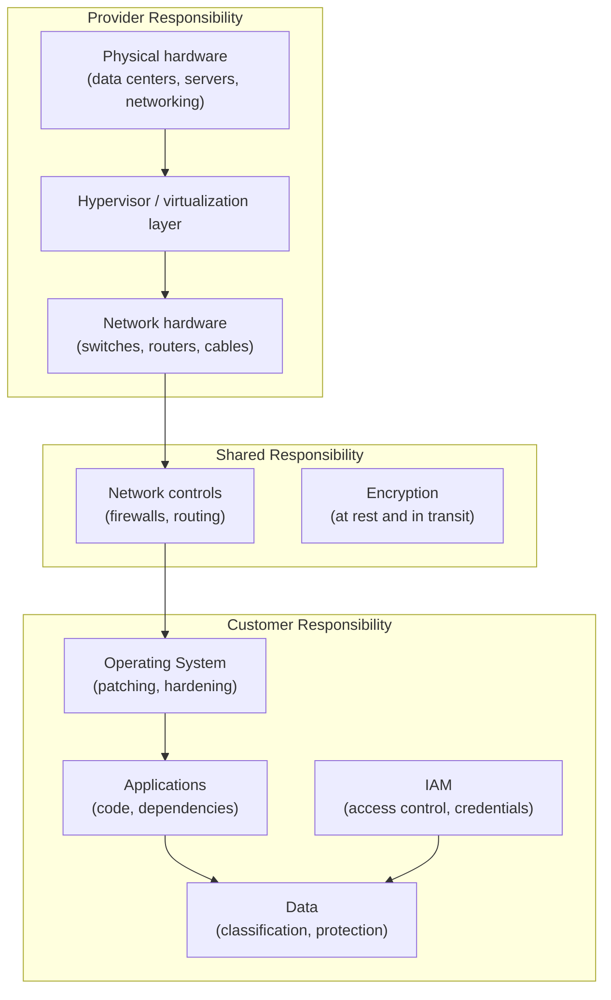
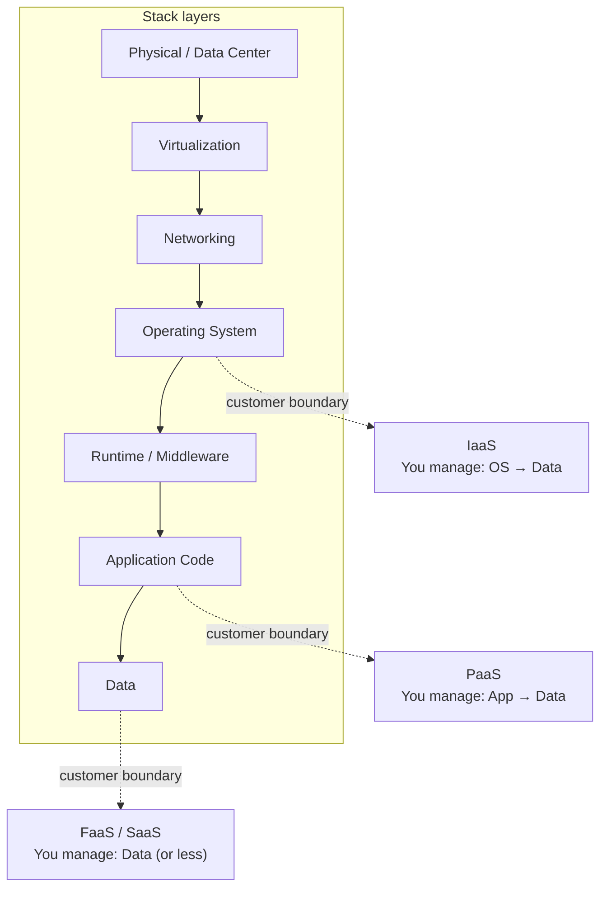
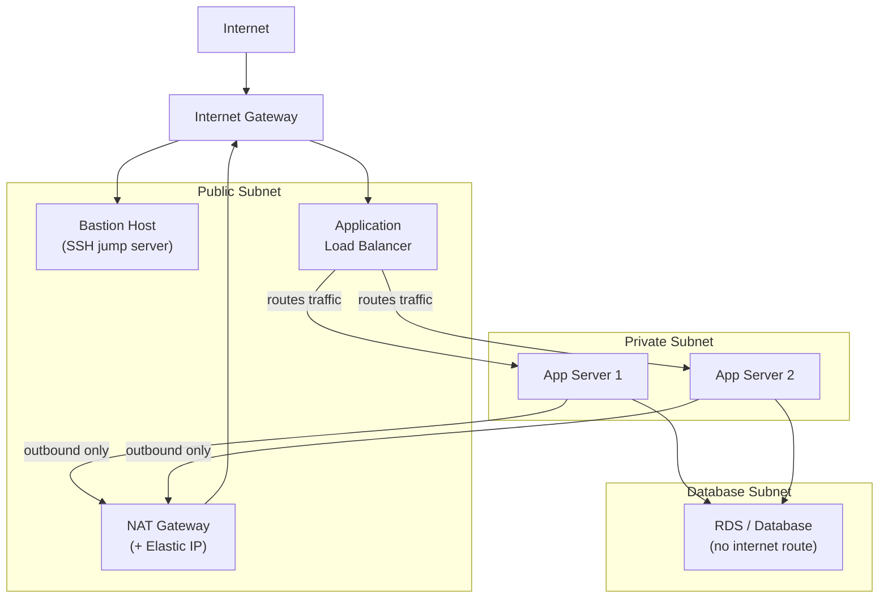
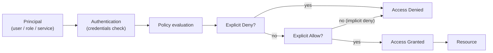
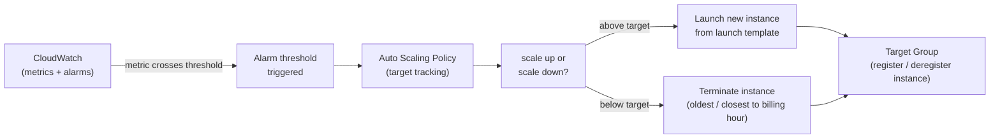

# Module 07: Cloud Fundamentals

> Part of the [DevOps Career Course](./README.md) by UncleJS

[](https://creativecommons.org/licenses/by-nc-sa/4.0/)      

---

## Table of Contents

- [Overview](#overview)
- [Learning Objectives](#learning-objectives)
- [Beginner: Cloud Computing Concepts](#beginner-cloud-computing-concepts)
- [Beginner: Cloud Service Models](#beginner-cloud-service-models)
- [Beginner: The Big Three — AWS, Azure, GCP](#beginner-the-big-three--aws-azure-gcp)
- [Intermediate: Compute Services](#intermediate-compute-services)
- [Intermediate: Storage Services](#intermediate-storage-services)
- [Intermediate: Networking in the Cloud](#intermediate-networking-in-the-cloud)
- [Intermediate: Identity & Access Management (IAM)](#intermediate-identity--access-management-iam)
- [Intermediate: Databases in the Cloud](#intermediate-databases-in-the-cloud)
- [Intermediate: Cloud CLI Tools](#intermediate-cloud-cli-tools)
- [Intermediate: Cloud Cost Management](#intermediate-cloud-cost-management)
- [Advanced: Serverless & Functions as a Service](#advanced-serverless--functions-as-a-service)
- [Advanced: Auto Scaling & High Availability Groups](#advanced-auto-scaling--high-availability-groups)
- [Advanced: Advanced VPC Networking](#advanced-advanced-vpc-networking)
- [Advanced: Container Registries](#advanced-container-registries)
- [Tools & Commands Reference](#tools--commands-reference)
- [Hands-On Labs](#hands-on-labs)
- [Further Reading](#further-reading)

---

## Overview

Cloud computing is the backbone of modern DevOps. Instead of buying and managing physical servers, you provision infrastructure on-demand from a provider — pay for what you use, scale in minutes, and access global infrastructure from an API.

This module is cloud-agnostic: we cover concepts that apply across all providers, then show the equivalent service in AWS, Azure, and GCP side-by-side.



[↑ Back to TOC](#table-of-contents)

---

## Learning Objectives

By the end of this module you will be able to:

- Explain the core cloud service and deployment models
- Navigate the three major cloud providers and their equivalent services
- Launch and manage virtual machines on any cloud provider
- Create and manage object storage buckets
- Configure cloud networking (VPC, subnets, security groups)
- Manage identities and permissions with IAM
- Use cloud-managed databases
- Use the CLI tools for AWS, Azure, and GCP
- Estimate and optimize cloud costs
- Deploy serverless functions with AWS Lambda, Azure Functions, and GCP Cloud Functions
- Configure Auto Scaling Groups and managed instance groups for elastic compute
- Design advanced VPC topologies with NAT gateways, VPC peering, and private endpoints
- Set up and use cloud container registries (ECR, ACR, Artifact Registry)

[↑ Back to TOC](#table-of-contents)

---

## Beginner: Cloud Computing Concepts

Cloud computing represents a fundamental shift in how teams think about infrastructure. The traditional model required capacity planning: you estimated peak demand, bought hardware to cover it, and then watched that hardware sit mostly idle during off-peak hours while you still paid for it. If you underestimated, you had an outage. If you overestimated, you wasted capital. Either way, the decision had to be made weeks or months before the traffic arrived.

The cloud model replaces that constraint with elastic provisioning. You request compute capacity when you need it and release it when you do not. A web application can scale from two instances to two hundred in minutes and scale back down overnight when traffic drops — paying only for what it actually used. That operational model changes how teams think about availability: instead of guarding a fixed pool of servers, you design systems that assume individual components are disposable and build resilience through redundancy and automation.

This shift also changes how cost and risk interact. In the traditional model, infrastructure investment came first and capacity determined what applications could do. In the cloud model, infrastructure spending follows demand and can be tuned incrementally. That changes the conversation between engineering and finance, enables faster experiments, and removes the organizational excuse of "we do not have enough servers" as a barrier to trying something new.

### Why Cloud?

| Traditional (On-Premises) | Cloud |
|---|---|
| Buy hardware upfront | Pay as you go |
| Months to provision | Minutes to provision |
| Fixed capacity | Infinite scale on demand |
| You maintain hardware | Provider maintains hardware |
| Single region | Global availability |

### Deployment Models

| Model | Description | Who Manages Hardware |
|---|---|---|
| **Public Cloud** | Shared infrastructure by provider (AWS, Azure, GCP) | Provider |
| **Private Cloud** | Dedicated infrastructure for one org | You (or co-lo) |
| **Hybrid Cloud** | Mix of public and private | Both |
| **Multi-Cloud** | Use multiple public cloud providers | Multiple providers |

[↑ Back to TOC](#table-of-contents)

---

## Beginner: Cloud Service Models

| Model | You Manage | Provider Manages | Examples |
|---|---|---|---|
| **IaaS** (Infrastructure as a Service) | OS, apps, data | Hardware, virtualization, network | EC2, Azure VMs, GCE |
| **PaaS** (Platform as a Service) | Apps, data | OS, runtime, middleware, hardware | AWS Elastic Beanstalk, Azure App Service, GCP App Engine |
| **SaaS** (Software as a Service) | Your data only | Everything | Gmail, Salesforce, GitHub |
| **FaaS** (Functions as a Service) | Code only | Everything else | AWS Lambda, Azure Functions, GCP Cloud Functions |
| **CaaS** (Containers as a Service) | Containers | Orchestration, infrastructure | EKS, AKS, GKE |



[↑ Back to TOC](#table-of-contents)

---

## Beginner: The Big Three — AWS, Azure, GCP

### Market Position (2025)

| Provider | Market Share | Strengths |
|---|---|---|
| **AWS** (Amazon Web Services) | ~31% | Broadest service catalog, most job postings |
| **Microsoft Azure** | ~25% | Strong enterprise/Microsoft integration |
| **Google Cloud (GCP)** | ~12% | Kubernetes (invented it), data/ML, pricing |

### Equivalent Services Cross-Reference

| Category | AWS | Azure | GCP |
|---|---|---|---|
| **Virtual Machines** | EC2 | Virtual Machines | Compute Engine |
| **Kubernetes** | EKS | AKS | GKE |
| **Serverless Functions** | Lambda | Azure Functions | Cloud Functions |
| **Object Storage** | S3 | Blob Storage | Cloud Storage |
| **Block Storage** | EBS | Managed Disks | Persistent Disk |
| **File Storage** | EFS | Azure Files | Filestore |
| **Managed PostgreSQL** | RDS (PostgreSQL) | Azure Database for PostgreSQL | Cloud SQL |
| **NoSQL Database** | DynamoDB | Cosmos DB | Firestore / Bigtable |
| **VPC Networking** | VPC | Virtual Network (VNet) | VPC |
| **Load Balancer** | ELB/ALB/NLB | Azure Load Balancer / App Gateway | Cloud Load Balancing |
| **DNS** | Route 53 | Azure DNS | Cloud DNS |
| **CDN** | CloudFront | Azure CDN | Cloud CDN |
| **IAM** | IAM | Azure AD / Entra ID | Cloud IAM |
| **Secrets** | Secrets Manager | Key Vault | Secret Manager |
| **Container Registry** | ECR | Azure Container Registry | Artifact Registry |
| **CI/CD** | CodePipeline | Azure DevOps | Cloud Build |
| **Monitoring** | CloudWatch | Azure Monitor | Cloud Monitoring |
| **Logging** | CloudWatch Logs | Log Analytics | Cloud Logging |

[↑ Back to TOC](#table-of-contents)

---

## Intermediate: Compute Services

### AWS EC2

```bash
# Launch an instance via AWS CLI
aws ec2 run-instances \
  --image-id ami-0c55b159cbfafe1f0 \    # Replace with current AMI for your region — see: aws ec2 describe-images
  --instance-type t3.micro \
  --key-name my-keypair \
  --security-group-ids sg-12345678 \
  --subnet-id subnet-12345678 \
  --tag-specifications 'ResourceType=instance,Tags=[{Key=Name,Value=webserver}]'

# List running instances
aws ec2 describe-instances --filters "Name=instance-state-name,Values=running" \
  --query 'Reservations[].Instances[].[InstanceId,PublicIpAddress,Tags[?Key==`Name`].Value|[0]]' \
  --output table

# Stop / start / terminate
aws ec2 stop-instances --instance-ids i-1234567890abcdef0
aws ec2 start-instances --instance-ids i-1234567890abcdef0
aws ec2 terminate-instances --instance-ids i-1234567890abcdef0
```

### Azure VMs

```bash
# Create a resource group
az group create --name myRG --location eastus

# Create a VM
az vm create \
  --resource-group myRG \
  --name myVM \
  --image Ubuntu2404    # Ubuntu 24.04 LTS \
  --admin-username azureuser \
  --generate-ssh-keys \
  --size Standard_B1s

# List VMs
az vm list --output table

# Open a port
az vm open-port --port 80 --resource-group myRG --name myVM

# Stop / deallocate / delete
az vm deallocate --resource-group myRG --name myVM
az vm delete --resource-group myRG --name myVM
```

### GCP Compute Engine

```bash
# Create a VM
gcloud compute instances create webserver \
  --machine-type=e2-micro \
  --image-family=ubuntu-2404-lts \    # Ubuntu 24.04 LTS
  --image-project=ubuntu-os-cloud \
  --zone=us-central1-a \
  --tags=http-server

# List instances
gcloud compute instances list

# SSH into instance
gcloud compute ssh webserver --zone=us-central1-a

# Stop / delete
gcloud compute instances stop webserver --zone=us-central1-a
gcloud compute instances delete webserver --zone=us-central1-a
```

[↑ Back to TOC](#table-of-contents)

---

## Intermediate: Storage Services

### Object Storage (S3 / Blob / GCS)

Object storage is for unstructured data: backups, logs, static files, build artifacts.

```bash
# AWS S3
aws s3 mb s3://my-unique-bucket-name                    # Create bucket
aws s3 ls                                                # List buckets
aws s3 ls s3://my-bucket/                               # List objects
aws s3 cp file.txt s3://my-bucket/                      # Upload
aws s3 cp s3://my-bucket/file.txt ./                    # Download
aws s3 sync ./local-folder s3://my-bucket/folder/      # Sync directory
aws s3 rm s3://my-bucket/file.txt                       # Delete object
aws s3 rb s3://my-bucket --force                        # Delete bucket

# Azure Blob Storage
az storage account create --name mystorageaccount --resource-group myRG --location eastus --sku Standard_LRS
az storage container create --name mycontainer --account-name mystorageaccount
az storage blob upload --file ./file.txt --container-name mycontainer --name file.txt --account-name mystorageaccount
az storage blob list --container-name mycontainer --account-name mystorageaccount --output table

# GCP Cloud Storage
gsutil mb gs://my-unique-bucket-name
gsutil ls
gsutil cp file.txt gs://my-bucket/
gsutil cp gs://my-bucket/file.txt ./
gsutil rsync -r ./local gs://my-bucket/
gsutil rm gs://my-bucket/file.txt
```

[↑ Back to TOC](#table-of-contents)

---

## Intermediate: Networking in the Cloud

A VPC (Virtual Private Cloud) is a software-defined network you own within a cloud provider's infrastructure. The provider's physical network is shared, but your VPC gives you isolated address space, routing, and firewall rules. Think of it as your data center's network — except it is defined through API calls and JSON, not by physically plugging in cables.

The public/private subnet separation is the foundational security pattern for cloud architecture. Resources in a **public subnet** have a route to an internet gateway and can receive inbound traffic from the internet. Resources in a **private subnet** have no such route — they are unreachable from the internet directly. Application servers and databases belong in private subnets. Load balancers and bastion hosts belong in public subnets. This arrangement means that even if an application is compromised, it is harder for an attacker to pivot outward because the application layer cannot directly communicate with arbitrary internet destinations.

A **NAT Gateway** (or NAT instance) provides the important exception: outbound-only internet access from private subnets. Application servers in private subnets need to pull software updates, reach external APIs, and download container images — but they should not be reachable from the outside. The NAT gateway sits in a public subnet, holds an Elastic IP, and performs network address translation so that responses to outbound connections are delivered correctly while no unsolicited inbound connection can reach the private subnet. This pattern is ubiquitous in production cloud architecture.



### VPC Concepts

A VPC (Virtual Private Cloud) is your isolated private network in the cloud.

```
VPC: 10.0.0.0/16
├── Public Subnet:  10.0.1.0/24  (has route to Internet Gateway)
│   └── Web servers, load balancers
├── Private Subnet: 10.0.2.0/24  (no direct internet access)
│   └── App servers, databases
└── Database Subnet: 10.0.3.0/24 (private, restricted)
    └── RDS, ElastiCache
```

```bash
# AWS VPC
aws ec2 create-vpc --cidr-block 10.0.0.0/16
aws ec2 create-subnet --vpc-id vpc-12345 --cidr-block 10.0.1.0/24 --availability-zone us-east-1a

# Security Group (firewall for EC2 instances)
aws ec2 create-security-group --group-name web-sg --description "Web SG" --vpc-id vpc-12345
aws ec2 authorize-security-group-ingress --group-id sg-12345 --protocol tcp --port 80 --cidr 0.0.0.0/0
aws ec2 authorize-security-group-ingress --group-id sg-12345 --protocol tcp --port 22 --cidr your.ip/32

# GCP VPC
gcloud compute networks create my-vpc --subnet-mode=custom
gcloud compute networks subnets create my-subnet \
  --network=my-vpc \
  --range=10.0.1.0/24 \
  --region=us-central1

# GCP Firewall rule
gcloud compute firewall-rules create allow-http \
  --network=my-vpc \
  --allow=tcp:80 \
  --source-ranges=0.0.0.0/0
```

[↑ Back to TOC](#table-of-contents)

---

## Intermediate: Identity & Access Management (IAM)

IAM is the authorization system that determines who can do what to which cloud resources. Getting IAM right is one of the most impactful security decisions in a cloud environment, because IAM misconfiguration is consistently one of the top causes of cloud security incidents.

The **principle of least privilege** means granting only the permissions that are actually needed, on only the resources they apply to, for only the time period required. In practice, this means avoiding wildcard actions (`*`), scoping resources explicitly rather than using `*` in the Resource field, and preferring time-limited or role-based access over long-lived credentials. **Instance profiles** (AWS) and **managed identities** (Azure) are the right mechanism for giving applications access to cloud services: they deliver short-lived credentials automatically without any secret to store, rotate, or accidentally commit to Git.

IAM **policy evaluation** follows a strict precedence order that matters operationally. An explicit **Deny** in any policy overrides any number of Allow statements — it wins unconditionally. Without any matching policy, access is **denied by default** (the implicit deny). An explicit **Allow** permits access only when no Deny statement applies. Understanding this order prevents a common confusion: adding an Allow policy to a user and being surprised that they still cannot do something because a Service Control Policy (SCP) or permission boundary contains an explicit Deny for that action. When debugging IAM access problems, start by looking for explicit denies before assuming allows are missing.



IAM controls **who** can do **what** on **which resources**.

### Core IAM Concepts

| Concept | AWS | Azure | GCP |
|---|---|---|---|
| **User** | IAM User | Microsoft Entra ID User | Google Account |
| **Group** | IAM Group | Microsoft Entra ID Group | Google Group |
| **Role** | IAM Role | Azure Role | IAM Role |
| **Policy/Permission** | IAM Policy | Role Definition | IAM Binding |
| **Service Identity** | IAM Role (for EC2) | Managed Identity | Service Account |

### AWS IAM Example

```bash
# Create an IAM user
aws iam create-user --user-name devops-user

# Attach a policy
aws iam attach-user-policy \
  --user-name devops-user \
  --policy-arn arn:aws:iam::aws:policy/AmazonS3ReadOnlyAccess

# Create an IAM role for EC2 (service identity)
aws iam create-role \
  --role-name ec2-s3-role \
  --assume-role-policy-document file://trust-policy.json

# List users
aws iam list-users
```

### IAM Best Practices

1. **Principle of Least Privilege** — grant only the permissions needed
2. **Never use root account** for day-to-day tasks
3. **Use roles, not users** for applications and services
4. **Enable MFA** for all human users
5. **Rotate credentials regularly** — access keys, passwords
6. **Use service accounts/managed identities** instead of hardcoded credentials

[↑ Back to TOC](#table-of-contents)

---

## Intermediate: Databases in the Cloud

Cloud-managed databases eliminate the overhead of installation, patching, backups, and replication.

```bash
# AWS RDS (PostgreSQL)
aws rds create-db-instance \
  --db-instance-identifier mydb \
  --db-instance-class db.t3.micro \
  --engine postgres \
  --engine-version 16.1 \
  --master-username admin \
  --master-user-password "${DB_PASSWORD}" \    # Never hardcode — use a secret or env var
  --allocated-storage 20 \
  --vpc-security-group-ids sg-12345 \
  --no-publicly-accessible

# Azure Database for PostgreSQL
az postgres flexible-server create \
  --resource-group myRG \
  --name mypostgres \
  --admin-user admin \
  --admin-password "${DB_PASSWORD}" \    # Never hardcode — use a secret or env var
  --sku-name Standard_B1ms \
  --tier Burstable

# GCP Cloud SQL
gcloud sql instances create mydb \
  --database-version=POSTGRES_16 \
  --tier=db-f1-micro \
  --region=us-central1

gcloud sql databases create appdb --instance=mydb
gcloud sql users create admin --instance=mydb --password="${DB_PASSWORD}"   # Never hardcode — use a secret or env var
```

[↑ Back to TOC](#table-of-contents)

---

## Intermediate: Cloud CLI Tools

### AWS CLI Setup

```bash
# Install
curl "https://awscli.amazonaws.com/awscli-exe-linux-x86_64.zip" -o "awscliv2.zip"
unzip awscliv2.zip && sudo ./aws/install

# Configure
aws configure
# Prompts for: Access Key ID, Secret Access Key, Region, Output format

# Test
aws sts get-caller-identity

# Use named profiles
aws configure --profile production
aws s3 ls --profile production
export AWS_PROFILE=production
```

### Azure CLI Setup

```bash
# Install
curl -sL https://aka.ms/InstallAzureCLIDeb | sudo bash

# Login
az login                            # Opens browser
az login --service-principal ...   # For automation

# Set subscription
az account list --output table
az account set --subscription "My Subscription"

# Test
az account show
```

### gcloud CLI Setup

```bash
# Install
curl https://sdk.cloud.google.com | bash
exec -l $SHELL

# Initialize
gcloud init

# Login
gcloud auth login
gcloud auth application-default login   # For SDKs/tools

# Set project
gcloud config set project my-project-id

# Test
gcloud config list
```

[↑ Back to TOC](#table-of-contents)

---

## Intermediate: Cloud Cost Management

### Key Principles

1. **Right-sizing** — use the smallest instance type that meets your needs
2. **Auto-scaling** — scale in when load drops, scale out when load rises
3. **Reserved/Committed use** — commit to 1 or 3 years for 30–70% discounts
4. **Spot/Preemptible/Spot VMs** — up to 90% off for interruptible workloads
5. **Delete unused resources** — stale snapshots, old load balancers, unattached volumes
6. **Storage tiering** — move infrequently accessed data to cheaper storage classes

### Cost Tools

| Tool | Provider | Purpose |
|---|---|---|
| AWS Cost Explorer | AWS | Visualize and analyze spending |
| AWS Budgets | AWS | Set alerts when costs exceed thresholds |
| Azure Cost Management | Azure | Cost analysis and budgets |
| GCP Billing Reports | GCP | Usage and cost reports |
| Infracost | Any (Terraform) | Estimate cost of IaC changes in PRs |

```bash
# AWS — get current month costs
aws ce get-cost-and-usage \
  --time-period Start=$(date -d "first day of month" +%Y-%m-%d),End=$(date +%Y-%m-%d) \
  --granularity MONTHLY \
  --metrics UnblendedCost

# GCP — check billing
gcloud billing accounts list
```

[↑ Back to TOC](#table-of-contents)

---

## Advanced: Serverless & Functions as a Service

Serverless (FaaS) lets you run code without provisioning or managing servers. You pay only for execution time — billed in milliseconds.

Serverless changes the unit of deployment from a long-running process to a function invocation. The cloud provider handles everything below your code: hardware provisioning, OS patching, runtime version management, and scaling to zero when there are no invocations. That operational simplicity is the genuine appeal — a team can deploy business logic without thinking about servers, containers, or scaling policies at all.

The **cold start problem** is the main operational tradeoff. When a function has not been invoked recently, the provider must initialize a new execution environment: pull the runtime, load the function code, and run initialization logic. This can add hundreds of milliseconds to the first invocation — which is usually acceptable for asynchronous workloads but noticeable for user-facing APIs. Provisioned concurrency (AWS) and minimum instances (GCP/Azure) pre-warm execution environments at a cost to eliminate cold starts for latency-sensitive paths.

The **event-driven model** is where serverless fits best and where it changes how you think about architecture. A file upload to S3 triggers a function. A message arriving in a queue triggers a function. A database change triggers a function. This push-based model is different from polling and long-running services, and it is genuinely simpler for event-processing workloads. Where serverless adds complexity rather than removing it is for long-running jobs (functions have maximum execution time limits), stateful workloads, functions with large dependencies, or services that need warm connections to databases. For those patterns, containers usually win.

### AWS Lambda

```bash
# Create a simple Lambda function (Python)
cat > handler.py << 'EOF'
import json

def lambda_handler(event, context):
    name = event.get("name", "World")
    return {
        "statusCode": 200,
        "body": json.dumps({"message": f"Hello, {name}!"})
    }
EOF

# Package it
zip function.zip handler.py

# Create the Lambda function
aws lambda create-function \
  --function-name hello-world \
  --runtime python3.12 \
  --role arn:aws:iam::123456789012:role/lambda-execution-role \
  --handler handler.lambda_handler \
  --zip-file fileb://function.zip

# Invoke it
aws lambda invoke \
  --function-name hello-world \
  --payload '{"name": "DevOps"}' \
  --cli-binary-format raw-in-base64-out \
  response.json
cat response.json

# Update function code
zip function.zip handler.py
aws lambda update-function-code \
  --function-name hello-world \
  --zip-file fileb://function.zip

# Add an HTTP trigger (API Gateway)
aws lambda add-permission \
  --function-name hello-world \
  --statement-id apigateway-invoke \
  --action lambda:InvokeFunction \
  --principal apigateway.amazonaws.com
```

### Azure Functions

```bash
# Create a Function App
az functionapp create \
  --resource-group myRG \
  --consumption-plan-location eastus \
  --runtime python \
  --runtime-version 3.11 \
  --functions-version 4 \
  --name my-function-app \
  --storage-account mystorageaccount

# Deploy from local project
func azure functionapp publish my-function-app
```

### GCP Cloud Functions

```bash
# Deploy a Cloud Function
cat > main.py << 'EOF'
import functions_framework

@functions_framework.http
def hello(request):
    name = request.args.get("name", "World")
    return f"Hello, {name}!"
EOF

gcloud functions deploy hello \
  --runtime python312 \
  --trigger-http \
  --allow-unauthenticated \
  --region us-central1

# Call it
gcloud functions call hello --data '{"name": "DevOps"}' --region us-central1
```

### When to use serverless

| Use case | Good fit? |
|---|---|
| Webhooks / event processing | ✅ Excellent |
| Scheduled jobs / cron tasks | ✅ Good |
| API backends with variable traffic | ✅ Good |
| Long-running batch jobs (> 15 min) | ❌ Poor — use containers |
| Stateful workloads | ❌ Poor — functions are stateless |
| Low-latency requirements (cold start) | ⚠️ Provisioned concurrency helps |

[↑ Back to TOC](#table-of-contents)

---

## Advanced: Auto Scaling & High Availability Groups

Auto Scaling automatically adjusts compute capacity based on demand — scaling out under load and scaling in when idle.



### AWS Auto Scaling Groups (ASG)

```bash
# Create a launch template
aws ec2 create-launch-template \
  --launch-template-name web-lt \
  --launch-template-data '{
    "ImageId": "ami-0c55b159cbfafe1f0",
    "InstanceType": "t3.micro",
    "SecurityGroupIds": ["sg-12345678"],
    "UserData": "IyEvYmluL2Jhc2gKYXB0LWdldCB1cGRhdGUKYXB0LWdldCBpbnN0YWxsIC15IG5naW54"
  }'

# Create an Auto Scaling Group
aws autoscaling create-auto-scaling-group \
  --auto-scaling-group-name web-asg \
  --launch-template LaunchTemplateName=web-lt,Version='$Latest' \
  --min-size 2 \
  --max-size 10 \
  --desired-capacity 2 \
  --vpc-zone-identifier "subnet-abc123,subnet-def456" \
  --health-check-type ELB \
  --health-check-grace-period 300

# Attach to a load balancer target group
aws autoscaling attach-load-balancer-target-groups \
  --auto-scaling-group-name web-asg \
  --target-group-arns arn:aws:elasticloadbalancing:us-east-1:123456789012:targetgroup/my-tg/abc123

# Create a scaling policy (target tracking — CPU at 60%)
aws autoscaling put-scaling-policy \
  --auto-scaling-group-name web-asg \
  --policy-name cpu-target-tracking \
  --policy-type TargetTrackingScaling \
  --target-tracking-configuration '{
    "PredefinedMetricSpecification": {
      "PredefinedMetricType": "ASGAverageCPUUtilization"
    },
    "TargetValue": 60.0
  }'

# Manually scale
aws autoscaling set-desired-capacity \
  --auto-scaling-group-name web-asg \
  --desired-capacity 5
```

### GCP Managed Instance Groups (MIG)

```bash
# Create an instance template
gcloud compute instance-templates create web-template \
  --machine-type=e2-micro \
  --image-family=ubuntu-2404-lts \
  --image-project=ubuntu-os-cloud \
  --tags=http-server \
  --metadata=startup-script='#!/bin/bash
    apt-get update && apt-get install -y nginx'

# Create a regional managed instance group with autoscaling
gcloud compute instance-groups managed create web-mig \
  --base-instance-name=web \
  --template=web-template \
  --size=2 \
  --region=us-central1

# Configure autoscaling
gcloud compute instance-groups managed set-autoscaling web-mig \
  --region=us-central1 \
  --max-num-replicas=10 \
  --min-num-replicas=2 \
  --target-cpu-utilization=0.6 \
  --cool-down-period=90
```

[↑ Back to TOC](#table-of-contents)

---

## Advanced: Advanced VPC Networking

### NAT Gateway — outbound internet for private subnets

Private subnets (where your app servers and databases live) have no direct internet access. A **NAT Gateway** in the public subnet allows outbound traffic while blocking inbound connections.

As VPCs multiply across accounts and regions, connecting them requires choosing the right mechanism. **VPC peering** is a direct, low-latency connection between two VPCs — it is simple and cheap for a small number of pairs. The scaling problem is that peering is not transitive: if VPC A peers with VPC B and VPC B peers with VPC C, VPC A cannot reach VPC C through that chain. With dozens of VPCs, the number of peering connections grows quadratically and becomes unmanageable. **Transit Gateway** solves this by acting as a hub: every VPC connects to the Transit Gateway once, and routing between any two VPCs is handled through the hub. This adds a fixed cost and a hop, but it is far more operable at scale.

**Private endpoints** (VPC Endpoints in AWS, Private Service Connect in GCP) keep traffic to cloud services entirely within the provider's backbone network without traversing the public internet. Without a private endpoint, your application servers in a private subnet accessing S3 have traffic leave the VPC via the NAT gateway and travel over the public internet — exposing metadata about your data flows and costing NAT gateway data-processing fees. A gateway endpoint for S3 or DynamoDB adds a route directly in the route table at no charge. Interface endpoints for other services (Secrets Manager, ECR, KMS) provision an elastic network interface in your subnet so DNS for the service resolves to a private IP. In regulated environments, private endpoints are often mandatory for compliance — data in transit must never touch the public internet.

```bash
# AWS — create a NAT Gateway
aws ec2 allocate-address --domain vpc   # Get an Elastic IP
aws ec2 create-nat-gateway \
  --subnet-id subnet-public-12345 \
  --allocation-id eipalloc-12345678

# Add a route in the private subnet's route table
aws ec2 create-route \
  --route-table-id rtb-private-12345 \
  --destination-cidr-block 0.0.0.0/0 \
  --nat-gateway-id nat-12345678abcdef0
```

```bash
# GCP — Cloud NAT
gcloud compute routers create my-router \
  --network=my-vpc \
  --region=us-central1

gcloud compute routers nats create my-nat \
  --router=my-router \
  --region=us-central1 \
  --auto-allocate-nat-external-ips \
  --nat-all-subnet-ip-ranges
```

### VPC Peering — connect two VPCs

VPC peering allows private IP communication between two VPCs — within the same account or across accounts.

```bash
# AWS — create a peering connection
aws ec2 create-vpc-peering-connection \
  --vpc-id vpc-aaaa1111 \
  --peer-vpc-id vpc-bbbb2222

# Accept the peering request (from the peer account/region if cross-account)
aws ec2 accept-vpc-peering-connection \
  --vpc-peering-connection-id pcx-12345678

# Add routes in both VPCs
aws ec2 create-route \
  --route-table-id rtb-aaaa1111 \
  --destination-cidr-block 10.1.0.0/16 \
  --vpc-peering-connection-id pcx-12345678
```

### Private Endpoints — access AWS services without internet

Without private endpoints, traffic to S3 or DynamoDB from your VPC traverses the public internet. **VPC Endpoints** (AWS) / **Private Service Connect** (GCP) keep traffic on the AWS backbone.

```bash
# AWS — Gateway endpoint for S3 (free)
aws ec2 create-vpc-endpoint \
  --vpc-id vpc-12345 \
  --service-name com.amazonaws.us-east-1.s3 \
  --route-table-ids rtb-12345

# AWS — Interface endpoint for Secrets Manager (charged per hour)
aws ec2 create-vpc-endpoint \
  --vpc-id vpc-12345 \
  --service-name com.amazonaws.us-east-1.secretsmanager \
  --vpc-endpoint-type Interface \
  --subnet-ids subnet-private-12345 \
  --security-group-ids sg-12345
```

### Full production VPC topology

```
VPC: 10.0.0.0/16
│
├── AZ us-east-1a
│   ├── Public subnet 10.0.1.0/24
│   │   ├── Load Balancer (ALB)
│   │   └── NAT Gateway + Elastic IP
│   ├── Private subnet 10.0.11.0/24 (app servers)
│   └── Database subnet 10.0.21.0/24 (RDS, ElastiCache)
│
└── AZ us-east-1b
    ├── Public subnet 10.0.2.0/24
    │   ├── Load Balancer (ALB)
    │   └── NAT Gateway + Elastic IP
    ├── Private subnet 10.0.12.0/24 (app servers)
    └── Database subnet 10.0.22.0/24 (RDS Multi-AZ standby)

Route tables:
  Public subnets → Internet Gateway (0.0.0.0/0)
  Private subnets → NAT Gateway in same AZ (0.0.0.0/0)
  Database subnets → No internet route (isolated)

VPC Endpoints:
  S3 Gateway Endpoint → on private route tables
  Secrets Manager Interface Endpoint → in private subnets
```

[↑ Back to TOC](#table-of-contents)

---

## Advanced: Container Registries

Container registries store and distribute Docker/OCI images. Cloud providers offer managed registries tightly integrated with their compute services.

```bash
# AWS ECR — Elastic Container Registry
# Create a repository
aws ecr create-repository --repository-name myapp --region us-east-1

# Authenticate Docker to ECR
aws ecr get-login-password --region us-east-1 | \
  docker login --username AWS --password-stdin \
  123456789012.dkr.ecr.us-east-1.amazonaws.com

# Tag and push an image
docker tag myapp:latest 123456789012.dkr.ecr.us-east-1.amazonaws.com/myapp:latest
docker push 123456789012.dkr.ecr.us-east-1.amazonaws.com/myapp:latest

# Enable image scanning on push
aws ecr put-image-scanning-configuration \
  --repository-name myapp \
  --image-scanning-configuration scanOnPush=true

# Azure Container Registry (ACR)
az acr create --resource-group myRG --name myregistry --sku Basic
az acr login --name myregistry
docker tag myapp:latest myregistry.azurecr.io/myapp:latest
docker push myregistry.azurecr.io/myapp:latest

# GCP Artifact Registry
gcloud artifacts repositories create myrepo \
  --repository-format=docker \
  --location=us-central1

gcloud auth configure-docker us-central1-docker.pkg.dev

docker tag myapp:latest us-central1-docker.pkg.dev/my-project/myrepo/myapp:latest
docker push us-central1-docker.pkg.dev/my-project/myrepo/myapp:latest
```

[↑ Back to TOC](#table-of-contents)

---

## Tools & Commands Reference

| Tool | Command Example | Purpose |
|---|---|---|
| AWS CLI | `aws ec2 describe-instances` | Manage AWS resources |
| Azure CLI | `az vm list` | Manage Azure resources |
| gcloud | `gcloud compute instances list` | Manage GCP resources |
| `aws s3` | `aws s3 cp file.txt s3://bucket/` | S3 file operations |
| `gsutil` | `gsutil cp file.txt gs://bucket/` | GCS file operations |
| `aws configure` | — | Set up AWS credentials |
| `az login` | — | Authenticate to Azure |
| `gcloud init` | — | Initialize GCP CLI |
| `aws lambda invoke` | `aws lambda invoke --function-name fn out.json` | Invoke a Lambda function |
| `aws autoscaling` | `aws autoscaling describe-auto-scaling-groups` | Manage ASGs |
| `aws ecr get-login-password` | — | Authenticate Docker to ECR |
| `az acr login` | `az acr login --name myregistry` | Authenticate Docker to ACR |
| `aws ec2 create-nat-gateway` | — | Create a NAT Gateway |
| `aws ec2 create-vpc-peering-connection` | — | Peer two VPCs |

[↑ Back to TOC](#table-of-contents)

---

## Hands-On Labs

### Lab 7.1 — First Cloud VM (pick any provider)

1. Create a free-tier account on AWS, Azure, or GCP
2. Launch a VM using the CLI (not the web console)
3. SSH into the VM
4. Install nginx: `sudo apt install nginx`
5. Open port 80 via a security group / firewall rule
6. Access the default nginx page from your browser
7. Stop and delete the VM (to avoid charges)

### Lab 7.2 — Object Storage

1. Create a storage bucket (S3 / Blob / GCS)
2. Upload a file via CLI
3. List the bucket contents
4. Set the file as publicly readable and access it via URL
5. Remove the public access and delete the bucket

### Lab 7.3 — IAM Roles

1. Create an IAM user or service account
2. Attach a read-only policy for object storage
3. Configure the CLI with those credentials
4. Verify you can list bucket contents but cannot create a bucket

### Lab 7.4 — Cloud Database

1. Launch a managed PostgreSQL instance (RDS / Azure / Cloud SQL)
2. Connect to it from your local machine using `psql`
3. Create a database and a table
4. Verify backup retention settings

### Lab 7.5 — Serverless Function

1. Write a simple HTTP function in Python or Node.js
2. Deploy it using AWS Lambda (or Azure Functions / GCP Cloud Functions)
3. Invoke it via the CLI and confirm the response
4. Check the invocation logs in CloudWatch / Azure Monitor / Cloud Logging
5. Delete the function and any associated resources

### Lab 7.6 — Container Registry

1. Build a simple Docker image locally: `docker build -t myapp:v1 .`
2. Create a private repository on ECR, ACR, or Artifact Registry
3. Authenticate your local Docker daemon to the registry
4. Tag and push the image to the registry
5. Pull the image from the registry on a VM to verify it works
6. Enable vulnerability scanning and review the scan results

[↑ Back to TOC](#table-of-contents)

---

## Further Reading

- [AWS Documentation](https://docs.aws.amazon.com/)
- [Azure Documentation](https://learn.microsoft.com/en-us/azure/)
- [Google Cloud Documentation](https://cloud.google.com/docs)
- [AWS Free Tier](https://aws.amazon.com/free/)
- [AWS Lambda Developer Guide](https://docs.aws.amazon.com/lambda/latest/dg/)
- [AWS Auto Scaling User Guide](https://docs.aws.amazon.com/autoscaling/ec2/userguide/)
- [AWS VPC User Guide](https://docs.aws.amazon.com/vpc/latest/userguide/)
- [A Cloud Guru / Linux Academy](https://acloudguru.com/)
- [Glossary: Cloud Provider](./glossary.md#c), [IAM](./glossary.md#i), [VPC](./glossary.md#v), [IaaS](./glossary.md#i)
- **Certifications**: AWS Cloud Practitioner, AWS DevOps Engineer, Azure Administrator AZ-104

[↑ Back to TOC](#table-of-contents)

---

## AWS Well-Architected Framework

The AWS Well-Architected Framework is a set of best practices organized into six pillars. Every AWS certification exam and most production architecture reviews reference it. Understanding the pillars helps you evaluate design trade-offs and communicate architectural decisions.

### The Six Pillars

**Operational Excellence**: run and monitor systems, continuously improve processes. Key practices: infrastructure as code, frequent small changes, anticipate failure, learn from operations events.

**Security**: protect information and systems. Key practices: strong identity foundation (least privilege IAM), enable traceability (CloudTrail), apply security at all layers, protect data in transit and at rest, keep people away from data (automate everything).

**Reliability**: ensure a workload performs its intended function correctly and consistently. Key practices: test recovery procedures, scale horizontally, stop guessing capacity, manage change through automation.

**Performance Efficiency**: use computing resources efficiently and maintain that efficiency as demand changes. Key practices: democratize advanced technologies (use managed services), go global in minutes, use serverless, experiment more often.

**Cost Optimization**: avoid unnecessary costs. Key practices: implement cloud financial management, adopt a consumption model (pay for what you use), measure overall efficiency, stop spending on undifferentiated heavy lifting, analyze and attribute expenditure.

**Sustainability**: minimize environmental impact. Key practices: understand your impact, establish sustainability goals, maximize utilization, use more efficient hardware and software.

### Well-Architected Review Process

```bash
# AWS Well-Architected Tool (console-based, but accessible via CLI)
aws wellarchitected list-workloads

# Create a workload
aws wellarchitected create-workload \
  --workload-name "order-service" \
  --description "E-commerce order processing service" \
  --environment PRODUCTION \
  --aws-regions eu-west-1 \
  --lenses "wellarchitected"

# List questions for a lens
aws wellarchitected list-lens-review-improvements \
  --workload-id <workload-id> \
  --lens-alias wellarchitected \
  --pillar-id operationalExcellence
```

[↑ Back to TOC](#table-of-contents)

---

## FinOps and Cloud Cost Management

Cloud costs without governance grow unchecked. FinOps is the practice of applying financial accountability to cloud spending.

### Cost Visibility

```bash
# AWS Cost Explorer — get costs by service for last month
aws ce get-cost-and-usage \
  --time-period Start=2026-02-01,End=2026-03-01 \
  --granularity MONTHLY \
  --metrics BlendedCost \
  --group-by Type=DIMENSION,Key=SERVICE \
  --query 'ResultsByTime[0].Groups[*].{Service:Keys[0],Cost:Metrics.BlendedCost.Amount}' \
  --output table | sort -k3 -rn

# Break costs down by tag
aws ce get-cost-and-usage \
  --time-period Start=2026-02-01,End=2026-03-01 \
  --granularity MONTHLY \
  --metrics BlendedCost \
  --group-by Type=TAG,Key=team \
  --output table

# EC2 instances running without stopping for > 7 days
aws ec2 describe-instances \
  --filters "Name=instance-state-name,Values=running" \
  --query 'Reservations[*].Instances[?LaunchTime<=`2026-03-20`].{ID:InstanceId,Type:InstanceType,Launch:LaunchTime}' \
  --output table
```

### Savings Plans vs Reserved Instances vs Spot

**On-Demand**: full price, no commitment. Use for unpredictable or short-lived workloads.

**Savings Plans**: commitment to a consistent amount of usage ($/hour) for 1 or 3 years. Compute Savings Plans apply across EC2, Fargate, Lambda regardless of instance family, region, OS. More flexible than RIs. Discount: up to 66%.

**Reserved Instances**: commitment to a specific instance type and region (Standard RI) or flexible family (Convertible RI). Higher discount than Savings Plans for specific types (up to 72%) but less flexible.

**Spot Instances**: spare EC2 capacity at 70-90% discount. Can be interrupted with 2-minute notice. Use for: batch processing, CI/CD agents, stateless web tiers with Spot interruption handling, Kubernetes worker nodes with Karpenter.

```bash
# Check Spot price history
aws ec2 describe-spot-price-history \
  --instance-types m6i.xlarge m6a.xlarge \
  --product-descriptions "Linux/UNIX" \
  --start-time 2026-03-26T00:00:00 \
  --region eu-west-1 \
  --output table

# Check Savings Plan coverage
aws ce get-savings-plans-coverage \
  --time-period Start=2026-02-01,End=2026-03-01 \
  --granularity MONTHLY \
  --output table

# Check Reserved Instance utilization
aws ce get-reservation-utilization \
  --time-period Start=2026-02-01,End=2026-03-01 \
  --granularity MONTHLY \
  --output table
```

### Tagging Strategy for Cost Allocation

Without tags, you cannot attribute costs. Enforce tagging with AWS Config or SCPs:

```json
{
  "Version": "2012-10-17",
  "Statement": [
    {
      "Sid": "RequireTagsOnEC2",
      "Effect": "Deny",
      "Action": [
        "ec2:RunInstances",
        "ec2:CreateVolume"
      ],
      "Resource": "*",
      "Condition": {
        "Null": {
          "aws:RequestedRegion": "false",
          "aws:RequestTag/team": "true"
        }
      }
    }
  ]
}
```

Standard tag keys to enforce: `team`, `project`, `environment` (production/staging/dev), `cost-center`, `managed-by` (terraform/manual/k8s).

[↑ Back to TOC](#table-of-contents)

---

## AWS Organizations and Landing Zones

### AWS Organizations

Organizations allow centralized management of multiple AWS accounts. The master (management) account owns the organization. Member accounts are grouped into Organizational Units (OUs).

```bash
# List accounts in the organization
aws organizations list-accounts \
  --query 'Accounts[*].{Name:Name,ID:Id,Status:Status,Email:Email}' \
  --output table

# List OUs
aws organizations list-organizational-units-for-parent \
  --parent-id <root-id> \
  --output table

# Create a new account
aws organizations create-account \
  --account-name "team-checkout-prod" \
  --email checkout-prod@company.com \
  --iam-user-access-to-billing ALLOW
```

### Service Control Policies (SCPs)

SCPs act as guardrails — they define the maximum permissions available to accounts in an OU. Even if an IAM policy grants full access, an SCP can deny specific actions across the entire account.

```json
{
  "Version": "2012-10-17",
  "Statement": [
    {
      "Sid": "DenyNonEURegions",
      "Effect": "Deny",
      "Action": "*",
      "Resource": "*",
      "Condition": {
        "StringNotEquals": {
          "aws:RequestedRegion": ["eu-west-1", "eu-central-1"]
        }
      }
    },
    {
      "Sid": "DenyRootAccountActions",
      "Effect": "Deny",
      "Action": "*",
      "Resource": "*",
      "Condition": {
        "StringEquals": {
          "aws:PrincipalType": "Root"
        }
      }
    },
    {
      "Sid": "RequireMFAForConsoleActions",
      "Effect": "Deny",
      "NotAction": [
        "iam:CreateVirtualMFADevice",
        "iam:EnableMFADevice",
        "iam:GetUser",
        "sts:GetSessionToken"
      ],
      "Resource": "*",
      "Condition": {
        "BoolIfExists": {
          "aws:MultiFactorAuthPresent": "false"
        }
      }
    }
  ]
}
```

### AWS Control Tower

Control Tower automates landing zone setup: creates a log archive account (CloudTrail, Config logs), an audit account (Security Hub, GuardDuty), and configures baseline SCPs and guardrails.

```bash
# Check Control Tower enabled regions
aws controltower list-enabled-controls \
  --target-identifier arn:aws:organizations::123456:ou/o-abc/ou-abc-xyz

# List drift detected controls
aws controltower list-enabled-controls \
  --target-identifier <ou-arn> \
  --query 'enabledControls[?driftStatus==`DRIFTED`]'
```

[↑ Back to TOC](#table-of-contents)

---

## Advanced Cloud Networking

### AWS Transit Gateway

Transit Gateway is a hub-and-spoke network transit service. Connect VPCs and on-premises networks to a single gateway instead of a full mesh of VPC peering connections.

```bash
# Create Transit Gateway
aws ec2 create-transit-gateway \
  --description "Main transit gateway" \
  --options AmazonSideAsn=64512,AutoAcceptSharedAttachments=enable,DefaultRouteTableAssociation=enable

# Attach a VPC
aws ec2 create-transit-gateway-vpc-attachment \
  --transit-gateway-id tgw-xxx \
  --vpc-id vpc-yyy \
  --subnet-ids subnet-aaa subnet-bbb subnet-ccc

# Create a route in VPC route table → TGW
aws ec2 create-route \
  --route-table-id rtb-xxx \
  --destination-cidr-block 10.0.0.0/8 \
  --transit-gateway-id tgw-xxx
```

### AWS PrivateLink

PrivateLink allows you to expose a service in your VPC to consumers in other VPCs (or on-premises) without traffic traversing the internet or using VPC peering.

```bash
# Create VPC Endpoint Service (provider side)
aws ec2 create-vpc-endpoint-service-configuration \
  --network-load-balancer-arns arn:aws:elasticloadbalancing:...

# Create VPC Endpoint (consumer side)
aws ec2 create-vpc-endpoint \
  --vpc-id vpc-consumer \
  --service-name com.amazonaws.vpce.eu-west-1.vpce-svc-xxx \
  --vpc-endpoint-type Interface \
  --subnet-ids subnet-aaa \
  --security-group-ids sg-xxx

# Accept the connection (provider side)
aws ec2 accept-vpc-endpoint-connections \
  --service-id vpce-svc-xxx \
  --vpc-endpoint-ids vpce-yyy
```

### Direct Connect

AWS Direct Connect provides a dedicated, private network connection from on-premises to AWS (1Gbps, 10Gbps, or 100Gbps). Benefits: consistent latency (unlike internet-based VPN), higher bandwidth, lower data transfer costs.

Architecture options:
- **Virtual Private Gateway (VGW)**: single VPC access
- **Direct Connect Gateway + Transit Gateway**: access multiple VPCs across regions via single connection

```bash
# List Direct Connect connections
aws directconnect describe-connections

# List virtual interfaces
aws directconnect describe-virtual-interfaces

# Check BGP session state
aws directconnect describe-virtual-interfaces \
  --query 'virtualInterfaces[*].{Name:virtualInterfaceName,State:virtualInterfaceState,BGP:bgpPeers[0].bgpStatus}'
```

[↑ Back to TOC](#table-of-contents)

---

## Managed Kubernetes Deep Dive

### EKS (Elastic Kubernetes Service)

```bash
# Create EKS cluster
eksctl create cluster \
  --name production \
  --region eu-west-1 \
  --version 1.29 \
  --nodegroup-name standard \
  --node-type m6i.xlarge \
  --nodes 3 \
  --nodes-min 3 \
  --nodes-max 10 \
  --managed \
  --with-oidc \
  --ssh-access \
  --ssh-public-key my-key

# Update kubeconfig
aws eks update-kubeconfig --name production --region eu-west-1

# IRSA: IAM Roles for Service Accounts
# 1. Create IAM policy
aws iam create-policy \
  --policy-name S3ReadPolicy \
  --policy-document file://s3-read-policy.json

# 2. Create IAM role with OIDC trust
eksctl create iamserviceaccount \
  --cluster production \
  --namespace production \
  --name order-service-sa \
  --attach-policy-arn arn:aws:iam::123456:policy/S3ReadPolicy \
  --approve

# 3. Use in pod spec
# serviceAccountName: order-service-sa
# (AWS SDK automatically uses the IRSA credentials via web identity token)

# Add a managed node group
eksctl create nodegroup \
  --cluster production \
  --name gpu-nodes \
  --node-type g4dn.xlarge \
  --nodes 0 \
  --nodes-min 0 \
  --nodes-max 5 \
  --node-labels workload=gpu \
  --node-taints nvidia.com/gpu=present:NoSchedule
```

### EKS Add-ons

```bash
# List available add-ons
aws eks describe-addon-versions --kubernetes-version 1.29 \
  --query 'addons[*].{Name:addonName,DefaultVersion:addonVersions[?defaultVersion==`true`].addonVersion|[0]}' \
  --output table

# Install VPC CNI, CoreDNS, kube-proxy, EBS CSI driver
for addon in vpc-cni coredns kube-proxy aws-ebs-csi-driver; do
  aws eks create-addon \
    --cluster-name production \
    --addon-name $addon \
    --resolve-conflicts OVERWRITE
done

# Update an add-on
aws eks update-addon \
  --cluster-name production \
  --addon-name vpc-cni \
  --addon-version v1.16.0-eksbuild.1
```

[↑ Back to TOC](#table-of-contents)

---

## Cloud Security Posture Management

### AWS Security Hub

Security Hub aggregates security findings from GuardDuty, Inspector, Macie, IAM Access Analyzer, and third-party tools into a single dashboard.

```bash
# Enable Security Hub
aws securityhub enable-security-hub \
  --enable-default-standards

# Get high-severity findings
aws securityhub get-findings \
  --filters '{"SeverityLabel":[{"Value":"HIGH","Comparison":"EQUALS"},{"Value":"CRITICAL","Comparison":"EQUALS"}],"WorkflowStatus":[{"Value":"NEW","Comparison":"EQUALS"}]}' \
  --query 'Findings[*].{Title:Title,Severity:Severity.Label,Resource:Resources[0].Id}' \
  --output table

# Check compliance against CIS AWS Foundations Benchmark
aws securityhub describe-standards-controls \
  --standards-subscription-arn arn:aws:securityhub:eu-west-1:123456:subscription/cis-aws-foundations-benchmark/v/1.4.0 \
  --query 'Controls[?ControlStatus==`FAILED`].{ControlId:ControlId,Title:Title}' \
  --output table
```

### AWS GuardDuty

GuardDuty uses ML and threat intelligence to detect suspicious activity in CloudTrail, VPC Flow Logs, and DNS logs.

```bash
# Enable GuardDuty
aws guardduty create-detector --enable

# Get high-severity findings
DETECTOR_ID=$(aws guardduty list-detectors --query 'DetectorIds[0]' --output text)
aws guardduty list-findings \
  --detector-id $DETECTOR_ID \
  --finding-criteria '{"Criterion":{"severity":{"Gte":7}}}' \
  --output table

# Get finding details
aws guardduty get-findings \
  --detector-id $DETECTOR_ID \
  --finding-ids <finding-id> \
  --query 'Findings[0].{Type:Type,Severity:Severity,Description:Description}'
```

### Prowler — Open-Source CSPM

Prowler runs hundreds of cloud security checks against AWS (and Azure/GCP). Essential for compliance audits:

```bash
# Install (Python)
pip install prowler

# Run all checks, output to HTML report
prowler aws --region eu-west-1 -M html -o /tmp/prowler-report

# Run only CIS Benchmark checks
prowler aws --compliance cis_level2_aws_2.0

# Run checks for specific services
prowler aws --services iam s3 ec2 --region eu-west-1

# Run in CI/CD (exit non-zero if critical findings)
prowler aws --severity critical high --exit-code-fail 3
```

[↑ Back to TOC](#table-of-contents)

---

## Serverless Patterns

### Lambda with SQS and SNS

```python
# Lambda function triggered by SQS
import json
import boto3

sqs = boto3.client('sqs')

def handler(event, context):
    for record in event['Records']:
        body = json.loads(record['body'])
        
        try:
            process_order(body)
            # SQS automatically deletes the message on successful return
        except Exception as e:
            # Raise to keep message in queue (will retry up to maxReceiveCount)
            # After maxReceiveCount, message goes to DLQ
            print(f"Failed to process order {body.get('orderId')}: {e}")
            raise

def process_order(order):
    print(f"Processing order: {order['orderId']}")
    # ... business logic
```

```yaml
# SAM template
AWSTemplateFormatVersion: '2010-09-09'
Transform: AWS::Serverless-2016-10-31

Resources:
  OrderProcessor:
    Type: AWS::Serverless::Function
    Properties:
      CodeUri: src/
      Handler: handler.handler
      Runtime: python3.12
      MemorySize: 512
      Timeout: 30
      ReservedConcurrentExecutions: 50   # prevent throttling downstream
      Environment:
        Variables:
          DB_SECRET_ARN: !Ref DatabaseSecret
      Policies:
      - SQSPollerPolicy:
          QueueName: !GetAtt OrderQueue.QueueName
      - AWSSecretsManagerGetSecretValuePolicy:
          SecretArn: !Ref DatabaseSecret
      Events:
        SQSEvent:
          Type: SQS
          Properties:
            Queue: !GetAtt OrderQueue.Arn
            BatchSize: 10
            MaximumBatchingWindowInSeconds: 5
            FunctionResponseTypes:
            - ReportBatchItemFailures   # partial batch failure support

  OrderQueue:
    Type: AWS::SQS::Queue
    Properties:
      VisibilityTimeout: 180   # 6x Lambda timeout
      RedrivePolicy:
        deadLetterTargetArn: !GetAtt OrderDLQ.Arn
        maxReceiveCount: 3

  OrderDLQ:
    Type: AWS::SQS::Queue
    Properties:
      MessageRetentionPeriod: 1209600   # 14 days
```

[↑ Back to TOC](#table-of-contents)

---

## Common Mistakes & Pitfalls

- **No tagging strategy** from day one. Retrofitting tags to existing resources is tedious; untagged resources make cost attribution impossible and security audits incomplete.
- **Using root account credentials** for day-to-day operations. Root account has no restrictions — any compromise is catastrophic. Enable MFA on root, lock away the credentials, and never use root for regular tasks.
- **Over-permissive IAM policies**. `"Action": "*"` and `"Resource": "*"` are seen in production more often than they should be. Always apply least privilege.
- **Ignoring egress costs**. Data transfer OUT of AWS/Azure/GCP is charged; data transfer IN is free. Architectures that move large data sets out of the cloud (to on-prem analytics tools, for example) generate surprisingly large bills.
- **Not enabling VPC Flow Logs** until an incident requires them. Flow logs are cheap; forensic investigation without them is nearly impossible.
- **Single-AZ deployments**. Every stateless tier and database should span at least 2 AZs. Single-AZ means a single AWS data center failure takes down the entire service.
- **Using public subnets for backend resources** (databases, internal APIs). Databases should never have a route to the internet gateway. Place them in private subnets with no default route.
- **Hardcoding AWS credentials in application code or environment variables**. Use IAM roles for EC2/ECS/Lambda (instance metadata), IRSA for EKS, or Workload Identity for GKE. Never use long-lived access keys in application environments.
- **Not setting S3 bucket policies to block public access**. The `BlockPublicAcls`, `BlockPublicPolicy`, `IgnorePublicAcls`, `RestrictPublicBuckets` settings should all be `true` for non-public buckets. Enable S3 Block Public Access at the account level as a guardrail.
- **Forgetting to enable CloudTrail** in all regions. CloudTrail logs API calls — essential for security investigations. Enable multi-region CloudTrail and send logs to a separate, locked-down S3 bucket.
- **Picking the wrong EC2 instance type family** for the workload. Compute-optimized (C family) for CPU-intensive tasks; memory-optimized (R family) for in-memory databases; storage-optimized (I/D family) for high IOPS. Using wrong family wastes money.
- **Not testing disaster recovery**. Having backup snapshots means nothing if you have never tested restoring from them. Run a quarterly restore test.
- **Storing secrets in EC2 user data**. User data is visible to anyone with `DescribeInstanceAttribute` permissions. Use Secrets Manager or SSM Parameter Store instead.
- **Not configuring Auto Scaling cool-down periods** correctly. Too short: scale-out and scale-in thrash repeatedly during a gradual load increase, incurring extra costs. Too long: you stay over-provisioned for hours after load drops.
- **Security groups that reference 0.0.0.0/0** on non-HTTP ports (especially 22, 3389, 5432, 27017). Exposed management and database ports are the primary attack surface for cloud resources.

[↑ Back to TOC](#table-of-contents)

---

## Interview Prep

**Q: What is the difference between IAM users, roles, and policies?**

A: A user is a long-term identity (person or service) with permanent credentials. A role is a temporary identity assumed by trusted entities (EC2 instances, Lambda functions, other AWS accounts, federated users) — credentials are short-lived and rotated automatically. A policy is a JSON document that defines what actions are allowed or denied on which resources. Policies attach to users, groups, or roles. Best practice: no human IAM users in production accounts; use IAM Identity Center with SSO and roles for all human access. Use IAM roles for all application access.

**Q: Explain the principle of least privilege in cloud IAM.**

A: Every identity (user, role, service account) should have only the permissions required to do its specific job — nothing more. In practice: start with zero permissions and add incrementally; use condition keys to restrict access by IP, MFA status, resource tag, time of day; use AWS IAM Access Analyzer to identify unused permissions; review and prune permissions quarterly. A compromised credential with least-privilege access causes limited damage; a compromised admin credential can destroy everything.

**Q: What is a VPC and how is it different from a traditional network?**

A: A VPC (Virtual Private Cloud) is an isolated virtual network within a cloud provider's infrastructure. You control the IP address range (CIDR), subnets, route tables, internet gateways, NAT gateways, and security groups. Unlike a traditional network, there is no physical hardware to manage — everything is software-defined and controlled via API. You can spin up, modify, or tear down entire network topologies in minutes. Security groups act as stateful firewalls at the instance level; NACLs act as stateless firewalls at the subnet level.

**Q: What is the difference between vertical and horizontal scaling, and when would you use each?**

A: Vertical scaling (scale up) increases the size of a single instance — more CPU, memory, storage. It is simple (no code changes) but has hard limits and causes downtime during the change. Horizontal scaling (scale out) adds more instances of the same size. It requires stateless application design (sessions in a shared store, no local disk state) but can scale to arbitrary capacity and is tolerant to individual instance failure. In cloud environments, horizontal scaling is preferred for stateless workloads (web tiers, API servers); vertical scaling is sometimes necessary for databases that cannot easily shard.

**Q: What are the six Rs of cloud migration?**

A: The 6 Rs describe migration strategies: **Rehost** (lift and shift — move VMs as-is to cloud VMs, fastest but least cloud-native); **Replatform** (lift-tinker-shift — change the DB to RDS but keep app code); **Refactor** (re-architect for cloud-native — containers, serverless, managed services — highest effort, highest benefit); **Retire** (decommission applications no longer needed); **Retain** (keep on-premises for now — compliance, latency, cost); **Repurchase** (replace with SaaS, e.g., move from self-hosted CRM to Salesforce).

**Q: How does AWS S3 pricing work and what are common cost optimizations?**

A: S3 pricing has three components: storage (per GB/month by storage class), requests (per 1,000 GET/PUT/DELETE requests), and data transfer (GET requests returning data to the internet). Storage class optimization is the biggest lever: move infrequently accessed data to S3-IA (30-day minimum), S3-Glacier Instant Retrieval, or S3-Glacier Deep Archive. Use S3 Intelligent-Tiering to automate transitions. Enable S3 Lifecycle policies to expire old versions and incomplete multipart uploads. Use S3 Transfer Acceleration only when needed (it costs extra).

**Q: What is the shared responsibility model?**

A: AWS/Azure/GCP are responsible for the security OF the cloud (physical data centers, hypervisor, network infrastructure, managed service underlying infrastructure). You are responsible for security IN the cloud (OS patching on EC2, application code, IAM policies, data encryption, network configuration, compliance). For managed services, the boundary shifts — RDS: AWS patches the database engine; you patch the OS (actually AWS patches that too for RDS). Lambda: AWS manages everything down to the runtime; you manage your code and its dependencies.

**Q: Explain NAT Gateway and when you need it.**

A: A NAT Gateway allows instances in private subnets to make outbound connections to the internet (for package downloads, external API calls) without being directly reachable from the internet. Traffic flows: private instance → NAT Gateway in public subnet → Internet Gateway → internet. The NAT Gateway has a public Elastic IP. Inbound connections from the internet are blocked. Cost: ~$0.045/hour + $0.045/GB data processed (per region). Common mistake: one NAT Gateway for an entire VPC — create one per AZ to avoid cross-AZ data transfer charges.

**Q: What is CloudFormation and how does it differ from Terraform?**

A: CloudFormation is AWS's native IaC service — you define stacks in YAML or JSON, and AWS handles the provisioning and change management. Terraform is a third-party (HashiCorp) tool that supports multiple providers (AWS, Azure, GCP, Kubernetes, and 1,000+ others) using its own HCL language. Key differences: Terraform has a better plan/apply workflow (shows you exactly what will change); CloudFormation is deeply integrated with AWS (drift detection, change sets, StackSets for multi-account); Terraform has better multi-cloud support. Most organizations use Terraform for multi-cloud or cloud-agnostic IaC, and reserve CloudFormation for AWS-specific automation where native integration matters.

**Q: What is ECS Fargate and when would you use it over EKS?**

A: Fargate is a serverless container runtime — you define task definitions (container specs) and Fargate provisions the underlying compute, removing node management entirely. EKS with managed node groups requires you to manage EC2 nodes (patching, scaling, instance type selection). Use Fargate when: you want zero node management overhead; workloads are well-defined tasks with predictable resource needs; team does not have Kubernetes expertise; you want isolated compute per task (no shared kernel). Use EKS when: you need Kubernetes-native features (custom controllers, operators, admission webhooks); you have GPU workloads; you want Spot Instance bin-packing for cost; team already knows Kubernetes.

**Q: How would you reduce a $50,000/month AWS bill by 30%?**

A: Start with Cost Explorer to identify the top 3 spending services. Typical levers: (1) purchase Compute Savings Plans for steady-state EC2/Fargate/Lambda usage (immediate 20-30% savings); (2) right-size over-provisioned EC2 instances using Compute Optimizer recommendations; (3) move Spot-eligible workloads (CI/CD agents, batch jobs, stateless tiers) to Spot Instances (60-70% discount); (4) implement S3 Lifecycle policies to move old data to cheaper storage classes; (5) identify and delete unused EBS volumes, snapshots, unattached Elastic IPs, idle NAT Gateways; (6) review data transfer costs and co-locate high-traffic components in the same AZ.

**Q: What is EBS and what are the different volume types?**

A: EBS (Elastic Block Store) provides persistent block storage for EC2 instances. Volume types: `gp3` (general purpose SSD, 3,000 IOPS baseline, 125 MB/s baseline, independently configurable up to 16,000 IOPS — the default for most workloads); `io2 Block Express` (provisioned IOPS SSD, up to 256,000 IOPS, for databases requiring consistent high performance); `st1` (throughput-optimized HDD, low cost, high sequential throughput, for data warehouses and log storage); `sc1` (cold HDD, lowest cost, infrequently accessed large data). Always prefer `gp3` over `gp2` — same performance baseline at 20% lower cost.

**Q: Explain IAM Identity Center (formerly SSO) and why it matters.**

A: IAM Identity Center provides centralized access management for multiple AWS accounts. Users authenticate once (via SAML with Okta/Azure AD/Google Workspace, or the built-in Identity Center directory) and then assume roles in any account they are authorized for — no per-account IAM users. This eliminates credential sprawl (no long-lived access keys per person per account), enforces MFA centrally, and provides centralized access audit. Combined with SCPs and permission boundaries, it gives you fine-grained, auditable access control across an entire AWS organization.

[↑ Back to TOC](#table-of-contents)

---

## A Day in the Life

You join the platform team at a Series C fintech company as a cloud engineer. The company runs 23 microservices across two AWS regions, spending $180,000/month on AWS. Your first week: review the bill, find the waste.

You open Cost Explorer. Top spending categories: EC2 ($62k), RDS ($41k), Data Transfer ($28k), NAT Gateway ($18k). The data transfer and NAT costs are unusually high.

You dig into the NAT Gateway costs:

```bash
aws ce get-cost-and-usage \
  --time-period Start=2026-03-01,End=2026-03-27 \
  --granularity DAILY \
  --metrics BlendedCost \
  --filter '{"Dimensions":{"Key":"SERVICE","Values":["AWS VPC"]}}' \
  --output table
```

$18k per month on NAT Gateway data processing. You check VPC Flow Logs in CloudWatch Insights:

```
fields @timestamp, srcAddr, dstAddr, bytes
| filter interfaceId like /nat/
| stats sum(bytes) as total_bytes by srcAddr, dstAddr
| sort total_bytes desc
| limit 20
```

One EC2 instance is generating 4 TB/day of NAT Gateway traffic. It is pulling Docker images from Docker Hub on every container start — no image caching, no ECR mirror, containers are started and stopped hundreds of times per day (CI/CD runners).

You move the CI runners to use a pull-through cache in ECR:

```bash
aws ecr create-pull-through-cache-rule \
  --ecr-repository-prefix dockerhub \
  --upstream-registry-url registry-1.docker.io \
  --region eu-west-1
```

Update runner config to pull from `123456.dkr.ecr.eu-west-1.amazonaws.com/dockerhub/` instead of Docker Hub directly. ECR traffic is internal — no NAT Gateway, no data transfer charge.

Week 2: tackle the EC2 spend. Compute Optimizer shows 14 instances are oversized — each is `m6i.2xlarge` but using under 10% CPU and 20% memory on average. You resize them to `m6i.xlarge` using a scheduled maintenance window. Save $8k/month.

Week 3: enable Savings Plans. The company had been running on 100% On-Demand since founding. You purchase 1-year Compute Savings Plans covering 70% of steady-state usage. Save $18k/month immediately.

Total savings after three weeks: ~$32k/month — 18% of the total bill — with one developer, no code changes, and no production incidents.

The month-end FinOps review: you present the savings with Cost Explorer screenshots, create a tagging policy enforced via SCP, and set up a weekly Slack report from AWS Budgets alerting the team if any service's cost grows more than 15% week-over-week.

Cloud cost management is not glamorous, but it makes an immediate, measurable impact — and it builds trust with the leadership team faster than almost any other platform engineering work.

[↑ Back to TOC](#table-of-contents)

---

## Secrets Management in the Cloud

### AWS Secrets Manager vs Parameter Store

| Feature | Secrets Manager | SSM Parameter Store |
|---------|----------------|---------------------|
| Automatic rotation | Yes (built-in for RDS, Redshift, DocumentDB) | No |
| Cost | $0.40/secret/month + $0.05/10k API calls | Free (Standard); $0.05/10k calls for Advanced |
| Max secret size | 65,536 bytes | 4,096 bytes (Standard), 8,192 (Advanced) |
| Cross-account access | Yes | Yes |
| CloudFormation integration | Yes | Yes |
| Versioning | Yes | Yes |
| KMS encryption | Yes (required) | Optional |

Use Secrets Manager for: database credentials, API keys, OAuth tokens — anything that benefits from automatic rotation.
Use Parameter Store for: application configuration, feature flags, non-sensitive settings, and small secrets where cost matters.

```bash
# Store a secret
aws secretsmanager create-secret \
  --name production/order-service/db \
  --description "Order service database credentials" \
  --secret-string '{"username":"order_app","password":"supersecret","host":"db.example.com","port":5432}'

# Retrieve a secret in application code
aws secretsmanager get-secret-value \
  --secret-id production/order-service/db \
  --query SecretString \
  --output text | python3 -c "import sys,json; creds=json.load(sys.stdin); print(creds['host'])"

# Enable automatic rotation for RDS
aws secretsmanager rotate-secret \
  --secret-id production/order-service/db \
  --rotation-lambda-arn arn:aws:lambda:eu-west-1:123456:function:SecretsManagerRDSRotation \
  --rotation-rules AutomaticallyAfterDays=30

# SSM Parameter Store — store a SecureString parameter
aws ssm put-parameter \
  --name /production/order-service/feature-flags \
  --value '{"new_checkout":true,"ab_test_rate":0.1}' \
  --type SecureString \
  --key-id alias/aws/ssm \
  --overwrite

# Get parameter
aws ssm get-parameter \
  --name /production/order-service/feature-flags \
  --with-decryption \
  --query Parameter.Value \
  --output text
```

### External Secrets Operator (ESO)

ESO syncs secrets from external stores (AWS Secrets Manager, SSM Parameter Store, HashiCorp Vault, Azure Key Vault, GCP Secret Manager) into Kubernetes Secrets:

```yaml
# SecretStore: how to connect to the external store
apiVersion: external-secrets.io/v1beta1
kind: SecretStore
metadata:
  name: aws-secrets-manager
  namespace: production
spec:
  provider:
    aws:
      service: SecretsManager
      region: eu-west-1
      auth:
        jwt:                        # IRSA — uses pod's service account token
          serviceAccountRef:
            name: external-secrets-sa
---
# ExternalSecret: which external secret to sync and how
apiVersion: external-secrets.io/v1beta1
kind: ExternalSecret
metadata:
  name: order-service-db
  namespace: production
spec:
  refreshInterval: 1h
  secretStoreRef:
    name: aws-secrets-manager
    kind: SecretStore
  target:
    name: order-service-db-secret   # name of the resulting K8s Secret
    creationPolicy: Owner
  data:
  - secretKey: DB_HOST
    remoteRef:
      key: production/order-service/db
      property: host
  - secretKey: DB_PASSWORD
    remoteRef:
      key: production/order-service/db
      property: password
```

When the Secrets Manager secret rotates, ESO refreshes the Kubernetes Secret on the next sync interval. Pair with a Deployment that watches the Secret version annotation to trigger a rolling restart on rotation.

[↑ Back to TOC](#table-of-contents)

---

## Database Services in the Cloud

### Amazon RDS

RDS is a managed relational database service. It handles: provisioning, patching, backups, Multi-AZ replication, and read replica creation.

```bash
# Create a Multi-AZ RDS instance
aws rds create-db-instance \
  --db-instance-identifier order-db \
  --db-instance-class db.r6g.xlarge \
  --engine postgres \
  --engine-version 15.4 \
  --master-username orderapp \
  --master-user-password $(aws secretsmanager get-random-password --query RandomPassword --output text) \
  --allocated-storage 100 \
  --storage-type gp3 \
  --iops 3000 \
  --storage-encrypted \
  --kms-key-id alias/rds-key \
  --multi-az \
  --vpc-security-group-ids sg-xxx \
  --db-subnet-group-name private-db-subnet-group \
  --backup-retention-period 35 \
  --preferred-backup-window "03:00-04:00" \
  --deletion-protection \
  --enable-performance-insights \
  --performance-insights-retention-period 731 \
  --no-publicly-accessible

# Create a read replica (for read scaling)
aws rds create-db-instance-read-replica \
  --db-instance-identifier order-db-read-1 \
  --source-db-instance-identifier order-db \
  --db-instance-class db.r6g.large \
  --no-publicly-accessible

# Enable Enhanced Monitoring
aws rds modify-db-instance \
  --db-instance-identifier order-db \
  --monitoring-interval 10 \
  --monitoring-role-arn arn:aws:iam::123456:role/rds-monitoring-role \
  --apply-immediately

# Check automated backup status
aws rds describe-db-snapshots \
  --db-instance-identifier order-db \
  --snapshot-type automated \
  --query 'DBSnapshots[*].{ID:DBSnapshotIdentifier,Time:SnapshotCreateTime,Status:Status}' \
  --output table

# Point-in-time restore
aws rds restore-db-instance-to-point-in-time \
  --source-db-instance-identifier order-db \
  --target-db-instance-identifier order-db-restored \
  --restore-time 2026-03-26T14:00:00Z
```

### Aurora vs Standard RDS

Aurora is AWS's reengineered relational database. Key differences:

| Feature | Aurora | Standard RDS |
|---------|--------|-------------|
| Storage | Distributed, auto-grows to 128TB | Fixed allocation, manual resize |
| Read replicas | Up to 15, < 10ms lag | Up to 5, up to seconds lag |
| Failover | ~30 seconds | 60-120 seconds |
| Cost | ~20% higher for compute | Lower compute cost |
| Serverless v2 | Yes (auto-scales ACUs 0.5-256) | No |
| Global Database | Yes (< 1s cross-region replication) | No |

Use Aurora for: production OLTP databases that need fast failover, many read replicas, or global distribution. Standard RDS is fine for: smaller databases, development environments, or cost-sensitive workloads.

### DynamoDB for DevOps Engineers

DynamoDB is a fully managed NoSQL key-value and document database. Key concepts:

- **Partition key**: determines which physical partition stores the item. Choose a key with high cardinality to distribute load evenly.
- **Sort key** (optional): within a partition, items are sorted by the sort key. Enables range queries.
- **GSI (Global Secondary Index)**: index on a different partition key. Supports additional access patterns.
- **LSI (Local Secondary Index)**: same partition key, different sort key. Must be created at table creation time.
- **On-Demand vs Provisioned capacity**: on-demand scales automatically but costs more per request; provisioned is cheaper for predictable traffic.
- **DynamoDB Streams**: ordered stream of changes (insert/update/delete) — useful for triggering Lambda functions on data changes.

```bash
# Create a table with on-demand capacity
aws dynamodb create-table \
  --table-name orders \
  --attribute-definitions \
    AttributeName=customerId,AttributeType=S \
    AttributeName=orderId,AttributeType=S \
    AttributeName=createdAt,AttributeType=S \
  --key-schema \
    AttributeName=customerId,KeyType=HASH \
    AttributeName=orderId,KeyType=RANGE \
  --billing-mode PAY_PER_REQUEST \
  --global-secondary-indexes '[
    {
      "IndexName": "createdAt-index",
      "KeySchema": [{"AttributeName":"createdAt","KeyType":"HASH"}],
      "Projection": {"ProjectionType":"ALL"}
    }
  ]' \
  --stream-specification StreamEnabled=true,StreamViewType=NEW_AND_OLD_IMAGES \
  --sse-specification Enabled=true

# Enable point-in-time recovery
aws dynamodb update-continuous-backups \
  --table-name orders \
  --point-in-time-recovery-specification PointInTimeRecoveryEnabled=true
```

[↑ Back to TOC](#table-of-contents)

---

## Cloud Observability Services

### CloudWatch Deep Dive

```bash
# Create a custom metric (from application code or scripts)
aws cloudwatch put-metric-data \
  --namespace "OrderService" \
  --metric-name "OrdersProcessed" \
  --value 145 \
  --unit Count \
  --dimensions Service=order-processor,Environment=production

# Create an alarm
aws cloudwatch put-metric-alarm \
  --alarm-name "HighOrderFailureRate" \
  --alarm-description "Order failure rate > 1%" \
  --metric-name "OrderErrors" \
  --namespace "OrderService" \
  --statistic Sum \
  --period 60 \
  --evaluation-periods 3 \
  --threshold 1 \
  --comparison-operator GreaterThanThreshold \
  --alarm-actions arn:aws:sns:eu-west-1:123456:ops-alerts \
  --ok-actions arn:aws:sns:eu-west-1:123456:ops-alerts \
  --treat-missing-data notBreaching

# CloudWatch Logs Insights query
aws logs start-query \
  --log-group-name /aws/lambda/order-processor \
  --start-time $(date -d "1 hour ago" +%s) \
  --end-time $(date +%s) \
  --query-string 'fields @timestamp, @message
| filter @message like /ERROR/
| stats count(*) as errors by bin(5m)
| sort @timestamp asc'

# Get query results
aws logs get-query-results --query-id <query-id>

# Create a metric filter (extract a metric from log data)
aws logs put-metric-filter \
  --log-group-name /app/order-service \
  --filter-name "PaymentErrors" \
  --filter-pattern '[timestamp, level="ERROR", message="*payment*"]' \
  --metric-transformations \
    metricName=PaymentErrors,metricNamespace=OrderService,metricValue=1
```

### AWS X-Ray

X-Ray provides distributed tracing for AWS applications:

```python
# Python (Flask with X-Ray)
from aws_xray_sdk.core import xray_recorder
from aws_xray_sdk.ext.flask.middleware import XRayMiddleware

app = Flask(__name__)
xray_recorder.configure(service='order-service')
XRayMiddleware(app, xray_recorder)

@app.route('/api/orders', methods=['POST'])
def create_order():
    with xray_recorder.in_subsegment('validate-order'):
        validate(request.json)
    
    with xray_recorder.in_subsegment('charge-payment'):
        charge_result = payment_service.charge(request.json)
    
    with xray_recorder.in_subsegment('save-to-db'):
        order = db.create_order(request.json, charge_result)
    
    return jsonify(order)
```

```bash
# Query traces for errors
aws xray get-trace-summaries \
  --start-time $(date -d "1 hour ago" +%s) \
  --end-time $(date +%s) \
  --filter-expression 'fault = true AND service("order-service")' \
  --query 'TraceSummaries[*].{ID:Id,Duration:Duration,HasError:HasError}'
```

[↑ Back to TOC](#table-of-contents)

---

## Multi-Cloud and Cloud-Agnostic Patterns

### When to Consider Multi-Cloud

Multi-cloud is often advocated but rarely done well. Genuine reasons to go multi-cloud:

- **Regulatory requirements**: some industries mandate using at least two providers
- **Specific best-of-breed services**: use GCP BigQuery for analytics, AWS for application hosting
- **Avoiding vendor lock-in for critical workloads** — the cost of switching provides bargaining leverage
- **Disaster recovery across cloud providers** — the most resilient DR strategy

Reasons multi-cloud often fails:
- Each cloud has unique managed services; using only the lowest common denominator (VMs, object storage) wastes the benefit of managed services
- Operational complexity doubles: two sets of IAM, two security postures, two billing systems, two networking models
- Teams spread thin — expertise depth suffers

### Kubernetes as the Multi-Cloud Abstraction Layer

Kubernetes (EKS, AKS, GKE) provides a consistent workload interface across clouds. Combined with cloud-agnostic tooling, you can run the same workloads on any cloud:

- **Terraform** for infrastructure provisioning
- **Helm/Kustomize** for application deployment
- **ArgoCD/Flux** for GitOps
- **External Secrets Operator** with cloud-specific SecretStore backends
- **Crossplane** for cloud resource management via Kubernetes CRDs (cloud-agnostic database, queue, bucket provisioning)

```yaml
# Crossplane: provision an S3 bucket using Kubernetes CRD
apiVersion: s3.aws.crossplane.io/v1beta1
kind: Bucket
metadata:
  name: order-data-bucket
spec:
  forProvider:
    region: eu-west-1
    acl: private
    serverSideEncryptionConfiguration:
      rules:
      - applyServerSideEncryptionByDefault:
          sseAlgorithm: aws:kms
  providerConfigRef:
    name: aws-provider
```

[↑ Back to TOC](#table-of-contents)

---

## AWS CLI and SDK Patterns

### Useful AWS CLI Patterns

```bash
# Output formats: json (default), text, table, yaml
aws ec2 describe-instances --output table

# Query with JMESPath
aws ec2 describe-instances \
  --query 'Reservations[*].Instances[*].{ID:InstanceId,Type:InstanceType,State:State.Name,IP:PrivateIpAddress,Name:Tags[?Key==`Name`].Value|[0]}' \
  --output table

# Wait for an operation to complete
aws ec2 wait instance-running --instance-ids i-xxx
aws rds wait db-instance-available --db-instance-identifier order-db

# Paginate through all results (auto-pagination)
aws s3api list-objects-v2 --bucket my-bucket --no-paginate   # all at once
# Or manual pagination:
aws s3api list-objects-v2 --bucket my-bucket --max-keys 100 \
  --starting-token <next-token>

# Assume a role
aws sts assume-role \
  --role-arn arn:aws:iam::ACCOUNT:role/CrossAccountRole \
  --role-session-name my-session \
  --query 'Credentials.{AccessKeyId:AccessKeyId,SecretAccessKey:SecretAccessKey,SessionToken:SessionToken}'

# Use the assumed role credentials
export AWS_ACCESS_KEY_ID=...
export AWS_SECRET_ACCESS_KEY=...
export AWS_SESSION_TOKEN=...
aws sts get-caller-identity  # verify you are using the assumed role

# Filter resources by tag
aws ec2 describe-instances \
  --filters "Name=tag:environment,Values=production" "Name=instance-state-name,Values=running"

# Describe all instances and extract key fields as CSV
aws ec2 describe-instances \
  --query 'Reservations[*].Instances[*].[InstanceId,InstanceType,State.Name,PrivateIpAddress,Tags[?Key==`Name`].Value|[0]]' \
  --output text | column -t
```

### AWS SDK Best Practices

```python
import boto3
from botocore.config import Config
from botocore.exceptions import ClientError

# Configure retries and timeouts
config = Config(
    region_name='eu-west-1',
    retries={
        'max_attempts': 5,
        'mode': 'adaptive'   # exponential backoff with jitter
    },
    connect_timeout=5,
    read_timeout=30
)

# Session management — reuse sessions across calls
session = boto3.Session()
s3 = session.client('s3', config=config)

# Proper error handling
try:
    response = s3.get_object(Bucket='my-bucket', Key='data/orders.json')
    data = response['Body'].read()
except ClientError as e:
    error_code = e.response['Error']['Code']
    if error_code == 'NoSuchKey':
        print("Object not found")
    elif error_code == 'AccessDenied':
        print("Permission denied — check IAM policy")
    else:
        raise   # unexpected errors should propagate

# Paginator for large result sets
paginator = s3.get_paginator('list_objects_v2')
for page in paginator.paginate(Bucket='my-bucket', Prefix='orders/'):
    for obj in page.get('Contents', []):
        print(obj['Key'], obj['Size'])
```

[↑ Back to TOC](#table-of-contents)

---

## Cloud Architecture Patterns

### Event-Driven Architecture

```
[User Action] → [API Gateway] → [Lambda] → [SQS Queue]
                                               ↓
                                         [Lambda Consumer]
                                               ↓
                                         [DynamoDB / RDS]
                                               ↓
                                         [SNS Topic] → [Lambda] → [Email/Slack]
                                                     → [SQS] → [Analytics Pipeline]
```

Key AWS services for event-driven architectures:

- **SQS**: pull-based message queue. Best for work queues (order processing, image resizing). Messages persist until consumed. Supports DLQ for failed messages.
- **SNS**: push-based pub/sub. Fan-out: one message → multiple subscribers (SQS queues, Lambda functions, HTTP endpoints, email). No persistence — if subscriber is offline, message is lost.
- **EventBridge**: serverless event bus. Routes events from AWS services (S3, EC2, RDS), custom applications, or SaaS providers to targets. Best for event routing with content-based filtering.
- **Kinesis Data Streams**: real-time data streaming. Multiple consumers can read the same stream simultaneously (unlike SQS). Best for analytics, real-time dashboards.

### Blue/Green Deployments on AWS

Blue/green uses two identical production environments. Traffic shifts instantly from old (blue) to new (green) via a DNS or load balancer switch.

```bash
# ALB approach: two target groups, weighted routing
# 1. Create green target group and register new instances
aws elbv2 create-target-group \
  --name order-service-green \
  --protocol HTTP --port 8080 \
  --vpc-id vpc-xxx \
  --health-check-path /health

# 2. Modify listener to send 10% to green
aws elbv2 modify-rule \
  --rule-arn <rule-arn> \
  --actions Type=forward,ForwardConfig='{
    "TargetGroups":[
      {"TargetGroupArn":"<blue-arn>","Weight":90},
      {"TargetGroupArn":"<green-arn>","Weight":10}
    ]
  }'

# 3. After validation, shift 100% to green
aws elbv2 modify-rule \
  --rule-arn <rule-arn> \
  --actions Type=forward,TargetGroupArn=<green-arn>

# 4. Keep blue running for rollback window (1 hour), then deregister
```

### Canary Deployments with Lambda

```bash
# Lambda supports traffic splitting natively via aliases
# Deploy new version
aws lambda publish-version \
  --function-name order-processor \
  --description "v2.1.0 - improved validation"

# Create/update alias with weighted routing
aws lambda update-alias \
  --function-name order-processor \
  --name production \
  --function-version 5 \
  --routing-config AdditionalVersionWeights={"6"=0.1}
# 90% → version 5 (current), 10% → version 6 (canary)

# After validating metrics, promote fully
aws lambda update-alias \
  --function-name order-processor \
  --name production \
  --function-version 6 \
  --routing-config AdditionalVersionWeights={}
```

[↑ Back to TOC](#table-of-contents)

---

## AWS Certification Roadmap

### Exam Progression

```
Foundational
  └── Cloud Practitioner (CLF-C02)
        Overview of cloud concepts, AWS services, billing

Associate (choose one or all)
  ├── Solutions Architect Associate (SAA-C03) ← most popular starting point
  ├── Developer Associate (DVA-C02)
  └── SysOps Administrator Associate (SOA-C02)

Professional
  ├── Solutions Architect Professional (SAP-C02) ← most comprehensive
  └── DevOps Engineer Professional (DOP-C02) ← most relevant for this course

Specialty
  ├── Advanced Networking (ANS-C01)
  ├── Security (SCS-C02)
  ├── Database (DBS-C01)
  └── Machine Learning (MLS-C01)
```

**For DevOps engineers**: the most valuable path is SAA-C03 → DOP-C02. The DevOps Professional exam covers: SDLC automation, configuration management, monitoring, policies/standards, incident/event response, high availability/fault tolerance. It directly maps to this course.

### Study Approach

1. **Hands-on labs first**: create real AWS resources, observe billing, break things and fix them
2. **Use AWS free tier**: EC2 t3.micro, Lambda, S3, DynamoDB, SQS — all free tier eligible
3. **Practice exams**: AWS provides official practice exams ($40); TutorialsDojo has excellent practice question sets
4. **Understand WHY not just WHAT**: exams favor scenario questions that test whether you understand trade-offs, not just service names
5. **Build a reference architecture**: deploy a three-tier application (ALB → EC2/ECS → RDS) with all the patterns covered in this module

[↑ Back to TOC](#table-of-contents)

---

## Cloud Quick Reference

### AWS Global Infrastructure

| Concept | Definition |
|---------|-----------|
| Region | Geographic area with 2+ AZs (e.g., eu-west-1 = Ireland) |
| AZ (Availability Zone) | One or more physically separate data centers within a region |
| Edge Location | CloudFront CDN PoP — over 400 globally |
| Local Zone | Extension of a region to a metro area for single-digit ms latency |
| Wavelength Zone | 5G carrier network integration for ultra-low latency |

### Key AWS Service Categories

| Category | Key Services |
|----------|-------------|
| Compute | EC2, Lambda, ECS, EKS, Fargate, Batch |
| Storage | S3, EBS, EFS, FSx, Glacier |
| Database | RDS, Aurora, DynamoDB, ElastiCache, Redshift |
| Networking | VPC, ELB, Route 53, CloudFront, Direct Connect, Transit Gateway |
| Security | IAM, KMS, WAF, Shield, GuardDuty, Security Hub, Macie |
| Monitoring | CloudWatch, X-Ray, CloudTrail, Config |
| IaC | CloudFormation, CDK, SAM |
| Developer Tools | CodePipeline, CodeBuild, CodeDeploy, CodeArtifact |
| Messaging | SQS, SNS, EventBridge, Kinesis |
| Containers | ECR, ECS, EKS, App Runner |

### AWS vs Azure vs GCP Service Mapping

| Category | AWS | Azure | GCP |
|----------|-----|-------|-----|
| Object storage | S3 | Blob Storage | Cloud Storage |
| Managed K8s | EKS | AKS | GKE |
| Serverless | Lambda | Functions | Cloud Functions / Cloud Run |
| Managed SQL | RDS / Aurora | SQL Database | Cloud SQL |
| Container registry | ECR | ACR | Artifact Registry |
| Secret management | Secrets Manager | Key Vault | Secret Manager |
| IAM | IAM | Entra ID + RBAC | Cloud IAM |
| Monitoring | CloudWatch | Monitor | Cloud Monitoring |
| CDN | CloudFront | CDN | Cloud CDN |
| DNS | Route 53 | DNS | Cloud DNS |
| Message queue | SQS | Service Bus | Pub/Sub |

[↑ Back to TOC](#table-of-contents)

---

## IAM Deep Dive

### IAM Policy Evaluation Logic

When an AWS principal (user, role, service) makes an API call, IAM evaluates policies in this order:

1. **Explicit Deny**: any explicit `Deny` in any applicable policy terminates evaluation with `Deny`. The most powerful rule.
2. **SCP (Organization)**: if the account is in an Organization, the SCP must allow the action.
3. **Resource-based policy**: if the resource has a resource policy (S3 bucket policy, KMS key policy, Lambda resource policy), it is evaluated.
4. **Permission boundary**: if the role/user has a permission boundary, it limits the maximum permissions.
5. **Identity-based policy**: the IAM policy attached to the role/user.
6. **Session policy**: if using `sts:AssumeRole` with an inline session policy, it further restricts.

Default result if no explicit allow is found: **implicit Deny**.

```bash
# Test what an identity can do
aws iam simulate-principal-policy \
  --policy-source-arn arn:aws:iam::123456:role/order-service-role \
  --action-names s3:GetObject s3:PutObject \
  --resource-arns arn:aws:s3:::order-data/* \
  --query 'EvaluationResults[*].{Action:EvalActionName,Decision:EvalDecision,Reason:EvalDecisionDetails}'

# Check a specific API call with context
aws iam simulate-custom-policy \
  --policy-input-list file://policy.json \
  --action-names ec2:TerminateInstances \
  --resource-arns arn:aws:ec2:eu-west-1:123456:instance/i-xxx \
  --context-entries ContextKeyName=aws:SourceIp,ContextKeyType=ip,ContextKeyValues=203.0.113.10
```

### Permission Boundaries

Permission boundaries set the maximum permissions an IAM entity can have — even if the attached policy grants more:

```json
{
  "Version": "2012-10-17",
  "Statement": [
    {
      "Sid": "AllowedServices",
      "Effect": "Allow",
      "Action": [
        "s3:*",
        "dynamodb:*",
        "sqs:*",
        "sns:*",
        "logs:*",
        "cloudwatch:*"
      ],
      "Resource": "*"
    },
    {
      "Sid": "DenyIAMChanges",
      "Effect": "Deny",
      "Action": "iam:*",
      "Resource": "*"
    }
  ]
}
```

Use permission boundaries to let developers create IAM roles for their Lambda functions/ECS tasks without being able to escalate privileges beyond what their team needs.

### IAM Roles for EC2 — Instance Profiles

```bash
# Create a policy
aws iam create-policy \
  --policy-name OrderServicePolicy \
  --policy-document file://order-service-policy.json

# Create a role with EC2 trust relationship
aws iam create-role \
  --role-name OrderServiceRole \
  --assume-role-policy-document '{
    "Version":"2012-10-17",
    "Statement":[{
      "Effect":"Allow",
      "Principal":{"Service":"ec2.amazonaws.com"},
      "Action":"sts:AssumeRole"
    }]
  }'

# Attach policy to role
aws iam attach-role-policy \
  --role-name OrderServiceRole \
  --policy-arn arn:aws:iam::123456:policy/OrderServicePolicy

# Create instance profile and add role
aws iam create-instance-profile --instance-profile-name OrderServiceProfile
aws iam add-role-to-instance-profile \
  --instance-profile-name OrderServiceProfile \
  --role-name OrderServiceRole

# Launch instance with the profile
aws ec2 run-instances \
  --image-id ami-xxx \
  --instance-type t3.medium \
  --iam-instance-profile Name=OrderServiceProfile \
  --subnet-id subnet-xxx
```

Applications running on EC2 instances with an instance profile retrieve credentials from the instance metadata service (IMDS):

```bash
# Get credentials from IMDS (from within the EC2 instance)
# IMDSv2 (required, more secure):
TOKEN=$(curl -s -X PUT "http://169.254.169.254/latest/api/token" \
  -H "X-aws-ec2-metadata-token-ttl-seconds: 21600")
curl -s -H "X-aws-ec2-metadata-token: $TOKEN" \
  http://169.254.169.254/latest/meta-data/iam/security-credentials/OrderServiceRole
```

### IAM Access Analyzer

Access Analyzer identifies resources exposed to external principals (outside your account/org):

```bash
# Create an analyzer
aws accessanalyzer create-analyzer \
  --analyzer-name organization-analyzer \
  --type ORGANIZATION

# List active findings (external access)
aws accessanalyzer list-findings \
  --analyzer-arn arn:aws:access-analyzer:eu-west-1:123456:analyzer/organization-analyzer \
  --filter '{"status":{"eq":["ACTIVE"]}}' \
  --query 'findings[*].{ResourceType:resourceType,Resource:resource,Action:action[0]}' \
  --output table

# Archive a finding (mark as expected/acceptable)
aws accessanalyzer update-findings \
  --analyzer-arn arn:aws:access-analyzer:... \
  --status ARCHIVED \
  --ids ["finding-id-1"]
```

[↑ Back to TOC](#table-of-contents)

---

## Cloud Networking Advanced Patterns

### VPC Design Best Practices

A well-designed VPC avoids painful re-architecting later. Key decisions:

**CIDR sizing**: start with a /16 VPC (65,536 IPs) for production. Use non-overlapping ranges with on-premises networks (common corporate ranges to avoid: 10.0.0.0/8, 172.16.0.0/12, 192.168.0.0/16 — pick non-conflicting sub-ranges). 

**Subnet structure per AZ**:
- Public subnet (ALB, NAT Gateway, bastion) — /24 or /25
- Private application subnet (EC2, ECS, Lambda) — /22 or /21 (more space needed)
- Private data subnet (RDS, ElastiCache) — /24

**Example: 3-tier architecture across 3 AZs in 10.0.0.0/16**:

```
10.0.0.0/16   VPC
├── 10.0.0.0/24    Public AZ-a
├── 10.0.1.0/24    Public AZ-b
├── 10.0.2.0/24    Public AZ-c
├── 10.0.16.0/20   App AZ-a   (4096 addresses for pods/containers)
├── 10.0.32.0/20   App AZ-b
├── 10.0.48.0/20   App AZ-c
├── 10.0.64.0/24   Data AZ-a
├── 10.0.65.0/24   Data AZ-b
└── 10.0.66.0/24   Data AZ-c
```

```bash
# Create VPC
aws ec2 create-vpc --cidr-block 10.0.0.0/16 --tag-specifications 'ResourceType=vpc,Tags=[{Key=Name,Value=production}]'

# Create subnets
aws ec2 create-subnet --vpc-id vpc-xxx --cidr-block 10.0.0.0/24 --availability-zone eu-west-1a \
  --tag-specifications 'ResourceType=subnet,Tags=[{Key=Name,Value=public-a},{Key=tier,Value=public}]'

# Create Internet Gateway and attach
IGW=$(aws ec2 create-internet-gateway --query InternetGateway.InternetGatewayId --output text)
aws ec2 attach-internet-gateway --internet-gateway-id $IGW --vpc-id vpc-xxx

# Create NAT Gateway (one per AZ)
EIP=$(aws ec2 allocate-address --domain vpc --query AllocationId --output text)
aws ec2 create-nat-gateway --subnet-id subnet-public-a --allocation-id $EIP

# Create route tables
PUBLIC_RT=$(aws ec2 create-route-table --vpc-id vpc-xxx --query RouteTable.RouteTableId --output text)
aws ec2 create-route --route-table-id $PUBLIC_RT --destination-cidr-block 0.0.0.0/0 --gateway-id $IGW
aws ec2 associate-route-table --route-table-id $PUBLIC_RT --subnet-id subnet-public-a

PRIVATE_RT=$(aws ec2 create-route-table --vpc-id vpc-xxx --query RouteTable.RouteTableId --output text)
aws ec2 create-route --route-table-id $PRIVATE_RT --destination-cidr-block 0.0.0.0/0 --nat-gateway-id $NAT
aws ec2 associate-route-table --route-table-id $PRIVATE_RT --subnet-id subnet-app-a
```

### VPC Endpoints (Gateway and Interface)

VPC Endpoints keep traffic within the AWS network (no internet, no NAT Gateway charges):

```bash
# Gateway endpoint for S3 (free)
aws ec2 create-vpc-endpoint \
  --vpc-id vpc-xxx \
  --service-name com.amazonaws.eu-west-1.s3 \
  --route-table-ids rtb-private-a rtb-private-b rtb-private-c

# Interface endpoint for Secrets Manager (costs ~$0.01/AZ/hour)
aws ec2 create-vpc-endpoint \
  --vpc-id vpc-xxx \
  --vpc-endpoint-type Interface \
  --service-name com.amazonaws.eu-west-1.secretsmanager \
  --subnet-ids subnet-private-a subnet-private-b \
  --security-group-ids sg-endpoints \
  --private-dns-enabled   # makes secretsmanager.eu-west-1.amazonaws.com resolve to private IP

# Common interface endpoints worth creating:
# - secretsmanager (avoids NAT Gateway for secret retrieval)
# - ssm, ssmmessages, ec2messages (for Systems Manager without internet)
# - ecr.api, ecr.dkr (for container image pulls without internet)
# - logs (for CloudWatch Logs without internet)
# - kms (for KMS operations without internet)
```

[↑ Back to TOC](#table-of-contents)

---

## Cloud Migration Deep Dive

### 6 Rs Decision Framework

When planning a migration, classify each application:

**Rehost (Lift and Shift)**
- Move VMs to EC2 with minimal changes
- Tools: AWS MGN (Application Migration Service), CloudEndure
- Best for: large VM fleets, tight deadlines, risk-averse organizations
- Trade-off: fastest migration, least cloud-native optimization

**Replatform (Lift-Tinker-Shift)**
- Change the underlying platform without changing core architecture
- Examples: move from self-managed MySQL → RDS; move from bare-metal JVM → Elastic Beanstalk
- Trade-off: moderate effort, significant operational improvement (managed patches, backups)

**Refactor/Re-architect**
- Redesign the application to use cloud-native patterns
- Examples: monolith → microservices on ECS/EKS; batch processing → Lambda + SQS
- Trade-off: highest effort, highest long-term operational benefit and cost efficiency

**Retire**
- Decommission applications no longer needed
- Often 10-20% of an application portfolio can be retired during a migration assessment
- Pure cost saving

**Retain**
- Keep on-premises for now
- Reasons: regulatory requirements, latency-sensitive trading systems, recent CAPEX investment
- Revisit during next planning cycle

**Repurchase**
- Replace with SaaS
- Examples: Salesforce instead of self-hosted CRM, Snowflake instead of self-managed data warehouse
- Trade-off: operational burden eliminated, but data portability and customization reduced

### Migration Wave Planning

```
Wave 0: Foundation (2-4 weeks)
  - Set up AWS Landing Zone (accounts, SCPs, networking)
  - Configure Direct Connect or VPN
  - Set up security tooling (GuardDuty, Security Hub, CloudTrail)
  - Deploy shared services (AD, DNS, monitoring)

Wave 1: Low-risk workloads (4-8 weeks)
  - Static websites, dev/test environments
  - Batch processing with no SLAs
  - Internal tools

Wave 2: Business workloads (8-12 weeks)
  - Internal applications
  - Non-customer-facing APIs
  - Reporting and analytics

Wave 3: Production customer-facing workloads (12-16 weeks)
  - Web applications
  - Customer APIs
  - Payment processing
  - Require comprehensive testing and cutover runbooks
```

[↑ Back to TOC](#table-of-contents)

---

## Cloud War Stories

### The $47,000 Mistake

A startup's data science team ran an experiment with 100 `p3.16xlarge` instances (GPU instances used for deep learning training). They spun them up on a Friday afternoon and forgot to set an expiry or shutdown trigger. The instances ran over the weekend at $24.48/hour each.

Cost: 100 × $24.48 × 60 hours = **$146,880** over the weekend. The startup's total monthly AWS budget was $30,000.

Lessons applied:
- Set AWS Budgets alerts at 50%, 80%, and 100% of monthly budget with SNS notifications
- Tag all instances with `experiment-owner` and `auto-shutdown-at` date
- A Lambda function runs hourly to terminate instances where `auto-shutdown-at` is in the past
- IAM policy restricts GPU instance type access to specific IAM roles that require a Jira ticket to obtain

### The Public S3 Bucket

A developer was troubleshooting a build artifact by temporarily making an S3 bucket public for easier access. They forgot to revert it. The bucket contained compiled application binaries — not credentials — so it did not appear in any security alert. Three months later, during a SOC 2 audit, the auditor found the bucket and flagged it.

The bucket had accumulated $2,400 in data transfer charges from unknown third-party IPs scraping the content (automated scrapers probe all public S3 buckets). No sensitive data was exposed, but the company had to explain the finding to customers.

Prevention implemented:
- S3 Block Public Access enabled at account level (prevents any bucket from being made public)
- AWS Config rule `s3-bucket-public-read-prohibited` triggers an alarm and automatic remediation
- CloudTrail event → EventBridge rule → Lambda to revert any bucket ACL change to `private` within 5 minutes

### The Multi-Region Failover That Wasn't

A company had a "multi-region" architecture on paper: primary in us-east-1, secondary in eu-west-1. RDS had a cross-region read replica. Route 53 had a failover health check. In theory, if us-east-1 failed, traffic would shift to eu-west-1.

In practice, no one had ever tested the failover. During a real regional impairment event:
1. Route 53 health check failed → switched DNS to eu-west-1 ✓
2. The eu-west-1 load balancer received traffic ✓
3. The application tried to connect to the RDS replica... but the replica was still in read-only mode (it had not been promoted)
4. The application required write access — all writes failed
5. The team had to manually promote the replica to primary (10 minutes), then update the database connection string in Secrets Manager (5 more minutes), then restart all application pods (5 more minutes)

Total downtime: 20 minutes, not the 0 minutes the architecture promised.

Prevention: test your failover procedure quarterly, and automate the promotion step using RDS event notifications → Lambda → promote replica → update Secrets Manager → trigger rolling restart.

[↑ Back to TOC](#table-of-contents)

---

## AWS Compute Deep Dive

### EC2 Instance Types and Selection

EC2 instance families are designed for different workload profiles:

| Family | Optimized For | Examples | Use Cases |
|--------|--------------|---------|-----------|
| General purpose | Balanced CPU/memory | t3, m6i, m7g | Web servers, application servers |
| Compute optimized | High CPU:memory ratio | c6i, c7g | CI/CD agents, video transcoding, HPC |
| Memory optimized | High memory:CPU ratio | r6i, r7g, x2idn | Redis, Elasticsearch, in-memory DB |
| Storage optimized | High local disk IOPS | i3, i4i, d3 | NoSQL databases, data warehousing |
| GPU | Graphics, ML inference/training | g4dn, g5, p4d | Deep learning, rendering, inference |
| Inference | ML inference optimized | inf2, trn1 | Cost-efficient inference at scale |

Graviton (arm64) instances (m7g, c7g, r7g) offer 20-40% better price-performance than x86 equivalents. Most Linux applications run on arm64 without changes; verify your Docker images support `linux/arm64`.

```bash
# Find Graviton instances with current pricing
aws ec2 describe-instance-types \
  --filters Name=processor-info.supported-architectures,Values=arm64 \
  --query 'InstanceTypes[*].{Type:InstanceType,vCPU:VCpuInfo.DefaultVCpus,MemGiB:MemoryInfo.SizeInMiB}' \
  --output table | head -30

# Compare Spot prices for multiple instance types
aws ec2 describe-spot-price-history \
  --instance-types c6i.2xlarge c6a.2xlarge c7g.2xlarge \
  --product-descriptions "Linux/UNIX" \
  --start-time $(date -d "1 hour ago" -Iseconds) \
  --output table

# Get Compute Optimizer recommendations
aws compute-optimizer get-ec2-instance-recommendations \
  --query 'instanceRecommendations[*].{Instance:instanceArn,Finding:finding,RecommendedTypes:recommendationOptions[0].instanceType}' \
  --output table
```

### AWS Lambda Deep Dive

Lambda executes code in response to events without provisioning servers.

```python
# Lambda function anatomy
import json
import os
import boto3

# Initialize clients OUTSIDE the handler — reused across invocations in the same container
dynamodb = boto3.resource('dynamodb')
table = dynamodb.Table(os.environ['TABLE_NAME'])

def handler(event, context):
    """
    event: trigger-specific event object
    context: Lambda context (function name, remaining time, request ID)
    """
    # Log structured JSON for CloudWatch Logs Insights
    print(json.dumps({
        "level": "INFO",
        "event_source": event.get('source', 'unknown'),
        "remaining_ms": context.get_remaining_time_in_millis(),
        "request_id": context.aws_request_id
    }))
    
    try:
        result = process(event)
        return {
            "statusCode": 200,
            "body": json.dumps(result)
        }
    except Exception as e:
        print(json.dumps({"level": "ERROR", "error": str(e)}))
        raise  # re-raise so Lambda marks the invocation as failed

def process(event):
    # Your business logic here
    pass
```

Lambda concurrency model:
- **Unreserved concurrency**: shared pool across all functions in the account (default 1,000 per region)
- **Reserved concurrency**: guarantees a fixed concurrency for one function (also throttles it at that limit)
- **Provisioned concurrency**: keeps Lambda containers warm — eliminates cold starts for latency-sensitive functions

```bash
# Set reserved concurrency (prevents one function from consuming all capacity)
aws lambda put-function-concurrency \
  --function-name order-processor \
  --reserved-concurrent-executions 100

# Enable provisioned concurrency (keep 10 containers warm)
aws lambda put-provisioned-concurrency-config \
  --function-name order-processor \
  --qualifier production \
  --provisioned-concurrent-executions 10

# Check cold start rate
# CloudWatch Metrics: Lambda > InitDuration > count (cold starts) vs Duration > count (total)

# Check throttles
aws cloudwatch get-metric-statistics \
  --namespace AWS/Lambda \
  --metric-name Throttles \
  --dimensions Name=FunctionName,Value=order-processor \
  --start-time $(date -d "1 hour ago" -Iseconds) \
  --end-time $(date -Iseconds) \
  --period 300 \
  --statistics Sum \
  --output table
```

### ECS vs EKS Decision Guide

```
Use ECS when:
  - Team is new to containers — ECS is simpler to learn
  - Workloads are straightforward task/service pattern
  - You want deep AWS integration without abstraction (ALB, IAM Task Roles, App Mesh)
  - You are already using Fargate for serverless containers
  - Small-to-medium scale (< 500 container instances)

Use EKS when:
  - Team has Kubernetes experience
  - You need Kubernetes-specific features (operators, admission controllers, CRDs)
  - Workloads require custom scheduling, complex networking, or service mesh
  - You want portability across cloud providers
  - Large scale (> 500 container instances)
  - You need advanced autoscaling (Karpenter, KEDA)

ECS Fargate vs EC2 mode:
  Fargate: zero node management, pay-per-task-second, isolated per-task compute
  EC2: more control, better bin-packing, cheaper at scale, supports GPU instances
```

[↑ Back to TOC](#table-of-contents)

---

## AWS Storage Deep Dive

### S3 Advanced Patterns

```bash
# Enable S3 Versioning (prerequisite for Lifecycle and Object Lock)
aws s3api put-bucket-versioning \
  --bucket my-bucket \
  --versioning-configuration Status=Enabled

# Create Lifecycle policy: move to IA after 30 days, Glacier after 90, delete after 365
aws s3api put-bucket-lifecycle-configuration \
  --bucket my-bucket \
  --lifecycle-configuration '{
    "Rules": [{
      "ID": "archive-old-objects",
      "Status": "Enabled",
      "Filter": {"Prefix": "data/"},
      "Transitions": [
        {"Days": 30, "StorageClass": "STANDARD_IA"},
        {"Days": 90, "StorageClass": "GLACIER_IR"},
        {"Days": 365, "StorageClass": "DEEP_ARCHIVE"}
      ],
      "Expiration": {"Days": 2555},
      "NoncurrentVersionTransitions": [
        {"NoncurrentDays": 7, "StorageClass": "STANDARD_IA"}
      ],
      "NoncurrentVersionExpiration": {"NoncurrentDays": 90}
    }]
  }'

# Enable Object Lock for compliance (WORM — Write Once Read Many)
aws s3api create-bucket \
  --bucket compliance-logs \
  --object-lock-enabled-for-bucket

aws s3api put-object-lock-configuration \
  --bucket compliance-logs \
  --object-lock-configuration '{
    "ObjectLockEnabled": "Enabled",
    "Rule": {
      "DefaultRetention": {
        "Mode": "COMPLIANCE",
        "Years": 7
      }
    }
  }'

# S3 Intelligent-Tiering (automatic movement between tiers)
aws s3api put-bucket-intelligent-tiering-configuration \
  --bucket my-bucket \
  --id main \
  --intelligent-tiering-configuration '{
    "Id": "main",
    "Status": "Enabled",
    "Tierings": [
      {"Days": 90, "AccessTier": "ARCHIVE_ACCESS"},
      {"Days": 180, "AccessTier": "DEEP_ARCHIVE_ACCESS"}
    ]
  }'
```

### EFS (Elastic File System)

EFS provides NFS-compatible shared file storage — multiple EC2 instances can mount the same file system simultaneously.

```bash
# Create an EFS file system
EFS_ID=$(aws efs create-file-system \
  --performance-mode generalPurpose \
  --throughput-mode elastic \
  --encrypted \
  --tags Key=Name,Value=app-shared-storage \
  --query FileSystemId --output text)

# Create mount targets in each AZ
for subnet in subnet-a subnet-b subnet-c; do
  aws efs create-mount-target \
    --file-system-id $EFS_ID \
    --subnet-id $subnet \
    --security-groups sg-efs
done

# Mount from EC2 (after installing amazon-efs-utils)
sudo mount -t efs -o tls $EFS_ID:/ /mnt/efs

# Use in Kubernetes (EFS CSI driver)
# StorageClass for EFS
kubectl apply -f - <<'EOF'
apiVersion: storage.k8s.io/v1
kind: StorageClass
metadata:
  name: efs-sc
provisioner: efs.csi.aws.com
parameters:
  provisioningMode: efs-ap
  fileSystemId: fs-xxx
  directoryPerms: "700"
EOF
```

[↑ Back to TOC](#table-of-contents)

---

## Cloud Hands-On Labs

### Lab 1: Three-Tier Web Application

Build a classic three-tier architecture: ALB → EC2 Auto Scaling Group → RDS.

```bash
# 1. Create VPC and subnets (abbreviated)
VPC_ID=$(aws ec2 create-vpc --cidr-block 10.0.0.0/16 --query Vpc.VpcId --output text)

# 2. Create security groups
# ALB SG: allow 80 and 443 from anywhere
ALB_SG=$(aws ec2 create-security-group \
  --group-name alb-sg --description "ALB security group" \
  --vpc-id $VPC_ID --query GroupId --output text)
aws ec2 authorize-security-group-ingress --group-id $ALB_SG \
  --protocol tcp --port 80 --cidr 0.0.0.0/0
aws ec2 authorize-security-group-ingress --group-id $ALB_SG \
  --protocol tcp --port 443 --cidr 0.0.0.0/0

# App SG: allow 8080 from ALB SG only
APP_SG=$(aws ec2 create-security-group \
  --group-name app-sg --description "Application security group" \
  --vpc-id $VPC_ID --query GroupId --output text)
aws ec2 authorize-security-group-ingress --group-id $APP_SG \
  --protocol tcp --port 8080 --source-group $ALB_SG

# DB SG: allow 5432 from App SG only
DB_SG=$(aws ec2 create-security-group \
  --group-name db-sg --description "Database security group" \
  --vpc-id $VPC_ID --query GroupId --output text)
aws ec2 authorize-security-group-ingress --group-id $DB_SG \
  --protocol tcp --port 5432 --source-group $APP_SG

# 3. Create Launch Template
aws ec2 create-launch-template \
  --launch-template-name app-template \
  --version-description "v1" \
  --launch-template-data '{
    "ImageId": "ami-xxx",
    "InstanceType": "t3.medium",
    "SecurityGroupIds": ["'$APP_SG'"],
    "IamInstanceProfile": {"Name": "AppInstanceProfile"},
    "UserData": "'$(echo '#!/bin/bash
      yum install -y docker
      systemctl start docker
      docker run -d -p 8080:8080 \
        -e DB_HOST=$(aws ssm get-parameter --name /app/db-host --query Parameter.Value --output text) \
        myapp:latest' | base64)'"
  }'

# 4. Create Auto Scaling Group
aws autoscaling create-auto-scaling-group \
  --auto-scaling-group-name app-asg \
  --launch-template LaunchTemplateName=app-template,Version='$Latest' \
  --min-size 2 --max-size 10 --desired-capacity 2 \
  --vpc-zone-identifier "subnet-app-a,subnet-app-b,subnet-app-c" \
  --health-check-type ELB \
  --health-check-grace-period 120

# 5. Create ALB and attach ASG
ALB_ARN=$(aws elbv2 create-load-balancer \
  --name app-alb --type application \
  --subnets subnet-public-a subnet-public-b subnet-public-c \
  --security-groups $ALB_SG \
  --query LoadBalancers[0].LoadBalancerArn --output text)

TG_ARN=$(aws elbv2 create-target-group \
  --name app-tg --protocol HTTP --port 8080 \
  --vpc-id $VPC_ID \
  --health-check-path /health \
  --query TargetGroups[0].TargetGroupArn --output text)

aws elbv2 create-listener \
  --load-balancer-arn $ALB_ARN \
  --protocol HTTP --port 80 \
  --default-actions Type=forward,TargetGroupArn=$TG_ARN

aws autoscaling attach-load-balancer-target-groups \
  --auto-scaling-group-name app-asg \
  --target-group-arns $TG_ARN
```

[↑ Back to TOC](#table-of-contents)

---

## Cloud Governance Framework

### Governance Pillars

**Identity and Access Management**: all human access via SSO, all application access via IAM roles, MFA required, no shared credentials, access reviewed quarterly.

**Cost Management**: budget alerts at 50/80/100% of monthly target, resource tagging enforced via SCP, weekly cost anomaly detection enabled, monthly FinOps review.

**Security Posture**: Security Hub enabled in all accounts and regions, GuardDuty enabled, Config rules deployed for compliance, S3 Block Public Access at account level, CloudTrail in all regions.

**Compliance**: Config rules map to compliance frameworks (SOC 2, PCI-DSS, HIPAA), automated remediation for common violations, audit evidence generated automatically.

**Operational Excellence**: infrastructure via IaC only (no console clickops in production), all changes reviewed via PR, runbooks for common operations, game days for DR practice.

```bash
# Check overall security posture with Security Hub summary
aws securityhub get-findings-statistics \
  --query 'FindingCounts[*].{Severity:SeverityLabel,Count:Count}' \
  --output table

# List AWS Config non-compliant resources
aws configservice get-compliance-summary-by-resource-type \
  --query 'ComplianceSummariesByResourceType[?ComplianceSummary.ComplianceType==`NON_COMPLIANT`]'

# Check which regions have CloudTrail enabled
aws cloudtrail describe-trails --include-shadow-trails \
  --query 'trailList[*].{Name:Name,Region:HomeRegion,MultiRegion:IsMultiRegionTrail,LoggingEnabled:LogFileValidationEnabled}' \
  --output table
```

[↑ Back to TOC](#table-of-contents)

---

## Load Balancing on AWS

### ALB vs NLB vs CLB

| Feature | ALB (Application) | NLB (Network) | CLB (Classic) |
|---------|------------------|--------------|---------------|
| Layer | 7 (HTTP/HTTPS) | 4 (TCP/UDP/TLS) | 4/7 |
| Target types | Instances, IPs, Lambda, containers | Instances, IPs | Instances |
| Static IP | No (DNS only) | Yes (Elastic IP per AZ) | No |
| Websockets | Yes | Yes | No |
| Health checks | HTTP/HTTPS with path | TCP/HTTP/HTTPS | HTTP/TCP |
| Preserve client IP | Via X-Forwarded-For header | Yes (natively) | Via proxy protocol |
| Throughput | ~25 Gbps | ~100 Gbps | Lower |
| Pricing | ~$0.008/LCU/hour | ~$0.006/NLCU/hour | ~$0.025/hour |

Use ALB for HTTP/HTTPS workloads, microservices, WebSocket applications, Lambda integration.
Use NLB for TCP/UDP workloads, extremely high throughput, static IP requirement, PrivateLink.

### ALB Advanced Configuration

```bash
# Create an ALB with access logging
aws elbv2 create-load-balancer \
  --name production-alb \
  --type application \
  --subnets subnet-public-a subnet-public-b subnet-public-c \
  --security-groups sg-alb

ALB_ARN=$(aws elbv2 describe-load-balancers --names production-alb \
  --query 'LoadBalancers[0].LoadBalancerArn' --output text)

# Enable access logging
aws elbv2 modify-load-balancer-attributes \
  --load-balancer-arn $ALB_ARN \
  --attributes \
    Key=access_logs.s3.enabled,Value=true \
    Key=access_logs.s3.bucket,Value=my-alb-logs \
    Key=access_logs.s3.prefix,Value=production-alb \
    Key=idle_timeout.timeout_seconds,Value=60 \
    Key=deletion_protection.enabled,Value=true

# Create HTTPS listener with certificate
aws elbv2 create-listener \
  --load-balancer-arn $ALB_ARN \
  --protocol HTTPS --port 443 \
  --certificates CertificateArn=arn:aws:acm:eu-west-1:123456:certificate/xxx \
  --ssl-policy ELBSecurityPolicy-TLS13-1-2-2021-06 \
  --default-actions Type=forward,TargetGroupArn=$TG_ARN

# Add a host-based routing rule
aws elbv2 create-rule \
  --listener-arn <listener-arn> \
  --priority 10 \
  --conditions '[{"Field":"host-header","Values":["api.example.com"]}]' \
  --actions '[{"Type":"forward","TargetGroupArn":"'$API_TG_ARN'"}]'

# Add a path-based routing rule with weight-based blue/green
aws elbv2 create-rule \
  --listener-arn <listener-arn> \
  --priority 20 \
  --conditions '[{"Field":"path-pattern","Values":["/api/v2/*"]}]' \
  --actions '[{
    "Type":"forward",
    "ForwardConfig":{
      "TargetGroups":[
        {"TargetGroupArn":"'$BLUE_TG'","Weight":90},
        {"TargetGroupArn":"'$GREEN_TG'","Weight":10}
      ],
      "TargetGroupStickinessConfig":{"Enabled":false}
    }
  }]'
```

[↑ Back to TOC](#table-of-contents)

---

## AWS Route 53 Deep Dive

### Routing Policies

| Policy | Use Case | Description |
|--------|---------|-------------|
| Simple | Single resource, no health check | Returns all values; client picks one |
| Weighted | A/B testing, gradual migrations | Distribute by percentage |
| Latency | Multi-region | Route to region with lowest latency |
| Failover | Active-passive DR | Primary + standby, health-check-gated |
| Geolocation | Content localization, compliance | Route by user's geographic location |
| Geoproximity | Route by distance + bias | Requires Route 53 Traffic Flow |
| Multi-value | Replace simple LB for small scale | Returns multiple healthy IPs |

```bash
# Create a weighted routing record (canary deployment via DNS)
aws route53 change-resource-record-sets \
  --hosted-zone-id Z1234 \
  --change-batch '{
    "Changes": [
      {
        "Action": "UPSERT",
        "ResourceRecordSet": {
          "Name": "api.example.com",
          "Type": "A",
          "SetIdentifier": "blue",
          "Weight": 90,
          "AliasTarget": {
            "DNSName": "blue-alb.eu-west-1.elb.amazonaws.com",
            "EvaluateTargetHealth": true,
            "HostedZoneId": "Z32O12XQLNTSW2"
          }
        }
      },
      {
        "Action": "UPSERT",
        "ResourceRecordSet": {
          "Name": "api.example.com",
          "Type": "A",
          "SetIdentifier": "green",
          "Weight": 10,
          "AliasTarget": {
            "DNSName": "green-alb.eu-west-1.elb.amazonaws.com",
            "EvaluateTargetHealth": true,
            "HostedZoneId": "Z32O12XQLNTSW2"
          }
        }
      }
    ]
  }'

# Create a health check
aws route53 create-health-check \
  --caller-reference $(date +%s) \
  --health-check-config '{
    "Type": "HTTPS",
    "ResourcePath": "/health",
    "FullyQualifiedDomainName": "api.example.com",
    "Port": 443,
    "RequestInterval": 10,
    "FailureThreshold": 2,
    "EnableSNI": true
  }'

# Check health check status
aws route53 get-health-check-status --health-check-id <id> \
  --query 'HealthCheckObservations[*].{Region:Region,Status:StatusReport.Status}'
```

[↑ Back to TOC](#table-of-contents)

---

## CloudFormation and CDK

### CloudFormation Best Practices

```yaml
# Template with nested stacks for separation of concerns
AWSTemplateFormatVersion: '2010-09-09'
Description: Production application stack

Parameters:
  Environment:
    Type: String
    AllowedValues: [production, staging, development]
    Default: production
  
  AppVersion:
    Type: String
    Description: Docker image tag to deploy

Mappings:
  EnvironmentConfig:
    production:
      InstanceType: t3.large
      MinInstances: 3
      MaxInstances: 20
    staging:
      InstanceType: t3.medium
      MinInstances: 1
      MaxInstances: 5

Conditions:
  IsProduction: !Equals [!Ref Environment, production]

Resources:
  # Use cross-stack references for shared resources
  NetworkStack:
    Type: AWS::CloudFormation::Stack
    Properties:
      TemplateURL: !Sub 'https://s3.amazonaws.com/my-templates/network.yaml'
      Parameters:
        Environment: !Ref Environment

  AppAsg:
    Type: AWS::AutoScaling::AutoScalingGroup
    Properties:
      MinSize: !FindInMap [EnvironmentConfig, !Ref Environment, MinInstances]
      MaxSize: !FindInMap [EnvironmentConfig, !Ref Environment, MaxInstances]
      DesiredCapacity: !FindInMap [EnvironmentConfig, !Ref Environment, MinInstances]
      DeletionPolicy: !If [IsProduction, Retain, Delete]

Outputs:
  AlbDns:
    Value: !GetAtt NetworkStack.Outputs.AlbDns
    Export:
      Name: !Sub '${AWS::StackName}-AlbDns'
```

```bash
# Deploy with change set (review before applying)
aws cloudformation create-change-set \
  --stack-name production-app \
  --template-url https://s3.amazonaws.com/my-templates/app.yaml \
  --parameters ParameterKey=Environment,ParameterValue=production \
               ParameterKey=AppVersion,ParameterValue=v2.1.0 \
  --capabilities CAPABILITY_IAM \
  --change-set-name deploy-v2-1-0

# Review the change set
aws cloudformation describe-change-set \
  --stack-name production-app \
  --change-set-name deploy-v2-1-0 \
  --query 'Changes[*].ResourceChange.{Action:Action,Type:ResourceType,ID:LogicalResourceId,Replacement:Replacement}'

# Execute if satisfied
aws cloudformation execute-change-set \
  --stack-name production-app \
  --change-set-name deploy-v2-1-0

# Monitor deployment
aws cloudformation wait stack-update-complete --stack-name production-app
```

### AWS CDK Basics

CDK lets you define infrastructure using familiar programming languages:

```typescript
// TypeScript CDK stack
import * as cdk from 'aws-cdk-lib';
import * as ec2 from 'aws-cdk-lib/aws-ec2';
import * as ecs from 'aws-cdk-lib/aws-ecs';
import * as ecs_patterns from 'aws-cdk-lib/aws-ecs-patterns';

export class OrderServiceStack extends cdk.Stack {
  constructor(scope: cdk.App, id: string, props?: cdk.StackProps) {
    super(scope, id, props);

    const vpc = new ec2.Vpc(this, 'OrderServiceVpc', {
      maxAzs: 3,
      natGateways: 3,  // one per AZ
    });

    const cluster = new ecs.Cluster(this, 'OrderServiceCluster', {
      vpc,
      containerInsights: true,
    });

    // ApplicationLoadBalancedFargateService is a level-3 construct
    // that creates ALB + Fargate service + target group + security groups
    const orderService = new ecs_patterns.ApplicationLoadBalancedFargateService(
      this, 'OrderService', {
        cluster,
        cpu: 512,
        memoryLimitMiB: 1024,
        desiredCount: 3,
        taskImageOptions: {
          image: ecs.ContainerImage.fromRegistry('myregistry/order-service:latest'),
          containerPort: 8080,
          environment: {
            NODE_ENV: 'production',
          },
        },
        publicLoadBalancer: true,
      }
    );

    // Auto-scaling
    const scaling = orderService.service.autoScaleTaskCount({ maxCapacity: 20 });
    scaling.scaleOnCpuUtilization('CpuScaling', {
      targetUtilizationPercent: 70,
      scaleInCooldown: cdk.Duration.seconds(60),
      scaleOutCooldown: cdk.Duration.seconds(60),
    });

    new cdk.CfnOutput(this, 'LoadBalancerDNS', {
      value: orderService.loadBalancer.loadBalancerDnsName,
    });
  }
}
```

```bash
# Bootstrap CDK in account/region (one-time)
cdk bootstrap aws://123456789/eu-west-1

# Preview changes
cdk diff

# Deploy
cdk deploy OrderServiceStack

# Destroy (careful in production)
cdk destroy OrderServiceStack
```

[↑ Back to TOC](#table-of-contents)

---

## KMS and Encryption at Rest

AWS Key Management Service (KMS) manages cryptographic keys used for encrypting data at rest.

### Key Types

- **AWS Managed Keys**: created and rotated automatically by AWS for use with specific services (e.g., `aws/s3`, `aws/rds`). You cannot control rotation schedule or delete them.
- **Customer Managed Keys (CMK)**: you create and manage these. You control rotation, key policy, and can disable/delete them. Use CMKs for compliance requirements where you need control over key lifecycle.
- **AWS CloudHSM**: hardware security modules for regulatory compliance requiring FIPS 140-2 Level 3.

```bash
# Create a CMK
KEY_ARN=$(aws kms create-key \
  --description "Order service data encryption key" \
  --key-usage ENCRYPT_DECRYPT \
  --policy '{
    "Version": "2012-10-17",
    "Statement": [
      {
        "Sid": "Enable IAM User Permissions",
        "Effect": "Allow",
        "Principal": {"AWS": "arn:aws:iam::123456:root"},
        "Action": "kms:*",
        "Resource": "*"
      },
      {
        "Sid": "Allow order service to use the key",
        "Effect": "Allow",
        "Principal": {"AWS": "arn:aws:iam::123456:role/OrderServiceRole"},
        "Action": ["kms:Decrypt", "kms:GenerateDataKey"],
        "Resource": "*"
      }
    ]
  }' \
  --query KeyMetadata.KeyId --output text)

# Create alias
aws kms create-alias --alias-name alias/order-service --target-key-id $KEY_ARN

# Enable automatic rotation (rotates the key material annually)
aws kms enable-key-rotation --key-id $KEY_ARN

# Encrypt data
aws kms encrypt \
  --key-id alias/order-service \
  --plaintext fileb://plaintext.txt \
  --query CiphertextBlob --output text | base64 -d > encrypted.bin

# Decrypt data
aws kms decrypt \
  --ciphertext-blob fileb://encrypted.bin \
  --query Plaintext --output text | base64 -d

# Grant another account access to the key
aws kms create-grant \
  --key-id $KEY_ARN \
  --grantee-principal arn:aws:iam::987654:role/PartnerRole \
  --operations Decrypt GenerateDataKey
```

### Envelope Encryption

KMS uses envelope encryption: a data key encrypts your data; the KMS CMK encrypts the data key. Your data is encrypted locally; only the small encrypted data key is sent to KMS for decryption.

```python
import boto3
import os
from cryptography.hazmat.primitives.ciphers.aead import AESGCM

kms = boto3.client('kms', region_name='eu-west-1')

def encrypt_data(plaintext: bytes, key_id: str) -> dict:
    # Generate a data key
    response = kms.generate_data_key(
        KeyId=key_id,
        KeySpec='AES_256'
    )
    data_key_plaintext = response['Plaintext']    # use this, then delete from memory
    data_key_encrypted = response['CiphertextBlob']  # store alongside ciphertext
    
    # Encrypt data locally (never sent to KMS)
    nonce = os.urandom(12)
    aesgcm = AESGCM(data_key_plaintext)
    ciphertext = aesgcm.encrypt(nonce, plaintext, None)
    
    # Zero out the plaintext key
    del data_key_plaintext
    
    return {
        'ciphertext': ciphertext,
        'nonce': nonce,
        'encrypted_data_key': data_key_encrypted
    }

def decrypt_data(encrypted: dict, key_id: str) -> bytes:
    # Decrypt the data key using KMS
    response = kms.decrypt(
        CiphertextBlob=encrypted['encrypted_data_key'],
        KeyId=key_id
    )
    data_key_plaintext = response['Plaintext']
    
    # Decrypt data locally
    aesgcm = AESGCM(data_key_plaintext)
    plaintext = aesgcm.decrypt(encrypted['nonce'], encrypted['ciphertext'], None)
    del data_key_plaintext
    return plaintext
```

[↑ Back to TOC](#table-of-contents)

---

## AWS Config and Compliance Automation

AWS Config continuously records resource configurations and evaluates them against rules.

```bash
# Check Config status
aws configservice describe-configuration-recorders
aws configservice describe-configuration-recorder-status

# List non-compliant resources for a specific rule
aws configservice get-compliance-details-by-config-rule \
  --config-rule-name s3-bucket-public-read-prohibited \
  --compliance-types NON_COMPLIANT \
  --query 'EvaluationResults[*].EvaluationResultIdentifier.EvaluationResultQualifier.{ResourceId:ResourceId,ResourceType:ResourceType}' \
  --output table

# Get compliance summary
aws configservice get-compliance-summary-by-config-rule \
  --query 'ComplianceSummariesByConfigRule[*].{Rule:ConfigRuleName,Compliant:ComplianceSummary.CompliantResourceCount.CappedCount,NonCompliant:ComplianceSummary.NonCompliantResourceCount.CappedCount}'

# Create a custom Config rule (Lambda-backed)
aws configservice put-config-rule \
  --config-rule '{
    "ConfigRuleName": "require-tags-on-ec2",
    "Description": "EC2 instances must have required tags",
    "Scope": {
      "ComplianceResourceTypes": ["AWS::EC2::Instance"]
    },
    "Source": {
      "Owner": "CUSTOM_LAMBDA",
      "SourceIdentifier": "arn:aws:lambda:eu-west-1:123456:function:config-tag-checker",
      "SourceDetails": [{
        "EventSource": "aws.config",
        "MessageType": "ConfigurationItemChangeNotification"
      }]
    }
  }'

# Enable automatic remediation
aws configservice put-remediation-configurations \
  --remediation-configurations '[{
    "ConfigRuleName": "s3-bucket-public-read-prohibited",
    "TargetType": "SSM_DOCUMENT",
    "TargetId": "AWS-DisableS3BucketPublicReadWrite",
    "Automatic": true,
    "MaximumAutomaticAttempts": 3,
    "RetryAttemptSeconds": 60
  }]'
```

[↑ Back to TOC](#table-of-contents)

---

## AWS Systems Manager (SSM)

SSM provides operational capabilities for EC2 instances and hybrid environments without requiring SSH access or bastion hosts.

### Session Manager — No SSH Required

```bash
# Start a session (no SSH key, no security group port 22 needed)
aws ssm start-session --target i-xxx

# Port forwarding via SSM
aws ssm start-session \
  --target i-xxx \
  --document-name AWS-StartPortForwardingSession \
  --parameters '{"portNumber":["5432"],"localPortNumber":["5432"]}'
# Now connect to localhost:5432 to reach the RDS through the EC2 instance

# Run a command on multiple instances by tag
aws ssm send-command \
  --document-name AWS-RunShellScript \
  --targets 'Key=tag:environment,Values=production' \
  --parameters 'commands=["df -h","free -m","systemctl status my-app"]' \
  --output-s3-bucket-name my-ssm-output \
  --output-s3-key-prefix run-commands/

# Check command output
aws ssm list-command-invocations \
  --command-id <command-id> \
  --details \
  --query 'CommandInvocations[*].{Instance:InstanceId,Status:Status,Output:CommandPlugins[0].Output}'
```

### Patch Manager

```bash
# Create a patch baseline
aws ssm create-patch-baseline \
  --name production-baseline \
  --operating-system AMAZON_LINUX_2 \
  --approval-rules '{
    "PatchRules": [{
      "PatchFilterGroup": {
        "PatchFilters": [
          {"Key":"CLASSIFICATION","Values":["Security"]},
          {"Key":"SEVERITY","Values":["Critical","Important"]}
        ]
      },
      "ApproveAfterDays": 3
    }]
  }' \
  --approved-patches-compliance-level HIGH

# Create maintenance window for patching
aws ssm create-maintenance-window \
  --name sunday-patch-window \
  --schedule "cron(0 2 ? * SUN *)" \
  --duration 4 \
  --cutoff 1 \
  --allow-unassociated-targets

# Check patch compliance
aws ssm describe-instance-patch-states \
  --instance-ids i-xxx i-yyy \
  --query 'InstancePatchStates[*].{Instance:InstanceId,Missing:MissingCount,Failed:FailedCount,Installed:InstalledCount}' \
  --output table
```

[↑ Back to TOC](#table-of-contents)

---

## ElastiCache: Caching at Scale

Amazon ElastiCache provides managed Redis and Memcached. Redis is the dominant choice for most production workloads due to its data structure richness, persistence options, and cluster mode.

### Redis Cluster Mode vs Standalone

Standalone (non-cluster) Redis supports a single primary with up to five read replicas. All data lives in one shard. This is fine for most applications up to a few hundred GiB of data. Cluster mode shards data across up to 500 nodes using hash slots (16,384 total slots). Writes go to the primary of each shard, reads can go to replicas.

```
Cluster mode disabled:
  Primary → Replica1, Replica2, Replica3

Cluster mode enabled (3 shards):
  Shard 1: slots 0–5460    → Primary1 + replicas
  Shard 2: slots 5461–10922 → Primary2 + replicas
  Shard 3: slots 10923–16383 → Primary3 + replicas
```

Cluster mode requires clients that understand the cluster topology (MOVED/ASK redirects). Most modern Redis clients (redis-py 4+, ioredis, Lettuce) handle this transparently.

### ElastiCache for Redis: Key Configuration

```hcl
resource "aws_elasticache_replication_group" "main" {
  replication_group_id       = "app-cache"
  description                = "Application cache cluster"
  engine                     = "redis"
  engine_version             = "7.1"
  node_type                  = "cache.r7g.large"
  num_cache_clusters         = 3           # 1 primary + 2 replicas
  automatic_failover_enabled = true
  multi_az_enabled           = true
  subnet_group_name          = aws_elasticache_subnet_group.main.name
  security_group_ids         = [aws_security_group.cache.id]

  at_rest_encryption_enabled  = true
  transit_encryption_enabled  = true
  auth_token                  = var.redis_auth_token

  parameter_group_name = aws_elasticache_parameter_group.redis7.name

  log_delivery_configuration {
    destination      = aws_cloudwatch_log_group.redis_slow.name
    destination_type = "cloudwatch-logs"
    log_format       = "json"
    log_type         = "slow-log"
  }
}

resource "aws_elasticache_parameter_group" "redis7" {
  name   = "app-redis7-params"
  family = "redis7"

  parameter {
    name  = "maxmemory-policy"
    value = "allkeys-lru"
  }

  parameter {
    name  = "slowlog-log-slower-than"
    value = "10000"   # microseconds — log queries > 10 ms
  }

  parameter {
    name  = "notify-keyspace-events"
    value = "Ex"      # expired key notifications
  }
}
```

### Eviction Policies

When Redis hits its `maxmemory` limit it must evict keys or return errors. Choosing the right policy is critical:

| Policy | Behaviour | When to use |
|--------|-----------|-------------|
| `noeviction` | Return error on write | Never for caches |
| `allkeys-lru` | Evict any key, least recently used | General-purpose cache |
| `allkeys-lfu` | Evict any key, least frequently used | Hot/cold access patterns |
| `volatile-lru` | Evict keys with TTL set, LRU | Mixed TTL/non-TTL data |
| `volatile-ttl` | Evict key with shortest TTL first | When TTL reflects importance |
| `allkeys-random` | Evict random key | Avoid — unpredictable |

For a session cache where all keys have TTLs, `volatile-lru` is a reasonable choice. For a pure cache where you control all keys, `allkeys-lru` is safest. `allkeys-lfu` performs better when you have extreme hot-key skew (a small fraction of keys account for the majority of reads).

### Redis Patterns in Production

**Cache-aside (lazy loading):** Application checks cache first, falls back to database on miss, then populates cache.

```python
def get_user(user_id: str) -> dict:
    cache_key = f"user:{user_id}"
    cached = redis.get(cache_key)
    if cached:
        return json.loads(cached)
    user = db.query("SELECT * FROM users WHERE id = %s", user_id)
    redis.setex(cache_key, 300, json.dumps(user))  # 5-minute TTL
    return user
```

**Write-through:** Write to cache and database simultaneously. Ensures cache is always warm but adds write latency.

**Write-behind (write-back):** Write to cache only, flush to DB asynchronously. Higher throughput, risk of data loss.

**Thundering herd mitigation:** When a popular cache entry expires, many requests hit the database simultaneously. Solutions:
- Add random jitter to TTLs (`base_ttl + random(0, jitter)`)
- Use a mutex/lock in cache to let only one request rebuild the entry
- Background refresh before expiry (proactive cache warming)

### ElastiCache Monitoring

Key CloudWatch metrics to alarm on:

| Metric | Threshold | Action |
|--------|-----------|--------|
| `CacheMisses` / `CacheHits` | Miss rate > 30% | Investigate TTL tuning |
| `Evictions` | Any sustained evictions | Increase node size or cluster size |
| `CurrConnections` | > 80% of `maxclients` | Review connection pooling |
| `EngineCPUUtilization` | > 90% | Scale up node type |
| `DatabaseMemoryUsagePercentage` | > 80% | Add memory or evict data |
| `ReplicationLag` | > 100ms | Investigate replica health |

[↑ Back to TOC](#table-of-contents)

---

## CloudFront: Content Delivery at the Edge

CloudFront is AWS's CDN with 450+ edge locations globally. It caches content close to users and can also act as a security layer (WAF integration, TLS termination, DDoS mitigation via Shield).

### CloudFront Distributions and Origins

A distribution has one or more origins (S3 buckets, ALBs, API Gateway, custom HTTP servers) and a set of cache behaviours that route requests to origins based on path patterns.

```hcl
resource "aws_cloudfront_distribution" "app" {
  enabled             = true
  is_ipv6_enabled     = true
  default_root_object = "index.html"
  price_class         = "PriceClass_100"   # US, Canada, Europe only

  origin {
    domain_name              = aws_s3_bucket.static.bucket_regional_domain_name
    origin_id                = "S3-static"
    origin_access_control_id = aws_cloudfront_origin_access_control.s3.id
  }

  origin {
    domain_name = aws_lb.api.dns_name
    origin_id   = "ALB-api"
    custom_origin_config {
      http_port              = 80
      https_port             = 443
      origin_protocol_policy = "https-only"
      origin_ssl_protocols   = ["TLSv1.2"]
    }
  }

  # Default behaviour: serve static assets from S3
  default_cache_behavior {
    target_origin_id       = "S3-static"
    viewer_protocol_policy = "redirect-to-https"
    allowed_methods        = ["GET", "HEAD"]
    cached_methods         = ["GET", "HEAD"]
    cache_policy_id        = data.aws_cloudfront_cache_policy.caching_optimized.id
    compress               = true
  }

  # API traffic — no caching, forward all headers
  ordered_cache_behavior {
    path_pattern           = "/api/*"
    target_origin_id       = "ALB-api"
    viewer_protocol_policy = "https-only"
    allowed_methods        = ["DELETE", "GET", "HEAD", "OPTIONS", "PATCH", "POST", "PUT"]
    cached_methods         = ["GET", "HEAD"]
    cache_policy_id        = data.aws_cloudfront_cache_policy.caching_disabled.id
    origin_request_policy_id = data.aws_cloudfront_origin_request_policy.all_viewer.id
  }

  restrictions {
    geo_restriction { restriction_type = "none" }
  }

  viewer_certificate {
    acm_certificate_arn      = aws_acm_certificate.app.arn
    ssl_support_method       = "sni-only"
    minimum_protocol_version = "TLSv1.2_2021"
  }

  web_acl_id = aws_wafv2_web_acl.app.arn
}
```

### Cache Policies vs Legacy Cache Settings

AWS introduced managed Cache Policies to replace the older per-distribution TTL and header/cookie/query-string forwarding settings. Always use Cache Policies for new distributions.

Key managed policies:
- `CachingOptimized` — high TTL, compress objects, cache by nothing (static assets)
- `CachingDisabled` — TTL 0, no caching (API backends)
- `CachingOptimizedForUncompressedObjects` — same as optimised but skips compression

Custom cache policies let you define:
- Min/max/default TTL
- Which query strings, headers, and cookies factor into the cache key
- Whether to enable Brotli/gzip compression

A common mistake is forwarding all headers to the origin — this effectively disables caching because every unique header combination creates a different cache key.

### CloudFront Functions vs Lambda@Edge

| Feature | CloudFront Functions | Lambda@Edge |
|---------|---------------------|-------------|
| Runtime | JS (limited) | Node.js / Python |
| Execution location | 450+ edge PoPs | 13 regional edge caches |
| Max duration | 1 ms | 5 s (viewer) / 30 s (origin) |
| Memory | 2 MB | 128–10,240 MB |
| Request/response body access | No | Yes |
| Cost | ~$0.10/million | ~$0.60/million + compute |
| Use cases | URL rewrites, header manipulation, simple A/B | Auth, bot detection, image resizing |

**CloudFront Function example — add security headers:**

```javascript
function handler(event) {
  var response = event.response;
  var headers = response.headers;

  headers['strict-transport-security'] = {
    value: 'max-age=63072000; includeSubdomains; preload'
  };
  headers['x-content-type-options'] = { value: 'nosniff' };
  headers['x-frame-options']        = { value: 'DENY' };
  headers['referrer-policy']        = { value: 'same-origin' };

  return response;
}
```

### Cache Invalidation

CloudFront caches objects per edge location. To force an update:

```bash
# Invalidate specific paths
aws cloudfront create-invalidation \
  --distribution-id E1EXAMPLE \
  --paths "/index.html" "/static/app.*.js"

# Wildcard invalidation (counts as one path toward 1,000 free/month)
aws cloudfront create-invalidation \
  --distribution-id E1EXAMPLE \
  --paths "/*"
```

Best practice: use versioned asset filenames (`app.a3f8c2.js`) for static assets and set long TTLs (1 year). Only `index.html` and service worker files need short TTLs or invalidation on deploy. This avoids paying for invalidations and reduces cache churn.

[↑ Back to TOC](#table-of-contents)

---

## Cloud Production Readiness Checklist

Before promoting a new workload to production on AWS, run through this checklist. It captures the lessons from hundreds of real-world post-incident reviews.

### Identity and Access

- [ ] No IAM users with console access except break-glass accounts (use SSO/IdP instead)
- [ ] Break-glass accounts have MFA enforced and are audited quarterly
- [ ] All EC2 instances and ECS tasks use IAM roles — no static credentials on instances
- [ ] No wildcard `"Action": "*"` or `"Resource": "*"` in production IAM policies
- [ ] S3 bucket policies block public access at account level (`aws s3control put-public-access-block`)
- [ ] Secrets in Secrets Manager or Parameter Store (SecureString) — not in environment variables embedded in task definitions or launch configs
- [ ] CloudTrail enabled in all regions; logs shipped to a separate, locked-down S3 bucket
- [ ] AWS Config rules in place for mandatory tagging, public S3 detection, security group SSH-from-anywhere

### Network

- [ ] No resources in the default VPC
- [ ] Private subnets have no direct route to the internet (NAT Gateway only)
- [ ] Security groups follow least privilege — no 0.0.0.0/0 on port 22 or 3389
- [ ] VPC Flow Logs enabled and shipped to CloudWatch or S3
- [ ] Databases are in isolated subnets with no route to NAT Gateway
- [ ] ALB access logs enabled

### Compute

- [ ] Launch Template or AMI pinned to a specific version — no `latest` in production
- [ ] EC2 instances managed by SSM (Session Manager) — no bastion hosts with open port 22
- [ ] Auto Scaling Groups with health check grace period and proper lifecycle hooks
- [ ] ECS task definitions set CPU and memory hard limits
- [ ] Container images are scanned with ECR image scanning or Trivy in CI

### Data

- [ ] RDS Multi-AZ enabled
- [ ] RDS automated backups with retention ≥ 7 days
- [ ] S3 versioning enabled on critical buckets
- [ ] S3 replication enabled for disaster recovery buckets
- [ ] DynamoDB point-in-time recovery (PITR) enabled
- [ ] Encryption at rest enabled for all RDS, EBS, S3, DynamoDB, ElastiCache, and SQS resources

### Observability

- [ ] CloudWatch alarms on CPU, memory, error rates, and latency for all critical resources
- [ ] ALB 5xx error rate alarm
- [ ] RDS storage space alarm (>80%)
- [ ] Lambda error rate and duration p99 alarms
- [ ] SNS topic or PagerDuty integration for alarm notifications
- [ ] Structured application logs (JSON) shipped to CloudWatch Logs with a log group retention policy
- [ ] X-Ray tracing enabled for Lambda and API Gateway

### Reliability

- [ ] Load testing completed before go-live
- [ ] Runbook written for top three failure scenarios
- [ ] DR test (restore from backup) completed successfully
- [ ] Route 53 health checks configured for critical endpoints
- [ ] SQS dead-letter queue (DLQ) configured for all queues with alarm on DLQ depth
- [ ] SLOs defined for availability and latency

### Cost

- [ ] Cost allocation tags applied to all resources
- [ ] AWS Budgets alert configured at 80% and 100% of monthly budget
- [ ] Savings Plans or Reserved Instances in place for steady-state compute
- [ ] Lifecycle policies on S3 buckets to move infrequent-access objects to Glacier
- [ ] No oversized instances — baseline 2-week utilisation review completed

[↑ Back to TOC](#table-of-contents)

---

## Hands-On Lab: Build a Cloud-Native Three-Tier Application

This lab walks you through deploying a production-grade three-tier application on AWS entirely from the CLI and Terraform. The architecture: CloudFront → ALB → ECS Fargate (API) → RDS Aurora Serverless v2.

### Step 1: Bootstrap the Terraform State Backend

```bash
# Create S3 bucket for Terraform state
aws s3api create-bucket \
  --bucket myapp-terraform-state-$(aws sts get-caller-identity --query Account --output text) \
  --region us-east-1

# Enable versioning
aws s3api put-bucket-versioning \
  --bucket myapp-terraform-state-123456789012 \
  --versioning-configuration Status=Enabled

# Enable encryption
aws s3api put-bucket-encryption \
  --bucket myapp-terraform-state-123456789012 \
  --server-side-encryption-configuration '{
    "Rules": [{"ApplyServerSideEncryptionByDefault": {"SSEAlgorithm": "aws:kms"}}]
  }'

# Create DynamoDB table for state locking
aws dynamodb create-table \
  --table-name terraform-state-lock \
  --attribute-definitions AttributeName=LockID,AttributeType=S \
  --key-schema AttributeName=LockID,KeyType=HASH \
  --billing-mode PAY_PER_REQUEST
```

### Step 2: VPC and Networking

```hcl
# terraform/modules/networking/main.tf
module "vpc" {
  source  = "terraform-aws-modules/vpc/aws"
  version = "~> 5.0"

  name = "myapp-prod"
  cidr = "10.10.0.0/16"

  azs             = ["us-east-1a", "us-east-1b", "us-east-1c"]
  private_subnets = ["10.10.1.0/24", "10.10.2.0/24", "10.10.3.0/24"]
  public_subnets  = ["10.10.101.0/24", "10.10.102.0/24", "10.10.103.0/24"]
  database_subnets = ["10.10.201.0/24", "10.10.202.0/24", "10.10.203.0/24"]

  enable_nat_gateway     = true
  single_nat_gateway     = false   # one per AZ for HA
  enable_vpn_gateway     = false
  enable_dns_hostnames   = true
  enable_dns_support     = true

  create_database_subnet_group           = true
  create_database_subnet_route_table     = true

  tags = {
    Environment = "production"
    ManagedBy   = "terraform"
  }
}
```

### Step 3: ECS Fargate Service

```hcl
resource "aws_ecs_cluster" "main" {
  name = "myapp-prod"
  setting {
    name  = "containerInsights"
    value = "enabled"
  }
}

resource "aws_ecs_task_definition" "api" {
  family                   = "myapp-api"
  requires_compatibilities = ["FARGATE"]
  network_mode             = "awsvpc"
  cpu                      = 512
  memory                   = 1024
  execution_role_arn       = aws_iam_role.ecs_execution.arn
  task_role_arn            = aws_iam_role.ecs_task.arn

  container_definitions = jsonencode([{
    name      = "api"
    image     = "${aws_ecr_repository.api.repository_url}:${var.image_tag}"
    essential = true
    portMappings = [{ containerPort = 3000, protocol = "tcp" }]
    environment = [
      { name = "NODE_ENV", value = "production" },
      { name = "PORT",     value = "3000" }
    ]
    secrets = [
      { name = "DATABASE_URL", valueFrom = aws_secretsmanager_secret.db_url.arn }
    ]
    logConfiguration = {
      logDriver = "awslogs"
      options = {
        "awslogs-group"         = "/ecs/myapp-api"
        "awslogs-region"        = "us-east-1"
        "awslogs-stream-prefix" = "ecs"
      }
    }
    healthCheck = {
      command     = ["CMD-SHELL", "wget -qO- http://localhost:3000/health || exit 1"]
      interval    = 30
      timeout     = 5
      retries     = 3
      startPeriod = 60
    }
  }])
}

resource "aws_ecs_service" "api" {
  name            = "myapp-api"
  cluster         = aws_ecs_cluster.main.id
  task_definition = aws_ecs_task_definition.api.arn
  desired_count   = 3
  launch_type     = "FARGATE"

  network_configuration {
    subnets          = module.vpc.private_subnets
    security_groups  = [aws_security_group.ecs_api.id]
    assign_public_ip = false
  }

  load_balancer {
    target_group_arn = aws_lb_target_group.api.arn
    container_name   = "api"
    container_port   = 3000
  }

  deployment_circuit_breaker {
    enable   = true
    rollback = true
  }

  deployment_controller { type = "ECS" }
}
```

### Step 4: Aurora Serverless v2

```hcl
resource "aws_rds_cluster" "main" {
  cluster_identifier      = "myapp-prod"
  engine                  = "aurora-mysql"
  engine_version          = "8.0.mysql_aurora.3.04.0"
  database_name           = "myapp"
  master_username         = "admin"
  manage_master_user_password = true   # stores in Secrets Manager automatically
  db_subnet_group_name    = module.vpc.database_subnet_group_name
  vpc_security_group_ids  = [aws_security_group.aurora.id]

  serverlessv2_scaling_configuration {
    min_capacity = 0.5   # 0.5 ACU minimum (~1 GB RAM)
    max_capacity = 16    # 16 ACU maximum (~32 GB RAM)
  }

  backup_retention_period      = 14
  preferred_backup_window      = "03:00-04:00"
  preferred_maintenance_window = "sun:04:00-sun:05:00"
  storage_encrypted            = true
  deletion_protection          = true
  skip_final_snapshot          = false
  final_snapshot_identifier    = "myapp-prod-final"

  enabled_cloudwatch_logs_exports = ["audit", "error", "slowquery"]
}

resource "aws_rds_cluster_instance" "writer" {
  identifier         = "myapp-prod-writer"
  cluster_identifier = aws_rds_cluster.main.id
  instance_class     = "db.serverless"
  engine             = aws_rds_cluster.main.engine
  engine_version     = aws_rds_cluster.main.engine_version
}

resource "aws_rds_cluster_instance" "reader" {
  identifier         = "myapp-prod-reader"
  cluster_identifier = aws_rds_cluster.main.id
  instance_class     = "db.serverless"
  engine             = aws_rds_cluster.main.engine
  engine_version     = aws_rds_cluster.main.engine_version
}
```

### Step 5: Validate the Deployment

```bash
# Check ECS service is stable
aws ecs describe-services \
  --cluster myapp-prod \
  --services myapp-api \
  --query 'services[0].{Status:status,Running:runningCount,Desired:desiredCount,Pending:pendingCount}'

# Tail ECS logs
aws logs tail /ecs/myapp-api --follow --since 5m

# Check ALB target health
aws elbv2 describe-target-health \
  --target-group-arn $(terraform output -raw api_target_group_arn) \
  --query 'TargetHealthDescriptions[*].{Target:Target.Id,Health:TargetHealth.State}'

# Check Aurora cluster status
aws rds describe-db-clusters \
  --db-cluster-identifier myapp-prod \
  --query 'DBClusters[0].{Status:Status,Engine:Engine,MultiAZ:MultiAZ}'
```

[↑ Back to TOC](#table-of-contents)

---

## AWS Batch: Large-Scale Batch Workloads

AWS Batch is a fully managed service that dynamically provisions EC2 or Fargate compute to run batch jobs. You define job definitions (Docker containers + resource requirements), job queues, and compute environments. Batch handles scheduling, retries, and compute lifecycle.

### Core Concepts

**Compute environment:** A managed or unmanaged pool of EC2 instances or Fargate capacity. Managed environments automatically scale to meet job demand. You specify instance types, min/max vCPUs, and optionally Spot instances.

**Job queue:** Jobs are submitted to a queue and dispatched to compute environments in priority order. Multiple queues can share a compute environment.

**Job definition:** A versioned template specifying the Docker image, command, vCPU/memory requirements, retry strategy, and timeout.

```hcl
resource "aws_batch_compute_environment" "main" {
  compute_environment_name = "myapp-batch-spot"
  type                     = "MANAGED"
  state                    = "ENABLED"

  compute_resources {
    type               = "SPOT"
    bid_percentage     = 60
    min_vcpus          = 0
    max_vcpus          = 256
    desired_vcpus      = 0
    instance_type      = ["m5", "c5", "r5"]
    instance_role      = aws_iam_instance_profile.batch_instance.arn
    spot_iam_fleet_role = aws_iam_role.spot_fleet.arn
    subnets            = module.vpc.private_subnets
    security_group_ids = [aws_security_group.batch.id]
  }

  service_role = aws_iam_role.batch_service.arn
}

resource "aws_batch_job_definition" "etl" {
  name = "myapp-etl-job"
  type = "container"

  container_properties = jsonencode({
    image   = "${aws_ecr_repository.etl.repository_url}:latest"
    vcpus   = 4
    memory  = 8192
    command = ["python", "etl/run.py", "--date", "Ref::processing_date"]
    jobRoleArn = aws_iam_role.batch_job.arn
    environment = [
      { name = "S3_BUCKET", value = aws_s3_bucket.data.id }
    ]
    logConfiguration = {
      logDriver = "awslogs"
      options = {
        "awslogs-group"  = "/aws/batch/myapp-etl"
        "awslogs-region" = "us-east-1"
      }
    }
  })

  retry_strategy { attempts = 3 }
  timeout { attempt_duration_seconds = 3600 }

  parameters = {
    processing_date = "2026-01-01"
  }
}
```

**Submit a job with a parameter override:**

```bash
aws batch submit-job \
  --job-name "etl-2026-03-27" \
  --job-queue myapp-batch-queue \
  --job-definition myapp-etl-job \
  --parameters processing_date=2026-03-27
```

### AWS Batch vs Lambda vs ECS Tasks

| Use case | Best fit |
|----------|----------|
| Event-driven, < 15 min, < 10 GB memory | Lambda |
| Long-running jobs, > 15 min, custom container | AWS Batch |
| Service-style workload with traffic | ECS Service |
| One-off task triggered from ECS service | ECS RunTask |
| ML training, HPC, genomics | AWS Batch (with GPU instances) |

Batch shines when you need to process thousands of independent jobs in parallel (nightly ETL, image transcoding, genomic analysis). The Spot integration can cut compute costs by 60–90% for fault-tolerant batch workloads.

[↑ Back to TOC](#table-of-contents)

---

## Cloud Architecture Decision Records

Every production cloud architecture involves trade-offs. The best teams document these decisions as Architecture Decision Records (ADRs) so future engineers understand why a choice was made, not just what was chosen.

A minimal ADR template:

```markdown
# ADR-003: Use Aurora Serverless v2 instead of RDS MySQL

## Status
Accepted — 2026-02-14

## Context
Our API tier has highly variable load: near-zero overnight and peaks of 50x baseline
during business hours. Provisioned RDS requires sizing for peak, wasting cost at off-peak.

## Decision
Use Aurora Serverless v2 with min 0.5 ACU / max 16 ACU. Scale-up latency is < 1 second,
which is acceptable for our p99 SLO of 500 ms.

## Consequences
Positive:
- Cost scales with actual usage; estimated 40% lower monthly DB cost
- No manual resizing during growth phases

Negative:
- Aurora Serverless v2 does not support all Aurora features (e.g., no cross-region read replicas
  on serverless writer in some engine versions)
- Cold-start latency if cluster scales to 0 (mitigated by setting min_capacity = 0.5)

## Alternatives Considered
- RDS MySQL Multi-AZ: predictable cost but requires manual resize and wastes capacity at off-peak
- DynamoDB: would require significant data model redesign; not worth it for relational data
```

Keeping ADRs in the same repository as your Terraform code means every PR that changes infrastructure can reference or update the relevant ADR. Future engineers (including yourself six months later) will be grateful.

[↑ Back to TOC](#table-of-contents)

---

## SQS and SNS: Decoupling at Scale

Queues and topics are the connective tissue of cloud-native architectures. They decouple producers from consumers, absorb traffic spikes, and enable fan-out patterns.

### SQS Queue Types

**Standard queues** deliver messages at least once, with best-effort ordering. They support up to 120,000 in-flight messages and are suitable for workloads that can handle occasional duplicates (idempotent consumers).

**FIFO queues** deliver messages exactly once, in order, per message group. Throughput is limited to 3,000 messages/second with batching. Use FIFO when ordering and deduplication are critical (financial transactions, order processing).

```hcl
resource "aws_sqs_queue" "jobs" {
  name                        = "myapp-jobs.fifo"
  fifo_queue                  = true
  content_based_deduplication = true
  visibility_timeout_seconds  = 300    # match your longest job runtime
  message_retention_seconds   = 86400  # 1 day
  max_message_size            = 262144 # 256 KB

  redrive_policy = jsonencode({
    deadLetterTargetArn = aws_sqs_queue.jobs_dlq.arn
    maxReceiveCount     = 3
  })

  tags = { Environment = "production" }
}

resource "aws_sqs_queue" "jobs_dlq" {
  name                      = "myapp-jobs-dlq.fifo"
  fifo_queue                = true
  message_retention_seconds = 1209600  # 14 days — time to investigate
}

# Alarm when DLQ has messages
resource "aws_cloudwatch_metric_alarm" "dlq_depth" {
  alarm_name          = "myapp-jobs-dlq-depth"
  namespace           = "AWS/SQS"
  metric_name         = "ApproximateNumberOfMessagesVisible"
  dimensions          = { QueueName = aws_sqs_queue.jobs_dlq.name }
  statistic           = "Sum"
  period              = 60
  evaluation_periods  = 1
  threshold           = 1
  comparison_operator = "GreaterThanOrEqualToThreshold"
  alarm_actions       = [aws_sns_topic.alerts.arn]
}
```

### SNS Fan-Out Pattern

SNS topics let you publish once and deliver to multiple SQS queues, Lambda functions, HTTP endpoints, or email/SMS simultaneously.

```
                    ┌─────────────────┐
                    │  SNS Topic      │
                    │  order-events   │
                    └────────┬────────┘
           ┌─────────────────┼─────────────────┐
           ▼                 ▼                 ▼
    SQS: inventory    SQS: shipping      Lambda: analytics
    consumer          consumer           function
```

```hcl
resource "aws_sns_topic" "order_events" {
  name = "order-events"
}

resource "aws_sns_topic_subscription" "inventory_queue" {
  topic_arn = aws_sns_topic.order_events.arn
  protocol  = "sqs"
  endpoint  = aws_sqs_queue.inventory.arn

  filter_policy = jsonencode({
    event_type = ["order.created", "order.cancelled"]
  })
}

resource "aws_sns_topic_subscription" "analytics_lambda" {
  topic_arn = aws_sns_topic.order_events.arn
  protocol  = "lambda"
  endpoint  = aws_lambda_function.analytics.arn
}
```

Filter policies let each subscriber receive only the subset of messages it cares about, reducing processing cost and complexity for downstream consumers.

### Visibility Timeout Tuning

The visibility timeout hides a message from other consumers while your worker processes it. Set it to at least 6x your average processing time. If a worker crashes mid-processing, the message becomes visible again after the timeout and another worker picks it up.

If your processing time is variable, extend the visibility timeout during processing:

```python
import boto3

sqs = boto3.client('sqs')

def process_message(message, queue_url):
    receipt = message['ReceiptHandle']
    # Extend visibility to 5 minutes while processing
    sqs.change_message_visibility(
        QueueUrl=queue_url,
        ReceiptHandle=receipt,
        VisibilityTimeout=300
    )
    # ... do work ...
    sqs.delete_message(QueueUrl=queue_url, ReceiptHandle=receipt)
```

[↑ Back to TOC](#table-of-contents)

---

*© 2026 UncleJS — Licensed under [CC BY-NC-SA 4.0](https://creativecommons.org/licenses/by-nc-sa/4.0/). Non-commercial use only. Share alike with attribution. See [LICENSE.md](./LICENSE.md).*
