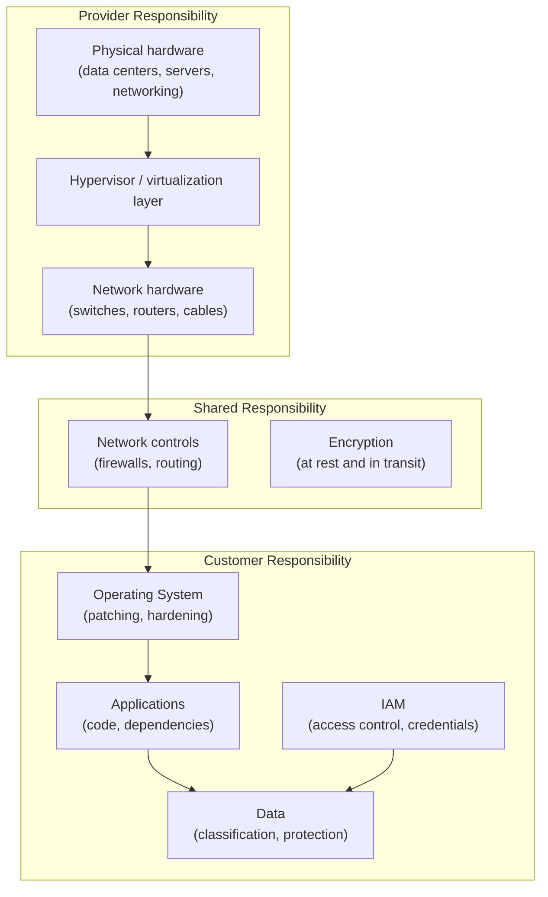
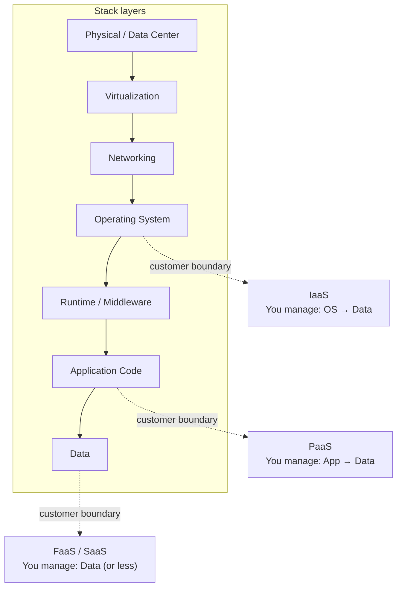
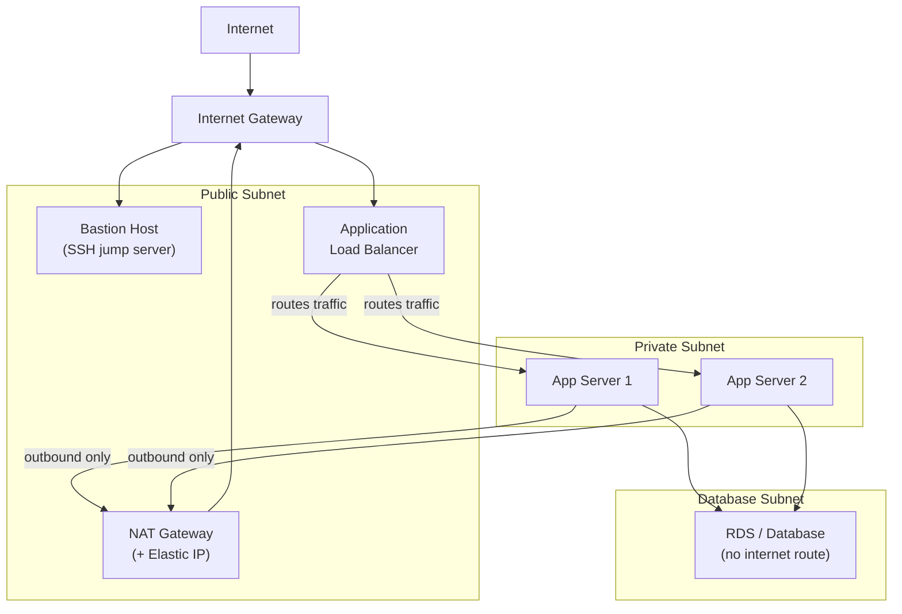
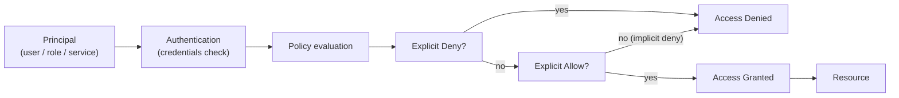
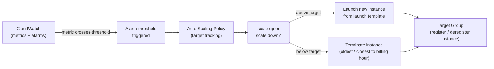

# Module 07: Cloud Fundamentals

> Part of the [DevOps Career Course](./README.md) by UncleJS

[](https://creativecommons.org/licenses/by-nc-sa/4.0/)      

**Prerequisites:** Modules 01–04.

**Time:** About 8 hours, including the labs.

**Lab:** Cloud labs need an account and include teardown. They are not run in this course's CI.

---

## Table of Contents

- [Overview](#overview)
- [Learning Objectives](#learning-objectives)
- [Beginner: Cloud Computing Concepts](#beginner-cloud-computing-concepts)
- [Beginner: Cloud Service Models](#beginner-cloud-service-models)
- [Intermediate: Compute Services](#intermediate-compute-services)
- [Intermediate: Storage Services](#intermediate-storage-services)
- [Intermediate: Networking in the Cloud](#intermediate-networking-in-the-cloud)
- [Intermediate: Databases in the Cloud](#intermediate-databases-in-the-cloud)
- [Intermediate: Cloud CLI Tools](#intermediate-cloud-cli-tools)
- [Intermediate: Cloud Cost Management](#intermediate-cloud-cost-management)
- [Advanced: Advanced VPC Networking](#advanced-advanced-vpc-networking)
- [Advanced: Container Registries](#advanced-container-registries)
- [Hands-On Labs](#hands-on-labs)
- [Further Reading](#further-reading)

---

## Overview

Cloud computing is the backbone of modern DevOps. Instead of buying and managing physical servers, you provision infrastructure on-demand from a provider — pay for what you use, scale in minutes, and access global infrastructure from an API.

This module is cloud-agnostic: we cover concepts that apply across all providers, then show the equivalent service in AWS, Azure, and GCP side-by-side.


```mermaid
flowchart TD
    subgraph "Provider Responsibility"
        PHYS["Physical hardware<br/>(data centers, servers, networking)"]
        HV["Hypervisor / virtualization layer"]
        NETHW["Network hardware<br/>(switches, routers, cables)"]
    end
    subgraph "Shared Responsibility"
        NETCTRL["Network controls<br/>(firewalls, routing)"]
        ENC["Encryption<br/>(at rest and in transit)"]
    end
    subgraph "Customer Responsibility"
        OS["Operating System<br/>(patching, hardening)"]
        APPS["Applications<br/>(code, dependencies)"]
        DATA["Data<br/>(classification, protection)"]
        IAM["IAM<br/>(access control, credentials)"]
    end
    PHYS --> HV --> NETHW
    NETHW --> NETCTRL
    NETCTRL --> OS
    OS --> APPS
    APPS --> DATA
    IAM --> DATA
```

[↑ Back to TOC](#table-of-contents)

---

## Learning Objectives

By the end of this module you will be able to:

- Launch an EC2 instance and wait until the status checks pass
- Create an S3 bucket and copy an object into it
- Attach an IAM role that an EC2 instance can use
- Create an RDS PostgreSQL instance and connect with `psql`
- Deploy an AWS Lambda function URL
- Push an image to ECR

[↑ Back to TOC](#table-of-contents)

---

## Beginner: Cloud Computing Concepts

Cloud computing represents a fundamental shift in how teams think about infrastructure. The traditional model required capacity planning: you estimated peak demand, bought hardware to cover it, and then watched that hardware sit mostly idle during off-peak hours while you still paid for it. If you underestimated, you had an outage. If you overestimated, you wasted capital. Either way, the decision had to be made weeks or months before the traffic arrived.

The cloud model replaces that constraint with elastic provisioning. You request compute capacity when you need it and release it when you do not. A web application can scale from two instances to two hundred in minutes and scale back down overnight when traffic drops — paying only for what it actually used. That operational model changes how teams think about availability: instead of guarding a fixed pool of servers, you design systems that assume individual components are disposable and build resilience through redundancy and automation.

This shift also changes how cost and risk interact. In the traditional model, infrastructure investment came first and capacity determined what applications could do. In the cloud model, infrastructure spending follows demand and can be tuned incrementally. That changes the conversation between engineering and finance, enables faster experiments, and removes the organizational excuse of "we do not have enough servers" as a barrier to trying something new.

### Why Cloud?

| Traditional (On-Premises) | Cloud |
|---|---|
| Buy hardware upfront | Pay as you go |
| Months to provision | Minutes to provision |
| Fixed capacity | Infinite scale on demand |
| You maintain hardware | Provider maintains hardware |
| Single region | Global availability |

### Deployment Models

| Model | Description | Who Manages Hardware |
|---|---|---|
| **Public Cloud** | Shared infrastructure by provider (AWS, Azure, GCP) | Provider |
| **Private Cloud** | Dedicated infrastructure for one org | You (or co-lo) |
| **Hybrid Cloud** | Mix of public and private | Both |
| **Multi-Cloud** | Use multiple public cloud providers | Multiple providers |

[↑ Back to TOC](#table-of-contents)

---

## Beginner: Cloud Service Models

| Model | You Manage | Provider Manages | Examples |
|---|---|---|---|
| **IaaS** (Infrastructure as a Service) | OS, apps, data | Hardware, virtualization, network | EC2, Azure VMs, GCE |
| **PaaS** (Platform as a Service) | Apps, data | OS, runtime, middleware, hardware | AWS Elastic Beanstalk, Azure App Service, GCP App Engine |
| **SaaS** (Software as a Service) | Your data only | Everything | Gmail, Salesforce, GitHub |
| **FaaS** (Functions as a Service) | Code only | Everything else | AWS Lambda, Azure Functions, GCP Cloud Functions |
| **Managed Kubernetes** | Workloads, plus node groups, addons, and upgrades unless you use Fargate or Autopilot | Control plane | EKS, AKS, GKE |


```mermaid
flowchart TD
    subgraph "Stack layers"
        PHY["Physical / Data Center"]
        VIRT["Virtualization"]
        NET["Networking"]
        OS["Operating System"]
        RT["Runtime / Middleware"]
        APP["Application Code"]
        DAT["Data"]
    end
    PHY --> VIRT --> NET --> OS --> RT --> APP --> DAT

    IAAS["IaaS<br/>You manage: OS → Data"]
    PAAS["PaaS<br/>You manage: App → Data"]
    FAAS["FaaS / SaaS<br/>You manage: Data (or less)"]

    OS -.->|"customer boundary"| IAAS
    APP -.->|"customer boundary"| PAAS
    DAT -.->|"customer boundary"| FAAS
```

[↑ Back to TOC](#table-of-contents)

---

## Beginner: The Big Three — AWS, Azure, GCP

### Market Position (2026)

| Provider | Market Share | Strengths |
|---|---|---|
| **AWS** (Amazon Web Services) | ~31% | Broadest service catalog, most job postings |
| **Microsoft Azure** | ~25% | Strong enterprise/Microsoft integration |
| **Google Cloud (GCP)** | ~12% | Kubernetes (invented it), data/ML, pricing |

### Equivalent Services Cross-Reference

| Category | AWS | Azure | GCP |
|---|---|---|---|
| **Virtual Machines** | EC2 | Virtual Machines | Compute Engine |
| **Kubernetes** | EKS | AKS | GKE |
| **Serverless Functions** | Lambda | Azure Functions | Cloud Functions |
| **Object Storage** | S3 | Blob Storage | Cloud Storage |
| **Block Storage** | EBS | Managed Disks | Persistent Disk |
| **File Storage** | EFS | Azure Files | Filestore |
| **Managed PostgreSQL** | RDS (PostgreSQL) | Azure Database for PostgreSQL | Cloud SQL |
| **NoSQL Database** | DynamoDB | Cosmos DB | Firestore / Bigtable |
| **VPC Networking** | VPC | Virtual Network (VNet) | VPC |
| **Load Balancer** | ELB/ALB/NLB | Azure Load Balancer / App Gateway | Cloud Load Balancing |
| **DNS** | Route 53 | Azure DNS | Cloud DNS |
| **CDN** | CloudFront | Azure CDN | Cloud CDN |
| **IAM** | IAM | Azure AD / Entra ID | Cloud IAM |
| **Secrets** | Secrets Manager | Key Vault | Secret Manager |
| **Container Registry** | ECR | Azure Container Registry | Artifact Registry |
| **CI/CD** | CodePipeline | Azure DevOps | Cloud Build |
| **Monitoring** | CloudWatch | Azure Monitor | Cloud Monitoring |
| **Logging** | CloudWatch Logs | Log Analytics | Cloud Logging |

[↑ Back to TOC](#table-of-contents)

---

## Intermediate: Compute Services

### AWS EC2

```bash
# Look up a current Ubuntu 24.04 AMI. Do not paste an old ami- id from a tutorial.
AMI_ID=$(aws ec2 describe-images \
  --owners 099720109477 \
  --filters "Name=name,Values=ubuntu/images/hvm-ssd-gp3/ubuntu-noble-24.04-amd64-server-*" \
            "Name=architecture,Values=x86_64" \
            "Name=state,Values=available" \
  --query 'sort_by(Images, &CreationDate)[-1].ImageId' \
  --output text)
echo "$AMI_ID"

# Launch an instance via AWS CLI
aws ec2 run-instances \
  --image-id "$AMI_ID" \
  --instance-type t3.micro \
  --key-name my-keypair \
  --security-group-ids sg-12345678 \
  --subnet-id subnet-12345678 \
  --tag-specifications 'ResourceType=instance,Tags=[{Key=Name,Value=webserver}]'

# List running instances
aws ec2 describe-instances --filters "Name=instance-state-name,Values=running" \
  --query 'Reservations[].Instances[].[InstanceId,PublicIpAddress,Tags[?Key==`Name`].Value|[0]]' \
  --output table

# Stop / start / terminate
aws ec2 stop-instances --instance-ids i-1234567890abcdef0
aws ec2 start-instances --instance-ids i-1234567890abcdef0
aws ec2 terminate-instances --instance-ids i-1234567890abcdef0
```

### Azure VMs

```bash
# Create a resource group
az group create --name myRG --location eastus

# Create a VM (Ubuntu 24.04 LTS)
az vm create \
  --resource-group myRG \
  --name myVM \
  --image Ubuntu2404 \
  --admin-username azureuser \
  --generate-ssh-keys \
  --size Standard_B1s

# List VMs
az vm list --output table

# Open a port
az vm open-port --port 80 --resource-group myRG --name myVM

# Stop / deallocate / delete
az vm deallocate --resource-group myRG --name myVM
az vm delete --resource-group myRG --name myVM
```

### GCP Compute Engine

```bash
# Create a VM (Ubuntu 24.04 LTS)
gcloud compute instances create webserver \
  --machine-type=e2-micro \
  --image-family=ubuntu-2404-lts \
  --image-project=ubuntu-os-cloud \
  --zone=us-central1-a \
  --tags=http-server

# List instances
gcloud compute instances list

# SSH into instance
gcloud compute ssh webserver --zone=us-central1-a

# Stop / delete
gcloud compute instances stop webserver --zone=us-central1-a
gcloud compute instances delete webserver --zone=us-central1-a
```

[↑ Back to TOC](#table-of-contents)

---

## Intermediate: Storage Services

### Object Storage (S3 / Blob / GCS)

Object storage is for unstructured data: backups, logs, static files, build artifacts.

S3 Block Public Access is on by default for new buckets, and ACLs are usually disabled. A `public-read` ACL fails. Keep the bucket private and share a presigned URL. Turning Block Public Access off is a deliberate choice you reverse before you delete the bucket. The lab below uses the private bucket.

```bash
# AWS S3 — bucket name must be globally unique
aws s3 mb s3://my-unique-bucket-name
aws s3 ls
aws s3 ls s3://my-bucket/
aws s3 cp file.txt s3://my-bucket/
aws s3 cp s3://my-bucket/file.txt ./
aws s3 sync ./local-folder s3://my-bucket/folder/
aws s3 rm s3://my-bucket/file.txt
aws s3 presign s3://my-bucket/file.txt --expires-in 300
aws s3 rb s3://my-bucket --force

# Azure Blob Storage
az storage account create --name mystorageaccount --resource-group myRG --location eastus --sku Standard_LRS
az role assignment create \
  --role "Storage Blob Data Contributor" \
  --assignee "$(az account show --query user.name --output tsv)" \
  --scope "$(az storage account show --name mystorageaccount --resource-group myRG --query id --output tsv)"
az storage container create --name mycontainer --account-name mystorageaccount --auth-mode login
az storage blob upload --file ./file.txt --container-name mycontainer --name file.txt --account-name mystorageaccount --auth-mode login
az storage blob list --container-name mycontainer --account-name mystorageaccount --auth-mode login --output table

# GCP Cloud Storage
gcloud storage buckets create gs://my-unique-bucket-name
gcloud storage ls
gcloud storage cp file.txt gs://my-bucket/
gcloud storage cp gs://my-bucket/file.txt ./
gcloud storage rsync -r ./local gs://my-bucket/
gcloud storage rm gs://my-bucket/file.txt
```

[↑ Back to TOC](#table-of-contents)

---

## Intermediate: Networking in the Cloud

A VPC (Virtual Private Cloud) is a software-defined network you own within a cloud provider's infrastructure. The provider's physical network is shared, but your VPC gives you isolated address space, routing, and firewall rules. Think of it as your data center's network — except it is defined through API calls and JSON, not by physically plugging in cables.

The public/private subnet separation is the foundational security pattern for cloud architecture. Resources in a **public subnet** have a route to an internet gateway, so the internet can open inbound connections to them when security groups and network ACLs allow it. A **private subnet** has no route from an internet gateway, so the internet cannot initiate inbound connections to those addresses. Application servers and databases belong in private subnets. Load balancers and bastion hosts belong in public subnets. A private subnet does not, by itself, block outbound internet. A NAT gateway still allows outbound connections. Stopping egress is a separate control: leave off the default route, or add an egress filter.

A **NAT Gateway** (or NAT instance) gives private subnets outbound internet. Application servers there need to pull software updates, reach external APIs, and download container images, while remaining closed to unsolicited inbound connections. The NAT gateway sits in a public subnet, holds an Elastic IP, and translates addresses so replies to outbound connections return correctly. Nothing on the internet can open a new connection through that NAT path. This pattern is ubiquitous in production cloud architecture.


```mermaid
flowchart TD
    INET["Internet"]
    IGW["Internet Gateway"]
    subgraph "Public Subnet"
        BASTION["Bastion Host<br/>(SSH jump server)"]
        NAT["NAT Gateway<br/>(+ Elastic IP)"]
        ALB["Application<br/>Load Balancer"]
    end
    subgraph "Private Subnet"
        APP1["App Server 1"]
        APP2["App Server 2"]
    end
    subgraph "Database Subnet"
        DB["RDS / Database<br/>(no internet route)"]
    end

    INET --> IGW
    IGW --> BASTION
    IGW --> ALB
    ALB -->|"routes traffic"| APP1
    ALB -->|"routes traffic"| APP2
    APP1 -->|"outbound only"| NAT
    APP2 -->|"outbound only"| NAT
    NAT --> IGW
    APP1 --> DB
    APP2 --> DB
```

### VPC Concepts

A VPC (Virtual Private Cloud) is your isolated private network in the cloud.

```
VPC: 10.0.0.0/16
├── Public Subnet:  10.0.1.0/24  (has route to Internet Gateway)
│   └── Web servers, load balancers
├── Private Subnet: 10.0.2.0/24  (no inbound route from the internet; NAT can still allow outbound)
│   └── App servers, databases
└── Database Subnet: 10.0.3.0/24 (private, restricted)
    └── RDS, ElastiCache
```

```bash
# AWS VPC
aws ec2 create-vpc --cidr-block 10.0.0.0/16
aws ec2 create-subnet --vpc-id vpc-12345 --cidr-block 10.0.1.0/24 --availability-zone us-east-1a

# Security Group (firewall for EC2 instances)
aws ec2 create-security-group --group-name web-sg --description "Web SG" --vpc-id vpc-12345
aws ec2 authorize-security-group-ingress --group-id sg-12345 --protocol tcp --port 80 --cidr 0.0.0.0/0
aws ec2 authorize-security-group-ingress --group-id sg-12345 --protocol tcp --port 22 --cidr your.ip/32

# GCP VPC
gcloud compute networks create my-vpc --subnet-mode=custom
gcloud compute networks subnets create my-subnet \
  --network=my-vpc \
  --range=10.0.1.0/24 \
  --region=us-central1

# GCP Firewall rule
gcloud compute firewall-rules create allow-http \
  --network=my-vpc \
  --allow=tcp:80 \
  --source-ranges=0.0.0.0/0
```

[↑ Back to TOC](#table-of-contents)

---

## Intermediate: Identity & Access Management (IAM)

IAM is the authorization system that determines who can do what to which cloud resources. Getting IAM right is one of the most impactful security decisions in a cloud environment, because IAM misconfiguration is consistently one of the top causes of cloud security incidents.

The **principle of least privilege** means granting only the permissions that are actually needed, on only the resources they apply to, for only the time period required. In practice, this means avoiding wildcard actions (`*`), scoping resources explicitly rather than using `*` in the Resource field, and preferring time-limited or role-based access over long-lived credentials. **Instance profiles** (AWS) and **managed identities** (Azure) are the right mechanism for giving applications access to cloud services: they deliver short-lived credentials automatically without any secret to store, rotate, or accidentally commit to Git.

IAM **policy evaluation** follows a strict precedence order that matters operationally. An explicit **Deny** in any policy overrides any number of Allow statements — it wins unconditionally. Without any matching policy, access is **denied by default** (the implicit deny). An explicit **Allow** permits access only when no Deny statement applies. Understanding this order prevents a common confusion: adding an Allow policy to a user and being surprised that they still cannot do something because a Service Control Policy (SCP) or permission boundary contains an explicit Deny for that action. When debugging IAM access problems, start by looking for explicit denies before assuming allows are missing.


```mermaid
flowchart LR
    PRINC["Principal<br/>(user / role / service)"]
    AUTHN["Authentication<br/>(credentials check)"]
    EVAL["Policy evaluation"]
    DENY["Explicit Deny?"]
    ALLOW["Explicit Allow?"]
    BLOCK["Access Denied"]
    GRANT["Access Granted"]
    RES["Resource"]

    PRINC --> AUTHN
    AUTHN --> EVAL
    EVAL --> DENY
    DENY -->|"yes"| BLOCK
    DENY -->|"no"| ALLOW
    ALLOW -->|"yes"| GRANT
    ALLOW -->|"no (implicit deny)"| BLOCK
    GRANT --> RES
```

IAM controls **who** can do **what** on **which resources**.

### Core IAM Concepts

| Concept | AWS | Azure | GCP |
|---|---|---|---|
| **User** | IAM User | Microsoft Entra ID User | Google Account |
| **Group** | IAM Group | Microsoft Entra ID Group | Google Group |
| **Role** | IAM Role | Azure Role | IAM Role |
| **Policy/Permission** | IAM Policy | Role Definition | IAM Binding |
| **Service Identity** | IAM Role (for EC2) | Managed Identity | Service Account |

### AWS IAM Example

```bash
# Create an IAM user
aws iam create-user --user-name devops-user

# Attach a policy
aws iam attach-user-policy \
  --user-name devops-user \
  --policy-arn arn:aws:iam::aws:policy/AmazonS3ReadOnlyAccess

# Create an IAM role for EC2 (service identity)
aws iam create-role \
  --role-name ec2-s3-role \
  --assume-role-policy-document file://trust-policy.json

# List users
aws iam list-users
```

### IAM Best Practices

1. **Principle of Least Privilege** — grant only the permissions needed
2. **Never use root account** for day-to-day tasks
3. **Use roles, not users** for applications and services
4. **Enable MFA** for all human users
5. **Rotate credentials regularly** — access keys, passwords
6. **Use service accounts/managed identities** instead of hardcoded credentials

[↑ Back to TOC](#table-of-contents)

---

## Intermediate: Databases in the Cloud

Cloud-managed databases eliminate the overhead of installation, patching, backups, and replication.

```bash
# AWS RDS (PostgreSQL). Set DB_PASSWORD in the environment. Do not hardcode it.
# Query available 16.x versions, then pass the major version. A pinned minor may already be withdrawn.
aws rds describe-db-engine-versions \
  --engine postgres \
  --query 'DBEngineVersions[?starts_with(EngineVersion, `16.`)].EngineVersion' \
  --output text

aws rds create-db-instance \
  --db-instance-identifier mydb \
  --db-instance-class db.t3.micro \
  --engine postgres \
  --engine-version 16 \
  --master-username admin \
  --master-user-password "${DB_PASSWORD}" \
  --allocated-storage 20 \
  --vpc-security-group-ids sg-12345 \
  --no-publicly-accessible

# Azure Database for PostgreSQL. Set DB_PASSWORD in the environment. Do not hardcode it.
az postgres flexible-server create \
  --resource-group myRG \
  --name mypostgres \
  --admin-user admin \
  --admin-password "${DB_PASSWORD}" \
  --sku-name Standard_B1ms \
  --tier Burstable \
  --version 16

# GCP Cloud SQL
gcloud sql instances create mydb \
  --database-version=POSTGRES_16 \
  --tier=db-f1-micro \
  --region=us-central1

gcloud sql databases create appdb --instance=mydb
gcloud sql users create admin --instance=mydb --password="${DB_PASSWORD}"   # Never hardcode — use a secret or env var
```

[↑ Back to TOC](#table-of-contents)

---

## Intermediate: Cloud CLI Tools

### AWS CLI Setup

```bash
# Install
curl "https://awscli.amazonaws.com/awscli-exe-linux-x86_64.zip" -o "awscliv2.zip"
unzip awscliv2.zip && sudo ./aws/install

# Configure
aws configure
# Prompts for: Access Key ID, Secret Access Key, Region, Output format

# Test
aws sts get-caller-identity

# Use named profiles
aws configure --profile production
aws s3 ls --profile production
export AWS_PROFILE=production
```

### Azure CLI Setup

```bash
# Install
curl -sL https://aka.ms/InstallAzureCLIDeb | sudo bash

# Login
az login                            # Opens browser
az login --service-principal ...   # For automation

# Set subscription
az account list --output table
az account set --subscription "My Subscription"

# Test
az account show
```

### gcloud CLI Setup

```bash
# Install
curl https://sdk.cloud.google.com | bash
exec -l $SHELL

# Initialize
gcloud init

# Login
gcloud auth login
gcloud auth application-default login   # For SDKs/tools

# Set project
gcloud config set project my-project-id

# Test
gcloud config list
```

[↑ Back to TOC](#table-of-contents)

---

## Intermediate: Cloud Cost Management

### Key Principles

1. **Right-sizing** — use the smallest instance type that meets your needs
2. **Auto-scaling** — scale in when load drops, scale out when load rises
3. **Reserved/Committed use** — commit to 1 or 3 years for 30–70% discounts
4. **Spot/Preemptible/Spot VMs** — up to 90% off for interruptible workloads
5. **Delete unused resources** — stale snapshots, old load balancers, unattached volumes
6. **Storage tiering** — move infrequently accessed data to cheaper storage classes

### Cost Tools

| Tool | Provider | Purpose |
|---|---|---|
| AWS Cost Explorer | AWS | Visualize and analyze spending |
| AWS Budgets | AWS | Set alerts when costs exceed thresholds |
| Azure Cost Management | Azure | Cost analysis and budgets |
| GCP Billing Reports | GCP | Usage and cost reports |
| Infracost | Any (Terraform) | Estimate cost of IaC changes in PRs |

```bash
# AWS — get current month costs
aws ce get-cost-and-usage \
  --time-period Start=$(date -d "first day of month" +%Y-%m-%d),End=$(date +%Y-%m-%d) \
  --granularity MONTHLY \
  --metrics UnblendedCost

# GCP — check billing
gcloud billing accounts list
```

[↑ Back to TOC](#table-of-contents)

---

## Advanced: Serverless & Functions as a Service

Serverless (FaaS) lets you run code without provisioning or managing servers. You pay only for execution time — billed in milliseconds.

Serverless changes the unit of deployment from a long-running process to a function invocation. The cloud provider handles everything below your code: hardware provisioning, OS patching, runtime version management, and scaling to zero when there are no invocations. That operational simplicity is the genuine appeal — a team can deploy business logic without thinking about servers, containers, or scaling policies at all.

The **cold start problem** is the main operational tradeoff. When a function has not been invoked recently, the provider must initialize a new execution environment: pull the runtime, load the function code, and run initialization logic. This can add hundreds of milliseconds to the first invocation — which is usually acceptable for asynchronous workloads but noticeable for user-facing APIs. Provisioned concurrency (AWS) and minimum instances (GCP/Azure) pre-warm execution environments at a cost to eliminate cold starts for latency-sensitive paths.

The **event-driven model** is where serverless fits best and where it changes how you think about architecture. A file upload to S3 triggers a function. A message arriving in a queue triggers a function. A database change triggers a function. This push-based model is different from polling and long-running services, and it is genuinely simpler for event-processing workloads. Where serverless adds complexity rather than removing it is for long-running jobs (functions have maximum execution time limits), stateful workloads, functions with large dependencies, or services that need warm connections to databases. For those patterns, containers usually win.

### AWS Lambda

```bash
# Create a simple Lambda function (Python)
cat > handler.py << 'EOF'
import json

def lambda_handler(event, context):
    qs = event.get("queryStringParameters") or {}
    name = qs.get("name") or event.get("name", "World")
    return {
        "statusCode": 200,
        "headers": {"content-type": "application/json"},
        "body": json.dumps({"message": f"Hello, {name}!"})
    }
EOF

# Package it
zip function.zip handler.py

# Create the Lambda function
aws lambda create-function \
  --function-name hello-world \
  --runtime python3.12 \
  --role arn:aws:iam::123456789012:role/lambda-execution-role \
  --handler handler.lambda_handler \
  --zip-file fileb://function.zip

# Invoke it
aws lambda invoke \
  --function-name hello-world \
  --payload '{"name": "DevOps"}' \
  --cli-binary-format raw-in-base64-out \
  response.json
cat response.json

# Update function code
zip function.zip handler.py
aws lambda update-function-code \
  --function-name hello-world \
  --zip-file fileb://function.zip

# HTTP trigger: create a function URL, then allow public invoke.
# add-permission alone does not create an HTTP endpoint.
aws lambda create-function-url-config \
  --function-name hello-world \
  --auth-type NONE

aws lambda add-permission \
  --function-name hello-world \
  --statement-id FunctionURLAllowPublicAccess \
  --action lambda:InvokeFunctionUrl \
  --principal "*" \
  --function-url-auth-type NONE

FUNCTION_URL=$(aws lambda get-function-url-config \
  --function-name hello-world \
  --query FunctionUrl \
  --output text)
curl "${FUNCTION_URL}?name=DevOps"
```

### Azure Functions

```bash
# Create a Function App
az functionapp create \
  --resource-group myRG \
  --consumption-plan-location eastus \
  --runtime python \
  --runtime-version 3.11 \
  --functions-version 4 \
  --name my-function-app \
  --storage-account mystorageaccount

# Deploy from local project
func azure functionapp publish my-function-app
```

### GCP Cloud Functions

Cloud Run is the 2026 name for this style of HTTP function. `gcloud functions deploy --gen2` builds that Cloud Run service. The 1st-gen deploy path is discontinued. `gcloud functions call` does not invoke an HTTP function; request the URL with curl.

```bash
# Deploy a gen2 HTTP function (Cloud Run)
cat > main.py << 'EOF'
import functions_framework

@functions_framework.http
def hello(request):
    name = request.args.get("name", "World")
    return f"Hello, {name}!"
EOF
echo 'functions-framework==3.*' > requirements.txt

gcloud functions deploy hello \
  --gen2 \
  --runtime python312 \
  --region us-central1 \
  --source . \
  --entry-point hello \
  --trigger-http \
  --allow-unauthenticated

FUNCTION_URL=$(gcloud functions describe hello \
  --gen2 \
  --region us-central1 \
  --format='value(serviceConfig.uri)')
curl "${FUNCTION_URL}?name=DevOps"
```

### When to use serverless

| Use case | Good fit? |
|---|---|
| Webhooks / event processing | ✅ Excellent |
| Scheduled jobs / cron tasks | ✅ Good |
| API backends with variable traffic | ✅ Good |
| Long-running batch jobs (> 15 min) | ❌ Poor — use containers |
| Stateful workloads | ❌ Poor — functions are stateless |
| Low-latency requirements (cold start) | ⚠️ Provisioned concurrency helps |

[↑ Back to TOC](#table-of-contents)

---

## Advanced: Auto Scaling & High Availability Groups

Auto Scaling automatically adjusts compute capacity based on demand — scaling out under load and scaling in when idle.


```mermaid
flowchart LR
    CW["CloudWatch<br/>(metrics + alarms)"]
    ALARM["Alarm threshold<br/>triggered"]
    POL["Auto Scaling Policy<br/>(target tracking)"]
    DEC["scale up or<br/>scale down?"]
    LAUNCH["Launch new instance<br/>from launch template"]
    TERM["Terminate instance<br/>(oldest / closest to billing hour)"]
    TG["Target Group<br/>(register / deregister instance)"]

    CW -->|"metric crosses threshold"| ALARM
    ALARM --> POL
    POL --> DEC
    DEC -->|"above target"| LAUNCH
    DEC -->|"below target"| TERM
    LAUNCH --> TG
    TERM --> TG
```

### AWS Auto Scaling Groups (ASG)

```bash
# Ubuntu 24.04 AMI. The user data below runs apt. Amazon Linux uses dnf.
AMI_ID=$(aws ec2 describe-images \
  --owners 099720109477 \
  --filters "Name=name,Values=ubuntu/images/hvm-ssd-gp3/ubuntu-noble-24.04-amd64-server-*" \
            "Name=architecture,Values=x86_64" \
            "Name=state,Values=available" \
  --query 'sort_by(Images, &CreationDate)[-1].ImageId' \
  --output text)

# Create a launch template
aws ec2 create-launch-template \
  --launch-template-name web-lt \
  --launch-template-data "{
    \"ImageId\": \"${AMI_ID}\",
    \"InstanceType\": \"t3.micro\",
    \"SecurityGroupIds\": [\"sg-12345678\"],
    \"UserData\": \"IyEvYmluL2Jhc2gKYXB0LWdldCB1cGRhdGUKYXB0LWdldCBpbnN0YWxsIC15IG5naW54\"
  }"

# Create an Auto Scaling Group
aws autoscaling create-auto-scaling-group \
  --auto-scaling-group-name web-asg \
  --launch-template LaunchTemplateName=web-lt,Version='$Latest' \
  --min-size 2 \
  --max-size 10 \
  --desired-capacity 2 \
  --vpc-zone-identifier "subnet-abc123,subnet-def456" \
  --health-check-type EC2

# Attach to a load balancer target group
aws autoscaling attach-load-balancer-target-groups \
  --auto-scaling-group-name web-asg \
  --target-group-arns arn:aws:elasticloadbalancing:us-east-1:123456789012:targetgroup/my-tg/abc123

aws autoscaling update-auto-scaling-group \
  --auto-scaling-group-name web-asg \
  --health-check-type ELB \
  --health-check-grace-period 300

# Create a scaling policy (target tracking — CPU at 60%)
aws autoscaling put-scaling-policy \
  --auto-scaling-group-name web-asg \
  --policy-name cpu-target-tracking \
  --policy-type TargetTrackingScaling \
  --target-tracking-configuration '{
    "PredefinedMetricSpecification": {
      "PredefinedMetricType": "ASGAverageCPUUtilization"
    },
    "TargetValue": 60.0
  }'

# Manually scale
aws autoscaling set-desired-capacity \
  --auto-scaling-group-name web-asg \
  --desired-capacity 5
```

### GCP Managed Instance Groups (MIG)

```bash
# Create an instance template
gcloud compute instance-templates create web-template \
  --machine-type=e2-micro \
  --image-family=ubuntu-2404-lts \
  --image-project=ubuntu-os-cloud \
  --tags=http-server \
  --metadata=startup-script='#!/bin/bash
    apt-get update && apt-get install -y nginx'

# Create a regional managed instance group with autoscaling
gcloud compute instance-groups managed create web-mig \
  --base-instance-name=web \
  --template=web-template \
  --size=2 \
  --region=us-central1

# Configure autoscaling
gcloud compute instance-groups managed set-autoscaling web-mig \
  --region=us-central1 \
  --max-num-replicas=10 \
  --min-num-replicas=2 \
  --target-cpu-utilization=0.6 \
  --cool-down-period=90
```

[↑ Back to TOC](#table-of-contents)

---

## Advanced: Advanced VPC Networking

### NAT Gateway — outbound internet for private subnets

A private subnet has no inbound route from the internet. A **NAT Gateway** in the public subnet still allows outbound traffic from that subnet, and it does not accept unsolicited inbound connections. Egress filtering is a separate control if you also need to block outbound traffic.

As VPCs multiply across accounts and regions, connecting them requires choosing the right mechanism. **VPC peering** is a direct, low-latency connection between two VPCs — it is simple and cheap for a small number of pairs. The scaling problem is that peering is not transitive: if VPC A peers with VPC B and VPC B peers with VPC C, VPC A cannot reach VPC C through that chain. With dozens of VPCs, the number of peering connections grows quadratically and becomes unmanageable. **Transit Gateway** solves this by acting as a hub: every VPC connects to the Transit Gateway once, and routing between any two VPCs is handled through the hub. This adds a fixed cost and a hop, but it is far more operable at scale.

**Private endpoints** (VPC Endpoints in AWS, Private Service Connect in GCP) keep traffic to cloud services entirely within the provider's backbone network without traversing the public internet. Without a private endpoint, your application servers in a private subnet accessing S3 have traffic leave the VPC via the NAT gateway and travel over the public internet — exposing metadata about your data flows and costing NAT gateway data-processing fees. A gateway endpoint for S3 or DynamoDB adds a route directly in the route table at no charge. Interface endpoints for other services (Secrets Manager, ECR, KMS) provision an elastic network interface in your subnet so DNS for the service resolves to a private IP. In regulated environments, private endpoints are often mandatory for compliance — data in transit must never touch the public internet.

```bash
# AWS — create a NAT Gateway
aws ec2 allocate-address --domain vpc   # Get an Elastic IP
aws ec2 create-nat-gateway \
  --subnet-id subnet-public-12345 \
  --allocation-id eipalloc-12345678

# Add a route in the private subnet's route table
aws ec2 create-route \
  --route-table-id rtb-private-12345 \
  --destination-cidr-block 0.0.0.0/0 \
  --nat-gateway-id nat-12345678abcdef0
```

```bash
# GCP — Cloud NAT
gcloud compute routers create my-router \
  --network=my-vpc \
  --region=us-central1

gcloud compute routers nats create my-nat \
  --router=my-router \
  --region=us-central1 \
  --auto-allocate-nat-external-ips \
  --nat-all-subnet-ip-ranges
```

### VPC Peering — connect two VPCs

VPC peering allows private IP communication between two VPCs — within the same account or across accounts.

```bash
# AWS — create a peering connection
aws ec2 create-vpc-peering-connection \
  --vpc-id vpc-aaaa1111 \
  --peer-vpc-id vpc-bbbb2222

# Accept the peering request (from the peer account/region if cross-account)
aws ec2 accept-vpc-peering-connection \
  --vpc-peering-connection-id pcx-12345678

# Add routes in both VPCs
aws ec2 create-route \
  --route-table-id rtb-aaaa1111 \
  --destination-cidr-block 10.1.0.0/16 \
  --vpc-peering-connection-id pcx-12345678
```

### Private Endpoints — access AWS services without internet

Without private endpoints, traffic to S3 or DynamoDB from your VPC traverses the public internet. **VPC Endpoints** (AWS) / **Private Service Connect** (GCP) keep traffic on the AWS backbone.

```bash
# AWS — Gateway endpoint for S3 (free)
aws ec2 create-vpc-endpoint \
  --vpc-id vpc-12345 \
  --service-name com.amazonaws.us-east-1.s3 \
  --route-table-ids rtb-12345

# AWS — Interface endpoint for Secrets Manager (charged per hour)
aws ec2 create-vpc-endpoint \
  --vpc-id vpc-12345 \
  --service-name com.amazonaws.us-east-1.secretsmanager \
  --vpc-endpoint-type Interface \
  --subnet-ids subnet-private-12345 \
  --security-group-ids sg-12345
```

### Full production VPC topology

```
VPC: 10.0.0.0/16
│
├── AZ us-east-1a
│   ├── Public subnet 10.0.1.0/24
│   │   ├── Load Balancer (ALB)
│   │   └── NAT Gateway + Elastic IP
│   ├── Private subnet 10.0.11.0/24 (app servers)
│   └── Database subnet 10.0.21.0/24 (RDS, ElastiCache)
│
└── AZ us-east-1b
    ├── Public subnet 10.0.2.0/24
    │   ├── Load Balancer (ALB)
    │   └── NAT Gateway + Elastic IP
    ├── Private subnet 10.0.12.0/24 (app servers)
    └── Database subnet 10.0.22.0/24 (RDS Multi-AZ standby)

Route tables:
  Public subnets → Internet Gateway (0.0.0.0/0)
  Private subnets → NAT Gateway in same AZ (0.0.0.0/0)
  Database subnets → No internet route (isolated)

VPC Endpoints:
  S3 Gateway Endpoint → on private route tables
  Secrets Manager Interface Endpoint → in private subnets
```

[↑ Back to TOC](#table-of-contents)

---

## Advanced: Container Registries

Container registries store and distribute Docker/OCI images. Cloud providers offer managed registries tightly integrated with their compute services.

```bash
# AWS ECR — Elastic Container Registry
# Create a repository
aws ecr create-repository --repository-name myapp --region us-east-1

# Authenticate Docker to ECR
aws ecr get-login-password --region us-east-1 | \
  docker login --username AWS --password-stdin \
  123456789012.dkr.ecr.us-east-1.amazonaws.com

# Tag and push an image
docker tag myapp:latest 123456789012.dkr.ecr.us-east-1.amazonaws.com/myapp:latest
docker push 123456789012.dkr.ecr.us-east-1.amazonaws.com/myapp:latest

# Enable image scanning on push
aws ecr put-image-scanning-configuration \
  --repository-name myapp \
  --image-scanning-configuration scanOnPush=true

# Azure Container Registry (ACR)
az acr create --resource-group myRG --name myregistry --sku Basic
az acr login --name myregistry
docker tag myapp:latest myregistry.azurecr.io/myapp:latest
docker push myregistry.azurecr.io/myapp:latest

# GCP Artifact Registry
gcloud artifacts repositories create myrepo \
  --repository-format=docker \
  --location=us-central1

gcloud auth configure-docker us-central1-docker.pkg.dev

docker tag myapp:latest us-central1-docker.pkg.dev/my-project/myrepo/myapp:latest
docker push us-central1-docker.pkg.dev/my-project/myrepo/myapp:latest
```

[↑ Back to TOC](#table-of-contents)

---

## Tools & Commands Reference

| Tool | Command Example | Purpose |
|---|---|---|
| AWS CLI | `aws ec2 describe-instances` | Manage AWS resources |
| Azure CLI | `az vm list` | Manage Azure resources |
| gcloud | `gcloud compute instances list` | Manage GCP resources |
| `aws s3` | `aws s3 cp file.txt s3://bucket/` | S3 file operations |
| `gcloud storage` | `gcloud storage cp file.txt gs://bucket/` | GCS file operations |
| `aws configure` | — | Set up AWS credentials |
| `az login` | — | Authenticate to Azure |
| `gcloud init` | — | Initialize GCP CLI |
| `aws lambda invoke` | `aws lambda invoke --function-name fn out.json` | Invoke a Lambda function |
| `aws autoscaling` | `aws autoscaling describe-auto-scaling-groups` | Manage ASGs |
| `aws ecr get-login-password` | — | Authenticate Docker to ECR |
| `az acr login` | `az acr login --name myregistry` | Authenticate Docker to ACR |
| `aws ec2 create-nat-gateway` | — | Create a NAT Gateway |
| `aws ec2 create-vpc-peering-connection` | — | Peer two VPCs |

[↑ Back to TOC](#table-of-contents)

---

## Hands-On Labs

These labs need a cloud account and end with teardown. They are not run in this course's CI. Use Ubuntu 24.04. `apt install nginx` is the Ubuntu command. Amazon Linux uses `dnf`.

### Lab 7.1 — First Cloud VM (Ubuntu)

Pick one provider. Each block launches Ubuntu, installs nginx, checks the page, and deletes the VM.

**AWS** (default VPC):

```bash
AMI_ID=$(aws ec2 describe-images \
  --owners 099720109477 \
  --filters "Name=name,Values=ubuntu/images/hvm-ssd-gp3/ubuntu-noble-24.04-amd64-server-*" \
            "Name=architecture,Values=x86_64" \
            "Name=state,Values=available" \
  --query 'sort_by(Images, &CreationDate)[-1].ImageId' \
  --output text)

aws ec2 create-key-pair --key-name lab07-key --query 'KeyMaterial' --output text > lab07-key.pem
chmod 400 lab07-key.pem

SG_ID=$(aws ec2 create-security-group \
  --group-name lab07-web \
  --description "lab07 http and ssh" \
  --query 'GroupId' --output text)
MY_IP="$(curl -fsS https://checkip.amazonaws.com)/32"
aws ec2 authorize-security-group-ingress --group-id "$SG_ID" --protocol tcp --port 22 --cidr "$MY_IP"
aws ec2 authorize-security-group-ingress --group-id "$SG_ID" --protocol tcp --port 80 --cidr 0.0.0.0/0

INSTANCE_ID=$(aws ec2 run-instances \
  --image-id "$AMI_ID" \
  --instance-type t3.micro \
  --key-name lab07-key \
  --security-group-ids "$SG_ID" \
  --tag-specifications 'ResourceType=instance,Tags=[{Key=Name,Value=lab07-web}]' \
  --query 'Instances[0].InstanceId' --output text)

aws ec2 wait instance-running --instance-ids "$INSTANCE_ID"
PUBLIC_IP=$(aws ec2 describe-instances --instance-ids "$INSTANCE_ID" \
  --query 'Reservations[0].Instances[0].PublicIpAddress' --output text)
aws ec2 wait instance-status-ok --instance-ids "$INSTANCE_ID"
ssh -i lab07-key.pem -o StrictHostKeyChecking=accept-new "ubuntu@${PUBLIC_IP}" \
  'sudo apt update && sudo apt install -y nginx'
curl -fsS "http://${PUBLIC_IP}"
```

**Expected:** `echo "$AMI_ID"` prints an `ami-` id from `describe-images`, not a value copied from this page. `curl` prints HTML that contains `Welcome to nginx`.

**Teardown:**

```bash
aws ec2 terminate-instances --instance-ids "$INSTANCE_ID"
aws ec2 wait instance-terminated --instance-ids "$INSTANCE_ID"
aws ec2 delete-security-group --group-id "$SG_ID"
aws ec2 delete-key-pair --key-name lab07-key
rm -f lab07-key.pem
```

**Azure** (Ubuntu 24.04). `az group delete` removes the VM, disk, NIC, and public IP.

```bash
az group create --name lab07-rg --location eastus
az vm create \
  --resource-group lab07-rg \
  --name lab07-web \
  --image Ubuntu2404 \
  --admin-username azureuser \
  --generate-ssh-keys \
  --size Standard_B1s \
  --public-ip-sku Standard
az vm open-port --resource-group lab07-rg --name lab07-web --port 80
PUBLIC_IP=$(az vm show -d --resource-group lab07-rg --name lab07-web --query publicIps --output tsv)
ssh -o StrictHostKeyChecking=accept-new "azureuser@${PUBLIC_IP}" \
  'sudo apt update && sudo apt install -y nginx'
curl -fsS "http://${PUBLIC_IP}"
az group delete --name lab07-rg --yes --no-wait
```

**Expected:** `curl` prints the nginx welcome page. The resource group deletion is accepted.

**GCP:**

```bash
gcloud compute instances create lab07-web \
  --machine-type=e2-micro \
  --image-family=ubuntu-2404-lts \
  --image-project=ubuntu-os-cloud \
  --zone=us-central1-a \
  --tags=lab07-http
gcloud compute firewall-rules create lab07-allow-http \
  --allow=tcp:80 \
  --target-tags=lab07-http \
  --source-ranges=0.0.0.0/0
gcloud compute ssh lab07-web --zone=us-central1-a \
  --command='sudo apt update && sudo apt install -y nginx'
IP=$(gcloud compute instances describe lab07-web --zone=us-central1-a \
  --format='get(networkInterfaces[0].accessConfigs[0].natIP)')
curl -fsS "http://${IP}"
gcloud compute instances delete lab07-web --zone=us-central1-a --quiet
gcloud compute firewall-rules delete lab07-allow-http --quiet
```

**Expected:** `curl` prints the nginx welcome page. Both delete commands succeed.

### Lab 7.2 — Object Storage

Block Public Access is on by default. A `public-read` ACL fails. This lab keeps the bucket private and uses a presigned URL. Disabling Block Public Access is a separate, deliberate step: if you do it, turn the block back on before you delete the bucket.

```bash
ACCOUNT_ID=$(aws sts get-caller-identity --query Account --output text)
BUCKET="lab07-${ACCOUNT_ID}-objects"
aws s3 mb "s3://${BUCKET}"
echo 'hello cloud' > hello.txt
aws s3 cp hello.txt "s3://${BUCKET}/hello.txt"
aws s3 ls "s3://${BUCKET}/"
PRESIGNED=$(aws s3 presign "s3://${BUCKET}/hello.txt" --expires-in 300)
curl -fsS "$PRESIGNED"
aws s3 rb "s3://${BUCKET}" --force
rm -f hello.txt
```

**Expected:** `aws s3 ls` shows `hello.txt`. `curl` prints `hello cloud`. After teardown, `aws s3 ls` does not list `s3://lab07-...-objects`.

### Lab 7.3 — IAM Roles

```bash
aws iam create-user --user-name lab07-reader
aws iam attach-user-policy \
  --user-name lab07-reader \
  --policy-arn arn:aws:iam::aws:policy/AmazonS3ReadOnlyAccess
read -r KEY_ID SECRET < <(aws iam create-access-key --user-name lab07-reader \
  --query 'AccessKey.[AccessKeyId,SecretAccessKey]' --output text)
aws configure set aws_access_key_id "$KEY_ID" --profile lab07-reader
aws configure set aws_secret_access_key "$SECRET" --profile lab07-reader
aws configure set region "$(aws configure get region)" --profile lab07-reader
unset SECRET
aws s3 ls --profile lab07-reader
aws s3 mb s3://lab07-reader-should-fail --profile lab07-reader || true
aws iam delete-access-key --user-name lab07-reader --access-key-id "$KEY_ID"
aws iam detach-user-policy \
  --user-name lab07-reader \
  --policy-arn arn:aws:iam::aws:policy/AmazonS3ReadOnlyAccess
aws iam delete-user --user-name lab07-reader
aws configure set aws_access_key_id "" --profile lab07-reader
aws configure set aws_secret_access_key "" --profile lab07-reader
```

**Expected:** `aws s3 ls --profile lab07-reader` lists buckets (or prints nothing). `aws s3 mb` fails with `AccessDenied`. After teardown, `aws iam get-user --user-name lab07-reader` reports that the user does not exist.

### Lab 7.4 — Cloud Database

Pass PostgreSQL 16.x. Install the client, set `ENGINE_VERSION` from the offered 16.x versions, and wait until the instance is deleted.

```bash
sudo apt install -y postgresql-client
ENGINE_VERSION=$(aws rds describe-db-engine-versions \
  --engine postgres \
  --query 'sort(DBEngineVersions[?starts_with(EngineVersion, `16.`)].EngineVersion)[-1]' \
  --output text)

export DB_PASSWORD='Lab07-ChangeMe-1'
aws rds create-db-instance \
  --db-instance-identifier lab07-pg \
  --db-instance-class db.t3.micro \
  --engine postgres \
  --engine-version "$ENGINE_VERSION" \
  --master-username labadmin \
  --master-user-password "${DB_PASSWORD}" \
  --allocated-storage 20 \
  --backup-retention-period 1 \
  --publicly-accessible

aws rds wait db-instance-available --db-instance-identifier lab07-pg
ENDPOINT=$(aws rds describe-db-instances --db-instance-identifier lab07-pg \
  --query 'DBInstances[0].Endpoint.Address' --output text)
SG_ID=$(aws rds describe-db-instances --db-instance-identifier lab07-pg \
  --query 'DBInstances[0].VpcSecurityGroups[0].VpcSecurityGroupId' --output text)
MY_IP="$(curl -fsS https://checkip.amazonaws.com)/32"
aws ec2 authorize-security-group-ingress --group-id "$SG_ID" --protocol tcp --port 5432 --cidr "$MY_IP"
aws rds describe-db-instances --db-instance-identifier lab07-pg \
  --query 'DBInstances[0].BackupRetentionPeriod' --output text
PGPASSWORD="$DB_PASSWORD" psql "host=${ENDPOINT} user=labadmin dbname=postgres sslmode=require" \
  -c 'CREATE DATABASE lab07;'
PGPASSWORD="$DB_PASSWORD" psql "host=${ENDPOINT} user=labadmin dbname=lab07 sslmode=require" \
  -c 'CREATE TABLE notes (id int);'
aws rds delete-db-instance --db-instance-identifier lab07-pg --skip-final-snapshot
aws rds wait db-instance-deleted --db-instance-identifier lab07-pg
```

**Expected:** `ENGINE_VERSION` is a `16.` version from `describe-db-engine-versions`. Backup retention prints `1`. `psql` creates the database and table. `aws rds wait db-instance-deleted` returns after the instance is gone.

### Lab 7.5 — Serverless Function

This creates a function URL. `add-permission` alone is not an HTTP endpoint.

```bash
cat > trust-policy.json << 'EOF'
{
  "Version": "2012-10-17",
  "Statement": [{
    "Effect": "Allow",
    "Principal": {"Service": "lambda.amazonaws.com"},
    "Action": "sts:AssumeRole"
  }]
}
EOF
aws iam create-role --role-name lab07-lambda-role --assume-role-policy-document file://trust-policy.json
aws iam attach-role-policy \
  --role-name lab07-lambda-role \
  --policy-arn arn:aws:iam::aws:policy/service-role/AWSLambdaBasicExecutionRole
ROLE_ARN=$(aws iam get-role --role-name lab07-lambda-role --query 'Role.Arn' --output text)

cat > handler.py << 'EOF'
import json

def lambda_handler(event, context):
    qs = event.get("queryStringParameters") or {}
    name = qs.get("name") or event.get("name", "World")
    return {
        "statusCode": 200,
        "headers": {"content-type": "application/json"},
        "body": json.dumps({"message": f"Hello, {name}!"})
    }
EOF
zip function.zip handler.py
sleep 10
aws lambda create-function \
  --function-name lab07-hello \
  --runtime python3.12 \
  --role "$ROLE_ARN" \
  --handler handler.lambda_handler \
  --zip-file fileb://function.zip
aws lambda wait function-active --function-name lab07-hello
aws lambda create-function-url-config --function-name lab07-hello --auth-type NONE
aws lambda add-permission \
  --function-name lab07-hello \
  --statement-id FunctionURLAllowPublicAccess \
  --action lambda:InvokeFunctionUrl \
  --principal "*" \
  --function-url-auth-type NONE
FUNCTION_URL=$(aws lambda get-function-url-config --function-name lab07-hello --query FunctionUrl --output text)
curl -fsS "${FUNCTION_URL}?name=DevOps"
aws logs tail /aws/lambda/lab07-hello --since 15m --format short || true

aws lambda delete-function --function-name lab07-hello
aws iam detach-role-policy \
  --role-name lab07-lambda-role \
  --policy-arn arn:aws:iam::aws:policy/service-role/AWSLambdaBasicExecutionRole
aws iam delete-role --role-name lab07-lambda-role
rm -f trust-policy.json handler.py function.zip
```

**Expected:** `curl` prints `{"message": "Hello, DevOps!"}`. The log tail shows that invoke once CloudWatch has created the log group. After teardown, `aws lambda get-function --function-name lab07-hello` reports that the function does not exist.

### Lab 7.6 — Container Registry

```bash
mkdir -p lab07-image && cd lab07-image
cat > Dockerfile << 'EOF'
FROM public.ecr.aws/docker/library/nginx:1.27
EOF
docker build -t myapp:v1 .
ACCOUNT_ID=$(aws sts get-caller-identity --query Account --output text)
REGION=$(aws configure get region)
aws ecr create-repository --repository-name lab07-myapp --region "$REGION"
aws ecr put-image-scanning-configuration \
  --repository-name lab07-myapp \
  --image-scanning-configuration scanOnPush=true \
  --region "$REGION"
aws ecr get-login-password --region "$REGION" | \
  docker login --username AWS --password-stdin "${ACCOUNT_ID}.dkr.ecr.${REGION}.amazonaws.com"
docker tag myapp:v1 "${ACCOUNT_ID}.dkr.ecr.${REGION}.amazonaws.com/lab07-myapp:v1"
docker push "${ACCOUNT_ID}.dkr.ecr.${REGION}.amazonaws.com/lab07-myapp:v1"
aws ecr describe-image-scan-findings \
  --repository-name lab07-myapp \
  --image-id imageTag=v1 \
  --region "$REGION" || true
aws ecr delete-repository --repository-name lab07-myapp --region "$REGION" --force
cd .. && rm -rf lab07-image
```

**Expected:** `docker push` finishes with a digest. Scan findings print `COMPLETE` or `IN_PROGRESS` once the scan has started. After teardown, `aws ecr describe-repositories --repository-names lab07-myapp` reports that the repository does not exist.

[↑ Back to TOC](#table-of-contents)

---

## Further Reading

- [AWS Documentation](https://docs.aws.amazon.com/)
- [Azure Documentation](https://learn.microsoft.com/en-us/azure/)
- [Google Cloud Documentation](https://cloud.google.com/docs)
- [AWS Free Tier](https://aws.amazon.com/free/)
- [AWS Lambda Developer Guide](https://docs.aws.amazon.com/lambda/latest/dg/)
- [AWS Auto Scaling User Guide](https://docs.aws.amazon.com/autoscaling/ec2/userguide/)
- [AWS VPC User Guide](https://docs.aws.amazon.com/vpc/latest/userguide/)
- [A Cloud Guru / Linux Academy](https://acloudguru.com/)
- [Glossary: Cloud Provider](./glossary.md#c), [IAM](./glossary.md#i), [VPC](./glossary.md#v), [IaaS](./glossary.md#i)
- **Certification**: AWS Cloud Practitioner, as a concept foundation only.

[↑ Back to TOC](#table-of-contents)
