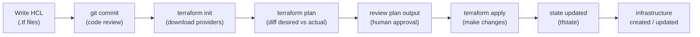
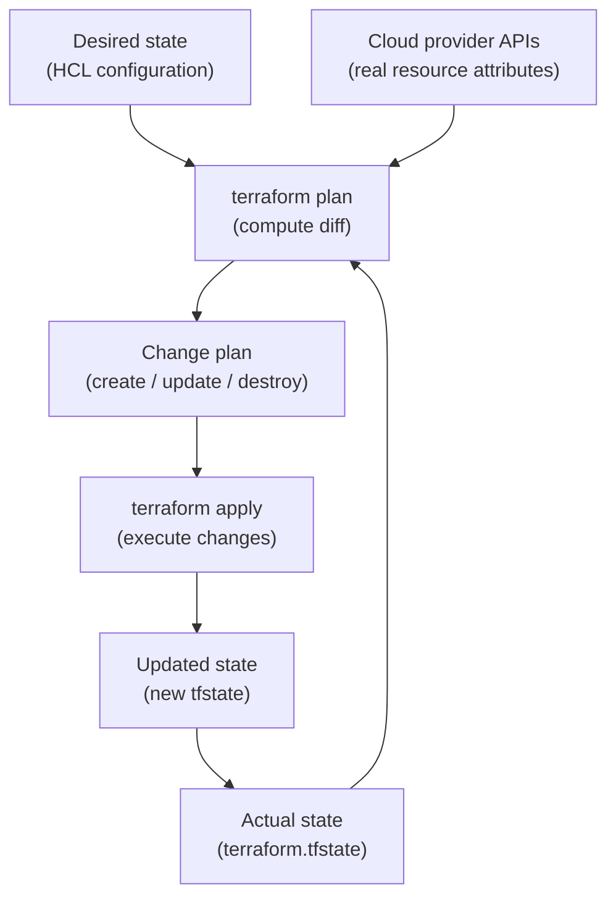
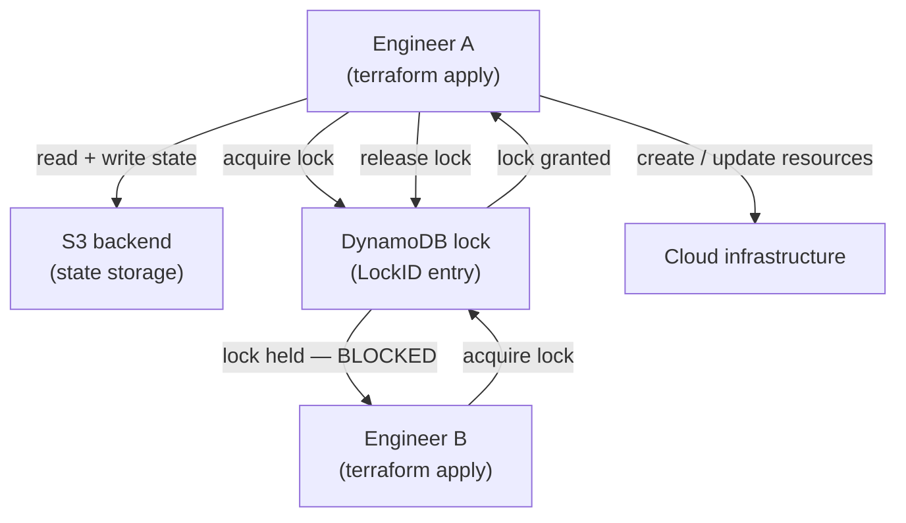
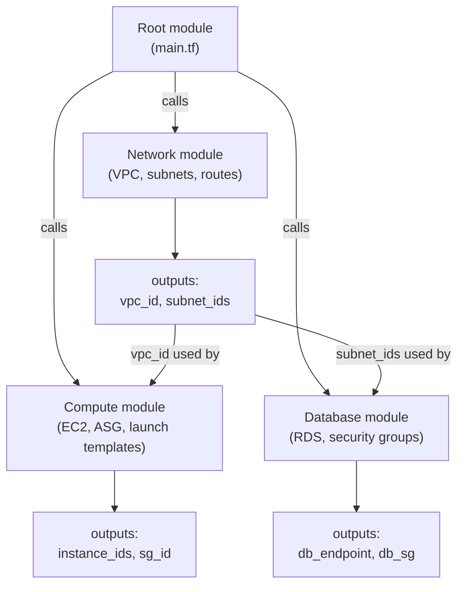
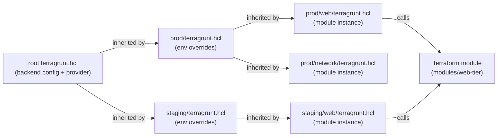

# Module 08: Infrastructure as Code — Terraform & OpenTofu

> Part of the [DevOps Career Course](./README.md) by UncleJS

[](https://creativecommons.org/licenses/by-nc-sa/4.0/)     

---

## Table of Contents

- [Overview](#overview)
- [Learning Objectives](#learning-objectives)
- [Beginner: What is IaC & Why It Matters](#beginner-what-is-iac--why-it-matters)
- [Beginner: Terraform vs OpenTofu — What's the Difference?](#beginner-terraform-vs-opentofu--whats-the-difference)
- [Beginner: Installation](#beginner-installation)
- [Beginner: HCL Language Fundamentals](#beginner-hcl-language-fundamentals)
- [Beginner: The Core Workflow](#beginner-the-core-workflow)
- [Intermediate: Variables, Outputs & Locals](#intermediate-variables-outputs--locals)
- [Intermediate: State Management](#intermediate-state-management)
- [Intermediate: Modules](#intermediate-modules)
- [Intermediate: Providers & Multiple Environments](#intermediate-providers--multiple-environments)
- [Intermediate: Workspaces](#intermediate-workspaces)
- [Intermediate: Testing & Validation](#intermediate-testing--validation)
- [Intermediate: Migrating from Terraform to OpenTofu](#intermediate-migrating-from-terraform-to-opentofu)
- [Advanced: Remote State Backends & Terragrunt](#advanced-remote-state-backends--terragrunt)
- [Tools & Commands Reference](#tools--commands-reference)
- [Hands-On Labs](#hands-on-labs)
- [Further Reading](#further-reading)

---

## Overview

Infrastructure as Code (IaC) means defining your infrastructure — servers, networks, databases, DNS records — in version-controlled configuration files. Instead of clicking through a web console or running manual commands, you write declarative code and let the tool figure out how to make reality match your desired state.

**Terraform** was the dominant open-source IaC tool for years. In 2023, HashiCorp changed Terraform's license from MPL-2.0 to BSL (Business Source License), restricting commercial use. The open-source community forked it as **OpenTofu**, now maintained by the Linux Foundation and hosted under the CNCF.

This module covers both tools — they share 99% of their syntax, and you can use either in practice.



[↑ Back to TOC](#table-of-contents)

---

## Learning Objectives

By the end of this module you will be able to:

- Explain what IaC is and why it matters
- Understand the difference between Terraform and OpenTofu
- Write HCL to provision cloud infrastructure
- Use the core `init`, `plan`, `apply`, `destroy` workflow
- Parameterize configurations with variables and outputs
- Manage remote state safely
- Organize code into reusable modules
- Work with multiple environments (dev/staging/prod)
- Migrate from Terraform to OpenTofu
- Configure remote state backends (S3, GCS, Azure Blob) with locking
- Use Terragrunt to keep IaC DRY across many environments

[↑ Back to TOC](#table-of-contents)

---

## Beginner: What is IaC & Why It Matters

Infrastructure as Code changes infrastructure from a sequence of human clicks into a system you can review, test, version, and repeat. That shift is what makes modern platform work scalable. A single engineer can click through a cloud console and get something working once, but a team cannot reliably operate production environments if the real source of truth lives in memory, screenshots, or tribal knowledge. IaC turns infrastructure into something that behaves more like application code: it can be peer-reviewed, promoted through environments, audited later, and recreated during an outage.

The deeper conceptual shift is that infrastructure becomes a **dependency of your application code**, not a separate concern managed by a different team at a different pace. When infrastructure is code, a developer can open a pull request that changes both the application and the infrastructure it needs, have both reviewed together, and deploy them as a coordinated unit. That eliminates the traditional handoff delay where a developer finishes code and then waits for an operations ticket to provision the environment. It also eliminates environment drift: when staging and production are both defined by the same Terraform modules with different variable values, the gap between environments is explicit and deliberate rather than accidental and invisible.

As you read the next two examples, notice that the real benefit is not just automation. It is predictability. IaC gives you a way to answer hard operational questions: what changed, who changed it, how do we rebuild it, and how do we know staging matches production closely enough to trust our releases. That is why Terraform and OpenTofu matter far beyond provisioning a single VM.

### Before IaC (ClickOps)

- Engineer logs into AWS Console
- Manually creates VPC, subnet, security group, EC2 instance
- Process is undocumented, unrepeatable, error-prone
- A second environment requires doing it all over again manually

### With IaC

```hcl
# This file defines the same infrastructure — repeatable, reviewable, version-controlled
resource "aws_instance" "web" {
  ami           = "ami-0c55b159cbfafe1f0"  # Replace with a current AMI for your region — see: aws ec2 describe-images
  instance_type = "t3.micro"
  tags = {
    Name = "webserver"
  }
}
```

### Benefits

| Benefit | Description |
|---|---|
| **Repeatability** | Same code → same infrastructure, every time |
| **Version control** | Every change tracked in Git, reviewable via PR |
| **Collaboration** | Team works on infrastructure the same way as code |
| **Automation** | Integrate with CI/CD pipelines |
| **Documentation** | Code IS the documentation |
| **Disaster recovery** | Rebuild from scratch in minutes |

[↑ Back to TOC](#table-of-contents)

---

## Beginner: Terraform vs OpenTofu — What's the Difference?

For learners, the most important point is that choosing between Terraform and OpenTofu usually changes less than you think. The day-to-day workflow, the language, the provider ecosystem, and most learning materials remain almost identical. The bigger decision is about governance and ecosystem preference: do you want to stay on the HashiCorp path, or do you want an openly governed fork under the Linux Foundation? In practice, the skills you build in one tool transfer directly to the other.

That means you should focus first on mastering the workflow: write clear configuration, review plans carefully, manage state safely, and structure modules so teams can reuse them. Once those habits are in place, switching binaries is relatively easy. New engineers often over-index on the product comparison and under-invest in the operational discipline that actually determines whether an IaC project succeeds.

| Feature | Terraform | OpenTofu |
|---|---|---|
| **License** | BSL 1.1 (since v1.6 — restricts commercial use) | MPL-2.0 (fully open source) |
| **Maintainer** | HashiCorp / IBM | Linux Foundation / OpenTofu TSC |
| **CLI binary** | `terraform` | `tofu` |
| **Compatible with** | — | Terraform ≤ 1.5.x (100% compatible) |
| **Registry** | registry.terraform.io | registry.opentofu.org |
| **New features** | Continues development | Continues independent development |
| **Community** | Large (existing) | Growing rapidly |

### When to Choose Each

- **Choose Terraform**: Your team already uses it, you use HashiCorp's Terraform Cloud, or you need HCP Vault integrations
- **Choose OpenTofu**: You want fully open-source tooling, avoid BSL restrictions, or are starting fresh

### Syntax Differences

For Terraform ≤ 1.5 compatibility, the syntax is **identical**. Newer OpenTofu-specific features (like `provider_meta`, early `for_each` enhancements) may differ. In practice: **almost everything in this module works with both**.

```bash
# Terraform
terraform init
terraform plan
terraform apply

# OpenTofu (same commands, different binary)
tofu init
tofu plan
tofu apply
```

[↑ Back to TOC](#table-of-contents)

---

## Beginner: Installation

Installation is the smallest part of getting productive with IaC, but it is still worth doing deliberately. Version mismatches between team members can produce confusing behavior, especially when providers or language features move quickly. In real teams, you want everyone running a known-good version, with provider versions pinned and authentication configured before anyone touches a live environment. A clean install reduces noise later when you are trying to decide whether a failed plan is caused by your code, your credentials, or your local toolchain.

### Terraform

```bash
# Ubuntu/Debian
wget -O- https://apt.releases.hashicorp.com/gpg | sudo gpg --dearmor -o /usr/share/keyrings/hashicorp-archive-keyring.gpg
echo "deb [arch=$(dpkg --print-architecture) signed-by=/usr/share/keyrings/hashicorp-archive-keyring.gpg] https://apt.releases.hashicorp.com $(lsb_release -cs) main" | sudo tee /etc/apt/sources.list.d/hashicorp.list
sudo apt update && sudo apt install terraform

terraform version
```

### OpenTofu

```bash
# Ubuntu/Debian — official installer
curl --proto '=https' --tlsv1.2 -fsSL https://get.opentofu.org/install-opentofu.sh | sudo sh -s -- --install-method deb

# Or via GitHub release
TOFU_VERSION="1.7.0"
curl -Lo tofu.zip "https://github.com/opentofu/opentofu/releases/download/v${TOFU_VERSION}/tofu_${TOFU_VERSION}_linux_amd64.zip"
unzip tofu.zip && sudo mv tofu /usr/local/bin/

tofu version
```

[↑ Back to TOC](#table-of-contents)

---

## Beginner: HCL Language Fundamentals

HCL (HashiCorp Configuration Language) is the declarative language used by both Terraform and OpenTofu.

The key mental shift with HCL is that you are describing the desired end state, not writing a step-by-step shell script. You declare resources, relationships, and input values, then the tool figures out the execution order from the dependency graph. That is why references matter so much: they are not just variable substitution, they are the edges that tell Terraform or OpenTofu what must exist before something else can be created.

When beginners struggle with HCL, it is usually because they read it as imperative code. A better way to read it is as a model of a system: providers define which platform you are talking to, resources define what you want created, data sources read what already exists, variables shape the interface, and outputs expose useful results. Once that model clicks, larger configurations become much easier to reason about.

### File Structure

```
project/
├── main.tf          # Main resources
├── variables.tf     # Input variable declarations
├── outputs.tf       # Output value declarations
├── providers.tf     # Provider configuration
├── versions.tf      # Required versions
└── terraform.tfvars # Variable values (gitignored for secrets)
```

### Blocks

```hcl
# Provider block — tells Terraform which cloud to use
terraform {
  required_providers {
    aws = {
      source  = "hashicorp/aws"
      version = "~> 5.0"
    }
  }
  required_version = ">= 1.5.0"
}

provider "aws" {
  region = "us-east-1"
}

# Resource block — creates infrastructure
resource "aws_vpc" "main" {
  cidr_block           = "10.0.0.0/16"
  enable_dns_hostnames = true
  tags = {
    Name        = "main-vpc"
    Environment = "production"
  }
}

# Data source block — reads existing infrastructure
data "aws_ami" "ubuntu" {
  most_recent = true
  owners      = ["099720109477"]  # Canonical
  filter {
    name   = "name"
    values = ["ubuntu/images/hvm-ssd/ubuntu-*-24.04-amd64-server-*"]
  }
}

# Resource referencing another resource
resource "aws_subnet" "public" {
  vpc_id            = aws_vpc.main.id      # Reference: type.name.attribute
  cidr_block        = "10.0.1.0/24"
  availability_zone = "us-east-1a"
}
```

### HCL Data Types

```hcl
# Strings
name = "production"
name = "web-${var.environment}"   # String interpolation

# Numbers
port = 8080
count = 3

# Booleans
enabled = true

# Lists
availability_zones = ["us-east-1a", "us-east-1b", "us-east-1c"]

# Maps
tags = {
  Environment = "production"
  Owner       = "devops-team"
  CostCenter  = "engineering"
}

# Conditionals
instance_type = var.environment == "production" ? "t3.large" : "t3.micro"

# for_each — create multiple resources from a map
resource "aws_s3_bucket" "env_buckets" {
  for_each = toset(["dev", "staging", "prod"])
  bucket   = "myapp-${each.key}-data"
}

# count — create N copies of a resource
resource "aws_instance" "web" {
  count         = 3
  ami           = data.aws_ami.ubuntu.id
  instance_type = "t3.micro"
  tags = {
    Name = "web-${count.index + 1}"
  }
}
```

[↑ Back to TOC](#table-of-contents)

---

## Beginner: The Core Workflow

The core workflow is where IaC becomes operational rather than theoretical. Every command in this loop has a different purpose: `init` prepares the project, `plan` shows intent, `apply` changes reality, and `destroy` tears it down when you are done. Strong teams treat `plan` as a review artifact, not as a formality. If you cannot explain a plan confidently, you are not ready to apply it.

`terraform plan` does more than show a diff. It reads the current state file to learn what Terraform believes already exists, queries the cloud provider APIs to get the real current attributes of each tracked resource, reads your configuration files to know the desired state, then computes a diff between desired and actual. That diff is what the plan shows you. The green plus signs, yellow tildes, and red minus signs each mean something specific: create, in-place update, and destroy respectively. A symbol of `-/+` (destroy and recreate) is the most dangerous output — it means Terraform cannot update the resource in-place and will delete it and create a replacement. Missing that symbol in a careless review is how production databases get accidentally deleted.

The discipline of always reviewing plan output before applying is especially important in CI/CD. `terraform apply -auto-approve` is a valid tool in a pipeline, but it should be gated behind a plan review step, human approval for production, and ideally Sentinel or OPA policy checks that block plans containing forbidden resource types or destructive changes to protected resources. The automation does not remove the need for the review — it requires you to encode the review into the pipeline itself.



```bash
# 1. Initialize — download providers and modules
terraform init      # or: tofu init
# Downloads provider plugins to .terraform/
# Creates .terraform.lock.hcl (pin provider versions)

# 2. Plan — preview changes (dry run)
terraform plan      # or: tofu plan
# Shows what will be created, changed, or destroyed
# Green = create, yellow = modify, red = destroy

# 3. Apply — create/update infrastructure
terraform apply     # or: tofu apply
# Prompts for confirmation unless you use -auto-approve
terraform apply -auto-approve

# 4. Destroy — tear down all resources
terraform destroy   # or: tofu destroy
# DANGEROUS in production — always review carefully

# Other useful commands
terraform fmt                    # Format code to HCL standard
terraform validate               # Check syntax without hitting cloud API
terraform show                   # Show current state in human-readable form
terraform state list             # List all resources in state
terraform output                 # Show output values
```

[↑ Back to TOC](#table-of-contents)

---

## Intermediate: Variables, Outputs & Locals

These three features are what turn a pile of `.tf` files into a reusable system. Variables define the public interface of your configuration. Outputs expose the values that downstream code, other modules, or humans need. Locals help you keep internal logic readable without forcing repetition everywhere. Together, they separate input, implementation, and result.

That separation is what makes modules maintainable. A good module does not expose every internal detail; it exposes the minimum useful knobs and returns the values other components need. If your team treats variables as a dumping ground for every possible customization, the module becomes hard to understand. If you use locals to encode sensible conventions, the module becomes easier to consume and less error-prone in production.

### Variables (variables.tf)

```hcl
variable "environment" {
  description = "Deployment environment (dev, staging, prod)"
  type        = string
  default     = "dev"
  validation {
    condition     = contains(["dev", "staging", "prod"], var.environment)
    error_message = "Environment must be dev, staging, or prod."
  }
}

variable "instance_type" {
  type    = string
  default = "t3.micro"
}

variable "allowed_cidrs" {
  description = "List of CIDRs allowed SSH access"
  type        = list(string)
  default     = []
}

variable "tags" {
  description = "Common tags for all resources"
  type        = map(string)
  default     = {}
}

# Sensitive variable (value masked in plan output)
variable "db_password" {
  type      = string
  sensitive = true
}
```

### Setting Variable Values

```bash
# Method 1: terraform.tfvars file
# environment = "production"
# instance_type = "t3.large"

# Method 2: Command line
terraform apply -var="environment=production"

# Method 3: Environment variables (prefix TF_VAR_)
export TF_VAR_environment=production
export TF_VAR_db_password=secret123

# Method 4: -var-file
terraform apply -var-file="production.tfvars"
```

### Outputs (outputs.tf)

```hcl
output "vpc_id" {
  description = "The ID of the VPC"
  value       = aws_vpc.main.id
}

output "public_subnet_ids" {
  value = aws_subnet.public[*].id
}

output "db_endpoint" {
  value     = aws_db_instance.main.endpoint
  sensitive = true
}
```

### Locals

```hcl
locals {
  common_tags = merge(var.tags, {
    Environment = var.environment
    ManagedBy   = "terraform"
    Project     = "myapp"
  })

  name_prefix = "${var.environment}-myapp"
}

resource "aws_instance" "web" {
  tags = local.common_tags
}
```

[↑ Back to TOC](#table-of-contents)

---

## Intermediate: State Management

State is how Terraform/OpenTofu tracks what infrastructure exists. By default, it's stored in `terraform.tfstate` locally.

State is the most critical and most dangerous part of working with Terraform. The state file is the source of truth for what Terraform believes it manages. It stores resource IDs, attribute values, dependency relationships, and metadata about every resource it created. When state is accurate, plans are accurate. When state is wrong — stale, modified manually, or corrupted — `terraform plan` will produce plans that are at best confusing and at worst destructive.

The split-brain scenario is the key risk in teams. If two engineers both run `terraform apply` concurrently against the same state file, each one reads the state before the other's changes are written. The first apply finishes and writes updated state. The second apply then overwrites that state with a version that does not reflect the first set of changes. The result is state that no longer matches reality, with some resources existing in the cloud but absent from state (invisible to Terraform) and others described in state but already deleted by the first engineer. **State locking** prevents this: before any write operation, Terraform acquires a lock (via DynamoDB in AWS, a native lock in GCS, or a lease in Azure). A second concurrent apply blocks until the lock is released.

If state is lost entirely — the S3 bucket deleted, the local file gone — you face `terraform import` for every resource. That is a painful, error-prone process for large configurations. The right prevention is: enable S3 versioning on your state bucket so deleted state can be recovered, enable access logging, restrict who can delete the bucket, and never store sensitive output values in plaintext state (use `sensitive = true` on outputs).



State is often the first truly dangerous concept in IaC because it is invisible until something goes wrong. The configuration files tell the tool what you want, but the state file tells it what it believes already exists. If that record is wrong, stale, or modified concurrently by multiple engineers, perfectly valid configuration can produce surprising and sometimes destructive results. That is why experienced teams talk about state with the same seriousness they use for databases, credentials, and backups.

A reliable state strategy answers three questions: where is the state stored, how do you prevent concurrent writes, and how do you recover when someone imports, renames, or moves resources incorrectly. Remote backends with locking are not optional polish for serious work; they are the operational control that keeps collaborative IaC safe enough to use at scale.

### Remote State (Required for Teams)

```hcl
# backend.tf — AWS S3 backend
terraform {
  backend "s3" {
    bucket         = "mycompany-terraform-state"
    key            = "production/myapp/terraform.tfstate"
    region         = "us-east-1"
    dynamodb_table = "terraform-state-lock"   # Prevent concurrent modifications
    encrypt        = true
  }
}

# OpenTofu also supports S3, GCS, Azure Blob, HTTP, and more
# backend.tf — GCS backend
terraform {
  backend "gcs" {
    bucket = "mycompany-tofu-state"
    prefix = "production/myapp"
  }
}
```

### State Commands

```bash
# List all managed resources
terraform state list

# Show a specific resource
terraform state show aws_instance.web

# Move a resource (rename without recreating)
terraform state mv aws_instance.web aws_instance.webserver

# Remove a resource from state (without destroying it)
terraform state rm aws_instance.old_web

# Import existing infrastructure into state
terraform import aws_instance.web i-1234567890abcdef0
```

> ⚠️ **Critical**: Never edit `terraform.tfstate` manually. Never commit sensitive state to Git. Always use remote state with locking in team environments.

[↑ Back to TOC](#table-of-contents)

---

## Intermediate: Modules

Modules are reusable packages of Terraform/OpenTofu configuration.

Good module design follows a **single responsibility** principle: a module should own one coherent unit of infrastructure — a VPC, an ECS service, a database cluster — not a whole application stack in one file. When a module owns too much, it becomes hard to test, hard to reason about, and nearly impossible to reuse in a different context. The boundary of a module should match a real operational boundary: the thing you would describe as a named unit to a colleague.

**Stable interfaces** are as important as scope. A module's `variables.tf` is its public API. If you keep renaming inputs or changing types, callers break and upgrades become painful. Good modules have a small number of required inputs, sensible defaults for optional ones, and clear output values that expose exactly what downstream modules or root configurations need. For community modules (from the Terraform or OpenTofu registry), **version pinning** is essential: `version = "~> 5.0"` means accept 5.x patch updates but not 6.0. Without pinning, a registry module update on Monday morning can change what `tofu plan` would create — exactly the kind of surprise you are trying to eliminate with IaC.



Modules are where most teams either gain leverage or create long-term complexity. A well-designed module captures a repeated pattern such as a VPC, a database, or an application stack so engineers can reuse it consistently. A poorly designed module hides too much, exposes too many toggles, or bundles unrelated concerns together. The goal is not maximum abstraction. The goal is reusable clarity.

As you study the examples below, think in terms of boundaries. A module should represent a meaningful unit of infrastructure with a clear contract: inputs in, resources managed, outputs out. If you cannot explain what responsibility a module owns, it probably needs to be split or simplified. That discipline pays off later when different teams share the same infrastructure building blocks across multiple environments.

### Module Directory Structure

```
modules/
└── vpc/
    ├── main.tf          # VPC resources
    ├── variables.tf     # Module inputs
    ├── outputs.tf       # Module outputs
    └── README.md
```

### Writing a Module

```hcl
# modules/vpc/main.tf
resource "aws_vpc" "this" {
  cidr_block           = var.cidr_block
  enable_dns_hostnames = true
  tags = {
    Name = var.name
  }
}

resource "aws_subnet" "public" {
  count             = length(var.public_subnets)
  vpc_id            = aws_vpc.this.id
  cidr_block        = var.public_subnets[count.index]
  availability_zone = var.azs[count.index]
}

# modules/vpc/variables.tf
variable "name" { type = string }
variable "cidr_block" { type = string }
variable "public_subnets" { type = list(string) }
variable "azs" { type = list(string) }

# modules/vpc/outputs.tf
output "vpc_id" { value = aws_vpc.this.id }
output "public_subnet_ids" { value = aws_subnet.public[*].id }
```

### Using a Module

```hcl
# main.tf
module "vpc" {
  source = "./modules/vpc"      # Local module

  name           = "production-vpc"
  cidr_block     = "10.0.0.0/16"
  public_subnets = ["10.0.1.0/24", "10.0.2.0/24"]
  azs            = ["us-east-1a", "us-east-1b"]
}

# Use the module's outputs
resource "aws_instance" "web" {
  subnet_id = module.vpc.public_subnet_ids[0]
}

# Registry module (from registry.terraform.io or registry.opentofu.org)
module "vpc" {
  source  = "terraform-aws-modules/vpc/aws"
  version = "~> 5.0"

  name = "my-vpc"
  cidr = "10.0.0.0/16"
  azs  = ["us-east-1a", "us-east-1b"]
}
```

[↑ Back to TOC](#table-of-contents)

---

## Intermediate: Providers & Multiple Environments

Once you move beyond a single sandbox, environment strategy becomes more important than syntax. The real challenge is not creating infrastructure once; it is creating development, staging, and production environments that are similar enough to be trustworthy while still differing where they need to differ. Good environment design reduces surprise. Bad environment design creates drift, hidden assumptions, and risky deploys.

This is why many teams prefer separate directories, separate state, and sometimes separate accounts or subscriptions for major environments. You want isolation that limits blast radius, but you also want enough reuse that improvements made in one place can be promoted safely to another. The examples below show one common pattern for balancing those goals.

### Environment Separation Strategy

```
environments/
├── dev/
│   ├── main.tf
│   └── terraform.tfvars
├── staging/
│   ├── main.tf
│   └── terraform.tfvars
└── prod/
    ├── main.tf
    └── terraform.tfvars
```

Each environment directory calls the same modules with different values:

```hcl
# environments/prod/main.tf
module "app" {
  source        = "../../modules/app"
  environment   = "prod"
  instance_type = "t3.large"
  min_replicas  = 3
  max_replicas  = 20
}
```

[↑ Back to TOC](#table-of-contents)

---

## Intermediate: Workspaces

Workspaces let you maintain multiple state files in the same configuration directory.

Workspaces look attractive because they promise environment separation without changing your directory layout, but they solve a narrower problem than many beginners assume. They are best when the configuration is genuinely the same and only a small set of values changes between states. They are less effective when environments differ in region, account boundaries, networking, compliance controls, or scaling profile.

In other words, workspaces are a convenience feature, not a universal environment strategy. They can work well for temporary sandboxes, small dev/staging splits, or branch-based preview environments. They become risky when they hide meaningful production differences behind a simple `workspace select` command.

```bash
terraform workspace new staging       # Create staging workspace
terraform workspace new production    # Create production workspace
terraform workspace list              # List all workspaces
terraform workspace select staging    # Switch to staging
terraform workspace show              # Current workspace

# Use workspace name in code
resource "aws_s3_bucket" "app" {
  bucket = "myapp-${terraform.workspace}-data"
}
```

> **Note**: Workspaces work well for minor variations. For significantly different environments (different region, account, or major infra differences), use separate directories.

[↑ Back to TOC](#table-of-contents)

---

## Intermediate: Testing & Validation

IaC testing exists to catch the kinds of mistakes that are cheap in code review and expensive in cloud bills, outages, or security exposure. Formatting and validation give you fast feedback on syntax and structure. Security scanners catch unsafe defaults. Cost tooling surfaces surprises before they land in finance reports. Native tests and policy checks help teams encode expectations so reviews are not based only on memory.

The important habit is to move these checks earlier than `apply`. The longer a problem survives, the more expensive it becomes to fix. A mature workflow treats validation, security, policy, and cost as part of normal delivery, not as a last-minute audit before production.

```bash
# Built-in validation
terraform validate        # Check syntax and internal consistency
tofu validate

# Format check
terraform fmt -check      # Exit code 1 if formatting needed
terraform fmt -recursive  # Format all .tf files in subdirectories

# Security scanning with tfsec
tfsec .                   # Scan for misconfigurations and security issues

# Cost estimation with Infracost
infracost breakdown --path .
infracost diff --path .

# Terraform-native testing (Terraform 1.6+ / OpenTofu 1.6+)
# tests/main.tftest.hcl
run "creates_vpc" {
  command = plan
  assert {
    condition     = aws_vpc.main.cidr_block == "10.0.0.0/16"
    error_message = "VPC CIDR block must be 10.0.0.0/16"
  }
}
```

[↑ Back to TOC](#table-of-contents)

---

## Intermediate: Migrating from Terraform to OpenTofu

OpenTofu is compatible with Terraform ≤ 1.5.x. Migration is straightforward.

Most migrations succeed when teams treat them as an operational verification exercise rather than a blind binary swap. The question is not just whether `tofu plan` runs; it is whether provider locks, backends, automation, documentation, and team habits all continue to behave the way you expect. Small proof-of-concept migrations are valuable because they reveal hidden dependencies, especially around remote backends and hosted services.

If you approach migration methodically, the compatibility story is strong. If you rush it, the risk usually comes from surrounding tooling rather than from HCL itself. The checklist below is designed to keep that distinction clear.

```bash
# Step 1: Install OpenTofu
# Step 2: In your existing project:

# Replace the binary (most cases — just substitute)
alias terraform=tofu

# Step 3: Re-initialize with OpenTofu
tofu init

# Step 4: Verify the plan is identical
tofu plan

# Step 5: If you use provider lock file, update it
tofu providers lock

# For Terraform Cloud / HCP Terraform migrations:
# - Export state from TFC workspace
# - Configure a compatible backend (S3, GCS, etc.)
# - Import state with: tofu state push terraform.tfstate
```

### What to Watch For

| Item | Notes |
|---|---|
| Provider versions | OpenTofu registry: `registry.opentofu.org` (same providers) |
| State format | Compatible — no migration needed |
| `.terraform.lock.hcl` | Re-generate with `tofu providers lock` |
| Modules | 100% compatible |
| New OpenTofu features | Some features (like `tofu test`) have OpenTofu-specific syntax |

[↑ Back to TOC](#table-of-contents)

---

## Advanced: Remote State Backends & Terragrunt

By this point in the module, you have seen how individual configurations work. The next step is operating IaC across teams and environments without duplicating logic or losing control of state. That is where backend strategy and orchestration tools start to matter. Remote backends make shared state safer; Terragrunt and similar wrappers try to reduce repetition when many related stacks need the same conventions.

The **DRY problem** in Terraform at scale is real. A standard S3 backend block is six to eight lines that must appear in every environment directory. Provider configuration, region, assume-role ARN, and common tagging logic repeat everywhere. When your organization has thirty modules across four environments, that repetition means backend configuration is maintained in 120 places — any one of which can fall out of sync. Terragrunt addresses this with an `include` pattern: a root `terragrunt.hcl` defines the canonical backend configuration using path interpolation, and leaf configurations inherit it without repetition.

The tradeoff is that Terragrunt adds a tool to learn, a layer to debug, and implicit conventions that are invisible unless you know to look for them. The complexity is worth it when you have many environments and modules that genuinely share the same structure. It adds overhead when you have a small number of configurations that would be cleaner as separate directories with explicit backends. **Workspaces** are a simpler alternative when the configuration differences between environments are minor — the same module, slightly different variable values. But when environments differ in account boundaries, regions, compliance controls, or significant resource topology, separate directories with Terragrunt inheritance are usually the more honest model.



### Remote State Backends

By default, Terraform/OpenTofu stores state in a local `terraform.tfstate` file. In a team environment this is dangerous — two engineers running `apply` simultaneously can corrupt state. Remote backends solve this with **shared storage + state locking**.

#### AWS S3 + DynamoDB (most common)

```hcl
# backend.tf
terraform {
  backend "s3" {
    bucket         = "my-terraform-state"
    key            = "prod/web/terraform.tfstate"
    region         = "us-east-1"
    dynamodb_table = "terraform-locks"    # For state locking
    encrypt        = true
  }
}
```

```bash
# Create the S3 bucket and DynamoDB table (one-time setup)
aws s3api create-bucket --bucket my-terraform-state --region us-east-1
aws s3api put-bucket-versioning --bucket my-terraform-state \
  --versioning-configuration Status=Enabled

aws dynamodb create-table \
  --table-name terraform-locks \
  --attribute-definitions AttributeName=LockID,AttributeType=S \
  --key-schema AttributeName=LockID,KeyType=HASH \
  --billing-mode PAY_PER_REQUEST
```

#### GCS (Google Cloud Storage)

```hcl
terraform {
  backend "gcs" {
    bucket = "my-terraform-state"
    prefix = "prod/web"
  }
}
```

#### Azure Blob Storage

```hcl
terraform {
  backend "azurerm" {
    resource_group_name  = "tfstate-rg"
    storage_account_name = "tfstateaccount"
    container_name       = "tfstate"
    key                  = "prod.terraform.tfstate"
  }
}
```

### Reading Remote State from Another Module

```hcl
# Reference outputs from a different state file (e.g., network module)
data "terraform_remote_state" "network" {
  backend = "s3"
  config = {
    bucket = "my-terraform-state"
    key    = "prod/network/terraform.tfstate"
    region = "us-east-1"
  }
}

resource "aws_instance" "app" {
  ami           = "ami-abc123"
  instance_type = "t3.micro"
  subnet_id     = data.terraform_remote_state.network.outputs.private_subnet_id
}
```

### Terragrunt — DRY Infrastructure at Scale

As infrastructure grows, copy-pasting backend configurations and provider blocks across many modules becomes error-prone. **Terragrunt** is a thin wrapper that generates boilerplate and enforces DRY patterns.

```
(typical Terragrunt layout)
infrastructure/
├── terragrunt.hcl           ← root config (backend, provider defaults)
├── prod/
│   ├── terragrunt.hcl       ← env-level overrides
│   ├── network/
│   │   └── terragrunt.hcl   ← module instance
│   └── web/
│       └── terragrunt.hcl
└── staging/
    ├── terragrunt.hcl
    ├── network/
    │   └── terragrunt.hcl
    └── web/
        └── terragrunt.hcl
```

```hcl
# infrastructure/terragrunt.hcl  (root)
locals {
  account_id = get_aws_account_id()
  region     = "us-east-1"
  env        = path_relative_to_include()
}

remote_state {
  backend = "s3"
  config = {
    bucket         = "my-terraform-state-${local.account_id}"
    key            = "${path_relative_to_include()}/terraform.tfstate"
    region         = local.region
    dynamodb_table = "terraform-locks"
    encrypt        = true
  }
}

generate "provider" {
  path      = "provider.tf"
  if_exists = "overwrite_terragrunt"
  contents  = <<EOF
provider "aws" {
  region = "${local.region}"
}
EOF
}
```

```hcl
# infrastructure/prod/web/terragrunt.hcl
include "root" {
  path = find_in_parent_folders()
}

terraform {
  source = "../../../modules/web-tier"
}

inputs = {
  instance_type = "t3.medium"
  min_size      = 3
  max_size      = 10
  environment   = "prod"
}
```

```bash
# Install Terragrunt
brew install terragrunt          # macOS
# or download from https://github.com/gruntwork-io/terragrunt/releases

# Run against a single module
terragrunt apply

# Run against all modules in a directory tree (respects dependencies)
terragrunt run-all apply

# Plan everything in staging
terragrunt run-all plan --terragrunt-working-dir infrastructure/staging
```

### Backend Migration

Moving from local to remote state (or between backends):

```bash
# 1. Update backend block in backend.tf
# 2. Re-initialize — Terraform will offer to copy existing state
terraform init -migrate-state

# Verify state was migrated correctly
terraform state list

# Remove local state file only after confirming remote is correct
rm terraform.tfstate terraform.tfstate.backup
```

[↑ Back to TOC](#table-of-contents)

---

## Tools & Commands Reference

| Command | Terraform | OpenTofu |
|---|---|---|
| Initialize | `terraform init` | `tofu init` |
| Preview changes | `terraform plan` | `tofu plan` |
| Apply changes | `terraform apply` | `tofu apply` |
| Destroy all | `terraform destroy` | `tofu destroy` |
| Format code | `terraform fmt` | `tofu fmt` |
| Validate syntax | `terraform validate` | `tofu validate` |
| Show state | `terraform state list` | `tofu state list` |
| Import resource | `terraform import` | `tofu import` |
| Show outputs | `terraform output` | `tofu output` |
| Workspaces | `terraform workspace` | `tofu workspace` |

[↑ Back to TOC](#table-of-contents)

---

## Hands-On Labs

### Lab 8.1 — Install Both Tools

1. Install Terraform and OpenTofu on your machine
2. Verify: `terraform version` and `tofu version`
3. Note the version numbers and compare the changelogs

### Lab 8.2 — Your First Infrastructure (Local with LocalStack or AWS free tier)

1. Create a directory with `main.tf`, `variables.tf`, `outputs.tf`
2. Configure the AWS provider
3. Write a resource to create an S3 bucket with your name
4. Run `terraform init`, `terraform plan`, `terraform apply`
5. Verify the bucket exists in the console or via `aws s3 ls`
6. Run `terraform destroy`
7. Repeat all steps using `tofu` instead

### Lab 8.3 — Variables & Outputs

1. Add a `variable "bucket_name"` and a `variable "environment"` to your config
2. Create a `terraform.tfvars` with your values
3. Add a `tags` map to the bucket using `local` computed tags
4. Output the bucket ARN and region
5. Run `terraform apply` and verify the outputs

### Lab 8.4 — Build a Module

1. Create a `modules/s3-bucket` directory with `main.tf`, `variables.tf`, `outputs.tf`
2. The module should accept: `bucket_name`, `environment`, `versioning_enabled`
3. Use the module from your root `main.tf` to create 3 buckets for dev/staging/prod
4. Run plan and apply — verify 3 buckets are created

### Lab 8.5 — Remote State

1. Create an S3 bucket manually for storing state (or use a GCS bucket)
2. Configure an S3 backend in your project
3. Run `terraform init` and migrate state to S3
4. Verify the state file exists in S3
5. Delete your local `terraform.tfstate` and run `terraform plan` — it should read from S3

[↑ Back to TOC](#table-of-contents)

---

## Further Reading

- [Terraform Documentation](https://developer.hashicorp.com/terraform/docs)
- [OpenTofu Documentation](https://opentofu.org/docs/)
- [OpenTofu GitHub](https://github.com/opentofu/opentofu)
- [Terraform Best Practices](https://www.terraform-best-practices.com/)
- [tfsec — IaC Security Scanner](https://aquasecurity.github.io/tfsec/)
- [Infracost — Cost Estimation](https://www.infracost.io/)
- [Glossary: IaC](./glossary.md#i), [HCL](./glossary.md#h), [State](./glossary.md#s), [OpenTofu](./glossary.md#o), [Module](./glossary.md#m)
- **Certification**: HashiCorp Certified Terraform Associate

[↑ Back to TOC](#table-of-contents)

---

## Terraform State Deep Dive

The state file is the single most important — and most dangerous — artifact in a Terraform project. It maps your configuration to real-world resources and is required for every plan and apply. Understanding its internals prevents costly mistakes.

### State File Internals

The state file is a JSON document. Each resource in your configuration has an entry in `resources[]` with:
- `type` and `name` — match the resource address
- `provider` — the provider responsible for the resource
- `instances[].attributes` — the actual API values returned after creation
- `instances[].dependencies` — implicit/explicit dependency edges

```json
{
  "version": 4,
  "terraform_version": "1.7.4",
  "resources": [
    {
      "module": "module.networking",
      "mode": "managed",
      "type": "aws_vpc",
      "name": "main",
      "provider": "provider[\"registry.terraform.io/hashicorp/aws\"]",
      "instances": [
        {
          "schema_version": 1,
          "attributes": {
            "id": "vpc-0abc123def456",
            "cidr_block": "10.0.0.0/16",
            "enable_dns_hostnames": true
          },
          "dependencies": []
        }
      ]
    }
  ]
}
```

### Remote State Backends

Always use remote state in teams. The S3 backend with DynamoDB locking is the AWS standard:

```hcl
terraform {
  backend "s3" {
    bucket         = "mycompany-terraform-state"
    key            = "production/networking/terraform.tfstate"
    region         = "us-east-1"
    encrypt        = true
    kms_key_id     = "arn:aws:kms:us-east-1:123456789012:key/abc-123"
    dynamodb_table = "terraform-state-lock"
  }
}
```

S3 backend features:
- **Versioning** on the bucket gives you a full history of state changes — you can restore any prior state version
- **DynamoDB locking** prevents two engineers or CI pipelines running `apply` simultaneously
- **Encryption** with KMS protects sensitive attributes (passwords, tokens) stored in state

### State Manipulation Commands

```bash
# List all resources in state
terraform state list

# Show attributes of a specific resource
terraform state show aws_instance.web

# Rename a resource in state (after refactoring without recreating)
terraform state mv aws_instance.web aws_instance.app_server

# Remove a resource from state without destroying it
# (useful when handing off management or dealing with orphaned state)
terraform state rm aws_s3_bucket.legacy

# Pull current remote state to local file
terraform state pull > backup.tfstate

# Push a modified state file back (DANGEROUS — only for recovery)
terraform state push backup.tfstate
```

### The `moved` Block (Terraform 1.1+)

When you rename a resource or move it into a module, Terraform would normally plan to destroy the old resource and create a new one. The `moved` block prevents that:

```hcl
# Renamed aws_instance.web to aws_instance.app_server
moved {
  from = aws_instance.web
  to   = aws_instance.app_server
}

# Moved a resource into a module
moved {
  from = aws_security_group.app
  to   = module.app.aws_security_group.this
}
```

After applying, you can delete the `moved` block. It leaves no trace in the state — it just records the rename so Terraform does an in-place state update instead of destroy/create.

### The `import` Block (Terraform 1.5+)

Before 1.5, importing existing infrastructure required running `terraform import` on the command line and then manually writing the matching HCL. The `import` block automates this:

```hcl
import {
  to = aws_s3_bucket.legacy_logs
  id = "my-legacy-logs-bucket-name"
}
```

Run `terraform plan` to see the generated resource configuration, then `terraform apply` to record the import in state. You can even use `terraform plan -generate-config-out=generated.tf` to have Terraform write the HCL for you — a huge time saver when importing dozens of resources.

### State Locking and Recovery

If a pipeline crashes mid-apply, the DynamoDB lock may remain. You will see:

```
Error: Error acquiring the state lock
  Lock Info:
    ID:        3d3b5a36-6b73-...
    Operation: apply
    Who:       ci@runner-15
    Created:   2026-03-27 09:12:00
```

First, check whether the previous apply actually completed by reviewing the AWS Console or CloudTrail. If it truly crashed, release the lock:

```bash
terraform force-unlock 3d3b5a36-6b73-...
```

Never run `force-unlock` if another apply is genuinely in progress — this can cause state corruption.

[↑ Back to TOC](#table-of-contents)

---

## Advanced HCL Patterns

### Dynamic Blocks

When you need to generate repeated nested blocks from a variable, use `dynamic`:

```hcl
variable "ingress_rules" {
  type = list(object({
    port        = number
    protocol    = string
    cidr_blocks = list(string)
  }))
}

resource "aws_security_group" "app" {
  name   = "app-sg"
  vpc_id = var.vpc_id

  dynamic "ingress" {
    for_each = var.ingress_rules
    content {
      from_port   = ingress.value.port
      to_port     = ingress.value.port
      protocol    = ingress.value.protocol
      cidr_blocks = ingress.value.cidr_blocks
    }
  }
}
```

### For Expressions and Transformations

```hcl
# Transform a list into a map keyed by name
variable "environments" {
  default = ["dev", "staging", "production"]
}

locals {
  env_map = { for env in var.environments : env => {
    instance_type = env == "production" ? "t3.medium" : "t3.micro"
    min_size      = env == "production" ? 3 : 1
  }}
}

# Filter: only subnets tagged "private"
locals {
  private_subnet_ids = [
    for s in aws_subnet.all : s.id
    if s.tags["Tier"] == "private"
  ]
}
```

### `try()` and `can()` for Safe Attribute Access

When dealing with optional attributes or resources that may not exist:

```hcl
# try() returns the first expression that doesn't produce an error
locals {
  db_endpoint = try(
    aws_db_instance.primary.endpoint,
    aws_rds_cluster.primary.endpoint,
    "localhost:5432"   # fallback
  )
}

# can() returns true/false — useful in conditions
locals {
  has_custom_kms = can(var.kms_key_arn) && var.kms_key_arn != ""
}
```

### `precondition` and `postcondition` (Terraform 1.2+)

Validate assumptions about your configuration before Terraform makes any API calls:

```hcl
resource "aws_instance" "web" {
  ami           = var.ami_id
  instance_type = var.instance_type

  lifecycle {
    precondition {
      condition     = can(regex("^ami-", var.ami_id))
      error_message = "ami_id must start with 'ami-'. Got: ${var.ami_id}"
    }

    postcondition {
      condition     = self.public_ip == ""
      error_message = "Instance must not have a public IP. Check subnet settings."
    }
  }
}
```

`precondition` runs before the resource is created/updated. `postcondition` runs after and can access `self` to validate the resulting state. Both produce clear error messages in the plan output.

[↑ Back to TOC](#table-of-contents)

---

## Terraform Testing

### `.tftest.hcl` Files (Terraform 1.6+)

Terraform's native test framework lets you write integration tests that apply real infrastructure, make assertions, and tear it down:

```hcl
# tests/vpc.tftest.hcl
variables {
  region      = "us-east-1"
  environment = "test"
}

run "creates_vpc_with_correct_cidr" {
  command = apply

  assert {
    condition     = aws_vpc.main.cidr_block == "10.0.0.0/16"
    error_message = "VPC CIDR block is incorrect"
  }

  assert {
    condition     = aws_vpc.main.enable_dns_hostnames == true
    error_message = "DNS hostnames should be enabled"
  }
}

run "private_subnets_have_no_public_ip" {
  command = plan

  assert {
    condition = alltrue([
      for s in aws_subnet.private : s.map_public_ip_on_launch == false
    ])
    error_message = "Private subnets must not auto-assign public IPs"
  }
}
```

Run tests with `terraform test`. By default it targets your current workspace. For unit-style tests, use `command = plan` (no real resources created).

### Terratest (Go-Based Integration Tests)

Terratest is a Go library for testing Terraform, Packer, and Kubernetes configurations. It applies real infrastructure, runs assertions, and destroys everything on cleanup:

```go
package test

import (
    "testing"
    "github.com/gruntwork-io/terratest/modules/terraform"
    "github.com/stretchr/testify/assert"
)

func TestVPCModule(t *testing.T) {
    t.Parallel()

    opts := &terraform.Options{
        TerraformDir: "../modules/networking",
        Vars: map[string]interface{}{
            "environment": "test",
            "cidr_block":  "10.99.0.0/16",
        },
    }

    defer terraform.Destroy(t, opts)
    terraform.InitAndApply(t, opts)

    vpcID := terraform.Output(t, opts, "vpc_id")
    assert.Regexp(t, `^vpc-`, vpcID)

    privateSubnetCount := terraform.OutputList(t, opts, "private_subnet_ids")
    assert.Equal(t, 3, len(privateSubnetCount))
}
```

Terratest tests are slower (they provision real cloud resources) but catch issues that plan-only tests miss.

### Test Pyramid for IaC

```
          Integration Tests (Terratest)
         Few, slow, real cloud resources
        ──────────────────────────────────
        .tftest.hcl plan-only assertions
       Fast, no resources, catch logic errors
      ──────────────────────────────────────────
      Static Analysis (tflint, checkov, trivy)
     Fastest, runs in seconds, catches style/security
```

Run static analysis in every CI commit, plan-only tests in every PR, and full integration tests nightly or before production merges.

[↑ Back to TOC](#table-of-contents)

---

## Atlantis: GitOps for Terraform

Atlantis is an open-source tool that runs Terraform operations inside your CI/CD pipeline, triggered by pull request comments. It gives you a full audit trail of who planned and applied what, without giving developers direct cloud credentials.

### How It Works

1. Developer opens a PR modifying Terraform code
2. Atlantis automatically runs `terraform plan` and posts the output as a PR comment
3. Team reviews the plan — `atlantis apply` in a comment triggers the apply
4. Atlantis applies and comments with the result
5. The PR is merged

```yaml
# atlantis.yaml
version: 3
projects:
  - name: networking
    dir: terraform/networking
    workspace: production
    autoplan:
      when_modified: ["*.tf", "*.tfvars", "../modules/**/*.tf"]
      enabled: true
    apply_requirements: [approved, mergeable]

  - name: applications
    dir: terraform/applications
    workspace: production
    autoplan:
      when_modified: ["*.tf", "*.tfvars"]
      enabled: true
    apply_requirements: [approved, mergeable]
    workflow: custom_workflow

workflows:
  custom_workflow:
    plan:
      steps:
        - env:
            name: INFRACOST_API_KEY
            command: 'echo $INFRACOST_API_KEY'
        - run: infracost breakdown --path . --format json --out-file /tmp/infracost.json
        - run: infracost comment github --path /tmp/infracost.json --repo $BASE_REPO_NAME --pull-request $PULL_NUM --github-token $GITHUB_TOKEN
        - plan
```

`apply_requirements: [approved, mergeable]` ensures at least one other person approved the PR and no merge conflicts exist before anyone can apply.

### Atlantis Security Considerations

Atlantis has access to your cloud credentials — treat it like a production system:
- Run it in a private network
- Use HTTPS with a valid cert for the webhook endpoint
- Enable GitHub/GitLab secret validation on webhooks
- Restrict which repositories can trigger Atlantis with `--repo-allowlist`
- Rotate cloud credentials regularly; prefer IRSA (EKS) or Workload Identity (GKE) over static credentials

[↑ Back to TOC](#table-of-contents)

---

## Terragrunt Deep Dive

Terragrunt is a thin wrapper around Terraform that adds DRY configuration, dependency management, and remote state bootstrapping. It is particularly valuable in large environments with dozens of modules and multiple accounts.

### Root `terragrunt.hcl`

```hcl
# terragrunt.hcl (root)
locals {
  account_vars = read_terragrunt_config(find_in_parent_folders("account.hcl"))
  region_vars  = read_terragrunt_config(find_in_parent_folders("region.hcl"))
  env_vars     = read_terragrunt_config(find_in_parent_folders("env.hcl"))

  account_id   = local.account_vars.locals.account_id
  aws_region   = local.region_vars.locals.aws_region
  environment  = local.env_vars.locals.environment
}

generate "provider" {
  path      = "provider.tf"
  if_exists = "overwrite_terragrunt"
  contents  = <<EOF
provider "aws" {
  region = "${local.aws_region}"
  assume_role { role_arn = "arn:aws:iam::${local.account_id}:role/TerraformRole" }
}
EOF
}

remote_state {
  backend = "s3"
  config = {
    bucket         = "mycompany-terraform-state-${local.account_id}"
    key            = "${path_relative_to_include()}/terraform.tfstate"
    region         = local.aws_region
    encrypt        = true
    dynamodb_table = "terraform-state-lock"
  }
  generate = {
    path      = "backend.tf"
    if_exists = "overwrite_terragrunt"
  }
}
```

### Dependency Blocks

```hcl
# production/us-east-1/applications/app/terragrunt.hcl
dependency "vpc" {
  config_path = "../../networking/vpc"
  mock_outputs = {
    vpc_id             = "vpc-mock"
    private_subnet_ids = ["subnet-mock-1", "subnet-mock-2"]
  }
  mock_outputs_allowed_terraform_commands = ["validate", "plan"]
}

inputs = {
  vpc_id             = dependency.vpc.outputs.vpc_id
  private_subnet_ids = dependency.vpc.outputs.private_subnet_ids
}
```

`mock_outputs` allow `terraform plan` to run in CI without requiring the dependency to be fully applied first. This is critical for testing new modules in pipelines.

### `run-all` Commands

```bash
# Plan all modules that have changed (detects changes via git diff)
terragrunt run-all plan

# Apply all modules in dependency order
terragrunt run-all apply --terragrunt-non-interactive

# Destroy all modules in reverse dependency order
terragrunt run-all destroy
```

[↑ Back to TOC](#table-of-contents)

---

## OpenTofu-Specific Features

OpenTofu is the open-source fork of Terraform maintained by the Linux Foundation. It is a drop-in replacement for Terraform 1.5 and is where active open-source development now happens.

### State Encryption (OpenTofu 1.7+)

OpenTofu adds native state encryption — encrypting the state file at rest without relying solely on the backend's KMS integration:

```hcl
terraform {
  encryption {
    key_provider "pbkdf2" "my_passphrase" {
      passphrase = var.state_passphrase
    }

    method "aes_gcm" "my_method" {
      keys = key_provider.pbkdf2.my_passphrase
    }

    state {
      method = method.aes_gcm.my_method
    }

    plan {
      method = method.aes_gcm.my_method
    }
  }
}
```

This ensures that even if someone gains access to the S3 bucket, the state file is unreadable without the passphrase.

### Provider Functions (OpenTofu 1.7+)

OpenTofu allows providers to expose custom functions callable from HCL:

```hcl
# Using a hypothetical AWS provider function
locals {
  latest_ami = provider::aws::get_latest_ami("amzn2-ami-hvm-*-x86_64-gp2", "amazon")
}
```

Provider functions eliminate the need for `data` sources for simple read operations, reducing the number of API calls during plan.

### Migrating from Terraform to OpenTofu

```bash
# Install tofu (drop-in replacement binary)
# On most Linux distros:
curl --proto '=https' --tlsv1.2 -fsSL https://get.opentofu.org/install-opentofu.sh | sh

# Existing Terraform state and configurations work as-is
# Just replace 'terraform' with 'tofu' in your commands:
tofu init
tofu plan
tofu apply

# Convert Terraform lock file to OpenTofu format
tofu providers lock \
  -platform=linux_amd64 \
  -platform=darwin_arm64
```

[↑ Back to TOC](#table-of-contents)

---

## Infracost: Cost Estimation in CI

Infracost shows the cost impact of Terraform changes in pull requests. It prevents accidental expensive changes from slipping into production unnoticed.

```bash
# Install
brew install infracost  # or download binary from infracost.io

# Authenticate
infracost auth login

# Generate a cost breakdown
infracost breakdown --path .

# Compare two Terraform plans (before vs after PR changes)
infracost diff --path . --compare-to /tmp/base.json

# Output as JSON for use in GitHub Actions
infracost breakdown --path . --format json --out-file infracost.json
```

**GitHub Actions integration:**

```yaml
- name: Setup Infracost
  uses: infracost/actions/setup@v3
  with:
    api-key: ${{ secrets.INFRACOST_API_KEY }}

- name: Checkout base branch
  uses: actions/checkout@v4
  with:
    ref: ${{ github.event.pull_request.base.ref }}

- name: Generate Infracost baseline
  run: infracost breakdown --path=. --format=json --out-file=/tmp/infracost-base.json

- name: Checkout PR branch
  uses: actions/checkout@v4

- name: Generate Infracost diff
  run: |
    infracost diff \
      --path=. \
      --format=json \
      --compare-to=/tmp/infracost-base.json \
      --out-file=/tmp/infracost-diff.json

- name: Post Infracost comment
  run: |
    infracost comment github \
      --path=/tmp/infracost-diff.json \
      --repo=$GITHUB_REPOSITORY \
      --github-token=${{ github.token }} \
      --pull-request=${{ github.event.pull_request.number }} \
      --behavior=update
```

The PR comment shows a line-by-line breakdown of resource cost changes, with a summary like "Monthly cost will increase by $142 (+23%)."

[↑ Back to TOC](#table-of-contents)

---

## Drift Detection

Infrastructure drift happens when someone manually changes a resource in the AWS Console, another tool modifies a resource, or an automated process updates a tag. Drift breaks the assumption that Terraform owns the resource.

### Detecting Drift

```bash
# terraform plan always shows drift — review every diff, not just new resources
terraform plan -detailed-exitcode
# Exit code 0: no changes
# Exit code 1: error
# Exit code 2: changes detected (including drift)

# For programmatic drift detection in CI:
terraform plan -detailed-exitcode -out=tfplan 2>&1
if [ $? -eq 2 ]; then
  echo "DRIFT DETECTED — review plan before merging"
  terraform show -json tfplan | jq '.resource_changes[] | select(.change.actions != ["no-op"])'
  exit 1
fi
```

### Drift Detection in Pipelines

Schedule a nightly `terraform plan` job that posts results to Slack or creates a Jira ticket when drift is detected:

```yaml
# .github/workflows/drift-detection.yml
name: Drift Detection
on:
  schedule:
    - cron: '0 6 * * *'   # 6 AM UTC daily

jobs:
  detect-drift:
    runs-on: ubuntu-latest
    steps:
      - uses: actions/checkout@v4
      - uses: hashicorp/setup-terraform@v3

      - name: Configure AWS credentials
        uses: aws-actions/configure-aws-credentials@v4
        with:
          role-to-assume: arn:aws:iam::123456789012:role/TerraformReadOnly
          aws-region: us-east-1

      - name: Detect drift
        id: plan
        run: |
          terraform init
          terraform plan -detailed-exitcode 2>&1 | tee plan_output.txt
          echo "exit_code=$?" >> $GITHUB_OUTPUT
        continue-on-error: true

      - name: Notify on drift
        if: steps.plan.outputs.exit_code == '2'
        uses: slackapi/slack-github-action@v1
        with:
          payload: |
            {"text": "Infrastructure drift detected in production! Review: ${{ github.server_url }}/${{ github.repository }}/actions/runs/${{ github.run_id }}"}
        env:
          SLACK_WEBHOOK_URL: ${{ secrets.SLACK_DRIFT_WEBHOOK }}
```

[↑ Back to TOC](#table-of-contents)

---

## Secrets Management in Terraform

Terraform state contains the values of every attribute of every resource — including passwords generated with `random_password` and values fetched from `aws_secretsmanager_secret_version`. This means:

1. State must be encrypted at rest (KMS on S3 backend)
2. Access to state must be tightly controlled (S3 bucket policy, no public access)
3. Sensitive values should be marked with `sensitive = true` to prevent them appearing in plan/apply output

### Sensitive Values

```hcl
variable "db_password" {
  type      = string
  sensitive = true
}

output "db_connection_string" {
  value     = "mysql://${var.db_password}@${aws_db_instance.main.endpoint}/app"
  sensitive = true
}
```

Marking an output `sensitive = true` prevents it from printing to the console during apply. However, the value is still stored in state — sensitivity in Terraform is about display, not encryption.

### Avoiding Secrets in State

The cleanest pattern is to never pass secrets through Terraform at all. Let AWS services generate and manage credentials:

```hcl
# RDS manages its own password in Secrets Manager
resource "aws_db_instance" "main" {
  identifier = "myapp-prod"
  engine     = "mysql"
  # manage_master_user_password = true  means RDS generates and rotates the password
  manage_master_user_password = true
  master_username = "admin"
  # No master_password here — AWS creates and stores it in Secrets Manager
}

# Your application reads the secret directly
output "db_secret_arn" {
  value = aws_db_instance.main.master_user_secret[0].secret_arn
}
```

This pattern keeps the actual password out of Terraform state entirely. Your application or ECS task uses the secret ARN to fetch the password at runtime.

[↑ Back to TOC](#table-of-contents)

---

## Common Mistakes & Pitfalls

- **Committing state to git.** State contains sensitive data and causes merge conflicts. Always use a remote backend.
- **Using `latest` for provider versions.** Pin provider versions with `~> 5.0` to avoid breaking changes on `init`.
- **Not using `-target` during emergencies.** It is tempting but creates state divergence. Apply the full configuration as soon as possible after using `-target`.
- **Forgetting `prevent_destroy` on production databases.** Add `lifecycle { prevent_destroy = true }` to RDS instances, S3 buckets, and Route 53 zones.
- **Storing provider credentials in `provider.tf`.** Use environment variables (`AWS_PROFILE`, `AWS_ROLE_ARN`) or instance profiles.
- **Large monolithic `main.tf` files.** Split into `main.tf`, `variables.tf`, `outputs.tf`, `data.tf`, `locals.tf` at minimum.
- **Not using workspaces or separate state files per environment.** `terraform.workspace == "production"` conditions are fragile; separate state backends per environment are safer.
- **Running `apply` without reviewing the plan.** Always `plan` first, even in automation. Use `apply -auto-approve` only in controlled pipelines with plan review steps.
- **Importing resources without writing the matching HCL first.** After `terraform import`, run `terraform plan` immediately — the plan will show every attribute Terraform wants to add/change.
- **Ignoring drift for weeks.** Small drift compounds. Schedule daily drift detection.
- **Hardcoding AMI IDs.** Use `data "aws_ami"` with filters so your configuration picks up patched AMIs automatically.
- **Not tagging resources.** Apply a consistent tagging standard from day one — Environment, Owner, CostCenter, ManagedBy — enforced via `default_tags` on the AWS provider.
- **Using `count` for conditional resources instead of `count = var.enabled ? 1 : 0`.** The `for_each` pattern is cleaner for maps; `count` causes index-based state instability.
- **Forgetting to update `.terraform.lock.hcl`.** After adding or upgrading providers, commit the lock file so all teammates get the same provider binary hash.
- **Using `terraform destroy` in production.** Always prefer `terraform apply` to zero/null count instead of wholesale destroy. The destroy command has no partial rollback.

[↑ Back to TOC](#table-of-contents)

---

## Interview Prep

**Q: What is Terraform state and why does it matter?**
A: State is a JSON file that maps your HCL configuration to real-world cloud resources. Terraform uses it to compute a diff (plan) between desired and actual state. Without state, Terraform cannot know which resources it manages. It matters because it can contain sensitive values, must be stored remotely for teams, and corruption or loss can cause Terraform to try to recreate existing resources.

**Q: What is the difference between `count` and `for_each`?**
A: Both create multiple resource instances. `count` uses integer indices (`resource.aws_instance.web[0]`), which causes instability when items are inserted or removed from the middle of a list — Terraform re-addresses all subsequent instances. `for_each` uses map keys or set values (`resource.aws_instance.web["app1"]`), so adding or removing one item only affects that specific instance.

**Q: How do you handle Terraform in a team without stepping on each other's applies?**
A: Use a remote backend with state locking (S3 + DynamoDB). Add a GitOps workflow like Atlantis or Terraform Cloud so all plans and applies happen in CI, not on developer laptops. Require PR approval before apply. Use workspaces or separate state files per environment.

**Q: What is the difference between `terraform taint` (deprecated) and `terraform apply -replace`?**
A: `terraform taint` (removed in 1.5) marked a resource for forced replacement at next apply. The modern equivalent is `terraform apply -replace="aws_instance.web"`, which does the same thing in a single command without needing a separate taint step.

**Q: How do you import existing infrastructure into Terraform?**
A: In Terraform 1.5+ use the `import` block in your configuration with `to` (resource address) and `id` (cloud resource ID). Run `terraform plan -generate-config-out=generated.tf` to auto-generate the HCL, review and clean it up, then run `terraform apply` to record the import. For older versions, use `terraform import <address> <id>` then manually write matching HCL.

**Q: What is a Terraform module and when should you create one?**
A: A module is a directory of `.tf` files with defined inputs (variables) and outputs. Create one when you want to reuse a configuration across multiple places, enforce consistency, or encapsulate complexity. As a rule of thumb: if you copy-paste the same 10+ lines in two places, extract a module.

**Q: How does Terraform handle dependencies between resources?**
A: Terraform builds an implicit dependency graph from attribute references (`aws_subnet.main.id` referenced in another resource creates an edge). For dependencies that can't be expressed through attributes, use `depends_on`. Terraform applies resources in parallel where no dependency exists, and sequentially where one does.

**Q: What is the difference between Terraform and OpenTofu?**
A: OpenTofu is the open-source fork created in 2023 after HashiCorp changed Terraform's license from MPL to BSL. OpenTofu 1.x is a drop-in replacement for Terraform 1.5. It has since added features like state encryption and provider functions not available in commercial Terraform.

**Q: How do you prevent a critical resource from being accidentally destroyed?**
A: Add `lifecycle { prevent_destroy = true }` to the resource block. Terraform will error out during plan if any operation would destroy that resource, even if triggered indirectly (e.g., a parent module is destroyed).

**Q: What is Terragrunt and when is it useful?**
A: Terragrunt is a Terraform wrapper that adds DRY backend configuration, automatic remote state creation, and `run-all` commands for multi-module deployments. It is most valuable in organisations with 10+ Terraform modules across multiple AWS accounts. For smaller setups the extra complexity may not be worth it.

**Q: How do you test Terraform configurations?**
A: Three layers: (1) static analysis with `tflint`, `checkov`, and `trivy` in every commit; (2) plan-only `.tftest.hcl` tests that run in CI without provisioning real resources; (3) integration tests with Terratest that provision real resources, assert against them, and destroy everything on cleanup.

**Q: What would you do if `terraform apply` fails halfway through?**
A: First, do not panic. Some resources may have been created — check `terraform state list` and the cloud console. Run `terraform plan` to see what Terraform thinks still needs to happen. Often you can simply re-run `terraform apply` and Terraform will pick up where it left off. If a resource is in a broken state, you may need to `terraform state rm` it, fix it manually, then re-import it.

[↑ Back to TOC](#table-of-contents)

---

## A Day in the Life: Infrastructure Engineer at a SaaS Company

It is 8:45 AM and you arrive to find a Slack message from the on-call: "Nightly drift detection job flagged two changes in production — a security group rule was manually added to `sg-0abc123def` and an RDS parameter was changed outside Terraform." Your first task of the day just materialised.

You open the drift detection run in GitHub Actions and read the plan output carefully. The security group change added an inbound rule on port 5432 from a broad CIDR range — someone opened database access without going through the change process. The RDS change modified `max_connections` from 500 to 1000.

You pull up CloudTrail for both changes. The security group modification was made at 2 AM by `arn:aws:iam::123456789012:assumed-role/DatabaseAdmin/Alice`. The RDS parameter was changed via the console by the same role. You message Alice: "Hey, can you open a PR with these changes properly? I'll hold off on reconciling until then." Alice replies within ten minutes — she was debugging a connection exhaustion incident and made the changes manually under time pressure, fully intending to formalise them.

By 9:30 AM you have reviewed Alice's PR. The security group rule is too broad — you suggest tightening it to the specific application server subnet CIDR. The `max_connections` increase is fine but needs to be in the parameter group resource, not just the RDS console. You leave review comments, Alice updates the PR, and it is merged by 10 AM. Atlantis posts the plan — two resource changes, no new resources — and after a second approval, you type `atlantis apply` in the PR. Done. The drift is resolved.

By mid-morning you are working on a different project: migrating a module that manages ECS task definitions from using `count` to `for_each`. The old code uses `count = length(var.services)` and it has been causing pain every time a service is added or removed from the middle of the list — Terraform tries to re-create subsequent services. You have a four-hour change window booked for tomorrow, but today you are writing the migration: `moved` blocks for each service, updating the variable type from `list(string)` to `map(object(...))`, updating all references. You open a PR with the plan output attached. Three resource renames in state, zero destroys. Perfect.

After lunch you field a question from a backend developer who wants to add a new ElastiCache cluster to the staging environment. They have never written Terraform before. You walk them through the module interface, point them to the existing examples directory, and offer to review their first draft. An hour later their PR is in — they used the right module, set a sensible `maxmemory-policy`, and remembered to add the CloudWatch alarm for evictions. You leave one comment (they forgot to add a DLQ for the SQS queue that the cache will back) and approve.

Late afternoon, you turn your attention to the monthly cost review. You pull up the Infracost summary from last week's PRs: total infrastructure cost is up $340 this month compared to last. The biggest increase is NAT Gateway data processing — a new analytics pipeline is sending 2 TB/day through NAT to reach the Redshift cluster. You open an architecture discussion in Slack: "Could the analytics service use a VPC endpoint for S3 and a Redshift private endpoint instead of going via NAT?" The data engineer confirms it is feasible. You create a ticket to implement VPC endpoints next sprint, which should eliminate $200/month of NAT charges.

End of day: drift resolved, two PRs reviewed and merged, one module modernised, one developer unblocked, one cost optimisation in the backlog. Tomorrow's change window is booked. The infrastructure is a little more solid than it was this morning.

[↑ Back to TOC](#table-of-contents)

---

## Module Design Patterns

### Module Structure

A well-structured Terraform module follows a consistent file layout:

```
modules/
└── ecs-service/
    ├── main.tf          # Core resources
    ├── variables.tf     # Input variables with descriptions and validation
    ├── outputs.tf       # Outputs exposed to callers
    ├── data.tf          # Data sources
    ├── locals.tf        # Local values and computed expressions
    ├── versions.tf      # Required providers and Terraform version
    └── README.md        # Usage examples (auto-generated by terraform-docs)
```

**`versions.tf`** sets provider requirements so callers know what versions are compatible:

```hcl
terraform {
  required_version = ">= 1.5"
  required_providers {
    aws = {
      source  = "hashicorp/aws"
      version = ">= 5.0, < 6.0"
    }
  }
}
```

### Variables with Validation

```hcl
variable "environment" {
  description = "Deployment environment"
  type        = string
  validation {
    condition     = contains(["dev", "staging", "production"], var.environment)
    error_message = "environment must be dev, staging, or production."
  }
}

variable "instance_count" {
  description = "Number of EC2 instances to create"
  type        = number
  default     = 1
  validation {
    condition     = var.instance_count >= 1 && var.instance_count <= 50
    error_message = "instance_count must be between 1 and 50."
  }
}

variable "tags" {
  description = "Tags to apply to all resources"
  type        = map(string)
  default     = {}
}
```

### Module Composition: Passing Outputs Between Modules

```hcl
# root module
module "networking" {
  source      = "./modules/networking"
  environment = var.environment
  cidr_block  = "10.0.0.0/16"
}

module "database" {
  source             = "./modules/database"
  vpc_id             = module.networking.vpc_id
  subnet_ids         = module.networking.private_subnet_ids
  security_group_ids = [module.networking.db_security_group_id]
}

module "application" {
  source      = "./modules/ecs-service"
  vpc_id      = module.networking.vpc_id
  subnet_ids  = module.networking.private_subnet_ids
  db_endpoint = module.database.endpoint
  db_secret   = module.database.secret_arn
}
```

### Optional Resources with `count` vs `for_each`

```hcl
# Optional resource (enabled/disabled)
resource "aws_route53_record" "alias" {
  count = var.create_dns_record ? 1 : 0

  zone_id = var.hosted_zone_id
  name    = var.dns_name
  type    = "A"
  alias {
    name                   = aws_lb.main.dns_name
    zone_id                = aws_lb.main.zone_id
    evaluate_target_health = true
  }
}

# Multiple resources from a map
resource "aws_iam_policy" "custom" {
  for_each = var.custom_policies

  name   = each.key
  policy = each.value.document
}
```

### Using `terraform-docs` to Auto-Generate README

```bash
# Install terraform-docs
brew install terraform-docs

# Generate README from module
terraform-docs markdown table --output-file README.md ./modules/ecs-service/
```

The generated README includes a table of inputs, outputs, and requirements. Add a pre-commit hook to keep it in sync:

```yaml
# .pre-commit-config.yaml
repos:
  - repo: https://github.com/terraform-docs/terraform-docs
    rev: v0.17.0
    hooks:
      - id: terraform-docs-go
        args: ["markdown", "table", "--output-file", "README.md", "."]
```

[↑ Back to TOC](#table-of-contents)

---

## Large-Scale IaC Organisation

### Directory Structure for Multi-Account AWS

```
terraform/
├── _modules/                  # Reusable modules (private registry or local)
│   ├── networking/
│   ├── ecs-service/
│   └── aurora-cluster/
├── accounts/
│   ├── 123456789012-production/
│   │   ├── us-east-1/
│   │   │   ├── networking/
│   │   │   ├── database/
│   │   │   └── applications/
│   │   └── eu-west-1/
│   │       └── networking/
│   └── 987654321098-staging/
│       └── us-east-1/
│           └── networking/
└── terragrunt.hcl             # Root config (backend, provider generation)
```

### Terraform Registry: Private Modules

For large organisations, publish internal modules to a private Terraform registry (Terraform Cloud, GitLab, or a self-hosted registry). This gives you versioned, discoverable modules with a usage counter:

```hcl
module "ecs_service" {
  source  = "registry.mycompany.io/platform/ecs-service/aws"
  version = "~> 3.2"
  # ...
}
```

Modules in a registry support semantic versioning. Pin to `~> 3.2` (any 3.x >= 3.2) to receive bug fixes without breaking changes. Review changelogs before upgrading to a new major version.

### Splitting State by Blast Radius

A single state file for all infrastructure means one bad `apply` can affect everything. Split state files by blast radius:

| State file | Contains | Change frequency |
|------------|----------|-----------------|
| `networking` | VPC, subnets, security groups | Low — monthly |
| `database` | RDS, ElastiCache, DynamoDB | Low — quarterly |
| `platform` | ECS cluster, ALB, Route 53 | Medium — weekly |
| `applications` | ECS services, Lambda functions | High — daily |
| `iam` | IAM roles, policies, OIDC providers | Low — change-controlled |

This way, a developer deploying a new ECS service applies only the `applications` state, with no risk to networking or database resources.

[↑ Back to TOC](#table-of-contents)

---

## Cross-Account and Multi-Region Patterns

### Assuming Roles Across Accounts

```hcl
# production account provider
provider "aws" {
  alias  = "production"
  region = "us-east-1"
  assume_role {
    role_arn     = "arn:aws:iam::123456789012:role/TerraformDeployRole"
    session_name = "terraform-ci"
  }
}

# shared-services account provider
provider "aws" {
  alias  = "shared"
  region = "us-east-1"
  assume_role {
    role_arn = "arn:aws:iam::111111111111:role/TerraformReadRole"
  }
}

# Read DNS zone from shared account, create record in production account
data "aws_route53_zone" "corp" {
  provider = aws.shared
  name     = "internal.mycompany.io"
}

resource "aws_route53_record" "app" {
  provider = aws.production
  zone_id  = data.aws_route53_zone.corp.zone_id
  name     = "app.internal.mycompany.io"
  type     = "CNAME"
  ttl      = 60
  records  = [aws_lb.app.dns_name]
}
```

### Multi-Region Resources

```hcl
# us-east-1 and eu-west-1 providers
provider "aws" { alias = "us"; region = "us-east-1" }
provider "aws" { alias = "eu"; region = "eu-west-1" }

# Replicate an S3 bucket across regions
resource "aws_s3_bucket" "primary" {
  provider = aws.us
  bucket   = "myapp-data-us"
}

resource "aws_s3_bucket" "replica" {
  provider = aws.eu
  bucket   = "myapp-data-eu"
}

resource "aws_s3_bucket_replication_configuration" "primary_to_eu" {
  provider = aws.us
  bucket   = aws_s3_bucket.primary.id
  role     = aws_iam_role.replication.arn

  rule {
    id     = "replicate-all"
    status = "Enabled"
    destination {
      bucket        = aws_s3_bucket.replica.arn
      storage_class = "STANDARD_IA"
    }
  }
}
```

[↑ Back to TOC](#table-of-contents)

---

## Terraform War Stories

### The Accidental VPC Destroy

A startup's platform engineer was refactoring the Terraform structure, moving resources from a flat `main.tf` into modules. They used `moved` blocks for most resources — but missed a handful. On Friday afternoon they ran `terraform apply`. The plan showed 47 resources being destroyed and 47 being created. They read it too quickly, saw "no net change," and approved.

What they had missed: Terraform planned to destroy the production VPC, all subnets, the RDS cluster, and every ECS service — then recreate them. The apply began. The VPC was deleted. Every running service lost connectivity. The RDS instance entered a terminal state because the subnet group was gone.

The incident lasted six hours. Root cause: the plan output was too long to read carefully, and `prevent_destroy` was not set on the VPC or database resources. The team subsequently added `lifecycle { prevent_destroy = true }` to all network and database resources, required two approvals on plan output before applying any change touching networking, and split state files so networking and application changes go through separate pipelines.

### The Provider Version Upgrade Surprise

An e-commerce team ran `terraform init -upgrade` before a routine apply. The AWS provider jumped from 4.67 to 5.0. The apply appeared to succeed, but overnight alerts fired: the ECS service was cycling. The provider 5.0 changed how it handled certain ECS task definition attributes, marking previously ignored attributes as significant. Every plan now showed a resource replacement for the ECS task definition — which triggered a service redeploy and a brief connection drain loop.

The fix was straightforward: pin the provider to `~> 4.67` in `versions.tf` and schedule the v5 upgrade properly with a test in staging first. The lesson: always review the provider CHANGELOG before running `terraform init -upgrade` in production.

### When `terraform state rm` Saved the Day

A DevOps engineer was migrating a legacy S3 bucket — which already existed and had years of data — into Terraform management. They ran `terraform import aws_s3_bucket.legacy myapp-legacy-bucket-prod`. So far so good. But the bucket had `force_destroy = false` (correct!) and old versioning settings that differed from the new HCL. The plan showed `force_destroy: false -> true` because the engineer had copy-pasted a test configuration.

Catching it in the plan was the save. They corrected the HCL, re-ran the plan, confirmed no destructive changes, and applied cleanly. The bucket remained intact. The rule: after every import, read every line of the subsequent plan before approving.

[↑ Back to TOC](#table-of-contents)

---

## Terraform Performance Optimisation

As infrastructure grows, `terraform plan` can become slow — sometimes taking five or more minutes for large configurations. Here are the main strategies to keep it fast.

### Reduce State File Size

Split large state files into smaller ones by layer (networking, database, application). Each state file only queries the resources it manages. A state file with 50 resources will plan much faster than one with 500.

### Parallelism

Terraform runs resource operations in parallel by default with a limit of 10. Increase this for large applies (at the cost of more concurrent API calls):

```bash
terraform apply -parallelism=20
```

Decrease it if you are hitting AWS API rate limits:

```bash
terraform plan -parallelism=5
```

### `refresh = false`

In a CI pipeline where you trust the state is accurate, skip the refresh step:

```bash
terraform plan -refresh=false
```

This skips the API calls to read the current state of every resource — useful for plan-only lint checks. Do not use `-refresh=false` for production applies.

### Data Source Caching with `terraform_data`

Data sources are re-evaluated on every plan. For slow data sources (e.g., listing all AMIs), cache the result:

```hcl
# Fetch once, store in state — only re-fetches if triggers change
resource "terraform_data" "ami_cache" {
  triggers_replace = [formatdate("YYYY-MM", timestamp())]  # refresh monthly

  provisioner "local-exec" {
    command = <<-EOT
      aws ec2 describe-images \
        --owners amazon \
        --filters "Name=name,Values=amzn2-ami-hvm-*-x86_64-gp2" \
        --query 'sort_by(Images, &CreationDate)[-1].ImageId' \
        --output text > /tmp/ami_id.txt
    EOT
  }
}
```

[↑ Back to TOC](#table-of-contents)

---

## Static Analysis: `tflint` and `checkov`

### `tflint`

`tflint` lints Terraform code for style issues, deprecated syntax, and provider-specific rule violations:

```bash
# Install
brew install tflint

# Initialise with AWS ruleset
tflint --init

# Run in current directory
tflint

# Run recursively across all modules
tflint --recursive
```

`.tflint.hcl` configuration:

```hcl
plugin "aws" {
  enabled = true
  version = "0.30.0"
  source  = "github.com/terraform-linters/tflint-ruleset-aws"
}

rule "terraform_naming_convention" {
  enabled = true
  # enforce snake_case for all resource names
}

rule "aws_instance_invalid_type" { enabled = true }
rule "aws_instance_previous_type" { enabled = true }
```

### `checkov`

Checkov scans Terraform, CloudFormation, Kubernetes manifests, and Dockerfiles for security misconfigurations:

```bash
# Install
pip install checkov

# Scan current directory
checkov -d .

# Scan and output JUnit XML for CI
checkov -d . -o junitxml > checkov-results.xml

# Skip a specific check (with justification comment in code)
checkov -d . --skip-check CKV_AWS_20,CKV_AWS_57
```

Common checks you will encounter:
- `CKV_AWS_20` — S3 bucket has ACL set to public
- `CKV_AWS_57` — S3 bucket has MFA delete disabled
- `CKV_AWS_18` — CloudTrail logs not encrypted
- `CKV_AWS_111` — IAM policy allows `*` resource on sensitive actions
- `CKV_AWS_135` — EC2 instance not using IMDSv2

Inline suppressions with justification:

```hcl
resource "aws_s3_bucket" "public_assets" {
  bucket = "myapp-public-assets"
  #checkov:skip=CKV_AWS_20:This bucket intentionally serves public static assets
}
```

Always document why you are skipping a check. A skip without a comment is a red flag in security reviews.

[↑ Back to TOC](#table-of-contents)

---

## Terraform Quick Reference

### Essential Commands

```bash
terraform init               # Initialise working directory, download providers
terraform init -upgrade      # Upgrade providers to latest allowed by version constraints
terraform validate           # Check syntax and configuration validity
terraform fmt                # Format all .tf files in current directory
terraform fmt -recursive     # Format recursively
terraform plan               # Show what changes will be made
terraform plan -out=tfplan   # Save plan to file
terraform apply              # Apply changes (prompts for confirmation)
terraform apply tfplan       # Apply a saved plan (no prompt)
terraform apply -auto-approve  # Apply without prompt (CI use only)
terraform destroy            # Destroy all managed resources
terraform output             # Show output values
terraform output -json       # Show outputs as JSON
terraform state list         # List resources in state
terraform state show <addr>  # Show attributes of resource
terraform state mv <from> <to>  # Rename resource in state
terraform state rm <addr>    # Remove resource from state (no destroy)
terraform import <addr> <id> # Import existing resource into state
terraform taint <addr>       # (deprecated) Mark for replacement; use -replace instead
terraform apply -replace=<addr>  # Force replace a specific resource
terraform force-unlock <id>  # Release a stuck state lock
terraform providers           # Show required providers and their sources
terraform providers lock      # Update lock file with provider hashes
```

### HCL Quick Syntax Reference

```hcl
# Variable types
variable "name"    { type = string }
variable "count_"  { type = number }
variable "enabled" { type = bool }
variable "tags"    { type = map(string) }
variable "subnets" { type = list(string) }
variable "service" {
  type = object({
    name  = string
    port  = number
    image = string
  })
}

# Locals
locals {
  name_prefix = "${var.environment}-${var.application}"
  common_tags = merge(var.tags, { ManagedBy = "terraform" })
}

# String interpolation
resource "aws_instance" "web" {
  tags = { Name = "${local.name_prefix}-web" }
}

# Conditional expression
instance_type = var.environment == "production" ? "t3.medium" : "t3.micro"

# Null coalescing
timeout = var.timeout != null ? var.timeout : 30

# Count-based conditional resource
resource "aws_eip" "nat" {
  count = var.enable_nat_gateway ? 1 : 0
}
```

[↑ Back to TOC](#table-of-contents)

---

## Provisioners: When and How to Use Them

Provisioners allow you to run scripts or copy files to resources after creation. They are a last resort — Terraform's official documentation recommends avoiding them whenever possible. The preferred approach is to bake configuration into AMIs (Packer), use cloud-init, or handle configuration with Ansible after Terraform provisioning.

### When provisioners are acceptable

- One-off bootstrap scripts that cannot be expressed in any other way
- Legacy workloads where building a custom AMI is not feasible
- Running local commands after a resource is created (e.g., updating a local kubeconfig)

### `local-exec` provisioner

```hcl
resource "aws_eks_cluster" "main" {
  name     = "myapp-prod"
  role_arn = aws_iam_role.eks_cluster.arn
  # ... other settings

  provisioner "local-exec" {
    command = <<-EOT
      aws eks update-kubeconfig \
        --region ${var.aws_region} \
        --name ${self.name} \
        --kubeconfig ~/.kube/config
    EOT
    interpreter = ["/bin/bash", "-c"]
  }
}
```

### `remote-exec` provisioner

```hcl
resource "aws_instance" "bastion" {
  ami           = data.aws_ami.amazon_linux.id
  instance_type = "t3.micro"
  key_name      = aws_key_pair.deployer.key_name

  connection {
    type        = "ssh"
    user        = "ec2-user"
    private_key = file("~/.ssh/id_rsa")
    host        = self.public_ip
  }

  provisioner "remote-exec" {
    inline = [
      "sudo yum update -y",
      "sudo yum install -y amazon-ssm-agent",
      "sudo systemctl enable amazon-ssm-agent",
    ]
  }
}
```

### Provisioner failure behaviour

By default, if a provisioner fails, the resource is marked as tainted — it will be destroyed and recreated on the next apply. Use `on_failure = continue` to ignore provisioner errors (use with extreme care):

```hcl
provisioner "local-exec" {
  command    = "run-optional-setup.sh"
  on_failure = continue
}
```

[↑ Back to TOC](#table-of-contents)

---

## Terraform with Kubernetes

Terraform can manage Kubernetes resources directly using the `kubernetes` provider, or manage the Kubernetes cluster infrastructure and let a separate tool (Helm, ArgoCD) handle the workloads.

### Managing the Cluster with Terraform

```hcl
module "eks" {
  source  = "terraform-aws-modules/eks/aws"
  version = "~> 20.0"

  cluster_name    = "myapp-prod"
  cluster_version = "1.29"
  vpc_id          = module.vpc.vpc_id
  subnet_ids      = module.vpc.private_subnets

  eks_managed_node_groups = {
    general = {
      instance_types = ["t3.medium"]
      min_size       = 2
      max_size       = 10
      desired_size   = 3
      labels = { role = "general" }
    }
    gpu = {
      instance_types = ["g4dn.xlarge"]
      min_size       = 0
      max_size       = 5
      desired_size   = 0
      taints = [{
        key    = "nvidia.com/gpu"
        value  = "true"
        effect = "NO_SCHEDULE"
      }]
    }
  }

  cluster_addons = {
    coredns    = { most_recent = true }
    kube-proxy = { most_recent = true }
    vpc-cni    = { most_recent = true }
    aws-ebs-csi-driver = { most_recent = true }
  }
}
```

### Kubernetes Manifests with Terraform (Avoid for Workloads)

```hcl
# Use for cluster-level resources (RBAC, namespaces, storage classes)
# NOT for application deployments — use Helm or ArgoCD instead

resource "kubernetes_namespace" "monitoring" {
  metadata {
    name = "monitoring"
    labels = {
      "istio-injection" = "enabled"
    }
  }
}

resource "kubernetes_cluster_role_binding" "admin" {
  metadata { name = "admin-binding" }
  role_ref {
    api_group = "rbac.authorization.k8s.io"
    kind      = "ClusterRole"
    name      = "cluster-admin"
  }
  subject {
    kind      = "User"
    name      = "admin@mycompany.io"
    api_group = "rbac.authorization.k8s.io"
  }
}
```

### Helm Releases with Terraform

```hcl
resource "helm_release" "cert_manager" {
  name             = "cert-manager"
  repository       = "https://charts.jetstack.io"
  chart            = "cert-manager"
  version          = "v1.14.0"
  namespace        = "cert-manager"
  create_namespace = true

  set {
    name  = "installCRDs"
    value = "true"
  }

  set {
    name  = "serviceAccount.annotations.eks\\.amazonaws\\.com/role-arn"
    value = aws_iam_role.cert_manager.arn
  }

  depends_on = [module.eks]
}
```

Managing Helm releases with Terraform has trade-offs: you get a unified apply workflow, but Helm upgrades can fail in ways that leave Terraform state out of sync. Consider using ArgoCD or Flux for Helm lifecycle management and letting Terraform own only the cluster infrastructure.

[↑ Back to TOC](#table-of-contents)

---

## Packer: Building AMIs with Terraform Workflows

Packer is HashiCorp's tool for creating machine images. In a Terraform workflow, Packer bakes your application and its dependencies into an AMI, and Terraform references the latest AMI when deploying Auto Scaling Groups.

### Basic Packer Template (HCL)

```hcl
# packer/app.pkr.hcl
packer {
  required_plugins {
    amazon = {
      version = ">= 1.3.0"
      source  = "github.com/hashicorp/amazon"
    }
  }
}

variable "aws_region"    { default = "us-east-1" }
variable "app_version"   { default = "1.0.0" }
variable "base_ami"      { default = "ami-0c02fb55956c7d316" }  # Amazon Linux 2023

source "amazon-ebs" "app" {
  region        = var.aws_region
  source_ami    = var.base_ami
  instance_type = "t3.micro"
  ssh_username  = "ec2-user"

  ami_name        = "myapp-${var.app_version}-{{timestamp}}"
  ami_description = "MyApp application server AMI"

  tags = {
    AppVersion  = var.app_version
    BuildDate   = "{{timestamp}}"
    ManagedBy   = "packer"
  }
}

build {
  sources = ["source.amazon-ebs.app"]

  provisioner "shell" {
    inline = [
      "sudo dnf update -y",
      "sudo dnf install -y nodejs npm",
    ]
  }

  provisioner "file" {
    source      = "../dist/app.tar.gz"
    destination = "/tmp/app.tar.gz"
  }

  provisioner "shell" {
    script = "scripts/install-app.sh"
  }

  post-processor "manifest" {
    output = "packer-manifest.json"
  }
}
```

### Chaining Packer and Terraform

```bash
# 1. Build the AMI
packer build -var "app_version=${VERSION}" packer/app.pkr.hcl

# 2. Extract AMI ID from manifest
AMI_ID=$(jq -r '.builds[-1].artifact_id' packer/packer-manifest.json | cut -d: -f2)

# 3. Pass to Terraform
terraform apply -var "app_ami_id=${AMI_ID}"
```

In Terraform, use a data source to always find the latest AMI matching your pattern instead of hard-coding the ID:

```hcl
data "aws_ami" "app" {
  most_recent = true
  owners      = ["123456789012"]  # your account

  filter {
    name   = "name"
    values = ["myapp-*"]
  }

  filter {
    name   = "state"
    values = ["available"]
  }
}

resource "aws_launch_template" "app" {
  image_id      = data.aws_ami.app.id
  instance_type = "t3.medium"
}
```

[↑ Back to TOC](#table-of-contents)

---

## Workspaces vs Separate State Files

Terraform workspaces allow multiple state files within the same configuration by switching the active workspace (`terraform workspace select production`). They are widely misused.

### When Workspaces Are Appropriate

Workspaces work well for short-lived, identical environments — for example, creating a temporary environment per feature branch for integration testing. Each workspace is an independent copy of the same infrastructure.

### When to Use Separate State Files Instead

For long-lived environments (dev, staging, production) that may diverge in configuration (different instance types, different replica counts), use separate directories or Terragrunt to manage separate state files. Workspaces share configuration, so you cannot easily give production larger instances than dev without adding `workspace == "production"` conditionals throughout the code — which becomes unmaintainable.

```
# Problematic workspace-based conditional:
instance_type = terraform.workspace == "production" ? "t3.large" : "t3.micro"
min_size      = terraform.workspace == "production" ? 3 : 1
max_size      = terraform.workspace == "production" ? 20 : 3
# ... repeated dozens of times

# Better: separate tfvars per environment
# terraform apply -var-file=production.tfvars
# production.tfvars:
instance_type = "t3.large"
min_size      = 3
max_size      = 20
```

[↑ Back to TOC](#table-of-contents)

---

## Continuous Delivery for Infrastructure

### Pipeline Architecture

A mature IaC pipeline separates plan and apply:

```
Push to PR branch
    │
    ▼
Static analysis (tflint, checkov, trivy)   ← fails fast, < 60 seconds
    │
    ▼
terraform validate + terraform fmt --check  ← syntax check
    │
    ▼
terraform plan (post to PR as comment via Atlantis)
    │
    ▼
Human review + approval                    ← required before apply
    │
    ▼
Merge to main
    │
    ▼
terraform apply (non-interactive)
    │
    ▼
Post-apply validation (smoke tests, CloudWatch alarm check)
    │
    ▼
Notify Slack on success or failure
```

### Post-Apply Validation

After applying infrastructure changes, run a short smoke test to confirm the deployment succeeded:

```bash
#!/bin/bash
# scripts/smoke-test.sh

ALB_DNS=$(terraform output -raw alb_dns_name)
MAX_RETRIES=10
SLEEP_SECONDS=15

for i in $(seq 1 $MAX_RETRIES); do
  STATUS=$(curl -s -o /dev/null -w "%{http_code}" "https://${ALB_DNS}/health")
  if [ "$STATUS" = "200" ]; then
    echo "Smoke test passed: /health returned 200"
    exit 0
  fi
  echo "Attempt $i/$MAX_RETRIES: got HTTP $STATUS, retrying in ${SLEEP_SECONDS}s..."
  sleep $SLEEP_SECONDS
done

echo "Smoke test FAILED after $MAX_RETRIES attempts"
exit 1
```

### Rollback Strategy

Terraform does not have a native rollback command. Your rollback strategies are:

1. **Revert the PR and re-apply:** Works for most application changes. The revert creates a new commit; the CI pipeline applies the old configuration.
2. **Restore state from S3 versioning:** If state was corrupted, restore the previous version from S3 and re-apply the previous configuration.
3. **`terraform apply -replace` for broken resources:** If a specific resource is degraded, force its replacement without touching others.
4. **AMI rollback for EC2/ASG:** Update the Launch Template to the previous AMI ID and trigger an instance refresh.

[↑ Back to TOC](#table-of-contents)

---

## Advanced Provider Patterns

### AWS Provider Default Tags

Apply tags to every resource without repeating them in every resource block:

```hcl
provider "aws" {
  region = "us-east-1"

  default_tags {
    tags = {
      Environment = var.environment
      ManagedBy   = "terraform"
      Project     = var.project_name
      Owner       = var.team_name
      CostCenter  = var.cost_center
    }
  }
}
```

`default_tags` are applied to all taggable resources. You can still add resource-specific tags that merge with the defaults. This eliminates an entire category of compliance drift — resources without required tags.

### Multiple Provider Configurations

```hcl
# Primary region
provider "aws" {
  region = "us-east-1"
}

# ACM certificates for CloudFront MUST be in us-east-1
provider "aws" {
  alias  = "us_east_1"
  region = "us-east-1"
}

resource "aws_acm_certificate" "cloudfront" {
  provider    = aws.us_east_1
  domain_name = "*.myapp.com"
  # ...
}
```

### Managing Terraform Provider Locks

The `.terraform.lock.hcl` file pins providers to specific hashes. Always commit it to version control. When running in CI for multiple platforms:

```bash
# Lock for multiple platforms (macOS dev + Linux CI)
terraform providers lock \
  -platform=linux_amd64 \
  -platform=linux_arm64 \
  -platform=darwin_arm64 \
  -platform=darwin_amd64
```

[↑ Back to TOC](#table-of-contents)

---

## Hands-On Lab: Three-Tier Infrastructure with Terraform

This lab builds a complete, production-grade three-tier infrastructure on AWS from scratch using Terraform. You will create the networking layer, database layer, and application layer as separate state files, wiring them together with remote state data sources.

### Lab Prerequisites

```bash
# Terraform 1.7+ or OpenTofu 1.6+
terraform version

# AWS CLI configured with sufficient permissions
aws sts get-caller-identity

# Your variables
export TF_VAR_environment="lab"
export TF_VAR_project="threetierdemo"
export AWS_REGION="us-east-1"
```

### Step 1: Networking Layer

```hcl
# lab/networking/main.tf
terraform {
  required_version = ">= 1.5"
  required_providers {
    aws = { source = "hashicorp/aws", version = "~> 5.0" }
  }
  backend "s3" {
    bucket         = "mylab-terraform-state"
    key            = "lab/networking/terraform.tfstate"
    region         = "us-east-1"
    dynamodb_table = "terraform-state-lock"
    encrypt        = true
  }
}

provider "aws" {
  region = var.aws_region
  default_tags { tags = { Environment = var.environment, ManagedBy = "terraform" } }
}

variable "aws_region"   { default = "us-east-1" }
variable "environment"  { default = "lab" }

resource "aws_vpc" "main" {
  cidr_block           = "10.0.0.0/16"
  enable_dns_hostnames = true
  enable_dns_support   = true
  tags = { Name = "${var.environment}-vpc" }
}

resource "aws_subnet" "public" {
  count             = 2
  vpc_id            = aws_vpc.main.id
  cidr_block        = cidrsubnet("10.0.0.0/16", 8, count.index)
  availability_zone = data.aws_availability_zones.available.names[count.index]
  map_public_ip_on_launch = true
  tags = { Name = "${var.environment}-public-${count.index + 1}", Tier = "public" }
}

resource "aws_subnet" "private" {
  count             = 2
  vpc_id            = aws_vpc.main.id
  cidr_block        = cidrsubnet("10.0.0.0/16", 8, count.index + 10)
  availability_zone = data.aws_availability_zones.available.names[count.index]
  tags = { Name = "${var.environment}-private-${count.index + 1}", Tier = "private" }
}

resource "aws_subnet" "database" {
  count             = 2
  vpc_id            = aws_vpc.main.id
  cidr_block        = cidrsubnet("10.0.0.0/16", 8, count.index + 20)
  availability_zone = data.aws_availability_zones.available.names[count.index]
  tags = { Name = "${var.environment}-db-${count.index + 1}", Tier = "database" }
}

data "aws_availability_zones" "available" { state = "available" }

resource "aws_internet_gateway" "main" {
  vpc_id = aws_vpc.main.id
  tags   = { Name = "${var.environment}-igw" }
}

resource "aws_eip" "nat" { count = 1; domain = "vpc" }

resource "aws_nat_gateway" "main" {
  allocation_id = aws_eip.nat[0].id
  subnet_id     = aws_subnet.public[0].id
  depends_on    = [aws_internet_gateway.main]
  tags          = { Name = "${var.environment}-nat" }
}

# Outputs consumed by other layers
output "vpc_id"              { value = aws_vpc.main.id }
output "public_subnet_ids"   { value = aws_subnet.public[*].id }
output "private_subnet_ids"  { value = aws_subnet.private[*].id }
output "database_subnet_ids" { value = aws_subnet.database[*].id }
```

### Step 2: Database Layer Using Remote State

```hcl
# lab/database/main.tf
data "terraform_remote_state" "networking" {
  backend = "s3"
  config = {
    bucket = "mylab-terraform-state"
    key    = "lab/networking/terraform.tfstate"
    region = "us-east-1"
  }
}

locals {
  vpc_id      = data.terraform_remote_state.networking.outputs.vpc_id
  db_subnets  = data.terraform_remote_state.networking.outputs.database_subnet_ids
}

resource "aws_db_subnet_group" "main" {
  name       = "${var.environment}-db-subnet-group"
  subnet_ids = local.db_subnets
}

resource "random_password" "db" {
  length  = 24
  special = false
}

resource "aws_secretsmanager_secret" "db_password" {
  name = "${var.environment}/database/password"
}

resource "aws_secretsmanager_secret_version" "db_password" {
  secret_id     = aws_secretsmanager_secret.db_password.id
  secret_string = random_password.db.result
}

resource "aws_db_instance" "main" {
  identifier        = "${var.environment}-db"
  engine            = "mysql"
  engine_version    = "8.0"
  instance_class    = "db.t3.micro"
  allocated_storage = 20
  db_name           = "appdb"
  username          = "admin"
  password          = random_password.db.result

  db_subnet_group_name   = aws_db_subnet_group.main.name
  vpc_security_group_ids = [aws_security_group.db.id]
  multi_az               = false
  skip_final_snapshot    = true   # lab only — remove in production!
  deletion_protection    = false  # lab only — set true in production!

  backup_retention_period = 1
  storage_encrypted       = true

  lifecycle { prevent_destroy = false }  # lab only
}

output "db_endpoint"   { value = aws_db_instance.main.endpoint }
output "db_secret_arn" { value = aws_secretsmanager_secret.db_password.arn }
```

### Step 3: Validate and Destroy

```bash
# Apply each layer in order
cd lab/networking && terraform init && terraform apply -auto-approve
cd ../database    && terraform init && terraform apply -auto-approve

# Verify outputs
terraform output -json

# Check RDS is available
aws rds describe-db-instances \
  --db-instance-identifier lab-db \
  --query 'DBInstances[0].DBInstanceStatus'

# Clean up (always destroy in reverse dependency order)
cd lab/database    && terraform destroy -auto-approve
cd ../networking   && terraform destroy -auto-approve
```

[↑ Back to TOC](#table-of-contents)

---

## IaC Maturity Model

Not every team needs Atlantis, Terragrunt, and multi-account state management on day one. Here is a practical maturity model to follow as your organisation grows.

### Level 1: Getting Started

- Terraform configuration in a single repo
- Local state (acceptable for solo developer, not for teams)
- `terraform apply` run from developer laptops
- No automated testing

**Move to Level 2 when:** You have two or more people making Terraform changes.

### Level 2: Team-Ready

- Remote state (S3 + DynamoDB locking)
- State per environment in separate directories
- `tflint` and `checkov` in CI
- `terraform plan` required before every merge
- Manual applies via `terraform apply` on a shared CI runner

**Move to Level 3 when:** You have frequent deployments and manual apply is a bottleneck.

### Level 3: GitOps

- Atlantis or Terraform Cloud for plan/apply automation
- Plans posted to PRs automatically
- Applies triggered by PR comments or merge
- Drift detection running nightly
- Module registry for shared modules

**Move to Level 4 when:** You have multiple AWS accounts and dozens of Terraform modules.

### Level 4: Platform Scale

- Terragrunt for DRY multi-account configuration
- Private module registry with semantic versioning
- Automated module updates via Renovate Bot
- Infracost integrated into all PRs
- Full integration test suite (Terratest)
- Policy-as-code enforcement (OPA / Checkov policies in CI)

[↑ Back to TOC](#table-of-contents)

---

## Renovate Bot for Terraform Dependency Management

Keeping provider versions, module versions, and AMI IDs up to date is a maintenance burden. Renovate Bot automates this by opening PRs when new versions are available.

```json
// .github/renovate.json
{
  "$schema": "https://docs.renovatebot.com/renovate-schema.json",
  "extends": ["config:recommended"],
  "terraform": {
    "enabled": true
  },
  "packageRules": [
    {
      "matchManagers": ["terraform"],
      "matchPackagePatterns": ["hashicorp/aws"],
      "automerge": false,
      "reviewers": ["platform-team"]
    },
    {
      "matchManagers": ["terraform"],
      "matchUpdateTypes": ["patch"],
      "automerge": true,
      "automergeType": "pr",
      "automergeStrategy": "squash"
    }
  ]
}
```

With this configuration, Renovate opens a PR when a new AWS provider version is available, adds the platform-team as reviewers, and auto-merges patch-level updates (which typically only add new resource types or fix bugs).

[↑ Back to TOC](#table-of-contents)

---

## Terraform Cloud and HCP Terraform

HashiCorp Cloud Platform (HCP) Terraform (formerly Terraform Cloud) provides managed remote state, a plan/apply UI, team-based access controls, and Sentinel policy enforcement.

### Key Features

**Remote execution:** Plans and applies run in HCP Terraform's environment, not on developer laptops. This ensures everyone uses the same Terraform version and provider binaries.

**Sentinel policies:** Policy as code that runs between `plan` and `apply`. You can enforce cost limits, require specific tags, or block certain resource types:

```hcl
# policy/require-tags.sentinel
import "tfplan/v2" as tfplan

required_tags = ["Environment", "Owner", "CostCenter"]

main = rule {
  all tfplan.resource_changes as _, rc {
    rc.change.actions is ["no-op"] or
    all required_tags as tag {
      rc.change.after.tags[tag] is not null
    }
  }
}
```

**Variable sets:** Store cloud credentials and common variables centrally, shared across multiple workspaces. This replaces storing AWS credentials in each project's environment variables.

### When to Use HCP Terraform vs Self-Hosted

| Factor | HCP Terraform | Self-hosted (Atlantis) |
|--------|--------------|----------------------|
| Maintenance burden | Low (managed) | Medium (you operate Atlantis) |
| Cost | Free tier available; paid for teams | Free (open source) |
| Sentinel policies | Available on paid plans | N/A (use Conftest/OPA instead) |
| VCS integration | GitHub, GitLab, Bitbucket | Same |
| Air-gapped / private network | Not possible | Possible |
| Custom workflows | Limited | Full control |

For most small-to-medium teams, Atlantis is sufficient and free. HCP Terraform becomes compelling when you need Sentinel policy enforcement or want to eliminate operational overhead for the plan/apply service.

[↑ Back to TOC](#table-of-contents)

---

## IaC for Non-AWS Providers

Terraform supports hundreds of providers. The patterns learned for AWS translate directly to other clouds and platforms.

### GCP (Google Cloud)

```hcl
provider "google" {
  project = var.gcp_project_id
  region  = "us-central1"
}

resource "google_container_cluster" "primary" {
  name     = "myapp-prod"
  location = "us-central1"

  remove_default_node_pool = true
  initial_node_count       = 1

  workload_identity_config {
    workload_pool = "${var.gcp_project_id}.svc.id.goog"
  }
}

resource "google_container_node_pool" "general" {
  name     = "general"
  cluster  = google_container_cluster.primary.name
  location = google_container_cluster.primary.location

  autoscaling {
    min_node_count = 1
    max_node_count = 10
  }

  node_config {
    machine_type    = "e2-standard-4"
    service_account = google_service_account.nodes.email
    oauth_scopes    = ["https://www.googleapis.com/auth/cloud-platform"]
    workload_metadata_config { mode = "GKE_METADATA" }
  }
}
```

### Azure

```hcl
provider "azurerm" {
  features {}
}

resource "azurerm_resource_group" "main" {
  name     = "myapp-prod-rg"
  location = "East US"
}

resource "azurerm_kubernetes_cluster" "main" {
  name                = "myapp-prod-aks"
  location            = azurerm_resource_group.main.location
  resource_group_name = azurerm_resource_group.main.name
  dns_prefix          = "myapp-prod"

  default_node_pool {
    name       = "default"
    node_count = 3
    vm_size    = "Standard_D4s_v3"
    enable_auto_scaling = true
    min_count           = 2
    max_count           = 10
  }

  identity { type = "SystemAssigned" }

  oms_agent {
    log_analytics_workspace_id = azurerm_log_analytics_workspace.main.id
  }
}
```

### Datadog (Observability as Code)

```hcl
provider "datadog" {
  api_key = var.datadog_api_key
  app_key = var.datadog_app_key
}

resource "datadog_monitor" "high_error_rate" {
  name    = "High error rate on myapp API"
  type    = "metric alert"
  message = "Error rate exceeded 5%. Notify: @pagerduty-myapp-prod"

  query = "sum(last_5m):sum:trace.web.request.errors{service:myapp-api,env:production}.as_count() / sum:trace.web.request.hits{service:myapp-api,env:production}.as_count() * 100 > 5"

  monitor_thresholds {
    critical          = 5
    critical_recovery = 2
    warning           = 2
  }

  tags = ["service:myapp-api", "env:production", "managed-by:terraform"]
}
```

Managing your monitoring configuration as code provides the same benefits as any other IaC: version control, code review, auditability, and the ability to replicate your monitoring setup to a new environment instantly.

[↑ Back to TOC](#table-of-contents)

---

## Debugging Terraform

### Understanding Plan Output

The symbols in `terraform plan` output:

```
  # aws_instance.web will be created
+ resource "aws_instance" "web" {    # + = create

  # aws_instance.web will be updated in-place
~ resource "aws_instance" "web" {    # ~ = update (no replacement)
      id          = "i-0abc123"
    ~ tags        = {
        + "NewTag" = "value"
      }

  # aws_instance.web must be replaced
-/+ resource "aws_instance" "web" {  # -/+ = destroy then create
      ~ ami = "ami-old" -> "ami-new" # forces replacement

  # aws_instance.web will be destroyed
- resource "aws_instance" "web" {    # - = destroy
```

### TF_LOG Levels

```bash
# Enable detailed logging
export TF_LOG=DEBUG    # TRACE, DEBUG, INFO, WARN, ERROR
export TF_LOG_PATH=/tmp/terraform-debug.log

terraform plan 2>&1 | head -100  # review API calls

# Useful for diagnosing:
# - Provider authentication failures
# - Rate limiting errors
# - Unexpected API responses
# - Why a resource is being replaced

# Disable after debugging
unset TF_LOG
unset TF_LOG_PATH
```

### Common Error Patterns and Fixes

```
Error: Error acquiring the state lock
→ Run terraform force-unlock <lock-id> (confirm no other apply is running)

Error: Provider produced inconsistent result after apply
→ Provider bug or eventual consistency. Retry the apply.

Error: InvalidClientTokenId: The security token included in the request is invalid
→ AWS credentials expired. Re-authenticate with AWS SSO or refresh credentials.

Error: Error creating X: operation error EC2: ..., exceeded maximum number of retries
→ AWS API rate limit. Reduce parallelism: terraform apply -parallelism=3

Error: Resource already exists
→ Import the resource first: terraform import aws_s3_bucket.main my-bucket-name

Error: Unsupported argument
→ Provider API has changed. Run terraform init -upgrade and check the provider CHANGELOG.
```

[↑ Back to TOC](#table-of-contents)

---

## Terraform Certification Prep

The HashiCorp Certified Terraform Associate exam covers Terraform fundamentals through to production patterns. Key topics:

### Domain Breakdown

| Domain | Weight |
|--------|--------|
| Understand IaC concepts | 9% |
| Understand Terraform's purpose | 9% |
| Understand Terraform basics | 22% |
| Use Terraform outside the core workflow | 7% |
| Interact with Terraform modules | 9% |
| Navigate Terraform workflow | 16% |
| Implement and maintain state | 18% |
| Read, generate, and modify configuration | 10% |

### High-Value Study Areas

- Terraform workflow: `init` → `validate` → `plan` → `apply` → `destroy`
- When `terraform init` needs to be re-run (new providers, backend change, module updates)
- The difference between `terraform.tfstate` and `terraform.tfstate.backup`
- How `for_each` and `count` differ and when to use each
- What the `depends_on` meta-argument does and when it is needed
- Terraform module sources: local paths, Terraform Registry, GitHub, S3
- The `terraform workspace` command and its limitations
- What information is stored in `.terraform.lock.hcl`
- The purpose of `data` sources vs `resource` blocks
- Built-in functions: `length()`, `toset()`, `tomap()`, `merge()`, `concat()`, `lookup()`, `cidrsubnet()`
- The output of `terraform plan -detailed-exitcode` (0, 1, 2)
- What `terraform refresh` does and when it is used
- Provisioner types: `local-exec`, `remote-exec`, `file`
- How `terraform import` works (pre-1.5 vs 1.5+ `import` block)

### Practice Questions

1. You need to create three identical EC2 instances with names "web-1", "web-2", "web-3". Which meta-argument is better: `count` or `for_each`? Why?
2. Your team has a Terraform state file stored locally. What steps do you take to migrate it to an S3 backend?
3. What is the difference between a `data` source and a `resource`?
4. You renamed `aws_instance.web` to `aws_instance.app_server`. What happens on the next `terraform plan` and how do you prevent a destroy/create cycle?
5. A colleague ran `terraform apply` and it failed halfway through. What is your recovery procedure?

[↑ Back to TOC](#table-of-contents)

---

## Built-In Functions Reference

Terraform's expression language includes a rich set of built-in functions. These are the ones you will use most in production.

### String Functions

```hcl
# format — string formatting
format("myapp-%s-%s", var.environment, var.region)  # "myapp-production-us-east-1"

# lower / upper / title
lower("MyApp")   # "myapp"
upper("myapp")   # "MYAPP"

# replace
replace("my-app-name", "-", "_")  # "my_app_name"

# split / join
split(",", "a,b,c")          # ["a", "b", "c"]
join("-", ["a", "b", "c"])   # "a-b-c"

# trimspace
trimspace("  hello  ")  # "hello"

# regex / regexall
regex("^ami-([a-f0-9]+)$", "ami-0abc123def456")  # ["0abc123def456"]

# substr
substr("hello world", 0, 5)  # "hello"
```

### Collection Functions

```hcl
# length
length(["a", "b", "c"])  # 3
length({"a": 1, "b": 2}) # 2

# merge (maps)
merge(
  { Environment = "prod" },
  { ManagedBy = "terraform" }
)  # { Environment = "prod", ManagedBy = "terraform" }

# concat (lists)
concat(["a", "b"], ["c", "d"])  # ["a", "b", "c", "d"]

# flatten
flatten([["a", "b"], ["c"]])  # ["a", "b", "c"]

# distinct
distinct(["a", "b", "a", "c"])  # ["a", "b", "c"]

# toset / tolist / tomap
toset(["a", "b", "a"])  # {"a", "b"} (deduped)

# lookup (map with default)
lookup(var.instance_types, var.environment, "t3.micro")

# keys / values
keys({"a": 1, "b": 2})    # ["a", "b"]
values({"a": 1, "b": 2})  # [1, 2]

# contains
contains(["a", "b", "c"], "b")  # true

# zipmap
zipmap(["a", "b", "c"], [1, 2, 3])  # {"a": 1, "b": 2, "c": 3}
```

### Numeric Functions

```hcl
min(3, 1, 2)   # 1
max(3, 1, 2)   # 3
abs(-5)        # 5
ceil(1.2)      # 2
floor(1.8)     # 1
```

### Type Conversion

```hcl
tostring(42)         # "42"
tonumber("42")       # 42
tobool("true")       # true
```

### IP / CIDR Functions

```hcl
# cidrsubnet — carve subnets from a CIDR block
cidrsubnet("10.0.0.0/16", 8, 0)  # "10.0.0.0/24"
cidrsubnet("10.0.0.0/16", 8, 1)  # "10.0.1.0/24"
cidrsubnet("10.0.0.0/16", 8, 2)  # "10.0.2.0/24"

# cidrhost — specific host address within a CIDR
cidrhost("10.0.0.0/24", 1)   # "10.0.0.1"
cidrhost("10.0.0.0/24", 254) # "10.0.0.254"
```

### Date / Time

```hcl
# timestamp() returns current UTC time in RFC 3339
timestamp()  # "2026-03-27T14:30:00Z"

# formatdate — format for use in resource names
formatdate("YYYY-MM-DD", timestamp())  # "2026-03-27"
```

[↑ Back to TOC](#table-of-contents)

---

## Terraform and GitOps: The Full Picture

GitOps applies the same principles to infrastructure that you apply to application code: Git is the single source of truth, changes happen through pull requests, and automation ensures the live state matches the repository state.

### The Four GitOps Principles Applied to Terraform

1. **Declarative:** Terraform HCL is declarative — you describe the desired end state, not the steps to get there.
2. **Versioned and immutable:** All changes are committed to Git. The full history of infrastructure changes is auditable.
3. **Pulled automatically:** With Atlantis or Terraform Cloud, every merge to the main branch triggers an automated apply.
4. **Continuously reconciled:** Drift detection runs on a schedule to detect and alert on out-of-band changes.

### Automating the Feedback Loop

A complete GitOps pipeline for Terraform produces the following feedback signals:

| Signal | When | Audience |
|--------|------|----------|
| Static analysis results | Every commit | Developer |
| Plan output | Every PR | Developer + reviewer |
| Cost estimate | Every PR | Developer + FinOps |
| Apply result | After merge | Developer + ops |
| Drift alert | Nightly | Ops |
| SLA / budget alarm | Whenever triggered | Manager + FinOps |

The goal is to move feedback as early as possible in the lifecycle. Finding a security misconfiguration in a static analysis check (milliseconds) is vastly cheaper than finding it after deployment (hours of incident response) or in a compliance audit (months of remediation).

### Immutable Infrastructure Pattern

The most robust Terraform deployments treat infrastructure as immutable: instead of updating a running EC2 instance or ECS task definition in place, you build a new AMI (Packer), update the Launch Template, and rotate instances via an Auto Scaling Group instance refresh. The old instances are only terminated after the new ones pass health checks.

```bash
# Trigger an instance refresh after updating the Launch Template
aws autoscaling start-instance-refresh \
  --auto-scaling-group-name myapp-prod-asg \
  --preferences '{
    "MinHealthyPercentage": 80,
    "InstanceWarmup": 120,
    "CheckpointPercentages": [20, 50, 100]
  }'

# Monitor progress
aws autoscaling describe-instance-refreshes \
  --auto-scaling-group-name myapp-prod-asg \
  --query 'InstanceRefreshes[0].{Status:Status,Progress:PercentageComplete}'
```

`CheckpointPercentages` pauses the refresh at 20% and 50% replaced for manual validation before continuing. This gives you a built-in circuit breaker: if early instances show problems, you can cancel the refresh and the remaining instances are untouched.

[↑ Back to TOC](#table-of-contents)

---

## Handling Terraform Upgrades

### Upgrading Terraform Versions

```bash
# Check current version
terraform version

# Install new version (using tfenv)
tfenv install 1.8.0
tfenv use 1.8.0

# After upgrading, run init to update provider lock file
terraform init -upgrade

# Validate your configuration still works
terraform validate
terraform plan
```

### Upgrading Provider Versions

Always review the provider CHANGELOG before upgrading. Major version bumps (e.g., AWS provider 4 → 5) may contain breaking changes:

```bash
# Check what updates are available
terraform providers lock -platform=linux_amd64

# Upgrade specific provider in versions.tf, then:
terraform init -upgrade
terraform plan  # review carefully for unexpected changes
```

Create a dedicated PR for provider version upgrades. Run the full test suite and require an extra reviewer sign-off before merging provider major version bumps to production.

### Migration from Terraform 0.x to 1.x

If you are maintaining legacy Terraform 0.12–0.14 configurations:

```bash
# 0.12 upgrade tool (idempotent)
terraform 0.12upgrade

# 0.13 introduced required_providers block
# 0.14 introduced lock file
# 1.0 broke no HCL compatibility

# Upgrade path: 0.12 → 0.13 → 0.14 → 0.15 → 1.0 → latest
# Each minor version may require running `terraform state replace-provider`
# if provider source addresses changed
```

[↑ Back to TOC](#table-of-contents)

---

## Environment Promotion with Terraform

A common pattern is to promote the same Terraform configuration through dev → staging → production, with environment-specific values controlled by `.tfvars` files.

### Directory Structure

```
terraform/
├── modules/
│   └── application/       # shared module
├── environments/
│   ├── dev/
│   │   ├── main.tf        # calls module
│   │   ├── dev.tfvars
│   │   └── backend.tf
│   ├── staging/
│   │   ├── main.tf
│   │   ├── staging.tfvars
│   │   └── backend.tf
│   └── production/
│       ├── main.tf
│       ├── production.tfvars
│       └── backend.tf
```

### Environment-Specific Variables

```hcl
# environments/production/production.tfvars
environment     = "production"
instance_type   = "t3.large"
min_size        = 3
max_size        = 20
desired_size    = 6
db_instance     = "db.r6g.large"
multi_az        = true
deletion_protection = true
backup_retention = 14
```

```hcl
# environments/dev/dev.tfvars
environment     = "dev"
instance_type   = "t3.micro"
min_size        = 1
max_size        = 3
desired_size    = 1
db_instance     = "db.t3.micro"
multi_az        = false
deletion_protection = false
backup_retention = 1
```

### Promotion Workflow

```bash
# 1. Deploy to dev first
cd environments/dev
terraform apply -var-file=dev.tfvars

# 2. Run integration tests against dev
./scripts/run-integration-tests.sh dev

# 3. Promote to staging (same code, different vars)
cd ../staging
terraform apply -var-file=staging.tfvars

# 4. Final production promotion (requires change approval)
cd ../production
terraform plan -var-file=production.tfvars   # review output
terraform apply -var-file=production.tfvars  # apply after approval
```

This pattern ensures dev and production run identical module code. Drift between environments is controlled and explicit — in the variable files — rather than accidental.

[↑ Back to TOC](#table-of-contents)

---

## IaC Security: Supply Chain and Integrity

### Verifying Provider Integrity

The `.terraform.lock.hcl` file stores cryptographic hashes (SHA-256) of provider binaries. When you run `terraform init`, Terraform verifies the downloaded provider matches the recorded hash:

```hcl
# .terraform.lock.hcl (excerpt)
provider "registry.terraform.io/hashicorp/aws" {
  version     = "5.40.0"
  constraints = "~> 5.0"
  hashes = [
    "h1:abcdefghijklmnopqrstuvwxyz...",
    "zh:1234567890abcdef...",
  ]
}
```

If the hash does not match, `terraform init` fails. This prevents a compromised provider binary from silently affecting your infrastructure — a supply chain attack vector that has affected other ecosystems.

### OPA / Conftest for Policy Enforcement

Open Policy Agent (OPA) with Conftest allows you to write policy rules that run against Terraform plan JSON output:

```rego
# policy/terraform.rego
package terraform

deny[msg] {
  resource := input.resource_changes[_]
  resource.type == "aws_s3_bucket"
  resource.change.after.acl == "public-read"
  msg := sprintf("S3 bucket '%s' must not be publicly readable", [resource.address])
}

deny[msg] {
  resource := input.resource_changes[_]
  resource.type == "aws_security_group_rule"
  resource.change.after.cidr_blocks[_] == "0.0.0.0/0"
  resource.change.after.from_port <= 22
  resource.change.after.to_port >= 22
  msg := sprintf("Security group rule '%s' allows SSH from 0.0.0.0/0", [resource.address])
}
```

```bash
# Generate plan JSON and test against policies
terraform plan -out=tfplan
terraform show -json tfplan > tfplan.json
conftest test tfplan.json --policy policy/
```

Integrating Conftest into your CI pipeline means every PR is automatically checked for policy violations before it can be merged.

[↑ Back to TOC](#table-of-contents)

---

## Terraform Data Sources: Patterns and Anti-Patterns

Data sources let you read information from your cloud environment without managing those resources. They are read-only operations performed during `plan`.

### Common Data Sources

```hcl
# Current AWS account and region
data "aws_caller_identity" "current" {}
data "aws_region" "current" {}

locals {
  account_id = data.aws_caller_identity.current.account_id
  region     = data.aws_region.current.name
}

# Latest AMI from AWS
data "aws_ami" "amazon_linux" {
  most_recent = true
  owners      = ["amazon"]
  filter {
    name   = "name"
    values = ["al2023-ami-*-kernel-*-x86_64"]
  }
}

# Existing VPC by tags
data "aws_vpc" "shared" {
  tags = { Name = "shared-services" }
}

# Availability zones in current region
data "aws_availability_zones" "available" {
  state = "available"
}

# Secrets from Secrets Manager
data "aws_secretsmanager_secret_version" "db_password" {
  secret_id = "production/database/password"
}

locals {
  db_password = jsondecode(data.aws_secretsmanager_secret_version.db_password.secret_string)["password"]
}

# IAM policy document (use instead of raw JSON)
data "aws_iam_policy_document" "s3_read" {
  statement {
    actions   = ["s3:GetObject", "s3:ListBucket"]
    resources = [
      aws_s3_bucket.app.arn,
      "${aws_s3_bucket.app.arn}/*"
    ]
    principals {
      type        = "Service"
      identifiers = ["ecs-tasks.amazonaws.com"]
    }
  }
}
```

### Anti-Patterns with Data Sources

**Querying resources you manage in the same configuration:** This creates an unnecessary dependency and makes the code harder to understand. If you create an S3 bucket in the same configuration, reference it directly (`aws_s3_bucket.app.id`) rather than fetching it with a data source.

**Querying without deterministic filters:** Using `most_recent = true` without sufficient filters can return unexpected resources if new AMIs are published. Always filter by `owners` and at least two `filter` blocks.

**Storing sensitive data source outputs in `locals`:** Data source outputs end up in the plan and potentially in logs. Use `sensitive = true` on locals that contain secret values.

[↑ Back to TOC](#table-of-contents)

---

## Real-World Module Examples

### Reusable ECS Service Module

```hcl
# modules/ecs-service/variables.tf
variable "name"           { type = string }
variable "cluster_id"     { type = string }
variable "image"          { type = string }
variable "cpu"            { type = number; default = 256 }
variable "memory"         { type = number; default = 512 }
variable "desired_count"  { type = number; default = 2 }
variable "port"           { type = number; default = 8080 }
variable "vpc_id"         { type = string }
variable "subnet_ids"     { type = list(string) }
variable "alb_target_group_arn" { type = string }
variable "environment_vars" {
  type    = map(string)
  default = {}
}
variable "secrets" {
  type    = map(string)
  default = {}
  description = "Map of env var name to Secrets Manager ARN"
}

# modules/ecs-service/main.tf
resource "aws_ecs_task_definition" "this" {
  family                   = var.name
  requires_compatibilities = ["FARGATE"]
  network_mode             = "awsvpc"
  cpu                      = var.cpu
  memory                   = var.memory
  execution_role_arn       = aws_iam_role.execution.arn
  task_role_arn            = aws_iam_role.task.arn

  container_definitions = jsonencode([{
    name      = var.name
    image     = var.image
    essential = true
    portMappings = [{ containerPort = var.port }]

    environment = [
      for k, v in var.environment_vars : { name = k, value = v }
    ]

    secrets = [
      for k, v in var.secrets : { name = k, valueFrom = v }
    ]

    logConfiguration = {
      logDriver = "awslogs"
      options = {
        "awslogs-group"         = "/ecs/${var.name}"
        "awslogs-region"        = data.aws_region.current.name
        "awslogs-stream-prefix" = "ecs"
      }
    }
  }])
}

resource "aws_ecs_service" "this" {
  name            = var.name
  cluster         = var.cluster_id
  task_definition = aws_ecs_task_definition.this.arn
  desired_count   = var.desired_count
  launch_type     = "FARGATE"

  network_configuration {
    subnets         = var.subnet_ids
    security_groups = [aws_security_group.this.id]
  }

  load_balancer {
    target_group_arn = var.alb_target_group_arn
    container_name   = var.name
    container_port   = var.port
  }

  deployment_circuit_breaker { enable = true; rollback = true }
}

# modules/ecs-service/outputs.tf
output "service_name"    { value = aws_ecs_service.this.name }
output "task_role_arn"   { value = aws_iam_role.task.arn }
output "security_group_id" { value = aws_security_group.this.id }
```

Callers use this module with three lines of meaningful configuration and get a fully wired ECS service, IAM roles, security group, and CloudWatch log group. The module enforces patterns like deployment circuit breaker and structured logging by default.

[↑ Back to TOC](#table-of-contents)

---

## Terraform and Service Mesh: Managing Istio with Terraform

When using a service mesh like Istio on Kubernetes, Terraform can manage the Istio installation and its CRD-based resources via the Helm and Kubernetes providers.

```hcl
# Install Istio base (CRDs)
resource "helm_release" "istio_base" {
  name             = "istio-base"
  repository       = "https://istio-release.storage.googleapis.com/charts"
  chart            = "base"
  version          = "1.21.0"
  namespace        = "istio-system"
  create_namespace = true
}

# Install istiod (control plane)
resource "helm_release" "istiod" {
  name       = "istiod"
  repository = "https://istio-release.storage.googleapis.com/charts"
  chart      = "istiod"
  version    = "1.21.0"
  namespace  = "istio-system"

  set { name = "meshConfig.accessLogFile"; value = "/dev/stdout" }
  set { name = "meshConfig.enableTracing"; value = "true" }

  depends_on = [helm_release.istio_base]
}

# VirtualService — managed as Kubernetes manifest
resource "kubernetes_manifest" "api_virtual_service" {
  manifest = {
    apiVersion = "networking.istio.io/v1beta1"
    kind       = "VirtualService"
    metadata = {
      name      = "api"
      namespace = "production"
    }
    spec = {
      hosts = ["api.myapp.com"]
      http = [{
        match = [{ uri = { prefix = "/v2/" } }]
        route = [{ destination = { host = "api-v2", port = { number = 8080 } } }]
      }, {
        route = [{ destination = { host = "api-v1", port = { number = 8080 } } }]
      }]
    }
  }
  depends_on = [helm_release.istiod]
}
```

Managing Istio configuration as Terraform resources gives you the same GitOps workflow for traffic management as for infrastructure. Changes to routing rules go through PRs with plan output, making it easy to review and audit canary deployments and A/B test configurations.

[↑ Back to TOC](#table-of-contents)

---

## Key Takeaways

After working through this module, you should be comfortable with:

- **The full Terraform lifecycle:** init → validate → plan → apply → destroy, and what each command does internally
- **State management:** remote backends, locking, manipulation commands (`state mv`, `state rm`, `import`), and the `moved` block
- **Advanced HCL:** dynamic blocks, `for` expressions, `try()`/`can()`, `precondition`/`postcondition`
- **Module design:** file layout, input validation, output structure, and how to publish to a registry
- **Testing:** static analysis (tflint, checkov), plan-only tests (`.tftest.hcl`), and integration tests (Terratest)
- **GitOps workflows:** Atlantis for automated plan/apply, drift detection, Infracost for cost estimation
- **Terragrunt:** DRY multi-account configuration, dependency blocks, `run-all` commands
- **OpenTofu:** drop-in replacement for Terraform, state encryption, provider functions
- **Security:** lock files for supply chain integrity, sensitive values, OPA/Conftest for policy
- **Production patterns:** environment promotion via tfvars, separate state by blast radius, immutable infrastructure

The most important mindset shift when working with Terraform at scale is treating your infrastructure code with the same rigour as application code: code review, automated testing, version control, incremental change. Infrastructure that changes through Git is auditable, recoverable, and teachable. Infrastructure that changes through the console is a liability.

[↑ Back to TOC](#table-of-contents)

---

*© 2026 UncleJS — Licensed under [CC BY-NC-SA 4.0](https://creativecommons.org/licenses/by-nc-sa/4.0/). Non-commercial use only. Share alike with attribution. See [LICENSE.md](./LICENSE.md).*
