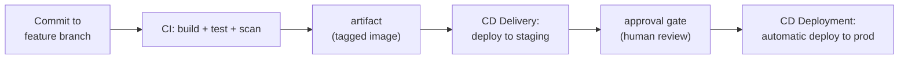
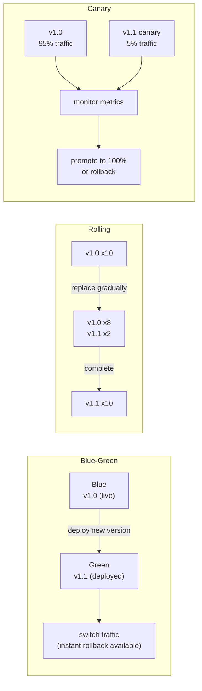
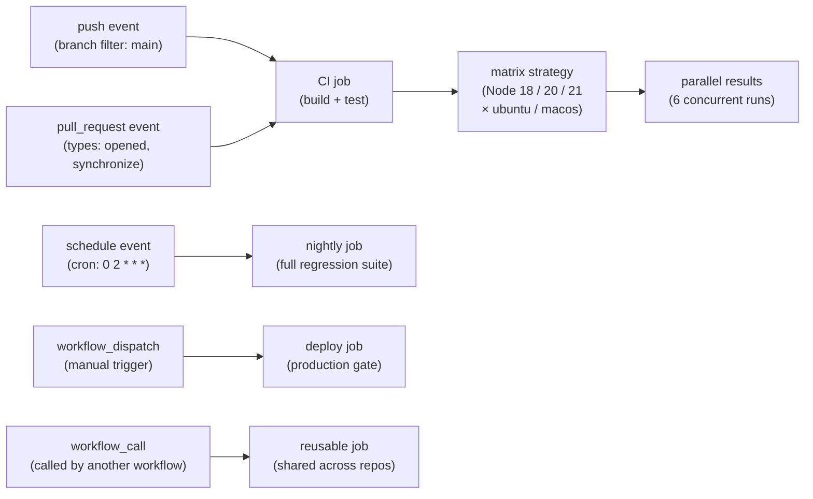
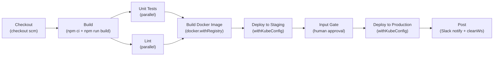

# Module 10: CI/CD Pipelines

> Part of the [DevOps Career Course](./README.md) by UncleJS

[](https://creativecommons.org/licenses/by-nc-sa/4.0/)      

---

## Table of Contents

- [Overview](#overview)
- [Learning Objectives](#learning-objectives)
- [Beginner: CI/CD Fundamentals](#beginner-cicd-fundamentals)
- [Beginner: Deployment Strategies](#beginner-deployment-strategies)
- [Beginner: Platform Comparison — GitHub Actions vs GitLab CI vs Jenkins](#beginner-platform-comparison--github-actions-vs-gitlab-ci-vs-jenkins)
- [Intermediate: GitHub Actions](#intermediate-github-actions)
- [Intermediate: GitLab CI/CD](#intermediate-gitlab-cicd)
- [Intermediate: Jenkins](#intermediate-jenkins)
- [Intermediate: Pipeline Design Patterns](#intermediate-pipeline-design-patterns)
- [Intermediate: Secrets Management in Pipelines](#intermediate-secrets-management-in-pipelines)
- [Intermediate: Artifact Management](#intermediate-artifact-management)
- [Intermediate: CI/CD for Containers & Kubernetes](#intermediate-cicd-for-containers--kubernetes)
- [Advanced: Reusable Workflows & DRY Pipelines](#advanced-reusable-workflows--dry-pipelines)
- [Tools & Commands Reference](#tools--commands-reference)
- [Hands-On Labs](#hands-on-labs)
- [Further Reading](#further-reading)

---

## Overview

CI/CD (Continuous Integration / Continuous Delivery/Deployment) is the engine of modern DevOps. It automates the journey from a developer pushing code to that code running in production — testing, building, scanning, and deploying at every step.

This module covers three industry-standard CI/CD tools: **GitHub Actions** (the most widely adopted modern tool), **GitLab CI/CD** (built into GitLab, strong DevSecOps features), and **Jenkins** (the battle-tested enterprise classic).

```mermaid
flowchart LR
    PUSH["Code push<br/>(git push)"]
    TRIG["Trigger<br/>(webhook)"]
    BUILD["Build<br/>(compile / install deps)"]
    TEST["Test<br/>(unit + integration)"]
    SCAN["Security scan<br/>(SAST + dependency audit)"]
    PKG["Build artifact<br/>(container image)"]
    STAGING["Deploy to staging<br/>(automatic)"]
    INTTEST["Integration tests<br/>(smoke + E2E)"]
    PROD["Deploy to production<br/>(manual gate or auto)"]

    PUSH --> TRIG --> BUILD --> TEST --> SCAN --> PKG --> STAGING --> INTTEST --> PROD
```



[↑ Back to TOC](#table-of-contents)

---

## Learning Objectives

By the end of this module you will be able to:

- Explain CI/CD concepts and the value they provide
- Choose the right deployment strategy for a given scenario
- Write GitHub Actions workflows that build, test, and deploy code
- Write GitLab CI/CD pipelines with stages and jobs
- Configure Jenkins pipelines using declarative Jenkinsfile syntax
- Store and use secrets securely in all three platforms
- Build and push container images through a pipeline
- Deploy to Kubernetes from a CI/CD pipeline
- Design reusable, DRY pipelines using GitHub Actions reusable workflows and GitLab CI includes
- Compare GitHub Actions, GitLab CI/CD, and Jenkins across key dimensions to choose the right tool

[↑ Back to TOC](#table-of-contents)

---

## Beginner: CI/CD Fundamentals

CI/CD is the operational heart of DevOps — the system that closes the loop between writing code and running code in front of users. Before CI/CD, teams integrated infrequently, which meant integration problems accumulated and became painful to untangle. Before CD, deployment was a high-ceremony event requiring careful coordination, usually resulting in infrequent releases that bundled many changes and made root-cause analysis difficult when something went wrong.

The three terms represent increasing levels of automation. **Continuous Integration** is a practice: merge code frequently (at least daily), and have every merge trigger an automated build and test run. The benefit is not the tooling — it is the discipline of never letting branches diverge long enough for integration to become hard. **Continuous Delivery** is a capability: the main branch should always be in a state that could be deployed to production. That requires disciplined testing, environment parity, and deployment automation, but the final production deployment still requires a human decision. **Continuous Deployment** is a policy: every passing change is automatically deployed to production with no human gate. This is the most aggressive form and requires the highest level of automated quality coverage and observability.

CI/CD pipelines fail, and designing for recovery is as important as designing for success. A pipeline that breaks and is not immediately fixed is a broken development workflow. The most common failure modes are flaky tests (intermittent failures that erode trust in the pipeline signal), slow pipelines (encouraging developers to skip running them), credential expiry (a midnight production deployment blocked by an expired token), and configuration drift between environments (staging passes but production breaks). Designing for recovery means: make tests deterministic, parallelize aggressively to keep pipelines under ten minutes, rotate credentials before they expire, and keep environment configuration as code.



CI/CD is really about reducing the amount of uncertainty between writing code and running code in production. Without a pipeline, teams rely on memory, handoffs, and manual repetition: someone builds locally, someone else runs tests later, and deployment becomes a special event that feels risky every time. A good pipeline turns that fragile sequence into a repeatable system that checks quality continuously and makes releases boring in the best possible way.

As you read this module, try to connect each stage to a concrete failure it prevents. CI catches integration problems before they pile up. CD shortens the distance between a passing change and a working deployment. Together, they create feedback loops that are fast enough for developers and reliable enough for operations. The tools differ, but that operating model is the constant.

### What is CI?

**Continuous Integration**: Every code push triggers an automated pipeline that builds and tests the code. Problems are caught immediately — not weeks later when merging becomes painful.

```
Developer pushes code
       ↓
CI Pipeline triggers automatically
       ↓
Build → Unit Tests → Integration Tests → Code Quality → Security Scan
       ↓
Pass: merge allowed ✓
Fail: PR blocked ✗
```

### What is CD?

**Continuous Delivery**: Every passing build is automatically deployed to staging. Deployment to production requires a manual approval step.

**Continuous Deployment**: Every passing build is automatically deployed all the way to production — no human in the loop.

### Pipeline Stages

```
Code Push → Build → Test → Scan → Package → Deploy to Staging → Approve → Deploy to Production
```

| Stage | What Happens |
|---|---|
| **Build** | Compile code, install dependencies, create artifact |
| **Unit Test** | Fast, isolated tests (milliseconds each) |
| **Integration Test** | Test interactions between components |
| **Code Quality** | Lint, style checks, complexity analysis |
| **Security Scan** | SAST, dependency vulnerability scan |
| **Package** | Build container image, create deployment artifact |
| **Deploy Staging** | Automatic deployment to staging environment |
| **Smoke Test** | Basic health check against deployed app |
| **Deploy Production** | Manual or automatic deployment to production |

[↑ Back to TOC](#table-of-contents)

---

## Beginner: Deployment Strategies

Once a pipeline can build and test software, the next challenge is changing production safely. That is where deployment strategy matters. The question is not just "how do we push a new version?" but "how do we limit blast radius, observe behavior, and recover quickly if the release is bad?" Different strategies make different tradeoffs between infrastructure cost, rollout speed, complexity, and rollback safety.

**Blue-green** deployment has a zero-downtime cutover and instant rollback — you simply flip traffic back to the old environment. The cost is that you need double the production infrastructure running simultaneously during the deployment window, and both environments must have access to shared state (databases, caches) in a compatible way. **Rolling updates** are cheaper because you replace instances gradually without duplicating the entire fleet. The tradeoff is that you briefly run two versions simultaneously, which requires backward-compatible APIs and database schemas during the transition period. **Canary deployments** are the most conservative strategy: you route a small percentage of real production traffic (5–10%) to the new version, observe metrics and error rates, and only promote the new version to full traffic if it looks healthy. Canaries catch version-specific issues that staging environments cannot reproduce, but they require traffic-splitting infrastructure (usually a load balancer or service mesh) and solid observability to know when to promote or roll back.

The right strategy depends on context. A simple internal API might tolerate rolling updates with a brief mixed-version window. A payment processing service should probably use canaries with automatic rollback triggers on error rate increases. Blue-green is worth the cost when you need zero downtime and you have the budget for duplicate environments — common in larger organizations where the infrastructure cost is smaller than the business cost of a failed deployment.



This is why deployment strategy should never be chosen in isolation from your platform. A small internal service might be perfectly fine with rolling updates, while a customer-facing payment service might justify canaries or blue-green cutovers. The right choice depends on risk tolerance, traffic patterns, observability maturity, and how expensive downtime is for the business.

### Blue-Green Deployment

```
Traffic → Blue (v1.0)     ←── Current production
           Green (v1.1)   ←── Deploy new version here, test
                          ←── Switch traffic: Traffic → Green
                          ←── Blue is standby for instant rollback
```

- ✅ Zero downtime, instant rollback
- ❌ Requires 2x infrastructure

### Rolling Update

```
10 pods running v1.0
Replace 1 pod at a time with v1.1:
[v1.0 × 9, v1.1 × 1] → [v1.0 × 8, v1.1 × 2] → ... → [v1.1 × 10]
```

- ✅ No extra infrastructure, gradual rollout
- ❌ Briefly runs two versions simultaneously, slower rollback

### Canary Deployment

```
100% traffic → v1.0
       ↓
5% traffic → v1.1  (canary)  ← Monitor metrics
95% traffic → v1.0
       ↓
If stable: 20% → v1.1, 80% → v1.0
       ↓
If stable: 100% → v1.1
```

- ✅ Real-world testing with minimal blast radius
- ❌ Complex traffic routing required

[↑ Back to TOC](#table-of-contents)

---

## Beginner: Platform Comparison — GitHub Actions vs GitLab CI vs Jenkins

Before diving into each tool, here's a decision-oriented comparison to help you choose the right platform.

Most pipeline tools can be made to perform the same core jobs: build, test, package, and deploy. The real differences show up in workflow friction, governance model, ecosystem fit, and operational overhead. That is why tool choice should be driven less by feature checklists and more by context: where your source code lives, how much infrastructure you are willing to maintain, and whether you need deep enterprise customization or fast developer onboarding.

It is also worth remembering that switching pipeline platforms is usually more expensive than it looks. You are not just rewriting YAML or Groovy; you are rebuilding credentials flows, runner strategy, approval gates, logging, artifact storage, and team habits. Choose a platform that matches the shape of your organization so the pipeline reinforces delivery instead of fighting it.

| Dimension | GitHub Actions | GitLab CI/CD | Jenkins |
|---|---|---|---|
| **Hosting** | Cloud (GitHub-managed) | Cloud or self-hosted | Self-hosted only |
| **Config file** | `.github/workflows/*.yml` | `.gitlab-ci.yml` | `Jenkinsfile` |
| **Setup time** | Minutes (no install) | Minutes (no install) | Hours (server + plugins) |
| **Runners** | GitHub-hosted or self-hosted | GitLab-hosted or self-hosted | Your own servers |
| **Secrets management** | Repository/org secrets | CI/CD Variables (masked) | Credentials Store |
| **Built-in registry** | GitHub Container Registry | GitLab Container Registry | No (plugin required) |
| **Built-in SAST** | Via Marketplace actions | Native (GitLab Ultimate) | Via plugins |
| **Pricing** | Free tier + pay-per-minute | Free tier + pay-per-minute | Free (infra costs only) |
| **Best for** | GitHub-hosted projects | End-to-end GitLab DevSecOps | Enterprise / complex custom needs |

### When to choose which

```
Is your code on GitHub?
  └── YES → GitHub Actions (zero friction, massive Marketplace)

Is your code on GitLab?
  └── YES → GitLab CI/CD (native integration, free SAST/DAST)

Do you need full on-premises control, custom agents, or complex enterprise integrations?
  └── YES → Jenkins (most flexible, most work to maintain)

Multi-cloud or platform-agnostic pipelines?
  └── Consider a dedicated tool: Tekton, Argo Workflows, or Buildkite
```

[↑ Back to TOC](#table-of-contents)

---

## Intermediate: GitHub Actions

GitHub Actions is built directly into GitHub. Workflows are YAML files stored in `.github/workflows/`.

GitHub Actions is popular because it removes most of the startup friction. If your code already lives on GitHub, the CI/CD system is effectively waiting next to it. That tight integration is valuable for smaller teams and fast-moving projects because pull requests, secrets, environments, reusable actions, and status checks all live close to the source of truth. The result is less glue code and fewer moving parts to maintain at the start.

The tradeoff is that convenience can encourage pipelines to grow organically without much design. A workflow that starts as ten lines of YAML can become an unreviewed platform in its own right. As you read the examples below, pay attention not just to syntax but to job boundaries, permissions, artifact flow, and deployment gates. Those are the details that separate a useful workflow from a fragile one.

### Core Concepts

| Term | Description |
|---|---|
| **Workflow** | Automated process defined in a YAML file |
| **Event** | Trigger that starts a workflow (`push`, `pull_request`, `schedule`, etc.) |
| **Job** | A set of steps that run on the same runner |
| **Step** | A single task — either a shell command or an Action |
| **Action** | A reusable unit of code from the GitHub Marketplace |
| **Runner** | The virtual machine that executes jobs |

### Basic Workflow

```yaml
# .github/workflows/ci.yml
name: CI Pipeline

on:
  push:
    branches: [main, develop]
  pull_request:
    branches: [main]

jobs:
  test:
    name: Run Tests
    runs-on: ubuntu-latest

    steps:
      - name: Checkout code
        uses: actions/checkout@v4

      - name: Set up Node.js
        uses: actions/setup-node@v4
        with:
          node-version: '20'
          cache: 'npm'

      - name: Install dependencies
        run: npm ci

      - name: Run linter
        run: npm run lint

      - name: Run tests
        run: npm test

      - name: Upload test results
        uses: actions/upload-artifact@v4
        if: always()                          # Run even if tests fail
        with:
          name: test-results
          path: coverage/
```

### Build & Push Docker Image

```yaml
# .github/workflows/docker.yml
name: Build and Push Docker Image

on:
  push:
    branches: [main]
    tags: ['v*']

env:
  REGISTRY: ghcr.io
  IMAGE_NAME: ${{ github.repository }}

jobs:
  build:
    runs-on: ubuntu-latest
    permissions:
      contents: read
      packages: write

    steps:
      - name: Checkout
        uses: actions/checkout@v4

      - name: Set up Docker Buildx
        uses: docker/setup-buildx-action@v3

      - name: Login to GitHub Container Registry
        uses: docker/login-action@v3
        with:
          registry: ${{ env.REGISTRY }}
          username: ${{ github.actor }}
          password: ${{ secrets.GITHUB_TOKEN }}

      - name: Extract metadata
        id: meta
        uses: docker/metadata-action@v5
        with:
          images: ${{ env.REGISTRY }}/${{ env.IMAGE_NAME }}
          tags: |
            type=ref,event=branch
            type=semver,pattern={{version}}
            type=sha,prefix=sha-

      - name: Build and push
        uses: docker/build-push-action@v5
        with:
          context: .
          push: true
          tags: ${{ steps.meta.outputs.tags }}
          labels: ${{ steps.meta.outputs.labels }}
          cache-from: type=gha
          cache-to: type=gha,mode=max
```

### Deploy to Kubernetes

```yaml
# .github/workflows/deploy.yml
name: Deploy to Kubernetes

on:
  workflow_run:
    workflows: ["Build and Push Docker Image"]
    types: [completed]
    branches: [main]

jobs:
  deploy:
    runs-on: ubuntu-latest
    if: ${{ github.event.workflow_run.conclusion == 'success' }}
    environment: production          # Requires manual approval

    steps:
      - name: Checkout
        uses: actions/checkout@v4

      - name: Configure kubectl
        uses: azure/k8s-set-context@v3
        with:
          method: kubeconfig
          kubeconfig: ${{ secrets.KUBECONFIG }}

      - name: Deploy to Kubernetes
        run: |
          kubectl set image deployment/myapp \
            app=ghcr.io/${{ github.repository }}:sha-${{ github.sha }}
          kubectl rollout status deployment/myapp --timeout=5m

      - name: Rollback on failure
        if: failure()
        run: kubectl rollout undo deployment/myapp
```

### Matrix Builds

```yaml
jobs:
  test:
    runs-on: ${{ matrix.os }}
    strategy:
      matrix:
        os: [ubuntu-latest, macos-latest]
        node: ['18', '20', '21']
    steps:
      - uses: actions/checkout@v4
      - uses: actions/setup-node@v4
        with:
          node-version: ${{ matrix.node }}
      - run: npm test
```

### GitHub Actions: Event Model

Understanding the event model is essential to writing workflows that do the right thing at the right time. The `on:` key accepts a wide range of triggers: `push`, `pull_request`, `schedule`, `workflow_dispatch`, `workflow_call`, `release`, and more. These triggers are not equivalent. A `push` trigger fires on every direct commit to a branch — useful for building but dangerous for production deployments. A `workflow_dispatch` trigger fires only when manually triggered via the GitHub UI or API, making it the right choice for operational actions that should never run automatically. A `pull_request` trigger fires when a PR is opened, updated, or synchronized, and its workflows run in the context of the PR's head commit — meaning they do not have access to repository secrets from the base branch by default, which is a security boundary worth understanding.

Event filters narrow triggers further. You can restrict a `push` trigger to specific branches with `branches:` or to specific file paths with `paths:`. A workflow that rebuilds documentation only when docs change, or that runs production deployment only on `main`, is using event filters to remove noise and prevent unintended side effects. Without filters, pipelines fire on every commit to every branch, wasting runner minutes and creating alert fatigue.

Matrix builds are one of the most efficient features of GitHub Actions. When you specify a `strategy.matrix`, GitHub Actions fans out the job into N parallel runs, one per matrix value combination. A 3-node × 2-OS matrix produces 6 concurrent jobs without any extra workflow logic. This is the cleanest way to validate cross-platform or cross-version compatibility without serializing test runs. Matrix jobs share the same workflow YAML but each run in complete isolation on its own runner, so failures in one combination do not block the others unless you set `fail-fast: true`.



[↑ Back to TOC](#table-of-contents)

---

## Intermediate: GitLab CI/CD

GitLab CI/CD uses a `.gitlab-ci.yml` file at the repository root.

GitLab CI/CD is strongest when a team wants a single platform for source control, pipelines, package registry, environments, and parts of the security workflow. That integrated model can simplify operations because fewer external systems need to be stitched together. It also encourages teams to think of delivery as an end-to-end value stream rather than as isolated scripts triggered by commits.

The downside is that the pipeline file can become dense quickly as more concerns accumulate: build logic, caching, artifacts, security scans, deploy jobs, environment rules, and reusable templates all converge in one place. For that reason, strong GitLab pipelines usually invest early in stage design, templating, and naming discipline so the configuration remains understandable months later.

The GitLab CI/CD model is stage-first. You declare an ordered list of stages — `build`, `test`, `scan`, `package`, `deploy` — and then assign jobs to each stage. All jobs within a stage run in parallel by default. Jobs in later stages only start after all jobs in the preceding stage have succeeded. This is an important difference from GitHub Actions, where job dependencies are expressed job-by-job with `needs:`. In GitLab, stage order is the default dependency model, and `needs:` is an opt-in override that activates DAG (Directed Acyclic Graph) mode, allowing a job to start as soon as its direct dependencies finish rather than waiting for the entire previous stage.

The integrated platform advantage is most visible in security workflows. GitLab can run SAST, dependency scanning, container scanning, and secret detection as first-class pipeline jobs without requiring external integrations. Results show up natively in merge request pipelines, environments, and compliance dashboards. For teams with regulatory requirements — auditing, separation of duties, security approvals — that built-in traceability can significantly reduce the effort of demonstrating compliance compared to assembling the same capabilities from separate tools.

### Core Concepts

| Term | Description |
|---|---|
| **Pipeline** | The entire CI/CD process for a commit |
| **Stage** | A phase of the pipeline (build, test, deploy) |
| **Job** | A task that runs in a stage |
| **Runner** | The machine that executes jobs |
| **Artifact** | Files passed between jobs |
| **Cache** | Files cached between pipelines (e.g., node_modules) |

### Full Pipeline Example

```yaml
# .gitlab-ci.yml
stages:
  - build
  - test
  - scan
  - package
  - deploy

variables:
  DOCKER_IMAGE: $CI_REGISTRY_IMAGE:$CI_COMMIT_SHORT_SHA
  KUBECONFIG_PATH: /tmp/kubeconfig

# Global cache for all jobs
cache:
  key: $CI_COMMIT_REF_SLUG
  paths:
    - node_modules/

# ─── Build Stage ───────────────────────────────────────────
build:
  stage: build
  image: node:20-alpine
  script:
    - npm ci
    - npm run build
  artifacts:
    paths:
      - dist/
    expire_in: 1 hour

# ─── Test Stage ────────────────────────────────────────────
unit-tests:
  stage: test
  image: node:20-alpine
  script:
    - npm ci
    - npm test -- --coverage
  coverage: '/Lines\s*:\s*(\d+\.?\d*)%/'
  artifacts:
    reports:
      coverage_report:
        coverage_format: cobertura
        path: coverage/cobertura-coverage.xml
    when: always

lint:
  stage: test
  image: node:20-alpine
  script:
    - npm ci
    - npm run lint

# ─── Security Scan Stage ───────────────────────────────────
sast:
  stage: scan
  image: returntocorp/semgrep
  script:
    - semgrep --config=auto --error --json > gl-sast-report.json
  artifacts:
    reports:
      sast: gl-sast-report.json

dependency-scan:
  stage: scan
  image: node:20-alpine
  script:
    - npm audit --audit-level=high

# ─── Package Stage ─────────────────────────────────────────
build-image:
  stage: package
  image: docker:24
  services:
    - docker:24-dind
  before_script:
    - docker login -u $CI_REGISTRY_USER -p $CI_REGISTRY_PASSWORD $CI_REGISTRY
  script:
    - docker build -t $DOCKER_IMAGE .
    - docker push $DOCKER_IMAGE
    - docker tag $DOCKER_IMAGE $CI_REGISTRY_IMAGE:latest
    - docker push $CI_REGISTRY_IMAGE:latest
  only:
    - main

# ─── Deploy Stage ──────────────────────────────────────────
deploy-staging:
  stage: deploy
  image: bitnami/kubectl:latest
  environment:
    name: staging
    url: https://staging.example.com
  script:
    - echo $KUBECONFIG_CONTENT | base64 -d > $KUBECONFIG_PATH
    - export KUBECONFIG=$KUBECONFIG_PATH
    - kubectl set image deployment/myapp app=$DOCKER_IMAGE -n staging
    - kubectl rollout status deployment/myapp -n staging
  only:
    - main

deploy-production:
  stage: deploy
  image: bitnami/kubectl:latest
  environment:
    name: production
    url: https://app.example.com
  when: manual                      # Require human approval
  script:
    - echo $KUBECONFIG_CONTENT | base64 -d > $KUBECONFIG_PATH
    - export KUBECONFIG=$KUBECONFIG_PATH
    - kubectl set image deployment/myapp app=$DOCKER_IMAGE -n production
    - kubectl rollout status deployment/myapp -n production
  only:
    - main
```

### Reusable Templates

```yaml
# Define a reusable template
.deploy-template: &deploy-template
  image: bitnami/kubectl:latest
  script:
    - echo $KUBECONFIG | base64 -d > /tmp/kubeconfig
    - export KUBECONFIG=/tmp/kubeconfig
    - kubectl set image deployment/myapp app=$DOCKER_IMAGE -n $DEPLOY_NAMESPACE
    - kubectl rollout status deployment/myapp -n $DEPLOY_NAMESPACE

deploy-staging:
  <<: *deploy-template
  variables:
    DEPLOY_NAMESPACE: staging
  environment:
    name: staging

deploy-production:
  <<: *deploy-template
  variables:
    DEPLOY_NAMESPACE: production
  when: manual
  environment:
    name: production
```

[↑ Back to TOC](#table-of-contents)

---

## Intermediate: Jenkins

Jenkins is the battle-tested CI/CD workhorse — self-hosted, highly configurable, and found in virtually every enterprise. Pipelines are defined in a `Jenkinsfile`.

Jenkins remains common because many enterprises need a level of control that hosted platforms do not always provide. They may have private networks, custom agents, legacy build tools, approval requirements, or plugin-based integrations accumulated over many years. Jenkins can usually accommodate those needs, which is both its biggest strength and its biggest operational burden.

That burden matters. Running Jenkins means you are operating the CI/CD platform itself: controller availability, plugin compatibility, agent security, credential handling, upgrade cadence, and backup strategy all become your problem. Teams choose Jenkins successfully when that flexibility is worth the cost and when they have the maturity to maintain it well.

### Installation

```bash
# Ubuntu
curl -fsSL https://pkg.jenkins.io/debian-stable/jenkins.io-2023.key | sudo tee /usr/share/keyrings/jenkins-keyring.asc > /dev/null
echo deb [signed-by=/usr/share/keyrings/jenkins-keyring.asc] https://pkg.jenkins.io/debian-stable binary/ | sudo tee /etc/apt/sources.list.d/jenkins.list
sudo apt update && sudo apt install -y jenkins openjdk-17-jdk
sudo systemctl enable --now jenkins
# Access: http://localhost:8080
```

### Declarative Jenkinsfile

```groovy
// Jenkinsfile (Declarative Pipeline)
pipeline {
    agent any

    // Run on a specific agent label
    // agent { label 'docker-agent' }

    environment {
        DOCKER_IMAGE = "myapp:${env.BUILD_NUMBER}"
        REGISTRY     = "registry.example.com"
    }

    options {
        timeout(time: 30, unit: 'MINUTES')
        disableConcurrentBuilds()
        buildDiscarder(logRotator(numToKeepStr: '10'))
    }

    triggers {
        pollSCM('H/5 * * * *')    // Poll Git every 5 minutes
        // cron('0 2 * * *')      // Or run on a schedule
    }

    stages {
        stage('Checkout') {
            steps {
                checkout scm
            }
        }

        stage('Build') {
            steps {
                sh 'npm ci'
                sh 'npm run build'
            }
        }

        stage('Test') {
            parallel {
                stage('Unit Tests') {
                    steps {
                        sh 'npm test'
                    }
                    post {
                        always {
                            junit 'reports/junit.xml'
                        }
                    }
                }
                stage('Lint') {
                    steps {
                        sh 'npm run lint'
                    }
                }
            }
        }

        stage('Build Docker Image') {
            steps {
                script {
                    docker.withRegistry("https://${REGISTRY}", 'registry-credentials') {
                        def image = docker.build("${REGISTRY}/${DOCKER_IMAGE}")
                        image.push()
                        image.push('latest')
                    }
                }
            }
        }

        stage('Deploy to Staging') {
            steps {
                withKubeConfig([credentialsId: 'kubeconfig-staging']) {
                    sh "kubectl set image deployment/myapp app=${REGISTRY}/${DOCKER_IMAGE}"
                    sh "kubectl rollout status deployment/myapp --timeout=5m"
                }
            }
        }

        stage('Deploy to Production') {
            when {
                branch 'main'
            }
            input {
                message "Deploy to production?"
                ok "Deploy"
            }
            steps {
                withKubeConfig([credentialsId: 'kubeconfig-prod']) {
                    sh "kubectl set image deployment/myapp app=${REGISTRY}/${DOCKER_IMAGE} -n production"
                    sh "kubectl rollout status deployment/myapp -n production --timeout=10m"
                }
            }
        }
    }

    post {
        success {
            slackSend color: 'good', message: "✅ Build ${env.BUILD_NUMBER} succeeded: ${env.BUILD_URL}"
        }
        failure {
            slackSend color: 'danger', message: "❌ Build ${env.BUILD_NUMBER} FAILED: ${env.BUILD_URL}"
            emailext(
                subject: "FAILED: ${env.JOB_NAME} [${env.BUILD_NUMBER}]",
                body: "Build failed. See: ${env.BUILD_URL}",
                to: 'devops@example.com'
            )
        }
        always {
            cleanWs()    // Clean workspace after build
        }
    }
}
```

The `post` block and `input` directive in the example above illustrate two Jenkins-specific strengths. `post` conditions (`success`, `failure`, `always`) allow notification and cleanup logic to be attached declaratively to any stage or the full pipeline, keeping side-effect logic out of the main `stages` block. The `input` directive pauses a pipeline and waits for a human to click an approval button before proceeding — a simple but powerful production gate that many teams value for operational safety.

Jenkins pipelines can also be visualized in the Blue Ocean UI as a stage graph, making it easy to see which stages passed, which failed, and how long each took. The stage view is one of the clearest representations of a CI/CD pipeline available in any tool, which is part of why Jenkins remains popular in organizations where pipeline transparency to non-engineers matters.



### Jenkins Shared Libraries

```groovy
// vars/deployToKubernetes.groovy (in a shared library repo)
def call(Map config) {
    withKubeConfig([credentialsId: config.credentialsId]) {
        sh "kubectl set image deployment/${config.deployment} app=${config.image} -n ${config.namespace}"
        sh "kubectl rollout status deployment/${config.deployment} -n ${config.namespace} --timeout=5m"
    }
}

// Using the shared library in Jenkinsfile:
@Library('my-shared-library') _
deployToKubernetes(
    credentialsId: 'kubeconfig-staging',
    deployment: 'myapp',
    image: "${DOCKER_IMAGE}",
    namespace: 'staging'
)
```

[↑ Back to TOC](#table-of-contents)

---

## Intermediate: Pipeline Design Patterns

Once you understand individual tools, the next level is pipeline architecture. Design patterns matter because the same pipeline stages can support either fast, low-friction delivery or slow, approval-heavy chaos depending on how they are arranged. Good pipeline design aligns with your branching model, keeps feedback loops short, and reserves slower checks for the points where they create the most value.

This is also where platform engineering thinking starts to emerge. Instead of asking only "how do we run tests," you start asking "what is the shortest trustworthy path from commit to customer impact?" The answer shapes everything from branch policy to artifact promotion to whether production changes happen by merge, by tag, or by GitOps reconciliation.

### The Trunk-Based Pipeline

```
push to main
    │
    ▼
build + test (< 5 min)
    │
    ▼
build image + push to registry
    │
    ▼
auto-deploy to staging
    │
    ▼
smoke tests
    │
    ▼
manual gate → deploy to production
```

### Branching Strategy Alignment

| Branching Model | CI/CD Behavior |
|---|---|
| **GitHub Flow** | PR → run tests; merge to main → deploy staging; manual → prod |
| **Git Flow** | feature branch → test; develop → deploy dev; release → deploy staging; main → prod |
| **Trunk-Based** | Every commit to main → full pipeline → auto-deploy |

[↑ Back to TOC](#table-of-contents)

---

## Intermediate: Secrets Management in Pipelines

Never hardcode credentials in pipeline files. Always use the platform's secrets store.

Pipelines are high-value targets because they sit at the intersection of source code, package registries, deployment credentials, and production automation. A leaked secret in CI/CD is often more damaging than a leaked local developer credential because the pipeline usually has broad, automated access to build and deploy systems. That is why secret handling must be treated as a first-class design concern rather than a checkbox.

Good pipeline security is about minimizing exposure, not just hiding values. Use short-lived credentials where possible, scope secrets to environments, restrict who can trigger sensitive jobs, and make sure logs do not accidentally print secret material. The platform examples below show the storage mechanisms, but the operational principle is least privilege plus careful auditability.

### GitHub Actions

```yaml
# Access repository secrets
steps:
  - name: Deploy
    env:
      DATABASE_URL: ${{ secrets.DATABASE_URL }}
      API_KEY: ${{ secrets.PRODUCTION_API_KEY }}
    run: ./deploy.sh

# Secrets set in: Settings → Secrets and variables → Actions
```

### GitLab CI/CD

```yaml
# Access CI/CD variables
deploy:
  script:
    - echo $DATABASE_URL | kubectl create secret generic db --from-literal=url=$DATABASE_URL
# Variables set in: Settings → CI/CD → Variables (masked + protected)
```

### Jenkins

```groovy
// Using credentials binding
withCredentials([
    string(credentialsId: 'api-key', variable: 'API_KEY'),
    usernamePassword(credentialsId: 'db-creds', usernameVariable: 'DB_USER', passwordVariable: 'DB_PASS')
]) {
    sh './deploy.sh'
}
// Credentials stored in: Manage Jenkins → Manage Credentials
```

[↑ Back to TOC](#table-of-contents)

---

## Intermediate: Artifact Management

Artifacts are the handoff point between pipeline stages, environments, and sometimes teams. Without a clear artifact strategy, later jobs rebuild what earlier jobs already produced, deployments become inconsistent, and rollback becomes harder because nobody can say exactly what was released. Treating artifacts as named, versioned outputs is what makes the pipeline reproducible instead of merely automated.

This is also one of the bridges between CI and CD. Builds create artifacts, but deployments should consume those exact artifacts rather than recomputing them under slightly different conditions. That distinction is subtle and important: promotion is safer when you are moving a known artifact forward, not re-running a build with production on the line.

```yaml
# GitHub Actions — upload build artifacts
- uses: actions/upload-artifact@v4
  with:
    name: build-output
    path: dist/
    retention-days: 7

# Download in a later job
- uses: actions/download-artifact@v4
  with:
    name: build-output
    path: dist/

# GitLab — pass artifacts between jobs
build:
  artifacts:
    paths:
      - dist/
    expire_in: 1 hour

test:
  needs: [build]      # Receive artifacts from build job
  script:
    - ls dist/         # Files are available here
```

[↑ Back to TOC](#table-of-contents)

---

## Intermediate: CI/CD for Containers & Kubernetes

Container and Kubernetes delivery adds another layer to pipeline design because you are no longer shipping just application code. You are shipping an image, its metadata, its vulnerability posture, and a deployment action that changes a running cluster. That means the pipeline has to do more than compile and test. It has to produce an immutable artifact, verify it, publish it, and update the orchestration layer in a way that is observable and reversible.

This is where many teams discover the difference between deployment automation and delivery discipline. A pipeline that can run `kubectl set image` is not automatically safe. Safety comes from image tagging strategy, rollout verification, health checks, rollback paths, environment promotion rules, and a clear separation between build concerns and cluster concerns.

### Full Container CI/CD Pattern

```
1. Developer pushes code
2. Pipeline triggers
3. Build stage: npm install + npm test
4. Security: trivy scan, npm audit
5. Build Docker image
6. Scan image with Trivy
7. Push to registry with tag: sha-<commit>
8. Update Kubernetes deployment image
9. kubectl rollout status (wait for rollout)
10. Health check: curl /healthz
11. If failed: kubectl rollout undo
```

### GitOps Pattern (with ArgoCD)

```
1. Pipeline builds and pushes image: myapp:sha-abc123
2. Pipeline updates the Kubernetes manifest repo:
   - Opens a PR updating image tag in manifests/production/deployment.yaml
   - Or directly commits to a deployments repo
3. ArgoCD detects the manifest change in Git
4. ArgoCD syncs the cluster to match the new manifest
5. Deployment happens — zero manual kubectl commands
```

[↑ Back to TOC](#table-of-contents)

---

## Advanced: Reusable Workflows & DRY Pipelines

As your organization grows, you'll find yourself copy-pasting pipeline YAML across dozens of repositories. Reusable workflows (GitHub Actions) and CI includes (GitLab) solve this.

Reuse becomes important the moment you have more than a handful of repositories doing similar things. Copy-paste feels fast initially, but it creates a silent maintenance tax: security fixes must be repeated everywhere, build logic drifts over time, and different teams end up with pipelines that look similar but behave differently in subtle ways. Shared workflow building blocks are a way to standardize delivery without forcing every application into the same monolithic pipeline.

The real challenge is balancing consistency with flexibility. Centralized workflows should encode the things that truly ought to be common, such as image build policy, test conventions, or signing steps. They should not erase every application-specific need. The healthiest pattern is usually a thin shared platform layer with clearly documented extension points.

In GitHub Actions, there are two distinct reuse mechanisms and they solve different problems. A **reusable workflow** (`workflow_call`) is a complete workflow file with its own jobs and runners. The caller triggers it as an entire job-level unit and passes in inputs and secrets. This is the right tool when you want to standardize a multi-step delivery process — build, scan, push — across many repos. A **composite action**, stored in `.github/actions/`, bundles a set of steps into a single named step. It runs on the caller's runner inside the caller's job rather than spinning up a new one. Composite actions are the right tool when you want to extract repetitive step sequences (like setup + install + cache) without the overhead of a separate job boundary.

The practical rule is: use composite actions to avoid repeating step-level boilerplate within a job; use reusable workflows to avoid repeating job-level (or multi-job) pipeline logic across repositories. The two can also nest: a reusable workflow can use composite actions internally, and the caller only sees the clean reusable workflow interface. This layering is how platform teams build meaningful abstraction without requiring application teams to understand the implementation details of the shared delivery infrastructure.

### GitHub Actions: Reusable Workflows

A reusable workflow lives in `.github/workflows/` and is called with `workflow_call`.

```yaml
# .github/workflows/_reusable-docker-build.yml  (in a central repo or the same repo)
# Prefix with _ by convention to distinguish reusable from triggered workflows
name: Reusable — Build & Push Docker Image

on:
  workflow_call:
    inputs:
      image-name:
        required: true
        type: string
      registry:
        required: false
        type: string
        default: ghcr.io
    secrets:
      REGISTRY_TOKEN:
        required: true

jobs:
  build-and-push:
    runs-on: ubuntu-latest
    permissions:
      contents: read
      packages: write
    steps:
      - uses: actions/checkout@v4

      - uses: docker/setup-buildx-action@v3

      - uses: docker/login-action@v3
        with:
          registry: ${{ inputs.registry }}
          username: ${{ github.actor }}
          password: ${{ secrets.REGISTRY_TOKEN }}

      - uses: docker/metadata-action@v5
        id: meta
        with:
          images: ${{ inputs.registry }}/${{ inputs.image-name }}
          tags: |
            type=ref,event=branch
            type=semver,pattern={{version}}
            type=sha,prefix=sha-

      - uses: docker/build-push-action@v5
        with:
          context: .
          push: true
          tags: ${{ steps.meta.outputs.tags }}
          cache-from: type=gha
          cache-to: type=gha,mode=max
```

**Calling the reusable workflow from any repo:**

```yaml
# .github/workflows/ci.yml  (in your application repo)
name: CI

on:
  push:
    branches: [main]

jobs:
  build:
    uses: my-org/devops-workflows/.github/workflows/_reusable-docker-build.yml@main
    with:
      image-name: ${{ github.repository }}
    secrets:
      REGISTRY_TOKEN: ${{ secrets.GITHUB_TOKEN }}
```

### GitHub Actions: Composite Actions

For reusing individual *steps* (not full jobs), use a composite action:

```yaml
# .github/actions/setup-node-cache/action.yml
name: Setup Node with cache
description: Install Node and restore npm cache

inputs:
  node-version:
    default: '20'

runs:
  using: composite
  steps:
    - uses: actions/setup-node@v4
      with:
        node-version: ${{ inputs.node-version }}
        cache: npm

    - shell: bash
      run: npm ci
```

```yaml
# Usage in any workflow:
steps:
  - uses: actions/checkout@v4
  - uses: ./.github/actions/setup-node-cache    # local composite action
    with:
      node-version: '20'
  - run: npm test
```

### GitLab CI: YAML Includes

GitLab's `include:` keyword is the equivalent — pull shared templates from a central project:

```yaml
# .gitlab-ci.yml  (application repo)
include:
  - project: 'my-org/cicd-templates'
    ref: main
    file:
      - '/templates/docker-build.yml'
      - '/templates/security-scan.yml'

# Override variables without duplicating the job definition
variables:
  DOCKER_IMAGE: $CI_REGISTRY_IMAGE:$CI_COMMIT_SHORT_SHA

stages:
  - build
  - scan
  - deploy
```

```yaml
# cicd-templates/templates/docker-build.yml  (central templates repo)
.docker-build:
  stage: build
  image: docker:24
  services:
    - docker:24-dind
  before_script:
    - docker login -u $CI_REGISTRY_USER -p $CI_REGISTRY_PASSWORD $CI_REGISTRY
  script:
    - docker build -t $DOCKER_IMAGE .
    - docker push $DOCKER_IMAGE
  only:
    - main

docker-build:
  extends: .docker-build
```

### Jenkins: Shared Libraries

Jenkins calls its equivalent feature **Shared Libraries** — Groovy functions stored in a separate Git repo:

```
(shared-library repo)
├── vars/
│   ├── buildDockerImage.groovy
│   ├── deployToKubernetes.groovy
│   └── runSecurityScan.groovy
└── src/
    └── org/company/PipelineUtils.groovy
```

```groovy
// vars/buildDockerImage.groovy
def call(String imageName, String tag = env.BUILD_NUMBER) {
    docker.withRegistry('https://registry.example.com', 'registry-creds') {
        def img = docker.build("${imageName}:${tag}")
        img.push()
        img.push('latest')
    }
}
```

```groovy
// Jenkinsfile  (any project)
@Library('company-shared-library@main') _

pipeline {
    agent any
    stages {
        stage('Build Image') {
            steps {
                buildDockerImage('myapp', env.GIT_COMMIT.take(7))
            }
        }
        stage('Deploy') {
            steps {
                deployToKubernetes(
                    credentialsId: 'kubeconfig-staging',
                    deployment: 'myapp',
                    namespace: 'staging'
                )
            }
        }
    }
}
```

### DRY Pipeline Principles

| Principle | Applies to |
|---|---|
| **Single source of truth** for build/deploy logic | Shared library / reusable workflow / CI template |
| **Inputs over hardcoding** — parameterize image names, namespaces, environments | All platforms |
| **Version-pin your templates** (`@v2`, `ref: v1.3`) to avoid surprise breakage | All platforms |
| **Test your pipeline templates** — treat them as production code | All platforms |
| **Keep secrets out of templates** — always pass via caller's secrets | All platforms |

[↑ Back to TOC](#table-of-contents)

---

## Tools & Commands Reference

| Tool | Config File | Trigger | Key Feature |
|---|---|---|---|
| GitHub Actions | `.github/workflows/*.yml` | Push, PR, schedule, webhook | Native GitHub integration, vast Marketplace |
| GitLab CI/CD | `.gitlab-ci.yml` | Push, MR, schedule, API | Built-in registry, security scanning, environments |
| Jenkins | `Jenkinsfile` | SCM poll, webhook, schedule | Self-hosted, most configurable, shared libraries |

| Concept | GitHub Actions | GitLab CI | Jenkins |
|---|---|---|---|
| Pipeline unit | Workflow | Pipeline | Pipeline |
| Execution unit | Job | Job | Stage |
| Secret storage | Secrets | CI/CD Variables | Credentials |
| Container builds | docker/build-push-action | docker:dind service | Docker plugin |

[↑ Back to TOC](#table-of-contents)

---

## Hands-On Labs

### Lab 10.1 — GitHub Actions: Basic CI

1. Create a GitHub repository with a simple Node.js or Python app
2. Create `.github/workflows/ci.yml`
3. Add a job that: checks out code, installs dependencies, runs tests
4. Push code and watch the workflow run in the GitHub Actions tab
5. Introduce a failing test and observe the pipeline fail

### Lab 10.2 — Build & Push Container Image (GitHub Actions)

1. Extend your workflow to build a Docker image
2. Configure GHCR (GitHub Container Registry) as the registry
3. Push the image on every merge to `main`
4. Use image tags based on git SHA
5. Verify the image appears in your GitHub package registry

### Lab 10.3 — GitLab Pipeline with Stages

1. Create a GitLab project
2. Write a `.gitlab-ci.yml` with stages: build, test, deploy-staging
3. Use GitLab's built-in container registry
4. Set a CI/CD variable for a fake API key
5. Verify the variable is masked in logs

### Lab 10.4 — Jenkins Pipeline

1. Install Jenkins locally or via Docker: `docker run -p 8080:8080 jenkins/jenkins:lts`
2. Install recommended plugins
3. Create a Pipeline job pointing to a Jenkinsfile in your repo
4. Write a Jenkinsfile with build, test, and a manual deploy stage
5. Trigger a build and observe the stage visualization

### Lab 10.5 — Deployment Strategy: Blue-Green

1. Create two Kubernetes deployments: `myapp-blue` and `myapp-green`
2. Create a Service pointing to `myapp-blue` via label selector
3. Deploy a new version to `myapp-green`
4. Switch the Service selector to `myapp-green`
5. Observe zero-downtime traffic switch

[↑ Back to TOC](#table-of-contents)

---

## Further Reading

- [GitHub Actions Documentation](https://docs.github.com/en/actions)
- [GitLab CI/CD Documentation](https://docs.gitlab.com/ee/ci/)
- [Jenkins User Documentation](https://www.jenkins.io/doc/)
- [Continuous Delivery (book)](https://continuousdelivery.com/) — Jez Humble & Dave Farley
- [Glossary: CI](./glossary.md#c), [CD](./glossary.md#c), [Artifact](./glossary.md#a), [Pipeline](./glossary.md#p), [Webhook](./glossary.md#w)
- **Certification**: GitLab Certified CI/CD Associate

[↑ Back to TOC](#table-of-contents)

---

*© 2026 UncleJS — Licensed under [CC BY-NC-SA 4.0](https://creativecommons.org/licenses/by-nc-sa/4.0/). Non-commercial use only. Share alike with attribution. See [LICENSE.md](./LICENSE.md).*
