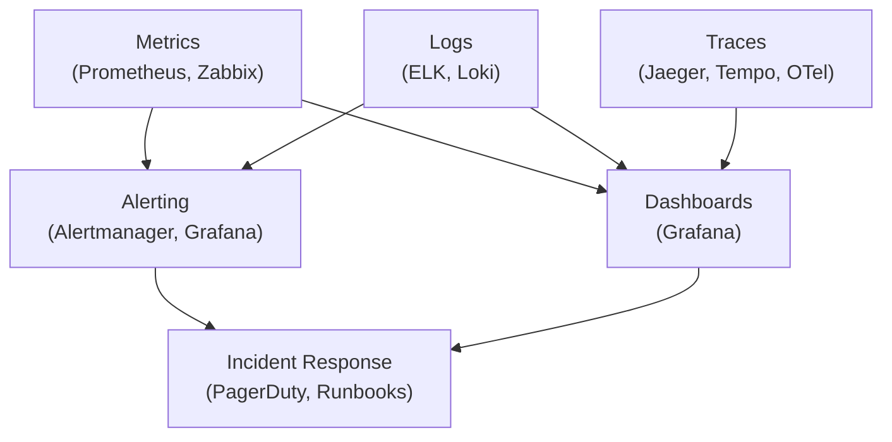
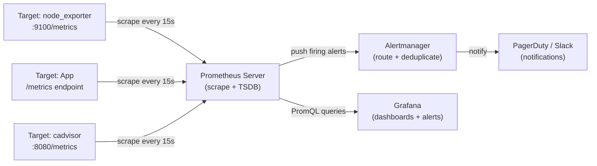
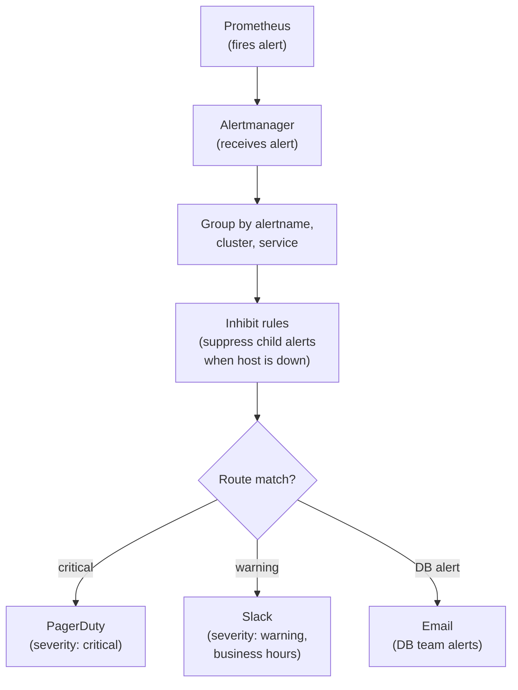
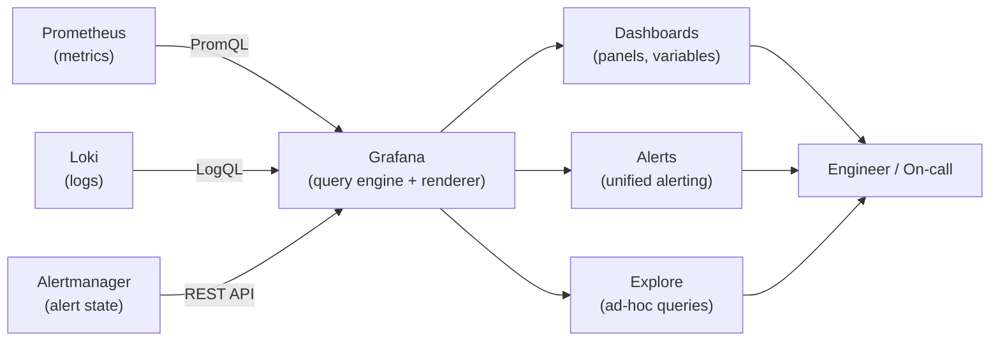
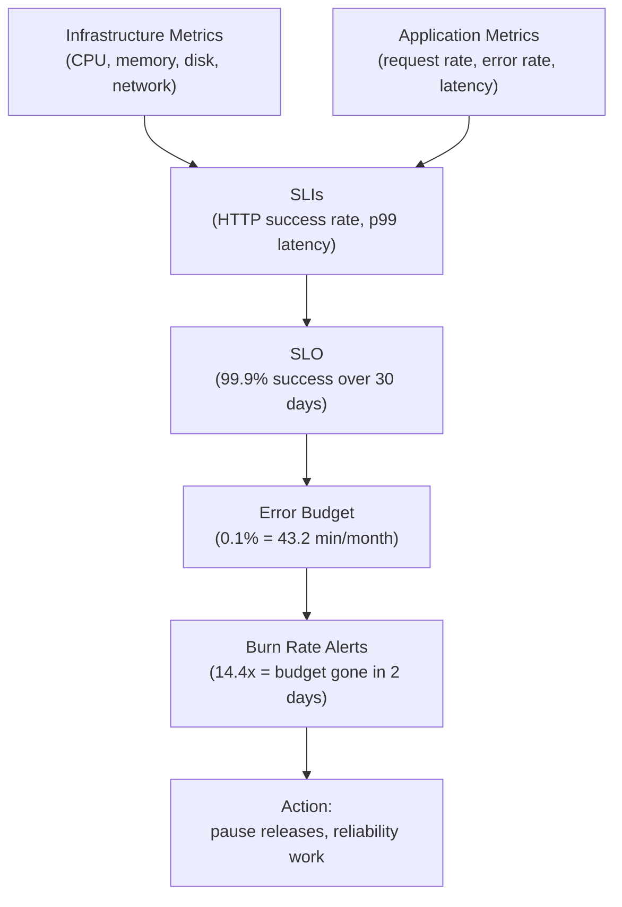

# Module 11: Monitoring & Observability

> **Course**: DevOps Career Path  
> **Audience**: Beginner → Intermediate  
> **Prerequisites**: Module 06 (Kubernetes), Module 07 (Cloud Fundamentals)

[](https://creativecommons.org/licenses/by-nc-sa/4.0/)      

---

## Table of Contents

1. [Overview](#overview)
2. [Learning Objectives](#learning-objectives)
3. [The Three Pillars of Observability](#the-three-pillars-of-observability)
4. [Monitoring Strategy & Metrics Taxonomy](#monitoring-strategy--metrics-taxonomy)
5. [Prometheus](#prometheus)
   - [Architecture](#prometheus-architecture)
   - [Installation & Configuration](#prometheus-installation--configuration)
   - [PromQL](#promql)
   - [Alertmanager](#alertmanager)
   - [Exporters](#exporters)
6. [Grafana](#grafana)
   - [Installation & Data Sources](#grafana-installation--data-sources)
   - [Building Dashboards](#building-dashboards)
   - [Alerting in Grafana](#alerting-in-grafana)
   - [Grafana Loki Integration](#grafana-loki-integration)
7. [Zabbix](#zabbix)
   - [Architecture & Components](#zabbix-architecture--components)
   - [Installation & Initial Setup](#zabbix-installation--initial-setup)
   - [Hosts, Host Groups & Templates](#hosts-host-groups--templates)
   - [Items, Triggers & Actions](#items-triggers--actions)
   - [SNMP Monitoring](#snmp-monitoring)
   - [Zabbix Agent Configuration](#zabbix-agent-configuration)
   - [Web Monitoring & Synthetic Checks](#web-monitoring--synthetic-checks)
   - [Zabbix API](#zabbix-api)
8. [Tool Comparison: Prometheus vs Zabbix vs Datadog](#tool-comparison-prometheus-vs-zabbix-vs-datadog)
9. [Kubernetes Monitoring Stack](#kubernetes-monitoring-stack)
10. [SLIs, SLOs, and Error Budgets](#slis-slos-and-error-budgets)
11. [Advanced: Distributed Tracing with OpenTelemetry](#advanced-distributed-tracing-with-opentelemetry)
12. [Tools & Commands Reference](#tools--commands-reference)
13. [Hands-On Labs](#hands-on-labs)
14. [Further Reading](#further-reading)

---

## Overview

Monitoring and observability are the foundation of reliable production systems. **Monitoring** tells you when something is wrong; **observability** tells you *why*. This module covers the full stack — from metrics collection to dashboarding to alerting — with deep dives into Prometheus, Grafana, and Zabbix.

[↑ Back to TOC](#table-of-contents)

---

## Learning Objectives

By the end of this module, you will be able to:

- Explain the three pillars of observability (metrics, logs, traces)
- Install and configure Prometheus with exporters and Alertmanager
- Write PromQL queries from basic to advanced
- Build production-grade Grafana dashboards with alerting
- Deploy and operate Zabbix for infrastructure and application monitoring
- Configure Zabbix agents, SNMP targets, triggers, and actions
- Use the Zabbix API to automate host registration
- Design SLIs/SLOs and calculate error budgets
- Choose the right monitoring tool for a given context
- Instrument a service with OpenTelemetry and visualize distributed traces in Jaeger or Tempo

[↑ Back to TOC](#table-of-contents)

---

## The Three Pillars of Observability

Observability is not just a collection of dashboards and tools. It is the discipline of making complex systems understandable while they are changing under real load. Traditional monitoring often tells you that something crossed a threshold. Observability goes further by helping you ask new questions during an incident: what changed, which users are affected, where the latency actually lives, and whether the problem is isolated or systemic. That is why modern teams talk about observability as a capability, not simply as a monitoring product.

The distinction between monitoring and observability is worth stating precisely. Monitoring is the act of watching pre-defined signals against pre-defined thresholds. It works well when you can predict all the failure modes in advance. Observability is the property of a system that lets you understand its internal state from external outputs — even for failure modes you have never seen before. Systems become observable through high-cardinality metrics, structured logs, and distributed traces emitted with enough context to answer arbitrary questions. You do not buy observability from a vendor; you build it into the system from the start.

SLIs, SLOs, and SLAs complete the picture by anchoring observability to business outcomes. An SLI (Service Level Indicator) is a specific metric that represents user experience — request success rate, latency at the 99th percentile, or data freshness. An SLO (Service Level Objective) is the target value for that SLI agreed upon by engineering and the business. An SLA (Service Level Agreement) is the contractual commitment made to customers, usually slightly less ambitious than the SLO so there is a buffer before penalties apply. When teams cannot agree on what to alert on, the question to ask is: which SLIs would a customer care about?

The three pillars below are useful because each one answers a different operational question. Metrics tell you whether behavior is trending in a dangerous direction. Logs tell you which events occurred and what the software said at the time. Traces reveal how a single request moved through a distributed system. None of them is sufficient alone. The operational win comes from being able to move between them quickly during debugging and incident response.



```
┌─────────────────────────────────────────────────────────────┐
│                   OBSERVABILITY                             │
│                                                             │
│  ┌──────────┐    ┌──────────┐    ┌──────────────────────┐  │
│  │ METRICS  │    │  LOGS    │    │       TRACES         │  │
│  │          │    │          │    │                      │  │
│  │Prometheus│    │ ELK/Loki │    │  Jaeger / Zipkin /   │  │
│  │ Zabbix   │    │ Fluentd  │    │  OpenTelemetry       │  │
│  │Datadog   │    │ Splunk   │    │                      │  │
│  └──────────┘    └──────────┘    └──────────────────────┘  │
│                                                             │
│  What is         What happened   Where time was spent      │
│  happening now   (events)        (distributed request)     │
└─────────────────────────────────────────────────────────────┘
```

| Pillar | Tool Examples | Best For |
|--------|--------------|----------|
| **Metrics** | Prometheus, Zabbix, Datadog, CloudWatch | Trends, SLOs, alerting, dashboards |
| **Logs** | ELK, Loki, Splunk, Fluentd | Debugging, audit, event history |
| **Traces** | Jaeger, Zipkin, AWS X-Ray, Tempo | Distributed request tracing, latency analysis |

> **OpenTelemetry** (OTel) is the emerging standard that unifies all three pillars under a single SDK/collector.

[↑ Back to TOC](#table-of-contents)

---

## Monitoring Strategy & Metrics Taxonomy

Tools are only as effective as the measurement strategy behind them. Many teams collect huge volumes of data but still struggle during incidents because they never decided which signals actually represent system health. Frameworks like USE, RED, and the Four Golden Signals exist to solve that problem. They give you a way to prioritize metrics that are actionable instead of merely interesting.

The key lesson here is that you should monitor from the perspective of the system you are trying to protect. Infrastructure components need metrics about capacity and failure modes. User-facing services need metrics about request rate, latency, and errors. Good taxonomy helps you choose what to instrument, what to alert on, and what to ignore when noise threatens to overwhelm the team.

### The USE Method (Infrastructure)

| Acronym | Meaning | Example |
|---------|---------|---------|
| **U**tilization | % time resource is busy | CPU utilization: 72% |
| **S**aturation | Queue depth / overflow | Run queue length: 8 |
| **E**rrors | Error events | Disk I/O errors: 3/sec |

### The RED Method (Services/APIs)

| Acronym | Meaning | Example |
|---------|---------|---------|
| **R**ate | Requests per second | 1,500 req/s |
| **E**rrors | Failed requests per second | 12 errors/s (0.8%) |
| **D**uration | Latency distribution | p99: 240ms |

### The Four Golden Signals (Google SRE)

1. **Latency** — how long requests take
2. **Traffic** — how much demand the system handles
3. **Errors** — rate of failed requests
4. **Saturation** — how full the service is

[↑ Back to TOC](#table-of-contents)

---

## Prometheus

Prometheus became the default choice for many cloud-native teams because it fits the way modern systems expose information. Instead of pushing data into a central black box, services and exporters expose metrics over HTTP and Prometheus scrapes them on a schedule. That pull model gives teams a relatively simple, transparent way to understand what is being collected, how often it is collected, and how targets are discovered.

The four metric types Prometheus defines are not interchangeable, and choosing the wrong one is a common source of broken dashboards. A **counter** only ever increases (or resets to zero on restart), which means querying it directly gives you a meaningless absolute number. You must use `rate()` or `increase()` to extract useful information. A **gauge** reflects the current state of something that can go up or down — memory usage, queue depth, active connections — and can usually be used directly. A **histogram** records observations in configurable buckets, which lets you compute approximate quantiles after the fact using `histogram_quantile()`. A **summary** computes quantiles client-side, which is efficient but means you cannot aggregate across instances in PromQL.

Cardinality is the scaling concern that catches teams off guard. Every unique combination of metric name and label values creates a distinct time series stored in Prometheus's TSDB. A metric with 10 label dimensions where each has 10 possible values can generate 10 billion time series if all combinations appear. In practice, this typically happens with labels like `user_id`, `request_id`, or `ip_address` that should never be labels. High cardinality breaks ingestion performance, inflates storage, and makes queries slow. The rule is: only use labels whose cardinality is bounded and operationally meaningful.

Its real power, though, comes from the ecosystem around it: exporters for common systems, PromQL for analysis, Alertmanager for routing, and Grafana for visualization. As you work through the sections below, think of Prometheus less as a dashboard backend and more as a measurement platform. It is the foundation that lets teams standardize metrics collection and turn raw counters into operational decisions.

### Prometheus Architecture



```
┌─────────────────────────────────────────────────────────────┐
│                      PROMETHEUS                             │
│                                                             │
│  ┌──────────────┐   scrape    ┌─────────────────────────┐  │
│  │  Prometheus  │◄────────────│  Exporters / Apps       │  │
│  │   Server     │             │  node_exporter           │  │
│  │              │             │  blackbox_exporter        │  │
│  │  TSDB (local)│             │  cadvisor, mysqld_exp.   │  │
│  └──────┬───────┘             └─────────────────────────┘  │
│         │                                                   │
│         │ push alerts  ┌──────────────────────────────────┐ │
│         └─────────────►│      Alertmanager                │ │
│                        │  route → PagerDuty/Slack/email   │ │
│                        └──────────────────────────────────┘ │
│         │                                                   │
│         │ query         ┌─────────────────────────────────┐ │
│         └──────────────►│         Grafana                 │ │
│                         │  Dashboards + Alerting          │ │
│                         └─────────────────────────────────┘ │
└─────────────────────────────────────────────────────────────┘
```

Prometheus is a **pull-based** monitoring system. It scrapes HTTP endpoints that expose metrics in the Prometheus text format every `scrape_interval` (default: 15s).

[↑ Back to TOC](#table-of-contents)

---

### Prometheus Installation & Configuration

Installation is the easy part; correct configuration is where Prometheus becomes operationally useful. A `prometheus.yml` file is not just a list of targets. It is where you decide scrape frequency, timeout behavior, discovery model, rule loading, and alerting integration. Those choices affect cost, data resolution, troubleshooting quality, and even whether an outage is visible quickly enough to matter.

This is also the point where teams often discover that observability systems need observability too. If your scrape jobs are misconfigured, labels are inconsistent, or targets are frequently flapping, the issue is not only missing data. It is broken trust in the monitoring layer itself. Clean configuration is therefore a reliability concern, not just an aesthetic one.

#### Install via binary (Linux)

```bash
# Download and extract
wget https://github.com/prometheus/prometheus/releases/download/v2.51.0/prometheus-2.51.0.linux-amd64.tar.gz
tar xvf prometheus-2.51.0.linux-amd64.tar.gz
cd prometheus-2.51.0.linux-amd64/

# Run directly
./prometheus --config.file=prometheus.yml
```

#### Core configuration: `prometheus.yml`

```yaml
global:
  scrape_interval: 15s          # How often to scrape targets
  evaluation_interval: 15s      # How often to evaluate rules
  scrape_timeout: 10s

# Alertmanager configuration
alerting:
  alertmanagers:
    - static_configs:
        - targets: ['localhost:9093']

# Load alerting rules
rule_files:
  - "alert_rules.yml"
  - "recording_rules.yml"

# Scrape configurations
scrape_configs:
  # Prometheus self-monitoring
  - job_name: 'prometheus'
    static_configs:
      - targets: ['localhost:9090']

  # Node exporter — Linux host metrics
  - job_name: 'node_exporter'
    static_configs:
      - targets:
          - 'web-01:9100'
          - 'web-02:9100'
          - 'db-01:9100'
    relabel_configs:
      - source_labels: [__address__]
        target_label: instance

  # Kubernetes service discovery
  - job_name: 'kubernetes-pods'
    kubernetes_sd_configs:
      - role: pod
    relabel_configs:
      - source_labels: [__meta_kubernetes_pod_annotation_prometheus_io_scrape]
        action: keep
        regex: "true"
      - source_labels: [__meta_kubernetes_pod_annotation_prometheus_io_path]
        action: replace
        target_label: __metrics_path__
        regex: (.+)

  # HTTP service discovery via file
  - job_name: 'file_sd_example'
    file_sd_configs:
      - files:
          - '/etc/prometheus/targets/*.json'
        refresh_interval: 30s
```

#### Recording rules: `recording_rules.yml`

```yaml
groups:
  - name: node_aggregations
    interval: 1m
    rules:
      # Pre-compute CPU idle percentage
      - record: job:node_cpu_idle:avg_rate5m
        expr: |
          avg by (job) (
            rate(node_cpu_seconds_total{mode="idle"}[5m])
          )

      # Pre-compute memory used percentage
      - record: instance:node_memory_utilisation:ratio
        expr: |
          1 - (
            node_memory_MemAvailable_bytes /
            node_memory_MemTotal_bytes
          )
```

#### Alert rules: `alert_rules.yml`

```yaml
groups:
  - name: node_alerts
    rules:
      - alert: HighCPUUsage
        expr: 100 - (avg by(instance) (rate(node_cpu_seconds_total{mode="idle"}[5m])) * 100) > 85
        for: 5m
        labels:
          severity: warning
        annotations:
          summary: "High CPU usage on {{ $labels.instance }}"
          description: "CPU usage is {{ $value | humanize }}% (threshold: 85%)"

      - alert: HostDown
        expr: up == 0
        for: 1m
        labels:
          severity: critical
        annotations:
          summary: "Host {{ $labels.instance }} is down"
          description: "{{ $labels.job }} target {{ $labels.instance }} is unreachable"

      - alert: DiskSpaceLow
        expr: |
          (node_filesystem_avail_bytes{fstype!~"tmpfs|fuse.lxcfs"} /
           node_filesystem_size_bytes{fstype!~"tmpfs|fuse.lxcfs"}) * 100 < 15
        for: 10m
        labels:
          severity: warning
        annotations:
          summary: "Low disk space on {{ $labels.instance }}"
          description: "Filesystem {{ $labels.mountpoint }} has {{ $value | humanize }}% free"

      - alert: HighMemoryUsage
        expr: instance:node_memory_utilisation:ratio > 0.90
        for: 5m
        labels:
          severity: warning
        annotations:
          summary: "High memory usage on {{ $labels.instance }}"
          description: "Memory utilization is {{ $value | humanizePercentage }}"
```

[↑ Back to TOC](#table-of-contents)

---

### PromQL

PromQL (Prometheus Query Language) is a functional query language for time-series data.

The Prometheus data model is worth understanding before writing queries. Every time series is uniquely identified by a metric name plus a set of label key-value pairs. For example, `http_requests_total{job="api", status="200", instance="web-01:8080"}` is one time series. Add or change any label and you get a different time series. PromQL queries operate over sets of these time series, and most operations — aggregation, filtering, joining — work by matching on label sets. When your queries produce unexpected results, the problem is almost always a label mismatch.

The need for `rate()` and `increase()` instead of direct counter queries follows from how counters work. If you query `http_requests_total` directly, you see a monotonically increasing number that tells you almost nothing useful at a glance. `rate(http_requests_total[5m])` computes per-second average rate over the last five minutes, which is the number that belongs on a dashboard and in an alert expression. `increase()` gives the total increase over the window — useful for things like "how many errors occurred in the last hour." The reason teams new to Prometheus get wrong alerts is usually a counter used without `rate()` or `increase()`.

Recording rules are an important performance tool once dashboards and alerts grow in complexity. They pre-compute expensive PromQL expressions on a schedule and store the result as a new time series. This means a dashboard that would otherwise run a heavy aggregation query on every page load instead reads from a fast pre-computed time series. Recording rules also let you version and test your most important queries like code, rather than leaving them embedded in dashboard JSON where they can drift silently.

PromQL is what turns stored metrics into operational insight. Without a query language, metrics are just labeled numbers sitting in a time-series database. With PromQL, you can ask higher-level questions: what is the current error rate, which endpoints are driving latency, how fast is disk space disappearing, and what would happen if this trend continues for four more hours. Those are the questions on-call engineers and SREs actually need to answer.

The most important habit in PromQL is matching the query to the meaning of the metric. Counters should usually be queried with functions like `rate()` or `increase()`, while gauges can often be used directly. When teams get noisy dashboards or misleading alerts, the problem is frequently not Prometheus itself but a query that ignored how the underlying metric behaves.

#### Metric types

| Type | Description | Example |
|------|-------------|---------|
| **Counter** | Monotonically increasing value, resets on restart | `http_requests_total` |
| **Gauge** | Value that can go up or down | `node_memory_MemFree_bytes` |
| **Histogram** | Sampled observations in configurable buckets | `http_request_duration_seconds` |
| **Summary** | Sliding time window quantiles | `rpc_duration_seconds` |

#### Selectors and matchers

```promql
# Exact match
http_requests_total{job="api", status="200"}

# Regex match
http_requests_total{status=~"2.."}

# Negative regex
http_requests_total{status!~"5.."}

# Range vector (last 5 minutes)
http_requests_total[5m]
```

#### Functions — Beginner

```promql
# Rate of increase (for counters) — prefer rate() over irate()
rate(http_requests_total[5m])

# Instant rate (last two samples — spiky, use for dashboards)
irate(http_requests_total[1m])

# Increase over time window
increase(http_requests_total[1h])

# Current CPU utilization per instance
100 - (avg by(instance) (rate(node_cpu_seconds_total{mode="idle"}[5m])) * 100)

# Memory used percentage
(1 - (node_memory_MemAvailable_bytes / node_memory_MemTotal_bytes)) * 100
```

#### Functions — Intermediate

```promql
# Aggregation operators
sum(rate(http_requests_total[5m]))                    # total req/s
sum by(status) (rate(http_requests_total[5m]))        # by status code
avg by(instance) (node_load1)                         # average 1m load
topk(5, rate(http_requests_total[5m]))                # top 5 endpoints

# Histogram quantiles
histogram_quantile(0.99, rate(http_request_duration_seconds_bucket[5m]))
histogram_quantile(0.50, sum by(le) (rate(http_request_duration_seconds_bucket[5m])))

# Predict disk exhaustion (linear extrapolation)
predict_linear(node_filesystem_free_bytes[1h], 4*3600) < 0

# Absent — alert if metric disappears
absent(up{job="api"})

# Subquery — evaluate expression over time
max_over_time(rate(http_requests_total[5m])[1h:5m])

# Label manipulation
label_replace(
  rate(http_requests_total[5m]),
  "short_instance", "$1", "instance", "([^:]+):.*"
)
```

[↑ Back to TOC](#table-of-contents)

---

### Alertmanager

Alertmanager handles deduplication, grouping, silencing, and routing of alerts fired by Prometheus.

Alert fatigue is primarily an organisational failure, not a tooling problem. When alerts fire constantly, engineers stop trusting them, start ignoring them, or disable them — which means the next real incident arrives silently. The root cause is almost always alerts written to catch causes rather than symptoms. A disk filling at 80% may not matter if the system will scale storage before it hits 100%. An alert on a single high CPU spike may not matter if the load balancer already redistributed the traffic. Alerting on symptoms (latency is high, requests are failing, error budget is burning) keeps pages actionable and rare.

The Four Golden Signals provide a practical framework for choosing what to alert on. **Latency** should be measured at the user-facing edge and alerted on percentile degradation, not averages. **Traffic** alerts tell you whether demand is normal or whether something upstream changed unexpectedly. **Errors** are typically the most direct indicator of user impact and should always be watched at low thresholds. **Saturation** — how close the system is to its capacity limits — is the leading indicator for problems that have not become visible yet. Together, these four signals cover most incident-level conditions for any service.

Alerting is where observability either becomes operationally valuable or turns into fatigue. Prometheus can detect conditions, but Alertmanager decides how those detections reach humans. Grouping, routing, inhibition, and silencing are not optional extras. They are the controls that keep a minor outage from generating hundreds of duplicate pages or a known maintenance event from waking the wrong person at 3 a.m.

Good alerting design reflects team structure and incident process. Critical alerts should page the people who can act immediately. Warning alerts may belong in chat or during business hours only. Suppression rules should prevent downstream symptom alerts from hiding the true root cause. The configuration below matters because it encodes those operational decisions into the alert flow itself.



#### `alertmanager.yml`

```yaml
global:
  smtp_smarthost: 'smtp.example.com:587'
  smtp_from: 'alerts@example.com'
  smtp_auth_username: 'alerts@example.com'
  smtp_auth_password: 'secret'
  resolve_timeout: 5m

# Notification templates
templates:
  - '/etc/alertmanager/templates/*.tmpl'

route:
  # Default receiver
  receiver: 'team-ops-slack'
  group_by: ['alertname', 'cluster', 'service']
  group_wait: 30s        # Wait before sending first notification
  group_interval: 5m     # Wait before sending update notification
  repeat_interval: 3h    # Re-notify if still firing

  routes:
    # Critical alerts → PagerDuty
    - match:
        severity: critical
      receiver: 'pagerduty-critical'
      continue: false

    # Database alerts → DB team
    - match_re:
        alertname: '^(MySQL|Postgres|Redis).*'
      receiver: 'team-db-email'

    # Business hours only for warnings
    - match:
        severity: warning
      receiver: 'team-ops-slack'
      active_time_intervals:
        - business_hours

time_intervals:
  - name: business_hours
    time_intervals:
      - weekdays: ['monday:friday']
        times:
          - start_time: '08:00'
            end_time: '18:00'

inhibit_rules:
  # If host is down, inhibit all other alerts from that host
  - source_match:
      alertname: 'HostDown'
    target_match_re:
      alertname: '.+'
    equal: ['instance']

receivers:
  - name: 'team-ops-slack'
    slack_configs:
      - api_url: 'https://hooks.slack.com/services/XXXX/YYYY/ZZZZ'
        channel: '#alerts-ops'
        title: '{{ template "slack.title" . }}'
        text: '{{ template "slack.text" . }}'
        send_resolved: true

  - name: 'pagerduty-critical'
    pagerduty_configs:
      - service_key: '<pagerduty-integration-key>'
        description: '{{ .CommonAnnotations.summary }}'

  - name: 'team-db-email'
    email_configs:
      - to: 'dbteam@example.com'
        send_resolved: true
```

[↑ Back to TOC](#table-of-contents)

---

### Exporters

Exporters expose metrics from third-party systems in the Prometheus format.

Exporters are a major reason the Prometheus ecosystem scales beyond custom applications. Most infrastructure components were not built to expose Prometheus metrics natively, but they often expose enough local state for a dedicated exporter to translate into a common format. That lets teams monitor hosts, databases, message queues, proxies, and network devices with a shared query model instead of inventing a separate monitoring approach for each one.

The tradeoff is that exporters are not magic. They expose what they are designed to expose, which means you still need to understand the monitored system well enough to choose the right metrics and alerts. Installing `node_exporter` is easy. Knowing which disk, CPU, filesystem, or saturation signals actually predict trouble is the more valuable skill.

| Exporter | Port | Monitors |
|----------|------|----------|
| `node_exporter` | 9100 | Linux host: CPU, memory, disk, network |
| `blackbox_exporter` | 9115 | HTTP/HTTPS/TCP/ICMP endpoints |
| `mysqld_exporter` | 9104 | MySQL / MariaDB |
| `postgres_exporter` | 9187 | PostgreSQL |
| `redis_exporter` | 9121 | Redis |
| `nginx_exporter` | 9113 | Nginx (via stub_status) |
| `cadvisor` | 8080 | Docker/container metrics |
| `kube-state-metrics` | 8080 | Kubernetes object states |
| `snmp_exporter` | 9116 | SNMP devices (network gear) |
| `elasticsearch_exporter` | 9114 | Elasticsearch cluster |
| `haproxy_exporter` | 9101 | HAProxy |

#### node_exporter quick start

```bash
# Download and run node_exporter
wget https://github.com/prometheus/node_exporter/releases/download/v1.8.0/node_exporter-1.8.0.linux-amd64.tar.gz
tar xvf node_exporter-1.8.0.linux-amd64.tar.gz
./node_exporter-1.8.0.linux-amd64/node_exporter &

# Verify metrics endpoint
curl http://localhost:9100/metrics | head -20
```

#### blackbox_exporter — probe HTTP endpoints

```yaml
# blackbox.yml
modules:
  http_2xx:
    prober: http
    timeout: 10s
    http:
      valid_http_versions: ["HTTP/1.1", "HTTP/2.0"]
      valid_status_codes: [200, 201]
      method: GET
      follow_redirects: true
      tls_config:
        insecure_skip_verify: false

  tcp_connect:
    prober: tcp
    timeout: 5s

  icmp_ping:
    prober: icmp
    timeout: 5s
```

```yaml
# prometheus.yml scrape config for blackbox
- job_name: 'blackbox_http'
  metrics_path: /probe
  params:
    module: [http_2xx]
  static_configs:
    - targets:
        - https://example.com
        - https://api.example.com/health
  relabel_configs:
    - source_labels: [__address__]
      target_label: __param_target
    - source_labels: [__param_target]
      target_label: instance
    - target_label: __address__
      replacement: localhost:9115
```

[↑ Back to TOC](#table-of-contents)

---

## Grafana

Grafana matters because raw metrics and alerts are rarely enough by themselves. Operators need a place to compare signals, build dashboards around service ownership, and move from detection into investigation quickly. Grafana provides that presentation layer, but its real value comes from how it links different data sources together. A useful dashboard helps a team answer not just "is the service broken?" but also "for whom, since when, and alongside which other symptoms?"

The USE method (Utilization, Saturation, Errors) and RED method (Rate, Errors, Duration) are design frameworks that prevent dashboards from becoming collections of arbitrary panels. USE is best suited to infrastructure resources — nodes, disks, network interfaces — where you want to understand capacity and failure modes. RED is suited to user-facing services and APIs, where you want to understand throughput, reliability, and latency distribution. A well-designed monitoring setup has both: a USE-oriented infrastructure overview and RED-oriented service dashboards for each team's critical workloads.

Dashboard storytelling matters for operational effectiveness. The best dashboards are structured in layers: a top-level overview that shows whether anything is wrong, service-level dashboards that reveal which component is degraded, and component-level panels that give the diagnostic detail needed to fix it. An engineer picking up an on-call shift should be able to start at the top and drill down in under two minutes. Dashboards that require deep knowledge of the system to interpret fail this test — and they fail precisely when they are needed most, during incidents with unfamiliar engineers on call.

That is why good dashboard design is a reliability practice, not just a reporting exercise. Clear dashboards reduce cognitive load during incidents, support handoffs between engineers, and make trends visible before they turn into pages. The sections below focus on provisioning and panel patterns because the best dashboards are usually treated as code and improved iteratively, not built once in a UI and forgotten.



### Grafana Installation & Data Sources

#### Install via package manager

```bash
# Add Grafana repo (RHEL/CentOS)
cat > /etc/yum.repos.d/grafana.repo << 'EOF'
[grafana]
name=grafana
baseurl=https://packages.grafana.com/oss/rpm
repo_gpgcheck=1
enabled=1
gpgcheck=1
gpgkey=https://packages.grafana.com/gpg.key
EOF

dnf install grafana -y
systemctl enable --now grafana-server

# Default: http://localhost:3000  admin/admin
```

```bash
# Ubuntu/Debian
apt-get install -y apt-transport-https software-properties-common
wget -q -O - https://packages.grafana.com/gpg.key | apt-key add -
echo "deb https://packages.grafana.com/oss/deb stable main" | tee /etc/apt/sources.list.d/grafana.list
apt-get update && apt-get install grafana -y
systemctl enable --now grafana-server
```

#### Provision data sources via YAML (GitOps-friendly)

```yaml
# /etc/grafana/provisioning/datasources/prometheus.yml
apiVersion: 1

datasources:
  - name: Prometheus
    type: prometheus
    access: proxy
    url: http://prometheus:9090
    isDefault: true
    editable: false
    jsonData:
      httpMethod: POST
      exemplarTraceIdDestinations:
        - name: traceID
          datasourceUid: tempo

  - name: Loki
    type: loki
    access: proxy
    url: http://loki:3100
    editable: false

  - name: Alertmanager
    type: alertmanager
    access: proxy
    url: http://alertmanager:9093
    jsonData:
      implementation: prometheus
```

[↑ Back to TOC](#table-of-contents)

---

### Building Dashboards

#### Dashboard JSON provisioning

```yaml
# /etc/grafana/provisioning/dashboards/default.yml
apiVersion: 1

providers:
  - name: 'default'
    orgId: 1
    folder: 'Provisioned'
    type: file
    disableDeletion: true
    updateIntervalSeconds: 30
    options:
      path: /etc/grafana/dashboards
```

#### Key panel types and use cases

| Panel | Use Case | Recommended Visualization |
|-------|----------|--------------------------|
| **Time series** | Metrics over time | Line / bar chart |
| **Stat** | Single current value | Big number + sparkline |
| **Gauge** | Value vs threshold | Gauge / bar gauge |
| **Table** | Multi-dimensional data | Tabular |
| **Heatmap** | Distribution over time | Histogram buckets |
| **Logs** | Log lines (Loki) | Log list |
| **Alert list** | Active alerts | Alert list |

#### Useful variables for dynamic dashboards

```
# In Dashboard Settings → Variables

Name: instance
Type: Query
Data source: Prometheus
Query: label_values(node_uname_info, instance)
Refresh: On dashboard load
Multi-value: true
Include All: true
```

#### Example panel query — Request Rate

```promql
# Panel title: HTTP Request Rate
sum by(status_code) (
  rate(http_requests_total{instance=~"$instance"}[5m])
)
```

[↑ Back to TOC](#table-of-contents)

---

### Alerting in Grafana

Grafana Unified Alerting (v9+) supports multi-datasource alerting.

```yaml
# Alert rule (via API or UI)
# Group: Infrastructure
# Rule: High CPU

Condition:
  Query A: avg(100 - (avg by(instance)(rate(node_cpu_seconds_total{mode="idle"}[5m]))*100))
  Threshold: IS ABOVE 85
  For: 5m

Labels:
  severity: warning
  team: ops

Annotations:
  summary: High CPU usage detected
  runbook: https://wiki.example.com/runbooks/high-cpu
```

#### Contact points

- Slack, PagerDuty, OpsGenie, email, webhook
- Configure in **Alerting → Contact points**
- Link via **Notification policies** (tree routing, similar to Alertmanager)

[↑ Back to TOC](#table-of-contents)

---

### Grafana Loki Integration

```promql
# LogQL — query Nginx access logs for 5xx errors
{job="nginx"} |= "HTTP/1.1\" 5"

# Parse and extract fields
{job="nginx"} | pattern `<_> "<method> <path> <_>" <status> <_>` | status >= 500

# Rate of error log lines
rate({job="app", level="error"}[5m])

# Metric from logs — count 500 errors per minute
sum(rate({job="nginx"} |= "\" 5" [1m]))
```

[↑ Back to TOC](#table-of-contents)

---

## Zabbix

Zabbix remains important because not every environment looks like Kubernetes plus microservices. Many organizations still run a large amount of traditional infrastructure: physical servers, VMs, network devices, appliances, and legacy systems that benefit from agent-based checks, SNMP support, and an integrated monitoring stack. Zabbix is especially strong when a team wants one platform that can collect data, store history, evaluate triggers, and present dashboards without assembling several separate tools.

That makes Zabbix a useful complement to the Prometheus worldview rather than merely an alternative. Prometheus excels in cloud-native ecosystems; Zabbix often shines in mixed or traditional estates where host inventory, built-in templates, and infrastructure-centric monitoring are the dominant needs. Understanding both helps you choose based on environment reality instead of trend preference.

### Zabbix Architecture & Components

```
┌──────────────────────────────────────────────────────────────────┐
│                         ZABBIX                                   │
│                                                                  │
│  ┌──────────────────┐      ┌──────────────────────────────────┐  │
│  │  Zabbix Server   │◄─────│  Zabbix Agent (on monitored host)│  │
│  │  (Central node)  │      │  Active or Passive mode          │  │
│  │                  │      └──────────────────────────────────┘  │
│  │  ┌────────────┐  │                                            │
│  │  │  Database  │  │      ┌──────────────────────────────────┐  │
│  │  │(MySQL/PgSQL│  │◄─────│  Zabbix Proxy (optional)         │  │
│  │  │  /Oracle)  │  │      │  For distributed/remote sites    │  │
│  │  └────────────┘  │      └──────────────────────────────────┘  │
│  └────────┬─────────┘                                            │
│           │                ┌──────────────────────────────────┐  │
│           └───────────────►│  Zabbix Frontend (Web UI + API)  │  │
│                            │  Apache/Nginx + PHP              │  │
│                            └──────────────────────────────────┘  │
│                                                                  │
│  Also monitors via:  SNMP / IPMI / JMX / SSH / Telnet / HTTP    │
└──────────────────────────────────────────────────────────────────┘
```

#### Key components

| Component | Role |
|-----------|------|
| **Zabbix Server** | Core process — collects data, evaluates triggers, sends notifications |
| **Zabbix Agent** | Lightweight daemon on monitored host — collects local metrics |
| **Zabbix Agent 2** | Next-gen agent with plugin support (Go-based) |
| **Zabbix Proxy** | Collects data on behalf of server — used for distributed monitoring |
| **Zabbix Frontend** | PHP web application — configuration UI, dashboards, reports |
| **Database** | Stores all configuration and historical data (MySQL/MariaDB, PostgreSQL) |

[↑ Back to TOC](#table-of-contents)

---

### Zabbix Installation & Initial Setup

#### Install Zabbix 6.x on RHEL/CentOS

```bash
# Install Zabbix repository
rpm -Uvh https://repo.zabbix.com/zabbix/6.4/rhel/9/x86_64/zabbix-release-6.4-1.el9.noarch.rpm
dnf clean all

# Install Zabbix server, frontend, and agent
dnf install -y zabbix-server-mysql zabbix-web-mysql \
               zabbix-apache-conf zabbix-sql-scripts \
               zabbix-selinux-policy zabbix-agent

# Install and configure MariaDB
dnf install -y mariadb-server
systemctl enable --now mariadb
mysql_secure_installation
```

```sql
-- Create Zabbix database
CREATE DATABASE zabbix CHARACTER SET utf8mb4 COLLATE utf8mb4_bin;
CREATE USER 'zabbix'@'localhost' IDENTIFIED BY 'StrongPassword123!';
GRANT ALL PRIVILEGES ON zabbix.* TO 'zabbix'@'localhost';
FLUSH PRIVILEGES;
```

```bash
# Import initial schema
zcat /usr/share/zabbix-sql-scripts/mysql/server.sql.gz | mysql --default-character-set=utf8mb4 -uzabbix -p zabbix

# Configure Zabbix server
# Edit /etc/zabbix/zabbix_server.conf
DBPassword=StrongPassword123!

# Start services
systemctl enable --now zabbix-server zabbix-agent httpd php-fpm

# Web setup: http://<server>/zabbix
# Default credentials: Admin / zabbix  (CHANGE IMMEDIATELY)
```

#### `/etc/zabbix/zabbix_server.conf` — key settings

```ini
# Database
DBHost=localhost
DBName=zabbix
DBUser=zabbix
DBPassword=StrongPassword123!

# Performance tuning
StartPollers=10
StartPollersUnreachable=3
StartTrappers=5
StartPingers=3
StartDiscoverers=3
CacheSize=256M
HistoryCacheSize=64M
HistoryIndexCacheSize=16M
TrendCacheSize=32M
ValueCacheSize=128M

# Housekeeping — keep 1 year of history, 5 years of trends
HousekeepingFrequency=1
MaxHousekeeperDelete=5000

# Logging
LogFile=/var/log/zabbix/zabbix_server.log
LogFileSize=100
DebugLevel=3
```

[↑ Back to TOC](#table-of-contents)

---

### Hosts, Host Groups & Templates

#### Concepts

| Concept | Description |
|---------|-------------|
| **Host** | A device or service to be monitored (server, switch, URL) |
| **Host Group** | Logical grouping (Linux servers, Network devices, Production) |
| **Template** | Reusable collection of items, triggers, graphs, dashboards |
| **Interface** | How Zabbix connects to the host (Agent, SNMP, JMX, IPMI) |

#### Registering hosts via Zabbix web UI

1. Go to **Configuration → Hosts → Create host**
2. Fill in: **Host name**, **Groups**, **Interfaces** (IP + port)
3. Link template: **Templates** tab → search and add (e.g., `Linux by Zabbix agent`)
4. Click **Add**

#### Built-in templates (selection)

| Template | Monitors |
|----------|----------|
| `Linux by Zabbix agent` | CPU, memory, disk, network, processes |
| `Windows by Zabbix agent` | CPU, memory, disk, services, event log |
| `MySQL by Zabbix agent` | Queries, connections, replication lag |
| `Nginx by Zabbix agent` | Requests, connections, status |
| `Kubernetes cluster by HTTP` | Nodes, pods, deployments |
| `Cisco IOS by SNMP` | Interfaces, CPU, memory |
| `Network interfaces by SNMP` | Generic SNMP interface monitoring |

[↑ Back to TOC](#table-of-contents)

---

### Items, Triggers & Actions

#### Items

Items define **what** data to collect. Each item has a **key** that specifies the metric.

| Item key | Description | Type |
|----------|-------------|------|
| `system.cpu.util[,idle]` | CPU idle % | Zabbix agent |
| `vm.memory.size[available]` | Available memory bytes | Zabbix agent |
| `vfs.fs.size[/,pfree]` | Free disk % on / | Zabbix agent |
| `net.if.in[eth0]` | Network in bytes/sec | Zabbix agent |
| `proc.num[nginx]` | Number of nginx processes | Zabbix agent |
| `web.test.fail[My web scenario]` | Web scenario last failed step | Web |
| `snmp.walk[1.3.6.1.2.1.1.5.0]` | SNMP OID — sysName | SNMP |

#### Custom item (via UI)

```
Configuration → Hosts → [host] → Items → Create item

Name:        Free disk space on /var
Type:        Zabbix agent
Key:         vfs.fs.size[/var,pfree]
Type of info: Numeric (float)
Units:       %
Update interval: 1m
History:     90d
Trends:      365d
```

#### Triggers

Triggers define **when** to alert. They evaluate item values using expressions.

```
# Trigger expression examples

# CPU high for 5 minutes
avg(/My Host/system.cpu.util[,idle],5m)<10

# Disk free below 10%
last(/My Host/vfs.fs.size[/,pfree])<10

# Host unreachable
{My Host:agent.ping.nodata(3m)}=1

# MySQL replication lag > 60 seconds
last(/My Host/mysql.replication.lag)>60

# Service restart (uptime reset)
(last(/My Host/system.uptime)<10m) and (change(/My Host/system.uptime)<0)
```

#### Trigger severity levels

| Severity | Color | Use |
|----------|-------|-----|
| Not classified | Grey | Informational |
| Information | Blue | FYI events |
| Warning | Yellow | Soft threshold breach |
| Average | Orange | Needs attention |
| High | Red | Production impact |
| Disaster | Dark red | Critical outage |

#### Actions

Actions define **what to do** when a trigger fires.

```
Configuration → Actions → Trigger actions → Create action

Conditions:
  - Trigger severity >= High
  - Host group in {Linux Servers}

Operations (PROBLEM):
  - Send message to user group: On-Call
  - Send message via: Slack webhook
  - Delay before: 0s

Recovery operations:
  - Send message: "Problem resolved"

Update operations:
  - Notify when acknowledged
```

[↑ Back to TOC](#table-of-contents)

---

### SNMP Monitoring

SNMP (Simple Network Management Protocol) is used to monitor network devices, switches, routers, printers, and UPSes.

#### Add SNMP host in Zabbix

1. **Configuration → Hosts → Create host**
2. **Interfaces** → Add → Type: **SNMP**
3. IP: `192.168.1.1` Port: `161`
4. **Templates** tab → Add `Cisco IOS by SNMP` or `Network interfaces by SNMP`

#### SNMP configuration on the host (Linux)

```bash
# Install net-snmp
dnf install -y net-snmp net-snmp-utils

# /etc/snmp/snmpd.conf
rocommunity  public   127.0.0.1
rocommunity  zabbix_ro  192.168.1.10     # Allow Zabbix server
syslocation  "DataCenter Row 3 Rack 7"
syscontact   ops@example.com

systemctl enable --now snmpd

# Test from Zabbix server
snmpwalk -v2c -c zabbix_ro 192.168.1.5 system
snmpget -v2c -c zabbix_ro 192.168.1.5 .1.3.6.1.2.1.1.5.0
```

#### SNMPv3 (secure)

```ini
# /etc/snmp/snmpd.conf
createUser zabbixUser SHA "AuthPassword123" AES "PrivPassword456"
rouser     zabbixUser priv
```

```
# Zabbix host interface — SNMPv3
SNMP version:   SNMPv3
Security name:  zabbixUser
Security level: authPriv
Auth protocol:  SHA1
Auth passphrase: AuthPassword123
Priv protocol:  AES128
Priv passphrase: PrivPassword456
```

#### Common SNMP OIDs

| OID | Description |
|-----|-------------|
| `.1.3.6.1.2.1.1.1.0` | sysDescr |
| `.1.3.6.1.2.1.1.3.0` | sysUpTime (timeticks) |
| `.1.3.6.1.2.1.1.5.0` | sysName |
| `.1.3.6.1.2.1.2.2.1.10` | ifInOctets (per interface) |
| `.1.3.6.1.2.1.2.2.1.16` | ifOutOctets |
| `.1.3.6.1.4.1.9.2.1.56.0` | Cisco CPU 5m avg |

[↑ Back to TOC](#table-of-contents)

---

### Zabbix Agent Configuration

#### `/etc/zabbix/zabbix_agent2.conf` (Agent 2)

```ini
# Connection to Zabbix Server
Server=192.168.1.10
ServerActive=192.168.1.10
Hostname=web-server-01       # Must match hostname in Zabbix UI

# Logging
LogFile=/var/log/zabbix/zabbix_agent2.log
LogFileSize=10
DebugLevel=3

# TLS (optional — recommended for production)
TLSConnect=cert
TLSAccept=cert
TLSCAFile=/etc/zabbix/tls/ca.crt
TLSCertFile=/etc/zabbix/tls/agent.crt
TLSKeyFile=/etc/zabbix/tls/agent.key

# Custom user parameters
UserParameter=custom.nginx.active,curl -s http://127.0.0.1/nginx_status | awk 'NR==1{print $3}'
UserParameter=app.queue.depth,redis-cli llen job_queue

# Timeout
Timeout=30

# Allow agent to be monitored remotely (check status)
AllowKey=system.run[*]
```

```bash
# Start agent
systemctl enable --now zabbix-agent2

# Test item key locally
zabbix_agent2 -t system.cpu.util[,idle]
zabbix_agent2 -t vfs.fs.size[/,pfree]
zabbix_agent2 -t custom.nginx.active
```

#### Active vs Passive checks

| Mode | Direction | Use case |
|------|-----------|----------|
| **Passive** | Server → Agent (pull) | Default; server initiates connection |
| **Active** | Agent → Server (push) | Firewall restrictions; agent behind NAT; better scalability |

For active checks, set `ServerActive=` and ensure `Hostname=` matches exactly.

[↑ Back to TOC](#table-of-contents)

---

### Web Monitoring & Synthetic Checks

Zabbix web scenarios simulate browser sessions to test application availability and performance.

#### Create a web scenario

```
Configuration → Hosts → [host] → Web → Create web scenario

Name: E-commerce Checkout Flow
Agent: Mozilla/5.0 (compatible)
Update interval: 5m
Attempts: 3

Steps:
  1. Name: Load homepage
     URL: https://shop.example.com/
     Required: "Welcome"
     Status codes: 200

  2. Name: Login page
     URL: https://shop.example.com/login
     Required: "Sign in"
     Status codes: 200

  3. Name: Submit login
     URL: https://shop.example.com/login
     Post: username=testuser&password=testpass
     Required: "My Account"
     Status codes: 200

  4. Name: View cart
     URL: https://shop.example.com/cart
     Required: "Your Cart"
     Status codes: 200
```

#### Automatically generated items

| Item key | Description |
|----------|-------------|
| `web.test.fail[Checkout Flow]` | Step number that failed (0 = success) |
| `web.test.time[Checkout Flow,Load homepage,resp]` | Response time for step |
| `web.test.rspcode[Checkout Flow,Submit login]` | HTTP status code |

[↑ Back to TOC](#table-of-contents)

---

### Zabbix API

The Zabbix API allows full automation of host management, template assignment, and reporting.

#### Authenticate and get auth token

```bash
curl -s -X POST \
  -H "Content-Type: application/json-rpc" \
  -d '{
    "jsonrpc": "2.0",
    "method": "user.login",
    "params": {
      "username": "Admin",
      "password": "zabbix"
    },
    "id": 1
  }' \
  http://zabbix.example.com/zabbix/api_jsonrpc.php
```

#### Create a host via API

```bash
AUTH_TOKEN="your_auth_token_here"

curl -s -X POST \
  -H "Content-Type: application/json-rpc" \
  -d "{
    \"jsonrpc\": \"2.0\",
    \"method\": \"host.create\",
    \"params\": {
      \"host\": \"app-server-05\",
      \"name\": \"Application Server 05\",
      \"groups\": [{\"groupid\": \"2\"}],
      \"interfaces\": [{
        \"type\": 1,
        \"main\": 1,
        \"useip\": 1,
        \"ip\": \"192.168.1.55\",
        \"dns\": \"\",
        \"port\": \"10050\"
      }],
      \"templates\": [{\"templateid\": \"10001\"}]
    },
    \"auth\": \"${AUTH_TOKEN}\",
    \"id\": 2
  }" \
  http://zabbix.example.com/zabbix/api_jsonrpc.php
```

#### Python automation example

```python
#!/usr/bin/env python3
"""Automate Zabbix host registration from a CMDB inventory."""

import requests
import json

ZABBIX_URL = "http://zabbix.example.com/zabbix/api_jsonrpc.php"
HEADERS = {"Content-Type": "application/json-rpc"}


def zabbix_login(username: str, password: str) -> str:
    """Authenticate and return auth token."""
    payload = {
        "jsonrpc": "2.0",
        "method": "user.login",
        "params": {"username": username, "password": password},
        "id": 1,
    }
    response = requests.post(ZABBIX_URL, headers=HEADERS, json=payload)
    return response.json()["result"]


def get_template_id(auth: str, template_name: str) -> str:
    """Look up template ID by name."""
    payload = {
        "jsonrpc": "2.0",
        "method": "template.get",
        "params": {"output": ["templateid"], "filter": {"host": [template_name]}},
        "auth": auth,
        "id": 2,
    }
    result = requests.post(ZABBIX_URL, headers=HEADERS, json=payload).json()
    return result["result"][0]["templateid"]


def create_host(auth: str, hostname: str, ip: str, group_id: str, template_id: str) -> dict:
    """Register a new host in Zabbix."""
    payload = {
        "jsonrpc": "2.0",
        "method": "host.create",
        "params": {
            "host": hostname,
            "groups": [{"groupid": group_id}],
            "interfaces": [{
                "type": 1, "main": 1, "useip": 1,
                "ip": ip, "dns": "", "port": "10050"
            }],
            "templates": [{"templateid": template_id}],
        },
        "auth": auth,
        "id": 3,
    }
    return requests.post(ZABBIX_URL, headers=HEADERS, json=payload).json()


if __name__ == "__main__":
    servers = [
        {"hostname": "web-01", "ip": "10.0.1.10"},
        {"hostname": "web-02", "ip": "10.0.1.11"},
        {"hostname": "db-01",  "ip": "10.0.1.20"},
    ]

    token = zabbix_login("Admin", "zabbix")
    tmpl_id = get_template_id(token, "Linux by Zabbix agent")

    for server in servers:
        result = create_host(token, server["hostname"], server["ip"], "2", tmpl_id)
        print(f"Created {server['hostname']}: {result.get('result', result.get('error'))}")
```

[↑ Back to TOC](#table-of-contents)

---

## Tool Comparison: Prometheus vs Zabbix vs Datadog

By this point, the question is no longer which tool is "best" in the abstract. The better question is which tool matches your operating model, staffing level, and environment complexity. Every monitoring platform makes tradeoffs around ownership, flexibility, setup effort, and long-term cost. Comparing them side by side is useful because teams often inherit constraints such as on-prem infrastructure, compliance requirements, or a preference for managed services.

Use the table below as a decision aid, not as a verdict. In practice, many organizations use more than one observability approach at the same time: Prometheus for Kubernetes metrics, Zabbix for network gear and legacy hosts, and a SaaS platform for centralized executive visibility or cross-team analysis. Tool boundaries often follow organizational and technical boundaries.

| Feature | Prometheus | Zabbix | Datadog |
|---------|-----------|--------|---------|
| **Model** | Pull (scrape) | Pull/Push (agent) | Push (agent) |
| **Storage** | TSDB (local/remote) | RDBMS (MySQL/PgSQL) | SaaS cloud |
| **Query language** | PromQL | Custom expression | Metrics QL |
| **Alerting** | Alertmanager | Built-in | Built-in |
| **Dashboards** | Grafana (separate) | Built-in | Built-in |
| **SNMP support** | Via snmp_exporter | Native built-in | Via integration |
| **Agent required** | Optional (exporters) | Required (agent) | Required |
| **Kubernetes native** | Excellent | Good (agent2) | Good |
| **Network monitoring** | Limited | Excellent | Good |
| **Cost** | Free/OSS | Free/OSS (paid Enterprise) | Paid SaaS |
| **Scaling** | Thanos/Cortex/VictoriaMetrics | Zabbix Proxy | Managed |
| **Best for** | Cloud-native, Kubernetes | On-prem, network, SNMP, legacy | SaaS convenience |

> **Recommendation**: Use **Prometheus + Grafana** for cloud-native workloads and Kubernetes. Use **Zabbix** for on-premises infrastructure, network device monitoring (SNMP), and environments where an RDBMS-backed history is preferred. Use **Datadog** when budget allows and you want a managed observability platform.

[↑ Back to TOC](#table-of-contents)

---

## Kubernetes Monitoring Stack

Kubernetes monitoring deserves separate treatment because clusters introduce layers of abstraction that hide failure in ways traditional host monitoring does not. You need visibility into nodes, pods, control plane components, workloads, service discovery, resource quotas, and application metrics all at once. A cluster can look healthy at the node level while still dropping traffic because of failing pods, misconfigured services, or readiness problems.

That is why the Kubernetes ecosystem leans toward operator-managed stacks such as kube-prometheus-stack. They bundle the components and custom resources needed to turn monitoring into part of the cluster platform. The examples below show how monitoring becomes declarative inside Kubernetes, so scrape targets and alert rules can evolve with the applications they observe.

### kube-prometheus-stack (Helm)

```bash
# Add Prometheus community Helm repo
helm repo add prometheus-community https://prometheus-community.github.io/helm-charts
helm repo update

# Install the full stack:
# Prometheus Operator, Prometheus, Alertmanager, Grafana, node-exporter, kube-state-metrics
helm install kube-prometheus-stack prometheus-community/kube-prometheus-stack \
  --namespace monitoring \
  --create-namespace \
  --set grafana.adminPassword=changeme \
  --set prometheus.prometheusSpec.retention=30d \
  --set prometheus.prometheusSpec.storageSpec.volumeClaimTemplate.spec.resources.requests.storage=50Gi
```

#### ServiceMonitor — tell Prometheus to scrape your app

```yaml
# Your application exposes metrics at /metrics on port 8080
apiVersion: monitoring.coreos.com/v1
kind: ServiceMonitor
metadata:
  name: my-api-monitor
  namespace: monitoring
  labels:
    release: kube-prometheus-stack
spec:
  selector:
    matchLabels:
      app: my-api
  namespaceSelector:
    matchNames:
      - production
  endpoints:
    - port: metrics
      path: /metrics
      interval: 30s
```

#### PrometheusRule — define alerts as code

```yaml
apiVersion: monitoring.coreos.com/v1
kind: PrometheusRule
metadata:
  name: my-api-alerts
  namespace: monitoring
  labels:
    release: kube-prometheus-stack
spec:
  groups:
    - name: my-api
      rules:
        - alert: ApiHighErrorRate
          expr: |
            sum(rate(http_requests_total{job="my-api",status=~"5.."}[5m]))
            /
            sum(rate(http_requests_total{job="my-api"}[5m])) > 0.05
          for: 5m
          labels:
            severity: warning
          annotations:
            summary: "High error rate on my-api"
            description: "Error rate is {{ $value | humanizePercentage }}"
```

[↑ Back to TOC](#table-of-contents)

---

## SLIs, SLOs, and Error Budgets

Metrics become strategically useful when they are tied to reliability goals the business actually cares about. SLIs, SLOs, and error budgets provide that bridge. They convert abstract telemetry into a contract about user experience: how often the service should succeed, how fast it should respond, and how much failure is acceptable before reliability work should take priority over feature work.

This framing changes the conversation during planning and incidents. Instead of debating whether a problem "feels bad," teams can ask whether they are burning their budget too quickly and whether a release should pause until reliability improves. The operational value of SLOs is not the math by itself; it is the clarity they bring to tradeoffs between speed and stability.

The monitoring coverage model below shows how infrastructure metrics connect upward to SLIs, which inform SLOs, which determine how much error budget exists. Burn rate alerts at the bottom are the practical mechanism that turns an SLO into an action: when budget burns too fast relative to the SLO window, pages fire before the SLO is actually violated. This is far more useful than alerting only when the SLO has already been breached.



### Definitions

| Term | Definition | Example |
|------|------------|---------|
| **SLI** | Service Level Indicator — measurable metric | HTTP success rate (non-5xx / total) |
| **SLO** | Service Level Objective — target for an SLI | 99.9% success rate over 30 days |
| **SLA** | Service Level Agreement — contractual commitment with penalties | 99.5% uptime or 10% credit |
| **Error Budget** | How much the service can fail while meeting SLO | 0.1% = 43.8 min/month |

### Error budget calculation

```
SLO = 99.9%  (over 30 days)
Error budget = 1 - 0.999 = 0.001 = 0.1%

30 days = 30 × 24 × 60 = 43,200 minutes
Allowed downtime = 43,200 × 0.001 = 43.2 minutes/month
```

### PromQL — SLI query

```promql
# HTTP success rate SLI
sum(rate(http_requests_total{status!~"5.."}[30d]))
/
sum(rate(http_requests_total[30d]))

# Error budget remaining (as percentage)
(
  sum(rate(http_requests_total{status!~"5.."}[30d]))
  /
  sum(rate(http_requests_total[30d]))
  - 0.999
) / 0.001 * 100
```

### Multi-window, multi-burn-rate alerting

```yaml
# Alert when burning error budget too fast
- alert: ErrorBudgetBurnRate
  expr: |
    (
      sum(rate(http_requests_total{status=~"5.."}[1h]))
      / sum(rate(http_requests_total[1h]))
    ) > 14.4 * (1 - 0.999)    # 14.4x burn rate = budget gone in 2 days
  for: 5m
  labels:
    severity: critical
  annotations:
    summary: "Error budget burning too fast"
```

[↑ Back to TOC](#table-of-contents)

---

## Advanced: Distributed Tracing with OpenTelemetry

Metrics tell you *something is slow*. Logs tell you *what happened*. **Distributed traces** tell you *where in the request chain the latency lives* — essential for microservices architectures.

Tracing becomes necessary when a request crosses enough services that neither metrics nor logs can explain the full story on their own. In a monolith, a single log stream may be enough to reconstruct a failure. In distributed systems, one user request can traverse gateways, APIs, queues, caches, and background workers. Without traces, engineers often have to guess which hop introduced the delay or error.

OpenTelemetry matters because it standardizes how telemetry is produced and shipped across languages and vendors. Instead of instrumenting every service differently for every backend, teams can adopt a common model and decide later whether data lands in Jaeger, Tempo, Datadog, or another platform. That decoupling is increasingly important as observability stacks evolve over time.

### The Three Pillars — Completing the Picture

```
Metrics  → "P99 latency on /checkout is 4s"
Logs     → "ERROR: payment-service timed out at 2026-03-02T14:32:01Z"
Traces   → checkout-api (12ms) → cart-service (8ms) → payment-service (3980ms) ← HERE
```

### OpenTelemetry (OTel)

OpenTelemetry is the CNCF standard for generating, collecting, and exporting telemetry (traces, metrics, logs) — vendor-neutral and supported by every major observability backend.

```
Your App → OTel SDK → OTel Collector → Jaeger / Tempo / Datadog / Honeycomb
```

### Instrumenting a Node.js Service

```bash
npm install @opentelemetry/sdk-node \
            @opentelemetry/auto-instrumentations-node \
            @opentelemetry/exporter-trace-otlp-http
```

```javascript
// tracing.js — load BEFORE app code
const { NodeSDK } = require('@opentelemetry/sdk-node');
const { getNodeAutoInstrumentations } = require('@opentelemetry/auto-instrumentations-node');
const { OTLPTraceExporter } = require('@opentelemetry/exporter-trace-otlp-http');

const sdk = new NodeSDK({
  traceExporter: new OTLPTraceExporter({
    url: 'http://otel-collector:4318/v1/traces',
  }),
  instrumentations: [getNodeAutoInstrumentations()],
  serviceName: 'checkout-api',
});

sdk.start();
```

```bash
# Start with tracing enabled
node -r ./tracing.js app.js
```

### Instrumenting a Python (FastAPI) Service

```bash
pip install opentelemetry-sdk \
            opentelemetry-instrumentation-fastapi \
            opentelemetry-exporter-otlp
```

```python
# tracing.py
from opentelemetry import trace
from opentelemetry.sdk.trace import TracerProvider
from opentelemetry.sdk.trace.export import BatchSpanProcessor
from opentelemetry.exporter.otlp.proto.http.trace_exporter import OTLPSpanExporter
from opentelemetry.instrumentation.fastapi import FastAPIInstrumentor

provider = TracerProvider()
provider.add_span_processor(
    BatchSpanProcessor(OTLPSpanExporter(endpoint="http://otel-collector:4318/v1/traces"))
)
trace.set_tracer_provider(provider)

# In your app:
from fastapi import FastAPI
app = FastAPI()
FastAPIInstrumentor.instrument_app(app)
```

### Deploying the OTel Collector

The Collector receives, processes, and exports telemetry — decoupling your apps from the backend:

```yaml
# otel-collector-config.yaml
receivers:
  otlp:
    protocols:
      grpc:
        endpoint: 0.0.0.0:4317
      http:
        endpoint: 0.0.0.0:4318

processors:
  batch:
    timeout: 1s
    send_batch_size: 1024

  # Add service name as a resource attribute
  resource:
    attributes:
      - key: environment
        value: production
        action: insert

exporters:
  jaeger:
    endpoint: jaeger:14250
    tls:
      insecure: true

  # Also export metrics to Prometheus
  prometheus:
    endpoint: "0.0.0.0:8889"

service:
  pipelines:
    traces:
      receivers: [otlp]
      processors: [resource, batch]
      exporters: [jaeger]
    metrics:
      receivers: [otlp]
      processors: [batch]
      exporters: [prometheus]
```

```bash
# Deploy collector + Jaeger with Docker Compose for local dev
docker run -d --name otel-collector \
  -p 4317:4317 -p 4318:4318 \
  -v $(pwd)/otel-collector-config.yaml:/etc/otelcol/config.yaml \
  otel/opentelemetry-collector:latest

docker run -d --name jaeger \
  -p 16686:16686 \    # Jaeger UI
  -p 14250:14250 \    # gRPC from collector
  jaegertracing/all-in-one:latest
```

### Deploying Grafana Tempo (Kubernetes-native traces backend)

Tempo is the Grafana-native traces backend — pairs naturally with Prometheus + Loki:

```bash
helm repo add grafana https://grafana.github.io/helm-charts
helm upgrade --install tempo grafana/tempo \
  --namespace monitoring \
  --set tempo.storage.trace.backend=local
```

**Configure Grafana data source for Tempo:**

```yaml
# grafana-datasource-tempo.yaml
apiVersion: 1
datasources:
  - name: Tempo
    type: tempo
    url: http://tempo:3100
    jsonData:
      tracesToLogsV2:
        datasourceUid: loki    # Link traces → logs automatically
      serviceMap:
        datasourceUid: prometheus
```

### Creating Custom Spans

Auto-instrumentation captures HTTP/DB calls automatically. For business logic, add custom spans:

```python
from opentelemetry import trace

tracer = trace.get_tracer(__name__)

def process_payment(order_id: str, amount: float):
    with tracer.start_as_current_span("process_payment") as span:
        span.set_attribute("order.id", order_id)
        span.set_attribute("payment.amount", amount)
        span.set_attribute("payment.currency", "USD")

        result = charge_card(amount)

        if result.failed:
            span.set_status(trace.StatusCode.ERROR, "Card declined")
            span.record_exception(result.error)
        return result
```

### Trace-Based Alerting

Once traces flow into Tempo, you can alert on trace data in Grafana:

```
TraceQL query (Grafana 10+):
{ .service.name = "payment-service" && duration > 2s } | rate()

→ Alert: "Payment service P95 latency > 2s for 5 minutes"
```

[↑ Back to TOC](#table-of-contents)

---

## Tools & Commands Reference

```bash
# Check config syntax
promtool check config prometheus.yml
promtool check rules alert_rules.yml

# Query via HTTP API
curl 'http://localhost:9090/api/v1/query?query=up'
curl 'http://localhost:9090/api/v1/query_range?query=rate(http_requests_total[5m])&start=2026-01-01T00:00:00Z&end=2026-01-01T01:00:00Z&step=60s'

# Reload config without restart
curl -X POST http://localhost:9090/-/reload

# Check active targets
curl http://localhost:9090/api/v1/targets | jq '.data.activeTargets[] | {job: .labels.job, instance: .labels.instance, health: .health}'
```

### Alertmanager

```bash
# Check config
amtool check-config /etc/alertmanager/alertmanager.yml

# List current alerts
amtool alert query

# Create a silence
amtool silence add alertname="HighCPUUsage" --duration=2h --comment="Maintenance"

# List silences
amtool silence query
```

### Zabbix

```bash
# Check Zabbix server log
tail -f /var/log/zabbix/zabbix_server.log

# Test agent item locally
zabbix_agent2 -t system.cpu.util
zabbix_agent2 -t vfs.fs.size[/,pfree]
zabbix_agent2 -t net.if.in[eth0]

# Test connectivity from server
zabbix_get -s 192.168.1.20 -p 10050 -k "system.hostname"

# Database check
mysql -u zabbix -p zabbix -e "SELECT COUNT(*) FROM hosts WHERE status=0;"
```

[↑ Back to TOC](#table-of-contents)

---

## Hands-On Labs

### Lab 1 — Deploy Prometheus + Grafana with Docker Compose (Beginner)

**Goal**: Stand up a full monitoring stack locally.

```yaml
# docker-compose.yml (or podman-compose.yml)
version: '3.8'

volumes:
  prometheus_data: {}
  grafana_data: {}

networks:
  monitoring:

services:
  prometheus:
    image: prom/prometheus:v2.51.0
    volumes:
      - ./prometheus.yml:/etc/prometheus/prometheus.yml:ro
      - ./alert_rules.yml:/etc/prometheus/alert_rules.yml:ro
      - prometheus_data:/prometheus
    command:
      - '--config.file=/etc/prometheus/prometheus.yml'
      - '--storage.tsdb.retention.time=30d'
      - '--web.enable-lifecycle'
    ports:
      - "9090:9090"
    networks:
      - monitoring

  node_exporter:
    image: prom/node-exporter:v1.8.0
    pid: host
    volumes:
      - /proc:/host/proc:ro
      - /sys:/host/sys:ro
      - /:/rootfs:ro
    command:
      - '--path.procfs=/host/proc'
      - '--path.rootfs=/rootfs'
      - '--path.sysfs=/host/sys'
    ports:
      - "9100:9100"
    networks:
      - monitoring

  alertmanager:
    image: prom/alertmanager:v0.27.0
    volumes:
      - ./alertmanager.yml:/etc/alertmanager/alertmanager.yml:ro
    ports:
      - "9093:9093"
    networks:
      - monitoring

  grafana:
    image: grafana/grafana:10.4.0
    volumes:
      - grafana_data:/var/lib/grafana
      - ./grafana/provisioning:/etc/grafana/provisioning:ro
    environment:
      - GF_SECURITY_ADMIN_PASSWORD=changeme
      - GF_USERS_ALLOW_SIGN_UP=false
    ports:
      - "3000:3000"
    networks:
      - monitoring
    depends_on:
      - prometheus
```

**Steps**:
1. Create `prometheus.yml` scraping `node_exporter:9100`
2. Create `alert_rules.yml` with HighCPU and DiskSpaceLow alerts
3. Create `alertmanager.yml` routing to a Slack webhook
4. Run `docker compose up -d` (or `podman-compose up -d`)
5. Open Grafana at `http://localhost:3000` → add Prometheus datasource
6. Import dashboard ID **1860** (Node Exporter Full) from Grafana.com
7. Stress CPU with `stress --cpu 4 --timeout 60` and observe the alert firing

---

### Lab 2 — PromQL Query Practice (Beginner → Intermediate)

**Goal**: Write 10 PromQL queries targeting your Lab 1 stack.

```
Exercises:
1. Show current CPU utilization per CPU core
2. Show available memory in GB
3. Calculate % disk used on root filesystem
4. Show network bytes in/out per second for all interfaces
5. Count total running processes
6. Show top 3 filesystem mount points by used percentage
7. Calculate the 5-minute rate of context switches
8. Alert expression: disk will be full within 4 hours
9. Show all targets that are currently down
10. Calculate node uptime in days
```

---

### Lab 3 — Zabbix Agent Installation & Template Linking (Beginner)

**Goal**: Install Zabbix agent on a monitored host and link the Linux template.

```bash
# On the monitored host:
rpm -Uvh https://repo.zabbix.com/zabbix/6.4/rhel/9/x86_64/zabbix-release-6.4-1.el9.noarch.rpm
dnf install -y zabbix-agent2

# Edit /etc/zabbix/zabbix_agent2.conf
Server=<zabbix_server_ip>
ServerActive=<zabbix_server_ip>
Hostname=lab-host-01

systemctl enable --now zabbix-agent2

# Test from Zabbix server:
zabbix_get -s <monitored_host_ip> -p 10050 -k "system.hostname"
```

**In the Zabbix UI**:
1. Configuration → Hosts → Create host
2. Set hostname to `lab-host-01`, add agent interface with host IP
3. Link template `Linux by Zabbix agent 2`
4. Wait 60s → Monitoring → Latest data → filter by host

---

### Lab 4 — Zabbix Custom Trigger & Notification Action (Intermediate)

**Goal**: Create a custom trigger and action that sends a Slack notification.

1. Create a **Media type**: Slack webhook
   - Administration → Media types → Create
   - Type: Webhook, Script: use the Slack webhook template
2. Assign media to your Admin user
3. Create a **trigger** on `lab-host-01`:
   - Expression: `avg(/lab-host-01/system.cpu.util[,idle],5m)<20`
   - Name: "High CPU on lab-host-01"
   - Severity: High
4. Create a **trigger action**:
   - Condition: Trigger severity >= High
   - Operation: Send message via Slack to Admin
5. Simulate load: `stress --cpu 4 --timeout 120`
6. Observe alert in Monitoring → Problems and Slack notification

---

### Lab 5 — kube-prometheus-stack on Minikube (Intermediate)

**Goal**: Deploy the full Prometheus Operator stack on a local Kubernetes cluster.

```bash
# Start Minikube with enough resources
minikube start --cpus=4 --memory=8192

# Install kube-prometheus-stack
helm repo add prometheus-community https://prometheus-community.github.io/helm-charts
helm repo update

helm install monitoring prometheus-community/kube-prometheus-stack \
  --namespace monitoring --create-namespace \
  --set grafana.adminPassword=admin123

# Check all pods are running
kubectl -n monitoring get pods

# Port-forward Grafana
kubectl -n monitoring port-forward svc/monitoring-grafana 3000:80 &

# Port-forward Prometheus
kubectl -n monitoring port-forward svc/monitoring-kube-prometheus-prometheus 9090:9090 &

# Open http://localhost:3000 (admin/admin123)
# Explore pre-built dashboards: Kubernetes / Compute Resources / Cluster
```

---

## Further Reading

- [Prometheus Documentation](https://prometheus.io/docs/)
- [PromQL Cheat Sheet](https://promlabs.com/promql-cheat-sheet/)
- [Grafana Documentation](https://grafana.com/docs/grafana/latest/)
- [Grafana Dashboard Library](https://grafana.com/grafana/dashboards/)
- [Zabbix 6.4 Documentation](https://www.zabbix.com/documentation/6.4/)
- [Zabbix API Documentation](https://www.zabbix.com/documentation/current/en/manual/api)
- [Google SRE Book — Monitoring Distributed Systems](https://sre.google/sre-book/monitoring-distributed-systems/)
- [Alerting on SLOs](https://sre.google/workbook/alerting-on-slos/)
- [kube-prometheus-stack Helm chart](https://github.com/prometheus-community/helm-charts/tree/main/charts/kube-prometheus-stack)
- [OpenTelemetry Documentation](https://opentelemetry.io/docs/)

[↑ Back to TOC](#table-of-contents)

---

## OpenTelemetry Deep Dive

OpenTelemetry (OTel) is the CNCF project that standardises how applications emit telemetry: traces, metrics, and logs. Before OTel, each observability vendor had its own SDK. Switching from Datadog to Grafana Cloud meant rewriting all your instrumentation. OTel changes this: you instrument once, then route to any backend.

### Core Concepts

**Signals**: The three primary telemetry signals in OTel are traces, metrics, and logs. A fourth signal, profiles, is in active development.

**SDK**: The language-specific library your application imports. You initialise it once at startup and it instruments your code, often automatically (zero-code instrumentation for HTTP frameworks, database drivers, etc.).

**Collector**: A standalone process that receives telemetry from your services, processes it (filtering, sampling, enriching), and exports to one or more backends. You can run it as a sidecar, a DaemonSet, or a central gateway.

**OTLP**: The OpenTelemetry Protocol — the wire format for sending telemetry between services, SDKs, and the Collector. Runs over gRPC (default port 4317) or HTTP (default port 4318).

### SDK Initialisation (Go)

```go
// internal/telemetry/setup.go
package telemetry

import (
    "context"
    "fmt"
    "time"

    "go.opentelemetry.io/otel"
    "go.opentelemetry.io/otel/exporters/otlp/otlptrace/otlptracegrpc"
    "go.opentelemetry.io/otel/propagation"
    "go.opentelemetry.io/otel/sdk/resource"
    sdktrace "go.opentelemetry.io/otel/sdk/trace"
    semconv "go.opentelemetry.io/otel/semconv/v1.26.0"
    "google.golang.org/grpc"
    "google.golang.org/grpc/credentials/insecure"
)

func InitTracer(ctx context.Context, serviceName, version string) (func(context.Context) error, error) {
    res, err := resource.New(ctx,
        resource.WithAttributes(
            semconv.ServiceName(serviceName),
            semconv.ServiceVersion(version),
            semconv.DeploymentEnvironment("production"),
        ),
    )
    if err != nil {
        return nil, fmt.Errorf("creating resource: %w", err)
    }

    conn, err := grpc.DialContext(ctx,
        "otel-collector:4317",
        grpc.WithTransportCredentials(insecure.NewCredentials()),
        grpc.WithBlock(),
        grpc.WithTimeout(5*time.Second),
    )
    if err != nil {
        return nil, fmt.Errorf("connecting to collector: %w", err)
    }

    traceExporter, err := otlptracegrpc.New(ctx, otlptracegrpc.WithGRPCConn(conn))
    if err != nil {
        return nil, fmt.Errorf("creating trace exporter: %w", err)
    }

    tp := sdktrace.NewTracerProvider(
        sdktrace.WithBatcher(traceExporter),
        sdktrace.WithResource(res),
        sdktrace.WithSampler(sdktrace.ParentBased(sdktrace.TraceIDRatioBased(0.1))),
    )

    otel.SetTracerProvider(tp)
    otel.SetTextMapPropagator(propagation.NewCompositeTextMapPropagator(
        propagation.TraceContext{},
        propagation.Baggage{},
    ))

    return tp.Shutdown, nil
}
```

```go
// main.go
func main() {
    ctx := context.Background()
    
    shutdown, err := telemetry.InitTracer(ctx, "payment-service", "v2.3.1")
    if err != nil {
        log.Fatalf("Failed to initialise tracer: %v", err)
    }
    defer func() {
        if err := shutdown(ctx); err != nil {
            log.Printf("Error shutting down tracer: %v", err)
        }
    }()
    
    // ... rest of startup
}
```

### Auto-Instrumentation for HTTP and Database

```go
// Wrap your HTTP router with OTel middleware
import (
    "go.opentelemetry.io/contrib/instrumentation/net/http/otelhttp"
)

handler := otelhttp.NewHandler(mux, "payment-service",
    otelhttp.WithMessageEvents(otelhttp.ReadEvents, otelhttp.WriteEvents),
)

// Wrap database calls
import (
    "go.opentelemetry.io/contrib/instrumentation/database/sql/otelsql"
    "database/sql"
)

db, err := otelsql.Open("postgres", dsn,
    otelsql.WithAttributes(semconv.DBSystemPostgreSQL),
    otelsql.WithSpanOptions(otelsql.SpanOptions{
        Ping:              true,
        RowsNext:          false,  // too noisy for high-volume queries
        DisableErrSkip:    true,
    }),
)
```

### OTel Collector Configuration

```yaml
# otel-collector-config.yaml
receivers:
  otlp:
    protocols:
      grpc:
        endpoint: 0.0.0.0:4317
      http:
        endpoint: 0.0.0.0:4318

  # Collect host metrics (CPU, memory, disk, network)
  hostmetrics:
    collection_interval: 30s
    scrapers:
      cpu:
      memory:
      disk:
      network:
      load:

processors:
  batch:
    timeout: 5s
    send_batch_size: 1024

  # Add environment metadata to all telemetry
  resource:
    attributes:
    - key: deployment.environment
      value: production
      action: upsert
    - key: cloud.region
      from_attribute: CLOUD_REGION
      action: insert

  # Tail-based sampling — send only interesting traces
  tail_sampling:
    decision_wait: 10s
    num_traces: 100000
    policies:
    - name: errors-policy
      type: status_code
      status_code: {status_codes: [ERROR]}
    - name: slow-traces-policy
      type: latency
      latency: {threshold_ms: 1000}
    - name: probabilistic-policy
      type: probabilistic
      probabilistic: {sampling_percentage: 1}

  memory_limiter:
    limit_mib: 512
    spike_limit_mib: 128
    check_interval: 5s

exporters:
  otlp/tempo:
    endpoint: tempo.monitoring.svc.cluster.local:4317
    tls:
      insecure: true

  prometheusremotewrite:
    endpoint: http://mimir.monitoring.svc.cluster.local:9009/api/v1/push

  loki:
    endpoint: http://loki.monitoring.svc.cluster.local:3100/loki/api/v1/push

service:
  pipelines:
    traces:
      receivers: [otlp]
      processors: [memory_limiter, batch, resource, tail_sampling]
      exporters: [otlp/tempo]
    metrics:
      receivers: [otlp, hostmetrics]
      processors: [memory_limiter, batch, resource]
      exporters: [prometheusremotewrite]
    logs:
      receivers: [otlp]
      processors: [memory_limiter, batch, resource]
      exporters: [loki]
```

### Tail-Based Sampling Explained

Head-based sampling (deciding whether to sample when a request starts) is simple but blind — you might drop the one slow request that mattered. Tail-based sampling keeps all spans in memory, waits until the full trace arrives, then decides based on what actually happened:

- Was there an error? Keep it.
- Was it slow (> 1 second)? Keep it.
- Is it just a boring fast success? Keep 1 in 100.

This means your storage contains exactly the interesting traces, not a random 1 % sample. The trade-off is memory: the Collector must buffer all spans until the trace is complete (the `decision_wait` window).

[↑ Back to TOC](#table-of-contents)

---

## SLO Burn Rate Alerting

Alerting directly on error rate thresholds is unreliable: it fires too often for minor blips (alert fatigue) and too slowly for catastrophic failures (you burned 10 % of your error budget before anyone woke up). SLO burn rate alerting fixes both problems.

### The Math

If your SLO is 99.9 % availability over 30 days, your error budget is 0.1 % of 43,200 minutes = 43.2 minutes of downtime.

A burn rate of 1× means you are consuming budget at exactly the rate that will exhaust it in 30 days. A burn rate of 14.4× means you will exhaust the entire 30-day budget in 2 hours.

The multi-window, multi-burn-rate approach from the Google SRE Workbook uses two alert tiers:

| Burn Rate | Window | Budget Consumed | Severity | Page? |
|-----------|--------|-----------------|----------|-------|
| 14.4× | 1h | 2 % | Critical | Yes — immediate |
| 6× | 6h | 5 % | Warning | Yes — business hours |
| 3× | 1d | 10 % | Info | Ticket |
| 1× | 3d | 10 % | — | Dashboard only |

### Prometheus Recording and Alert Rules

```yaml
# prometheus/recording-rules/slo.yml
groups:
- name: slo_recordings
  interval: 30s
  rules:
  # Request success rate over short and long windows
  - record: job:slo_errors:rate1h
    expr: |
      sum(rate(http_requests_total{status=~"5.."}[1h])) by (job)
      /
      sum(rate(http_requests_total[1h])) by (job)

  - record: job:slo_errors:rate5m
    expr: |
      sum(rate(http_requests_total{status=~"5.."}[5m])) by (job)
      /
      sum(rate(http_requests_total[5m])) by (job)

  - record: job:slo_errors:rate6h
    expr: |
      sum(rate(http_requests_total{status=~"5.."}[6h])) by (job)
      /
      sum(rate(http_requests_total[6h])) by (job)

  - record: job:slo_errors:rate1d
    expr: |
      sum(rate(http_requests_total{status=~"5.."}[1d])) by (job)
      /
      sum(rate(http_requests_total[1d])) by (job)

---
# prometheus/alert-rules/slo.yml
groups:
- name: slo_alerts
  rules:
  # Critical: fast burn (2% budget in 1h)
  - alert: SLOErrorBudgetBurnRateCritical
    expr: |
      (
        job:slo_errors:rate1h{job="payment-service"} > (14.4 * 0.001)
        and
        job:slo_errors:rate5m{job="payment-service"} > (14.4 * 0.001)
      )
    for: 2m
    labels:
      severity: critical
      slo: availability
    annotations:
      summary: "SLO critical burn rate: payment-service"
      description: >
        Error rate is {{ $value | humanizePercentage }} over the last hour.
        At this rate, the 30-day error budget will be exhausted in
        {{ printf "%.1f" (div 2.0 (mul $value 100.0)) }} hours.
      runbook: "https://runbooks.company.com/slos/burn-rate-critical"

  # Warning: slow burn (5% budget in 6h)
  - alert: SLOErrorBudgetBurnRateWarning
    expr: |
      (
        job:slo_errors:rate6h{job="payment-service"} > (6 * 0.001)
        and
        job:slo_errors:rate1h{job="payment-service"} > (6 * 0.001)
      )
    for: 15m
    labels:
      severity: warning
      slo: availability
    annotations:
      summary: "SLO warning burn rate: payment-service"
```

### Error Budget Policy

An error budget policy defines what happens when budget is consumed:

- **> 50 % budget remaining**: deploy freely, run experiments
- **25–50 % remaining**: code freeze on risky changes; prioritise reliability work
- **< 25 % remaining**: no feature deploys; all engineering capacity on reliability
- **Budget exhausted**: incident review required before any production change

Document this policy in a shared `SLO.md` and link to it from your team runbook.

[↑ Back to TOC](#table-of-contents)

---

## Prometheus Federation and Thanos

A single Prometheus instance can scrape thousands of metrics but has limited retention and no global query view. When you run multiple Kubernetes clusters, you need either Prometheus Federation or Thanos.

### Prometheus Federation

Federation lets one Prometheus (the global instance) scrape aggregated metrics from multiple leaf Prometheus instances. It is simple but has limitations: the global instance only gets pre-aggregated data, and it creates a single point of failure for global queries.

```yaml
# prometheus.yml — global Prometheus
scrape_configs:
- job_name: 'federate-eu-west-1'
  scrape_interval: 60s
  honor_labels: true
  metrics_path: /federate
  params:
    match[]:
    - '{job="payment-service"}'
    - '{job="user-service"}'
    - 'up'
  static_configs:
  - targets:
    - 'prometheus-eu-west-1.monitoring.svc.cluster.local:9090'
    - 'prometheus-us-east-1.monitoring.svc.cluster.local:9090'
```

Federation is adequate for small multi-cluster setups. For large-scale or long-retention requirements, use Thanos.

### Thanos Architecture

Thanos extends Prometheus with:
- **Sidecar**: runs alongside each Prometheus, uploads TSDB blocks to object storage (S3, GCS) every 2 hours
- **Store Gateway**: serves historical data from object storage
- **Querier**: global query endpoint that federates across all Thanos components using Prometheus-compatible API
- **Compactor**: downsamples and compacts old data in object storage
- **Ruler**: evaluates recording/alerting rules against the global view

```yaml
# thanos-sidecar.yaml (added to kube-prometheus-stack Prometheus)
apiVersion: monitoring.coreos.com/v1
kind: Prometheus
metadata:
  name: prometheus
  namespace: monitoring
spec:
  replicas: 2
  retention: 2h          # short local retention; long-term in object storage
  
  thanos:
    image: quay.io/thanos/thanos:v0.35.0
    objectStorageConfig:
      secret:
        name: thanos-objstore-config
        key: objstore.yml
```

```yaml
# thanos-objstore-secret.yaml
apiVersion: v1
kind: Secret
metadata:
  name: thanos-objstore-config
  namespace: monitoring
stringData:
  objstore.yml: |
    type: S3
    config:
      bucket: company-thanos-metrics
      endpoint: s3.eu-west-1.amazonaws.com
      region: eu-west-1
      sse_config:
        type: SSE-S3
```

With Thanos you get:
- **Unlimited retention** (object storage is cheap; S3 costs ~$0.023/GB/month)
- **Global query view**: one Grafana datasource for all clusters
- **High availability**: two Prometheus replicas per cluster; Thanos deduplicates
- **Downsampling**: 5-minute and 1-hour resolution for old data, reducing query cost

[↑ Back to TOC](#table-of-contents)

---

## Grafana Mimir

Grafana Mimir is the horizontally scalable successor to Cortex, designed to ingest millions of active series and serve instant and range queries with high availability. It is fully Prometheus-compatible and supports remote write from any Prometheus.

### When to Use Mimir vs Thanos

- Use **Thanos** when you already have Prometheus and want to add long-term storage without a major architecture change. Lower operational complexity.
- Use **Mimir** when you need to ingest metrics from many sources at high velocity, need sub-second query response at scale, or want multi-tenancy (separate metric namespaces per team or customer).

### Mimir Quick Start with Kubernetes

```yaml
# mimir-single-process.yaml (development / small production)
apiVersion: apps/v1
kind: Deployment
metadata:
  name: mimir
  namespace: monitoring
spec:
  replicas: 1
  selector:
    matchLabels:
      app: mimir
  template:
    metadata:
      labels:
        app: mimir
    spec:
      containers:
      - name: mimir
        image: grafana/mimir:2.12.0
        args:
        - -config.file=/etc/mimir/config.yaml
        - -target=all
        ports:
        - name: http
          containerPort: 9009
        volumeMounts:
        - name: config
          mountPath: /etc/mimir
        - name: data
          mountPath: /data
      volumes:
      - name: config
        configMap:
          name: mimir-config
      - name: data
        persistentVolumeClaim:
          claimName: mimir-data
```

```yaml
# mimir-config.yaml
multitenancy_enabled: false

blocks_storage:
  backend: s3
  s3:
    bucket_name: company-mimir-blocks
    endpoint: s3.eu-west-1.amazonaws.com
    region: eu-west-1
  tsdb:
    dir: /data/tsdb

compactor:
  data_dir: /data/compactor

ruler_storage:
  backend: s3
  s3:
    bucket_name: company-mimir-ruler
    endpoint: s3.eu-west-1.amazonaws.com
    region: eu-west-1

alertmanager_storage:
  backend: s3
  s3:
    bucket_name: company-mimir-alertmanager
    endpoint: s3.eu-west-1.amazonaws.com
    region: eu-west-1
```

```yaml
# prometheus.yml — remote write to Mimir
remote_write:
- url: http://mimir.monitoring.svc.cluster.local:9009/api/v1/push
  queue_config:
    capacity: 10000
    max_shards: 30
    max_samples_per_send: 2000
  write_relabel_configs:
  - source_labels: [__name__]
    regex: 'go_.*|process_.*'
    action: drop    # drop noisy Go runtime metrics to save cost
```

[↑ Back to TOC](#table-of-contents)

---

## Alertmanager Advanced Configuration

The default Alertmanager configuration sends every alert to one destination. In production you need routing trees, inhibition, silences, and templates that produce actionable notifications.

### Routing Trees

```yaml
# alertmanager.yml
global:
  resolve_timeout: 5m
  slack_api_url: 'https://hooks.slack.com/services/...'
  pagerduty_url: 'https://events.pagerduty.com/v2/enqueue'

route:
  receiver: default-receiver
  group_by: [alertname, cluster, service]
  group_wait: 30s
  group_interval: 5m
  repeat_interval: 4h
  
  routes:
  # Critical alerts page on-call immediately
  - match:
      severity: critical
    receiver: pagerduty-production
    group_wait: 10s
    group_interval: 1m
    repeat_interval: 1h
    continue: true   # also send to Slack
    
  # Critical also goes to Slack
  - match:
      severity: critical
    receiver: slack-critical
    
  # Warning alerts go to Slack only during business hours
  - match:
      severity: warning
    receiver: slack-warning
    active_time_intervals:
    - business-hours
    
  # Database alerts go to DBA on-call
  - match:
      team: database
    receiver: pagerduty-dba
    
  # Security alerts go to security team
  - match:
      team: security
    receiver: slack-security
    routes:
    - match:
        severity: critical
      receiver: pagerduty-security

time_intervals:
- name: business-hours
  time_intervals:
  - weekdays: [monday:friday]
    times:
    - start_time: "09:00"
      end_time: "18:00"

inhibit_rules:
# If a cluster is down, suppress all service alerts for that cluster
- source_match:
    alertname: ClusterDown
  target_match_re:
    alertname: .*
  equal: [cluster]

# If a node is down, suppress pod restart alerts on that node
- source_match:
    alertname: NodeDown
  target_match:
    alertname: PodCrashLooping
  equal: [node]
```

### Alert Templates

Default Alertmanager notifications contain raw labels with no context. Custom templates make alerts actionable at a glance:

```
{{ define "slack.company.title" -}}
  [{{ .Status | toUpper }}] {{ .CommonLabels.alertname }}
  {{- if .CommonLabels.service }} — {{ .CommonLabels.service }}{{ end }}
{{- end }}

{{ define "slack.company.text" -}}
  {{- range .Alerts }}
  *Summary*: {{ .Annotations.summary }}
  *Description*: {{ .Annotations.description }}
  *Severity*: {{ .Labels.severity }}
  *Started*: {{ .StartsAt | since }}
  {{- if .Annotations.runbook }}
  *Runbook*: <{{ .Annotations.runbook }}|View runbook>
  {{- end }}
  {{- if .GeneratorURL }}
  *Query*: <{{ .GeneratorURL }}|View in Prometheus>
  {{- end }}
  {{- end }}
{{- end }}
```

### Silences and Maintenance Windows

```bash
# Create a silence via amtool (during planned maintenance)
amtool silence add \
  --alertmanager.url=http://alertmanager:9093 \
  --duration=2h \
  --comment="Planned maintenance: database upgrade JIRA-5678" \
  alertname=".*" cluster="prod-eu-west-1"

# List active silences
amtool silence query --alertmanager.url=http://alertmanager:9093

# Expire a silence early
amtool silence expire --alertmanager.url=http://alertmanager:9093 <silence-id>
```

[↑ Back to TOC](#table-of-contents)

---

## eBPF-Based Observability

eBPF (extended Berkeley Packet Filter) allows you to run sandboxed programs in the Linux kernel without modifying kernel source code or loading kernel modules. For observability, this means zero-instrumentation visibility into network calls, system calls, CPU scheduling, and memory operations — no SDK required.

### Why eBPF Changes Observability

Traditional APM requires a language agent in your application. eBPF agents run at the kernel level and can observe everything: unmodified legacy binaries, containers without source code access, encrypted traffic (before TLS encryption, from the application's perspective), and system-level operations that application-level agents cannot see.

The trade-offs: eBPF requires a modern kernel (5.8+ for most features), root or `CAP_BPF` capability, and the eBPF programs themselves must be verified (the kernel verifier rejects unsafe programs). Privileged access on Kubernetes means a DaemonSet with `privileged: true` — this must be carefully scoped.

### Cilium Hubble for Network Observability

Hubble provides network-level observability using Cilium's eBPF data plane:

```bash
# Install Cilium with Hubble enabled
helm install cilium cilium/cilium \
  --namespace kube-system \
  --set hubble.enabled=true \
  --set hubble.relay.enabled=true \
  --set hubble.ui.enabled=true \
  --set hubble.metrics.enabled="{dns,drop,tcp,flow,icmp,http}"

# Install Hubble CLI
HUBBLE_VERSION=$(curl -s https://raw.githubusercontent.com/cilium/hubble/master/stable.txt)
curl -L --remote-name-all \
  https://github.com/cilium/hubble/releases/download/$HUBBLE_VERSION/hubble-linux-amd64.tar.gz
tar xzvf hubble-linux-amd64.tar.gz
sudo mv hubble /usr/local/bin

# Observe live traffic
hubble observe --namespace production

# Filter by service
hubble observe --namespace production \
  --from-pod payment-service \
  --protocol http \
  --verdict DROPPED

# Check DNS failures
hubble observe --namespace production \
  --protocol dns \
  --verdict DROPPED
```

Hubble can reveal:
- Services making unexpected outbound connections (potential data exfiltration or misconfigured services)
- DNS failures that look like application errors
- Network policy drops that are silently blocking legitimate traffic
- Latency between services without any code changes

### Pixie for Application-Level eBPF Observability

Pixie traces HTTP, gRPC, MySQL, PostgreSQL, Redis, and Kafka traffic without application instrumentation:

```bash
# Install Pixie
px deploy

# View request traces for a service (no SDK needed)
px run px/http_data -- --start_time="-5m" --namespace=production

# View slow database queries
px run px/mysql_stats -- --start_time="-15m"

# View network connections
px run px/net_flow_graph -- --namespace=production
```

[↑ Back to TOC](#table-of-contents)

---

## Incident Management and Runbooks

Monitoring is only valuable if it leads to effective incident response. The alert fires — then what? Teams that invest in runbooks, blameless postmortems, and on-call process improvements resolve incidents faster and have fewer repeat incidents.

### Anatomy of a Good Runbook

A runbook answers: what do I do right now? Not a tutorial on how the system works — a concrete action guide for someone who may have been woken up at 3 AM.

```markdown
# Runbook: SLOErrorBudgetBurnRateCritical — payment-service

## Severity: Critical (pages on-call immediately)

## Impact
Customers are experiencing payment failures at an elevated rate.
The 30-day error budget will be exhausted in < 2 hours if this continues.

## Immediate actions (first 5 minutes)

1. Acknowledge the PagerDuty alert
2. Check error rate dashboard:
   https://grafana.company.com/d/payment-service?from=now-30m
3. Check recent deployments:
   gh run list --repo company/payment-service --limit 5
4. Check pod status:
   kubectl get pods -n production -l app=payment-service
   kubectl logs -n production -l app=payment-service --since=5m | grep -i error

## Decision tree

**If a deployment happened in the last 60 minutes:**
- Roll back immediately:
  kubectl rollout undo deployment/payment-service -n production
- Notify #deployments channel with rollback details
- Monitor error rate for 5 minutes after rollback

**If no recent deployment:**
- Check upstream dependencies (Stripe API status page)
- Check database connection pool:
  kubectl exec -n production deploy/payment-service -- \
    curl -s localhost:8080/debug/metrics | grep db_pool
- Check for increased load (traffic spike):
  Grafana dashboard → "Request Rate" panel

## Escalation
- If unresolved after 15 minutes: page the payment-service team lead
- If payment processor (Stripe) is the root cause: notify finance team
- If data loss is suspected: escalate to CTO immediately

## Post-incident
- File incident report within 24 hours
- Schedule blameless postmortem within 3 business days
- Update this runbook with any new findings
```

### Blameless Postmortems

A blameless postmortem focuses on system failures, not individual failures. The question is not "who made the mistake?" but "what conditions allowed this mistake to have this impact?".

Postmortem template:
1. **Incident summary** — one paragraph, plain language, suitable for non-engineers
2. **Timeline** — chronological events with exact timestamps; who detected what, when; what actions were taken
3. **Root cause** — the technical chain of events that led to the incident
4. **Contributing factors** — what conditions (monitoring gaps, process gaps, complexity) made it worse or made diagnosis harder
5. **What went well** — acknowledge what worked: fast detection, good on-call response, effective rollback
6. **Action items** — concrete tasks with owners and due dates; each item should prevent recurrence or reduce impact

The rule for action items: if an item is "add monitoring for X", it is not done when the Prometheus rule is added — it is done when the alert has fired and been verified in a staging test.

[↑ Back to TOC](#table-of-contents)

---

## Common Mistakes & Pitfalls

- **Alerting on symptoms instead of causes.** Alerting on CPU > 80 % is a symptom. Alerting on request error rate > 1 % is a symptom your users experience. Prefer user-facing symptoms for pages; use resource metrics for capacity planning.
- **Setting alert thresholds without historical data.** Setting p99 latency alerts at 200 ms without knowing your baseline means the alert either fires constantly or never fires usefully. Always derive thresholds from at least two weeks of production data.
- **Too many pages.** If your on-call engineer gets more than three pages per shift, they will start ignoring pages or lowering alert severity — the definition of alert fatigue. Aim for fewer than five actionable alerts per week per on-call.
- **Dashboards without purpose.** A Grafana dashboard with 50 panels is not useful — it is noise. Build dashboards for specific use cases: on-call investigation, SLO tracking, capacity review. Each dashboard should answer a specific question.
- **Not testing alerts.** Alerts that have never fired may not work. Periodically inject synthetic errors to verify that your alerting pipeline (Prometheus → Alertmanager → PagerDuty → phone) works end-to-end.
- **Long-term storage afterthought.** Prometheus default retention is 15 days. After an incident, you often need 30, 60, or 90 days of data. Set up Thanos or Mimir before you need it.
- **Ignoring cardinality.** High-cardinality labels (user ID, request ID, URL path with path parameters) can cause Prometheus to OOM. Instrument with bounded cardinality: use fixed label values like `endpoint` (not `url`), `status_code` (not full response body).
- **Tracing without sampling strategy.** Sending 100 % of traces for a 10,000 RPS service means millions of spans per minute. Head-based sampling at 1 % is better than nothing, but tail-based sampling is best — keep errors and slow traces, drop boring successful ones.
- **Missing the business layer.** Low-level metrics (CPU, memory, network) are necessary but not sufficient. Add business metrics: payments processed, orders per minute, active sessions. These are what stakeholders care about and often detect problems before infrastructure metrics do.
- **Not correlating signals.** A 5 % error rate spike means nothing without context. Did it start when a deployment went out? When traffic spiked? When the database failover happened? Logs, traces, and metrics must be correlated by timestamp and trace ID to answer these questions.
- **Runbooks that go stale.** A runbook updated 18 months ago may reference commands that no longer work or services that no longer exist. Treat runbooks as code: review them after every incident and schedule a quarterly audit.
- **PagerDuty rotation without training.** Adding engineers to on-call without a shadowing period or access to runbooks guarantees extended incidents. Always shadow before you go on-call solo.
- **Forgetting synthetic monitoring.** Active monitoring (periodically hitting your endpoints from external locations) detects problems that internal metrics miss: expired TLS certificates, DNS failures, CDN issues, geographic routing problems.
- **Alert routing gaps.** Your routing rules in Alertmanager route `team: database` to the DBA. What happens when a new service fires an alert without a `team` label? The alert goes to the default receiver — which may be a black hole if not configured. Always test your routing with `amtool config routes test`.
- **Treating observability as a one-time setup.** Observability is not a project you complete. Every new service, every new feature, every new dependency needs monitoring added as part of the same pull request. Make it part of your Definition of Done.

[↑ Back to TOC](#table-of-contents)

---

## Interview Prep

**Q1: What is the difference between monitoring and observability?**
Monitoring is the practice of collecting and alerting on predefined metrics and states — you know what to look for in advance. Observability is the property of a system that allows you to understand its internal state from its external outputs (metrics, logs, traces). An observable system lets you ask new questions you did not think of beforehand. Monitoring is what you do; observability is a property of the system that makes monitoring effective.

**Q2: Explain the four golden signals.**
The four golden signals (from the Google SRE book) are: latency (how long requests take, including failed requests), traffic (demand on the system — requests per second, transactions per minute), errors (rate of failed requests, including explicit failures and implicit ones like HTTP 200 with wrong content), and saturation (how "full" a resource is — CPU, memory, connection pool utilisation). These four signals give you a complete picture of service health without drowning in metrics.

**Q3: What is an SLO, and how does it differ from an SLA?**
An SLO (Service Level Objective) is an internal target: "99.9 % of requests return successfully within 200 ms." It is a commitment your team makes to itself and your users. An SLA (Service Level Agreement) is a contractual commitment to a customer with penalties for breach. SLOs should be stricter than SLAs — you want to know you are approaching the SLA threshold before you breach it. Error budgets are derived from SLOs.

**Q4: What is the OpenTelemetry Collector and why would you use it?**
The OTel Collector is a vendor-agnostic proxy for telemetry data. Instead of every application sending data directly to a backend (Datadog, Jaeger, Prometheus), applications send OTLP to the Collector, which processes and exports to one or more backends. Benefits: vendor switching without code changes, centralised sampling and filtering, buffering and retry logic, and resource enrichment (adding cluster/environment labels to all telemetry).

**Q5: What is tail-based sampling, and how does it differ from head-based sampling?**
Head-based sampling decides whether to record a trace when it starts. Simple to implement but blind — you may drop the slow or errored trace that mattered. Tail-based sampling buffers spans in the Collector and decides after the entire trace arrives, based on what actually happened: was there an error? Was it slow? This lets you keep 100 % of interesting traces and drop 99 % of boring ones, but requires the Collector to hold many spans in memory during the decision window.

**Q6: How would you set up alerting that avoids both alert fatigue and missed incidents?**
Use SLO-based burn rate alerting instead of threshold alerting. Two tiers: critical (fast burn — 2 % error budget in 1 hour, page immediately) and warning (slow burn — 5 % in 6 hours, notify during business hours). This approach generates fewer false positives because burn rate smooths over transient spikes, while still catching catastrophic failures quickly. Complement with good inhibition rules to suppress downstream alerts when an upstream dependency is the root cause.

**Q7: Explain Prometheus scraping and how it differs from push-based metrics.**
Prometheus is pull-based: the Prometheus server initiates HTTP requests to `/metrics` endpoints on configured targets at each `scrape_interval`. This model gives the Prometheus server full control of collection rate, makes it easy to detect when a target disappears, and avoids the "push storm" problem where many services hammer a central endpoint simultaneously. Push-based systems (Graphite, InfluxDB, StatsD) accept data sent by the application, which can be better for short-lived jobs (use Pushgateway for these with Prometheus) and NAT-traversal scenarios.

**Q8: What is cardinality in Prometheus, and why does it matter?**
Cardinality is the number of unique time series: the cross-product of all label value combinations. A metric `http_requests_total` with labels `service` (10 values) × `endpoint` (50 values) × `status` (10 values) = 5,000 series. If you add `user_id` as a label with 1 million users, you get 5 billion series — Prometheus will OOM. High-cardinality labels include user IDs, request IDs, unparameterised URL paths, and session tokens. Always use bounded cardinality: parameterise paths (`/users/{id}` not `/users/12345`), never include request IDs.

**Q9: How does Grafana Mimir differ from vanilla Prometheus?**
Prometheus is a single-process time series database optimised for a single node. Mimir is horizontally scalable, separating ingestion, querying, and storage into independent microservices that scale independently. Mimir supports multi-tenancy (separate namespaces per team or customer), stores blocks in object storage (unlimited retention), and is Prometheus API-compatible. Use vanilla Prometheus for a single cluster with < 1M active series; use Mimir when you need global scale, multi-cluster aggregation, or long-term retention.

**Q10: Walk me through how you would investigate a spike in p99 latency.**
Start with the Grafana overview dashboard — confirm the spike is real and identify the time range. Check whether it correlates with a deployment (look at deployment markers on the dashboard). Examine the service's error rate simultaneously — is it latency without errors (overload, slow dependency) or latency with errors (bug)? Use distributed tracing (Tempo/Jaeger) to find slow traces from that window — look for which span is slow: is it in your service or a downstream call? If it is a downstream call (database, external API), check that service's metrics. If it is internal, look at CPU and memory saturation, connection pool size, and GC pause duration. Correlate with logs for error messages from that time window.

**Q11: What is Hubble, and what visibility does it provide?**
Hubble is the network observability component of Cilium, implemented using eBPF. It provides layer 3/4 (IP, TCP) and layer 7 (HTTP, gRPC, DNS, Kafka) visibility into traffic between pods without requiring application instrumentation. You can observe which services talk to which, see HTTP request details (method, path, status code), identify DNS failures, and detect network policy violations — all without changing application code. It is particularly valuable for debugging connectivity issues, auditing unexpected network behaviour, and building a real service map of your cluster.

**Q12: How do you handle on-call rotation and prevent burnout?**
Several practices help: keep primary on-call rotations to one week maximum and ensure a secondary always backs up the primary. Enforce a toil budget — if an engineer spends more than 25 % of on-call time on manual interventions, escalate to fix the underlying issue. Hold blameless postmortems after every significant incident to prevent recurrence. Give on-call engineers compensatory time after difficult shifts. Use follow-the-sun rotation for global teams so nobody is paged between midnight and 06:00 local time unless it is truly critical. Track MTTA (mean time to acknowledge) and MTTR and review them weekly — a rising MTTR indicates the on-call experience is degrading.

[↑ Back to TOC](#table-of-contents)

---

## A Day in the Life: Senior SRE at a Fintech Scale-up

You join the 09:00 standup having already reviewed the overnight PagerDuty summary on your phone. Two alerts fired: a memory pressure warning on the notification-service at 02:14 (self-resolved after a pod restart), and a DNS resolution latency spike at 04:50 (also self-resolved, correlating with a CoreDNS pod restart on the same node). You note both on the team Slack thread — they are probably related; a node may have had a brief network blip. You add it to the toil log.

By 09:30 you are at your desk with coffee. The SLO dashboard is your first stop: all services are green. Weekly error budget consumption for payment-service is 12 % — healthy. The dashboard shows deployment frequency (41 deploys this week across all services) and change failure rate (0 % — a good week).

At 10:00 you start work on a project that has been on the backlog for two weeks: migrating the legacy `node_exporter` scrape configuration from static targets to Kubernetes service discovery. The old config has a list of 23 IP addresses manually maintained in a YAML file. When a node is replaced by the autoscaler, it falls off the list and you get a gap in host metrics. Three times in the last quarter this caused an incident to run blind — no CPU or memory data for an affected node.

You write the Prometheus `kubernetes_sd_config` stanza, test it in the dev cluster, verify the targets are discovered correctly with `promtool`, and open a PR. You add a recording rule test alongside it — whenever you change alerting or recording rules you use `promtool test rules` to verify the logic against synthetic input data.

At 12:30, lunch. At 13:30, a message arrives in #incidents: the checkout flow is showing elevated latency (p99 spiked from 180 ms to 620 ms 5 minutes ago). No error rate increase yet. You join the incident call.

You pull up the distributed traces in Grafana Tempo. Filtering for slow traces (> 500 ms) from the last 10 minutes, you immediately see a pattern: every slow trace has the same span — a `SELECT` on the `product_inventory` table taking 450–550 ms. Normal baseline is 8 ms.

You open the database metrics dashboard. The query's execution plan is in the slow query log: a full table scan on a 12-million-row table. You cross-reference with recent deployments — nothing touched the inventory service this week. But the inventory table is 2.1 GB, up from 1.4 GB last week (end-of-season stock upload). The query planner tipped over a statistics threshold and stopped using the index.

You run `ANALYZE inventory` to refresh table statistics. Within 90 seconds, the query drops back to 9 ms, and p99 latency returns to 185 ms. Incident closed in 23 minutes from detection to resolution.

After the call you write the incident report immediately while it is fresh: timeline, root cause (query planner statistics stale after large table growth), impact (elevated latency for 23 minutes, no errors), and action items: add a scheduled `ANALYZE` job to the database maintenance cron; add a Prometheus alert for query plan regression (query that suddenly becomes slower by 10× for 5+ consecutive minutes); update the runbook for checkout latency incidents to include the database slow query dashboard.

At 16:00 the PR for the Prometheus service discovery migration is approved and merged. You deploy it to production and verify on the Prometheus targets page that all 23 nodes are now discovered dynamically. You mark the toil log item closed.

End of day: two incidents documented, one resolved, zero pages during business hours (the ones that fired overnight were noise and self-resolved). One infrastructure improvement shipped. The on-call handover note goes to the evening engineer: "Watch the DNS latency pattern — if it happens again tonight, suspect node network issues and check CoreDNS pod placement with `kubectl get pods -n kube-system -o wide`."

[↑ Back to TOC](#table-of-contents)

---

## Synthetic Monitoring with the Blackbox Exporter

Your internal metrics tell you what your services are doing from the inside. Synthetic monitoring tells you what your users are experiencing from the outside. The Prometheus Blackbox Exporter actively probes endpoints over HTTP, HTTPS, TCP, ICMP, and DNS, then exposes the results as Prometheus metrics.

### Why Synthetic Monitoring Matters

Internal metrics are blind to a class of problems:
- Your service is up, but the TLS certificate expired — users see a browser security warning
- A CDN edge node is misconfigured — users in Frankfurt get errors but your US-based monitors do not see anything
- A DNS record was accidentally deleted — traffic stops but your service health checks pass because they use internal DNS
- A third-party dependency (payment processor, auth provider) is degraded — your service returns 200 but users cannot complete transactions

Synthetic monitoring catches all of these because it exercises the full path from client to response.

### Deploying the Blackbox Exporter

```yaml
# blackbox-exporter-deployment.yaml
apiVersion: apps/v1
kind: Deployment
metadata:
  name: blackbox-exporter
  namespace: monitoring
spec:
  replicas: 1
  selector:
    matchLabels:
      app: blackbox-exporter
  template:
    metadata:
      labels:
        app: blackbox-exporter
      annotations:
        prometheus.io/scrape: "true"
        prometheus.io/port: "9115"
    spec:
      containers:
      - name: blackbox-exporter
        image: prom/blackbox-exporter:v0.25.0
        args:
        - --config.file=/etc/blackbox/config.yml
        ports:
        - containerPort: 9115
        volumeMounts:
        - name: config
          mountPath: /etc/blackbox
      volumes:
      - name: config
        configMap:
          name: blackbox-config
```

```yaml
# blackbox-config.yaml
modules:
  http_2xx:
    prober: http
    timeout: 10s
    http:
      valid_http_versions: ["HTTP/1.1", "HTTP/2.0"]
      valid_status_codes: [200, 201, 204]
      method: GET
      follow_redirects: true
      fail_if_ssl: false
      fail_if_not_ssl: true         # require HTTPS
      tls_config:
        insecure_skip_verify: false

  http_post_2xx:
    prober: http
    timeout: 10s
    http:
      method: POST
      headers:
        Content-Type: application/json
      body: '{"probe": "health-check"}'
      valid_status_codes: [200, 201]

  tcp_connect:
    prober: tcp
    timeout: 5s

  icmp:
    prober: icmp
    timeout: 5s

  dns_udp:
    prober: dns
    timeout: 5s
    dns:
      query_name: "api.company.com"
      query_type: "A"
```

### Prometheus Configuration for Blackbox Probing

```yaml
# prometheus.yml — blackbox scrape configs
scrape_configs:
- job_name: blackbox-http
  metrics_path: /probe
  params:
    module: [http_2xx]
  static_configs:
  - targets:
    - https://app.company.com
    - https://api.company.com/health
    - https://checkout.company.com
    - https://admin.company.com
  relabel_configs:
  - source_labels: [__address__]
    target_label: __param_target
  - source_labels: [__param_target]
    target_label: instance
  - target_label: __address__
    replacement: blackbox-exporter:9115

- job_name: blackbox-tcp
  metrics_path: /probe
  params:
    module: [tcp_connect]
  static_configs:
  - targets:
    - db.company.com:5432
    - cache.company.com:6379
  relabel_configs:
  - source_labels: [__address__]
    target_label: __param_target
  - source_labels: [__param_target]
    target_label: instance
  - target_label: __address__
    replacement: blackbox-exporter:9115
```

### Alerts for Synthetic Probes

```yaml
# prometheus/alerts/blackbox.yml
groups:
- name: blackbox
  rules:
  - alert: EndpointDown
    expr: probe_success == 0
    for: 2m
    labels:
      severity: critical
    annotations:
      summary: "Endpoint {{ $labels.instance }} is down"
      description: "{{ $labels.instance }} has been unreachable for 2+ minutes."
      runbook: "https://runbooks.company.com/blackbox/endpoint-down"

  - alert: SSLCertificateExpiringSoon
    expr: probe_ssl_earliest_cert_expiry - time() < 14 * 24 * 3600
    for: 1h
    labels:
      severity: warning
    annotations:
      summary: "SSL certificate expiring in < 14 days: {{ $labels.instance }}"
      description: "Certificate for {{ $labels.instance }} expires in {{ $value | humanizeDuration }}."

  - alert: SSLCertificateExpired
    expr: probe_ssl_earliest_cert_expiry - time() < 0
    for: 5m
    labels:
      severity: critical
    annotations:
      summary: "SSL certificate expired: {{ $labels.instance }}"

  - alert: SlowHTTPProbe
    expr: probe_duration_seconds > 3
    for: 5m
    labels:
      severity: warning
    annotations:
      summary: "Slow HTTP probe: {{ $labels.instance }}"
      description: "Probe duration is {{ $value }}s (threshold: 3s)."
```

[↑ Back to TOC](#table-of-contents)

---

## APM Tools Comparison

Application Performance Monitoring tools sit above raw metrics and tracing to provide developer-friendly insights: which function is slow, which database query is the bottleneck, what is the error rate per endpoint. Choosing the right tool depends on your budget, vendor preference, and how much you want to self-host.

| Tool | Hosting | Strengths | Weaknesses | Pricing Model |
|------|---------|-----------|-----------|---------------|
| Datadog APM | SaaS | Best-in-class UX, AI insights, wide language support | Expensive at scale ($31+/host/month) | Per host + per GB |
| New Relic | SaaS | Free tier generous, good dashboards | Agent can be heavy, complex pricing | Per GB ingested |
| Dynatrace | SaaS | Automatic dependency mapping (Smartscape), root cause AI | Very expensive, complex licensing | Per host |
| Grafana Cloud (OTel) | SaaS / self-host | OTel-native, free tier, open source stack | More setup required, no magic auto-discovery | Per series / GB |
| Jaeger | Self-hosted | Free, CNCF project, good OTel integration | No metrics, basic UI | Infrastructure only |
| Tempo | Self-hosted | Integrates with Grafana, cost-efficient (object storage) | Requires Grafana, no search without index | Infrastructure only |
| Honeycomb | SaaS | Best high-cardinality query UX | Expensive, niche audience | Per event |
| Elastic APM | Self-hosted / SaaS | Part of ELK stack, good if already using Elasticsearch | Complex to operate at scale | Per GB / hosted fee |

### Selecting a Tool

The decision usually comes down to two axes: budget and existing infrastructure.

If you already run a Kubernetes cluster with Prometheus and Grafana, adding Tempo for traces and the OTel Collector is low cost and maintains your self-hosted independence. This is the right choice for cost-conscious teams willing to operate more infrastructure.

If you are a fast-growing startup with a small platform team, Datadog or New Relic's managed experience may save more in engineering time than the premium costs. The auto-instrumentation and out-of-the-box dashboards get you to useful observability in days rather than weeks.

If your compliance requirements prohibit sending data to third parties (HIPAA, data sovereignty), you must self-host. The Grafana LGTM stack (Loki, Grafana, Tempo, Mimir) covers all signals.

[↑ Back to TOC](#table-of-contents)

---

## Observability for Microservices

In a microservices architecture, a single user request may traverse 10–20 services before returning a response. Understanding what happened requires connecting the telemetry across all of them.

### Distributed Tracing Best Practices

**Always propagate context.** Every service must extract incoming trace context (W3C `traceparent` header) and propagate it to downstream calls. If one service in the chain drops the context, the trace breaks.

```go
// Propagate context in outbound HTTP calls
func (c *Client) Get(ctx context.Context, url string) (*http.Response, error) {
    req, err := http.NewRequestWithContext(ctx, http.MethodGet, url, nil)
    if err != nil {
        return nil, err
    }
    
    // Inject trace context into the outbound request headers
    otel.GetTextMapPropagator().Inject(ctx, propagation.HeaderCarrier(req.Header))
    
    return c.httpClient.Do(req)
}
```

**Name spans meaningfully.** A span named `HTTP GET` is useless. `payment-service: process-refund` tells you exactly what happened.

**Add business context to spans.** Trace attributes should include enough business context to understand what was happening, without including sensitive data:

```go
span.SetAttributes(
    attribute.String("payment.id", paymentID),
    attribute.String("payment.currency", "GBP"),
    attribute.Int64("payment.amount_pence", int64(amountPence)),
    attribute.String("payment.method", "card"),
    // Never include: card number, CVV, full bank account details
)
```

**Record errors on spans.**

```go
if err != nil {
    span.RecordError(err)
    span.SetStatus(codes.Error, err.Error())
    return fmt.Errorf("processing payment: %w", err)
}
```

### Service Mesh Observability

If you are running a service mesh (Istio, Linkerd), it automatically generates golden signal metrics for every service-to-service call without application instrumentation. This is your baseline; application-level tracing adds depth.

```yaml
# Istio — enable distributed tracing with sampling
apiVersion: install.istio.io/v1alpha1
kind: IstioOperator
spec:
  meshConfig:
    enableTracing: true
    defaultConfig:
      tracing:
        sampling: 1.0         # percentage (1 = 1%)
        zipkin:
          address: jaeger-collector.monitoring:9411
```

With Istio you get, for free: request rate, error rate, and request duration (the RED metrics) for every service, plus a service topology map, without touching application code. This is invaluable for brownfield systems where you cannot easily add instrumentation.

### Logs, Metrics, and Traces in Context

The real power of observability comes from correlating all three signals. An incident investigation might go:

1. **Alert fires** on a metric (high error rate on checkout-service)
2. **Dashboard** shows the error rate started at 14:32:05
3. **Logs** — filter to checkout-service, 14:32–14:35, ERROR level — show `payment-service: connection timeout`
4. **Traces** — filter for errored traces from 14:32 — the slow span is `payment-service: charge-card`
5. **Payment service metrics** — connection pool exhaustion at 14:31:58 → a deployment went out at 14:28 that reduced the pool size

You followed the thread from metric → log → trace → metric, each signal adding precision to the diagnosis. This is why you store all three in a system where they share timestamps and trace IDs, and why Grafana's unified query interface across Loki, Tempo, and Prometheus (or Mimir) is powerful.

[↑ Back to TOC](#table-of-contents)

---

## Cost of Observability

Observability is not free. At scale, metrics, logs, and traces are among the top three infrastructure costs. Understanding the cost drivers and optimising them without sacrificing visibility is a real engineering challenge.

### Metrics Cost

The cost of Prometheus-based metrics scales with the number of active series. Common cost drivers:

- **High-cardinality labels** (see the cardinality section above)
- **Unused metrics** — many exporters (node_exporter, kube-state-metrics) emit hundreds of metrics. If you never query them, they waste storage.
- **Too-short scrape intervals** — 10-second scrapes cost 6× more than 60-second scrapes for the same metrics. Use 30 or 60 seconds for infrastructure metrics; reserve 10 seconds for SLO-critical metrics.

```yaml
# Drop unused metrics at collection time (Prometheus relabeling)
metric_relabel_configs:
- source_labels: [__name__]
  regex: 'go_gc_.*|go_memstats_.*|process_.*'
  action: drop

# Or at the Collector (OTel)
processors:
  filter:
    metrics:
      exclude:
        match_type: regexp
        metric_names:
          - "^go_.*"
          - "^process_.*"
```

### Logs Cost

Logs typically cost more than metrics at scale. A busy service generating 10 KB of structured logs per second produces 864 GB per day. At $0.50/GB (typical SaaS logging), that is $432/day for one service.

Reduce cost without losing signal:
- Set structured log levels correctly — production services should log INFO by default, DEBUG only when troubleshooting
- Drop noisy INFO-level lines that carry no diagnostic value (health check requests, routine scheduler ticks)
- Use sampling for high-volume low-value logs (HTTP access logs for a CDN layer)

```yaml
# Loki pipeline to drop health check logs
pipeline_stages:
- match:
    selector: '{app="api-gateway"}'
    stages:
    - json:
        expressions:
          path: path
          status: status
    - drop:
        expression: '([[ .path ]] == "/health" && [[ .status ]] == "200")'
```

### Traces Cost

Traces are the most expensive signal because each trace contains many spans with full context. Mitigate with tail-based sampling (keep only interesting traces) and compact storage (Tempo uses object storage; Jaeger can use Cassandra or Elasticsearch).

A practical cost target: observability should cost no more than 5–10 % of your total compute bill. If it exceeds that, you are likely retaining too much raw data or have a cardinality explosion somewhere.

[↑ Back to TOC](#table-of-contents)

---

## Grafana Dashboard Production Patterns

A well-built Grafana dashboard accelerates incident response. A poorly built one adds confusion. These patterns separate production-grade dashboards from dashboards that engineers stop using after a week.

### Dashboard Structure

Every dashboard should follow a consistent top-to-bottom narrative:
1. **Summary row**: SLO status, overall error budget, single-stat panels with RED (Rate, Errors, Duration)
2. **Service health row**: per-endpoint error rate, latency percentiles (p50, p95, p99), throughput
3. **Dependency health row**: database latency and error rate, cache hit rate, message queue lag
4. **Infrastructure row**: pod CPU and memory, node saturation, GC pause duration
5. **Recent deployments row**: deployment events overlaid on metrics (use Grafana annotations)

### Deployment Annotations

Overlay deployments as vertical lines on all time-series panels so you can immediately see whether a metric change correlates with a deploy:

```python
# CI job: post deployment annotation to Grafana
import httpx, os, time

GRAFANA_URL = os.environ["GRAFANA_URL"]
GRAFANA_API_KEY = os.environ["GRAFANA_SERVICE_ACCOUNT_TOKEN"]

httpx.post(
    f"{GRAFANA_URL}/api/annotations",
    headers={"Authorization": f"Bearer {GRAFANA_API_KEY}"},
    json={
        "time": int(time.time() * 1000),
        "tags": ["deploy", os.environ["SERVICE_NAME"]],
        "text": f"Deploy {os.environ['SERVICE_NAME']} {os.environ['IMAGE_TAG']}\nBy: {os.environ['GITHUB_ACTOR']}"
    }
)
```

### Dashboard as Code

Managing Grafana dashboards through the UI leads to drift and unreviewed changes. Store dashboards as JSON in Git and deploy via CI using Grafana's API or the Grafana Operator:

```bash
# Export a dashboard as JSON
curl -s -H "Authorization: Bearer $GRAFANA_TOKEN" \
  "$GRAFANA_URL/api/dashboards/uid/payment-service" | \
  jq '.dashboard' > dashboards/payment-service.json

# Import (create or update) a dashboard
curl -s -X POST \
  -H "Authorization: Bearer $GRAFANA_TOKEN" \
  -H "Content-Type: application/json" \
  "$GRAFANA_URL/api/dashboards/db" \
  -d "{\"dashboard\": $(cat dashboards/payment-service.json), \"overwrite\": true}"
```

With Grafana Operator (for Kubernetes), dashboards are managed as CRDs:

```yaml
apiVersion: grafana.integreatly.org/v1beta1
kind: GrafanaDashboard
metadata:
  name: payment-service
  namespace: monitoring
spec:
  instanceSelector:
    matchLabels:
      dashboards: grafana
  json: >
    {
      "title": "Payment Service",
      ...
    }
```

### Useful Panel Types

| Situation | Panel Type |
|-----------|-----------|
| Current error rate | Stat (with colour thresholds) |
| Error rate trend | Time series |
| p50/p95/p99 latency | Time series with fill between series |
| Top slow endpoints | Table (sorted by p99) |
| Deployment events | Annotations on time-series panels |
| SLO burn rate | Gauge (with green/yellow/red zones) |
| Pod restarts | Bar chart or Stat |
| Dependency status | State timeline |

[↑ Back to TOC](#table-of-contents)

---

## Prometheus Operator and kube-prometheus-stack

The Prometheus Operator is the standard way to manage Prometheus on Kubernetes. It introduces CRDs (`Prometheus`, `Alertmanager`, `ServiceMonitor`, `PodMonitor`, `PrometheusRule`) that let you manage monitoring configuration as Kubernetes resources.

`kube-prometheus-stack` is the Helm chart that bundles the Operator, Prometheus, Alertmanager, Grafana, and a comprehensive set of alerting rules and dashboards for Kubernetes cluster monitoring — all in one chart.

### Installing kube-prometheus-stack

```bash
helm repo add prometheus-community \
  https://prometheus-community.github.io/helm-charts
helm repo update

helm install kube-prometheus-stack \
  prometheus-community/kube-prometheus-stack \
  --namespace monitoring \
  --create-namespace \
  --values monitoring/prometheus-values.yaml
```

```yaml
# monitoring/prometheus-values.yaml
prometheus:
  prometheusSpec:
    retention: 7d
    retentionSize: "40GB"
    replicas: 2
    
    # Only scrape ServiceMonitors in the monitoring namespace and
    # any namespace with the label prometheus: kube-prometheus-stack
    serviceMonitorNamespaceSelector:
      matchLabels:
        prometheus: kube-prometheus-stack
    serviceMonitorSelector: {}
    
    storageSpec:
      volumeClaimTemplate:
        spec:
          storageClassName: gp3
          accessModes: [ReadWriteOnce]
          resources:
            requests:
              storage: 50Gi
    
    # External labels added to all metrics (important for Thanos)
    externalLabels:
      cluster: prod-eu-west-1
      region: eu-west-1

alertmanager:
  alertmanagerSpec:
    replicas: 3
    storage:
      volumeClaimTemplate:
        spec:
          storageClassName: gp3
          accessModes: [ReadWriteOnce]
          resources:
            requests:
              storage: 10Gi
  config:
    global:
      resolve_timeout: 5m
    route:
      receiver: default
    receivers:
    - name: default

grafana:
  adminPassword: "change-me-via-secret"
  persistence:
    enabled: true
    storageClassName: gp3
    size: 10Gi
  sidecar:
    dashboards:
      enabled: true
      searchNamespace: ALL
```

### ServiceMonitor Example

```yaml
# Service monitor for your own application
apiVersion: monitoring.coreos.com/v1
kind: ServiceMonitor
metadata:
  name: payment-service
  namespace: production
  labels:
    # Must match serviceMonitorSelector in your Prometheus CRD
    app: payment-service
spec:
  selector:
    matchLabels:
      app: payment-service
  namespaceSelector:
    matchNames:
    - production
  endpoints:
  - port: http
    path: /metrics
    interval: 30s
    scrapeTimeout: 10s
    scheme: http
    relabelings:
    - sourceLabels: [__meta_kubernetes_pod_name]
      targetLabel: pod
    - sourceLabels: [__meta_kubernetes_namespace]
      targetLabel: namespace
```

### PrometheusRule Example

```yaml
apiVersion: monitoring.coreos.com/v1
kind: PrometheusRule
metadata:
  name: payment-service-alerts
  namespace: production
  labels:
    app: payment-service
    prometheus: kube-prometheus-stack
spec:
  groups:
  - name: payment-service
    rules:
    - alert: PaymentServiceHighErrorRate
      expr: |
        sum(rate(http_requests_total{
          job="payment-service",
          status=~"5.."
        }[5m])) /
        sum(rate(http_requests_total{job="payment-service"}[5m])) > 0.01
      for: 2m
      labels:
        severity: critical
        service: payment-service
        team: payments
      annotations:
        summary: "High error rate on payment-service"
        description: "Error rate is {{ $value | humanizePercentage }} over last 5 minutes."
        runbook: "https://runbooks.company.com/payment-service/high-error-rate"
```

[↑ Back to TOC](#table-of-contents)

---

## Real-World War Story: The Observability Blind Spot

A mid-size B2B SaaS company — 500 business customers, $4M ARR — had Prometheus, Grafana, and PagerDuty set up. They felt confident in their monitoring. Then they had an incident that revealed a critical gap.

One afternoon a customer opened a support ticket: "Our team has been getting intermittent errors on the document export feature for the past three days." Three days. The engineering team had zero PagerDuty alerts, zero Slack notifications, and zero awareness of the problem.

The investigation revealed the issue: document export was calling a third-party PDF rendering service (a SaaS API). This service had been experiencing elevated error rates for three days, but only for documents larger than 10 MB. The response was a 200 OK with a JSON body containing `{"error": "rendering_failed", "code": "TIMEOUT"}`. The error was buried in the response body, not the HTTP status code.

The engineering team's monitoring checked HTTP status codes. Everything was green because all responses were 200. The feature was silently failing for large documents for 72 hours before a user noticed and bothered to file a ticket.

**Root causes:**
1. No application-level business metric tracking document export success/failure
2. No synthetic monitoring that actually exported a large document and verified the output
3. No alerting on the third-party API's own status page (they had a status webhook available)
4. The third-party service returned 200 for errors — a design flaw, but you need to code defensively

**Fixes:**
- Added a `document_export_total{status="success|failure", customer_tier="small|large"}` counter to the application
- Added an SLO (99.5 % success for document exports) with error budget alerting
- Added a synthetic monitor that exports a 12 MB test document every 5 minutes and checks the output hash
- Added a Prometheus target that scrapes the third-party API's status page via Blackbox Exporter

The lesson: HTTP status codes tell you about protocol-level success, not business-level success. Instrument your actual business transactions, not just your web server responses.

[↑ Back to TOC](#table-of-contents)

---

## Tooling Reference Card

Quick reference for commands you will use regularly in day-to-day observability work.

### Prometheus

```bash
# Check Prometheus targets (which are scraping successfully)
curl -s http://prometheus:9090/api/v1/targets | \
  jq '.data.activeTargets[] | {job: .labels.job, health: .health, error: .lastError}'

# Reload configuration without restart
curl -X POST http://prometheus:9090/-/reload

# Query instant vector
curl -sG http://prometheus:9090/api/v1/query \
  --data-urlencode 'query=up{job="payment-service"}' | jq .

# Query over a time range
curl -sG http://prometheus:9090/api/v1/query_range \
  --data-urlencode 'query=rate(http_requests_total[5m])' \
  --data-urlencode "start=$(date -u -d '1 hour ago' +%s)" \
  --data-urlencode "end=$(date -u +%s)" \
  --data-urlencode 'step=60' | jq .

# Validate rules file
promtool check rules rules/my-rules.yml

# Test rules against synthetic data
promtool test rules tests/my-rules-test.yml

# Check config file syntax
promtool check config prometheus.yml
```

### Alertmanager

```bash
# Check Alertmanager status
amtool --alertmanager.url=http://alertmanager:9093 alert query

# Test alert routing
amtool --alertmanager.url=http://alertmanager:9093 \
  config routes test \
  --verify.receivers=pagerduty-production \
  severity=critical service=payment-service

# Create a silence
amtool --alertmanager.url=http://alertmanager:9093 \
  silence add \
  --duration=2h \
  --comment="Planned maintenance" \
  alertname="PaymentServiceHighErrorRate"

# List silences
amtool --alertmanager.url=http://alertmanager:9093 silence query

# Reload config
amtool --alertmanager.url=http://alertmanager:9093 config reload
```

### Grafana

```bash
# Export dashboard JSON
curl -s -H "Authorization: Bearer $TOKEN" \
  "http://grafana:3000/api/dashboards/uid/DASHBOARD_UID" | \
  jq '.dashboard' > dashboard.json

# Import dashboard
curl -s -X POST \
  -H "Authorization: Bearer $TOKEN" \
  -H "Content-Type: application/json" \
  "http://grafana:3000/api/dashboards/db" \
  -d "{\"dashboard\": $(cat dashboard.json), \"overwrite\": true, \"folderId\": 0}"

# List datasources
curl -s -H "Authorization: Bearer $TOKEN" \
  "http://grafana:3000/api/datasources" | jq '.[].name'
```

### OpenTelemetry Collector

```bash
# Validate OTel Collector config
docker run --rm \
  -v $(pwd)/otel-config.yaml:/etc/otel/config.yaml \
  otel/opentelemetry-collector:latest \
  --config=/etc/otel/config.yaml validate

# Check collector metrics (zpages)
curl http://localhost:55679/debug/tracez

# Health check
curl http://localhost:13133/
```

### Blackbox Exporter

```bash
# Test a probe manually
curl -s "http://blackbox-exporter:9115/probe?target=https://app.company.com&module=http_2xx" | \
  grep -E "probe_success|probe_duration|probe_ssl_earliest_cert_expiry"

# Check probe result in human-readable form
curl -sv "http://blackbox-exporter:9115/probe?target=https://app.company.com&module=http_2xx&debug=true"
```

[↑ Back to TOC](#table-of-contents)

---

## Kubernetes-Specific Monitoring Patterns

Kubernetes introduces a new set of monitoring challenges. Pods are ephemeral: they restart, reschedule, and scale up and down. The metrics that matter in Kubernetes are often different from traditional server monitoring.

### Key Kubernetes Metrics

```promql
-- Pod restart rate (CrashLoopBackOff detection)
rate(kube_pod_container_status_restarts_total[5m]) > 0

-- Pods not running (stuck in Pending, ImagePullBackOff, etc.)
kube_pod_status_phase{phase!="Running",phase!="Succeeded"} == 1

-- Node CPU saturation
100 - (avg by (node) (
  rate(node_cpu_seconds_total{mode="idle"}[5m])
) * 100) > 80

-- Memory pressure (node)
(node_memory_MemAvailable_bytes / node_memory_MemTotal_bytes) < 0.10

-- PVC almost full
(
  kubelet_volume_stats_used_bytes /
  kubelet_volume_stats_capacity_bytes
) > 0.85

-- HPA at max replicas (cannot scale further)
kube_horizontalpodautoscaler_status_current_replicas ==
  kube_horizontalpodautoscaler_spec_max_replicas

-- Deployment rollout stuck
kube_deployment_status_replicas_updated !=
  kube_deployment_spec_replicas
```

### Resource Requests vs. Limits

Always monitor the gap between resource requests and actual usage. Over-requested pods waste cluster capacity; under-requested pods get OOMKilled or throttled.

```promql
-- CPU throttling percentage (high value = requests are too low)
sum by (pod, container, namespace) (
  rate(container_cpu_cfs_throttled_seconds_total[5m])
) /
sum by (pod, container, namespace) (
  rate(container_cpu_cfs_periods_total[5m])
) > 0.25

-- Memory utilisation vs request
sum by (pod, namespace) (
  container_memory_working_set_bytes{container!=""}
) /
sum by (pod, namespace) (
  kube_pod_container_resource_requests{resource="memory",container!=""}
) > 0.9
```

Use [Vertical Pod Autoscaler (VPA)](https://github.com/kubernetes/autoscaler/tree/master/vertical-pod-autoscaler) in recommendation mode to get right-sizing suggestions:

```bash
# Check VPA recommendations
kubectl get vpa -n production -o json | \
  jq '.items[] | {
    name: .metadata.name,
    cpu_request: .status.recommendation.containerRecommendations[0].target.cpu,
    memory_request: .status.recommendation.containerRecommendations[0].target.memory
  }'
```

### Namespace-Level Quotas Monitoring

```promql
-- Namespace quota CPU usage ratio
sum by (namespace) (
  kube_resourcequota{resource="requests.cpu", type="used"}
) /
sum by (namespace) (
  kube_resourcequota{resource="requests.cpu", type="hard"}
) > 0.8
```

[↑ Back to TOC](#table-of-contents)

---

## On-Call Best Practices

The on-call rotation is where all your monitoring investment gets tested. A well-run on-call programme turns monitoring into reliability; a poorly run one turns it into burnout and ignored alerts.

### Before Your Shift

- Read the previous on-call handover note — know what was left open
- Check the deployment calendar — if a major release is planned, coordinate with the team
- Ensure your alerting path works: acknowledge a test PagerDuty alert, confirm Slack notifications arrive
- Review any open incidents or degraded services
- Have the runbook index bookmarked and accessible on your phone

### During Your Shift

When an alert fires, follow this sequence:
1. **Acknowledge** within your SLA (typically 5 minutes) to stop escalation
2. **Assess severity** — is this a P1 (revenue impact, data loss risk) or P3 (degraded non-critical path)?
3. **Communicate** — post to #incidents immediately: "Investigating alert: payment-service error rate spike. ETA first update: 5 minutes."
4. **Diagnose** — use the runbook; do not skip steps even if you think you know the answer
5. **Mitigate** — prefer fast mitigation (rollback, feature flag off) over slow root cause fix during the incident
6. **Communicate again** — update #incidents every 15 minutes during P1/P2 incidents
7. **Resolve** — verify that metrics returned to baseline before closing the incident
8. **Document** — write the incident summary immediately; memory fades fast

### Escalation Paths

Define escalation paths before incidents, not during them. Document: who is the secondary on-call? Who is the service owner? Who is the manager on duty? Who is the executive escalation path for P1 incidents?

```markdown
# On-Call Escalation Matrix

| Severity | Response SLA | Escalate After | Escalate To |
|----------|-------------|---------------|-------------|
| P1 | 5 min ack | 15 min unresolved | Service lead + manager |
| P2 | 15 min ack | 30 min unresolved | Service lead |
| P3 | 1 hour ack | 4 hours unresolved | Service lead (async) |
| P4 | Next business day | — | Ticket assigned to team |
```

### Tracking Toil

Toil is operational work that is manual, repetitive, automatable, and tactical — it does not produce lasting value. Track every manual action you take during on-call:

- How many times did you manually restart a pod?
- How many false-positive alerts did you handle?
- How many Slack messages did you send to notify stakeholders of routine events?

If toil exceeds 25 % of your on-call time, escalate to engineering leadership. Use the data to justify automation investment. "I manually restarted the payment-service pod 14 times last month" is a compelling argument for fixing the underlying memory leak.

[↑ Back to TOC](#table-of-contents)

---

## Further Reading

### Books

- **Site Reliability Engineering** (O'Reilly, Google SRE Book) — the foundational text. Chapters on monitoring, SLOs, and alerting are essential reading. Available free online at sre.google/sre-book.
- **The Site Reliability Workbook** (O'Reilly, Google) — companion to the SRE Book with more practical examples. The SLO chapter is directly applicable to Prometheus alerting.
- **Observability Engineering** by Charity Majors, Liz Fong-Jones, and George Miranda — makes the case for high-cardinality, event-based observability and explains why it complements (rather than replaces) metrics.
- **Prometheus: Up & Running** by Brian Brazil — the most comprehensive book on Prometheus, covering PromQL, instrumentation, storage, and federation.

### Online Resources

- [prometheus.io/docs](https://prometheus.io/docs/) — official Prometheus documentation, including the PromQL reference.
- [grafana.com/docs](https://grafana.com/docs/) — Grafana documentation covering Grafana, Loki, Tempo, and Mimir.
- [opentelemetry.io/docs](https://opentelemetry.io/docs/) — OTel specification, SDK documentation, and Collector configuration.
- [sre.google/workbook/alerting-on-slos](https://sre.google/workbook/alerting-on-slos/) — the definitive guide to multi-window, multi-burn-rate alerting.
- [last9.io/blog/slo-error-budget](https://last9.io/blog/) — practical articles on SLO implementation.
- [Thanos documentation](https://thanos.io/tip/thanos/getting-started.md/) — getting started guide and architecture reference.
- [Cilium Hubble documentation](https://docs.cilium.io/en/stable/observability/) — eBPF network observability.

### Tools to Explore

- **Perses** — new open-source dashboard standard from CNCF, aimed at Grafana compatibility with better GitOps support.
- **VictoriaMetrics** — high-performance, cost-efficient alternative to Prometheus for large-scale metrics. Drop-in compatible with Prometheus remote write.
- **Coroot** — open-source observability tool with automatic service map, eBPF-based instrumentation, and SLO management.
- **Sloth** — SLO-based Prometheus rules and alert generator. Define your SLOs in YAML and generate the multi-window burn rate rules automatically.
- **pyrra** — similar to Sloth; generates SLO dashboards and alerts from CRD definitions.

[↑ Back to TOC](#table-of-contents)

---

*© 2026 UncleJS — Licensed under [CC BY-NC-SA 4.0](https://creativecommons.org/licenses/by-nc-sa/4.0/). Non-commercial use only. Share alike with attribution. See [LICENSE.md](./LICENSE.md).*
