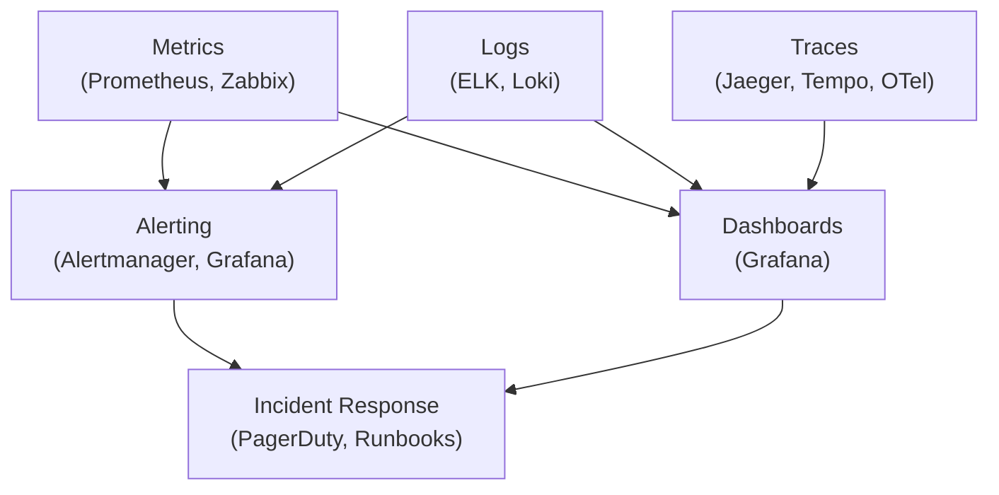
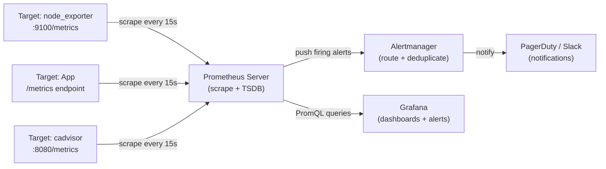
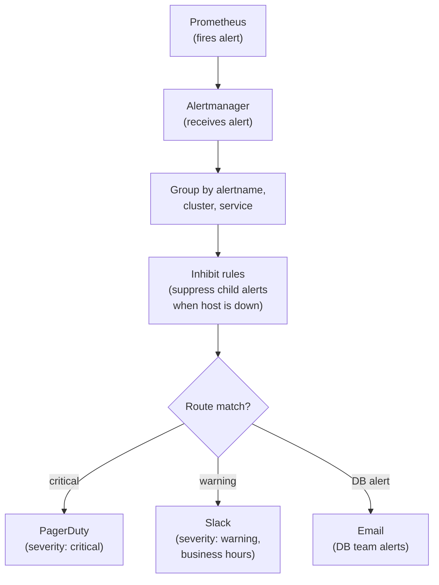
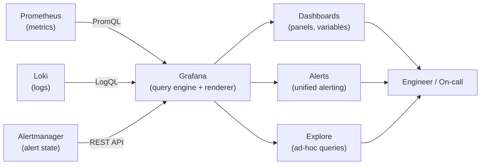
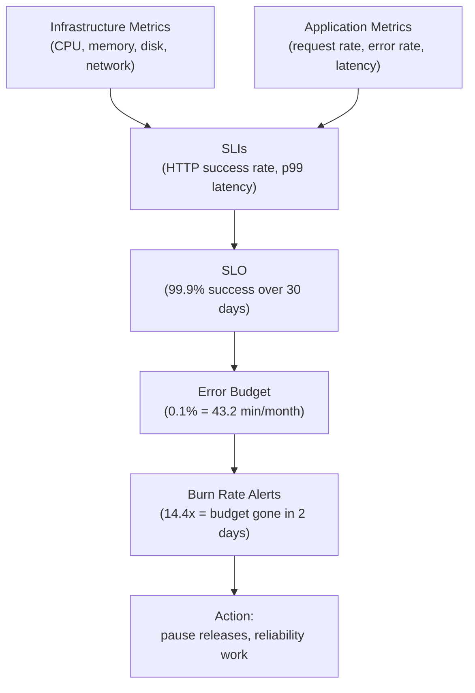

# Module 11: Monitoring & Observability

> **Course**: DevOps Career Path  
> **Audience**: Beginner → Intermediate  
> **Prerequisites**: Module 06 (Kubernetes), Module 07 (Cloud Fundamentals)

[](https://creativecommons.org/licenses/by-nc-sa/4.0/)      

---

## Table of Contents

1. [Overview](#overview)
2. [Learning Objectives](#learning-objectives)
3. [The Three Pillars of Observability](#the-three-pillars-of-observability)
4. [Monitoring Strategy & Metrics Taxonomy](#monitoring-strategy--metrics-taxonomy)
5. [Prometheus](#prometheus)
   - [Architecture](#prometheus-architecture)
   - [Installation & Configuration](#prometheus-installation--configuration)
   - [PromQL](#promql)
   - [Alertmanager](#alertmanager)
   - [Exporters](#exporters)
6. [Grafana](#grafana)
   - [Installation & Data Sources](#grafana-installation--data-sources)
   - [Building Dashboards](#building-dashboards)
   - [Alerting in Grafana](#alerting-in-grafana)
   - [Grafana Loki Integration](#grafana-loki-integration)
7. [Zabbix](#zabbix)
   - [Architecture & Components](#zabbix-architecture--components)
   - [Installation & Initial Setup](#zabbix-installation--initial-setup)
   - [Hosts, Host Groups & Templates](#hosts-host-groups--templates)
   - [Items, Triggers & Actions](#items-triggers--actions)
   - [SNMP Monitoring](#snmp-monitoring)
   - [Zabbix Agent Configuration](#zabbix-agent-configuration)
   - [Web Monitoring & Synthetic Checks](#web-monitoring--synthetic-checks)
   - [Zabbix API](#zabbix-api)
8. [Tool Comparison: Prometheus vs Zabbix vs Datadog](#tool-comparison-prometheus-vs-zabbix-vs-datadog)
9. [Kubernetes Monitoring Stack](#kubernetes-monitoring-stack)
10. [SLIs, SLOs, and Error Budgets](#slis-slos-and-error-budgets)
11. [Advanced: Distributed Tracing with OpenTelemetry](#advanced-distributed-tracing-with-opentelemetry)
12. [Tools & Commands Reference](#tools--commands-reference)
13. [Hands-On Labs](#hands-on-labs)
14. [Further Reading](#further-reading)

---

## Overview

Monitoring and observability are the foundation of reliable production systems. **Monitoring** tells you when something is wrong; **observability** tells you *why*. This module covers the full stack — from metrics collection to dashboarding to alerting — with deep dives into Prometheus, Grafana, and Zabbix.

[↑ Back to TOC](#table-of-contents)

---

## Learning Objectives

By the end of this module, you will be able to:

- Explain the three pillars of observability (metrics, logs, traces)
- Install and configure Prometheus with exporters and Alertmanager
- Write PromQL queries from basic to advanced
- Build production-grade Grafana dashboards with alerting
- Deploy and operate Zabbix for infrastructure and application monitoring
- Configure Zabbix agents, SNMP targets, triggers, and actions
- Use the Zabbix API to automate host registration
- Design SLIs/SLOs and calculate error budgets
- Choose the right monitoring tool for a given context
- Instrument a service with OpenTelemetry and visualize distributed traces in Jaeger or Tempo

[↑ Back to TOC](#table-of-contents)

---

## The Three Pillars of Observability

Observability is not just a collection of dashboards and tools. It is the discipline of making complex systems understandable while they are changing under real load. Traditional monitoring often tells you that something crossed a threshold. Observability goes further by helping you ask new questions during an incident: what changed, which users are affected, where the latency actually lives, and whether the problem is isolated or systemic. That is why modern teams talk about observability as a capability, not simply as a monitoring product.

The distinction between monitoring and observability is worth stating precisely. Monitoring is the act of watching pre-defined signals against pre-defined thresholds. It works well when you can predict all the failure modes in advance. Observability is the property of a system that lets you understand its internal state from external outputs — even for failure modes you have never seen before. Systems become observable through high-cardinality metrics, structured logs, and distributed traces emitted with enough context to answer arbitrary questions. You do not buy observability from a vendor; you build it into the system from the start.

SLIs, SLOs, and SLAs complete the picture by anchoring observability to business outcomes. An SLI (Service Level Indicator) is a specific metric that represents user experience — request success rate, latency at the 99th percentile, or data freshness. An SLO (Service Level Objective) is the target value for that SLI agreed upon by engineering and the business. An SLA (Service Level Agreement) is the contractual commitment made to customers, usually slightly less ambitious than the SLO so there is a buffer before penalties apply. When teams cannot agree on what to alert on, the question to ask is: which SLIs would a customer care about?

The three pillars below are useful because each one answers a different operational question. Metrics tell you whether behavior is trending in a dangerous direction. Logs tell you which events occurred and what the software said at the time. Traces reveal how a single request moved through a distributed system. None of them is sufficient alone. The operational win comes from being able to move between them quickly during debugging and incident response.



```
┌─────────────────────────────────────────────────────────────┐
│                   OBSERVABILITY                             │
│                                                             │
│  ┌──────────┐    ┌──────────┐    ┌──────────────────────┐  │
│  │ METRICS  │    │  LOGS    │    │       TRACES         │  │
│  │          │    │          │    │                      │  │
│  │Prometheus│    │ ELK/Loki │    │  Jaeger / Zipkin /   │  │
│  │ Zabbix   │    │ Fluentd  │    │  OpenTelemetry       │  │
│  │Datadog   │    │ Splunk   │    │                      │  │
│  └──────────┘    └──────────┘    └──────────────────────┘  │
│                                                             │
│  What is         What happened   Where time was spent      │
│  happening now   (events)        (distributed request)     │
└─────────────────────────────────────────────────────────────┘
```

| Pillar | Tool Examples | Best For |
|--------|--------------|----------|
| **Metrics** | Prometheus, Zabbix, Datadog, CloudWatch | Trends, SLOs, alerting, dashboards |
| **Logs** | ELK, Loki, Splunk, Fluentd | Debugging, audit, event history |
| **Traces** | Jaeger, Zipkin, AWS X-Ray, Tempo | Distributed request tracing, latency analysis |

> **OpenTelemetry** (OTel) is the emerging standard that unifies all three pillars under a single SDK/collector.

[↑ Back to TOC](#table-of-contents)

---

## Monitoring Strategy & Metrics Taxonomy

Tools are only as effective as the measurement strategy behind them. Many teams collect huge volumes of data but still struggle during incidents because they never decided which signals actually represent system health. Frameworks like USE, RED, and the Four Golden Signals exist to solve that problem. They give you a way to prioritize metrics that are actionable instead of merely interesting.

The key lesson here is that you should monitor from the perspective of the system you are trying to protect. Infrastructure components need metrics about capacity and failure modes. User-facing services need metrics about request rate, latency, and errors. Good taxonomy helps you choose what to instrument, what to alert on, and what to ignore when noise threatens to overwhelm the team.

### The USE Method (Infrastructure)

| Acronym | Meaning | Example |
|---------|---------|---------|
| **U**tilization | % time resource is busy | CPU utilization: 72% |
| **S**aturation | Queue depth / overflow | Run queue length: 8 |
| **E**rrors | Error events | Disk I/O errors: 3/sec |

### The RED Method (Services/APIs)

| Acronym | Meaning | Example |
|---------|---------|---------|
| **R**ate | Requests per second | 1,500 req/s |
| **E**rrors | Failed requests per second | 12 errors/s (0.8%) |
| **D**uration | Latency distribution | p99: 240ms |

### The Four Golden Signals (Google SRE)

1. **Latency** — how long requests take
2. **Traffic** — how much demand the system handles
3. **Errors** — rate of failed requests
4. **Saturation** — how full the service is

[↑ Back to TOC](#table-of-contents)

---

## Prometheus

Prometheus became the default choice for many cloud-native teams because it fits the way modern systems expose information. Instead of pushing data into a central black box, services and exporters expose metrics over HTTP and Prometheus scrapes them on a schedule. That pull model gives teams a relatively simple, transparent way to understand what is being collected, how often it is collected, and how targets are discovered.

The four metric types Prometheus defines are not interchangeable, and choosing the wrong one is a common source of broken dashboards. A **counter** only ever increases (or resets to zero on restart), which means querying it directly gives you a meaningless absolute number. You must use `rate()` or `increase()` to extract useful information. A **gauge** reflects the current state of something that can go up or down — memory usage, queue depth, active connections — and can usually be used directly. A **histogram** records observations in configurable buckets, which lets you compute approximate quantiles after the fact using `histogram_quantile()`. A **summary** computes quantiles client-side, which is efficient but means you cannot aggregate across instances in PromQL.

Cardinality is the scaling concern that catches teams off guard. Every unique combination of metric name and label values creates a distinct time series stored in Prometheus's TSDB. A metric with 10 label dimensions where each has 10 possible values can generate 10 billion time series if all combinations appear. In practice, this typically happens with labels like `user_id`, `request_id`, or `ip_address` that should never be labels. High cardinality breaks ingestion performance, inflates storage, and makes queries slow. The rule is: only use labels whose cardinality is bounded and operationally meaningful.

Its real power, though, comes from the ecosystem around it: exporters for common systems, PromQL for analysis, Alertmanager for routing, and Grafana for visualization. As you work through the sections below, think of Prometheus less as a dashboard backend and more as a measurement platform. It is the foundation that lets teams standardize metrics collection and turn raw counters into operational decisions.

### Prometheus Architecture



```
┌─────────────────────────────────────────────────────────────┐
│                      PROMETHEUS                             │
│                                                             │
│  ┌──────────────┐   scrape    ┌─────────────────────────┐  │
│  │  Prometheus  │◄────────────│  Exporters / Apps       │  │
│  │   Server     │             │  node_exporter           │  │
│  │              │             │  blackbox_exporter        │  │
│  │  TSDB (local)│             │  cadvisor, mysqld_exp.   │  │
│  └──────┬───────┘             └─────────────────────────┘  │
│         │                                                   │
│         │ push alerts  ┌──────────────────────────────────┐ │
│         └─────────────►│      Alertmanager                │ │
│                        │  route → PagerDuty/Slack/email   │ │
│                        └──────────────────────────────────┘ │
│         │                                                   │
│         │ query         ┌─────────────────────────────────┐ │
│         └──────────────►│         Grafana                 │ │
│                         │  Dashboards + Alerting          │ │
│                         └─────────────────────────────────┘ │
└─────────────────────────────────────────────────────────────┘
```

Prometheus is a **pull-based** monitoring system. It scrapes HTTP endpoints that expose metrics in the Prometheus text format every `scrape_interval` (default: 15s).

[↑ Back to TOC](#table-of-contents)

---

### Prometheus Installation & Configuration

Installation is the easy part; correct configuration is where Prometheus becomes operationally useful. A `prometheus.yml` file is not just a list of targets. It is where you decide scrape frequency, timeout behavior, discovery model, rule loading, and alerting integration. Those choices affect cost, data resolution, troubleshooting quality, and even whether an outage is visible quickly enough to matter.

This is also the point where teams often discover that observability systems need observability too. If your scrape jobs are misconfigured, labels are inconsistent, or targets are frequently flapping, the issue is not only missing data. It is broken trust in the monitoring layer itself. Clean configuration is therefore a reliability concern, not just an aesthetic one.

#### Install via binary (Linux)

```bash
# Download and extract
wget https://github.com/prometheus/prometheus/releases/download/v2.51.0/prometheus-2.51.0.linux-amd64.tar.gz
tar xvf prometheus-2.51.0.linux-amd64.tar.gz
cd prometheus-2.51.0.linux-amd64/

# Run directly
./prometheus --config.file=prometheus.yml
```

#### Core configuration: `prometheus.yml`

```yaml
global:
  scrape_interval: 15s          # How often to scrape targets
  evaluation_interval: 15s      # How often to evaluate rules
  scrape_timeout: 10s

# Alertmanager configuration
alerting:
  alertmanagers:
    - static_configs:
        - targets: ['localhost:9093']

# Load alerting rules
rule_files:
  - "alert_rules.yml"
  - "recording_rules.yml"

# Scrape configurations
scrape_configs:
  # Prometheus self-monitoring
  - job_name: 'prometheus'
    static_configs:
      - targets: ['localhost:9090']

  # Node exporter — Linux host metrics
  - job_name: 'node_exporter'
    static_configs:
      - targets:
          - 'web-01:9100'
          - 'web-02:9100'
          - 'db-01:9100'
    relabel_configs:
      - source_labels: [__address__]
        target_label: instance

  # Kubernetes service discovery
  - job_name: 'kubernetes-pods'
    kubernetes_sd_configs:
      - role: pod
    relabel_configs:
      - source_labels: [__meta_kubernetes_pod_annotation_prometheus_io_scrape]
        action: keep
        regex: "true"
      - source_labels: [__meta_kubernetes_pod_annotation_prometheus_io_path]
        action: replace
        target_label: __metrics_path__
        regex: (.+)

  # HTTP service discovery via file
  - job_name: 'file_sd_example'
    file_sd_configs:
      - files:
          - '/etc/prometheus/targets/*.json'
        refresh_interval: 30s
```

#### Recording rules: `recording_rules.yml`

```yaml
groups:
  - name: node_aggregations
    interval: 1m
    rules:
      # Pre-compute CPU idle percentage
      - record: job:node_cpu_idle:avg_rate5m
        expr: |
          avg by (job) (
            rate(node_cpu_seconds_total{mode="idle"}[5m])
          )

      # Pre-compute memory used percentage
      - record: instance:node_memory_utilisation:ratio
        expr: |
          1 - (
            node_memory_MemAvailable_bytes /
            node_memory_MemTotal_bytes
          )
```

#### Alert rules: `alert_rules.yml`

```yaml
groups:
  - name: node_alerts
    rules:
      - alert: HighCPUUsage
        expr: 100 - (avg by(instance) (rate(node_cpu_seconds_total{mode="idle"}[5m])) * 100) > 85
        for: 5m
        labels:
          severity: warning
        annotations:
          summary: "High CPU usage on {{ $labels.instance }}"
          description: "CPU usage is {{ $value | humanize }}% (threshold: 85%)"

      - alert: HostDown
        expr: up == 0
        for: 1m
        labels:
          severity: critical
        annotations:
          summary: "Host {{ $labels.instance }} is down"
          description: "{{ $labels.job }} target {{ $labels.instance }} is unreachable"

      - alert: DiskSpaceLow
        expr: |
          (node_filesystem_avail_bytes{fstype!~"tmpfs|fuse.lxcfs"} /
           node_filesystem_size_bytes{fstype!~"tmpfs|fuse.lxcfs"}) * 100 < 15
        for: 10m
        labels:
          severity: warning
        annotations:
          summary: "Low disk space on {{ $labels.instance }}"
          description: "Filesystem {{ $labels.mountpoint }} has {{ $value | humanize }}% free"

      - alert: HighMemoryUsage
        expr: instance:node_memory_utilisation:ratio > 0.90
        for: 5m
        labels:
          severity: warning
        annotations:
          summary: "High memory usage on {{ $labels.instance }}"
          description: "Memory utilization is {{ $value | humanizePercentage }}"
```

[↑ Back to TOC](#table-of-contents)

---

### PromQL

PromQL (Prometheus Query Language) is a functional query language for time-series data.

The Prometheus data model is worth understanding before writing queries. Every time series is uniquely identified by a metric name plus a set of label key-value pairs. For example, `http_requests_total{job="api", status="200", instance="web-01:8080"}` is one time series. Add or change any label and you get a different time series. PromQL queries operate over sets of these time series, and most operations — aggregation, filtering, joining — work by matching on label sets. When your queries produce unexpected results, the problem is almost always a label mismatch.

The need for `rate()` and `increase()` instead of direct counter queries follows from how counters work. If you query `http_requests_total` directly, you see a monotonically increasing number that tells you almost nothing useful at a glance. `rate(http_requests_total[5m])` computes per-second average rate over the last five minutes, which is the number that belongs on a dashboard and in an alert expression. `increase()` gives the total increase over the window — useful for things like "how many errors occurred in the last hour." The reason teams new to Prometheus get wrong alerts is usually a counter used without `rate()` or `increase()`.

Recording rules are an important performance tool once dashboards and alerts grow in complexity. They pre-compute expensive PromQL expressions on a schedule and store the result as a new time series. This means a dashboard that would otherwise run a heavy aggregation query on every page load instead reads from a fast pre-computed time series. Recording rules also let you version and test your most important queries like code, rather than leaving them embedded in dashboard JSON where they can drift silently.

PromQL is what turns stored metrics into operational insight. Without a query language, metrics are just labeled numbers sitting in a time-series database. With PromQL, you can ask higher-level questions: what is the current error rate, which endpoints are driving latency, how fast is disk space disappearing, and what would happen if this trend continues for four more hours. Those are the questions on-call engineers and SREs actually need to answer.

The most important habit in PromQL is matching the query to the meaning of the metric. Counters should usually be queried with functions like `rate()` or `increase()`, while gauges can often be used directly. When teams get noisy dashboards or misleading alerts, the problem is frequently not Prometheus itself but a query that ignored how the underlying metric behaves.

#### Metric types

| Type | Description | Example |
|------|-------------|---------|
| **Counter** | Monotonically increasing value, resets on restart | `http_requests_total` |
| **Gauge** | Value that can go up or down | `node_memory_MemFree_bytes` |
| **Histogram** | Sampled observations in configurable buckets | `http_request_duration_seconds` |
| **Summary** | Sliding time window quantiles | `rpc_duration_seconds` |

#### Selectors and matchers

```promql
# Exact match
http_requests_total{job="api", status="200"}

# Regex match
http_requests_total{status=~"2.."}

# Negative regex
http_requests_total{status!~"5.."}

# Range vector (last 5 minutes)
http_requests_total[5m]
```

#### Functions — Beginner

```promql
# Rate of increase (for counters) — prefer rate() over irate()
rate(http_requests_total[5m])

# Instant rate (last two samples — spiky, use for dashboards)
irate(http_requests_total[1m])

# Increase over time window
increase(http_requests_total[1h])

# Current CPU utilization per instance
100 - (avg by(instance) (rate(node_cpu_seconds_total{mode="idle"}[5m])) * 100)

# Memory used percentage
(1 - (node_memory_MemAvailable_bytes / node_memory_MemTotal_bytes)) * 100
```

#### Functions — Intermediate

```promql
# Aggregation operators
sum(rate(http_requests_total[5m]))                    # total req/s
sum by(status) (rate(http_requests_total[5m]))        # by status code
avg by(instance) (node_load1)                         # average 1m load
topk(5, rate(http_requests_total[5m]))                # top 5 endpoints

# Histogram quantiles
histogram_quantile(0.99, rate(http_request_duration_seconds_bucket[5m]))
histogram_quantile(0.50, sum by(le) (rate(http_request_duration_seconds_bucket[5m])))

# Predict disk exhaustion (linear extrapolation)
predict_linear(node_filesystem_free_bytes[1h], 4*3600) < 0

# Absent — alert if metric disappears
absent(up{job="api"})

# Subquery — evaluate expression over time
max_over_time(rate(http_requests_total[5m])[1h:5m])

# Label manipulation
label_replace(
  rate(http_requests_total[5m]),
  "short_instance", "$1", "instance", "([^:]+):.*"
)
```

[↑ Back to TOC](#table-of-contents)

---

### Alertmanager

Alertmanager handles deduplication, grouping, silencing, and routing of alerts fired by Prometheus.

Alert fatigue is primarily an organisational failure, not a tooling problem. When alerts fire constantly, engineers stop trusting them, start ignoring them, or disable them — which means the next real incident arrives silently. The root cause is almost always alerts written to catch causes rather than symptoms. A disk filling at 80% may not matter if the system will scale storage before it hits 100%. An alert on a single high CPU spike may not matter if the load balancer already redistributed the traffic. Alerting on symptoms (latency is high, requests are failing, error budget is burning) keeps pages actionable and rare.

The Four Golden Signals provide a practical framework for choosing what to alert on. **Latency** should be measured at the user-facing edge and alerted on percentile degradation, not averages. **Traffic** alerts tell you whether demand is normal or whether something upstream changed unexpectedly. **Errors** are typically the most direct indicator of user impact and should always be watched at low thresholds. **Saturation** — how close the system is to its capacity limits — is the leading indicator for problems that have not become visible yet. Together, these four signals cover most incident-level conditions for any service.

Alerting is where observability either becomes operationally valuable or turns into fatigue. Prometheus can detect conditions, but Alertmanager decides how those detections reach humans. Grouping, routing, inhibition, and silencing are not optional extras. They are the controls that keep a minor outage from generating hundreds of duplicate pages or a known maintenance event from waking the wrong person at 3 a.m.

Good alerting design reflects team structure and incident process. Critical alerts should page the people who can act immediately. Warning alerts may belong in chat or during business hours only. Suppression rules should prevent downstream symptom alerts from hiding the true root cause. The configuration below matters because it encodes those operational decisions into the alert flow itself.



#### `alertmanager.yml`

```yaml
global:
  smtp_smarthost: 'smtp.example.com:587'
  smtp_from: 'alerts@example.com'
  smtp_auth_username: 'alerts@example.com'
  smtp_auth_password: 'secret'
  resolve_timeout: 5m

# Notification templates
templates:
  - '/etc/alertmanager/templates/*.tmpl'

route:
  # Default receiver
  receiver: 'team-ops-slack'
  group_by: ['alertname', 'cluster', 'service']
  group_wait: 30s        # Wait before sending first notification
  group_interval: 5m     # Wait before sending update notification
  repeat_interval: 3h    # Re-notify if still firing

  routes:
    # Critical alerts → PagerDuty
    - match:
        severity: critical
      receiver: 'pagerduty-critical'
      continue: false

    # Database alerts → DB team
    - match_re:
        alertname: '^(MySQL|Postgres|Redis).*'
      receiver: 'team-db-email'

    # Business hours only for warnings
    - match:
        severity: warning
      receiver: 'team-ops-slack'
      active_time_intervals:
        - business_hours

time_intervals:
  - name: business_hours
    time_intervals:
      - weekdays: ['monday:friday']
        times:
          - start_time: '08:00'
            end_time: '18:00'

inhibit_rules:
  # If host is down, inhibit all other alerts from that host
  - source_match:
      alertname: 'HostDown'
    target_match_re:
      alertname: '.+'
    equal: ['instance']

receivers:
  - name: 'team-ops-slack'
    slack_configs:
      - api_url: 'https://hooks.slack.com/services/XXXX/YYYY/ZZZZ'
        channel: '#alerts-ops'
        title: '{{ template "slack.title" . }}'
        text: '{{ template "slack.text" . }}'
        send_resolved: true

  - name: 'pagerduty-critical'
    pagerduty_configs:
      - service_key: '<pagerduty-integration-key>'
        description: '{{ .CommonAnnotations.summary }}'

  - name: 'team-db-email'
    email_configs:
      - to: 'dbteam@example.com'
        send_resolved: true
```

[↑ Back to TOC](#table-of-contents)

---

### Exporters

Exporters expose metrics from third-party systems in the Prometheus format.

Exporters are a major reason the Prometheus ecosystem scales beyond custom applications. Most infrastructure components were not built to expose Prometheus metrics natively, but they often expose enough local state for a dedicated exporter to translate into a common format. That lets teams monitor hosts, databases, message queues, proxies, and network devices with a shared query model instead of inventing a separate monitoring approach for each one.

The tradeoff is that exporters are not magic. They expose what they are designed to expose, which means you still need to understand the monitored system well enough to choose the right metrics and alerts. Installing `node_exporter` is easy. Knowing which disk, CPU, filesystem, or saturation signals actually predict trouble is the more valuable skill.

| Exporter | Port | Monitors |
|----------|------|----------|
| `node_exporter` | 9100 | Linux host: CPU, memory, disk, network |
| `blackbox_exporter` | 9115 | HTTP/HTTPS/TCP/ICMP endpoints |
| `mysqld_exporter` | 9104 | MySQL / MariaDB |
| `postgres_exporter` | 9187 | PostgreSQL |
| `redis_exporter` | 9121 | Redis |
| `nginx_exporter` | 9113 | Nginx (via stub_status) |
| `cadvisor` | 8080 | Docker/container metrics |
| `kube-state-metrics` | 8080 | Kubernetes object states |
| `snmp_exporter` | 9116 | SNMP devices (network gear) |
| `elasticsearch_exporter` | 9114 | Elasticsearch cluster |
| `haproxy_exporter` | 9101 | HAProxy |

#### node_exporter quick start

```bash
# Download and run node_exporter
wget https://github.com/prometheus/node_exporter/releases/download/v1.8.0/node_exporter-1.8.0.linux-amd64.tar.gz
tar xvf node_exporter-1.8.0.linux-amd64.tar.gz
./node_exporter-1.8.0.linux-amd64/node_exporter &

# Verify metrics endpoint
curl http://localhost:9100/metrics | head -20
```

#### blackbox_exporter — probe HTTP endpoints

```yaml
# blackbox.yml
modules:
  http_2xx:
    prober: http
    timeout: 10s
    http:
      valid_http_versions: ["HTTP/1.1", "HTTP/2.0"]
      valid_status_codes: [200, 201]
      method: GET
      follow_redirects: true
      tls_config:
        insecure_skip_verify: false

  tcp_connect:
    prober: tcp
    timeout: 5s

  icmp_ping:
    prober: icmp
    timeout: 5s
```

```yaml
# prometheus.yml scrape config for blackbox
- job_name: 'blackbox_http'
  metrics_path: /probe
  params:
    module: [http_2xx]
  static_configs:
    - targets:
        - https://example.com
        - https://api.example.com/health
  relabel_configs:
    - source_labels: [__address__]
      target_label: __param_target
    - source_labels: [__param_target]
      target_label: instance
    - target_label: __address__
      replacement: localhost:9115
```

[↑ Back to TOC](#table-of-contents)

---

## Grafana

Grafana matters because raw metrics and alerts are rarely enough by themselves. Operators need a place to compare signals, build dashboards around service ownership, and move from detection into investigation quickly. Grafana provides that presentation layer, but its real value comes from how it links different data sources together. A useful dashboard helps a team answer not just "is the service broken?" but also "for whom, since when, and alongside which other symptoms?"

The USE method (Utilization, Saturation, Errors) and RED method (Rate, Errors, Duration) are design frameworks that prevent dashboards from becoming collections of arbitrary panels. USE is best suited to infrastructure resources — nodes, disks, network interfaces — where you want to understand capacity and failure modes. RED is suited to user-facing services and APIs, where you want to understand throughput, reliability, and latency distribution. A well-designed monitoring setup has both: a USE-oriented infrastructure overview and RED-oriented service dashboards for each team's critical workloads.

Dashboard storytelling matters for operational effectiveness. The best dashboards are structured in layers: a top-level overview that shows whether anything is wrong, service-level dashboards that reveal which component is degraded, and component-level panels that give the diagnostic detail needed to fix it. An engineer picking up an on-call shift should be able to start at the top and drill down in under two minutes. Dashboards that require deep knowledge of the system to interpret fail this test — and they fail precisely when they are needed most, during incidents with unfamiliar engineers on call.

That is why good dashboard design is a reliability practice, not just a reporting exercise. Clear dashboards reduce cognitive load during incidents, support handoffs between engineers, and make trends visible before they turn into pages. The sections below focus on provisioning and panel patterns because the best dashboards are usually treated as code and improved iteratively, not built once in a UI and forgotten.



### Grafana Installation & Data Sources

#### Install via package manager

```bash
# Add Grafana repo (RHEL/CentOS)
cat > /etc/yum.repos.d/grafana.repo << 'EOF'
[grafana]
name=grafana
baseurl=https://packages.grafana.com/oss/rpm
repo_gpgcheck=1
enabled=1
gpgcheck=1
gpgkey=https://packages.grafana.com/gpg.key
EOF

dnf install grafana -y
systemctl enable --now grafana-server

# Default: http://localhost:3000  admin/admin
```

```bash
# Ubuntu/Debian
apt-get install -y apt-transport-https software-properties-common
wget -q -O - https://packages.grafana.com/gpg.key | apt-key add -
echo "deb https://packages.grafana.com/oss/deb stable main" | tee /etc/apt/sources.list.d/grafana.list
apt-get update && apt-get install grafana -y
systemctl enable --now grafana-server
```

#### Provision data sources via YAML (GitOps-friendly)

```yaml
# /etc/grafana/provisioning/datasources/prometheus.yml
apiVersion: 1

datasources:
  - name: Prometheus
    type: prometheus
    access: proxy
    url: http://prometheus:9090
    isDefault: true
    editable: false
    jsonData:
      httpMethod: POST
      exemplarTraceIdDestinations:
        - name: traceID
          datasourceUid: tempo

  - name: Loki
    type: loki
    access: proxy
    url: http://loki:3100
    editable: false

  - name: Alertmanager
    type: alertmanager
    access: proxy
    url: http://alertmanager:9093
    jsonData:
      implementation: prometheus
```

[↑ Back to TOC](#table-of-contents)

---

### Building Dashboards

#### Dashboard JSON provisioning

```yaml
# /etc/grafana/provisioning/dashboards/default.yml
apiVersion: 1

providers:
  - name: 'default'
    orgId: 1
    folder: 'Provisioned'
    type: file
    disableDeletion: true
    updateIntervalSeconds: 30
    options:
      path: /etc/grafana/dashboards
```

#### Key panel types and use cases

| Panel | Use Case | Recommended Visualization |
|-------|----------|--------------------------|
| **Time series** | Metrics over time | Line / bar chart |
| **Stat** | Single current value | Big number + sparkline |
| **Gauge** | Value vs threshold | Gauge / bar gauge |
| **Table** | Multi-dimensional data | Tabular |
| **Heatmap** | Distribution over time | Histogram buckets |
| **Logs** | Log lines (Loki) | Log list |
| **Alert list** | Active alerts | Alert list |

#### Useful variables for dynamic dashboards

```
# In Dashboard Settings → Variables

Name: instance
Type: Query
Data source: Prometheus
Query: label_values(node_uname_info, instance)
Refresh: On dashboard load
Multi-value: true
Include All: true
```

#### Example panel query — Request Rate

```promql
# Panel title: HTTP Request Rate
sum by(status_code) (
  rate(http_requests_total{instance=~"$instance"}[5m])
)
```

[↑ Back to TOC](#table-of-contents)

---

### Alerting in Grafana

Grafana Unified Alerting (v9+) supports multi-datasource alerting.

```yaml
# Alert rule (via API or UI)
# Group: Infrastructure
# Rule: High CPU

Condition:
  Query A: avg(100 - (avg by(instance)(rate(node_cpu_seconds_total{mode="idle"}[5m]))*100))
  Threshold: IS ABOVE 85
  For: 5m

Labels:
  severity: warning
  team: ops

Annotations:
  summary: High CPU usage detected
  runbook: https://wiki.example.com/runbooks/high-cpu
```

#### Contact points

- Slack, PagerDuty, OpsGenie, email, webhook
- Configure in **Alerting → Contact points**
- Link via **Notification policies** (tree routing, similar to Alertmanager)

[↑ Back to TOC](#table-of-contents)

---

### Grafana Loki Integration

```promql
# LogQL — query Nginx access logs for 5xx errors
{job="nginx"} |= "HTTP/1.1\" 5"

# Parse and extract fields
{job="nginx"} | pattern `<_> "<method> <path> <_>" <status> <_>` | status >= 500

# Rate of error log lines
rate({job="app", level="error"}[5m])

# Metric from logs — count 500 errors per minute
sum(rate({job="nginx"} |= "\" 5" [1m]))
```

[↑ Back to TOC](#table-of-contents)

---

## Zabbix

Zabbix remains important because not every environment looks like Kubernetes plus microservices. Many organizations still run a large amount of traditional infrastructure: physical servers, VMs, network devices, appliances, and legacy systems that benefit from agent-based checks, SNMP support, and an integrated monitoring stack. Zabbix is especially strong when a team wants one platform that can collect data, store history, evaluate triggers, and present dashboards without assembling several separate tools.

That makes Zabbix a useful complement to the Prometheus worldview rather than merely an alternative. Prometheus excels in cloud-native ecosystems; Zabbix often shines in mixed or traditional estates where host inventory, built-in templates, and infrastructure-centric monitoring are the dominant needs. Understanding both helps you choose based on environment reality instead of trend preference.

### Zabbix Architecture & Components

```
┌──────────────────────────────────────────────────────────────────┐
│                         ZABBIX                                   │
│                                                                  │
│  ┌──────────────────┐      ┌──────────────────────────────────┐  │
│  │  Zabbix Server   │◄─────│  Zabbix Agent (on monitored host)│  │
│  │  (Central node)  │      │  Active or Passive mode          │  │
│  │                  │      └──────────────────────────────────┘  │
│  │  ┌────────────┐  │                                            │
│  │  │  Database  │  │      ┌──────────────────────────────────┐  │
│  │  │(MySQL/PgSQL│  │◄─────│  Zabbix Proxy (optional)         │  │
│  │  │  /Oracle)  │  │      │  For distributed/remote sites    │  │
│  │  └────────────┘  │      └──────────────────────────────────┘  │
│  └────────┬─────────┘                                            │
│           │                ┌──────────────────────────────────┐  │
│           └───────────────►│  Zabbix Frontend (Web UI + API)  │  │
│                            │  Apache/Nginx + PHP              │  │
│                            └──────────────────────────────────┘  │
│                                                                  │
│  Also monitors via:  SNMP / IPMI / JMX / SSH / Telnet / HTTP    │
└──────────────────────────────────────────────────────────────────┘
```

#### Key components

| Component | Role |
|-----------|------|
| **Zabbix Server** | Core process — collects data, evaluates triggers, sends notifications |
| **Zabbix Agent** | Lightweight daemon on monitored host — collects local metrics |
| **Zabbix Agent 2** | Next-gen agent with plugin support (Go-based) |
| **Zabbix Proxy** | Collects data on behalf of server — used for distributed monitoring |
| **Zabbix Frontend** | PHP web application — configuration UI, dashboards, reports |
| **Database** | Stores all configuration and historical data (MySQL/MariaDB, PostgreSQL) |

[↑ Back to TOC](#table-of-contents)

---

### Zabbix Installation & Initial Setup

#### Install Zabbix 6.x on RHEL/CentOS

```bash
# Install Zabbix repository
rpm -Uvh https://repo.zabbix.com/zabbix/6.4/rhel/9/x86_64/zabbix-release-6.4-1.el9.noarch.rpm
dnf clean all

# Install Zabbix server, frontend, and agent
dnf install -y zabbix-server-mysql zabbix-web-mysql \
               zabbix-apache-conf zabbix-sql-scripts \
               zabbix-selinux-policy zabbix-agent

# Install and configure MariaDB
dnf install -y mariadb-server
systemctl enable --now mariadb
mysql_secure_installation
```

```sql
-- Create Zabbix database
CREATE DATABASE zabbix CHARACTER SET utf8mb4 COLLATE utf8mb4_bin;
CREATE USER 'zabbix'@'localhost' IDENTIFIED BY 'StrongPassword123!';
GRANT ALL PRIVILEGES ON zabbix.* TO 'zabbix'@'localhost';
FLUSH PRIVILEGES;
```

```bash
# Import initial schema
zcat /usr/share/zabbix-sql-scripts/mysql/server.sql.gz | mysql --default-character-set=utf8mb4 -uzabbix -p zabbix

# Configure Zabbix server
# Edit /etc/zabbix/zabbix_server.conf
DBPassword=StrongPassword123!

# Start services
systemctl enable --now zabbix-server zabbix-agent httpd php-fpm

# Web setup: http://<server>/zabbix
# Default credentials: Admin / zabbix  (CHANGE IMMEDIATELY)
```

#### `/etc/zabbix/zabbix_server.conf` — key settings

```ini
# Database
DBHost=localhost
DBName=zabbix
DBUser=zabbix
DBPassword=StrongPassword123!

# Performance tuning
StartPollers=10
StartPollersUnreachable=3
StartTrappers=5
StartPingers=3
StartDiscoverers=3
CacheSize=256M
HistoryCacheSize=64M
HistoryIndexCacheSize=16M
TrendCacheSize=32M
ValueCacheSize=128M

# Housekeeping — keep 1 year of history, 5 years of trends
HousekeepingFrequency=1
MaxHousekeeperDelete=5000

# Logging
LogFile=/var/log/zabbix/zabbix_server.log
LogFileSize=100
DebugLevel=3
```

[↑ Back to TOC](#table-of-contents)

---

### Hosts, Host Groups & Templates

#### Concepts

| Concept | Description |
|---------|-------------|
| **Host** | A device or service to be monitored (server, switch, URL) |
| **Host Group** | Logical grouping (Linux servers, Network devices, Production) |
| **Template** | Reusable collection of items, triggers, graphs, dashboards |
| **Interface** | How Zabbix connects to the host (Agent, SNMP, JMX, IPMI) |

#### Registering hosts via Zabbix web UI

1. Go to **Configuration → Hosts → Create host**
2. Fill in: **Host name**, **Groups**, **Interfaces** (IP + port)
3. Link template: **Templates** tab → search and add (e.g., `Linux by Zabbix agent`)
4. Click **Add**

#### Built-in templates (selection)

| Template | Monitors |
|----------|----------|
| `Linux by Zabbix agent` | CPU, memory, disk, network, processes |
| `Windows by Zabbix agent` | CPU, memory, disk, services, event log |
| `MySQL by Zabbix agent` | Queries, connections, replication lag |
| `Nginx by Zabbix agent` | Requests, connections, status |
| `Kubernetes cluster by HTTP` | Nodes, pods, deployments |
| `Cisco IOS by SNMP` | Interfaces, CPU, memory |
| `Network interfaces by SNMP` | Generic SNMP interface monitoring |

[↑ Back to TOC](#table-of-contents)

---

### Items, Triggers & Actions

#### Items

Items define **what** data to collect. Each item has a **key** that specifies the metric.

| Item key | Description | Type |
|----------|-------------|------|
| `system.cpu.util[,idle]` | CPU idle % | Zabbix agent |
| `vm.memory.size[available]` | Available memory bytes | Zabbix agent |
| `vfs.fs.size[/,pfree]` | Free disk % on / | Zabbix agent |
| `net.if.in[eth0]` | Network in bytes/sec | Zabbix agent |
| `proc.num[nginx]` | Number of nginx processes | Zabbix agent |
| `web.test.fail[My web scenario]` | Web scenario last failed step | Web |
| `snmp.walk[1.3.6.1.2.1.1.5.0]` | SNMP OID — sysName | SNMP |

#### Custom item (via UI)

```
Configuration → Hosts → [host] → Items → Create item

Name:        Free disk space on /var
Type:        Zabbix agent
Key:         vfs.fs.size[/var,pfree]
Type of info: Numeric (float)
Units:       %
Update interval: 1m
History:     90d
Trends:      365d
```

#### Triggers

Triggers define **when** to alert. They evaluate item values using expressions.

```
# Trigger expression examples

# CPU high for 5 minutes
avg(/My Host/system.cpu.util[,idle],5m)<10

# Disk free below 10%
last(/My Host/vfs.fs.size[/,pfree])<10

# Host unreachable
{My Host:agent.ping.nodata(3m)}=1

# MySQL replication lag > 60 seconds
last(/My Host/mysql.replication.lag)>60

# Service restart (uptime reset)
(last(/My Host/system.uptime)<10m) and (change(/My Host/system.uptime)<0)
```

#### Trigger severity levels

| Severity | Color | Use |
|----------|-------|-----|
| Not classified | Grey | Informational |
| Information | Blue | FYI events |
| Warning | Yellow | Soft threshold breach |
| Average | Orange | Needs attention |
| High | Red | Production impact |
| Disaster | Dark red | Critical outage |

#### Actions

Actions define **what to do** when a trigger fires.

```
Configuration → Actions → Trigger actions → Create action

Conditions:
  - Trigger severity >= High
  - Host group in {Linux Servers}

Operations (PROBLEM):
  - Send message to user group: On-Call
  - Send message via: Slack webhook
  - Delay before: 0s

Recovery operations:
  - Send message: "Problem resolved"

Update operations:
  - Notify when acknowledged
```

[↑ Back to TOC](#table-of-contents)

---

### SNMP Monitoring

SNMP (Simple Network Management Protocol) is used to monitor network devices, switches, routers, printers, and UPSes.

#### Add SNMP host in Zabbix

1. **Configuration → Hosts → Create host**
2. **Interfaces** → Add → Type: **SNMP**
3. IP: `192.168.1.1` Port: `161`
4. **Templates** tab → Add `Cisco IOS by SNMP` or `Network interfaces by SNMP`

#### SNMP configuration on the host (Linux)

```bash
# Install net-snmp
dnf install -y net-snmp net-snmp-utils

# /etc/snmp/snmpd.conf
rocommunity  public   127.0.0.1
rocommunity  zabbix_ro  192.168.1.10     # Allow Zabbix server
syslocation  "DataCenter Row 3 Rack 7"
syscontact   ops@example.com

systemctl enable --now snmpd

# Test from Zabbix server
snmpwalk -v2c -c zabbix_ro 192.168.1.5 system
snmpget -v2c -c zabbix_ro 192.168.1.5 .1.3.6.1.2.1.1.5.0
```

#### SNMPv3 (secure)

```ini
# /etc/snmp/snmpd.conf
createUser zabbixUser SHA "AuthPassword123" AES "PrivPassword456"
rouser     zabbixUser priv
```

```
# Zabbix host interface — SNMPv3
SNMP version:   SNMPv3
Security name:  zabbixUser
Security level: authPriv
Auth protocol:  SHA1
Auth passphrase: AuthPassword123
Priv protocol:  AES128
Priv passphrase: PrivPassword456
```

#### Common SNMP OIDs

| OID | Description |
|-----|-------------|
| `.1.3.6.1.2.1.1.1.0` | sysDescr |
| `.1.3.6.1.2.1.1.3.0` | sysUpTime (timeticks) |
| `.1.3.6.1.2.1.1.5.0` | sysName |
| `.1.3.6.1.2.1.2.2.1.10` | ifInOctets (per interface) |
| `.1.3.6.1.2.1.2.2.1.16` | ifOutOctets |
| `.1.3.6.1.4.1.9.2.1.56.0` | Cisco CPU 5m avg |

[↑ Back to TOC](#table-of-contents)

---

### Zabbix Agent Configuration

#### `/etc/zabbix/zabbix_agent2.conf` (Agent 2)

```ini
# Connection to Zabbix Server
Server=192.168.1.10
ServerActive=192.168.1.10
Hostname=web-server-01       # Must match hostname in Zabbix UI

# Logging
LogFile=/var/log/zabbix/zabbix_agent2.log
LogFileSize=10
DebugLevel=3

# TLS (optional — recommended for production)
TLSConnect=cert
TLSAccept=cert
TLSCAFile=/etc/zabbix/tls/ca.crt
TLSCertFile=/etc/zabbix/tls/agent.crt
TLSKeyFile=/etc/zabbix/tls/agent.key

# Custom user parameters
UserParameter=custom.nginx.active,curl -s http://127.0.0.1/nginx_status | awk 'NR==1{print $3}'
UserParameter=app.queue.depth,redis-cli llen job_queue

# Timeout
Timeout=30

# Allow agent to be monitored remotely (check status)
AllowKey=system.run[*]
```

```bash
# Start agent
systemctl enable --now zabbix-agent2

# Test item key locally
zabbix_agent2 -t system.cpu.util[,idle]
zabbix_agent2 -t vfs.fs.size[/,pfree]
zabbix_agent2 -t custom.nginx.active
```

#### Active vs Passive checks

| Mode | Direction | Use case |
|------|-----------|----------|
| **Passive** | Server → Agent (pull) | Default; server initiates connection |
| **Active** | Agent → Server (push) | Firewall restrictions; agent behind NAT; better scalability |

For active checks, set `ServerActive=` and ensure `Hostname=` matches exactly.

[↑ Back to TOC](#table-of-contents)

---

### Web Monitoring & Synthetic Checks

Zabbix web scenarios simulate browser sessions to test application availability and performance.

#### Create a web scenario

```
Configuration → Hosts → [host] → Web → Create web scenario

Name: E-commerce Checkout Flow
Agent: Mozilla/5.0 (compatible)
Update interval: 5m
Attempts: 3

Steps:
  1. Name: Load homepage
     URL: https://shop.example.com/
     Required: "Welcome"
     Status codes: 200

  2. Name: Login page
     URL: https://shop.example.com/login
     Required: "Sign in"
     Status codes: 200

  3. Name: Submit login
     URL: https://shop.example.com/login
     Post: username=testuser&password=testpass
     Required: "My Account"
     Status codes: 200

  4. Name: View cart
     URL: https://shop.example.com/cart
     Required: "Your Cart"
     Status codes: 200
```

#### Automatically generated items

| Item key | Description |
|----------|-------------|
| `web.test.fail[Checkout Flow]` | Step number that failed (0 = success) |
| `web.test.time[Checkout Flow,Load homepage,resp]` | Response time for step |
| `web.test.rspcode[Checkout Flow,Submit login]` | HTTP status code |

[↑ Back to TOC](#table-of-contents)

---

### Zabbix API

The Zabbix API allows full automation of host management, template assignment, and reporting.

#### Authenticate and get auth token

```bash
curl -s -X POST \
  -H "Content-Type: application/json-rpc" \
  -d '{
    "jsonrpc": "2.0",
    "method": "user.login",
    "params": {
      "username": "Admin",
      "password": "zabbix"
    },
    "id": 1
  }' \
  http://zabbix.example.com/zabbix/api_jsonrpc.php
```

#### Create a host via API

```bash
AUTH_TOKEN="your_auth_token_here"

curl -s -X POST \
  -H "Content-Type: application/json-rpc" \
  -d "{
    \"jsonrpc\": \"2.0\",
    \"method\": \"host.create\",
    \"params\": {
      \"host\": \"app-server-05\",
      \"name\": \"Application Server 05\",
      \"groups\": [{\"groupid\": \"2\"}],
      \"interfaces\": [{
        \"type\": 1,
        \"main\": 1,
        \"useip\": 1,
        \"ip\": \"192.168.1.55\",
        \"dns\": \"\",
        \"port\": \"10050\"
      }],
      \"templates\": [{\"templateid\": \"10001\"}]
    },
    \"auth\": \"${AUTH_TOKEN}\",
    \"id\": 2
  }" \
  http://zabbix.example.com/zabbix/api_jsonrpc.php
```

#### Python automation example

```python
#!/usr/bin/env python3
"""Automate Zabbix host registration from a CMDB inventory."""

import requests
import json

ZABBIX_URL = "http://zabbix.example.com/zabbix/api_jsonrpc.php"
HEADERS = {"Content-Type": "application/json-rpc"}


def zabbix_login(username: str, password: str) -> str:
    """Authenticate and return auth token."""
    payload = {
        "jsonrpc": "2.0",
        "method": "user.login",
        "params": {"username": username, "password": password},
        "id": 1,
    }
    response = requests.post(ZABBIX_URL, headers=HEADERS, json=payload)
    return response.json()["result"]


def get_template_id(auth: str, template_name: str) -> str:
    """Look up template ID by name."""
    payload = {
        "jsonrpc": "2.0",
        "method": "template.get",
        "params": {"output": ["templateid"], "filter": {"host": [template_name]}},
        "auth": auth,
        "id": 2,
    }
    result = requests.post(ZABBIX_URL, headers=HEADERS, json=payload).json()
    return result["result"][0]["templateid"]


def create_host(auth: str, hostname: str, ip: str, group_id: str, template_id: str) -> dict:
    """Register a new host in Zabbix."""
    payload = {
        "jsonrpc": "2.0",
        "method": "host.create",
        "params": {
            "host": hostname,
            "groups": [{"groupid": group_id}],
            "interfaces": [{
                "type": 1, "main": 1, "useip": 1,
                "ip": ip, "dns": "", "port": "10050"
            }],
            "templates": [{"templateid": template_id}],
        },
        "auth": auth,
        "id": 3,
    }
    return requests.post(ZABBIX_URL, headers=HEADERS, json=payload).json()


if __name__ == "__main__":
    servers = [
        {"hostname": "web-01", "ip": "10.0.1.10"},
        {"hostname": "web-02", "ip": "10.0.1.11"},
        {"hostname": "db-01",  "ip": "10.0.1.20"},
    ]

    token = zabbix_login("Admin", "zabbix")
    tmpl_id = get_template_id(token, "Linux by Zabbix agent")

    for server in servers:
        result = create_host(token, server["hostname"], server["ip"], "2", tmpl_id)
        print(f"Created {server['hostname']}: {result.get('result', result.get('error'))}")
```

[↑ Back to TOC](#table-of-contents)

---

## Tool Comparison: Prometheus vs Zabbix vs Datadog

By this point, the question is no longer which tool is "best" in the abstract. The better question is which tool matches your operating model, staffing level, and environment complexity. Every monitoring platform makes tradeoffs around ownership, flexibility, setup effort, and long-term cost. Comparing them side by side is useful because teams often inherit constraints such as on-prem infrastructure, compliance requirements, or a preference for managed services.

Use the table below as a decision aid, not as a verdict. In practice, many organizations use more than one observability approach at the same time: Prometheus for Kubernetes metrics, Zabbix for network gear and legacy hosts, and a SaaS platform for centralized executive visibility or cross-team analysis. Tool boundaries often follow organizational and technical boundaries.

| Feature | Prometheus | Zabbix | Datadog |
|---------|-----------|--------|---------|
| **Model** | Pull (scrape) | Pull/Push (agent) | Push (agent) |
| **Storage** | TSDB (local/remote) | RDBMS (MySQL/PgSQL) | SaaS cloud |
| **Query language** | PromQL | Custom expression | Metrics QL |
| **Alerting** | Alertmanager | Built-in | Built-in |
| **Dashboards** | Grafana (separate) | Built-in | Built-in |
| **SNMP support** | Via snmp_exporter | Native built-in | Via integration |
| **Agent required** | Optional (exporters) | Required (agent) | Required |
| **Kubernetes native** | Excellent | Good (agent2) | Good |
| **Network monitoring** | Limited | Excellent | Good |
| **Cost** | Free/OSS | Free/OSS (paid Enterprise) | Paid SaaS |
| **Scaling** | Thanos/Cortex/VictoriaMetrics | Zabbix Proxy | Managed |
| **Best for** | Cloud-native, Kubernetes | On-prem, network, SNMP, legacy | SaaS convenience |

> **Recommendation**: Use **Prometheus + Grafana** for cloud-native workloads and Kubernetes. Use **Zabbix** for on-premises infrastructure, network device monitoring (SNMP), and environments where an RDBMS-backed history is preferred. Use **Datadog** when budget allows and you want a managed observability platform.

[↑ Back to TOC](#table-of-contents)

---

## Kubernetes Monitoring Stack

Kubernetes monitoring deserves separate treatment because clusters introduce layers of abstraction that hide failure in ways traditional host monitoring does not. You need visibility into nodes, pods, control plane components, workloads, service discovery, resource quotas, and application metrics all at once. A cluster can look healthy at the node level while still dropping traffic because of failing pods, misconfigured services, or readiness problems.

That is why the Kubernetes ecosystem leans toward operator-managed stacks such as kube-prometheus-stack. They bundle the components and custom resources needed to turn monitoring into part of the cluster platform. The examples below show how monitoring becomes declarative inside Kubernetes, so scrape targets and alert rules can evolve with the applications they observe.

### kube-prometheus-stack (Helm)

```bash
# Add Prometheus community Helm repo
helm repo add prometheus-community https://prometheus-community.github.io/helm-charts
helm repo update

# Install the full stack:
# Prometheus Operator, Prometheus, Alertmanager, Grafana, node-exporter, kube-state-metrics
helm install kube-prometheus-stack prometheus-community/kube-prometheus-stack \
  --namespace monitoring \
  --create-namespace \
  --set grafana.adminPassword=changeme \
  --set prometheus.prometheusSpec.retention=30d \
  --set prometheus.prometheusSpec.storageSpec.volumeClaimTemplate.spec.resources.requests.storage=50Gi
```

#### ServiceMonitor — tell Prometheus to scrape your app

```yaml
# Your application exposes metrics at /metrics on port 8080
apiVersion: monitoring.coreos.com/v1
kind: ServiceMonitor
metadata:
  name: my-api-monitor
  namespace: monitoring
  labels:
    release: kube-prometheus-stack
spec:
  selector:
    matchLabels:
      app: my-api
  namespaceSelector:
    matchNames:
      - production
  endpoints:
    - port: metrics
      path: /metrics
      interval: 30s
```

#### PrometheusRule — define alerts as code

```yaml
apiVersion: monitoring.coreos.com/v1
kind: PrometheusRule
metadata:
  name: my-api-alerts
  namespace: monitoring
  labels:
    release: kube-prometheus-stack
spec:
  groups:
    - name: my-api
      rules:
        - alert: ApiHighErrorRate
          expr: |
            sum(rate(http_requests_total{job="my-api",status=~"5.."}[5m]))
            /
            sum(rate(http_requests_total{job="my-api"}[5m])) > 0.05
          for: 5m
          labels:
            severity: warning
          annotations:
            summary: "High error rate on my-api"
            description: "Error rate is {{ $value | humanizePercentage }}"
```

[↑ Back to TOC](#table-of-contents)

---

## SLIs, SLOs, and Error Budgets

Metrics become strategically useful when they are tied to reliability goals the business actually cares about. SLIs, SLOs, and error budgets provide that bridge. They convert abstract telemetry into a contract about user experience: how often the service should succeed, how fast it should respond, and how much failure is acceptable before reliability work should take priority over feature work.

This framing changes the conversation during planning and incidents. Instead of debating whether a problem "feels bad," teams can ask whether they are burning their budget too quickly and whether a release should pause until reliability improves. The operational value of SLOs is not the math by itself; it is the clarity they bring to tradeoffs between speed and stability.

The monitoring coverage model below shows how infrastructure metrics connect upward to SLIs, which inform SLOs, which determine how much error budget exists. Burn rate alerts at the bottom are the practical mechanism that turns an SLO into an action: when budget burns too fast relative to the SLO window, pages fire before the SLO is actually violated. This is far more useful than alerting only when the SLO has already been breached.



### Definitions

| Term | Definition | Example |
|------|------------|---------|
| **SLI** | Service Level Indicator — measurable metric | HTTP success rate (non-5xx / total) |
| **SLO** | Service Level Objective — target for an SLI | 99.9% success rate over 30 days |
| **SLA** | Service Level Agreement — contractual commitment with penalties | 99.5% uptime or 10% credit |
| **Error Budget** | How much the service can fail while meeting SLO | 0.1% = 43.8 min/month |

### Error budget calculation

```
SLO = 99.9%  (over 30 days)
Error budget = 1 - 0.999 = 0.001 = 0.1%

30 days = 30 × 24 × 60 = 43,200 minutes
Allowed downtime = 43,200 × 0.001 = 43.2 minutes/month
```

### PromQL — SLI query

```promql
# HTTP success rate SLI
sum(rate(http_requests_total{status!~"5.."}[30d]))
/
sum(rate(http_requests_total[30d]))

# Error budget remaining (as percentage)
(
  sum(rate(http_requests_total{status!~"5.."}[30d]))
  /
  sum(rate(http_requests_total[30d]))
  - 0.999
) / 0.001 * 100
```

### Multi-window, multi-burn-rate alerting

```yaml
# Alert when burning error budget too fast
- alert: ErrorBudgetBurnRate
  expr: |
    (
      sum(rate(http_requests_total{status=~"5.."}[1h]))
      / sum(rate(http_requests_total[1h]))
    ) > 14.4 * (1 - 0.999)    # 14.4x burn rate = budget gone in 2 days
  for: 5m
  labels:
    severity: critical
  annotations:
    summary: "Error budget burning too fast"
```

[↑ Back to TOC](#table-of-contents)

---

## Advanced: Distributed Tracing with OpenTelemetry

Metrics tell you *something is slow*. Logs tell you *what happened*. **Distributed traces** tell you *where in the request chain the latency lives* — essential for microservices architectures.

Tracing becomes necessary when a request crosses enough services that neither metrics nor logs can explain the full story on their own. In a monolith, a single log stream may be enough to reconstruct a failure. In distributed systems, one user request can traverse gateways, APIs, queues, caches, and background workers. Without traces, engineers often have to guess which hop introduced the delay or error.

OpenTelemetry matters because it standardizes how telemetry is produced and shipped across languages and vendors. Instead of instrumenting every service differently for every backend, teams can adopt a common model and decide later whether data lands in Jaeger, Tempo, Datadog, or another platform. That decoupling is increasingly important as observability stacks evolve over time.

### The Three Pillars — Completing the Picture

```
Metrics  → "P99 latency on /checkout is 4s"
Logs     → "ERROR: payment-service timed out at 2026-03-02T14:32:01Z"
Traces   → checkout-api (12ms) → cart-service (8ms) → payment-service (3980ms) ← HERE
```

### OpenTelemetry (OTel)

OpenTelemetry is the CNCF standard for generating, collecting, and exporting telemetry (traces, metrics, logs) — vendor-neutral and supported by every major observability backend.

```
Your App → OTel SDK → OTel Collector → Jaeger / Tempo / Datadog / Honeycomb
```

### Instrumenting a Node.js Service

```bash
npm install @opentelemetry/sdk-node \
            @opentelemetry/auto-instrumentations-node \
            @opentelemetry/exporter-trace-otlp-http
```

```javascript
// tracing.js — load BEFORE app code
const { NodeSDK } = require('@opentelemetry/sdk-node');
const { getNodeAutoInstrumentations } = require('@opentelemetry/auto-instrumentations-node');
const { OTLPTraceExporter } = require('@opentelemetry/exporter-trace-otlp-http');

const sdk = new NodeSDK({
  traceExporter: new OTLPTraceExporter({
    url: 'http://otel-collector:4318/v1/traces',
  }),
  instrumentations: [getNodeAutoInstrumentations()],
  serviceName: 'checkout-api',
});

sdk.start();
```

```bash
# Start with tracing enabled
node -r ./tracing.js app.js
```

### Instrumenting a Python (FastAPI) Service

```bash
pip install opentelemetry-sdk \
            opentelemetry-instrumentation-fastapi \
            opentelemetry-exporter-otlp
```

```python
# tracing.py
from opentelemetry import trace
from opentelemetry.sdk.trace import TracerProvider
from opentelemetry.sdk.trace.export import BatchSpanProcessor
from opentelemetry.exporter.otlp.proto.http.trace_exporter import OTLPSpanExporter
from opentelemetry.instrumentation.fastapi import FastAPIInstrumentor

provider = TracerProvider()
provider.add_span_processor(
    BatchSpanProcessor(OTLPSpanExporter(endpoint="http://otel-collector:4318/v1/traces"))
)
trace.set_tracer_provider(provider)

# In your app:
from fastapi import FastAPI
app = FastAPI()
FastAPIInstrumentor.instrument_app(app)
```

### Deploying the OTel Collector

The Collector receives, processes, and exports telemetry — decoupling your apps from the backend:

```yaml
# otel-collector-config.yaml
receivers:
  otlp:
    protocols:
      grpc:
        endpoint: 0.0.0.0:4317
      http:
        endpoint: 0.0.0.0:4318

processors:
  batch:
    timeout: 1s
    send_batch_size: 1024

  # Add service name as a resource attribute
  resource:
    attributes:
      - key: environment
        value: production
        action: insert

exporters:
  jaeger:
    endpoint: jaeger:14250
    tls:
      insecure: true

  # Also export metrics to Prometheus
  prometheus:
    endpoint: "0.0.0.0:8889"

service:
  pipelines:
    traces:
      receivers: [otlp]
      processors: [resource, batch]
      exporters: [jaeger]
    metrics:
      receivers: [otlp]
      processors: [batch]
      exporters: [prometheus]
```

```bash
# Deploy collector + Jaeger with Docker Compose for local dev
docker run -d --name otel-collector \
  -p 4317:4317 -p 4318:4318 \
  -v $(pwd)/otel-collector-config.yaml:/etc/otelcol/config.yaml \
  otel/opentelemetry-collector:latest

docker run -d --name jaeger \
  -p 16686:16686 \    # Jaeger UI
  -p 14250:14250 \    # gRPC from collector
  jaegertracing/all-in-one:latest
```

### Deploying Grafana Tempo (Kubernetes-native traces backend)

Tempo is the Grafana-native traces backend — pairs naturally with Prometheus + Loki:

```bash
helm repo add grafana https://grafana.github.io/helm-charts
helm upgrade --install tempo grafana/tempo \
  --namespace monitoring \
  --set tempo.storage.trace.backend=local
```

**Configure Grafana data source for Tempo:**

```yaml
# grafana-datasource-tempo.yaml
apiVersion: 1
datasources:
  - name: Tempo
    type: tempo
    url: http://tempo:3100
    jsonData:
      tracesToLogsV2:
        datasourceUid: loki    # Link traces → logs automatically
      serviceMap:
        datasourceUid: prometheus
```

### Creating Custom Spans

Auto-instrumentation captures HTTP/DB calls automatically. For business logic, add custom spans:

```python
from opentelemetry import trace

tracer = trace.get_tracer(__name__)

def process_payment(order_id: str, amount: float):
    with tracer.start_as_current_span("process_payment") as span:
        span.set_attribute("order.id", order_id)
        span.set_attribute("payment.amount", amount)
        span.set_attribute("payment.currency", "USD")

        result = charge_card(amount)

        if result.failed:
            span.set_status(trace.StatusCode.ERROR, "Card declined")
            span.record_exception(result.error)
        return result
```

### Trace-Based Alerting

Once traces flow into Tempo, you can alert on trace data in Grafana:

```
TraceQL query (Grafana 10+):
{ .service.name = "payment-service" && duration > 2s } | rate()

→ Alert: "Payment service P95 latency > 2s for 5 minutes"
```

[↑ Back to TOC](#table-of-contents)

---

## Tools & Commands Reference

```bash
# Check config syntax
promtool check config prometheus.yml
promtool check rules alert_rules.yml

# Query via HTTP API
curl 'http://localhost:9090/api/v1/query?query=up'
curl 'http://localhost:9090/api/v1/query_range?query=rate(http_requests_total[5m])&start=2026-01-01T00:00:00Z&end=2026-01-01T01:00:00Z&step=60s'

# Reload config without restart
curl -X POST http://localhost:9090/-/reload

# Check active targets
curl http://localhost:9090/api/v1/targets | jq '.data.activeTargets[] | {job: .labels.job, instance: .labels.instance, health: .health}'
```

### Alertmanager

```bash
# Check config
amtool check-config /etc/alertmanager/alertmanager.yml

# List current alerts
amtool alert query

# Create a silence
amtool silence add alertname="HighCPUUsage" --duration=2h --comment="Maintenance"

# List silences
amtool silence query
```

### Zabbix

```bash
# Check Zabbix server log
tail -f /var/log/zabbix/zabbix_server.log

# Test agent item locally
zabbix_agent2 -t system.cpu.util
zabbix_agent2 -t vfs.fs.size[/,pfree]
zabbix_agent2 -t net.if.in[eth0]

# Test connectivity from server
zabbix_get -s 192.168.1.20 -p 10050 -k "system.hostname"

# Database check
mysql -u zabbix -p zabbix -e "SELECT COUNT(*) FROM hosts WHERE status=0;"
```

[↑ Back to TOC](#table-of-contents)

---

## Hands-On Labs

### Lab 1 — Deploy Prometheus + Grafana with Docker Compose (Beginner)

**Goal**: Stand up a full monitoring stack locally.

```yaml
# docker-compose.yml (or podman-compose.yml)
version: '3.8'

volumes:
  prometheus_data: {}
  grafana_data: {}

networks:
  monitoring:

services:
  prometheus:
    image: prom/prometheus:v2.51.0
    volumes:
      - ./prometheus.yml:/etc/prometheus/prometheus.yml:ro
      - ./alert_rules.yml:/etc/prometheus/alert_rules.yml:ro
      - prometheus_data:/prometheus
    command:
      - '--config.file=/etc/prometheus/prometheus.yml'
      - '--storage.tsdb.retention.time=30d'
      - '--web.enable-lifecycle'
    ports:
      - "9090:9090"
    networks:
      - monitoring

  node_exporter:
    image: prom/node-exporter:v1.8.0
    pid: host
    volumes:
      - /proc:/host/proc:ro
      - /sys:/host/sys:ro
      - /:/rootfs:ro
    command:
      - '--path.procfs=/host/proc'
      - '--path.rootfs=/rootfs'
      - '--path.sysfs=/host/sys'
    ports:
      - "9100:9100"
    networks:
      - monitoring

  alertmanager:
    image: prom/alertmanager:v0.27.0
    volumes:
      - ./alertmanager.yml:/etc/alertmanager/alertmanager.yml:ro
    ports:
      - "9093:9093"
    networks:
      - monitoring

  grafana:
    image: grafana/grafana:10.4.0
    volumes:
      - grafana_data:/var/lib/grafana
      - ./grafana/provisioning:/etc/grafana/provisioning:ro
    environment:
      - GF_SECURITY_ADMIN_PASSWORD=changeme
      - GF_USERS_ALLOW_SIGN_UP=false
    ports:
      - "3000:3000"
    networks:
      - monitoring
    depends_on:
      - prometheus
```

**Steps**:
1. Create `prometheus.yml` scraping `node_exporter:9100`
2. Create `alert_rules.yml` with HighCPU and DiskSpaceLow alerts
3. Create `alertmanager.yml` routing to a Slack webhook
4. Run `docker compose up -d` (or `podman-compose up -d`)
5. Open Grafana at `http://localhost:3000` → add Prometheus datasource
6. Import dashboard ID **1860** (Node Exporter Full) from Grafana.com
7. Stress CPU with `stress --cpu 4 --timeout 60` and observe the alert firing

---

### Lab 2 — PromQL Query Practice (Beginner → Intermediate)

**Goal**: Write 10 PromQL queries targeting your Lab 1 stack.

```
Exercises:
1. Show current CPU utilization per CPU core
2. Show available memory in GB
3. Calculate % disk used on root filesystem
4. Show network bytes in/out per second for all interfaces
5. Count total running processes
6. Show top 3 filesystem mount points by used percentage
7. Calculate the 5-minute rate of context switches
8. Alert expression: disk will be full within 4 hours
9. Show all targets that are currently down
10. Calculate node uptime in days
```

---

### Lab 3 — Zabbix Agent Installation & Template Linking (Beginner)

**Goal**: Install Zabbix agent on a monitored host and link the Linux template.

```bash
# On the monitored host:
rpm -Uvh https://repo.zabbix.com/zabbix/6.4/rhel/9/x86_64/zabbix-release-6.4-1.el9.noarch.rpm
dnf install -y zabbix-agent2

# Edit /etc/zabbix/zabbix_agent2.conf
Server=<zabbix_server_ip>
ServerActive=<zabbix_server_ip>
Hostname=lab-host-01

systemctl enable --now zabbix-agent2

# Test from Zabbix server:
zabbix_get -s <monitored_host_ip> -p 10050 -k "system.hostname"
```

**In the Zabbix UI**:
1. Configuration → Hosts → Create host
2. Set hostname to `lab-host-01`, add agent interface with host IP
3. Link template `Linux by Zabbix agent 2`
4. Wait 60s → Monitoring → Latest data → filter by host

---

### Lab 4 — Zabbix Custom Trigger & Notification Action (Intermediate)

**Goal**: Create a custom trigger and action that sends a Slack notification.

1. Create a **Media type**: Slack webhook
   - Administration → Media types → Create
   - Type: Webhook, Script: use the Slack webhook template
2. Assign media to your Admin user
3. Create a **trigger** on `lab-host-01`:
   - Expression: `avg(/lab-host-01/system.cpu.util[,idle],5m)<20`
   - Name: "High CPU on lab-host-01"
   - Severity: High
4. Create a **trigger action**:
   - Condition: Trigger severity >= High
   - Operation: Send message via Slack to Admin
5. Simulate load: `stress --cpu 4 --timeout 120`
6. Observe alert in Monitoring → Problems and Slack notification

---

### Lab 5 — kube-prometheus-stack on Minikube (Intermediate)

**Goal**: Deploy the full Prometheus Operator stack on a local Kubernetes cluster.

```bash
# Start Minikube with enough resources
minikube start --cpus=4 --memory=8192

# Install kube-prometheus-stack
helm repo add prometheus-community https://prometheus-community.github.io/helm-charts
helm repo update

helm install monitoring prometheus-community/kube-prometheus-stack \
  --namespace monitoring --create-namespace \
  --set grafana.adminPassword=admin123

# Check all pods are running
kubectl -n monitoring get pods

# Port-forward Grafana
kubectl -n monitoring port-forward svc/monitoring-grafana 3000:80 &

# Port-forward Prometheus
kubectl -n monitoring port-forward svc/monitoring-kube-prometheus-prometheus 9090:9090 &

# Open http://localhost:3000 (admin/admin123)
# Explore pre-built dashboards: Kubernetes / Compute Resources / Cluster
```

---

## Further Reading

- [Prometheus Documentation](https://prometheus.io/docs/)
- [PromQL Cheat Sheet](https://promlabs.com/promql-cheat-sheet/)
- [Grafana Documentation](https://grafana.com/docs/grafana/latest/)
- [Grafana Dashboard Library](https://grafana.com/grafana/dashboards/)
- [Zabbix 6.4 Documentation](https://www.zabbix.com/documentation/6.4/)
- [Zabbix API Documentation](https://www.zabbix.com/documentation/current/en/manual/api)
- [Google SRE Book — Monitoring Distributed Systems](https://sre.google/sre-book/monitoring-distributed-systems/)
- [Alerting on SLOs](https://sre.google/workbook/alerting-on-slos/)
- [kube-prometheus-stack Helm chart](https://github.com/prometheus-community/helm-charts/tree/main/charts/kube-prometheus-stack)
- [OpenTelemetry Documentation](https://opentelemetry.io/docs/)

[↑ Back to TOC](#table-of-contents)

---

*© 2026 UncleJS — Licensed under [CC BY-NC-SA 4.0](https://creativecommons.org/licenses/by-nc-sa/4.0/). Non-commercial use only. Share alike with attribution. See [LICENSE.md](./LICENSE.md).*
