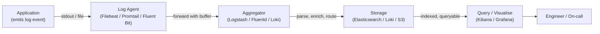
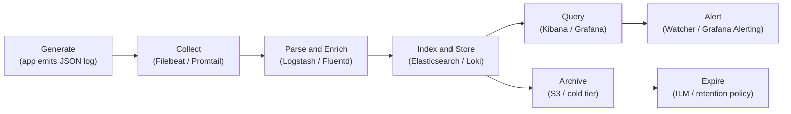
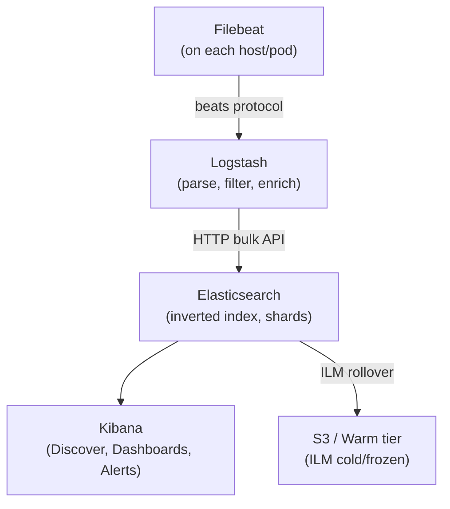
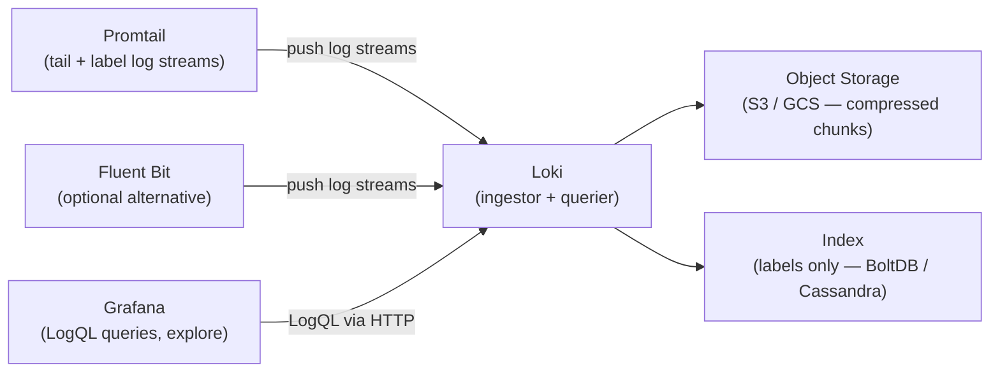
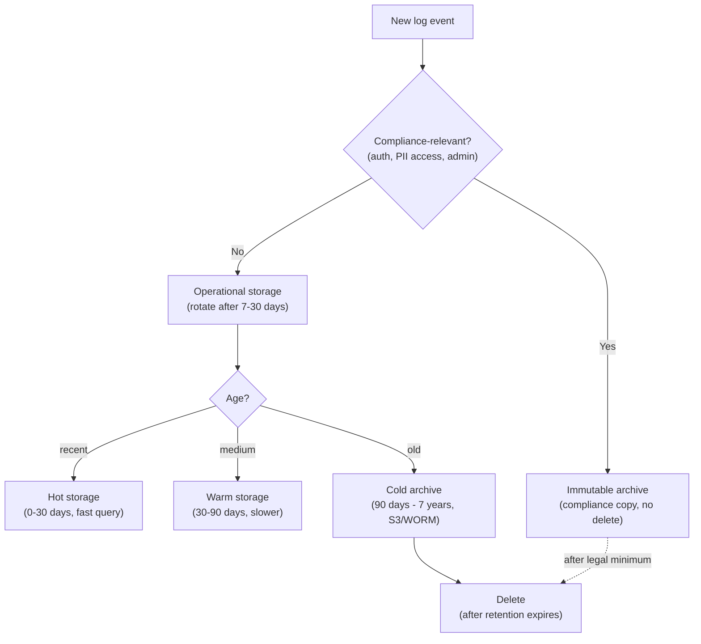

# Module 12: Logging & Log Management

> **Course**: DevOps Career Path  
> **Audience**: Beginner → Intermediate  
> **Prerequisites**: Module 06 (Kubernetes), Module 11 (Monitoring & Observability)

[](https://creativecommons.org/licenses/by-nc-sa/4.0/)      

---

## Table of Contents

1. [Overview](#overview)
2. [Learning Objectives](#learning-objectives)
3. [Logging Fundamentals](#logging-fundamentals)
4. [Structured Logging](#structured-logging)
5. [The ELK Stack](#the-elk-stack)
   - [Elasticsearch](#elasticsearch)
   - [Logstash](#logstash)
   - [Kibana](#kibana)
   - [Filebeat](#filebeat)
   - [Full ELK Deployment Example](#full-elk-deployment-example)
6. [Grafana Loki Stack](#grafana-loki-stack)
   - [Loki Architecture](#loki-architecture)
   - [Promtail](#promtail)
   - [LogQL](#logql)
   - [Loki Deployment](#loki-deployment)
7. [Fluentd & Fluent Bit](#fluentd--fluent-bit)
8. [Kubernetes Logging Patterns](#kubernetes-logging-patterns)
9. [Log Retention, Rotation & Compliance](#log-retention-rotation--compliance)
10. [Centralized Logging Architecture Patterns](#centralized-logging-architecture-patterns)
11. [Comparing Logging Stacks](#comparing-logging-stacks)
12. [Advanced: Log-Based Alerting & Anomaly Detection](#advanced-log-based-alerting--anomaly-detection)
13. [Tools & Commands Reference](#tools--commands-reference)
14. [Hands-On Labs](#hands-on-labs)
15. [Further Reading](#further-reading)

---

## Overview

Logs are the raw narrative of your system — every event, error, transaction, and state change produces log data. This module covers the full lifecycle: structured log emission, collection, shipping, indexing, querying, and retention. You will work with both the **ELK Stack** (Elasticsearch, Logstash, Kibana) and the **Loki Stack** (Loki, Promtail, Grafana) — the two dominant open-source centralized logging solutions.

Logs and metrics serve different purposes and should not be used interchangeably. Metrics are designed to answer "how much" and "how often" questions across the whole system at low cost — they aggregate well and age gracefully. Logs are designed to answer "what happened" and "why" questions at the level of individual events. They are verbose, high-volume, and expensive to store at scale. This means log volume must be managed deliberately: at the emission level (choosing what to log), at the collection level (filtering and sampling where safe), and at the retention level (tiered storage and expiry policies). Teams that treat logs as infinitely cheap quickly discover that their logging infrastructure costs more than the application it monitors.

The pipeline below shows how a log event travels from application to engineer. Each hop is an opportunity to add value (enrichment, parsing, indexing) and also a failure point (network loss, buffer overflow, disk fill). Understanding the full pipeline is why this module covers not just querying tools but also collection agents, routing, and retention.



[↑ Back to TOC](#table-of-contents)

---

## Learning Objectives

By the end of this module, you will be able to:

- Explain the lifecycle of a log event from emission to query
- Implement structured logging in applications (JSON format)
- Deploy and configure the full ELK Stack
- Write Elasticsearch queries and build Kibana dashboards
- Deploy Loki + Promtail and write LogQL queries
- Ship logs with Filebeat, Fluent Bit, and Promtail
- Implement Kubernetes-native logging patterns
- Design log retention, rotation, and archival policies
- Choose the right logging stack for a given use case
- Configure log-based alerting in Elasticsearch (Watcher) and Loki (Grafana Alerting)
- Detect anomalies in log streams using threshold rules and ML-based techniques

[↑ Back to TOC](#table-of-contents)

---

## Logging Fundamentals

Logging exists because systems fail in ways that metrics alone cannot fully explain. A metric can tell you that error rate spiked or latency increased, but logs often reveal the exact event, code path, dependency failure, or malformed input that produced the symptom. In practice, logs are the forensic record of system behavior. They help you reconstruct what happened after the fact and understand what the software believed was true in the moment.

That said, more logging does not automatically mean better observability. Undisciplined logging creates noise, high storage cost, and search experiences so painful that engineers stop trusting the system. The goal of this module is therefore not just to show tools, but to teach how to think about log usefulness: what to emit, how to structure it, how to move it safely, and how to retain it in a way that supports operations, security, and compliance.

### Log levels

| Level | Numeric | Meaning | When to use |
|-------|---------|---------|-------------|
| **TRACE** | 5 | Finest detail | Deep debugging only — never in production |
| **DEBUG** | 4 | Diagnostic detail | Development and troubleshooting |
| **INFO** | 3 | Normal operation | Service startup, user actions, milestones |
| **WARN** | 2 | Unexpected but recoverable | Deprecated API usage, slow response |
| **ERROR** | 1 | Failure, operation failed | Exception caught, request failed |
| **FATAL** | 0 | Unrecoverable, process exit | Out of memory, config missing |

### Log lifecycle

```
Application
    │
    │ emits log event
    ▼
Log Shipper (Filebeat / Promtail / Fluent Bit)
    │
    │ forwards (with buffering)
    ▼
Log Aggregator (Logstash / Fluentd / Loki)
    │
    │ parses, enriches, routes
    ▼
Log Store (Elasticsearch / Loki / S3)
    │
    │ indexed, queryable
    ▼
Visualization (Kibana / Grafana)
    │
    │ search, dashboard, alert
    ▼
Engineer / On-call
```

### The syslog standard

```
# Syslog format: RFC 3164
<priority>timestamp hostname app[pid]: message

# Example:
<34>Mar  2 14:22:01 web-01 nginx[1234]: 2026/03/02 14:22:01 [error] 1234#1234: *1 connect() failed

# Syslog facilities (0-23)
0  = kern     8  = uucp
1  = user     9  = cron
3  = daemon   16-23 = local0-local7
```

[↑ Back to TOC](#table-of-contents)

---

## Structured Logging

Unstructured logs are human-readable but machine-hostile. Structured logs (JSON) are both.

Structured logging is one of the highest-leverage improvements a team can make because it changes logs from text blobs into queryable event records. Once logs are emitted as JSON or another consistent structure, you can filter by service, trace ID, request ID, user context, status code, or environment without relying on brittle regexes. That makes incident response faster and reduces the amount of manual parsing engineers do under pressure.

The correlation ID pattern is where structured logging delivers its biggest operational payoff. When every log event emitted by every service in a request's path carries the same `trace_id` and `request_id`, you can reconstruct the full story of that request across all services by filtering on a single identifier. Without this, tracking a user-reported bug through a microservices system means grepping multiple log streams, mentally correlating timestamps, and guessing at causality. With it, the entire request chain collapses into one filtered view.

The broader operational benefit is consistency across teams and languages. When Python, Node.js, and other services emit similar fields with similar meaning, central logging platforms can correlate events more effectively and dashboards become more reusable. This is especially important in distributed systems, where the difference between "we have logs" and "we have useful logs" is often whether common context fields exist everywhere.



### Unstructured (avoid)

```
2026-03-02 14:22:01 ERROR Failed to connect to database after 3 retries host=db-01 latency=2340ms
```

### Structured (prefer)

```json
{
  "timestamp": "2026-03-02T14:22:01.453Z",
  "level": "error",
  "service": "api-gateway",
  "host": "web-01",
  "trace_id": "abc123def456",
  "user_id": "u-9981",
  "event": "db_connection_failed",
  "database_host": "db-01",
  "retry_count": 3,
  "latency_ms": 2340,
  "message": "Failed to connect to database after 3 retries"
}
```

### Structured logging in Python

```python
import logging
import json
import sys
from datetime import datetime, timezone


class JSONFormatter(logging.Formatter):
    """Emit log records as JSON lines."""

    def format(self, record: logging.LogRecord) -> str:
        log_entry = {
            "timestamp": datetime.now(timezone.utc).isoformat(),
            "level": record.levelname.lower(),
            "logger": record.name,
            "message": record.getMessage(),
            "module": record.module,
            "function": record.funcName,
            "line": record.lineno,
        }
        # Merge any extra fields passed via extra={}
        for key, value in record.__dict__.items():
            if key not in logging.LogRecord.__dict__ and not key.startswith("_"):
                if key not in log_entry:
                    log_entry[key] = value
        if record.exc_info:
            log_entry["exception"] = self.formatException(record.exc_info)
        return json.dumps(log_entry)


def get_logger(name: str) -> logging.Logger:
    logger = logging.getLogger(name)
    logger.setLevel(logging.DEBUG)
    handler = logging.StreamHandler(sys.stdout)
    handler.setFormatter(JSONFormatter())
    logger.addHandler(handler)
    return logger


# Usage
log = get_logger("api.orders")

log.info("Order created", extra={"order_id": "ord-123", "user_id": "u-456", "amount": 99.99})
log.error("Payment failed", extra={"order_id": "ord-123", "error_code": "CARD_DECLINED"})
```

### Structured logging in Node.js (pino)

```javascript
import pino from 'pino';

const log = pino({
  level: process.env.LOG_LEVEL || 'info',
  base: {
    service: 'order-service',
    env: process.env.NODE_ENV,
  },
  timestamp: pino.stdTimeFunctions.isoTime,
  formatters: {
    level(label) {
      return { level: label };
    },
  },
});

// Usage
log.info({ orderId: 'ord-123', userId: 'u-456' }, 'Order created');
log.error({ orderId: 'ord-123', err: new Error('Card declined') }, 'Payment failed');
```

### Key fields to always include

| Field | Type | Description |
|-------|------|-------------|
| `timestamp` | ISO 8601 UTC | When the event occurred |
| `level` | string | Log level |
| `service` | string | Application/service name |
| `trace_id` | string | Distributed trace ID (pass via headers) |
| `request_id` | string | Per-request unique ID |
| `user_id` | string | Authenticated user (omit if no auth context) |
| `host` | string | Emitting host/pod |
| `message` | string | Human-readable summary |

[↑ Back to TOC](#table-of-contents)

---

## The ELK Stack

**ELK** = **E**lasticsearch + **L**ogstash + **K**ibana. In modern deployments, Logstash is often replaced by the lighter **Filebeat** (direct to Elasticsearch) or **Fluent Bit**.

ELK is powerful because it treats logs as searchable documents rather than just archived text. That makes it a strong fit for environments where engineers, security teams, and auditors need to search deeply inside log content, build dashboards around fields, and retain large event histories with lifecycle controls. When operated well, ELK becomes both an operational troubleshooting tool and an investigation platform.

Elasticsearch's core power comes from its inverted index. When a document is ingested, each unique term in each indexed field gets an entry in an index structure that maps the term to a list of document IDs. That is why full-text search on millions of log records is fast: you look up the term in the inverted index rather than scanning every record. The tradeoff is that every new indexed field increases the index size, and the phenomenon known as mapping explosion — where many dynamic fields all get indexed — is a common cause of Elasticsearch cluster degradation. The right mitigation is to define explicit mappings for known fields and to restrict dynamic mapping in production indices.

Shards and replicas are the other key concept for operating Elasticsearch at scale. An index is divided into primary shards, and each shard can have replica shards on different nodes for redundancy. More shards means more parallelism for large indices; fewer shards means less overhead for small ones. A typical starting point is one primary shard per 10-50 GB of data, with one replica shard per primary. Over-sharding is a common mistake that wastes resources; the overhead of managing many small shards can exceed the gain.

The tradeoff is that this flexibility has real cost. Elasticsearch clusters consume memory, index design matters, ingestion pipelines need tuning, and retention strategy can become expensive if left unmanaged. Teams adopt ELK successfully when the value of rich search and analytics outweighs the operational overhead. The sections below walk through each component so you can see where that complexity comes from and when it is justified.



```
┌──────────────────────────────────────────────────────────────────┐
│                         ELK STACK                                │
│                                                                  │
│  ┌─────────────┐    ┌───────────┐    ┌─────────────────────────┐ │
│  │  Filebeat   │───►│ Logstash  │───►│    Elasticsearch        │ │
│  │  (on hosts) │    │ (parse /  │    │    (index & store)      │ │
│  │             │    │  enrich)  │    │                         │ │
│  └─────────────┘    └───────────┘    └──────────┬──────────────┘ │
│                                                 │                │
│                                                 ▼                │
│                                      ┌──────────────────────┐   │
│                                      │        Kibana        │   │
│                                      │  (search + dashboards│   │
│                                      │   + alerts)          │   │
│                                      └──────────────────────┘   │
└──────────────────────────────────────────────────────────────────┘
```

### Elasticsearch

Elasticsearch is a distributed, document-oriented search and analytics engine built on Apache Lucene.

#### Core concepts

| Concept | Description |
|---------|-------------|
| **Index** | Collection of documents (like a database table) |
| **Document** | A JSON object stored in an index |
| **Shard** | Horizontal partition of an index (Lucene index) |
| **Replica** | Copy of a shard for HA and read scaling |
| **Mapping** | Schema definition for document fields |
| **ILM** | Index Lifecycle Management — automate index aging |

#### Elasticsearch REST API

```bash
# Check cluster health
curl -s http://localhost:9200/_cluster/health | jq .

# List all indices
curl -s http://localhost:9200/_cat/indices?v

# Create an index with explicit mapping
curl -X PUT http://localhost:9200/app-logs-2026.03 \
  -H "Content-Type: application/json" \
  -d '{
    "settings": {
      "number_of_shards": 2,
      "number_of_replicas": 1,
      "index.refresh_interval": "5s"
    },
    "mappings": {
      "properties": {
        "timestamp":   { "type": "date" },
        "level":       { "type": "keyword" },
        "service":     { "type": "keyword" },
        "host":        { "type": "keyword" },
        "trace_id":    { "type": "keyword" },
        "message":     { "type": "text", "analyzer": "standard" },
        "latency_ms":  { "type": "long" },
        "status_code": { "type": "integer" }
      }
    }
  }'

# Index a document
curl -X POST http://localhost:9200/app-logs-2026.03/_doc \
  -H "Content-Type: application/json" \
  -d '{"timestamp":"2026-03-02T14:22:01Z","level":"error","service":"api","message":"timeout"}'

# Search — match all errors
curl -s -X GET http://localhost:9200/app-logs-*/_search \
  -H "Content-Type: application/json" \
  -d '{
    "query": {
      "bool": {
        "filter": [
          { "term": { "level": "error" } },
          { "range": { "timestamp": { "gte": "now-1h" } } }
        ]
      }
    },
    "sort": [{ "timestamp": "desc" }],
    "size": 20
  }'

# Full-text search in message field
curl -s -X GET http://localhost:9200/app-logs-*/_search \
  -H "Content-Type: application/json" \
  -d '{
    "query": {
      "match": {
        "message": "connection refused"
      }
    }
  }'

# Aggregation — count errors per service
curl -s -X GET http://localhost:9200/app-logs-*/_search \
  -H "Content-Type: application/json" \
  -d '{
    "query": { "term": { "level": "error" } },
    "aggs": {
      "errors_by_service": {
        "terms": { "field": "service", "size": 10 }
      }
    },
    "size": 0
  }'
```

#### Index Lifecycle Management (ILM)

```json
// PUT _ilm/policy/app-logs-policy
{
  "policy": {
    "phases": {
      "hot": {
        "min_age": "0ms",
        "actions": {
          "rollover": {
            "max_primary_shard_size": "10gb",
            "max_age": "1d"
          }
        }
      },
      "warm": {
        "min_age": "7d",
        "actions": {
          "forcemerge": { "max_num_segments": 1 },
          "shrink": { "number_of_shards": 1 }
        }
      },
      "cold": {
        "min_age": "30d",
        "actions": {
          "freeze": {}
        }
      },
      "delete": {
        "min_age": "90d",
        "actions": {
          "delete": {}
        }
      }
    }
  }
}
```

[↑ Back to TOC](#table-of-contents)

---

### Logstash

Logstash is a server-side data processing pipeline: input → filter → output.

Logstash is where many logging architectures become truly programmable. It can ingest from multiple sources, parse mixed log formats, enrich events, drop noise, route high-value data differently, and normalize fields before they ever reach storage. That is incredibly useful in heterogeneous environments where not every application logs clean JSON and not every source should be treated equally.

At the same time, every transformation you add becomes part of the operational path for log delivery. Complex filters can increase CPU usage, introduce latency, or make troubleshooting ingestion problems harder. The goal is to transform logs enough to make them useful without turning the pipeline into an opaque, fragile data processing system.

#### `logstash.conf` — full pipeline example

```ruby
input {
  # Receive from Filebeat
  beats {
    port => 5044
    ssl  => false
  }

  # Also accept syslog
  syslog {
    port => 5140
    type => "syslog"
  }

  # Accept from Kafka (for high-volume)
  kafka {
    bootstrap_servers => "kafka:9092"
    topics => ["app-logs"]
    codec => json
  }
}

filter {
  # Parse JSON logs
  if [type] == "application" {
    json {
      source => "message"
      target => "parsed"
      remove_field => ["message"]
    }
    mutate {
      rename => { "[parsed][timestamp]" => "@timestamp" }
      rename => { "[parsed][level]"     => "level"      }
      rename => { "[parsed][service]"   => "service"    }
      rename => { "[parsed][message]"   => "message"    }
    }
  }

  # Parse Nginx access logs (unstructured)
  if [type] == "nginx" {
    grok {
      match => {
        "message" => '%{IPORHOST:client_ip} - %{DATA:user} \[%{HTTPDATE:timestamp}\] "%{WORD:method} %{DATA:request} HTTP/%{NUMBER:http_version}" %{NUMBER:status_code:int} %{NUMBER:bytes:int} "%{DATA:referrer}" "%{DATA:user_agent}"'
      }
    }
    date {
      match => ["timestamp", "dd/MMM/yyyy:HH:mm:ss Z"]
      target => "@timestamp"
      remove_field => ["timestamp"]
    }
    mutate {
      convert => { "status_code" => "integer" }
      convert => { "bytes"       => "integer" }
    }
    # Tag 5xx errors
    if [status_code] >= 500 {
      mutate { add_tag => ["error", "5xx"] }
    }
  }

  # GeoIP enrichment
  if [client_ip] {
    geoip {
      source => "client_ip"
      target => "geoip"
    }
  }

  # Drop health check noise
  if [request] =~ "/health" {
    drop {}
  }

  # Add environment tag
  mutate {
    add_field => { "environment" => "${ENV:production}" }
  }
}

output {
  # Send to Elasticsearch with daily indices
  elasticsearch {
    hosts    => ["http://elasticsearch:9200"]
    index    => "%{[type]}-%{+YYYY.MM.dd}"
    template_name    => "app-logs"
    template_overwrite => false
  }

  # Also write errors to separate index
  if "error" in [tags] {
    elasticsearch {
      hosts => ["http://elasticsearch:9200"]
      index => "errors-%{+YYYY.MM.dd}"
    }
  }

  # Debug — print to stdout
  # stdout { codec => rubydebug }
}
```

[↑ Back to TOC](#table-of-contents)

---

### Kibana

Kibana provides a web UI for searching, visualizing, and alerting on Elasticsearch data.

Kibana is the part of ELK that most teams interact with daily because it converts raw indexed documents into investigation workflows. Search, filters, saved views, dashboards, and alerts let engineers move from a vague symptom like "payments are failing" to a more precise picture of which service, customer path, or time window is involved. It is effectively the operational lens on top of Elasticsearch.

That means good Kibana usage depends heavily on upstream discipline. If fields are inconsistent, mappings are poor, or timestamps are unreliable, the UI cannot compensate. When logs are well structured, however, Kibana becomes a powerful bridge between ad hoc debugging and repeatable operational analysis.

#### Key features

| Feature | Description |
|---------|-------------|
| **Discover** | Full-text search and log browsing with time filters |
| **Dashboard** | Compose visualizations into monitoring boards |
| **Visualize** | Bar charts, line charts, maps, metric panels |
| **Alerts** | Rule-based alerting on Elasticsearch data |
| **APM** | Application Performance Monitoring |
| **Lens** | Drag-and-drop chart builder |
| **Canvas** | Custom reporting and presentations |

#### KQL (Kibana Query Language) examples

```kql
# Find all errors
level: "error"

# Errors from a specific service in last 15 min (use time filter)
level: "error" AND service: "api-gateway"

# Full-text search
message: "connection refused"

# Status codes 500–599
status_code >= 500 AND status_code < 600

# Complex filter
service: ("api-gateway" OR "order-service") AND level: ("error" OR "warn")

# Wildcard
request: /api/users/*

# Negation
NOT service: "health-checker"
```

[↑ Back to TOC](#table-of-contents)

---

### Filebeat

Filebeat is a lightweight log shipper (Go binary, ~40MB) that tails log files and ships to Logstash or Elasticsearch.

Shippers like Filebeat matter because collection is its own engineering problem. Applications write logs in different places, nodes restart, files rotate, containers churn, and networks fail intermittently. A reliable shipper handles these edge conditions while adding just enough metadata to make downstream analysis useful. In many environments, the quality of the collection layer determines whether the logging platform is trusted at all.

Filebeat is popular because it does one job with relatively low overhead: collect, buffer, annotate, and forward. That simplicity is a strength when teams want reliable ingestion without putting heavy parsing logic at the edge. It also fits well into pipelines where richer processing happens later in Logstash or Elasticsearch ingest pipelines.

#### `filebeat.yml`

```yaml
filebeat.inputs:
  # Application JSON logs
  - type: log
    enabled: true
    paths:
      - /var/log/app/*.log
    json.keys_under_root: true
    json.add_error_key: true
    fields:
      type: application
      environment: production
    fields_under_root: true
    multiline.pattern: '^{'
    multiline.negate: true
    multiline.match: after

  # Nginx access logs
  - type: log
    enabled: true
    paths:
      - /var/log/nginx/access.log
    fields:
      type: nginx

  # Nginx error logs
  - type: log
    enabled: true
    paths:
      - /var/log/nginx/error.log
    fields:
      type: nginx-error

  # System logs
  - type: log
    enabled: true
    paths:
      - /var/log/messages
      - /var/log/syslog
    fields:
      type: syslog

# Processors — enrich events before shipping
processors:
  - add_host_metadata:
      when.not.contains.tags: forwarded
  - add_docker_metadata: ~
  - add_kubernetes_metadata:
      host: ${NODE_NAME}
      matchers:
        - logs_path:
            logs_path: "/var/log/containers/"

# Output — send to Logstash
output.logstash:
  hosts: ["logstash:5044"]
  loadbalance: true

# Alternatively — send directly to Elasticsearch
# output.elasticsearch:
#   hosts: ["http://elasticsearch:9200"]
#   index: "filebeat-%{[agent.version]}-%{+yyyy.MM.dd}"

# Internal metrics
monitoring.enabled: true
monitoring.elasticsearch:
  hosts: ["http://elasticsearch:9200"]

# Logging
logging.level: info
logging.to_files: true
logging.files:
  path: /var/log/filebeat
  name: filebeat
  keepfiles: 7
```

[↑ Back to TOC](#table-of-contents)

---

### Full ELK Deployment Example

```yaml
# docker-compose.yml — ELK Stack
version: '3.8'

volumes:
  esdata01: {}
  kibanadata: {}

networks:
  elk:

services:
  elasticsearch:
    image: docker.elastic.co/elasticsearch/elasticsearch:8.13.0
    environment:
      - node.name=es01
      - cluster.name=elk-cluster
      - discovery.type=single-node
      - bootstrap.memory_lock=true
      - xpack.security.enabled=false          # Enable in production!
      - "ES_JAVA_OPTS=-Xms1g -Xmx1g"
    ulimits:
      memlock:
        soft: -1
        hard: -1
    volumes:
      - esdata01:/usr/share/elasticsearch/data
    ports:
      - "9200:9200"
    networks:
      - elk
    healthcheck:
      test: curl -fs http://localhost:9200/_cluster/health || exit 1
      interval: 30s
      timeout: 10s
      retries: 5

  logstash:
    image: docker.elastic.co/logstash/logstash:8.13.0
    volumes:
      - ./logstash/pipeline:/usr/share/logstash/pipeline:ro
      - ./logstash/config/logstash.yml:/usr/share/logstash/config/logstash.yml:ro
    ports:
      - "5044:5044"      # Beats input
      - "5140:5140/udp"  # Syslog
    environment:
      - "LS_JAVA_OPTS=-Xmx512m -Xms512m"
    networks:
      - elk
    depends_on:
      elasticsearch:
        condition: service_healthy

  kibana:
    image: docker.elastic.co/kibana/kibana:8.13.0
    ports:
      - "5601:5601"
    environment:
      - ELASTICSEARCH_HOSTS=http://elasticsearch:9200
    volumes:
      - kibanadata:/usr/share/kibana/data
    networks:
      - elk
    depends_on:
      elasticsearch:
        condition: service_healthy

  filebeat:
    image: docker.elastic.co/beats/filebeat:8.13.0
    user: root
    volumes:
      - ./filebeat/filebeat.yml:/usr/share/filebeat/filebeat.yml:ro
      - /var/lib/docker/containers:/var/lib/docker/containers:ro
      - /var/run/docker.sock:/var/run/docker.sock:ro
    environment:
      - LOGSTASH_HOST=logstash:5044
    networks:
      - elk
    depends_on:
      - logstash
```

[↑ Back to TOC](#table-of-contents)

---

## Grafana Loki Stack

Loki is a horizontally scalable, highly available log aggregation system designed to be cost-effective and easy to operate. Unlike Elasticsearch, **Loki only indexes metadata (labels) — not log content**, making it much cheaper to store and operate.

Loki's design philosophy is that most log analysis is a grep problem, not a search problem. Rather than building a rich inverted index over log content, Loki stores compressed log chunks in object storage and attaches metadata labels (service, namespace, pod, level, environment) to each stream. At query time, LogQL first filters by labels to identify matching streams, then applies regex or text filters within those streams. This means label selection is fast and cheap; content scanning is proportional to how much data the label filter returns. The implication is that good label design makes Loki performant, and bad label design makes it expensive.

The trade-off versus Elasticsearch is explicit. ELK lets you write a free-text search like `error AND database AND timeout` and match against all ingested fields instantly because they are all indexed. Loki cannot do that efficiently unless the label filters first narrow the candidate streams substantially. Where Loki wins is total cost of ownership: no JVM heap to tune, object storage instead of SSD-backed nodes, and a simple operational model that fits teams already running the Prometheus/Grafana stack. For teams that primarily use logs for incident investigation and service correlation rather than security analytics or compliance search, Loki is often the better choice.

Loki is a strong choice when the main goal is to correlate logs with metrics and traces without paying the full indexing cost of ELK. Its design assumes that many operational questions can be answered by filtering on labels such as service, namespace, pod, environment, or level, then scanning the matching log lines. That makes it especially attractive in Kubernetes-heavy environments where those labels already exist and where cost per gigabyte matters.

The most important design implication is that label strategy becomes critical. Because Loki does not fully index message content, you need to think carefully about which metadata should be promoted to labels and which should remain inside the log body. Good labels make Loki fast and cheap. Bad labels either create high-cardinality performance problems or make the logs too hard to query effectively.



### Loki Architecture

```
┌──────────────────────────────────────────────────────────────────┐
│                          LOKI STACK                              │
│                                                                  │
│  ┌─────────────┐    ┌──────────────┐    ┌────────────────────┐  │
│  │  Promtail   │───►│     Loki     │◄───│      Grafana       │  │
│  │  (on hosts  │    │  (log store) │    │  (query + display) │  │
│  │  / pods)    │    │              │    │  LogQL queries     │  │
│  └─────────────┘    │  Chunks:S3   │    └────────────────────┘  │
│                     │  Index:BoltDB│                             │
│  ┌─────────────┐    │  /DynamoDB   │                             │
│  │ Fluent Bit  │───►│              │                             │
│  │  (optional) │    └──────────────┘                             │
│  └─────────────┘                                                 │
└──────────────────────────────────────────────────────────────────┘
```

### Loki Deployment

```yaml
# docker-compose.yml — Loki + Promtail + Grafana
version: '3.8'

volumes:
  loki_data: {}
  grafana_data: {}

networks:
  loki:

services:
  loki:
    image: grafana/loki:2.9.4
    ports:
      - "3100:3100"
    command: -config.file=/etc/loki/local-config.yaml
    volumes:
      - ./loki-config.yml:/etc/loki/local-config.yaml:ro
      - loki_data:/loki
    networks:
      - loki

  promtail:
    image: grafana/promtail:2.9.4
    volumes:
      - /var/log:/var/log:ro
      - /var/lib/docker/containers:/var/lib/docker/containers:ro
      - /var/run/docker.sock:/var/run/docker.sock
      - ./promtail-config.yml:/etc/promtail/config.yml:ro
    command: -config.file=/etc/promtail/config.yml
    networks:
      - loki

  grafana:
    image: grafana/grafana:10.4.0
    ports:
      - "3000:3000"
    environment:
      - GF_SECURITY_ADMIN_PASSWORD=admin123
    volumes:
      - grafana_data:/var/lib/grafana
      - ./grafana-datasources.yml:/etc/grafana/provisioning/datasources/loki.yml:ro
    networks:
      - loki
```

#### `loki-config.yml`

```yaml
auth_enabled: false

server:
  http_listen_port: 3100

common:
  path_prefix: /loki
  storage:
    filesystem:
      chunks_directory: /loki/chunks
      rules_directory: /loki/rules
  replication_factor: 1
  ring:
    instance_addr: 127.0.0.1
    kvstore:
      store: inmemory

schema_config:
  configs:
    - from: 2024-01-01
      store: tsdb
      object_store: filesystem
      schema: v13
      index:
        prefix: index_
        period: 24h

limits_config:
  retention_period: 90d
  ingestion_rate_mb: 16
  ingestion_burst_size_mb: 32
  max_entries_limit_per_query: 5000

ruler:
  storage:
    type: local
    local:
      directory: /loki/rules
  rule_path: /loki/rules-temp
  alertmanager_url: http://alertmanager:9093
  ring:
    kvstore:
      store: inmemory
  enable_api: true
```

[↑ Back to TOC](#table-of-contents)

---

### Promtail

Promtail is the log collection agent for Loki — it tails files, attaches labels, and pushes to Loki.

Promtail is more than a shipping sidecar. It is where raw log lines are first mapped into the label model that makes Loki work. That means choices made here directly affect query speed, storage efficiency, and whether engineers can find the right stream during an incident. Parsing and relabeling rules are therefore not just implementation details; they are part of the information architecture of your logging system.

This is also where teams need restraint. It is tempting to label every extracted field, but high-cardinality labels can hurt performance badly. A useful rule of thumb is to promote stable routing and identity fields to labels, while keeping highly variable values such as user IDs or request payload details inside the log line itself.

#### `promtail-config.yml`

```yaml
server:
  http_listen_port: 9080
  grpc_listen_port: 0

positions:
  filename: /tmp/positions.yaml

clients:
  - url: http://loki:3100/loki/api/v1/push

scrape_configs:
  # System logs
  - job_name: system
    static_configs:
      - targets:
          - localhost
        labels:
          job: syslog
          host: web-01
          __path__: /var/log/syslog

  # All files in /var/log/app
  - job_name: application
    static_configs:
      - targets:
          - localhost
        labels:
          job: app
          env: production
          __path__: /var/log/app/*.log
    pipeline_stages:
      # Parse JSON log lines
      - json:
          expressions:
            level:   level
            service: service
            trace_id: trace_id
      # Extract level as a label (for filtering)
      - labels:
          level:
          service:
      # Set timestamp from log field
      - timestamp:
          source: timestamp
          format: RFC3339Nano

  # Docker container logs
  - job_name: docker
    docker_sd_configs:
      - host: unix:///var/run/docker.sock
        refresh_interval: 5s
    relabel_configs:
      - source_labels: ['__meta_docker_container_name']
        regex: '/(.*)'
        target_label: 'container'
      - source_labels: ['__meta_docker_container_log_stream']
        target_label: 'stream'

  # Kubernetes pod logs
  - job_name: kubernetes-pods
    kubernetes_sd_configs:
      - role: pod
    pipeline_stages:
      - docker: {}
    relabel_configs:
      - source_labels: [__meta_kubernetes_namespace]
        target_label: namespace
      - source_labels: [__meta_kubernetes_pod_name]
        target_label: pod
      - source_labels: [__meta_kubernetes_container_name]
        target_label: container
      - source_labels: [__meta_kubernetes_pod_label_app]
        target_label: app
```

[↑ Back to TOC](#table-of-contents)

---

### LogQL

LogQL is Loki's query language. It borrows from PromQL — a log stream selector followed by optional filter and metric expressions.

LogQL is one of Loki's biggest advantages because it lets you move between raw log exploration and metric-style analysis without leaving the same system. You can start by filtering for a specific service and error string, then progress to rates, counts, and latency-style aggregations derived from the same log streams. That closes the gap between debugging and alerting in a very practical way.

The mental model is important here: selectors narrow the streams, pipeline stages parse or filter the content, and metric functions summarize behavior over time. Once that pattern is clear, LogQL becomes much easier to read and much more useful during incident response.

#### Log stream selectors

```logql
# Select all logs from the nginx job
{job="nginx"}

# Select by multiple labels
{job="app", env="production", level="error"}

# Regex label match
{job=~"app.*", env!="dev"}
```

#### Log filters (pipeline)

```logql
# Line filter — include lines containing the string
{job="nginx"} |= "error"

# Line filter — exclude lines
{job="nginx"} != "healthz"

# Regex filter
{job="nginx"} |~ "5[0-9]{2}"

# JSON parser + field filter
{job="app"} | json | level="error"

# Logfmt parser (key=value format)
{job="app"} | logfmt | duration > 500ms

# Pattern parser (extract named fields)
{job="nginx"} | pattern `<ip> - <_> [<_>] "<method> <path> <_>" <status> <size>`

# Filter on extracted field
{job="nginx"} | pattern `<ip> - <_> [<_>] "<method> <path> <_>" <status> <size>` | status >= "500"
```

#### Metric queries (LogQL → Prometheus-like metrics)

```logql
# Rate of log lines per second
rate({job="nginx"}[5m])

# Rate of error logs per second
rate({job="app"} | json | level="error" [5m])

# Count entries over time window
count_over_time({job="app"}[1h])

# Bytes received per second
bytes_rate({job="nginx"}[5m])

# Top 5 IPs by request count (last 1 hour)
topk(5,
  sum by (ip) (
    count_over_time({job="nginx"} | pattern `<ip> - <_>` [1h])
  )
)

# 95th percentile latency from JSON logs
quantile_over_time(0.95,
  {job="api"} | json | unwrap latency_ms [5m]
) by (service)
```

[↑ Back to TOC](#table-of-contents)

---

## Fluentd & Fluent Bit

Not every logging architecture fits neatly into either the ELK or Loki worldview. Fluentd and Fluent Bit are often used as the plumbing layer that sits between applications and storage backends, especially in Kubernetes or high-volume environments. They give teams a flexible way to collect, enrich, filter, and route logs toward one or more destinations without tying collection to a single storage product.

The distinction between the two tools reflects a common architectural tradeoff. Fluent Bit is optimized for lightweight collection at the edge, where low memory usage and efficient forwarding matter most. Fluentd is heavier but more extensible, making it useful when the aggregation layer needs richer transformation or plugin coverage.

| Feature | Fluentd | Fluent Bit |
|---------|---------|-----------|
| Language | Ruby + C | C only |
| Memory | ~40MB | ~650KB |
| Plugins | 500+ | 70+ |
| Best for | Aggregation tier | Edge/node log shipping |
| Kubernetes | DaemonSet aggregator | DaemonSet collector |

#### Fluent Bit configuration

```ini
# /etc/fluent-bit/fluent-bit.conf

[SERVICE]
    Flush        5
    Daemon       Off
    Log_Level    info
    Parsers_File parsers.conf

[INPUT]
    Name         tail
    Path         /var/log/containers/*.log
    Parser       docker
    Tag          kube.*
    Refresh_Interval 5
    Mem_Buf_Limit 5MB
    Skip_Long_Lines On

[FILTER]
    Name         kubernetes
    Match        kube.*
    Kube_URL     https://kubernetes.default.svc:443
    Kube_CA_File /var/run/secrets/kubernetes.io/serviceaccount/ca.crt
    Kube_Token_File /var/run/secrets/kubernetes.io/serviceaccount/token
    Merge_Log    On
    K8S-Logging.Parser On
    K8S-Logging.Exclude Off

[FILTER]
    Name         grep
    Match        kube.*
    Exclude      log /healthz

[OUTPUT]
    Name         es
    Match        kube.*
    Host         elasticsearch
    Port         9200
    Index        fluent-bit-kube
    Type         _doc
    Retry_Limit  3

[OUTPUT]
    Name         loki
    Match        kube.*
    Host         loki
    Port         3100
    Labels       job=fluent-bit, env=production
    Label_Keys   $kubernetes['namespace_name'],$kubernetes['pod_name']
```

[↑ Back to TOC](#table-of-contents)

---

## Kubernetes Logging Patterns

Kubernetes changes logging because containers are ephemeral, pods move between nodes, and application filesystems are not a safe long-term place to keep operational history. In this environment, logging strategy is less about individual servers and more about cluster-wide collection patterns. The platform needs a dependable way to capture stdout/stderr, attach metadata like namespace and pod name, and ship events off-node before the workload disappears.

That is why collection patterns matter so much in Kubernetes. A DaemonSet-based collector gives broad coverage across the cluster, while sidecars can solve special cases where application-specific log handling is needed. The right pattern depends on scale, operational overhead, and how much customization individual workloads require.

### Pattern 1: Node-level DaemonSet (most common)

```yaml
# fluent-bit DaemonSet (simplified)
apiVersion: apps/v1
kind: DaemonSet
metadata:
  name: fluent-bit
  namespace: kube-system
spec:
  selector:
    matchLabels:
      app: fluent-bit
  template:
    metadata:
      labels:
        app: fluent-bit
    spec:
      serviceAccountName: fluent-bit
      tolerations:
        - operator: Exists
      containers:
        - name: fluent-bit
          image: fluent/fluent-bit:2.2
          volumeMounts:
            - name: varlog
              mountPath: /var/log
            - name: varlibdockercontainers
              mountPath: /var/lib/docker/containers
              readOnly: true
            - name: config
              mountPath: /fluent-bit/etc/
      volumes:
        - name: varlog
          hostPath:
            path: /var/log
        - name: varlibdockercontainers
          hostPath:
            path: /var/lib/docker/containers
        - name: config
          configMap:
            name: fluent-bit-config
```

### Pattern 2: Sidecar logging container

```yaml
# Pod with log-shipping sidecar
apiVersion: v1
kind: Pod
metadata:
  name: app-with-sidecar-logging
spec:
  containers:
    # Main application — writes logs to shared volume
    - name: app
      image: myapp:latest
      volumeMounts:
        - name: app-logs
          mountPath: /var/log/app

    # Sidecar — ships logs to Loki
    - name: promtail
      image: grafana/promtail:2.9.4
      args:
        - -config.file=/etc/promtail/config.yml
      volumeMounts:
        - name: app-logs
          mountPath: /var/log/app
          readOnly: true
        - name: promtail-config
          mountPath: /etc/promtail

  volumes:
    - name: app-logs
      emptyDir: {}
    - name: promtail-config
      configMap:
        name: promtail-sidecar-config
```

### Kubernetes log best practices

```
✅ Always log to stdout/stderr — Kubernetes captures these automatically
✅ Use structured (JSON) logging
✅ Include pod name, namespace, and container in labels (auto-added by collectors)
✅ Don't write logs to files inside containers — ephemeral storage
✅ Set resource limits on logging DaemonSets (memory, CPU)
✅ Use log-level environment variables (LOG_LEVEL=info)
✅ Rotate and limit log file sizes via Docker/container runtime config
```

[↑ Back to TOC](#table-of-contents)

---

## Log Retention, Rotation & Compliance

Retention is where logging becomes a governance problem instead of just an engineering problem. Keeping every log forever is expensive and rarely necessary. Deleting logs too aggressively can break investigations, audit requirements, or post-incident analysis. A good retention policy therefore balances operational usefulness, legal obligations, security needs, and storage cost across different classes of logs.

The regulatory landscape creates non-negotiable minimums for certain types of logs. GDPR in the EU requires audit logs demonstrating that personal data access was lawful; it also requires that personal data not be kept longer than necessary, which can conflict with "keep everything" approaches. HIPAA in healthcare mandates audit logs for six years. PCI-DSS for payment card data requires at least one year of audit log retention with three months immediately available. These requirements are not symmetric — they apply to specific log categories (authentication events, access to sensitive data, administrative actions), not every application log. Understanding which logs are in scope prevents both under-retention (compliance risk) and over-retention (unnecessary cost).

The tiered storage pattern solves the cost problem without violating compliance. Hot storage (SSD-backed Elasticsearch nodes or Loki ingestors with local disk) holds the most recent logs where query latency is critical — typically seven to thirty days. Warm storage (larger, cheaper nodes or object storage) holds the medium-term window where logs are queried occasionally. Cold storage (object storage with infrequent access) holds the long-term compliance archive. Immutable audit logs — where no modification or deletion is possible, enforced by object-storage bucket policies or WORM storage — are required for compliance use cases and should be separated from operational logs in the pipeline design.

Rotation is part of that same discipline. Even if logs are shipped centrally, local files and container streams still need guardrails so they do not fill disks or disappear before collectors can process them. The configurations below matter because they connect day-to-day system hygiene with long-term compliance posture.



### Log rotation — logrotate

```ini
# /etc/logrotate.d/app-logs
/var/log/app/*.log {
    daily
    rotate 30          # Keep 30 days
    compress
    delaycompress      # Don't compress the most recent rotated file
    missingok
    notifempty
    sharedscripts
    postrotate
        # Signal app to reopen log files
        systemctl kill -s HUP app.service
    endscript
}
```

### Docker logging configuration

```json
// /etc/docker/daemon.json
{
  "log-driver": "json-file",
  "log-opts": {
    "max-size": "100m",
    "max-file": "5",
    "compress": "true",
    "labels": "environment,service"
  }
}
```

### Kubernetes container log limits

```yaml
# Node-level kubelet config
# /var/lib/kubelet/config.yaml
containerLogMaxSize: "100Mi"
containerLogMaxFiles: 5
```

### Retention policy guidelines

| Log type | Hot (searchable) | Warm (compressed) | Cold (archived) | Delete |
|----------|-----------------|-------------------|-----------------|--------|
| Application logs | 30 days | 60 days | 1 year | After 1 year |
| Security/audit logs | 90 days | 1 year | 5 years (compliance) | Per policy |
| Access logs | 14 days | 30 days | 90 days | After 90 days |
| Debug logs | 7 days | — | — | After 7 days |
| System logs | 30 days | 90 days | — | After 90 days |

> **Compliance note**: PCI-DSS requires 1 year log retention (3 months immediately accessible). HIPAA: 6 years. SOC2: defined by your organization's policy.

### Archiving to S3-compatible storage

```bash
# Ship old Elasticsearch indices to S3 (snapshot)
# Register S3 repository
curl -X PUT "http://elasticsearch:9200/_snapshot/s3_backup" \
  -H "Content-Type: application/json" \
  -d '{
    "type": "s3",
    "settings": {
      "bucket": "es-log-archive",
      "region": "us-east-1",
      "base_path": "snapshots"
    }
  }'

# Create snapshot
curl -X PUT "http://elasticsearch:9200/_snapshot/s3_backup/snapshot-2026-01" \
  -H "Content-Type: application/json" \
  -d '{
    "indices": "app-logs-2026.01.*",
    "include_global_state": false
  }'
```

[↑ Back to TOC](#table-of-contents)

---

## Centralized Logging Architecture Patterns

Architecture choices become clearer once you think in terms of team size, ingest volume, and operational tolerance. A logging stack that is perfect for a small platform team can become painfully limited at enterprise scale, while an enterprise-grade architecture can be unnecessary overhead for a young environment. Pattern thinking helps you avoid overbuilding too early or underbuilding until incidents expose the gap.

The patterns below are intentionally opinionated snapshots, not universal rules. They are designed to show how cost, complexity, and query needs tend to move together. Use them to reason about evolution: what you would start with today, what triggers the next level of architecture, and which tradeoffs you are accepting at each stage.

### Pattern 1: Small team (< 100 nodes)

```
Hosts → Promtail → Loki → Grafana
Cost: Near-zero   Ops: Minimal   Query: LogQL
```

### Pattern 2: Medium enterprise (100–1000 nodes)

```
Hosts → Filebeat → Logstash → Elasticsearch → Kibana
Cost: Moderate   Ops: Moderate   Query: KQL/EQL
ILM: hot→warm→cold→delete (90 days)
```

### Pattern 3: High-volume (> 1000 nodes / 1TB+ per day)

```
Hosts → Fluent Bit (edge)
              │
              ▼
          Kafka (buffer + fan-out)
         /          \
        ▼             ▼
   Logstash       Logstash
   (filter)       (filter)
        \           /
         ▼         ▼
      Elasticsearch cluster
      (coordinating → data → master nodes)
              │
              ▼
           Kibana
```

### Pattern 4: Multi-cloud / Kubernetes

```
Kubernetes DaemonSet (Fluent Bit / Promtail)
          │
          ├──► Loki (recent, fast, cheap)  ──► Grafana
          │
          └──► S3/GCS/Azure Blob (long-term archive)
```

[↑ Back to TOC](#table-of-contents)

---

## Comparing Logging Stacks

At this stage, the choice is less about which logging stack has the longest feature list and more about which one matches the way your team works. Do you need rich full-text search, long compliance retention, and flexible analytics? ELK may be worth the operational overhead. Do you primarily need Kubernetes-native logs correlated with metrics at lower cost? Loki may be the better fit. Hosted platforms add convenience, but usually at a different cost and control profile.

This comparison is most useful when paired with honest operational constraints: available staff, expected ingest volume, compliance obligations, existing cloud footprint, and tolerance for running stateful infrastructure. Logging platforms succeed when they fit those realities, not when they simply look impressive in a demo.

| Feature | ELK Stack | Loki Stack | Splunk | CloudWatch |
|---------|-----------|------------|--------|------------|
| **Full-text index** | ✅ Yes | ❌ No (labels only) | ✅ Yes | Partial |
| **Storage cost** | Higher | Lower (3-10x) | Very high | Pay per GB |
| **Query language** | KQL / EQL | LogQL | SPL | Insights QL |
| **Schema on write** | Yes (mapping) | No (raw) | Yes | No |
| **Kubernetes native** | Good | Excellent | Plugin | AWS only |
| **Alerting** | Built-in | Via Grafana | Built-in | Built-in |
| **Self-hosted** | Yes | Yes | Yes / SaaS | SaaS only |
| **Best for** | Full-text search, compliance | Cloud-native, cost-sensitive | Enterprise, SOC | AWS workloads |

> **Rule of thumb**: If you need to search *inside* log content frequently (full-text), ELK is better. If you primarily filter by labels/metadata and correlate with metrics, Loki + Grafana is simpler and cheaper.

[↑ Back to TOC](#table-of-contents)

---

## Advanced: Log-Based Alerting & Anomaly Detection

Collecting logs is only half the value. The other half is **acting on them automatically** — alerting on errors, detecting anomalies before users complain, and firing runbooks from log patterns.

This is the moment logs stop being passive evidence and start becoming active signals. In mature environments, log-derived alerts complement metrics by catching issues that counters may miss: repeated exception text, authentication anomalies, dependency failures, or a suspicious drop in normal event volume. When done well, log alerting shortens detection time and helps teams respond before users open tickets.

The caution is that logs can be noisy and context-dependent. Not every error line deserves a page, and not every anomaly should trigger an incident. Effective log-based alerting usually focuses on patterns with strong operational meaning, then routes those alerts with the same discipline used for metric-based paging.

### Alerting in Grafana Loki

Loki alerts use the same Grafana Alerting engine as Prometheus — configure rules with LogQL:

```yaml
# loki-rules.yaml — deployed as a ConfigMap in Kubernetes
groups:
  - name: application_alerts
    rules:
      # Alert on error rate
      - alert: HighErrorRate
        expr: |
          sum(rate({app="checkout-api"} |= "ERROR" [5m])) by (pod)
          /
          sum(rate({app="checkout-api"} [5m])) by (pod)
          > 0.05
        for: 2m
        labels:
          severity: warning
        annotations:
          summary: "High error rate on {{ $labels.pod }}"
          description: "Error rate is {{ $value | humanizePercentage }} over the last 5 minutes"

      # Alert on specific error pattern
      - alert: DatabaseConnectionFailed
        expr: |
          count_over_time({app="checkout-api"} |= "connection refused" [2m]) > 5
        for: 1m
        labels:
          severity: critical
        annotations:
          summary: "Database connection failures detected"
```

```bash
# Apply Loki rules
kubectl create configmap loki-rules \
  --from-file=loki-rules.yaml \
  --namespace monitoring
```

### Alerting in Elasticsearch with Watcher

Elasticsearch's Watcher (X-Pack) can alert on log patterns:

```json
// POST _watcher/watch/high-error-rate
{
  "trigger": {
    "schedule": { "interval": "1m" }
  },
  "input": {
    "search": {
      "request": {
        "indices": ["logs-*"],
        "body": {
          "query": {
            "bool": {
              "must": [
                { "match": { "level": "ERROR" } },
                { "range": { "@timestamp": { "gte": "now-5m" } } }
              ]
            }
          },
          "aggs": {
            "error_count": { "value_count": { "field": "_id" } }
          }
        }
      }
    }
  },
  "condition": {
    "compare": { "ctx.payload.aggregations.error_count.value": { "gte": 50 } }
  },
  "actions": {
    "send_slack": {
      "webhook": {
        "scheme": "https",
        "host": "hooks.slack.com",
        "path": "/services/YOUR/WEBHOOK/TOKEN",
        "method": "post",
        "body": "{\"text\": \"🚨 High error rate: {{ctx.payload.aggregations.error_count.value}} errors in 5 minutes\"}"
      }
    }
  }
}
```

### Anomaly Detection with Elasticsearch ML

Elasticsearch's Machine Learning (requires X-Pack license) can learn baselines and alert on deviations:

```json
// PUT _ml/anomaly_detectors/log-volume-anomaly
{
  "description": "Detect unusual drops or spikes in log volume per service",
  "analysis_config": {
    "bucket_span": "15m",
    "detectors": [
      {
        "detector_description": "count of logs by service",
        "function": "count",
        "partition_field_name": "service.name"
      }
    ]
  },
  "data_description": {
    "time_field": "@timestamp"
  },
  "datafeed_config": {
    "indices": ["logs-*"],
    "query": { "match_all": {} }
  }
}
```

A **sudden drop** in log volume often indicates a service silently died — more subtle than a spike in errors.

### Pattern-Based Anomaly Detection with Loki (no ML required)

For simpler anomaly detection, rate-of-change rules catch unusual behaviour without ML:

```logql
# Alert if log volume drops by >80% compared to the previous hour
# (service stopped logging = service probably crashed)
(
  sum(rate({namespace="production"} [5m])) by (app)
  /
  sum(rate({namespace="production"} [5m] offset 1h)) by (app)
) < 0.20
```

### Log-Driven Incident Response with Alertmanager

Route log alerts to the right team based on labels:

```yaml
# alertmanager.yml
route:
  group_by: ['app', 'severity']
  group_wait: 30s
  receiver: default

  routes:
    - match:
        severity: critical
      receiver: pagerduty-oncall
      continue: true

    - match:
        app: checkout-api
      receiver: payments-team-slack

receivers:
  - name: pagerduty-oncall
    pagerduty_configs:
      - routing_key: "${PAGERDUTY_KEY}"
        description: "{{ .CommonAnnotations.summary }}"

  - name: payments-team-slack
    slack_configs:
      - api_url: "${SLACK_WEBHOOK_URL}"
        channel: "#payments-alerts"
        title: "{{ .CommonAnnotations.summary }}"
        text: "{{ .CommonAnnotations.description }}"
```

[↑ Back to TOC](#table-of-contents)

---

## Tools & Commands Reference

### Elasticsearch

```bash
# Cluster status
curl -s http://localhost:9200/_cluster/health?pretty

# Node info
curl -s http://localhost:9200/_nodes/stats?pretty | jq '.nodes | to_entries[] | {name: .value.name, heap_used: .value.jvm.mem.heap_used_percent}'

# Index stats
curl -s http://localhost:9200/_cat/indices?v&h=index,docs.count,store.size&s=store.size:desc

# Delete old index
curl -X DELETE http://localhost:9200/app-logs-2025.12.*

# ILM status
curl -s http://localhost:9200/_ilm/status
curl -s http://localhost:9200/.ds-app-logs*/_ilm/explain?pretty
```

### Logstash

```bash
# Test pipeline config
/usr/share/logstash/bin/logstash --config.test_and_exit -f /etc/logstash/conf.d/

# Check pipeline stats
curl -s http://localhost:9600/_node/stats/pipelines | jq .

# Reload config hot
curl -X POST http://localhost:9600/_node/reload
```

### Filebeat

```bash
# Test config
filebeat test config -e

# Test output connectivity
filebeat test output

# Run once and exit (debug)
filebeat -e -d "*" --once

# Check registry (tracking which files were read)
cat /var/lib/filebeat/registry/filebeat/data.json | jq .
```

### Loki / Promtail

```bash
# Query Loki via HTTP API
curl -s 'http://localhost:3100/loki/api/v1/query_range' \
  --data-urlencode 'query={job="nginx"} |= "error"' \
  --data-urlencode 'start=1700000000000000000' \
  --data-urlencode 'end=1700003600000000000' \
  --data-urlencode 'limit=50' | jq .

# Loki labels
curl -s http://localhost:3100/loki/api/v1/labels | jq .

# Promtail status
curl -s http://localhost:9080/metrics | grep promtail_targets

# logcli (Loki CLI tool)
logcli query '{job="nginx"}' --limit=100 --since=1h
logcli labels
logcli series '{job="app"}' --since=1h
```

[↑ Back to TOC](#table-of-contents)

---

## Hands-On Labs

### Lab 1 — Deploy the Loki Stack Locally (Beginner)

**Goal**: Run Loki + Promtail + Grafana, ship local logs, and write LogQL queries.

```bash
# Create project structure
mkdir loki-lab && cd loki-lab

# Create the docker-compose.yml (use the example from this module)
# Create loki-config.yml and promtail-config.yml

# Configure Promtail to tail /var/log/syslog or /var/log/messages
# Start the stack
docker compose up -d    # or: podman-compose up -d

# Open Grafana: http://localhost:3000 (admin/admin123)
# Add Loki datasource: http://loki:3100
# Go to Explore → select Loki → query: {job="syslog"}
```

**Exercises**:
1. Filter for ERROR lines: `{job="syslog"} |= "error"`
2. Count log rate: `rate({job="syslog"}[5m])`
3. Count total entries last hour: `count_over_time({job="syslog"}[1h])`

---

### Lab 2 — Ship Application Logs to Loki with JSON Parsing (Intermediate)

**Goal**: Write a Python app that emits structured JSON logs and ship them to Loki.

```python
# app.py — generate sample JSON log traffic
import time
import random
import logging
from json_logger import get_logger   # Use the JSONFormatter from this module

log = get_logger("lab-app")

services = ["auth", "orders", "payments", "inventory"]
levels = ["info"] * 7 + ["warn"] * 2 + ["error"]

while True:
    level = random.choice(levels)
    svc = random.choice(services)
    latency = random.randint(5, 3000)
    getattr(log, level)(
        f"Request processed",
        extra={"service": svc, "latency_ms": latency, "status": "ok" if level == "info" else "error"}
    )
    time.sleep(0.5)
```

Configure Promtail to:
1. Tail `app.log`
2. Parse JSON and extract `level` and `service` as labels
3. In Grafana, build a panel showing error rate by service:
   ```logql
   sum by(service) (rate({job="app", level="error"}[5m]))
   ```

---

### Lab 3 — ELK Stack with Nginx Log Parsing (Intermediate)

**Goal**: Deploy ELK, ship Nginx logs, parse with Logstash grok, visualize in Kibana.

1. Deploy ELK stack with `docker compose up -d`
2. Generate Nginx traffic: `ab -n 1000 -c 10 http://localhost/`
3. Filebeat ships `/var/log/nginx/access.log` → Logstash
4. Logstash grok parses the access log format
5. In Kibana Discover: search `status_code: 404` and `method: POST`
6. Create a dashboard with:
   - Line chart: requests per minute over time
   - Pie chart: requests by status code
   - Data table: top 10 requested URLs

---

### Lab 4 — Loki Alerting Rule (Intermediate)

**Goal**: Define a Loki alerting rule that fires when error rate exceeds threshold.

```yaml
# /loki/rules/alerts.yml
groups:
  - name: app_alerts
    rules:
      - alert: HighErrorRate
        expr: |
          sum(rate({job="app", level="error"}[5m])) > 0.5
        for: 2m
        labels:
          severity: warning
        annotations:
          summary: "High application error rate"
          description: "Error rate is {{ $value | humanize }} per second"
```

1. Add the rule to `loki-config.yml` ruler section
2. Restart Loki
3. Generate errors in your test app
4. Observe alert firing in Grafana → Alerting

[↑ Back to TOC](#table-of-contents)

---

## Further Reading

- [Elasticsearch Documentation](https://www.elastic.co/guide/en/elasticsearch/reference/current/index.html)
- [Logstash Filter Plugins](https://www.elastic.co/guide/en/logstash/current/filter-plugins.html)
- [Kibana KQL Reference](https://www.elastic.co/guide/en/kibana/current/kuery-query.html)
- [Filebeat Documentation](https://www.elastic.co/guide/en/beats/filebeat/current/index.html)
- [Grafana Loki Documentation](https://grafana.com/docs/loki/latest/)
- [LogQL Query Language](https://grafana.com/docs/loki/latest/query/)
- [Promtail Documentation](https://grafana.com/docs/loki/latest/send-data/promtail/)
- [Fluent Bit Documentation](https://docs.fluentbit.io/manual/)
- [12-Factor App — Logs](https://12factor.net/logs)
- [Google SRE Book — Logging](https://sre.google/sre-book/practical-alerting/)

[↑ Back to TOC](#table-of-contents)

---

*© 2026 UncleJS — Licensed under [CC BY-NC-SA 4.0](https://creativecommons.org/licenses/by-nc-sa/4.0/). Non-commercial use only. Share alike with attribution. See [LICENSE.md](./LICENSE.md).*
