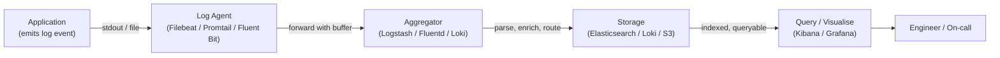
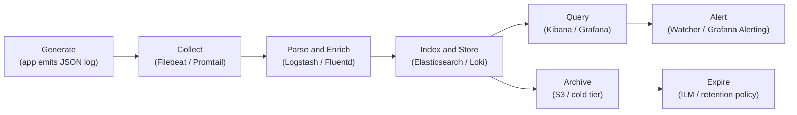
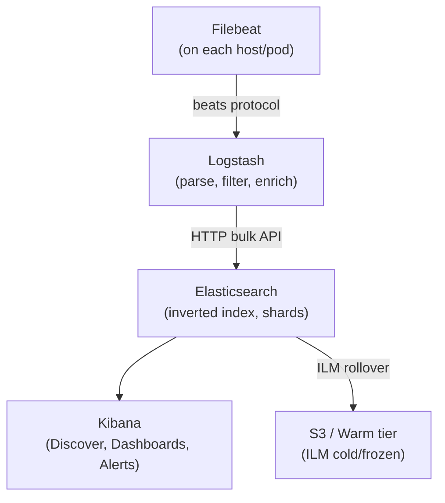
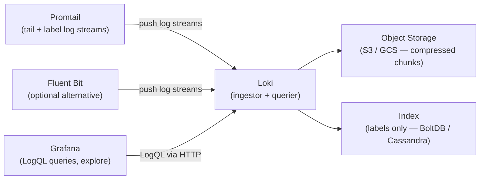
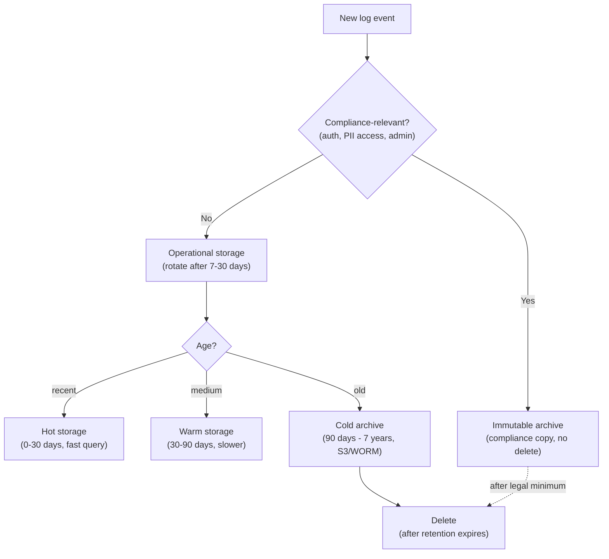

# Module 12: Logging & Log Management

> **Course**: DevOps Career Path  
> **Audience**: Beginner → Intermediate  
> **Prerequisites**: Module 06 (Kubernetes), Module 11 (Monitoring & Observability)

[](https://creativecommons.org/licenses/by-nc-sa/4.0/)      

---

## Table of Contents

1. [Overview](#overview)
2. [Learning Objectives](#learning-objectives)
3. [Logging Fundamentals](#logging-fundamentals)
4. [Structured Logging](#structured-logging)
5. [The ELK Stack](#the-elk-stack)
   - [Elasticsearch](#elasticsearch)
   - [Logstash](#logstash)
   - [Kibana](#kibana)
   - [Filebeat](#filebeat)
   - [Full ELK Deployment Example](#full-elk-deployment-example)
6. [Grafana Loki Stack](#grafana-loki-stack)
   - [Loki Architecture](#loki-architecture)
   - [Promtail](#promtail)
   - [LogQL](#logql)
   - [Loki Deployment](#loki-deployment)
7. [Fluentd & Fluent Bit](#fluentd--fluent-bit)
8. [Kubernetes Logging Patterns](#kubernetes-logging-patterns)
9. [Log Retention, Rotation & Compliance](#log-retention-rotation--compliance)
10. [Centralized Logging Architecture Patterns](#centralized-logging-architecture-patterns)
11. [Comparing Logging Stacks](#comparing-logging-stacks)
12. [Advanced: Log-Based Alerting & Anomaly Detection](#advanced-log-based-alerting--anomaly-detection)
13. [Tools & Commands Reference](#tools--commands-reference)
14. [Hands-On Labs](#hands-on-labs)
15. [Further Reading](#further-reading)

---

## Overview

Logs are the raw narrative of your system — every event, error, transaction, and state change produces log data. This module covers the full lifecycle: structured log emission, collection, shipping, indexing, querying, and retention. You will work with both the **ELK Stack** (Elasticsearch, Logstash, Kibana) and the **Loki Stack** (Loki, Promtail, Grafana) — the two dominant open-source centralized logging solutions.

Logs and metrics serve different purposes and should not be used interchangeably. Metrics are designed to answer "how much" and "how often" questions across the whole system at low cost — they aggregate well and age gracefully. Logs are designed to answer "what happened" and "why" questions at the level of individual events. They are verbose, high-volume, and expensive to store at scale. This means log volume must be managed deliberately: at the emission level (choosing what to log), at the collection level (filtering and sampling where safe), and at the retention level (tiered storage and expiry policies). Teams that treat logs as infinitely cheap quickly discover that their logging infrastructure costs more than the application it monitors.

The pipeline below shows how a log event travels from application to engineer. Each hop is an opportunity to add value (enrichment, parsing, indexing) and also a failure point (network loss, buffer overflow, disk fill). Understanding the full pipeline is why this module covers not just querying tools but also collection agents, routing, and retention.



[↑ Back to TOC](#table-of-contents)

---

## Learning Objectives

By the end of this module, you will be able to:

- Explain the lifecycle of a log event from emission to query
- Implement structured logging in applications (JSON format)
- Deploy and configure the full ELK Stack
- Write Elasticsearch queries and build Kibana dashboards
- Deploy Loki + Promtail and write LogQL queries
- Ship logs with Filebeat, Fluent Bit, and Promtail
- Implement Kubernetes-native logging patterns
- Design log retention, rotation, and archival policies
- Choose the right logging stack for a given use case
- Configure log-based alerting in Elasticsearch (Watcher) and Loki (Grafana Alerting)
- Detect anomalies in log streams using threshold rules and ML-based techniques

[↑ Back to TOC](#table-of-contents)

---

## Logging Fundamentals

Logging exists because systems fail in ways that metrics alone cannot fully explain. A metric can tell you that error rate spiked or latency increased, but logs often reveal the exact event, code path, dependency failure, or malformed input that produced the symptom. In practice, logs are the forensic record of system behavior. They help you reconstruct what happened after the fact and understand what the software believed was true in the moment.

That said, more logging does not automatically mean better observability. Undisciplined logging creates noise, high storage cost, and search experiences so painful that engineers stop trusting the system. The goal of this module is therefore not just to show tools, but to teach how to think about log usefulness: what to emit, how to structure it, how to move it safely, and how to retain it in a way that supports operations, security, and compliance.

### Log levels

| Level | Numeric | Meaning | When to use |
|-------|---------|---------|-------------|
| **TRACE** | 5 | Finest detail | Deep debugging only — never in production |
| **DEBUG** | 4 | Diagnostic detail | Development and troubleshooting |
| **INFO** | 3 | Normal operation | Service startup, user actions, milestones |
| **WARN** | 2 | Unexpected but recoverable | Deprecated API usage, slow response |
| **ERROR** | 1 | Failure, operation failed | Exception caught, request failed |
| **FATAL** | 0 | Unrecoverable, process exit | Out of memory, config missing |

### Log lifecycle

```
Application
    │
    │ emits log event
    ▼
Log Shipper (Filebeat / Promtail / Fluent Bit)
    │
    │ forwards (with buffering)
    ▼
Log Aggregator (Logstash / Fluentd / Loki)
    │
    │ parses, enriches, routes
    ▼
Log Store (Elasticsearch / Loki / S3)
    │
    │ indexed, queryable
    ▼
Visualization (Kibana / Grafana)
    │
    │ search, dashboard, alert
    ▼
Engineer / On-call
```

### The syslog standard

```
# Syslog format: RFC 3164
<priority>timestamp hostname app[pid]: message

# Example:
<34>Mar  2 14:22:01 web-01 nginx[1234]: 2026/03/02 14:22:01 [error] 1234#1234: *1 connect() failed

# Syslog facilities (0-23)
0  = kern     8  = uucp
1  = user     9  = cron
3  = daemon   16-23 = local0-local7
```

[↑ Back to TOC](#table-of-contents)

---

## Structured Logging

Unstructured logs are human-readable but machine-hostile. Structured logs (JSON) are both.

Structured logging is one of the highest-leverage improvements a team can make because it changes logs from text blobs into queryable event records. Once logs are emitted as JSON or another consistent structure, you can filter by service, trace ID, request ID, user context, status code, or environment without relying on brittle regexes. That makes incident response faster and reduces the amount of manual parsing engineers do under pressure.

The correlation ID pattern is where structured logging delivers its biggest operational payoff. When every log event emitted by every service in a request's path carries the same `trace_id` and `request_id`, you can reconstruct the full story of that request across all services by filtering on a single identifier. Without this, tracking a user-reported bug through a microservices system means grepping multiple log streams, mentally correlating timestamps, and guessing at causality. With it, the entire request chain collapses into one filtered view.

The broader operational benefit is consistency across teams and languages. When Python, Node.js, and other services emit similar fields with similar meaning, central logging platforms can correlate events more effectively and dashboards become more reusable. This is especially important in distributed systems, where the difference between "we have logs" and "we have useful logs" is often whether common context fields exist everywhere.



### Unstructured (avoid)

```
2026-03-02 14:22:01 ERROR Failed to connect to database after 3 retries host=db-01 latency=2340ms
```

### Structured (prefer)

```json
{
  "timestamp": "2026-03-02T14:22:01.453Z",
  "level": "error",
  "service": "api-gateway",
  "host": "web-01",
  "trace_id": "abc123def456",
  "user_id": "u-9981",
  "event": "db_connection_failed",
  "database_host": "db-01",
  "retry_count": 3,
  "latency_ms": 2340,
  "message": "Failed to connect to database after 3 retries"
}
```

### Structured logging in Python

```python
import logging
import json
import sys
from datetime import datetime, timezone


class JSONFormatter(logging.Formatter):
    """Emit log records as JSON lines."""

    def format(self, record: logging.LogRecord) -> str:
        log_entry = {
            "timestamp": datetime.now(timezone.utc).isoformat(),
            "level": record.levelname.lower(),
            "logger": record.name,
            "message": record.getMessage(),
            "module": record.module,
            "function": record.funcName,
            "line": record.lineno,
        }
        # Merge any extra fields passed via extra={}
        for key, value in record.__dict__.items():
            if key not in logging.LogRecord.__dict__ and not key.startswith("_"):
                if key not in log_entry:
                    log_entry[key] = value
        if record.exc_info:
            log_entry["exception"] = self.formatException(record.exc_info)
        return json.dumps(log_entry)


def get_logger(name: str) -> logging.Logger:
    logger = logging.getLogger(name)
    logger.setLevel(logging.DEBUG)
    handler = logging.StreamHandler(sys.stdout)
    handler.setFormatter(JSONFormatter())
    logger.addHandler(handler)
    return logger


# Usage
log = get_logger("api.orders")

log.info("Order created", extra={"order_id": "ord-123", "user_id": "u-456", "amount": 99.99})
log.error("Payment failed", extra={"order_id": "ord-123", "error_code": "CARD_DECLINED"})
```

### Structured logging in Node.js (pino)

```javascript
import pino from 'pino';

const log = pino({
  level: process.env.LOG_LEVEL || 'info',
  base: {
    service: 'order-service',
    env: process.env.NODE_ENV,
  },
  timestamp: pino.stdTimeFunctions.isoTime,
  formatters: {
    level(label) {
      return { level: label };
    },
  },
});

// Usage
log.info({ orderId: 'ord-123', userId: 'u-456' }, 'Order created');
log.error({ orderId: 'ord-123', err: new Error('Card declined') }, 'Payment failed');
```

### Key fields to always include

| Field | Type | Description |
|-------|------|-------------|
| `timestamp` | ISO 8601 UTC | When the event occurred |
| `level` | string | Log level |
| `service` | string | Application/service name |
| `trace_id` | string | Distributed trace ID (pass via headers) |
| `request_id` | string | Per-request unique ID |
| `user_id` | string | Authenticated user (omit if no auth context) |
| `host` | string | Emitting host/pod |
| `message` | string | Human-readable summary |

[↑ Back to TOC](#table-of-contents)

---

## The ELK Stack

**ELK** = **E**lasticsearch + **L**ogstash + **K**ibana. In modern deployments, Logstash is often replaced by the lighter **Filebeat** (direct to Elasticsearch) or **Fluent Bit**.

ELK is powerful because it treats logs as searchable documents rather than just archived text. That makes it a strong fit for environments where engineers, security teams, and auditors need to search deeply inside log content, build dashboards around fields, and retain large event histories with lifecycle controls. When operated well, ELK becomes both an operational troubleshooting tool and an investigation platform.

Elasticsearch's core power comes from its inverted index. When a document is ingested, each unique term in each indexed field gets an entry in an index structure that maps the term to a list of document IDs. That is why full-text search on millions of log records is fast: you look up the term in the inverted index rather than scanning every record. The tradeoff is that every new indexed field increases the index size, and the phenomenon known as mapping explosion — where many dynamic fields all get indexed — is a common cause of Elasticsearch cluster degradation. The right mitigation is to define explicit mappings for known fields and to restrict dynamic mapping in production indices.

Shards and replicas are the other key concept for operating Elasticsearch at scale. An index is divided into primary shards, and each shard can have replica shards on different nodes for redundancy. More shards means more parallelism for large indices; fewer shards means less overhead for small ones. A typical starting point is one primary shard per 10-50 GB of data, with one replica shard per primary. Over-sharding is a common mistake that wastes resources; the overhead of managing many small shards can exceed the gain.

The tradeoff is that this flexibility has real cost. Elasticsearch clusters consume memory, index design matters, ingestion pipelines need tuning, and retention strategy can become expensive if left unmanaged. Teams adopt ELK successfully when the value of rich search and analytics outweighs the operational overhead. The sections below walk through each component so you can see where that complexity comes from and when it is justified.



```
┌──────────────────────────────────────────────────────────────────┐
│                         ELK STACK                                │
│                                                                  │
│  ┌─────────────┐    ┌───────────┐    ┌─────────────────────────┐ │
│  │  Filebeat   │───►│ Logstash  │───►│    Elasticsearch        │ │
│  │  (on hosts) │    │ (parse /  │    │    (index & store)      │ │
│  │             │    │  enrich)  │    │                         │ │
│  └─────────────┘    └───────────┘    └──────────┬──────────────┘ │
│                                                 │                │
│                                                 ▼                │
│                                      ┌──────────────────────┐   │
│                                      │        Kibana        │   │
│                                      │  (search + dashboards│   │
│                                      │   + alerts)          │   │
│                                      └──────────────────────┘   │
└──────────────────────────────────────────────────────────────────┘
```

### Elasticsearch

Elasticsearch is a distributed, document-oriented search and analytics engine built on Apache Lucene.

#### Core concepts

| Concept | Description |
|---------|-------------|
| **Index** | Collection of documents (like a database table) |
| **Document** | A JSON object stored in an index |
| **Shard** | Horizontal partition of an index (Lucene index) |
| **Replica** | Copy of a shard for HA and read scaling |
| **Mapping** | Schema definition for document fields |
| **ILM** | Index Lifecycle Management — automate index aging |

#### Elasticsearch REST API

```bash
# Check cluster health
curl -s http://localhost:9200/_cluster/health | jq .

# List all indices
curl -s http://localhost:9200/_cat/indices?v

# Create an index with explicit mapping
curl -X PUT http://localhost:9200/app-logs-2026.03 \
  -H "Content-Type: application/json" \
  -d '{
    "settings": {
      "number_of_shards": 2,
      "number_of_replicas": 1,
      "index.refresh_interval": "5s"
    },
    "mappings": {
      "properties": {
        "timestamp":   { "type": "date" },
        "level":       { "type": "keyword" },
        "service":     { "type": "keyword" },
        "host":        { "type": "keyword" },
        "trace_id":    { "type": "keyword" },
        "message":     { "type": "text", "analyzer": "standard" },
        "latency_ms":  { "type": "long" },
        "status_code": { "type": "integer" }
      }
    }
  }'

# Index a document
curl -X POST http://localhost:9200/app-logs-2026.03/_doc \
  -H "Content-Type: application/json" \
  -d '{"timestamp":"2026-03-02T14:22:01Z","level":"error","service":"api","message":"timeout"}'

# Search — match all errors
curl -s -X GET http://localhost:9200/app-logs-*/_search \
  -H "Content-Type: application/json" \
  -d '{
    "query": {
      "bool": {
        "filter": [
          { "term": { "level": "error" } },
          { "range": { "timestamp": { "gte": "now-1h" } } }
        ]
      }
    },
    "sort": [{ "timestamp": "desc" }],
    "size": 20
  }'

# Full-text search in message field
curl -s -X GET http://localhost:9200/app-logs-*/_search \
  -H "Content-Type: application/json" \
  -d '{
    "query": {
      "match": {
        "message": "connection refused"
      }
    }
  }'

# Aggregation — count errors per service
curl -s -X GET http://localhost:9200/app-logs-*/_search \
  -H "Content-Type: application/json" \
  -d '{
    "query": { "term": { "level": "error" } },
    "aggs": {
      "errors_by_service": {
        "terms": { "field": "service", "size": 10 }
      }
    },
    "size": 0
  }'
```

#### Index Lifecycle Management (ILM)

```json
// PUT _ilm/policy/app-logs-policy
{
  "policy": {
    "phases": {
      "hot": {
        "min_age": "0ms",
        "actions": {
          "rollover": {
            "max_primary_shard_size": "10gb",
            "max_age": "1d"
          }
        }
      },
      "warm": {
        "min_age": "7d",
        "actions": {
          "forcemerge": { "max_num_segments": 1 },
          "shrink": { "number_of_shards": 1 }
        }
      },
      "cold": {
        "min_age": "30d",
        "actions": {
          "freeze": {}
        }
      },
      "delete": {
        "min_age": "90d",
        "actions": {
          "delete": {}
        }
      }
    }
  }
}
```

[↑ Back to TOC](#table-of-contents)

---

### Logstash

Logstash is a server-side data processing pipeline: input → filter → output.

Logstash is where many logging architectures become truly programmable. It can ingest from multiple sources, parse mixed log formats, enrich events, drop noise, route high-value data differently, and normalize fields before they ever reach storage. That is incredibly useful in heterogeneous environments where not every application logs clean JSON and not every source should be treated equally.

At the same time, every transformation you add becomes part of the operational path for log delivery. Complex filters can increase CPU usage, introduce latency, or make troubleshooting ingestion problems harder. The goal is to transform logs enough to make them useful without turning the pipeline into an opaque, fragile data processing system.

#### `logstash.conf` — full pipeline example

```ruby
input {
  # Receive from Filebeat
  beats {
    port => 5044
    ssl  => false
  }

  # Also accept syslog
  syslog {
    port => 5140
    type => "syslog"
  }

  # Accept from Kafka (for high-volume)
  kafka {
    bootstrap_servers => "kafka:9092"
    topics => ["app-logs"]
    codec => json
  }
}

filter {
  # Parse JSON logs
  if [type] == "application" {
    json {
      source => "message"
      target => "parsed"
      remove_field => ["message"]
    }
    mutate {
      rename => { "[parsed][timestamp]" => "@timestamp" }
      rename => { "[parsed][level]"     => "level"      }
      rename => { "[parsed][service]"   => "service"    }
      rename => { "[parsed][message]"   => "message"    }
    }
  }

  # Parse Nginx access logs (unstructured)
  if [type] == "nginx" {
    grok {
      match => {
        "message" => '%{IPORHOST:client_ip} - %{DATA:user} \[%{HTTPDATE:timestamp}\] "%{WORD:method} %{DATA:request} HTTP/%{NUMBER:http_version}" %{NUMBER:status_code:int} %{NUMBER:bytes:int} "%{DATA:referrer}" "%{DATA:user_agent}"'
      }
    }
    date {
      match => ["timestamp", "dd/MMM/yyyy:HH:mm:ss Z"]
      target => "@timestamp"
      remove_field => ["timestamp"]
    }
    mutate {
      convert => { "status_code" => "integer" }
      convert => { "bytes"       => "integer" }
    }
    # Tag 5xx errors
    if [status_code] >= 500 {
      mutate { add_tag => ["error", "5xx"] }
    }
  }

  # GeoIP enrichment
  if [client_ip] {
    geoip {
      source => "client_ip"
      target => "geoip"
    }
  }

  # Drop health check noise
  if [request] =~ "/health" {
    drop {}
  }

  # Add environment tag
  mutate {
    add_field => { "environment" => "${ENV:production}" }
  }
}

output {
  # Send to Elasticsearch with daily indices
  elasticsearch {
    hosts    => ["http://elasticsearch:9200"]
    index    => "%{[type]}-%{+YYYY.MM.dd}"
    template_name    => "app-logs"
    template_overwrite => false
  }

  # Also write errors to separate index
  if "error" in [tags] {
    elasticsearch {
      hosts => ["http://elasticsearch:9200"]
      index => "errors-%{+YYYY.MM.dd}"
    }
  }

  # Debug — print to stdout
  # stdout { codec => rubydebug }
}
```

[↑ Back to TOC](#table-of-contents)

---

### Kibana

Kibana provides a web UI for searching, visualizing, and alerting on Elasticsearch data.

Kibana is the part of ELK that most teams interact with daily because it converts raw indexed documents into investigation workflows. Search, filters, saved views, dashboards, and alerts let engineers move from a vague symptom like "payments are failing" to a more precise picture of which service, customer path, or time window is involved. It is effectively the operational lens on top of Elasticsearch.

That means good Kibana usage depends heavily on upstream discipline. If fields are inconsistent, mappings are poor, or timestamps are unreliable, the UI cannot compensate. When logs are well structured, however, Kibana becomes a powerful bridge between ad hoc debugging and repeatable operational analysis.

#### Key features

| Feature | Description |
|---------|-------------|
| **Discover** | Full-text search and log browsing with time filters |
| **Dashboard** | Compose visualizations into monitoring boards |
| **Visualize** | Bar charts, line charts, maps, metric panels |
| **Alerts** | Rule-based alerting on Elasticsearch data |
| **APM** | Application Performance Monitoring |
| **Lens** | Drag-and-drop chart builder |
| **Canvas** | Custom reporting and presentations |

#### KQL (Kibana Query Language) examples

```kql
# Find all errors
level: "error"

# Errors from a specific service in last 15 min (use time filter)
level: "error" AND service: "api-gateway"

# Full-text search
message: "connection refused"

# Status codes 500–599
status_code >= 500 AND status_code < 600

# Complex filter
service: ("api-gateway" OR "order-service") AND level: ("error" OR "warn")

# Wildcard
request: /api/users/*

# Negation
NOT service: "health-checker"
```

[↑ Back to TOC](#table-of-contents)

---

### Filebeat

Filebeat is a lightweight log shipper (Go binary, ~40MB) that tails log files and ships to Logstash or Elasticsearch.

Shippers like Filebeat matter because collection is its own engineering problem. Applications write logs in different places, nodes restart, files rotate, containers churn, and networks fail intermittently. A reliable shipper handles these edge conditions while adding just enough metadata to make downstream analysis useful. In many environments, the quality of the collection layer determines whether the logging platform is trusted at all.

Filebeat is popular because it does one job with relatively low overhead: collect, buffer, annotate, and forward. That simplicity is a strength when teams want reliable ingestion without putting heavy parsing logic at the edge. It also fits well into pipelines where richer processing happens later in Logstash or Elasticsearch ingest pipelines.

#### `filebeat.yml`

```yaml
filebeat.inputs:
  # Application JSON logs
  - type: log
    enabled: true
    paths:
      - /var/log/app/*.log
    json.keys_under_root: true
    json.add_error_key: true
    fields:
      type: application
      environment: production
    fields_under_root: true
    multiline.pattern: '^{'
    multiline.negate: true
    multiline.match: after

  # Nginx access logs
  - type: log
    enabled: true
    paths:
      - /var/log/nginx/access.log
    fields:
      type: nginx

  # Nginx error logs
  - type: log
    enabled: true
    paths:
      - /var/log/nginx/error.log
    fields:
      type: nginx-error

  # System logs
  - type: log
    enabled: true
    paths:
      - /var/log/messages
      - /var/log/syslog
    fields:
      type: syslog

# Processors — enrich events before shipping
processors:
  - add_host_metadata:
      when.not.contains.tags: forwarded
  - add_docker_metadata: ~
  - add_kubernetes_metadata:
      host: ${NODE_NAME}
      matchers:
        - logs_path:
            logs_path: "/var/log/containers/"

# Output — send to Logstash
output.logstash:
  hosts: ["logstash:5044"]
  loadbalance: true

# Alternatively — send directly to Elasticsearch
# output.elasticsearch:
#   hosts: ["http://elasticsearch:9200"]
#   index: "filebeat-%{[agent.version]}-%{+yyyy.MM.dd}"

# Internal metrics
monitoring.enabled: true
monitoring.elasticsearch:
  hosts: ["http://elasticsearch:9200"]

# Logging
logging.level: info
logging.to_files: true
logging.files:
  path: /var/log/filebeat
  name: filebeat
  keepfiles: 7
```

[↑ Back to TOC](#table-of-contents)

---

### Full ELK Deployment Example

```yaml
# docker-compose.yml — ELK Stack
version: '3.8'

volumes:
  esdata01: {}
  kibanadata: {}

networks:
  elk:

services:
  elasticsearch:
    image: docker.elastic.co/elasticsearch/elasticsearch:8.13.0
    environment:
      - node.name=es01
      - cluster.name=elk-cluster
      - discovery.type=single-node
      - bootstrap.memory_lock=true
      - xpack.security.enabled=false          # Enable in production!
      - "ES_JAVA_OPTS=-Xms1g -Xmx1g"
    ulimits:
      memlock:
        soft: -1
        hard: -1
    volumes:
      - esdata01:/usr/share/elasticsearch/data
    ports:
      - "9200:9200"
    networks:
      - elk
    healthcheck:
      test: curl -fs http://localhost:9200/_cluster/health || exit 1
      interval: 30s
      timeout: 10s
      retries: 5

  logstash:
    image: docker.elastic.co/logstash/logstash:8.13.0
    volumes:
      - ./logstash/pipeline:/usr/share/logstash/pipeline:ro
      - ./logstash/config/logstash.yml:/usr/share/logstash/config/logstash.yml:ro
    ports:
      - "5044:5044"      # Beats input
      - "5140:5140/udp"  # Syslog
    environment:
      - "LS_JAVA_OPTS=-Xmx512m -Xms512m"
    networks:
      - elk
    depends_on:
      elasticsearch:
        condition: service_healthy

  kibana:
    image: docker.elastic.co/kibana/kibana:8.13.0
    ports:
      - "5601:5601"
    environment:
      - ELASTICSEARCH_HOSTS=http://elasticsearch:9200
    volumes:
      - kibanadata:/usr/share/kibana/data
    networks:
      - elk
    depends_on:
      elasticsearch:
        condition: service_healthy

  filebeat:
    image: docker.elastic.co/beats/filebeat:8.13.0
    user: root
    volumes:
      - ./filebeat/filebeat.yml:/usr/share/filebeat/filebeat.yml:ro
      - /var/lib/docker/containers:/var/lib/docker/containers:ro
      - /var/run/docker.sock:/var/run/docker.sock:ro
    environment:
      - LOGSTASH_HOST=logstash:5044
    networks:
      - elk
    depends_on:
      - logstash
```

[↑ Back to TOC](#table-of-contents)

---

## Grafana Loki Stack

Loki is a horizontally scalable, highly available log aggregation system designed to be cost-effective and easy to operate. Unlike Elasticsearch, **Loki only indexes metadata (labels) — not log content**, making it much cheaper to store and operate.

Loki's design philosophy is that most log analysis is a grep problem, not a search problem. Rather than building a rich inverted index over log content, Loki stores compressed log chunks in object storage and attaches metadata labels (service, namespace, pod, level, environment) to each stream. At query time, LogQL first filters by labels to identify matching streams, then applies regex or text filters within those streams. This means label selection is fast and cheap; content scanning is proportional to how much data the label filter returns. The implication is that good label design makes Loki performant, and bad label design makes it expensive.

The trade-off versus Elasticsearch is explicit. ELK lets you write a free-text search like `error AND database AND timeout` and match against all ingested fields instantly because they are all indexed. Loki cannot do that efficiently unless the label filters first narrow the candidate streams substantially. Where Loki wins is total cost of ownership: no JVM heap to tune, object storage instead of SSD-backed nodes, and a simple operational model that fits teams already running the Prometheus/Grafana stack. For teams that primarily use logs for incident investigation and service correlation rather than security analytics or compliance search, Loki is often the better choice.

Loki is a strong choice when the main goal is to correlate logs with metrics and traces without paying the full indexing cost of ELK. Its design assumes that many operational questions can be answered by filtering on labels such as service, namespace, pod, environment, or level, then scanning the matching log lines. That makes it especially attractive in Kubernetes-heavy environments where those labels already exist and where cost per gigabyte matters.

The most important design implication is that label strategy becomes critical. Because Loki does not fully index message content, you need to think carefully about which metadata should be promoted to labels and which should remain inside the log body. Good labels make Loki fast and cheap. Bad labels either create high-cardinality performance problems or make the logs too hard to query effectively.



### Loki Architecture

```
┌──────────────────────────────────────────────────────────────────┐
│                          LOKI STACK                              │
│                                                                  │
│  ┌─────────────┐    ┌──────────────┐    ┌────────────────────┐  │
│  │  Promtail   │───►│     Loki     │◄───│      Grafana       │  │
│  │  (on hosts  │    │  (log store) │    │  (query + display) │  │
│  │  / pods)    │    │              │    │  LogQL queries     │  │
│  └─────────────┘    │  Chunks:S3   │    └────────────────────┘  │
│                     │  Index:BoltDB│                             │
│  ┌─────────────┐    │  /DynamoDB   │                             │
│  │ Fluent Bit  │───►│              │                             │
│  │  (optional) │    └──────────────┘                             │
│  └─────────────┘                                                 │
└──────────────────────────────────────────────────────────────────┘
```

### Loki Deployment

```yaml
# docker-compose.yml — Loki + Promtail + Grafana
version: '3.8'

volumes:
  loki_data: {}
  grafana_data: {}

networks:
  loki:

services:
  loki:
    image: grafana/loki:2.9.4
    ports:
      - "3100:3100"
    command: -config.file=/etc/loki/local-config.yaml
    volumes:
      - ./loki-config.yml:/etc/loki/local-config.yaml:ro
      - loki_data:/loki
    networks:
      - loki

  promtail:
    image: grafana/promtail:2.9.4
    volumes:
      - /var/log:/var/log:ro
      - /var/lib/docker/containers:/var/lib/docker/containers:ro
      - /var/run/docker.sock:/var/run/docker.sock
      - ./promtail-config.yml:/etc/promtail/config.yml:ro
    command: -config.file=/etc/promtail/config.yml
    networks:
      - loki

  grafana:
    image: grafana/grafana:10.4.0
    ports:
      - "3000:3000"
    environment:
      - GF_SECURITY_ADMIN_PASSWORD=admin123
    volumes:
      - grafana_data:/var/lib/grafana
      - ./grafana-datasources.yml:/etc/grafana/provisioning/datasources/loki.yml:ro
    networks:
      - loki
```

#### `loki-config.yml`

```yaml
auth_enabled: false

server:
  http_listen_port: 3100

common:
  path_prefix: /loki
  storage:
    filesystem:
      chunks_directory: /loki/chunks
      rules_directory: /loki/rules
  replication_factor: 1
  ring:
    instance_addr: 127.0.0.1
    kvstore:
      store: inmemory

schema_config:
  configs:
    - from: 2024-01-01
      store: tsdb
      object_store: filesystem
      schema: v13
      index:
        prefix: index_
        period: 24h

limits_config:
  retention_period: 90d
  ingestion_rate_mb: 16
  ingestion_burst_size_mb: 32
  max_entries_limit_per_query: 5000

ruler:
  storage:
    type: local
    local:
      directory: /loki/rules
  rule_path: /loki/rules-temp
  alertmanager_url: http://alertmanager:9093
  ring:
    kvstore:
      store: inmemory
  enable_api: true
```

[↑ Back to TOC](#table-of-contents)

---

### Promtail

Promtail is the log collection agent for Loki — it tails files, attaches labels, and pushes to Loki.

Promtail is more than a shipping sidecar. It is where raw log lines are first mapped into the label model that makes Loki work. That means choices made here directly affect query speed, storage efficiency, and whether engineers can find the right stream during an incident. Parsing and relabeling rules are therefore not just implementation details; they are part of the information architecture of your logging system.

This is also where teams need restraint. It is tempting to label every extracted field, but high-cardinality labels can hurt performance badly. A useful rule of thumb is to promote stable routing and identity fields to labels, while keeping highly variable values such as user IDs or request payload details inside the log line itself.

#### `promtail-config.yml`

```yaml
server:
  http_listen_port: 9080
  grpc_listen_port: 0

positions:
  filename: /tmp/positions.yaml

clients:
  - url: http://loki:3100/loki/api/v1/push

scrape_configs:
  # System logs
  - job_name: system
    static_configs:
      - targets:
          - localhost
        labels:
          job: syslog
          host: web-01
          __path__: /var/log/syslog

  # All files in /var/log/app
  - job_name: application
    static_configs:
      - targets:
          - localhost
        labels:
          job: app
          env: production
          __path__: /var/log/app/*.log
    pipeline_stages:
      # Parse JSON log lines
      - json:
          expressions:
            level:   level
            service: service
            trace_id: trace_id
      # Extract level as a label (for filtering)
      - labels:
          level:
          service:
      # Set timestamp from log field
      - timestamp:
          source: timestamp
          format: RFC3339Nano

  # Docker container logs
  - job_name: docker
    docker_sd_configs:
      - host: unix:///var/run/docker.sock
        refresh_interval: 5s
    relabel_configs:
      - source_labels: ['__meta_docker_container_name']
        regex: '/(.*)'
        target_label: 'container'
      - source_labels: ['__meta_docker_container_log_stream']
        target_label: 'stream'

  # Kubernetes pod logs
  - job_name: kubernetes-pods
    kubernetes_sd_configs:
      - role: pod
    pipeline_stages:
      - docker: {}
    relabel_configs:
      - source_labels: [__meta_kubernetes_namespace]
        target_label: namespace
      - source_labels: [__meta_kubernetes_pod_name]
        target_label: pod
      - source_labels: [__meta_kubernetes_container_name]
        target_label: container
      - source_labels: [__meta_kubernetes_pod_label_app]
        target_label: app
```

[↑ Back to TOC](#table-of-contents)

---

### LogQL

LogQL is Loki's query language. It borrows from PromQL — a log stream selector followed by optional filter and metric expressions.

LogQL is one of Loki's biggest advantages because it lets you move between raw log exploration and metric-style analysis without leaving the same system. You can start by filtering for a specific service and error string, then progress to rates, counts, and latency-style aggregations derived from the same log streams. That closes the gap between debugging and alerting in a very practical way.

The mental model is important here: selectors narrow the streams, pipeline stages parse or filter the content, and metric functions summarize behavior over time. Once that pattern is clear, LogQL becomes much easier to read and much more useful during incident response.

#### Log stream selectors

```logql
# Select all logs from the nginx job
{job="nginx"}

# Select by multiple labels
{job="app", env="production", level="error"}

# Regex label match
{job=~"app.*", env!="dev"}
```

#### Log filters (pipeline)

```logql
# Line filter — include lines containing the string
{job="nginx"} |= "error"

# Line filter — exclude lines
{job="nginx"} != "healthz"

# Regex filter
{job="nginx"} |~ "5[0-9]{2}"

# JSON parser + field filter
{job="app"} | json | level="error"

# Logfmt parser (key=value format)
{job="app"} | logfmt | duration > 500ms

# Pattern parser (extract named fields)
{job="nginx"} | pattern `<ip> - <_> [<_>] "<method> <path> <_>" <status> <size>`

# Filter on extracted field
{job="nginx"} | pattern `<ip> - <_> [<_>] "<method> <path> <_>" <status> <size>` | status >= "500"
```

#### Metric queries (LogQL → Prometheus-like metrics)

```logql
# Rate of log lines per second
rate({job="nginx"}[5m])

# Rate of error logs per second
rate({job="app"} | json | level="error" [5m])

# Count entries over time window
count_over_time({job="app"}[1h])

# Bytes received per second
bytes_rate({job="nginx"}[5m])

# Top 5 IPs by request count (last 1 hour)
topk(5,
  sum by (ip) (
    count_over_time({job="nginx"} | pattern `<ip> - <_>` [1h])
  )
)

# 95th percentile latency from JSON logs
quantile_over_time(0.95,
  {job="api"} | json | unwrap latency_ms [5m]
) by (service)
```

[↑ Back to TOC](#table-of-contents)

---

## Fluentd & Fluent Bit

Not every logging architecture fits neatly into either the ELK or Loki worldview. Fluentd and Fluent Bit are often used as the plumbing layer that sits between applications and storage backends, especially in Kubernetes or high-volume environments. They give teams a flexible way to collect, enrich, filter, and route logs toward one or more destinations without tying collection to a single storage product.

The distinction between the two tools reflects a common architectural tradeoff. Fluent Bit is optimized for lightweight collection at the edge, where low memory usage and efficient forwarding matter most. Fluentd is heavier but more extensible, making it useful when the aggregation layer needs richer transformation or plugin coverage.

| Feature | Fluentd | Fluent Bit |
|---------|---------|-----------|
| Language | Ruby + C | C only |
| Memory | ~40MB | ~650KB |
| Plugins | 500+ | 70+ |
| Best for | Aggregation tier | Edge/node log shipping |
| Kubernetes | DaemonSet aggregator | DaemonSet collector |

#### Fluent Bit configuration

```ini
# /etc/fluent-bit/fluent-bit.conf

[SERVICE]
    Flush        5
    Daemon       Off
    Log_Level    info
    Parsers_File parsers.conf

[INPUT]
    Name         tail
    Path         /var/log/containers/*.log
    Parser       docker
    Tag          kube.*
    Refresh_Interval 5
    Mem_Buf_Limit 5MB
    Skip_Long_Lines On

[FILTER]
    Name         kubernetes
    Match        kube.*
    Kube_URL     https://kubernetes.default.svc:443
    Kube_CA_File /var/run/secrets/kubernetes.io/serviceaccount/ca.crt
    Kube_Token_File /var/run/secrets/kubernetes.io/serviceaccount/token
    Merge_Log    On
    K8S-Logging.Parser On
    K8S-Logging.Exclude Off

[FILTER]
    Name         grep
    Match        kube.*
    Exclude      log /healthz

[OUTPUT]
    Name         es
    Match        kube.*
    Host         elasticsearch
    Port         9200
    Index        fluent-bit-kube
    Type         _doc
    Retry_Limit  3

[OUTPUT]
    Name         loki
    Match        kube.*
    Host         loki
    Port         3100
    Labels       job=fluent-bit, env=production
    Label_Keys   $kubernetes['namespace_name'],$kubernetes['pod_name']
```

[↑ Back to TOC](#table-of-contents)

---

## Kubernetes Logging Patterns

Kubernetes changes logging because containers are ephemeral, pods move between nodes, and application filesystems are not a safe long-term place to keep operational history. In this environment, logging strategy is less about individual servers and more about cluster-wide collection patterns. The platform needs a dependable way to capture stdout/stderr, attach metadata like namespace and pod name, and ship events off-node before the workload disappears.

That is why collection patterns matter so much in Kubernetes. A DaemonSet-based collector gives broad coverage across the cluster, while sidecars can solve special cases where application-specific log handling is needed. The right pattern depends on scale, operational overhead, and how much customization individual workloads require.

### Pattern 1: Node-level DaemonSet (most common)

```yaml
# fluent-bit DaemonSet (simplified)
apiVersion: apps/v1
kind: DaemonSet
metadata:
  name: fluent-bit
  namespace: kube-system
spec:
  selector:
    matchLabels:
      app: fluent-bit
  template:
    metadata:
      labels:
        app: fluent-bit
    spec:
      serviceAccountName: fluent-bit
      tolerations:
        - operator: Exists
      containers:
        - name: fluent-bit
          image: fluent/fluent-bit:2.2
          volumeMounts:
            - name: varlog
              mountPath: /var/log
            - name: varlibdockercontainers
              mountPath: /var/lib/docker/containers
              readOnly: true
            - name: config
              mountPath: /fluent-bit/etc/
      volumes:
        - name: varlog
          hostPath:
            path: /var/log
        - name: varlibdockercontainers
          hostPath:
            path: /var/lib/docker/containers
        - name: config
          configMap:
            name: fluent-bit-config
```

### Pattern 2: Sidecar logging container

```yaml
# Pod with log-shipping sidecar
apiVersion: v1
kind: Pod
metadata:
  name: app-with-sidecar-logging
spec:
  containers:
    # Main application — writes logs to shared volume
    - name: app
      image: myapp:latest
      volumeMounts:
        - name: app-logs
          mountPath: /var/log/app

    # Sidecar — ships logs to Loki
    - name: promtail
      image: grafana/promtail:2.9.4
      args:
        - -config.file=/etc/promtail/config.yml
      volumeMounts:
        - name: app-logs
          mountPath: /var/log/app
          readOnly: true
        - name: promtail-config
          mountPath: /etc/promtail

  volumes:
    - name: app-logs
      emptyDir: {}
    - name: promtail-config
      configMap:
        name: promtail-sidecar-config
```

### Kubernetes log best practices

```
✅ Always log to stdout/stderr — Kubernetes captures these automatically
✅ Use structured (JSON) logging
✅ Include pod name, namespace, and container in labels (auto-added by collectors)
✅ Don't write logs to files inside containers — ephemeral storage
✅ Set resource limits on logging DaemonSets (memory, CPU)
✅ Use log-level environment variables (LOG_LEVEL=info)
✅ Rotate and limit log file sizes via Docker/container runtime config
```

[↑ Back to TOC](#table-of-contents)

---

## Log Retention, Rotation & Compliance

Retention is where logging becomes a governance problem instead of just an engineering problem. Keeping every log forever is expensive and rarely necessary. Deleting logs too aggressively can break investigations, audit requirements, or post-incident analysis. A good retention policy therefore balances operational usefulness, legal obligations, security needs, and storage cost across different classes of logs.

The regulatory landscape creates non-negotiable minimums for certain types of logs. GDPR in the EU requires audit logs demonstrating that personal data access was lawful; it also requires that personal data not be kept longer than necessary, which can conflict with "keep everything" approaches. HIPAA in healthcare mandates audit logs for six years. PCI-DSS for payment card data requires at least one year of audit log retention with three months immediately available. These requirements are not symmetric — they apply to specific log categories (authentication events, access to sensitive data, administrative actions), not every application log. Understanding which logs are in scope prevents both under-retention (compliance risk) and over-retention (unnecessary cost).

The tiered storage pattern solves the cost problem without violating compliance. Hot storage (SSD-backed Elasticsearch nodes or Loki ingestors with local disk) holds the most recent logs where query latency is critical — typically seven to thirty days. Warm storage (larger, cheaper nodes or object storage) holds the medium-term window where logs are queried occasionally. Cold storage (object storage with infrequent access) holds the long-term compliance archive. Immutable audit logs — where no modification or deletion is possible, enforced by object-storage bucket policies or WORM storage — are required for compliance use cases and should be separated from operational logs in the pipeline design.

Rotation is part of that same discipline. Even if logs are shipped centrally, local files and container streams still need guardrails so they do not fill disks or disappear before collectors can process them. The configurations below matter because they connect day-to-day system hygiene with long-term compliance posture.



### Log rotation — logrotate

```ini
# /etc/logrotate.d/app-logs
/var/log/app/*.log {
    daily
    rotate 30          # Keep 30 days
    compress
    delaycompress      # Don't compress the most recent rotated file
    missingok
    notifempty
    sharedscripts
    postrotate
        # Signal app to reopen log files
        systemctl kill -s HUP app.service
    endscript
}
```

### Docker logging configuration

```json
// /etc/docker/daemon.json
{
  "log-driver": "json-file",
  "log-opts": {
    "max-size": "100m",
    "max-file": "5",
    "compress": "true",
    "labels": "environment,service"
  }
}
```

### Kubernetes container log limits

```yaml
# Node-level kubelet config
# /var/lib/kubelet/config.yaml
containerLogMaxSize: "100Mi"
containerLogMaxFiles: 5
```

### Retention policy guidelines

| Log type | Hot (searchable) | Warm (compressed) | Cold (archived) | Delete |
|----------|-----------------|-------------------|-----------------|--------|
| Application logs | 30 days | 60 days | 1 year | After 1 year |
| Security/audit logs | 90 days | 1 year | 5 years (compliance) | Per policy |
| Access logs | 14 days | 30 days | 90 days | After 90 days |
| Debug logs | 7 days | — | — | After 7 days |
| System logs | 30 days | 90 days | — | After 90 days |

> **Compliance note**: PCI-DSS requires 1 year log retention (3 months immediately accessible). HIPAA: 6 years. SOC2: defined by your organization's policy.

### Archiving to S3-compatible storage

```bash
# Ship old Elasticsearch indices to S3 (snapshot)
# Register S3 repository
curl -X PUT "http://elasticsearch:9200/_snapshot/s3_backup" \
  -H "Content-Type: application/json" \
  -d '{
    "type": "s3",
    "settings": {
      "bucket": "es-log-archive",
      "region": "us-east-1",
      "base_path": "snapshots"
    }
  }'

# Create snapshot
curl -X PUT "http://elasticsearch:9200/_snapshot/s3_backup/snapshot-2026-01" \
  -H "Content-Type: application/json" \
  -d '{
    "indices": "app-logs-2026.01.*",
    "include_global_state": false
  }'
```

[↑ Back to TOC](#table-of-contents)

---

## Centralized Logging Architecture Patterns

Architecture choices become clearer once you think in terms of team size, ingest volume, and operational tolerance. A logging stack that is perfect for a small platform team can become painfully limited at enterprise scale, while an enterprise-grade architecture can be unnecessary overhead for a young environment. Pattern thinking helps you avoid overbuilding too early or underbuilding until incidents expose the gap.

The patterns below are intentionally opinionated snapshots, not universal rules. They are designed to show how cost, complexity, and query needs tend to move together. Use them to reason about evolution: what you would start with today, what triggers the next level of architecture, and which tradeoffs you are accepting at each stage.

### Pattern 1: Small team (< 100 nodes)

```
Hosts → Promtail → Loki → Grafana
Cost: Near-zero   Ops: Minimal   Query: LogQL
```

### Pattern 2: Medium enterprise (100–1000 nodes)

```
Hosts → Filebeat → Logstash → Elasticsearch → Kibana
Cost: Moderate   Ops: Moderate   Query: KQL/EQL
ILM: hot→warm→cold→delete (90 days)
```

### Pattern 3: High-volume (> 1000 nodes / 1TB+ per day)

```
Hosts → Fluent Bit (edge)
              │
              ▼
          Kafka (buffer + fan-out)
         /          \
        ▼             ▼
   Logstash       Logstash
   (filter)       (filter)
        \           /
         ▼         ▼
      Elasticsearch cluster
      (coordinating → data → master nodes)
              │
              ▼
           Kibana
```

### Pattern 4: Multi-cloud / Kubernetes

```
Kubernetes DaemonSet (Fluent Bit / Promtail)
          │
          ├──► Loki (recent, fast, cheap)  ──► Grafana
          │
          └──► S3/GCS/Azure Blob (long-term archive)
```

[↑ Back to TOC](#table-of-contents)

---

## Comparing Logging Stacks

At this stage, the choice is less about which logging stack has the longest feature list and more about which one matches the way your team works. Do you need rich full-text search, long compliance retention, and flexible analytics? ELK may be worth the operational overhead. Do you primarily need Kubernetes-native logs correlated with metrics at lower cost? Loki may be the better fit. Hosted platforms add convenience, but usually at a different cost and control profile.

This comparison is most useful when paired with honest operational constraints: available staff, expected ingest volume, compliance obligations, existing cloud footprint, and tolerance for running stateful infrastructure. Logging platforms succeed when they fit those realities, not when they simply look impressive in a demo.

| Feature | ELK Stack | Loki Stack | Splunk | CloudWatch |
|---------|-----------|------------|--------|------------|
| **Full-text index** | ✅ Yes | ❌ No (labels only) | ✅ Yes | Partial |
| **Storage cost** | Higher | Lower (3-10x) | Very high | Pay per GB |
| **Query language** | KQL / EQL | LogQL | SPL | Insights QL |
| **Schema on write** | Yes (mapping) | No (raw) | Yes | No |
| **Kubernetes native** | Good | Excellent | Plugin | AWS only |
| **Alerting** | Built-in | Via Grafana | Built-in | Built-in |
| **Self-hosted** | Yes | Yes | Yes / SaaS | SaaS only |
| **Best for** | Full-text search, compliance | Cloud-native, cost-sensitive | Enterprise, SOC | AWS workloads |

> **Rule of thumb**: If you need to search *inside* log content frequently (full-text), ELK is better. If you primarily filter by labels/metadata and correlate with metrics, Loki + Grafana is simpler and cheaper.

[↑ Back to TOC](#table-of-contents)

---

## Advanced: Log-Based Alerting & Anomaly Detection

Collecting logs is only half the value. The other half is **acting on them automatically** — alerting on errors, detecting anomalies before users complain, and firing runbooks from log patterns.

This is the moment logs stop being passive evidence and start becoming active signals. In mature environments, log-derived alerts complement metrics by catching issues that counters may miss: repeated exception text, authentication anomalies, dependency failures, or a suspicious drop in normal event volume. When done well, log alerting shortens detection time and helps teams respond before users open tickets.

The caution is that logs can be noisy and context-dependent. Not every error line deserves a page, and not every anomaly should trigger an incident. Effective log-based alerting usually focuses on patterns with strong operational meaning, then routes those alerts with the same discipline used for metric-based paging.

### Alerting in Grafana Loki

Loki alerts use the same Grafana Alerting engine as Prometheus — configure rules with LogQL:

```yaml
# loki-rules.yaml — deployed as a ConfigMap in Kubernetes
groups:
  - name: application_alerts
    rules:
      # Alert on error rate
      - alert: HighErrorRate
        expr: |
          sum(rate({app="checkout-api"} |= "ERROR" [5m])) by (pod)
          /
          sum(rate({app="checkout-api"} [5m])) by (pod)
          > 0.05
        for: 2m
        labels:
          severity: warning
        annotations:
          summary: "High error rate on {{ $labels.pod }}"
          description: "Error rate is {{ $value | humanizePercentage }} over the last 5 minutes"

      # Alert on specific error pattern
      - alert: DatabaseConnectionFailed
        expr: |
          count_over_time({app="checkout-api"} |= "connection refused" [2m]) > 5
        for: 1m
        labels:
          severity: critical
        annotations:
          summary: "Database connection failures detected"
```

```bash
# Apply Loki rules
kubectl create configmap loki-rules \
  --from-file=loki-rules.yaml \
  --namespace monitoring
```

### Alerting in Elasticsearch with Watcher

Elasticsearch's Watcher (X-Pack) can alert on log patterns:

```json
// POST _watcher/watch/high-error-rate
{
  "trigger": {
    "schedule": { "interval": "1m" }
  },
  "input": {
    "search": {
      "request": {
        "indices": ["logs-*"],
        "body": {
          "query": {
            "bool": {
              "must": [
                { "match": { "level": "ERROR" } },
                { "range": { "@timestamp": { "gte": "now-5m" } } }
              ]
            }
          },
          "aggs": {
            "error_count": { "value_count": { "field": "_id" } }
          }
        }
      }
    }
  },
  "condition": {
    "compare": { "ctx.payload.aggregations.error_count.value": { "gte": 50 } }
  },
  "actions": {
    "send_slack": {
      "webhook": {
        "scheme": "https",
        "host": "hooks.slack.com",
        "path": "/services/YOUR/WEBHOOK/TOKEN",
        "method": "post",
        "body": "{\"text\": \"🚨 High error rate: {{ctx.payload.aggregations.error_count.value}} errors in 5 minutes\"}"
      }
    }
  }
}
```

### Anomaly Detection with Elasticsearch ML

Elasticsearch's Machine Learning (requires X-Pack license) can learn baselines and alert on deviations:

```json
// PUT _ml/anomaly_detectors/log-volume-anomaly
{
  "description": "Detect unusual drops or spikes in log volume per service",
  "analysis_config": {
    "bucket_span": "15m",
    "detectors": [
      {
        "detector_description": "count of logs by service",
        "function": "count",
        "partition_field_name": "service.name"
      }
    ]
  },
  "data_description": {
    "time_field": "@timestamp"
  },
  "datafeed_config": {
    "indices": ["logs-*"],
    "query": { "match_all": {} }
  }
}
```

A **sudden drop** in log volume often indicates a service silently died — more subtle than a spike in errors.

### Pattern-Based Anomaly Detection with Loki (no ML required)

For simpler anomaly detection, rate-of-change rules catch unusual behaviour without ML:

```logql
# Alert if log volume drops by >80% compared to the previous hour
# (service stopped logging = service probably crashed)
(
  sum(rate({namespace="production"} [5m])) by (app)
  /
  sum(rate({namespace="production"} [5m] offset 1h)) by (app)
) < 0.20
```

### Log-Driven Incident Response with Alertmanager

Route log alerts to the right team based on labels:

```yaml
# alertmanager.yml
route:
  group_by: ['app', 'severity']
  group_wait: 30s
  receiver: default

  routes:
    - match:
        severity: critical
      receiver: pagerduty-oncall
      continue: true

    - match:
        app: checkout-api
      receiver: payments-team-slack

receivers:
  - name: pagerduty-oncall
    pagerduty_configs:
      - routing_key: "${PAGERDUTY_KEY}"
        description: "{{ .CommonAnnotations.summary }}"

  - name: payments-team-slack
    slack_configs:
      - api_url: "${SLACK_WEBHOOK_URL}"
        channel: "#payments-alerts"
        title: "{{ .CommonAnnotations.summary }}"
        text: "{{ .CommonAnnotations.description }}"
```

[↑ Back to TOC](#table-of-contents)

---

## Tools & Commands Reference

### Elasticsearch

```bash
# Cluster status
curl -s http://localhost:9200/_cluster/health?pretty

# Node info
curl -s http://localhost:9200/_nodes/stats?pretty | jq '.nodes | to_entries[] | {name: .value.name, heap_used: .value.jvm.mem.heap_used_percent}'

# Index stats
curl -s http://localhost:9200/_cat/indices?v&h=index,docs.count,store.size&s=store.size:desc

# Delete old index
curl -X DELETE http://localhost:9200/app-logs-2025.12.*

# ILM status
curl -s http://localhost:9200/_ilm/status
curl -s http://localhost:9200/.ds-app-logs*/_ilm/explain?pretty
```

### Logstash

```bash
# Test pipeline config
/usr/share/logstash/bin/logstash --config.test_and_exit -f /etc/logstash/conf.d/

# Check pipeline stats
curl -s http://localhost:9600/_node/stats/pipelines | jq .

# Reload config hot
curl -X POST http://localhost:9600/_node/reload
```

### Filebeat

```bash
# Test config
filebeat test config -e

# Test output connectivity
filebeat test output

# Run once and exit (debug)
filebeat -e -d "*" --once

# Check registry (tracking which files were read)
cat /var/lib/filebeat/registry/filebeat/data.json | jq .
```

### Loki / Promtail

```bash
# Query Loki via HTTP API
curl -s 'http://localhost:3100/loki/api/v1/query_range' \
  --data-urlencode 'query={job="nginx"} |= "error"' \
  --data-urlencode 'start=1700000000000000000' \
  --data-urlencode 'end=1700003600000000000' \
  --data-urlencode 'limit=50' | jq .

# Loki labels
curl -s http://localhost:3100/loki/api/v1/labels | jq .

# Promtail status
curl -s http://localhost:9080/metrics | grep promtail_targets

# logcli (Loki CLI tool)
logcli query '{job="nginx"}' --limit=100 --since=1h
logcli labels
logcli series '{job="app"}' --since=1h
```

[↑ Back to TOC](#table-of-contents)

---

## Hands-On Labs

### Lab 1 — Deploy the Loki Stack Locally (Beginner)

**Goal**: Run Loki + Promtail + Grafana, ship local logs, and write LogQL queries.

```bash
# Create project structure
mkdir loki-lab && cd loki-lab

# Create the docker-compose.yml (use the example from this module)
# Create loki-config.yml and promtail-config.yml

# Configure Promtail to tail /var/log/syslog or /var/log/messages
# Start the stack
docker compose up -d    # or: podman-compose up -d

# Open Grafana: http://localhost:3000 (admin/admin123)
# Add Loki datasource: http://loki:3100
# Go to Explore → select Loki → query: {job="syslog"}
```

**Exercises**:
1. Filter for ERROR lines: `{job="syslog"} |= "error"`
2. Count log rate: `rate({job="syslog"}[5m])`
3. Count total entries last hour: `count_over_time({job="syslog"}[1h])`

---

### Lab 2 — Ship Application Logs to Loki with JSON Parsing (Intermediate)

**Goal**: Write a Python app that emits structured JSON logs and ship them to Loki.

```python
# app.py — generate sample JSON log traffic
import time
import random
import logging
from json_logger import get_logger   # Use the JSONFormatter from this module

log = get_logger("lab-app")

services = ["auth", "orders", "payments", "inventory"]
levels = ["info"] * 7 + ["warn"] * 2 + ["error"]

while True:
    level = random.choice(levels)
    svc = random.choice(services)
    latency = random.randint(5, 3000)
    getattr(log, level)(
        f"Request processed",
        extra={"service": svc, "latency_ms": latency, "status": "ok" if level == "info" else "error"}
    )
    time.sleep(0.5)
```

Configure Promtail to:
1. Tail `app.log`
2. Parse JSON and extract `level` and `service` as labels
3. In Grafana, build a panel showing error rate by service:
   ```logql
   sum by(service) (rate({job="app", level="error"}[5m]))
   ```

---

### Lab 3 — ELK Stack with Nginx Log Parsing (Intermediate)

**Goal**: Deploy ELK, ship Nginx logs, parse with Logstash grok, visualize in Kibana.

1. Deploy ELK stack with `docker compose up -d`
2. Generate Nginx traffic: `ab -n 1000 -c 10 http://localhost/`
3. Filebeat ships `/var/log/nginx/access.log` → Logstash
4. Logstash grok parses the access log format
5. In Kibana Discover: search `status_code: 404` and `method: POST`
6. Create a dashboard with:
   - Line chart: requests per minute over time
   - Pie chart: requests by status code
   - Data table: top 10 requested URLs

---

### Lab 4 — Loki Alerting Rule (Intermediate)

**Goal**: Define a Loki alerting rule that fires when error rate exceeds threshold.

```yaml
# /loki/rules/alerts.yml
groups:
  - name: app_alerts
    rules:
      - alert: HighErrorRate
        expr: |
          sum(rate({job="app", level="error"}[5m])) > 0.5
        for: 2m
        labels:
          severity: warning
        annotations:
          summary: "High application error rate"
          description: "Error rate is {{ $value | humanize }} per second"
```

1. Add the rule to `loki-config.yml` ruler section
2. Restart Loki
3. Generate errors in your test app
4. Observe alert firing in Grafana → Alerting

[↑ Back to TOC](#table-of-contents)

---

## Further Reading

- [Elasticsearch Documentation](https://www.elastic.co/guide/en/elasticsearch/reference/current/index.html)
- [Logstash Filter Plugins](https://www.elastic.co/guide/en/logstash/current/filter-plugins.html)
- [Kibana KQL Reference](https://www.elastic.co/guide/en/kibana/current/kuery-query.html)
- [Filebeat Documentation](https://www.elastic.co/guide/en/beats/filebeat/current/index.html)
- [Grafana Loki Documentation](https://grafana.com/docs/loki/latest/)
- [LogQL Query Language](https://grafana.com/docs/loki/latest/query/)
- [Promtail Documentation](https://grafana.com/docs/loki/latest/send-data/promtail/)
- [Fluent Bit Documentation](https://docs.fluentbit.io/manual/)
- [12-Factor App — Logs](https://12factor.net/logs)
- [Google SRE Book — Logging](https://sre.google/sre-book/practical-alerting/)

[↑ Back to TOC](#table-of-contents)

---

## Elasticsearch Index Lifecycle Management

Raw logs arrive continuously. Without an ILM policy, your Elasticsearch cluster accumulates indices indefinitely until it runs out of disk space. ILM automates the transition of indices through phases — hot, warm, cold, frozen, and delete — moving data to cheaper storage tiers as it ages.

### Phase Definitions

| Phase | Purpose | Hardware | Actions Available |
|-------|---------|----------|-------------------|
| Hot | Active writes and frequent reads | Fast SSD, high CPU | Rollover, force merge |
| Warm | Read-only, frequent queries | Standard SSD | Shrink, force merge, read-only |
| Cold | Rare queries, long-term retention | HDD or S3 (searchable snapshots) | Read-only, freeze |
| Frozen | Occasional access, cost-optimised | Fully on object storage (S3/GCS) | Partial shard load |
| Delete | Data expiry | — | Delete |

### Creating an ILM Policy

```json
PUT _ilm/policy/logs-production-policy
{
  "policy": {
    "phases": {
      "hot": {
        "min_age": "0ms",
        "actions": {
          "rollover": {
            "max_primary_shard_size": "50gb",
            "max_age": "1d"
          },
          "set_priority": {
            "priority": 100
          }
        }
      },
      "warm": {
        "min_age": "7d",
        "actions": {
          "shrink": {
            "number_of_shards": 1
          },
          "forcemerge": {
            "max_num_segments": 1
          },
          "set_priority": {
            "priority": 50
          }
        }
      },
      "cold": {
        "min_age": "30d",
        "actions": {
          "searchable_snapshot": {
            "snapshot_repository": "company-logs-s3"
          },
          "set_priority": {
            "priority": 0
          }
        }
      },
      "frozen": {
        "min_age": "90d",
        "actions": {
          "searchable_snapshot": {
            "snapshot_repository": "company-logs-s3"
          }
        }
      },
      "delete": {
        "min_age": "365d",
        "actions": {
          "delete": {}
        }
      }
    }
  }
}
```

```json
// Attach the policy to an index template
PUT _index_template/logs-production-template
{
  "index_patterns": ["logs-production-*"],
  "template": {
    "settings": {
      "number_of_shards": 2,
      "number_of_replicas": 1,
      "index.lifecycle.name": "logs-production-policy",
      "index.lifecycle.rollover_alias": "logs-production"
    }
  }
}
```

### Searchable Snapshots

Searchable snapshots let Elasticsearch serve queries directly from S3 without first restoring the full index to local disk. The trade-off is higher query latency (fetching pages on demand from S3) but dramatically lower storage costs — S3 at $0.023/GB vs. EBS at $0.10/GB.

For 90-day-old compliance logs that are queried twice a year, searchable snapshots cut the cost of that data by 77 % with no operational change in how you query it.

```bash
# Register an S3 snapshot repository
PUT _snapshot/company-logs-s3
{
  "type": "s3",
  "settings": {
    "bucket": "company-elasticsearch-snapshots",
    "region": "eu-west-1",
    "base_path": "logs-production",
    "server_side_encryption": true,
    "storage_class": "standard_ia"    # Infrequent Access for older data
  }
}
```

[↑ Back to TOC](#table-of-contents)

---

## OpenSearch vs Elasticsearch

OpenSearch is AWS's open-source fork of Elasticsearch and Kibana, created after Elastic changed Elasticsearch's licence to SSPL (non-OSI) in 2021. Choosing between them is now a real architectural decision.

### Key Differences

| Dimension | Elasticsearch | OpenSearch |
|-----------|--------------|------------|
| Licence | Elastic Licence 2.0 (source-available, not OSS) | Apache 2.0 (fully open source) |
| Managed service | Elastic Cloud | AWS OpenSearch Service |
| Security features | Free since 7.x | Free (was a paid X-Pack feature in ES fork base) |
| ML features | Elastic ML, ELSER | ML Commons, neural search |
| Kibana replacement | Kibana (same licence restriction) | OpenSearch Dashboards |
| Fluent Bit / Logstash | Compatible | Compatible |
| API compatibility | Reference implementation | Very high compatibility (intentional) |
| Velocity | Higher (Elastic has larger team) | Catching up; strong AWS investment |

### When to Choose OpenSearch

- You are on AWS and want a managed service without a separate Elastic Cloud contract
- Your organisation requires Apache 2.0 licences for compliance reasons
- You want to avoid vendor lock-in to Elastic licensing terms
- Cost: AWS OpenSearch Service is often cheaper than Elastic Cloud for equivalent capacity

### When to Choose Elasticsearch

- You need cutting-edge vector search (ELSER, dense vector) — Elastic is ahead here
- You have existing Elastic Stack investments (Beats, Elastic APM, Security SIEM)
- You need Elastic's enterprise security features (SIEM, endpoint security)

Both are production-grade. The decision is usually driven by cloud provider, licensing policy, and feature requirements — not by raw performance differences.

[↑ Back to TOC](#table-of-contents)

---

## Vector: Modern Log Pipeline

Vector is a high-performance, open-source observability data pipeline written in Rust. It can ingest logs from dozens of sources, transform them, and route to dozens of destinations — often replacing a Fluentd + Logstash pipeline with a single binary that uses a fraction of the CPU and memory.

### Why Vector Instead of Logstash

Logstash, running on the JVM, typically uses 500 MB–1 GB of memory per instance. Vector uses 10–50 MB. For a cluster with 30 nodes each running a log shipper, this difference is significant. Vector also starts in milliseconds rather than the 10–30 seconds typical for Logstash.

### Vector Configuration

```toml
# vector.toml

[sources.kubernetes_logs]
type = "kubernetes_logs"
# Automatically reads from all pod logs via the Kubernetes API

[sources.host_metrics]
type = "host_metrics"
scrape_interval_secs = 60
collectors = ["cpu", "memory", "network", "disk"]

[transforms.parse_json]
type = "remap"
inputs = ["kubernetes_logs"]
source = '''
  # Parse structured JSON logs; fall back to raw message
  parsed, err = parse_json(.message)
  if err == null {
    . = merge(., parsed)
  }
  
  # Add Kubernetes metadata
  .k8s_namespace = .kubernetes.pod_namespace
  .k8s_pod = .kubernetes.pod_name
  .k8s_container = .kubernetes.container_name
  .k8s_node = .kubernetes.pod_node_name
  
  # Normalise log level
  .level = downcase(string!(.level ?? .severity ?? "info"))
  
  # Drop health check logs
  if .path == "/health" && .status == "200" {
    abort
  }
'''

[transforms.add_environment]
type = "remap"
inputs = ["parse_json"]
source = '''
  .environment = get_env_var!("ENVIRONMENT")
  .cluster = get_env_var!("CLUSTER_NAME")
'''

[sinks.loki]
type = "loki"
inputs = ["add_environment"]
endpoint = "http://loki.monitoring.svc.cluster.local:3100"
encoding.codec = "json"
labels.environment = "{{ environment }}"
labels.namespace = "{{ k8s_namespace }}"
labels.service = "{{ k8s_pod }}"

[sinks.elasticsearch]
type = "elasticsearch"
inputs = ["add_environment"]
endpoints = ["https://elasticsearch.company.com:9200"]
index = "logs-{{ environment }}-%Y.%m.%d"
auth.strategy = "aws"    # use IAM for AWS OpenSearch
```

### Vector as a DaemonSet

```yaml
# vector-daemonset.yaml
apiVersion: apps/v1
kind: DaemonSet
metadata:
  name: vector
  namespace: logging
spec:
  selector:
    matchLabels:
      app: vector
  template:
    metadata:
      labels:
        app: vector
    spec:
      serviceAccountName: vector
      tolerations:
      - effect: NoSchedule
        operator: Exists    # run on all nodes including control plane
      containers:
      - name: vector
        image: timberio/vector:0.39.0-distroless-libc
        args: [--config, /etc/vector/vector.toml]
        env:
        - name: ENVIRONMENT
          value: production
        - name: CLUSTER_NAME
          valueFrom:
            fieldRef:
              fieldPath: spec.nodeName
        resources:
          requests:
            cpu: 100m
            memory: 64Mi
          limits:
            cpu: 500m
            memory: 256Mi
        volumeMounts:
        - name: config
          mountPath: /etc/vector
        - name: varlog
          mountPath: /var/log
          readOnly: true
        - name: varlibdockercontainers
          mountPath: /var/lib/docker/containers
          readOnly: true
      volumes:
      - name: config
        configMap:
          name: vector-config
      - name: varlog
        hostPath:
          path: /var/log
      - name: varlibdockercontainers
        hostPath:
          path: /var/lib/docker/containers
```

[↑ Back to TOC](#table-of-contents)

---

## Compliance Logging

Regulated industries require specific logging capabilities: tamper-evident audit logs, defined retention periods, access controls, and the ability to demonstrate that logs cannot be modified after the fact.

### Relevant Standards

| Standard | Logging Requirement |
|----------|-------------------|
| SOC 2 Type II | Audit logs for all privileged access and configuration changes; 12-month retention |
| PCI-DSS (v4.0) | Log all access to cardholder data; 12-month retention (3 months online, 9 months archive); alerting on suspicious activity |
| HIPAA | Audit controls for all PHI access; reasonable audit log content; 6-year retention |
| GDPR | Ability to identify all data processing activities; subject access requests require identifying what data was processed |
| ISO 27001 | Event logging for all security-relevant events; log protection from modification |

### Immutable Audit Logs

The key technical requirement is that audit logs cannot be modified after creation. Achieving this:

**S3 Object Lock (WORM)**:
```bash
# Create bucket with Object Lock enabled
aws s3api create-bucket \
  --bucket company-audit-logs-immutable \
  --region eu-west-1 \
  --create-bucket-configuration LocationConstraint=eu-west-1

aws s3api put-object-lock-configuration \
  --bucket company-audit-logs-immutable \
  --object-lock-configuration '{
    "ObjectLockEnabled": "Enabled",
    "Rule": {
      "DefaultRetention": {
        "Mode": "COMPLIANCE",
        "Days": 365
      }
    }
  }'
```

`COMPLIANCE` mode means not even the root account can delete the object before the retention period expires. `GOVERNANCE` mode allows administrators with special IAM permissions to override.

**Elasticsearch index read-only after ILM warm phase**: set `index.blocks.write: true` to prevent any modifications once an index transitions to warm.

### Structured Audit Log Format

Every audit event should be a structured JSON object with a minimum set of fields:

```json
{
  "event_type": "payment.processed",
  "event_id": "evt_01HZXXX",
  "timestamp": "2026-03-27T14:32:11.000Z",
  "actor": {
    "type": "user",
    "id": "usr_abc123",
    "email_hash": "sha256:a8f5f167f44f4964e6c998dee827110c",
    "ip_address": "203.0.113.42",
    "session_id": "sess_xyz789"
  },
  "resource": {
    "type": "payment",
    "id": "pay_12345",
    "customer_id": "cust_67890"
  },
  "action": "create",
  "outcome": "success",
  "metadata": {
    "amount_gbp": 9999,
    "method": "card",
    "service": "payment-service",
    "version": "v2.3.1"
  }
}
```

Note: the actor's email is hashed (SHA-256) in the log. Under GDPR, email addresses are PII. Hashing lets you correlate events for a specific user without storing the raw PII in logs — you hash the email you are searching for and look for that hash.

### Log Retention Policy Document

Every engineering team should have a written log retention policy:

```markdown
# Log Retention Policy

Effective: 2026-01-01
Owner: Platform Engineering

## Application Logs
- Retention: 90 days online (Elasticsearch hot/warm), 12 months archive (S3 Glacier)
- Access: all engineers (read), platform team (admin)

## Audit Logs (access to sensitive data, auth events, admin actions)
- Retention: 12 months online, 7 years archive (S3 Object Lock, COMPLIANCE mode)
- Access: security team only; audit log access itself is logged

## Infrastructure Logs (system, network, container runtime)
- Retention: 30 days online, 90 days archive
- Access: SRE and platform team

## Security Logs (IDS alerts, WAF logs, Falco alerts)
- Retention: 12 months online
- Access: security team

## Deletion
Logs are not manually deleted. ILM policies and S3 lifecycle rules handle expiry.
Manual deletion requires a security team ticket and CISO approval.
```

[↑ Back to TOC](#table-of-contents)

---

## Kubernetes Logging Architecture

Kubernetes has three layers where logs can be collected: node-level (container stdout/stderr), cluster-level (API server audit logs, kubelet logs), and application-level (sidecar injections or direct pod log collection).

### Node-Level Log Collection

```
┌─────────────────────────────────────────────────────────┐
│ Node                                                    │
│                                                         │
│  ┌──────────────┐  stdout/stderr   ┌─────────────────┐ │
│  │   Pod A       │ ──────────────> │  /var/log/       │ │
│  │   (app)       │                 │  containers/     │ │
│  └──────────────┘                  │  (container      │ │
│                                    │   log files)     │ │
│  ┌──────────────┐  stdout/stderr   │                  │ │
│  │   Pod B       │ ──────────────> │                  │ │
│  │   (app)       │                 └────────┬─────────┘ │
│  └──────────────┘                           │           │
│                                             ▼           │
│  ┌─────────────────────────────────────────────────┐   │
│  │  DaemonSet: Vector / Fluent Bit / Fluentd        │   │
│  │  (reads /var/log/containers, forwards to backend)│   │
│  └─────────────────────────────────────────────────┘   │
└─────────────────────────────────────────────────────────┘
```

### Kubernetes API Server Audit Logs

The API server can log every request made to it — who called which API, what was the response, what was the request body. This is a critical security control: it tells you exactly who deleted that production namespace at 3 AM.

```yaml
# kube-apiserver audit policy
apiVersion: audit.k8s.io/v1
kind: Policy
rules:
# Do not log read-only requests for less sensitive resources
- level: None
  verbs: ["get", "list", "watch"]
  resources:
  - group: ""
    resources: ["endpoints", "services", "pods"]

# Log metadata for all secrets and configmaps (not the values)
- level: Metadata
  resources:
  - group: ""
    resources: ["secrets", "configmaps"]

# Log request and response for changes to RBAC
- level: RequestResponse
  resources:
  - group: "rbac.authorization.k8s.io"
    resources: ["roles", "rolebindings", "clusterroles", "clusterrolebindings"]

# Log all changes to pods and deployments
- level: Request
  verbs: ["create", "update", "patch", "delete"]
  resources:
  - group: ""
    resources: ["pods", "namespaces"]
  - group: "apps"
    resources: ["deployments", "daemonsets", "statefulsets"]

# Log everything else at metadata level
- level: Metadata
```

Audit log storage: the API server writes to a file on the control plane node. Your DaemonSet picks it up and ships it to your logging backend. Store these logs for 12 months minimum.

[↑ Back to TOC](#table-of-contents)

---

## Log-Based Metrics and Alerting

Not every signal worth alerting on has a native Prometheus metric. Sometimes the clearest signal is in a log line. Both Loki and Elasticsearch can generate metrics from log data.

### Loki Log-Based Alerting

```yaml
# Loki ruler rule — alert when error count is high
groups:
- name: application-log-alerts
  rules:
  - alert: HighApplicationErrorRate
    expr: |
      sum(rate({namespace="production", app="payment-service"} 
        |= "level=error" [5m])) > 10
    for: 2m
    labels:
      severity: warning
      team: payments
    annotations:
      summary: "High error log rate in payment-service"
      description: "{{ $value }} errors per second in payment-service logs."

  - alert: DatabaseConnectionErrors
    expr: |
      sum(rate({namespace="production"} 
        |~ "(?i)(database connection|connection refused|too many connections)" [5m])) > 1
    for: 1m
    labels:
      severity: critical
    annotations:
      summary: "Database connection errors detected in logs"
```

### Loki Metric Extraction

```yaml
# Extract a metric from log lines using LogQL metric queries
# Count requests by status code (from structured JSON logs)
sum by (status) (
  rate({namespace="production", app="api-gateway"}
    | json
    | __error__ = ""
    [5m])
)

# P95 response time from logs
quantile_over_time(0.95,
  {namespace="production", app="api-gateway"}
    | json
    | response_time_ms != ""
    | unwrap response_time_ms [5m])
```

### mtail: Extract Metrics from Legacy Log Formats

For legacy services writing plaintext logs, `mtail` can extract Prometheus metrics without changing the application:

```
# mtail program: parse nginx access logs
counter http_requests_total by method, status, host
histogram http_request_duration_seconds by host

/^(?P<host>\S+) - - \[(?P<time>[^\]]+)\] "(?P<method>\S+) (?P<path>\S+) (?P<proto>\S+)" (?P<status>\d+) (?P<bytes>\d+) "(?P<referer>[^"]*)" "(?P<agent>[^"]*)" (?P<duration>\S+)$/ {
  http_requests_total[$method][$status][$host]++
  http_request_duration_seconds[$host] = $duration
}
```

[↑ Back to TOC](#table-of-contents)

---

## Distributed Tracing and Logs Correlation

The link between a log line and the trace that produced it is the trace ID. When you include the trace ID in every log line, you can jump from a Grafana Loki log query directly to the corresponding trace in Tempo — understanding exactly what was happening in the system when that log line was written.

### Injecting Trace Context into Logs

```go
// Go — inject trace ID into structured logger
import (
    "context"
    "go.opentelemetry.io/otel/trace"
    "go.uber.org/zap"
)

func logWithTrace(ctx context.Context, logger *zap.Logger, msg string, fields ...zap.Field) {
    spanCtx := trace.SpanFromContext(ctx).SpanContext()
    
    if spanCtx.IsValid() {
        fields = append(fields,
            zap.String("trace_id", spanCtx.TraceID().String()),
            zap.String("span_id", spanCtx.SpanID().String()),
        )
    }
    
    logger.Info(msg, fields...)
}
```

```python
# Python — structlog with OTel trace injection
import structlog
from opentelemetry import trace

def add_trace_context(logger, method, event_dict):
    span = trace.get_current_span()
    if span.is_recording():
        ctx = span.get_span_context()
        event_dict["trace_id"] = format(ctx.trace_id, "032x")
        event_dict["span_id"] = format(ctx.span_id, "016x")
    return event_dict

structlog.configure(
    processors=[
        add_trace_context,
        structlog.processors.JSONRenderer(),
    ]
)
```

### Grafana Derived Fields (Loki → Tempo)

In Grafana's Loki datasource configuration, add a derived field that auto-links trace IDs in log lines to Tempo:

```json
{
  "name": "TraceID",
  "matcherRegex": "trace_id=(\\w+)",
  "url": "${__value.raw}",
  "urlDisplayLabel": "View in Tempo",
  "datasourceUid": "tempo-datasource-uid"
}
```

With this configured, whenever a log line contains `trace_id=abc123`, Grafana renders it as a clickable link that opens the corresponding trace in Tempo. This turns a multi-step investigation (copy trace ID, open Tempo, paste, search) into a single click.

[↑ Back to TOC](#table-of-contents)

---

## Common Mistakes & Pitfalls

- **Logging everything at DEBUG in production.** Debug logs flood storage, make finding signal in noise difficult, and can expose sensitive data. Use INFO in production; enable DEBUG dynamically (via a feature flag or endpoint) only during active investigation, and disable it automatically after 30 minutes.
- **Unstructured log formats.** `logger.info("Payment failed for user 12345: timeout")` is unqueryable at scale. You cannot aggregate failure counts, filter by user ID in Elasticsearch, or build a Grafana graph. Always use structured logging.
- **Including PII in logs.** Full names, email addresses, card numbers, IP addresses (in GDPR jurisdictions), and national ID numbers are PII. Including them in logs creates compliance obligations, complicates data subject requests, and creates a data breach risk if log storage is compromised. Hash or redact PII at the source.
- **No log rotation on nodes.** Without rotation, container log files on Kubernetes nodes fill the disk. Configure `containerLogMaxSize` and `containerLogMaxFiles` in kubelet, or use a DaemonSet log shipper that truncates files after shipping.
- **Logging exceptions without stack traces.** `logger.error("Something went wrong")` is useless for debugging. Always include the full exception message and stack trace.
- **Treating Elasticsearch as a primary database.** Elasticsearch is an index and search engine, not a transactional database. Do not store source-of-truth records in it. Use it for search and analytics on data that lives in a primary database.
- **Not setting index templates before writing.** If you write to an Elasticsearch index before setting the template, Elasticsearch will auto-map fields. A field that arrives as a number first will be mapped as `long`; if it later arrives as a string, writes fail. Always create templates before writing.
- **Missing log retention policy.** "Keep logs forever" is not a policy — it is a storage bill that doubles every year. Define retention per log type, encode it in ILM policies, and review it quarterly.
- **No alerting on log pipeline health.** If your DaemonSet stops shipping logs, you will have a silent blind spot for that node. Alert on the absence of expected log volume: if `logs-production` stops receiving entries from a known pod for 10 minutes, fire an alert.
- **Blocking on log writes in application code.** Synchronous log writes add latency to every request. Use asynchronous loggers (go-kit, zap's async sink, logback AsyncAppender) and accept that a small number of logs may be lost on crash — this is a better trade-off than adding 5 ms to every API call.
- **Not testing log parsing.** A change to your log format breaks the pipeline silently. Write unit tests for your Vector/Fluent Bit/Logstash parsing rules, and run them in CI.
- **Log levels without meaning.** Teams where every developer logs differently — some use WARN for errors, some use ERROR for warnings — produce noisy, unusable logs. Define a team standard for what each level means and enforce it in code review.
- **Over-relying on grep patterns.** Once you have structured logs, use Kibana's query DSL or LogQL — not grep. Structured queries are faster, composable, and debuggable.
- **Not sampling high-volume low-value logs.** HTTP access logs for a CDN handling 50,000 RPS generate 4.3 billion lines per day. Sample these at 0.1 % for routine requests; log 100 % of errors and slow requests.
- **Ignoring log cardinality in Loki.** Loki's performance depends on low-cardinality label sets. Adding user ID or request ID as a label creates billions of streams — Loki was not designed for this. Use labels only for values with bounded cardinality (namespace, service, environment, log level). Put high-cardinality values in the log body and extract them with LogQL at query time.

[↑ Back to TOC](#table-of-contents)

---

## Interview Prep

**Q1: What is structured logging and why does it matter?**
Structured logging means emitting log events as machine-parseable records (typically JSON) rather than free-form text strings. Each field is a named key-value pair: `{"level":"error","timestamp":"2026-03-27T14:32:11Z","service":"payment","error":"timeout","user_id":"usr_123"}`. This matters because log aggregation systems (Elasticsearch, Loki) can index structured fields individually, enabling precise queries like "all errors for user usr_123 in the last hour" — impossible with unstructured logs without regular expression hacks that are fragile and slow.

**Q2: Explain the ELK stack and the roles of each component.**
ELK is Elasticsearch, Logstash, and Kibana. Elasticsearch is the search and analytics engine — it stores indexed log data and answers queries. Logstash is the data pipeline — it ingests logs from sources, parses and transforms them, and sends to Elasticsearch (often replaced by Fluent Bit for resource efficiency). Kibana is the visualisation and UI layer — it lets you query, dashboard, and alert on data in Elasticsearch. The modern "EFK" stack replaces Logstash with Fluent Bit; the modern "LGTM" stack replaces ELK with Loki (Grafana-native) for many use cases.

**Q3: How does Loki differ from Elasticsearch for log storage?**
Loki does not full-text index log content by default. Instead, it indexes only a small set of labels (metadata), and stores the raw log lines compressed alongside. This makes Loki much cheaper to operate — typically 10–50× cheaper per GB than Elasticsearch — because building a full inverted index is expensive in CPU and storage. The trade-off: Loki queries that search inside log bodies must scan compressed chunks, which is slower than Elasticsearch's indexed text search. Loki is optimised for the common case (filter by service/namespace, then grep through recent logs); Elasticsearch excels at complex full-text search across large historical datasets.

**Q4: What is a log shipper and name two common ones.**
A log shipper is an agent that reads log files (or consumes from a source like systemd journal or Kubernetes API) and forwards them to a centralised logging backend. It typically handles buffering, retries, and basic filtering. Common log shippers: Fluent Bit (lightweight, written in C, ~1 MB binary, very low CPU and memory overhead — the standard Kubernetes DaemonSet shipper) and Vector (Rust, more capable transformation pipeline, slightly heavier but still far lighter than Logstash).

**Q5: What is Elasticsearch index lifecycle management and why is it needed?**
ILM is Elasticsearch's built-in mechanism for automatically managing the lifecycle of indices through phases: hot (active writes/reads on fast SSD), warm (read-only, shrunk, on standard storage), cold (searchable snapshot on object storage), frozen (minimal memory footprint, on-demand fetch from object storage), and delete (expiry). Without ILM, Elasticsearch clusters fill up with stale indices on expensive fast storage indefinitely. ILM automates the progression based on age or size, dramatically reducing storage costs without manual intervention.

**Q6: How do you correlate logs with distributed traces?**
Inject the OpenTelemetry trace ID and span ID into every log line as structured fields. The OTel SDK provides these from the active span context. Log lines then carry `trace_id` and `span_id` fields. In Grafana, configure Loki's derived fields to recognise `trace_id` and render it as a link to Tempo. When investigating a log line, a single click opens the complete distributed trace for the request that produced that log. This transforms investigation from "copy ID, switch tool, paste, search" into a one-click workflow.

**Q7: Describe how you would implement compliant audit logging.**
Audit logs require four properties: completeness (every sensitive action is logged), immutability (logs cannot be modified after creation), integrity (logs are tamper-evident), and accessibility (logs are queryable during audits without operational interruption). Implementation: write structured audit events to an append-only stream (Kinesis, Kafka). Sink to S3 with Object Lock in COMPLIANCE mode for the required retention period (12 months for SOC 2, 7 years for some financial regulations). Archive Elasticsearch indices to searchable snapshots on S3 IA after 30 days. Restrict access to audit logs to the security team and log all access to the audit logs themselves. Test the restoration process annually.

**Q8: What is log cardinality in Loki, and how does high cardinality hurt performance?**
Loki labels define streams: each unique combination of label values is a separate stream. High cardinality means many unique streams. If you use `user_id` as a label with 1 million users, Loki creates 1 million streams for your service. Each stream is a separate chunk file on disk. Writing, indexing, and querying millions of streams overwhelms Loki's chunk store and object storage. The symptom is queries that return no data or time out. The fix: never use unbounded values as Loki labels. Use low-cardinality labels (namespace, service, level, environment) and put high-cardinality values in the log body, searchable with LogQL `|= "user_id=xyz"`.

**Q9: What is Vector, and when would you choose it over Fluent Bit?**
Vector is a Rust-based observability data pipeline that can collect, transform, and route logs, metrics, and traces. Fluent Bit is a C-based log shipper optimised for very low resource usage. Choose Vector when you need complex log transformations (VRL — Vector Remap Language is a full expression language for transforming events), multiple output destinations (write to both Loki and S3 simultaneously), metrics collection alongside logs, or easier configuration debugging. Choose Fluent Bit when resource consumption is the primary constraint (Kubernetes DaemonSet on memory-constrained nodes) or when you need Fluent Bit's specific plugin ecosystem.

**Q10: How do you handle sensitive data in logs?**
Four approaches, often combined: redaction (replace the sensitive value with a fixed placeholder like `[REDACTED]`), masking (keep the format but obscure the value, e.g., `****-****-****-4567`), hashing (SHA-256 the sensitive value; lets you correlate events without storing the raw value — used for email addresses and user IDs under GDPR), and not logging the field at all. Apply redaction at the source (in the application logger) before the data enters the log pipeline. Do not rely on pipeline-level redaction as the primary control — it is a defence-in-depth measure, not the prevention layer.

**Q11: Explain Fluent Bit's buffer and retry mechanism.**
Fluent Bit has a configurable buffer between input plugins (where log data arrives) and output plugins (where it is sent). By default it is memory-based (data is lost on crash). For production, configure file-based buffering: `storage.type filesystem`. When an output plugin fails (e.g., Elasticsearch returns 503), Fluent Bit retries with exponential backoff up to a configurable maximum. The `Retry_Limit` parameter controls how many times it retries before discarding the chunk. For audit logs, set `Retry_Limit False` (unlimited retries) and size the buffer large enough to absorb backend outages.

**Q12: How would you investigate an application error that appears in logs but has no corresponding alert?**
This situation usually means either the log-based metric/alert is not configured, or the log format changed and the alert's log query no longer matches. Start by querying for the error in Loki/Kibana to understand frequency and duration. Then check whether an alert rule covers this error pattern — review the PrometheusRule or Loki ruler rules. If the alert exists but did not fire: test the alert condition manually with the exact query. Check whether the log format changed — a structured field rename breaks label-based filters. Check whether the alert was silenced. After resolving the immediate issue, add a test case for the alert query in CI so this class of silent failure is detected before production.

[↑ Back to TOC](#table-of-contents)

---

## A Day in the Life: Platform Engineer, Logging Focus

It is Monday morning at a 150-person e-commerce company. You are the platform engineer responsible for the logging infrastructure: a self-hosted Elasticsearch cluster with 12 data nodes, Fluent Bit as a DaemonSet on 45 Kubernetes nodes, Kibana for the development team, and a Vector pipeline forwarding security-sensitive logs to S3 with Object Lock.

You start the week by checking the logging dashboard. Three things stand out: the primary Elasticsearch cluster is at 73 % disk utilisation on the hot tier (up from 68 % last Monday), one Fluent Bit pod on node `worker-07` restarted overnight (third restart this week), and there is a Slack message from the security team asking why audit logs seem to have a gap between 02:00 and 02:14 last Tuesday.

You tackle the audit log gap first — it is potentially a compliance issue. You pull up the Vector logs from that period. At 02:03, Vector on `master-02` (where the API server audit logs originate) reported a `BufferFull` event and began dropping events for 11 minutes before the downstream S3 sink caught up. The cause: a scheduled batch job ran at 02:00 and generated 40× the normal API server audit log volume as it created and deleted thousands of temporary ConfigMaps.

Your fix: increase Vector's filesystem buffer limit for the audit log pipeline from 256 MB to 2 GB, and add a Prometheus alert on Vector's `buffer_usage` metric so you know before it reaches 100 %. You also open a ticket with the batch job team: their job should use a dedicated namespace and avoid creating ConfigMaps (a secret or a database is more appropriate for transient config). You document the gap in the audit log gap register — required by the company's SOC 2 programme — with a root cause and remediation date.

At 10:30, the Fluent Bit investigation. `worker-07` is a node that was recently scaled up to handle a machine learning workload — pods with high log verbosity. The Fluent Bit pod on that node is hitting its 256 Mi memory limit. You bump it to 384 Mi, redeploy, and monitor. The log volume from the ML workload is also an issue: the model training job is logging every epoch (100 lines per second during a 6-hour training run). You add a Fluent Bit filter to drop training-epoch logs entirely — they carry no operational value and are already captured in the ML experiment tracking system (MLflow).

After lunch, the disk utilisation issue. The hot tier is growing because ILM is not rolling over indices as aggressively as it should. You check the ILM explain API:

```bash
GET logs-production-000089/_ilm/explain
```

The response shows the index is 8 days old and 42 GB — it should have rolled over at 50 GB or 1 day, but the `max_age` rollover condition is evaluated from when the index was created, not from the last write. You update the policy to use `max_primary_shard_size: 30gb` as the primary rollover trigger (size-based rollover is more predictable than age-based for variable-volume indices) and force a rollover on the current index:

```bash
POST logs-production/_rollover
```

The new index starts at 0 bytes. The warm transition will shrink the old index to one shard and move it to the warm tier within the hour, freeing fast SSD space.

End of day: audit gap documented and prevented, Fluent Bit memory issue resolved, ML log noise reduced by 90 %, hot tier growth rate halved. None of this is visible as a feature to any user — but the development team's Kibana queries are faster, the compliance team's audit trail is intact, and the logging bill next month will be $200 lower.

[↑ Back to TOC](#table-of-contents)

---

## SIEM Integration

A SIEM (Security Information and Event Management) system aggregates security-relevant logs, correlates events across sources, and alerts on threats. Your logging pipeline is the primary data source for your SIEM.

### What to Send to SIEM

Not all logs belong in your SIEM — only security-relevant events:

- Authentication events: logins, logouts, failed attempts, MFA events, password changes
- Authorisation events: access denied, privilege escalation attempts
- Kubernetes API audit logs: all changes to RBAC, secrets, and privileged resources
- Network events: firewall denials, VPN connections, DNS queries for known-bad domains
- Infrastructure changes: cloud console logins, IAM policy changes, security group modifications
- Application-level security events: fraud detections, rate limit violations, unusual access patterns

### Falco Integration

Falco is the de-facto open-source runtime security tool for Kubernetes. It generates security alerts in JSON format that your log pipeline can ship to your SIEM.

```yaml
# falco-values.yaml (Helm)
falco:
  jsonOutput: true
  jsonIncludeOutputProperty: true
  
  rules:
  - macro: sensitive_files
    condition: >
      fd.name contains /etc/shadow or
      fd.name contains /etc/passwd or
      fd.name contains /root/.ssh or
      fd.name contains /var/run/secrets
  
  - rule: Read sensitive file
    desc: Attempt to read sensitive file
    condition: >
      open_read and sensitive_files
      and not proc.name in (sshd, sudo, login)
    output: >
      Sensitive file opened for reading
      (user=%user.name command=%proc.cmdline
      file=%fd.name container=%container.id
      image=%container.image.repository)
    priority: WARNING
    tags: [filesystem, mitre_credential_access]
    
  - rule: Container running as root
    desc: Container process running as root
    condition: >
      spawned_process and container and
      proc.vpid = 1 and user.uid = 0 and
      not allowed_root_containers
    output: >
      Container running as root
      (user=%user.name image=%container.image.repository
      container=%container.id)
    priority: WARNING
    tags: [container, cis]

falcosidekick:
  enabled: true
  config:
    slack:
      webhookurl: "https://hooks.slack.com/services/..."
      minimumpriority: WARNING
    elasticsearch:
      hostport: https://elasticsearch.company.com:9200
      index: falco-alerts
      minimumpriority: WARNING
```

### Log Ingestion Format for Splunk

If your organisation uses Splunk as the SIEM:

```yaml
# Fluent Bit — Splunk HTTP Event Collector (HEC) output
[OUTPUT]
    Name                splunk
    Match               kube.security.*
    Host                splunk.company.com
    Port                8088
    TLS                 on
    TLS.Verify          on
    Splunk_Token        ${SPLUNK_HEC_TOKEN}
    Splunk_Send_Raw     off
    Event_Key           event
    Sourcetype          kube:security
    Channel             ${SPLUNK_CHANNEL_ID}
    Retry_Limit         False
```

### Correlation Rules

A SIEM is only as useful as its correlation rules. Start with these high-value, low-noise rules:

| Rule | Trigger | Severity |
|------|---------|---------|
| Brute force detection | 10+ failed logins from same IP in 5 minutes | High |
| Impossible travel | Successful logins from two locations > 500 km apart within 1 hour | High |
| Privilege escalation | `sudo` or `su` event outside business hours | Medium |
| Kubernetes secrets access | Non-service-account reading secrets in production namespace | High |
| New service account with cluster-admin | RBAC change granting cluster-admin | Critical |
| Container breakout attempt | Falco alert for sensitive file access | High |
| Data exfiltration indicator | Outbound traffic volume from one pod > 10× baseline | Medium |

[↑ Back to TOC](#table-of-contents)

---

## Log Storage Cost Optimisation

As your organisation grows, logging costs can become significant. A 500-engineer company with 100 services averaging 5 KB/s of logs each generates 2.16 TB per day. At a SaaS logging provider's price of $1/GB, that is $2,160 per day — $788,000 per year — just for log storage and indexing.

### Tiering Your Log Destinations

The key insight is that not all logs need the same access speed or the same cost profile:

```
┌──────────────────────────────────────────────────────────────────┐
│ Tier 1: Hot (0-7 days) — Elasticsearch on SSD                   │
│ Cost: ~$0.10-0.15/GB/month                                       │
│ Use case: Active debugging, recent incident investigation        │
├──────────────────────────────────────────────────────────────────┤
│ Tier 2: Warm (7-30 days) — Elasticsearch on HDD or OpenSearch    │
│ Cost: ~$0.04-0.06/GB/month                                       │
│ Use case: Post-incident root cause analysis                      │
├──────────────────────────────────────────────────────────────────┤
│ Tier 3: Cold (30-365 days) — Searchable snapshots on S3 IA      │
│ Cost: ~$0.0125/GB/month                                          │
│ Use case: Compliance queries, rare historical lookups            │
├──────────────────────────────────────────────────────────────────┤
│ Tier 4: Archive (1-7 years) — S3 Glacier or Object Lock         │
│ Cost: ~$0.004/GB/month                                           │
│ Use case: Audit evidence, legal hold                            │
└──────────────────────────────────────────────────────────────────┘
```

### Reducing Log Volume

Before optimising storage, reduce the volume at the source:

**Sampling high-volume low-value logs:**
```yaml
# Vector — sample 1% of health check logs
[transforms.sample_health]
type = "sample"
inputs = ["parse_json"]
rate = 100              # keep 1 in 100
key_field = "path"
exclude:
  field = "path"
  value_regex = "^(?!/health|/ready|/metrics)"
```

**Deduplication with Loki:**
```yaml
# Loki pipeline to deduplicate identical log lines within a time window
pipeline_stages:
- decolorize: {}
- drop:
    longer_than: 16384   # drop extremely long lines (> 16 KB)
- limit:
    rate: 100            # max 100 lines/second per stream
    burst: 500
```

**Calculating actual vs. billed log volume:**
```bash
# Check log volume by namespace (Fluent Bit metrics)
curl -s http://fluent-bit:2020/api/v1/metrics | \
  python3 -c "
import json, sys
m = json.load(sys.stdin)
for plugin in m['output']:
  name = plugin['plugin']['alias']
  bytes_out = plugin['metrics']['byte_count']
  print(f'{name}: {bytes_out / 1024 / 1024:.1f} MB sent today')
"
```

### Compression

Always compress logs before storage. Elasticsearch compresses segments by default (LZ4). For S3, gzip before upload: a 1 GB structured JSON log file typically compresses to 80–150 MB (85–92 % reduction).

```yaml
# S3 Fluent Bit output with compression
[OUTPUT]
    Name                    s3
    Match                   *
    bucket                  company-logs-archive
    region                  eu-west-1
    s3_key_format           /%Y/%m/%d/%H/${HOSTNAME}/$UUID.log.gz
    compression             gzip
    use_put_object          Off     # use multipart upload for large files
    upload_chunk_size       10M
    total_file_size         100M
    upload_timeout          10m
```

[↑ Back to TOC](#table-of-contents)

---

## Real-World War Story: The Log That Saved the Company

At a fintech startup processing B2B invoices, the engineering team received a message from their largest customer: "We think there may be duplicate payments being generated." The customer handled $50M in monthly transactions through the platform. A duplicate payment error at that scale could mean millions in financial loss and immediate contract termination.

The engineering team's database showed no duplicate payment records — every payment ID was unique. The customer's bank statement, however, showed two charges for the same invoice. The discrepancy seemed impossible.

The investigation lasted four hours before a senior engineer thought to check a log source that was not in the main Elasticsearch cluster: the payment gateway's own audit trail, shipped separately to S3 via a different Fluent Bit pipeline because of the vendor's proprietary JSON format.

Searching those logs for the invoice ID showed two payment gateway requests — 3 milliseconds apart — both from different application server instances. The application had a race condition in its idempotency key generation: under high load, two concurrent requests for the same invoice could generate the same key string, pass the database check simultaneously (before either had committed), and both proceed to charge the customer.

The fix (distributed lock before the idempotency check) was deployed within two hours of finding the logs. The logs were critical evidence because:

1. They showed both requests with their exact timestamps — the database had only one record (the second write failed silently due to a unique constraint, but the payment gateway had already been called)
2. They included the full request payload, confirming both requests were for the same invoice
3. They were stored in the S3 audit pipeline with Object Lock — the vendor would never have been able to claim the logs were modified

The customer was refunded from the company's own funds. The contract survived. The engineering team added mandatory distributed locking for all financial operations and a nightly reconciliation job that compares platform records with payment gateway records. A mismatch fires an alert within 15 minutes.

The lesson: your secondary log sources — the ones in obscure S3 buckets that feed no dashboards — are sometimes the most important ones. Know where all your logs go and test that they are actually arriving.

[↑ Back to TOC](#table-of-contents)

---

## Tooling Reference Card

### Elasticsearch / OpenSearch

```bash
# Check cluster health
curl -s http://elasticsearch:9200/_cluster/health | jq .

# Check index sizes
curl -s http://elasticsearch:9200/_cat/indices?v&s=store.size:desc | head -20

# Check ILM status for an index
curl -s "http://elasticsearch:9200/logs-production-000089/_ilm/explain" | jq .

# Force ILM to move to next phase
curl -X POST "http://elasticsearch:9200/_ilm/move/logs-production-000089" \
  -H "Content-Type: application/json" \
  -d '{"current_step":{"phase":"hot","action":"rollover","name":"check-rollover-ready"},"next_step":{"phase":"warm","action":"allocate","name":"allocate"}}'

# Force index rollover
curl -X POST "http://elasticsearch:9200/logs-production/_rollover"

# Check slow log settings
curl -s "http://elasticsearch:9200/logs-production-*/_settings" | jq '..|.search.slowlog.threshold? // empty'

# Delete old indices (use with caution)
curl -X DELETE "http://elasticsearch:9200/logs-production-000001,logs-production-000002"

# Snapshot repository info
curl -s "http://elasticsearch:9200/_snapshot" | jq .
```

### Fluent Bit

```bash
# Check Fluent Bit status / input-output stats
curl -s http://localhost:2020/api/v1/metrics | jq .

# Check configuration is valid
docker run --rm \
  -v /etc/fluent-bit:/etc/fluent-bit \
  fluent/fluent-bit:latest \
  -c /etc/fluent-bit/fluent-bit.conf --dry-run

# View active configuration (running pod)
kubectl exec -n logging ds/fluent-bit -- cat /fluent-bit/etc/fluent-bit.conf

# Check how many records are being processed
kubectl exec -n logging ds/fluent-bit -- \
  curl -s localhost:2020/api/v1/metrics | \
  python3 -c "import json,sys; m=json.load(sys.stdin); [print(p['plugin']['alias'], p['metrics']) for p in m.get('output',[])]"
```

### Loki / LogQL

```bash
# Install Loki CLI (logcli)
curl -O -L "https://github.com/grafana/loki/releases/latest/download/logcli-linux-amd64.zip"
unzip logcli-linux-amd64.zip
sudo mv logcli-linux-amd64 /usr/local/bin/logcli

# Query recent logs
logcli query '{namespace="production",app="payment-service"} |= "error"' \
  --limit=100 \
  --from="1h ago" \
  --addr=http://loki:3100

# Stream live logs
logcli query '{namespace="production",app="payment-service"}' \
  --tail \
  --addr=http://loki:3100

# Count errors per service in the last hour
logcli query \
  'sum by (app) (count_over_time({namespace="production"} |= "level=error" [1h]))' \
  --addr=http://loki:3100
```

### Vector

```bash
# Validate Vector configuration
vector validate --config /etc/vector/vector.toml

# Test a VRL transform
vector vrl --input '{"message":"user_id=12345 action=login status=success"}' \
  --program '
    parsed, err = parse_key_value(.message)
    if err == null { . = merge(., parsed) }
    .
  '

# Run Vector in debug mode (verbose output)
VECTOR_LOG=debug vector --config /etc/vector/vector.toml

# Check Vector health
curl http://localhost:8686/health
```

[↑ Back to TOC](#table-of-contents)

---

## Structured Logging Best Practices

Structured logging is the foundation of effective log management. These patterns separate logging that accelerates debugging from logging that wastes storage and time.

### Choosing a Structured Logger

| Language | Recommended Library | Why |
|----------|---------------------|-----|
| Go | `go.uber.org/zap` | Fastest Go logger; zero-allocation hot path; JSON output native |
| Python | `structlog` | Clean context binding; compatible with stdlib `logging` |
| Node.js | `pino` | Fastest JSON logger for Node; minimal overhead |
| Java | `logback` + `logstash-logback-encoder` | JSON output for Logstash/ELK; MDC for context propagation |
| Rust | `tracing` + `tracing-subscriber` | OTel-compatible; structured context via spans |

### Binding Context to Logs

One of the most powerful patterns in structured logging is binding request-scoped context so that every log line within a request automatically includes fields like `request_id`, `user_id`, and `trace_id` — without passing those values explicitly to every log call.

```go
// Go — zap with context binding
func requestMiddleware(next http.Handler) http.Handler {
    return http.HandlerFunc(func(w http.ResponseWriter, r *http.Request) {
        requestID := r.Header.Get("X-Request-ID")
        if requestID == "" {
            requestID = uuid.New().String()
        }
        
        // Create a logger with request context bound
        logger := zap.L().With(
            zap.String("request_id", requestID),
            zap.String("method", r.Method),
            zap.String("path", r.URL.Path),
            zap.String("remote_addr", r.RemoteAddr),
        )
        
        // Store in context
        ctx := context.WithValue(r.Context(), loggerKey, logger)
        next.ServeHTTP(w, r.WithContext(ctx))
    })
}

// Usage — the request_id, method, path are automatically included
func processPayment(ctx context.Context, paymentID string) error {
    logger := logFromContext(ctx).With(zap.String("payment_id", paymentID))
    
    logger.Info("processing payment")
    // Output: {"level":"info","msg":"processing payment",
    //   "request_id":"abc123","method":"POST","path":"/payments",
    //   "payment_id":"pay_456"}
    
    return nil
}
```

```python
# Python — structlog with context variables
import structlog
from contextvars import ContextVar

request_context: ContextVar[dict] = ContextVar("request_context", default={})

def bind_request_context(request_id: str, user_id: str) -> None:
    request_context.set({"request_id": request_id, "user_id": user_id})

def add_context(logger, method, event_dict):
    ctx = request_context.get()
    event_dict.update(ctx)
    return event_dict

structlog.configure(
    processors=[
        add_context,
        structlog.processors.add_log_level,
        structlog.processors.TimeStamper(fmt="iso"),
        structlog.processors.JSONRenderer(),
    ]
)

log = structlog.get_logger()

# In your request handler
bind_request_context(request_id="req_789", user_id="usr_123")
log.info("payment.processed", amount=9999, currency="GBP")
# Output: {"request_id":"req_789","user_id":"usr_123",
#   "level":"info","timestamp":"2026-03-27T14:32:11Z",
#   "event":"payment.processed","amount":9999,"currency":"GBP"}
```

### Log Level Discipline

Define once and enforce in code review:

| Level | Meaning | When to Use |
|-------|---------|------------|
| TRACE | Extremely verbose | Never in production; only during local development |
| DEBUG | Diagnostic detail | Off in production; enable dynamically for investigation |
| INFO | Normal operation | Business-level events: request processed, payment created, user logged in |
| WARN | Unexpected but handled | Retried operation, degraded mode, deprecated API call |
| ERROR | Failed operation | Request failed with an error that was returned to the user |
| FATAL / PANIC | Unrecoverable state | Service cannot continue; triggers shutdown and page |

The common mistake is using ERROR for expected errors (validation failures, not-found responses) and INFO for things that should be DEBUG. Result: ERROR floods Alertmanager with false pages; INFO creates log volumes 10× higher than necessary.

### What Every Log Line Should Include

```json
{
  "timestamp": "2026-03-27T14:32:11.235Z",   // ISO 8601 with milliseconds, always UTC
  "level": "info",                             // lowercase, always present
  "service": "payment-service",               // service name
  "version": "v2.3.1",                        // service version (helps correlate to deploys)
  "trace_id": "4bf92f3577b34da6a3ce929d0e0e4736",  // OTel trace ID
  "span_id": "00f067aa0ba902b7",              // OTel span ID
  "request_id": "req_01HZXXXYYY",             // unique request ID
  "message": "payment processed",             // human-readable summary
  "payment_id": "pay_12345",                  // business entity IDs
  "duration_ms": 145                          // operation duration
}
```

What to omit: raw stack traces in the `message` field (put them in a separate `stack_trace` field), binary data, large request/response bodies (log a summary or hash instead), sensitive fields (card numbers, passwords, tokens).

[↑ Back to TOC](#table-of-contents)

---

## Loki Advanced Patterns

Loki's power comes from LogQL — a query language that combines log stream selection with filtering, parsing, and metric extraction.

### LogQL Cheat Sheet

```logql
# Basic stream selection
{namespace="production", app="payment-service"}

# Filter by content (substring)
{namespace="production"} |= "error"
{namespace="production"} != "health"    # exclude lines containing "health"

# Filter by regex
{namespace="production"} |~ "user_id=\\d+"
{namespace="production"} !~ "(?i)debug"

# Parse JSON logs
{namespace="production"} | json

# Extract specific JSON fields
{namespace="production"} | json | level="error" | payment_id != ""

# Parse key=value logs
{namespace="production"} | logfmt | duration > 1s

# Parse with pattern
{namespace="production"} 
  | pattern `<_> - - [<_>] "<method> <path> <_>" <status> <bytes>`
  | status >= 500

# Line format (reshape output)
{namespace="production"} | json | line_format "{{.level}} {{.message}}"

# Count errors per service
sum by (app) (
  count_over_time({namespace="production"} |= "level=error" [5m])
)

# Rate of requests
sum(rate({namespace="production", app="api-gateway"} [1m]))

# P95 response time from log field
quantile_over_time(0.95,
  {namespace="production", app="api-gateway"}
    | json
    | unwrap duration_ms [5m]
) by (endpoint)

# Top 10 slowest requests in the last hour
topk(10,
  max_over_time(
    {namespace="production"}
      | json
      | unwrap duration_ms [1h]
  )
)
```

### Loki Label Best Practices

Labels are indexed; log content is not. This means:

- **Do** use labels: `namespace`, `app`, `pod`, `container`, `level`, `environment`
- **Do not** use labels: `user_id`, `request_id`, `trace_id`, `url`, `ip_address`

If a label has more than ~1,000 unique values across your cluster, it is too high-cardinality for Loki labels. Put it in the log body and query with `|= "user_id=12345"` or `| json | user_id="12345"`.

### Loki Ruler (Log-Based Alerts)

```yaml
# loki-ruler-config.yaml
ruler:
  storage:
    type: local
    local:
      directory: /rules
  rule_path: /tmp/loki-rules
  alertmanager_url: http://alertmanager:9093
  ring:
    kvstore:
      store: inmemory
  enable_api: true
```

```yaml
# /rules/production/alerts.yml
groups:
- name: application-alerts
  rules:
  - alert: ApplicationPanicDetected
    expr: |
      count_over_time({namespace="production"}
        |~ "(?i)(panic|fatal|stacktrace)" [5m]) > 0
    for: 0m
    labels:
      severity: critical
    annotations:
      summary: "Application panic detected"
      description: "One or more services logged a panic or fatal error in the last 5 minutes."
```

[↑ Back to TOC](#table-of-contents)

---

## Further Reading

### Books

- **Logging in Action** by Phil Wilkins — comprehensive practical guide to building logging pipelines with multiple tools including Fluent Bit and Logstash.
- **Elasticsearch: The Definitive Guide** (O'Reilly, free online) — deep coverage of Elasticsearch internals, including mapping, ILM, and query performance.
- **The Site Reliability Workbook** (Google SRE) — Chapter 9 on logging architecture and Chapter 11 on incident management directly apply to logging practices.

### Online Resources

- [Loki documentation](https://grafana.com/docs/loki/latest/) — complete LogQL reference, configuration, and operations guide.
- [Fluent Bit documentation](https://docs.fluentbit.io/manual/) — plugin reference, routing, buffering configuration.
- [Vector documentation](https://vector.dev/docs/) — VRL reference, source/sink configuration, performance tuning.
- [Elasticsearch documentation — ILM](https://www.elastic.co/guide/en/elasticsearch/reference/current/index-lifecycle-management.html) — comprehensive ILM documentation with policy examples.
- [OpenSearch documentation](https://opensearch.org/docs/latest/) — full reference for OpenSearch.
- [12-Factor App — Logs](https://12factor.net/logs) — the foundational principle: treat logs as event streams.
- [OWASP Logging Cheat Sheet](https://cheatsheetseries.owasp.org/cheatsheets/Logging_Cheat_Sheet.html) — security-focused logging guidance including what to log and what not to log.
- [Grafana Loki: Best Practices](https://grafana.com/docs/loki/latest/best-practices/) — official guidance on label cardinality, chunk size, and query performance.

### Tools to Explore

- **Parseable** — cloud-native log storage and query engine; simpler alternative to Elasticsearch for teams that want object storage backed logs.
- **ClickHouse** — columnar database used by some teams as a log storage backend for extremely fast analytical queries.
- **Promtail** — Loki's purpose-built log shipper for Kubernetes; simpler than Fluent Bit for Loki-only setups.
- **Grafana Alloy** — the new unified agent from Grafana that replaces Promtail, Grafana Agent, and partially Fluent Bit; collects logs, metrics, and traces.
- **Lilith** — log anomaly detection using ML; complements rule-based alerting.
- **gitleaks** — detects secrets accidentally committed to Git repositories; also useful for scanning logs for leaked secrets.

[↑ Back to TOC](#table-of-contents)

---

## Log Pipeline Reliability

A logging pipeline is critical infrastructure. If it fails silently, you are flying blind. Treat it with the same reliability engineering you apply to your application services.

### What Can Fail

```
Application → Log file → DaemonSet shipper → Network → Backend storage
     ↑              ↑            ↑              ↑            ↑
 Wrong format   Disk full    OOM kill      Backpressure   Index full /
 No logging     No rotation  Back-off      Dropped msgs   Auth expired
```

### Monitoring the Logging Pipeline

```yaml
# Prometheus alerts for Fluent Bit
- alert: FluentBitOutputRetrying
  expr: |
    rate(fluentbit_output_retries_total[5m]) > 0.1
  for: 5m
  labels:
    severity: warning
  annotations:
    summary: "Fluent Bit retrying output: {{ $labels.name }}"
    description: "Output {{ $labels.name }} has been retrying for 5 minutes. Logs may be delayed."

- alert: FluentBitOutputDropping
  expr: |
    rate(fluentbit_output_dropped_records_total[5m]) > 0
  for: 2m
  labels:
    severity: critical
  annotations:
    summary: "Fluent Bit dropping records: {{ $labels.name }}"
    description: "Records are being dropped. Check buffer configuration and output destination."

- alert: LogVolumeDropped
  expr: |
    (
      sum(rate(loki_distributor_bytes_received_total[5m]))
      /
      sum(rate(loki_distributor_bytes_received_total[5m] offset 1h))
    ) < 0.5
  for: 10m
  labels:
    severity: warning
  annotations:
    summary: "Log ingest volume dropped by > 50%"
    description: "Log volume is significantly lower than 1 hour ago. A DaemonSet may have failed."
```

### Buffer Sizing

Buffers absorb backend outages. Size them based on your expected backend outage window:

```
Required buffer size = peak log rate × expected outage window

Example: 50 MB/s peak × 30 minute outage window = 90 GB buffer needed

This is why disk-based buffers (not memory) are mandatory for compliance logs.
```

```yaml
# Fluent Bit disk-based buffer
[SERVICE]
    storage.path              /var/log/fluentbit-buffer
    storage.sync              normal
    storage.checksum          off
    storage.max_chunks_up     128

[INPUT]
    Name                tail
    Path                /var/log/containers/*.log
    storage.type        filesystem
    Mem_Buf_Limit       50MB
```

### Testing Your Logging Pipeline

Run these tests regularly, not just when you think something is broken:

```bash
#!/bin/bash
# scripts/test-log-pipeline.sh
# Injects a known test log line and verifies it appears in the backend

TEST_MESSAGE="log-pipeline-test-$(date +%s)-$(hostname)"

# Generate the test log (from a known application pod)
kubectl exec -n production deploy/payment-service -- \
  sh -c "echo '{\"level\":\"info\",\"msg\":\"$TEST_MESSAGE\",\"test\":true}' >> /proc/1/fd/1"

# Wait for pipeline latency
sleep 30

# Query Loki for the test log
FOUND=$(logcli query '{namespace="production",app="payment-service"}' \
  --addr=http://loki.monitoring.svc.cluster.local:3100 \
  --limit=10 \
  --from="2m ago" \
  --quiet | grep "$TEST_MESSAGE" | wc -l)

if [ "$FOUND" -eq 0 ]; then
  echo "FAIL: test log line not found in Loki after 30 seconds"
  exit 1
else
  echo "PASS: test log line found in Loki"
fi
```

Run this test weekly from CI and alert if it fails.

[↑ Back to TOC](#table-of-contents)

---

## Multi-Cluster and Multi-Region Logging

As you scale, you will run multiple Kubernetes clusters — per region, per environment, or per customer. Each cluster needs a log shipper, and you need a strategy for aggregating and correlating logs across all of them.

### Architecture Options

**Option 1: Centralised backend**
All clusters ship to a single Loki or Elasticsearch. Simple to query; single point of failure for log ingestion; network costs for cross-region traffic.

**Option 2: Per-cluster backends with federation query**
Each cluster has its own logging backend. A query frontend (Loki's `frontend` component or Grafana's multi-datasource) queries all clusters. More resilient; harder to run cross-cluster queries.

**Option 3: Aggregator tier**
A Vector or Fluent Bit aggregator in each region receives from local clusters and ships to a single global backend. Good balance; aggregator can do regional buffering.

```
Region EU                          Region US                     
┌───────────────────┐              ┌───────────────────┐         
│  cluster-eu-1     │              │  cluster-us-1     │         
│  cluster-eu-2     │──────┐  ┌───│  cluster-us-2     │         
│    ↓ Fluent Bit   │      │  │   │    ↓ Fluent Bit   │         
│  aggregator-eu    │      │  │   │  aggregator-us    │         
└───────────────────┘      │  │   └───────────────────┘         
                           ▼  ▼                                  
                    ┌──────────────┐                             
                    │ Loki / ES    │                             
                    │ (central)    │                             
                    └──────────────┘                             
```

### Adding Cluster Metadata

Every log line must carry enough metadata to identify which cluster and region it came from:

```yaml
# Fluent Bit — add cluster label
[FILTER]
    Name                record_modifier
    Match               *
    Record              cluster prod-eu-west-1
    Record              region eu-west-1
    Record              environment production
```

```toml
# Vector — add cluster context via environment variable
[transforms.add_cluster_meta]
type = "remap"
inputs = ["kubernetes_logs"]
source = '''
  .cluster = get_env_var!("CLUSTER_NAME")
  .region = get_env_var!("AWS_REGION")
  .environment = get_env_var!("ENVIRONMENT")
'''
```

### Querying Across Regions in Loki

```logql
# Query logs from all clusters simultaneously using label filter
{namespace="production", app="payment-service"}
  |= "error"

# Compare error rates across clusters
sum by (cluster) (
  rate({namespace="production"} |= "level=error" [5m])
)

# Find all events for a specific trace across all clusters
{namespace="production"} | json | trace_id="4bf92f3577b34da6a3ce929d0e0e4736"
```

[↑ Back to TOC](#table-of-contents)

---

## Log Data Governance

Log data governance is the set of policies, processes, and technical controls that ensure your log data is used appropriately, stored securely, and managed throughout its lifecycle.

### Data Classification for Logs

Not all log data has the same sensitivity. Classify log data before deciding where to store it and who can access it:

| Class | Examples | Storage | Access |
|-------|---------|---------|--------|
| Public | CDN access logs (no user context), application startup logs | Standard storage, 30-day retention | All engineers |
| Internal | Structured application logs, Kubernetes events | Encrypted storage, 90-day retention | Engineering team |
| Confidential | Logs containing user IDs, IP addresses | Encrypted storage, 12-month retention | Service owners, SRE |
| Restricted | Authentication logs, payment event logs | Encrypted + Object Lock, 7-year retention | Security team only, audited access |

### Access Control for Logs

Implement RBAC for your logging backend. In Elasticsearch:

```json
// Elasticsearch role for read-only developer access
PUT _security/role/developer-logs-read
{
  "cluster": [],
  "indices": [
    {
      "names": ["logs-*"],
      "privileges": ["read", "view_index_metadata"],
      "query": {
        "bool": {
          "must_not": [
            {"term": {"kubernetes.labels.app": "audit-service"}}
          ]
        }
      }
    }
  ]
}
```

In Loki, use multi-tenancy to isolate sensitive logs:

```yaml
# Loki multi-tenancy
auth_enabled: true

# Fluent Bit — set tenant ID per log source
[OUTPUT]
    Name          loki
    Match         kube.security.*
    Host          loki.monitoring.svc.cluster.local
    Port          3100
    TenantID      security-team
    Labels        job=security

[OUTPUT]
    Name          loki
    Match         kube.application.*
    Host          loki.monitoring.svc.cluster.local
    Port          3100
    TenantID      engineering
    Labels        job=application
```

With `auth_enabled: true`, each Loki query must include a `X-Scope-OrgID` header, and you use an authenticating proxy (Grafana, or a custom gateway) to enforce which tenants a user can query.

### Data Deletion and Right to Erasure

Under GDPR, users can request deletion of their personal data. Logs containing user identifiers create a challenge: you cannot easily delete individual log lines from a compressed chunk.

Strategies:
1. **Pseudonymisation at source**: hash user identifiers before they enter the log pipeline. The hash cannot be reversed, satisfying right to erasure for practical purposes.
2. **Separate PII-containing logs**: route logs with user IDs to a dedicated index with a 90-day automatic ILM delete policy. After 90 days, the right to erasure is satisfied by time-based deletion.
3. **Log scrubbing pipeline**: maintain a Vector transform that, when processing a deletion request, rewrites chunks containing a specific user ID. This is operationally expensive and rarely necessary if pseudonymisation is implemented at source.

Document your GDPR log data processing activities in your Records of Processing Activities (RoPA). Include: what personal data appears in logs, the legal basis for processing, retention period, and who has access.

[↑ Back to TOC](#table-of-contents)

---

## Elasticsearch Performance Tuning

A slow Elasticsearch cluster makes log investigation painful and often causes engineers to give up on searching logs altogether. These patterns keep Elasticsearch fast at scale.

### Index Mapping Optimisation

Elasticsearch auto-maps fields by default. Auto-mapping can lead to unexpected types and expensive `_all` field indexing. Define explicit mappings:

```json
PUT _index_template/logs-production-template
{
  "index_patterns": ["logs-production-*"],
  "template": {
    "settings": {
      "number_of_shards": 2,
      "number_of_replicas": 1,
      "refresh_interval": "10s",     // delay refresh for write performance
      "codec": "best_compression",   // LZ4 compression
      "index.mapping.total_fields.limit": 500
    },
    "mappings": {
      "dynamic": "strict",           // reject unknown fields (catches schema drift)
      "properties": {
        "@timestamp": {"type": "date"},
        "level": {"type": "keyword"},
        "service": {"type": "keyword"},
        "namespace": {"type": "keyword"},
        "trace_id": {"type": "keyword", "index": true},
        "message": {
          "type": "text",
          "fields": {
            "keyword": {
              "type": "keyword",
              "ignore_above": 256
            }
          }
        },
        "duration_ms": {"type": "long"},
        "status_code": {"type": "short"}
      }
    }
  }
}
```

### Shard Sizing

The number-one cause of slow Elasticsearch clusters is wrong shard sizing:
- Too many shards: each shard has overhead; 10,000 small shards is worse than 100 medium shards
- Too few shards: a single 500 GB shard cannot be parallelised across data nodes

Target: **20–40 GB per shard** for log indices. A daily index producing 100 GB of data should have 3–5 primary shards.

```bash
# Check shard sizes
curl -s http://elasticsearch:9200/_cat/shards?v&h=index,shard,prirep,state,docs,store \
  | sort -k6 -h | tail -20

# Check if you have too many small shards
curl -s http://elasticsearch:9200/_cat/shards?v \
  | awk 'NR>1 {if ($6+0 < 1073741824) print $0}' | wc -l
# Any output means shards < 1 GB (too small)
```

### Query Performance

```json
// Use filter context for exact-match conditions (cached, faster than query context)
GET logs-production-*/_search
{
  "query": {
    "bool": {
      "filter": [                    // use filter, not must, for exact values
        {"term": {"level": "error"}},
        {"term": {"service": "payment-service"}},
        {"range": {
          "@timestamp": {
            "gte": "now-1h"
          }
        }}
      ],
      "must": [                      // use must only for full-text search (not cached)
        {"match": {"message": "connection timeout"}}
      ]
    }
  },
  "sort": [{"@timestamp": {"order": "desc"}}],
  "_source": ["@timestamp", "level", "service", "message", "trace_id"],
  "size": 100
}
```

### Hot-Warm Architecture on Kubernetes

```yaml
# Elasticsearch cluster with hot-warm-cold node roles (ECK — Elasticsearch on Kubernetes)
apiVersion: elasticsearch.k8s.elastic.co/v1
kind: Elasticsearch
metadata:
  name: production
  namespace: logging
spec:
  version: 8.13.0
  nodeSets:
  - name: hot
    count: 3
    config:
      node.roles: [master, data_hot, ingest]
      node.attr.box_type: hot
    podTemplate:
      spec:
        containers:
        - name: elasticsearch
          resources:
            requests:
              memory: 8Gi
              cpu: 2
            limits:
              memory: 8Gi
    volumeClaimTemplates:
    - metadata:
        name: elasticsearch-data
      spec:
        storageClassName: gp3-fast
        resources:
          requests:
            storage: 200Gi
  - name: warm
    count: 2
    config:
      node.roles: [data_warm]
      node.attr.box_type: warm
    podTemplate:
      spec:
        containers:
        - name: elasticsearch
          resources:
            requests:
              memory: 4Gi
              cpu: 1
            limits:
              memory: 4Gi
    volumeClaimTemplates:
    - metadata:
        name: elasticsearch-data
      spec:
        storageClassName: gp3-standard
        resources:
          requests:
            storage: 500Gi
```

[↑ Back to TOC](#table-of-contents)

---

## Log-Based Anomaly Detection

Rule-based log alerts (alert when error rate > threshold) catch known failure modes. Anomaly detection finds unexpected patterns — things you did not know to look for.

### Baseline-Based Alerting in Prometheus

```promql
-- Alert when error log count is > 3 standard deviations above the weekly average
-- (uses Prometheus quantile_over_time and day-of-week alignment)

(
  sum(rate({namespace="production"} |= "level=error" [5m]))
  >
  (
    avg_over_time(
      sum(rate({namespace="production"} |= "level=error" [5m]))[7d:5m]
    ) +
    3 * stddev_over_time(
      sum(rate({namespace="production"} |= "level=error" [5m]))[7d:5m]
    )
  )
)
```

### Machine Learning in Elasticsearch

Elasticsearch ML (X-Pack, available in the free tier with limits) can automatically baseline time series and detect anomalies:

```json
PUT _ml/anomaly_detectors/error-rate-anomaly
{
  "description": "Detect anomalies in application error rate",
  "analysis_config": {
    "bucket_span": "5m",
    "detectors": [
      {
        "function": "high_count",
        "by_field_name": "service",
        "custom_rules": [
          {
            "actions": ["skip_result"],
            "conditions": [
              {
                "applies_to": "actual",
                "operator": "lt",
                "value": 5
              }
            ]
          }
        ]
      }
    ],
    "influencers": ["service", "namespace"]
  },
  "data_description": {
    "time_field": "@timestamp"
  },
  "datafeed_config": {
    "indices": ["logs-production-*"],
    "query": {
      "bool": {
        "filter": [
          {"term": {"level": "error"}}
        ]
      }
    }
  }
}
```

### New Log Pattern Detection

Beyond rate anomalies, new log patterns indicate unexpected code paths. When an application starts emitting a log line it has never emitted before, that is worth knowing about.

A simple approach: hash the log message (with variable parts stripped) and track unique message hashes over a rolling window. A new hash in the last hour that has not appeared in the last 7 days is a new log pattern — possibly a new error or a new code path.

```python
# Periodic job: detect new log patterns
import hashlib, re
from datetime import datetime, timedelta

def normalise_log_message(msg: str) -> str:
    """Remove variable parts: IDs, timestamps, numbers."""
    msg = re.sub(r'\b[0-9a-f]{8}-[0-9a-f]{4}-[0-9a-f]{4}-[0-9a-f]{4}-[0-9a-f]{12}\b', 'UUID', msg)
    msg = re.sub(r'\b\d{10,}\b', 'ID', msg)
    msg = re.sub(r'\b\d+\.\d+\.\d+\.\d+\b', 'IP', msg)
    return msg

def message_hash(msg: str) -> str:
    return hashlib.sha256(normalise_log_message(msg).encode()).hexdigest()[:16]
```

[↑ Back to TOC](#table-of-contents)

---

*© 2026 UncleJS — Licensed under [CC BY-NC-SA 4.0](https://creativecommons.org/licenses/by-nc-sa/4.0/). Non-commercial use only. Share alike with attribution. See [LICENSE.md](./LICENSE.md).*
