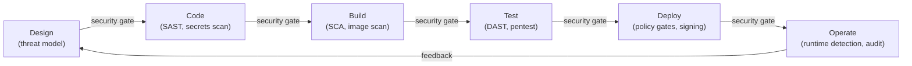
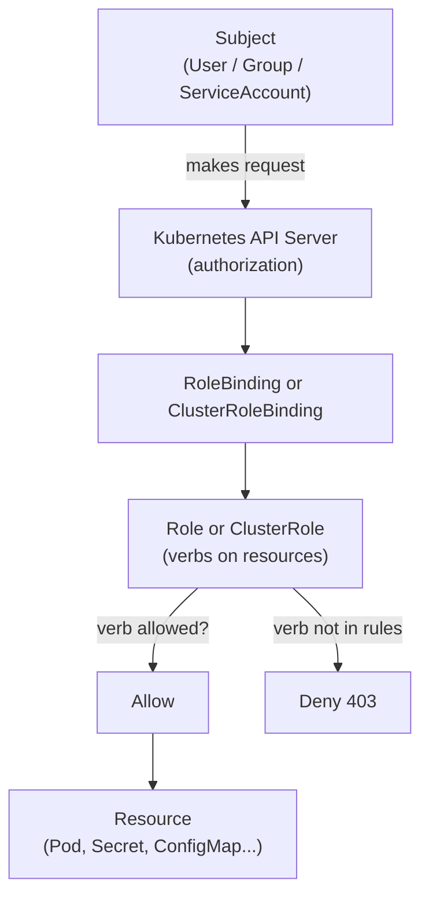
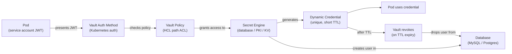
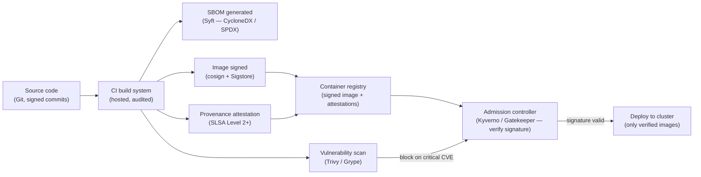
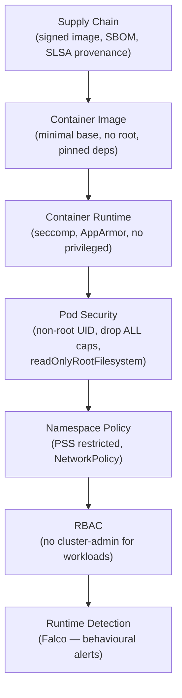

# Module 13: Security & DevSecOps

> **Course**: DevOps Career Path  
> **Audience**: Beginner → Intermediate  
> **Prerequisites**: Module 05 (Containers), Module 06 (Kubernetes), Module 08 (IaC)

[](https://creativecommons.org/licenses/by-nc-sa/4.0/)      

---

## Table of Contents

1. [Overview](#overview)
2. [Learning Objectives](#learning-objectives)
3. [The DevSecOps Mindset](#the-devsecops-mindset)
4. [Identity & Access Management (IAM)](#identity--access-management-iam)
5. [RBAC in Kubernetes](#rbac-in-kubernetes)
6. [Secrets Management with HashiCorp Vault](#secrets-management-with-hashicorp-vault)
7. [SAST — Static Application Security Testing](#sast--static-application-security-testing)
8. [DAST — Dynamic Application Security Testing](#dast--dynamic-application-security-testing)
9. [Software Composition Analysis (SCA)](#software-composition-analysis-sca)
10. [Container Security](#container-security)
11. [Policy as Code — OPA & Gatekeeper](#policy-as-code--opa--gatekeeper)
12. [Network Security](#network-security)
13. [Cloud Security Fundamentals](#cloud-security-fundamentals)
14. [Security in CI/CD Pipelines](#security-in-cicd-pipelines)
15. [Compliance & Audit Frameworks](#compliance--audit-frameworks)
16. [Runtime Security with Falco](#runtime-security-with-falco)
17. [Tools & Commands Reference](#tools--commands-reference)
18. [Hands-On Labs](#hands-on-labs)
19. [Further Reading](#further-reading)

---

## Overview

Security is not a phase at the end of development — it is a continuous discipline integrated at every layer of the DevOps lifecycle. DevSecOps shifts security left, embedding automated security checks into CI/CD pipelines, treating security policy as code, and establishing least-privilege access patterns from day one. This module covers the foundational security pillars every DevOps practitioner must understand.

The economic argument for shifting security left is grounded in data. Fixing a vulnerability at design time costs roughly one unit of effort. The same fix at code review costs ten units because it may require rethinking an approach. The same fix after deployment can cost one hundred units or more because it involves production incidents, emergency patches, customer notification, and potential regulatory consequences. This 1x/10x/100x cost ratio is why "security as an afterthought" is not just risky — it is provably more expensive than integrating security earlier.

"Security as code" means applying the same engineering practices to security controls that you apply to application code: version control, peer review, automated testing, and continuous delivery. Security policies written in OPA Rego, secrets management configuration, RBAC manifests, and network policies are all code. They belong in Git, they should be reviewed, and they should be deployed automatically. When security controls are code, they scale with the system; when they are manual processes, they become the bottleneck.



[↑ Back to TOC](#table-of-contents)

---

## Learning Objectives

By the end of this module, you will be able to:

- Describe the DevSecOps shift-left philosophy and threat model
- Apply least-privilege IAM patterns on AWS, Azure, and GCP
- Configure Kubernetes RBAC for users, service accounts, and namespaces
- Deploy and operate HashiCorp Vault for dynamic secrets management
- Integrate SAST, DAST, and SCA tools into CI/CD pipelines
- Identify and remediate container image vulnerabilities
- Write and enforce OPA/Gatekeeper policies in Kubernetes
- Apply Kubernetes NetworkPolicies for micro-segmentation
- Describe the cloud shared responsibility model
- Design a security scanning pipeline from commit to deploy
- Install and configure Falco for runtime threat detection in Kubernetes

[↑ Back to TOC](#table-of-contents)

---

## The DevSecOps Mindset

### Shift Left

```
Traditional:  Dev → Test → Stage → [Security Audit] → Prod
DevSecOps:   [Sec] Dev → [Sec] CI → [Sec] CD → [Sec] Prod → [Sec Monitor]
```

Security checks run at **every gate**, not just before production.

### OWASP Top 10 — Cloud/DevOps relevance

| # | Category | DevOps Impact |
|---|----------|---------------|
| A01 | Broken Access Control | RBAC misconfig, overprivileged service accounts |
| A02 | Cryptographic Failures | Secrets in code/env vars, weak TLS |
| A03 | Injection | SQL/command injection in apps |
| A05 | Security Misconfiguration | Public S3 buckets, open ports, default creds |
| A06 | Vulnerable Components | Outdated container images, unpatched libraries |
| A07 | Auth & Session Mgmt | Weak API keys, shared credentials |
| A08 | Software & Data Integrity | Supply chain attacks, unsigned images |
| A09 | Logging & Monitoring Failures | No audit trail, silent breaches |

### Threat modeling — STRIDE

| Threat | Description | Mitigation |
|--------|-------------|------------|
| **S**poofing | Impersonating an identity | MFA, certificate auth |
| **T**ampering | Modifying data/code | Signed commits, image signing, checksums |
| **R**epudiation | Denying an action occurred | Immutable audit logs |
| **I**nformation Disclosure | Exposing sensitive data | Encryption at rest/transit, secrets management |
| **D**enial of Service | Overwhelming resources | Rate limiting, autoscaling, WAF |
| **E**levation of Privilege | Gaining unauthorized access | Least privilege, RBAC, Pod Security Standards |

[↑ Back to TOC](#table-of-contents)

---

## Identity & Access Management (IAM)

### Principle of Least Privilege

> Grant only the permissions required to perform a specific task — nothing more.

### AWS IAM

```json
// ✅ Good — scoped to specific bucket and actions
{
  "Version": "2012-10-17",
  "Statement": [
    {
      "Effect": "Allow",
      "Action": [
        "s3:GetObject",
        "s3:PutObject",
        "s3:DeleteObject"
      ],
      "Resource": "arn:aws:s3:::my-app-bucket/uploads/*"
    },
    {
      "Effect": "Allow",
      "Action": "s3:ListBucket",
      "Resource": "arn:aws:s3:::my-app-bucket",
      "Condition": {
        "StringLike": { "s3:prefix": ["uploads/*"] }
      }
    }
  ]
}
```

```json
// ❌ Bad — wildcard actions and resources
{
  "Effect": "Allow",
  "Action": "*",
  "Resource": "*"
}
```

#### IAM Role for EC2 / EKS (avoid static keys)

```bash
# EC2 instance profile — app gets credentials via metadata service
aws iam create-role --role-name my-app-role \
  --assume-role-policy-document file://ec2-trust-policy.json

aws iam attach-role-policy --role-name my-app-role \
  --policy-arn arn:aws:iam::aws:policy/AmazonS3ReadOnlyAccess

aws iam create-instance-profile --instance-profile-name my-app-profile
aws iam add-role-to-instance-profile --instance-profile-name my-app-profile \
  --role-name my-app-role
```

### AWS IAM Access Analyzer

```bash
# Find public S3 buckets and overprivileged roles
aws accessanalyzer list-findings --analyzer-arn arn:aws:access-analyzer:us-east-1:123456789:analyzer/default

# Enable in all regions via AWS Config
aws accessanalyzer create-analyzer --analyzer-name "default" --type ACCOUNT
```

### GCP IAM — Workload Identity (Kubernetes)

```bash
# Bind Kubernetes ServiceAccount to GCP Service Account
gcloud iam service-accounts add-iam-policy-binding \
  my-gsa@my-project.iam.gserviceaccount.com \
  --role roles/iam.workloadIdentityUser \
  --member "serviceAccount:my-project.svc.id.goog[my-namespace/my-ksa]"

kubectl annotate serviceaccount my-ksa \
  --namespace my-namespace \
  iam.gke.io/gcp-service-account=my-gsa@my-project.iam.gserviceaccount.com
```

[↑ Back to TOC](#table-of-contents)

---

## RBAC in Kubernetes

Kubernetes RBAC controls who can do what to which resources within the cluster.

The principle of least privilege in Kubernetes means that every human user, every service account, and every operator gets exactly the permissions it needs to do its job — no more. In practice this means almost no workload should have `cluster-admin`. That role grants unrestricted access to all resources across all namespaces, which means a compromised pod or stolen token becomes a full cluster takeover. When engineers reach for `cluster-admin` because it is convenient, they are making the entire cluster's blast radius available to that subject. The correct approach is to identify what the workload or user actually needs and express it in the minimum Role or ClusterRole.

Namespace scoping is the primary blast-radius control in Kubernetes RBAC. A Role bound in the `production` namespace can only affect resources in that namespace. If a pod is compromised and its service account has only a namespace-scoped Role, the attacker's movement is constrained to that namespace. Cluster-scoped resources (Nodes, PersistentVolumes, Namespaces, ClusterRoles themselves) require ClusterRoles, but these should be granted sparingly and only to cluster-level operators like monitoring agents or cluster autoscalers. Application workloads should never have ClusterRoles.

Service account automation is the most common RBAC gap. Kubernetes automatically mounts service account tokens into every pod unless `automountServiceAccountToken: false` is explicitly set. Many workloads have no need to talk to the Kubernetes API, yet carry a mounted credential by default. Auditing which service accounts have tokens mounted and which RBAC permissions those accounts carry is one of the highest-value security reviews a team can perform.



### Core objects

| Object | Scope | Purpose |
|--------|-------|---------|
| **Role** | Namespace | Grants permissions within a namespace |
| **ClusterRole** | Cluster-wide | Grants permissions across all namespaces |
| **RoleBinding** | Namespace | Binds a Role to a user/group/SA |
| **ClusterRoleBinding** | Cluster-wide | Binds a ClusterRole to a user/group/SA |
| **ServiceAccount** | Namespace | Identity for pods (non-human) |

### Role — namespace-scoped

```yaml
# Allow read access to pods and logs in 'production' namespace
apiVersion: rbac.authorization.k8s.io/v1
kind: Role
metadata:
  name: pod-reader
  namespace: production
rules:
  - apiGroups: [""]
    resources: ["pods", "pods/log"]
    verbs: ["get", "list", "watch"]
  - apiGroups: ["apps"]
    resources: ["deployments", "replicasets"]
    verbs: ["get", "list", "watch"]
```

```yaml
# Bind the role to a user
apiVersion: rbac.authorization.k8s.io/v1
kind: RoleBinding
metadata:
  name: alice-pod-reader
  namespace: production
subjects:
  - kind: User
    name: alice@example.com
    apiGroup: rbac.authorization.k8s.io
roleRef:
  kind: Role
  name: pod-reader
  apiGroup: rbac.authorization.k8s.io
```

### ClusterRole for monitoring

```yaml
# Grant Prometheus read access to all namespaces
apiVersion: rbac.authorization.k8s.io/v1
kind: ClusterRole
metadata:
  name: prometheus-server
rules:
  - apiGroups: [""]
    resources: ["nodes", "nodes/proxy", "services", "endpoints", "pods"]
    verbs: ["get", "list", "watch"]
  - apiGroups: ["extensions", "networking.k8s.io"]
    resources: ["ingresses"]
    verbs: ["get", "list", "watch"]
  - nonResourceURLs: ["/metrics"]
    verbs: ["get"]
---
apiVersion: rbac.authorization.k8s.io/v1
kind: ClusterRoleBinding
metadata:
  name: prometheus-server
subjects:
  - kind: ServiceAccount
    name: prometheus
    namespace: monitoring
roleRef:
  kind: ClusterRole
  name: prometheus-server
  apiGroup: rbac.authorization.k8s.io
```

### ServiceAccount — pod identity

```yaml
# Create a dedicated ServiceAccount for your app
apiVersion: v1
kind: ServiceAccount
metadata:
  name: my-api
  namespace: production
  annotations:
    eks.amazonaws.com/role-arn: arn:aws:iam::123456789:role/my-api-role  # AWS IRSA
automountServiceAccountToken: false  # ← disable unless needed
```

```yaml
# Reference it in the deployment
spec:
  serviceAccountName: my-api
  automountServiceAccountToken: false
```

### Audit RBAC with kubectl

```bash
# Who can do what?
kubectl auth can-i create pods --as=alice@example.com -n production
kubectl auth can-i delete deployments --as=system:serviceaccount:production:my-api -n production

# List all permissions a ServiceAccount has
kubectl auth can-i --list --as=system:serviceaccount:production:my-api -n production

# See all RoleBindings in a namespace
kubectl get rolebindings,clusterrolebindings -n production -o wide

# Find overprivileged service accounts (secrets access)
kubectl get clusterrolebindings -o json | \
  jq '.items[] | select(.roleRef.name=="cluster-admin") | .subjects'
```

[↑ Back to TOC](#table-of-contents)

---

## Secrets Management with HashiCorp Vault

HashiCorp Vault is a secrets management system that provides centralized, audited, time-limited access to credentials, API keys, certificates, and database passwords.

The secrets sprawl problem is what motivates centralized secrets management. In most engineering organisations without a dedicated secrets manager, credentials accumulate in environment variables, `.env` files, Kubernetes Secrets, CI/CD variable stores, shell scripts, and configuration repositories — often duplicated across all of them. Each copy is a potential exposure vector, and when a credential needs rotating, every copy must be updated manually. This creates both a security risk (leaked credentials are hard to fully revoke) and an operational risk (one missed rotation breaks something in production).

Dynamic secrets are Vault's most powerful feature and the most important conceptual shift from static credential management. Instead of storing a long-lived database password that gets distributed to twenty services, Vault's database secrets engine generates a unique credential on-demand for each requesting workload, with a short TTL (minutes to hours). The workload gets a credential it knows, Vault knows the credential exists, and when the TTL expires Vault automatically revokes it. If the credential leaks, its blast radius is limited to that TTL window. If the database is compromised, an attacker finds credentials that have already expired. This fundamentally changes the security model from "protect the password" to "limit how long any credential is valid."

Vault auth methods determine how workloads and users prove their identity before receiving secrets. The Kubernetes auth method uses a pod's service account JWT to verify that a pod is genuinely running in a Kubernetes cluster with a specific service account — no static credentials needed for the auth step. The AWS IAM auth method uses the calling instance's IAM identity. AppRole is appropriate for CI/CD pipelines and legacy systems. Choosing the right auth method per use case means the secret retrieval itself relies on platform-managed identity rather than a shared password.



### Why not Kubernetes Secrets?

| | Kubernetes Secrets | Vault |
|--|-------------------|-------|
| **Encoding** | Base64 (not encrypted) | AES-256-GCM encrypted at rest |
| **Audit log** | Limited | Full audit trail |
| **Rotation** | Manual | Automatic (dynamic secrets) |
| **Leasing** | No | Time-limited, auto-expire |
| **Dynamic creds** | No | Yes (DB, cloud, PKI) |
| **Multi-cluster** | No | Yes |

### Vault Architecture

```
┌─────────────────────────────────────────────────────────┐
│                      VAULT                              │
│                                                         │
│  Auth Methods          Secret Engines                   │
│  ┌──────────────┐      ┌──────────────────────────────┐ │
│  │ Kubernetes   │      │ KV v2 (key-value)            │ │
│  │ AWS IAM      │      │ Database (dynamic creds)     │ │
│  │ AppRole      │  ←→  │ PKI (TLS certificates)       │ │
│  │ GitHub       │      │ AWS/GCP/Azure (cloud creds)  │ │
│  │ LDAP / OIDC  │      │ SSH (signed certificates)    │ │
│  └──────────────┘      └──────────────────────────────┘ │
│                                                         │
│  Policies              Audit Devices                    │
│  ┌──────────────┐      ┌──────────────────────────────┐ │
│  │ HCL rules    │      │ File / Syslog / Socket       │ │
│  │ per-path ACL │      │ Immutable audit trail        │ │
│  └──────────────┘      └──────────────────────────────┘ │
└─────────────────────────────────────────────────────────┘
```

### Install and initialize Vault (dev mode)

```bash
# Install Vault
wget https://releases.hashicorp.com/vault/1.16.0/vault_1.16.0_linux_amd64.zip
unzip vault_1.16.0_linux_amd64.zip && mv vault /usr/local/bin/

# Start in dev mode (in-memory, insecure — for learning only)
vault server -dev &
export VAULT_ADDR='http://127.0.0.1:8200'
export VAULT_TOKEN='root'  # printed at startup

# Check status
vault status
```

### KV Secrets Engine (v2)

```bash
# Enable KV v2 (already enabled in dev mode at secret/)
vault secrets enable -path=secret kv-v2

# Write a secret
vault kv put secret/myapp/database \
  username="app_user" \
  password="SuperSecret123!"

# Read a secret
vault kv get secret/myapp/database

# Read as JSON
vault kv get -format=json secret/myapp/database | jq .data.data

# List secrets
vault kv list secret/myapp/

# Delete (soft-delete in KV v2)
vault kv delete secret/myapp/database

# Destroy a specific version
vault kv destroy -versions=1 secret/myapp/database
```

### Dynamic Database Credentials

```bash
# Enable the database secrets engine
vault secrets enable database

# Configure MySQL connection
vault write database/config/my-mysql \
  plugin_name=mysql-database-plugin \
  connection_url="{{username}}:{{password}}@tcp(db-01:3306)/" \
  allowed_roles="app-role" \
  username="vault_admin" \
  password="VaultAdminPass!"

# Create a role (Vault generates creds with this role)
vault write database/roles/app-role \
  db_name=my-mysql \
  creation_statements="CREATE USER '{{name}}'@'%' IDENTIFIED BY '{{password}}'; GRANT SELECT, INSERT, UPDATE ON appdb.* TO '{{name}}'@'%';" \
  default_ttl="1h" \
  max_ttl="24h"

# Generate dynamic credentials (used by app at startup)
vault read database/creds/app-role
# Returns: username=v-token-app-role-abc123, password=A1B2-C3D4-...
# Credentials auto-expire in 1 hour
```

### Vault Policy

```hcl
# policy: app-policy.hcl
# Allow app to read its secrets
path "secret/data/myapp/*" {
  capabilities = ["read", "list"]
}

# Allow app to generate dynamic DB creds
path "database/creds/app-role" {
  capabilities = ["read"]
}

# Deny everything else
path "*" {
  capabilities = ["deny"]
}
```

```bash
vault policy write app-policy app-policy.hcl
```

### Kubernetes Auth Method

```bash
# Enable Kubernetes auth
vault auth enable kubernetes

# Configure (from inside the cluster)
vault write auth/kubernetes/config \
  token_reviewer_jwt="$(cat /var/run/secrets/kubernetes.io/serviceaccount/token)" \
  kubernetes_host="https://${KUBERNETES_PORT_443_TCP_ADDR}:443" \
  kubernetes_ca_cert=@/var/run/secrets/kubernetes.io/serviceaccount/ca.crt

# Bind a Kubernetes ServiceAccount to a Vault policy
vault write auth/kubernetes/role/my-api \
  bound_service_account_names=my-api \
  bound_service_account_namespaces=production \
  policies=app-policy \
  ttl=1h
```

### Vault Agent — automatic secret injection into pods

```yaml
# Kubernetes deployment with Vault Agent sidecar (via annotations)
apiVersion: apps/v1
kind: Deployment
metadata:
  name: my-api
  namespace: production
spec:
  template:
    metadata:
      annotations:
        vault.hashicorp.com/agent-inject: "true"
        vault.hashicorp.com/role: "my-api"
        vault.hashicorp.com/agent-inject-secret-db: "secret/data/myapp/database"
        vault.hashicorp.com/agent-inject-template-db: |
          {{- with secret "secret/data/myapp/database" -}}
          DB_USER={{ .Data.data.username }}
          DB_PASS={{ .Data.data.password }}
          {{- end }}
    spec:
      serviceAccountName: my-api
      containers:
        - name: my-api
          image: myapp:latest
          # Secret available at: /vault/secrets/db
          command: ["/bin/sh", "-c", "source /vault/secrets/db && ./app"]
```

[↑ Back to TOC](#table-of-contents)

---

## SAST — Static Application Security Testing

SAST analyzes source code **without executing it** to find security vulnerabilities.

### Tools

| Tool | Language | Type | Free |
|------|----------|------|------|
| **Semgrep** | Multi-language | SAST | ✅ OSS |
| **Bandit** | Python | SAST | ✅ OSS |
| **ESLint security** | JavaScript | SAST | ✅ OSS |
| **SpotBugs / FindSecBugs** | Java | SAST | ✅ OSS |
| **Gosec** | Go | SAST | ✅ OSS |
| **SonarQube** | Multi-language | SAST + metrics | Freemium |
| **Checkmarx** | Multi-language | SAST | Commercial |
| **Snyk Code** | Multi-language | SAST | Freemium |

### Semgrep — multi-language SAST

```bash
# Install
pip install semgrep

# Run with OWASP ruleset
semgrep --config=p/owasp-top-ten ./src

# Run with security audit rules
semgrep --config=p/security-audit ./src

# Run custom rule
cat > no-hardcoded-secrets.yml << 'EOF'
rules:
  - id: hardcoded-password
    patterns:
      - pattern: password = "..."
      - pattern: PASSWORD = "..."
      - pattern: passwd = "..."
    message: "Hardcoded password detected: $X"
    languages: [python, javascript, go]
    severity: ERROR
EOF

semgrep --config=no-hardcoded-secrets.yml ./src

# Output SARIF (for GitHub Code Scanning)
semgrep --config=p/owasp-top-ten --sarif ./src > results.sarif
```

### Bandit — Python security linter

```bash
# Install
pip install bandit

# Scan a directory
bandit -r ./src -l -i

# Scan with specific tests (B201-B608)
bandit -r ./src -t B201,B602,B607

# Generate HTML report
bandit -r ./src -f html -o bandit-report.html

# Exit code 1 if HIGH severity found (for CI gate)
bandit -r ./src -l --exit-zero
```

### Gosec — Go security scanner

```bash
# Install
go install github.com/securego/gosec/v2/cmd/gosec@latest

# Scan
gosec ./...

# Output JSON
gosec -fmt json -out gosec-report.json ./...

# Only report HIGH issues
gosec -severity high ./...
```

### CI/CD integration — GitHub Actions

```yaml
# .github/workflows/sast.yml
name: SAST Security Scan

on: [push, pull_request]

jobs:
  semgrep:
    runs-on: ubuntu-latest
    steps:
      - uses: actions/checkout@v4

      - name: Run Semgrep
        uses: returntocorp/semgrep-action@v1
        with:
          config: >-
            p/security-audit
            p/owasp-top-ten
            p/secrets
        env:
          SEMGREP_APP_TOKEN: ${{ secrets.SEMGREP_APP_TOKEN }}

  bandit:
    runs-on: ubuntu-latest
    steps:
      - uses: actions/checkout@v4
      - uses: actions/setup-python@v5
        with:
          python-version: '3.12'
      - run: pip install bandit
      - run: bandit -r src/ -ll -f json -o bandit-results.json || true
      - uses: actions/upload-artifact@v4
        with:
          name: bandit-results
          path: bandit-results.json
```

[↑ Back to TOC](#table-of-contents)

---

## DAST — Dynamic Application Security Testing

DAST tests a **running application** by sending malicious inputs and observing responses.

### Tools

| Tool | Type | Free |
|------|------|------|
| **OWASP ZAP** | Full DAST proxy | ✅ OSS |
| **Nuclei** | Template-based scanner | ✅ OSS |
| **Nikto** | Web server scanner | ✅ OSS |
| **Burp Suite** | Manual + automated | Freemium |
| **Invicti (Netsparker)** | DAST | Commercial |

### OWASP ZAP — automated baseline scan

```bash
# Run a quick baseline scan (passive rules only — no active attacks)
docker run --rm \
  -v $(pwd):/zap/wrk:rw \
  ghcr.io/zaproxy/zaproxy:stable zap-baseline.py \
  -t https://staging.example.com \
  -r zap-report.html \
  -J zap-report.json

# Full active scan (sends actual attack payloads)
docker run --rm \
  -v $(pwd):/zap/wrk:rw \
  ghcr.io/zaproxy/zaproxy:stable zap-full-scan.py \
  -t https://staging.example.com \
  -r zap-full-report.html \
  -I  # Don't fail build on warnings
```

### ZAP in CI/CD (GitHub Actions)

```yaml
- name: OWASP ZAP Baseline Scan
  uses: zaproxy/action-baseline@v0.12.0
  with:
    target: 'https://staging.example.com'
    rules_file_name: '.zap/rules.tsv'
    cmd_options: '-a'     # Ajax spider
    fail_action: false    # Don't fail the build (report only)
```

### Nuclei — template-based vulnerability scanner

```bash
# Install
go install -v github.com/projectdiscovery/nuclei/v3/cmd/nuclei@latest

# Update templates
nuclei -update-templates

# Scan a target
nuclei -u https://example.com -t cves/ -t exposures/

# Only critical/high severity
nuclei -u https://example.com -severity critical,high

# Scan with auth
nuclei -u https://example.com -H "Authorization: Bearer $TOKEN"

# Output JSON
nuclei -u https://example.com -json -o nuclei-results.json
```

[↑ Back to TOC](#table-of-contents)

---

## Software Composition Analysis (SCA)

SCA identifies vulnerabilities in **third-party libraries and dependencies** (the software supply chain).

### Tools

| Tool | Targets | Free |
|------|---------|------|
| **Trivy** | Containers, packages, IaC, code | ✅ OSS |
| **Grype** | Containers and packages | ✅ OSS |
| **Syft** | Generate SBOMs | ✅ OSS |
| **OWASP Dependency-Check** | Maven, npm, pip, etc. | ✅ OSS |
| **Snyk** | Multi-ecosystem | Freemium |
| **Dependabot** | GitHub-native | ✅ Free |

### Trivy — container + filesystem scanning

```bash
# Install
wget https://github.com/aquasecurity/trivy/releases/download/v0.51.0/trivy_0.51.0_Linux-64bit.tar.gz
tar xvf trivy_0.51.0_Linux-64bit.tar.gz
mv trivy /usr/local/bin/

# Scan a container image
trivy image nginx:latest

# Scan only CRITICAL and HIGH vulnerabilities
trivy image --severity CRITICAL,HIGH nginx:latest

# Scan a filesystem (your project)
trivy fs --scanners vuln,secret,misconfig .

# Scan a Dockerfile / IaC
trivy config Dockerfile
trivy config terraform/

# Fail if CRITICAL vuln found (for CI gate)
trivy image --exit-code 1 --severity CRITICAL myapp:latest

# Generate SBOM (Software Bill of Materials)
trivy image --format cyclonedx --output sbom.json nginx:latest

# JSON output for integration
trivy image --format json --output results.json myapp:latest
```

### SBOM — Software Bill of Materials

```bash
# Generate SBOM with Syft
syft myapp:latest -o cyclonedx-json > sbom.cyclonedx.json
syft myapp:latest -o spdx-json > sbom.spdx.json

# Scan SBOM for vulnerabilities with Grype
grype sbom:./sbom.cyclonedx.json

# Sign SBOM with Cosign (supply chain attestation)
cosign attest --predicate sbom.cyclonedx.json --type cyclonedx myapp:latest
```



[↑ Back to TOC](#table-of-contents)

---

## Container Security

The Linux capabilities model is the foundation of container security hardening. By default, a process running as root inside a container has a large set of Linux capabilities — `CAP_NET_ADMIN`, `CAP_SYS_PTRACE`, `CAP_SYS_ADMIN`, and others — which, if exploited via a container escape vulnerability, can be used to affect the host kernel or other containers. `allowPrivilegeEscalation: false` prevents a process inside the container from acquiring more privileges than its parent, closing off a common attack path where an exploit runs a setuid binary to gain elevated capabilities. Running as a non-root user matters because many kernel exploits and container escape techniques require root; a process running as UID 1001 has no root capabilities to escalate from even if it achieves a container escape.

The supply chain is where most container vulnerabilities enter. Base images, dependencies installed via package managers, and libraries pulled by build tools all carry CVEs. A container image built three months ago may have ten critical vulnerabilities that did not exist at build time. This is why image scanning cannot be a one-time gate at build: images need to be continuously rescanned against updated vulnerability databases and teams need a process for rebuilding and redeploying when new critical CVEs are published. Tools like Trivy and Grype integrate both into CI and as periodic scanners against a registry.

The supply chain security concern extends beyond individual vulnerabilities to image authenticity. Sigstore's cosign tool allows image signatures to be attached to an OCI image manifest and stored in a transparency log. At deploy time, an admission controller like Kyverno or Gatekeeper can verify that the image was signed by a trusted CI system before allowing it to run. This closes the image substitution attack vector: even if an attacker gains write access to a registry, they cannot replace a signed image with a malicious one without invalidating the signature. The SLSA (Supply chain Levels for Software Artifacts) framework formalises these supply chain protections into levels — Level 1 (provenance), Level 2 (hosted build system), Level 3 (hardened build), Level 4 (two-party review and hermetic build) — giving teams a structured target to work toward.

### Dockerfile security best practices

```dockerfile
# ✅ Use a specific, minimal base image (not :latest)
FROM python:3.12-slim-bookworm

# ✅ Run as non-root user
RUN groupadd --gid 1001 appgroup && \
    useradd --uid 1001 --gid appgroup --shell /bin/bash --create-home appuser

WORKDIR /app

# ✅ Copy only what's needed, set ownership
COPY --chown=appuser:appgroup requirements.txt .
RUN pip install --no-cache-dir -r requirements.txt

COPY --chown=appuser:appgroup . .

# ✅ Drop all capabilities, use read-only filesystem
USER appuser

# ✅ Expose specific port only
EXPOSE 8080

# ✅ Use exec form (no shell injection)
CMD ["python", "-m", "uvicorn", "main:app", "--host", "0.0.0.0", "--port", "8080"]
```

### Kubernetes Pod Security Standards (PSS)

PSS replaces the deprecated PodSecurityPolicy (PSP). Three modes:

| Level | Description |
|-------|-------------|
| **privileged** | Unrestricted — allows everything |
| **baseline** | Prevents known privilege escalations |
| **restricted** | Strongest — follows security best practices |

```yaml
# Enforce restricted PSS on a namespace
apiVersion: v1
kind: Namespace
metadata:
  name: production
  labels:
    pod-security.kubernetes.io/enforce: restricted
    pod-security.kubernetes.io/enforce-version: v1.28
    pod-security.kubernetes.io/warn: restricted
    pod-security.kubernetes.io/audit: restricted
```

### Secure Pod spec

```yaml
apiVersion: apps/v1
kind: Deployment
metadata:
  name: my-api
  namespace: production
spec:
  template:
    spec:
      # ✅ Non-root user
      securityContext:
        runAsNonRoot: true
        runAsUser: 1001
        runAsGroup: 1001
        fsGroup: 1001
        seccompProfile:
          type: RuntimeDefault

      # ✅ Disable automount of ServiceAccount token unless needed
      automountServiceAccountToken: false

      containers:
        - name: my-api
          image: myapp:1.2.3   # ✅ Specific tag, not :latest
          securityContext:
            allowPrivilegeEscalation: false   # ✅
            readOnlyRootFilesystem: true       # ✅
            capabilities:
              drop: ["ALL"]                    # ✅
          resources:
            requests:
              cpu: "100m"
              memory: "128Mi"
            limits:
              cpu: "500m"
              memory: "512Mi"
          volumeMounts:
            - name: tmp
              mountPath: /tmp               # Only writable dir
      volumes:
        - name: tmp
          emptyDir: {}
```

### Image signing with Cosign

```bash
# Install Cosign
wget https://github.com/sigstore/cosign/releases/download/v2.2.3/cosign-linux-amd64
chmod +x cosign-linux-amd64 && mv cosign-linux-amd64 /usr/local/bin/cosign

# Generate a key pair
cosign generate-key-pair

# Sign an image
cosign sign --key cosign.key registry.example.com/myapp:1.2.3

# Verify signature
cosign verify --key cosign.pub registry.example.com/myapp:1.2.3

# Sign with GitHub OIDC (keyless — Sigstore)
cosign sign registry.example.com/myapp:1.2.3  # Prompts OIDC login
```



[↑ Back to TOC](#table-of-contents)

---

## Policy as Code — OPA & Gatekeeper

**Open Policy Agent (OPA)** is a general-purpose policy engine. **Gatekeeper** is OPA for Kubernetes — it enforces policies as Kubernetes admission webhooks.

### OPA basics (Rego language)

```rego
# policy.rego — deny root containers
package kubernetes.admission

deny[msg] {
    input.request.kind.kind == "Pod"
    container := input.request.object.spec.containers[_]
    not container.securityContext.runAsNonRoot
    msg := sprintf("Container '%s' must set runAsNonRoot=true", [container.name])
}
```

### Install Gatekeeper

```bash
kubectl apply -f https://raw.githubusercontent.com/open-policy-agent/gatekeeper/v3.15.0/deploy/gatekeeper.yaml

# Verify
kubectl get pods -n gatekeeper-system
```

### ConstraintTemplate — define the policy schema

```yaml
apiVersion: templates.gatekeeper.sh/v1
kind: ConstraintTemplate
metadata:
  name: requirerunasnonroot
spec:
  crd:
    spec:
      names:
        kind: RequireRunAsNonRoot
  targets:
    - target: admission.k8s.gatekeeper.sh
      rego: |
        package requirerunasnonroot

        violation[{"msg": msg}] {
          container := input.review.object.spec.containers[_]
          not container.securityContext.runAsNonRoot
          msg := sprintf("Container '%v' must set runAsNonRoot=true", [container.name])
        }

        violation[{"msg": msg}] {
          container := input.review.object.spec.initContainers[_]
          not container.securityContext.runAsNonRoot
          msg := sprintf("Init container '%v' must set runAsNonRoot=true", [container.name])
        }
```

### Constraint — apply the policy

```yaml
apiVersion: constraints.gatekeeper.sh/v1beta1
kind: RequireRunAsNonRoot
metadata:
  name: require-run-as-non-root
spec:
  match:
    kinds:
      - apiGroups: [""]
        kinds: ["Pod"]
    namespaces: ["production", "staging"]
  enforcementAction: deny  # or: warn, dryrun
```

### Common Gatekeeper policies

```yaml
# 1. Require resource limits on all containers
# 2. Disallow privileged containers
# 3. Require specific labels on namespaces
# 4. Restrict container image registries to approved ones
# 5. Require readOnlyRootFilesystem
# 6. Disallow HostPath volumes
# 7. Require Liveness and Readiness probes
```

```yaml
# Example: Restrict image registry
apiVersion: templates.gatekeeper.sh/v1
kind: ConstraintTemplate
metadata:
  name: allowedregistries
spec:
  crd:
    spec:
      names:
        kind: AllowedRegistries
      validation:
        openAPIV3Schema:
          properties:
            registries:
              type: array
              items:
                type: string
  targets:
    - target: admission.k8s.gatekeeper.sh
      rego: |
        package allowedregistries
        violation[{"msg": msg}] {
          container := input.review.object.spec.containers[_]
          not starts_with_allowed(container.image)
          msg := sprintf("Image '%v' is not from an allowed registry", [container.image])
        }
        starts_with_allowed(image) {
          allowed := input.parameters.registries[_]
          startswith(image, allowed)
        }
---
apiVersion: constraints.gatekeeper.sh/v1beta1
kind: AllowedRegistries
metadata:
  name: allowed-registries
spec:
  match:
    kinds:
      - apiGroups: [""]
        kinds: ["Pod"]
  parameters:
    registries:
      - "registry.example.com/"
      - "gcr.io/my-project/"
```

[↑ Back to TOC](#table-of-contents)

---

## Network Security

### Kubernetes NetworkPolicy

NetworkPolicy provides micro-segmentation inside Kubernetes. By default, all pods can communicate with all other pods. A NetworkPolicy restricts this.

```yaml
# Default deny all ingress and egress in 'production' namespace
apiVersion: networking.k8s.io/v1
kind: NetworkPolicy
metadata:
  name: default-deny-all
  namespace: production
spec:
  podSelector: {}    # Applies to all pods
  policyTypes:
    - Ingress
    - Egress
```

```yaml
# Allow API pods to receive traffic only from frontend pods
apiVersion: networking.k8s.io/v1
kind: NetworkPolicy
metadata:
  name: api-ingress
  namespace: production
spec:
  podSelector:
    matchLabels:
      app: api
  policyTypes:
    - Ingress
  ingress:
    # From frontend pods in same namespace
    - from:
        - podSelector:
            matchLabels:
              app: frontend
      ports:
        - protocol: TCP
          port: 8080

    # From ingress controller (nginx namespace)
    - from:
        - namespaceSelector:
            matchLabels:
              name: ingress-nginx
      ports:
        - protocol: TCP
          port: 8080
```

```yaml
# Allow API pods to reach only the database and DNS
apiVersion: networking.k8s.io/v1
kind: NetworkPolicy
metadata:
  name: api-egress
  namespace: production
spec:
  podSelector:
    matchLabels:
      app: api
  policyTypes:
    - Egress
  egress:
    # To database pods
    - to:
        - podSelector:
            matchLabels:
              app: postgres
      ports:
        - protocol: TCP
          port: 5432

    # DNS resolution
    - to: []
      ports:
        - protocol: UDP
          port: 53
        - protocol: TCP
          port: 53
```

### Firewall rules on Linux (firewalld)

```bash
# Allow specific port
firewall-cmd --permanent --add-port=443/tcp
firewall-cmd --permanent --add-port=9100/tcp   # node_exporter (monitoring only)
firewall-cmd --reload

# Allow source IP range
firewall-cmd --permanent --add-rich-rule='rule family="ipv4" source address="10.0.0.0/8" port port="22" protocol="tcp" accept'

# Drop everything else
firewall-cmd --set-default-zone=drop

# List rules
firewall-cmd --list-all
```

### TLS best practices

```bash
# Check TLS certificate details
openssl s_client -connect example.com:443 -servername example.com 2>/dev/null | openssl x509 -noout -text | grep -E "Not (Before|After)|Subject:"

# Check for weak ciphers (using testssl.sh)
./testssl.sh --severity HIGH --quiet https://example.com

# Generate strong DH parameters
openssl dhparam -out /etc/ssl/dhparam.pem 4096

# Nginx TLS hardening
ssl_protocols TLSv1.2 TLSv1.3;
ssl_ciphers ECDHE-ECDSA-AES128-GCM-SHA256:ECDHE-RSA-AES128-GCM-SHA256:ECDHE-ECDSA-AES256-GCM-SHA384;
ssl_prefer_server_ciphers off;
ssl_session_timeout 1d;
ssl_session_cache shared:SSL:10m;
add_header Strict-Transport-Security "max-age=63072000" always;
```

[↑ Back to TOC](#table-of-contents)

---

## Cloud Security Fundamentals

### Shared Responsibility Model

```
PROVIDER RESPONSIBILITY:
  Physical security, hardware, hypervisor, managed service security

CUSTOMER RESPONSIBILITY:
  ┌─────────────────────────────────────────────────────────────────┐
  │ Data                                                            │
  │ Applications                                                    │
  │ OS configuration & patching (IaaS)                              │
  │ IAM / access controls                                           │
  │ Network configuration (security groups, NACLs)                  │
  │ Encryption (at rest + in transit)                               │
  └─────────────────────────────────────────────────────────────────┘
```

### AWS Security essentials

```bash
# Enable CloudTrail (API audit logging) in all regions
aws cloudtrail create-trail \
  --name global-trail \
  --s3-bucket-name my-cloudtrail-bucket \
  --is-multi-region-trail \
  --include-global-service-events

# Enable GuardDuty (threat detection)
aws guardduty create-detector --enable

# Enable Security Hub (aggregate findings)
aws securityhub enable-security-hub

# Check for public S3 buckets
aws s3api list-buckets --query 'Buckets[].Name' --output text | \
  xargs -I {} aws s3api get-bucket-acl --bucket {}

# Block all public access for a bucket
aws s3api put-public-access-block \
  --bucket my-bucket \
  --public-access-block-configuration \
  "BlockPublicAcls=true,IgnorePublicAcls=true,BlockPublicPolicy=true,RestrictPublicBuckets=true"

# Enable S3 bucket versioning and encryption
aws s3api put-bucket-versioning --bucket my-bucket \
  --versioning-configuration Status=Enabled
aws s3api put-bucket-encryption --bucket my-bucket \
  --server-side-encryption-configuration '{"Rules":[{"ApplyServerSideEncryptionByDefault":{"SSEAlgorithm":"aws:kms"}}]}'
```

### CIS Benchmarks

CIS (Center for Internet Security) Benchmarks provide security hardening guidelines for:
- Linux (CIS RHEL 9)
- Docker
- Kubernetes
- AWS / Azure / GCP

```bash
# Run CIS Kubernetes benchmark
# (kube-bench by Aqua Security)
kubectl apply -f https://raw.githubusercontent.com/aquasecurity/kube-bench/main/job.yaml
kubectl logs -l app=kube-bench

# CIS Docker benchmark
docker run --rm --net host --pid host \
  -v /etc:/etc:ro -v /var/lib/docker:/var/lib/docker:ro \
  -v /var/run/docker.sock:/var/run/docker.sock:ro \
  docker/docker-bench-security
```

[↑ Back to TOC](#table-of-contents)

---

## Security in CI/CD Pipelines

### Security pipeline stages

```
┌─────────────────────────────────────────────────────────────────────┐
│                    SECURITY IN CI/CD                                │
│                                                                     │
│  Commit   → Pre-commit hooks (secret detection, linting)           │
│  Build    → SAST (Semgrep, Bandit)                                  │
│           → SCA (Trivy fs, Snyk)                                    │
│  Image    → Container scan (Trivy image, Grype)                     │
│           → Image signing (Cosign)                                  │
│  Deploy   → IaC scan (Trivy config, Checkov, tfsec)                 │
│           → DAST on staging (ZAP, Nuclei)                           │
│  Runtime  → Runtime security (Falco)                                │
│           → Continuous CVE monitoring (Trivy operator)              │
└─────────────────────────────────────────────────────────────────────┘
```

### Pre-commit hooks — prevent secrets from being committed

```bash
# Install pre-commit
pip install pre-commit

# .pre-commit-config.yaml
repos:
  - repo: https://github.com/gitleaks/gitleaks
    rev: v8.18.2
    hooks:
      - id: gitleaks

  - repo: https://github.com/pre-commit/pre-commit-hooks
    rev: v4.5.0
    hooks:
      - id: detect-private-key
      - id: check-merge-conflict
      - id: trailing-whitespace

  - repo: https://github.com/bridgecrewio/checkov
    rev: 3.2.0
    hooks:
      - id: checkov
        args: ['--framework', 'dockerfile', '--framework', 'kubernetes']
```

```bash
pre-commit install     # Install hooks into .git/hooks/
pre-commit run --all-files  # Run manually
```

### Full security pipeline — GitHub Actions

```yaml
# .github/workflows/security.yml
name: Security Pipeline

on:
  push:
    branches: [main, develop]
  pull_request:

jobs:
  secret-scan:
    runs-on: ubuntu-latest
    steps:
      - uses: actions/checkout@v4
        with:
          fetch-depth: 0   # Full history for Gitleaks
      - name: Gitleaks — detect secrets
        uses: gitleaks/gitleaks-action@v2
        env:
          GITHUB_TOKEN: ${{ secrets.GITHUB_TOKEN }}

  sast:
    runs-on: ubuntu-latest
    steps:
      - uses: actions/checkout@v4
      - name: Semgrep SAST
        uses: returntocorp/semgrep-action@v1
        with:
          config: p/security-audit p/owasp-top-ten

  sca:
    runs-on: ubuntu-latest
    steps:
      - uses: actions/checkout@v4
      - name: Trivy filesystem scan
        uses: aquasecurity/trivy-action@master
        with:
          scan-type: 'fs'
          scan-ref: '.'
          severity: 'CRITICAL,HIGH'
          exit-code: '1'

  container-scan:
    runs-on: ubuntu-latest
    needs: [sast, sca]
    steps:
      - uses: actions/checkout@v4
      - name: Build image
        run: docker build -t myapp:${{ github.sha }} .
      - name: Trivy image scan
        uses: aquasecurity/trivy-action@master
        with:
          image-ref: myapp:${{ github.sha }}
          severity: 'CRITICAL'
          exit-code: '1'
      - name: Sign image with Cosign
        if: github.ref == 'refs/heads/main'
        uses: sigstore/cosign-installer@v3
        # ...

  iac-scan:
    runs-on: ubuntu-latest
    steps:
      - uses: actions/checkout@v4
      - name: Checkov — IaC scan
        uses: bridgecrewio/checkov-action@master
        with:
          directory: terraform/
          framework: terraform
          soft_fail: false
```

### Falco — Runtime security for Kubernetes

Falco detects anomalous activity in running containers (syscall-level).

```yaml
# Example Falco rule — detect shell in container
- rule: Terminal shell in container
  desc: A shell was spawned inside a container
  condition: >
    evt.type = execve and
    evt.dir = < and
    container and
    shell_procs and
    not proc.pname in (shell_procs)
  output: >
    Shell spawned in container (user=%user.name container=%container.name
    image=%container.image.repository:%container.image.tag
    shell=%proc.name parent=%proc.pname cmdline=%proc.cmdline)
  priority: WARNING
  tags: [container, shell, mitre_execution]
```

```bash
# Install Falco via Helm
helm repo add falcosecurity https://falcosecurity.github.io/charts
helm install falco falcosecurity/falco \
  --namespace falco --create-namespace \
  --set driver.kind=ebpf
```

[↑ Back to TOC](#table-of-contents)

---

## Compliance & Audit Frameworks

| Framework | Industry | Key Controls |
|-----------|----------|--------------|
| **SOC 2 Type II** | Tech/SaaS | Access control, encryption, availability, monitoring |
| **PCI-DSS** | Payments | Cardholder data protection, network segmentation, logging |
| **HIPAA** | Healthcare | PHI protection, audit logs, access control |
| **ISO 27001** | All industries | Information security management system (ISMS) |
| **GDPR** | EU data subjects | PII protection, right to erasure, data residency |
| **NIST CSF** | US Government | Identify, Protect, Detect, Respond, Recover |

### DevOps controls for compliance

```
✅ Infrastructure as Code — auditable, version-controlled changes
✅ Immutable infrastructure — no SSH to prod, changes via pipeline only
✅ Signed commits and image signing — non-repudiation
✅ Centralized logging with immutable storage — audit trail
✅ Automated security scanning in CI/CD — documented evidence
✅ RBAC with MFA — access control
✅ Secrets management (Vault) — no plaintext credentials
✅ Automated patching cadence — vulnerability management
✅ Disaster recovery tests — documented and scheduled
```

[↑ Back to TOC](#table-of-contents)

---

## Runtime Security with Falco

SAST, DAST, and image scanning are all **pre-runtime** checks. They cannot catch what happens after a container starts — a process spawning a shell, an unexpected outbound connection, or a file in `/etc` being modified. **Falco** fills this gap by monitoring kernel system calls at runtime and alerting on anomalous behaviour.

### What Falco detects

| Category | Example rule |
|---|---|
| **Privilege escalation** | Container running as root when it shouldn't |
| **Shell spawned in container** | `bash` or `sh` started in a running container |
| **Filesystem tampering** | Write to `/etc`, `/usr`, or `/bin` in a running container |
| **Sensitive file read** | `/etc/shadow`, `/etc/kubernetes/admin.conf` accessed |
| **Outbound network connection** | Unexpected connection to an external IP |
| **Crypto mining signals** | High CPU + network + specific binary patterns |

### Install Falco on Kubernetes (Helm)

```bash
# Add the Falco Helm repository
helm repo add falcosecurity https://falcosecurity.github.io/charts
helm repo update

# Install Falco as a DaemonSet (runs on every node)
helm install falco falcosecurity/falco \
  --namespace falco \
  --create-namespace \
  --set tty=true \
  --set falcosidekick.enabled=true \
  --set falcosidekick.webui.enabled=true

# Verify Falco pods are running on all nodes
kubectl get pods -n falco -o wide

# Check Falco is detecting events
kubectl logs -n falco -l app.kubernetes.io/name=falco --tail=50
```

### Understanding Falco rules

Falco rules are written in YAML and describe syscall patterns to watch for:

```yaml
# /etc/falco/falco_rules.yaml (excerpt — this is built-in)
- rule: Terminal shell in container
  desc: A shell was used as the entrypoint or is running inside a container
  condition: >
    spawned_process
    and container
    and shell_procs
    and proc.tty != 0
    and not container_entrypoint
  output: >
    A shell was spawned in a container with an attached terminal
    (user=%user.name %container.info shell=%proc.name parent=%proc.pname
    cmdline=%proc.cmdline)
  priority: NOTICE
  tags: [container, shell, mitre_execution]
```

### Write a custom Falco rule

```yaml
# custom-rules.yaml — alert on any write to /etc inside a container
- rule: Write to sensitive directory in container
  desc: Detect any file write to /etc inside a running container
  condition: >
    open_write
    and container
    and fd.directory startswith /etc
    and not proc.name in (package_mgmt_binaries)
  output: >
    Sensitive directory write in container
    (user=%user.name command=%proc.cmdline file=%fd.name container=%container.name image=%container.image.repository)
  priority: WARNING
  tags: [container, filesystem]
```

```bash
# Apply a custom rules file
helm upgrade falco falcosecurity/falco \
  --namespace falco \
  --set-file falco.rulesFile[0]=/path/to/custom-rules.yaml
```

### Route Falco alerts to Slack

Falco has a companion tool called **Falcosidekick** that routes alerts to Slack, PagerDuty, Elasticsearch, and more.

```bash
# Install with Slack output enabled
helm upgrade falco falcosecurity/falco \
  --namespace falco \
  --set falcosidekick.enabled=true \
  --set falcosidekick.config.slack.webhookurl="https://hooks.slack.com/services/XXX/YYY/ZZZ" \
  --set falcosidekick.config.slack.minimumpriority="warning"
```

### Trigger a test alert

```bash
# Manually trigger a Falco alert by spawning a shell in a container
kubectl exec -it $(kubectl get pod -l app=api -o name | head -1) -- /bin/sh

# In another terminal, watch Falco logs for the detection
kubectl logs -n falco -l app.kubernetes.io/name=falco -f | grep "shell was spawned"
```

### Falco in the CI/CD pipeline (falco-event-generator)

```bash
# Run the Falco event generator to test your rules are working
kubectl apply -f https://raw.githubusercontent.com/falcosecurity/event-generator/main/deployment/event-generator.yaml

# It performs common attack patterns — Falco should fire alerts for all of them
kubectl logs -n falco -l app.kubernetes.io/name=falco -f
```

[↑ Back to TOC](#table-of-contents)

---

## Tools & Commands Reference

```bash
# Vault CLI
vault status
vault kv get secret/myapp/config
vault kv put secret/myapp/config key=value
vault policy list
vault auth list
vault audit list
vault token lookup

# Trivy
trivy image --severity CRITICAL,HIGH nginx:latest
trivy fs --scanners vuln,secret,misconfig .
trivy config terraform/
trivy image --format cyclonedx --output sbom.json myapp:latest

# Semgrep
semgrep --config=p/security-audit ./src
semgrep --config=p/secrets ./src

# OPA / Gatekeeper
kubectl get constrainttemplates
kubectl get constraints
kubectl describe K8sRequiredLabels namespace-required-labels

# kube-bench
kubectl apply -f https://raw.githubusercontent.com/aquasecurity/kube-bench/main/job.yaml
kubectl logs -l app=kube-bench

# Cosign
cosign sign --key cosign.key registry.example.com/myapp:1.2.3
cosign verify --key cosign.pub registry.example.com/myapp:1.2.3

# Falco
helm install falco falcosecurity/falco -n falco --create-namespace
kubectl get pods -n falco -o wide
kubectl logs -n falco -l app.kubernetes.io/name=falco --tail=50
kubectl -n falco logs -l app.kubernetes.io/name=falco | grep WARNING
```

[↑ Back to TOC](#table-of-contents)

---

## Hands-On Labs

### Lab 1 — Install Vault and Work with Secrets (Beginner)

```bash
# Start Vault dev server
vault server -dev &
export VAULT_ADDR='http://127.0.0.1:8200'
export VAULT_TOKEN='root'

# Store an API key
vault kv put secret/myapp/api api_key="sk_live_abc123" api_url="https://api.example.com"

# Read it back
vault kv get secret/myapp/api
vault kv get -field=api_key secret/myapp/api

# Create a read-only policy
cat > readonly.hcl << 'EOF'
path "secret/data/myapp/*" {
  capabilities = ["read", "list"]
}
EOF
vault policy write myapp-readonly readonly.hcl

# Create a token with that policy
vault token create -policy=myapp-readonly

# Try to write with the new token (should fail)
export VAULT_TOKEN=<new-token>
vault kv put secret/myapp/api api_key="new_key"  # Permission denied
```

---

### Lab 2 — Scan a Container Image for CVEs (Beginner)

```bash
# Pull an older, vulnerable image
docker pull python:3.8

# Scan it
trivy image python:3.8 --severity CRITICAL,HIGH

# Compare with a newer version
trivy image python:3.12-slim

# Scan your own application image
docker build -t myapp:lab .
trivy image myapp:lab

# Generate SBOM
trivy image --format cyclonedx --output sbom.json myapp:lab
cat sbom.json | jq '.components | length'  # Count dependencies
```

---

### Lab 3 — Kubernetes RBAC (Intermediate)

```bash
# Create a test namespace and ServiceAccount
kubectl create namespace rbac-lab
kubectl create serviceaccount dev-user -n rbac-lab

# Create a Role (read-only on pods)
kubectl apply -f - << 'EOF'
apiVersion: rbac.authorization.k8s.io/v1
kind: Role
metadata:
  name: pod-reader
  namespace: rbac-lab
rules:
  - apiGroups: [""]
    resources: ["pods", "pods/log"]
    verbs: ["get", "list", "watch"]
EOF

# Bind the role to the ServiceAccount
kubectl create rolebinding dev-user-pod-reader \
  --role=pod-reader \
  --serviceaccount=rbac-lab:dev-user \
  -n rbac-lab

# Test: can dev-user list pods?
kubectl auth can-i list pods \
  --as=system:serviceaccount:rbac-lab:dev-user \
  -n rbac-lab
# → yes

# Test: can dev-user delete pods?
kubectl auth can-i delete pods \
  --as=system:serviceaccount:rbac-lab:dev-user \
  -n rbac-lab
# → no
```

---

### Lab 4 — Gatekeeper Policy (Intermediate)

```bash
# Install Gatekeeper
kubectl apply -f https://raw.githubusercontent.com/open-policy-agent/gatekeeper/v3.15.0/deploy/gatekeeper.yaml

# Apply the RequireRunAsNonRoot ConstraintTemplate from this module
kubectl apply -f constraint-template.yaml
kubectl apply -f constraint.yaml

# Try to deploy a root container (should be denied)
kubectl apply -f - << 'EOF'
apiVersion: v1
kind: Pod
metadata:
  name: root-test
  namespace: production
spec:
  containers:
    - name: nginx
      image: nginx:latest
      # Missing: securityContext.runAsNonRoot: true
EOF
# → Error: container 'nginx' must set runAsNonRoot=true

# Deploy a compliant pod (should succeed)
kubectl apply -f - << 'EOF'
apiVersion: v1
kind: Pod
metadata:
  name: nonroot-test
  namespace: production
spec:
  containers:
    - name: nginx
      image: nginx:latest
      securityContext:
        runAsNonRoot: true
        runAsUser: 1001
EOF
```

---

## Further Reading

- [OWASP Top 10](https://owasp.org/www-project-top-ten/)
- [HashiCorp Vault Documentation](https://developer.hashicorp.com/vault/docs)
- [Kubernetes RBAC Documentation](https://kubernetes.io/docs/reference/access-authn-authz/rbac/)
- [Kubernetes Pod Security Standards](https://kubernetes.io/docs/concepts/security/pod-security-standards/)
- [OPA / Gatekeeper Documentation](https://open-policy-agent.github.io/gatekeeper/)
- [Trivy Documentation](https://aquasecurity.github.io/trivy/)
- [Semgrep Rules Registry](https://semgrep.dev/r)
- [Falco Documentation](https://falco.org/docs/)
- [Falcosidekick — Alert Routing](https://github.com/falcosecurity/falcosidekick)
- [Falco Rules Hub](https://falco.org/docs/reference/rules/)
- [CIS Benchmarks](https://www.cisecurity.org/cis-benchmarks/)
- [NIST Cybersecurity Framework](https://www.nist.gov/cyberframework)
- [Sigstore / Cosign](https://docs.sigstore.dev/cosign/overview/)
- [SLSA Supply Chain Security](https://slsa.dev/)

[↑ Back to TOC](#table-of-contents)

---

## Supply Chain Security

Supply chain attacks target the tools and dependencies that build your software, not your application code directly. The SolarWinds attack (2020) compromised the build pipeline of a major network management vendor, injecting malicious code into signed software updates distributed to 18,000 customers. The XZ Utils attack (2024) inserted a backdoor into a compression library that ships with most Linux distributions, embedded through a social engineering campaign that took nearly two years.

These attacks succeed because most organisations trust their build pipelines and dependencies implicitly. Supply chain security is about making that trust explicit, verifiable, and auditable.

### The Attack Surface

```
Source code repositories (GitHub, GitLab)
    ↓ compromised developer credentials, malicious PRs
Build systems (GitHub Actions, Jenkins, CircleCI)
    ↓ poisoned CI environment, backdoored build actions
Dependencies (npm, PyPI, Maven, Docker Hub)
    ↓ typosquatting, dependency confusion, maintainer hijack
Container base images
    ↓ compromised official images, private registry poisoning
Deployment infrastructure (Kubernetes, Helm, Terraform)
    ↓ compromised Helm charts, malicious Terraform modules
```

### SLSA Framework

SLSA (Supply-chain Levels for Software Artifacts) defines four levels of supply chain security guarantees:

| Level | Requirements |
|-------|-------------|
| SLSA 1 | Build is automated (no manual builds); provenance document exists |
| SLSA 2 | Source is version controlled; provenance is authenticated by the build service |
| SLSA 3 | Source integrity verified; build environment is isolated and ephemeral |
| SLSA 4 | Two-party review required; hermetic build (fully isolated from network during build) |

Most teams target SLSA 2–3. Reaching SLSA 4 requires significant infrastructure changes and is only warranted for critical software (operating system components, cryptographic libraries).

### Generating SLSA Provenance in GitHub Actions

```yaml
# .github/workflows/build.yml
name: Build and Attest

on:
  push:
    branches: [main]

permissions:
  contents: read
  id-token: write        # Required for OIDC-based signing
  attestations: write    # Required for GitHub artifact attestations

jobs:
  build:
    runs-on: ubuntu-latest
    outputs:
      image: ${{ steps.build.outputs.image }}
      digest: ${{ steps.build.outputs.digest }}
    steps:
    - uses: actions/checkout@v4
    
    - name: Build container image
      id: build
      uses: docker/build-push-action@v5
      with:
        context: .
        push: true
        tags: registry.company.com/payment-service:${{ github.sha }}
        provenance: true    # generates SLSA provenance attestation
        sbom: true          # generates SBOM
    
    - name: Attest build provenance (GitHub native)
      uses: actions/attest-build-provenance@v1
      with:
        subject-name: registry.company.com/payment-service
        subject-digest: ${{ steps.build.outputs.digest }}
```

### cosign — Keyless Container Image Signing

cosign with keyless signing uses GitHub's OIDC token to prove that a specific pipeline run signed the image. No private key to manage.

```yaml
- name: Sign container image with cosign
  uses: sigstore/cosign-installer@v3
  
- name: Sign image
  run: |
    cosign sign \
      --yes \
      registry.company.com/payment-service@${{ steps.build.outputs.digest }}
  env:
    COSIGN_EXPERIMENTAL: 1    # enables keyless signing via Fulcio/Rekor
```

```bash
# Verify the signature (anyone can verify against the Rekor transparency log)
cosign verify \
  --certificate-identity "https://github.com/company/payment-service/.github/workflows/build.yml@refs/heads/main" \
  --certificate-oidc-issuer "https://token.actions.githubusercontent.com" \
  registry.company.com/payment-service:latest
```

### SBOM Generation and Vulnerability Scanning

An SBOM (Software Bill of Materials) is a machine-readable inventory of all software components in your artifact.

```yaml
- name: Generate SBOM with Syft
  uses: anchore/sbom-action@v0
  with:
    image: registry.company.com/payment-service:${{ github.sha }}
    format: spdx-json
    output-file: sbom.spdx.json

- name: Scan SBOM for vulnerabilities with Grype
  uses: anchore/scan-action@v3
  with:
    sbom: sbom.spdx.json
    fail-build: true
    severity-cutoff: high

- name: Attach SBOM to release
  uses: actions/upload-artifact@v4
  with:
    name: sbom
    path: sbom.spdx.json
```

### Dependency Pinning and Verification

```yaml
# Pin all GitHub Actions to commit SHAs, not tags
# Tags can be moved by attackers who compromise the action repository
uses: actions/checkout@b4ffde65f46336ab88eb53be808477a3936bae11  # v4.1.1

# Use Dependabot to keep pinned SHAs up to date
# .github/dependabot.yml
version: 2
updates:
- package-ecosystem: github-actions
  directory: /
  schedule:
    interval: weekly
```

```bash
# Verify npm package integrity
npm ci --audit       # fails on known vulnerabilities
npm audit --audit-level=high   # check without installing

# Pin package versions in package-lock.json
npm ci               # always use ci, not install, in CI pipelines
```

[↑ Back to TOC](#table-of-contents)

---

## Falco: Runtime Security

Falco is a CNCF project that uses eBPF to detect security-relevant system calls and container activity in real time. It is your last line of defence: even if an attacker gets code running inside your container, Falco can detect and alert on their actions.

### What Falco Detects

- **File access**: reading `/etc/shadow`, writing to system directories
- **Network**: unexpected outbound connections, listening on new ports
- **Process execution**: spawning unexpected shells, running `curl` or `wget` in a container, privilege escalation via `su` or `sudo`
- **Container escapes**: attempts to use `nsenter`, excessive capabilities, writing to the host filesystem

### Deploying Falco

```bash
helm repo add falcosecurity https://falcosecurity.github.io/charts
helm repo update

helm install falco falcosecurity/falco \
  --namespace falco \
  --create-namespace \
  --values falco-values.yaml
```

```yaml
# falco-values.yaml
falco:
  jsonOutput: true
  jsonIncludeOutputProperty: true
  logLevel: info
  
  # Use modern eBPF probe (requires kernel 5.8+)
  driver:
    kind: ebpf

falcosidekick:
  enabled: true
  config:
    slack:
      webhookurl: "https://hooks.slack.com/services/..."
      minimumpriority: warning
    pagerduty:
      routingkey: "PAGERDUTY_ROUTING_KEY"
      minimumpriority: critical

customRules:
  company-rules.yaml: |-
    - rule: Unexpected outbound connection from payment service
      desc: payment-service should only connect to known endpoints
      condition: >
        outbound and container and
        k8s.ns.name = "production" and
        k8s.pod.label.app = "payment-service" and
        not fd.sip in (allowed_payment_endpoints)
      output: >
        Unexpected outbound connection from payment-service
        (connection=%fd.name pid=%proc.pid user=%user.name
        container=%container.name image=%container.image.repository)
      priority: WARNING
      tags: [network, payment]
      
    - macro: allowed_payment_endpoints
      condition: >
        fd.sip = "10.0.0.1" or     # internal database
        fd.sip = "10.0.0.2" or     # redis
        fd.sip.name endswith ".stripe.com"
```

### Responding to Falco Alerts

Falco alerts require fast automated response for critical events. Use `falcosidekick` with a webhook receiver to trigger automated responses:

```python
# Automated responder — isolate a pod on Falco critical alert
from flask import Flask, request
from kubernetes import client, config

app = Flask(__name__)
config.load_incluster_config()
v1 = client.CoreV1Api()

@app.route('/falco-webhook', methods=['POST'])
def handle_falco_alert():
    alert = request.json
    if alert.get('priority') == 'Critical':
        pod_name = alert.get('output_fields', {}).get('k8s.pod.name')
        namespace = alert.get('output_fields', {}).get('k8s.ns.name')
        
        if pod_name and namespace:
            # Apply network isolation by adding a label that a NetworkPolicy targets
            v1.patch_namespaced_pod(
                name=pod_name,
                namespace=namespace,
                body={"metadata": {"labels": {"security.company.com/isolated": "true"}}}
            )
            print(f"Isolated pod {namespace}/{pod_name}")
    
    return {"status": "ok"}
```

[↑ Back to TOC](#table-of-contents)

---

## Zero Trust Architecture

Zero Trust is the security model that replaces "trust but verify" with "never trust, always verify." In a traditional perimeter model, everything inside the corporate network is trusted. Zero Trust assumes the network is always hostile — every request must be authenticated and authorised, regardless of source.

### Zero Trust Principles

1. **Verify explicitly**: Authenticate and authorise every request using all available data points (identity, location, device health, service, data classification)
2. **Use least privilege access**: Limit user and service access to only what is needed; use just-in-time access for privileged operations
3. **Assume breach**: Minimise blast radius, segment access, end-to-end encrypt, log and audit everything

### mTLS for Service-to-Service Communication

In a microservices environment, services need to prove their identity to each other. Mutual TLS (mTLS) provides this: both client and server present certificates, and both verify the other's certificate.

A service mesh (Istio, Linkerd) automates mTLS:

```yaml
# Istio PeerAuthentication — require mTLS in production namespace
apiVersion: security.istio.io/v1beta1
kind: PeerAuthentication
metadata:
  name: default
  namespace: production
spec:
  mtls:
    mode: STRICT    # reject any non-mTLS traffic
```

```yaml
# Istio AuthorizationPolicy — only payment-service can call card-vault
apiVersion: security.istio.io/v1beta1
kind: AuthorizationPolicy
metadata:
  name: card-vault-allow-payment
  namespace: production
spec:
  selector:
    matchLabels:
      app: card-vault
  rules:
  - from:
    - source:
        principals:
          - cluster.local/ns/production/sa/payment-service-account
    to:
    - operation:
        methods: ["GET", "POST"]
        paths: ["/api/v1/tokenize", "/api/v1/detokenize"]
```

### SPIFFE and SPIRE

SPIFFE (Secure Production Identity Framework For Everyone) provides workload identity without long-lived credentials. SPIRE is the reference implementation.

Every workload gets a cryptographic identity (SPIFFE Verifiable Identity Document — SVID) automatically, based on Kubernetes service account, pod labels, and node attestation. SVIDs rotate automatically (typically every hour), eliminating the risk of long-lived credential compromise.

```bash
# Check SPIRE agent status
kubectl exec -n spire spire-agent-xxxxx -- \
  /opt/spire/bin/spire-agent api fetch jwt \
    -audience api.company.com \
    -socketPath /run/spire/sockets/agent.sock

# Inspect a workload's identity
kubectl exec -n spire spire-agent-xxxxx -- \
  /opt/spire/bin/spire-agent api fetch x509 \
    -socketPath /run/spire/sockets/agent.sock
```

### Just-In-Time Access with Teleport

Teleport provides short-lived, audited access to infrastructure without long-lived SSH keys or shared bastion credentials:

```yaml
# Teleport role — developers can SSH to staging, not production
kind: role
version: v7
metadata:
  name: developer
spec:
  allow:
    logins: [ubuntu, ec2-user]
    node_labels:
      environment: [staging, dev]
    kubernetes_labels:
      environment: [staging, dev]
    kubernetes_resources:
    - kind: pod
      namespace: "staging"
      name: "*"
      verbs: ["get", "list", "exec"]
  deny:
    node_labels:
      environment: [production]
```

For production access, require an approval request:

```bash
# Request temporary production access
tsh request create \
  --roles=sre-production \
  --reason="Investigating payment latency spike JIRA-5678" \
  --reviewers="alice@company.com,bob@company.com"

# Approve the request (reviewer)
tsh request review --approve <request-id>

# Access auto-revokes after the configured TTL (e.g., 4 hours)
```

[↑ Back to TOC](#table-of-contents)

---

## Container Security Deep Dive

The container runtime is a security boundary. Making that boundary robust requires understanding what capabilities containers have by default and how to harden them.

### Linux Capabilities

By default, Docker and Kubernetes grant a wide set of Linux capabilities to containers. Most applications need none of them.

```yaml
# Kubernetes SecurityContext — drop all capabilities
apiVersion: apps/v1
kind: Deployment
metadata:
  name: payment-service
spec:
  template:
    spec:
      securityContext:
        runAsNonRoot: true
        runAsUser: 1000
        runAsGroup: 1000
        fsGroup: 1000
        seccompProfile:
          type: RuntimeDefault
      containers:
      - name: payment-service
        securityContext:
          allowPrivilegeEscalation: false
          readOnlyRootFilesystem: true
          capabilities:
            drop: ["ALL"]
            add: []        # add back only what you specifically need
        volumeMounts:
        - name: tmp
          mountPath: /tmp  # read-only root requires writable /tmp
        - name: cache
          mountPath: /app/.cache
      volumes:
      - name: tmp
        emptyDir: {}
      - name: cache
        emptyDir: {}
```

### Seccomp Profiles

Seccomp (secure computing mode) restricts which system calls a process can make. The `RuntimeDefault` seccomp profile blocks ~300 syscalls that are almost never needed by application code.

For maximum security, create a custom seccomp profile using `strace` or Falco to identify exactly which syscalls your application needs:

```json
// custom-seccomp.json
{
  "defaultAction": "SCMP_ACT_ERRNO",
  "syscalls": [
    {
      "names": [
        "read", "write", "open", "close", "stat", "fstat",
        "lstat", "poll", "lseek", "mmap", "mprotect", "munmap",
        "brk", "rt_sigaction", "rt_sigprocmask", "ioctl",
        "pread64", "pwrite64", "readv", "writev", "access",
        "pipe", "select", "sched_yield", "mremap", "msync",
        "mincore", "madvise", "shmget", "shmat", "shmctl",
        "dup", "dup2", "pause", "nanosleep", "getitimer",
        "alarm", "setitimer", "getpid", "sendfile", "socket",
        "connect", "accept", "sendto", "recvfrom", "sendmsg",
        "recvmsg", "shutdown", "bind", "listen", "getsockname",
        "getpeername", "socketpair", "setsockopt", "getsockopt",
        "clone", "fork", "vfork", "execve", "exit", "wait4",
        "kill", "uname", "fcntl", "flock", "fsync", "fdatasync",
        "truncate", "ftruncate", "getdents", "getcwd", "chdir",
        "fchdir", "rename", "mkdir", "rmdir", "creat", "link",
        "unlink", "symlink", "readlink", "chmod", "fchmod",
        "chown", "fchown", "lchown", "umask", "gettimeofday",
        "getrlimit", "getrusage", "sysinfo", "times", "ptrace",
        "getuid", "syslog", "getgid", "setuid", "setgid",
        "geteuid", "getegid", "setpgid", "getppid", "getpgrp",
        "setsid", "setreuid", "setregid", "getgroups",
        "setgroups", "setresuid", "getresuid", "setresgid",
        "getresgid", "getpgid", "setfsuid", "setfsgid",
        "getsid", "capget", "capset", "rt_sigpending",
        "rt_sigtimedwait", "rt_sigqueueinfo", "rt_sigsuspend",
        "sigaltstack", "utime", "mknod", "uselib", "personality",
        "ustat", "statfs", "fstatfs", "sysfs", "getpriority",
        "setpriority", "sched_setparam", "sched_getparam",
        "sched_setscheduler", "sched_getscheduler",
        "sched_get_priority_max", "sched_get_priority_min",
        "sched_rr_get_interval", "mlock", "munlock",
        "mlockall", "munlockall", "vhangup", "modify_ldt",
        "pivot_root", "_sysctl", "prctl", "arch_prctl",
        "adjtimex", "setrlimit", "chroot", "sync", "acct",
        "settimeofday", "mount", "umount2", "swapon", "swapoff",
        "reboot", "sethostname", "setdomainname", "iopl",
        "ioperm", "create_module", "init_module",
        "delete_module", "get_kernel_syms", "query_module",
        "quotactl", "nfsservctl", "getpmsg", "putpmsg",
        "afs_syscall", "tuxcall", "security", "gettid",
        "readahead", "setxattr", "lsetxattr", "fsetxattr",
        "getxattr", "lgetxattr", "fgetxattr", "listxattr",
        "llistxattr", "flistxattr", "removexattr",
        "lremovexattr", "fremovexattr", "tkill", "time",
        "futex", "sched_setaffinity", "sched_getaffinity",
        "set_thread_area", "io_setup", "io_destroy",
        "io_getevents", "io_submit", "io_cancel",
        "get_thread_area", "lookup_dcookie", "epoll_create",
        "epoll_ctl_old", "epoll_wait_old", "remap_file_pages",
        "getdents64", "set_tid_address", "restart_syscall",
        "semtimedop", "fadvise64", "timer_create",
        "timer_settime", "timer_gettime", "timer_getoverrun",
        "timer_delete", "clock_settime", "clock_gettime",
        "clock_getres", "clock_nanosleep", "exit_group",
        "epoll_wait", "epoll_ctl", "tgkill", "utimes",
        "vserver", "mbind", "set_mempolicy", "get_mempolicy",
        "mq_open", "mq_unlink", "mq_timedsend",
        "mq_timedreceive", "mq_notify", "mq_getsetattr",
        "kexec_load", "waitid", "add_key", "request_key",
        "keyctl", "ioprio_set", "ioprio_get", "inotify_init",
        "inotify_add_watch", "inotify_rm_watch", "migrate_pages",
        "openat", "mkdirat", "mknodat", "fchownat",
        "futimesat", "newfstatat", "unlinkat", "renameat",
        "linkat", "symlinkat", "readlinkat", "fchmodat",
        "faccessat", "pselect6", "ppoll", "unshare",
        "set_robust_list", "get_robust_list", "splice",
        "tee", "sync_file_range", "vmsplice", "move_pages",
        "utimensat", "epoll_pwait", "signalfd", "timerfd_create",
        "eventfd", "fallocate", "timerfd_settime",
        "timerfd_gettime", "accept4", "signalfd4", "eventfd2",
        "epoll_create1", "dup3", "pipe2", "inotify_init1",
        "preadv", "pwritev", "rt_tgsigqueueinfo",
        "perf_event_open", "recvmmsg", "fanotify_init",
        "fanotify_mark", "prlimit64", "name_to_handle_at",
        "open_by_handle_at", "clock_adjtime", "syncfs",
        "sendmmsg", "setns", "getcpu", "process_vm_readv",
        "process_vm_writev", "kcmp", "finit_module",
        "sched_setattr", "sched_getattr", "renameat2",
        "seccomp", "getrandom", "memfd_create", "kexec_file_load",
        "bpf", "execveat", "userfaultfd", "membarrier",
        "mlock2", "copy_file_range", "preadv2", "pwritev2",
        "pkey_mprotect", "pkey_alloc", "pkey_free",
        "statx", "io_pgetevents", "rseq"
      ],
      "action": "SCMP_ACT_ALLOW"
    }
  ]
}
```

In practice, use the `RuntimeDefault` profile and only create custom profiles for high-security workloads where the attack surface reduction justifies the additional operational complexity.

[↑ Back to TOC](#table-of-contents)

---

## Secret Rotation Patterns

Secrets that never rotate are secrets waiting to be compromised. A rotation strategy that is too manual will not be followed; one that is too disruptive will be postponed indefinitely. The goal is automated, zero-downtime secret rotation.

### Database Password Rotation

The challenge with database passwords is the connection pool: if you rotate the password and restart the app, you get a brief outage. Zero-downtime rotation uses a two-step process:

**Phase 1 — Add new password:**
```bash
# Add new password as a secondary credential (most databases support this)
# PostgreSQL example:
psql -h db.company.com -U admin -c "
  ALTER ROLE payment_service_user 
  WITH PASSWORD 'new-password-here';
"
# Both old and new passwords are valid at this point
```

**Phase 2 — Update secret and roll pods:**
```bash
# Update Kubernetes secret
kubectl create secret generic payment-db-password \
  --namespace production \
  --from-literal=password='new-password-here' \
  --dry-run=client -o yaml | kubectl apply -f -

# Trigger a rolling restart (uses new secret)
kubectl rollout restart deployment/payment-service -n production

# Wait for rollout to complete (all pods using new password)
kubectl rollout status deployment/payment-service -n production
```

**Phase 3 — Revoke old password** (after all pods have restarted):
```bash
# Old password is now fully unused; revoke it
# This step happens in the automation after the rollout completes
```

### HashiCorp Vault Dynamic Secrets

Dynamic secrets eliminate the rotation problem entirely: instead of a static password that you periodically rotate, Vault generates a unique, time-limited database credential on demand for each application instance.

```hcl
# Vault configuration
resource "vault_database_secret_backend_role" "payment_service" {
  backend = vault_database_secrets_mount.db.path
  name    = "payment-service"
  db_name = vault_database_secret_backend_connection.postgres.name
  
  creation_statements = [
    "CREATE ROLE \"{{name}}\" WITH LOGIN PASSWORD '{{password}}' VALID UNTIL '{{expiration}}';",
    "GRANT SELECT, INSERT, UPDATE, DELETE ON ALL TABLES IN SCHEMA public TO \"{{name}}\";",
  ]
  
  revocation_statements = [
    "DROP ROLE IF EXISTS \"{{name}}\";",
  ]
  
  default_ttl = "1h"
  max_ttl     = "4h"
}
```

```go
// Application: fetch a dynamic credential at startup
client, _ := vault.NewClient(vault.DefaultConfig())

secret, _ := client.Logical().Read(
    "database/creds/payment-service",
)

dbUsername := secret.Data["username"].(string)
dbPassword := secret.Data["password"].(string)

// Connect with the dynamic credential
// The credential auto-revokes after 1 hour; renew it before expiry
```

### API Key Rotation with Zero Downtime

For third-party API keys (Stripe, SendGrid, Twilio), use a feature flag to coordinate rotation:

1. Generate new API key in the third-party dashboard
2. Add the new key to your secrets manager alongside the old key
3. Deploy a feature flag `use-new-stripe-key` at 0 %
4. Gradually ramp the flag: 5 % → 20 % → 50 % → 100 %
5. Monitor error rates at each step
6. After 100 % traffic uses the new key, revoke the old key

[↑ Back to TOC](#table-of-contents)

---

## Kubernetes Security Hardening

A default Kubernetes cluster is not secure. These are the highest-priority hardening steps for a production cluster.

### CIS Kubernetes Benchmark

The CIS Kubernetes Benchmark is the industry standard for cluster hardening. Run `kube-bench` to assess your cluster:

```bash
# Run kube-bench against your cluster
kubectl apply -f https://raw.githubusercontent.com/aquasecurity/kube-bench/main/job.yaml
kubectl logs job/kube-bench

# Run with specific benchmark version
kubectl create -f - <<EOF
apiVersion: batch/v1
kind: Job
metadata:
  name: kube-bench-specific
spec:
  template:
    spec:
      hostPID: true
      containers:
      - name: kube-bench
        image: aquasec/kube-bench:latest
        command: ["kube-bench", "--benchmark", "cis-1.8"]
        volumeMounts:
        - name: var-lib-etcd
          mountPath: /var/lib/etcd
          readOnly: true
      volumes:
      - name: var-lib-etcd
        hostPath:
          path: /var/lib/etcd
      restartPolicy: Never
EOF
```

### Network Policies

By default, all pods can communicate with all other pods. Network Policies restrict this:

```yaml
# Default deny all ingress in production namespace
apiVersion: networking.k8s.io/v1
kind: NetworkPolicy
metadata:
  name: default-deny-ingress
  namespace: production
spec:
  podSelector: {}
  policyTypes:
  - Ingress

---
# Allow ingress to payment-service only from api-gateway
apiVersion: networking.k8s.io/v1
kind: NetworkPolicy
metadata:
  name: payment-service-ingress
  namespace: production
spec:
  podSelector:
    matchLabels:
      app: payment-service
  policyTypes:
  - Ingress
  ingress:
  - from:
    - podSelector:
        matchLabels:
          app: api-gateway
    ports:
    - protocol: TCP
      port: 8080
```

### Pod Security Standards

Kubernetes 1.25+ enforces Pod Security Standards via admission control. Apply the `restricted` profile to production namespaces:

```yaml
apiVersion: v1
kind: Namespace
metadata:
  name: production
  labels:
    pod-security.kubernetes.io/enforce: restricted
    pod-security.kubernetes.io/enforce-version: v1.29
    pod-security.kubernetes.io/warn: restricted
    pod-security.kubernetes.io/audit: restricted
```

The `restricted` profile requires: non-root user, no privilege escalation, dropped all capabilities, seccomp profile set, read-only root filesystem.

### RBAC Least Privilege

```yaml
# Minimal role for a deployment pipeline (only what it needs)
apiVersion: rbac.authorization.k8s.io/v1
kind: Role
metadata:
  name: cicd-deploy
  namespace: production
rules:
- apiGroups: ["apps"]
  resources: ["deployments"]
  verbs: ["get", "patch"]      # only get and patch, not create/delete
- apiGroups: [""]
  resources: ["pods"]
  verbs: ["get", "list"]       # read pods to verify rollout
- apiGroups: ["apps"]
  resources: ["deployments/status"]
  verbs: ["get"]
```

```bash
# Audit what a service account can do
kubectl auth can-i --list --as=system:serviceaccount:production:payment-service -n production

# Check for dangerous permissions cluster-wide
kubectl get clusterrolebindings -o json | jq '
  .items[] | 
  select(.roleRef.name == "cluster-admin") | 
  {name: .metadata.name, subjects: .subjects}'
```

[↑ Back to TOC](#table-of-contents)

---

## Common Mistakes & Pitfalls

- **Treating security as a final gate.** Adding a Trivy scan as the last step in CI means developers find out about critical CVEs after they have already written all the code and are waiting for the deploy. Shift security left: scan during development, not just before deployment.
- **Long-lived credentials.** Service account tokens that never expire, API keys from 2019, shared root database passwords — all of these become security liabilities over time. Implement automated rotation and audit credential age quarterly.
- **Running containers as root.** The default for most container images is to run as root (UID 0). If the container is compromised, the attacker has root inside the container and may be able to escape to the host. Always specify `runAsNonRoot: true` and a specific `runAsUser`.
- **No network policies.** Without NetworkPolicies, every pod in your cluster can talk to every other pod. A compromised pod in a dev namespace can reach your production database. Default-deny all ingress, then allow explicitly.
- **Secrets in environment variables.** Environment variables are visible in process lists, core dumps, and are often logged inadvertently. Use volume mounts for secrets, or fetch dynamically from Vault at runtime.
- **Ignoring supply chain.** Pulling `latest` from Docker Hub without digest pinning means your build is reproducible only until the image maintainer pushes a new layer. Pin to specific digest SHA values for base images used in production.
- **Missing security context on pods.** The Kubernetes Pod spec has a `securityContext` section that controls privilege, capabilities, and user. Many teams leave it entirely empty. At minimum: `allowPrivilegeEscalation: false`, `capabilities.drop: [ALL]`, `readOnlyRootFilesystem: true`.
- **Cluster-admin for CI/CD.** A CI/CD pipeline with `cluster-admin` is a single pipeline breach away from complete cluster compromise. Scope CI credentials to the specific namespace and verbs needed.
- **No admission control for policy.** OPA/Gatekeeper or Kyverno can enforce security policies at admission time: prevent privileged containers, require security contexts, block `latest` tags. Without these, policies in runbooks are suggestions, not enforcement.
- **Not validating TLS certificate chains.** Disabling TLS verification (`insecureSkipVerify: true`) is common in development and often leaks to production. Treat it as a critical vulnerability — it allows man-in-the-middle attacks.
- **Logging too much in security tools.** Falco and WAF tools generate high-volume logs. Teams that flood their SIEM with low-signal alerts quickly learn to ignore all of them. Tune before you deploy.
- **No security champion on the team.** Security is everyone's responsibility, but "everyone's responsibility" often means nobody's in practice. Designate a security champion per team: someone who stays current on CVEs relevant to your stack, reviews security-sensitive PRs, and owns the relationship with the security team.
- **Assuming internal traffic is safe.** Zero Trust means no implicit trust for internal traffic. Service-to-service calls inside the cluster should use mTLS. A compromised service should not automatically trust its neighbours.
- **Skipping SBOM.** SBOMs are the foundation of supply chain security. Without one, you cannot answer "are we affected by CVE-X?" quickly. Generate SBOMs as part of every build.
- **No IR plan for containers.** When a container is suspected of being compromised, what do you do? Isolate it (NetworkPolicy label), capture forensics (`kubectl cp` the filesystem), preserve logs, then terminate. Document this process before you need it.

[↑ Back to TOC](#table-of-contents)

---

## Interview Prep

**Q1: What is DevSecOps, and how does it differ from traditional security practices?**
DevSecOps integrates security into every phase of the software development lifecycle — planning, coding, testing, deploying, and operating — rather than treating security as a final checkpoint before release. Traditional "waterfall" security is a gate: a security team reviews software at the end and produces a report of findings. DevSecOps makes security tooling part of the CI/CD pipeline, developer workflow, and runtime monitoring so that security issues are found and fixed at the lowest possible cost (in a developer's IDE or PR review, not a post-release pentest).

**Q2: What is a software supply chain attack and give an example?**
A supply chain attack targets the tools, dependencies, and processes used to build software rather than the software itself. The SolarWinds attack (2020) is the canonical example: attackers compromised SolarWinds' build pipeline and injected malicious code into a software update that was cryptographically signed and distributed to ~18,000 customers including US government agencies. The malware was present in a legitimate, signed update — traditional endpoint security had no way to distinguish it from genuine code. More recently, the XZ Utils backdoor (2024) was embedded by a malicious contributor through a long social engineering campaign targeting a maintainer.

**Q3: Explain SLSA levels and what guarantees each provides.**
SLSA (Supply-chain Levels for Software Artifacts) has four levels of assurance. Level 1: builds are automated and a provenance document exists, but is not authenticated. Level 2: provenance is authenticated by a hosted build service; source must be in version control. Level 3: the build environment is isolated and ephemeral; source and build platform integrity are verified. Level 4: two-party review for all changes; hermetic build (no network access during build). Each level significantly increases the effort required for an attacker to compromise the artifact undetected.

**Q4: What is cosign and what problem does it solve?**
cosign is a tool from the Sigstore project for signing and verifying container images and other software artifacts. It solves the problem of knowing whether an image you pull is actually the image the CI pipeline built — not a tampered copy from a compromised registry or a man-in-the-middle. With keyless cosign signing, the GitHub Actions OIDC token is used to obtain a short-lived certificate from Fulcio (a CA), and the signature is recorded in Rekor (a transparency log). Anyone can verify the signature and confirm it was produced by a specific GitHub Actions workflow, without managing private keys.

**Q5: What is the principle of least privilege and how does it apply to Kubernetes?**
Least privilege means granting exactly the permissions needed to perform a job — no more. In Kubernetes: service accounts should have RBAC roles scoped to the specific resources and verbs they need (not cluster-admin); pods should run as non-root users with dropped Linux capabilities; network policies should default-deny and allow only specific service-to-service communication; CI/CD service accounts should have deploy access only to the specific namespace they deploy to. Audit periodically with `kubectl auth can-i --list`.

**Q6: How does mTLS differ from regular TLS, and why is it important for microservices?**
Regular TLS authenticates only the server — the client verifies the server's certificate, but the server does not verify the client. Mutual TLS (mTLS) requires both sides to present and verify certificates. In a microservices architecture, mTLS means every service call is authenticated: the payment-service calling the card-vault can prove it is the payment-service (via its certificate), and card-vault can enforce that only the payment-service is allowed to call it. A compromised pod cannot impersonate the payment-service without its private key. Service meshes (Istio, Linkerd) automate mTLS certificate issuance and rotation.

**Q7: What is Falco and what type of attacks can it detect?**
Falco is a CNCF cloud-native runtime security tool that uses eBPF to monitor system calls and container activity in real time. It detects anomalous behaviour by comparing observed activity against a set of rules. It can detect: reading sensitive files (`/etc/shadow`, `/proc/keys`), spawning unexpected shells inside containers, outbound connections to unexpected IP ranges, privilege escalation attempts, container filesystem writes outside expected paths, and behaviours consistent with container escape attempts. Falco is a detective control — it cannot prevent an attack but can alert and trigger automated response within seconds of detection.

**Q8: What is an SBOM and how would you use one?**
An SBOM (Software Bill of Materials) is a machine-readable inventory of all software components, libraries, and their versions included in a software artifact. When a new CVE is published (e.g., CVE-2021-44228, Log4Shell), without SBOMs you must scan every service to determine whether it includes the vulnerable library. With SBOMs, you query your SBOM database for all artifacts containing `log4j-core < 2.15.0` and immediately have a complete list of affected services, their owners, and deployed versions. Generate SBOMs with Syft as part of every container build; scan them with Grype; attach them to releases.

**Q9: How do you handle secrets in Kubernetes without putting them in code or ConfigMaps?**
Three main approaches: External Secrets Operator (ESO) syncs secrets from AWS Secrets Manager, HashiCorp Vault, GCP Secret Manager, etc., into Kubernetes Secrets on a schedule — the Kubernetes Secret is ephemeral and regenerated from the authoritative source. Vault Agent Injector injects secrets as files into pod volumes, fetched at pod startup using Vault's Kubernetes auth method. CSI Secret Store Driver mounts secrets directly from external stores as volumes without creating Kubernetes Secret objects at all (the secret is never stored in etcd). All three avoid storing plaintext secrets in etcd; the CSI approach has the smallest attack surface.

**Q10: What is OPA/Gatekeeper and what can you enforce with it?**
Open Policy Agent (OPA) is a general-purpose policy engine. Gatekeeper is the Kubernetes admission controller that uses OPA to evaluate policies defined as `ConstraintTemplate` (the policy schema) and `Constraint` (specific instances). At admission time, Gatekeeper evaluates each new or updated resource against all active constraints and rejects non-compliant resources. You can enforce: no `latest` image tags, minimum security context requirements (non-root, read-only filesystem), resource limits mandatory, no privileged containers, required labels (owner, cost-centre), allowed registry domains only. This turns security requirements into hard enforcement rather than documentation.

**Q11: Describe a security incident response process for a suspected container compromise.**
First, isolate without destroying evidence. Apply a NetworkPolicy label to the pod that matches a default-deny policy — this cuts off network access while preserving the running state. Copy the pod's filesystem for forensic analysis (`kubectl cp`). Collect logs for the pod and the node it was running on. Check Falco alerts from that pod's timeline. Identify the entry point: look for unusual process execution, unexpected network connections, and file modifications in the logs and Falco output. Preserve a snapshot of the pod's memory if the container runtime supports it. Terminate the pod after evidence is collected. Rotate all credentials the pod had access to — assume they are compromised. Document the incident timeline and trigger a postmortem within 48 hours.

**Q12: What is the difference between SAST and DAST in a DevSecOps context?**
SAST (Static Application Security Testing) analyses source code or compiled binaries without executing them, looking for known vulnerability patterns: SQL injection risks, hardcoded credentials, dangerous function calls, insecure dependencies. Tools: Semgrep, SonarQube, CodeQL. Run in CI on every pull request. DAST (Dynamic Application Security Testing) runs against a live, running application and probes it from the outside as an attacker would: sending malicious payloads, testing for authentication bypass, checking for injection vulnerabilities. Tools: OWASP ZAP, Nuclei. Run against a staging environment after deployment. SAST is fast and catches many issues but has false positives; DAST catches issues that only emerge at runtime but takes longer and requires a running environment.

[↑ Back to TOC](#table-of-contents)

---

## A Day in the Life: Senior Security Engineer at a Fintech Startup

You join the Monday morning standup at 09:00. The security team's weekly report dashboard shows one active item from last week still open: a `HIGH` severity CVE in a Go dependency used by the payment-service team. The fix (updating `golang.org/x/net` to v0.22.0) was merged but not yet deployed to production because the team is in a feature freeze for a release. You note that the CVE does not affect the specific code path used by payment-service — it is in the HTTP/2 server implementation, and payment-service does not expose HTTP/2 endpoints. You document the risk acceptance with a 7-day expiry and move on.

At 10:00 you review the weekly Falco alert summary. 847 total alerts, but the alert rule tuning you did last month means 98 % are in the informational tier. Two stand out: a `WARNING` for an unexpected outbound connection from a data-pipeline pod last Thursday (the pod was calling a Python package index to auto-update its dependencies — a configuration that should not exist in production; you file a ticket with the data team), and a `CRITICAL` alert at 03:12 for a shell spawned inside a redis pod (turned out to be a `kubectl exec` from an automated backup script — legitimate, but not whitelisted in the Falco rules; you update the rule allowlist).

At 11:00 you run the weekly dependency audit across all services:

```bash
./scripts/audit-dependencies.sh | tee reports/2026-03-27-dep-audit.txt
```

Three services have dependencies with known vulnerabilities:
- `user-service`: `axios@0.27.2` — SSRF vulnerability; update to `1.6.8`
- `notification-service`: `lodash@4.17.20` — prototype pollution; already using the vulnerable function `merge` — needs immediate attention
- `admin-service`: `werkzeug@2.3.5` — path traversal; update to `3.0.1`

You open PRs against all three, tagged `security` and `P1`, assigned to the respective teams. For `notification-service` you add an inline comment explaining exactly which code path uses `lodash.merge` and why the CVE applies.

At 14:00 you run the quarterly Kubernetes RBAC audit. You use a custom script that flags any ClusterRoleBinding granting `cluster-admin` and any namespace with pods running as root:

```bash
kubectl get clusterrolebindings -o json | \
  jq '.items[] | select(.roleRef.name == "cluster-admin") | 
      {name: .metadata.name, subjects: .subjects}' | \
  tee reports/cluster-admin-audit.json
```

One unexpected finding: a service account created 11 months ago for a third-party integration has cluster-admin. The third-party integration was removed 8 months ago. The service account lingered. You revoke it immediately and audit for any recent API activity under that service account (none found).

At 16:30, a Slack message: a developer on the checkout team received a phishing email that appeared to come from a colleague, asking them to review a "security patch" PR. They wisely did not click anything. You run a quick gitleaks scan on the checkout repository and their recent commits (nothing suspicious), check GitHub's audit log for their account for the last 24 hours (no unusual access patterns), and advise them to change their GitHub password and check their MFA settings. You also forward the phishing email to IT security and file a formal report.

End of day: vulnerability remediation PRs raised, Falco rules updated, RBAC audit complete, one stale service account removed, phishing incident documented. No production incidents. Security work at its best is invisible: the attacks that never happened, the credentials that were never compromised, the vulnerabilities that were patched before exploitation.

[↑ Back to TOC](#table-of-contents)

---

## DAST in CI/CD

Static analysis catches what you can tell from source code alone. Dynamic Application Security Testing (DAST) catches vulnerabilities that only manifest at runtime: authentication bypasses, server-side request forgery, broken access control, injection flaws that evade static checkers. DAST tools send real HTTP requests to a running application and observe the responses.

### OWASP ZAP in CI

OWASP ZAP (Zed Attack Proxy) is the most widely adopted open-source DAST tool. Running it in CI against a staging environment gives you automated baseline coverage without manual effort.

```yaml
# .github/workflows/dast.yml
name: DAST Scan

on:
  pull_request:
    branches: [main]

jobs:
  zap-scan:
    runs-on: ubuntu-latest
    services:
      app:
        image: ghcr.io/your-org/your-app:${{ github.sha }}
        ports:
          - 3000:3000
        env:
          NODE_ENV: test
          DATABASE_URL: ${{ secrets.TEST_DATABASE_URL }}

    steps:
      - name: Wait for app to be healthy
        run: |
          for i in $(seq 1 30); do
            curl -sf http://localhost:3000/health && break
            sleep 2
          done

      - name: Run ZAP Baseline Scan
        uses: zaproxy/action-baseline@v0.10.0
        with:
          target: 'http://localhost:3000'
          rules_file_name: '.zap/rules.tsv'
          cmd_options: '-a -j'
          fail_action: true

      - name: Upload ZAP Report
        uses: actions/upload-artifact@v3
        if: always()
        with:
          name: zap-report
          path: report_html.html
```

The baseline scan runs passive checks (no active exploitation) plus a limited set of active checks. The full active scan is more thorough but significantly slower and can cause side effects in a staging environment (creating junk data, triggering rate limits). Reserve full active scans for scheduled nightly runs against a dedicated scan environment.

### ZAP Rules File

You will accumulate false positives over time. The rules file lets you tune ZAP alerts for your application:

```tsv
# .zap/rules.tsv
# WARN, IGNORE, or FAIL per rule ID
10021	IGNORE	(X-Content-Type-Options Header Missing — set by CDN, not app)
10035	WARN	(Strict-Transport-Security Header Not Set — staging only)
90022	FAIL	(Application Error Disclosure)
40018	FAIL	(SQL Injection)
40014	FAIL	(Cross Site Scripting — Persistent)
```

### Nuclei for Targeted Checks

Nuclei is a template-driven scanner ideal for checking specific known CVEs and misconfigurations. It is much faster than ZAP for targeted checks:

```bash
# Run nuclei against staging with specific template categories
nuclei \
  -u https://staging.example.com \
  -t cves/ \
  -t exposures/ \
  -t misconfiguration/ \
  -severity critical,high \
  -o nuclei-findings.txt \
  -json \
  -json-export nuclei-findings.json

# Parse results and fail CI if critical findings exist
jq '.[] | select(.info.severity == "critical")' nuclei-findings.json | wc -l
```

In a fintech startup, DAST catches an SSRF vulnerability in an internal webhook validation endpoint that static analysis missed entirely. The endpoint accepted a URL, fetched it, and returned the response — with no allowlist. An attacker could point it at the AWS metadata endpoint and retrieve IAM credentials. The fix is a strict allowlist, but the lesson is that DAST earns its place in the pipeline.

### API Security Testing

REST APIs deserve dedicated testing. Tools like `42crunch/api-security-audit` integrate with OpenAPI specs to flag insecure schema definitions (missing authentication, overly permissive response schemas, excessive data exposure):

```yaml
- name: 42Crunch API Security Audit
  uses: 42crunch/api-security-audit-action@v3
  with:
    api-token: ${{ secrets.API_SECURITY_TOKEN }}
    min-score: 75
    upload-to-code-scanning: true
```

[↑ Back to TOC](#table-of-contents)

---

## Cloud Security Posture Management (CSPM)

Your infrastructure can drift from its secure baseline silently. An S3 bucket becomes public. An IAM role accumulates permissions over time. A security group opens port 22 to 0.0.0.0/0. CSPM tools continuously scan your cloud accounts and flag these misconfigurations before attackers find them.

### AWS Security Hub and Prowler

AWS Security Hub aggregates findings from AWS services (GuardDuty, Inspector, Macie) and third-party tools. Enable it with Terraform:

```hcl
resource "aws_securityhub_account" "main" {}

resource "aws_securityhub_standards_subscription" "cis" {
  depends_on    = [aws_securityhub_account.main]
  standards_arn = "arn:aws:securityhub:::ruleset/cis-aws-foundations-benchmark/v/1.2.0"
}

resource "aws_securityhub_standards_subscription" "aws_best_practices" {
  depends_on    = [aws_securityhub_account.main]
  standards_arn = "arn:aws:securityhub:us-east-1::standards/aws-foundational-security-best-practices/v/1.0.0"
}
```

Prowler runs deeper checks than Security Hub's built-in rules. Run it on a schedule from CI:

```bash
# Run Prowler against your AWS account
prowler aws \
  --compliance cis_level2_aws_account_security_onboarding \
  --output-formats json html \
  --output-filename prowler-report \
  --severity critical high \
  --ignore-unused-services

# Key checks Prowler surfaces:
# - Root account MFA not enabled
# - CloudTrail not enabled in all regions
# - S3 buckets with public access
# - IAM password policy too weak
# - Security groups with unrestricted ingress on risky ports
# - RDS snapshots that are publicly accessible
# - Secrets in EC2 user data
```

### Checkov for IaC Scanning

Checkov scans Terraform, Helm charts, Kubernetes manifests, and Dockerfiles for misconfigurations before they are deployed:

```bash
# Scan Terraform before plan
checkov -d ./infrastructure \
  --framework terraform \
  --check CKV_AWS_18,CKV_AWS_57,CKV_AWS_20 \
  --output cli \
  --output junitxml \
  --output-file-path checkov-report.xml \
  --compact \
  --quiet

# In CI — fail on high severity
checkov -d ./infrastructure \
  --framework terraform \
  --soft-fail-on LOW,MEDIUM \
  --hard-fail-on HIGH,CRITICAL
```

Common Checkov findings in Terraform:

```
Check: CKV_AWS_20: "Ensure the S3 bucket has access control list (ACL) applied"
  FAILED for resource: aws_s3_bucket.uploads
  File: /infrastructure/s3.tf:12-25

Check: CKV_AWS_57: "Ensure that S3 buckets are not publicly accessible via ACLs or bucket policies"
  FAILED for resource: aws_s3_bucket.static_assets
  File: /infrastructure/s3.tf:30-45
```

Fix the finding before merging — never suppress it unless you have a documented exception:

```hcl
resource "aws_s3_bucket_public_access_block" "uploads" {
  bucket = aws_s3_bucket.uploads.id

  block_public_acls       = true
  block_public_policy     = true
  ignore_public_acls      = true
  restrict_public_buckets = true
}
```

### Drift Detection

Infrastructure drifts when engineers make manual changes in the console without updating IaC. Detect drift by running `terraform plan` on a schedule and alerting on non-empty plans:

```bash
#!/bin/bash
# drift-check.sh — run nightly from CI

cd /infrastructure

terraform init -backend=true

PLAN_OUTPUT=$(terraform plan -detailed-exitcode 2>&1)
EXIT_CODE=$?

# Exit codes: 0 = no changes, 1 = error, 2 = changes present
if [ $EXIT_CODE -eq 2 ]; then
  echo "DRIFT DETECTED — infrastructure has drifted from Terraform state"
  echo "$PLAN_OUTPUT" | grep -E "^  [+-~]" | head -50
  
  # Send to Slack
  curl -X POST "$SLACK_WEBHOOK_URL" \
    -H "Content-Type: application/json" \
    -d "{\"text\": \"Infrastructure drift detected in production. Review: $CI_PIPELINE_URL\"}"
  
  exit 1
fi

echo "No drift detected"
```

[↑ Back to TOC](#table-of-contents)

---

## Security as Code: OPA, Kyverno, and Conftest

Policy as code brings security decisions into version control, review, and testing. Instead of tribal knowledge about what is and is not allowed, you have machine-readable policies that enforce themselves.

### Open Policy Agent (OPA) and Gatekeeper

OPA is a general-purpose policy engine. Gatekeeper is the Kubernetes admission controller that uses OPA to enforce policies on resources before they are admitted to the cluster:

```yaml
# Require all pods to have resource limits
apiVersion: templates.gatekeeper.sh/v1
kind: ConstraintTemplate
metadata:
  name: requireresourcelimits
spec:
  crd:
    spec:
      names:
        kind: RequireResourceLimits
  targets:
    - target: admission.k8s.gatekeeper.sh
      rego: |
        package requireresourcelimits

        violation[{"msg": msg}] {
          container := input.review.object.spec.containers[_]
          not container.resources.limits.memory
          msg := sprintf("Container %v must have memory limits set", [container.name])
        }

        violation[{"msg": msg}] {
          container := input.review.object.spec.containers[_]
          not container.resources.limits.cpu
          msg := sprintf("Container %v must have CPU limits set", [container.name])
        }
---
apiVersion: constraints.gatekeeper.sh/v1beta1
kind: RequireResourceLimits
metadata:
  name: require-resource-limits
spec:
  match:
    kinds:
      - apiGroups: [""]
        kinds: ["Pod"]
    excludedNamespaces:
      - kube-system
      - gatekeeper-system
```

A more complex policy — block privileged containers and enforce non-root:

```rego
package k8srequirednonroot

violation[{"msg": msg}] {
  input.review.object.spec.securityContext.runAsRoot == true
  msg := "Pod must not run as root (spec.securityContext.runAsRoot must be false)"
}

violation[{"msg": msg}] {
  container := input.review.object.spec.containers[_]
  container.securityContext.privileged == true
  msg := sprintf("Container %v must not run as privileged", [container.name])
}

violation[{"msg": msg}] {
  container := input.review.object.spec.containers[_]
  not container.securityContext.allowPrivilegeEscalation == false
  msg := sprintf("Container %v must set allowPrivilegeEscalation: false", [container.name])
}
```

### Kyverno

Kyverno is a Kubernetes-native policy engine that uses YAML instead of Rego. Easier to write, easier to read, but less expressive than OPA for complex logic:

```yaml
apiVersion: kyverno.io/v1
kind: ClusterPolicy
metadata:
  name: disallow-latest-tag
  annotations:
    policies.kyverno.io/title: Disallow Latest Tag
    policies.kyverno.io/category: Best Practices
    policies.kyverno.io/severity: medium
spec:
  validationFailureAction: enforce
  background: true
  rules:
    - name: require-image-tag
      match:
        any:
          - resources:
              kinds:
                - Pod
      validate:
        message: "Using ':latest' tag is not allowed. Use a specific image version."
        pattern:
          spec:
            containers:
              - image: "!*:latest"
            initContainers:
              - image: "!*:latest"
---
# Auto-add labels to all pods
apiVersion: kyverno.io/v1
kind: ClusterPolicy
metadata:
  name: add-labels
spec:
  rules:
    - name: add-team-label
      match:
        any:
          - resources:
              kinds: [Pod]
      mutate:
        patchStrategicMerge:
          metadata:
            labels:
              +(managed-by): kyverno
```

### Conftest for Pre-Deployment Checks

Conftest runs OPA policies against any structured data — Terraform plans, Kubernetes manifests, Dockerfiles, Helm chart output — before it reaches the cluster:

```bash
# conftest.sh — run in CI before apply
helm template my-app ./charts/my-app -f values.prod.yaml \
  | conftest test - \
      --policy ./policies/ \
      --namespace kubernetes \
      --output table
```

Example policy file for Conftest:

```rego
# policies/kubernetes.rego
package kubernetes

deny[msg] {
  input.kind == "Deployment"
  not input.spec.template.spec.securityContext.runAsNonRoot
  msg := sprintf("Deployment %s must set runAsNonRoot: true", [input.metadata.name])
}

deny[msg] {
  input.kind == "Deployment"
  container := input.spec.template.spec.containers[_]
  container.image == sprintf("%s:latest", [_])
  msg := sprintf("Container %s uses :latest tag — pin to a digest or version", [container.name])
}

warn[msg] {
  input.kind == "Deployment"
  not input.spec.template.spec.containers[_].resources.requests.memory
  msg := "Consider setting memory requests for better scheduling"
}
```

Conftest integrates tightly with GitOps workflows — you run it in the PR validation pipeline so policy violations are caught as code review feedback, not as runtime failures.

[↑ Back to TOC](#table-of-contents)

---

## Secrets in VCS: Detection and Response

One of the most common security incidents in software companies is secrets committed to version control. API keys, database passwords, private certificates — they end up in commits, sometimes for years before anyone notices. A scanner that finds them retrospectively requires careful response.

### Gitleaks in CI

Gitleaks scans repositories for secrets using regex and entropy analysis:

```yaml
# .github/workflows/secret-scan.yml
name: Secret Scan

on: [push, pull_request]

jobs:
  gitleaks:
    runs-on: ubuntu-latest
    steps:
      - uses: actions/checkout@v4
        with:
          fetch-depth: 0  # Full history — scan all commits in the PR

      - name: Run Gitleaks
        uses: gitleaks/gitleaks-action@v2
        env:
          GITHUB_TOKEN: ${{ secrets.GITHUB_TOKEN }}
          GITLEAKS_LICENSE: ${{ secrets.GITLEAKS_LICENSE }}
```

Custom rules for your org's secret formats:

```toml
# .gitleaks.toml
title = "Custom Gitleaks Config"

[[rules]]
id = "internal-api-key"
description = "Internal API Key"
regex = '''INTERNAL_[A-Z0-9]{32}'''
tags = ["key", "internal"]

[[rules]]
id = "stripe-key"
description = "Stripe API Key"
regex = '''sk_(live|test)_[0-9a-zA-Z]{24,99}'''
tags = ["key", "stripe", "payment"]

[allowlist]
description = "Allowlisted files"
paths = [
  '''^\.gitleaks\.toml$''',
  '''^docs/examples/''',
]
commits = [
  "aabbcc1234"  # Legacy commit, known false positive, pre-dates gitleaks adoption
]
```

### Response Playbook for Committed Secrets

When gitleaks finds a real secret in the commit history:

```
1. IMMEDIATE: Revoke the compromised credential
   - Do NOT wait to assess blast radius first
   - Rotate first, investigate second
   - A revoked credential that was never used is cheap; an unexplored breach is expensive

2. ASSESS: Determine exposure window
   - When was the commit made?
   - Was the repository ever public, even briefly?
   - Which CI/CD jobs cloned this repo and when?
   - Were any forks made?

3. INVESTIGATE: Check for exploitation
   - Pull access logs for the compromised credential
   - Look for any API calls, DB connections, or auth events using it
   - Check CloudTrail, GCP Audit Logs, GitHub audit log as relevant

4. REMEDIATE: Remove from git history
   git filter-repo --path path/to/secrets-file --invert-paths
   # Force-push to remote after team coordination
   # Invalidate all local clones

5. HARDEN: Prevent recurrence
   - Enable pre-commit hooks with gitleaks
   - Add the secret pattern to scanning rules
   - Consider requiring secrets managers for all new credentials
```

### Pre-commit Hook Setup

Pre-commit hooks catch secrets before they ever leave a developer's machine:

```bash
# Install pre-commit
pip install pre-commit

# .pre-commit-config.yaml
repos:
  - repo: https://github.com/gitleaks/gitleaks
    rev: v8.18.0
    hooks:
      - id: gitleaks

  - repo: https://github.com/pre-commit/pre-commit-hooks
    rev: v4.5.0
    hooks:
      - id: detect-private-key
      - id: check-added-large-files
        args: ['--maxkb=500']
```

```bash
# Team-wide setup script
pre-commit install
pre-commit install --hook-type commit-msg
```

[↑ Back to TOC](#table-of-contents)

---

## Vulnerability Management Programme

Finding vulnerabilities is the easy part. The hard part is prioritising them, tracking them to remediation, and demonstrating progress to auditors and leadership. A vulnerability management programme turns one-off scans into a continuous process.

### Triage Framework

Not every CRITICAL finding is equally urgent. Prioritise by combining:

- **CVSS score** — base severity from NVD
- **EPSS score** — probability of exploitation in the next 30 days (0–1)
- **Exposure** — is the affected service internet-facing?
- **Data sensitivity** — does it process PII, payment data, credentials?
- **Compensating controls** — WAF, network segmentation, no public route?

```
Priority Matrix:
  Critical + EPSS > 0.5 + Internet-facing  → Fix within 24 hours (P0)
  Critical + EPSS > 0.1                    → Fix within 72 hours (P1)
  Critical + not exposed                   → Fix within 7 days (P2)
  High + EPSS > 0.1                        → Fix within 14 days (P2)
  High + EPSS < 0.1                        → Fix within 30 days (P3)
  Medium                                   → Fix within 90 days (P4)
  Low                                      → Best effort / next scheduled update
```

### SLA Tracking with Defect Dojo

DefectDojo is an open-source vulnerability management platform that ingests findings from Grype, Trivy, Checkov, ZAP, Nuclei, and more. It deduplicates findings, tracks remediation status, and produces audit reports:

```bash
# Push Grype scan results to DefectDojo
grype your-org/api-service:v2.3.1 -o json > grype-output.json

curl -X POST "https://defectdojo.example.com/api/v2/import-scan/" \
  -H "Authorization: Token $DEFECTDOJO_API_KEY" \
  -F "scan_type=Anchore Grype" \
  -F "file=@grype-output.json" \
  -F "product_name=API Service" \
  -F "engagement_name=Sprint 47 Scan" \
  -F "auto_create_context=true" \
  -F "close_old_findings=true"
```

### Metrics and Reporting

Vulnerability management lives and dies by metrics. Track weekly and report monthly to leadership:

```
Key Metrics:
  - Mean Time to Remediate (MTTR) by severity
  - Vulnerability debt: number of open findings by severity band
  - New vs. resolved findings per sprint
  - Percentage of images with no critical findings
  - SLA compliance rate (% of P0/P1 fixed within SLA)

Sample Monthly Report Excerpt:
  P0 findings this month: 3 (all resolved within SLA)
  P1 findings this month: 11 (9 resolved, 2 in progress — both within SLA)
  P2 backlog: 47 (down from 61 last month)
  Average MTTR for Critical: 1.8 days (target: 3 days)
  Images with no Critical CVEs: 94% (target: 95%)
```

[↑ Back to TOC](#table-of-contents)

---

## Common Mistakes & Pitfalls

- **Scanning in CI but not in production** — new CVEs emerge daily; an image that was clean at build time may be vulnerable a week later when it is still running in production. Scan running containers on a schedule.
- **Ignoring transitive dependencies** — your direct dependencies may be fine, but their dependencies carry the actual vulnerability. Tools like `grype` and `trivy` scan the full dependency tree including OS packages.
- **Storing secrets in environment variables set at deploy time** — if the deployment manifest is in git (as it should be), hardcoded env var values end up in version control. Use Vault, AWS Secrets Manager, or External Secrets Operator to inject at runtime.
- **Not rotating credentials after a team member leaves** — shared credentials used by a former employee should be rotated immediately on their departure. Many teams skip this step or delay it.
- **Over-permissive RBAC "to make things work"** — granting `cluster-admin` or `*` permissions because debugging is hard. Document every permission grant and require a business justification.
- **Running containers as root because it was easier to set up** — root in a container can still escape in certain kernel vulnerability scenarios. Add `runAsNonRoot: true` and `allowPrivilegeEscalation: false` to every pod spec.
- **Treating security scanning as a one-time activity** — security is a continuous process. Scanning once on a feature branch then never again means drift accumulates undetected.
- **Not testing your policies** — Gatekeeper and Kyverno policies that were never tested can silently fail to enforce or cause unexpected rejections. Write unit tests for policies with conftest or kyverno's built-in test runner.
- **Alert fatigue from too-wide Falco rules** — noisy Falco rules that fire constantly get disabled or silenced. Tune rules to your environment's actual baseline before deploying to production.
- **No break-glass procedure** — what happens when Vault is unavailable and your app cannot start? You need a documented, tested emergency access procedure that does not require compromising security.
- **Skipping network policies** — by default, all pods in a Kubernetes cluster can communicate with all other pods. Without NetworkPolicies, a compromised pod has free lateral movement across the cluster.
- **Not scanning Helm charts or Kustomize output** — only scanning raw Kubernetes manifests and missing that Helm templates render insecure configurations. Always scan the rendered output, not the templates.
- **Confusing compliance with security** — passing a SOC 2 audit does not mean you are secure. Compliance is a minimum bar; security requires deeper, continuous work.
- **No supply chain attestation for internal images** — you sign public base images but forget to sign your own internally-built images. Attackers who compromise your registry can swap images undetected.
- **Ignoring security advisories for non-production environments** — staging and dev environments with production data or production credentials are attack targets. Apply the same security controls everywhere.

[↑ Back to TOC](#table-of-contents)

---

## Interview Prep

**Q: What is the difference between SAST and DAST, and when do you use each?**

A: SAST (Static Application Security Testing) analyses source code, bytecode, or binaries without executing the program. It catches issues like hardcoded secrets, SQL injection patterns, and insecure function calls early in the development cycle — ideally in the IDE or as a PR check. DAST (Dynamic Application Security Testing) sends real requests to a running application and observes responses. It catches runtime issues like authentication bypasses, SSRF, and misconfigurations that only manifest when the application is executing. A mature security programme uses both: SAST in the PR pipeline (fast, no infrastructure needed), DAST against a staging environment (slower, catches runtime issues), and SCA (Software Composition Analysis) to track vulnerable dependencies across both.

**Q: How do you manage secrets in a Kubernetes cluster?**

A: Several approaches at increasing levels of security. At minimum, Kubernetes native Secrets with RBAC restricting access and etcd encryption at rest enabled. Better: External Secrets Operator pulling from AWS Secrets Manager or GCP Secret Manager, which keeps the actual secret values out of the cluster entirely. Best: HashiCorp Vault with dynamic secrets — the application authenticates with Vault using its pod identity (Kubernetes auth method), Vault generates short-lived credentials specific to that instance, and those credentials expire automatically. For database credentials, Vault's database secrets engine generates a unique username/password per application instance with an 8-hour TTL. No rotation needed; the credentials expire and are regenerated automatically.

**Q: Explain the concept of least privilege in the context of Kubernetes RBAC.**

A: Least privilege means each identity (service account, user, CI system) has exactly the permissions required for its function and nothing more. In Kubernetes, this means creating a dedicated service account per workload (not using the default service account), writing Role or ClusterRole objects that grant only the specific verbs (`get`, `list`, `watch`) on the specific resources (`pods`, `configmaps`) the workload actually needs, and binding them with RoleBinding (namespace-scoped, not ClusterRoleBinding where possible). Audit existing RBAC with `kubectl auth can-i --list --as=system:serviceaccount:namespace:service-account` and `rbac-lookup`. Common violations: service accounts with `*` verbs or wildcard resources, unnecessary ClusterRoleBindings, CI systems with `cluster-admin` because it was easier to set up.

**Q: What is container image signing and why does it matter?**

A: Image signing creates a cryptographic attestation that a specific image was built by a specific system at a specific time. With cosign and keyless signing (using OIDC tokens from GitHub Actions or Google Cloud), the signature is stored in the same registry as the image. At deploy time, your admission controller (Kyverno, Connaisseur, or a custom webhook) verifies the signature before allowing the pod to schedule. If an attacker compromises your registry and replaces an image, the signature will not match and the image will be rejected. This is a core component of supply chain security — defending the path from source code to running container.

**Q: How do you approach a security incident where a secret was committed to a public GitHub repository?**

A: Immediately revoke the credential — do not wait. Even if the repository was public for 30 seconds, automated scanners (bots monitoring GitHub for secrets) may have already captured it. Then investigate: when was the commit pushed? How long was the repo public? Pull access logs for the compromised credential looking for any use. Notify relevant stakeholders. Remove the secret from git history using `git filter-repo` and force-push. After remediation, run a post-incident review: how did this happen? Pre-commit hooks? Developer training? Secrets manager adoption blockers? Document findings and implement prevention measures.

**Q: What is SLSA and why should you care about it?**

A: SLSA (Supply Levels for Software Artifacts) is a framework developed by Google that defines a set of security controls for the software supply chain. The four levels (L1–L4) require progressively stronger guarantees: L1 requires a build script and SBOM; L2 requires a version-controlled build service that generates signed provenance; L3 requires a hardened build platform where build steps cannot influence each other; L4 (aspirational) requires two-party review of all changes. Most organisations target SLSA L2 as a practical first milestone: builds run in GitHub Actions or equivalent, provenance is generated by `slsa-github-generator`, and attestations are verified before deployment. The practical value is detecting supply chain compromises: if an attacker modifies your build pipeline or replaces a dependency, the provenance attestation will not verify.

**Q: How do you handle zero-day vulnerabilities in production containers?**

A: First, assess quickly: is the vulnerable component actually reachable? Many zero-days in CVE databases affect components that are not code-path reachable in your specific application. Use `grype --only-fixed` to see if a patched version is even available yet. If it is exploitable and unpatched: apply compensating controls (WAF rules for known exploit patterns, network policy to restrict access, Falco rules to detect exploitation attempts). If a patch is available: rebuild and redeploy all affected images immediately, prioritising internet-facing services. If no patch: assess whether the service can be temporarily restricted (IP allowlist, disable affected feature) until a patch is available. Communicate status to stakeholders on a regular cadence.

**Q: What is the difference between a security group and a network policy in AWS/Kubernetes?**

A: AWS Security Groups are stateful L3/L4 firewalls that control traffic to EC2 instances, RDS databases, Lambda functions, and other AWS resources. They operate at the VPC level. Kubernetes NetworkPolicies are L3/L4 policies applied at the pod level using the cluster's CNI plugin (Calico, Cilium). They control traffic between pods and between pods and external endpoints using pod selectors and namespace selectors. A request from a pod to an RDS database must pass both: the NetworkPolicy must allow the pod to egress to the RDS subnet, and the security group on the RDS instance must allow ingress from the pod's IP or security group. Both are required for a complete defence-in-depth approach.

**Q: Describe how you would implement mTLS between services in a Kubernetes cluster.**

A: The cleanest approach is a service mesh like Istio or Linkerd that handles mTLS transparently without application changes. With Istio, you enable PeerAuthentication in STRICT mode for the namespace — this requires all inbound connections to present a valid client certificate issued by the mesh's certificate authority. The sidecar proxies (Envoy) handle the TLS handshake; the application sees plain HTTP. Certificates are automatically rotated every 24 hours using SPIFFE/SPIRE identities. For service-to-service authorisation (not just authentication), AuthorizationPolicy resources specify which service identities are allowed to call which paths with which methods. Without a service mesh, you implement mTLS at the application level — which works but requires every service team to correctly implement certificate management, renewal, and verification.

**Q: What tools do you use to maintain Kubernetes CIS Benchmark compliance?**

A: `kube-bench` runs the CIS Kubernetes Benchmark checks against your nodes and control plane, producing a pass/fail report with remediation guidance for each check. Run it from CI against a test cluster before promoting to production. For ongoing monitoring, integrate kube-bench output into DefectDojo or a SIEM. For preventive enforcement, Gatekeeper with the `gatekeeper-library` policy library provides OPA policies for common CIS benchmark controls (no privileged containers, resource limits required, no host network, no host path mounts). For EKS, AWS Inspector v2 includes Kubernetes security findings. For self-managed clusters, Trivy Operator (running as a cluster operator) continuously scans workloads and produces `VulnerabilityReport` and `ConfigAuditReport` CRDs you can query with `kubectl`.

**Q: How do you convince a development team to adopt security practices without creating friction?**

A: Security that blocks work is security that gets worked around. The goal is to make the secure path the path of least resistance. Start with the highest-signal, lowest-friction tools: enable Dependabot or Renovate so dependency updates arrive as automated PRs developers can merge with one click. Add `gitleaks` as a pre-commit hook — most developers are grateful when it catches a mistake before it reaches the repository. When you find a vulnerability, bring a fix along with the finding — a PR that upgrades the dependency with a passing test suite is far better received than a Jira ticket saying "you have a critical CVE". Build champions in each team. Make security wins visible: when a scan catches something real, share the story (without blame). When teams reach milestones (e.g., all images on latest base, zero P0 findings for 30 days), recognise it.

**Q: What is Falco and what are its limitations?**

A: Falco is a runtime threat detection tool that monitors Linux system calls using eBPF or a kernel module. It detects suspicious behaviours like shell execution in containers, privilege escalation, reading sensitive files (`/etc/shadow`, `/proc/keys`), network connections from unexpected processes, and container image changes. Its strength is runtime detection — it catches attackers who have already bypassed your preventive controls. Its limitations: it generates significant noise in environments with complex workloads and requires tuning before it is useful. The default rules fire frequently in development environments where developers exec into pods regularly. It detects but does not prevent (combine with an admission controller and network policies for prevention). False positives require ongoing maintenance as application behaviour changes. The kernel module approach carries risk on production nodes (potential kernel panics with buggy versions) — prefer the eBPF probe or eBPF-based alternatives.

[↑ Back to TOC](#table-of-contents)

---

## A Day in the Life

You are a DevSecOps engineer at a Series B SaaS company that processes healthcare data. HIPAA compliance is a hard requirement. You have a platform team of six and two dedicated security engineers (you and one colleague on a different schedule).

06:45 — Before your first coffee, your phone shows a PagerDuty alert. Trivy Operator has flagged a new Critical CVE in the base image used by your authentication service: CVE-2024-XXXX in glibc, CVSS 9.8, EPSS 0.73 — meaning there is a 73% chance of active exploitation within 30 days. The authentication service is internet-facing. This is a P0 by your SLA: fix within 24 hours.

You open the CVE details while walking to your desk. The patched version of glibc ships in `ubuntu:24.04`. Your authentication service uses `ubuntu:22.04`. You check whether your application even calls the vulnerable glibc function — it does not directly, but the vulnerability is in the DNS resolver and your service makes external DNS calls. Reachable. You triage it as genuine P0.

07:15 — You open a PR against the authentication service's Dockerfile changing the base image from `ubuntu:22.04` to `ubuntu:24.04`. You run the change locally first: `docker build -t auth-service:test .` — build succeeds. `grype auth-service:test` — CVE resolved. Integration tests pass. You add the on-call engineering lead as a required reviewer and add context to the PR description: CVE details, EPSS score, why the change is safe, test evidence. You mark it as high-priority in your standup notes.

08:30 — Standup. You brief the team: P0 CVE in auth service, PR open, need engineer review and merge before noon to hit the 24-hour SLA. The team lead volunteers to review immediately. Merged by 08:50. The CI/CD pipeline builds, scans (Grype: clean), and deploys to staging by 09:10. Staging smoke tests pass. Production deploy triggered by 09:30. Done.

10:00 — Your quarterly external penetration test report arrived last night. You review the findings with your colleague. Two medium findings, no highs or criticals (improvement from last quarter's one high). Medium Finding 1: a `/debug` endpoint was accessible from the internet with no authentication. A developer added it six months ago for troubleshooting. You search the codebase for similar debug endpoints (`grep -r "debug" --include="*.ts"` across all services — you find three total), file issues for all three, and submit a Conftest policy to prevent unauthenticated endpoints named `debug` or `admin` in future deployments. Medium Finding 2: session tokens have no expiry in one legacy service. You file a P2 ticket and assign it to the owning team with a 30-day SLA.

13:00 — Lunch, interrupted. A developer messages: Gitleaks blocked their push with "Stripe secret key found in staged changes." They are frustrated. You look at the finding: a test fixture file containing a fake test key matching the Stripe key pattern. False positive. You update the `.gitleaks.toml` allowlist for that path, explain the purpose of the check to the developer (genuine key prevention, not gatekeeping), and thank them for raising it rather than working around it. They appreciate the quick response and the explanation.

15:30 — Monthly HIPAA security review preparation. You pull your vulnerability management metrics from DefectDojo: MTTR for Criticals this month was 18 hours (SLA: 24 hours). P1 SLA compliance: 100%. Open P2 count: 23 (down from 31 last month). You draft the one-page security posture summary for the CISO: metrics, notable incidents (the P0 this morning, now resolved), upcoming work (base image standardisation project, mTLS rollout for internal services). Healthcare compliance means this documentation is not optional — auditors will review it.

16:45 — You finish the day by reviewing a Kyverno policy PR from a junior team member who is learning policy as code. The policy is close but has a bug: it checks `containers[0]` (first container only) instead of `containers[_]` (all containers). You leave a detailed review comment explaining the Rego/Kyverno pattern for iterating over arrays, link to the Kyverno docs, and approve with a request for the fix. Good code is good security: clear, reviewed, tested.

Security engineering at a HIPAA-covered company is a constant balance between velocity and risk management. Your job is not to say no — it is to find ways to say yes safely, and to build systems that catch problems before they become incidents.

[↑ Back to TOC](#table-of-contents)

---

## Further Reading (Supplemental)

- [OWASP Top 10](https://owasp.org/www-project-top-ten/) — The canonical list of the most critical web application security risks.
- [NIST SP 800-190: Application Container Security Guide](https://csrc.nist.gov/publications/detail/sp/800-190/final) — Comprehensive guidance on container security from NIST.
- [SLSA Framework](https://slsa.dev/) — Supply chain levels for software artifacts.
- [Sigstore Documentation](https://docs.sigstore.dev/) — Keyless signing, cosign, and Rekor transparency log.
- [Falco Rules Reference](https://falco.org/docs/rules/) — Default rule library and how to write custom rules.
- [HashiCorp Vault Patterns](https://developer.hashicorp.com/vault/tutorials) — Official tutorials for dynamic secrets, Kubernetes auth, and secret rotation.
- [Kubernetes Security Best Practices](https://kubernetes.io/docs/concepts/security/) — Official Kubernetes documentation on pod security, network policies, and RBAC.
- [CIS Kubernetes Benchmark](https://www.cisecurity.org/benchmark/kubernetes) — The definitive hardening guide for Kubernetes clusters.
- [Google's BeyondProd](https://cloud.google.com/security/beyondprod) — How Google applies zero-trust principles to production workloads.
- [MITRE ATT&CK for Containers](https://attack.mitre.org/matrices/enterprise/containers/) — Threat matrix mapping attacker techniques specific to container environments.
- [Open Policy Agent Documentation](https://www.openpolicyagent.org/docs/latest/) — Complete reference for OPA and Rego policy language.
- [Kyverno Policy Library](https://kyverno.io/policies/) — Pre-built policies for common security requirements.

### Tools Quick Reference

| Category | Tool | Purpose |
|----------|------|---------|
| SAST | Semgrep, SonarQube | Static code analysis |
| SCA | Grype, Trivy, Snyk | Dependency vulnerability scanning |
| Secrets | Gitleaks, truffleHog | Secret detection in git |
| DAST | OWASP ZAP, Nuclei | Runtime vulnerability scanning |
| IaC Scanning | Checkov, tfsec | Terraform/K8s misconfiguration |
| Container Signing | cosign, Notary v2 | Image provenance and integrity |
| Runtime Security | Falco, Tetragon | eBPF-based threat detection |
| Policy Enforcement | Gatekeeper (OPA), Kyverno | Kubernetes admission control |
| Secrets Management | Vault, AWS Secrets Manager | Dynamic credentials and rotation |
| CSPM | Prowler, Security Hub, Wiz | Cloud posture management |
| Vulnerability Mgmt | DefectDojo | Centralised finding tracking |
| SBOM | Syft, Grype | Software bill of materials |
| Pen Testing | Burp Suite, Metasploit | Manual and automated pen testing |
| Identity | SPIFFE/SPIRE, Teleport | Workload identity and access |

[↑ Back to TOC](#table-of-contents)

---

## Security Incident Response Runbook

No security programme is complete without documented, practiced incident response. When an incident happens is not the time to figure out who does what. The following runbook covers the most common categories of security incidents DevSecOps engineers handle.

### Incident Classification

```
Severity 1 (Critical): Active exploitation, data breach in progress, credential exposure with confirmed use
  → Response within 15 minutes, all hands
  → Immediate escalation to CISO and legal

Severity 2 (High): Unpatched critical CVE on internet-facing system, suspected breach, unusual privileged access
  → Response within 1 hour
  → Security team lead + on-call engineer

Severity 3 (Medium): Policy violation, misconfiguration found, low-confidence suspicious activity
  → Response within 4 business hours
  → On-call security engineer

Severity 4 (Low): Informational finding, best-practice gap, non-exploitable misconfiguration
  → Response within 2 business days
  → Ticketed and triaged
```

### Suspected Container Escape

A container escape is one of the most serious Kubernetes security incidents. Indicators: Falco alert for unexpected host filesystem access, unknown processes on a node, pod appearing in `kube-system` namespace that was not deployed by your team.

```bash
# 1. Immediately isolate the affected node
kubectl cordon node-worker-03
kubectl drain node-worker-03 --ignore-daemonsets --delete-emptydir-data

# 2. Quarantine suspicious pod (do NOT delete — preserve evidence)
kubectl label pod suspicious-pod-xyz quarantine=true
kubectl patch pod suspicious-pod-xyz \
  -p '{"spec":{"nodeSelector":{"quarantine":"true"}}}'

# 3. Capture forensic evidence before terminating
kubectl exec suspicious-pod-xyz -- ps aux > forensics/processes.txt
kubectl exec suspicious-pod-xyz -- netstat -tulpn > forensics/network.txt
kubectl exec suspicious-pod-xyz -- cat /proc/1/cmdline > forensics/pid1-cmdline.txt
kubectl logs suspicious-pod-xyz --previous > forensics/pod-logs.txt

# 4. Pull node-level evidence (requires privileged access to node)
# Run via SSH to the node or a debug pod
crictl inspect $(crictl ps | grep suspicious | awk '{print $1}') > forensics/container-inspect.json

# 5. Check for lateral movement
kubectl get pods --all-namespaces -o wide | grep node-worker-03
# Review what other workloads shared this node
```

### Credential Compromise Response

```bash
#!/bin/bash
# credential-compromise-response.sh

AFFECTED_KEY="$1"
SERVICE="$2"

echo "=== CREDENTIAL COMPROMISE RESPONSE ==="
echo "Affected credential: $AFFECTED_KEY"
echo "Service: $SERVICE"
echo "Time: $(date -u +%Y-%m-%dT%H:%M:%SZ)"

# Step 1: Revoke immediately (example: AWS IAM key)
aws iam delete-access-key --access-key-id "$AFFECTED_KEY"
echo "✓ Credential revoked"

# Step 2: Check CloudTrail for use of this key in the last 90 days
aws cloudtrail lookup-events \
  --lookup-attributes AttributeKey=AccessKeyId,AttributeValue="$AFFECTED_KEY" \
  --max-results 50 \
  --start-time $(date -u -d "90 days ago" +%Y-%m-%dT%H:%M:%SZ) \
  --output json > "forensics/cloudtrail-${AFFECTED_KEY}.json"

# Step 3: Summarise usage
USAGE_COUNT=$(jq '.Events | length' "forensics/cloudtrail-${AFFECTED_KEY}.json")
echo "CloudTrail events found: $USAGE_COUNT"

if [ "$USAGE_COUNT" -gt 0 ]; then
  echo "WARNING: Credential was used. Review forensics/cloudtrail-${AFFECTED_KEY}.json"
  jq '.Events[] | {Time: .EventTime, Name: .EventName, Source: .EventSource, IP: .SourceIPAddress}' \
    "forensics/cloudtrail-${AFFECTED_KEY}.json"
fi

# Step 4: Create replacement credential and update Vault / Secrets Manager
NEW_KEY=$(aws iam create-access-key --user-name "$SERVICE-ci" --output json)
NEW_KEY_ID=$(echo "$NEW_KEY" | jq -r '.AccessKey.AccessKeyId')
NEW_SECRET=$(echo "$NEW_KEY" | jq -r '.AccessKey.SecretAccessKey')

aws secretsmanager put-secret-value \
  --secret-id "prod/$SERVICE/aws-access-key" \
  --secret-string "{\"access_key_id\":\"$NEW_KEY_ID\",\"secret_access_key\":\"$NEW_SECRET\"}"

echo "✓ Replacement credential created and stored in Secrets Manager"
echo "Trigger External Secrets Operator refresh or pod restart to pick up new credential"
```

### Post-Incident Review Template

Every Sev1 and Sev2 incident requires a post-incident review (PIR) within 5 business days:

```markdown
# Post-Incident Review: [Incident Title]

**Date of incident:** YYYY-MM-DD
**Date of PIR:** YYYY-MM-DD
**Severity:** Sev1 / Sev2
**Duration:** X hours Y minutes (detection to resolution)
**Author:** [name]
**Reviewers:** [names]

## Summary
Two-paragraph description of what happened and the impact.

## Timeline
| Time (UTC) | Event |
|------------|-------|
| 14:32 | Falco alert fires for suspicious shell in auth-service pod |
| 14:35 | On-call engineer acknowledges, begins investigation |
| 14:48 | Pod quarantined, node cordoned |
| 15:10 | Root cause identified: compromised CI token used to deploy malicious image |
| 15:30 | Clean image redeployed, CI token rotated |
| 15:45 | All-clear declared |

## Root Cause
The CI/CD pipeline used a long-lived service account token with push access to the container registry.
This token was exposed in CI logs due to a misconfigured step that echoed environment variables.

## Impact
- Auth service unavailable for 20 minutes during quarantine
- No customer data accessed (confirmed via access log review)
- No lateral movement detected

## What Went Well
- Falco detected the anomaly within 3 minutes of the container starting
- Quarantine procedure worked as designed
- On-call response time was within SLA

## What Went Poorly
- No alert on CI token exposure in logs — this has existed for 6 weeks
- Runbook for container compromise was out of date
- Communication to stakeholders was delayed

## Action Items
| Action | Owner | Due |
|--------|-------|-----|
| Rotate all CI service account tokens | Platform team | 2024-11-15 |
| Add gitleaks scan to CI log output | Security team | 2024-11-12 |
| Update container compromise runbook | Security team | 2024-11-18 |
| Add Falco alert for registry push from unusual IPs | Security team | 2024-11-20 |
| Implement short-lived OIDC tokens for CI registry auth | Platform team | 2024-12-01 |
```

[↑ Back to TOC](#table-of-contents)

---

## Threat Modelling for Platform Teams

Threat modelling is the practice of systematically identifying potential security threats to a system before building it — or re-evaluating threats as a system grows. Platform and DevOps engineers often skip it in favour of tool-driven scanning. This is a mistake: tools find known patterns; threat modelling surfaces system-specific risks that no scanner would find.

### The STRIDE Framework

STRIDE is a threat classification framework from Microsoft. For each component of your system, consider whether it is vulnerable to:

| Threat | Description | Mitigation Pattern |
|--------|-------------|-------------------|
| **S**poofing | An attacker impersonates a user or service | Authentication (mTLS, signed JWTs, SPIFFE) |
| **T**ampering | Data is modified in transit or at rest | Integrity checks, encryption at rest, immutable audit logs |
| **R**epudiation | Actions cannot be attributed to an actor | Audit logging with tamper-evident storage (CloudTrail, WORM) |
| **I**nformation Disclosure | Sensitive data is exposed | Encryption, access control, data classification |
| **D**enial of Service | Service availability is disrupted | Rate limiting, autoscaling, circuit breakers |
| **E**levation of Privilege | An actor gains more access than authorised | Least privilege, RBAC, runtime enforcement (Falco, seccomp) |

### Practical Threat Model for a CI/CD Pipeline

A CI/CD pipeline is a high-value attack target — it has access to production secrets, container registries, and deployment infrastructure. Threat model it explicitly:

```
System: GitHub Actions → ECR → EKS Production

THREATS:
  [S] Spoofing:
    - Attacker creates a malicious GitHub Actions workflow in a fork PR
      Mitigation: `pull_request_target` rules, require approval for first-time contributors,
                  OIDC scoped to branch/environment (not repo-wide)

  [T] Tampering:
    - Attacker modifies a container image between build and deploy
      Mitigation: cosign image signing + Kyverno policy to verify signature before scheduling

    - Attacker inserts malicious dependency via supply chain compromise
      Mitigation: dependency pinning (lockfiles), Grype scanning, SLSA provenance

  [R] Repudiation:
    - Engineer deploys a breaking change and denies it
      Mitigation: GitHub audit log + Kubernetes audit log shipped to immutable S3 + Athena

  [I] Information Disclosure:
    - CI job echoes environment variables including secrets to build log
      Mitigation: Mask secrets in CI (GitHub automatically masks registered secrets),
                  gitleaks scan on CI log output, avoid `env` or `printenv` commands

  [D] Denial of Service:
    - Attacker saturates CI runners with expensive jobs via PR spam
      Mitigation: concurrency limits, require reviewer approval before CI runs on PRs

  [E] Elevation of Privilege:
    - CI service account used for deployment has cluster-admin
      Mitigation: Namespace-scoped role, limit to specific resource types,
                  use ArgoCD/FluxCD for GitOps (human operator approves, not CI directly)
```

Conducting this exercise before building the pipeline would have prevented several of the most common CI/CD breaches seen in the wild. Solarwinds, Codecov, and 3CX all involved supply chain attacks on build systems.

### Running a Threat Modelling Session

A 90-minute session with 4–6 people (2 developers, 1 platform/DevOps, 1 security, 1 product) produces actionable output:

```
Agenda:
  0:00 – 0:15  Define scope: what system are we modelling? (draw a DFD)
  0:15 – 0:45  Walk the data flow: identify trust boundaries, data stores, external entities
  0:45 – 1:10  Apply STRIDE to each component crossing a trust boundary
  1:10 – 1:25  Prioritise threats by likelihood × impact
  1:25 – 1:30  Assign action items with owners and dates

Output:
  - List of threats with severity ratings
  - Action items (mitigations to implement, monitoring to add, architecture changes)
  - "Accepted risks" list (threats we know about but consciously accept with compensating controls)
  - Updated architecture diagram with trust boundaries annotated
```

The threat model is a living document. Revisit it when the architecture changes significantly, when a new sensitive data type is added, or annually as a minimum.

[↑ Back to TOC](#table-of-contents)

---

*© 2026 UncleJS — Licensed under [CC BY-NC-SA 4.0](https://creativecommons.org/licenses/by-nc-sa/4.0/). Non-commercial use only. Share alike with attribution. See [LICENSE.md](./LICENSE.md).*
