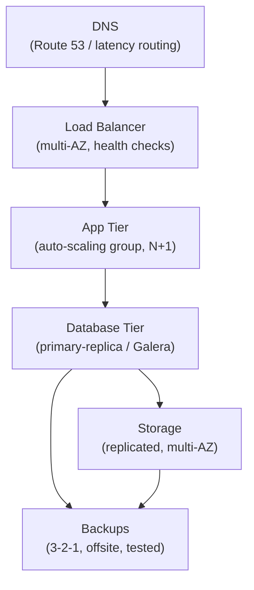
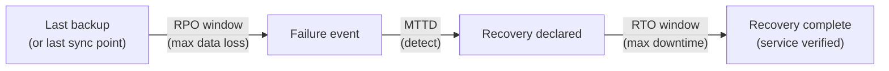
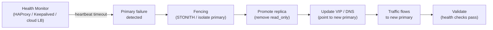
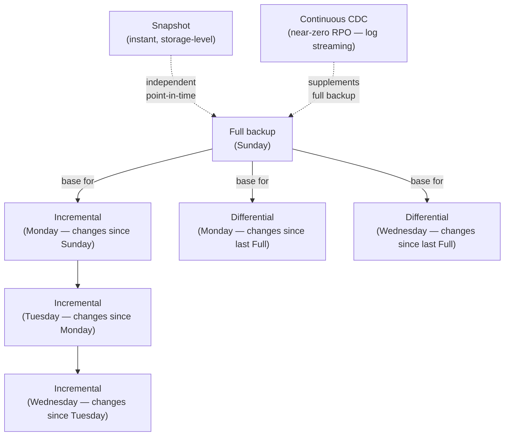
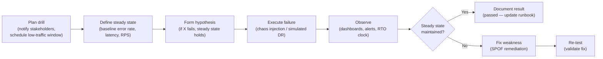

# Module 14: High Availability & Disaster Recovery

> **Course**: DevOps Career Path  
> **Audience**: Beginner → Intermediate  
> **Prerequisites**: Module 06 (Kubernetes), Module 07 (Cloud Fundamentals), Module 09 (Ansible)

[](https://creativecommons.org/licenses/by-nc-sa/4.0/)      

---

## Table of Contents

1. [Overview](#overview)
2. [Learning Objectives](#learning-objectives)
3. [Core Concepts: RTO, RPO, SLA](#core-concepts-rto-rpo-sla)
4. [Availability Tiers & Nines](#availability-tiers--nines)
5. [Failure Mode Analysis](#failure-mode-analysis)
6. [High Availability Architecture Patterns](#high-availability-architecture-patterns)
7. [Load Balancing](#load-balancing)
8. [Database High Availability](#database-high-availability)
9. [Backup Strategies](#backup-strategies)
10. [Multi-Region Architecture](#multi-region-architecture)
11. [Kubernetes HA](#kubernetes-ha)
12. [Disaster Recovery Planning](#disaster-recovery-planning)
13. [DR Testing & Chaos Engineering](#dr-testing--chaos-engineering)
14. [Cloud HA Services](#cloud-ha-services)
15. [Tools & Commands Reference](#tools--commands-reference)
16. [Hands-On Labs](#hands-on-labs)
17. [Further Reading](#further-reading)

---

## Overview

High Availability (HA) and Disaster Recovery (DR) are the engineering disciplines that ensure your systems survive component failures, data center outages, and catastrophic events. HA focuses on eliminating single points of failure to maximize uptime. DR focuses on restoring operations after a significant failure with defined time and data loss targets. This module covers both disciplines with practical implementation patterns.

HA and DR are related but distinct. HA is an ongoing operational property — the system is designed so that no single failure causes downtime. Components are redundant, load balancers detect and route around failures, and everything can be updated without taking the service down. DR is a recovery process — it activates when a failure is large enough that normal HA is insufficient, such as a region-wide cloud outage, ransomware encrypting the primary database, or a catastrophic deployment that corrupted data. A system can have excellent HA and still need DR if an entire availability zone disappears.

MTBF (Mean Time Between Failures) and MTTR (Mean Time To Repair) are the two quantities that drive availability. Availability equals MTBF divided by (MTBF + MTTR). Improving availability therefore means either making failures rarer (longer MTBF through better hardware, testing, and redundancy) or making recovery faster (shorter MTTR through automation, runbooks, and trained teams). Many organisations over-invest in preventing failures and under-invest in fast recovery. A well-practiced five-minute recovery from any failure is often more valuable than an architecture designed to never fail.



[↑ Back to TOC](#table-of-contents)

---

## Learning Objectives

By the end of this module, you will be able to:

- Define and calculate RTO, RPO, MTTR, and MTBF
- Translate business SLA requirements into infrastructure designs
- Identify and eliminate single points of failure (SPOFs)
- Design active-active and active-passive HA configurations
- Configure HAProxy and Nginx for load balancing
- Set up MySQL/MariaDB primary-replica and Galera cluster replication
- Design and implement backup strategies with automated verification
- Architect multi-region deployments for AWS, Azure, and GCP
- Configure Kubernetes for production-grade HA
- Write and execute DR runbooks
- Run chaos engineering experiments with Chaos Monkey and Chaos Mesh

[↑ Back to TOC](#table-of-contents)

---

## Core Concepts: RTO, RPO, SLA

RTO and RPO are business requirements that must be agreed before engineering decisions are made, not engineering outputs that are calculated afterward. When a business says "we need five nines of availability," the first question should be: what is the RTO and RPO for each component? A payment system might need a one-minute RTO and zero RPO (no data loss). An internal HR dashboard might be fine with a four-hour RTO and one-hour RPO. These different requirements justify radically different architectures and budgets, and conflating them leads to either over-engineering or under-engineering.

The cost of reducing RPO increases exponentially as it approaches zero. Moving from one-hour RPO to fifteen-minute RPO typically requires more frequent backups and potentially log shipping or CDC (Change Data Capture). Moving from fifteen-minute RPO to five-minute RPO requires synchronous replication or continuous streaming. Moving from five-minute RPO to zero requires synchronous write confirmation across at least two sites before every transaction — which adds latency on every write, limits geographic distance between sites (speed of light constraints), and significantly increases complexity. Teams that demand sub-minute RPO without understanding these costs often discover them painfully during database performance investigations.

The trade-off triangle for DR is time, data, and money. Fast recovery (low RTO) requires pre-warmed infrastructure, which costs money. No data loss (zero RPO) requires synchronous replication, which either costs money (multi-site infrastructure) or costs time (high write latency). Cheap DR (low cost) means slower recovery and/or potential data loss. Teams should make this trade-off explicitly rather than discover it during an incident.

### Key metrics

| Metric | Full Name | Definition | Example |
|--------|-----------|------------|---------|
| **RTO** | Recovery Time Objective | Max acceptable time to restore service | 4 hours |
| **RPO** | Recovery Point Objective | Max acceptable data loss (time) | 1 hour |
| **MTBF** | Mean Time Between Failures | Average time between failures | 720 hours |
| **MTTR** | Mean Time To Repair/Recover | Average time to restore after failure | 2 hours |
| **Availability** | Uptime percentage | MTBF / (MTBF + MTTR) | 99.72% |
| **MTTD** | Mean Time To Detect | Average time to detect a failure | 5 minutes |

### RTO vs RPO visualized

```
Last backup          Failure           Recovery complete
     │                  │                     │
─────▼──────────────────▼─────────────────────▼─────────
     │◄──── RPO ────────►│◄────── RTO ─────────►│
     │    (data loss)     │    (downtime)        │
     │    max 1 hour      │    max 4 hours       │
```



### Translating business requirements

| Business Requirement | RTO | RPO | Tier |
|---------------------|-----|-----|------|
| Core payment processing | < 1 min | 0 (no data loss) | Mission Critical |
| Customer-facing website | < 15 min | < 5 min | Business Critical |
| Internal admin portal | < 4 hours | < 1 hour | Important |
| Batch reporting system | < 24 hours | < 24 hours | Standard |
| Dev/test environment | < 72 hours | < 1 week | Low priority |

[↑ Back to TOC](#table-of-contents)

---

## Availability Tiers & Nines

| Availability | Downtime / Year | Downtime / Month | Tier |
|-------------|----------------|-----------------|------|
| 99% | 3.65 days | 7.3 hours | Basic |
| 99.9% | 8.76 hours | 43.8 minutes | Standard |
| 99.95% | 4.38 hours | 21.9 minutes | High |
| 99.99% | 52.6 minutes | 4.38 minutes | Very High |
| 99.999% | 5.26 minutes | 26.3 seconds | Five Nines |
| 99.9999% | 31.5 seconds | 2.63 seconds | Six Nines |

> Achieving five nines requires eliminating all single points of failure, including in the deployment process itself. A 30-minute maintenance window occurs 6 times per year — that alone costs you 3 hours, which breaks 99.97%.

### Uptime calculation

```
Availability = (Total Time - Downtime) / Total Time × 100%

Example: 8 hours downtime in a year
= (8760 - 8) / 8760 × 100%
= 99.909%
```

[↑ Back to TOC](#table-of-contents)

---

## Failure Mode Analysis

### Single Points of Failure (SPOF) — common examples

```
❌ Single web server                → ✅ Multiple servers + load balancer
❌ Single database (no replica)     → ✅ Primary + replica(s) or cluster
❌ Single load balancer             → ✅ HA pair (active/passive) or cloud LB
❌ Single availability zone         → ✅ Multi-AZ deployment
❌ Single region                    → ✅ Multi-region (for DR)
❌ Single power feed                → ✅ Redundant PDUs (data center)
❌ Single DNS provider              → ✅ Secondary DNS / Route53 + Cloudflare
❌ Single CI/CD server              → ✅ Managed CI/CD or HA runner pool
❌ Single network path (BGP)        → ✅ Multiple ISPs / BGP multi-homing
❌ Single cloud account             → ✅ Account isolation + cross-account DR
```

### SPOF identification template

```
For each system component, ask:
1. What happens if this component fails?
2. How long until failure is detected?
3. How long until failover or recovery?
4. Is there data loss?
5. What is the blast radius?
```

[↑ Back to TOC](#table-of-contents)

---

## High Availability Architecture Patterns

Active-passive and active-active are both valid HA patterns, but they have genuinely different engineering complexity and failure semantics. Active-passive is conceptually simpler: one node handles traffic, the other is a warm standby ready to take over. Failover is a defined, well-understood event. The challenge is that the passive node consumes resources without doing productive work, and failover time (seconds to minutes depending on detection and cutover) is non-zero. For most stateful workloads — especially databases — active-passive with fast automated failover is the right choice because it avoids the hardest problem in distributed systems: concurrent writes from multiple nodes.

Active-active genuinely shares load across all nodes simultaneously, eliminating the wasted standby capacity and reducing RTO to near-zero because all nodes are already serving traffic. However, the engineering complexity is substantially higher for any stateful component. The central problem is distributed writes: if two nodes each accept a write to the same record at the same time, you have a conflict that requires a resolution strategy. For truly stateless services (web servers, API gateways, stateless microservices), active-active is the natural and preferred choice. For databases, it requires either strong consistency protocols (synchronous consensus like Paxos/Raft, which adds latency) or eventual consistency (which accepts temporary divergence). Most teams who think they want active-active for databases actually want active-passive with a thirty-second automated failover.

Split-brain is the failure mode that makes active-active dangerous for stateful systems. If the network link between two nodes is severed but both nodes remain otherwise healthy, each node may believe the other is dead and start accepting writes independently. When the network recovers, you have two divergent data sets with no canonical truth. Preventing split-brain requires a quorum mechanism (never have exactly two nodes) or a fencing mechanism (ensure the failed/partitioned node cannot accept writes before the survivor promotes). These mechanisms add complexity that teams often underestimate.

### Active-Passive (Failover)

```
         Client
           │
           ▼
     ┌─────────────┐
     │  Primary    │◄──── Receives all traffic (ACTIVE)
     │  (active)   │
     └──────┬──────┘
            │ Heartbeat + replication
     ┌──────▼──────┐
     │  Secondary  │◄──── Standby, no traffic (PASSIVE)
     │  (passive)  │      Promotes if primary fails
     └─────────────┘
```

**Use case**: Databases (MySQL primary-replica), Keepalived/VRRP, some stateful applications  
**RTO**: Seconds to minutes (failover time)  
**Cost**: Pay for standby capacity at all times

### Active-Active (Load Sharing)

```
         Client
           │
           ▼
    ┌─────────────┐
    │ Load        │
    │ Balancer    │
    └──┬──────┬───┘
       │      │
┌──────▼──┐ ┌─▼──────┐
│ Server  │ │ Server │◄── Both handle traffic simultaneously
│   01    │ │   02   │
└─────────┘ └────────┘
```

**Use case**: Stateless web/app servers, microservices  
**RTO**: Near-zero (load balancer removes failed node automatically)  
**Cost**: All capacity is productive

### N+1 Redundancy

Have one more unit than the minimum required.

```
Minimum needed: 2 servers to handle load
N+1:            3 servers deployed
If 1 fails:     2 remaining still meet load requirements
```

### Geographic redundancy tiers

| Tier | Scope | RTO | Use case |
|------|-------|-----|----------|
| **Rack-level** | Same server room | Seconds | Standard HA |
| **AZ-level** | Same city, different data centers | < 1 min | Cloud HA |
| **Region-level** | Same country, 100s of km apart | Minutes–hours | Regional DR |
| **Cross-region** | Different countries/continents | Hours | Full DR |



[↑ Back to TOC](#table-of-contents)

---

## Load Balancing

### HAProxy configuration

```
# /etc/haproxy/haproxy.cfg

global
    log /dev/log local0
    chroot /var/lib/haproxy
    pidfile /var/run/haproxy.pid
    maxconn 50000
    user haproxy
    group haproxy
    daemon
    stats socket /var/lib/haproxy/stats level admin expose-fd listeners

defaults
    mode http
    log global
    option httplog
    option dontlognull
    option forwardfor
    option http-server-close
    retries 3
    timeout connect 5s
    timeout client 50s
    timeout server 50s
    timeout http-request 10s
    timeout http-keep-alive 10s
    timeout queue 30s

# Stats page
frontend stats
    bind *:8404
    stats enable
    stats uri /stats
    stats refresh 30s
    stats auth admin:StatsPassword123

# HTTP → HTTPS redirect
frontend http_in
    bind *:80
    redirect scheme https code 301

# HTTPS frontend
frontend https_in
    bind *:443 ssl crt /etc/haproxy/certs/example.com.pem
    default_backend web_backend

    # ACL routing
    acl is_api path_beg /api/
    use_backend api_backend if is_api

# Web servers backend
backend web_backend
    balance roundrobin
    option httpchk GET /health HTTP/1.1\r\nHost:\ example.com
    http-check expect status 200
    default-server inter 3s fall 3 rise 2
    server web-01 192.168.1.10:8080 check
    server web-02 192.168.1.11:8080 check
    server web-03 192.168.1.12:8080 check backup  # backup: only if all active fail

# API servers backend
backend api_backend
    balance leastconn    # Use least connections for API
    option httpchk GET /api/health
    http-check expect status 200
    default-server inter 5s fall 2 rise 3 slowstart 60s
    server api-01 192.168.1.20:3000 check
    server api-02 192.168.1.21:3000 check

# TCP backend example (PostgreSQL)
listen postgres_cluster
    bind *:5432
    mode tcp
    balance roundrobin
    option tcp-check
    default-server inter 3s fall 3 rise 2
    server pg-primary 192.168.1.30:5432 check
    server pg-replica 192.168.1.31:5432 check backup
```

### HAProxy balance algorithms

| Algorithm | Description | Best For |
|-----------|-------------|----------|
| `roundrobin` | Requests distributed evenly | Stateless apps of similar capacity |
| `leastconn` | Send to server with fewest connections | Long-lived connections (DB, WebSocket) |
| `source` | Client IP hashing (sticky) | Session affinity required |
| `uri` | URL hashing | Cache backends |
| `random` | Random server | Stateless, large server pools |

### HAProxy runtime management

```bash
# Reload config without dropping connections
haproxy -f /etc/haproxy/haproxy.cfg -c   # Validate config
systemctl reload haproxy                  # Graceful reload

# Check server states
echo "show servers state" | socat stdio /var/lib/haproxy/stats

# Drain a server (stop sending new connections)
echo "set server web_backend/web-01 state drain" | socat stdio /var/lib/haproxy/stats

# Disable a server (remove from pool for maintenance)
echo "set server web_backend/web-01 state maint" | socat stdio /var/lib/haproxy/stats

# Re-enable a server
echo "set server web_backend/web-01 state ready" | socat stdio /var/lib/haproxy/stats
```

### Keepalived — Virtual IP failover (VRRP)

```bash
# /etc/keepalived/keepalived.conf — on PRIMARY (MASTER)
vrrp_script chk_haproxy {
    script "killall -0 haproxy"   # Check if HAProxy is running
    interval 2
    weight -20
}

vrrp_instance VI_1 {
    state MASTER
    interface eth0
    virtual_router_id 51
    priority 110              # Higher = preferred master
    advert_int 1

    authentication {
        auth_type PASS
        auth_pass secretpassword
    }

    virtual_ipaddress {
        192.168.1.100/24      # VIP — floats to whichever node is master
    }

    track_script {
        chk_haproxy
    }

    notify_master "/etc/keepalived/notify.sh MASTER"
    notify_backup "/etc/keepalived/notify.sh BACKUP"
    notify_fault  "/etc/keepalived/notify.sh FAULT"
}
```

```bash
# On BACKUP node — same config with:
# state BACKUP
# priority 100    (lower than master)
```

[↑ Back to TOC](#table-of-contents)

---

## Database High Availability

Database HA is where the replication trade-off between consistency and performance becomes concrete. **Synchronous replication** guarantees that a write is committed on at least one replica before it is acknowledged to the application. This means if the primary fails immediately after a write, the replica has that data. The cost is added write latency on every transaction — the primary must wait for a network round trip and a replica commit before returning success. This makes synchronous replication sensitive to network latency between primary and replica, which limits geographic separation and creates performance pressure under high write load.

**Asynchronous replication** acknowledges the write immediately on the primary and ships the change to the replica in the background. This adds no latency to the write path and allows the replica to lag behind under heavy load without affecting the primary. The cost is the possibility of data loss on a sudden primary failure: any changes applied to the primary but not yet shipped to the replica are lost. MySQL's `innodb_flush_log_at_trx_commit=1` and `sync_binlog=1` settings ensure data durability on the primary itself (ACID compliance), but do not eliminate replication lag. In practice, well-tuned asynchronous replication typically runs with sub-second lag, which means the RPO risk is low but non-zero.

Semi-synchronous replication (MySQL 5.7+, MariaDB) is a middle ground: the primary waits for at least one replica to acknowledge receipt of the transaction before returning to the application, but does not wait for the replica to fully apply it. This gives a stronger durability guarantee than pure async without the full performance cost of fully synchronous replication. Galera Cluster (used by MariaDB Galera and Percona XtraDB Cluster) implements a certification-based multi-primary protocol where all nodes apply the same transactions in the same order — effectively synchronous across the cluster, at the cost of higher latency for conflicting transactions and network sensitivity.

### MySQL / MariaDB Primary-Replica Replication

```bash
# --- PRIMARY SERVER ---

# /etc/mysql/conf.d/replication.cnf
[mysqld]
server-id = 1
log_bin = /var/log/mysql/mysql-bin.log
binlog_expire_logs_seconds = 604800
max_binlog_size = 100M
binlog_format = ROW    # ROW is safer than STATEMENT
innodb_flush_log_at_trx_commit = 1   # Sync on every commit (ACID)
sync_binlog = 1

# Create replication user on primary
CREATE USER 'replicator'@'192.168.1.%' IDENTIFIED BY 'ReplPassword123!';
GRANT REPLICATION SLAVE ON *.* TO 'replicator'@'192.168.1.%';
FLUSH PRIVILEGES;

# Get current binary log position (lock tables briefly)
FLUSH TABLES WITH READ LOCK;
SHOW BINARY LOG STATUS;   -- MySQL 8.4+ / SHOW MASTER STATUS on older versions
# Note: File and Position
UNLOCK TABLES;
```

```bash
# --- REPLICA SERVER ---

# /etc/mysql/conf.d/replication.cnf
[mysqld]
server-id = 2
relay_log = /var/log/mysql/mysql-relay-bin.log
read_only = 1
log_replica_updates = 1    # Allow replica to also be replicated to (chain)
# Note: log_slave_updates is a deprecated alias removed in MySQL 9.0

# Configure replication (MySQL 8.0.23+ syntax — CHANGE REPLICATION SOURCE TO)
CHANGE REPLICATION SOURCE TO
    SOURCE_HOST='192.168.1.30',
    SOURCE_USER='replicator',
    SOURCE_PASSWORD='ReplPassword123!',
    SOURCE_LOG_FILE='mysql-bin.000001',  # From SHOW BINARY LOG STATUS
    SOURCE_LOG_POS=154;

START REPLICA;

# Check status (MySQL 8.0.22+; use SHOW SLAVE STATUS\G on MySQL < 8.0.22)
SHOW REPLICA STATUS\G
# Look for:
# Replica_IO_Running: Yes
# Replica_SQL_Running: Yes
# Seconds_Behind_Source: 0
```

### MariaDB Galera Cluster (Multi-Master)

```ini
# /etc/mysql/conf.d/galera.cnf — on ALL nodes

[mysqld]
binlog_format=ROW
default-storage-engine=innodb
innodb_autoinc_lock_mode=2
bind-address=0.0.0.0

# Galera Provider
wsrep_on=ON
wsrep_provider=/usr/lib/galera/libgalera_smm.so

# Cluster name and members
wsrep_cluster_name="my_galera_cluster"
wsrep_cluster_address="gcomm://db-01,db-02,db-03"

# This node's address
wsrep_node_address="192.168.1.30"    # Change per node
wsrep_node_name="db-01"              # Change per node

# SST (State Snapshot Transfer) method
wsrep_sst_method=rsync
```

```bash
# Bootstrap the cluster (first node ONLY — once only)
galera_new_cluster

# Join other nodes
systemctl start mysql     # On db-02 and db-03

# Check cluster status
mysql -e "SHOW STATUS LIKE 'wsrep_%';" | grep -E "wsrep_cluster_size|wsrep_local_state_comment|wsrep_connected"
```

### PostgreSQL HA with Patroni

Patroni is a Python-based HA solution for PostgreSQL using distributed consensus (etcd/Consul/ZooKeeper).

```yaml
# /etc/patroni/patroni.yml (on each node)
scope: my-postgres-cluster
namespace: /db/
name: pg-node-01   # Change per node

restapi:
  listen: 0.0.0.0:8008
  connect_address: 192.168.1.40:8008

etcd:
  hosts: etcd-01:2379,etcd-02:2379,etcd-03:2379

bootstrap:
  dcs:
    ttl: 30
    loop_wait: 10
    retry_timeout: 30
    maximum_lag_on_failover: 1048576
    postgresql:
      use_pg_rewind: true
      parameters:
        wal_level: replica
        hot_standby: "on"
        max_connections: 200
        max_wal_senders: 10
        max_replication_slots: 10

postgresql:
  listen: 0.0.0.0:5432
  connect_address: 192.168.1.40:5432
  data_dir: /var/lib/postgresql/14/data
  bin_dir: /usr/lib/postgresql/14/bin
  pgpass: /tmp/pgpass0
  authentication:
    replication:
      username: replicator
      password: ReplPassword123!
    superuser:
      username: postgres
      password: SuperPassword456!
```

```bash
# Check cluster status
patronictl -c /etc/patroni/patroni.yml list

# Manual failover
patronictl -c /etc/patroni/patroni.yml failover my-postgres-cluster --master pg-node-01 --candidate pg-node-02 --force

# Switchover (planned maintenance)
patronictl -c /etc/patroni/patroni.yml switchover my-postgres-cluster
```

### Redis Sentinel (HA for Redis)

```conf
# sentinel.conf
sentinel monitor mymaster 192.168.1.50 6379 2   # 2 sentinels must agree
sentinel auth-pass mymaster RedisPassword123!
sentinel down-after-milliseconds mymaster 5000   # 5s before marking down
sentinel failover-timeout mymaster 60000         # Max failover time
sentinel parallel-syncs mymaster 1               # Replicas to sync at once
```

```bash
redis-sentinel /etc/redis/sentinel.conf &

# Check sentinel status
redis-cli -p 26379 sentinel masters
redis-cli -p 26379 sentinel slaves mymaster
redis-cli -p 26379 sentinel get-master-addr-by-name mymaster
```

[↑ Back to TOC](#table-of-contents)

---

## Backup Strategies

### 3-2-1 Backup Rule

```
3 copies of data
2 different storage media types
1 copy offsite (geographically separate)

Example:
  Copy 1: Production database (primary)
  Copy 2: Daily backup on NAS in same DC
  Copy 3: Daily backup in S3 (offsite)
```

### Backup types

| Type | Description | Restore Speed | Storage |
|------|-------------|---------------|---------|
| **Full** | Complete copy of all data | Fastest | Large |
| **Incremental** | Changes since last backup (any type) | Slow (chain restore) | Small |
| **Differential** | Changes since last FULL backup | Medium | Medium |
| **Snapshot** | Point-in-time storage snapshot | Fast | Medium |
| **Continuous (CDC)** | Continuous log shipping / CDC | Near-zero RPO | Ongoing |



### MySQL / MariaDB backup with mysqldump

```bash
#!/bin/bash
# /usr/local/bin/mysql-backup.sh

set -euo pipefail

DB_HOST="localhost"
DB_USER="backup_user"
DB_PASS="BackupPassword123!"
BACKUP_DIR="/backup/mysql"
DATE=$(date +%Y%m%d_%H%M%S)
RETENTION_DAYS=30

# Create backup directory
mkdir -p "${BACKUP_DIR}/${DATE}"

# Backup all databases individually
mysql -h"${DB_HOST}" -u"${DB_USER}" -p"${DB_PASS}" \
  -e "SHOW DATABASES;" --batch --skip-column-names | \
  grep -Ev "^(information_schema|performance_schema|sys)$" | \
  while read db; do
    echo "Backing up: ${db}"
    mysqldump -h"${DB_HOST}" -u"${DB_USER}" -p"${DB_PASS}" \
      --single-transaction \
      --routines \
      --triggers \
      --events \
      --flush-logs \
      "${db}" | gzip > "${BACKUP_DIR}/${DATE}/${db}.sql.gz"
  done

# Create checksum file
md5sum "${BACKUP_DIR}/${DATE}"/*.sql.gz > "${BACKUP_DIR}/${DATE}/checksums.md5"

# Upload to S3
aws s3 sync "${BACKUP_DIR}/${DATE}/" \
  "s3://my-db-backups/mysql/${DATE}/" \
  --storage-class STANDARD_IA

# Verify upload
aws s3 ls "s3://my-db-backups/mysql/${DATE}/" --summarize

# Remove old local backups
find "${BACKUP_DIR}" -maxdepth 1 -type d -mtime "+${RETENTION_DAYS}" -exec rm -rf {} +

echo "Backup complete: ${DATE}"
```

### MySQL backup with Percona XtraBackup (hot backup)

```bash
# Full backup (no table locks — safe for production)
xtrabackup --backup \
  --user=backup_user \
  --password=BackupPassword123! \
  --target-dir=/backup/mysql/full/$(date +%Y%m%d)

# Prepare (apply transaction logs)
xtrabackup --prepare --target-dir=/backup/mysql/full/20260302

# Restore
systemctl stop mysql
rm -rf /var/lib/mysql/*
xtrabackup --copy-back --target-dir=/backup/mysql/full/20260302
chown -R mysql:mysql /var/lib/mysql
systemctl start mysql
```

### Filesystem and database snapshot backup

```bash
# LVM snapshot for consistent filesystem backup
# 1. Create snapshot of /dev/vg0/data (10GB snapshot space)
lvcreate -L10G -s -n data_snap /dev/vg0/data

# 2. Mount the snapshot
mount -o ro /dev/vg0/data_snap /mnt/snapshot

# 3. Back up the snapshot
tar czf /backup/data-$(date +%Y%m%d).tar.gz -C /mnt/snapshot .

# 4. Remove snapshot
umount /mnt/snapshot
lvremove -f /dev/vg0/data_snap
```

### Kubernetes backup with Velero

```bash
# Install Velero with S3 storage
velero install \
  --provider aws \
  --plugins velero/velero-plugin-for-aws:v1.9.0 \
  --bucket velero-backups \
  --secret-file ./credentials-velero \
  --backup-location-config region=us-east-1 \
  --snapshot-location-config region=us-east-1

# Create a backup
velero backup create production-backup \
  --include-namespaces production \
  --ttl 720h    # 30 days

# Schedule daily backups
velero schedule create daily-production \
  --schedule="0 2 * * *" \
  --include-namespaces production \
  --ttl 720h

# Check backup status
velero backup describe production-backup
velero backup logs production-backup

# Restore from backup
velero restore create --from-backup production-backup
velero restore describe production-backup-restore-1

# List all backups
velero backup get
```

### Backup verification (critical!)

> A backup is only as good as its last successful restore test. Automated verification is mandatory.

```bash
#!/bin/bash
# /usr/local/bin/verify-backup.sh
# Run daily — restore latest backup to test instance and verify data

BACKUP_DATE=$(date +%Y%m%d)
TEST_DB="backup_verify_${BACKUP_DATE}"
RESTORE_HOST="db-test-01"

# Download latest backup
aws s3 cp "s3://my-db-backups/mysql/${BACKUP_DATE}/appdb.sql.gz" /tmp/

# Verify checksum
aws s3 cp "s3://my-db-backups/mysql/${BACKUP_DATE}/checksums.md5" /tmp/
md5sum --check /tmp/checksums.md5

# Restore to test database
mysql -h"${RESTORE_HOST}" -u root -p -e "CREATE DATABASE ${TEST_DB};"
zcat /tmp/appdb.sql.gz | mysql -h"${RESTORE_HOST}" -u root -p "${TEST_DB}"

# Verify row counts match
PROD_COUNT=$(mysql -h db-primary -u app_user -p appdb -se "SELECT COUNT(*) FROM orders;")
TEST_COUNT=$(mysql -h"${RESTORE_HOST}" -u root -p "${TEST_DB}" -se "SELECT COUNT(*) FROM orders;")

if [ "${PROD_COUNT}" == "${TEST_COUNT}" ]; then
    echo "✅ Backup verification PASSED: ${PROD_COUNT} orders verified"
else
    echo "❌ Backup verification FAILED: prod=${PROD_COUNT}, backup=${TEST_COUNT}"
    # Send alert
    curl -X POST "$SLACK_WEBHOOK" \
      -d "{\"text\": \"⚠️ DB Backup verification FAILED for ${BACKUP_DATE}\"}"
    exit 1
fi

# Cleanup
mysql -h"${RESTORE_HOST}" -u root -p -e "DROP DATABASE ${TEST_DB};"
rm -f /tmp/appdb.sql.gz /tmp/checksums.md5
```

[↑ Back to TOC](#table-of-contents)

---

## Multi-Region Architecture

### Active-Passive Multi-Region

```
Region A (Primary — active)        Region B (DR — passive)
┌───────────────────────────┐      ┌───────────────────────────┐
│  Load Balancer             │      │  Load Balancer (standby)   │
│  App servers (3x)          │  ──► │  App servers (warm standby)│
│  DB Primary                │ repl │  DB Replica                │
│  Cache (Redis)             │      │  Cache                     │
└───────────────────────────┘      └───────────────────────────┘
        ▲                                      ▲
        │           DNS Failover               │
        └──────────────────────────────────────┘
              Route53 / Cloudflare / Azure DNS
              Health check → failover in ~60s
```

### Active-Active Multi-Region

```
Region A                            Region B
┌────────────────────────┐          ┌────────────────────────┐
│  App servers           │          │  App servers           │
│  DB (read + write)     │◄────────►│  DB (read + write)     │
│  Cache                 │          │  Cache                 │
└────────────────────────┘          └────────────────────────┘
          ▲                                   ▲
          │         Global Load Balancer       │
          └───────────────────────────────────┘
              Cloudflare / AWS Global Accel.
              Latency-based routing
```

### AWS Multi-Region DNS failover (Route 53)

```bash
# Create primary health check
aws route53 create-health-check \
  --caller-reference "primary-check-001" \
  --health-check-config '{
    "IPAddress": "52.1.2.3",
    "Port": 443,
    "Type": "HTTPS",
    "ResourcePath": "/health",
    "FullyQualifiedDomainName": "api.example.com",
    "RequestInterval": 30,
    "FailureThreshold": 3
  }'

# Create PRIMARY record (us-east-1)
aws route53 change-resource-record-sets \
  --hosted-zone-id Z123456789 \
  --change-batch '{
    "Changes": [{
      "Action": "CREATE",
      "ResourceRecordSet": {
        "Name": "api.example.com",
        "Type": "A",
        "SetIdentifier": "primary",
        "Failover": "PRIMARY",
        "TTL": 60,
        "ResourceRecords": [{"Value": "52.1.2.3"}],
        "HealthCheckId": "<health-check-id>"
      }
    }]
  }'

# Create SECONDARY record (eu-west-1)
aws route53 change-resource-record-sets \
  --hosted-zone-id Z123456789 \
  --change-batch '{
    "Changes": [{
      "Action": "CREATE",
      "ResourceRecordSet": {
        "Name": "api.example.com",
        "Type": "A",
        "SetIdentifier": "secondary",
        "Failover": "SECONDARY",
        "TTL": 60,
        "ResourceRecords": [{"Value": "34.5.6.7"}]
      }
    }]
  }'
```

[↑ Back to TOC](#table-of-contents)

---

## Kubernetes HA

### Control Plane HA

For production Kubernetes, run **3 or 5 control plane nodes** (odd number for etcd quorum).

```
┌─────────────────────────────────────────────────────────┐
│                  HA Control Plane                       │
│                                                         │
│  ┌──────────────┐  ┌──────────────┐  ┌──────────────┐  │
│  │ Control      │  │ Control      │  │ Control      │  │
│  │ Plane 1      │  │ Plane 2      │  │ Plane 3      │  │
│  │ API Server   │  │ API Server   │  │ API Server   │  │
│  │ Scheduler    │  │ Scheduler    │  │ Scheduler    │  │
│  │ Controller   │  │ Controller   │  │ Controller   │  │
│  │ etcd         │  │ etcd         │  │ etcd         │  │
│  └──────────────┘  └──────────────┘  └──────────────┘  │
│         │                │                 │            │
│         └────────────────┼─────────────────┘            │
│                          │                              │
│              ┌───────────▼──────────┐                   │
│              │  Load Balancer (VIP) │                   │
│              │  (haproxy/nlb/kube)  │                   │
│              └──────────────────────┘                   │
└─────────────────────────────────────────────────────────┘
```

### etcd backup and restore

```bash
# Backup etcd (run on control plane node)
ETCDCTL_API=3 etcdctl snapshot save /backup/etcd-$(date +%Y%m%d_%H%M%S).db \
  --endpoints=https://127.0.0.1:2379 \
  --cacert=/etc/kubernetes/pki/etcd/ca.crt \
  --cert=/etc/kubernetes/pki/etcd/server.crt \
  --key=/etc/kubernetes/pki/etcd/server.key

# Verify snapshot
ETCDCTL_API=3 etcdctl snapshot status /backup/etcd-20260302_140000.db --write-out=table

# Restore etcd
systemctl stop kube-apiserver kube-scheduler kube-controller-manager etcd

ETCDCTL_API=3 etcdctl snapshot restore /backup/etcd-20260302_140000.db \
  --data-dir=/var/lib/etcd-restore \
  --name=cp-01 \
  --initial-cluster="cp-01=https://192.168.1.10:2380,cp-02=https://192.168.1.11:2380,cp-03=https://192.168.1.12:2380" \
  --initial-cluster-token=etcd-cluster-prod \
  --initial-advertise-peer-urls=https://192.168.1.10:2380

# Update etcd config to use new data directory
# Restart services
systemctl start etcd kube-apiserver kube-scheduler kube-controller-manager
```

### Pod Disruption Budgets (PDB)

PDBs ensure a minimum number of pods are always available during voluntary disruptions (node drains, rolling updates).

```yaml
# Ensure at least 2 of 3 replicas are always available
apiVersion: policy/v1
kind: PodDisruptionBudget
metadata:
  name: my-api-pdb
  namespace: production
spec:
  minAvailable: 2       # Can also use: maxUnavailable: 1
  selector:
    matchLabels:
      app: my-api
```

### Node Affinity — spread across AZs

```yaml
# Ensure pods are spread across availability zones
spec:
  topologySpreadConstraints:
    - maxSkew: 1
      topologyKey: topology.kubernetes.io/zone
      whenUnsatisfiable: DoNotSchedule
      labelSelector:
        matchLabels:
          app: my-api

  affinity:
    podAntiAffinity:
      requiredDuringSchedulingIgnoredDuringExecution:
        - labelSelector:
            matchLabels:
              app: my-api
          topologyKey: kubernetes.io/hostname  # One pod per node
```

[↑ Back to TOC](#table-of-contents)

---

## Disaster Recovery Planning

### DR Strategies (by cost/RTO)

| Strategy | RTO | RPO | Cost | Description |
|----------|-----|-----|------|-------------|
| **Backup & Restore** | Hours | Hours | $ | Restore from backup in DR region |
| **Pilot Light** | 10–30 min | Minutes | $$ | Minimal DR environment always running; scale up on disaster |
| **Warm Standby** | Minutes | Seconds–minutes | $$$ | Reduced-capacity DR environment always running |
| **Active-Active** | Near-zero | Near-zero | $$$$ | Full capacity in both regions; automatic failover |

### DR Runbook template

```markdown
# DR Runbook: Production Database Failure

## Trigger conditions
- Primary database unreachable for > 5 minutes
- Replication lag > 30 minutes
- Data corruption detected

## Severity: P1 — Critical

## Stakeholders
- On-call engineer (PagerDuty escalation)
- Database team lead
- Engineering manager (if > 30 min)
- Communications (if customer-facing > 1 hour)

## Step 1 — Validate the failure (5 min)
1. Check database health: `mysql -h db-primary -u monitor -e "SELECT 1;"`
2. Check replica status: `SHOW REPLICA STATUS\G`
3. Check HAProxy status: http://haproxy:8404/stats
4. Check CloudWatch/Prometheus alerts

## Step 2 — Escalation decision (2 min)
- If primary unreachable AND replica lag = 0: Proceed to Step 3 (promote replica)
- If primary unreachable AND replica lag > 0: Assess data loss vs downtime tradeoff

## Step 3 — Promote replica (10 min)
```sql
-- On replica server (MySQL 8.0.22+ syntax)
STOP REPLICA;
RESET REPLICA ALL;
SET GLOBAL read_only = 0;
```

## Step 4 — Update HAProxy (2 min)
```bash
echo "set server postgres_cluster/pg-replica state active" | socat stdio /var/lib/haproxy/stats
echo "set server postgres_cluster/pg-primary state maint" | socat stdio /var/lib/haproxy/stats
```

## Step 5 — Validate
1. Test read/write connectivity to new primary
2. Check application health endpoints
3. Monitor error rates for 10 minutes

## Step 6 — Communication
- Update status page (status.example.com)
- Notify stakeholders via Slack #incidents
- Start incident ticket in PagerDuty

## Step 7 — Post-incident
- Schedule post-mortem within 48 hours
- Fix original primary and re-establish replication
- Update this runbook if process was unclear
```

### DR testing checklist

```
Quarterly DR Test Checklist:
□ Notify stakeholders of planned test date
□ Schedule test during low-traffic window
□ Document current state (backup timestamps, replication lag)
□ Execute failover procedure
□ Verify application functionality after failover
□ Measure actual RTO achieved
□ Measure actual data loss (RPO achieved)
□ Document any gaps from target RTO/RPO
□ Restore to normal state
□ Update runbooks with lessons learned
□ Schedule next test
```

[↑ Back to TOC](#table-of-contents)

---

## DR Testing & Chaos Engineering

DR plans that are never tested are fiction. The pattern repeats in nearly every post-incident report involving a slow recovery: the runbook was written once and never validated, the team had never practiced the steps, a dependency had changed and the runbook was wrong, or the backup restore procedure was correct on paper but took three times as long as expected under stress. Quarterly DR drills are not optional for any system with a real RTO — they are the mechanism that converts a document into a practiced capability.

Chaos engineering extends this principle beyond disaster recovery to everyday resilience. Netflix's Chaos Monkey famously terminated random production instances to prove that the system could survive individual instance failures. The insight behind this approach is that complex systems always fail in ways that were not anticipated during design. The only way to discover failure modes you did not predict is to inject real failures and observe what happens. A chaos experiment that reveals a previously unknown SPOF is enormously more valuable than an experiment that confirms everything works as expected.

The key discipline in chaos engineering is the scientific method: define a steady-state hypothesis before the experiment, introduce a specific and bounded failure, observe whether steady state holds, and fix the weakness if it does not. Running chaos experiments without a hypothesis produces noise, not signal. Starting in non-production environments and progressively moving to production (beginning with low-traffic periods) ensures that experiments teach you about the system without causing unnecessary customer impact. Every weakness found in a chaos experiment during a planned exercise is a weakness that did not cause an unplanned outage.

### Chaos Engineering principles

> "Chaos Engineering is the discipline of experimenting on a system in order to build confidence in the system's capability to withstand turbulent conditions in production." — Netflix

#### GameDay process

1. **Define steady state** — what does "normal" look like? (error rate, latency, throughput)
2. **Hypothesize** — "If we kill one web server, steady state will be maintained"
3. **Introduce chaos** — kill the server, inject latency, corrupt a request
4. **Observe** — did steady state hold?
5. **Fix weaknesses** — if steady state broke, fix the SPOF
6. **Repeat**

### Chaos Mesh — Kubernetes chaos engineering

```bash
# Install Chaos Mesh
helm repo add chaos-mesh https://charts.chaos-mesh.org
helm install chaos-mesh chaos-mesh/chaos-mesh \
  --namespace chaos-mesh \
  --create-namespace \
  --set chaosDaemon.runtime=containerd \
  --set chaosDaemon.socketPath=/run/containerd/containerd.sock
```

```yaml
# Kill 33% of pods in production namespace
apiVersion: chaos-mesh.org/v1alpha1
kind: PodChaos
metadata:
  name: pod-kill-experiment
  namespace: chaos-mesh
spec:
  action: pod-kill
  mode: fixed-percent
  value: "33"
  selector:
    namespaces:
      - production
    labelSelectors:
      "app": "my-api"
  scheduler:
    cron: "@once"
```

```yaml
# Inject 200ms network latency on all pods
apiVersion: chaos-mesh.org/v1alpha1
kind: NetworkChaos
metadata:
  name: network-latency-experiment
spec:
  action: delay
  mode: all
  selector:
    namespaces:
      - production
  delay:
    latency: "200ms"
    correlation: "100"
    jitter: "0ms"
  duration: "5m"
```

```yaml
# CPU stress — 80% utilization for 2 minutes
apiVersion: chaos-mesh.org/v1alpha1
kind: StressChaos
metadata:
  name: cpu-stress-experiment
spec:
  mode: one
  selector:
    namespaces: [production]
  stressors:
    cpu:
      workers: 4
      load: 80
  duration: "2m"
```

### Manual chaos techniques

```bash
# Kill a random pod
kubectl -n production delete pod \
  $(kubectl -n production get pods -l app=my-api -o name | shuf -n 1)

# Drain a node (simulate node failure)
kubectl drain node-03 --ignore-daemonsets --delete-emptydir-data --grace-period=30

# Simulate network partition (tc - traffic control)
tc qdisc add dev eth0 root netem delay 500ms 100ms loss 5%
tc qdisc show dev eth0
# Remove:
tc qdisc del dev eth0 root

# Fill disk space (test disk full handling)
dd if=/dev/zero of=/tmp/bigfile bs=1M count=10240 &
# Remove:
rm /tmp/bigfile

# Exhaust file descriptors
ulimit -n 10  # Then run application — it will fail to open sockets/files
```



[↑ Back to TOC](#table-of-contents)

---

## Cloud HA Services

### AWS

| Service | HA Feature | Notes |
|---------|-----------|-------|
| **EC2** | Multi-AZ + Auto Scaling Groups | Use ASG min=2 across 2+ AZs |
| **RDS** | Multi-AZ standby, Read Replicas | Automatic failover ~60s |
| **Aurora** | Multi-AZ, 6 copies of data | Failover ~30s, Aurora Global 1-5s |
| **ElastiCache** | Multi-AZ Redis cluster | Auto-failover |
| **S3** | 11 nines durability | Built-in, no action needed |
| **ELB** | Cross-zone load balancing | Use ALB for HTTP, NLB for TCP |
| **Route 53** | Health-check based failover | 60s TTL minimum |
| **EKS** | Multi-AZ node groups | Spread pods with topologyKey |

### Azure

| Service | HA Feature |
|---------|-----------|
| **VM Scale Sets** | Availability Zones |
| **Azure SQL** | Business Critical tier — 3 replicas |
| **Azure Cache for Redis** | Zone-redundant, geo-replication |
| **Traffic Manager** | DNS-based global routing |
| **Azure Front Door** | Global CDN + failover |
| **AKS** | Multi-zone node pools |

### GCP

| Service | HA Feature |
|---------|-----------|
| **MIG (Managed Instance Group)** | Multi-zone, auto-healing |
| **Cloud SQL** | HA with failover replica |
| **Cloud Spanner** | Multi-region, 99.999% SLA |
| **Cloud Load Balancing** | Global, anycast |
| **GKE** | Regional cluster (3 AZs) |

[↑ Back to TOC](#table-of-contents)

---

## Tools & Commands Reference

```bash
# HAProxy
haproxy -f /etc/haproxy/haproxy.cfg -c           # Validate config
systemctl reload haproxy                          # Graceful reload
echo "show info" | socat stdio /var/lib/haproxy/stats
echo "show servers state" | socat stdio /var/lib/haproxy/stats

# Keepalived
systemctl status keepalived
ip addr show eth0 | grep 192.168.1.100            # Check if VIP is local
journalctl -u keepalived -f                       # Watch failover events

# MySQL Replication (MySQL 8.0.22+ syntax)
SHOW BINARY LOG STATUS\G               # On primary (was: SHOW MASTER STATUS)
SHOW REPLICA STATUS\G                  # On replica (was: SHOW SLAVE STATUS)
SHOW REPLICAS\G                        # List replicas (was: SHOW SLAVE HOSTS)
STOP REPLICA; START REPLICA;           # Control replica thread
RESET REPLICA ALL;                     # Remove replication config

# Galera
SHOW STATUS LIKE 'wsrep_cluster_size';
SHOW STATUS LIKE 'wsrep_local_state_comment';
SHOW STATUS LIKE 'wsrep_connected';

# etcd
ETCDCTL_API=3 etcdctl member list
ETCDCTL_API=3 etcdctl endpoint health
ETCDCTL_API=3 etcdctl snapshot status snapshot.db

# Velero
velero backup get
velero backup describe <name>
velero restore create --from-backup <name>
velero schedule get

# Kubernetes HA
kubectl get nodes -o wide
kubectl drain <node> --ignore-daemonsets --delete-emptydir-data
kubectl uncordon <node>
kubectl get pdb -A
kubectl get poddisruptionbudget -n production
```

[↑ Back to TOC](#table-of-contents)

---

## Hands-On Labs

### Lab 1 — HAProxy Round-Robin Load Balancing (Beginner)

**Goal**: Set up HAProxy fronting three simple web servers and verify failover.

```bash
# Start 3 backend servers using Python HTTP server
for port in 8001 8002 8003; do
  mkdir -p /tmp/server${port}
  echo "Server on port ${port}" > /tmp/server${port}/index.html
  python3 -m http.server ${port} --directory /tmp/server${port} &
done

# Install and configure HAProxy
dnf install haproxy -y

# Configure /etc/haproxy/haproxy.cfg with 3 backends on 8001-8003
# Run: while true; do curl -s http://localhost/; sleep 0.5; done
# Kill server on 8001 and observe traffic moving to 8002 and 8003
# Re-start server on 8001 and observe it return to the pool
```

---

### Lab 2 — MySQL Primary-Replica Replication (Intermediate)

**Goal**: Set up MySQL primary-replica replication and simulate failover.

```bash
# Use Docker/Podman to run 2 MySQL instances
docker run -d --name mysql-primary \
  -e MYSQL_ROOT_PASSWORD=rootpass \
  -p 3306:3306 mysql:8.0

docker run -d --name mysql-replica \
  -e MYSQL_ROOT_PASSWORD=rootpass \
  -p 3307:3306 mysql:8.0

# Follow the primary-replica setup steps from this module
# Then:
# 1. Insert data into primary
# 2. Verify it appears on replica (SHOW REPLICA STATUS\G)
# 3. Stop primary container
# 4. Promote replica: STOP REPLICA; RESET REPLICA ALL; SET GLOBAL read_only=0;
# 5. Write to the (now primary) replica and verify
```

---

### Lab 3 — Kubernetes PodDisruptionBudget (Intermediate)

```bash
# Deploy an app with 3 replicas
kubectl create deployment lab-app --image=nginx:alpine --replicas=3 -n default

# Create a PDB allowing max 1 unavailable
kubectl apply -f - << 'EOF'
apiVersion: policy/v1
kind: PodDisruptionBudget
metadata:
  name: lab-app-pdb
spec:
  maxUnavailable: 1
  selector:
    matchLabels:
      app: lab-app
EOF

# Try to drain a node
kubectl drain <node-name> --ignore-daemonsets --delete-emptydir-data
# Observe: it waits until evictions are compliant with PDB

# Check PDB status
kubectl get pdb lab-app-pdb
```

---

### Lab 4 — etcd Backup and Restore (Intermediate)

```bash
# On a kubeadm cluster control plane node

# Create some test data
kubectl create namespace backup-test
kubectl create configmap test-data --from-literal=key=value -n backup-test

# Backup etcd
ETCDCTL_API=3 etcdctl snapshot save /tmp/etcd-backup.db \
  --endpoints=https://127.0.0.1:2379 \
  --cacert=/etc/kubernetes/pki/etcd/ca.crt \
  --cert=/etc/kubernetes/pki/etcd/server.crt \
  --key=/etc/kubernetes/pki/etcd/server.key

# Verify
ETCDCTL_API=3 etcdctl snapshot status /tmp/etcd-backup.db --write-out=table

# Delete the namespace
kubectl delete namespace backup-test

# Restore etcd from backup
# (Follow the restore procedure from this module)
# Verify the namespace returns
kubectl get namespace backup-test
```

[↑ Back to TOC](#table-of-contents)

---

## Further Reading

- [AWS Well-Architected Framework — Reliability Pillar](https://docs.aws.amazon.com/wellarchitected/latest/reliability-pillar/)
- [Google SRE Book — Managing Disasters](https://sre.google/sre-book/managing-disasters/)
- [Chaos Engineering by Casey Rosenthal & Nora Jones](https://www.oreilly.com/library/view/chaos-engineering/9781491988459/)
- [Chaos Mesh Documentation](https://chaos-mesh.org/docs/)
- [Patroni Documentation](https://patroni.readthedocs.io/)
- [Velero Documentation](https://velero.io/docs/)
- [HAProxy Configuration Manual](https://www.haproxy.org/download/2.8/doc/configuration.txt)
- [Kubernetes PodDisruptionBudget](https://kubernetes.io/docs/tasks/run-application/configure-pdb/)
- [AWS DR Whitepaper](https://docs.aws.amazon.com/whitepapers/latest/disaster-recovery-workloads-on-aws/disaster-recovery-workloads-on-aws.html)
- [Site Reliability Engineering — Postmortems](https://sre.google/sre-book/postmortem-culture/)

[↑ Back to TOC](#table-of-contents)

---

## Chaos Engineering

Reliability cannot be assumed — it must be tested. Chaos engineering is the discipline of deliberately injecting failures into a system in order to discover weaknesses before they cause outages. The fundamental premise: if you can break your system in a controlled experiment, you understand it. If you cannot break it, you do not understand why it works.

Netflix popularised chaos engineering with the Chaos Monkey, which randomly terminated production EC2 instances. Most organisations start more conservatively: staged experiments in lower environments, then production during business hours with engineers monitoring, then automated game days.

### The Principles of Chaos Engineering

```
1. Define steady state: what does "normal" look like? (RPS, error rate, latency p99, queue depth)
2. Hypothesise: "If we inject X failure, steady state will be maintained because Y compensates"
3. Experiment: inject the failure in a controlled blast radius
4. Observe: does the system behave as hypothesised?
5. Learn: if not, what assumption was wrong? Fix it.
6. Repeat: automate the experiment so regression is caught
```

The key constraint is blast radius — the scope of potential customer impact. Start with experiments that affect a single pod, then a node, then an availability zone. Never run your first chaos experiment in production without extensive dry-runs.

### Litmus Chaos

LitmusChaos is a CNCF project that provides a Kubernetes-native chaos engineering framework with a rich library of experiments:

```bash
# Install Litmus via Helm
helm repo add litmuschaos https://litmuschaos.github.io/litmus-helm/
helm install chaos litmuschaos/litmus \
  --namespace litmus \
  --create-namespace \
  --set portal.frontend.service.type=ClusterIP

# Install ChaosExperiment CRDs
kubectl apply -f https://hub.litmuschaos.io/api/chaos/3.6.0?file=charts/generic/experiments.yaml
```

A pod delete experiment — the most basic chaos test, verifying that your deployment recovers correctly:

```yaml
apiVersion: litmuschaos.io/v1alpha1
kind: ChaosEngine
metadata:
  name: pod-delete-test
  namespace: default
spec:
  appinfo:
    appns: production
    applabel: app=payment-service
    appkind: deployment
  chaosServiceAccount: litmus-admin
  experiments:
    - name: pod-delete
      spec:
        components:
          env:
            - name: TOTAL_CHAOS_DURATION
              value: "60"  # seconds
            - name: CHAOS_INTERVAL
              value: "10"  # delete a pod every 10 seconds
            - name: FORCE
              value: "false"
            - name: PODS_AFFECTED_PERC
              value: "50"  # delete 50% of matching pods
  annotationCheck: "true"
```

More advanced experiments available in Litmus:

```yaml
# Network latency injection — add 2000ms to egress from a specific pod
- name: pod-network-latency
  spec:
    components:
      env:
        - name: NETWORK_INTERFACE
          value: "eth0"
        - name: NETWORK_LATENCY
          value: "2000"  # ms
        - name: JITTER
          value: "200"   # ms jitter
        - name: CONTAINER_RUNTIME
          value: "containerd"

# CPU hog — simulate CPU pressure
- name: pod-cpu-hog
  spec:
    components:
      env:
        - name: CPU_CORES
          value: "2"
        - name: TOTAL_CHAOS_DURATION
          value: "60"

# Node drain — simulate a node going offline
- name: node-drain
  spec:
    components:
      env:
        - name: TARGET_NODE
          value: "worker-node-02"
        - name: TOTAL_CHAOS_DURATION
          value: "120"
```

### Chaos Mesh

Chaos Mesh is another CNCF chaos engineering project, popular for its web UI and wider fault injection scope including network partitions:

```yaml
# NetworkChaos — simulate network partition between services
apiVersion: chaos-mesh.org/v1alpha1
kind: NetworkChaos
metadata:
  name: partition-checkout-from-inventory
spec:
  action: partition
  mode: all
  selector:
    namespaces:
      - production
    labelSelectors:
      app: checkout-service
  direction: to
  target:
    selector:
      namespaces:
        - production
      labelSelectors:
        app: inventory-service
    mode: all
  duration: "30s"
  scheduler:
    cron: "@hourly"  # Run every hour — ensures continuous resilience testing
```

```yaml
# PodChaos — kill injection
apiVersion: chaos-mesh.org/v1alpha1
kind: PodChaos
metadata:
  name: kill-random-payment-pod
spec:
  action: pod-kill
  mode: one
  selector:
    namespaces:
      - production
    labelSelectors:
      app: payment-service
  scheduler:
    cron: "0 10 * * 1-5"  # 10am on weekdays — chaos during business hours with team available
```

### Game Day Planning

An unplanned chaos experiment is an incident. A game day is a planned chaos experiment with clear hypotheses, a go/no-go criteria, and observers ready to act:

```
Game Day Checklist:
  Pre-game:
    [ ] Hypothesis documented: "If we terminate all pods in the payment-service deployment simultaneously,
        Kubernetes will reschedule them within 90 seconds and checkout will degrade gracefully
        (504s) rather than failing silently, returning normal by 3 minutes."
    [ ] Blast radius agreed: production, payment service only, not during peak hours
    [ ] Success criteria defined: checkout error rate < 5% within 3 minutes, no data corruption
    [ ] Abort criteria defined: checkout error rate > 20% for > 5 minutes → game day cancelled
    [ ] Stakeholders notified: support, on-call SRE, product manager
    [ ] Rollback plan documented

  During:
    [ ] All observers in a video call watching dashboards
    [ ] One engineer as "chaos operator" running the experiment
    [ ] One engineer monitoring customer-facing error rates
    [ ] Log start time

  Post-game:
    [ ] Document actual outcome vs. hypothesis
    [ ] Record metrics: time to detection, time to recovery, peak error rate
    [ ] File action items for gaps found
    [ ] Update runbook with new knowledge
    [ ] Schedule follow-up experiment to validate fixes
```

[↑ Back to TOC](#table-of-contents)

---

## Database High Availability Deep Dive

Your application layer is stateless and trivially horizontally scalable. Your database is where high availability gets hard. A failed web pod is replaced in seconds; a failed primary database takes careful orchestration to failover without data loss or extended downtime.

### PostgreSQL HA with Patroni

Patroni is the most widely adopted PostgreSQL HA solution. It manages a cluster of PostgreSQL nodes, continuously elects a healthy primary using a distributed consensus store (etcd, ZooKeeper, or Consul), and handles automatic failover:

```yaml
# patroni.yml — deployed on each PostgreSQL node
scope: postgres-cluster
namespace: /db/
name: postgres-node-1  # unique per node

restapi:
  listen: 0.0.0.0:8008
  connect_address: 10.0.1.10:8008

etcd3:
  hosts: etcd-1:2379,etcd-2:2379,etcd-3:2379

bootstrap:
  dcs:
    ttl: 30
    loop_wait: 10
    retry_timeout: 10
    maximum_lag_on_failover: 1048576  # 1MB — failover only if replica lag < 1MB
    postgresql:
      use_pg_rewind: true
      parameters:
        max_connections: 200
        shared_buffers: 4GB
        effective_cache_size: 12GB
        wal_level: replica
        hot_standby: on
        max_wal_senders: 5
        max_replication_slots: 5
        wal_log_hints: on

postgresql:
  listen: 0.0.0.0:5432
  connect_address: 10.0.1.10:5432
  data_dir: /data/postgresql
  bin_dir: /usr/lib/postgresql/16/bin
  authentication:
    replication:
      username: replicator
      password: "${REPLICATOR_PASSWORD}"
    superuser:
      username: postgres
      password: "${POSTGRES_PASSWORD}"
```

Patroni cluster management commands:

```bash
# Check cluster status
patronictl -c patroni.yml list

# Output:
# + Cluster: postgres-cluster ------+----+-----------+
# | Member          | Host          | Role    | State   | TL | Lag in MB |
# +-----------------+---------------+---------+---------+----+-----------+
# | postgres-node-1 | 10.0.1.10:5432 | Leader  | running |  5 |           |
# | postgres-node-2 | 10.0.1.11:5432 | Replica | running |  5 |         0 |
# | postgres-node-3 | 10.0.1.12:5432 | Replica | running |  5 |         0 |

# Manual failover (for planned maintenance)
patronictl -c patroni.yml failover postgres-cluster --master postgres-node-1 --candidate postgres-node-2 --force

# Pause automatic failover during maintenance window
patronictl -c patroni.yml pause postgres-cluster

# Resume
patronictl -c patroni.yml resume postgres-cluster

# Restart a specific replica
patronictl -c patroni.yml restart postgres-cluster postgres-node-3
```

### ProxySQL for Connection Pooling and Read Splitting

ProxySQL sits in front of your Patroni cluster and provides transparent routing: writes go to the primary, reads are distributed across replicas. Applications connect to ProxySQL; they do not need to know which node is currently primary.

```sql
-- ProxySQL admin interface (port 6032)
-- Add backend servers
INSERT INTO mysql_servers (hostgroup_id, hostname, port, weight, comment) VALUES
  (10, '10.0.1.10', 5432, 1, 'postgres-node-1'),
  (10, '10.0.1.11', 5432, 1, 'postgres-node-2'),
  (10, '10.0.1.12', 5432, 1, 'postgres-node-3');

-- Hostgroup 10 = writer, 20 = reader
UPDATE mysql_servers SET hostgroup_id = 20 WHERE hostname IN ('10.0.1.11', '10.0.1.12');

-- Query rules: route SELECT to readers, writes to primary
INSERT INTO mysql_query_rules (rule_id, active, match_pattern, destination_hostgroup, apply) VALUES
  (1, 1, '^SELECT.*FOR UPDATE', 10, 1),  -- SELECT FOR UPDATE → writer
  (2, 1, '^SELECT', 20, 1),               -- Other SELECTs → readers
  (3, 1, '.*', 10, 1);                    -- Everything else → writer

-- Apply configuration
LOAD MYSQL SERVERS TO RUNTIME;
LOAD MYSQL QUERY RULES TO RUNTIME;
SAVE MYSQL SERVERS TO DISK;
SAVE MYSQL QUERY RULES TO DISK;
```

ProxySQL integrates with Patroni's REST API to detect failovers automatically — when the primary changes, ProxySQL updates its routing within seconds.

### Aurora Global Database (Multi-Region)

For disaster recovery that survives an entire AWS region failing, Aurora Global Database replicates data across regions with typically < 1 second lag:

```hcl
# Terraform — Aurora Global Database
resource "aws_rds_global_cluster" "global" {
  global_cluster_identifier = "prod-global"
  engine                    = "aurora-postgresql"
  engine_version            = "15.4"
  database_name             = "appdb"
  storage_encrypted         = true
}

# Primary cluster in us-east-1
resource "aws_rds_cluster" "primary" {
  provider                  = aws.us_east_1
  cluster_identifier        = "prod-primary"
  engine                    = "aurora-postgresql"
  engine_version            = "15.4"
  global_cluster_identifier = aws_rds_global_cluster.global.id
  master_username           = "dbadmin"
  manage_master_user_password = true  # Store in Secrets Manager

  backup_retention_period   = 35
  preferred_backup_window   = "02:00-03:00"
  deletion_protection       = true
  skip_final_snapshot       = false
  final_snapshot_identifier = "prod-primary-final-snapshot"
}

# Secondary cluster in eu-west-1 (read-only by default, can be promoted in DR)
resource "aws_rds_cluster" "secondary" {
  provider                  = aws.eu_west_1
  cluster_identifier        = "prod-secondary"
  engine                    = "aurora-postgresql"
  engine_version            = "15.4"
  global_cluster_identifier = aws_rds_global_cluster.global.id

  # Secondary is read-only — no master_username needed
  # Promoted to primary during DR by removing from global cluster and adding as standalone
}
```

Failover to the secondary region:

```bash
# During DR: promote secondary to standalone (detach from global cluster)
aws rds remove-from-global-cluster \
  --global-cluster-identifier prod-global \
  --db-cluster-identifier prod-secondary \
  --region eu-west-1

# The secondary is now a standalone writeable cluster
# Update application's DATABASE_URL to point to the new primary endpoint
# Estimated time to promotion: 1-5 minutes
```

[↑ Back to TOC](#table-of-contents)

---

## Backup Strategies

The 3-2-1 backup rule: 3 copies of data, on 2 different media types, with 1 copy offsite. For cloud-native systems this translates to: automated daily snapshots in the primary region, cross-region replication, and immutable point-in-time recovery (PITR) enabled.

### Kubernetes Backup with Velero

Velero backs up Kubernetes resources (deployments, configmaps, secrets, PVCs) and persistent volume data to object storage:

```bash
# Install Velero with AWS S3 backend
velero install \
  --provider aws \
  --plugins velero/velero-plugin-for-aws:v1.8.0 \
  --bucket velero-backups-prod-us-east-1 \
  --secret-file ./credentials-velero \
  --backup-location-config region=us-east-1 \
  --snapshot-location-config region=us-east-1 \
  --use-node-agent  # For PVC backup via restic/kopia

# Create a scheduled backup — daily at 01:00 UTC
velero schedule create daily-backup \
  --schedule="0 1 * * *" \
  --ttl 720h \          # Keep for 30 days
  --include-namespaces production,staging \
  --exclude-resources events,endpoints

# Verify schedule
velero schedule get

# Manual backup for a specific namespace before risky change
velero backup create pre-migration-backup \
  --include-namespaces production \
  --wait

# Check backup status
velero backup describe pre-migration-backup --details

# Restore — specific namespace to a different namespace (for testing)
velero restore create test-restore \
  --from-backup pre-migration-backup \
  --include-namespaces production \
  --namespace-mappings production:production-restore \
  --wait
```

### Immutable Backups

Ransomware and malicious insiders can delete backups as part of an attack. Immutable backups cannot be deleted or modified for a defined retention period:

```hcl
# Terraform — S3 bucket with Object Lock (immutable backups)
resource "aws_s3_bucket" "backups" {
  bucket = "prod-immutable-backups-${random_id.suffix.hex}"
  force_destroy = false  # Protect against accidental terraform destroy
}

resource "aws_s3_bucket_object_lock_configuration" "backups" {
  bucket = aws_s3_bucket.backups.id

  rule {
    default_retention {
      mode  = "COMPLIANCE"  # COMPLIANCE = cannot be overridden even by root user
      days  = 35
    }
  }
}

resource "aws_s3_bucket_versioning" "backups" {
  bucket = aws_s3_bucket.backups.id
  versioning_configuration {
    status = "Enabled"  # Required for Object Lock
  }
}

resource "aws_s3_bucket_public_access_block" "backups" {
  bucket                  = aws_s3_bucket.backups.id
  block_public_acls       = true
  block_public_policy     = true
  ignore_public_acls      = true
  restrict_public_buckets = true
}
```

### Backup Validation

A backup that has never been tested is not a backup — it is a hypothesis. Validate backups automatically:

```bash
#!/bin/bash
# validate-backup.sh — run weekly from CI

set -euo pipefail

BACKUP_DATE=$(date -u -d "yesterday" +%Y%m%d)
RESTORE_NAMESPACE="backup-validation"

echo "=== Backup Validation Run: $BACKUP_DATE ==="

# Find yesterday's backup
BACKUP_NAME=$(velero backup get --output json \
  | jq -r ".items[] | select(.metadata.name | contains(\"$BACKUP_DATE\")) | .metadata.name" \
  | head -1)

if [ -z "$BACKUP_NAME" ]; then
  echo "FAIL: No backup found for $BACKUP_DATE"
  exit 1
fi

echo "Found backup: $BACKUP_NAME"

# Create validation namespace
kubectl create namespace "$RESTORE_NAMESPACE" --dry-run=client -o yaml | kubectl apply -f -

# Restore to validation namespace
velero restore create "validate-$BACKUP_DATE" \
  --from-backup "$BACKUP_NAME" \
  --include-namespaces production \
  --namespace-mappings "production:$RESTORE_NAMESPACE" \
  --wait

# Run smoke tests against restored environment
RESTORE_STATUS=$(velero restore get "validate-$BACKUP_DATE" -o jsonpath='{.status.phase}')
if [ "$RESTORE_STATUS" != "Completed" ]; then
  echo "FAIL: Restore status is $RESTORE_STATUS"
  exit 1
fi

echo "Restore completed. Running smoke tests..."

# Check that key deployments are present
DEPLOYMENT_COUNT=$(kubectl get deployments -n "$RESTORE_NAMESPACE" --no-headers | wc -l)
echo "Deployments restored: $DEPLOYMENT_COUNT"

# Clean up
kubectl delete namespace "$RESTORE_NAMESPACE"
velero restore delete "validate-$BACKUP_DATE" --confirm

echo "SUCCESS: Backup validation passed for $BACKUP_DATE"
```

[↑ Back to TOC](#table-of-contents)

---

## SLO-Based Reliability Engineering

Service Level Objectives (SLOs) transform vague reliability goals ("we want high availability") into measurable targets ("the checkout service must succeed for 99.9% of requests over a 28-day rolling window"). SLOs drive prioritisation: when your error budget is healthy, you move fast. When it is burning, you stop feature work and focus on reliability.

### Defining SLOs

Start with the services that matter most to customers, and define SLIs (Service Level Indicators) that capture what "working correctly" means:

```
Service: Checkout API

SLIs (what we measure):
  - Availability: proportion of requests returning 2xx or 4xx (not 5xx)
  - Latency: proportion of requests completing in < 500ms at p99

SLOs (our targets):
  - Availability: 99.9% over 28-day rolling window (= 43.8 min/month allowed downtime)
  - Latency: 99% of requests < 500ms (= 1% of requests may exceed 500ms)

Error Budget:
  - For availability SLO: 0.1% of requests may fail
  - With ~1M requests/day = ~1000 allowed failures/day, ~28,000/month
  - Currently consumed this month: 12,400 failures (44% of budget)
  - Budget remaining: 15,600 failures (56% of monthly budget, 14 days left)
  - Status: healthy — continue shipping at normal velocity
```

### Error Budget Alerts

Burn rate alerts tell you when you are consuming error budget faster than sustainable:

```yaml
# Prometheus alerting rules — error budget burn rate
groups:
  - name: slo-checkout-availability
    rules:
      # Fast burn: consuming 14.4x budget rate (will exhaust in 2 hours)
      - alert: CheckoutSLOBurnRateFast
        expr: |
          (
            sum(rate(http_requests_total{service="checkout", code=~"5.."}[1h]))
            /
            sum(rate(http_requests_total{service="checkout"}[1h]))
          ) > (14.4 * 0.001)
        for: 2m
        labels:
          severity: critical
          team: platform
        annotations:
          summary: "Checkout SLO burning fast — error budget will exhaust in ~2 hours"
          runbook: "https://runbooks.example.com/checkout-slo-fast-burn"

      # Slow burn: consuming 6x budget rate (will exhaust in 5 days)
      - alert: CheckoutSLOBurnRateSlow
        expr: |
          (
            sum(rate(http_requests_total{service="checkout", code=~"5.."}[6h]))
            /
            sum(rate(http_requests_total{service="checkout"}[6h]))
          ) > (6 * 0.001)
        for: 15m
        labels:
          severity: warning
          team: platform
        annotations:
          summary: "Checkout SLO burning slowly — error budget may exhaust within 5 days"
```

### SLO Dashboard in Grafana

```
Panels to include in an SLO dashboard:
  1. Error budget remaining (gauge: 0-100%, red below 10%)
  2. Burn rate (time series: 1h, 6h, 24h burn rates)
  3. Error budget consumption over 28 days (area chart)
  4. Recent error rate (time series with SLO threshold line)
  5. Request volume (to contextualise error counts)
  6. Latency p50/p95/p99 with SLO threshold
  7. Upcoming budget exhaustion (if current burn rate continues: X days)
```

### SLO Review Cadence

SLOs are most valuable when they drive conversations:

```
Weekly: engineering team reviews burn rate, investigates budget-consuming incidents
Monthly: report error budget consumption to stakeholders; if < 50% budget consumed → accelerate
Quarterly: review whether SLO targets remain appropriate; raise if consistently meeting; lower if consistently missing
Annually: formal SLO review with product and leadership; align with business availability commitments to customers
```

An e-commerce platform that introduces SLO-driven error budgets typically sees a cultural shift within one quarter. Previously, "we should fix that reliability issue" competed with "we should ship this feature." With an error budget, the question becomes "our budget is 20% consumed with 20 days left — we have room to ship; but if this feature degrades checkout, we know exactly how much budget it costs."

[↑ Back to TOC](#table-of-contents)

---

## Load Testing and Capacity Planning

You cannot know your system's limits without testing them. Load testing reveals breaking points, bottlenecks, and degradation patterns before real traffic finds them. Capacity planning uses load test data to answer: "how much traffic can we handle, and when do we need to scale up?"

### k6 Load Testing

k6 is a developer-friendly load testing tool with a JavaScript API. It runs from CI and integrates with Grafana for real-time visualisation:

```javascript
// k6/checkout-load-test.js
import http from 'k6/http';
import { check, sleep } from 'k6';
import { Rate, Trend } from 'k6/metrics';

const errorRate = new Rate('errors');
const checkoutDuration = new Trend('checkout_duration');

export const options = {
  stages: [
    { duration: '2m', target: 100 },   // Ramp up to 100 VUs
    { duration: '5m', target: 100 },   // Hold at 100 VUs (baseline)
    { duration: '2m', target: 500 },   // Ramp to 500 VUs (stress)
    { duration: '5m', target: 500 },   // Hold at 500 VUs
    { duration: '2m', target: 1000 },  // Ramp to 1000 VUs (peak estimate)
    { duration: '5m', target: 1000 },  // Hold at peak
    { duration: '2m', target: 0 },     // Ramp down
  ],
  thresholds: {
    'http_req_duration': ['p(95)<500', 'p(99)<1000'],
    'errors': ['rate<0.01'],  // Error rate < 1%
    'checkout_duration': ['p(95)<800'],
  },
};

export default function () {
  // Browse products
  const productsRes = http.get(`${__ENV.BASE_URL}/api/products?limit=10`);
  check(productsRes, {
    'products status 200': (r) => r.status === 200,
    'products response time < 200ms': (r) => r.timings.duration < 200,
  });

  sleep(1);

  // Add to cart
  const addCartRes = http.post(
    `${__ENV.BASE_URL}/api/cart`,
    JSON.stringify({ productId: 'prod-001', quantity: 2 }),
    { headers: { 'Content-Type': 'application/json' } }
  );
  check(addCartRes, { 'add to cart status 200': (r) => r.status === 200 });

  sleep(0.5);

  // Checkout
  const start = Date.now();
  const checkoutRes = http.post(
    `${__ENV.BASE_URL}/api/checkout`,
    JSON.stringify({
      cartId: addCartRes.json('cartId'),
      paymentMethod: 'test_card',
    }),
    { headers: { 'Content-Type': 'application/json' } }
  );

  checkoutDuration.add(Date.now() - start);
  errorRate.add(checkoutRes.status !== 200);

  check(checkoutRes, {
    'checkout status 200': (r) => r.status === 200,
    'checkout response time < 800ms': (r) => r.timings.duration < 800,
  });

  sleep(2);
}
```

Run in CI after each release to staging:

```bash
k6 run \
  --env BASE_URL=https://staging.example.com \
  --out json=k6-results.json \
  --out influxdb=http://influxdb:8086/k6 \
  k6/checkout-load-test.js
```

### Capacity Planning Model

After load testing, build a simple capacity model:

```
Observations from k6 test:
  - At 500 VUs (concurrent users): p99 latency = 380ms, error rate = 0.1%, CPU = 65%
  - At 1000 VUs: p99 latency = 820ms, error rate = 0.8%, CPU = 92%
  - Breaking point: ~1100 VUs (error rate exceeds 1%, latency p99 > 1000ms)

Current production: 3 replicas of checkout-service (2 CPU, 4GB each)
Current peak traffic: ~200 concurrent users

Capacity budget:
  - Safe operating point: 70% of breaking point = 770 concurrent users
  - With 3 replicas: safe for up to 770 CCU

Growth projection:
  - Current growth: 15% month-over-month
  - At current growth: 200 CCU today → 300 CCU in 3 months → 520 CCU in 6 months
  - Will need to scale to 5 replicas within ~5 months to maintain headroom

Horizontal Pod Autoscaler target: scale at 60% CPU
  - 3 replicas handles today's traffic at ~30% CPU
  - HPA will scale to 5 replicas before reaching 70% breaking point
  - Maximum replicas: 10 (enough headroom for 10x current traffic)
```

[↑ Back to TOC](#table-of-contents)

---

## DNS Failover Patterns

DNS is frequently overlooked in HA design until a DNS provider has an outage and everything breaks. Resilient DNS strategy is a force multiplier: it enables regional failover, canary deployments, and graceful degradation.

### Route 53 Health Checks and Failover

AWS Route 53 health checks monitor your endpoints and automatically route traffic away from unhealthy targets:

```hcl
# Terraform — Route 53 failover routing
resource "aws_route53_health_check" "primary" {
  fqdn              = "api-us-east-1.example.com"
  port              = 443
  type              = "HTTPS"
  resource_path     = "/health"
  failure_threshold = 3
  request_interval  = 10

  tags = {
    Name = "primary-api-health-check"
  }
}

resource "aws_route53_health_check" "secondary" {
  fqdn              = "api-eu-west-1.example.com"
  port              = 443
  type              = "HTTPS"
  resource_path     = "/health"
  failure_threshold = 3
  request_interval  = 10

  tags = {
    Name = "secondary-api-health-check"
  }
}

# Primary record — active when healthy
resource "aws_route53_record" "api_primary" {
  zone_id         = data.aws_route53_zone.main.zone_id
  name            = "api.example.com"
  type            = "A"
  set_identifier  = "primary"
  health_check_id = aws_route53_health_check.primary.id

  failover_routing_policy {
    type = "PRIMARY"
  }

  alias {
    name                   = aws_lb.primary.dns_name
    zone_id                = aws_lb.primary.zone_id
    evaluate_target_health = true
  }
}

# Secondary record — active only when primary fails
resource "aws_route53_record" "api_secondary" {
  zone_id         = data.aws_route53_zone.main.zone_id
  name            = "api.example.com"
  type            = "A"
  set_identifier  = "secondary"
  health_check_id = aws_route53_health_check.secondary.id

  failover_routing_policy {
    type = "SECONDARY"
  }

  alias {
    name                   = aws_lb.secondary.dns_name
    zone_id                = aws_lb.secondary.zone_id
    evaluate_target_health = true
  }
}
```

### Low TTL Strategy

During normal operations, use a 60-second TTL on critical records. This enables fast failover but increases DNS query volume:

```
Normal operations: TTL = 60s
Planned maintenance window (1 hour before): TTL = 30s
During incident: TTL = 30s (if not already lowered)

Note: DNS propagation is limited by resolver caches. Even with TTL=30s,
some resolvers aggressively cache. Plan for up to 5 minutes of DNS cache
when calculating recovery time objectives.
```

### Multi-CDN DNS Routing

For global applications, routing through a multi-CDN setup adds resilience against CDN provider outages:

```
Provider A (e.g., Fastly): handles 60% of traffic (weighted routing)
Provider B (e.g., CloudFront): handles 40% of traffic

If Provider A health check fails:
  Route 53 shifts 100% to Provider B within < 60s
  Service degrades in performance (CDN miss rates increase briefly) but remains available

Implementation: Route 53 weighted routing records with health checks on each CDN origin
```

[↑ Back to TOC](#table-of-contents)

---

## Immutable Infrastructure and Blue-Green Deployments

Mutable infrastructure is a reliability risk: servers accumulate configuration drift, one-off fixes applied directly to production, OS packages updated manually. Immutable infrastructure eliminates that class of problem entirely — servers are never modified after creation; to change anything, you bake a new image and replace the old instance.

### Packer Image Baking

HashiCorp Packer automates the creation of machine images (AMI, GCP image, Azure image) from a defined spec:

```hcl
# packer/app-server.pkr.hcl
packer {
  required_plugins {
    amazon = {
      version = "~> 1.3"
      source  = "github.com/hashicorp/amazon"
    }
  }
}

variable "app_version" {
  type = string
}

source "amazon-ebs" "app_server" {
  ami_name      = "app-server-${var.app_version}-{{timestamp}}"
  instance_type = "t3.medium"
  region        = "us-east-1"

  source_ami_filter {
    filters = {
      name                = "ubuntu/images/*ubuntu-noble-24.04-amd64-server-*"
      root-device-type    = "ebs"
      virtualization-type = "hvm"
    }
    most_recent = true
    owners      = ["099720109477"]  # Canonical
  }

  ssh_username = "ubuntu"
}

build {
  sources = ["source.amazon-ebs.app_server"]

  provisioner "shell" {
    inline = [
      "sudo apt-get update -y",
      "sudo apt-get upgrade -y",
      "sudo apt-get install -y nginx supervisor fail2ban",
    ]
  }

  provisioner "ansible" {
    playbook_file = "ansible/configure-app-server.yml"
    extra_arguments = [
      "--extra-vars", "app_version=${var.app_version}"
    ]
  }

  post-processor "manifest" {
    output = "packer-manifest.json"
  }
}
```

CI pipeline that bakes and tags images:

```yaml
# .github/workflows/bake-ami.yml
- name: Bake AMI
  run: |
    packer init packer/
    packer build \
      -var "app_version=${{ github.sha }}" \
      packer/app-server.pkr.hcl

- name: Extract AMI ID
  id: ami
  run: |
    AMI_ID=$(jq -r '.builds[-1].artifact_id' packer-manifest.json | cut -d: -f2)
    echo "ami_id=$AMI_ID" >> $GITHUB_OUTPUT

- name: Update Launch Template
  run: |
    aws ec2 create-launch-template-version \
      --launch-template-name app-server-lt \
      --source-version '$Latest' \
      --launch-template-data "{\"ImageId\":\"${{ steps.ami.outputs.ami_id }}\"}"
```

### Blue-Green Deployment on Kubernetes

Blue-green deployments maintain two identical environments: blue (current) and green (new). Traffic is switched atomically via a load balancer or Kubernetes Service selector change:

```yaml
# Blue deployment (current production)
apiVersion: apps/v1
kind: Deployment
metadata:
  name: api-blue
  labels:
    app: api
    version: blue
spec:
  replicas: 5
  selector:
    matchLabels:
      app: api
      version: blue
  template:
    metadata:
      labels:
        app: api
        version: blue
    spec:
      containers:
        - name: api
          image: your-org/api:v2.4.0
---
# Green deployment (new version, not yet receiving traffic)
apiVersion: apps/v1
kind: Deployment
metadata:
  name: api-green
  labels:
    app: api
    version: green
spec:
  replicas: 5
  selector:
    matchLabels:
      app: api
      version: green
  template:
    metadata:
      labels:
        app: api
        version: green
    spec:
      containers:
        - name: api
          image: your-org/api:v2.5.0
---
# Service — switch by updating selector
apiVersion: v1
kind: Service
metadata:
  name: api
spec:
  selector:
    app: api
    version: blue  # Change to "green" to switch traffic instantly
  ports:
    - port: 80
      targetPort: 3000
```

Atomic cutover script:

```bash
#!/bin/bash
# blue-green-switch.sh

CURRENT=$(kubectl get service api -o jsonpath='{.spec.selector.version}')
NEW=$([ "$CURRENT" = "blue" ] && echo "green" || echo "blue")

echo "Switching traffic from $CURRENT to $NEW"

# Verify new deployment is healthy before switching
READY=$(kubectl get deployment api-$NEW \
  -o jsonpath='{.status.readyReplicas}')
DESIRED=$(kubectl get deployment api-$NEW \
  -o jsonpath='{.spec.replicas}')

if [ "$READY" != "$DESIRED" ]; then
  echo "ERROR: $NEW deployment not fully ready ($READY/$DESIRED replicas)"
  exit 1
fi

# Switch traffic
kubectl patch service api \
  -p "{\"spec\":{\"selector\":{\"version\":\"$NEW\"}}}"

echo "Traffic switched to $NEW"
echo "Previous version ($CURRENT) still running — delete manually when confirmed healthy"
echo "  kubectl delete deployment api-$CURRENT"
```

[↑ Back to TOC](#table-of-contents)

---

## Common Mistakes & Pitfalls

- **No regular DR drill** — a DR plan that has never been executed is a hypothesis, not a plan. Outages are not the time to discover your backup was never tested, your runbook is outdated, or your failover automation has a bug.
- **RTO and RPO not defined** — "we want to recover quickly" is not an SLA. Without explicit RTO (Recovery Time Objective) and RPO (Recovery Point Objective) targets, you cannot design an appropriate DR solution or know when you have met your obligations.
- **Single-region architecture with no DR plan** — one region outage (AWS us-east-1 has had multiple) takes the entire service offline. At minimum, design for regional degraded mode or have documented steps to bring up in a second region.
- **Backups stored in the same account and region as the primary** — a ransomware attack or accidental `terraform destroy` that destroys your primary can destroy your backups too. Cross-account, cross-region backup storage is non-negotiable.
- **Not testing the restore path** — many teams test that a backup was created; very few test that the restore actually works and produces a functioning system. Backup validity is only confirmed by a successful restore.
- **Setting PodDisruptionBudgets incorrectly** — a PDB with `minAvailable: 3` on a deployment with 3 replicas makes the deployment undrain-able. Set PDBs to allow at least one pod to be disrupted so nodes can be drained for maintenance.
- **Assuming Kubernetes self-healing covers all failure modes** — Kubernetes restarts crashed containers and reschedules pods from failed nodes, but it does not protect against: OOM at the node level, network partition within a cluster, corrupted persistent storage, or a runaway deployment that crashes all replicas simultaneously.
- **Using `latest` tag in production** — `latest` changes silently when a new image is pushed. A node restart can pull a different image than other nodes are running, causing version skew in your production cluster.
- **No readinessProbe on deployments** — without a readiness probe, Kubernetes sends traffic to new pods as soon as they start, before the application finishes initialising. This causes request failures during every rollout.
- **Chaos testing only in staging** — staging does not have production traffic patterns, production data volume, or production network topology. Chaos tests that pass in staging can still fail in production. Cautiously introduce chaos in production starting with low-blast-radius experiments.
- **Cross-AZ traffic costs ignored** — spreading replicas across AZs for HA is correct, but each cross-AZ request incurs a data transfer charge (~$0.01/GB). For high-throughput services, this adds up. Use `topologyAwareHints` to prefer same-AZ routing where possible.
- **No circuit breaker between services** — when a downstream service degrades, without a circuit breaker your service keeps sending requests and accumulating latency. One slow dependency can cascade into a full service outage. Implement circuit breakers at the client side (Resilience4j, Envoy, Istio) or use exponential backoff with jitter.
- **Load testing only at expected peak** — test 3× your expected peak. You do not know exactly when a viral moment or marketing campaign will drive traffic spikes. Design for capacity headroom.
- **Alert fatigue from too many low-priority alerts** — a team that receives 200 alerts per day stops treating alerts seriously. Ruthlessly prune alerts to only actionable, human-relevant signals. Everything else belongs in a dashboard.
- **Not automating failover testing** — manual failover tests happen quarterly if you are disciplined. Automated chaos experiments (Litmus, Chaos Mesh scheduled experiments) run continuously and catch regressions that would otherwise accumulate silently.

[↑ Back to TOC](#table-of-contents)

---

## Interview Prep

**Q: What is the difference between RTO and RPO?**

A: RTO (Recovery Time Objective) is the maximum acceptable time between a disaster event and restoration of service — how long the business can tolerate being down. RPO (Recovery Point Objective) is the maximum acceptable amount of data loss measured in time — how old a backup can be when you restore from it. A 4-hour RTO means the service must be restored within 4 hours. A 1-hour RPO means you can lose at most 1 hour of data. These targets drive architecture: a 15-minute RTO requires warm standby or active-active deployment; a 4-hour RTO might be achievable with a pilot light approach. A 5-minute RPO requires synchronous or near-synchronous replication; a 24-hour RPO might be achievable with daily backups.

**Q: Explain the difference between active-active and active-passive HA architectures.**

A: Active-active runs multiple instances simultaneously, all serving production traffic. A load balancer distributes requests across all instances. If one instance fails, the others absorb its traffic — no failover needed, just reduced capacity. Higher cost (pay for all instances running continuously) but better utilisation and zero failover latency. Active-passive has a primary instance serving all traffic and one or more standby instances that are idle (or serving read traffic). When the primary fails, a failover process promotes a standby to primary. Cheaper because standbys can be smaller or fewer in number, but failover takes time (seconds to minutes) and may involve some data loss if the standby was not fully synchronised.

**Q: How do you design a Kubernetes deployment for zero-downtime rolling updates?**

A: Several components work together. First, a `RollingUpdate` strategy with `maxUnavailable: 0` and `maxSurge: 1` ensures new pods are created before old ones are terminated. Second, a `readinessProbe` ensures the new pod only receives traffic after it is genuinely ready — not just started. Third, a `PodDisruptionBudget` with `minAvailable: N-1` prevents too many pods being disrupted simultaneously. Fourth, `preStop` lifecycle hook with a sleep (typically 5–15 seconds) gives the load balancer time to deregister the pod before it stops accepting connections. Fifth, `terminationGracePeriodSeconds` long enough for in-flight requests to complete. Finally, your deployment should handle `SIGTERM` gracefully: stop accepting new connections, finish processing in-flight requests, then exit.

**Q: What is chaos engineering and how do you introduce it to a risk-averse organisation?**

A: Chaos engineering is the practice of deliberately injecting failures into a system to discover weaknesses before they cause real outages. For a risk-averse organisation, the key is starting small with low blast radius. Begin in staging: run a pod-delete experiment against a non-critical service and demonstrate that Kubernetes recovers as expected. Document the result: "hypothesis confirmed, no action needed." Then run an experiment that *does* reveal a gap — pod deleted, recovery takes 4 minutes instead of the expected 90 seconds, because the readiness probe is misconfigured. Fix it. Now you have a concrete example of chaos engineering preventing a future outage. Present this at the next engineering all-hands. Once you have leadership support, introduce production chaos during business hours with a game day format. Engineers are present, watching dashboards, ready to abort. Frame it as "proactive reliability engineering" rather than "deliberately breaking production."

**Q: How do Kubernetes liveness and readiness probes differ, and when should you use each?**

A: A readiness probe determines whether a pod should receive traffic. If the readiness probe fails, the pod is removed from the Service endpoints but continues running. Use it for: initial startup (application not yet finished loading), temporary inability to handle requests (upstream dependency unavailable, cache warming). A liveness probe determines whether a pod is alive. If the liveness probe fails repeatedly, Kubernetes kills and restarts the pod. Use it for: deadlock detection, unrecoverable error states that require a process restart. Critical mistake: using the same endpoint for both, especially if the readiness endpoint checks upstream dependencies. If your database is temporarily unavailable and your liveness probe checks database connectivity, Kubernetes will restart all your pods — making a dependency outage worse by causing cascading restarts.

**Q: Describe the 3-2-1 backup rule and how you apply it in a cloud environment.**

A: The 3-2-1 rule: 3 copies of data, on 2 different media types, with 1 copy offsite. In a cloud environment: your production database (copy 1) plus automated snapshots in the same region (copy 2, different "media" — snapshots vs. live data) plus cross-region replication of snapshots to a second region (copy 3, offsite). For Kubernetes, this means: application state in production PVCs (copy 1) plus Velero daily backup to S3 in the primary region (copy 2) plus S3 cross-region replication to a secondary region bucket with Object Lock enabled (copy 3, immutable). The immutability requirement is increasingly important: ransomware attacks specifically target and delete cloud backups before deploying ransomware.

**Q: What is a PodDisruptionBudget and why is it important?**

A: A PodDisruptionBudget (PDB) tells Kubernetes the minimum number of pods that must remain available during voluntary disruptions (node drain for maintenance, cluster upgrades, manual evictions). Without a PDB, draining a node might evict all pods of a deployment simultaneously, causing downtime. A PDB with `minAvailable: 2` on a 3-replica deployment means at most 1 pod can be evicted at a time during a drain operation. The `kubectl drain` command will pause and wait if evicting the next pod would violate the PDB. This is critical for maintenance operations: you can upgrade nodes one at a time knowing the PDB protects production availability. Common mistake: setting `minAvailable` equal to the replica count — this makes the deployment impossible to drain.

**Q: How do you implement database connection pooling and why is it necessary for HA?**

A: Each database connection consumes resources on the database server (typically 5–10MB per connection for PostgreSQL). At scale — hundreds of application pods each opening multiple connections — you can exhaust the database's `max_connections` before hitting any CPU or memory limit. Connection pooling sits between your application and the database, maintaining a fixed pool of connections and multiplexing many application requests across them. PgBouncer (transaction-mode) is the most common PostgreSQL solution: it can handle 10,000 application-side connections while maintaining a pool of 100 database connections. For HA, deploy PgBouncer as a sidecar or a dedicated deployment with multiple replicas. ProxySQL serves the same role for MySQL/MariaDB and adds query routing (reads to replicas, writes to primary). Without connection pooling, a traffic spike that spawns many pods can trigger a cascade: too many connections → database refuses new connections → application pods fail health checks → Kubernetes restarts them → connection storm → database overloaded.

**Q: What is your approach to managing on-call rotations and incident response?**

A: Effective on-call has four pillars. First, alert quality: only actionable, customer-impacting alerts wake people up. Implement alert fatigue reviews quarterly — any alert that fired more than 10 times without requiring human action is a candidate for automation or deletion. Second, runbooks: every alert has a corresponding runbook that tells the on-call engineer exactly what to check and how to resolve the most common causes. Third, escalation: clear escalation paths so the on-call engineer is never stuck alone with a P1 at 3am — know who to call, how, and when. Fourth, blameless culture: post-incident reviews that focus on systemic improvements rather than individual errors. On-call rotation: start with a 5-business-days-on, rest rotation for small teams; move to a 7-day rotation with primary and secondary as the team grows. Compensate on-call with time-in-lieu or financial compensation — on-call without fair compensation leads to burnout and attrition.

**Q: How do you implement and test failover for a multi-region active-passive database?**

A: Design: Aurora Global Database (or Patroni with streaming replication across regions) with < 1 second replication lag. Test quarterly: simulate a primary region failure by issuing a managed failover (Aurora: `aws rds failover-global-cluster`), measure actual RTO (time from initiating failover to application serving writes from secondary), verify RPO (no data loss with Aurora's synchronous writes). Automate the failover trigger: CloudWatch alarm on primary region database health → Lambda function → initiates failover and updates Route 53 DNS records. Include the database endpoint URL update in the failover runbook — application configuration must point to the new primary endpoint, which may require a rolling restart of application pods or a Secrets Manager update if using dynamic secret injection. Test the full path: trigger alarm → Lambda fires → DB promotes → DNS updates → application pods restart → end-to-end health check passes. Document your actual measured RTO and compare to your RTO objective.

**Q: Explain traffic shaping and how it contributes to high availability.**

A: Traffic shaping controls the flow of requests to prevent overload. Key patterns: rate limiting (cap requests per client/IP per second to prevent abuse or runaway clients from overloading the service), circuit breaking (stop sending requests to a degraded upstream after a threshold of failures, return a cached or degraded response instead), bulkhead isolation (limit the thread pool or connection pool allocated to each downstream dependency so one slow dependency cannot starve all others), retry with exponential backoff and jitter (retry failed requests with increasing delay, jitter prevents retry storms). In Kubernetes, Istio VirtualService implements all of these at the mesh level. Without traffic shaping, a single slow or failing downstream service can cascade: slow dependency → request latency increases → request queue grows → thread pool exhausted → entire service unresponsive. With circuit breaking, the service detects the failure, opens the circuit, and returns a fallback immediately — degraded functionality but not total failure.

**Q: What metrics and dashboards would you set up to monitor a highly available system?**

A: At the top of the dashboard: the SLO burn rate and error budget remaining — this answers "are we meeting our reliability target?" At the service level: request rate (RPS), error rate (by status code), and latency (p50/p95/p99). For databases: query latency, connection pool utilisation, replication lag (for read replicas), WAL size (for PostgreSQL). For infrastructure: pod restarts (a restart is always worth investigating), node CPU and memory saturation, PVC utilisation, and HPA scaling events. For DR readiness: replication lag to the secondary region, last successful backup timestamp, and whether health checks are passing in the secondary region. Alert thresholds: page on SLO burn rate, pod restart storms, database replication lag > 30 seconds, and failed health checks. Dashboard on everything else — do not page on leading indicators unless a human action is required.

**Q: How do you handle a multi-service partial outage when some services are up and some are down?**

A: Communicate early and clearly — even an "investigating" status page update is better than silence. Identify the blast radius: which services are affected, which are healthy, and which are degraded-but-functional? Triage using the dependency graph: is a shared dependency (database, cache, identity provider) the common failure point? Implement graceful degradation where possible: if the recommendation service is down, show static recommendations rather than failing the entire page. If the payment service is down, queue transactions rather than refusing them. Once the immediate fire is out, conduct a post-incident review focused on: why did this service's failure propagate? Were bulkhead patterns missing? Did our monitoring catch this before customers did? What runbook step was unclear? The goal is not to prevent all outages — it is to prevent the same outage twice.

[↑ Back to TOC](#table-of-contents)

---

## A Day in the Life

You are a senior reliability engineer at a mid-sized e-commerce platform. Black Friday is 11 days away. Your team has been running load tests for three weeks. Today is the final dry run.

07:30 — Before the test begins at 09:00, you review yesterday's k6 run against staging. The checkout service held up to 1,800 concurrent users with p99 latency at 620ms and error rate 0.3%. Encouraging. But the inventory service degraded at 1,200 CCU: p99 latency spiked to 2,200ms. You flagged it last week; the inventory team pushed a fix yesterday. Today you will verify it.

You also review last night's Velero backup status: all namespaces backed up successfully, 47 minutes runtime, 12GB total. Cross-region replication to eu-west-1 is showing a 3-hour lag — the S3 replication rule has a backlog. You file a ticket to investigate and note it in the dry run pre-checks. The backup exists; the cross-region copy is delayed but will catch up. Acceptable for now, but needs to be resolved before Black Friday.

08:00 — Game day briefing call. Twelve engineers: platform team, checkout team, inventory team, infrastructure. You walk through the test plan: ramp from baseline to 2× peak over 30 minutes, hold for 20 minutes, ramp to 3× peak for 10 minutes, then ramp down. Go/no-go criteria: checkout error rate must stay below 1%, p99 latency below 800ms. Abort criteria: error rate exceeds 5% for more than 3 minutes at any load level.

You remind the team: "If you see something, say something. Call it in the war room channel immediately. We learn more from catching problems early than from powering through them."

09:00 — Test starts. You watch the Grafana dashboard you spent two days building: SLO burn rate, error rate by service, HPA scaling events, database connection pool utilisation. At 09:18, the HPA for inventory service scales from 5 to 9 replicas. At 09:22, the checkout team lead calls it in the channel: "Checkout p99 is at 680ms at 1.5× load. That is higher than yesterday." You cross-reference: inventory latency is fine (fix worked), but the checkout service is making more calls to inventory than expected. A caching bug introduced yesterday — the cache TTL was accidentally set to 0. The checkout team deploys a hotfix to staging in 7 minutes. p99 drops back to 390ms.

10:15 — 3× load test phase begins. This is the target Black Friday load. Platform team watches HPA events as checkout scales to 18 replicas. Database connection pool hits 78% — within bounds but close to the 80% alert threshold. You note it for a capacity review. Error rates stable at 0.2%. p99 at 720ms. Holding.

10:35 — Ramp down. Test complete. Error rate never exceeded 0.6%. No abort. Post-test debrief: three action items logged. Fix the S3 replication lag. Increase the database connection pool maximum from 150 to 200 connections before peak. Investigate why the HPA for the search service did not scale — it should have triggered at 60% CPU but the Prometheus adapter metrics were misconfigured.

13:00 — You run the chaos engineering game day. Pod delete experiment on the checkout service: kill 50% of pods simultaneously. Kubernetes reschedules in 78 seconds. Error rate spikes to 1.8% during the reschedule window (acceptable). You declare the experiment a success.

Then the unexpected one: you drain a node that happens to be running the only replica of the email notification service (which does not have a PDB). The pod gets evicted, the node drains, and the pod does not reschedule for 4 minutes — pending on another node with insufficient resources. Four minutes of delayed email notifications. Not a customer-facing failure, but a gap. You create a PDB for the email service and a ticket to resize the notification pool.

16:30 — End of dry run. You update the Black Friday readiness tracker: 7 of 9 items green, 2 in progress (S3 replication lag, search HPA fix). You send a summary to engineering leadership: load test passed at 3× peak traffic, chaos experiments identified two gaps (both being fixed), system is on track for Black Friday. Confidence: high.

The work you did today — not fixing a real outage but preventing one — is invisible to everyone except your team. That is the job.

[↑ Back to TOC](#table-of-contents)

---

## Business Continuity Planning

High availability is a technical property; business continuity is an organisational capability. You can have perfect uptime metrics and still suffer a business-continuity failure if a data centre fire destroys your only hardware, a key employee is unavailable during a crisis, or a regulatory action requires you to shut down a service. BCP extends DR thinking beyond infrastructure.

### BCP Components for Engineering Teams

```
1. Service Catalogue and Criticality Classification
   For each service, define:
   - Business criticality: Tier 1 (revenue-generating), Tier 2 (operational), Tier 3 (internal tooling)
   - RTO/RPO per tier:
     Tier 1: RTO ≤ 30 minutes, RPO ≤ 5 minutes
     Tier 2: RTO ≤ 4 hours, RPO ≤ 1 hour
     Tier 3: RTO ≤ 24 hours, RPO ≤ 24 hours
   - Single points of failure: which team members, systems, or vendors are critical?
   - Recovery owner: who is responsible for recovering this service?

2. Vendor Dependency Register
   For each critical third-party dependency (payment processor, CDN, DNS, cloud provider):
   - What is the SLA they provide?
   - What is our mitigation if they have an outage?
   - Do we have a secondary vendor we can failover to?
   - How long does failover to the secondary take?

3. Key Person Dependencies
   - Which services or processes require a specific person's knowledge?
   - Is that knowledge documented sufficiently for another engineer to operate it?
   - Runbook review: quarterly, every runbook must be followed by a junior engineer without assistance
```

### BCP Test Scenarios

```
Scenario 1: Primary cloud region outage
  Trigger: AWS us-east-1 broadly unavailable
  Expected response: Failover to eu-west-1 within RTO
  How to test: Simulate by blocking all egress to us-east-1 endpoints in a staging VPC

Scenario 2: Database corruption
  Trigger: Primary database contains corrupted data due to application bug
  Expected response: Point-in-time restore to 15 minutes before the corruption was introduced
  How to test: Quarterly PITR drill — restore to a validation environment, verify data integrity

Scenario 3: Ransomware attack
  Trigger: Attacker encrypts production systems and deletes cloud backups from the primary account
  Expected response: Restore from immutable cross-account backups in secondary region
  How to test: Restore drill from the immutable S3 bucket in the DR account

Scenario 4: Key engineer unavailable
  Trigger: On-call engineer unreachable during a P1 incident
  Expected response: Escalation to secondary on-call; runbooks enable a different engineer to operate
  How to test: Conduct an incident drill where the primary on-call engineer deliberately stays silent

Scenario 5: CI/CD pipeline compromised
  Trigger: Attacker injects malicious code into the build pipeline
  Expected response: Pipeline isolation, audit of all recent deployments, rollback of affected images
  How to test: Tabletop exercise; review each step of the response plan with the team
```

### Communication Plan

A technical recovery that fails to communicate status is a business continuity failure:

```
Internal communication:
  P1 incidents: #incidents Slack channel, all engineers notified, war room video call within 5 minutes
  P2 incidents: #incidents channel, relevant team notified, async coordination unless escalated
  Post-incident: email to all-engineering@, summary within 24 hours of resolution

External communication (customer-facing):
  < 5 minutes impact: no status page update required
  5–30 minutes impact: post "investigating" update on status page within 15 minutes of detection
  > 30 minutes impact: email to affected customers, update every 30 minutes until resolved
  Post-incident: public postmortem published within 5 business days

Regulatory communication:
  Data breach: notify DPA (GDPR) within 72 hours of discovery
  HIPAA breach: notify HHS and affected individuals per regulatory requirements
  Note: Legal and compliance teams must be included in the incident response for data breaches
```

[↑ Back to TOC](#table-of-contents)

---

## Incident Response Framework

A structured incident response process turns chaos into a learnable, improvable system. Every on-call engineer benefits from knowing exactly what to do during the first 5 minutes of an incident.

### The First Five Minutes

```
1. Acknowledge the alert (stops escalation timer, signals you are on it)
2. Open the war room: #incident-YYYY-MM-DD-brief-description in Slack
3. Assess severity: is this customer-facing? Is revenue impacted? What is the blast radius?
4. If Sev1/Sev2: page the team lead and relevant service owner
5. Post initial update in the channel: "Investigating checkout errors since ~14:32 UTC.
   Error rate at 12%. Currently reviewing Grafana and recent deploys."
6. Start the incident timeline (even just timestamps in the channel — you will need them for the PIR)
```

### Incident Commander Role

For Sev1 incidents, designate an incident commander (IC) separate from the engineers doing technical work:

```
Incident Commander responsibilities:
  - Does NOT dig into logs or write code
  - Coordinates communication between technical responders and stakeholders
  - Tracks the incident timeline
  - Makes escalation decisions
  - Posts status updates to the status page
  - Declares all-clear and ends the incident when resolved

Technical Lead responsibilities:
  - Diagnoses root cause
  - Directs junior engineers to specific investigation tasks
  - Makes technical remediation decisions
  - Reports status to IC every 15 minutes

Subject Matter Expert responsibilities:
  - Called in when the technical lead needs domain expertise
  - Responds within 15 minutes during business hours, 30 minutes off-hours
```

### On-Call Runbook Template

Every alerting rule should have a linked runbook:

```markdown
# Runbook: CheckoutHighErrorRate

## Alert
Checkout API error rate > 5% for > 2 minutes

## Severity
Sev1 if error rate > 10%, Sev2 otherwise

## First Steps (run immediately)
1. Check Grafana dashboard: https://grafana.example.com/d/checkout
2. Check recent deployments: https://argocd.example.com/applications/checkout
3. Check database connection pool: `kubectl exec -n production deployment/checkout -- curl localhost:9090/metrics | grep pool`

## Common Causes and Fixes

### Cause: Recent bad deployment
  Signs: Error spike coincides exactly with deployment timestamp in ArgoCD
  Fix: `argocd app rollback checkout` (reverts to previous deployment)
  Verify: Error rate returns to baseline within 2 minutes of rollback

### Cause: Database connection exhaustion
  Signs: `db_pool_exhausted_total` metric spiking, database logs showing "too many connections"
  Fix: Restart checkout pods to reset connections: `kubectl rollout restart deployment/checkout -n production`
  If persists: Check for connection leak in recent code changes, scale up PgBouncer

### Cause: Downstream dependency failure (payment-service)
  Signs: Errors are specifically on POST /api/checkout, not GET endpoints
  Fix: Check payment-service status; implement circuit breaker response (return 503 with retry-after header)
  Escalate: Page the payments team if payment-service is degraded

### Cause: Increased traffic / scaling lag
  Signs: CPU and memory high, HPA not yet scaled, error rate increasing with traffic
  Fix: Manually scale: `kubectl scale deployment checkout --replicas=15 -n production`
  Investigate: Why did HPA not trigger? Review HPA events: `kubectl describe hpa checkout -n production`

## Escalation
If unresolved after 30 minutes: page @checkout-team-lead
If data loss suspected: page @engineering-director and notify @legal-ops

## Communication Template
"We are experiencing elevated errors in the checkout service (error rate: X%).
Our engineers are actively investigating. Customers may experience failures
when attempting to complete orders. We will update in 30 minutes or sooner.
ETA for resolution: investigating."
```

### Blameless Post-Incident Review Culture

The most important cultural element of incident response is psychological safety. Engineers who fear blame will hide incidents, avoid escalating, and resist honest analysis. Blameless PIRs explicitly separate the incident from individual fault:

```
Ground rules for PIRs:
  - "Five whys" not "who did this": ask why systems or processes allowed this to happen,
    not who made the mistake
  - Engineers did the best they could with the information available at the time
  - We are improving systems, not punishing individuals
  - Every action item is a systemic improvement, not a personal commitment
  - Senior leaders do not assign blame in PIRs or outside them — this sets the tone

Example of blame vs. no-blame framing:
  Blame: "James deployed without testing and took down production"
  No-blame: "The deployment process did not prevent an under-tested change from reaching production.
             Action: add integration test gate to the checkout deployment pipeline."

What makes a good PIR:
  - Published within 5 business days
  - Specific, measurable action items with owners and due dates
  - Shared with the entire engineering organisation (not just the team involved)
  - Revisited 30 days later to verify action items were completed
  - Patterns across multiple PIRs reviewed quarterly to identify systemic themes
```

[↑ Back to TOC](#table-of-contents)

---

## Multi-Region Kubernetes

Running Kubernetes across multiple regions provides geographic redundancy and lower latency for globally distributed users. It also adds significant operational complexity — treat it as a senior architectural decision that requires clear business justification.

### When Multi-Region Kubernetes Makes Sense

```
Justified by:
  - Regulatory requirement (data residency: EU customer data must stay in EU)
  - Genuine sub-100ms latency requirement for global users
  - Contractual availability SLA requiring survival of a full region failure
  - Business continuity requirement: RTO < 15 minutes for regional failure

Not justified by:
  - "We want to be resilient" (multi-AZ within one region is sufficient for most cases)
  - "Other companies do it" (Netflix-scale multi-region is Netflix-scale complex)
  - Low traffic application with no DR requirement

Start simple: multi-AZ within one region, with a documented runbook to bring up in a second region
within your RTO window. Graduate to active multi-region only when you can justify the operational cost.
```

### Traffic Distribution with Global Load Balancing

```
Architecture: Two EKS clusters (us-east-1 and eu-west-1)
  Each cluster: 3 AZs, production namespace identical configuration
  Synchronised by: FluxCD pulling from the same GitOps repository (cluster-specific value overrides)
  Traffic distribution: AWS Global Accelerator (GeoDNS + Anycast routing)
  Database: Aurora Global Database with primary in us-east-1, secondary in eu-west-1

Traffic routing policy:
  North America users → us-east-1 cluster (latency: ~15ms)
  European users → eu-west-1 cluster (latency: ~12ms)
  Asia-Pacific users → us-east-1 (latency: ~150ms — acceptable until APAC cluster added)
  Failover: if us-east-1 health check fails → Global Accelerator routes to eu-west-1 automatically
```

### Cluster Config Synchronisation with FluxCD

```yaml
# flux-system/clusters/us-east-1/kustomization.yaml
apiVersion: kustomize.toolkit.fluxcd.io/v1
kind: Kustomization
metadata:
  name: apps
  namespace: flux-system
spec:
  interval: 5m
  path: ./apps/production
  prune: true
  sourceRef:
    kind: GitRepository
    name: flux-system
  postBuild:
    substitute:
      CLUSTER_REGION: us-east-1
      DB_ENDPOINT: aurora-global-cluster.cluster-xxxx.us-east-1.rds.amazonaws.com
      REPLICAS: "5"
---
# flux-system/clusters/eu-west-1/kustomization.yaml
apiVersion: kustomize.toolkit.fluxcd.io/v1
kind: Kustomization
metadata:
  name: apps
  namespace: flux-system
spec:
  interval: 5m
  path: ./apps/production
  prune: true
  sourceRef:
    kind: GitRepository
    name: flux-system
  postBuild:
    substitute:
      CLUSTER_REGION: eu-west-1
      DB_ENDPOINT: aurora-global-cluster.cluster-reader-xxxx.eu-west-1.rds.amazonaws.com
      REPLICAS: "3"  # Smaller fleet in secondary region (active-passive capacity)
```

[↑ Back to TOC](#table-of-contents)

---

## Real Incident Postmortems (Anonymised)

Reading real postmortems builds intuition for failure modes that textbooks do not cover. The following are reconstructed from publicly disclosed incidents and common engineering experience.

### Postmortem: The Database Migration That Wasn't

**Company:** B2B SaaS, ~200 engineers
**Duration:** 4 hours, 47 minutes of primary database unavailability
**Impact:** All customers unable to access data; $340k estimated revenue impact

**What happened:** A database migration adding a non-nullable column ran `ALTER TABLE` on a production table with 800 million rows. In PostgreSQL, this acquires an exclusive lock for the duration of the operation. All reads and writes queue behind the lock. After 90 seconds, the application connection pool exhausted, and the application returned 503 to all requests. The migration took 4 hours and 47 minutes to complete.

**Why it happened:** The migration was tested in staging against a 50,000-row dataset. It completed in under 3 seconds. No one on the team knew that a `NOT NULL` column addition without a default value requires a full table rewrite in older PostgreSQL versions, or that PostgreSQL 11+ changed this behaviour — and their staging environment was PostgreSQL 14 while production was PostgreSQL 11.

**What they fixed:**
- Mandatory load-data parity for staging databases (production subset, at minimum 10%)
- Pre-migration checklist: record count, PostgreSQL version match, lock timeout setting (`lock_timeout = '5s'` — fail fast rather than queue indefinitely)
- Migration pattern change: add nullable column first, backfill in batches, then add NOT NULL constraint using the `NOT VALID` constraint pattern in PostgreSQL
- Deployment runbook: all migrations estimated to take > 30 seconds require explicit engineering manager approval and a maintenance window

**The fix pattern for safe large-table column additions:**

```sql
-- Safe pattern for adding NOT NULL column to large table
-- Step 1: Add as nullable (no table lock)
ALTER TABLE orders ADD COLUMN processed_at TIMESTAMPTZ;

-- Step 2: Backfill in batches (no lock contention)
DO $$
DECLARE
  batch_size INT := 10000;
  offset_val INT := 0;
BEGIN
  LOOP
    UPDATE orders
    SET processed_at = created_at  -- sensible default for backfill
    WHERE processed_at IS NULL
    AND id IN (
      SELECT id FROM orders WHERE processed_at IS NULL
      ORDER BY id LIMIT batch_size
    );
    EXIT WHEN NOT FOUND;
    PERFORM pg_sleep(0.1);  -- brief pause between batches
  END LOOP;
END $$;

-- Step 3: Add NOT NULL constraint (fast path in PG 11+ if all values populated)
ALTER TABLE orders ALTER COLUMN processed_at SET NOT NULL;
```

### Postmortem: The Autoscaler That Couldn't

**Company:** Consumer mobile app, 40 million DAU
**Duration:** 22 minutes of degraded service during a viral marketing campaign
**Impact:** 8% of checkout attempts failed; customer complaints on social media

**What happened:** A celebrity endorsement post went viral. Traffic spiked 4× in 8 minutes. The HPA correctly detected high CPU and triggered scaling. But new pods could not schedule: the node group was at maximum capacity, and the cluster autoscaler had a 5-minute `scale-down-delay-after-add` setting that was preventing new nodes from adding to the group. The CA was configured to scale down aggressively (to save costs during off-peak hours) and had a lock preventing scale-up within 5 minutes of a previous scale-down event.

The conflict: CA had scaled down 3 minutes before the viral spike started (normal behaviour at 11pm). When the spike hit, the scale-up was blocked for the remaining 2 minutes. By the time nodes were added, the connection pool on existing nodes was exhausted.

**What they fixed:**
- Added a minimum node floor for critical node groups (never scale below 5 nodes in the primary group)
- Reduced `scale-down-delay-after-add` from 10 minutes to 3 minutes and added `--skip-nodes-with-local-storage=false`
- Implemented pre-scaling for known events (the marketing team now files a "traffic event" ticket 48 hours in advance, triggering a manual scale-up)
- Added an alert: "Node group at >90% capacity AND HPA at maximum replicas AND pending pods > 0" — this fires before customers are impacted

**Key learning:** Cost optimisation (aggressive scale-down) and availability (headroom for traffic spikes) are in direct tension. Make this trade-off explicit. For traffic that can spike suddenly, maintain more baseline capacity even if it costs more.

### Postmortem: The Configuration That Spread

**Company:** Fintech startup, payment processing service
**Duration:** 31 minutes of payment processing failures
**Impact:** Payments declined during peak evening hours; direct revenue loss

**What happened:** A configuration change to the payment processor's API timeout (from 10 seconds to 30 seconds) was deployed to the payment service via a ConfigMap update. The change was intended for the staging environment but the `kubectl apply` command was run against the wrong context (production). Because the team used the same ConfigMap name in both environments, the engineer did not notice the context error until the Grafana error rate alert fired.

The 30-second timeout caused cascading latency: payment service threads held open for up to 30 seconds, connection pool exhausted, checkout requests backed up, application pods OOM-killed under memory pressure from the growing request queue.

**What they fixed:**
- Mandatory context confirmation: a pre-commit hook on their ops-scripts repository that prompts `"You are about to apply to PRODUCTION. Type 'yes-production' to confirm."` for any `kubectl apply` against a production cluster
- Context colour-coding in terminal (production = red prompt border, staging = yellow)
- GitOps migration: ConfigMap changes to production must go through a PR, reviewed by two engineers, merged to main, and deployed by ArgoCD — no direct `kubectl apply` to production allowed
- Separate kubeconfig files for production and staging, never both loaded simultaneously

**Key learning:** Operational tools need the same safety controls as code. `kubectl apply -f` to the wrong cluster is a common incident cause. GitOps (ArgoCD, FluxCD) eliminates this class of error by removing direct cluster access for day-to-day changes.

[↑ Back to TOC](#table-of-contents)

---

## Further Reading (Supplemental)

- [Google SRE Book — Chapter 12: Being On-Call](https://sre.google/sre-book/being-on-call/) — The canonical reference for on-call culture, escalation, and toil reduction.
- [AWS Disaster Recovery Whitepaper](https://docs.aws.amazon.com/whitepapers/latest/disaster-recovery-workloads-on-aws/disaster-recovery-workloads-on-aws.html) — Four DR strategies with RTO/RPO trade-offs.
- [Chaos Engineering: System Resiliency in Practice](https://www.oreilly.com/library/view/chaos-engineering/9781492043645/) — O'Reilly book by the Netflix chaos team.
- [LitmusChaos Documentation](https://docs.litmuschaos.io/) — Comprehensive guide to chaos experiment design.
- [Aurora Global Database Documentation](https://docs.aws.amazon.com/AmazonRDS/latest/AuroraUserGuide/aurora-global-database.html) — Setup, failover, and monitoring for Aurora Global.
- [Patroni Documentation](https://patroni.readthedocs.io/en/latest/) — PostgreSQL HA solution used by Zalando, GitLab, and many others.
- [k6 Documentation](https://k6.io/docs/) — Load testing tool with JavaScript API and Grafana integration.
- [Velero Documentation](https://velero.io/docs/) — Kubernetes backup and restore.
- [DORA State of DevOps Report](https://dora.dev/) — Annual survey with data on deployment frequency, change failure rate, MTTR, and lead time.
- [PagerDuty Incident Response Guide](https://response.pagerduty.com/) — Open-source incident response process documentation.
- [Increment: On-Call](https://increment.com/on-call/) — Collection of essays on on-call culture from engineering leaders.

[↑ Back to TOC](#table-of-contents)

---

## Caching Strategies for High Availability

A cache is not just a performance optimisation — it is an availability mechanism. When your primary database is degraded or temporarily unavailable, a warm cache keeps your application serving requests. Designing caches for HA requires thinking about cache topology, failure modes, and cache-aside vs. write-through patterns.

### Redis Sentinel and Redis Cluster

Redis Sentinel provides high availability for Redis through automatic failover:

```yaml
# Kubernetes deployment — Redis Sentinel (3 replicas)
apiVersion: apps/v1
kind: StatefulSet
metadata:
  name: redis
spec:
  serviceName: redis
  replicas: 3
  selector:
    matchLabels:
      app: redis
  template:
    metadata:
      labels:
        app: redis
    spec:
      initContainers:
        - name: config
          image: redis:7-alpine
          command:
            - sh
            - -c
            - |
              cp /tmp/redis/redis.conf /etc/redis/redis.conf
              echo "" >> /etc/redis/redis.conf
              echo "replica-announce-ip $POD_IP" >> /etc/redis/redis.conf
              if [[ $HOSTNAME == "redis-0" ]]; then
                echo "Setting up as primary..."
              else
                echo "Setting up as replica..."
                echo "replicaof redis-0.redis 6379" >> /etc/redis/redis.conf
              fi
          env:
            - name: POD_IP
              valueFrom:
                fieldRef:
                  fieldPath: status.podIP
```

Redis Cluster (sharded) is appropriate when your dataset exceeds a single node's memory:

```bash
# Create a 6-node Redis cluster (3 primary + 3 replica)
redis-cli --cluster create \
  10.0.1.1:6379 \
  10.0.1.2:6379 \
  10.0.1.3:6379 \
  10.0.1.4:6379 \
  10.0.1.5:6379 \
  10.0.1.6:6379 \
  --cluster-replicas 1 \
  --cluster-yes

# Check cluster health
redis-cli --cluster check 10.0.1.1:6379

# Cluster info
redis-cli -c -h 10.0.1.1 cluster info
```

### Cache-Aside Pattern with Fallback

```typescript
// cache-aside.ts — resilient cache-aside implementation
import { Redis } from 'ioredis';
import { db } from './db';

const redis = new Redis({
  sentinels: [
    { host: 'redis-sentinel-0', port: 26379 },
    { host: 'redis-sentinel-1', port: 26379 },
    { host: 'redis-sentinel-2', port: 26379 },
  ],
  name: 'mymaster',
  enableOfflineQueue: false,        // Don't queue commands when disconnected
  connectTimeout: 500,              // Fast connection timeout
  commandTimeout: 200,              // Fast command timeout
  retryStrategy: (times) => {
    if (times > 3) return null;     // Stop retrying after 3 attempts
    return Math.min(times * 100, 500);
  },
});

async function getProduct(productId: string) {
  const cacheKey = `product:${productId}`;

  try {
    // Try cache first
    const cached = await redis.get(cacheKey);
    if (cached) {
      return JSON.parse(cached);
    }
  } catch (err) {
    // Cache is unavailable — log but don't fail the request
    console.error('Cache read failed, falling back to DB:', err.message);
    // Continue to database lookup
  }

  // Cache miss or cache failure — fetch from database
  const product = await db.query(
    'SELECT * FROM products WHERE id = $1',
    [productId]
  );

  if (!product) return null;

  // Write to cache (best-effort — don't fail if cache write fails)
  try {
    await redis.setex(
      cacheKey,
      3600,  // 1 hour TTL
      JSON.stringify(product)
    );
  } catch (err) {
    console.error('Cache write failed:', err.message);
    // Proceed — application is functional without cache
  }

  return product;
}
```

The key HA insight: cache failures must not cause application failures. Every cache read should have a database fallback, and every cache write should be best-effort. When Redis goes down, you get higher database load and slower responses — but you stay available.

### Thundering Herd Prevention

When a cache expires or the cache cluster restarts, every application instance simultaneously queries the database for the same keys. For popular keys, this creates a thundering herd that can overwhelm the database:

```typescript
// Probabilistic early expiration (PER) — avoids thundering herd
// Slightly random chance to refresh the cache before it expires
async function getProductWithPER(productId: string, ttl = 3600) {
  const cacheKey = `product:${productId}`;
  const metaKey = `product:${productId}:meta`;

  const [cached, meta] = await Promise.all([
    redis.get(cacheKey),
    redis.get(metaKey),
  ]);

  if (cached && meta) {
    const { expiresAt, computeTime } = JSON.parse(meta);
    const timeToExpiry = expiresAt - Date.now() / 1000;
    const beta = 1;  // tuning parameter

    // Probabilistically refresh before expiry
    if (timeToExpiry > 0 && Math.random() > Math.exp(-computeTime * beta * Math.log(timeToExpiry))) {
      return JSON.parse(cached);  // Return cached, no refresh
    }
  }

  if (cached && !meta) {
    return JSON.parse(cached);  // Return cached (meta missing — edge case)
  }

  // Cache miss — fetch and populate
  const start = Date.now();
  const product = await db.query('SELECT * FROM products WHERE id = $1', [productId]);
  const computeTime = (Date.now() - start) / 1000;

  const expiresAt = Date.now() / 1000 + ttl;

  await Promise.all([
    redis.setex(cacheKey, ttl, JSON.stringify(product)),
    redis.setex(metaKey, ttl, JSON.stringify({ expiresAt, computeTime })),
  ]);

  return product;
}
```

[↑ Back to TOC](#table-of-contents)

---

## Graceful Degradation Patterns

When a dependency is unavailable, graceful degradation means the application continues to function at reduced capability rather than failing entirely. This is a design philosophy as much as a technical pattern.

### Feature Flags for Circuit Breaking

Feature flags let you disable non-critical features instantly without a deployment:

```typescript
// feature-flags.ts — LaunchDarkly / Unleash / homegrown
interface FeatureFlags {
  recommendationsEnabled: boolean;
  reviewsEnabled: boolean;
  personalizedPricingEnabled: boolean;
  advancedSearchEnabled: boolean;
}

async function getProductPage(productId: string, userId: string) {
  const flags = await featureFlags.getFlags(userId);

  // Core data — always required
  const [product, inventory] = await Promise.all([
    getProduct(productId),
    getInventory(productId),
  ]);

  // Optional enrichment — disabled if feature flag off or service unavailable
  let recommendations = [];
  if (flags.recommendationsEnabled) {
    recommendations = await getRecommendations(productId, userId)
      .catch((err) => {
        logger.warn('Recommendations unavailable', { err: err.message });
        return [];  // Degrade gracefully: no recommendations, not a failure
      });
  }

  let reviews = null;
  if (flags.reviewsEnabled) {
    reviews = await getReviews(productId)
      .catch((err) => {
        logger.warn('Reviews service unavailable', { err: err.message });
        return null;  // Show "reviews unavailable" message in UI
      });
  }

  return { product, inventory, recommendations, reviews };
}
```

When the recommendations service degrades, you flip a feature flag in your flag management system — no deployment, no downtime, instant rollback when the service recovers. The product page renders without recommendations, users see a slightly degraded experience, but checkout still works.

### Stale-While-Revalidate

Serve stale cached data while asynchronously refreshing the cache in the background. Users get a fast response; the cache is updated for the next request:

```typescript
async function getConfigWithSWR(configKey: string) {
  const cacheKey = `config:${configKey}`;
  const staleKey = `config:${configKey}:stale`;

  const cached = await redis.get(cacheKey);

  if (cached) {
    // Check if cache is "stale" (approaching expiry)
    const ttl = await redis.ttl(cacheKey);

    if (ttl < 60) {  // Stale threshold: < 60 seconds remaining
      // Return stale data immediately but refresh asynchronously
      refreshConfig(configKey, cacheKey).catch(console.error);
    }

    return JSON.parse(cached);
  }

  // No cache — must fetch synchronously
  return refreshConfig(configKey, cacheKey);
}

async function refreshConfig(configKey: string, cacheKey: string) {
  const config = await db.query(
    'SELECT value FROM config WHERE key = $1',
    [configKey]
  );
  await redis.setex(cacheKey, 300, JSON.stringify(config.value));
  return config.value;
}
```

### Queue-Based Load Levelling

During traffic spikes, non-critical work should be queued rather than processed synchronously. This prevents the spike from directly hitting your database:

```typescript
// Instead of processing synchronously:
// await sendWelcomeEmail(user);  // blocks, can time out, can overload email service

// Queue it (returns immediately):
await queue.add('send-welcome-email', {
  userId: user.id,
  email: user.email,
  name: user.name,
}, {
  attempts: 3,
  backoff: { type: 'exponential', delay: 2000 },
  removeOnComplete: 100,
  removeOnFail: 500,
});

// Worker processes the queue at a controlled rate
// If email service is down: jobs stay in queue and retry
// If traffic spikes: queue absorbs the burst, workers process at steady rate
```

Queue-based patterns are essential for operations that: are not user-blocking (notifications, analytics events, audit logs), may need to retry, can be processed asynchronously (report generation, PDF rendering, image processing), or have rate-limited downstream dependencies (SMS, email providers with per-minute limits).

[↑ Back to TOC](#table-of-contents)

---

## HA Checklist for Production Services

Use this checklist before declaring a service production-ready from a high availability perspective:

### Kubernetes Workload Checklist

```
Redundancy:
  [ ] Minimum 2 replicas for stateless services (3 preferred for meaningful HA)
  [ ] Replicas spread across multiple AZs (topologySpreadConstraints or pod anti-affinity)
  [ ] PodDisruptionBudget defined (minAvailable or maxUnavailable set appropriately)

Health:
  [ ] readinessProbe configured (endpoint checks application readiness, not just process liveness)
  [ ] livenessProbe configured (detects deadlocks/stuck states, not dependency failures)
  [ ] startupProbe configured for slow-starting applications (prevents premature liveness kills)
  [ ] preStop sleep hook (gives load balancer time to deregister pod before SIGTERM)
  [ ] terminationGracePeriodSeconds sufficient for request completion

Resources:
  [ ] requests and limits set (prevents noisy neighbour, enables accurate scheduling)
  [ ] HPA configured with appropriate CPU/memory target (not too aggressive)
  [ ] KEDA or custom metrics HPA for non-CPU signals (queue depth, RPS)

Deployment:
  [ ] RollingUpdate strategy with maxUnavailable: 0, maxSurge: 25%
  [ ] Image tag pinned to digest or version (never :latest in production)
  [ ] Resource quotas set per namespace

Observability:
  [ ] /metrics endpoint exposing Prometheus metrics
  [ ] /health endpoint for readiness/liveness
  [ ] Structured logging with correlation IDs
  [ ] SLO defined and alert configured
```

### Database HA Checklist

```
Availability:
  [ ] Multi-AZ deployment (synchronous standby, auto-failover)
  [ ] Connection pooling (PgBouncer, ProxySQL) deployed and configured
  [ ] Read replicas for read-scaling and DR

Backup:
  [ ] Automated daily backups with PITR enabled (target RPO met)
  [ ] Cross-region backup copy (immutable object storage)
  [ ] Backup restore tested within the last 90 days
  [ ] Backup retention period meets compliance requirements

Monitoring:
  [ ] Replication lag metric alerted (> 30 seconds = warning, > 5 minutes = critical)
  [ ] Connection pool utilisation alerted (> 80% = warning)
  [ ] Storage utilisation alerted (> 80% = warning, > 90% = critical)
  [ ] Slow query log enabled and reviewed

Security:
  [ ] Encryption at rest enabled
  [ ] Encryption in transit enforced (SSL/TLS connections only)
  [ ] Database not publicly accessible (private subnet, no public endpoint)
  [ ] Credentials in secrets manager (not in environment variables or config files)
```

### DR Readiness Checklist

```
Documentation:
  [ ] RTO and RPO defined and agreed with business stakeholders
  [ ] DR runbook written and accessible (not just on the primary region systems)
  [ ] Communication plan documented (who to notify, what to say, which channels)
  [ ] Escalation chain documented for each critical service

Testing:
  [ ] DR drill conducted within the last 12 months (full failover exercised)
  [ ] Backup restore validated within the last 90 days
  [ ] Chaos engineering experiments running on a schedule

Infrastructure:
  [ ] Secondary region (or AZ) infrastructure defined in IaC
  [ ] DNS failover configured and tested
  [ ] Secondary region has sufficient capacity for production load
  [ ] Application configuration for secondary region tested (endpoints, credentials, region-specific settings)
```

[↑ Back to TOC](#table-of-contents)

---

## Progressive Delivery for HA

Progressive delivery is a set of techniques for releasing changes to production incrementally rather than all-at-once. By limiting the blast radius of new releases, you can reduce the risk of outages caused by code changes — which remain one of the leading causes of production incidents.

### Canary Releases with Argo Rollouts

Argo Rollouts extends Kubernetes with a `Rollout` resource that supports canary and blue-green strategies with automated analysis:

```yaml
apiVersion: argoproj.io/v1alpha1
kind: Rollout
metadata:
  name: payment-service
spec:
  replicas: 10
  selector:
    matchLabels:
      app: payment-service
  template:
    metadata:
      labels:
        app: payment-service
    spec:
      containers:
        - name: payment-service
          image: your-org/payment-service:v3.2.0
          ports:
            - containerPort: 3000

  strategy:
    canary:
      canaryService: payment-service-canary
      stableService: payment-service-stable
      trafficRouting:
        nginx:
          stableIngress: payment-service-ingress
      steps:
        - setWeight: 5       # 5% of traffic to canary
        - pause: {duration: 5m}
        - analysis:
            templates:
              - templateName: error-rate-analysis
            args:
              - name: service-name
                value: payment-service-canary
        - setWeight: 20      # 20% if analysis passed
        - pause: {duration: 10m}
        - analysis:
            templates:
              - templateName: error-rate-analysis
        - setWeight: 50      # 50%
        - pause: {duration: 10m}
        - setWeight: 100     # Full rollout
---
apiVersion: argoproj.io/v1alpha1
kind: AnalysisTemplate
metadata:
  name: error-rate-analysis
spec:
  args:
    - name: service-name
  metrics:
    - name: error-rate
      interval: 1m
      count: 5
      successCondition: result[0] < 0.01  # Error rate < 1%
      failureLimit: 2
      provider:
        prometheus:
          address: http://prometheus:9090
          query: |
            sum(rate(http_requests_total{service="{{args.service-name}}", code=~"5.."}[2m]))
            /
            sum(rate(http_requests_total{service="{{args.service-name}}"}[2m]))
```

When the canary error rate exceeds 1% (the `successCondition`), Argo Rollouts automatically rolls back to the stable version and sends an alert. The partial rollout means at most 5% (or 20%) of users encountered the bad version — not 100%.

### Feature Flag-Based Release

Feature flags complement canary deployments by enabling even finer-grained control. With Unleash or LaunchDarkly, you can:

```
Rollout strategy example:
  Day 1: Enable new checkout flow for internal employees only (dogfooding)
  Day 3: Enable for 1% of customers (random sample)
  Day 5: Enable for 10% if error rate and latency are normal
  Day 7: Enable for all customers
  Rollback: disable flag in < 30 seconds, no deployment needed
```

Feature flags also enable targeted rollout: release to beta users, to a specific geographic region, to enterprise plan customers — independently of deployment. This decouples deployment (putting code in production) from release (turning the feature on for users), which dramatically reduces the blast radius of any individual change.

### Deployment Freeze Windows

Not all releases should ship any time. High-risk deployment windows:

```
Standard freeze periods:
  - Black Friday / Cyber Monday: freeze starts 2 weeks before, lifts 3 days after
  - Major holidays: freeze 48 hours before through 24 hours after
  - End of quarter (B2B): freeze last 5 business days of quarter

Emergency deployment process during freeze:
  - Requires explicit approval from VP Engineering and On-Call SRE
  - Must be a security patch or revenue-stopping bug fix
  - Requires two engineers to review and approve the change
  - Post-deployment monitoring for 4 hours with on-call standing by
  - Documented in the incident log regardless of outcome

Automation:
  - CI/CD pipeline checks for freeze window before deploying to production
  - Deployment attempted during freeze → pipeline fails with clear error message
  - Exception process requires manual pipeline override with justification comment
```

[↑ Back to TOC](#table-of-contents)

---

## Observability for Reliability

The four golden signals of reliability monitoring (latency, traffic, errors, saturation) are the foundation of any HA observability setup. Beyond these, a few additional signals are critical for distributed, highly available systems.

### Distributed Tracing for Latency Attribution

When your p99 latency is degraded and you need to know which service in a call chain is responsible, distributed tracing provides the answer. Jaeger or Tempo with OpenTelemetry instrumentation:

```typescript
// OpenTelemetry instrumentation — auto-instruments HTTP and DB calls
import { NodeSDK } from '@opentelemetry/sdk-node';
import { OTLPTraceExporter } from '@opentelemetry/exporter-trace-otlp-http';
import { getNodeAutoInstrumentations } from '@opentelemetry/auto-instrumentations-node';

const sdk = new NodeSDK({
  traceExporter: new OTLPTraceExporter({
    url: 'http://otel-collector:4318/v1/traces',
  }),
  instrumentations: [getNodeAutoInstrumentations()],
  resource: {
    attributes: {
      'service.name': 'payment-service',
      'service.version': process.env.APP_VERSION,
      'deployment.environment': process.env.NODE_ENV,
    },
  },
});

sdk.start();
```

With distributed tracing, a trace for a slow checkout request shows the full span tree: checkout-service (10ms) → inventory-service (8ms) → payment-service (620ms) → external-payment-api (580ms). The latency attribution is immediate — the external payment API is the culprit, not your code.

### Synthetic Monitoring

Synthetic monitoring runs scripted tests against your production endpoints on a schedule, independent of real user traffic. When real user traffic is low (2am on a Sunday), synthetic monitoring still tells you if the service is degraded:

```javascript
// Playwright synthetic monitor — runs every 5 minutes via GitHub Actions or k6 cloud
const { chromium } = require('playwright');

(async () => {
  const browser = await chromium.launch();
  const page = await browser.newPage();

  const start = Date.now();
  await page.goto('https://www.example.com');
  await page.click('text=Shop Now');
  await page.click('[data-testid="product-0"]');
  await page.click('text=Add to Cart');
  await page.click('text=Checkout');

  const duration = Date.now() - start;
  console.log(`Checkout flow completed in ${duration}ms`);

  if (duration > 5000) {
    process.exit(1);  // Alert: critical user journey too slow
  }

  await browser.close();
})();
```

Synthetic monitors catch: entire regions being unreachable, CDN cache poisoning, JavaScript errors affecting critical user journeys, and certificate expiry (the monitor will fail on TLS errors before end users notice).

### DORA Metrics Tracking

The four DORA metrics (Deployment Frequency, Lead Time for Changes, Change Failure Rate, Mean Time to Recovery) measure the overall health of your software delivery process and correlate strongly with organisational performance:

```
Collect DORA metrics from:
  - Deployment Frequency: count of production deploys per day/week from CI/CD logs
  - Lead Time: time from first commit to production deploy (git log timestamps + deploy timestamps)
  - Change Failure Rate: percentage of deploys that trigger a rollback or hotfix within 1 hour
  - MTTR: time from PagerDuty alert creation to incident resolution (Sev1/Sev2 only)

Elite performance benchmarks (2023 DORA report):
  - Deployment Frequency: multiple times per day
  - Lead Time: < 1 hour
  - Change Failure Rate: 0-5%
  - MTTR: < 1 hour
```

Track these weekly. If deployment frequency is dropping, find out why — is it process friction, test instability, or team capacity? If MTTR is rising, invest in runbook quality and on-call tooling. DORA metrics tie reliability engineering directly to business outcomes in language that resonates with leadership.

[↑ Back to TOC](#table-of-contents)

---

## Reliability Maturity Model

Use this maturity model to self-assess your organisation's current reliability posture and identify the next improvements to pursue:

```
Level 1 — Reactive (fire-fighting)
  - No on-call rotation; whoever is available responds to incidents
  - No runbooks; engineers rely on tribal knowledge
  - Backups exist but are rarely tested
  - Deployments are manual and infrequent
  - No SLOs defined
  Next step: establish formal on-call rotation and write your first 5 runbooks

Level 2 — Managed
  - On-call rotation with defined escalation paths
  - Basic runbooks for the most common alerts
  - Automated deployments with rollback capability
  - Backups automated; tested annually
  - Basic uptime monitoring with alerting
  Next step: define SLOs for top 3 services, implement HPA, add readiness probes

Level 3 — Defined
  - SLOs defined for all Tier 1 services with error budget tracking
  - PodDisruptionBudgets on all production workloads
  - Multi-AZ deployment for stateful services
  - Backup restore tested quarterly
  - Runbooks cover 80% of common incident scenarios
  - Post-incident reviews conducted after every Sev1/Sev2
  Next step: introduce chaos engineering, implement canary deployments

Level 4 — Quantitatively Managed
  - Error budget drives feature vs. reliability investment decisions
  - Chaos engineering running on a schedule; game days quarterly
  - Progressive delivery (canary/blue-green) for all Tier 1 services
  - DR drilled annually for all Tier 1 services
  - DORA metrics tracked and improving quarter-over-quarter
  - Synthetic monitoring for all critical user journeys
  Next step: automated runbooks (self-healing), multi-region HA for highest-criticality services

Level 5 — Optimising
  - Self-healing automation handles common failure modes without human intervention
  - Active-active multi-region deployment for Tier 1 services
  - Reliability is a product feature: customers see your SLO performance dashboard
  - Chaos engineering in production is routine and automated
  - Lead time for changes < 1 hour, change failure rate < 5%, MTTR < 30 minutes
```

Most engineering organisations are between Level 2 and Level 3. The jump from Level 3 to Level 4 requires cultural investment (blameless PIRs, error budget policy, engineering leadership buy-in) as much as technical work. Focus on the people and process side first; the tooling follows.

[↑ Back to TOC](#table-of-contents)

---

*© 2026 UncleJS — Licensed under [CC BY-NC-SA 4.0](https://creativecommons.org/licenses/by-nc-sa/4.0/). Non-commercial use only. Share alike with attribution. See [LICENSE.md](./LICENSE.md).*
