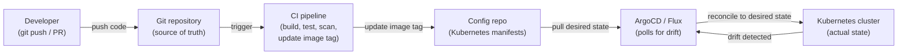
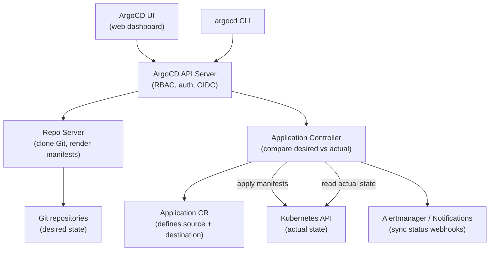
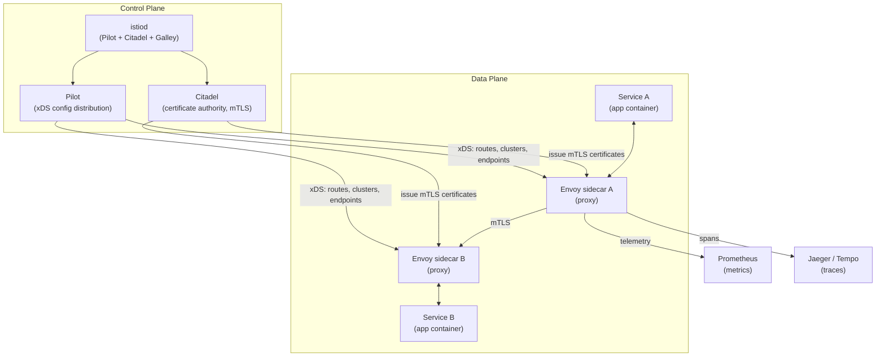
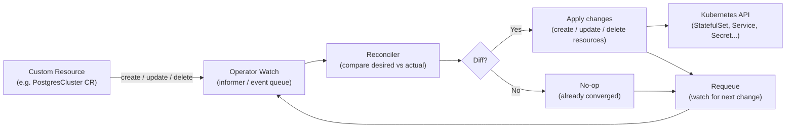
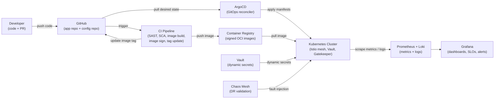

# Module 15: Advanced Topics & Capstone

> **Course**: DevOps Career Path  
> **Audience**: Intermediate → Advanced  
> **Prerequisites**: All previous modules (01–14)

[](https://creativecommons.org/licenses/by-nc-sa/4.0/)      

---

## Table of Contents

1. [Overview](#overview)
2. [Learning Objectives](#learning-objectives)
3. [GitOps](#gitops)
   - [GitOps Principles](#gitops-principles)
   - [ArgoCD](#argocd)
   - [Flux CD](#flux-cd)
   - [ArgoCD vs Flux](#argocd-vs-flux)
4. [Service Mesh](#service-mesh)
   - [Why Service Mesh?](#why-service-mesh)
   - [Istio](#istio)
   - [Linkerd](#linkerd)
   - [Istio vs Linkerd](#istio-vs-linkerd)
5. [Kubernetes Operators & CRDs](#kubernetes-operators--crds)
6. [Advanced Terraform Patterns](#advanced-terraform-patterns)
7. [Platform Engineering](#platform-engineering)
8. [FinOps — Cloud Cost Management](#finops--cloud-cost-management)
9. [AI & LLMs in DevOps](#ai--llms-in-devops)
10. [Advanced: Chaos Engineering](#advanced-chaos-engineering)
11. [Capstone Project](#capstone-project)
12. [Career Paths & Certification Roadmap](#career-paths--certification-roadmap)
13. [Tools & Commands Reference](#tools--commands-reference)
14. [Hands-On Labs](#hands-on-labs)
15. [Further Reading](#further-reading)

---

## Overview

This final module covers advanced concepts that separate senior DevOps engineers and platform engineers from generalists: GitOps for declarative continuous delivery, service meshes for zero-trust networking at the application layer, Kubernetes Operators for extending the platform, and cloud cost engineering. The module culminates in a **capstone project** that integrates all 15 modules into a production-grade deployment pipeline.

[↑ Back to TOC](#table-of-contents)

---

## Learning Objectives

By the end of this module, you will be able to:

- Explain GitOps principles and implement them with ArgoCD and Flux
- Deploy and configure ArgoCD for multi-cluster GitOps
- Install Istio/Linkerd and implement mTLS, traffic management, and observability
- Explain what Kubernetes Operators are and build a basic one
- Apply advanced Terraform patterns (workspaces, modules, remote state, Terragrunt)
- Describe Platform Engineering and Internal Developer Platforms (IDPs)
- Implement basic FinOps practices and right-size cloud resources
- Complete the capstone project integrating all DevOps disciplines
- Design and execute chaos experiments to validate system resilience

[↑ Back to TOC](#table-of-contents)

---

## GitOps

### GitOps Principles

GitOps is an operational model where the **entire desired system state is stored in Git** and changes are applied automatically by a reconciliation loop.

The pull model is the defining safety property of GitOps. In a traditional push-based pipeline, the CI system needs cluster credentials to deploy — it connects to the cluster and applies changes. This means every CI job is a potential lateral movement path if a runner is compromised, and every secret rotation requires updating CI configuration. In a GitOps pull model, the cluster's own agent (ArgoCD or Flux) reaches out to Git and applies changes from inside the cluster network. The cluster credentials never leave the cluster. A compromised CI runner cannot deploy to production by itself; it can only propose a change by updating Git, which still requires a merge review.

Drift detection and auto-correction are what separate GitOps from simply using Git as a deployment trigger. A GitOps agent continuously compares the desired state in Git against the actual state in the cluster. When they diverge — whether because a developer edited something directly with `kubectl`, an autoscaler changed a replica count, or a canary deployment left behind resources — the agent detects the drift and can automatically correct it. This property ensures that Git remains the genuine source of truth rather than becoming one artifact among many that partially describes the system.

The App-of-Apps pattern solves the bootstrapping problem for large GitOps deployments. Instead of registering every application individually in ArgoCD, you create a single "root" Application that points to a directory containing ArgoCD Application manifests. When ArgoCD syncs the root App, it discovers and creates all the child Applications, which in turn sync their workloads. This means the entire cluster's application portfolio can be bootstrapped from a single `kubectl apply`, and new applications are added to the cluster simply by committing an Application manifest to Git.

The four GitOps principles (from OpenGitOps):

| Principle | Description |
|-----------|-------------|
| **Declarative** | System state described declaratively (YAML, Terraform HCL) |
| **Versioned and immutable** | Git is the single source of truth; history is immutable |
| **Pulled automatically** | Software agents pull state from Git, not pushed from pipelines |
| **Continuously reconciled** | Agents detect and correct drift from desired state |

### GitOps vs traditional CI/CD

```
Traditional (Push):              GitOps (Pull):
CI pipeline builds image    →    CI pipeline builds image
CI pipeline deploys to cluster   CI pipeline pushes to Git repo
(cluster credentials in CI)      Argo/Flux polls Git
                                 Argo/Flux applies changes to cluster
                                 (no cluster creds in CI!)
```



| Principle | Description |
|-----------|-------------|
| **Declarative** | System state described declaratively (YAML, Terraform HCL) |
| **Versioned and immutable** | Git is the single source of truth; history is immutable |
| **Pulled automatically** | Software agents pull state from Git, not pushed from pipelines |
| **Continuously reconciled** | Agents detect and correct drift from desired state |

### GitOps vs traditional CI/CD

```
Traditional (Push):              GitOps (Pull):
CI pipeline builds image    →    CI pipeline builds image
CI pipeline deploys to cluster   CI pipeline pushes to Git repo
(cluster credentials in CI)      Argo/Flux polls Git
                                 Argo/Flux applies changes to cluster
                                 (no cluster creds in CI!)
```

### Repository structure patterns

#### Monorepo pattern

```
infra-repo/
├── apps/
│   ├── frontend/
│   │   ├── base/
│   │   │   ├── deployment.yaml
│   │   │   └── service.yaml
│   │   └── overlays/
│   │       ├── staging/
│   │       │   └── kustomization.yaml
│   │       └── production/
│   │           └── kustomization.yaml
│   └── backend/
│       ├── base/
│       └── overlays/
├── infrastructure/
│   ├── cert-manager/
│   ├── ingress-nginx/
│   └── monitoring/
└── clusters/
    ├── staging/
    └── production/
```

#### Multi-repo (app repo + config repo)

```
app-repo/            config-repo/
├── src/             ├── staging/
├── Dockerfile       │   └── values.yaml   ← updated by CI
└── Helm chart       └── production/
                         └── values.yaml   ← updated by promotion PR
```

[↑ Back to TOC](#table-of-contents)

---

### ArgoCD

ArgoCD is a declarative GitOps continuous delivery tool for Kubernetes.



#### Install ArgoCD

```bash
kubectl create namespace argocd

kubectl apply -n argocd \
  -f https://raw.githubusercontent.com/argoproj/argo-cd/v2.11.0/manifests/install.yaml

# Wait for pods to be ready
kubectl -n argocd wait --for=condition=Ready pod -l app.kubernetes.io/name=argocd-server --timeout=120s

# Get initial admin password
argocd admin initial-password -n argocd

# Port-forward the UI
kubectl port-forward svc/argocd-server -n argocd 8080:443

# Login via CLI
argocd login localhost:8080 --username admin --password <password> --insecure
```

#### Create an Application

```yaml
# ArgoCD Application manifest
apiVersion: argoproj.io/v1alpha1
kind: Application
metadata:
  name: my-api
  namespace: argocd
  finalizers:
    - resources-finalizer.argocd.argoproj.io  # Cascade delete
spec:
  project: default

  source:
    repoURL: https://github.com/myorg/infra-repo.git
    targetRevision: HEAD
    path: apps/my-api/overlays/production

  destination:
    server: https://kubernetes.default.svc
    namespace: production

  syncPolicy:
    automated:
      prune: true      # Delete resources removed from Git
      selfHeal: true   # Revert manual changes to cluster
      allowEmpty: false
    syncOptions:
      - CreateNamespace=true
      - PrunePropagationPolicy=foreground
      - ApplyOutOfSyncOnly=true
    retry:
      limit: 3
      backoff:
        duration: 5s
        factor: 2
        maxDuration: 3m
```

```bash
# CLI — create application
argocd app create my-api \
  --repo https://github.com/myorg/infra-repo.git \
  --path apps/my-api/overlays/production \
  --dest-server https://kubernetes.default.svc \
  --dest-namespace production \
  --sync-policy automated \
  --auto-prune \
  --self-heal

# Sync an app manually
argocd app sync my-api

# Check app status
argocd app get my-api
argocd app list

# Rollback to previous revision
argocd app rollback my-api 1

# Diff current vs desired state
argocd app diff my-api
```

#### ArgoCD ApplicationSet — multi-cluster/multi-env

```yaml
# Deploy the same app to staging and production automatically
apiVersion: argoproj.io/v1alpha1
kind: ApplicationSet
metadata:
  name: my-api-all-envs
  namespace: argocd
spec:
  generators:
    - list:
        elements:
          - env: staging
            cluster: https://staging-cluster.example.com
            revision: develop
          - env: production
            cluster: https://production-cluster.example.com
            revision: main
  template:
    metadata:
      name: 'my-api-{{env}}'
    spec:
      project: default
      source:
        repoURL: https://github.com/myorg/infra-repo.git
        targetRevision: '{{revision}}'
        path: 'apps/my-api/overlays/{{env}}'
      destination:
        server: '{{cluster}}'
        namespace: '{{env}}'
      syncPolicy:
        automated:
          prune: true
          selfHeal: true
```

#### Image Updater — automated image tag promotion

```yaml
# ArgoCD Image Updater watches a container registry and updates the Git repo
# when a new image tag is pushed

# Annotation on the Application
metadata:
  annotations:
    argocd-image-updater.argoproj.io/image-list: my-api=registry.example.com/my-api
    argocd-image-updater.argoproj.io/my-api.update-strategy: semver
    argocd-image-updater.argoproj.io/my-api.allow-tags: regexp:^v[0-9]+\.[0-9]+\.[0-9]+$
    argocd-image-updater.argoproj.io/write-back-method: git
    argocd-image-updater.argoproj.io/git-branch: main
```

[↑ Back to TOC](#table-of-contents)

---

### Flux CD

Flux is the CNCF GitOps toolkit — modular operators for Git sync, Helm, Kustomize, and image automation.

#### Install Flux

```bash
# Install Flux CLI
curl -s https://fluxcd.io/install.sh | bash

# Bootstrap Flux to a GitHub repo
flux bootstrap github \
  --owner=myorg \
  --repository=infra-repo \
  --branch=main \
  --path=clusters/production \
  --personal

# Check Flux components
kubectl -n flux-system get pods

# Check sync status
flux get all
```

#### GitRepository source

```yaml
apiVersion: source.toolkit.fluxcd.io/v1
kind: GitRepository
metadata:
  name: infra-repo
  namespace: flux-system
spec:
  interval: 1m
  url: https://github.com/myorg/infra-repo.git
  ref:
    branch: main
  secretRef:
    name: infra-repo-auth   # SSH key or PAT
```

#### Kustomization (Flux resource, not native Kubernetes)

```yaml
apiVersion: kustomize.toolkit.fluxcd.io/v1
kind: Kustomization
metadata:
  name: my-api
  namespace: flux-system
spec:
  interval: 10m
  path: ./apps/my-api/overlays/production
  prune: true
  sourceRef:
    kind: GitRepository
    name: infra-repo
  targetNamespace: production
  healthChecks:
    - apiVersion: apps/v1
      kind: Deployment
      name: my-api
      namespace: production
  postBuild:
    substituteFrom:
      - kind: Secret
        name: cluster-secrets
```

#### HelmRelease — deploy a Helm chart via Flux

```yaml
apiVersion: helm.toolkit.fluxcd.io/v2beta2
kind: HelmRelease
metadata:
  name: kube-prometheus-stack
  namespace: monitoring
spec:
  interval: 1h
  chart:
    spec:
      chart: kube-prometheus-stack
      version: ">=57.0.0 <58.0.0"
      sourceRef:
        kind: HelmRepository
        name: prometheus-community
        namespace: flux-system
  values:
    grafana:
      adminPassword: changeme
    prometheus:
      prometheusSpec:
        retention: 30d
  install:
    createNamespace: true
  upgrade:
    cleanupOnFail: true
    force: false
```

[↑ Back to TOC](#table-of-contents)

---

### ArgoCD vs Flux

ArgoCD is UI-first and built around a centralised Application model, making it the natural choice for teams that want a visual operations dashboard, clear application ownership, and project-based multi-tenancy with RBAC. The web UI gives platform teams and application owners a shared surface for understanding deployment state, reviewing sync history, and triggering rollbacks — which is valuable in larger organisations where not everyone operates through the CLI.

Flux is toolkit-first and automation-only. There is no built-in web UI; the interface is kubectl, the flux CLI, and Git itself. This makes Flux a better fit for platform engineering teams and SREs who think in terms of composable Kubernetes controllers and want to build automation on top of Flux's primitives rather than consume a complete product. Flux's modular architecture also means you can adopt just the GitRepository and Kustomization controllers without the Helm or image automation controllers if you do not need them. The trade-off is that onboarding non-engineering stakeholders into a Flux workflow is harder because there is no UI to hand them.

In practice, many teams choose based on organisational context rather than pure technical merit. If you have a platform team serving multiple development squads and want a product they can all access, ArgoCD's UI is a meaningful advantage. If you are building a fully automated platform where all interaction happens through Git PRs and your team is comfortable with Kubernetes operator patterns, Flux's composability often wins. Both tools are CNCF-graduated and production-ready; the choice is primarily about workflow and team preference.

| Feature | ArgoCD | Flux |
|---------|--------|------|
| **UI** | Rich web UI | CLI-first (no built-in UI) |
| **Architecture** | Single controller | Modular toolkit |
| **Multi-tenancy** | Projects + RBAC | Kustomization + namespace isolation |
| **Image automation** | Image Updater (separate) | Built-in image automation |
| **Helm support** | Native | HelmRelease CRD |
| **Kustomize** | Native | Native |
| **ApplicationSet** | Yes | GitRepository + path generation |
| **OIDC/SSO** | Built-in | Via Dex sidecar |
| **CNCF graduated** | Yes | Yes |
| **Best for** | Teams wanting a web UI | Operators/programmers, composability |

[↑ Back to TOC](#table-of-contents)

---

## Service Mesh

### Why Service Mesh?

A service mesh adds an infrastructure layer for service-to-service communication — providing mTLS, observability, traffic control, and resilience **without application code changes**.

The decision to adopt a service mesh should weigh capability against operational complexity. Istio — the most feature-rich option — deploys Envoy proxy sidecars into every pod, giving you fine-grained traffic control, mutual TLS, and automatic telemetry. The cost is real: each Envoy sidecar consumes around 50 MB of memory and adds a few milliseconds of latency per request. In a cluster with 100 pods, that is 5 GB of additional memory just for the proxy layer. The control plane components (istiod) add further operational surface area. Teams that have not needed the capabilities that justify this overhead often find themselves spending more time managing Istio than benefiting from it.

Linkerd takes a different philosophy: do a smaller set of things but do them simply and efficiently. The Linkerd proxy is a purpose-built Rust binary rather than the general-purpose Envoy, which makes it significantly smaller (less than 10 MB per proxy) and lower latency. Linkerd covers the most common use cases — automatic mTLS, golden signal metrics per service, traffic splitting for canary deployments — without Istio's full traffic management API surface. For teams that need mTLS and observability but not the advanced traffic routing capabilities of Istio, Linkerd is often the better trade-off.

eBPF-based meshes (Cilium with Hubble, Cilium Service Mesh) represent the emerging direction. Instead of sidecar proxies, they intercept network traffic at the kernel level using eBPF programs, which eliminates the per-pod proxy overhead entirely. This approach has lower latency, lower resource consumption, and no sidecar injection complexity — but it requires a modern Linux kernel and the eBPF ecosystem is still maturing relative to the more established sidecar-based tools.

```
Without service mesh:
  Service A ──────────────────────────────► Service B
  (plaintext, no metrics, no retry logic)

With service mesh (sidecar proxy):
  Service A ──► [Envoy/Linkerd-proxy] ──► [Envoy/Linkerd-proxy] ──► Service B
                      │                           │
                   mTLS ✅                    mTLS ✅
                   Metrics ✅                Metrics ✅
                   Tracing ✅                Tracing ✅
                   Retry ✅                  Circuit break ✅
```

### Service mesh capabilities

| Capability | Description |
|-----------|-------------|
| **mTLS** | Mutual TLS between all services — zero-trust networking |
| **Traffic management** | Canary deployments, A/B testing, fault injection, circuit breaking |
| **Observability** | Golden metrics (rate, errors, duration) per service — automatic |
| **Load balancing** | L7-aware (HTTP/gRPC), plus retries and timeouts |
| **Circuit breaking** | Fail fast when downstream service is degraded |
| **Authorization policies** | Allow/deny traffic based on service identity (SPIFFE) |

[↑ Back to TOC](#table-of-contents)

---

### Istio

Istio is the most feature-rich service mesh, using Envoy proxies as sidecars.



#### Install Istio

```bash
# Download istioctl
curl -L https://istio.io/downloadIstio | ISTIO_VERSION=1.21.0 sh -
export PATH=$PWD/istio-1.21.0/bin:$PATH

# Install with default profile
istioctl install --set profile=default -y

# Verify installation
istioctl verify-install

# Enable sidecar injection for a namespace
kubectl label namespace production istio-injection=enabled

# Check injected sidecars
kubectl get pods -n production -o jsonpath='{range .items[*]}{.metadata.name}: {range .spec.containers[*]}{.name} {end}{"\n"}{end}'
```

#### VirtualService — traffic routing

```yaml
# Route 90% to v1, 10% to v2 (canary)
apiVersion: networking.istio.io/v1beta1
kind: VirtualService
metadata:
  name: my-api
  namespace: production
spec:
  hosts:
    - my-api
  http:
    - match:
        - headers:
            x-canary:
              exact: "true"
      route:
        - destination:
            host: my-api
            subset: v2
    - route:
        - destination:
            host: my-api
            subset: v1
          weight: 90
        - destination:
            host: my-api
            subset: v2
          weight: 10
```

#### DestinationRule — define subsets and circuit breaking

```yaml
apiVersion: networking.istio.io/v1beta1
kind: DestinationRule
metadata:
  name: my-api
  namespace: production
spec:
  host: my-api
  trafficPolicy:
    connectionPool:
      tcp:
        maxConnections: 100
      http:
        h2UpgradePolicy: UPGRADE
        http2MaxRequests: 1000
    outlierDetection:
      consecutive5xxErrors: 5
      interval: 30s
      baseEjectionTime: 30s
      maxEjectionPercent: 50
  subsets:
    - name: v1
      labels:
        version: v1
    - name: v2
      labels:
        version: v2
```

#### AuthorizationPolicy — zero-trust network

```yaml
# Deny all traffic by default in production namespace
apiVersion: security.istio.io/v1beta1
kind: AuthorizationPolicy
metadata:
  name: deny-all
  namespace: production
spec: {}  # Empty spec = deny all
---
# Allow frontend to call my-api
apiVersion: security.istio.io/v1beta1
kind: AuthorizationPolicy
metadata:
  name: allow-frontend-to-api
  namespace: production
spec:
  selector:
    matchLabels:
      app: my-api
  action: ALLOW
  rules:
    - from:
        - source:
            principals: ["cluster.local/ns/production/sa/frontend"]
      to:
        - operation:
            methods: ["GET", "POST"]
            paths: ["/api/*"]
```

#### PeerAuthentication — enforce mTLS

```yaml
# Strict mTLS for entire namespace
apiVersion: security.istio.io/v1beta1
kind: PeerAuthentication
metadata:
  name: default
  namespace: production
spec:
  mtls:
    mode: STRICT   # Reject non-mTLS traffic
```

#### Fault injection — chaos testing

```yaml
# Inject 5 second delay for 10% of requests to test-service
apiVersion: networking.istio.io/v1beta1
kind: VirtualService
metadata:
  name: test-service
spec:
  hosts:
    - test-service
  http:
    - fault:
        delay:
          percentage:
            value: 10
          fixedDelay: 5s
        abort:
          percentage:
            value: 5
          httpStatus: 503
      route:
        - destination:
            host: test-service
```

#### Istio observability

```bash
# Install Kiali dashboard (service mesh observability UI)
kubectl apply -f https://raw.githubusercontent.com/istio/istio/release-1.21/samples/addons/kiali.yaml
kubectl port-forward svc/kiali -n istio-system 20001:20001

# Check mTLS status
istioctl x authz check <pod-name> -n production

# Check proxy configuration
istioctl proxy-config clusters <pod-name> -n production
istioctl proxy-config routes <pod-name> -n production

# Analyze for misconfigurations
istioctl analyze -n production
```

[↑ Back to TOC](#table-of-contents)

---

### Linkerd

Linkerd is a lightweight, CNCF-graduated service mesh focused on simplicity and minimal resource overhead.

#### Install Linkerd

```bash
# Install CLI
curl --proto '=https' --tlsv1.2 -sSfL https://run.linkerd.io/install | sh
export PATH=$PATH:/home/user/.linkerd2/bin

# Pre-flight check
linkerd check --pre

# Install Linkerd control plane
linkerd install --crds | kubectl apply -f -
linkerd install | kubectl apply -f -

# Verify
linkerd check

# Enable injection for a namespace
kubectl annotate namespace production \
  linkerd.io/inject=enabled

# Install Viz (metrics, dashboards)
linkerd viz install | kubectl apply -f -
linkerd viz check

# Open dashboard
linkerd viz dashboard &
```

#### Traffic policy in Linkerd (SMI / HTTPRoute)

```yaml
# Traffic split — 90/10 canary
apiVersion: split.smi-spec.io/v1alpha1
kind: TrafficSplit
metadata:
  name: my-api-canary
  namespace: production
spec:
  service: my-api
  backends:
    - service: my-api-stable
      weight: 900m
    - service: my-api-canary
      weight: 100m
```

```bash
# Check golden metrics per service
linkerd viz stat deployments -n production

# Check per-route metrics
linkerd viz stat routes -n production deploy/my-api

# Top — live traffic view
linkerd viz top deploy/my-api -n production

# Tap — live request inspection
linkerd viz tap deploy/my-api -n production
```

[↑ Back to TOC](#table-of-contents)

---

### Istio vs Linkerd

| Feature | Istio | Linkerd |
|---------|-------|---------|
| **Proxy** | Envoy (C++, feature-rich) | Linkerd2-proxy (Rust, lightweight) |
| **Memory overhead** | ~50MB per sidecar | ~10MB per sidecar |
| **CPU overhead** | Higher | Lower (~10x less) |
| **Learning curve** | Steep (many CRDs) | Gentle |
| **Traffic management** | Very rich (VirtualService, DR) | Basic (SMI, HTTPRoute) |
| **mTLS** | Yes | Yes (default on) |
| **CNCF status** | Graduated | Graduated |
| **Best for** | Complex traffic policies, multi-cluster | Simplicity, resource-constrained, observability |

[↑ Back to TOC](#table-of-contents)

---

## Kubernetes Operators & CRDs

### What is an Operator?

A Kubernetes Operator is a controller that extends the Kubernetes API with domain-specific operational knowledge. Rather than just deploying a stateless application, an Operator understands the lifecycle of a specific piece of software — a database cluster, a message broker, a certificate manager — and automates the day-two operations that would otherwise require human intervention: scaling, backup, restore, version upgrade, failover, and health remediation. The Operator pattern was introduced by CoreOS in 2016 to solve the gap between Kubernetes's generic workload primitives (Deployment, StatefulSet) and the complex operational needs of stateful software.

The reconciliation loop is the core execution model. An Operator's controller watches for Custom Resources (CRs) of a specific kind — say, `PostgresCluster` — and whenever the desired state (what the CR says) diverges from the actual state (what is running in Kubernetes), the reconciler runs and takes actions to close the gap. This is exactly the same model that core Kubernetes controllers use for Deployments and Services; Operators simply apply it to higher-level abstractions. The key principle is idempotency: a reconciler should be able to run repeatedly and always converge to the desired state, regardless of whether the cluster was in a partial or failed state before.

Stateful applications benefit most from the Operator pattern because their operational complexity cannot be expressed with generic Kubernetes primitives alone. A `StatefulSet` can ensure that pods are created in order and given stable storage, but it cannot understand that this particular database should not be upgraded to a new version unless a primary election has completed first, or that a backup must succeed before a node is removed from the cluster. This domain knowledge lives in the Operator's reconciler code — written by people who deeply understand the software being managed. Well-known examples include the Prometheus Operator, the CloudNativePG operator for PostgreSQL, Strimzi for Kafka, and the Elasticsearch ECK operator.

A **Kubernetes Operator** encodes operational knowledge into code — it watches custom resources and reconciles the actual state to the desired state, automating day-2 operations (backups, failovers, upgrades).

```
kubectl apply -f my-database-cluster.yaml
           │
           ▼
     ┌─────────────┐
     │  Operator   │ ← Watches MyDatabase CRD
     │  Controller │
     └──────┬──────┘
            │ Reconcile loop
            ▼
    Creates/manages:
    - StatefulSet
    - Services
    - ConfigMaps
    - Secrets (creds)
     - Backups (CronJob)
     - Failover logic
```



### Custom Resource Definition (CRD)

```yaml
# Define a custom resource type
apiVersion: apiextensions.k8s.io/v1
kind: CustomResourceDefinition
metadata:
  name: myapps.example.com
spec:
  group: example.com
  names:
    kind: MyApp
    listKind: MyAppList
    plural: myapps
    singular: myapp
    shortNames: ["ma"]
  scope: Namespaced
  versions:
    - name: v1alpha1
      served: true
      storage: true
      schema:
        openAPIV3Schema:
          type: object
          properties:
            spec:
              type: object
              required: ["replicas", "image"]
              properties:
                replicas:
                  type: integer
                  minimum: 1
                  maximum: 10
                image:
                  type: string
                port:
                  type: integer
                  default: 8080
            status:
              type: object
              properties:
                readyReplicas:
                  type: integer
                conditions:
                  type: array
                  items:
                    type: object
      subresources:
        status: {}
```

```yaml
# Use the custom resource
apiVersion: example.com/v1alpha1
kind: MyApp
metadata:
  name: my-application
  namespace: production
spec:
  replicas: 3
  image: registry.example.com/my-app:1.2.3
  port: 8080
```

### Build an Operator with Operator SDK (Go)

```bash
# Install Operator SDK
curl -LO https://github.com/operator-framework/operator-sdk/releases/download/v1.34.1/operator-sdk_linux_amd64
chmod +x operator-sdk_linux_amd64 && mv operator-sdk_linux_amd64 /usr/local/bin/operator-sdk

# Scaffold a new operator
mkdir myapp-operator && cd myapp-operator
operator-sdk init --domain example.com --repo github.com/myorg/myapp-operator

# Create a new API/controller
operator-sdk create api \
  --group apps \
  --version v1alpha1 \
  --kind MyApp \
  --resource --controller
```

```go
// controllers/myapp_controller.go (simplified)
package controllers

import (
    "context"
    appsv1 "k8s.io/api/apps/v1"
    corev1 "k8s.io/api/core/v1"
    "k8s.io/apimachinery/pkg/api/errors"
    metav1 "k8s.io/apimachinery/pkg/apis/meta/v1"
    "sigs.k8s.io/controller-runtime/pkg/client"
    ctrl "sigs.k8s.io/controller-runtime"

    appsv1alpha1 "github.com/myorg/myapp-operator/api/v1alpha1"
)

func (r *MyAppReconciler) Reconcile(ctx context.Context, req ctrl.Request) (ctrl.Result, error) {
    // 1. Fetch the MyApp instance
    myapp := &appsv1alpha1.MyApp{}
    if err := r.Get(ctx, req.NamespacedName, myapp); err != nil {
        if errors.IsNotFound(err) {
            return ctrl.Result{}, nil  // Deleted
        }
        return ctrl.Result{}, err
    }

    // 2. Check if Deployment exists
    deploy := &appsv1.Deployment{}
    err := r.Get(ctx, req.NamespacedName, deploy)
    if errors.IsNotFound(err) {
        // 3. Create the Deployment
        deploy = r.deploymentForMyApp(myapp)
        if err := r.Create(ctx, deploy); err != nil {
            return ctrl.Result{}, err
        }
        return ctrl.Result{Requeue: true}, nil
    }

    // 4. Update if replicas differ
    replicas := myapp.Spec.Replicas
    if *deploy.Spec.Replicas != replicas {
        deploy.Spec.Replicas = &replicas
        if err := r.Update(ctx, deploy); err != nil {
            return ctrl.Result{}, err
        }
    }

    // 5. Update status
    myapp.Status.ReadyReplicas = deploy.Status.ReadyReplicas
    r.Status().Update(ctx, myapp)

    return ctrl.Result{}, nil
}
```

### Popular production operators

| Operator | Manages |
|----------|---------|
| **Prometheus Operator** | Prometheus, Alertmanager, ServiceMonitor |
| **cert-manager** | TLS certificates (Let's Encrypt, Vault) |
| **External Secrets Operator** | Sync Vault/AWS/GCP secrets to K8s Secrets |
| **CloudNativePG** | PostgreSQL clusters |
| **Strimzi** | Apache Kafka on Kubernetes |
| **Rook-Ceph** | Distributed storage |
| **Crossplane** | Cloud infrastructure via K8s CRDs |
| **Argo Workflows** | DAG workflow orchestration |

[↑ Back to TOC](#table-of-contents)

---

## Advanced Terraform Patterns

### Module composition

```hcl
# Root module — composes reusable child modules
module "vpc" {
  source  = "./modules/vpc"
  version = "~> 3.0"

  cidr_block       = var.vpc_cidr
  availability_zones = var.azs
  private_subnets  = var.private_subnets
  public_subnets   = var.public_subnets
  enable_nat_gateway = true
  tags             = local.common_tags
}

module "eks" {
  source = "./modules/eks"

  cluster_name    = "${local.prefix}-eks"
  vpc_id          = module.vpc.vpc_id
  subnet_ids      = module.vpc.private_subnet_ids
  cluster_version = "1.29"
  node_groups     = var.node_groups
  tags            = local.common_tags

  depends_on = [module.vpc]
}

module "rds" {
  source = "./modules/rds"

  identifier     = "${local.prefix}-postgres"
  engine         = "postgres"
  engine_version = "15.4"
  instance_class = "db.t3.medium"
  db_subnet_ids  = module.vpc.private_subnet_ids
  vpc_id         = module.vpc.vpc_id
  tags           = local.common_tags
}
```

### Remote state with locking

```hcl
# backend.tf
terraform {
  backend "s3" {
    bucket         = "my-terraform-state"
    key            = "production/eks/terraform.tfstate"
    region         = "us-east-1"
    encrypt        = true
    kms_key_id     = "arn:aws:kms:us-east-1:123456789:key/abc-123"

    # DynamoDB for state locking
    dynamodb_table = "terraform-state-locks"
  }

  required_providers {
    aws = {
      source  = "hashicorp/aws"
      version = "~> 5.0"
    }
  }
}
```

### Terragrunt — DRY infrastructure

```hcl
# terragrunt.hcl (root)
remote_state {
  backend = "s3"
  config = {
    bucket         = "my-terraform-state-${get_aws_account_id()}"
    key            = "${path_relative_to_include()}/terraform.tfstate"
    region         = "us-east-1"
    encrypt        = true
    dynamodb_table = "terraform-locks"
  }
  generate = {
    path      = "backend.tf"
    if_exists = "overwrite_terragrunt"
  }
}

generate "provider" {
  path      = "provider.tf"
  if_exists = "overwrite_terragrunt"
  contents  = <<EOF
provider "aws" {
  region = "${local.aws_region}"
}
EOF
}

locals {
  aws_region = "us-east-1"
  common_vars = read_terragrunt_config(find_in_parent_folders("common.hcl"))
}
```

```
environments/
├── terragrunt.hcl      ← Root config (backend, provider)
├── production/
│   ├── eks/
│   │   └── terragrunt.hcl   ← source = "../../../modules/eks"
│   ├── rds/
│   │   └── terragrunt.hcl
│   └── vpc/
│       └── terragrunt.hcl
└── staging/
    ├── eks/
    │   └── terragrunt.hcl
    └── vpc/
        └── terragrunt.hcl
```

```bash
# Apply all production resources in dependency order
terragrunt run-all apply --terragrunt-working-dir environments/production

# Plan all
terragrunt run-all plan --terragrunt-working-dir environments/production
```

### Terraform testing with Terratest

```go
// test/eks_test.go
package test

import (
    "testing"
    "github.com/gruntwork-io/terratest/modules/terraform"
    "github.com/stretchr/testify/assert"
)

func TestEKSCluster(t *testing.T) {
    t.Parallel()

    terraformOptions := &terraform.Options{
        TerraformDir: "../modules/eks",
        Vars: map[string]interface{}{
            "cluster_name": "test-cluster",
            "cluster_version": "1.29",
        },
    }

    defer terraform.Destroy(t, terraformOptions)
    terraform.InitAndApply(t, terraformOptions)

    clusterName := terraform.Output(t, terraformOptions, "cluster_name")
    assert.Equal(t, "test-cluster", clusterName)

    clusterEndpoint := terraform.Output(t, terraformOptions, "cluster_endpoint")
    assert.NotEmpty(t, clusterEndpoint)
}
```

[↑ Back to TOC](#table-of-contents)

---

## Platform Engineering

Platform Engineering is the discipline of building and operating **Internal Developer Platforms (IDPs)** — self-service infrastructure capabilities that enable development teams to deploy and operate their services without requiring infrastructure expertise.

### IDP capabilities

```
Internal Developer Platform (IDP)

Developer workflow:
  git push → golden path pipeline → production

Self-service capabilities:
  ✅ Provision environments (staging, ephemeral, production)
  ✅ Deploy applications (GitOps + templates)
  ✅ Manage secrets (Vault integration)
  ✅ View logs and metrics (Grafana, Kibana)
  ✅ Create databases (operator-backed)
  ✅ Manage TLS certificates (cert-manager)
  ✅ Access cluster resources (RBAC self-service)
```

### Backstage — developer portal

Backstage (by Spotify, CNCF) is an open platform for building IDPs.

```bash
# Bootstrap Backstage
npx @backstage/create-app@latest

# Structure
backstage/
├── packages/
│   ├── app/      ← Frontend React UI
│   └── backend/  ← Node.js backend
├── plugins/      ← Kubernetes, Grafana, GitHub, etc.
└── catalog-info.yaml
```

```yaml
# catalog-info.yaml — register your service in Backstage
apiVersion: backstage.io/v1alpha1
kind: Component
metadata:
  name: my-api
  description: Order management API
  annotations:
    github.com/project-slug: myorg/my-api
    grafana/dashboard-selector: "my-api"
    backstage.io/kubernetes-id: my-api
    vault.io/secrets-path: secret/myapp/my-api
  tags:
    - production
    - nodejs
    - api
spec:
  type: service
  lifecycle: production
  owner: team-backend
  dependsOn:
    - resource:default/postgres-db
    - component:default/auth-service
  providesApis:
    - my-api-openapi
```

[↑ Back to TOC](#table-of-contents)

---

## FinOps — Cloud Cost Management

### FinOps principles

> **FinOps** = Financial Operations — the practice of bringing financial accountability to variable cloud spending.

```
FinOps lifecycle:
  Inform → Optimize → Operate → Inform → ...

Inform:  Visibility — who is spending what, where, why
Optimize: Reduce waste, right-size, use commitments
Operate:  Continuous cost culture, budget alerts, chargebacks
```

### Cost visibility tools

| Tool | Cloud | Description |
|------|-------|-------------|
| **AWS Cost Explorer** | AWS | Per-service, per-tag, per-account analysis |
| **AWS Trusted Advisor** | AWS | Right-sizing and idle resource recommendations |
| **Azure Cost Management** | Azure | Budget alerts, cost analysis, advisor |
| **GCP Cost Table** | GCP | BigQuery billing export + Looker Studio |
| **Kubecost** | Any K8s | Per-namespace, per-pod cost allocation |
| **Infracost** | All clouds | Terraform cost estimation in CI/CD |
| **OpenCost** | Any K8s | CNCF open-source K8s cost monitoring |

### Right-sizing and waste reduction

```bash
# AWS — find underutilized EC2 instances
aws ce get-rightsizing-recommendation \
  --service EC2 \
  --configuration '{"RecommendationTarget":"CROSS_INSTANCE_FAMILY","BenefitsConsidered":true}'

# Find idle RDS instances
aws cloudwatch get-metric-statistics \
  --namespace AWS/RDS \
  --metric-name DatabaseConnections \
  --statistics Average \
  --period 86400 \
  --start-time $(date -d '30 days ago' --iso-8601) \
  --end-time $(date --iso-8601)

# Kubernetes — find over-provisioned pods with VPA recommendation
kubectl describe vpa my-api -n production

# Kubecost — namespace cost
kubectl cost namespace -n production
```

### Infracost — estimate cost in CI/CD

```yaml
# .github/workflows/infracost.yml
name: Infracost

on:
  pull_request:

jobs:
  infracost:
    runs-on: ubuntu-latest
    steps:
      - uses: actions/checkout@v4
      - name: Setup Infracost
        uses: infracost/actions/setup@v3
        with:
          api-key: ${{ secrets.INFRACOST_API_KEY }}

      - name: Generate Infracost diff
        run: |
          infracost diff \
            --path=terraform/ \
            --format=json \
            --out-file=/tmp/infracost.json

      - name: Post Infracost comment
        uses: infracost/actions/comment@v1
        with:
          path: /tmp/infracost.json
          behavior: update
```

### Savings strategies

| Strategy | Typical Savings | Effort |
|----------|----------------|--------|
| **Reserved Instances / Savings Plans** | 30–72% | Low |
| **Spot Instances** (non-critical workloads) | 70–90% | Medium |
| **Right-sizing** (remove over-provisioning) | 20–40% | Medium |
| **Delete idle resources** | Variable | Low |
| **S3 Intelligent-Tiering** | 20–40% | Low |
| **Auto-shutdown dev/test** (off-hours) | 70% of dev costs | Low |
| **Cross-region data transfer reduction** | Varies | High |

[↑ Back to TOC](#table-of-contents)

---

## AI & LLMs in DevOps

### Current practical applications

| Application | Description | Tools |
|-------------|-------------|-------|
| **Code review** | AI-assisted PR review, security scanning | GitHub Copilot, Cursor |
| **IaC generation** | Generate Terraform/Helm from descriptions | Copilot, Bedrock |
| **Log analysis** | Summarize logs, root cause analysis | Elastic AI, Datadog AI |
| **Runbook automation** | AI-driven incident response | PagerDuty AI, Opsgenie |
| **CI/CD optimization** | Predict flaky tests, optimize pipelines | Various |
| **Documentation** | Auto-generate runbooks and READMEs | Copilot, custom LLMs |
| **ChatOps** | Slack bot → kubectl/AWS queries | AWS Q Developer |

### AI-assisted operations patterns

```bash
# Example: AI-powered log summarization with AWS Bedrock
aws bedrock-runtime invoke-model \
  --model-id anthropic.claude-3-sonnet-20240229-v1:0 \
  --body '{
    "messages": [{
      "role": "user",
      "content": "Analyze these error logs and identify the root cause:\n\n'"$(kubectl logs my-api-pod -n production --tail=100)"'"
    }],
    "max_tokens": 500
  }' \
  --content-type application/json \
  output.json

cat output.json | jq -r '.content[0].text'
```

> **Important**: Never send production logs containing PII or secrets to external AI services. Redact sensitive data before sending to cloud-based LLMs.

[↑ Back to TOC](#table-of-contents)

---

## Advanced: Chaos Engineering

Chaos Engineering is the practice of deliberately injecting failures into a system to validate that it handles them gracefully. Netflix coined the discipline with **Chaos Monkey**; today the tooling has matured significantly.

> "Chaos engineering is not about breaking things randomly. It is about controlled, hypothesis-driven experiments that prove — or disprove — your resilience assumptions."

### The Chaos Engineering Cycle

```
1. Define the steady state
   └── "Normally: P99 latency < 200ms, error rate < 0.1%"

2. Form a hypothesis
   └── "If one replica of payment-service crashes, the system auto-recovers within 30s"

3. Run a controlled experiment
   └── Kill one pod, kill a network link, inject latency

4. Observe — did the system meet the steady state?
   └── Check dashboards, alerts, SLOs

5. Fix weaknesses found
   └── Add retry logic, circuit breakers, more replicas

6. Graduate to production (GameDay)
   └── Run experiments during business hours with on-call team ready
```

### Chaos Mesh — Kubernetes-Native Chaos

Chaos Mesh is a CNCF project that injects faults directly into Kubernetes using CRDs:

```bash
# Install Chaos Mesh
helm repo add chaos-mesh https://charts.chaos-mesh.org
helm upgrade --install chaos-mesh chaos-mesh/chaos-mesh \
  --namespace chaos-mesh \
  --create-namespace \
  --set chaosDaemon.runtime=containerd \
  --set chaosDaemon.socketPath=/run/containerd/containerd.sock
```

**Kill a random pod (PodChaos):**

```yaml
apiVersion: chaos-mesh.org/v1alpha1
kind: PodChaos
metadata:
  name: kill-payment-service-pod
  namespace: production
spec:
  action: pod-kill
  mode: one          # Kill one pod at random
  selector:
    namespaces: [production]
    labelSelectors:
      app: payment-service
  duration: 30s      # Experiment runs for 30 seconds
```

**Inject network latency (NetworkChaos):**

```yaml
apiVersion: chaos-mesh.org/v1alpha1
kind: NetworkChaos
metadata:
  name: slow-database-network
  namespace: production
spec:
  action: delay
  mode: all
  selector:
    namespaces: [production]
    labelSelectors:
      app: postgres
  delay:
    latency: "200ms"
    correlation: "100"
    jitter: "50ms"
  duration: 2m
  direction: to
```

**Exhaust CPU (StressChaos):**

```yaml
apiVersion: chaos-mesh.org/v1alpha1
kind: StressChaos
metadata:
  name: cpu-stress-checkout
  namespace: production
spec:
  mode: one
  selector:
    namespaces: [production]
    labelSelectors:
      app: checkout-api
  stressors:
    cpu:
      workers: 4
      load: 80      # 80% CPU load
  duration: 5m
```

### Litmus Chaos — Workflow-Based Experiments

Litmus provides pre-built chaos experiments via **ChaosHub** and runs them as Kubernetes workflows:

```bash
# Install LitmusChaos
kubectl apply -f https://litmuschaos.github.io/litmus/litmus-operator-v3.0.0.yaml

# Browse experiments at https://hub.litmuschaos.io
# Apply a pod-delete experiment
kubectl apply -f https://hub.litmuschaos.io/api/chaos/3.0.0?file=charts/generic/pod-delete/experiment.yaml
```

### Chaos Experiment in CI/CD (Scheduled GameDay)

```yaml
# .github/workflows/chaos-gameday.yml
name: Weekly Chaos GameDay

on:
  schedule:
    - cron: '0 14 * * 3'    # Every Wednesday at 14:00 UTC
  workflow_dispatch:          # Also allow manual trigger

jobs:
  chaos-experiment:
    runs-on: ubuntu-latest
    environment: staging      # Requires manual approval before running
    steps:
      - uses: actions/checkout@v4

      - name: Configure kubectl
        uses: azure/k8s-set-context@v3
        with:
          kubeconfig: ${{ secrets.KUBECONFIG_STAGING }}

      - name: Capture steady state (before)
        run: |
          P99=$(kubectl exec -n monitoring deploy/prometheus -- \
            promtool query instant \
            'histogram_quantile(0.99, rate(http_request_duration_seconds_bucket[5m]))' \
            | jq -r '.data.result[0].value[1]')
          echo "BASELINE_P99=$P99" >> $GITHUB_ENV

      - name: Apply chaos experiment
        run: kubectl apply -f chaos/pod-kill-payment.yaml

      - name: Wait and observe (90s)
        run: sleep 90

      - name: Validate steady state (after)
        run: |
          P99_AFTER=$(kubectl exec -n monitoring deploy/prometheus -- \
            promtool query instant \
            'histogram_quantile(0.99, rate(http_request_duration_seconds_bucket[5m]))' \
            | jq -r '.data.result[0].value[1]')
          echo "P99 before: $BASELINE_P99 | P99 after: $P99_AFTER"
          # Fail the workflow if latency degraded more than 2x
          python3 -c "assert float('$P99_AFTER') < float('$BASELINE_P99') * 2.0, 'System did NOT recover within SLO'"

      - name: Remove chaos experiment
        if: always()
        run: kubectl delete -f chaos/pod-kill-payment.yaml --ignore-not-found
```

### Chaos Engineering Maturity Model

| Level | Description |
|---|---|
| **1 — Ad hoc** | Manual, unplanned experiments; no hypothesis; learning phase |
| **2 — Hypotheses** | Structured experiments with a defined steady state |
| **3 — Automated** | Chaos runs in CI/CD against staging; blocks release if SLO breached |
| **4 — Production** | Controlled experiments in production during business hours |
| **5 — Continuous** | Always-on chaos in production; auto-healed by platform |

[↑ Back to TOC](#table-of-contents)

---

## Capstone Project

### Project: Production-Grade Microservices Platform

This capstone project integrates every concept from the 15-module course into a single deployable platform. The purpose is not just to produce a working deployment but to internalise the connections between the disciplines: how version control practices from Module 01 feed into CI/CD from Module 03, how container skills from Module 05 underpin Kubernetes from Module 06, and how security from Module 13 must be woven into every earlier decision rather than bolted on at the end.

The GitOps layer (Module 15) is the thread that stitches everything together. Infrastructure declared as Terraform (Module 08) is committed to Git. Kubernetes manifests managed by Ansible (Module 09) are committed to a config repository. ArgoCD watches that config repository and ensures the cluster always reflects what is in Git. CI/CD pipelines (Module 03) are triggered by application code changes, run security scans (Module 13), build container images (Module 05), push them to a registry, and update the image tag in the config repository — which ArgoCD then reconciles. Every step is auditable, reversible, and automated.

Monitoring and observability (Modules 11 and 12) provide the feedback loop that makes this platform trustworthy. Prometheus collects metrics from all services, Loki collects structured logs, and Grafana provides dashboards and alerting. SLOs define what "working" means for each service. Chaos engineering (Module 14, Module 15) validates that the HA architecture actually survives the failures it was designed to survive. Vault (Module 13) manages credentials dynamically so no long-lived secret ever sits in a Kubernetes Secret or CI variable in plaintext. All of these capabilities exist not as separate tools but as a unified system where the outputs of each layer are consumed by the next.

### Architecture overview

```
┌─────────────────────────────────────────────────────────────────────┐
│                     CAPSTONE ARCHITECTURE                           │
│                                                                     │
│  GitHub Repo (GitOps)                                               │
│      │                                                              │
│      ▼                                                              │
│  GitHub Actions CI Pipeline                                         │
│  [SAST] → [SCA] → [Build] → [Image Scan] → [Push] → [Update GitOps]│
│                                                │                    │
│                                                ▼                    │
│  ArgoCD (GitOps)                               │                    │
│  ┌──────────────────────────────────────────┐  │                    │
│  │     Kubernetes Cluster (k3s/EKS)         │  │                    │
│  │                                          │  │                    │
│  │  Istio Service Mesh (mTLS + telemetry)   │  │                    │
│  │                                          │  │                    │
│  │  production namespace:                   │  │                    │
│  │  ┌──────────┐  ┌──────────┐             │  │                    │
│  │  │ frontend │  │   api    │             │  │                    │
│  │  └──────────┘  └──────────┘             │  │                    │
│  │                    │                    │  │                    │
│  │  ┌─────────────────▼──────────────────┐ │  │                    │
│  │  │  PostgreSQL (CloudNativePG operator)│ │  │                    │
│  │  └────────────────────────────────────┘ │  │                    │
│  │                                          │  │                    │
│  │  monitoring namespace:                   │  │                    │
│  │  Prometheus + Grafana + Loki + Promtail  │  │                    │
│  │                                          │  │                    │
│  │  security:                               │  │                    │
│  │  Vault + Gatekeeper + Falco              │  │                    │
│  └──────────────────────────────────────────┘  │                    │
└─────────────────────────────────────────────────────────────────────┘
```



### Project components

#### Component 1: Application (Module 01–04 skills)

```
3-tier application:
  - Frontend: Static React app (nginx container)
  - API: REST API (Node.js / Python)
  - Database: PostgreSQL
```

#### Component 2: Container images (Module 05)

```dockerfile
# Secure, multi-stage Dockerfile for API
FROM node:20-alpine AS builder
WORKDIR /app
COPY package*.json .
RUN npm ci --production

FROM node:20-alpine AS runtime
RUN addgroup -g 1001 appgroup && adduser -u 1001 -G appgroup -S appuser
WORKDIR /app
COPY --from=builder --chown=appuser:appgroup /app/node_modules ./node_modules
COPY --chown=appuser:appgroup . .
USER appuser
EXPOSE 3000
CMD ["node", "server.js"]
```

#### Component 3: Kubernetes manifests (Module 06)

```
k8s/
├── base/
│   ├── namespace.yaml
│   ├── deployment-frontend.yaml
│   ├── deployment-api.yaml
│   ├── service-frontend.yaml
│   ├── service-api.yaml
│   ├── ingress.yaml
│   ├── hpa.yaml
│   └── pdb.yaml
└── overlays/
    ├── staging/
    │   └── kustomization.yaml  ← 1 replica, staging namespace
    └── production/
        └── kustomization.yaml  ← 3 replicas, resource limits
```

#### Component 4: IaC (Module 08)

```hcl
# Terraform to provision:
# - VPC with public/private subnets
# - EKS cluster (or k3s on EC2)
# - RDS PostgreSQL (or CloudNativePG operator)
# - S3 bucket for backups
# - Route53 hosted zone
# - ACM TLS certificate
```

#### Component 5: CI/CD pipeline (Module 10 + 13)

```yaml
# .github/workflows/main.yml
# Stages:
# 1. Test (unit + integration)
# 2. SAST (Semgrep)
# 3. SCA (Trivy fs)
# 4. Build Docker image
# 5. Scan image (Trivy image)
# 6. Push to registry (ghcr.io)
# 7. Sign image (Cosign)
# 8. Update image tag in GitOps repo (argocd-image-updater or manual PR)
```

#### Component 6: GitOps (Module 15)

```yaml
# ArgoCD Application watching the GitOps repo
# Auto-sync enabled
# Pruning + self-heal enabled
# ApplicationSet for staging + production
```

#### Component 7: Monitoring (Module 11)

```
- kube-prometheus-stack (Prometheus + Grafana + Alertmanager)
- Node Exporter on all nodes
- Custom ServiceMonitor for the API (/metrics endpoint)
- Grafana dashboards:
    - Kubernetes cluster overview
    - API golden signals (rate, errors, duration)
    - Business metrics (orders/sec, revenue)
- Alerts:
    - HighErrorRate (> 1% errors for 5min)
    - HighLatency (p99 > 500ms)
    - PodCrashLooping
    - DiskSpaceLow
```

#### Component 8: Logging (Module 12)

```
- Loki + Promtail DaemonSet
- JSON structured logging from API
- Grafana Explore for log queries
- Loki alert rule: error rate > 0.5/sec
```

#### Component 9: Security (Module 13)

```
- Vault for secrets (DB credentials, API keys)
- Vault Agent sidecar for secret injection
- Gatekeeper policies:
    - RequireRunAsNonRoot
    - AllowedRegistries (ghcr.io only)
    - RequireResourceLimits
- NetworkPolicy: default deny, only allow needed paths
- Falco DaemonSet for runtime security
- Pre-commit hooks: Gitleaks, Semgrep
```

#### Component 10: HA & DR (Module 14)

```
- Multiple replicas with PodDisruptionBudget
- TopologySpreadConstraints (spread across AZs)
- PostgreSQL automated daily backups to S3
- Backup verification CronJob (restore + row count check)
- Velero for Kubernetes object backup
- DR runbook document
```

### Acceptance criteria

```
✅ Application accessible at https://capstone.example.com
✅ All CI/CD stages pass (test, scan, build, sign, push)
✅ ArgoCD shows all apps Healthy + Synced
✅ Istio mTLS enforced (verify with: istioctl x authz check)
✅ Vault serving dynamic DB credentials (not static secrets in K8s)
✅ Grafana dashboard showing API golden signals with live data
✅ Loki showing structured JSON logs from API
✅ Alertmanager → Slack notification when error rate is elevated
✅ Gatekeeper blocks deployment of root container
✅ NetworkPolicy blocks frontend→database direct traffic
✅ Daily database backup runs successfully
✅ Backup restore tested and documented in runbook
✅ Trivy image scan: zero CRITICAL vulnerabilities
✅ DR runbook complete with step-by-step failover procedure
✅ Estimated monthly cost documented (Infracost output)
```

### Project deliverables

```
github.com/yourname/devops-capstone/
├── README.md              ← Architecture diagram, setup instructions
├── app/                   ← Application source code
├── docker/                ← Dockerfile(s)
├── k8s/                   ← Kubernetes manifests (base + overlays)
├── terraform/             ← Infrastructure as Code
├── .github/workflows/     ← CI/CD pipelines
├── monitoring/            ← Grafana dashboards, alerting rules
├── security/              ← Vault policies, Gatekeeper templates
├── runbooks/              ← DR runbook, incident runbooks
└── docs/                  ← Architecture decisions, cost analysis
```

[↑ Back to TOC](#table-of-contents)

---

## Career Paths & Certification Roadmap

### DevOps career tracks

```
DevOps Engineer
    ├── Platform Engineer / SRE
    ├── Cloud Architect
    ├── Security Engineer (DevSecOps)
    └── ML Ops Engineer
```

### Certification roadmap

#### Foundational

| Cert | Provider | Covers |
|------|----------|--------|
| **AWS Cloud Practitioner** | AWS | Cloud basics |
| **Linux Essentials** | LPI | Linux fundamentals |
| **Kubernetes and Cloud Native Associate (KCNA)** | CNCF | K8s concepts |

#### Associate / Professional

| Cert | Provider | Covers |
|------|----------|--------|
| **AWS Solutions Architect Associate** | AWS | Architecture best practices |
| **AWS DevOps Engineer Professional** | AWS | CI/CD, IaC, monitoring |
| **CKA — Certified Kubernetes Administrator** | CNCF | K8s administration |
| **CKAD — Certified Kubernetes App Developer** | CNCF | K8s workloads |
| **HashiCorp Terraform Associate** | HashiCorp | IaC with Terraform |
| **RHCE — Red Hat Certified Engineer** | Red Hat | Linux + Ansible |

#### Advanced

| Cert | Provider | Covers |
|------|----------|--------|
| **CKS — Certified Kubernetes Security Specialist** | CNCF | K8s security |
| **AWS Solutions Architect Professional** | AWS | Advanced architecture |
| **Google Professional Cloud DevOps Engineer** | GCP | GCP DevOps |
| **HashiCorp Vault Associate** | HashiCorp | Secrets management |

### Recommended learning path

```
Month 1-3:  Linux (Module 01-03) + CKA study
Month 3-6:  Docker/K8s (Module 05-06) + CKA exam
Month 6-9:  Cloud + IaC (Module 07-08) + Terraform Associate
Month 9-12: CI/CD + Monitoring (Module 10-11) + AWS DevOps Engineer
Month 12+:  Security + Capstone + CKS
```

[↑ Back to TOC](#table-of-contents)

---

## Tools & Commands Reference

### ArgoCD

```bash
argocd app list
argocd app get <app-name>
argocd app sync <app-name>
argocd app diff <app-name>
argocd app rollback <app-name> <revision>
argocd app history <app-name>
argocd app delete <app-name>
argocd cluster list
argocd repo list
```

### Flux

```bash
flux get all
flux get sources git
flux get kustomizations
flux get helmreleases -A
flux reconcile source git infra-repo
flux reconcile kustomization my-api
flux logs --follow
flux check
```

### Istio

```bash
istioctl install --set profile=default
istioctl verify-install
istioctl analyze -n production
istioctl proxy-config clusters <pod> -n production
istioctl proxy-config routes <pod> -n production
istioctl x authz check <pod> -n production
istioctl dashboard kiali
istioctl dashboard jaeger
```

### Linkerd

```bash
linkerd check
linkerd viz stat deployments -n production
linkerd viz top deploy/my-api -n production
linkerd viz tap deploy/my-api -n production
linkerd viz dashboard
linkerd viz edges deployment -n production
```

[↑ Back to TOC](#table-of-contents)

---

## Hands-On Labs

### Lab 1 — ArgoCD GitOps Deployment (Intermediate)

**Goal**: Deploy a sample app via ArgoCD and experience self-healing.

```bash
# Install ArgoCD on Minikube
minikube start --cpus=4 --memory=8192
kubectl create namespace argocd
kubectl apply -n argocd -f https://raw.githubusercontent.com/argoproj/argo-cd/v2.11.0/manifests/install.yaml

# Get the initial password
kubectl -n argocd get secret argocd-initial-admin-secret \
  -o jsonpath="{.data.password}" | base64 -d

# Port forward the UI
kubectl port-forward svc/argocd-server -n argocd 8080:443

# Create an Application pointing to the ArgoCD example repo
argocd app create guestbook \
  --repo https://github.com/argoproj/argocd-example-apps.git \
  --path guestbook \
  --dest-server https://kubernetes.default.svc \
  --dest-namespace default \
  --sync-policy automated \
  --self-heal

# Manually delete a deployment — watch ArgoCD restore it
kubectl delete deployment guestbook-ui
# Within 3 minutes, ArgoCD restores it
```

---

### Lab 2 — Istio mTLS and Traffic Splitting (Intermediate)

**Goal**: Install Istio, deploy two versions of a service, and split traffic 90/10.

```bash
# Install Istio
istioctl install --set profile=demo -y
kubectl label namespace default istio-injection=enabled

# Deploy v1 and v2 of a service
kubectl apply -f - << 'EOF'
apiVersion: apps/v1
kind: Deployment
metadata:
  name: hello-v1
spec:
  replicas: 1
  selector:
    matchLabels:
      app: hello
      version: v1
  template:
    metadata:
      labels:
        app: hello
        version: v1
    spec:
      containers:
        - name: hello
          image: hashicorp/http-echo:0.2.3
          args: ["-text=Hello from v1"]
---
apiVersion: apps/v1
kind: Deployment
metadata:
  name: hello-v2
spec:
  replicas: 1
  selector:
    matchLabels:
      app: hello
      version: v2
  template:
    metadata:
      labels:
        app: hello
        version: v2
    spec:
      containers:
        - name: hello
          image: hashicorp/http-echo:0.2.3
          args: ["-text=Hello from v2"]
EOF

# Apply DestinationRule and VirtualService (90/10 split)
# Use examples from this module

# Test traffic distribution
for i in $(seq 1 20); do
  curl -s http://hello-svc/ 
done | sort | uniq -c
# Should show approximately 18x v1, 2x v2
```

---

### Lab 3 — Capstone Project Starter (Advanced)

**Goal**: Begin the capstone project — scaffold the repo structure, CI pipeline, and GitOps setup.

```bash
# 1. Create the repository
mkdir devops-capstone && cd devops-capstone
git init

# 2. Create the application structure
mkdir -p app/{frontend,api} k8s/{base,overlays/{staging,production}} \
          terraform monitoring security runbooks .github/workflows

# 3. Create a minimal API (Python/Node)
# 4. Write a secure Dockerfile
# 5. Create Kubernetes base manifests
# 6. Write GitHub Actions CI pipeline with Trivy scan
# 7. Install ArgoCD on local cluster
# 8. Create ArgoCD Application manifest
# 9. Push code → watch pipeline → watch ArgoCD deploy

# Success criteria:
# git push → GitHub Actions builds + scans image → pushes to ghcr.io
# ArgoCD detects new image → applies to cluster
# App accessible at http://localhost via port-forward
```

[↑ Back to TOC](#table-of-contents)

---

## Further Reading

### GitOps

- [OpenGitOps Principles](https://opengitops.dev/)
- [ArgoCD Documentation](https://argo-cd.readthedocs.io/)
- [Flux Documentation](https://fluxcd.io/flux/)
- [GitOps Tech — Patterns and Best Practices](https://www.gitops.tech/)

### Service Mesh

- [Istio Documentation](https://istio.io/latest/docs/)
- [Linkerd Documentation](https://linkerd.io/2.15/overview/)
- [Envoy Proxy Documentation](https://www.envoyproxy.io/docs/)
- [CNCF Service Mesh Landscape](https://landscape.cncf.io/card-mode?category=service-mesh)

### Operators

- [Kubernetes Operator Pattern](https://kubernetes.io/docs/concepts/extend-kubernetes/operator/)
- [Operator SDK Documentation](https://sdk.operatorframework.io/)
- [OperatorHub.io](https://operatorhub.io/)
- [Programming Kubernetes (O'Reilly)](https://www.oreilly.com/library/view/programming-kubernetes/9781492047094/)

### Platform Engineering

- [CNCF Platform Engineering Maturity Model](https://tag-app-delivery.cncf.io/whitepapers/platform-eng-maturity-model/)
- [Backstage Documentation](https://backstage.io/docs/)
- [Team Topologies (book)](https://teamtopologies.com/)

### FinOps

- [FinOps Foundation](https://www.finops.org/)
- [Kubecost Documentation](https://www.kubecost.com/docs/)
- [Infracost Documentation](https://www.infracost.io/docs/)
- [AWS Cost Optimization Hub](https://aws.amazon.com/aws-cost-management/cost-optimization-hub/)

### Career

- [CNCF Cloud Native Landscape](https://landscape.cncf.io/)
- [roadmap.sh — DevOps Learning Path](https://roadmap.sh/devops)
- [Google SRE Books (free online)](https://sre.google/books/)
- [The Phoenix Project (novel)](https://itrevolution.com/the-phoenix-project/)
- [Accelerate (book — DevOps metrics)](https://itrevolution.com/accelerate-book/)

[↑ Back to TOC](#table-of-contents)

---

## Congratulations!

You have completed the **DevOps Career Path** course. You now have the knowledge and practical skills to:

- Build and operate production Linux infrastructure
- Write automation scripts and manage configuration with Ansible
- Deploy containerized applications with Docker and Podman on Kubernetes
- Provision cloud infrastructure with Terraform and OpenTofu
- Build CI/CD pipelines with GitHub Actions, GitLab CI, and Jenkins
- Monitor systems with Prometheus, Grafana, and Zabbix
- Centralize logs with the ELK Stack and Loki
- Secure infrastructure with DevSecOps practices, Vault, and OPA
- Design HA systems and execute disaster recovery
- Implement GitOps with ArgoCD and Flux
- Manage service-to-service security with Istio or Linkerd

**Next steps:**
1. Complete the capstone project
2. Pursue the CKA certification
3. Build something real — the best way to learn is to deploy
4. Contribute to open-source DevOps tooling
5. Share your knowledge with others

[↑ Back to TOC](#table-of-contents)

---

## Internal Developer Platform (IDP) Design

Platform engineering has emerged as the discipline that sits between traditional DevOps and product engineering. Rather than individual teams each solving the same infrastructure problems, a platform team builds a "golden path" — a paved road that makes the right way to do things also the easy way. The Internal Developer Platform (IDP) is the tangible product that the platform team delivers.

### What an IDP Is and Is Not

```
An IDP IS:
  - A self-service portal where developers provision infrastructure, environments, and services
  - A collection of golden path templates (service scaffolding, deployment pipelines, observability)
  - An abstraction layer that hides infrastructure complexity from application developers
  - A contract: developers follow the golden path, platform team owns reliability

An IDP IS NOT:
  - A single monolithic tool (it is usually 5–15 integrated tools)
  - A replacement for cloud knowledge (developers should still understand what they are building on)
  - Finished (it evolves continuously with developer feedback)
  - Optional for scale-up organisations (after ~20 engineering teams, IDP ROI is clearly positive)
```

### Backstage as an IDP Foundation

Spotify's Backstage is the most widely adopted open-source IDP framework. It provides a service catalogue, software templates, and a plugin ecosystem:

```bash
# Create a new Backstage app
npx @backstage/create-app@latest

# Project structure
backstage/
  packages/
    app/         # Frontend React application
    backend/     # Node.js backend
  plugins/
    catalog/     # Service catalogue
    techdocs/    # Documentation
    scaffolder/  # Golden path templates
  app-config.yaml
```

A golden path template for a new microservice:

```yaml
# backstage/templates/nodejs-service/template.yaml
apiVersion: scaffolder.backstage.io/v1beta3
kind: Template
metadata:
  name: nodejs-microservice
  title: Node.js Microservice
  description: Creates a new Node.js microservice with CI/CD, observability, and Kubernetes deployment
  tags:
    - nodejs
    - microservice
    - kubernetes

spec:
  owner: platform-team
  type: service

  parameters:
    - title: Service Details
      required: [name, description, owner]
      properties:
        name:
          title: Service Name
          type: string
          pattern: '^[a-z][a-z0-9-]*[a-z0-9]$'
          description: Lowercase letters, numbers, and hyphens only
        description:
          title: Description
          type: string
        owner:
          title: Owner Team
          type: string
          ui:field: OwnerPicker
          ui:options:
            allowedKinds: [Group]
        tier:
          title: Service Tier
          type: string
          enum: [tier1, tier2, tier3]
          description: Tier 1 = revenue-critical, Tier 3 = internal tooling

    - title: Infrastructure
      properties:
        minReplicas:
          title: Minimum Replicas
          type: integer
          default: 2
          minimum: 1
          maximum: 10
        enableDatabase:
          title: PostgreSQL Database
          type: boolean
          default: false
        enableCache:
          title: Redis Cache
          type: boolean
          default: false

  steps:
    - id: fetch-template
      name: Fetch Template
      action: fetch:template
      input:
        url: ./skeleton
        values:
          name: ${{ parameters.name }}
          owner: ${{ parameters.owner }}
          tier: ${{ parameters.tier }}
          minReplicas: ${{ parameters.minReplicas }}

    - id: create-repo
      name: Create Repository
      action: publish:github
      input:
        repoUrl: github.com?repo=${{ parameters.name }}&owner=your-org
        defaultBranch: main
        repoVisibility: private
        topics:
          - service
          - ${{ parameters.tier }}

    - id: register-catalog
      name: Register in Catalogue
      action: catalog:register
      input:
        repoContentsUrl: ${{ steps.create-repo.output.repoContentsUrl }}
        catalogInfoPath: /catalog-info.yaml
```

When a developer uses this template, they get within 2 minutes: a new GitHub repository pre-configured with CI/CD, a Kubernetes deployment manifest, an observability setup (Prometheus metrics, structured logging, readiness probe), and a Backstage catalogue entry. The "right way" to create a service is now faster than doing it manually — that is the goal.

### Golden Path Principles

```
Principle 1: Paved roads, not guardrails
  Make the golden path easier than any alternative. If developers work around your platform,
  your platform has failed. Investigate why and fix the friction.

Principle 2: Abstractions that do not leak
  Developers should be able to use the platform without knowing Kubernetes YAML.
  But when things go wrong, the abstraction should not hide the information they need to debug.

Principle 3: Opinions backed by evidence
  "We chose PostgreSQL as the default database" should be backed by reasoning.
  Document the decision and the alternatives. Developers who understand the why
  will make better decisions about when to deviate from the golden path.

Principle 4: Measure platform adoption and developer satisfaction
  Track: how many services use the golden path? What is developer NPS for the platform?
  What percentage of production incidents involve services that deviated from the golden path?
  These metrics justify platform investment to leadership.

Principle 5: Treat developers as customers
  Platform team's product is the IDP. Developers are the customers.
  Run regular office hours. Have a platform support channel. Conduct quarterly NPS surveys.
  Build a community of practice around the platform, not just a ticketing relationship.
```

[↑ Back to TOC](#table-of-contents)

---

## eBPF in Production

eBPF (extended Berkeley Packet Filter) is a technology that allows running sandboxed programs in the Linux kernel without changing kernel source code or loading kernel modules. It has become one of the most significant infrastructure technologies of the past decade, enabling networking, observability, and security capabilities that were previously impossible or extremely costly.

### What eBPF Enables

```
Networking:
  - XDP (eXpress Data Path): packet processing at line rate before the kernel network stack
  - Service mesh data plane (Cilium) with no sidecar proxies
  - Load balancing at the kernel level (eBPF-based kube-proxy replacement)
  - Network policies enforced in the kernel (lower overhead than iptables)

Observability:
  - CPU profiling with zero code changes (Parca, Pyroscope)
  - Distributed tracing without application instrumentation (Tetragon, Hubble)
  - Real-time kernel metrics (cache misses, context switches, TCP retransmits)
  - File system I/O tracing at the syscall level

Security:
  - Syscall filtering (seccomp-bpf) at the application level
  - Runtime threat detection (Tetragon, Falco eBPF probe)
  - Network traffic inspection without routing through a proxy
  - Immutable audit logs of all sensitive syscalls
```

### Cilium: eBPF-Based Kubernetes Networking

Cilium replaces kube-proxy and provides eBPF-native networking with significant performance advantages:

```yaml
# Install Cilium with kube-proxy replacement
helm install cilium cilium/cilium \
  --namespace kube-system \
  --set kubeProxyReplacement=strict \
  --set k8sServiceHost=<API_SERVER_IP> \
  --set k8sServicePort=6443 \
  --set hubble.relay.enabled=true \
  --set hubble.ui.enabled=true \
  --set prometheus.enabled=true \
  --set operator.prometheus.enabled=true
```

Cilium NetworkPolicy with Layer 7 (HTTP) enforcement — something iptables-based policies cannot do:

```yaml
apiVersion: cilium.io/v2
kind: CiliumNetworkPolicy
metadata:
  name: payment-service-l7
spec:
  endpointSelector:
    matchLabels:
      app: payment-service
  ingress:
    - fromEndpoints:
        - matchLabels:
            app: checkout-service
      toPorts:
        - ports:
            - port: "3000"
              protocol: TCP
          rules:
            http:
              - method: POST
                path: /api/v1/payments
              - method: GET
                path: /api/v1/payments/[0-9]+
    # All other HTTP methods/paths to payment-service are denied
    # even from checkout-service
```

Hubble (Cilium's observability component) provides real-time visibility into service-to-service traffic:

```bash
# View traffic flows
hubble observe --namespace production --follow

# Service dependency map
hubble observe --namespace production \
  --type l7 \
  --output json \
  | jq '{from: .source.labels["k8s:app"], to: .destination.labels["k8s:app"], method: .l7.http.method}'

# Identify services making unexpected cross-namespace calls
hubble observe --all-namespaces \
  --type drop \
  --output json
```

### Continuous Profiling with Parca

Continuous profiling collects CPU and memory profiles from production processes constantly, at negligible overhead (~1%), enabling you to understand what code is actually running and how expensive it is:

```bash
# Deploy Parca agent as a DaemonSet
kubectl apply -f https://github.com/parca-dev/parca-agent/releases/latest/download/kubernetes-manifest.yaml

# Parca agent uses eBPF to collect profiles without code changes
# Profiles are available in the Parca UI showing:
# - Which functions consume the most CPU across your entire fleet
# - Memory allocation hotspots
# - Goroutine/thread blocking analysis
# - Differential profiles: what changed between version A and version B?
```

The practical value: a SaaS company deploying continuous profiling discovers that 22% of their payment service's CPU is consumed by JSON serialisation in a hot path. A one-line change (use a faster JSON library, or pre-serialise static responses) reduces CPU usage by 15%, allowing them to reduce the payment service's pod count from 12 to 10 — a direct cost saving discovered from production data, not benchmarks.

[↑ Back to TOC](#table-of-contents)

---

## Platform Engineering Maturity

Platform engineering is not a team structure — it is a capability. Organisations progress through recognisable stages as they invest in platform capabilities:

```
Stage 1: Wild West
  Every team maintains their own infrastructure, CI/CD, and deployment tooling.
  Heroes do heroics; knowledge is tribal; on-boarding takes months.
  Sign you are here: "only John knows how that works"

Stage 2: Shared Tools, No Product Mindset
  A central team provides shared tools (Jenkins, Artifactory, shared Kubernetes cluster).
  But the tools are maintained reactively, documentation is sparse, and developers
  must work around frustrating limitations.
  Sign you are here: developers file tickets to the platform team for every environment change

Stage 3: Platform as a Product
  The platform team has a roadmap, conducts developer surveys, and measures adoption.
  Self-service portals exist for common tasks (new service, database, environment).
  Golden path templates reduce new service setup from weeks to hours.
  Sign you are here: new engineers can ship their first change in under a day

Stage 4: Internal Developer Platform
  A complete IDP with service catalogue, software templates, docs portal.
  Developer experience (DX) metrics are tracked: deployment frequency, on-boarding time.
  Platform abstractions are stable enough that developers rarely need to touch raw Kubernetes.
  Sign you are here: developers describe the platform as "delightful" (yes, this is the goal)

Stage 5: Platform as Competitive Advantage
  The platform is a moat: faster shipping, higher reliability, lower cognitive load.
  Top engineers choose your company partly because of the quality of the platform.
  Platform capabilities are reusable across business lines or open-sourced as community tools.
  Sign you are here: your talks about your platform are standing-room-only at conferences
```

Getting from Stage 2 to Stage 3 is the most impactful investment most organisations can make. It requires: a dedicated platform team (not an ops team doing platform work on the side), a product manager or technical PM for the platform, and explicit developer experience metrics.

[↑ Back to TOC](#table-of-contents)

---

## AI/ML Infrastructure for DevOps Engineers

Machine learning workloads have unique infrastructure requirements that are becoming increasingly relevant to DevOps and platform teams as organisations integrate ML models into their products. You do not need to be a data scientist — you need to understand the infrastructure layer.

### GPU Node Pools in Kubernetes

ML training and inference require GPUs. Managing GPU nodes in Kubernetes:

```yaml
# Node pool with GPU nodes (GKE example)
resource "google_container_node_pool" "gpu_pool" {
  name       = "gpu-pool"
  cluster    = google_container_cluster.primary.name
  node_count = 0  # Starts at 0 — autoscales on demand

  autoscaling {
    min_node_count = 0
    max_node_count = 10
  }

  node_config {
    machine_type = "n1-standard-8"
    guest_accelerator {
      type  = "nvidia-tesla-t4"
      count = 1
    }
    oauth_scopes = ["https://www.googleapis.com/auth/cloud-platform"]

    taint {
      key    = "nvidia.com/gpu"
      value  = "present"
      effect = "NO_SCHEDULE"
    }
  }
}
```

```yaml
# ML training job that tolerates the GPU taint
apiVersion: batch/v1
kind: Job
metadata:
  name: model-training-run-42
spec:
  template:
    spec:
      containers:
        - name: trainer
          image: your-org/ml-trainer:v1.2.0
          resources:
            limits:
              nvidia.com/gpu: 1
          env:
            - name: TRAINING_DATA_GCS_PATH
              value: gs://ml-datasets/training-v3
            - name: MODEL_OUTPUT_GCS_PATH
              value: gs://ml-models/run-42
      tolerations:
        - key: nvidia.com/gpu
          operator: Exists
          effect: NoSchedule
      restartPolicy: OnFailure
```

### Model Serving with KServe

KServe provides a standard Kubernetes interface for deploying ML models:

```yaml
apiVersion: serving.kserve.io/v1beta1
kind: InferenceService
metadata:
  name: recommendation-model
  namespace: ml-production
spec:
  predictor:
    sklearn:
      storageUri: gs://ml-models/recommendation-v2.3
      resources:
        requests:
          cpu: "1"
          memory: 2Gi
        limits:
          cpu: "2"
          memory: 4Gi

  # Canary deployment — route 10% of traffic to new model version
  # before full rollout
  canaryTrafficPercent: 10
  canary:
    predictor:
      sklearn:
        storageUri: gs://ml-models/recommendation-v2.4-candidate
```

The DevOps concerns for ML infrastructure are the same as any production service, with additional considerations: model versioning and rollback (models are large binary artefacts, not just code), data pipeline reliability (ML models depend on continuous data refresh), and GPU utilisation monitoring (GPUs are expensive; you need to know if they are sitting idle).

### MLOps Maturity

```
Level 1 — Manual ML
  Data scientists train models on laptops, copy files to S3 manually.
  No reproducibility, no versioning, no monitoring.

Level 2 — ML Pipelines
  Training pipelines automated (Kubeflow, Vertex AI Pipelines, MLflow).
  Model versioning with MLflow Tracking or equivalent.
  Basic model monitoring (input drift detection).

Level 3 — CI/CD for ML
  Model training triggered by data changes or code changes (automated retraining).
  Automated evaluation gates: model only deploys if accuracy > threshold.
  A/B testing of model versions in production.
  Feature store for consistent feature engineering across training and serving.

Level 4 — Automated ML
  Continuous training: models retrain automatically when drift is detected.
  Shadow mode deployment: new model runs in parallel, predictions logged but not served.
  Automated rollback: if model performance degrades, rollback to previous version.
```

[↑ Back to TOC](#table-of-contents)

---

## The DevOps Career Roadmap

You have completed this course. The following roadmap contextualises where you are and where the path leads:

### Junior DevOps Engineer (0–2 years)

```
Core skills developed in this course:
  - Linux: comfortable in the CLI, scripting, process management
  - Containers: can build, run, and debug Docker/Podman containers
  - Kubernetes: can deploy and maintain applications on a cluster
  - CI/CD: can write and maintain pipeline definitions
  - IaC: can write and apply Terraform configurations
  - Monitoring: can set up dashboards and write alert rules

What to build next:
  - Contribute to your team's existing IaC codebase (small PRs, learn from review)
  - Shadow senior engineers on-call (observe incidents, do not drive)
  - Build a personal project: deploy a real application end-to-end with the full stack
  - Get comfortable with one cloud provider's core services (AWS, GCP, or Azure)

First certifications to consider:
  - CKA (Certified Kubernetes Administrator) — validates Kubernetes fundamentals
  - AWS Solutions Architect Associate — validates cloud fundamentals
  - HashiCorp Terraform Associate — validates IaC skills
```

### Mid-Level DevOps / Platform Engineer (2–5 years)

```
New skills to develop:
  - Platform thinking: designing self-service systems, not just operating infrastructure
  - Security: threat modelling, secrets management, RBAC design
  - Reliability: SLOs, error budgets, incident response, chaos engineering
  - Multi-team coordination: working across teams on shared infrastructure
  - Cost engineering: understanding and optimising cloud spend

Responsibilities that indicate growth:
  - Leading an on-call rotation
  - Designing and implementing a significant infrastructure change end-to-end
  - Writing technical design documents and getting them approved
  - Mentoring junior engineers
  - Driving post-incident reviews and tracking action items to completion

Certifications to consider:
  - CKS (Certified Kubernetes Security Specialist)
  - AWS Solutions Architect Professional
  - CKAD (Certified Kubernetes Application Developer — understand the developer perspective)
```

### Senior Platform / Staff Engineer (5+ years)

```
New skills to develop:
  - Organisational influence: shaping engineering culture, not just individual systems
  - System design at scale: designing for 10× current load, multi-region, multi-cloud
  - Vendor evaluation and build-vs-buy decisions
  - Defining and measuring developer experience
  - Communicating technical strategy to non-technical stakeholders

Signs you are operating at this level:
  - Other engineers consult you for architectural decisions
  - You are driving multi-quarter roadmaps, not just sprints
  - You have defined and launched significant platform improvements that changed how engineers work
  - You are able to explain infrastructure trade-offs to product managers and executives clearly

Career paths from here:
  - Staff/Principal Engineer (IC track): deeper technical expertise, cross-org influence
  - Engineering Manager (management track): team leadership, hiring, career development
  - Head of Platform / VP Infrastructure: organisational leadership, budget ownership
  - Startup CTO/VP Engineering: early-stage technical leadership
  - Independent consultant: advisory work for multiple companies
```

### Building in Public

The fastest career accelerator available to you is making your work visible:

```
Write:
  - Post-incident reviews (anonymised) — demonstrate analytical thinking
  - Technical deep-dives on tools you have mastered — demonstrate expertise
  - Architecture decision records — demonstrate systems thinking
  - "How we scaled X" narratives — demonstrate impact

Speak:
  - Internal tech talks first — lowest barrier, highest learning value
  - Local meetups (DevOps Days, KubeCon regional events) — grow your network
  - Conference proposals — most conferences actively seek diverse speakers

Build:
  - Open-source contributions to tools you use — build relationships with maintainers
  - Side projects with real users — practice full ownership
  - Blog about what you built and what you learned — compound learning

Network:
  - Be genuinely helpful in Slack communities (Kubernetes, CNCF, local meetups)
  - Review other engineers' open-source PRs
  - Interview at other companies periodically — even without intent to move,
    it calibrates your market value and exposes you to new problems
```

[↑ Back to TOC](#table-of-contents)

---

## Cost-Aware Platform Engineering

Cloud infrastructure costs are real business costs. An engineer who understands and proactively manages cloud spend is more valuable than one who does not. Platform teams are in a unique position to drive cost efficiency across the organisation.

### FinOps Fundamentals

```
FinOps principles:
  - Visibility: every team should see their own cloud costs, broken down by service
  - Accountability: teams are responsible for their cloud spend (not just central IT)
  - Optimisation: costs are continuously reviewed and reduced; waste is not tolerated
  - Forecasting: future spend is predictable, not a surprise at month-end

Tagging strategy — the foundation of cost visibility:
  Every resource must have:
    env:           production / staging / development
    team:          checkout / payments / platform / data
    service:       checkout-api / payment-worker / recommendation-model
    cost-centre:   engineering / data-science / marketing-tech
  
  Enforce with:
    - AWS Config Rules for tag compliance
    - Checkov policy in IaC pipeline
    - Monthly report of untagged resources to engineering leads
```

### Right-Sizing

```bash
# AWS Compute Optimizer recommendations
aws compute-optimizer get-ec2-instance-recommendations \
  --output json \
  | jq '.instanceRecommendations[] | {
      instance: .instanceArn,
      currentType: .currentInstanceType,
      recommendedType: (.recommendationOptions[0].instanceType),
      savings: .recommendationOptions[0].estimatedMonthlySavings.value
    }' \
  | jq 'select(.savings > 10)'  # Show only recommendations with > $10/month savings

# Kubernetes resource right-sizing with VPA (Vertical Pod Autoscaler) in recommendation mode
kubectl apply -f - <<EOF
apiVersion: autoscaling.k8s.io/v1
kind: VerticalPodAutoscaler
metadata:
  name: checkout-service-vpa
spec:
  targetRef:
    apiVersion: apps/v1
    kind: Deployment
    name: checkout-service
  updatePolicy:
    updateMode: "Off"  # Recommendation mode only — don't auto-apply
EOF

# View VPA recommendations
kubectl describe vpa checkout-service-vpa
# Shows: recommended request: cpu=150m (currently 500m), memory=256Mi (currently 512Mi)
# Potential savings: reduce requests, allow tighter bin-packing
```

### Spot/Preemptible Instances for Cost Reduction

```hcl
# Terraform — EKS node group with Spot instances for non-critical workloads
resource "aws_eks_node_group" "spot_workers" {
  cluster_name    = aws_eks_cluster.main.name
  node_group_name = "spot-workers"
  node_role_arn   = aws_iam_role.node.arn
  subnet_ids      = var.private_subnet_ids

  capacity_type  = "SPOT"
  instance_types = ["m5.large", "m5a.large", "m4.large", "m5d.large"]
  # Use multiple instance types — spot market diversification reduces interruption risk

  scaling_config {
    desired_size = 5
    min_size     = 2
    max_size     = 20
  }

  taint {
    key    = "spot-instance"
    value  = "true"
    effect = "NO_SCHEDULE"
  }
}
```

Deploy workloads that tolerate interruption (batch jobs, non-critical background workers, development environments) on Spot instances. Production Tier 1 services should run on On-Demand instances. A typical split: 70% Spot for batch/dev/staging, 100% On-Demand for Tier 1 production. This can reduce compute costs by 40–60%.

### Cost Anomaly Detection

```bash
# AWS Cost Anomaly Detection via CLI
aws ce create-anomaly-monitor \
  --anomaly-monitor '{
    "MonitorName": "Platform-Cost-Monitor",
    "MonitorType": "DIMENSIONAL",
    "MonitorDimension": "SERVICE"
  }'

aws ce create-anomaly-subscription \
  --anomaly-subscription '{
    "SubscriptionName": "Platform-Cost-Alerts",
    "MonitorArnList": ["<monitor-arn>"],
    "Subscribers": [{
      "Address": "platform-alerts@example.com",
      "Type": "EMAIL"
    }],
    "Threshold": 100,
    "ThresholdExpression": {
      "Dimensions": {
        "Key": "ANOMALY_TOTAL_IMPACT_ABSOLUTE",
        "MatchOptions": ["GREATER_THAN_OR_EQUAL"],
        "Values": ["100"]
      }
    },
    "Frequency": "DAILY"
  }'
```

[↑ Back to TOC](#table-of-contents)

---

## Common Mistakes & Pitfalls

- **Building platforms for the current team size** — the platform you need for 5 teams is not the platform you need for 50. Build for the next 18 months, not next month. Abstract decisions that will be painful to change later (GitOps structure, naming conventions, secret management approach).
- **Treating platform as infrastructure, not product** — platforms without product management, developer satisfaction metrics, and regular feedback loops drift out of alignment with developer needs. The platform becomes a liability rather than an asset.
- **Over-engineering the golden path** — a golden path that takes 3 days to navigate is not a path anyone will use. Complexity is the enemy of adoption. Each step in the self-service flow should have a clear purpose and a default that works for 80% of use cases.
- **Ignoring eBPF security risks** — eBPF programs run in the kernel. A bug in an eBPF program can crash the kernel or introduce a security vulnerability. Vet eBPF tools carefully, prefer verified frameworks (Cilium, Falco) over rolling your own, and keep them updated.
- **GPU idle waste** — GPU instances are expensive. Without utilisation monitoring and aggressive scale-to-zero policies, ML teams accumulate significant idle GPU costs. Enforce idle timeout policies on GPU nodes and track GPU utilisation as a cost metric.
- **Not measuring developer experience** — "developers seem happy" is not a metric. Track: time from ticket to first production deployment (new service), deployment frequency per team, CI pipeline duration, on-call pages per engineer per week. These metrics reveal platform friction before engineers start to leave.
- **Skipping ADRs (Architecture Decision Records)** — platform decisions made without documentation leave the next team member asking "why is it done this way?" and making changes that break implicit assumptions. Write an ADR for every significant architectural decision.
- **Copying Netflix/Google without their context** — large tech companies publish sophisticated platform architectures that are appropriate for their scale and organisational structure. Building a multi-region, multi-cluster service mesh before you need it is wasted effort and added complexity. Start simple, scale deliberately.
- **Not deprecating old platforms** — platforms accumulate cruft. The old Jenkins cluster runs alongside the new GitHub Actions runners. The original Terraform state is fragmented across accounts. Technical debt in platform infrastructure is compounded because every team is affected by it. Invest in deprecation as much as new development.
- **Treating cost as someone else's problem** — engineering teams that do not see their cloud costs have no incentive to optimise. Implement showback (cost visibility) before chargeback (cost allocation). Start by giving teams dashboards; culture shifts before financial accountability is enforced.
- **Not building for multi-tenancy from day one** — a platform built for one team will be painful to extend to twenty teams. Multi-tenant patterns (namespace isolation, RBAC per team, cost allocation by team) are much easier to add at the start than to retrofit.
- **Underestimating the people side of platform adoption** — the best platform in the world will not be adopted if engineers do not trust it, do not know it exists, or do not understand its value. Developer advocacy, documentation quality, and responsiveness to issues drive adoption more than feature completeness.
- **Assuming eBPF eliminates the need for application-level observability** — eBPF gives you system-level visibility. Business-level metrics (conversion rate, payment success rate, user session duration) still require application instrumentation. Both layers are needed.
- **No clear ownership boundary between platform and product teams** — "who owns the Kubernetes NetworkPolicy for the checkout service?" should have a clear answer. Ambiguous ownership leads to configuration drift and incident response confusion.
- **Abandoning the capstone project** — the most common completion failure in any course is the capstone. The capstone project is where all your learning integrates into real muscle memory. Block time in your calendar, define a specific end-state ("I will have a working deployment of project X using the full stack"), and ship it.

[↑ Back to TOC](#table-of-contents)

---

## Interview Prep

**Q: What is platform engineering and how does it differ from traditional DevOps?**

A: Traditional DevOps blurs the line between development and operations — teams take ownership of the full lifecycle of their services, including infrastructure. Platform engineering is the next evolution: a dedicated team builds the infrastructure abstractions, golden paths, and self-service tools that let product teams ship without needing deep infrastructure expertise. DevOps is a culture and practice; platform engineering is a product discipline. The platform team has a roadmap, measures developer experience, and treats developers as customers. They are not a gatekeeper or an ops team that responds to tickets — they build and maintain a product (the IDP) that product teams opt into because it makes their lives easier.

**Q: Explain eBPF and give a concrete example of where it is used in production infrastructure.**

A: eBPF (extended Berkeley Packet Filter) is a technology that allows running sandboxed programs in the Linux kernel, triggered by kernel events such as system calls, network packet arrival, or function calls. eBPF programs are verified by the kernel before loading, ensuring they cannot crash the kernel or access arbitrary memory. A concrete production example: Cilium uses eBPF to implement Kubernetes networking (replacing iptables-based kube-proxy) and enforce NetworkPolicies including Layer 7 HTTP rules. eBPF is used for this because it can intercept and act on network packets at the earliest possible point in the kernel stack — before the socket layer — achieving lower latency and higher throughput than iptables-based approaches. Another example: Parca and Pyroscope use eBPF to collect CPU profiles from production processes by hooking into kernel scheduling events, achieving sub-1% overhead continuous profiling.

**Q: How do you evaluate whether an organisation needs an Internal Developer Platform?**

A: Ask these diagnostic questions: How long does it take a new engineer to make their first production deployment? (If > 1 week, platform investment is likely justified.) Do multiple teams solve the same infrastructure problems independently? (If yes, the deduplication value of a platform is high.) How much time do senior engineers spend on infrastructure questions from product teams? (If it is significant, abstraction via a platform frees that time.) Are production incidents frequently caused by infrastructure misconfigurations in product team code? (If yes, golden paths with guardrails would help.) Is cloud spend growing faster than team size? (Shared, optimised infrastructure is more cost-efficient.) An IDP has a clear ROI when engineer-hours spent on infrastructure repetition exceeds the cost of a dedicated platform team — typically around 20–30 product teams.

**Q: What is GitOps and what problem does it solve?**

A: GitOps is the practice of managing infrastructure and application configuration by storing the desired state in a Git repository and using automated reconciliation to bring the actual state into alignment with the desired state. It solves several problems: auditability (every change to production is a Git commit, reviewed, and attributed to a person), disaster recovery (the entire cluster state can be recreated from the Git repository), reduced human error (no direct `kubectl apply` to production — changes go through PR review and automated deployment), and drift detection (the GitOps controller continuously compares actual vs. desired state and alerts on drift). ArgoCD and FluxCD are the leading Kubernetes GitOps tools. The most common implementation: developers merge changes to a `main` branch, ArgoCD detects the change and synchronises the Kubernetes cluster to match the new state, eliminating direct cluster access for day-to-day changes.

**Q: Describe a progressive delivery strategy and when you would use each type.**

A: Progressive delivery is the practice of releasing software to incrementally larger audiences to limit the blast radius of failures. Key strategies: Canary releases route a small percentage of traffic (5–20%) to the new version; if metrics are healthy, traffic gradually increases to 100%. Use for: any production change with meaningful risk, or when you want automated rollback based on SLO signals. Blue-green deployment maintains two identical environments; traffic switches atomically from blue to green. Use for: stateful changes that cannot be incrementally rolled out, database migrations, or when you need instant rollback capability. Feature flags decouple deployment from release; code ships to all users, feature is toggled on for specific segments. Use for: A/B testing, gradual feature rollout by customer segment, or emergency kill switches. Shadow testing runs the new version in parallel with no user impact, comparing outputs. Use for: high-risk algorithmic changes (ML model version, pricing logic) where you want to validate results before any user sees them.

**Q: How does FinOps apply to a platform engineering team?**

A: Platform engineering teams have direct leverage over cloud costs because they control the abstractions all other teams build on. FinOps responsibilities for a platform team include: implementing resource tagging standards and enforcing them via policy-as-code so every resource is attributable to a team and service; building cost visibility dashboards per team (showback before chargeback); right-sizing default resource requests in golden path templates (teams that inherit defaults should get sensible ones, not over-provisioned defaults); managing reserved instances and savings plans at the organisation level; implementing spot/preemptible instance policies for appropriate workloads; and setting up cost anomaly detection alerts. The platform team is uniquely positioned to identify cross-team savings opportunities: if ten teams all over-provision their service accounts or all use a suboptimal database tier, the platform team can identify this in aggregate and address it.

**Q: What is a Service Mesh and when is the operational overhead justified?**

A: A service mesh is an infrastructure layer that handles service-to-service communication, typically implemented as a set of sidecar proxies (Envoy) injected into each pod alongside the application container. It provides: mTLS between all services (transparent encryption and authentication), distributed tracing without application code changes, traffic management (canary routing, circuit breaking, retries, timeouts), and rich network observability (request latency, error rates, by service-pair). The operational overhead is significant: the control plane (Istio/Linkerd) must be maintained and upgraded; sidecar proxies add ~50ms cold-start and ~10MB memory per pod; debugging network issues is more complex through a proxy. Justified when: security requirements mandate mTLS everywhere; you need L7 traffic management without changing application code; you have > 20 services and want centralised observability and policy; or you are replacing multiple per-service approaches to retry logic, circuit breaking, and tracing with a single infrastructure solution.

**Q: How do you approach technical debt in platform infrastructure?**

A: Platform technical debt compounds across every team that uses the platform, so it is higher-impact than application-level debt. Approach: first, make it visible — maintain a technical debt register with rough effort estimates and blast radius assessment. Second, integrate debt reduction into planning: reserve 20% of platform engineering capacity for debt reduction every sprint rather than deferring it indefinitely. Third, prioritise by impact: debt that causes incident response confusion, developer frustration, or security risk is addressed first. Fourth, make improvements incremental and backward-compatible where possible — breaking changes to shared infrastructure are expensive to coordinate. Fifth, retire old systems deliberately: for every new capability you introduce, identify the old capability it replaces and create a deprecation timeline with a migration path. Platform debt examples that are often neglected: fragmented Terraform state, multiple overlapping CI/CD systems, deprecated Kubernetes API versions in use, outdated base images in golden path templates.

**Q: What are the DORA metrics and why do they matter to platform engineers?**

A: DORA (DevOps Research and Assessment) metrics are four key metrics that measure software delivery performance: Deployment Frequency (how often code is deployed to production), Lead Time for Changes (time from commit to production), Change Failure Rate (percentage of deployments that cause incidents or require rollback), and Mean Time to Recovery (how long to recover from a production incident). They matter to platform engineers because the platform team's work directly influences all four: CI/CD pipeline speed affects lead time; deployment automation reliability affects change failure rate; runbook quality and observability tooling affect MTTR; CI/CD friction affects deployment frequency. Tracking DORA metrics gives platform teams quantitative evidence that their work improves delivery performance — essential for justifying investment in platform capabilities to leadership.

**Q: Describe the build-vs-buy decision framework for platform tooling.**

A: Evaluate buy (commercial SaaS), build open-source (adopt and configure), or build custom along several dimensions. Differentiation: does this capability differentiate your product? Rarely yes for infrastructure tooling — prefer buy/adopt. Maintenance burden: custom tooling requires engineers to maintain it forever; the true cost is not the build cost, it is the lifetime maintenance cost. Core competency: your team should be expert at deploying and operating tools, not building them from scratch. Buy indicators: the tool solves a well-defined problem, commercial options are mature, vendor lock-in risk is manageable, cost is justified by time saved. Build-open-source indicators: a mature open-source option exists, you have the operational expertise to run it, customisation needs exceed what commercial options allow. Build-custom indicators: no adequate solution exists, the capability is truly differentiated, you have the long-term engineering capacity to maintain it. Common mistake: building custom tooling because the available options have gaps, without honestly assessing whether the gaps justify the maintenance burden of a custom solution.

**Q: How do you manage secrets in an organisation with many teams and services?**

A: A centralised secrets management approach: HashiCorp Vault (or AWS Secrets Manager at scale) as the secrets store, with the External Secrets Operator synchronising secrets into Kubernetes. Each team has a Vault namespace or AWS Secrets Manager path prefix, with RBAC limiting access to their own secrets. Platform team responsibilities: provisioning Vault namespaces for new teams (IDP template), managing Vault HA and disaster recovery, defining secret naming conventions, enforcing secret rotation policies. Individual team responsibilities: managing their own secrets within their namespace, implementing secret rotation for their services, not sharing secrets across namespaces. Enforcement: Gatekeeper or Kyverno policy that rejects pods with hardcoded environment variable values matching known secret patterns. Regular audit: quarterly review of who has access to which secrets, with access reviews for departing employees and stale service accounts.

**Q: What is your approach to on-boarding a new team onto the platform?**

A: A structured on-boarding: Week 1: walkthrough of the IDP — service catalogue, golden path templates, CI/CD pipelines, observability stack. The team creates their first service using the scaffolding template. Week 2: the team deploys their first real workload to the non-production cluster. Platform engineers pair with the team for their first production deployment. Week 3: the team attends the on-call shadowing programme — they shadow a platform on-call engineer for one week before joining the on-call rotation. Month 1: team is fully self-sufficient on the golden path. Any deviations from the golden path are reviewed by the platform team (not blocked, but reviewed and documented). Month 3: the team participates in the platform feedback forum — their experience directly influences the platform roadmap. The goal is that after 1 month, a new team's only touch-points with the platform team are the feedback forum and genuine escalations — not hand-holding for routine operations.

[↑ Back to TOC](#table-of-contents)

---

## A Day in the Life

You are a staff platform engineer at a Series C SaaS company with 35 product engineering teams and a platform team of 12. Your platform serves 350 engineers across 180 microservices. Tuesday.

07:45 — Standup with the team at 09:00 so you have 75 minutes to work before context-switching starts. You are in the middle of migrating the organisation's CI/CD from a self-managed Jenkins cluster (maintained since the company was 20 people) to GitHub Actions with reusable workflow templates. This is a 6-month project. Today's milestone: the sixth team migrates to GitHub Actions — the checkout team, one of the largest and most complex codebases.

You review the checkout team's GitHub Actions workflow. They have three deviations from the golden path: a custom Docker registry authentication step (they use ECR in a different AWS account), a deployment notification to their own Slack channel, and a performance benchmark step that runs after deployment. All three are legitimate. You approve two of them (the ECR auth and Slack notification are documented exceptions) and decline the third — the performance benchmark should run as a separate GitHub Actions workflow triggered by the deployment, not inline in the deployment pipeline, to keep the critical path latency low. You leave a detailed comment explaining the reasoning and link to the documented pattern. The checkout team responds within 10 minutes: they agree. The pipeline is updated and merged.

09:00 — Standup. Three engineers are blocked: one on a Vault secret engine upgrade that requires a maintenance window (schedule for Thursday), one on a Kubernetes version upgrade hitting a known EKS issue (you have the workaround, you will pair after standup), one on a confusing GitOps sync failure in ArgoCD (you know this pattern — it is a resource finaliser issue, 5 minutes to fix).

10:15 — After standups and quick unblocks, you have a 1:1 with the junior platform engineer you are mentoring. They want to understand how to design a multi-tenancy boundary for a new shared service (ML feature store) that multiple product teams will use. You sketch out three approaches: per-team Kubernetes namespaces with RBAC, a single shared namespace with network policies, and a separate cluster. You walk through the trade-offs: namespace isolation is simpler operationally but provides weaker isolation; separate clusters are strongest but most expensive and complex to operate. For a feature store with sensitive customer data used by the ML team and two other teams, you recommend namespace isolation with strict RBAC and Kyverno policies preventing cross-namespace data access. The junior engineer writes an ADR draft — they will present it to the team Friday.

11:00 — Quarterly platform NPS survey results arrive. Overall score: 62 (up from 54 last quarter). Top complaint: "The golden path templates don't support TypeScript monorepos well — our build times are 18 minutes." This is the third time this has appeared in surveys. You move it to the top of the next sprint's backlog and assign it to the engineer who owns CI/CD templates. You reply to the survey comments personally with a brief acknowledgement and timeline — developers notice when you respond, and it builds trust in the feedback loop.

13:00 — Architecture review for a new service from the data engineering team. They want to deploy a Python-based data pipeline that reads from Kafka and writes to BigQuery. Current golden path assumes Node.js or Go services. You review their proposal and ask three questions: Why Python? (Pandas/PySpark — legitimate, data science ecosystem). Why not use the existing Kafka consumer pattern? (Streaming aggregations that the existing consumer cannot express). Can the BigQuery write be done through the existing data warehouse service? (They already tried; the rate limit is too restrictive for their use case.) You approve the Python deviation with two conditions: they adopt the OpenTelemetry Python SDK (not a custom logger), and they add a `data-pipeline: true` label to their pods so cost attribution is correct. This is documented as an approved exception in the service catalogue.

15:00 — The Jenkins-to-GitHub Actions project: you join a demo call with three teams who have not yet migrated. You show their current Jenkins build times vs. equivalent GitHub Actions times (average 40% faster). You show the reduced maintenance burden: no more Jenkins agents to patch. You address their concern about secrets migration: the External Secrets Operator handles this; their secrets are already in Vault. Two teams commit to migrating next sprint. The third has a compliance requirement that needs a documented exception from security before they can use GitHub-hosted runners — you log the action item and follow up with security tomorrow.

17:00 — You review the week's Grafana dashboard for the platform itself: CI/CD median duration (14.2 minutes, up from 13.8 — worth watching), ArgoCD sync errors (12 today, all resolved, 3 patterns that need root cause analysis), Vault request rate (nominal), platform engineering on-call pages this week (2, both resolved in < 30 minutes). Everything is in the green.

The month's biggest platform investment — the GitHub Actions migration — is 6 teams migrated out of 35. You are on track. Not every day involves heroics. Most days, the platform works. Engineers ship features. The invisible work is the work.

[↑ Back to TOC](#table-of-contents)

---

## Advanced Terraform Patterns

After you know the basics of Terraform, the patterns that separate junior IaC from production-grade IaC become the focus. These are the patterns that enable large organisations to manage complex cloud infrastructure at scale.

### Module Composition and Dependency Injection

Rather than a monolithic root module, compose infrastructure from small, focused modules that accept their dependencies via variables:

```hcl
# modules/service/main.tf — reusable service module
variable "name" {
  description = "Service name"
  type        = string
}

variable "vpc_id" {
  description = "VPC to deploy into — injected by caller"
  type        = string
}

variable "subnet_ids" {
  description = "Private subnets — injected by caller"
  type        = list(string)
}

variable "security_group_ids" {
  description = "Security groups for the service — injected by caller"
  type        = list(string)
}

variable "container_image" {
  type = string
}

variable "environment_variables" {
  type    = map(string)
  default = {}
}

# The module creates: ECS service, task definition, CloudWatch log group, IAM role
# But receives networking and security from the caller — separation of concerns
```

Calling the module:

```hcl
# environments/production/main.tf
module "network" {
  source = "../../modules/network"
  cidr   = "10.0.0.0/16"
  azs    = ["us-east-1a", "us-east-1b", "us-east-1c"]
}

module "checkout_service" {
  source             = "../../modules/service"
  name               = "checkout"
  vpc_id             = module.network.vpc_id
  subnet_ids         = module.network.private_subnet_ids
  security_group_ids = [module.network.app_security_group_id]
  container_image    = "your-org/checkout:${var.app_version}"
}
```

This composition pattern enables: independent testing of modules, reuse across environments (the same module serves production and staging with different variable values), clear ownership boundaries (network team owns the network module, app team configures the service module).

### Terraform Workspaces vs. Directory Structure

Two approaches to managing multiple environments:

```
Workspace approach:
  - Single directory of Terraform code
  - terraform workspace new production
  - terraform workspace select production
  - terraform apply

  Advantages: DRY — one copy of the code
  Disadvantages: workspace switching is error-prone, state is in the same backend bucket,
                 harder to enforce different approval gates per environment

Directory structure approach (recommended for most teams):
  terraform/
    modules/           # Shared reusable modules
    environments/
      development/     # Independent state, can be applied freely
      staging/         # Requires PR approval
      production/      # Requires 2-person approval + change request

  Advantages: clear isolation, independent state, different CI/CD gates per environment
  Disadvantages: some code duplication (mitigated by shared modules)

Recommendation: use directory structure with shared modules for teams > 5 engineers
or for systems with strict change control requirements.
```

### Terragrunt for DRY Environment Configuration

Terragrunt adds a thin wrapper around Terraform that eliminates backend configuration duplication and enables inheritance of common values:

```hcl
# terragrunt.hcl (root)
locals {
  account_id = get_aws_account_id()
  region     = "us-east-1"
}

generate "backend" {
  path      = "backend.tf"
  if_exists = "overwrite_terragrunt"
  contents  = <<EOF
terraform {
  backend "s3" {
    bucket         = "terraform-state-${local.account_id}"
    key            = "${path_relative_to_include()}/terraform.tfstate"
    region         = "${local.region}"
    dynamodb_table = "terraform-locks"
    encrypt        = true
  }
}
EOF
}

# environments/production/checkout-service/terragrunt.hcl
include "root" {
  path = find_in_parent_folders()
}

terraform {
  source = "../../../modules/service"
}

inputs = {
  name            = "checkout"
  container_image = "your-org/checkout:v2.3.1"
  min_replicas    = 5
  max_replicas    = 20
  environment     = "production"
}
```

### Testing Infrastructure Code

Terraform code that is never tested accumulates hidden bugs. Three testing levels:

```bash
# Level 1: Validate syntax and schema
terraform validate
terraform fmt --check --diff

# Level 2: Policy testing with conftest
terraform plan -out=plan.tfplan
terraform show -json plan.tfplan > plan.json
conftest test plan.json --policy ./policies/

# Level 3: Integration testing with Terratest (Go)
# tests/service_test.go
func TestServiceModule(t *testing.T) {
  opts := &terraform.Options{
    TerraformDir: "../modules/service",
    Vars: map[string]interface{}{
      "name":            "test-checkout",
      "container_image": "nginx:latest",
      "environment":     "test",
    },
  }

  defer terraform.Destroy(t, opts)
  terraform.InitAndApply(t, opts)

  serviceURL := terraform.Output(t, opts, "service_url")
  http_helper.HttpGetWithRetry(t, serviceURL+"/health", nil, 200, "ok", 10, 5*time.Second)
}
```

[↑ Back to TOC](#table-of-contents)

---

## Service Mesh Advanced Operations

A service mesh in production requires ongoing operational care beyond the initial installation. Here are the patterns that keep a service mesh healthy and useful rather than a source of incidents.

### Certificate Management and Rotation

Istio rotates workload certificates automatically using the SPIFFE standard. Understanding the certificate chain helps you debug mTLS issues:

```bash
# Inspect a pod's certificate
istioctl proxy-config secret deploy/checkout-service -n production

# Output shows:
# RESOURCE NAME   TYPE           STATUS    VALID CERT  SERIAL NUMBER  NOT AFTER          NOT BEFORE
# default         Cert Chain     ACTIVE    true        abc123         2026-01-15T...     2026-01-14T...
# ROOTCA          CA             ACTIVE    true        xyz789         2030-01-01T...     2023-01-01T...

# Certificate expires? Istio rotates every 24 hours by default
# If a pod does not get a certificate, check:
istiod_logs=$(kubectl logs -n istio-system deploy/istiod | grep "certificate\|cert\|ERROR")

# Manual certificate rotation for the entire mesh
kubectl rollout restart deployment/istiod -n istio-system
```

### Traffic Management Patterns

```yaml
# VirtualService — progressive traffic shifting for canary deployment
apiVersion: networking.istio.io/v1alpha3
kind: VirtualService
metadata:
  name: payment-service
spec:
  hosts:
    - payment-service
  http:
    - match:
        - headers:
            x-canary:
              exact: "true"
      route:
        - destination:
            host: payment-service
            subset: v2
    - route:
        - destination:
            host: payment-service
            subset: v1
          weight: 95
        - destination:
            host: payment-service
            subset: v2
          weight: 5  # 5% of non-canary traffic to v2

# DestinationRule — circuit breaker configuration
apiVersion: networking.istio.io/v1alpha3
kind: DestinationRule
metadata:
  name: payment-service
spec:
  host: payment-service
  trafficPolicy:
    connectionPool:
      http:
        http1MaxPendingRequests: 100
        http2MaxRequests: 1000
    outlierDetection:
      consecutive5xxErrors: 5        # After 5 consecutive errors...
      interval: 10s                  # ...measured over 10 seconds...
      baseEjectionTime: 30s          # ...eject the endpoint for 30 seconds
      maxEjectionPercent: 50         # Never eject more than 50% of endpoints
  subsets:
    - name: v1
      labels:
        version: v1
    - name: v2
      labels:
        version: v2
```

### Observability with Kiali and Jaeger

Kiali provides a service mesh topology visualisation that makes traffic patterns visible:

```bash
# Install Kiali
kubectl apply -f https://raw.githubusercontent.com/istio/istio/release-1.20/samples/addons/kiali.yaml

# Access (port-forward for local access)
kubectl port-forward svc/kiali 20001:20001 -n istio-system

# Kiali shows:
# - Service dependency graph with real-time traffic
# - Error rates per service-to-service connection
# - Latency distribution
# - Traffic routing (which subsets are receiving traffic)
# - mTLS status per connection (padlock icon = encrypted)
```

[↑ Back to TOC](#table-of-contents)

---

## Advanced CI/CD Patterns

Beyond basic pipeline definition, mature CI/CD systems implement patterns that improve reliability, security, and developer experience at scale.

### Reusable Workflow Templates

In a large organisation, every team should not write their own pipeline YAML. Centralised, tested workflow templates reduce duplication and ensure security standards are applied uniformly:

```yaml
# .github/workflows/deploy-service.yml (in the platform/workflows repository)
on:
  workflow_call:
    inputs:
      service-name:
        required: true
        type: string
      environment:
        required: true
        type: string
      image-tag:
        required: true
        type: string
    secrets:
      deploy-token:
        required: true

jobs:
  security-scan:
    runs-on: ubuntu-latest
    steps:
      - name: Scan image for vulnerabilities
        uses: aquasecurity/trivy-action@master
        with:
          image-ref: ghcr.io/your-org/${{ inputs.service-name }}:${{ inputs.image-tag }}
          exit-code: 1
          severity: CRITICAL

  sign-image:
    needs: security-scan
    runs-on: ubuntu-latest
    permissions:
      id-token: write
      packages: write
    steps:
      - name: Sign with cosign keyless
        uses: sigstore/cosign-installer@main
      - run: |
          cosign sign --yes \
            ghcr.io/your-org/${{ inputs.service-name }}:${{ inputs.image-tag }}

  deploy:
    needs: sign-image
    runs-on: ubuntu-latest
    environment: ${{ inputs.environment }}
    steps:
      - name: Deploy via ArgoCD
        run: |
          argocd app set ${{ inputs.service-name }} \
            --kustomize-image ghcr.io/your-org/${{ inputs.service-name }}:${{ inputs.image-tag }}
          argocd app sync ${{ inputs.service-name }} --timeout 300
          argocd app wait ${{ inputs.service-name }} --health --timeout 300
```

Calling the shared workflow from a product team's repository:

```yaml
# In the checkout-service repository
jobs:
  deploy:
    uses: your-org/platform-workflows/.github/workflows/deploy-service.yml@main
    with:
      service-name: checkout-service
      environment: production
      image-tag: ${{ github.sha }}
    secrets:
      deploy-token: ${{ secrets.DEPLOY_TOKEN }}
```

Security scan, image signing, and ArgoCD deployment are now platform-owned responsibilities, not per-team responsibilities. When the security scan adds a new check, it applies to all 35 teams automatically.

### Dynamic Environments

Create ephemeral environments per pull request for isolated testing:

```yaml
# Create a namespace and deploy the PR version to it
- name: Deploy PR Environment
  run: |
    NAMESPACE="pr-${{ github.event.pull_request.number }}"
    
    kubectl create namespace "$NAMESPACE" --dry-run=client -o yaml | kubectl apply -f -
    
    # Annotate for auto-cleanup
    kubectl annotate namespace "$NAMESPACE" \
      pr-number="${{ github.event.pull_request.number }}" \
      created-at="$(date -u +%Y-%m-%dT%H:%M:%SZ)"
    
    # Deploy using helm with PR-specific values
    helm upgrade --install pr-checkout-service ./charts/checkout-service \
      --namespace "$NAMESPACE" \
      --set image.tag="${{ github.sha }}" \
      --set ingress.host="pr-${{ github.event.pull_request.number }}.preview.example.com" \
      --set replicas=1 \
      --set resources.requests.cpu=100m \
      --set resources.requests.memory=128Mi

# Cleanup on PR close
- name: Destroy PR Environment
  if: github.event.action == 'closed'
  run: |
    kubectl delete namespace "pr-${{ github.event.pull_request.number }}" --ignore-not-found
```

Dynamic environments accelerate QA, reduce "works on my machine" problems, and enable product managers to review features before they merge.

[↑ Back to TOC](#table-of-contents)

---

## SRE Practice: Advanced Topics

Site Reliability Engineering at an advanced level moves beyond tools and into the practice of making reliability a product discipline.

### Toil Reduction

Toil is manual, repetitive operational work that scales with service growth. Google's SRE book defines it precisely: work that is manual, repetitive, automatable, tactical, devoid of enduring value, and grows O(n) with service growth. SREs should spend no more than 50% of their time on toil; the rest should go to engineering that reduces future toil.

Identifying toil in your environment:
```
Toil indicators:
  - The same runbook step is executed more than once a week
  - On-call engineers perform the same manual remediation repeatedly
  - Provisioning a new service requires a human to touch > 3 systems
  - Certificate renewals are performed manually
  - Database restores are performed manually for development environments
  - Access requests require a Jira ticket and wait for manual approval

Toil reduction playbook:
  1. Measure: how many times per week is this task performed? How long does it take?
  2. Automate: can this be handled by a script, an operator, or a self-service form?
  3. Eliminate: does this task need to exist? Can the underlying cause be fixed?
  4. Delegate: can a lower-tier team or self-service portal handle this without SRE involvement?

Example: database restore requests for developers
  Before: developer files a ticket → SRE creates snapshot → restores to dev namespace → notifies developer (2 hours, 30 minutes SRE effort)
  After: developer runs `platform restore database <source> <destination>` in Slack → bot validates permissions → initiates automated restore → notifies developer (15 minutes, 0 SRE effort)
  Toil eliminated: ~30 minutes × 20 requests/week = 10 hours/week of SRE time recovered
```

### Capacity Planning at Scale

For large systems, capacity planning requires statistical modelling, not just load testing:

```python
# capacity_model.py — simple capacity projection
import pandas as pd
import numpy as np
from sklearn.linear_model import LinearRegression

# Load historical metrics from Prometheus/Grafana
# (exported as CSV from Grafana)
df = pd.read_csv('metrics/checkout_rps_90days.csv')
df['date'] = pd.to_datetime(df['timestamp'])
df['day_of_year'] = df['date'].dt.dayofyear

# Fit linear regression on daily peak RPS
X = df[['day_of_year']].values
y = df['peak_rps'].values

model = LinearRegression()
model.fit(X, y)

# Project 90 days forward
future_days = np.array([[df['day_of_year'].max() + i] for i in range(1, 91)])
projected_rps = model.predict(future_days)

current_capacity_rps = 2400  # Max safe capacity at current fleet size
days_to_capacity = None

for i, rps in enumerate(projected_rps):
    if rps > current_capacity_rps * 0.8:  # 80% threshold
        days_to_capacity = i + 1
        break

print(f"Current peak RPS: {y[-1]:.0f}")
print(f"Projected peak in 90 days: {projected_rps[-1]:.0f}")
if days_to_capacity:
    print(f"WARNING: Will hit 80% capacity in {days_to_capacity} days")
    print(f"Scale-up required: add {int((projected_rps[days_to_capacity-1] / current_capacity_rps * 1.2 - 1) * 100)}% capacity")
else:
    print("No capacity action required in the next 90 days")
```

### Error Budget Policy

A formal error budget policy makes the implicit trade-off between velocity and reliability explicit and removes it from individual negotiation:

```
Error Budget Policy — Checkout Service
Version: 2.1 | Owner: Checkout Team + Platform Team | Review: Quarterly

Definitions:
  - SLO: 99.9% availability over 28-day rolling window
  - Error Budget: 0.1% of requests (approximately 43 minutes of downtime equivalent per month)
  - Burn Rate: current rate of error budget consumption

Policy:
  Budget consumed 0-25%: No restrictions. Deploy at will.

  Budget consumed 25-50%: Yellow alert.
    - Post weekly error budget status in #checkout-engineering
    - Review recent incidents for patterns
    - No new risky deployments without explicit tech lead approval

  Budget consumed 50-75%: Orange alert.
    - Freeze all non-critical feature deployments
    - Reliability work only until budget returns below 50%
    - Platform team consulted on root causes
    - Weekly sync with engineering manager

  Budget consumed 75-100%: Red alert.
    - Complete deployment freeze (security patches excepted)
    - Incident review with all senior engineers
    - Reliability sprint: next two sprints are 100% reliability work
    - Executive communication if not resolved within 7 days

  Budget exhausted (>100%):
    - Notify VP Engineering
    - SLA review with product and business stakeholders
    - External customer communication if applicable
    - Post-incident review of how this was allowed to happen
```

[↑ Back to TOC](#table-of-contents)

---

## Further Reading (Supplemental)

- [Team Topologies](https://teamtopologies.com/) — Influential book on structuring engineering organisations for fast flow. The conceptual foundation for platform engineering.
- [The Platform Engineering Guide](https://platformengineering.org/blog/what-is-platform-engineering) — Community-maintained resource hub for platform engineers.
- [Backstage Documentation](https://backstage.io/docs/) — Complete guide to the Backstage IDP framework.
- [Learning eBPF](https://isovalent.com/books/learning-ebpf/) — Free O'Reilly book by Liz Rice on eBPF from fundamentals to production use.
- [Cilium Documentation](https://docs.cilium.io/) — Comprehensive guide to eBPF-based Kubernetes networking.
- [Google SRE Workbook](https://sre.google/workbook/table-of-contents/) — Practical SRE patterns from Google engineers.
- [Accelerate: The Science of Lean Software and DevOps](https://itrevolution.com/accelerate-book/) — Research-backed evidence for DevOps practices by Nicole Forsgren, Jez Humble, and Gene Kim.
- [Production Kubernetes](https://www.oreilly.com/library/view/production-kubernetes/9781492092599/) — Advanced Kubernetes patterns for operating at scale.
- [Cloud FinOps](https://www.oreilly.com/library/view/cloud-finops/9781492054610/) — Practical guide to cloud financial management.
- [Designing Distributed Systems](https://www.oreilly.com/library/view/designing-distributed-systems/9781491983638/) — Patterns and paradigms for scalable, reliable systems by Brendan Burns (Kubernetes co-creator).

[↑ Back to TOC](#table-of-contents)

---

*© 2026 UncleJS — Licensed under [CC BY-NC-SA 4.0](https://creativecommons.org/licenses/by-nc-sa/4.0/). Non-commercial use only. Share alike with attribution. See [LICENSE.md](./LICENSE.md).*
