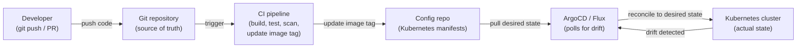
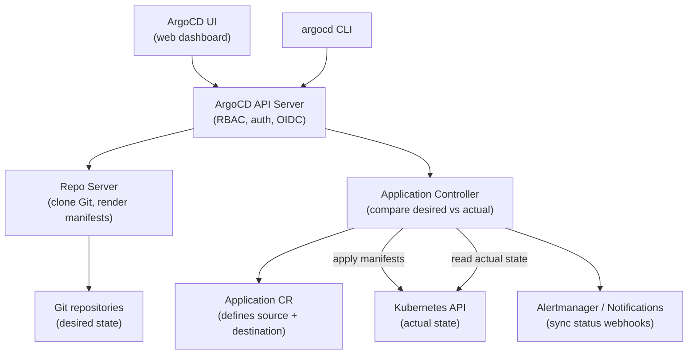
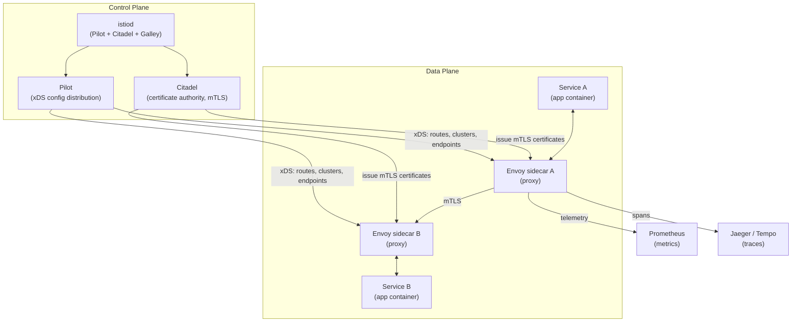
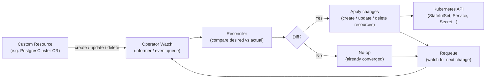
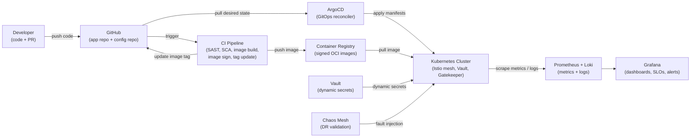

# Module 15: Advanced Topics & Capstone

> **Course**: DevOps Career Path  
> **Audience**: Intermediate → Advanced  
> **Prerequisites**: All previous modules (01–14)

[](https://creativecommons.org/licenses/by-nc-sa/4.0/)      

---

## Table of Contents

1. [Overview](#overview)
2. [Learning Objectives](#learning-objectives)
3. [GitOps](#gitops)
   - [GitOps Principles](#gitops-principles)
   - [ArgoCD](#argocd)
   - [Flux CD](#flux-cd)
   - [ArgoCD vs Flux](#argocd-vs-flux)
4. [Service Mesh](#service-mesh)
   - [Why Service Mesh?](#why-service-mesh)
   - [Istio](#istio)
   - [Linkerd](#linkerd)
   - [Istio vs Linkerd](#istio-vs-linkerd)
5. [Kubernetes Operators & CRDs](#kubernetes-operators--crds)
6. [Advanced Terraform Patterns](#advanced-terraform-patterns)
7. [Platform Engineering](#platform-engineering)
8. [FinOps — Cloud Cost Management](#finops--cloud-cost-management)
9. [AI & LLMs in DevOps](#ai--llms-in-devops)
10. [Advanced: Chaos Engineering](#advanced-chaos-engineering)
11. [Capstone Project](#capstone-project)
12. [Career Paths & Certification Roadmap](#career-paths--certification-roadmap)
13. [Tools & Commands Reference](#tools--commands-reference)
14. [Hands-On Labs](#hands-on-labs)
15. [Further Reading](#further-reading)

---

## Overview

This final module covers advanced concepts that separate senior DevOps engineers and platform engineers from generalists: GitOps for declarative continuous delivery, service meshes for zero-trust networking at the application layer, Kubernetes Operators for extending the platform, and cloud cost engineering. The module culminates in a **capstone project** that integrates all 15 modules into a production-grade deployment pipeline.

[↑ Back to TOC](#table-of-contents)

---

## Learning Objectives

By the end of this module, you will be able to:

- Explain GitOps principles and implement them with ArgoCD and Flux
- Deploy and configure ArgoCD for multi-cluster GitOps
- Install Istio/Linkerd and implement mTLS, traffic management, and observability
- Explain what Kubernetes Operators are and build a basic one
- Apply advanced Terraform patterns (workspaces, modules, remote state, Terragrunt)
- Describe Platform Engineering and Internal Developer Platforms (IDPs)
- Implement basic FinOps practices and right-size cloud resources
- Complete the capstone project integrating all DevOps disciplines
- Design and execute chaos experiments to validate system resilience

[↑ Back to TOC](#table-of-contents)

---

## GitOps

### GitOps Principles

GitOps is an operational model where the **entire desired system state is stored in Git** and changes are applied automatically by a reconciliation loop.

The pull model is the defining safety property of GitOps. In a traditional push-based pipeline, the CI system needs cluster credentials to deploy — it connects to the cluster and applies changes. This means every CI job is a potential lateral movement path if a runner is compromised, and every secret rotation requires updating CI configuration. In a GitOps pull model, the cluster's own agent (ArgoCD or Flux) reaches out to Git and applies changes from inside the cluster network. The cluster credentials never leave the cluster. A compromised CI runner cannot deploy to production by itself; it can only propose a change by updating Git, which still requires a merge review.

Drift detection and auto-correction are what separate GitOps from simply using Git as a deployment trigger. A GitOps agent continuously compares the desired state in Git against the actual state in the cluster. When they diverge — whether because a developer edited something directly with `kubectl`, an autoscaler changed a replica count, or a canary deployment left behind resources — the agent detects the drift and can automatically correct it. This property ensures that Git remains the genuine source of truth rather than becoming one artifact among many that partially describes the system.

The App-of-Apps pattern solves the bootstrapping problem for large GitOps deployments. Instead of registering every application individually in ArgoCD, you create a single "root" Application that points to a directory containing ArgoCD Application manifests. When ArgoCD syncs the root App, it discovers and creates all the child Applications, which in turn sync their workloads. This means the entire cluster's application portfolio can be bootstrapped from a single `kubectl apply`, and new applications are added to the cluster simply by committing an Application manifest to Git.

The four GitOps principles (from OpenGitOps):

| Principle | Description |
|-----------|-------------|
| **Declarative** | System state described declaratively (YAML, Terraform HCL) |
| **Versioned and immutable** | Git is the single source of truth; history is immutable |
| **Pulled automatically** | Software agents pull state from Git, not pushed from pipelines |
| **Continuously reconciled** | Agents detect and correct drift from desired state |

### GitOps vs traditional CI/CD

```
Traditional (Push):              GitOps (Pull):
CI pipeline builds image    →    CI pipeline builds image
CI pipeline deploys to cluster   CI pipeline pushes to Git repo
(cluster credentials in CI)      Argo/Flux polls Git
                                 Argo/Flux applies changes to cluster
                                 (no cluster creds in CI!)
```



| Principle | Description |
|-----------|-------------|
| **Declarative** | System state described declaratively (YAML, Terraform HCL) |
| **Versioned and immutable** | Git is the single source of truth; history is immutable |
| **Pulled automatically** | Software agents pull state from Git, not pushed from pipelines |
| **Continuously reconciled** | Agents detect and correct drift from desired state |

### GitOps vs traditional CI/CD

```
Traditional (Push):              GitOps (Pull):
CI pipeline builds image    →    CI pipeline builds image
CI pipeline deploys to cluster   CI pipeline pushes to Git repo
(cluster credentials in CI)      Argo/Flux polls Git
                                 Argo/Flux applies changes to cluster
                                 (no cluster creds in CI!)
```

### Repository structure patterns

#### Monorepo pattern

```
infra-repo/
├── apps/
│   ├── frontend/
│   │   ├── base/
│   │   │   ├── deployment.yaml
│   │   │   └── service.yaml
│   │   └── overlays/
│   │       ├── staging/
│   │       │   └── kustomization.yaml
│   │       └── production/
│   │           └── kustomization.yaml
│   └── backend/
│       ├── base/
│       └── overlays/
├── infrastructure/
│   ├── cert-manager/
│   ├── ingress-nginx/
│   └── monitoring/
└── clusters/
    ├── staging/
    └── production/
```

#### Multi-repo (app repo + config repo)

```
app-repo/            config-repo/
├── src/             ├── staging/
├── Dockerfile       │   └── values.yaml   ← updated by CI
└── Helm chart       └── production/
                         └── values.yaml   ← updated by promotion PR
```

[↑ Back to TOC](#table-of-contents)

---

### ArgoCD

ArgoCD is a declarative GitOps continuous delivery tool for Kubernetes.



#### Install ArgoCD

```bash
kubectl create namespace argocd

kubectl apply -n argocd \
  -f https://raw.githubusercontent.com/argoproj/argo-cd/v2.11.0/manifests/install.yaml

# Wait for pods to be ready
kubectl -n argocd wait --for=condition=Ready pod -l app.kubernetes.io/name=argocd-server --timeout=120s

# Get initial admin password
argocd admin initial-password -n argocd

# Port-forward the UI
kubectl port-forward svc/argocd-server -n argocd 8080:443

# Login via CLI
argocd login localhost:8080 --username admin --password <password> --insecure
```

#### Create an Application

```yaml
# ArgoCD Application manifest
apiVersion: argoproj.io/v1alpha1
kind: Application
metadata:
  name: my-api
  namespace: argocd
  finalizers:
    - resources-finalizer.argocd.argoproj.io  # Cascade delete
spec:
  project: default

  source:
    repoURL: https://github.com/myorg/infra-repo.git
    targetRevision: HEAD
    path: apps/my-api/overlays/production

  destination:
    server: https://kubernetes.default.svc
    namespace: production

  syncPolicy:
    automated:
      prune: true      # Delete resources removed from Git
      selfHeal: true   # Revert manual changes to cluster
      allowEmpty: false
    syncOptions:
      - CreateNamespace=true
      - PrunePropagationPolicy=foreground
      - ApplyOutOfSyncOnly=true
    retry:
      limit: 3
      backoff:
        duration: 5s
        factor: 2
        maxDuration: 3m
```

```bash
# CLI — create application
argocd app create my-api \
  --repo https://github.com/myorg/infra-repo.git \
  --path apps/my-api/overlays/production \
  --dest-server https://kubernetes.default.svc \
  --dest-namespace production \
  --sync-policy automated \
  --auto-prune \
  --self-heal

# Sync an app manually
argocd app sync my-api

# Check app status
argocd app get my-api
argocd app list

# Rollback to previous revision
argocd app rollback my-api 1

# Diff current vs desired state
argocd app diff my-api
```

#### ArgoCD ApplicationSet — multi-cluster/multi-env

```yaml
# Deploy the same app to staging and production automatically
apiVersion: argoproj.io/v1alpha1
kind: ApplicationSet
metadata:
  name: my-api-all-envs
  namespace: argocd
spec:
  generators:
    - list:
        elements:
          - env: staging
            cluster: https://staging-cluster.example.com
            revision: develop
          - env: production
            cluster: https://production-cluster.example.com
            revision: main
  template:
    metadata:
      name: 'my-api-{{env}}'
    spec:
      project: default
      source:
        repoURL: https://github.com/myorg/infra-repo.git
        targetRevision: '{{revision}}'
        path: 'apps/my-api/overlays/{{env}}'
      destination:
        server: '{{cluster}}'
        namespace: '{{env}}'
      syncPolicy:
        automated:
          prune: true
          selfHeal: true
```

#### Image Updater — automated image tag promotion

```yaml
# ArgoCD Image Updater watches a container registry and updates the Git repo
# when a new image tag is pushed

# Annotation on the Application
metadata:
  annotations:
    argocd-image-updater.argoproj.io/image-list: my-api=registry.example.com/my-api
    argocd-image-updater.argoproj.io/my-api.update-strategy: semver
    argocd-image-updater.argoproj.io/my-api.allow-tags: regexp:^v[0-9]+\.[0-9]+\.[0-9]+$
    argocd-image-updater.argoproj.io/write-back-method: git
    argocd-image-updater.argoproj.io/git-branch: main
```

[↑ Back to TOC](#table-of-contents)

---

### Flux CD

Flux is the CNCF GitOps toolkit — modular operators for Git sync, Helm, Kustomize, and image automation.

#### Install Flux

```bash
# Install Flux CLI
curl -s https://fluxcd.io/install.sh | bash

# Bootstrap Flux to a GitHub repo
flux bootstrap github \
  --owner=myorg \
  --repository=infra-repo \
  --branch=main \
  --path=clusters/production \
  --personal

# Check Flux components
kubectl -n flux-system get pods

# Check sync status
flux get all
```

#### GitRepository source

```yaml
apiVersion: source.toolkit.fluxcd.io/v1
kind: GitRepository
metadata:
  name: infra-repo
  namespace: flux-system
spec:
  interval: 1m
  url: https://github.com/myorg/infra-repo.git
  ref:
    branch: main
  secretRef:
    name: infra-repo-auth   # SSH key or PAT
```

#### Kustomization (Flux resource, not native Kubernetes)

```yaml
apiVersion: kustomize.toolkit.fluxcd.io/v1
kind: Kustomization
metadata:
  name: my-api
  namespace: flux-system
spec:
  interval: 10m
  path: ./apps/my-api/overlays/production
  prune: true
  sourceRef:
    kind: GitRepository
    name: infra-repo
  targetNamespace: production
  healthChecks:
    - apiVersion: apps/v1
      kind: Deployment
      name: my-api
      namespace: production
  postBuild:
    substituteFrom:
      - kind: Secret
        name: cluster-secrets
```

#### HelmRelease — deploy a Helm chart via Flux

```yaml
apiVersion: helm.toolkit.fluxcd.io/v2beta2
kind: HelmRelease
metadata:
  name: kube-prometheus-stack
  namespace: monitoring
spec:
  interval: 1h
  chart:
    spec:
      chart: kube-prometheus-stack
      version: ">=57.0.0 <58.0.0"
      sourceRef:
        kind: HelmRepository
        name: prometheus-community
        namespace: flux-system
  values:
    grafana:
      adminPassword: changeme
    prometheus:
      prometheusSpec:
        retention: 30d
  install:
    createNamespace: true
  upgrade:
    cleanupOnFail: true
    force: false
```

[↑ Back to TOC](#table-of-contents)

---

### ArgoCD vs Flux

ArgoCD is UI-first and built around a centralised Application model, making it the natural choice for teams that want a visual operations dashboard, clear application ownership, and project-based multi-tenancy with RBAC. The web UI gives platform teams and application owners a shared surface for understanding deployment state, reviewing sync history, and triggering rollbacks — which is valuable in larger organisations where not everyone operates through the CLI.

Flux is toolkit-first and automation-only. There is no built-in web UI; the interface is kubectl, the flux CLI, and Git itself. This makes Flux a better fit for platform engineering teams and SREs who think in terms of composable Kubernetes controllers and want to build automation on top of Flux's primitives rather than consume a complete product. Flux's modular architecture also means you can adopt just the GitRepository and Kustomization controllers without the Helm or image automation controllers if you do not need them. The trade-off is that onboarding non-engineering stakeholders into a Flux workflow is harder because there is no UI to hand them.

In practice, many teams choose based on organisational context rather than pure technical merit. If you have a platform team serving multiple development squads and want a product they can all access, ArgoCD's UI is a meaningful advantage. If you are building a fully automated platform where all interaction happens through Git PRs and your team is comfortable with Kubernetes operator patterns, Flux's composability often wins. Both tools are CNCF-graduated and production-ready; the choice is primarily about workflow and team preference.

| Feature | ArgoCD | Flux |
|---------|--------|------|
| **UI** | Rich web UI | CLI-first (no built-in UI) |
| **Architecture** | Single controller | Modular toolkit |
| **Multi-tenancy** | Projects + RBAC | Kustomization + namespace isolation |
| **Image automation** | Image Updater (separate) | Built-in image automation |
| **Helm support** | Native | HelmRelease CRD |
| **Kustomize** | Native | Native |
| **ApplicationSet** | Yes | GitRepository + path generation |
| **OIDC/SSO** | Built-in | Via Dex sidecar |
| **CNCF graduated** | Yes | Yes |
| **Best for** | Teams wanting a web UI | Operators/programmers, composability |

[↑ Back to TOC](#table-of-contents)

---

## Service Mesh

### Why Service Mesh?

A service mesh adds an infrastructure layer for service-to-service communication — providing mTLS, observability, traffic control, and resilience **without application code changes**.

The decision to adopt a service mesh should weigh capability against operational complexity. Istio — the most feature-rich option — deploys Envoy proxy sidecars into every pod, giving you fine-grained traffic control, mutual TLS, and automatic telemetry. The cost is real: each Envoy sidecar consumes around 50 MB of memory and adds a few milliseconds of latency per request. In a cluster with 100 pods, that is 5 GB of additional memory just for the proxy layer. The control plane components (istiod) add further operational surface area. Teams that have not needed the capabilities that justify this overhead often find themselves spending more time managing Istio than benefiting from it.

Linkerd takes a different philosophy: do a smaller set of things but do them simply and efficiently. The Linkerd proxy is a purpose-built Rust binary rather than the general-purpose Envoy, which makes it significantly smaller (less than 10 MB per proxy) and lower latency. Linkerd covers the most common use cases — automatic mTLS, golden signal metrics per service, traffic splitting for canary deployments — without Istio's full traffic management API surface. For teams that need mTLS and observability but not the advanced traffic routing capabilities of Istio, Linkerd is often the better trade-off.

eBPF-based meshes (Cilium with Hubble, Cilium Service Mesh) represent the emerging direction. Instead of sidecar proxies, they intercept network traffic at the kernel level using eBPF programs, which eliminates the per-pod proxy overhead entirely. This approach has lower latency, lower resource consumption, and no sidecar injection complexity — but it requires a modern Linux kernel and the eBPF ecosystem is still maturing relative to the more established sidecar-based tools.

```
Without service mesh:
  Service A ──────────────────────────────► Service B
  (plaintext, no metrics, no retry logic)

With service mesh (sidecar proxy):
  Service A ──► [Envoy/Linkerd-proxy] ──► [Envoy/Linkerd-proxy] ──► Service B
                      │                           │
                   mTLS ✅                    mTLS ✅
                   Metrics ✅                Metrics ✅
                   Tracing ✅                Tracing ✅
                   Retry ✅                  Circuit break ✅
```

### Service mesh capabilities

| Capability | Description |
|-----------|-------------|
| **mTLS** | Mutual TLS between all services — zero-trust networking |
| **Traffic management** | Canary deployments, A/B testing, fault injection, circuit breaking |
| **Observability** | Golden metrics (rate, errors, duration) per service — automatic |
| **Load balancing** | L7-aware (HTTP/gRPC), plus retries and timeouts |
| **Circuit breaking** | Fail fast when downstream service is degraded |
| **Authorization policies** | Allow/deny traffic based on service identity (SPIFFE) |

[↑ Back to TOC](#table-of-contents)

---

### Istio

Istio is the most feature-rich service mesh, using Envoy proxies as sidecars.



#### Install Istio

```bash
# Download istioctl
curl -L https://istio.io/downloadIstio | ISTIO_VERSION=1.21.0 sh -
export PATH=$PWD/istio-1.21.0/bin:$PATH

# Install with default profile
istioctl install --set profile=default -y

# Verify installation
istioctl verify-install

# Enable sidecar injection for a namespace
kubectl label namespace production istio-injection=enabled

# Check injected sidecars
kubectl get pods -n production -o jsonpath='{range .items[*]}{.metadata.name}: {range .spec.containers[*]}{.name} {end}{"\n"}{end}'
```

#### VirtualService — traffic routing

```yaml
# Route 90% to v1, 10% to v2 (canary)
apiVersion: networking.istio.io/v1beta1
kind: VirtualService
metadata:
  name: my-api
  namespace: production
spec:
  hosts:
    - my-api
  http:
    - match:
        - headers:
            x-canary:
              exact: "true"
      route:
        - destination:
            host: my-api
            subset: v2
    - route:
        - destination:
            host: my-api
            subset: v1
          weight: 90
        - destination:
            host: my-api
            subset: v2
          weight: 10
```

#### DestinationRule — define subsets and circuit breaking

```yaml
apiVersion: networking.istio.io/v1beta1
kind: DestinationRule
metadata:
  name: my-api
  namespace: production
spec:
  host: my-api
  trafficPolicy:
    connectionPool:
      tcp:
        maxConnections: 100
      http:
        h2UpgradePolicy: UPGRADE
        http2MaxRequests: 1000
    outlierDetection:
      consecutive5xxErrors: 5
      interval: 30s
      baseEjectionTime: 30s
      maxEjectionPercent: 50
  subsets:
    - name: v1
      labels:
        version: v1
    - name: v2
      labels:
        version: v2
```

#### AuthorizationPolicy — zero-trust network

```yaml
# Deny all traffic by default in production namespace
apiVersion: security.istio.io/v1beta1
kind: AuthorizationPolicy
metadata:
  name: deny-all
  namespace: production
spec: {}  # Empty spec = deny all
---
# Allow frontend to call my-api
apiVersion: security.istio.io/v1beta1
kind: AuthorizationPolicy
metadata:
  name: allow-frontend-to-api
  namespace: production
spec:
  selector:
    matchLabels:
      app: my-api
  action: ALLOW
  rules:
    - from:
        - source:
            principals: ["cluster.local/ns/production/sa/frontend"]
      to:
        - operation:
            methods: ["GET", "POST"]
            paths: ["/api/*"]
```

#### PeerAuthentication — enforce mTLS

```yaml
# Strict mTLS for entire namespace
apiVersion: security.istio.io/v1beta1
kind: PeerAuthentication
metadata:
  name: default
  namespace: production
spec:
  mtls:
    mode: STRICT   # Reject non-mTLS traffic
```

#### Fault injection — chaos testing

```yaml
# Inject 5 second delay for 10% of requests to test-service
apiVersion: networking.istio.io/v1beta1
kind: VirtualService
metadata:
  name: test-service
spec:
  hosts:
    - test-service
  http:
    - fault:
        delay:
          percentage:
            value: 10
          fixedDelay: 5s
        abort:
          percentage:
            value: 5
          httpStatus: 503
      route:
        - destination:
            host: test-service
```

#### Istio observability

```bash
# Install Kiali dashboard (service mesh observability UI)
kubectl apply -f https://raw.githubusercontent.com/istio/istio/release-1.21/samples/addons/kiali.yaml
kubectl port-forward svc/kiali -n istio-system 20001:20001

# Check mTLS status
istioctl x authz check <pod-name> -n production

# Check proxy configuration
istioctl proxy-config clusters <pod-name> -n production
istioctl proxy-config routes <pod-name> -n production

# Analyze for misconfigurations
istioctl analyze -n production
```

[↑ Back to TOC](#table-of-contents)

---

### Linkerd

Linkerd is a lightweight, CNCF-graduated service mesh focused on simplicity and minimal resource overhead.

#### Install Linkerd

```bash
# Install CLI
curl --proto '=https' --tlsv1.2 -sSfL https://run.linkerd.io/install | sh
export PATH=$PATH:/home/user/.linkerd2/bin

# Pre-flight check
linkerd check --pre

# Install Linkerd control plane
linkerd install --crds | kubectl apply -f -
linkerd install | kubectl apply -f -

# Verify
linkerd check

# Enable injection for a namespace
kubectl annotate namespace production \
  linkerd.io/inject=enabled

# Install Viz (metrics, dashboards)
linkerd viz install | kubectl apply -f -
linkerd viz check

# Open dashboard
linkerd viz dashboard &
```

#### Traffic policy in Linkerd (SMI / HTTPRoute)

```yaml
# Traffic split — 90/10 canary
apiVersion: split.smi-spec.io/v1alpha1
kind: TrafficSplit
metadata:
  name: my-api-canary
  namespace: production
spec:
  service: my-api
  backends:
    - service: my-api-stable
      weight: 900m
    - service: my-api-canary
      weight: 100m
```

```bash
# Check golden metrics per service
linkerd viz stat deployments -n production

# Check per-route metrics
linkerd viz stat routes -n production deploy/my-api

# Top — live traffic view
linkerd viz top deploy/my-api -n production

# Tap — live request inspection
linkerd viz tap deploy/my-api -n production
```

[↑ Back to TOC](#table-of-contents)

---

### Istio vs Linkerd

| Feature | Istio | Linkerd |
|---------|-------|---------|
| **Proxy** | Envoy (C++, feature-rich) | Linkerd2-proxy (Rust, lightweight) |
| **Memory overhead** | ~50MB per sidecar | ~10MB per sidecar |
| **CPU overhead** | Higher | Lower (~10x less) |
| **Learning curve** | Steep (many CRDs) | Gentle |
| **Traffic management** | Very rich (VirtualService, DR) | Basic (SMI, HTTPRoute) |
| **mTLS** | Yes | Yes (default on) |
| **CNCF status** | Graduated | Graduated |
| **Best for** | Complex traffic policies, multi-cluster | Simplicity, resource-constrained, observability |

[↑ Back to TOC](#table-of-contents)

---

## Kubernetes Operators & CRDs

### What is an Operator?

A Kubernetes Operator is a controller that extends the Kubernetes API with domain-specific operational knowledge. Rather than just deploying a stateless application, an Operator understands the lifecycle of a specific piece of software — a database cluster, a message broker, a certificate manager — and automates the day-two operations that would otherwise require human intervention: scaling, backup, restore, version upgrade, failover, and health remediation. The Operator pattern was introduced by CoreOS in 2016 to solve the gap between Kubernetes's generic workload primitives (Deployment, StatefulSet) and the complex operational needs of stateful software.

The reconciliation loop is the core execution model. An Operator's controller watches for Custom Resources (CRs) of a specific kind — say, `PostgresCluster` — and whenever the desired state (what the CR says) diverges from the actual state (what is running in Kubernetes), the reconciler runs and takes actions to close the gap. This is exactly the same model that core Kubernetes controllers use for Deployments and Services; Operators simply apply it to higher-level abstractions. The key principle is idempotency: a reconciler should be able to run repeatedly and always converge to the desired state, regardless of whether the cluster was in a partial or failed state before.

Stateful applications benefit most from the Operator pattern because their operational complexity cannot be expressed with generic Kubernetes primitives alone. A `StatefulSet` can ensure that pods are created in order and given stable storage, but it cannot understand that this particular database should not be upgraded to a new version unless a primary election has completed first, or that a backup must succeed before a node is removed from the cluster. This domain knowledge lives in the Operator's reconciler code — written by people who deeply understand the software being managed. Well-known examples include the Prometheus Operator, the CloudNativePG operator for PostgreSQL, Strimzi for Kafka, and the Elasticsearch ECK operator.

A **Kubernetes Operator** encodes operational knowledge into code — it watches custom resources and reconciles the actual state to the desired state, automating day-2 operations (backups, failovers, upgrades).

```
kubectl apply -f my-database-cluster.yaml
           │
           ▼
     ┌─────────────┐
     │  Operator   │ ← Watches MyDatabase CRD
     │  Controller │
     └──────┬──────┘
            │ Reconcile loop
            ▼
    Creates/manages:
    - StatefulSet
    - Services
    - ConfigMaps
    - Secrets (creds)
     - Backups (CronJob)
     - Failover logic
```



### Custom Resource Definition (CRD)

```yaml
# Define a custom resource type
apiVersion: apiextensions.k8s.io/v1
kind: CustomResourceDefinition
metadata:
  name: myapps.example.com
spec:
  group: example.com
  names:
    kind: MyApp
    listKind: MyAppList
    plural: myapps
    singular: myapp
    shortNames: ["ma"]
  scope: Namespaced
  versions:
    - name: v1alpha1
      served: true
      storage: true
      schema:
        openAPIV3Schema:
          type: object
          properties:
            spec:
              type: object
              required: ["replicas", "image"]
              properties:
                replicas:
                  type: integer
                  minimum: 1
                  maximum: 10
                image:
                  type: string
                port:
                  type: integer
                  default: 8080
            status:
              type: object
              properties:
                readyReplicas:
                  type: integer
                conditions:
                  type: array
                  items:
                    type: object
      subresources:
        status: {}
```

```yaml
# Use the custom resource
apiVersion: example.com/v1alpha1
kind: MyApp
metadata:
  name: my-application
  namespace: production
spec:
  replicas: 3
  image: registry.example.com/my-app:1.2.3
  port: 8080
```

### Build an Operator with Operator SDK (Go)

```bash
# Install Operator SDK
curl -LO https://github.com/operator-framework/operator-sdk/releases/download/v1.34.1/operator-sdk_linux_amd64
chmod +x operator-sdk_linux_amd64 && mv operator-sdk_linux_amd64 /usr/local/bin/operator-sdk

# Scaffold a new operator
mkdir myapp-operator && cd myapp-operator
operator-sdk init --domain example.com --repo github.com/myorg/myapp-operator

# Create a new API/controller
operator-sdk create api \
  --group apps \
  --version v1alpha1 \
  --kind MyApp \
  --resource --controller
```

```go
// controllers/myapp_controller.go (simplified)
package controllers

import (
    "context"
    appsv1 "k8s.io/api/apps/v1"
    corev1 "k8s.io/api/core/v1"
    "k8s.io/apimachinery/pkg/api/errors"
    metav1 "k8s.io/apimachinery/pkg/apis/meta/v1"
    "sigs.k8s.io/controller-runtime/pkg/client"
    ctrl "sigs.k8s.io/controller-runtime"

    appsv1alpha1 "github.com/myorg/myapp-operator/api/v1alpha1"
)

func (r *MyAppReconciler) Reconcile(ctx context.Context, req ctrl.Request) (ctrl.Result, error) {
    // 1. Fetch the MyApp instance
    myapp := &appsv1alpha1.MyApp{}
    if err := r.Get(ctx, req.NamespacedName, myapp); err != nil {
        if errors.IsNotFound(err) {
            return ctrl.Result{}, nil  // Deleted
        }
        return ctrl.Result{}, err
    }

    // 2. Check if Deployment exists
    deploy := &appsv1.Deployment{}
    err := r.Get(ctx, req.NamespacedName, deploy)
    if errors.IsNotFound(err) {
        // 3. Create the Deployment
        deploy = r.deploymentForMyApp(myapp)
        if err := r.Create(ctx, deploy); err != nil {
            return ctrl.Result{}, err
        }
        return ctrl.Result{Requeue: true}, nil
    }

    // 4. Update if replicas differ
    replicas := myapp.Spec.Replicas
    if *deploy.Spec.Replicas != replicas {
        deploy.Spec.Replicas = &replicas
        if err := r.Update(ctx, deploy); err != nil {
            return ctrl.Result{}, err
        }
    }

    // 5. Update status
    myapp.Status.ReadyReplicas = deploy.Status.ReadyReplicas
    r.Status().Update(ctx, myapp)

    return ctrl.Result{}, nil
}
```

### Popular production operators

| Operator | Manages |
|----------|---------|
| **Prometheus Operator** | Prometheus, Alertmanager, ServiceMonitor |
| **cert-manager** | TLS certificates (Let's Encrypt, Vault) |
| **External Secrets Operator** | Sync Vault/AWS/GCP secrets to K8s Secrets |
| **CloudNativePG** | PostgreSQL clusters |
| **Strimzi** | Apache Kafka on Kubernetes |
| **Rook-Ceph** | Distributed storage |
| **Crossplane** | Cloud infrastructure via K8s CRDs |
| **Argo Workflows** | DAG workflow orchestration |

[↑ Back to TOC](#table-of-contents)

---

## Advanced Terraform Patterns

### Module composition

```hcl
# Root module — composes reusable child modules
module "vpc" {
  source  = "./modules/vpc"
  version = "~> 3.0"

  cidr_block       = var.vpc_cidr
  availability_zones = var.azs
  private_subnets  = var.private_subnets
  public_subnets   = var.public_subnets
  enable_nat_gateway = true
  tags             = local.common_tags
}

module "eks" {
  source = "./modules/eks"

  cluster_name    = "${local.prefix}-eks"
  vpc_id          = module.vpc.vpc_id
  subnet_ids      = module.vpc.private_subnet_ids
  cluster_version = "1.29"
  node_groups     = var.node_groups
  tags            = local.common_tags

  depends_on = [module.vpc]
}

module "rds" {
  source = "./modules/rds"

  identifier     = "${local.prefix}-postgres"
  engine         = "postgres"
  engine_version = "15.4"
  instance_class = "db.t3.medium"
  db_subnet_ids  = module.vpc.private_subnet_ids
  vpc_id         = module.vpc.vpc_id
  tags           = local.common_tags
}
```

### Remote state with locking

```hcl
# backend.tf
terraform {
  backend "s3" {
    bucket         = "my-terraform-state"
    key            = "production/eks/terraform.tfstate"
    region         = "us-east-1"
    encrypt        = true
    kms_key_id     = "arn:aws:kms:us-east-1:123456789:key/abc-123"

    # DynamoDB for state locking
    dynamodb_table = "terraform-state-locks"
  }

  required_providers {
    aws = {
      source  = "hashicorp/aws"
      version = "~> 5.0"
    }
  }
}
```

### Terragrunt — DRY infrastructure

```hcl
# terragrunt.hcl (root)
remote_state {
  backend = "s3"
  config = {
    bucket         = "my-terraform-state-${get_aws_account_id()}"
    key            = "${path_relative_to_include()}/terraform.tfstate"
    region         = "us-east-1"
    encrypt        = true
    dynamodb_table = "terraform-locks"
  }
  generate = {
    path      = "backend.tf"
    if_exists = "overwrite_terragrunt"
  }
}

generate "provider" {
  path      = "provider.tf"
  if_exists = "overwrite_terragrunt"
  contents  = <<EOF
provider "aws" {
  region = "${local.aws_region}"
}
EOF
}

locals {
  aws_region = "us-east-1"
  common_vars = read_terragrunt_config(find_in_parent_folders("common.hcl"))
}
```

```
environments/
├── terragrunt.hcl      ← Root config (backend, provider)
├── production/
│   ├── eks/
│   │   └── terragrunt.hcl   ← source = "../../../modules/eks"
│   ├── rds/
│   │   └── terragrunt.hcl
│   └── vpc/
│       └── terragrunt.hcl
└── staging/
    ├── eks/
    │   └── terragrunt.hcl
    └── vpc/
        └── terragrunt.hcl
```

```bash
# Apply all production resources in dependency order
terragrunt run-all apply --terragrunt-working-dir environments/production

# Plan all
terragrunt run-all plan --terragrunt-working-dir environments/production
```

### Terraform testing with Terratest

```go
// test/eks_test.go
package test

import (
    "testing"
    "github.com/gruntwork-io/terratest/modules/terraform"
    "github.com/stretchr/testify/assert"
)

func TestEKSCluster(t *testing.T) {
    t.Parallel()

    terraformOptions := &terraform.Options{
        TerraformDir: "../modules/eks",
        Vars: map[string]interface{}{
            "cluster_name": "test-cluster",
            "cluster_version": "1.29",
        },
    }

    defer terraform.Destroy(t, terraformOptions)
    terraform.InitAndApply(t, terraformOptions)

    clusterName := terraform.Output(t, terraformOptions, "cluster_name")
    assert.Equal(t, "test-cluster", clusterName)

    clusterEndpoint := terraform.Output(t, terraformOptions, "cluster_endpoint")
    assert.NotEmpty(t, clusterEndpoint)
}
```

[↑ Back to TOC](#table-of-contents)

---

## Platform Engineering

Platform Engineering is the discipline of building and operating **Internal Developer Platforms (IDPs)** — self-service infrastructure capabilities that enable development teams to deploy and operate their services without requiring infrastructure expertise.

### IDP capabilities

```
Internal Developer Platform (IDP)

Developer workflow:
  git push → golden path pipeline → production

Self-service capabilities:
  ✅ Provision environments (staging, ephemeral, production)
  ✅ Deploy applications (GitOps + templates)
  ✅ Manage secrets (Vault integration)
  ✅ View logs and metrics (Grafana, Kibana)
  ✅ Create databases (operator-backed)
  ✅ Manage TLS certificates (cert-manager)
  ✅ Access cluster resources (RBAC self-service)
```

### Backstage — developer portal

Backstage (by Spotify, CNCF) is an open platform for building IDPs.

```bash
# Bootstrap Backstage
npx @backstage/create-app@latest

# Structure
backstage/
├── packages/
│   ├── app/      ← Frontend React UI
│   └── backend/  ← Node.js backend
├── plugins/      ← Kubernetes, Grafana, GitHub, etc.
└── catalog-info.yaml
```

```yaml
# catalog-info.yaml — register your service in Backstage
apiVersion: backstage.io/v1alpha1
kind: Component
metadata:
  name: my-api
  description: Order management API
  annotations:
    github.com/project-slug: myorg/my-api
    grafana/dashboard-selector: "my-api"
    backstage.io/kubernetes-id: my-api
    vault.io/secrets-path: secret/myapp/my-api
  tags:
    - production
    - nodejs
    - api
spec:
  type: service
  lifecycle: production
  owner: team-backend
  dependsOn:
    - resource:default/postgres-db
    - component:default/auth-service
  providesApis:
    - my-api-openapi
```

[↑ Back to TOC](#table-of-contents)

---

## FinOps — Cloud Cost Management

### FinOps principles

> **FinOps** = Financial Operations — the practice of bringing financial accountability to variable cloud spending.

```
FinOps lifecycle:
  Inform → Optimize → Operate → Inform → ...

Inform:  Visibility — who is spending what, where, why
Optimize: Reduce waste, right-size, use commitments
Operate:  Continuous cost culture, budget alerts, chargebacks
```

### Cost visibility tools

| Tool | Cloud | Description |
|------|-------|-------------|
| **AWS Cost Explorer** | AWS | Per-service, per-tag, per-account analysis |
| **AWS Trusted Advisor** | AWS | Right-sizing and idle resource recommendations |
| **Azure Cost Management** | Azure | Budget alerts, cost analysis, advisor |
| **GCP Cost Table** | GCP | BigQuery billing export + Looker Studio |
| **Kubecost** | Any K8s | Per-namespace, per-pod cost allocation |
| **Infracost** | All clouds | Terraform cost estimation in CI/CD |
| **OpenCost** | Any K8s | CNCF open-source K8s cost monitoring |

### Right-sizing and waste reduction

```bash
# AWS — find underutilized EC2 instances
aws ce get-rightsizing-recommendation \
  --service EC2 \
  --configuration '{"RecommendationTarget":"CROSS_INSTANCE_FAMILY","BenefitsConsidered":true}'

# Find idle RDS instances
aws cloudwatch get-metric-statistics \
  --namespace AWS/RDS \
  --metric-name DatabaseConnections \
  --statistics Average \
  --period 86400 \
  --start-time $(date -d '30 days ago' --iso-8601) \
  --end-time $(date --iso-8601)

# Kubernetes — find over-provisioned pods with VPA recommendation
kubectl describe vpa my-api -n production

# Kubecost — namespace cost
kubectl cost namespace -n production
```

### Infracost — estimate cost in CI/CD

```yaml
# .github/workflows/infracost.yml
name: Infracost

on:
  pull_request:

jobs:
  infracost:
    runs-on: ubuntu-latest
    steps:
      - uses: actions/checkout@v4
      - name: Setup Infracost
        uses: infracost/actions/setup@v3
        with:
          api-key: ${{ secrets.INFRACOST_API_KEY }}

      - name: Generate Infracost diff
        run: |
          infracost diff \
            --path=terraform/ \
            --format=json \
            --out-file=/tmp/infracost.json

      - name: Post Infracost comment
        uses: infracost/actions/comment@v1
        with:
          path: /tmp/infracost.json
          behavior: update
```

### Savings strategies

| Strategy | Typical Savings | Effort |
|----------|----------------|--------|
| **Reserved Instances / Savings Plans** | 30–72% | Low |
| **Spot Instances** (non-critical workloads) | 70–90% | Medium |
| **Right-sizing** (remove over-provisioning) | 20–40% | Medium |
| **Delete idle resources** | Variable | Low |
| **S3 Intelligent-Tiering** | 20–40% | Low |
| **Auto-shutdown dev/test** (off-hours) | 70% of dev costs | Low |
| **Cross-region data transfer reduction** | Varies | High |

[↑ Back to TOC](#table-of-contents)

---

## AI & LLMs in DevOps

### Current practical applications

| Application | Description | Tools |
|-------------|-------------|-------|
| **Code review** | AI-assisted PR review, security scanning | GitHub Copilot, Cursor |
| **IaC generation** | Generate Terraform/Helm from descriptions | Copilot, Bedrock |
| **Log analysis** | Summarize logs, root cause analysis | Elastic AI, Datadog AI |
| **Runbook automation** | AI-driven incident response | PagerDuty AI, Opsgenie |
| **CI/CD optimization** | Predict flaky tests, optimize pipelines | Various |
| **Documentation** | Auto-generate runbooks and READMEs | Copilot, custom LLMs |
| **ChatOps** | Slack bot → kubectl/AWS queries | AWS Q Developer |

### AI-assisted operations patterns

```bash
# Example: AI-powered log summarization with AWS Bedrock
aws bedrock-runtime invoke-model \
  --model-id anthropic.claude-3-sonnet-20240229-v1:0 \
  --body '{
    "messages": [{
      "role": "user",
      "content": "Analyze these error logs and identify the root cause:\n\n'"$(kubectl logs my-api-pod -n production --tail=100)"'"
    }],
    "max_tokens": 500
  }' \
  --content-type application/json \
  output.json

cat output.json | jq -r '.content[0].text'
```

> **Important**: Never send production logs containing PII or secrets to external AI services. Redact sensitive data before sending to cloud-based LLMs.

[↑ Back to TOC](#table-of-contents)

---

## Advanced: Chaos Engineering

Chaos Engineering is the practice of deliberately injecting failures into a system to validate that it handles them gracefully. Netflix coined the discipline with **Chaos Monkey**; today the tooling has matured significantly.

> "Chaos engineering is not about breaking things randomly. It is about controlled, hypothesis-driven experiments that prove — or disprove — your resilience assumptions."

### The Chaos Engineering Cycle

```
1. Define the steady state
   └── "Normally: P99 latency < 200ms, error rate < 0.1%"

2. Form a hypothesis
   └── "If one replica of payment-service crashes, the system auto-recovers within 30s"

3. Run a controlled experiment
   └── Kill one pod, kill a network link, inject latency

4. Observe — did the system meet the steady state?
   └── Check dashboards, alerts, SLOs

5. Fix weaknesses found
   └── Add retry logic, circuit breakers, more replicas

6. Graduate to production (GameDay)
   └── Run experiments during business hours with on-call team ready
```

### Chaos Mesh — Kubernetes-Native Chaos

Chaos Mesh is a CNCF project that injects faults directly into Kubernetes using CRDs:

```bash
# Install Chaos Mesh
helm repo add chaos-mesh https://charts.chaos-mesh.org
helm upgrade --install chaos-mesh chaos-mesh/chaos-mesh \
  --namespace chaos-mesh \
  --create-namespace \
  --set chaosDaemon.runtime=containerd \
  --set chaosDaemon.socketPath=/run/containerd/containerd.sock
```

**Kill a random pod (PodChaos):**

```yaml
apiVersion: chaos-mesh.org/v1alpha1
kind: PodChaos
metadata:
  name: kill-payment-service-pod
  namespace: production
spec:
  action: pod-kill
  mode: one          # Kill one pod at random
  selector:
    namespaces: [production]
    labelSelectors:
      app: payment-service
  duration: 30s      # Experiment runs for 30 seconds
```

**Inject network latency (NetworkChaos):**

```yaml
apiVersion: chaos-mesh.org/v1alpha1
kind: NetworkChaos
metadata:
  name: slow-database-network
  namespace: production
spec:
  action: delay
  mode: all
  selector:
    namespaces: [production]
    labelSelectors:
      app: postgres
  delay:
    latency: "200ms"
    correlation: "100"
    jitter: "50ms"
  duration: 2m
  direction: to
```

**Exhaust CPU (StressChaos):**

```yaml
apiVersion: chaos-mesh.org/v1alpha1
kind: StressChaos
metadata:
  name: cpu-stress-checkout
  namespace: production
spec:
  mode: one
  selector:
    namespaces: [production]
    labelSelectors:
      app: checkout-api
  stressors:
    cpu:
      workers: 4
      load: 80      # 80% CPU load
  duration: 5m
```

### Litmus Chaos — Workflow-Based Experiments

Litmus provides pre-built chaos experiments via **ChaosHub** and runs them as Kubernetes workflows:

```bash
# Install LitmusChaos
kubectl apply -f https://litmuschaos.github.io/litmus/litmus-operator-v3.0.0.yaml

# Browse experiments at https://hub.litmuschaos.io
# Apply a pod-delete experiment
kubectl apply -f https://hub.litmuschaos.io/api/chaos/3.0.0?file=charts/generic/pod-delete/experiment.yaml
```

### Chaos Experiment in CI/CD (Scheduled GameDay)

```yaml
# .github/workflows/chaos-gameday.yml
name: Weekly Chaos GameDay

on:
  schedule:
    - cron: '0 14 * * 3'    # Every Wednesday at 14:00 UTC
  workflow_dispatch:          # Also allow manual trigger

jobs:
  chaos-experiment:
    runs-on: ubuntu-latest
    environment: staging      # Requires manual approval before running
    steps:
      - uses: actions/checkout@v4

      - name: Configure kubectl
        uses: azure/k8s-set-context@v3
        with:
          kubeconfig: ${{ secrets.KUBECONFIG_STAGING }}

      - name: Capture steady state (before)
        run: |
          P99=$(kubectl exec -n monitoring deploy/prometheus -- \
            promtool query instant \
            'histogram_quantile(0.99, rate(http_request_duration_seconds_bucket[5m]))' \
            | jq -r '.data.result[0].value[1]')
          echo "BASELINE_P99=$P99" >> $GITHUB_ENV

      - name: Apply chaos experiment
        run: kubectl apply -f chaos/pod-kill-payment.yaml

      - name: Wait and observe (90s)
        run: sleep 90

      - name: Validate steady state (after)
        run: |
          P99_AFTER=$(kubectl exec -n monitoring deploy/prometheus -- \
            promtool query instant \
            'histogram_quantile(0.99, rate(http_request_duration_seconds_bucket[5m]))' \
            | jq -r '.data.result[0].value[1]')
          echo "P99 before: $BASELINE_P99 | P99 after: $P99_AFTER"
          # Fail the workflow if latency degraded more than 2x
          python3 -c "assert float('$P99_AFTER') < float('$BASELINE_P99') * 2.0, 'System did NOT recover within SLO'"

      - name: Remove chaos experiment
        if: always()
        run: kubectl delete -f chaos/pod-kill-payment.yaml --ignore-not-found
```

### Chaos Engineering Maturity Model

| Level | Description |
|---|---|
| **1 — Ad hoc** | Manual, unplanned experiments; no hypothesis; learning phase |
| **2 — Hypotheses** | Structured experiments with a defined steady state |
| **3 — Automated** | Chaos runs in CI/CD against staging; blocks release if SLO breached |
| **4 — Production** | Controlled experiments in production during business hours |
| **5 — Continuous** | Always-on chaos in production; auto-healed by platform |

[↑ Back to TOC](#table-of-contents)

---

## Capstone Project

### Project: Production-Grade Microservices Platform

This capstone project integrates every concept from the 15-module course into a single deployable platform. The purpose is not just to produce a working deployment but to internalise the connections between the disciplines: how version control practices from Module 01 feed into CI/CD from Module 03, how container skills from Module 05 underpin Kubernetes from Module 06, and how security from Module 13 must be woven into every earlier decision rather than bolted on at the end.

The GitOps layer (Module 15) is the thread that stitches everything together. Infrastructure declared as Terraform (Module 08) is committed to Git. Kubernetes manifests managed by Ansible (Module 09) are committed to a config repository. ArgoCD watches that config repository and ensures the cluster always reflects what is in Git. CI/CD pipelines (Module 03) are triggered by application code changes, run security scans (Module 13), build container images (Module 05), push them to a registry, and update the image tag in the config repository — which ArgoCD then reconciles. Every step is auditable, reversible, and automated.

Monitoring and observability (Modules 11 and 12) provide the feedback loop that makes this platform trustworthy. Prometheus collects metrics from all services, Loki collects structured logs, and Grafana provides dashboards and alerting. SLOs define what "working" means for each service. Chaos engineering (Module 14, Module 15) validates that the HA architecture actually survives the failures it was designed to survive. Vault (Module 13) manages credentials dynamically so no long-lived secret ever sits in a Kubernetes Secret or CI variable in plaintext. All of these capabilities exist not as separate tools but as a unified system where the outputs of each layer are consumed by the next.

### Architecture overview

```
┌─────────────────────────────────────────────────────────────────────┐
│                     CAPSTONE ARCHITECTURE                           │
│                                                                     │
│  GitHub Repo (GitOps)                                               │
│      │                                                              │
│      ▼                                                              │
│  GitHub Actions CI Pipeline                                         │
│  [SAST] → [SCA] → [Build] → [Image Scan] → [Push] → [Update GitOps]│
│                                                │                    │
│                                                ▼                    │
│  ArgoCD (GitOps)                               │                    │
│  ┌──────────────────────────────────────────┐  │                    │
│  │     Kubernetes Cluster (k3s/EKS)         │  │                    │
│  │                                          │  │                    │
│  │  Istio Service Mesh (mTLS + telemetry)   │  │                    │
│  │                                          │  │                    │
│  │  production namespace:                   │  │                    │
│  │  ┌──────────┐  ┌──────────┐             │  │                    │
│  │  │ frontend │  │   api    │             │  │                    │
│  │  └──────────┘  └──────────┘             │  │                    │
│  │                    │                    │  │                    │
│  │  ┌─────────────────▼──────────────────┐ │  │                    │
│  │  │  PostgreSQL (CloudNativePG operator)│ │  │                    │
│  │  └────────────────────────────────────┘ │  │                    │
│  │                                          │  │                    │
│  │  monitoring namespace:                   │  │                    │
│  │  Prometheus + Grafana + Loki + Promtail  │  │                    │
│  │                                          │  │                    │
│  │  security:                               │  │                    │
│  │  Vault + Gatekeeper + Falco              │  │                    │
│  └──────────────────────────────────────────┘  │                    │
└─────────────────────────────────────────────────────────────────────┘
```



### Project components

#### Component 1: Application (Module 01–04 skills)

```
3-tier application:
  - Frontend: Static React app (nginx container)
  - API: REST API (Node.js / Python)
  - Database: PostgreSQL
```

#### Component 2: Container images (Module 05)

```dockerfile
# Secure, multi-stage Dockerfile for API
FROM node:20-alpine AS builder
WORKDIR /app
COPY package*.json .
RUN npm ci --production

FROM node:20-alpine AS runtime
RUN addgroup -g 1001 appgroup && adduser -u 1001 -G appgroup -S appuser
WORKDIR /app
COPY --from=builder --chown=appuser:appgroup /app/node_modules ./node_modules
COPY --chown=appuser:appgroup . .
USER appuser
EXPOSE 3000
CMD ["node", "server.js"]
```

#### Component 3: Kubernetes manifests (Module 06)

```
k8s/
├── base/
│   ├── namespace.yaml
│   ├── deployment-frontend.yaml
│   ├── deployment-api.yaml
│   ├── service-frontend.yaml
│   ├── service-api.yaml
│   ├── ingress.yaml
│   ├── hpa.yaml
│   └── pdb.yaml
└── overlays/
    ├── staging/
    │   └── kustomization.yaml  ← 1 replica, staging namespace
    └── production/
        └── kustomization.yaml  ← 3 replicas, resource limits
```

#### Component 4: IaC (Module 08)

```hcl
# Terraform to provision:
# - VPC with public/private subnets
# - EKS cluster (or k3s on EC2)
# - RDS PostgreSQL (or CloudNativePG operator)
# - S3 bucket for backups
# - Route53 hosted zone
# - ACM TLS certificate
```

#### Component 5: CI/CD pipeline (Module 10 + 13)

```yaml
# .github/workflows/main.yml
# Stages:
# 1. Test (unit + integration)
# 2. SAST (Semgrep)
# 3. SCA (Trivy fs)
# 4. Build Docker image
# 5. Scan image (Trivy image)
# 6. Push to registry (ghcr.io)
# 7. Sign image (Cosign)
# 8. Update image tag in GitOps repo (argocd-image-updater or manual PR)
```

#### Component 6: GitOps (Module 15)

```yaml
# ArgoCD Application watching the GitOps repo
# Auto-sync enabled
# Pruning + self-heal enabled
# ApplicationSet for staging + production
```

#### Component 7: Monitoring (Module 11)

```
- kube-prometheus-stack (Prometheus + Grafana + Alertmanager)
- Node Exporter on all nodes
- Custom ServiceMonitor for the API (/metrics endpoint)
- Grafana dashboards:
    - Kubernetes cluster overview
    - API golden signals (rate, errors, duration)
    - Business metrics (orders/sec, revenue)
- Alerts:
    - HighErrorRate (> 1% errors for 5min)
    - HighLatency (p99 > 500ms)
    - PodCrashLooping
    - DiskSpaceLow
```

#### Component 8: Logging (Module 12)

```
- Loki + Promtail DaemonSet
- JSON structured logging from API
- Grafana Explore for log queries
- Loki alert rule: error rate > 0.5/sec
```

#### Component 9: Security (Module 13)

```
- Vault for secrets (DB credentials, API keys)
- Vault Agent sidecar for secret injection
- Gatekeeper policies:
    - RequireRunAsNonRoot
    - AllowedRegistries (ghcr.io only)
    - RequireResourceLimits
- NetworkPolicy: default deny, only allow needed paths
- Falco DaemonSet for runtime security
- Pre-commit hooks: Gitleaks, Semgrep
```

#### Component 10: HA & DR (Module 14)

```
- Multiple replicas with PodDisruptionBudget
- TopologySpreadConstraints (spread across AZs)
- PostgreSQL automated daily backups to S3
- Backup verification CronJob (restore + row count check)
- Velero for Kubernetes object backup
- DR runbook document
```

### Acceptance criteria

```
✅ Application accessible at https://capstone.example.com
✅ All CI/CD stages pass (test, scan, build, sign, push)
✅ ArgoCD shows all apps Healthy + Synced
✅ Istio mTLS enforced (verify with: istioctl x authz check)
✅ Vault serving dynamic DB credentials (not static secrets in K8s)
✅ Grafana dashboard showing API golden signals with live data
✅ Loki showing structured JSON logs from API
✅ Alertmanager → Slack notification when error rate is elevated
✅ Gatekeeper blocks deployment of root container
✅ NetworkPolicy blocks frontend→database direct traffic
✅ Daily database backup runs successfully
✅ Backup restore tested and documented in runbook
✅ Trivy image scan: zero CRITICAL vulnerabilities
✅ DR runbook complete with step-by-step failover procedure
✅ Estimated monthly cost documented (Infracost output)
```

### Project deliverables

```
github.com/yourname/devops-capstone/
├── README.md              ← Architecture diagram, setup instructions
├── app/                   ← Application source code
├── docker/                ← Dockerfile(s)
├── k8s/                   ← Kubernetes manifests (base + overlays)
├── terraform/             ← Infrastructure as Code
├── .github/workflows/     ← CI/CD pipelines
├── monitoring/            ← Grafana dashboards, alerting rules
├── security/              ← Vault policies, Gatekeeper templates
├── runbooks/              ← DR runbook, incident runbooks
└── docs/                  ← Architecture decisions, cost analysis
```

[↑ Back to TOC](#table-of-contents)

---

## Career Paths & Certification Roadmap

### DevOps career tracks

```
DevOps Engineer
    ├── Platform Engineer / SRE
    ├── Cloud Architect
    ├── Security Engineer (DevSecOps)
    └── ML Ops Engineer
```

### Certification roadmap

#### Foundational

| Cert | Provider | Covers |
|------|----------|--------|
| **AWS Cloud Practitioner** | AWS | Cloud basics |
| **Linux Essentials** | LPI | Linux fundamentals |
| **Kubernetes and Cloud Native Associate (KCNA)** | CNCF | K8s concepts |

#### Associate / Professional

| Cert | Provider | Covers |
|------|----------|--------|
| **AWS Solutions Architect Associate** | AWS | Architecture best practices |
| **AWS DevOps Engineer Professional** | AWS | CI/CD, IaC, monitoring |
| **CKA — Certified Kubernetes Administrator** | CNCF | K8s administration |
| **CKAD — Certified Kubernetes App Developer** | CNCF | K8s workloads |
| **HashiCorp Terraform Associate** | HashiCorp | IaC with Terraform |
| **RHCE — Red Hat Certified Engineer** | Red Hat | Linux + Ansible |

#### Advanced

| Cert | Provider | Covers |
|------|----------|--------|
| **CKS — Certified Kubernetes Security Specialist** | CNCF | K8s security |
| **AWS Solutions Architect Professional** | AWS | Advanced architecture |
| **Google Professional Cloud DevOps Engineer** | GCP | GCP DevOps |
| **HashiCorp Vault Associate** | HashiCorp | Secrets management |

### Recommended learning path

```
Month 1-3:  Linux (Module 01-03) + CKA study
Month 3-6:  Docker/K8s (Module 05-06) + CKA exam
Month 6-9:  Cloud + IaC (Module 07-08) + Terraform Associate
Month 9-12: CI/CD + Monitoring (Module 10-11) + AWS DevOps Engineer
Month 12+:  Security + Capstone + CKS
```

[↑ Back to TOC](#table-of-contents)

---

## Tools & Commands Reference

### ArgoCD

```bash
argocd app list
argocd app get <app-name>
argocd app sync <app-name>
argocd app diff <app-name>
argocd app rollback <app-name> <revision>
argocd app history <app-name>
argocd app delete <app-name>
argocd cluster list
argocd repo list
```

### Flux

```bash
flux get all
flux get sources git
flux get kustomizations
flux get helmreleases -A
flux reconcile source git infra-repo
flux reconcile kustomization my-api
flux logs --follow
flux check
```

### Istio

```bash
istioctl install --set profile=default
istioctl verify-install
istioctl analyze -n production
istioctl proxy-config clusters <pod> -n production
istioctl proxy-config routes <pod> -n production
istioctl x authz check <pod> -n production
istioctl dashboard kiali
istioctl dashboard jaeger
```

### Linkerd

```bash
linkerd check
linkerd viz stat deployments -n production
linkerd viz top deploy/my-api -n production
linkerd viz tap deploy/my-api -n production
linkerd viz dashboard
linkerd viz edges deployment -n production
```

[↑ Back to TOC](#table-of-contents)

---

## Hands-On Labs

### Lab 1 — ArgoCD GitOps Deployment (Intermediate)

**Goal**: Deploy a sample app via ArgoCD and experience self-healing.

```bash
# Install ArgoCD on Minikube
minikube start --cpus=4 --memory=8192
kubectl create namespace argocd
kubectl apply -n argocd -f https://raw.githubusercontent.com/argoproj/argo-cd/v2.11.0/manifests/install.yaml

# Get the initial password
kubectl -n argocd get secret argocd-initial-admin-secret \
  -o jsonpath="{.data.password}" | base64 -d

# Port forward the UI
kubectl port-forward svc/argocd-server -n argocd 8080:443

# Create an Application pointing to the ArgoCD example repo
argocd app create guestbook \
  --repo https://github.com/argoproj/argocd-example-apps.git \
  --path guestbook \
  --dest-server https://kubernetes.default.svc \
  --dest-namespace default \
  --sync-policy automated \
  --self-heal

# Manually delete a deployment — watch ArgoCD restore it
kubectl delete deployment guestbook-ui
# Within 3 minutes, ArgoCD restores it
```

---

### Lab 2 — Istio mTLS and Traffic Splitting (Intermediate)

**Goal**: Install Istio, deploy two versions of a service, and split traffic 90/10.

```bash
# Install Istio
istioctl install --set profile=demo -y
kubectl label namespace default istio-injection=enabled

# Deploy v1 and v2 of a service
kubectl apply -f - << 'EOF'
apiVersion: apps/v1
kind: Deployment
metadata:
  name: hello-v1
spec:
  replicas: 1
  selector:
    matchLabels:
      app: hello
      version: v1
  template:
    metadata:
      labels:
        app: hello
        version: v1
    spec:
      containers:
        - name: hello
          image: hashicorp/http-echo:0.2.3
          args: ["-text=Hello from v1"]
---
apiVersion: apps/v1
kind: Deployment
metadata:
  name: hello-v2
spec:
  replicas: 1
  selector:
    matchLabels:
      app: hello
      version: v2
  template:
    metadata:
      labels:
        app: hello
        version: v2
    spec:
      containers:
        - name: hello
          image: hashicorp/http-echo:0.2.3
          args: ["-text=Hello from v2"]
EOF

# Apply DestinationRule and VirtualService (90/10 split)
# Use examples from this module

# Test traffic distribution
for i in $(seq 1 20); do
  curl -s http://hello-svc/ 
done | sort | uniq -c
# Should show approximately 18x v1, 2x v2
```

---

### Lab 3 — Capstone Project Starter (Advanced)

**Goal**: Begin the capstone project — scaffold the repo structure, CI pipeline, and GitOps setup.

```bash
# 1. Create the repository
mkdir devops-capstone && cd devops-capstone
git init

# 2. Create the application structure
mkdir -p app/{frontend,api} k8s/{base,overlays/{staging,production}} \
          terraform monitoring security runbooks .github/workflows

# 3. Create a minimal API (Python/Node)
# 4. Write a secure Dockerfile
# 5. Create Kubernetes base manifests
# 6. Write GitHub Actions CI pipeline with Trivy scan
# 7. Install ArgoCD on local cluster
# 8. Create ArgoCD Application manifest
# 9. Push code → watch pipeline → watch ArgoCD deploy

# Success criteria:
# git push → GitHub Actions builds + scans image → pushes to ghcr.io
# ArgoCD detects new image → applies to cluster
# App accessible at http://localhost via port-forward
```

[↑ Back to TOC](#table-of-contents)

---

## Further Reading

### GitOps

- [OpenGitOps Principles](https://opengitops.dev/)
- [ArgoCD Documentation](https://argo-cd.readthedocs.io/)
- [Flux Documentation](https://fluxcd.io/flux/)
- [GitOps Tech — Patterns and Best Practices](https://www.gitops.tech/)

### Service Mesh

- [Istio Documentation](https://istio.io/latest/docs/)
- [Linkerd Documentation](https://linkerd.io/2.15/overview/)
- [Envoy Proxy Documentation](https://www.envoyproxy.io/docs/)
- [CNCF Service Mesh Landscape](https://landscape.cncf.io/card-mode?category=service-mesh)

### Operators

- [Kubernetes Operator Pattern](https://kubernetes.io/docs/concepts/extend-kubernetes/operator/)
- [Operator SDK Documentation](https://sdk.operatorframework.io/)
- [OperatorHub.io](https://operatorhub.io/)
- [Programming Kubernetes (O'Reilly)](https://www.oreilly.com/library/view/programming-kubernetes/9781492047094/)

### Platform Engineering

- [CNCF Platform Engineering Maturity Model](https://tag-app-delivery.cncf.io/whitepapers/platform-eng-maturity-model/)
- [Backstage Documentation](https://backstage.io/docs/)
- [Team Topologies (book)](https://teamtopologies.com/)

### FinOps

- [FinOps Foundation](https://www.finops.org/)
- [Kubecost Documentation](https://www.kubecost.com/docs/)
- [Infracost Documentation](https://www.infracost.io/docs/)
- [AWS Cost Optimization Hub](https://aws.amazon.com/aws-cost-management/cost-optimization-hub/)

### Career

- [CNCF Cloud Native Landscape](https://landscape.cncf.io/)
- [roadmap.sh — DevOps Learning Path](https://roadmap.sh/devops)
- [Google SRE Books (free online)](https://sre.google/books/)
- [The Phoenix Project (novel)](https://itrevolution.com/the-phoenix-project/)
- [Accelerate (book — DevOps metrics)](https://itrevolution.com/accelerate-book/)

[↑ Back to TOC](#table-of-contents)

---

## Congratulations!

You have completed the **DevOps Career Path** course. You now have the knowledge and practical skills to:

- Build and operate production Linux infrastructure
- Write automation scripts and manage configuration with Ansible
- Deploy containerized applications with Docker and Podman on Kubernetes
- Provision cloud infrastructure with Terraform and OpenTofu
- Build CI/CD pipelines with GitHub Actions, GitLab CI, and Jenkins
- Monitor systems with Prometheus, Grafana, and Zabbix
- Centralize logs with the ELK Stack and Loki
- Secure infrastructure with DevSecOps practices, Vault, and OPA
- Design HA systems and execute disaster recovery
- Implement GitOps with ArgoCD and Flux
- Manage service-to-service security with Istio or Linkerd

**Next steps:**
1. Complete the capstone project
2. Pursue the CKA certification
3. Build something real — the best way to learn is to deploy
4. Contribute to open-source DevOps tooling
5. Share your knowledge with others

[↑ Back to TOC](#table-of-contents)

---

*© 2026 UncleJS — Licensed under [CC BY-NC-SA 4.0](https://creativecommons.org/licenses/by-nc-sa/4.0/). Non-commercial use only. Share alike with attribution. See [LICENSE.md](./LICENSE.md).*
